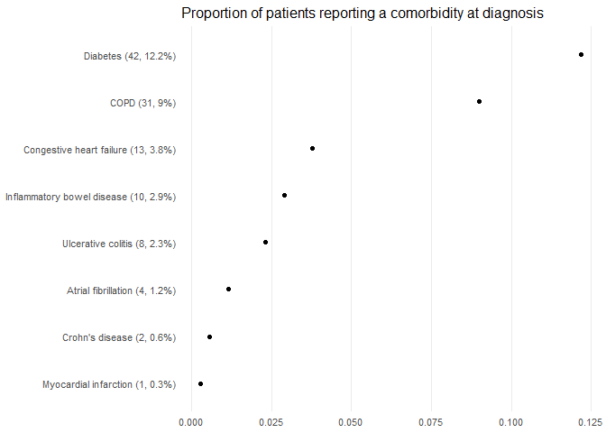

-   [Read data](#read-data)
-   [Descriptive summary](#descriptive-summary)
    -   [Medical history](#medical-history)
    -   [Patient characteristics](#patient-characteristics)
-   [Session info](#session-info)

``` r
library(rmarkdown)
library(ggplot2)
library(dplyr)
```

    ## 
    ## Attaching package: 'dplyr'

    ## The following objects are masked from 'package:stats':
    ## 
    ##     filter, lag

    ## The following objects are masked from 'package:base':
    ## 
    ##     intersect, setdiff, setequal, union

``` r
library(tidyr)
library(Hmisc)
```

    ## Loading required package: lattice

    ## Loading required package: survival

    ## Loading required package: Formula

    ## 
    ## Attaching package: 'Hmisc'

    ## The following objects are masked from 'package:dplyr':
    ## 
    ##     src, summarize

    ## The following objects are masked from 'package:base':
    ## 
    ##     format.pval, units

``` r
library(here)
```

    ## here() starts at C:/R/ida-regression-private

``` r
## Set global ggplot theme
theme_set(theme_light(base_size = 12))
```

Read data
---------

Load the CRS dataset.

``` r
load(here("data","a_crs.Rdata"))
```

Descriptive summary
===================

Univariate analyses.

Calculate the number of patients.

``` r
bigN <- nrow(crs)
print(bigN)
```

    ## [1] 345

Medical history
---------------

A summary of medical history measured at *diagnosis* (TODO: check when
medical history / comorbidities were assessed): \* AFib, \* MI \* CHF \*
Diabetes \* Crohn’s disease

Print out descriptive summary.

``` r
crs %>% 
  select(chf, afib, mi, diabetes, crohn, ulcercol, ibd) %>%
  Hmisc::describe()
```

    ## . 
    ## 
    ##  7  Variables      345  Observations
    ## --------------------------------------------------------------------------------
    ## chf : congesitive heart failure 
    ##        n  missing distinct 
    ##      345        0        2 
    ##                       
    ## Value          0     1
    ## Frequency    332    13
    ## Proportion 0.962 0.038
    ## --------------------------------------------------------------------------------
    ## afib : arterial fibrillation 
    ##        n  missing distinct 
    ##      345        0        2 
    ##                       
    ## Value          0     1
    ## Frequency    341     4
    ## Proportion 0.988 0.012
    ## --------------------------------------------------------------------------------
    ## mi : myocardio infarction 
    ##        n  missing distinct 
    ##      345        0        2 
    ##                       
    ## Value          0     1
    ## Frequency    344     1
    ## Proportion 0.997 0.003
    ## --------------------------------------------------------------------------------
    ## diabetes 
    ##        n  missing distinct 
    ##      345        0        2 
    ##                       
    ## Value          0     1
    ## Frequency    303    42
    ## Proportion 0.878 0.122
    ## --------------------------------------------------------------------------------
    ## crohn : Crohn's disease 
    ##        n  missing distinct 
    ##      345        0        2 
    ##                       
    ## Value          0     1
    ## Frequency    343     2
    ## Proportion 0.994 0.006
    ## --------------------------------------------------------------------------------
    ## ulcercol : ulceratie colitis 
    ##        n  missing distinct 
    ##      345        0        2 
    ##                       
    ## Value          0     1
    ## Frequency    337     8
    ## Proportion 0.977 0.023
    ## --------------------------------------------------------------------------------
    ## ibd : inflammatory bowel disease 
    ##        n  missing distinct 
    ##      345        0        2 
    ##                       
    ## Value          0     1
    ## Frequency    335    10
    ## Proportion 0.971 0.029
    ## --------------------------------------------------------------------------------

Plot of the distribution of patients with specific comorbidities
measured at diagnosis.

Process steps: \* Select comorbidities \* Transform data frame from wide
to long \* Transform and spell out factors for plotting \* Plot counts
by comorbidity

``` r
crs %>%
  select(id, chf, afib, diabetes, mi, copd, crohn, ulcercol, ibd) %>%
  pivot_longer(-id, names_to = "comorb", values_to = "value") %>%
  mutate(
    comorb = case_when(
      comorb == "chf" ~ "Congestive heart failure",
      comorb == "afib" ~ "Atrial fibrillation",
      comorb == "diabetes" ~ "Diabetes",
      comorb == "copd" ~ "COPD",
      comorb == "mi" ~ "Myocardial infarction",
      comorb == "crohn" ~ "Crohn's disease",
      comorb == "ulcercol" ~ "Ulcerative colitis",
      comorb == "ibd" ~ "Inflammatory bowel disease"
    ),
    value = case_when(value == "0" ~ "no",
                      value == "1" ~ "yes")
  ) %>%
  group_by(comorb, value) %>%
  summarise(n = n()) %>%
  mutate(
    inc = n / bigN,
    perc = n / bigN * 100,
    plot_lab = paste0('(', n, ', ', round(perc, digits = 1), '%)'),
    axis_lab = paste0(comorb, ' ', '(', n, ', ', round(perc, digits = 1), '%)')
  ) %>%
  filter(value == "yes") %>%
  ggplot(aes(reorder(axis_lab, inc), inc)) +
  geom_point() +
  coord_flip() +
  ggtitle("Proportion of patients reporting a comorbidity at diagnosis") +
  theme_minimal(base_size = 10) +
  theme(
    panel.grid.minor = element_blank(),
    panel.grid.major.y = element_blank(),
    axis.title = element_blank()
  )
```



Patient characteristics
-----------------------

TODO

Session info
============

``` r
sessionInfo()
```

    ## R version 3.5.3 (2019-03-11)
    ## Platform: x86_64-w64-mingw32/x64 (64-bit)
    ## Running under: Windows 10 x64 (build 17763)
    ## 
    ## Matrix products: default
    ## 
    ## locale:
    ## [1] LC_COLLATE=English_United States.1252 
    ## [2] LC_CTYPE=English_United States.1252   
    ## [3] LC_MONETARY=English_United States.1252
    ## [4] LC_NUMERIC=C                          
    ## [5] LC_TIME=English_United States.1252    
    ## 
    ## attached base packages:
    ## [1] stats     graphics  grDevices utils     datasets  methods   base     
    ## 
    ## other attached packages:
    ## [1] here_0.1          Hmisc_4.2-0       Formula_1.2-3     survival_2.44-1.1
    ## [5] lattice_0.20-38   tidyr_1.0.0       dplyr_0.8.3       ggplot2_3.2.1    
    ## [9] rmarkdown_1.12   
    ## 
    ## loaded via a namespace (and not attached):
    ##  [1] tidyselect_0.2.5    xfun_0.6            purrr_0.3.3        
    ##  [4] splines_3.5.3       colorspace_1.4-1    vctrs_0.2.1        
    ##  [7] htmltools_0.3.6     yaml_2.2.0          base64enc_0.1-3    
    ## [10] rlang_0.4.2         pillar_1.4.2        foreign_0.8-71     
    ## [13] glue_1.3.1          withr_2.1.2         RColorBrewer_1.1-2 
    ## [16] lifecycle_0.1.0     stringr_1.4.0       munsell_0.5.0      
    ## [19] gtable_0.3.0        htmlwidgets_1.3     evaluate_0.13      
    ## [22] labeling_0.3        latticeExtra_0.6-28 knitr_1.26         
    ## [25] htmlTable_1.13.1    Rcpp_1.0.1          acepack_1.4.1      
    ## [28] backports_1.1.3     scales_1.0.0        checkmate_1.9.1    
    ## [31] gridExtra_2.3       digest_0.6.20       stringi_1.4.3      
    ## [34] rprojroot_1.3-2     grid_3.5.3          tools_3.5.3        
    ## [37] magrittr_1.5        lazyeval_0.2.2      tibble_2.1.3       
    ## [40] cluster_2.0.7-1     crayon_1.3.4        pkgconfig_2.0.2    
    ## [43] zeallot_0.1.0       Matrix_1.2-17       data.table_1.12.2  
    ## [46] assertthat_0.2.1    rstudioapi_0.10     R6_2.4.0           
    ## [49] rpart_4.1-13        nnet_7.3-12         compiler_3.5.3
