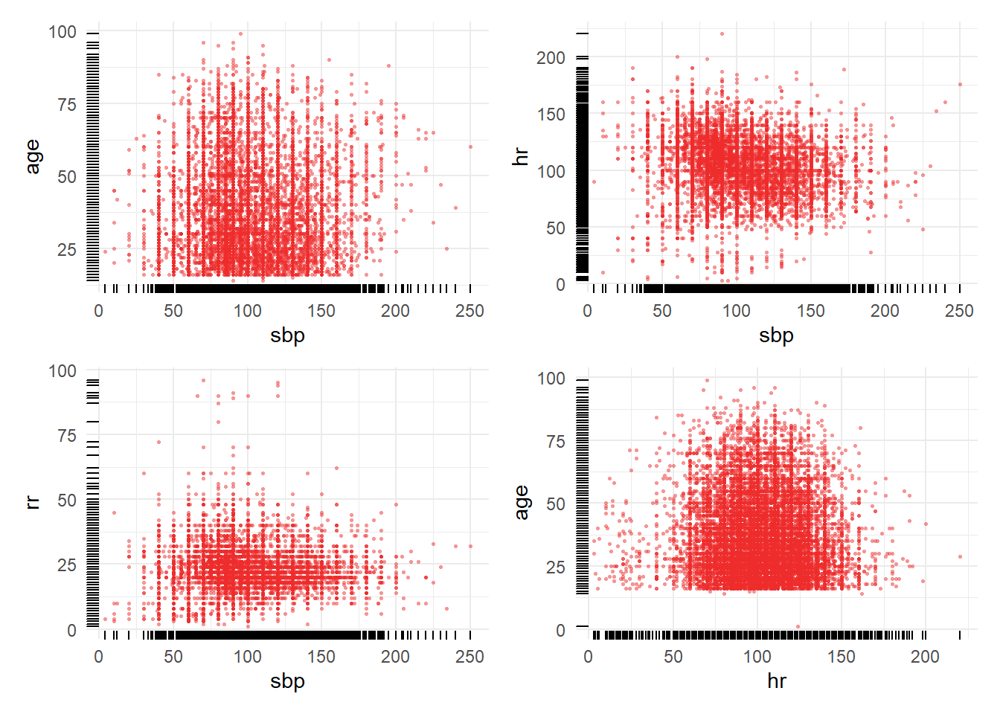
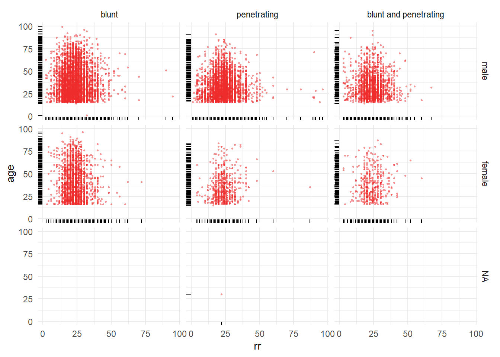
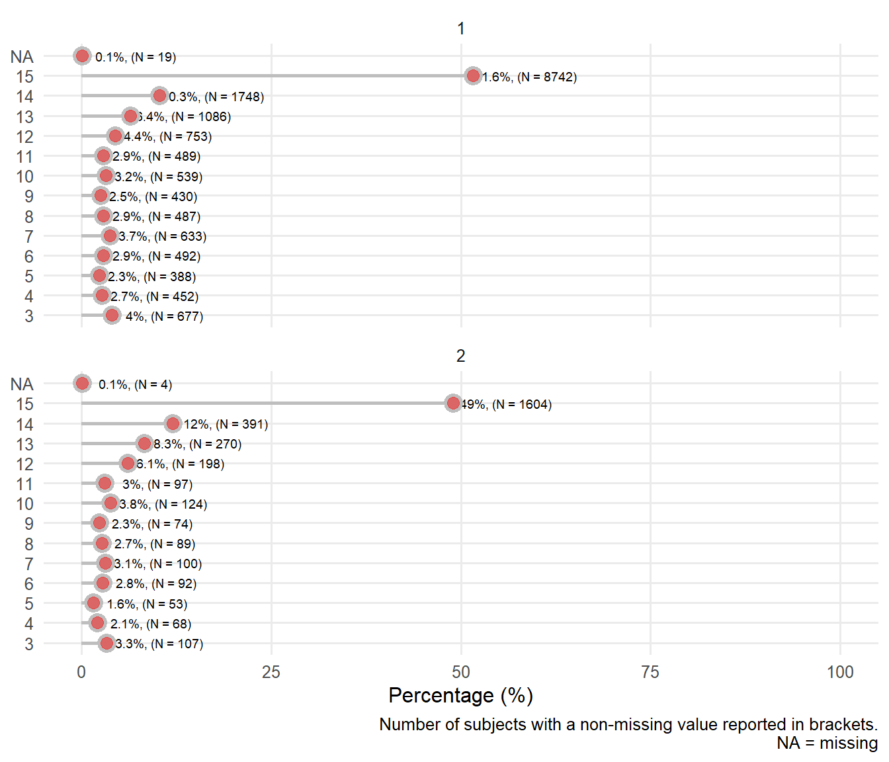

#  Multivariable/variate distributions


## Summary by sex


Table: Patient characteristics

|                            | male (N=16935) | female (N=3271) |
|:---------------------------|:--------------:|:---------------:|
|**Age**                     |                |                 |
|&nbsp;&nbsp;&nbsp;Median    |      30.0      |      35.0       |
|&nbsp;&nbsp;&nbsp;Mean      |      33.7      |      38.8       |
|&nbsp;&nbsp;&nbsp;SD        |      13.6      |      16.8       |
|&nbsp;&nbsp;&nbsp;Q1, Q3    |   23.0, 41.0   |   25.0, 50.0    |
|&nbsp;&nbsp;&nbsp;Range     |   1.0 - 99.0   |   15.0 - 96.0   |
|&nbsp;&nbsp;&nbsp;N-Miss    |       3        |        1        |
|**Heart Rate**              |                |                 |
|&nbsp;&nbsp;&nbsp;Median    |     105.0      |      106.0      |
|&nbsp;&nbsp;&nbsp;Mean      |     104.3      |      105.2      |
|&nbsp;&nbsp;&nbsp;SD        |      21.2      |      21.0       |
|&nbsp;&nbsp;&nbsp;Q1, Q3    |  90.0, 120.0   |   92.0, 120.0   |
|&nbsp;&nbsp;&nbsp;Range     |  3.0 - 198.0   |   3.0 - 220.0   |
|&nbsp;&nbsp;&nbsp;N-Miss    |       95       |       42        |
|**Respiratory Rate**        |                |                 |
|&nbsp;&nbsp;&nbsp;Median    |      22.0      |      22.0       |
|&nbsp;&nbsp;&nbsp;Mean      |      23.1      |      23.0       |
|&nbsp;&nbsp;&nbsp;SD        |      6.8       |       6.6       |
|&nbsp;&nbsp;&nbsp;Q1, Q3    |   20.0, 26.0   |   20.0, 26.0    |
|&nbsp;&nbsp;&nbsp;Range     |   1.0 - 96.0   |   3.0 - 87.0    |
|&nbsp;&nbsp;&nbsp;N-Miss    |      143       |       48        |
|**Systolic Blood Pressure** |                |                 |
|&nbsp;&nbsp;&nbsp;Median    |      95.0      |      90.0       |
|&nbsp;&nbsp;&nbsp;Mean      |      98.8      |      96.7       |
|&nbsp;&nbsp;&nbsp;SD        |      25.5      |      25.7       |
|&nbsp;&nbsp;&nbsp;Q1, Q3    |  80.0, 110.0   |   80.0, 110.0   |
|&nbsp;&nbsp;&nbsp;Range     |  4.0 - 240.0   |  20.0 - 250.0   |
|&nbsp;&nbsp;&nbsp;N-Miss    |      267       |       53        |

<!--html_preserve--><table class='gmisc_table' style='border-collapse: collapse; margin-top: 1em; margin-bottom: 1em;' >
<thead>
<tr><td colspan='4' style='text-align: left;'>
Baseline characteristics by sex.  </td></tr>
<tr>
<th style='font-weight: 900; border-bottom: 1px solid grey; border-top: 2px solid grey; width:26ex; text-align: center;'></th>
<th style='border-bottom: 1px solid grey; border-top: 2px solid grey; text-align: center;'>N<br></th>
<th style='border-bottom: 1px solid grey; border-top: 2px solid grey; text-align: center;'>male<br><i>N=16935</i></th>
<th style='border-bottom: 1px solid grey; border-top: 2px solid grey; text-align: center;'>female<br><i>N=3271</i></th>
</tr>
</thead>
<tbody>
<tr>
<td style='width:26ex; text-align: left;'><div style='float: left; text-align: left;'>Age</div><div style='float: right; text-align: right; font-family: Verdana; font-size:75%;'>years</div></td>
<td style='padding: 0 7px 0 7px; text-align: right;'>20203</td>
<td style='padding: 0 7px 0 7px; text-align: center;'>23.0 30.0 41.0<br>33.7 ± 13.6</td>
<td style='padding: 0 7px 0 7px; text-align: center;'>25.0 35.0 50.0<br>38.8 ± 16.8</td>
</tr>
<tr>
<td style='width:26ex; text-align: left;'><div style='float: left; text-align: left;'>Heart Rate</div><div style='float: right; text-align: right; font-family: Verdana; font-size:75%;'>/min</div></td>
<td style='padding: 0 7px 0 7px; text-align: right;'>20070</td>
<td style='padding: 0 7px 0 7px; text-align: center;'> 90.0 105.0 120.0<br>104.3 ±  21.2</td>
<td style='padding: 0 7px 0 7px; text-align: center;'> 92.0 106.0 120.0<br>105.2 ±  21.0</td>
</tr>
<tr>
<td style='width:26ex; text-align: left;'><div style='float: left; text-align: left;'>Respiratory Rate</div><div style='float: right; text-align: right; font-family: Verdana; font-size:75%;'>/min</div></td>
<td style='padding: 0 7px 0 7px; text-align: right;'>20016</td>
<td style='padding: 0 7px 0 7px; text-align: center;'>20.00 22.00 26.00<br>23.07 ±  6.77</td>
<td style='padding: 0 7px 0 7px; text-align: center;'>20.00 22.00 26.00<br>23.03 ±  6.58</td>
</tr>
<tr>
<td style='width:26ex; text-align: left;'><div style='float: left; text-align: left;'>Systolic Blood Pressure</div><div style='float: right; text-align: right; font-family: Verdana; font-size:75%;'>mmHg</div></td>
<td style='padding: 0 7px 0 7px; text-align: right;'>19887</td>
<td style='padding: 0 7px 0 7px; text-align: center;'> 80.0  95.0 110.0<br> 98.8 ±  25.5</td>
<td style='padding: 0 7px 0 7px; text-align: center;'> 80.0  90.0 110.0<br> 96.7 ±  25.7</td>
</tr>
<tr>
<td style='width:26ex; text-align: left;'><div style='float: left; text-align: left;'>Central Capillary Refille Time</div><div style='float: right; text-align: right; font-family: Verdana; font-size:75%;'>s</div></td>
<td style='padding: 0 7px 0 7px; text-align: right;'>19596</td>
<td style='padding: 0 7px 0 7px; text-align: center;'>2.00 3.00 4.00<br>3.27 ± 1.72</td>
<td style='padding: 0 7px 0 7px; text-align: center;'>2.00 3.00 4.00<br>3.23 ± 1.59</td>
</tr>
<tr>
<td style='width:26ex; text-align: left;'><div style='float: left; text-align: left;'>Glasgow Coma Score Total</div><div style='float: right; text-align: right; font-family: Verdana; font-size:75%;'>points</div></td>
<td style='padding: 0 7px 0 7px; text-align: right;'>20184</td>
<td style='padding: 0 7px 0 7px; text-align: center;'>11.00 15.00 15.00<br>12.44 ±  3.72</td>
<td style='padding: 0 7px 0 7px; text-align: center;'>12.00 14.00 15.00<br>12.62 ±  3.46</td>
</tr>
<tr>
<td style='width:26ex; text-align: left;'><div style='float: left; text-align: left;'>Hours Since Injury</div><div style='float: right; text-align: right; font-family: Verdana; font-size:75%;'>hours</div></td>
<td style='padding: 0 7px 0 7px; text-align: right;'>20196</td>
<td style='padding: 0 7px 0 7px; text-align: center;'>1.00 2.00 4.00<br>2.85 ± 2.39</td>
<td style='padding: 0 7px 0 7px; text-align: center;'>1.00 2.00 4.00<br>2.84 ± 2.67</td>
</tr>
<tr>
<td style='width:26ex; text-align: left;'>Injury type : blunt</td>
<td style='padding: 0 7px 0 7px; text-align: right;'>20207</td>
<td style='padding: 0 7px 0 7px; text-align: center;'>0.53 <span style="font-size: 80%;"><span style="font-size: 82%;"><sup>8962</sup>/<sub>16935</sub></span></span></td>
<td style='padding: 0 7px 0 7px; text-align: center;'>0.68 <span style="font-size: 80%;"><span style="font-size: 82%;"><sup>2227</sup>/<sub> 3271</sub></span></span></td>
</tr>
<tr>
<td style='width:26ex; text-align: left;'>  penetrating</td>
<td style='padding: 0 7px 0 7px; text-align: right;'></td>
<td style='padding: 0 7px 0 7px; text-align: center;'>0.35 <span style="font-size: 80%;"><span style="font-size: 82%;"><sup>5930</sup>/<sub>16935</sub></span></span></td>
<td style='padding: 0 7px 0 7px; text-align: center;'>0.19 <span style="font-size: 80%;"><span style="font-size: 82%;"><sup> 621</sup>/<sub> 3271</sub></span></span></td>
</tr>
<tr>
<td style='width:26ex; border-bottom: 2px solid grey; text-align: left;'>  blunt and penetrating</td>
<td style='padding: 0 7px 0 7px; border-bottom: 2px solid grey; text-align: right;'></td>
<td style='padding: 0 7px 0 7px; border-bottom: 2px solid grey; text-align: center;'>0.12 <span style="font-size: 80%;"><span style="font-size: 82%;"><sup>2043</sup>/<sub>16935</sub></span></span></td>
<td style='padding: 0 7px 0 7px; border-bottom: 2px solid grey; text-align: center;'>0.13 <span style="font-size: 80%;"><span style="font-size: 82%;"><sup> 423</sup>/<sub> 3271</sub></span></span></td>
</tr>
</tbody>
<tfoot><tr><td colspan='4'>
<span style="font-size: 80%;"><i>a</i></span> <i>b</i> <span style="font-size: 80%;"><i>c</i></span> represent the lower quartile <i>a</i>, the median <i>b</i>, and the upper quartile <i>c</i> for continuous variables. <i>x ± s</i> represents <span style="text-decoration: overline">X</span> ± 1 SD.   <i>N</i> is the number of non-missing values.</td></tr></tfoot>
</table><!--/html_preserve-->


## Continuous variables by sex

### Distribution of age by sex

<div class="figure">
<!--html_preserve--><div id="htmlwidget-e5a559d152b90be55edf" style="width:768px;height:250px;" class="plotly html-widget"></div>
<script type="application/json" data-for="htmlwidget-e5a559d152b90be55edf">{"x":{"visdat":{"1570847f97644":["function () ","plotlyVisDat"],"1570836eb6e1a":["function () ","data"],"157085a63440b":["function () ","data"],"1570828c740e1":["function () ","data"],"1570831541723":["function () ","data"],"157082fe26ca9":["function () ","data"],"157082801dbe":["function () ","data"],"157089c37e5e":["function () ","data"]},"cur_data":"157089c37e5e","attrs":{"1570836eb6e1a":{"alpha_stroke":1,"sizes":[10,100],"spans":[1,20],"x":{},"y":{},"xend":{},"yend":{},"type":"scatter","mode":"lines","text":{},"hoverinfo":"text","color":["black"],"name":"Histogram","legendgroup":"Histogram","showlegend":true,"inherit":true},"157085a63440b":{"alpha_stroke":1,"sizes":[10,100],"spans":[1,20],"x":{},"y":{},"type":"scatter","mode":"markers","color":["black"],"text":{},"hoverinfo":"text","size":[5],"name":"Mean","legendgroup":"Mean","showlegend":true,"inherit":true},"1570828c740e1":{"alpha_stroke":1,"sizes":[10,100],"spans":[1,20],"x":{},"y":{},"xend":{},"yend":{},"type":"scatter","mode":"lines","text":{},"hoverinfo":"text","name":"Median","legendgroup":"Median","showlegend":true,"color":["black"],"line":{"width":3},"inherit":true},"1570831541723":{"alpha_stroke":1,"sizes":[10,100],"spans":[1,20],"x":{},"y":{},"xend":{},"yend":{},"type":"scatter","mode":"lines","text":{},"hoverinfo":"text","name":"Quartiles","legendgroup":"Quartiles","showlegend":true,"color":["blue"],"line":{"width":2},"inherit":true},"157082fe26ca9":{"alpha_stroke":1,"sizes":[10,100],"spans":[1,20],"x":{},"y":{},"xend":{},"yend":{},"type":"scatter","mode":"lines","text":{},"hoverinfo":"text","name":"0.05, 0.95<br>Quantiles","legendgroup":"0.05, 0.95<br>Quantiles","showlegend":true,"color":["red"],"line":{"width":2},"inherit":true},"157082fe26ca9.1":{"alpha_stroke":1,"sizes":[10,100],"spans":[1,20],"x":{},"y":{},"xend":{},"yend":{},"type":"scatter","mode":"lines","hoverinfo":"none","showlegend":false,"alpha":0.3,"color":["red"],"legendgroup":"0.05, 0.95<br>Quantiles","name":"ignored","inherit":true},"157082fe26ca9.2":{"alpha_stroke":1,"sizes":[10,100],"spans":[1,20],"x":{},"y":{},"xend":{},"yend":{},"type":"scatter","mode":"lines","hoverinfo":"none","showlegend":false,"alpha":0.3,"color":["blue"],"legendgroup":"Quartiles","name":"ignored","inherit":true},"157082fe26ca9.3":{"alpha_stroke":1,"sizes":[10,100],"spans":[1,20],"x":{},"y":{},"xend":{},"yend":{},"type":"scatter","mode":"lines","hoverinfo":"none","showlegend":false,"alpha":0.3,"color":["red"],"legendgroup":"0.05, 0.95<br>Quantiles","name":"ignored","inherit":true},"157082801dbe":{"alpha_stroke":1,"sizes":[10,100],"spans":[1,20],"x":{},"y":{},"xend":{},"yend":{},"type":"scatter","mode":"lines","text":{},"hoverinfo":"text","color":["light gray"],"name":"Gini <span style=\"text-decoration: overline\">|Δ|<\/span>","legendgroup":"Gini <span style=\"text-decoration: overline\">|Δ|<\/span>","visible":"legendonly","showlegend":true,"inherit":true},"157089c37e5e":{"alpha_stroke":1,"sizes":[10,100],"spans":[1,20],"x":{},"y":{},"xend":{},"yend":{},"type":"scatter","mode":"lines","text":{},"hoverinfo":"text","color":["light blue"],"name":"SD","legendgroup":"SD","visible":"legendonly","showlegend":true,"inherit":true}},"layout":{"height":250,"margin":{"b":40,"l":70,"t":25,"r":10},"xaxis":{"domain":[0,1],"automargin":true,"title":"Age <span style='font-family:Verdana;font-size:75%;'>years<\/span>","zeroline":false},"yaxis":{"domain":[0,1],"automargin":true,"title":"","tickvals":[-1,-2],"ticktext":["male","female"]},"hovermode":"closest","showlegend":true},"source":"A","config":{"showSendToCloud":false},"data":[{"x":[1,1,null,14,14,null,15,15,null,16,16,null,17,17,null,18,18,null,19,19,null,20,20,null,21,21,null,22,22,null,23,23,null,24,24,null,25,25,null,26,26,null,27,27,null,28,28,null,29,29,null,30,30,null,31,31,null,32,32,null,33,33,null,34,34,null,35,35,null,36,36,null,37,37,null,38,38,null,39,39,null,40,40,null,41,41,null,42,42,null,43,43,null,44,44,null,45,45,null,46,46,null,47,47,null,48,48,null,49,49,null,50,50,null,51,51,null,52,52,null,53,53,null,54,54,null,55,55,null,56,56,null,57,57,null,58,58,null,59,59,null,60,60,null,61,61,null,62,62,null,63,63,null,64,64,null,65,65,null,66,66,null,67,67,null,68,68,null,69,69,null,70,70,null,71,71,null,72,72,null,73,73,null,74,74,null,75,75,null,76,76,null,77,77,null,78,78,null,79,79,null,80,80,null,81,81,null,82,82,null,83,83,null,84,84,null,85,85,null,86,86,null,87,87,null,88,88,null,89,89,null,90,90,null,91,91,null,92,92,null,94,94,null,95,95,null,96,96,null,99,99,null,15,15,null,16,16,null,17,17,null,18,18,null,19,19,null,20,20,null,21,21,null,22,22,null,23,23,null,24,24,null,25,25,null,26,26,null,27,27,null,28,28,null,29,29,null,30,30,null,31,31,null,32,32,null,33,33,null,34,34,null,35,35,null,36,36,null,37,37,null,38,38,null,39,39,null,40,40,null,41,41,null,42,42,null,43,43,null,44,44,null,45,45,null,46,46,null,47,47,null,48,48,null,49,49,null,50,50,null,51,51,null,52,52,null,53,53,null,54,54,null,55,55,null,56,56,null,57,57,null,58,58,null,59,59,null,60,60,null,61,61,null,62,62,null,63,63,null,64,64,null,65,65,null,66,66,null,67,67,null,68,68,null,69,69,null,70,70,null,71,71,null,72,72,null,73,73,null,74,74,null,75,75,null,76,76,null,77,77,null,78,78,null,79,79,null,80,80,null,81,81,null,82,82,null,83,83,null,84,84,null,85,85,null,86,86,null,87,87,null,88,88,null,89,89,null,91,91,null,95,95,null,96,96],"y":[-1,-0.999338478500551,null,-1,-0.998676957001102,null,-1,-0.998676957001102,null,-1,-0.763175303197354,null,-1,-0.778390297684675,null,-1,-0.609702315325248,null,-1,-0.648070562293275,null,-1,-0.529658213891951,null,-1,-0.671885336273429,null,-1,-0.560088202866593,null,-1,-0.595810363836825,null,-1,-0.601764057331863,null,-1,-0.4,null,-1,-0.663285556780595,null,-1,-0.648070562293275,null,-1,-0.601764057331863,null,-1,-0.714222712238148,null,-1,-0.413230429988975,null,-1,-0.804851157662624,null,-1,-0.69239250275634,null,-1,-0.790297684674752,null,-1,-0.788313120176406,null,-1,-0.560088202866593,null,-1,-0.798897464167585,null,-1,-0.825358324145535,null,-1,-0.763175303197354,null,-1,-0.85380374862183,null,-1,-0.595810363836825,null,-1,-0.888202866593164,null,-1,-0.822050716648291,null,-1,-0.863065049614112,null,-1,-0.890848952590959,null,-1,-0.694377067254686,null,-1,-0.89018743109151,null,-1,-0.87497243660419,null,-1,-0.8696802646086,null,-1,-0.904079382579934,null,-1,-0.778390297684675,null,-1,-0.922601984564498,null,-1,-0.903417861080485,null,-1,-0.914663726571114,null,-1,-0.935170893054024,null,-1,-0.860418963616318,null,-1,-0.933847850055127,null,-1,-0.945755237045204,null,-1,-0.936493936052922,null,-1,-0.952370452039691,null,-1,-0.894156560088203,null,-1,-0.959647188533627,null,-1,-0.966262403528115,null,-1,-0.966923925027563,null,-1,-0.977508269018743,null,-1,-0.929217199558986,null,-1,-0.978831312017641,null,-1,-0.974862183020948,null,-1,-0.972216097023153,null,-1,-0.975523704520397,null,-1,-0.930540242557883,null,-1,-0.98412348401323,null,-1,-0.980815876515987,null,-1,-0.987431091510474,null,-1,-0.988754134509372,null,-1,-0.976185226019846,null,-1,-0.987431091510474,null,-1,-0.98412348401323,null,-1,-0.991400220507166,null,-1,-0.993384785005513,null,-1,-0.987431091510474,null,-1,-0.995369349503859,null,-1,-0.994046306504961,null,-1,-0.995369349503859,null,-1,-0.996692392502756,null,-1,-0.996030871003308,null,-1,-0.998015435501654,null,-1,-0.998015435501654,null,-1,-0.997353914002205,null,-1,-0.998015435501654,null,-1,-0.998015435501654,null,-1,-0.999338478500551,null,-1,-0.999338478500551,null,-1,-0.999338478500551,null,-1,-0.999338478500551,null,-1,-0.999338478500551,null,-1,-0.999338478500551,null,-2,-1.99657465381386,null,-2,-1.70542022799227,null,-2,-1.76365111315659,null,-2,-1.66774141994477,null,-2,-1.72597230510909,null,-2,-1.64033865045568,null,-2,-1.75337507459818,null,-2,-1.72254695892295,null,-2,-1.74309903603977,null,-2,-1.77050180552886,null,-2,-1.53757826487159,null,-2,-1.71569626655068,null,-2,-1.72597230510909,null,-2,-1.68486815087545,null,-2,-1.79447922883182,null,-2,-1.472496687335,null,-2,-1.83900872925159,null,-2,-1.7362483436675,null,-2,-1.85613546018227,null,-2,-1.80818061357636,null,-2,-1.54785430343,null,-2,-1.84585942162386,null,-2,-1.85956080636841,null,-2,-1.79790457501795,null,-2,-1.86983684492682,null,-2,-1.58895845766364,null,-2,-1.8869635758575,null,-2,-1.81503130594864,null,-2,-1.90066496060205,null,-2,-1.89038892204364,null,-2,-1.59238380384977,null,-2,-1.88011288348523,null,-2,-1.86641149874068,null,-2,-1.83558338306545,null,-2,-1.8869635758575,null,-2,-1.65404003520023,null,-2,-1.88353822967136,null,-2,-1.8869635758575,null,-2,-1.89038892204364,null,-2,-1.91436634534659,null,-2,-1.79790457501795,null,-2,-1.91779169153273,null,-2,-1.92806773009114,null,-2,-1.86983684492682,null,-2,-1.93834376864955,null,-2,-1.76365111315659,null,-2,-1.96574653813864,null,-2,-1.91094099916045,null,-2,-1.95889584576636,null,-2,-1.9623211919525,null,-2,-1.79447922883182,null,-2,-1.95889584576636,null,-2,-1.924642383905,null,-2,-1.92806773009114,null,-2,-1.94861980720795,null,-2,-1.85956080636841,null,-2,-1.95547049958023,null,-2,-1.92806773009114,null,-2,-1.95889584576636,null,-2,-1.96917188432477,null,-2,-1.95889584576636,null,-2,-1.95889584576636,null,-2,-1.97602257669705,null,-2,-1.94861980720795,null,-2,-1.96574653813864,null,-2,-1.94519446102182,null,-2,-1.97602257669705,null,-2,-1.96917188432477,null,-2,-1.97602257669705,null,-2,-1.99314930762773,null,-2,-1.97944792288318,null,-2,-1.98629861525545,null,-2,-1.99314930762773,null,-2,-1.99314930762773,null,-2,-1.99657465381386,null,-2,-1.99657465381386,null,-2,-1.99657465381386,null,-2,-1.99657465381386],"type":"scatter","mode":"lines","text":["1<br>0<br>n=1","1<br>0<br>n=1",null,"14<br>0<br>n=2","14<br>0<br>n=2",null,"15<br>0<br>n=2","15<br>0<br>n=2",null,"16<br>0.021<br>n=358","16<br>0.021<br>n=358",null,"17<br>0.02<br>n=335","17<br>0.02<br>n=335",null,"18<br>0.035<br>n=590","18<br>0.035<br>n=590",null,"19<br>0.031<br>n=532","19<br>0.031<br>n=532",null,"20<br>0.042<br>n=711","20<br>0.042<br>n=711",null,"21<br>0.029<br>n=496","21<br>0.029<br>n=496",null,"22<br>0.039<br>n=665","22<br>0.039<br>n=665",null,"23<br>0.036<br>n=611","23<br>0.036<br>n=611",null,"24<br>0.036<br>n=602","24<br>0.036<br>n=602",null,"25<br>0.054<br>n=907","25<br>0.054<br>n=907",null,"26<br>0.03<br>n=509","26<br>0.03<br>n=509",null,"27<br>0.031<br>n=532","27<br>0.031<br>n=532",null,"28<br>0.036<br>n=602","28<br>0.036<br>n=602",null,"29<br>0.026<br>n=432","29<br>0.026<br>n=432",null,"30<br>0.052<br>n=887","30<br>0.052<br>n=887",null,"31<br>0.017<br>n=295","31<br>0.017<br>n=295",null,"32<br>0.027<br>n=465","32<br>0.027<br>n=465",null,"33<br>0.019<br>n=317","33<br>0.019<br>n=317",null,"34<br>0.019<br>n=320","34<br>0.019<br>n=320",null,"35<br>0.039<br>n=665","35<br>0.039<br>n=665",null,"36<br>0.018<br>n=304","36<br>0.018<br>n=304",null,"37<br>0.016<br>n=264","37<br>0.016<br>n=264",null,"38<br>0.021<br>n=358","38<br>0.021<br>n=358",null,"39<br>0.013<br>n=221","39<br>0.013<br>n=221",null,"40<br>0.036<br>n=611","40<br>0.036<br>n=611",null,"41<br>0.01<br>n=169","41<br>0.01<br>n=169",null,"42<br>0.016<br>n=269","42<br>0.016<br>n=269",null,"43<br>0.012<br>n=207","43<br>0.012<br>n=207",null,"44<br>0.01<br>n=165","44<br>0.01<br>n=165",null,"45<br>0.027<br>n=462","45<br>0.027<br>n=462",null,"46<br>0.01<br>n=166","46<br>0.01<br>n=166",null,"47<br>0.011<br>n=189","47<br>0.011<br>n=189",null,"48<br>0.012<br>n=197","48<br>0.012<br>n=197",null,"49<br>0.009<br>n=145","49<br>0.009<br>n=145",null,"50<br>0.02<br>n=335","50<br>0.02<br>n=335",null,"51<br>0.007<br>n=117","51<br>0.007<br>n=117",null,"52<br>0.009<br>n=146","52<br>0.009<br>n=146",null,"53<br>0.008<br>n=129","53<br>0.008<br>n=129",null,"54<br>0.006<br>n=98","54<br>0.006<br>n=98",null,"55<br>0.012<br>n=211","55<br>0.012<br>n=211",null,"56<br>0.006<br>n=100","56<br>0.006<br>n=100",null,"57<br>0.005<br>n=82","57<br>0.005<br>n=82",null,"58<br>0.006<br>n=96","58<br>0.006<br>n=96",null,"59<br>0.004<br>n=72","59<br>0.004<br>n=72",null,"60<br>0.009<br>n=160","60<br>0.009<br>n=160",null,"61<br>0.004<br>n=61","61<br>0.004<br>n=61",null,"62<br>0.003<br>n=51","62<br>0.003<br>n=51",null,"63<br>0.003<br>n=50","63<br>0.003<br>n=50",null,"64<br>0.002<br>n=34","64<br>0.002<br>n=34",null,"65<br>0.006<br>n=107","65<br>0.006<br>n=107",null,"66<br>0.002<br>n=32","66<br>0.002<br>n=32",null,"67<br>0.002<br>n=38","67<br>0.002<br>n=38",null,"68<br>0.002<br>n=42","68<br>0.002<br>n=42",null,"69<br>0.002<br>n=37","69<br>0.002<br>n=37",null,"70<br>0.006<br>n=105","70<br>0.006<br>n=105",null,"71<br>0.001<br>n=24","71<br>0.001<br>n=24",null,"72<br>0.002<br>n=29","72<br>0.002<br>n=29",null,"73<br>0.001<br>n=19","73<br>0.001<br>n=19",null,"74<br>0.001<br>n=17","74<br>0.001<br>n=17",null,"75<br>0.002<br>n=36","75<br>0.002<br>n=36",null,"76<br>0.001<br>n=19","76<br>0.001<br>n=19",null,"77<br>0.001<br>n=24","77<br>0.001<br>n=24",null,"78<br>0.001<br>n=13","78<br>0.001<br>n=13",null,"79<br>0.001<br>n=10","79<br>0.001<br>n=10",null,"80<br>0.001<br>n=19","80<br>0.001<br>n=19",null,"81<br>0<br>n=7","81<br>0<br>n=7",null,"82<br>0.001<br>n=9","82<br>0.001<br>n=9",null,"83<br>0<br>n=7","83<br>0<br>n=7",null,"84<br>0<br>n=5","84<br>0<br>n=5",null,"85<br>0<br>n=6","85<br>0<br>n=6",null,"86<br>0<br>n=3","86<br>0<br>n=3",null,"87<br>0<br>n=3","87<br>0<br>n=3",null,"88<br>0<br>n=4","88<br>0<br>n=4",null,"89<br>0<br>n=3","89<br>0<br>n=3",null,"90<br>0<br>n=3","90<br>0<br>n=3",null,"91<br>0<br>n=1","91<br>0<br>n=1",null,"92<br>0<br>n=1","92<br>0<br>n=1",null,"94<br>0<br>n=1","94<br>0<br>n=1",null,"95<br>0<br>n=1","95<br>0<br>n=1",null,"96<br>0<br>n=1","96<br>0<br>n=1",null,"99<br>0<br>n=1","99<br>0<br>n=1",null,"15<br>0<br>n=1","15<br>0<br>n=1",null,"16<br>0.026<br>n=86","16<br>0.026<br>n=86",null,"17<br>0.021<br>n=69","17<br>0.021<br>n=69",null,"18<br>0.03<br>n=97","18<br>0.03<br>n=97",null,"19<br>0.024<br>n=80","19<br>0.024<br>n=80",null,"20<br>0.032<br>n=105","20<br>0.032<br>n=105",null,"21<br>0.022<br>n=72","21<br>0.022<br>n=72",null,"22<br>0.025<br>n=81","22<br>0.025<br>n=81",null,"23<br>0.023<br>n=75","23<br>0.023<br>n=75",null,"24<br>0.02<br>n=67","24<br>0.02<br>n=67",null,"25<br>0.041<br>n=135","25<br>0.041<br>n=135",null,"26<br>0.025<br>n=83","26<br>0.025<br>n=83",null,"27<br>0.024<br>n=80","27<br>0.024<br>n=80",null,"28<br>0.028<br>n=92","28<br>0.028<br>n=92",null,"29<br>0.018<br>n=60","29<br>0.018<br>n=60",null,"30<br>0.047<br>n=154","30<br>0.047<br>n=154",null,"31<br>0.014<br>n=47","31<br>0.014<br>n=47",null,"32<br>0.024<br>n=77","32<br>0.024<br>n=77",null,"33<br>0.013<br>n=42","33<br>0.013<br>n=42",null,"34<br>0.017<br>n=56","34<br>0.017<br>n=56",null,"35<br>0.04<br>n=132","35<br>0.04<br>n=132",null,"36<br>0.014<br>n=45","36<br>0.014<br>n=45",null,"37<br>0.013<br>n=41","37<br>0.013<br>n=41",null,"38<br>0.018<br>n=59","38<br>0.018<br>n=59",null,"39<br>0.012<br>n=38","39<br>0.012<br>n=38",null,"40<br>0.037<br>n=120","40<br>0.037<br>n=120",null,"41<br>0.01<br>n=33","41<br>0.01<br>n=33",null,"42<br>0.017<br>n=54","42<br>0.017<br>n=54",null,"43<br>0.009<br>n=29","43<br>0.009<br>n=29",null,"44<br>0.01<br>n=32","44<br>0.01<br>n=32",null,"45<br>0.036<br>n=119","45<br>0.036<br>n=119",null,"46<br>0.011<br>n=35","46<br>0.011<br>n=35",null,"47<br>0.012<br>n=39","47<br>0.012<br>n=39",null,"48<br>0.015<br>n=48","48<br>0.015<br>n=48",null,"49<br>0.01<br>n=33","49<br>0.01<br>n=33",null,"50<br>0.031<br>n=101","50<br>0.031<br>n=101",null,"51<br>0.01<br>n=34","51<br>0.01<br>n=34",null,"52<br>0.01<br>n=33","52<br>0.01<br>n=33",null,"53<br>0.01<br>n=32","53<br>0.01<br>n=32",null,"54<br>0.008<br>n=25","54<br>0.008<br>n=25",null,"55<br>0.018<br>n=59","55<br>0.018<br>n=59",null,"56<br>0.007<br>n=24","56<br>0.007<br>n=24",null,"57<br>0.006<br>n=21","57<br>0.006<br>n=21",null,"58<br>0.012<br>n=38","58<br>0.012<br>n=38",null,"59<br>0.006<br>n=18","59<br>0.006<br>n=18",null,"60<br>0.021<br>n=69","60<br>0.021<br>n=69",null,"61<br>0.003<br>n=10","61<br>0.003<br>n=10",null,"62<br>0.008<br>n=26","62<br>0.008<br>n=26",null,"63<br>0.004<br>n=12","63<br>0.004<br>n=12",null,"64<br>0.003<br>n=11","64<br>0.003<br>n=11",null,"65<br>0.018<br>n=60","65<br>0.018<br>n=60",null,"66<br>0.004<br>n=12","66<br>0.004<br>n=12",null,"67<br>0.007<br>n=22","67<br>0.007<br>n=22",null,"68<br>0.006<br>n=21","68<br>0.006<br>n=21",null,"69<br>0.005<br>n=15","69<br>0.005<br>n=15",null,"70<br>0.013<br>n=41","70<br>0.013<br>n=41",null,"71<br>0.004<br>n=13","71<br>0.004<br>n=13",null,"72<br>0.006<br>n=21","72<br>0.006<br>n=21",null,"73<br>0.004<br>n=12","73<br>0.004<br>n=12",null,"74<br>0.003<br>n=9","74<br>0.003<br>n=9",null,"75<br>0.004<br>n=12","75<br>0.004<br>n=12",null,"76<br>0.004<br>n=12","76<br>0.004<br>n=12",null,"77<br>0.002<br>n=7","77<br>0.002<br>n=7",null,"78<br>0.005<br>n=15","78<br>0.005<br>n=15",null,"79<br>0.003<br>n=10","79<br>0.003<br>n=10",null,"80<br>0.005<br>n=16","80<br>0.005<br>n=16",null,"81<br>0.002<br>n=7","81<br>0.002<br>n=7",null,"82<br>0.003<br>n=9","82<br>0.003<br>n=9",null,"83<br>0.002<br>n=7","83<br>0.002<br>n=7",null,"84<br>0.001<br>n=2","84<br>0.001<br>n=2",null,"85<br>0.002<br>n=6","85<br>0.002<br>n=6",null,"86<br>0.001<br>n=4","86<br>0.001<br>n=4",null,"87<br>0.001<br>n=2","87<br>0.001<br>n=2",null,"88<br>0.001<br>n=2","88<br>0.001<br>n=2",null,"89<br>0<br>n=1","89<br>0<br>n=1",null,"91<br>0<br>n=1","91<br>0<br>n=1",null,"95<br>0<br>n=1","95<br>0<br>n=1",null,"96<br>0<br>n=1","96<br>0<br>n=1"],"hoverinfo":["text","text",null,"text","text",null,"text","text",null,"text","text",null,"text","text",null,"text","text",null,"text","text",null,"text","text",null,"text","text",null,"text","text",null,"text","text",null,"text","text",null,"text","text",null,"text","text",null,"text","text",null,"text","text",null,"text","text",null,"text","text",null,"text","text",null,"text","text",null,"text","text",null,"text","text",null,"text","text",null,"text","text",null,"text","text",null,"text","text",null,"text","text",null,"text","text",null,"text","text",null,"text","text",null,"text","text",null,"text","text",null,"text","text",null,"text","text",null,"text","text",null,"text","text",null,"text","text",null,"text","text",null,"text","text",null,"text","text",null,"text","text",null,"text","text",null,"text","text",null,"text","text",null,"text","text",null,"text","text",null,"text","text",null,"text","text",null,"text","text",null,"text","text",null,"text","text",null,"text","text",null,"text","text",null,"text","text",null,"text","text",null,"text","text",null,"text","text",null,"text","text",null,"text","text",null,"text","text",null,"text","text",null,"text","text",null,"text","text",null,"text","text",null,"text","text",null,"text","text",null,"text","text",null,"text","text",null,"text","text",null,"text","text",null,"text","text",null,"text","text",null,"text","text",null,"text","text",null,"text","text",null,"text","text",null,"text","text",null,"text","text",null,"text","text",null,"text","text",null,"text","text",null,"text","text",null,"text","text",null,"text","text",null,"text","text",null,"text","text",null,"text","text",null,"text","text",null,"text","text",null,"text","text",null,"text","text",null,"text","text",null,"text","text",null,"text","text",null,"text","text",null,"text","text",null,"text","text",null,"text","text",null,"text","text",null,"text","text",null,"text","text",null,"text","text",null,"text","text",null,"text","text",null,"text","text",null,"text","text",null,"text","text",null,"text","text",null,"text","text",null,"text","text",null,"text","text",null,"text","text",null,"text","text",null,"text","text",null,"text","text",null,"text","text",null,"text","text",null,"text","text",null,"text","text",null,"text","text",null,"text","text",null,"text","text",null,"text","text",null,"text","text",null,"text","text",null,"text","text",null,"text","text",null,"text","text",null,"text","text",null,"text","text",null,"text","text",null,"text","text",null,"text","text",null,"text","text",null,"text","text",null,"text","text",null,"text","text",null,"text","text",null,"text","text",null,"text","text",null,"text","text",null,"text","text",null,"text","text",null,"text","text",null,"text","text",null,"text","text",null,"text","text",null,"text","text",null,"text","text",null,"text","text",null,"text","text",null,"text","text",null,"text","text",null,"text","text",null,"text","text",null,"text","text",null,"text","text",null,"text","text",null,"text","text",null,"text","text",null,"text","text",null,"text","text"],"name":"Histogram","legendgroup":"Histogram","showlegend":true,"marker":{"color":"rgba(0,0,0,1)","line":{"color":"rgba(0,0,0,1)"}},"textfont":{"color":"rgba(0,0,0,1)"},"error_y":{"color":"rgba(0,0,0,1)"},"error_x":{"color":"rgba(0,0,0,1)"},"line":{"color":"rgba(0,0,0,1)"},"xaxis":"x","yaxis":"y","frame":null},{"x":[33.7453342782896,38.7733944954128],"y":[-1.225,-2.225],"type":"scatter","mode":"markers","text":["Mean:33.745<br>n=16932<br>3 missing","Mean:38.773<br>n=3270<br>1 missing"],"hoverinfo":["text","text"],"name":"Mean","legendgroup":"Mean","showlegend":true,"marker":{"color":"rgba(0,0,0,1)","size":[5,5],"sizemode":"area","line":{"color":"rgba(0,0,0,1)"}},"textfont":{"color":"rgba(0,0,0,1)","size":5},"error_y":{"color":"rgba(0,0,0,1)","width":5},"error_x":{"color":"rgba(0,0,0,1)","width":5},"line":{"color":"rgba(0,0,0,1)","width":5},"xaxis":"x","yaxis":"y","frame":null},{"x":[30,30,null,35,35],"y":[-1.4,-1.05,null,-2.4,-2.05],"type":"scatter","mode":"lines","text":["Q<sub>0.5<\/sub>:30","Q<sub>0.5<\/sub>:30",null,"Q<sub>0.5<\/sub>:35","Q<sub>0.5<\/sub>:35"],"hoverinfo":["text","text",null,"text","text"],"name":"Median","legendgroup":"Median","showlegend":true,"line":{"color":"rgba(0,0,0,1)","width":3},"marker":{"color":"rgba(0,0,0,1)","line":{"color":"rgba(0,0,0,1)"}},"textfont":{"color":"rgba(0,0,0,1)"},"error_y":{"color":"rgba(0,0,0,1)"},"error_x":{"color":"rgba(0,0,0,1)"},"xaxis":"x","yaxis":"y","frame":null},{"x":[23,23,null,41,41,null,25,25,null,50,50],"y":[-1.365,-1.085,null,-1.365,-1.085,null,-2.365,-2.085,null,-2.365,-2.085],"type":"scatter","mode":"lines","text":["Q<sub>0.25<\/sub>:23","Q<sub>0.25<\/sub>:23",null,"Q<sub>0.75<\/sub>:41","Q<sub>0.75<\/sub>:41",null,"Q<sub>0.25<\/sub>:25","Q<sub>0.25<\/sub>:25",null,"Q<sub>0.75<\/sub>:50","Q<sub>0.75<\/sub>:50"],"hoverinfo":["text","text",null,"text","text",null,"text","text",null,"text","text"],"name":"Quartiles","legendgroup":"Quartiles","showlegend":true,"line":{"color":"rgba(0,0,255,1)","width":2},"marker":{"color":"rgba(0,0,255,1)","line":{"color":"rgba(0,0,255,1)"}},"textfont":{"color":"rgba(0,0,255,1)"},"error_y":{"color":"rgba(0,0,255,1)"},"error_x":{"color":"rgba(0,0,255,1)"},"xaxis":"x","yaxis":"y","frame":null},{"x":[18,18,null,60,60,null,18,18,null,71,71],"y":[-1.337,-1.113,null,-1.337,-1.113,null,-2.337,-2.113,null,-2.337,-2.113],"type":"scatter","mode":"lines","text":["Q<sub>0.05<\/sub>:18","Q<sub>0.05<\/sub>:18",null,"Q<sub>0.95<\/sub>:60","Q<sub>0.95<\/sub>:60",null,"Q<sub>0.05<\/sub>:18","Q<sub>0.05<\/sub>:18",null,"Q<sub>0.95<\/sub>:71","Q<sub>0.95<\/sub>:71"],"hoverinfo":["text","text",null,"text","text",null,"text","text",null,"text","text"],"name":"0.05, 0.95<br>Quantiles","legendgroup":"0.05, 0.95<br>Quantiles","showlegend":true,"line":{"color":"rgba(255,0,0,1)","width":2},"marker":{"color":"rgba(255,0,0,1)","line":{"color":"rgba(255,0,0,1)"}},"textfont":{"color":"rgba(255,0,0,1)"},"error_y":{"color":"rgba(255,0,0,1)"},"error_x":{"color":"rgba(255,0,0,1)"},"xaxis":"x","yaxis":"y","frame":null},{"x":[18,23,null,18,25],"y":[-1.225,-1.225,null,-2.225,-2.225],"type":"scatter","mode":"lines","hoverinfo":["none","none",null,"none","none"],"showlegend":false,"legendgroup":"0.05, 0.95<br>Quantiles","name":"ignored","marker":{"color":"rgba(255,0,0,0.3)","line":{"color":"rgba(255,0,0,1)"}},"textfont":{"color":"rgba(255,0,0,0.3)"},"error_y":{"color":"rgba(255,0,0,0.3)"},"error_x":{"color":"rgba(255,0,0,0.3)"},"line":{"color":"rgba(255,0,0,0.3)"},"xaxis":"x","yaxis":"y","frame":null},{"x":[23,41,null,25,50],"y":[-1.225,-1.225,null,-2.225,-2.225],"type":"scatter","mode":"lines","hoverinfo":["none","none",null,"none","none"],"showlegend":false,"legendgroup":"Quartiles","name":"ignored","marker":{"color":"rgba(0,0,255,0.3)","line":{"color":"rgba(0,0,255,1)"}},"textfont":{"color":"rgba(0,0,255,0.3)"},"error_y":{"color":"rgba(0,0,255,0.3)"},"error_x":{"color":"rgba(0,0,255,0.3)"},"line":{"color":"rgba(0,0,255,0.3)"},"xaxis":"x","yaxis":"y","frame":null},{"x":[41,60,null,50,71],"y":[-1.225,-1.225,null,-2.225,-2.225],"type":"scatter","mode":"lines","hoverinfo":["none","none",null,"none","none"],"showlegend":false,"legendgroup":"0.05, 0.95<br>Quantiles","name":"ignored","marker":{"color":"rgba(255,0,0,0.3)","line":{"color":"rgba(255,0,0,1)"}},"textfont":{"color":"rgba(255,0,0,0.3)"},"error_y":{"color":"rgba(255,0,0,0.3)"},"error_x":{"color":"rgba(255,0,0,0.3)"},"line":{"color":"rgba(255,0,0,0.3)"},"xaxis":"x","yaxis":"y","frame":null},{"x":[1,15.7530045205228,null,1,19.8371704165626],"y":[-1.19,-1.19,null,-2.19,-2.19],"type":"scatter","mode":"lines","text":["Gini mean difference:14.753","Gini mean difference:14.753",null,"Gini mean difference:18.837","Gini mean difference:18.837"],"hoverinfo":["text","text",null,"text","text"],"name":"Gini <span style=\"text-decoration: overline\">|Δ|<\/span>","legendgroup":"Gini <span style=\"text-decoration: overline\">|Δ|<\/span>","visible":"legendonly","showlegend":true,"marker":{"color":"rgba(211,211,211,1)","line":{"color":"rgba(211,211,211,1)"}},"textfont":{"color":"rgba(211,211,211,1)"},"error_y":{"color":"rgba(211,211,211,1)"},"error_x":{"color":"rgba(211,211,211,1)"},"line":{"color":"rgba(211,211,211,1)"},"xaxis":"x","yaxis":"y","frame":null},{"x":[1,14.5653520083784,null,1,17.8396526657488],"y":[-1.23,-1.23,null,-2.23,-2.23],"type":"scatter","mode":"lines","text":["SD:13.565","SD:13.565",null,"SD:16.84","SD:16.84"],"hoverinfo":["text","text",null,"text","text"],"name":"SD","legendgroup":"SD","visible":"legendonly","showlegend":true,"marker":{"color":"rgba(173,216,230,1)","line":{"color":"rgba(173,216,230,1)"}},"textfont":{"color":"rgba(173,216,230,1)"},"error_y":{"color":"rgba(173,216,230,1)"},"error_x":{"color":"rgba(173,216,230,1)"},"line":{"color":"rgba(173,216,230,1)"},"xaxis":"x","yaxis":"y","frame":null}],"highlight":{"on":"plotly_click","persistent":false,"dynamic":false,"selectize":false,"opacityDim":0.2,"selected":{"opacity":1},"debounce":0},"shinyEvents":["plotly_hover","plotly_click","plotly_selected","plotly_relayout","plotly_brushed","plotly_brushing","plotly_clickannotation","plotly_doubleclick","plotly_deselect","plotly_afterplot","plotly_sunburstclick"],"base_url":"https://plot.ly"},"evals":[],"jsHooks":[]}</script><!--/html_preserve-->
<p class="caption">Distribution of age by sex</p>
</div>

### Distribution of systolic blood pressure by sex


<div class="figure">
<!--html_preserve--><div id="htmlwidget-bbe0462a4ed1d217a6f6" style="width:768px;height:250px;" class="plotly html-widget"></div>
<script type="application/json" data-for="htmlwidget-bbe0462a4ed1d217a6f6">{"x":{"visdat":{"15708242f3b31":["function () ","plotlyVisDat"],"15708466e33a3":["function () ","data"],"1570853042946":["function () ","data"],"157083e263325":["function () ","data"],"157081d6510ad":["function () ","data"],"1570850d4d81":["function () ","data"],"157086617894":["function () ","data"],"15708d156175":["function () ","data"]},"cur_data":"15708d156175","attrs":{"15708466e33a3":{"alpha_stroke":1,"sizes":[10,100],"spans":[1,20],"x":{},"y":{},"xend":{},"yend":{},"type":"scatter","mode":"lines","text":{},"hoverinfo":"text","color":["black"],"name":"Histogram","legendgroup":"Histogram","showlegend":true,"inherit":true},"1570853042946":{"alpha_stroke":1,"sizes":[10,100],"spans":[1,20],"x":{},"y":{},"type":"scatter","mode":"markers","color":["black"],"text":{},"hoverinfo":"text","size":[5],"name":"Mean","legendgroup":"Mean","showlegend":true,"inherit":true},"157083e263325":{"alpha_stroke":1,"sizes":[10,100],"spans":[1,20],"x":{},"y":{},"xend":{},"yend":{},"type":"scatter","mode":"lines","text":{},"hoverinfo":"text","name":"Median","legendgroup":"Median","showlegend":true,"color":["black"],"line":{"width":3},"inherit":true},"157081d6510ad":{"alpha_stroke":1,"sizes":[10,100],"spans":[1,20],"x":{},"y":{},"xend":{},"yend":{},"type":"scatter","mode":"lines","text":{},"hoverinfo":"text","name":"Quartiles","legendgroup":"Quartiles","showlegend":true,"color":["blue"],"line":{"width":2},"inherit":true},"1570850d4d81":{"alpha_stroke":1,"sizes":[10,100],"spans":[1,20],"x":{},"y":{},"xend":{},"yend":{},"type":"scatter","mode":"lines","text":{},"hoverinfo":"text","name":"0.05, 0.95<br>Quantiles","legendgroup":"0.05, 0.95<br>Quantiles","showlegend":true,"color":["red"],"line":{"width":2},"inherit":true},"1570850d4d81.1":{"alpha_stroke":1,"sizes":[10,100],"spans":[1,20],"x":{},"y":{},"xend":{},"yend":{},"type":"scatter","mode":"lines","hoverinfo":"none","showlegend":false,"alpha":0.3,"color":["red"],"legendgroup":"0.05, 0.95<br>Quantiles","name":"ignored","inherit":true},"1570850d4d81.2":{"alpha_stroke":1,"sizes":[10,100],"spans":[1,20],"x":{},"y":{},"xend":{},"yend":{},"type":"scatter","mode":"lines","hoverinfo":"none","showlegend":false,"alpha":0.3,"color":["blue"],"legendgroup":"Quartiles","name":"ignored","inherit":true},"1570850d4d81.3":{"alpha_stroke":1,"sizes":[10,100],"spans":[1,20],"x":{},"y":{},"xend":{},"yend":{},"type":"scatter","mode":"lines","hoverinfo":"none","showlegend":false,"alpha":0.3,"color":["red"],"legendgroup":"0.05, 0.95<br>Quantiles","name":"ignored","inherit":true},"157086617894":{"alpha_stroke":1,"sizes":[10,100],"spans":[1,20],"x":{},"y":{},"xend":{},"yend":{},"type":"scatter","mode":"lines","text":{},"hoverinfo":"text","color":["light gray"],"name":"Gini <span style=\"text-decoration: overline\">|Δ|<\/span>","legendgroup":"Gini <span style=\"text-decoration: overline\">|Δ|<\/span>","visible":"legendonly","showlegend":true,"inherit":true},"15708d156175":{"alpha_stroke":1,"sizes":[10,100],"spans":[1,20],"x":{},"y":{},"xend":{},"yend":{},"type":"scatter","mode":"lines","text":{},"hoverinfo":"text","color":["light blue"],"name":"SD","legendgroup":"SD","visible":"legendonly","showlegend":true,"inherit":true}},"layout":{"height":250,"margin":{"b":40,"l":70,"t":25,"r":10},"xaxis":{"domain":[0,1],"automargin":true,"title":"Systolic Blood Pressure <span style='font-family:Verdana;font-size:75%;'>mmHg<\/span>","zeroline":false},"yaxis":{"domain":[0,1],"automargin":true,"title":"","tickvals":[-1,-2],"ticktext":["male","female"]},"hovermode":"closest","showlegend":true},"source":"A","config":{"showSendToCloud":false},"data":[{"x":[4,4,null,10,10,null,12,12,null,20,20,null,25,25,null,30,30,null,33,33,null,35,35,null,36,36,null,38,38,null,39,39,null,40,40,null,41,41,null,42,42,null,43,43,null,44,44,null,45,45,null,47,47,null,48,48,null,49,49,null,50,50,null,52,52,null,53,53,null,54,54,null,55,55,null,56,56,null,57,57,null,58,58,null,59,59,null,60,60,null,61,61,null,62,62,null,63,63,null,64,64,null,65,65,null,66,66,null,67,67,null,68,68,null,69,69,null,70,70,null,71,71,null,72,72,null,73,73,null,74,74,null,75,75,null,76,76,null,77,77,null,78,78,null,79,79,null,80,80,null,81,81,null,82,82,null,83,83,null,84,84,null,85,85,null,86,86,null,87,87,null,88,88,null,89,89,null,90,90,null,91,91,null,92,92,null,93,93,null,94,94,null,95,95,null,96,96,null,97,97,null,98,98,null,99,99,null,100,100,null,101,101,null,102,102,null,103,103,null,104,104,null,105,105,null,106,106,null,107,107,null,108,108,null,109,109,null,110,110,null,111,111,null,112,112,null,113,113,null,114,114,null,115,115,null,116,116,null,117,117,null,118,118,null,119,119,null,120,120,null,121,121,null,122,122,null,123,123,null,124,124,null,125,125,null,126,126,null,127,127,null,128,128,null,129,129,null,130,130,null,131,131,null,132,132,null,133,133,null,134,134,null,135,135,null,136,136,null,137,137,null,138,138,null,139,139,null,140,140,null,141,141,null,142,142,null,143,143,null,144,144,null,145,145,null,146,146,null,147,147,null,148,148,null,149,149,null,150,150,null,151,151,null,152,152,null,153,153,null,154,154,null,155,155,null,156,156,null,157,157,null,158,158,null,159,159,null,160,160,null,161,161,null,162,162,null,163,163,null,164,164,null,165,165,null,166,166,null,167,167,null,168,168,null,169,169,null,170,170,null,171,171,null,172,172,null,173,173,null,174,174,null,175,175,null,176,176,null,178,178,null,179,179,null,180,180,null,182,182,null,183,183,null,184,184,null,185,185,null,186,186,null,188,188,null,189,189,null,190,190,null,191,191,null,192,192,null,195,195,null,200,200,null,204,204,null,205,205,null,208,208,null,210,210,null,215,215,null,220,220,null,225,225,null,230,230,null,234,234,null,240,240,null,20,20,null,30,30,null,35,35,null,38,38,null,40,40,null,45,45,null,46,46,null,47,47,null,50,50,null,53,53,null,55,55,null,56,56,null,59,59,null,60,60,null,61,61,null,62,62,null,63,63,null,65,65,null,66,66,null,67,67,null,68,68,null,69,69,null,70,70,null,71,71,null,72,72,null,73,73,null,74,74,null,75,75,null,76,76,null,77,77,null,78,78,null,79,79,null,80,80,null,81,81,null,82,82,null,83,83,null,84,84,null,85,85,null,86,86,null,87,87,null,88,88,null,89,89,null,90,90,null,91,91,null,92,92,null,93,93,null,94,94,null,95,95,null,96,96,null,97,97,null,98,98,null,99,99,null,100,100,null,101,101,null,102,102,null,103,103,null,104,104,null,105,105,null,106,106,null,107,107,null,108,108,null,109,109,null,110,110,null,111,111,null,112,112,null,113,113,null,114,114,null,115,115,null,116,116,null,117,117,null,118,118,null,119,119,null,120,120,null,121,121,null,122,122,null,123,123,null,124,124,null,125,125,null,126,126,null,127,127,null,128,128,null,129,129,null,130,130,null,131,131,null,132,132,null,133,133,null,134,134,null,135,135,null,136,136,null,138,138,null,139,139,null,140,140,null,141,141,null,142,142,null,143,143,null,144,144,null,145,145,null,146,146,null,148,148,null,149,149,null,150,150,null,153,153,null,154,154,null,158,158,null,159,159,null,160,160,null,163,163,null,165,165,null,166,166,null,170,170,null,171,171,null,174,174,null,180,180,null,185,185,null,186,186,null,190,190,null,200,200,null,205,205,null,210,210,null,220,220,null,250,250],"y":[-1,-0.999802761341223,null,-1,-0.999013806706114,null,-1,-0.999802761341223,null,-1,-0.998422090729783,null,-1,-0.999802761341223,null,-1,-0.995266272189349,null,-1,-0.999802761341223,null,-1,-0.999802761341223,null,-1,-0.999605522682446,null,-1,-0.999802761341223,null,-1,-0.999802761341223,null,-1,-0.969230769230769,null,-1,-0.999802761341223,null,-1,-0.999802761341223,null,-1,-0.999802761341223,null,-1,-0.999408284023669,null,-1,-0.99861932938856,null,-1,-0.999605522682446,null,-1,-0.999605522682446,null,-1,-0.999408284023669,null,-1,-0.957790927021696,null,-1,-0.99861932938856,null,-1,-0.999211045364891,null,-1,-0.998816568047337,null,-1,-0.994477317554241,null,-1,-0.998224852071006,null,-1,-0.999408284023669,null,-1,-0.999013806706114,null,-1,-0.999605522682446,null,-1,-0.881656804733728,null,-1,-0.998816568047337,null,-1,-0.999211045364891,null,-1,-0.998224852071006,null,-1,-0.996844181459566,null,-1,-0.989940828402367,null,-1,-0.996252465483235,null,-1,-0.998422090729783,null,-1,-0.996646942800789,null,-1,-0.999013806706114,null,-1,-0.814201183431953,null,-1,-0.997830374753452,null,-1,-0.995660749506903,null,-1,-0.997633136094675,null,-1,-0.993096646942801,null,-1,-0.981459566074951,null,-1,-0.988757396449704,null,-1,-0.99723865877712,null,-1,-0.991715976331361,null,-1,-0.997830374753452,null,-1,-0.622485207100592,null,-1,-0.997830374753452,null,-1,-0.990138067061144,null,-1,-0.995463510848126,null,-1,-0.984023668639053,null,-1,-0.954832347140039,null,-1,-0.971005917159763,null,-1,-0.995266272189349,null,-1,-0.976923076923077,null,-1,-0.994477317554241,null,-1,-0.4,null,-1,-0.997633136094675,null,-1,-0.990927021696252,null,-1,-0.997041420118343,null,-1,-0.98974358974359,null,-1,-0.970808678500986,null,-1,-0.980473372781065,null,-1,-0.996449704142012,null,-1,-0.989151873767258,null,-1,-0.995463510848126,null,-1,-0.551479289940828,null,-1,-0.997633136094675,null,-1,-0.994674556213018,null,-1,-0.996646942800789,null,-1,-0.992702169625247,null,-1,-0.981656804733728,null,-1,-0.989151873767258,null,-1,-0.995463510848126,null,-1,-0.991321499013807,null,-1,-0.995660749506903,null,-1,-0.710059171597633,null,-1,-0.996844181459566,null,-1,-0.995463510848126,null,-1,-0.994477317554241,null,-1,-0.994082840236686,null,-1,-0.985798816568047,null,-1,-0.991518737672584,null,-1,-0.995660749506903,null,-1,-0.994477317554241,null,-1,-0.996844181459566,null,-1,-0.78974358974359,null,-1,-0.996449704142012,null,-1,-0.994477317554241,null,-1,-0.995660749506903,null,-1,-0.993885601577909,null,-1,-0.991518737672584,null,-1,-0.992702169625247,null,-1,-0.996252465483235,null,-1,-0.994477317554241,null,-1,-0.996055226824458,null,-1,-0.849112426035503,null,-1,-0.996055226824458,null,-1,-0.995463510848126,null,-1,-0.995660749506903,null,-1,-0.995660749506903,null,-1,-0.990927021696252,null,-1,-0.994674556213018,null,-1,-0.994674556213018,null,-1,-0.996252465483235,null,-1,-0.995266272189349,null,-1,-0.901972386587771,null,-1,-0.996449704142012,null,-1,-0.996449704142012,null,-1,-0.996055226824458,null,-1,-0.998422090729783,null,-1,-0.992899408284024,null,-1,-0.996844181459566,null,-1,-0.99723865877712,null,-1,-0.998027613412229,null,-1,-0.998422090729783,null,-1,-0.947337278106509,null,-1,-0.998816568047337,null,-1,-0.998027613412229,null,-1,-0.999802761341223,null,-1,-0.99723865877712,null,-1,-0.996449704142012,null,-1,-0.998422090729783,null,-1,-0.99861932938856,null,-1,-0.997830374753452,null,-1,-0.999211045364891,null,-1,-0.970414201183432,null,-1,-0.999013806706114,null,-1,-0.997435897435897,null,-1,-0.999408284023669,null,-1,-0.999605522682446,null,-1,-0.997830374753452,null,-1,-0.999211045364891,null,-1,-0.999408284023669,null,-1,-0.999211045364891,null,-1,-0.999408284023669,null,-1,-0.986587771203156,null,-1,-0.999605522682446,null,-1,-0.99861932938856,null,-1,-0.999013806706114,null,-1,-0.999211045364891,null,-1,-0.999802761341223,null,-1,-0.999802761341223,null,-1,-0.999605522682446,null,-1,-0.999408284023669,null,-1,-0.990335305719921,null,-1,-0.999408284023669,null,-1,-0.999802761341223,null,-1,-0.999605522682446,null,-1,-0.999211045364891,null,-1,-0.999802761341223,null,-1,-0.999211045364891,null,-1,-0.999013806706114,null,-1,-0.996055226824458,null,-1,-0.999802761341223,null,-1,-0.999802761341223,null,-1,-0.999802761341223,null,-1,-0.997435897435897,null,-1,-0.999802761341223,null,-1,-0.999802761341223,null,-1,-0.999802761341223,null,-1,-0.999802761341223,null,-1,-0.999605522682446,null,-1,-0.999605522682446,null,-1,-0.999605522682446,null,-1,-0.999802761341223,null,-1,-0.999802761341223,null,-1,-0.999802761341223,null,-2,-1.995913519,null,-2,-1.99489189875,null,-2,-1.99897837975,null,-2,-1.99897837975,null,-2,-1.95811356975004,null,-2,-1.9979567595,null,-2,-1.99897837975,null,-2,-1.99897837975,null,-2,-1.95300546850004,null,-2,-1.9979567595,null,-2,-1.98876217725001,null,-2,-1.9979567595,null,-2,-1.99897837975,null,-2,-1.87025422825012,null,-2,-1.99897837975,null,-2,-1.99897837975,null,-2,-1.9979567595,null,-2,-1.98263245575002,null,-2,-1.99693513925,null,-2,-1.99693513925,null,-2,-1.9979567595,null,-2,-1.9979567595,null,-2,-1.78954622850019,null,-2,-1.9979567595,null,-2,-1.98978379750001,null,-2,-1.995913519,null,-2,-1.99080541775001,null,-2,-1.97445949375002,null,-2,-1.99182703800001,null,-2,-1.99693513925,null,-2,-1.99182703800001,null,-2,-1.99897837975,null,-2,-1.60871944425035,null,-2,-1.9979567595,null,-2,-1.98263245575002,null,-2,-1.99693513925,null,-2,-1.97241625325002,null,-2,-1.94891898750005,null,-2,-1.97037301275003,null,-2,-1.99387027850001,null,-2,-1.98058921525002,null,-2,-1.99182703800001,null,-2,-1.43504400175051,null,-2,-1.995913519,null,-2,-1.99182703800001,null,-2,-1.99693513925,null,-2,-1.99182703800001,null,-2,-1.96322167100003,null,-2,-1.98161083550002,null,-2,-1.995913519,null,-2,-1.98876217725001,null,-2,-1.99387027850001,null,-2,-1.53924926725041,null,-2,-1.995913519,null,-2,-1.99284865825001,null,-2,-1.995913519,null,-2,-1.98774055700001,null,-2,-1.97445949375002,null,-2,-1.99489189875,null,-2,-1.9979567595,null,-2,-1.99693513925,null,-2,-1.995913519,null,-2,-1.71394633000026,null,-2,-1.99693513925,null,-2,-1.99080541775001,null,-2,-1.99387027850001,null,-2,-1.99284865825001,null,-2,-1.98569731650001,null,-2,-1.99284865825001,null,-2,-1.995913519,null,-2,-1.99489189875,null,-2,-1.99693513925,null,-2,-1.79874081075018,null,-2,-1.995913519,null,-2,-1.9979567595,null,-2,-1.99387027850001,null,-2,-1.99182703800001,null,-2,-1.98774055700001,null,-2,-1.9979567595,null,-2,-1.99693513925,null,-2,-1.99693513925,null,-2,-1.99284865825001,null,-2,-1.86616774725012,null,-2,-1.995913519,null,-2,-1.9979567595,null,-2,-1.9979567595,null,-2,-1.9979567595,null,-2,-1.99387027850001,null,-2,-1.99897837975,null,-2,-1.99387027850001,null,-2,-1.9979567595,null,-2,-1.93461630400006,null,-2,-1.99897837975,null,-2,-1.9979567595,null,-2,-1.99693513925,null,-2,-1.9979567595,null,-2,-1.99489189875,null,-2,-1.9979567595,null,-2,-1.99897837975,null,-2,-1.9979567595,null,-2,-1.95709194950004,null,-2,-1.99897837975,null,-2,-1.99897837975,null,-2,-1.99897837975,null,-2,-1.9979567595,null,-2,-1.96730815200003,null,-2,-1.99897837975,null,-2,-1.9979567595,null,-2,-1.99897837975,null,-2,-1.98263245575002,null,-2,-1.99897837975,null,-2,-1.99897837975,null,-2,-1.98978379750001,null,-2,-1.99897837975,null,-2,-1.99897837975,null,-2,-1.98978379750001,null,-2,-1.995913519,null,-2,-1.9979567595,null,-2,-1.99897837975,null,-2,-1.9979567595,null,-2,-1.99897837975],"type":"scatter","mode":"lines","text":["4<br>0<br>n=1","4<br>0<br>n=1",null,"10<br>0<br>n=5","10<br>0<br>n=5",null,"12<br>0<br>n=1","12<br>0<br>n=1",null,"20<br>0<br>n=8","20<br>0<br>n=8",null,"25<br>0<br>n=1","25<br>0<br>n=1",null,"30<br>0.001<br>n=24","30<br>0.001<br>n=24",null,"33<br>0<br>n=1","33<br>0<br>n=1",null,"35<br>0<br>n=1","35<br>0<br>n=1",null,"36<br>0<br>n=2","36<br>0<br>n=2",null,"38<br>0<br>n=1","38<br>0<br>n=1",null,"39<br>0<br>n=1","39<br>0<br>n=1",null,"40<br>0.009<br>n=156","40<br>0.009<br>n=156",null,"41<br>0<br>n=1","41<br>0<br>n=1",null,"42<br>0<br>n=1","42<br>0<br>n=1",null,"43<br>0<br>n=1","43<br>0<br>n=1",null,"44<br>0<br>n=3","44<br>0<br>n=3",null,"45<br>0<br>n=7","45<br>0<br>n=7",null,"47<br>0<br>n=2","47<br>0<br>n=2",null,"48<br>0<br>n=2","48<br>0<br>n=2",null,"49<br>0<br>n=3","49<br>0<br>n=3",null,"50<br>0.013<br>n=214","50<br>0.013<br>n=214",null,"52<br>0<br>n=7","52<br>0<br>n=7",null,"53<br>0<br>n=4","53<br>0<br>n=4",null,"54<br>0<br>n=6","54<br>0<br>n=6",null,"55<br>0.002<br>n=28","55<br>0.002<br>n=28",null,"56<br>0.001<br>n=9","56<br>0.001<br>n=9",null,"57<br>0<br>n=3","57<br>0<br>n=3",null,"58<br>0<br>n=5","58<br>0<br>n=5",null,"59<br>0<br>n=2","59<br>0<br>n=2",null,"60<br>0.036<br>n=600","60<br>0.036<br>n=600",null,"61<br>0<br>n=6","61<br>0<br>n=6",null,"62<br>0<br>n=4","62<br>0<br>n=4",null,"63<br>0.001<br>n=9","63<br>0.001<br>n=9",null,"64<br>0.001<br>n=16","64<br>0.001<br>n=16",null,"65<br>0.003<br>n=51","65<br>0.003<br>n=51",null,"66<br>0.001<br>n=19","66<br>0.001<br>n=19",null,"67<br>0<br>n=8","67<br>0<br>n=8",null,"68<br>0.001<br>n=17","68<br>0.001<br>n=17",null,"69<br>0<br>n=5","69<br>0<br>n=5",null,"70<br>0.057<br>n=942","70<br>0.057<br>n=942",null,"71<br>0.001<br>n=11","71<br>0.001<br>n=11",null,"72<br>0.001<br>n=22","72<br>0.001<br>n=22",null,"73<br>0.001<br>n=12","73<br>0.001<br>n=12",null,"74<br>0.002<br>n=35","74<br>0.002<br>n=35",null,"75<br>0.006<br>n=94","75<br>0.006<br>n=94",null,"76<br>0.003<br>n=57","76<br>0.003<br>n=57",null,"77<br>0.001<br>n=14","77<br>0.001<br>n=14",null,"78<br>0.003<br>n=42","78<br>0.003<br>n=42",null,"79<br>0.001<br>n=11","79<br>0.001<br>n=11",null,"80<br>0.115<br>n=1914","80<br>0.115<br>n=1914",null,"81<br>0.001<br>n=11","81<br>0.001<br>n=11",null,"82<br>0.003<br>n=50","82<br>0.003<br>n=50",null,"83<br>0.001<br>n=23","83<br>0.001<br>n=23",null,"84<br>0.005<br>n=81","84<br>0.005<br>n=81",null,"85<br>0.014<br>n=229","85<br>0.014<br>n=229",null,"86<br>0.009<br>n=147","86<br>0.009<br>n=147",null,"87<br>0.001<br>n=24","87<br>0.001<br>n=24",null,"88<br>0.007<br>n=117","88<br>0.007<br>n=117",null,"89<br>0.002<br>n=28","89<br>0.002<br>n=28",null,"90<br>0.183<br>n=3042","90<br>0.183<br>n=3042",null,"91<br>0.001<br>n=12","91<br>0.001<br>n=12",null,"92<br>0.003<br>n=46","92<br>0.003<br>n=46",null,"93<br>0.001<br>n=15","93<br>0.001<br>n=15",null,"94<br>0.003<br>n=52","94<br>0.003<br>n=52",null,"95<br>0.009<br>n=148","95<br>0.009<br>n=148",null,"96<br>0.006<br>n=99","96<br>0.006<br>n=99",null,"97<br>0.001<br>n=18","97<br>0.001<br>n=18",null,"98<br>0.003<br>n=55","98<br>0.003<br>n=55",null,"99<br>0.001<br>n=23","99<br>0.001<br>n=23",null,"100<br>0.136<br>n=2274","100<br>0.136<br>n=2274",null,"101<br>0.001<br>n=12","101<br>0.001<br>n=12",null,"102<br>0.002<br>n=27","102<br>0.002<br>n=27",null,"103<br>0.001<br>n=17","103<br>0.001<br>n=17",null,"104<br>0.002<br>n=37","104<br>0.002<br>n=37",null,"105<br>0.006<br>n=93","105<br>0.006<br>n=93",null,"106<br>0.003<br>n=55","106<br>0.003<br>n=55",null,"107<br>0.001<br>n=23","107<br>0.001<br>n=23",null,"108<br>0.003<br>n=44","108<br>0.003<br>n=44",null,"109<br>0.001<br>n=22","109<br>0.001<br>n=22",null,"110<br>0.088<br>n=1470","110<br>0.088<br>n=1470",null,"111<br>0.001<br>n=16","111<br>0.001<br>n=16",null,"112<br>0.001<br>n=23","112<br>0.001<br>n=23",null,"113<br>0.002<br>n=28","113<br>0.002<br>n=28",null,"114<br>0.002<br>n=30","114<br>0.002<br>n=30",null,"115<br>0.004<br>n=72","115<br>0.004<br>n=72",null,"116<br>0.003<br>n=43","116<br>0.003<br>n=43",null,"117<br>0.001<br>n=22","117<br>0.001<br>n=22",null,"118<br>0.002<br>n=28","118<br>0.002<br>n=28",null,"119<br>0.001<br>n=16","119<br>0.001<br>n=16",null,"120<br>0.064<br>n=1066","120<br>0.064<br>n=1066",null,"121<br>0.001<br>n=18","121<br>0.001<br>n=18",null,"122<br>0.002<br>n=28","122<br>0.002<br>n=28",null,"123<br>0.001<br>n=22","123<br>0.001<br>n=22",null,"124<br>0.002<br>n=31","124<br>0.002<br>n=31",null,"125<br>0.003<br>n=43","125<br>0.003<br>n=43",null,"126<br>0.002<br>n=37","126<br>0.002<br>n=37",null,"127<br>0.001<br>n=19","127<br>0.001<br>n=19",null,"128<br>0.002<br>n=28","128<br>0.002<br>n=28",null,"129<br>0.001<br>n=20","129<br>0.001<br>n=20",null,"130<br>0.046<br>n=765","130<br>0.046<br>n=765",null,"131<br>0.001<br>n=20","131<br>0.001<br>n=20",null,"132<br>0.001<br>n=23","132<br>0.001<br>n=23",null,"133<br>0.001<br>n=22","133<br>0.001<br>n=22",null,"134<br>0.001<br>n=22","134<br>0.001<br>n=22",null,"135<br>0.003<br>n=46","135<br>0.003<br>n=46",null,"136<br>0.002<br>n=27","136<br>0.002<br>n=27",null,"137<br>0.002<br>n=27","137<br>0.002<br>n=27",null,"138<br>0.001<br>n=19","138<br>0.001<br>n=19",null,"139<br>0.001<br>n=24","139<br>0.001<br>n=24",null,"140<br>0.03<br>n=497","140<br>0.03<br>n=497",null,"141<br>0.001<br>n=18","141<br>0.001<br>n=18",null,"142<br>0.001<br>n=18","142<br>0.001<br>n=18",null,"143<br>0.001<br>n=20","143<br>0.001<br>n=20",null,"144<br>0<br>n=8","144<br>0<br>n=8",null,"145<br>0.002<br>n=36","145<br>0.002<br>n=36",null,"146<br>0.001<br>n=16","146<br>0.001<br>n=16",null,"147<br>0.001<br>n=14","147<br>0.001<br>n=14",null,"148<br>0.001<br>n=10","148<br>0.001<br>n=10",null,"149<br>0<br>n=8","149<br>0<br>n=8",null,"150<br>0.016<br>n=267","150<br>0.016<br>n=267",null,"151<br>0<br>n=6","151<br>0<br>n=6",null,"152<br>0.001<br>n=10","152<br>0.001<br>n=10",null,"153<br>0<br>n=1","153<br>0<br>n=1",null,"154<br>0.001<br>n=14","154<br>0.001<br>n=14",null,"155<br>0.001<br>n=18","155<br>0.001<br>n=18",null,"156<br>0<br>n=8","156<br>0<br>n=8",null,"157<br>0<br>n=7","157<br>0<br>n=7",null,"158<br>0.001<br>n=11","158<br>0.001<br>n=11",null,"159<br>0<br>n=4","159<br>0<br>n=4",null,"160<br>0.009<br>n=150","160<br>0.009<br>n=150",null,"161<br>0<br>n=5","161<br>0<br>n=5",null,"162<br>0.001<br>n=13","162<br>0.001<br>n=13",null,"163<br>0<br>n=3","163<br>0<br>n=3",null,"164<br>0<br>n=2","164<br>0<br>n=2",null,"165<br>0.001<br>n=11","165<br>0.001<br>n=11",null,"166<br>0<br>n=4","166<br>0<br>n=4",null,"167<br>0<br>n=3","167<br>0<br>n=3",null,"168<br>0<br>n=4","168<br>0<br>n=4",null,"169<br>0<br>n=3","169<br>0<br>n=3",null,"170<br>0.004<br>n=68","170<br>0.004<br>n=68",null,"171<br>0<br>n=2","171<br>0<br>n=2",null,"172<br>0<br>n=7","172<br>0<br>n=7",null,"173<br>0<br>n=5","173<br>0<br>n=5",null,"174<br>0<br>n=4","174<br>0<br>n=4",null,"175<br>0<br>n=1","175<br>0<br>n=1",null,"176<br>0<br>n=1","176<br>0<br>n=1",null,"178<br>0<br>n=2","178<br>0<br>n=2",null,"179<br>0<br>n=3","179<br>0<br>n=3",null,"180<br>0.003<br>n=49","180<br>0.003<br>n=49",null,"182<br>0<br>n=3","182<br>0<br>n=3",null,"183<br>0<br>n=1","183<br>0<br>n=1",null,"184<br>0<br>n=2","184<br>0<br>n=2",null,"185<br>0<br>n=4","185<br>0<br>n=4",null,"186<br>0<br>n=1","186<br>0<br>n=1",null,"188<br>0<br>n=4","188<br>0<br>n=4",null,"189<br>0<br>n=5","189<br>0<br>n=5",null,"190<br>0.001<br>n=20","190<br>0.001<br>n=20",null,"191<br>0<br>n=1","191<br>0<br>n=1",null,"192<br>0<br>n=1","192<br>0<br>n=1",null,"195<br>0<br>n=1","195<br>0<br>n=1",null,"200<br>0.001<br>n=13","200<br>0.001<br>n=13",null,"204<br>0<br>n=1","204<br>0<br>n=1",null,"205<br>0<br>n=1","205<br>0<br>n=1",null,"208<br>0<br>n=1","208<br>0<br>n=1",null,"210<br>0<br>n=1","210<br>0<br>n=1",null,"215<br>0<br>n=2","215<br>0<br>n=2",null,"220<br>0<br>n=2","220<br>0<br>n=2",null,"225<br>0<br>n=2","225<br>0<br>n=2",null,"230<br>0<br>n=1","230<br>0<br>n=1",null,"234<br>0<br>n=1","234<br>0<br>n=1",null,"240<br>0<br>n=1","240<br>0<br>n=1",null,"20<br>0.001<br>n=4","20<br>0.001<br>n=4",null,"30<br>0.002<br>n=5","30<br>0.002<br>n=5",null,"35<br>0<br>n=1","35<br>0<br>n=1",null,"38<br>0<br>n=1","38<br>0<br>n=1",null,"40<br>0.013<br>n=41","40<br>0.013<br>n=41",null,"45<br>0.001<br>n=2","45<br>0.001<br>n=2",null,"46<br>0<br>n=1","46<br>0<br>n=1",null,"47<br>0<br>n=1","47<br>0<br>n=1",null,"50<br>0.014<br>n=46","50<br>0.014<br>n=46",null,"53<br>0.001<br>n=2","53<br>0.001<br>n=2",null,"55<br>0.003<br>n=11","55<br>0.003<br>n=11",null,"56<br>0.001<br>n=2","56<br>0.001<br>n=2",null,"59<br>0<br>n=1","59<br>0<br>n=1",null,"60<br>0.039<br>n=127","60<br>0.039<br>n=127",null,"61<br>0<br>n=1","61<br>0<br>n=1",null,"62<br>0<br>n=1","62<br>0<br>n=1",null,"63<br>0.001<br>n=2","63<br>0.001<br>n=2",null,"65<br>0.005<br>n=17","65<br>0.005<br>n=17",null,"66<br>0.001<br>n=3","66<br>0.001<br>n=3",null,"67<br>0.001<br>n=3","67<br>0.001<br>n=3",null,"68<br>0.001<br>n=2","68<br>0.001<br>n=2",null,"69<br>0.001<br>n=2","69<br>0.001<br>n=2",null,"70<br>0.064<br>n=206","70<br>0.064<br>n=206",null,"71<br>0.001<br>n=2","71<br>0.001<br>n=2",null,"72<br>0.003<br>n=10","72<br>0.003<br>n=10",null,"73<br>0.001<br>n=4","73<br>0.001<br>n=4",null,"74<br>0.003<br>n=9","74<br>0.003<br>n=9",null,"75<br>0.008<br>n=25","75<br>0.008<br>n=25",null,"76<br>0.002<br>n=8","76<br>0.002<br>n=8",null,"77<br>0.001<br>n=3","77<br>0.001<br>n=3",null,"78<br>0.002<br>n=8","78<br>0.002<br>n=8",null,"79<br>0<br>n=1","79<br>0<br>n=1",null,"80<br>0.119<br>n=383","80<br>0.119<br>n=383",null,"81<br>0.001<br>n=2","81<br>0.001<br>n=2",null,"82<br>0.005<br>n=17","82<br>0.005<br>n=17",null,"83<br>0.001<br>n=3","83<br>0.001<br>n=3",null,"84<br>0.008<br>n=27","84<br>0.008<br>n=27",null,"85<br>0.016<br>n=50","85<br>0.016<br>n=50",null,"86<br>0.009<br>n=29","86<br>0.009<br>n=29",null,"87<br>0.002<br>n=6","87<br>0.002<br>n=6",null,"88<br>0.006<br>n=19","88<br>0.006<br>n=19",null,"89<br>0.002<br>n=8","89<br>0.002<br>n=8",null,"90<br>0.172<br>n=553","90<br>0.172<br>n=553",null,"91<br>0.001<br>n=4","91<br>0.001<br>n=4",null,"92<br>0.002<br>n=8","92<br>0.002<br>n=8",null,"93<br>0.001<br>n=3","93<br>0.001<br>n=3",null,"94<br>0.002<br>n=8","94<br>0.002<br>n=8",null,"95<br>0.011<br>n=36","95<br>0.011<br>n=36",null,"96<br>0.006<br>n=18","96<br>0.006<br>n=18",null,"97<br>0.001<br>n=4","97<br>0.001<br>n=4",null,"98<br>0.003<br>n=11","98<br>0.003<br>n=11",null,"99<br>0.002<br>n=6","99<br>0.002<br>n=6",null,"100<br>0.14<br>n=451","100<br>0.14<br>n=451",null,"101<br>0.001<br>n=4","101<br>0.001<br>n=4",null,"102<br>0.002<br>n=7","102<br>0.002<br>n=7",null,"103<br>0.001<br>n=4","103<br>0.001<br>n=4",null,"104<br>0.004<br>n=12","104<br>0.004<br>n=12",null,"105<br>0.008<br>n=25","105<br>0.008<br>n=25",null,"106<br>0.002<br>n=5","106<br>0.002<br>n=5",null,"107<br>0.001<br>n=2","107<br>0.001<br>n=2",null,"108<br>0.001<br>n=3","108<br>0.001<br>n=3",null,"109<br>0.001<br>n=4","109<br>0.001<br>n=4",null,"110<br>0.087<br>n=280","110<br>0.087<br>n=280",null,"111<br>0.001<br>n=3","111<br>0.001<br>n=3",null,"112<br>0.003<br>n=9","112<br>0.003<br>n=9",null,"113<br>0.002<br>n=6","113<br>0.002<br>n=6",null,"114<br>0.002<br>n=7","114<br>0.002<br>n=7",null,"115<br>0.004<br>n=14","115<br>0.004<br>n=14",null,"116<br>0.002<br>n=7","116<br>0.002<br>n=7",null,"117<br>0.001<br>n=4","117<br>0.001<br>n=4",null,"118<br>0.002<br>n=5","118<br>0.002<br>n=5",null,"119<br>0.001<br>n=3","119<br>0.001<br>n=3",null,"120<br>0.061<br>n=197","120<br>0.061<br>n=197",null,"121<br>0.001<br>n=4","121<br>0.001<br>n=4",null,"122<br>0.001<br>n=2","122<br>0.001<br>n=2",null,"123<br>0.002<br>n=6","123<br>0.002<br>n=6",null,"124<br>0.002<br>n=8","124<br>0.002<br>n=8",null,"125<br>0.004<br>n=12","125<br>0.004<br>n=12",null,"126<br>0.001<br>n=2","126<br>0.001<br>n=2",null,"127<br>0.001<br>n=3","127<br>0.001<br>n=3",null,"128<br>0.001<br>n=3","128<br>0.001<br>n=3",null,"129<br>0.002<br>n=7","129<br>0.002<br>n=7",null,"130<br>0.041<br>n=131","130<br>0.041<br>n=131",null,"131<br>0.001<br>n=4","131<br>0.001<br>n=4",null,"132<br>0.001<br>n=2","132<br>0.001<br>n=2",null,"133<br>0.001<br>n=2","133<br>0.001<br>n=2",null,"134<br>0.001<br>n=2","134<br>0.001<br>n=2",null,"135<br>0.002<br>n=6","135<br>0.002<br>n=6",null,"136<br>0<br>n=1","136<br>0<br>n=1",null,"138<br>0.002<br>n=6","138<br>0.002<br>n=6",null,"139<br>0.001<br>n=2","139<br>0.001<br>n=2",null,"140<br>0.02<br>n=64","140<br>0.02<br>n=64",null,"141<br>0<br>n=1","141<br>0<br>n=1",null,"142<br>0.001<br>n=2","142<br>0.001<br>n=2",null,"143<br>0.001<br>n=3","143<br>0.001<br>n=3",null,"144<br>0.001<br>n=2","144<br>0.001<br>n=2",null,"145<br>0.002<br>n=5","145<br>0.002<br>n=5",null,"146<br>0.001<br>n=2","146<br>0.001<br>n=2",null,"148<br>0<br>n=1","148<br>0<br>n=1",null,"149<br>0.001<br>n=2","149<br>0.001<br>n=2",null,"150<br>0.013<br>n=42","150<br>0.013<br>n=42",null,"153<br>0<br>n=1","153<br>0<br>n=1",null,"154<br>0<br>n=1","154<br>0<br>n=1",null,"158<br>0<br>n=1","158<br>0<br>n=1",null,"159<br>0.001<br>n=2","159<br>0.001<br>n=2",null,"160<br>0.01<br>n=32","160<br>0.01<br>n=32",null,"163<br>0<br>n=1","163<br>0<br>n=1",null,"165<br>0.001<br>n=2","165<br>0.001<br>n=2",null,"166<br>0<br>n=1","166<br>0<br>n=1",null,"170<br>0.005<br>n=17","170<br>0.005<br>n=17",null,"171<br>0<br>n=1","171<br>0<br>n=1",null,"174<br>0<br>n=1","174<br>0<br>n=1",null,"180<br>0.003<br>n=10","180<br>0.003<br>n=10",null,"185<br>0<br>n=1","185<br>0<br>n=1",null,"186<br>0<br>n=1","186<br>0<br>n=1",null,"190<br>0.003<br>n=10","190<br>0.003<br>n=10",null,"200<br>0.001<br>n=4","200<br>0.001<br>n=4",null,"205<br>0.001<br>n=2","205<br>0.001<br>n=2",null,"210<br>0<br>n=1","210<br>0<br>n=1",null,"220<br>0.001<br>n=2","220<br>0.001<br>n=2",null,"250<br>0<br>n=1","250<br>0<br>n=1"],"hoverinfo":["text","text",null,"text","text",null,"text","text",null,"text","text",null,"text","text",null,"text","text",null,"text","text",null,"text","text",null,"text","text",null,"text","text",null,"text","text",null,"text","text",null,"text","text",null,"text","text",null,"text","text",null,"text","text",null,"text","text",null,"text","text",null,"text","text",null,"text","text",null,"text","text",null,"text","text",null,"text","text",null,"text","text",null,"text","text",null,"text","text",null,"text","text",null,"text","text",null,"text","text",null,"text","text",null,"text","text",null,"text","text",null,"text","text",null,"text","text",null,"text","text",null,"text","text",null,"text","text",null,"text","text",null,"text","text",null,"text","text",null,"text","text",null,"text","text",null,"text","text",null,"text","text",null,"text","text",null,"text","text",null,"text","text",null,"text","text",null,"text","text",null,"text","text",null,"text","text",null,"text","text",null,"text","text",null,"text","text",null,"text","text",null,"text","text",null,"text","text",null,"text","text",null,"text","text",null,"text","text",null,"text","text",null,"text","text",null,"text","text",null,"text","text",null,"text","text",null,"text","text",null,"text","text",null,"text","text",null,"text","text",null,"text","text",null,"text","text",null,"text","text",null,"text","text",null,"text","text",null,"text","text",null,"text","text",null,"text","text",null,"text","text",null,"text","text",null,"text","text",null,"text","text",null,"text","text",null,"text","text",null,"text","text",null,"text","text",null,"text","text",null,"text","text",null,"text","text",null,"text","text",null,"text","text",null,"text","text",null,"text","text",null,"text","text",null,"text","text",null,"text","text",null,"text","text",null,"text","text",null,"text","text",null,"text","text",null,"text","text",null,"text","text",null,"text","text",null,"text","text",null,"text","text",null,"text","text",null,"text","text",null,"text","text",null,"text","text",null,"text","text",null,"text","text",null,"text","text",null,"text","text",null,"text","text",null,"text","text",null,"text","text",null,"text","text",null,"text","text",null,"text","text",null,"text","text",null,"text","text",null,"text","text",null,"text","text",null,"text","text",null,"text","text",null,"text","text",null,"text","text",null,"text","text",null,"text","text",null,"text","text",null,"text","text",null,"text","text",null,"text","text",null,"text","text",null,"text","text",null,"text","text",null,"text","text",null,"text","text",null,"text","text",null,"text","text",null,"text","text",null,"text","text",null,"text","text",null,"text","text",null,"text","text",null,"text","text",null,"text","text",null,"text","text",null,"text","text",null,"text","text",null,"text","text",null,"text","text",null,"text","text",null,"text","text",null,"text","text",null,"text","text",null,"text","text",null,"text","text",null,"text","text",null,"text","text",null,"text","text",null,"text","text",null,"text","text",null,"text","text",null,"text","text",null,"text","text",null,"text","text",null,"text","text",null,"text","text",null,"text","text",null,"text","text",null,"text","text",null,"text","text",null,"text","text",null,"text","text",null,"text","text",null,"text","text",null,"text","text",null,"text","text",null,"text","text",null,"text","text",null,"text","text",null,"text","text",null,"text","text",null,"text","text",null,"text","text",null,"text","text",null,"text","text",null,"text","text",null,"text","text",null,"text","text",null,"text","text",null,"text","text",null,"text","text",null,"text","text",null,"text","text",null,"text","text",null,"text","text",null,"text","text",null,"text","text",null,"text","text",null,"text","text",null,"text","text",null,"text","text",null,"text","text",null,"text","text",null,"text","text",null,"text","text",null,"text","text",null,"text","text",null,"text","text",null,"text","text",null,"text","text",null,"text","text",null,"text","text",null,"text","text",null,"text","text",null,"text","text",null,"text","text",null,"text","text",null,"text","text",null,"text","text",null,"text","text",null,"text","text",null,"text","text",null,"text","text",null,"text","text",null,"text","text",null,"text","text",null,"text","text",null,"text","text",null,"text","text",null,"text","text",null,"text","text",null,"text","text",null,"text","text",null,"text","text",null,"text","text",null,"text","text",null,"text","text",null,"text","text",null,"text","text",null,"text","text",null,"text","text",null,"text","text",null,"text","text",null,"text","text",null,"text","text",null,"text","text",null,"text","text",null,"text","text",null,"text","text",null,"text","text",null,"text","text",null,"text","text",null,"text","text",null,"text","text",null,"text","text",null,"text","text",null,"text","text",null,"text","text",null,"text","text",null,"text","text",null,"text","text",null,"text","text",null,"text","text",null,"text","text",null,"text","text",null,"text","text",null,"text","text",null,"text","text",null,"text","text",null,"text","text",null,"text","text",null,"text","text",null,"text","text",null,"text","text",null,"text","text",null,"text","text",null,"text","text",null,"text","text",null,"text","text",null,"text","text",null,"text","text",null,"text","text",null,"text","text",null,"text","text",null,"text","text",null,"text","text",null,"text","text",null,"text","text",null,"text","text",null,"text","text"],"name":"Histogram","legendgroup":"Histogram","showlegend":true,"marker":{"color":"rgba(0,0,0,1)","line":{"color":"rgba(0,0,0,1)"}},"textfont":{"color":"rgba(0,0,0,1)"},"error_y":{"color":"rgba(0,0,0,1)"},"error_x":{"color":"rgba(0,0,0,1)"},"line":{"color":"rgba(0,0,0,1)"},"xaxis":"x","yaxis":"y","frame":null},{"x":[98.7765778737701,96.7402113113735],"y":[-1.225,-2.225],"type":"scatter","mode":"markers","text":["Mean:98.777<br>n=16668<br>267 missing","Mean:96.74<br>n=3218<br>53 missing"],"hoverinfo":["text","text"],"name":"Mean","legendgroup":"Mean","showlegend":true,"marker":{"color":"rgba(0,0,0,1)","size":[5,5],"sizemode":"area","line":{"color":"rgba(0,0,0,1)"}},"textfont":{"color":"rgba(0,0,0,1)","size":5},"error_y":{"color":"rgba(0,0,0,1)","width":5},"error_x":{"color":"rgba(0,0,0,1)","width":5},"line":{"color":"rgba(0,0,0,1)","width":5},"xaxis":"x","yaxis":"y","frame":null},{"x":[95,95,null,90,90],"y":[-1.4,-1.05,null,-2.4,-2.05],"type":"scatter","mode":"lines","text":["Q<sub>0.5<\/sub>:95","Q<sub>0.5<\/sub>:95",null,"Q<sub>0.5<\/sub>:90","Q<sub>0.5<\/sub>:90"],"hoverinfo":["text","text",null,"text","text"],"name":"Median","legendgroup":"Median","showlegend":true,"line":{"color":"rgba(0,0,0,1)","width":3},"marker":{"color":"rgba(0,0,0,1)","line":{"color":"rgba(0,0,0,1)"}},"textfont":{"color":"rgba(0,0,0,1)"},"error_y":{"color":"rgba(0,0,0,1)"},"error_x":{"color":"rgba(0,0,0,1)"},"xaxis":"x","yaxis":"y","frame":null},{"x":[80,80,null,110,110,null,80,80,null,110,110],"y":[-1.365,-1.085,null,-1.365,-1.085,null,-2.365,-2.085,null,-2.365,-2.085],"type":"scatter","mode":"lines","text":["Q<sub>0.25<\/sub>:80","Q<sub>0.25<\/sub>:80",null,"Q<sub>0.75<\/sub>:110","Q<sub>0.75<\/sub>:110",null,"Q<sub>0.25<\/sub>:80","Q<sub>0.25<\/sub>:80",null,"Q<sub>0.75<\/sub>:110","Q<sub>0.75<\/sub>:110"],"hoverinfo":["text","text",null,"text","text",null,"text","text",null,"text","text"],"name":"Quartiles","legendgroup":"Quartiles","showlegend":true,"line":{"color":"rgba(0,0,255,1)","width":2},"marker":{"color":"rgba(0,0,255,1)","line":{"color":"rgba(0,0,255,1)"}},"textfont":{"color":"rgba(0,0,255,1)"},"error_y":{"color":"rgba(0,0,255,1)"},"error_x":{"color":"rgba(0,0,255,1)"},"xaxis":"x","yaxis":"y","frame":null},{"x":[60,60,null,145,145,null,60,60,null,140,140],"y":[-1.337,-1.113,null,-1.337,-1.113,null,-2.337,-2.113,null,-2.337,-2.113],"type":"scatter","mode":"lines","text":["Q<sub>0.05<\/sub>:60","Q<sub>0.05<\/sub>:60",null,"Q<sub>0.95<\/sub>:145","Q<sub>0.95<\/sub>:145",null,"Q<sub>0.05<\/sub>:60","Q<sub>0.05<\/sub>:60",null,"Q<sub>0.95<\/sub>:140","Q<sub>0.95<\/sub>:140"],"hoverinfo":["text","text",null,"text","text",null,"text","text",null,"text","text"],"name":"0.05, 0.95<br>Quantiles","legendgroup":"0.05, 0.95<br>Quantiles","showlegend":true,"line":{"color":"rgba(255,0,0,1)","width":2},"marker":{"color":"rgba(255,0,0,1)","line":{"color":"rgba(255,0,0,1)"}},"textfont":{"color":"rgba(255,0,0,1)"},"error_y":{"color":"rgba(255,0,0,1)"},"error_x":{"color":"rgba(255,0,0,1)"},"xaxis":"x","yaxis":"y","frame":null},{"x":[60,80,null,60,80],"y":[-1.225,-1.225,null,-2.225,-2.225],"type":"scatter","mode":"lines","hoverinfo":["none","none",null,"none","none"],"showlegend":false,"legendgroup":"0.05, 0.95<br>Quantiles","name":"ignored","marker":{"color":"rgba(255,0,0,0.3)","line":{"color":"rgba(255,0,0,1)"}},"textfont":{"color":"rgba(255,0,0,0.3)"},"error_y":{"color":"rgba(255,0,0,0.3)"},"error_x":{"color":"rgba(255,0,0,0.3)"},"line":{"color":"rgba(255,0,0,0.3)"},"xaxis":"x","yaxis":"y","frame":null},{"x":[80,110,null,80,110],"y":[-1.225,-1.225,null,-2.225,-2.225],"type":"scatter","mode":"lines","hoverinfo":["none","none",null,"none","none"],"showlegend":false,"legendgroup":"Quartiles","name":"ignored","marker":{"color":"rgba(0,0,255,0.3)","line":{"color":"rgba(0,0,255,1)"}},"textfont":{"color":"rgba(0,0,255,0.3)"},"error_y":{"color":"rgba(0,0,255,0.3)"},"error_x":{"color":"rgba(0,0,255,0.3)"},"line":{"color":"rgba(0,0,255,0.3)"},"xaxis":"x","yaxis":"y","frame":null},{"x":[110,145,null,110,140],"y":[-1.225,-1.225,null,-2.225,-2.225],"type":"scatter","mode":"lines","hoverinfo":["none","none",null,"none","none"],"showlegend":false,"legendgroup":"0.05, 0.95<br>Quantiles","name":"ignored","marker":{"color":"rgba(255,0,0,0.3)","line":{"color":"rgba(255,0,0,1)"}},"textfont":{"color":"rgba(255,0,0,0.3)"},"error_y":{"color":"rgba(255,0,0,0.3)"},"error_x":{"color":"rgba(255,0,0,0.3)"},"line":{"color":"rgba(255,0,0,0.3)"},"xaxis":"x","yaxis":"y","frame":null},{"x":[4,31.8802560305885,null,4,31.6455073874362],"y":[-1.19,-1.19,null,-2.19,-2.19],"type":"scatter","mode":"lines","text":["Gini mean difference:27.88","Gini mean difference:27.88",null,"Gini mean difference:27.646","Gini mean difference:27.646"],"hoverinfo":["text","text",null,"text","text"],"name":"Gini <span style=\"text-decoration: overline\">|Δ|<\/span>","legendgroup":"Gini <span style=\"text-decoration: overline\">|Δ|<\/span>","visible":"legendonly","showlegend":true,"marker":{"color":"rgba(211,211,211,1)","line":{"color":"rgba(211,211,211,1)"}},"textfont":{"color":"rgba(211,211,211,1)"},"error_y":{"color":"rgba(211,211,211,1)"},"error_x":{"color":"rgba(211,211,211,1)"},"line":{"color":"rgba(211,211,211,1)"},"xaxis":"x","yaxis":"y","frame":null},{"x":[4,29.5193819240012,null,4,29.6585310677492],"y":[-1.23,-1.23,null,-2.23,-2.23],"type":"scatter","mode":"lines","text":["SD:25.519","SD:25.519",null,"SD:25.659","SD:25.659"],"hoverinfo":["text","text",null,"text","text"],"name":"SD","legendgroup":"SD","visible":"legendonly","showlegend":true,"marker":{"color":"rgba(173,216,230,1)","line":{"color":"rgba(173,216,230,1)"}},"textfont":{"color":"rgba(173,216,230,1)"},"error_y":{"color":"rgba(173,216,230,1)"},"error_x":{"color":"rgba(173,216,230,1)"},"line":{"color":"rgba(173,216,230,1)"},"xaxis":"x","yaxis":"y","frame":null}],"highlight":{"on":"plotly_click","persistent":false,"dynamic":false,"selectize":false,"opacityDim":0.2,"selected":{"opacity":1},"debounce":0},"shinyEvents":["plotly_hover","plotly_click","plotly_selected","plotly_relayout","plotly_brushed","plotly_brushing","plotly_clickannotation","plotly_doubleclick","plotly_deselect","plotly_afterplot","plotly_sunburstclick"],"base_url":"https://plot.ly"},"evals":[],"jsHooks":[]}</script><!--/html_preserve-->
<p class="caption">Distribution of systolic blood pressure by sex</p>
</div>


### Distribution of heart rate by sex

<div class="figure">
<!--html_preserve--><div id="htmlwidget-357c489421bf0ae014d9" style="width:768px;height:250px;" class="plotly html-widget"></div>
<script type="application/json" data-for="htmlwidget-357c489421bf0ae014d9">{"x":{"visdat":{"15708411558e2":["function () ","plotlyVisDat"],"1570818de1728":["function () ","data"],"157081c9a3820":["function () ","data"],"15708bbd5a1b":["function () ","data"],"1570834447795":["function () ","data"],"157081e0d3644":["function () ","data"],"157084a131b86":["function () ","data"],"157086c693934":["function () ","data"]},"cur_data":"157086c693934","attrs":{"1570818de1728":{"alpha_stroke":1,"sizes":[10,100],"spans":[1,20],"x":{},"y":{},"xend":{},"yend":{},"type":"scatter","mode":"lines","text":{},"hoverinfo":"text","color":["black"],"name":"Histogram","legendgroup":"Histogram","showlegend":true,"inherit":true},"157081c9a3820":{"alpha_stroke":1,"sizes":[10,100],"spans":[1,20],"x":{},"y":{},"type":"scatter","mode":"markers","color":["black"],"text":{},"hoverinfo":"text","size":[5],"name":"Mean","legendgroup":"Mean","showlegend":true,"inherit":true},"15708bbd5a1b":{"alpha_stroke":1,"sizes":[10,100],"spans":[1,20],"x":{},"y":{},"xend":{},"yend":{},"type":"scatter","mode":"lines","text":{},"hoverinfo":"text","name":"Median","legendgroup":"Median","showlegend":true,"color":["black"],"line":{"width":3},"inherit":true},"1570834447795":{"alpha_stroke":1,"sizes":[10,100],"spans":[1,20],"x":{},"y":{},"xend":{},"yend":{},"type":"scatter","mode":"lines","text":{},"hoverinfo":"text","name":"Quartiles","legendgroup":"Quartiles","showlegend":true,"color":["blue"],"line":{"width":2},"inherit":true},"157081e0d3644":{"alpha_stroke":1,"sizes":[10,100],"spans":[1,20],"x":{},"y":{},"xend":{},"yend":{},"type":"scatter","mode":"lines","text":{},"hoverinfo":"text","name":"0.05, 0.95<br>Quantiles","legendgroup":"0.05, 0.95<br>Quantiles","showlegend":true,"color":["red"],"line":{"width":2},"inherit":true},"157081e0d3644.1":{"alpha_stroke":1,"sizes":[10,100],"spans":[1,20],"x":{},"y":{},"xend":{},"yend":{},"type":"scatter","mode":"lines","hoverinfo":"none","showlegend":false,"alpha":0.3,"color":["red"],"legendgroup":"0.05, 0.95<br>Quantiles","name":"ignored","inherit":true},"157081e0d3644.2":{"alpha_stroke":1,"sizes":[10,100],"spans":[1,20],"x":{},"y":{},"xend":{},"yend":{},"type":"scatter","mode":"lines","hoverinfo":"none","showlegend":false,"alpha":0.3,"color":["blue"],"legendgroup":"Quartiles","name":"ignored","inherit":true},"157081e0d3644.3":{"alpha_stroke":1,"sizes":[10,100],"spans":[1,20],"x":{},"y":{},"xend":{},"yend":{},"type":"scatter","mode":"lines","hoverinfo":"none","showlegend":false,"alpha":0.3,"color":["red"],"legendgroup":"0.05, 0.95<br>Quantiles","name":"ignored","inherit":true},"157084a131b86":{"alpha_stroke":1,"sizes":[10,100],"spans":[1,20],"x":{},"y":{},"xend":{},"yend":{},"type":"scatter","mode":"lines","text":{},"hoverinfo":"text","color":["light gray"],"name":"Gini <span style=\"text-decoration: overline\">|Δ|<\/span>","legendgroup":"Gini <span style=\"text-decoration: overline\">|Δ|<\/span>","visible":"legendonly","showlegend":true,"inherit":true},"157086c693934":{"alpha_stroke":1,"sizes":[10,100],"spans":[1,20],"x":{},"y":{},"xend":{},"yend":{},"type":"scatter","mode":"lines","text":{},"hoverinfo":"text","color":["light blue"],"name":"SD","legendgroup":"SD","visible":"legendonly","showlegend":true,"inherit":true}},"layout":{"height":250,"margin":{"b":40,"l":70,"t":25,"r":10},"xaxis":{"domain":[0,1],"automargin":true,"title":"Heart Rate <span style='font-family:Verdana;font-size:75%;'>/min<\/span>","zeroline":false},"yaxis":{"domain":[0,1],"automargin":true,"title":"","tickvals":[-1,-2],"ticktext":["male","female"]},"hovermode":"closest","showlegend":true},"source":"A","config":{"showSendToCloud":false},"data":[{"x":[3,3,null,4,4,null,6,6,null,10,10,null,11,11,null,12,12,null,13,13,null,14,14,null,15,15,null,16,16,null,17,17,null,18,18,null,19,19,null,20,20,null,21,21,null,22,22,null,24,24,null,25,25,null,26,26,null,28,28,null,30,30,null,31,31,null,32,32,null,34,34,null,35,35,null,36,36,null,38,38,null,40,40,null,42,42,null,44,44,null,45,45,null,46,46,null,47,47,null,48,48,null,50,50,null,51,51,null,52,52,null,53,53,null,54,54,null,55,55,null,56,56,null,57,57,null,58,58,null,59,59,null,60,60,null,61,61,null,62,62,null,63,63,null,64,64,null,65,65,null,66,66,null,67,67,null,68,68,null,69,69,null,70,70,null,71,71,null,72,72,null,73,73,null,74,74,null,75,75,null,76,76,null,77,77,null,78,78,null,79,79,null,80,80,null,81,81,null,82,82,null,83,83,null,84,84,null,85,85,null,86,86,null,87,87,null,88,88,null,89,89,null,90,90,null,91,91,null,92,92,null,93,93,null,94,94,null,95,95,null,96,96,null,97,97,null,98,98,null,99,99,null,100,100,null,101,101,null,102,102,null,103,103,null,104,104,null,105,105,null,106,106,null,107,107,null,108,108,null,109,109,null,110,110,null,111,111,null,112,112,null,113,113,null,114,114,null,115,115,null,116,116,null,117,117,null,118,118,null,119,119,null,120,120,null,121,121,null,122,122,null,123,123,null,124,124,null,125,125,null,126,126,null,127,127,null,128,128,null,129,129,null,130,130,null,131,131,null,132,132,null,133,133,null,134,134,null,135,135,null,136,136,null,137,137,null,138,138,null,139,139,null,140,140,null,141,141,null,142,142,null,143,143,null,144,144,null,145,145,null,146,146,null,147,147,null,148,148,null,149,149,null,150,150,null,151,151,null,152,152,null,153,153,null,154,154,null,155,155,null,156,156,null,157,157,null,158,158,null,160,160,null,162,162,null,163,163,null,164,164,null,165,165,null,166,166,null,167,167,null,168,168,null,170,170,null,171,171,null,172,172,null,173,173,null,174,174,null,176,176,null,177,177,null,178,178,null,180,180,null,182,182,null,184,184,null,186,186,null,187,187,null,189,189,null,190,190,null,192,192,null,198,198,null,3,3,null,5,5,null,12,12,null,14,14,null,15,15,null,20,20,null,22,22,null,23,23,null,24,24,null,28,28,null,34,34,null,35,35,null,40,40,null,44,44,null,45,45,null,50,50,null,52,52,null,53,53,null,54,54,null,55,55,null,56,56,null,58,58,null,59,59,null,60,60,null,61,61,null,62,62,null,63,63,null,64,64,null,65,65,null,66,66,null,67,67,null,68,68,null,69,69,null,70,70,null,71,71,null,72,72,null,73,73,null,74,74,null,75,75,null,76,76,null,77,77,null,78,78,null,79,79,null,80,80,null,81,81,null,82,82,null,83,83,null,84,84,null,85,85,null,86,86,null,87,87,null,88,88,null,89,89,null,90,90,null,91,91,null,92,92,null,93,93,null,94,94,null,95,95,null,96,96,null,97,97,null,98,98,null,99,99,null,100,100,null,101,101,null,102,102,null,103,103,null,104,104,null,105,105,null,106,106,null,107,107,null,108,108,null,109,109,null,110,110,null,111,111,null,112,112,null,113,113,null,114,114,null,115,115,null,116,116,null,117,117,null,118,118,null,119,119,null,120,120,null,121,121,null,122,122,null,123,123,null,124,124,null,125,125,null,126,126,null,127,127,null,128,128,null,129,129,null,130,130,null,131,131,null,132,132,null,133,133,null,134,134,null,135,135,null,136,136,null,137,137,null,138,138,null,139,139,null,140,140,null,141,141,null,142,142,null,144,144,null,145,145,null,146,146,null,148,148,null,150,150,null,152,152,null,153,153,null,154,154,null,156,156,null,158,158,null,160,160,null,161,161,null,163,163,null,168,168,null,170,170,null,176,176,null,178,178,null,180,180,null,190,190,null,200,200,null,220,220],"y":[-1,-0.999681697612732,null,-1,-0.999681697612732,null,-1,-0.999363395225464,null,-1,-0.997771883289125,null,-1,-0.999681697612732,null,-1,-0.999363395225464,null,-1,-0.999363395225464,null,-1,-0.999045092838196,null,-1,-0.999363395225464,null,-1,-0.999363395225464,null,-1,-0.999681697612732,null,-1,-0.999045092838196,null,-1,-0.999363395225464,null,-1,-0.996498673740053,null,-1,-0.999363395225464,null,-1,-0.997771883289125,null,-1,-0.99840848806366,null,-1,-0.998090185676393,null,-1,-0.999363395225464,null,-1,-0.99840848806366,null,-1,-0.995862068965517,null,-1,-0.999681697612732,null,-1,-0.999363395225464,null,-1,-0.999681697612732,null,-1,-0.999363395225464,null,-1,-0.999363395225464,null,-1,-0.999681697612732,null,-1,-0.989177718832891,null,-1,-0.999045092838196,null,-1,-0.999363395225464,null,-1,-0.997771883289125,null,-1,-0.99840848806366,null,-1,-0.999363395225464,null,-1,-0.995543766578249,null,-1,-0.989177718832891,null,-1,-0.999363395225464,null,-1,-0.993315649867374,null,-1,-0.999681697612732,null,-1,-0.995543766578249,null,-1,-0.997453580901857,null,-1,-0.994270557029178,null,-1,-0.996816976127321,null,-1,-0.99236074270557,null,-1,-0.997453580901857,null,-1,-0.939840848806366,null,-1,-0.999045092838196,null,-1,-0.98790450928382,null,-1,-0.996498673740053,null,-1,-0.976763925729443,null,-1,-0.991405835543767,null,-1,-0.989177718832891,null,-1,-0.995543766578249,null,-1,-0.962122015915119,null,-1,-0.996180371352785,null,-1,-0.938249336870027,null,-1,-0.994907161803714,null,-1,-0.950026525198939,null,-1,-0.995225464190981,null,-1,-0.976763925729443,null,-1,-0.976127320954907,null,-1,-0.95448275862069,null,-1,-0.995225464190981,null,-1,-0.94525198938992,null,-1,-0.992997347480106,null,-1,-0.782599469496021,null,-1,-0.993315649867374,null,-1,-0.952254641909814,null,-1,-0.991724137931035,null,-1,-0.919787798408488,null,-1,-0.965941644562334,null,-1,-0.932519893899204,null,-1,-0.985358090185676,null,-1,-0.873633952254642,null,-1,-0.984403183023873,null,-1,-0.753633952254642,null,-1,-0.993315649867374,null,-1,-0.912148541114058,null,-1,-0.990769230769231,null,-1,-0.958302387267905,null,-1,-0.949071618037135,null,-1,-0.873633952254642,null,-1,-0.98631299734748,null,-1,-0.889867374005305,null,-1,-0.984403183023873,null,-1,-0.4,null,-1,-0.989177718832891,null,-1,-0.927745358090186,null,-1,-0.987586206896552,null,-1,-0.933793103448276,null,-1,-0.92551724137931,null,-1,-0.941750663129973,null,-1,-0.991724137931035,null,-1,-0.911511936339523,null,-1,-0.979628647214854,null,-1,-0.426419098143236,null,-1,-0.985994694960212,null,-1,-0.887957559681698,null,-1,-0.98790450928382,null,-1,-0.957029177718833,null,-1,-0.922015915119363,null,-1,-0.918196286472149,null,-1,-0.986949602122016,null,-1,-0.933793103448276,null,-1,-0.986949602122016,null,-1,-0.449973474801061,null,-1,-0.98790450928382,null,-1,-0.961167108753316,null,-1,-0.987267904509284,null,-1,-0.949708222811671,null,-1,-0.917877984084881,null,-1,-0.948116710875332,null,-1,-0.99395225464191,null,-1,-0.944297082228117,null,-1,-0.99236074270557,null,-1,-0.79183023872679,null,-1,-0.995543766578249,null,-1,-0.970079575596817,null,-1,-0.994907161803714,null,-1,-0.988222811671087,null,-1,-0.970716180371353,null,-1,-0.973580901856764,null,-1,-0.996498673740053,null,-1,-0.98631299734748,null,-1,-0.997453580901857,null,-1,-0.873315649867374,null,-1,-0.996180371352785,null,-1,-0.98631299734748,null,-1,-0.996816976127321,null,-1,-0.990132625994695,null,-1,-0.989814323607427,null,-1,-0.99236074270557,null,-1,-0.999045092838196,null,-1,-0.992042440318302,null,-1,-0.998726790450928,null,-1,-0.970716180371353,null,-1,-0.999363395225464,null,-1,-0.995862068965517,null,-1,-0.997135278514589,null,-1,-0.994588859416446,null,-1,-0.999363395225464,null,-1,-0.996180371352785,null,-1,-0.999681697612732,null,-1,-0.997135278514589,null,-1,-0.982493368700265,null,-1,-0.999363395225464,null,-1,-0.999363395225464,null,-1,-0.99840848806366,null,-1,-0.999363395225464,null,-1,-0.999681697612732,null,-1,-0.999681697612732,null,-1,-0.99840848806366,null,-1,-0.994588859416446,null,-1,-0.999681697612732,null,-1,-0.999681697612732,null,-1,-0.999681697612732,null,-1,-0.999681697612732,null,-1,-0.999363395225464,null,-1,-0.999681697612732,null,-1,-0.999681697612732,null,-1,-0.997771883289125,null,-1,-0.999045092838196,null,-1,-0.999681697612732,null,-1,-0.999681697612732,null,-1,-0.999681697612732,null,-1,-0.999681697612732,null,-1,-0.999363395225464,null,-1,-0.999681697612732,null,-1,-0.999681697612732,null,-2,-1.99833997763964,null,-2,-1.99667995527929,null,-2,-1.99833997763964,null,-2,-1.99833997763964,null,-2,-1.99667995527929,null,-2,-1.99667995527929,null,-2,-1.99667995527929,null,-2,-1.99833997763964,null,-2,-1.99833997763964,null,-2,-1.99667995527929,null,-2,-1.99833997763964,null,-2,-1.99833997763964,null,-2,-1.99501993291893,null,-2,-1.99667995527929,null,-2,-1.99833997763964,null,-2,-1.99169988819822,null,-2,-1.99501993291893,null,-2,-1.99667995527929,null,-2,-1.99833997763964,null,-2,-1.99667995527929,null,-2,-1.99169988819822,null,-2,-1.99335991055857,null,-2,-1.99667995527929,null,-2,-1.95849944099108,null,-2,-1.99833997763964,null,-2,-1.99335991055857,null,-2,-1.99833997763964,null,-2,-1.96845957515322,null,-2,-1.99003986583786,null,-2,-1.99003986583786,null,-2,-1.99833997763964,null,-2,-1.96015946335144,null,-2,-1.99833997763964,null,-2,-1.93857917266681,null,-2,-1.99501993291893,null,-2,-1.9501993291893,null,-2,-1.99667995527929,null,-2,-1.98007973167572,null,-2,-1.98173975403608,null,-2,-1.95517939627037,null,-2,-1.99833997763964,null,-2,-1.94687928446859,null,-2,-1.9883798434775,null,-2,-1.82569765216256,null,-2,-1.99501993291893,null,-2,-1.95185935154966,null,-2,-1.99335991055857,null,-2,-1.91367883726146,null,-2,-1.95683941863073,null,-2,-1.93193908322538,null,-2,-1.98007973167572,null,-2,-1.84063785340576,null,-2,-1.98173975403608,null,-2,-1.79415722731578,null,-2,-1.9883798434775,null,-2,-1.90869877018039,null,-2,-1.99003986583786,null,-2,-1.93525912794609,null,-2,-1.95351937391001,null,-2,-1.89541859129753,null,-2,-1.99003986583786,null,-2,-1.87881836769397,null,-2,-1.99335991055857,null,-2,-1.43725241983911,null,-2,-1.98505979875679,null,-2,-1.92529899378395,null,-2,-1.97841970931536,null,-2,-1.92031892670288,null,-2,-1.91367883726146,null,-2,-1.92031892670288,null,-2,-1.9883798434775,null,-2,-1.90205868073896,null,-2,-1.97841970931536,null,-2,-1.44389250928053,null,-2,-1.99003986583786,null,-2,-1.89375856893718,null,-2,-1.98671982111715,null,-2,-1.9618194857118,null,-2,-1.91865890434253,null,-2,-1.94023919502716,null,-2,-1.99169988819822,null,-2,-1.94023919502716,null,-2,-1.98505979875679,null,-2,-1.42563226331661,null,-2,-1.98007973167572,null,-2,-1.96679955279287,null,-2,-1.99169988819822,null,-2,-1.93857917266681,null,-2,-1.87881836769397,null,-2,-1.9501993291893,null,-2,-1.98505979875679,null,-2,-1.96513953043251,null,-2,-1.99169988819822,null,-2,-1.79581724967614,null,-2,-1.99667995527929,null,-2,-1.97343964223429,null,-2,-1.99335991055857,null,-2,-1.99169988819822,null,-2,-1.96845957515322,null,-2,-1.97177961987394,null,-2,-1.99501993291893,null,-2,-1.98671982111715,null,-2,-1.99667995527929,null,-2,-1.84229787576612,null,-2,-1.99335991055857,null,-2,-1.98007973167572,null,-2,-1.98505979875679,null,-2,-1.9883798434775,null,-2,-1.99833997763964,null,-2,-1.98671982111715,null,-2,-1.96513953043251,null,-2,-1.99501993291893,null,-2,-1.99667995527929,null,-2,-1.99667995527929,null,-2,-1.99833997763964,null,-2,-1.99667995527929,null,-2,-1.98671982111715,null,-2,-1.99833997763964,null,-2,-1.99833997763964,null,-2,-1.99833997763964,null,-2,-1.99833997763964,null,-2,-1.99667995527929,null,-2,-1.99833997763964,null,-2,-1.99667995527929,null,-2,-1.99833997763964,null,-2,-1.99833997763964,null,-2,-1.99833997763964],"type":"scatter","mode":"lines","text":["3<br>0<br>n=1","3<br>0<br>n=1",null,"4<br>0<br>n=1","4<br>0<br>n=1",null,"6<br>0<br>n=2","6<br>0<br>n=2",null,"10<br>0<br>n=7","10<br>0<br>n=7",null,"11<br>0<br>n=1","11<br>0<br>n=1",null,"12<br>0<br>n=2","12<br>0<br>n=2",null,"13<br>0<br>n=2","13<br>0<br>n=2",null,"14<br>0<br>n=3","14<br>0<br>n=3",null,"15<br>0<br>n=2","15<br>0<br>n=2",null,"16<br>0<br>n=2","16<br>0<br>n=2",null,"17<br>0<br>n=1","17<br>0<br>n=1",null,"18<br>0<br>n=3","18<br>0<br>n=3",null,"19<br>0<br>n=2","19<br>0<br>n=2",null,"20<br>0.001<br>n=11","20<br>0.001<br>n=11",null,"21<br>0<br>n=2","21<br>0<br>n=2",null,"22<br>0<br>n=7","22<br>0<br>n=7",null,"24<br>0<br>n=5","24<br>0<br>n=5",null,"25<br>0<br>n=6","25<br>0<br>n=6",null,"26<br>0<br>n=2","26<br>0<br>n=2",null,"28<br>0<br>n=5","28<br>0<br>n=5",null,"30<br>0.001<br>n=13","30<br>0.001<br>n=13",null,"31<br>0<br>n=1","31<br>0<br>n=1",null,"32<br>0<br>n=2","32<br>0<br>n=2",null,"34<br>0<br>n=1","34<br>0<br>n=1",null,"35<br>0<br>n=2","35<br>0<br>n=2",null,"36<br>0<br>n=2","36<br>0<br>n=2",null,"38<br>0<br>n=1","38<br>0<br>n=1",null,"40<br>0.002<br>n=34","40<br>0.002<br>n=34",null,"42<br>0<br>n=3","42<br>0<br>n=3",null,"44<br>0<br>n=2","44<br>0<br>n=2",null,"45<br>0<br>n=7","45<br>0<br>n=7",null,"46<br>0<br>n=5","46<br>0<br>n=5",null,"47<br>0<br>n=2","47<br>0<br>n=2",null,"48<br>0.001<br>n=14","48<br>0.001<br>n=14",null,"50<br>0.002<br>n=34","50<br>0.002<br>n=34",null,"51<br>0<br>n=2","51<br>0<br>n=2",null,"52<br>0.001<br>n=21","52<br>0.001<br>n=21",null,"53<br>0<br>n=1","53<br>0<br>n=1",null,"54<br>0.001<br>n=14","54<br>0.001<br>n=14",null,"55<br>0<br>n=8","55<br>0<br>n=8",null,"56<br>0.001<br>n=18","56<br>0.001<br>n=18",null,"57<br>0.001<br>n=10","57<br>0.001<br>n=10",null,"58<br>0.001<br>n=24","58<br>0.001<br>n=24",null,"59<br>0<br>n=8","59<br>0<br>n=8",null,"60<br>0.011<br>n=189","60<br>0.011<br>n=189",null,"61<br>0<br>n=3","61<br>0<br>n=3",null,"62<br>0.002<br>n=38","62<br>0.002<br>n=38",null,"63<br>0.001<br>n=11","63<br>0.001<br>n=11",null,"64<br>0.004<br>n=73","64<br>0.004<br>n=73",null,"65<br>0.002<br>n=27","65<br>0.002<br>n=27",null,"66<br>0.002<br>n=34","66<br>0.002<br>n=34",null,"67<br>0.001<br>n=14","67<br>0.001<br>n=14",null,"68<br>0.007<br>n=119","68<br>0.007<br>n=119",null,"69<br>0.001<br>n=12","69<br>0.001<br>n=12",null,"70<br>0.012<br>n=194","70<br>0.012<br>n=194",null,"71<br>0.001<br>n=16","71<br>0.001<br>n=16",null,"72<br>0.009<br>n=157","72<br>0.009<br>n=157",null,"73<br>0.001<br>n=15","73<br>0.001<br>n=15",null,"74<br>0.004<br>n=73","74<br>0.004<br>n=73",null,"75<br>0.004<br>n=75","75<br>0.004<br>n=75",null,"76<br>0.008<br>n=143","76<br>0.008<br>n=143",null,"77<br>0.001<br>n=15","77<br>0.001<br>n=15",null,"78<br>0.01<br>n=172","78<br>0.01<br>n=172",null,"79<br>0.001<br>n=22","79<br>0.001<br>n=22",null,"80<br>0.041<br>n=683","80<br>0.041<br>n=683",null,"81<br>0.001<br>n=21","81<br>0.001<br>n=21",null,"82<br>0.009<br>n=150","82<br>0.009<br>n=150",null,"83<br>0.002<br>n=26","83<br>0.002<br>n=26",null,"84<br>0.015<br>n=252","84<br>0.015<br>n=252",null,"85<br>0.006<br>n=107","85<br>0.006<br>n=107",null,"86<br>0.013<br>n=212","86<br>0.013<br>n=212",null,"87<br>0.003<br>n=46","87<br>0.003<br>n=46",null,"88<br>0.024<br>n=397","88<br>0.024<br>n=397",null,"89<br>0.003<br>n=49","89<br>0.003<br>n=49",null,"90<br>0.046<br>n=774","90<br>0.046<br>n=774",null,"91<br>0.001<br>n=21","91<br>0.001<br>n=21",null,"92<br>0.016<br>n=276","92<br>0.016<br>n=276",null,"93<br>0.002<br>n=29","93<br>0.002<br>n=29",null,"94<br>0.008<br>n=131","94<br>0.008<br>n=131",null,"95<br>0.01<br>n=160","95<br>0.01<br>n=160",null,"96<br>0.024<br>n=397","96<br>0.024<br>n=397",null,"97<br>0.003<br>n=43","97<br>0.003<br>n=43",null,"98<br>0.021<br>n=346","98<br>0.021<br>n=346",null,"99<br>0.003<br>n=49","99<br>0.003<br>n=49",null,"100<br>0.112<br>n=1885","100<br>0.112<br>n=1885",null,"101<br>0.002<br>n=34","101<br>0.002<br>n=34",null,"102<br>0.013<br>n=227","102<br>0.013<br>n=227",null,"103<br>0.002<br>n=39","103<br>0.002<br>n=39",null,"104<br>0.012<br>n=208","104<br>0.012<br>n=208",null,"105<br>0.014<br>n=234","105<br>0.014<br>n=234",null,"106<br>0.011<br>n=183","106<br>0.011<br>n=183",null,"107<br>0.002<br>n=26","107<br>0.002<br>n=26",null,"108<br>0.017<br>n=278","108<br>0.017<br>n=278",null,"109<br>0.004<br>n=64","109<br>0.004<br>n=64",null,"110<br>0.107<br>n=1802","110<br>0.107<br>n=1802",null,"111<br>0.003<br>n=44","111<br>0.003<br>n=44",null,"112<br>0.021<br>n=352","112<br>0.021<br>n=352",null,"113<br>0.002<br>n=38","113<br>0.002<br>n=38",null,"114<br>0.008<br>n=135","114<br>0.008<br>n=135",null,"115<br>0.015<br>n=245","115<br>0.015<br>n=245",null,"116<br>0.015<br>n=257","116<br>0.015<br>n=257",null,"117<br>0.002<br>n=41","117<br>0.002<br>n=41",null,"118<br>0.012<br>n=208","118<br>0.012<br>n=208",null,"119<br>0.002<br>n=41","119<br>0.002<br>n=41",null,"120<br>0.103<br>n=1728","120<br>0.103<br>n=1728",null,"121<br>0.002<br>n=38","121<br>0.002<br>n=38",null,"122<br>0.007<br>n=122","122<br>0.007<br>n=122",null,"123<br>0.002<br>n=40","123<br>0.002<br>n=40",null,"124<br>0.009<br>n=158","124<br>0.009<br>n=158",null,"125<br>0.015<br>n=258","125<br>0.015<br>n=258",null,"126<br>0.01<br>n=163","126<br>0.01<br>n=163",null,"127<br>0.001<br>n=19","127<br>0.001<br>n=19",null,"128<br>0.01<br>n=175","128<br>0.01<br>n=175",null,"129<br>0.001<br>n=24","129<br>0.001<br>n=24",null,"130<br>0.039<br>n=654","130<br>0.039<br>n=654",null,"131<br>0.001<br>n=14","131<br>0.001<br>n=14",null,"132<br>0.006<br>n=94","132<br>0.006<br>n=94",null,"133<br>0.001<br>n=16","133<br>0.001<br>n=16",null,"134<br>0.002<br>n=37","134<br>0.002<br>n=37",null,"135<br>0.005<br>n=92","135<br>0.005<br>n=92",null,"136<br>0.005<br>n=83","136<br>0.005<br>n=83",null,"137<br>0.001<br>n=11","137<br>0.001<br>n=11",null,"138<br>0.003<br>n=43","138<br>0.003<br>n=43",null,"139<br>0<br>n=8","139<br>0<br>n=8",null,"140<br>0.024<br>n=398","140<br>0.024<br>n=398",null,"141<br>0.001<br>n=12","141<br>0.001<br>n=12",null,"142<br>0.003<br>n=43","142<br>0.003<br>n=43",null,"143<br>0.001<br>n=10","143<br>0.001<br>n=10",null,"144<br>0.002<br>n=31","144<br>0.002<br>n=31",null,"145<br>0.002<br>n=32","145<br>0.002<br>n=32",null,"146<br>0.001<br>n=24","146<br>0.001<br>n=24",null,"147<br>0<br>n=3","147<br>0<br>n=3",null,"148<br>0.001<br>n=25","148<br>0.001<br>n=25",null,"149<br>0<br>n=4","149<br>0<br>n=4",null,"150<br>0.005<br>n=92","150<br>0.005<br>n=92",null,"151<br>0<br>n=2","151<br>0<br>n=2",null,"152<br>0.001<br>n=13","152<br>0.001<br>n=13",null,"153<br>0.001<br>n=9","153<br>0.001<br>n=9",null,"154<br>0.001<br>n=17","154<br>0.001<br>n=17",null,"155<br>0<br>n=2","155<br>0<br>n=2",null,"156<br>0.001<br>n=12","156<br>0.001<br>n=12",null,"157<br>0<br>n=1","157<br>0<br>n=1",null,"158<br>0.001<br>n=9","158<br>0.001<br>n=9",null,"160<br>0.003<br>n=55","160<br>0.003<br>n=55",null,"162<br>0<br>n=2","162<br>0<br>n=2",null,"163<br>0<br>n=2","163<br>0<br>n=2",null,"164<br>0<br>n=5","164<br>0<br>n=5",null,"165<br>0<br>n=2","165<br>0<br>n=2",null,"166<br>0<br>n=1","166<br>0<br>n=1",null,"167<br>0<br>n=1","167<br>0<br>n=1",null,"168<br>0<br>n=5","168<br>0<br>n=5",null,"170<br>0.001<br>n=17","170<br>0.001<br>n=17",null,"171<br>0<br>n=1","171<br>0<br>n=1",null,"172<br>0<br>n=1","172<br>0<br>n=1",null,"173<br>0<br>n=1","173<br>0<br>n=1",null,"174<br>0<br>n=1","174<br>0<br>n=1",null,"176<br>0<br>n=2","176<br>0<br>n=2",null,"177<br>0<br>n=1","177<br>0<br>n=1",null,"178<br>0<br>n=1","178<br>0<br>n=1",null,"180<br>0<br>n=7","180<br>0<br>n=7",null,"182<br>0<br>n=3","182<br>0<br>n=3",null,"184<br>0<br>n=1","184<br>0<br>n=1",null,"186<br>0<br>n=1","186<br>0<br>n=1",null,"187<br>0<br>n=1","187<br>0<br>n=1",null,"189<br>0<br>n=1","189<br>0<br>n=1",null,"190<br>0<br>n=2","190<br>0<br>n=2",null,"192<br>0<br>n=1","192<br>0<br>n=1",null,"198<br>0<br>n=1","198<br>0<br>n=1",null,"3<br>0<br>n=1","3<br>0<br>n=1",null,"5<br>0.001<br>n=2","5<br>0.001<br>n=2",null,"12<br>0<br>n=1","12<br>0<br>n=1",null,"14<br>0<br>n=1","14<br>0<br>n=1",null,"15<br>0.001<br>n=2","15<br>0.001<br>n=2",null,"20<br>0.001<br>n=2","20<br>0.001<br>n=2",null,"22<br>0.001<br>n=2","22<br>0.001<br>n=2",null,"23<br>0<br>n=1","23<br>0<br>n=1",null,"24<br>0<br>n=1","24<br>0<br>n=1",null,"28<br>0.001<br>n=2","28<br>0.001<br>n=2",null,"34<br>0<br>n=1","34<br>0<br>n=1",null,"35<br>0<br>n=1","35<br>0<br>n=1",null,"40<br>0.001<br>n=3","40<br>0.001<br>n=3",null,"44<br>0.001<br>n=2","44<br>0.001<br>n=2",null,"45<br>0<br>n=1","45<br>0<br>n=1",null,"50<br>0.002<br>n=5","50<br>0.002<br>n=5",null,"52<br>0.001<br>n=3","52<br>0.001<br>n=3",null,"53<br>0.001<br>n=2","53<br>0.001<br>n=2",null,"54<br>0<br>n=1","54<br>0<br>n=1",null,"55<br>0.001<br>n=2","55<br>0.001<br>n=2",null,"56<br>0.002<br>n=5","56<br>0.002<br>n=5",null,"58<br>0.001<br>n=4","58<br>0.001<br>n=4",null,"59<br>0.001<br>n=2","59<br>0.001<br>n=2",null,"60<br>0.008<br>n=25","60<br>0.008<br>n=25",null,"61<br>0<br>n=1","61<br>0<br>n=1",null,"62<br>0.001<br>n=4","62<br>0.001<br>n=4",null,"63<br>0<br>n=1","63<br>0<br>n=1",null,"64<br>0.006<br>n=19","64<br>0.006<br>n=19",null,"65<br>0.002<br>n=6","65<br>0.002<br>n=6",null,"66<br>0.002<br>n=6","66<br>0.002<br>n=6",null,"67<br>0<br>n=1","67<br>0<br>n=1",null,"68<br>0.007<br>n=24","68<br>0.007<br>n=24",null,"69<br>0<br>n=1","69<br>0<br>n=1",null,"70<br>0.011<br>n=37","70<br>0.011<br>n=37",null,"71<br>0.001<br>n=3","71<br>0.001<br>n=3",null,"72<br>0.009<br>n=30","72<br>0.009<br>n=30",null,"73<br>0.001<br>n=2","73<br>0.001<br>n=2",null,"74<br>0.004<br>n=12","74<br>0.004<br>n=12",null,"75<br>0.003<br>n=11","75<br>0.003<br>n=11",null,"76<br>0.008<br>n=27","76<br>0.008<br>n=27",null,"77<br>0<br>n=1","77<br>0<br>n=1",null,"78<br>0.01<br>n=32","78<br>0.01<br>n=32",null,"79<br>0.002<br>n=7","79<br>0.002<br>n=7",null,"80<br>0.033<br>n=105","80<br>0.033<br>n=105",null,"81<br>0.001<br>n=3","81<br>0.001<br>n=3",null,"82<br>0.009<br>n=29","82<br>0.009<br>n=29",null,"83<br>0.001<br>n=4","83<br>0.001<br>n=4",null,"84<br>0.016<br>n=52","84<br>0.016<br>n=52",null,"85<br>0.008<br>n=26","85<br>0.008<br>n=26",null,"86<br>0.013<br>n=41","86<br>0.013<br>n=41",null,"87<br>0.004<br>n=12","87<br>0.004<br>n=12",null,"88<br>0.03<br>n=96","88<br>0.03<br>n=96",null,"89<br>0.003<br>n=11","89<br>0.003<br>n=11",null,"90<br>0.038<br>n=124","90<br>0.038<br>n=124",null,"91<br>0.002<br>n=7","91<br>0.002<br>n=7",null,"92<br>0.017<br>n=55","92<br>0.017<br>n=55",null,"93<br>0.002<br>n=6","93<br>0.002<br>n=6",null,"94<br>0.012<br>n=39","94<br>0.012<br>n=39",null,"95<br>0.009<br>n=28","95<br>0.009<br>n=28",null,"96<br>0.02<br>n=63","96<br>0.02<br>n=63",null,"97<br>0.002<br>n=6","97<br>0.002<br>n=6",null,"98<br>0.023<br>n=73","98<br>0.023<br>n=73",null,"99<br>0.001<br>n=4","99<br>0.001<br>n=4",null,"100<br>0.105<br>n=339","100<br>0.105<br>n=339",null,"101<br>0.003<br>n=9","101<br>0.003<br>n=9",null,"102<br>0.014<br>n=45","102<br>0.014<br>n=45",null,"103<br>0.004<br>n=13","103<br>0.004<br>n=13",null,"104<br>0.015<br>n=48","104<br>0.015<br>n=48",null,"105<br>0.016<br>n=52","105<br>0.016<br>n=52",null,"106<br>0.015<br>n=48","106<br>0.015<br>n=48",null,"107<br>0.002<br>n=7","107<br>0.002<br>n=7",null,"108<br>0.018<br>n=59","108<br>0.018<br>n=59",null,"109<br>0.004<br>n=13","109<br>0.004<br>n=13",null,"110<br>0.104<br>n=335","110<br>0.104<br>n=335",null,"111<br>0.002<br>n=6","111<br>0.002<br>n=6",null,"112<br>0.02<br>n=64","112<br>0.02<br>n=64",null,"113<br>0.002<br>n=8","113<br>0.002<br>n=8",null,"114<br>0.007<br>n=23","114<br>0.007<br>n=23",null,"115<br>0.015<br>n=49","115<br>0.015<br>n=49",null,"116<br>0.011<br>n=36","116<br>0.011<br>n=36",null,"117<br>0.002<br>n=5","117<br>0.002<br>n=5",null,"118<br>0.011<br>n=36","118<br>0.011<br>n=36",null,"119<br>0.003<br>n=9","119<br>0.003<br>n=9",null,"120<br>0.107<br>n=346","120<br>0.107<br>n=346",null,"121<br>0.004<br>n=12","121<br>0.004<br>n=12",null,"122<br>0.006<br>n=20","122<br>0.006<br>n=20",null,"123<br>0.002<br>n=5","123<br>0.002<br>n=5",null,"124<br>0.011<br>n=37","124<br>0.011<br>n=37",null,"125<br>0.023<br>n=73","125<br>0.023<br>n=73",null,"126<br>0.009<br>n=30","126<br>0.009<br>n=30",null,"127<br>0.003<br>n=9","127<br>0.003<br>n=9",null,"128<br>0.007<br>n=21","128<br>0.007<br>n=21",null,"129<br>0.002<br>n=5","129<br>0.002<br>n=5",null,"130<br>0.038<br>n=123","130<br>0.038<br>n=123",null,"131<br>0.001<br>n=2","131<br>0.001<br>n=2",null,"132<br>0.005<br>n=16","132<br>0.005<br>n=16",null,"133<br>0.001<br>n=4","133<br>0.001<br>n=4",null,"134<br>0.002<br>n=5","134<br>0.002<br>n=5",null,"135<br>0.006<br>n=19","135<br>0.006<br>n=19",null,"136<br>0.005<br>n=17","136<br>0.005<br>n=17",null,"137<br>0.001<br>n=3","137<br>0.001<br>n=3",null,"138<br>0.002<br>n=8","138<br>0.002<br>n=8",null,"139<br>0.001<br>n=2","139<br>0.001<br>n=2",null,"140<br>0.029<br>n=95","140<br>0.029<br>n=95",null,"141<br>0.001<br>n=4","141<br>0.001<br>n=4",null,"142<br>0.004<br>n=12","142<br>0.004<br>n=12",null,"144<br>0.003<br>n=9","144<br>0.003<br>n=9",null,"145<br>0.002<br>n=7","145<br>0.002<br>n=7",null,"146<br>0<br>n=1","146<br>0<br>n=1",null,"148<br>0.002<br>n=8","148<br>0.002<br>n=8",null,"150<br>0.007<br>n=21","150<br>0.007<br>n=21",null,"152<br>0.001<br>n=3","152<br>0.001<br>n=3",null,"153<br>0.001<br>n=2","153<br>0.001<br>n=2",null,"154<br>0.001<br>n=2","154<br>0.001<br>n=2",null,"156<br>0<br>n=1","156<br>0<br>n=1",null,"158<br>0.001<br>n=2","158<br>0.001<br>n=2",null,"160<br>0.002<br>n=8","160<br>0.002<br>n=8",null,"161<br>0<br>n=1","161<br>0<br>n=1",null,"163<br>0<br>n=1","163<br>0<br>n=1",null,"168<br>0<br>n=1","168<br>0<br>n=1",null,"170<br>0<br>n=1","170<br>0<br>n=1",null,"176<br>0.001<br>n=2","176<br>0.001<br>n=2",null,"178<br>0<br>n=1","178<br>0<br>n=1",null,"180<br>0.001<br>n=2","180<br>0.001<br>n=2",null,"190<br>0<br>n=1","190<br>0<br>n=1",null,"200<br>0<br>n=1","200<br>0<br>n=1",null,"220<br>0<br>n=1","220<br>0<br>n=1"],"hoverinfo":["text","text",null,"text","text",null,"text","text",null,"text","text",null,"text","text",null,"text","text",null,"text","text",null,"text","text",null,"text","text",null,"text","text",null,"text","text",null,"text","text",null,"text","text",null,"text","text",null,"text","text",null,"text","text",null,"text","text",null,"text","text",null,"text","text",null,"text","text",null,"text","text",null,"text","text",null,"text","text",null,"text","text",null,"text","text",null,"text","text",null,"text","text",null,"text","text",null,"text","text",null,"text","text",null,"text","text",null,"text","text",null,"text","text",null,"text","text",null,"text","text",null,"text","text",null,"text","text",null,"text","text",null,"text","text",null,"text","text",null,"text","text",null,"text","text",null,"text","text",null,"text","text",null,"text","text",null,"text","text",null,"text","text",null,"text","text",null,"text","text",null,"text","text",null,"text","text",null,"text","text",null,"text","text",null,"text","text",null,"text","text",null,"text","text",null,"text","text",null,"text","text",null,"text","text",null,"text","text",null,"text","text",null,"text","text",null,"text","text",null,"text","text",null,"text","text",null,"text","text",null,"text","text",null,"text","text",null,"text","text",null,"text","text",null,"text","text",null,"text","text",null,"text","text",null,"text","text",null,"text","text",null,"text","text",null,"text","text",null,"text","text",null,"text","text",null,"text","text",null,"text","text",null,"text","text",null,"text","text",null,"text","text",null,"text","text",null,"text","text",null,"text","text",null,"text","text",null,"text","text",null,"text","text",null,"text","text",null,"text","text",null,"text","text",null,"text","text",null,"text","text",null,"text","text",null,"text","text",null,"text","text",null,"text","text",null,"text","text",null,"text","text",null,"text","text",null,"text","text",null,"text","text",null,"text","text",null,"text","text",null,"text","text",null,"text","text",null,"text","text",null,"text","text",null,"text","text",null,"text","text",null,"text","text",null,"text","text",null,"text","text",null,"text","text",null,"text","text",null,"text","text",null,"text","text",null,"text","text",null,"text","text",null,"text","text",null,"text","text",null,"text","text",null,"text","text",null,"text","text",null,"text","text",null,"text","text",null,"text","text",null,"text","text",null,"text","text",null,"text","text",null,"text","text",null,"text","text",null,"text","text",null,"text","text",null,"text","text",null,"text","text",null,"text","text",null,"text","text",null,"text","text",null,"text","text",null,"text","text",null,"text","text",null,"text","text",null,"text","text",null,"text","text",null,"text","text",null,"text","text",null,"text","text",null,"text","text",null,"text","text",null,"text","text",null,"text","text",null,"text","text",null,"text","text",null,"text","text",null,"text","text",null,"text","text",null,"text","text",null,"text","text",null,"text","text",null,"text","text",null,"text","text",null,"text","text",null,"text","text",null,"text","text",null,"text","text",null,"text","text",null,"text","text",null,"text","text",null,"text","text",null,"text","text",null,"text","text",null,"text","text",null,"text","text",null,"text","text",null,"text","text",null,"text","text",null,"text","text",null,"text","text",null,"text","text",null,"text","text",null,"text","text",null,"text","text",null,"text","text",null,"text","text",null,"text","text",null,"text","text",null,"text","text",null,"text","text",null,"text","text",null,"text","text",null,"text","text",null,"text","text",null,"text","text",null,"text","text",null,"text","text",null,"text","text",null,"text","text",null,"text","text",null,"text","text",null,"text","text",null,"text","text",null,"text","text",null,"text","text",null,"text","text",null,"text","text",null,"text","text",null,"text","text",null,"text","text",null,"text","text",null,"text","text",null,"text","text",null,"text","text",null,"text","text",null,"text","text",null,"text","text",null,"text","text",null,"text","text",null,"text","text",null,"text","text",null,"text","text",null,"text","text",null,"text","text",null,"text","text",null,"text","text",null,"text","text",null,"text","text",null,"text","text",null,"text","text",null,"text","text",null,"text","text",null,"text","text",null,"text","text",null,"text","text",null,"text","text",null,"text","text",null,"text","text",null,"text","text",null,"text","text",null,"text","text",null,"text","text",null,"text","text",null,"text","text",null,"text","text",null,"text","text",null,"text","text",null,"text","text",null,"text","text",null,"text","text",null,"text","text",null,"text","text",null,"text","text",null,"text","text",null,"text","text",null,"text","text",null,"text","text",null,"text","text",null,"text","text",null,"text","text",null,"text","text",null,"text","text",null,"text","text",null,"text","text",null,"text","text",null,"text","text",null,"text","text",null,"text","text",null,"text","text",null,"text","text",null,"text","text",null,"text","text",null,"text","text",null,"text","text",null,"text","text",null,"text","text",null,"text","text",null,"text","text",null,"text","text",null,"text","text",null,"text","text",null,"text","text",null,"text","text",null,"text","text",null,"text","text",null,"text","text",null,"text","text",null,"text","text",null,"text","text",null,"text","text",null,"text","text",null,"text","text",null,"text","text",null,"text","text"],"name":"Histogram","legendgroup":"Histogram","showlegend":true,"marker":{"color":"rgba(0,0,0,1)","line":{"color":"rgba(0,0,0,1)"}},"textfont":{"color":"rgba(0,0,0,1)"},"error_y":{"color":"rgba(0,0,0,1)"},"error_x":{"color":"rgba(0,0,0,1)"},"line":{"color":"rgba(0,0,0,1)"},"xaxis":"x","yaxis":"y","frame":null},{"x":[104.317933491686,105.200061938681],"y":[-1.225,-2.225],"type":"scatter","mode":"markers","text":["Mean:104.32<br>n=16840<br>95 missing","Mean:105.2<br>n=3229<br>42 missing"],"hoverinfo":["text","text"],"name":"Mean","legendgroup":"Mean","showlegend":true,"marker":{"color":"rgba(0,0,0,1)","size":[5,5],"sizemode":"area","line":{"color":"rgba(0,0,0,1)"}},"textfont":{"color":"rgba(0,0,0,1)","size":5},"error_y":{"color":"rgba(0,0,0,1)","width":5},"error_x":{"color":"rgba(0,0,0,1)","width":5},"line":{"color":"rgba(0,0,0,1)","width":5},"xaxis":"x","yaxis":"y","frame":null},{"x":[105,105,null,106,106],"y":[-1.4,-1.05,null,-2.4,-2.05],"type":"scatter","mode":"lines","text":["Q<sub>0.5<\/sub>:105","Q<sub>0.5<\/sub>:105",null,"Q<sub>0.5<\/sub>:106","Q<sub>0.5<\/sub>:106"],"hoverinfo":["text","text",null,"text","text"],"name":"Median","legendgroup":"Median","showlegend":true,"line":{"color":"rgba(0,0,0,1)","width":3},"marker":{"color":"rgba(0,0,0,1)","line":{"color":"rgba(0,0,0,1)"}},"textfont":{"color":"rgba(0,0,0,1)"},"error_y":{"color":"rgba(0,0,0,1)"},"error_x":{"color":"rgba(0,0,0,1)"},"xaxis":"x","yaxis":"y","frame":null},{"x":[90,90,null,120,120,null,92,92,null,120,120],"y":[-1.365,-1.085,null,-1.365,-1.085,null,-2.365,-2.085,null,-2.365,-2.085],"type":"scatter","mode":"lines","text":["Q<sub>0.25<\/sub>:90","Q<sub>0.25<\/sub>:90",null,"Q<sub>0.75<\/sub>:120","Q<sub>0.75<\/sub>:120",null,"Q<sub>0.25<\/sub>:92","Q<sub>0.25<\/sub>:92",null,"Q<sub>0.75<\/sub>:120","Q<sub>0.75<\/sub>:120"],"hoverinfo":["text","text",null,"text","text",null,"text","text",null,"text","text"],"name":"Quartiles","legendgroup":"Quartiles","showlegend":true,"line":{"color":"rgba(0,0,255,1)","width":2},"marker":{"color":"rgba(0,0,255,1)","line":{"color":"rgba(0,0,255,1)"}},"textfont":{"color":"rgba(0,0,255,1)"},"error_y":{"color":"rgba(0,0,255,1)"},"error_x":{"color":"rgba(0,0,255,1)"},"xaxis":"x","yaxis":"y","frame":null},{"x":[70,70,null,140,140,null,70,70,null,140,140],"y":[-1.337,-1.113,null,-1.337,-1.113,null,-2.337,-2.113,null,-2.337,-2.113],"type":"scatter","mode":"lines","text":["Q<sub>0.05<\/sub>:70","Q<sub>0.05<\/sub>:70",null,"Q<sub>0.95<\/sub>:140","Q<sub>0.95<\/sub>:140",null,"Q<sub>0.05<\/sub>:70","Q<sub>0.05<\/sub>:70",null,"Q<sub>0.95<\/sub>:140","Q<sub>0.95<\/sub>:140"],"hoverinfo":["text","text",null,"text","text",null,"text","text",null,"text","text"],"name":"0.05, 0.95<br>Quantiles","legendgroup":"0.05, 0.95<br>Quantiles","showlegend":true,"line":{"color":"rgba(255,0,0,1)","width":2},"marker":{"color":"rgba(255,0,0,1)","line":{"color":"rgba(255,0,0,1)"}},"textfont":{"color":"rgba(255,0,0,1)"},"error_y":{"color":"rgba(255,0,0,1)"},"error_x":{"color":"rgba(255,0,0,1)"},"xaxis":"x","yaxis":"y","frame":null},{"x":[70,90,null,70,92],"y":[-1.225,-1.225,null,-2.225,-2.225],"type":"scatter","mode":"lines","hoverinfo":["none","none",null,"none","none"],"showlegend":false,"legendgroup":"0.05, 0.95<br>Quantiles","name":"ignored","marker":{"color":"rgba(255,0,0,0.3)","line":{"color":"rgba(255,0,0,1)"}},"textfont":{"color":"rgba(255,0,0,0.3)"},"error_y":{"color":"rgba(255,0,0,0.3)"},"error_x":{"color":"rgba(255,0,0,0.3)"},"line":{"color":"rgba(255,0,0,0.3)"},"xaxis":"x","yaxis":"y","frame":null},{"x":[90,120,null,92,120],"y":[-1.225,-1.225,null,-2.225,-2.225],"type":"scatter","mode":"lines","hoverinfo":["none","none",null,"none","none"],"showlegend":false,"legendgroup":"Quartiles","name":"ignored","marker":{"color":"rgba(0,0,255,0.3)","line":{"color":"rgba(0,0,255,1)"}},"textfont":{"color":"rgba(0,0,255,0.3)"},"error_y":{"color":"rgba(0,0,255,0.3)"},"error_x":{"color":"rgba(0,0,255,0.3)"},"line":{"color":"rgba(0,0,255,0.3)"},"xaxis":"x","yaxis":"y","frame":null},{"x":[120,140,null,120,140],"y":[-1.225,-1.225,null,-2.225,-2.225],"type":"scatter","mode":"lines","hoverinfo":["none","none",null,"none","none"],"showlegend":false,"legendgroup":"0.05, 0.95<br>Quantiles","name":"ignored","marker":{"color":"rgba(255,0,0,0.3)","line":{"color":"rgba(255,0,0,1)"}},"textfont":{"color":"rgba(255,0,0,0.3)"},"error_y":{"color":"rgba(255,0,0,0.3)"},"error_x":{"color":"rgba(255,0,0,0.3)"},"line":{"color":"rgba(255,0,0,0.3)"},"xaxis":"x","yaxis":"y","frame":null},{"x":[3,26.4148672512445,null,3,26.1768871246215],"y":[-1.19,-1.19,null,-2.19,-2.19],"type":"scatter","mode":"lines","text":["Gini mean difference:23.415","Gini mean difference:23.415",null,"Gini mean difference:23.177","Gini mean difference:23.177"],"hoverinfo":["text","text",null,"text","text"],"name":"Gini <span style=\"text-decoration: overline\">|Δ|<\/span>","legendgroup":"Gini <span style=\"text-decoration: overline\">|Δ|<\/span>","visible":"legendonly","showlegend":true,"marker":{"color":"rgba(211,211,211,1)","line":{"color":"rgba(211,211,211,1)"}},"textfont":{"color":"rgba(211,211,211,1)"},"error_y":{"color":"rgba(211,211,211,1)"},"error_x":{"color":"rgba(211,211,211,1)"},"line":{"color":"rgba(211,211,211,1)"},"xaxis":"x","yaxis":"y","frame":null},{"x":[3,24.1976855361085,null,3,24.0486893515068],"y":[-1.23,-1.23,null,-2.23,-2.23],"type":"scatter","mode":"lines","text":["SD:21.198","SD:21.198",null,"SD:21.049","SD:21.049"],"hoverinfo":["text","text",null,"text","text"],"name":"SD","legendgroup":"SD","visible":"legendonly","showlegend":true,"marker":{"color":"rgba(173,216,230,1)","line":{"color":"rgba(173,216,230,1)"}},"textfont":{"color":"rgba(173,216,230,1)"},"error_y":{"color":"rgba(173,216,230,1)"},"error_x":{"color":"rgba(173,216,230,1)"},"line":{"color":"rgba(173,216,230,1)"},"xaxis":"x","yaxis":"y","frame":null}],"highlight":{"on":"plotly_click","persistent":false,"dynamic":false,"selectize":false,"opacityDim":0.2,"selected":{"opacity":1},"debounce":0},"shinyEvents":["plotly_hover","plotly_click","plotly_selected","plotly_relayout","plotly_brushed","plotly_brushing","plotly_clickannotation","plotly_doubleclick","plotly_deselect","plotly_afterplot","plotly_sunburstclick"],"base_url":"https://plot.ly"},"evals":[],"jsHooks":[]}</script><!--/html_preserve-->
<p class="caption">Distribution of heart rate by sex</p>
</div>


### Distribution of respiratory rate by sex

<div class="figure">
<!--html_preserve--><div id="htmlwidget-6bb4a7318878333339f3" style="width:768px;height:250px;" class="plotly html-widget"></div>
<script type="application/json" data-for="htmlwidget-6bb4a7318878333339f3">{"x":{"visdat":{"157083dad7012":["function () ","plotlyVisDat"],"1570852d1b":["function () ","data"],"157081a137a8f":["function () ","data"],"1570812c1527f":["function () ","data"],"157085d9c4a1b":["function () ","data"],"15708209c5098":["function () ","data"],"1570849b2615a":["function () ","data"],"1570830bb1a27":["function () ","data"]},"cur_data":"1570830bb1a27","attrs":{"1570852d1b":{"alpha_stroke":1,"sizes":[10,100],"spans":[1,20],"x":{},"y":{},"xend":{},"yend":{},"type":"scatter","mode":"lines","text":{},"hoverinfo":"text","color":["black"],"name":"Histogram","legendgroup":"Histogram","showlegend":true,"inherit":true},"157081a137a8f":{"alpha_stroke":1,"sizes":[10,100],"spans":[1,20],"x":{},"y":{},"type":"scatter","mode":"markers","color":["black"],"text":{},"hoverinfo":"text","size":[5],"name":"Mean","legendgroup":"Mean","showlegend":true,"inherit":true},"1570812c1527f":{"alpha_stroke":1,"sizes":[10,100],"spans":[1,20],"x":{},"y":{},"xend":{},"yend":{},"type":"scatter","mode":"lines","text":{},"hoverinfo":"text","name":"Median","legendgroup":"Median","showlegend":true,"color":["black"],"line":{"width":3},"inherit":true},"157085d9c4a1b":{"alpha_stroke":1,"sizes":[10,100],"spans":[1,20],"x":{},"y":{},"xend":{},"yend":{},"type":"scatter","mode":"lines","text":{},"hoverinfo":"text","name":"Quartiles","legendgroup":"Quartiles","showlegend":true,"color":["blue"],"line":{"width":2},"inherit":true},"15708209c5098":{"alpha_stroke":1,"sizes":[10,100],"spans":[1,20],"x":{},"y":{},"xend":{},"yend":{},"type":"scatter","mode":"lines","text":{},"hoverinfo":"text","name":"0.05, 0.95<br>Quantiles","legendgroup":"0.05, 0.95<br>Quantiles","showlegend":true,"color":["red"],"line":{"width":2},"inherit":true},"15708209c5098.1":{"alpha_stroke":1,"sizes":[10,100],"spans":[1,20],"x":{},"y":{},"xend":{},"yend":{},"type":"scatter","mode":"lines","hoverinfo":"none","showlegend":false,"alpha":0.3,"color":["red"],"legendgroup":"0.05, 0.95<br>Quantiles","name":"ignored","inherit":true},"15708209c5098.2":{"alpha_stroke":1,"sizes":[10,100],"spans":[1,20],"x":{},"y":{},"xend":{},"yend":{},"type":"scatter","mode":"lines","hoverinfo":"none","showlegend":false,"alpha":0.3,"color":["blue"],"legendgroup":"Quartiles","name":"ignored","inherit":true},"15708209c5098.3":{"alpha_stroke":1,"sizes":[10,100],"spans":[1,20],"x":{},"y":{},"xend":{},"yend":{},"type":"scatter","mode":"lines","hoverinfo":"none","showlegend":false,"alpha":0.3,"color":["red"],"legendgroup":"0.05, 0.95<br>Quantiles","name":"ignored","inherit":true},"1570849b2615a":{"alpha_stroke":1,"sizes":[10,100],"spans":[1,20],"x":{},"y":{},"xend":{},"yend":{},"type":"scatter","mode":"lines","text":{},"hoverinfo":"text","color":["light gray"],"name":"Gini <span style=\"text-decoration: overline\">|Δ|<\/span>","legendgroup":"Gini <span style=\"text-decoration: overline\">|Δ|<\/span>","visible":"legendonly","showlegend":true,"inherit":true},"1570830bb1a27":{"alpha_stroke":1,"sizes":[10,100],"spans":[1,20],"x":{},"y":{},"xend":{},"yend":{},"type":"scatter","mode":"lines","text":{},"hoverinfo":"text","color":["light blue"],"name":"SD","legendgroup":"SD","visible":"legendonly","showlegend":true,"inherit":true}},"layout":{"height":250,"margin":{"b":40,"l":70,"t":25,"r":10},"xaxis":{"domain":[0,1],"automargin":true,"title":"Respiratory Rate <span style='font-family:Verdana;font-size:75%;'>/min<\/span>","zeroline":false},"yaxis":{"domain":[0,1],"automargin":true,"title":"","tickvals":[-1,-2],"ticktext":["male","female"]},"hovermode":"closest","showlegend":true},"source":"A","config":{"showSendToCloud":false},"data":[{"x":[1,1,null,2,2,null,3,3,null,4,4,null,5,5,null,6,6,null,7,7,null,8,8,null,9,9,null,10,10,null,11,11,null,12,12,null,13,13,null,14,14,null,15,15,null,16,16,null,17,17,null,18,18,null,19,19,null,20,20,null,21,21,null,22,22,null,23,23,null,24,24,null,25,25,null,26,26,null,27,27,null,28,28,null,29,29,null,30,30,null,31,31,null,32,32,null,33,33,null,34,34,null,35,35,null,36,36,null,37,37,null,38,38,null,39,39,null,40,40,null,41,41,null,42,42,null,43,43,null,44,44,null,45,45,null,46,46,null,47,47,null,48,48,null,49,49,null,50,50,null,52,52,null,54,54,null,55,55,null,56,56,null,58,58,null,60,60,null,62,62,null,67,67,null,70,70,null,80,80,null,89,89,null,90,90,null,91,91,null,94,94,null,95,95,null,96,96,null,3,3,null,4,4,null,5,5,null,6,6,null,8,8,null,9,9,null,10,10,null,11,11,null,12,12,null,13,13,null,14,14,null,15,15,null,16,16,null,17,17,null,18,18,null,19,19,null,20,20,null,21,21,null,22,22,null,23,23,null,24,24,null,25,25,null,26,26,null,27,27,null,28,28,null,29,29,null,30,30,null,31,31,null,32,32,null,33,33,null,34,34,null,35,35,null,36,36,null,37,37,null,38,38,null,40,40,null,41,41,null,42,42,null,43,43,null,44,44,null,45,45,null,46,46,null,48,48,null,50,50,null,52,52,null,54,54,null,56,56,null,60,60,null,62,62,null,72,72,null,87,87],"y":[-1,-0.999797091646939,null,-1,-0.998782549881637,null,-1,-0.996956374704092,null,-1,-0.9922894825837,null,-1,-0.994318566114305,null,-1,-0.988840040581671,null,-1,-0.996956374704092,null,-1,-0.980520798106189,null,-1,-0.997768008116334,null,-1,-0.964896854920528,null,-1,-0.998173824822455,null,-1,-0.955563070679743,null,-1,-0.991883665877579,null,-1,-0.926344267839026,null,-1,-0.968955021981738,null,-1,-0.831991883665878,null,-1,-0.965302671626649,null,-1,-0.685289144403111,null,-1,-0.939533310787961,null,-1,-0.4,null,-1,-0.957795062563409,null,-1,-0.648968549205276,null,-1,-0.952316537030774,null,-1,-0.598241460940142,null,-1,-0.892458572877917,null,-1,-0.777612445045654,null,-1,-0.978897531281704,null,-1,-0.725059181602976,null,-1,-0.987622590463307,null,-1,-0.819817382482246,null,-1,-0.997768008116334,null,-1,-0.896922556645249,null,-1,-0.993506932702063,null,-1,-0.976868447751099,null,-1,-0.977477172810281,null,-1,-0.953736895502198,null,-1,-0.99634764964491,null,-1,-0.980723706459249,null,-1,-0.997970916469395,null,-1,-0.948867095028745,null,-1,-0.999594183293879,null,-1,-0.99249239093676,null,-1,-0.998782549881637,null,-1,-0.993912749408184,null,-1,-0.996753466351031,null,-1,-0.998782549881637,null,-1,-0.999594183293879,null,-1,-0.992086574230639,null,-1,-0.999391274940818,null,-1,-0.997362191410213,null,-1,-0.997768008116334,null,-1,-0.999797091646939,null,-1,-0.998985458234697,null,-1,-0.999594183293879,null,-1,-0.999594183293879,null,-1,-0.998173824822455,null,-1,-0.999797091646939,null,-1,-0.999797091646939,null,-1,-0.999391274940818,null,-1,-0.999797091646939,null,-1,-0.999797091646939,null,-1,-0.999188366587758,null,-1,-0.999797091646939,null,-1,-0.999797091646939,null,-1,-0.999797091646939,null,-1,-0.999797091646939,null,-2,-1.99682851033392,null,-2,-1.98942836777973,null,-2,-1.99788567355595,null,-2,-1.98942836777973,null,-2,-1.98625687811365,null,-2,-1.99788567355595,null,-2,-1.97357091944933,null,-2,-1.99788567355595,null,-2,-1.95877063434095,null,-2,-1.99365702066784,null,-2,-1.92494141123609,null,-2,-1.96722794011717,null,-2,-1.83402537414179,null,-2,-1.95137049178677,null,-2,-1.66487925861749,null,-2,-1.94185602278852,null,-2,-1.40164561633281,null,-2,-1.94925616534271,null,-2,-1.63950734128885,null,-2,-1.93868453312244,null,-2,-1.59722081240778,null,-2,-1.90591247323961,null,-2,-1.77905288659639,null,-2,-1.95982779756298,null,-2,-1.74628082671356,null,-2,-1.98942836777973,null,-2,-1.83508253736381,null,-2,-1.99471418388987,null,-2,-1.90062665712948,null,-2,-1.99471418388987,null,-2,-1.97885673555946,null,-2,-1.97357091944933,null,-2,-1.95559914467487,null,-2,-1.99682851033392,null,-2,-1.97568524589338,null,-2,-1.95771347111893,null,-2,-1.99894283677797,null,-2,-1.98519971489162,null,-2,-1.99894283677797,null,-2,-1.99577134711189,null,-2,-1.99894283677797,null,-2,-1.99894283677797,null,-2,-1.99365702066784,null,-2,-1.99682851033392,null,-2,-1.99894283677797,null,-2,-1.99894283677797,null,-2,-1.99788567355595,null,-2,-1.99682851033392,null,-2,-1.99894283677797,null,-2,-1.99894283677797,null,-2,-1.99894283677797],"type":"scatter","mode":"lines","text":["1<br>0<br>n=1","1<br>0<br>n=1",null,"2<br>0<br>n=6","2<br>0<br>n=6",null,"3<br>0.001<br>n=15","3<br>0.001<br>n=15",null,"4<br>0.002<br>n=38","4<br>0.002<br>n=38",null,"5<br>0.002<br>n=28","5<br>0.002<br>n=28",null,"6<br>0.003<br>n=55","6<br>0.003<br>n=55",null,"7<br>0.001<br>n=15","7<br>0.001<br>n=15",null,"8<br>0.006<br>n=96","8<br>0.006<br>n=96",null,"9<br>0.001<br>n=11","9<br>0.001<br>n=11",null,"10<br>0.01<br>n=173","10<br>0.01<br>n=173",null,"11<br>0.001<br>n=9","11<br>0.001<br>n=9",null,"12<br>0.013<br>n=219","12<br>0.013<br>n=219",null,"13<br>0.002<br>n=40","13<br>0.002<br>n=40",null,"14<br>0.022<br>n=363","14<br>0.022<br>n=363",null,"15<br>0.009<br>n=153","15<br>0.009<br>n=153",null,"16<br>0.049<br>n=828","16<br>0.049<br>n=828",null,"17<br>0.01<br>n=171","17<br>0.01<br>n=171",null,"18<br>0.092<br>n=1551","18<br>0.092<br>n=1551",null,"19<br>0.018<br>n=298","19<br>0.018<br>n=298",null,"20<br>0.176<br>n=2957","20<br>0.176<br>n=2957",null,"21<br>0.012<br>n=208","21<br>0.012<br>n=208",null,"22<br>0.103<br>n=1730","22<br>0.103<br>n=1730",null,"23<br>0.014<br>n=235","23<br>0.014<br>n=235",null,"24<br>0.118<br>n=1980","24<br>0.118<br>n=1980",null,"25<br>0.032<br>n=530","25<br>0.032<br>n=530",null,"26<br>0.065<br>n=1096","26<br>0.065<br>n=1096",null,"27<br>0.006<br>n=104","27<br>0.006<br>n=104",null,"28<br>0.081<br>n=1355","28<br>0.081<br>n=1355",null,"29<br>0.004<br>n=61","29<br>0.004<br>n=61",null,"30<br>0.053<br>n=888","30<br>0.053<br>n=888",null,"31<br>0.001<br>n=11","31<br>0.001<br>n=11",null,"32<br>0.03<br>n=508","32<br>0.03<br>n=508",null,"33<br>0.002<br>n=32","33<br>0.002<br>n=32",null,"34<br>0.007<br>n=114","34<br>0.007<br>n=114",null,"35<br>0.007<br>n=111","35<br>0.007<br>n=111",null,"36<br>0.014<br>n=228","36<br>0.014<br>n=228",null,"37<br>0.001<br>n=18","37<br>0.001<br>n=18",null,"38<br>0.006<br>n=95","38<br>0.006<br>n=95",null,"39<br>0.001<br>n=10","39<br>0.001<br>n=10",null,"40<br>0.015<br>n=252","40<br>0.015<br>n=252",null,"41<br>0<br>n=2","41<br>0<br>n=2",null,"42<br>0.002<br>n=37","42<br>0.002<br>n=37",null,"43<br>0<br>n=6","43<br>0<br>n=6",null,"44<br>0.002<br>n=30","44<br>0.002<br>n=30",null,"45<br>0.001<br>n=16","45<br>0.001<br>n=16",null,"46<br>0<br>n=6","46<br>0<br>n=6",null,"47<br>0<br>n=2","47<br>0<br>n=2",null,"48<br>0.002<br>n=39","48<br>0.002<br>n=39",null,"49<br>0<br>n=3","49<br>0<br>n=3",null,"50<br>0.001<br>n=13","50<br>0.001<br>n=13",null,"52<br>0.001<br>n=11","52<br>0.001<br>n=11",null,"54<br>0<br>n=1","54<br>0<br>n=1",null,"55<br>0<br>n=5","55<br>0<br>n=5",null,"56<br>0<br>n=2","56<br>0<br>n=2",null,"58<br>0<br>n=2","58<br>0<br>n=2",null,"60<br>0.001<br>n=9","60<br>0.001<br>n=9",null,"62<br>0<br>n=1","62<br>0<br>n=1",null,"67<br>0<br>n=1","67<br>0<br>n=1",null,"70<br>0<br>n=3","70<br>0<br>n=3",null,"80<br>0<br>n=1","80<br>0<br>n=1",null,"89<br>0<br>n=1","89<br>0<br>n=1",null,"90<br>0<br>n=4","90<br>0<br>n=4",null,"91<br>0<br>n=1","91<br>0<br>n=1",null,"94<br>0<br>n=1","94<br>0<br>n=1",null,"95<br>0<br>n=1","95<br>0<br>n=1",null,"96<br>0<br>n=1","96<br>0<br>n=1",null,"3<br>0.001<br>n=3","3<br>0.001<br>n=3",null,"4<br>0.003<br>n=10","4<br>0.003<br>n=10",null,"5<br>0.001<br>n=2","5<br>0.001<br>n=2",null,"6<br>0.003<br>n=10","6<br>0.003<br>n=10",null,"8<br>0.004<br>n=13","8<br>0.004<br>n=13",null,"9<br>0.001<br>n=2","9<br>0.001<br>n=2",null,"10<br>0.008<br>n=25","10<br>0.008<br>n=25",null,"11<br>0.001<br>n=2","11<br>0.001<br>n=2",null,"12<br>0.012<br>n=39","12<br>0.012<br>n=39",null,"13<br>0.002<br>n=6","13<br>0.002<br>n=6",null,"14<br>0.022<br>n=71","14<br>0.022<br>n=71",null,"15<br>0.01<br>n=31","15<br>0.01<br>n=31",null,"16<br>0.049<br>n=157","16<br>0.049<br>n=157",null,"17<br>0.014<br>n=46","17<br>0.014<br>n=46",null,"18<br>0.098<br>n=317","18<br>0.098<br>n=317",null,"19<br>0.017<br>n=55","19<br>0.017<br>n=55",null,"20<br>0.176<br>n=566","20<br>0.176<br>n=566",null,"21<br>0.015<br>n=48","21<br>0.015<br>n=48",null,"22<br>0.106<br>n=341","22<br>0.106<br>n=341",null,"23<br>0.018<br>n=58","23<br>0.018<br>n=58",null,"24<br>0.118<br>n=381","24<br>0.118<br>n=381",null,"25<br>0.028<br>n=89","25<br>0.028<br>n=89",null,"26<br>0.065<br>n=209","26<br>0.065<br>n=209",null,"27<br>0.012<br>n=38","27<br>0.012<br>n=38",null,"28<br>0.074<br>n=240","28<br>0.074<br>n=240",null,"29<br>0.003<br>n=10","29<br>0.003<br>n=10",null,"30<br>0.048<br>n=156","30<br>0.048<br>n=156",null,"31<br>0.002<br>n=5","31<br>0.002<br>n=5",null,"32<br>0.029<br>n=94","32<br>0.029<br>n=94",null,"33<br>0.002<br>n=5","33<br>0.002<br>n=5",null,"34<br>0.006<br>n=20","34<br>0.006<br>n=20",null,"35<br>0.008<br>n=25","35<br>0.008<br>n=25",null,"36<br>0.013<br>n=42","36<br>0.013<br>n=42",null,"37<br>0.001<br>n=3","37<br>0.001<br>n=3",null,"38<br>0.007<br>n=23","38<br>0.007<br>n=23",null,"40<br>0.012<br>n=40","40<br>0.012<br>n=40",null,"41<br>0<br>n=1","41<br>0<br>n=1",null,"42<br>0.004<br>n=14","42<br>0.004<br>n=14",null,"43<br>0<br>n=1","43<br>0<br>n=1",null,"44<br>0.001<br>n=4","44<br>0.001<br>n=4",null,"45<br>0<br>n=1","45<br>0<br>n=1",null,"46<br>0<br>n=1","46<br>0<br>n=1",null,"48<br>0.002<br>n=6","48<br>0.002<br>n=6",null,"50<br>0.001<br>n=3","50<br>0.001<br>n=3",null,"52<br>0<br>n=1","52<br>0<br>n=1",null,"54<br>0<br>n=1","54<br>0<br>n=1",null,"56<br>0.001<br>n=2","56<br>0.001<br>n=2",null,"60<br>0.001<br>n=3","60<br>0.001<br>n=3",null,"62<br>0<br>n=1","62<br>0<br>n=1",null,"72<br>0<br>n=1","72<br>0<br>n=1",null,"87<br>0<br>n=1","87<br>0<br>n=1"],"hoverinfo":["text","text",null,"text","text",null,"text","text",null,"text","text",null,"text","text",null,"text","text",null,"text","text",null,"text","text",null,"text","text",null,"text","text",null,"text","text",null,"text","text",null,"text","text",null,"text","text",null,"text","text",null,"text","text",null,"text","text",null,"text","text",null,"text","text",null,"text","text",null,"text","text",null,"text","text",null,"text","text",null,"text","text",null,"text","text",null,"text","text",null,"text","text",null,"text","text",null,"text","text",null,"text","text",null,"text","text",null,"text","text",null,"text","text",null,"text","text",null,"text","text",null,"text","text",null,"text","text",null,"text","text",null,"text","text",null,"text","text",null,"text","text",null,"text","text",null,"text","text",null,"text","text",null,"text","text",null,"text","text",null,"text","text",null,"text","text",null,"text","text",null,"text","text",null,"text","text",null,"text","text",null,"text","text",null,"text","text",null,"text","text",null,"text","text",null,"text","text",null,"text","text",null,"text","text",null,"text","text",null,"text","text",null,"text","text",null,"text","text",null,"text","text",null,"text","text",null,"text","text",null,"text","text",null,"text","text",null,"text","text",null,"text","text",null,"text","text",null,"text","text",null,"text","text",null,"text","text",null,"text","text",null,"text","text",null,"text","text",null,"text","text",null,"text","text",null,"text","text",null,"text","text",null,"text","text",null,"text","text",null,"text","text",null,"text","text",null,"text","text",null,"text","text",null,"text","text",null,"text","text",null,"text","text",null,"text","text",null,"text","text",null,"text","text",null,"text","text",null,"text","text",null,"text","text",null,"text","text",null,"text","text",null,"text","text",null,"text","text",null,"text","text",null,"text","text",null,"text","text",null,"text","text",null,"text","text",null,"text","text",null,"text","text",null,"text","text",null,"text","text",null,"text","text",null,"text","text",null,"text","text",null,"text","text",null,"text","text",null,"text","text",null,"text","text",null,"text","text"],"name":"Histogram","legendgroup":"Histogram","showlegend":true,"marker":{"color":"rgba(0,0,0,1)","line":{"color":"rgba(0,0,0,1)"}},"textfont":{"color":"rgba(0,0,0,1)"},"error_y":{"color":"rgba(0,0,0,1)"},"error_x":{"color":"rgba(0,0,0,1)"},"line":{"color":"rgba(0,0,0,1)"},"xaxis":"x","yaxis":"y","frame":null},{"x":[23.0699737970462,23.0288551039404],"y":[-1.225,-2.225],"type":"scatter","mode":"markers","text":["Mean:23.07<br>n=16792<br>143 missing","Mean:23.029<br>n=3223<br>48 missing"],"hoverinfo":["text","text"],"name":"Mean","legendgroup":"Mean","showlegend":true,"marker":{"color":"rgba(0,0,0,1)","size":[5,5],"sizemode":"area","line":{"color":"rgba(0,0,0,1)"}},"textfont":{"color":"rgba(0,0,0,1)","size":5},"error_y":{"color":"rgba(0,0,0,1)","width":5},"error_x":{"color":"rgba(0,0,0,1)","width":5},"line":{"color":"rgba(0,0,0,1)","width":5},"xaxis":"x","yaxis":"y","frame":null},{"x":[22,22,null,22,22],"y":[-1.4,-1.05,null,-2.4,-2.05],"type":"scatter","mode":"lines","text":["Q<sub>0.5<\/sub>:22","Q<sub>0.5<\/sub>:22",null,"Q<sub>0.5<\/sub>:22","Q<sub>0.5<\/sub>:22"],"hoverinfo":["text","text",null,"text","text"],"name":"Median","legendgroup":"Median","showlegend":true,"line":{"color":"rgba(0,0,0,1)","width":3},"marker":{"color":"rgba(0,0,0,1)","line":{"color":"rgba(0,0,0,1)"}},"textfont":{"color":"rgba(0,0,0,1)"},"error_y":{"color":"rgba(0,0,0,1)"},"error_x":{"color":"rgba(0,0,0,1)"},"xaxis":"x","yaxis":"y","frame":null},{"x":[20,20,null,26,26,null,20,20,null,26,26],"y":[-1.365,-1.085,null,-1.365,-1.085,null,-2.365,-2.085,null,-2.365,-2.085],"type":"scatter","mode":"lines","text":["Q<sub>0.25<\/sub>:20","Q<sub>0.25<\/sub>:20",null,"Q<sub>0.75<\/sub>:26","Q<sub>0.75<\/sub>:26",null,"Q<sub>0.25<\/sub>:20","Q<sub>0.25<\/sub>:20",null,"Q<sub>0.75<\/sub>:26","Q<sub>0.75<\/sub>:26"],"hoverinfo":["text","text",null,"text","text",null,"text","text",null,"text","text"],"name":"Quartiles","legendgroup":"Quartiles","showlegend":true,"line":{"color":"rgba(0,0,255,1)","width":2},"marker":{"color":"rgba(0,0,255,1)","line":{"color":"rgba(0,0,255,1)"}},"textfont":{"color":"rgba(0,0,255,1)"},"error_y":{"color":"rgba(0,0,255,1)"},"error_x":{"color":"rgba(0,0,255,1)"},"xaxis":"x","yaxis":"y","frame":null},{"x":[14,14,null,35,35,null,14,14,null,35,35],"y":[-1.337,-1.113,null,-1.337,-1.113,null,-2.337,-2.113,null,-2.337,-2.113],"type":"scatter","mode":"lines","text":["Q<sub>0.05<\/sub>:14","Q<sub>0.05<\/sub>:14",null,"Q<sub>0.95<\/sub>:35","Q<sub>0.95<\/sub>:35",null,"Q<sub>0.05<\/sub>:14","Q<sub>0.05<\/sub>:14",null,"Q<sub>0.95<\/sub>:35","Q<sub>0.95<\/sub>:35"],"hoverinfo":["text","text",null,"text","text",null,"text","text",null,"text","text"],"name":"0.05, 0.95<br>Quantiles","legendgroup":"0.05, 0.95<br>Quantiles","showlegend":true,"line":{"color":"rgba(255,0,0,1)","width":2},"marker":{"color":"rgba(255,0,0,1)","line":{"color":"rgba(255,0,0,1)"}},"textfont":{"color":"rgba(255,0,0,1)"},"error_y":{"color":"rgba(255,0,0,1)"},"error_x":{"color":"rgba(255,0,0,1)"},"xaxis":"x","yaxis":"y","frame":null},{"x":[14,20,null,14,20],"y":[-1.225,-1.225,null,-2.225,-2.225],"type":"scatter","mode":"lines","hoverinfo":["none","none",null,"none","none"],"showlegend":false,"legendgroup":"0.05, 0.95<br>Quantiles","name":"ignored","marker":{"color":"rgba(255,0,0,0.3)","line":{"color":"rgba(255,0,0,1)"}},"textfont":{"color":"rgba(255,0,0,0.3)"},"error_y":{"color":"rgba(255,0,0,0.3)"},"error_x":{"color":"rgba(255,0,0,0.3)"},"line":{"color":"rgba(255,0,0,0.3)"},"xaxis":"x","yaxis":"y","frame":null},{"x":[20,26,null,20,26],"y":[-1.225,-1.225,null,-2.225,-2.225],"type":"scatter","mode":"lines","hoverinfo":["none","none",null,"none","none"],"showlegend":false,"legendgroup":"Quartiles","name":"ignored","marker":{"color":"rgba(0,0,255,0.3)","line":{"color":"rgba(0,0,255,1)"}},"textfont":{"color":"rgba(0,0,255,0.3)"},"error_y":{"color":"rgba(0,0,255,0.3)"},"error_x":{"color":"rgba(0,0,255,0.3)"},"line":{"color":"rgba(0,0,255,0.3)"},"xaxis":"x","yaxis":"y","frame":null},{"x":[26,35,null,26,35],"y":[-1.225,-1.225,null,-2.225,-2.225],"type":"scatter","mode":"lines","hoverinfo":["none","none",null,"none","none"],"showlegend":false,"legendgroup":"0.05, 0.95<br>Quantiles","name":"ignored","marker":{"color":"rgba(255,0,0,0.3)","line":{"color":"rgba(255,0,0,1)"}},"textfont":{"color":"rgba(255,0,0,0.3)"},"error_y":{"color":"rgba(255,0,0,0.3)"},"error_x":{"color":"rgba(255,0,0,0.3)"},"line":{"color":"rgba(255,0,0,0.3)"},"xaxis":"x","yaxis":"y","frame":null},{"x":[1,8.08218097707633,null,1,7.8951536067291],"y":[-1.19,-1.19,null,-2.19,-2.19],"type":"scatter","mode":"lines","text":["Gini mean difference:7.0822","Gini mean difference:7.0822",null,"Gini mean difference:6.8952","Gini mean difference:6.8952"],"hoverinfo":["text","text",null,"text","text"],"name":"Gini <span style=\"text-decoration: overline\">|Δ|<\/span>","legendgroup":"Gini <span style=\"text-decoration: overline\">|Δ|<\/span>","visible":"legendonly","showlegend":true,"marker":{"color":"rgba(211,211,211,1)","line":{"color":"rgba(211,211,211,1)"}},"textfont":{"color":"rgba(211,211,211,1)"},"error_y":{"color":"rgba(211,211,211,1)"},"error_x":{"color":"rgba(211,211,211,1)"},"line":{"color":"rgba(211,211,211,1)"},"xaxis":"x","yaxis":"y","frame":null},{"x":[1,7.76988808750315,null,1,7.58498179571883],"y":[-1.23,-1.23,null,-2.23,-2.23],"type":"scatter","mode":"lines","text":["SD:6.7699","SD:6.7699",null,"SD:6.585","SD:6.585"],"hoverinfo":["text","text",null,"text","text"],"name":"SD","legendgroup":"SD","visible":"legendonly","showlegend":true,"marker":{"color":"rgba(173,216,230,1)","line":{"color":"rgba(173,216,230,1)"}},"textfont":{"color":"rgba(173,216,230,1)"},"error_y":{"color":"rgba(173,216,230,1)"},"error_x":{"color":"rgba(173,216,230,1)"},"line":{"color":"rgba(173,216,230,1)"},"xaxis":"x","yaxis":"y","frame":null}],"highlight":{"on":"plotly_click","persistent":false,"dynamic":false,"selectize":false,"opacityDim":0.2,"selected":{"opacity":1},"debounce":0},"shinyEvents":["plotly_hover","plotly_click","plotly_selected","plotly_relayout","plotly_brushed","plotly_brushing","plotly_clickannotation","plotly_doubleclick","plotly_deselect","plotly_afterplot","plotly_sunburstclick"],"base_url":"https://plot.ly"},"evals":[],"jsHooks":[]}</script><!--/html_preserve-->
<p class="caption">Distribution of respiratory rate by sex</p>
</div>


### Distribution of central capillary refille time by sex

<div class="figure">
<!--html_preserve--><div id="htmlwidget-a48bdfaab5033156513d" style="width:768px;height:250px;" class="plotly html-widget"></div>
<script type="application/json" data-for="htmlwidget-a48bdfaab5033156513d">{"x":{"visdat":{"15708662d6519":["function () ","plotlyVisDat"],"1570860d025e6":["function () ","data"],"157086ffc3904":["function () ","data"],"157082dff3d07":["function () ","data"],"15708bb2900":["function () ","data"],"15708460e3029":["function () ","data"],"15708111c1fb8":["function () ","data"],"157086bd11074":["function () ","data"]},"cur_data":"157086bd11074","attrs":{"1570860d025e6":{"alpha_stroke":1,"sizes":[10,100],"spans":[1,20],"x":{},"y":{},"xend":{},"yend":{},"type":"scatter","mode":"lines","text":{},"hoverinfo":"text","color":["black"],"name":"Histogram","legendgroup":"Histogram","showlegend":true,"inherit":true},"157086ffc3904":{"alpha_stroke":1,"sizes":[10,100],"spans":[1,20],"x":{},"y":{},"type":"scatter","mode":"markers","color":["black"],"text":{},"hoverinfo":"text","size":[5],"name":"Mean","legendgroup":"Mean","showlegend":true,"inherit":true},"157082dff3d07":{"alpha_stroke":1,"sizes":[10,100],"spans":[1,20],"x":{},"y":{},"xend":{},"yend":{},"type":"scatter","mode":"lines","text":{},"hoverinfo":"text","name":"Median","legendgroup":"Median","showlegend":true,"color":["black"],"line":{"width":3},"inherit":true},"15708bb2900":{"alpha_stroke":1,"sizes":[10,100],"spans":[1,20],"x":{},"y":{},"xend":{},"yend":{},"type":"scatter","mode":"lines","text":{},"hoverinfo":"text","name":"Quartiles","legendgroup":"Quartiles","showlegend":true,"color":["blue"],"line":{"width":2},"inherit":true},"15708460e3029":{"alpha_stroke":1,"sizes":[10,100],"spans":[1,20],"x":{},"y":{},"xend":{},"yend":{},"type":"scatter","mode":"lines","text":{},"hoverinfo":"text","name":"0.05, 0.95<br>Quantiles","legendgroup":"0.05, 0.95<br>Quantiles","showlegend":true,"color":["red"],"line":{"width":2},"inherit":true},"15708460e3029.1":{"alpha_stroke":1,"sizes":[10,100],"spans":[1,20],"x":{},"y":{},"xend":{},"yend":{},"type":"scatter","mode":"lines","hoverinfo":"none","showlegend":false,"alpha":0.3,"color":["red"],"legendgroup":"0.05, 0.95<br>Quantiles","name":"ignored","inherit":true},"15708460e3029.2":{"alpha_stroke":1,"sizes":[10,100],"spans":[1,20],"x":{},"y":{},"xend":{},"yend":{},"type":"scatter","mode":"lines","hoverinfo":"none","showlegend":false,"alpha":0.3,"color":["blue"],"legendgroup":"Quartiles","name":"ignored","inherit":true},"15708460e3029.3":{"alpha_stroke":1,"sizes":[10,100],"spans":[1,20],"x":{},"y":{},"xend":{},"yend":{},"type":"scatter","mode":"lines","hoverinfo":"none","showlegend":false,"alpha":0.3,"color":["red"],"legendgroup":"0.05, 0.95<br>Quantiles","name":"ignored","inherit":true},"15708111c1fb8":{"alpha_stroke":1,"sizes":[10,100],"spans":[1,20],"x":{},"y":{},"xend":{},"yend":{},"type":"scatter","mode":"lines","text":{},"hoverinfo":"text","color":["light gray"],"name":"Gini <span style=\"text-decoration: overline\">|Δ|<\/span>","legendgroup":"Gini <span style=\"text-decoration: overline\">|Δ|<\/span>","visible":"legendonly","showlegend":true,"inherit":true},"157086bd11074":{"alpha_stroke":1,"sizes":[10,100],"spans":[1,20],"x":{},"y":{},"xend":{},"yend":{},"type":"scatter","mode":"lines","text":{},"hoverinfo":"text","color":["light blue"],"name":"SD","legendgroup":"SD","visible":"legendonly","showlegend":true,"inherit":true}},"layout":{"height":250,"margin":{"b":40,"l":70,"t":25,"r":10},"xaxis":{"domain":[0,1],"automargin":true,"title":"Central Capillary Refille Time <span style='font-family:Verdana;font-size:75%;'>s<\/span>","zeroline":false},"yaxis":{"domain":[0,1],"automargin":true,"title":"","tickvals":[-1,-2],"ticktext":["male","female"]},"hovermode":"closest","showlegend":true},"source":"A","config":{"showSendToCloud":false},"data":[{"x":[1,1,null,2,2,null,3,3,null,4,4,null,5,5,null,6,6,null,7,7,null,8,8,null,9,9,null,10,10,null,11,11,null,12,12,null,13,13,null,15,15,null,16,16,null,17,17,null,18,18,null,20,20,null,30,30,null,60,60,null,1,1,null,2,2,null,3,3,null,4,4,null,5,5,null,6,6,null,7,7,null,8,8,null,9,9,null,10,10,null,11,11,null,12,12,null,13,13,null,15,15],"y":[-1,-0.856707558369608,null,-1,-0.461258409180847,null,-1,-0.4,null,-1,-0.668658488326078,null,-1,-0.822041946972695,null,-1,-0.917847249703205,null,-1,-0.973525920063316,null,-1,-0.972813612979818,null,-1,-0.995726157499011,null,-1,-0.985753858330036,null,-1,-0.999762564305501,null,-1,-0.999287692916502,null,-1,-0.999762564305501,null,-1,-0.997863078749505,null,-1,-0.999643846458251,null,-1,-0.99988128215275,null,-1,-0.99988128215275,null,-1,-0.999762564305501,null,-1,-0.99988128215275,null,-1,-0.99988128215275,null,-2,-1.81354749581765,null,-2,-1.51386970856748,null,-2,-1.4055672638939,null,-2,-1.64617099041304,null,-2,-1.81170143141981,null,-2,-1.93231097207902,null,-2,-1.97230903403232,null,-2,-1.97415509843017,null,-2,-1.99446180680647,null,-2,-1.98830825881365,null,-2,-1.99938464520072,null,-2,-1.99938464520072,null,-2,-1.99938464520072,null,-2,-1.99938464520072],"type":"scatter","mode":"lines","text":["1<br>0.073<br>n=1207","1<br>0.073<br>n=1207",null,"2<br>0.276<br>n=4538","2<br>0.276<br>n=4538",null,"3<br>0.308<br>n=5054","3<br>0.308<br>n=5054",null,"4<br>0.17<br>n=2791","4<br>0.17<br>n=2791",null,"5<br>0.091<br>n=1499","5<br>0.091<br>n=1499",null,"6<br>0.042<br>n=692","6<br>0.042<br>n=692",null,"7<br>0.014<br>n=223","7<br>0.014<br>n=223",null,"8<br>0.014<br>n=229","8<br>0.014<br>n=229",null,"9<br>0.002<br>n=36","9<br>0.002<br>n=36",null,"10<br>0.007<br>n=120","10<br>0.007<br>n=120",null,"11<br>0<br>n=2","11<br>0<br>n=2",null,"12<br>0<br>n=6","12<br>0<br>n=6",null,"13<br>0<br>n=2","13<br>0<br>n=2",null,"15<br>0.001<br>n=18","15<br>0.001<br>n=18",null,"16<br>0<br>n=3","16<br>0<br>n=3",null,"17<br>0<br>n=1","17<br>0<br>n=1",null,"18<br>0<br>n=1","18<br>0<br>n=1",null,"20<br>0<br>n=2","20<br>0<br>n=2",null,"30<br>0<br>n=1","30<br>0<br>n=1",null,"60<br>0<br>n=1","60<br>0<br>n=1",null,"1<br>0.096<br>n=303","1<br>0.096<br>n=303",null,"2<br>0.249<br>n=790","2<br>0.249<br>n=790",null,"3<br>0.305<br>n=966","3<br>0.305<br>n=966",null,"4<br>0.181<br>n=575","4<br>0.181<br>n=575",null,"5<br>0.097<br>n=306","5<br>0.097<br>n=306",null,"6<br>0.035<br>n=110","6<br>0.035<br>n=110",null,"7<br>0.014<br>n=45","7<br>0.014<br>n=45",null,"8<br>0.013<br>n=42","8<br>0.013<br>n=42",null,"9<br>0.003<br>n=9","9<br>0.003<br>n=9",null,"10<br>0.006<br>n=19","10<br>0.006<br>n=19",null,"11<br>0<br>n=1","11<br>0<br>n=1",null,"12<br>0<br>n=1","12<br>0<br>n=1",null,"13<br>0<br>n=1","13<br>0<br>n=1",null,"15<br>0<br>n=1","15<br>0<br>n=1"],"hoverinfo":["text","text",null,"text","text",null,"text","text",null,"text","text",null,"text","text",null,"text","text",null,"text","text",null,"text","text",null,"text","text",null,"text","text",null,"text","text",null,"text","text",null,"text","text",null,"text","text",null,"text","text",null,"text","text",null,"text","text",null,"text","text",null,"text","text",null,"text","text",null,"text","text",null,"text","text",null,"text","text",null,"text","text",null,"text","text",null,"text","text",null,"text","text",null,"text","text",null,"text","text",null,"text","text",null,"text","text",null,"text","text",null,"text","text",null,"text","text"],"name":"Histogram","legendgroup":"Histogram","showlegend":true,"marker":{"color":"rgba(0,0,0,1)","line":{"color":"rgba(0,0,0,1)"}},"textfont":{"color":"rgba(0,0,0,1)"},"error_y":{"color":"rgba(0,0,0,1)"},"error_x":{"color":"rgba(0,0,0,1)"},"line":{"color":"rgba(0,0,0,1)"},"xaxis":"x","yaxis":"y","frame":null},{"x":[3.27383416534762,3.23256547806879],"y":[-1.225,-2.225],"type":"scatter","mode":"markers","text":["Mean:3.2738<br>n=16426<br>509 missing","Mean:3.2326<br>n=3169<br>102 missing"],"hoverinfo":["text","text"],"name":"Mean","legendgroup":"Mean","showlegend":true,"marker":{"color":"rgba(0,0,0,1)","size":[5,5],"sizemode":"area","line":{"color":"rgba(0,0,0,1)"}},"textfont":{"color":"rgba(0,0,0,1)","size":5},"error_y":{"color":"rgba(0,0,0,1)","width":5},"error_x":{"color":"rgba(0,0,0,1)","width":5},"line":{"color":"rgba(0,0,0,1)","width":5},"xaxis":"x","yaxis":"y","frame":null},{"x":[3,3,null,3,3],"y":[-1.4,-1.05,null,-2.4,-2.05],"type":"scatter","mode":"lines","text":["Q<sub>0.5<\/sub>:3","Q<sub>0.5<\/sub>:3",null,"Q<sub>0.5<\/sub>:3","Q<sub>0.5<\/sub>:3"],"hoverinfo":["text","text",null,"text","text"],"name":"Median","legendgroup":"Median","showlegend":true,"line":{"color":"rgba(0,0,0,1)","width":3},"marker":{"color":"rgba(0,0,0,1)","line":{"color":"rgba(0,0,0,1)"}},"textfont":{"color":"rgba(0,0,0,1)"},"error_y":{"color":"rgba(0,0,0,1)"},"error_x":{"color":"rgba(0,0,0,1)"},"xaxis":"x","yaxis":"y","frame":null},{"x":[2,2,null,4,4,null,2,2,null,4,4],"y":[-1.365,-1.085,null,-1.365,-1.085,null,-2.365,-2.085,null,-2.365,-2.085],"type":"scatter","mode":"lines","text":["Q<sub>0.25<\/sub>:2","Q<sub>0.25<\/sub>:2",null,"Q<sub>0.75<\/sub>:4","Q<sub>0.75<\/sub>:4",null,"Q<sub>0.25<\/sub>:2","Q<sub>0.25<\/sub>:2",null,"Q<sub>0.75<\/sub>:4","Q<sub>0.75<\/sub>:4"],"hoverinfo":["text","text",null,"text","text",null,"text","text",null,"text","text"],"name":"Quartiles","legendgroup":"Quartiles","showlegend":true,"line":{"color":"rgba(0,0,255,1)","width":2},"marker":{"color":"rgba(0,0,255,1)","line":{"color":"rgba(0,0,255,1)"}},"textfont":{"color":"rgba(0,0,255,1)"},"error_y":{"color":"rgba(0,0,255,1)"},"error_x":{"color":"rgba(0,0,255,1)"},"xaxis":"x","yaxis":"y","frame":null},{"x":[1,1,null,6,6,null,1,1,null,6,6],"y":[-1.337,-1.113,null,-1.337,-1.113,null,-2.337,-2.113,null,-2.337,-2.113],"type":"scatter","mode":"lines","text":["Q<sub>0.05<\/sub>:1","Q<sub>0.05<\/sub>:1",null,"Q<sub>0.95<\/sub>:6","Q<sub>0.95<\/sub>:6",null,"Q<sub>0.05<\/sub>:1","Q<sub>0.05<\/sub>:1",null,"Q<sub>0.95<\/sub>:6","Q<sub>0.95<\/sub>:6"],"hoverinfo":["text","text",null,"text","text",null,"text","text",null,"text","text"],"name":"0.05, 0.95<br>Quantiles","legendgroup":"0.05, 0.95<br>Quantiles","showlegend":true,"line":{"color":"rgba(255,0,0,1)","width":2},"marker":{"color":"rgba(255,0,0,1)","line":{"color":"rgba(255,0,0,1)"}},"textfont":{"color":"rgba(255,0,0,1)"},"error_y":{"color":"rgba(255,0,0,1)"},"error_x":{"color":"rgba(255,0,0,1)"},"xaxis":"x","yaxis":"y","frame":null},{"x":[1,2,null,1,2],"y":[-1.225,-1.225,null,-2.225,-2.225],"type":"scatter","mode":"lines","hoverinfo":["none","none",null,"none","none"],"showlegend":false,"legendgroup":"0.05, 0.95<br>Quantiles","name":"ignored","marker":{"color":"rgba(255,0,0,0.3)","line":{"color":"rgba(255,0,0,1)"}},"textfont":{"color":"rgba(255,0,0,0.3)"},"error_y":{"color":"rgba(255,0,0,0.3)"},"error_x":{"color":"rgba(255,0,0,0.3)"},"line":{"color":"rgba(255,0,0,0.3)"},"xaxis":"x","yaxis":"y","frame":null},{"x":[2,4,null,2,4],"y":[-1.225,-1.225,null,-2.225,-2.225],"type":"scatter","mode":"lines","hoverinfo":["none","none",null,"none","none"],"showlegend":false,"legendgroup":"Quartiles","name":"ignored","marker":{"color":"rgba(0,0,255,0.3)","line":{"color":"rgba(0,0,255,1)"}},"textfont":{"color":"rgba(0,0,255,0.3)"},"error_y":{"color":"rgba(0,0,255,0.3)"},"error_x":{"color":"rgba(0,0,255,0.3)"},"line":{"color":"rgba(0,0,255,0.3)"},"xaxis":"x","yaxis":"y","frame":null},{"x":[4,6,null,4,6],"y":[-1.225,-1.225,null,-2.225,-2.225],"type":"scatter","mode":"lines","hoverinfo":["none","none",null,"none","none"],"showlegend":false,"legendgroup":"0.05, 0.95<br>Quantiles","name":"ignored","marker":{"color":"rgba(255,0,0,0.3)","line":{"color":"rgba(255,0,0,1)"}},"textfont":{"color":"rgba(255,0,0,0.3)"},"error_y":{"color":"rgba(255,0,0,0.3)"},"error_x":{"color":"rgba(255,0,0,0.3)"},"line":{"color":"rgba(255,0,0,0.3)"},"xaxis":"x","yaxis":"y","frame":null},{"x":[1,2.67277321972201,null,1,2.65447389642719],"y":[-1.19,-1.19,null,-2.19,-2.19],"type":"scatter","mode":"lines","text":["Gini mean difference:1.6728","Gini mean difference:1.6728",null,"Gini mean difference:1.6545","Gini mean difference:1.6545"],"hoverinfo":["text","text",null,"text","text"],"name":"Gini <span style=\"text-decoration: overline\">|Δ|<\/span>","legendgroup":"Gini <span style=\"text-decoration: overline\">|Δ|<\/span>","visible":"legendonly","showlegend":true,"marker":{"color":"rgba(211,211,211,1)","line":{"color":"rgba(211,211,211,1)"}},"textfont":{"color":"rgba(211,211,211,1)"},"error_y":{"color":"rgba(211,211,211,1)"},"error_x":{"color":"rgba(211,211,211,1)"},"line":{"color":"rgba(211,211,211,1)"},"xaxis":"x","yaxis":"y","frame":null},{"x":[1,2.71852285025994,null,1,2.59243786277527],"y":[-1.23,-1.23,null,-2.23,-2.23],"type":"scatter","mode":"lines","text":["SD:1.7185","SD:1.7185",null,"SD:1.5924","SD:1.5924"],"hoverinfo":["text","text",null,"text","text"],"name":"SD","legendgroup":"SD","visible":"legendonly","showlegend":true,"marker":{"color":"rgba(173,216,230,1)","line":{"color":"rgba(173,216,230,1)"}},"textfont":{"color":"rgba(173,216,230,1)"},"error_y":{"color":"rgba(173,216,230,1)"},"error_x":{"color":"rgba(173,216,230,1)"},"line":{"color":"rgba(173,216,230,1)"},"xaxis":"x","yaxis":"y","frame":null}],"highlight":{"on":"plotly_click","persistent":false,"dynamic":false,"selectize":false,"opacityDim":0.2,"selected":{"opacity":1},"debounce":0},"shinyEvents":["plotly_hover","plotly_click","plotly_selected","plotly_relayout","plotly_brushed","plotly_brushing","plotly_clickannotation","plotly_doubleclick","plotly_deselect","plotly_afterplot","plotly_sunburstclick"],"base_url":"https://plot.ly"},"evals":[],"jsHooks":[]}</script><!--/html_preserve-->
<p class="caption">Distribution of centrail capillary refille time by sex</p>
</div>


## Age 

### Continuous 


```r
a_crash2 %>% dplyr::filter(!is.na(sbp)) %>% tally()
```

```
##       n
## 1 19887
```

```r
a_crash2 %>% dplyr::filter(is.na(sbp)) %>% tally()
```

```
##     n
## 1 320
```

```r
bigN <- a_crash2 %>% dplyr::filter(!is.na(sbp) & !is.na(age)) %>% tally()
n_miss <- a_crash2 %>% dplyr::filter(is.na(sbp) | is.na(age)) %>% tally()

title <-
  paste0("Plot of ", Hmisc::label(a_crash2$age), " and ", Hmisc::label(a_crash2$sbp))

caption <-
  paste0(
    "n = ",
    bigN,
    " subjects displayed.\n",
    n_miss,
    " subjects with a missing value in at least one of the variables."
  )


x_axis <- paste0(Hmisc::label(a_crash2$age), " [", Hmisc::units(a_crash2$age), "]")
y_axis <- paste0(Hmisc::label(a_crash2$sbp), " [", Hmisc::units(a_crash2$sbp), "]")


p1 <- a_crash2 %>%
  dplyr::filter(!is.na(sbp) & !is.na(age)) %>%
  mutate(sbp = as.numeric(sbp), 
         age = as.numeric(age)) %>%
  ggplot(aes(x = sbp, y = age)) +
  ylab(x_axis) +
  xlab(y_axis) +
  labs(
    title = title,
    caption = caption
  ) +
  geom_point(shape = 16, #size = 0.5,
             alpha = 0.5,
             color = "firebrick2") +
  geom_rug() +
  theme_minimal()

p1
```


### Continuous


```r
p1 <- a_crash2 %>%
  filter(!is.na(sbp) & !is.na(age)) %>%
  mutate(sbp = as.numeric(sbp), 
         age = as.numeric(age)) %>%
  ggplot(aes(x = sbp, y = age)) +
  geom_point(shape = 16, size = 0.5,
             alpha = 0.5,
             color = "firebrick2") +
  geom_rug() +
  theme_minimal()

p2 <- a_crash2 %>%
  filter(!is.na(sbp) & !is.na(hr)) %>%
  mutate(sbp = as.numeric(sbp), 
         age = as.numeric(hr)) %>%
  ggplot(aes(x = sbp, y = hr)) +
  geom_point(shape = 16, size = 0.5,
             alpha = 0.5,
             color = "firebrick2") +
  geom_rug() +
  theme_minimal()


p3 <- a_crash2 %>%
  filter(!is.na(sbp) & !is.na(rr)) %>%
  mutate(sbp = as.numeric(sbp), 
         age = as.numeric(rr)) %>%
  ggplot(aes(x = sbp, y = rr)) +
  geom_point(shape = 16, size = 0.5,
             alpha = 0.5,
             color = "firebrick2") +
  geom_rug() +
  theme_minimal()


p4 <- a_crash2 %>%
  filter(!is.na(hr) & !is.na(age)) %>%
  mutate(sbp = as.numeric(hr), 
         age = as.numeric(age)) %>%
  ggplot(aes(x = hr, y = age)) +
  geom_point(shape = 16, size = 0.5,
             alpha = 0.5,
             color = "firebrick2") +
  geom_rug() +
  theme_minimal()
```


### Continuous3 


```r
library(patchwork)
```

```
## Warning: package 'patchwork' was built under R version 3.6.3
```

```r
(p1 + p2 ) / (p3 + p4)
```

```
## Don't know how to automatically pick scale for object of type labelled/integer. Defaulting to continuous.
## Don't know how to automatically pick scale for object of type labelled/integer. Defaulting to continuous.
## Don't know how to automatically pick scale for object of type labelled/integer. Defaulting to continuous.
```




## Scatter plots with a third or fourth variable

Scatter plot of age and RR by sex and injury type.


```r
ggplot(a_crash2, aes(
  y = age,
  x = rr
)) +
    geom_point(shape = 16, size = 0.5,
             alpha = 0.5,
             color = "firebrick2") +
  geom_rug() +
  facet_grid(sex ~ injurytype) +
  theme_minimal()
```

```
## Don't know how to automatically pick scale for object of type labelled/integer. Defaulting to continuous.
## Don't know how to automatically pick scale for object of type labelled/integer. Defaulting to continuous.
```

```
## Warning: Removed 195 rows containing missing values (geom_point).
```




Scatter plot of SBP and RR by sex and injury type.


```r
ggplot(a_crash2, aes(
  y = sbp,
  x = rr
)) +
    geom_point(shape = 16, size = 0.5,
             alpha = 0.5,
             color = "firebrick2") +
  geom_rug() +
  facet_grid(sex ~ injurytype) +
  theme_minimal()
```

```
## Don't know how to automatically pick scale for object of type labelled/integer. Defaulting to continuous.
## Don't know how to automatically pick scale for object of type labelled/integer. Defaulting to continuous.
```

```
## Warning: Removed 457 rows containing missing values (geom_point).
```




## Session info


```r
sessionInfo()
```

```
## R version 3.6.1 (2019-07-05)
## Platform: x86_64-w64-mingw32/x64 (64-bit)
## Running under: Windows 10 x64 (build 17763)
## 
## Matrix products: default
## 
## locale:
## [1] LC_COLLATE=English_United States.1252 
## [2] LC_CTYPE=English_United States.1252   
## [3] LC_MONETARY=English_United States.1252
## [4] LC_NUMERIC=C                          
## [5] LC_TIME=English_United States.1252    
## 
## attached base packages:
## [1] stats     graphics  grDevices utils     datasets  methods   base     
## 
## other attached packages:
##  [1] patchwork_1.0.0 arsenal_3.4.0   Hmisc_4.4-0     Formula_1.2-3  
##  [5] survival_3.2-3  lattice_0.20-40 forcats_0.5.0   stringr_1.4.0  
##  [9] dplyr_0.8.5     purrr_0.3.4     readr_1.3.1     tidyr_1.0.2    
## [13] tibble_3.0.1    ggplot2_3.3.0   tidyverse_1.3.0 here_0.1       
## 
## loaded via a namespace (and not attached):
##  [1] httr_1.4.1          viridisLite_0.3.0   jsonlite_1.6.1     
##  [4] splines_3.6.1       modelr_0.1.6        assertthat_0.2.1   
##  [7] highr_0.8           latticeExtra_0.6-29 cellranger_1.1.0   
## [10] yaml_2.2.1          pillar_1.4.4        backports_1.1.7    
## [13] glue_1.4.1          digest_0.6.25       RColorBrewer_1.1-2 
## [16] checkmate_2.0.0     rvest_0.3.5         colorspace_1.4-1   
## [19] htmltools_0.4.0     Matrix_1.2-18       pkgconfig_2.0.3    
## [22] broom_0.5.5         haven_2.2.0         bookdown_0.18      
## [25] scales_1.1.1        jpeg_0.1-8.1        htmlTable_1.13.3   
## [28] farver_2.0.3        generics_0.0.2      ellipsis_0.3.0     
## [31] withr_2.2.0         lazyeval_0.2.2      nnet_7.3-13        
## [34] cli_2.0.2           magrittr_1.5        crayon_1.3.4       
## [37] readxl_1.3.1        evaluate_0.14       fs_1.3.2           
## [40] fansi_0.4.1         nlme_3.1-145        xml2_1.2.5         
## [43] foreign_0.8-76      tools_3.6.1         data.table_1.12.8  
## [46] hms_0.5.3           lifecycle_0.2.0     plotly_4.9.2.1     
## [49] munsell_0.5.0       reprex_0.3.0        cluster_2.1.0      
## [52] compiler_3.6.1      rlang_0.4.6         grid_3.6.1         
## [55] rstudioapi_0.11     htmlwidgets_1.5.1   crosstalk_1.1.0.1  
## [58] labeling_0.3        base64enc_0.1-3     rmarkdown_2.1      
## [61] gtable_0.3.0        DBI_1.1.0           R6_2.4.1           
## [64] gridExtra_2.3       lubridate_1.7.4     knitr_1.28         
## [67] rprojroot_1.3-2     stringi_1.4.6       rmdformats_0.3.7   
## [70] Rcpp_1.0.4.6        vctrs_0.3.0         rpart_4.1-15       
## [73] acepack_1.4.1       png_0.1-7           dbplyr_1.4.2       
## [76] tidyselect_1.1.0    xfun_0.12
```
