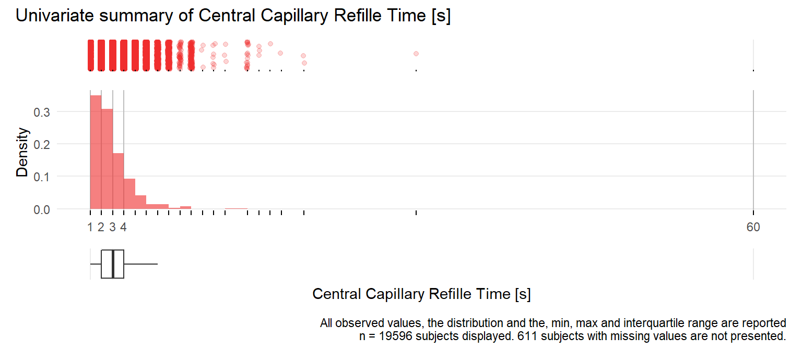

# Univariate distribution checks

This section reports a series of univariate summary checks of the CRASH-2 dataset.


## Data set overview

Using the [Hmisc](https://cran.r-project.org/web/packages/Hmisc/) describe function, we provide an overview of the data set. The descriptive report also provides histograms of continuous variables. For ease of scanning the information, we group the report by measurement type. 

### Demographic variables


```{=html}
<meta http-equiv="Content-Type" content="text/html; charset=utf-8" /> 
<script type="text/javascript">
<!--
    function expand_collapse(id) {
       var e = document.getElementById(id);
       var f = document.getElementById(id+"_earrows");
       if(e.style.display == 'none'){
          e.style.display = 'block';
          f.innerHTML = '&#9650';
       }
       else {
          e.style.display = 'none';
          f.innerHTML = '&#9660';
       }
    }
//-->
</script>
<style>
.earrows {color:silver;font-size:11px;}

fcap {
 font-family: Verdana;
 font-size: 12px;
 color: MidnightBlue
 }

smg {
 font-family: Verdana;
 font-size: 10px;
 color: &#808080;
}

hr.thinhr { margin-top: 0.15em; margin-bottom: 0.15em; }

span.xscript {
position: relative;
}
span.xscript sub {
position: absolute;
left: 0.1em;
bottom: -1ex;
}
</style>
 <font color="MidnightBlue"><div align=center><span style="font-weight:bold">Demographic variables <br><br> 2  Variables   20207  Observations</span></div></font> <hr class="thinhr"> <span style="font-weight:bold">age</span>: Age <span style='font-family:Verdana;font-size:75%;'>years</span><div style='float: right; text-align: right;'></div> <style>
 .hmisctable276988 {
 border: none;
 font-size: 80%;
 }
 .hmisctable276988 td {
 text-align: center;
 padding: 0 1ex 0 1ex;
 }
 .hmisctable276988 th {
 color: MidnightBlue;
 text-align: center;
 padding: 0 1ex 0 1ex;
 font-weight: normal;
 }
 </style>
 <table class="hmisctable276988">
 <tr><th>n</th><th>missing</th><th>distinct</th><th>Info</th><th>Mean</th><th>Gmd</th><th>.05</th><th>.10</th><th>.25</th><th>.50</th><th>.75</th><th>.90</th><th>.95</th></tr>
 <tr><td>20203</td><td>4</td><td>84</td><td>0.999</td><td>34.56</td><td>15.55</td><td>18</td><td>19</td><td>24</td><td>30</td><td>43</td><td>55</td><td>64</td></tr>
 </table>
 <span style="font-size: 85%;"><font color="MidnightBlue">lowest</font> :  1 14 15 16 17 ,  <font color="MidnightBlue">highest</font>: 92 94 95 96 99</span> <hr class="thinhr"> <span style="font-weight:bold">sex</span>: Sex <style>
 .hmisctable281137 {
 border: none;
 font-size: 80%;
 }
 .hmisctable281137 td {
 text-align: center;
 padding: 0 1ex 0 1ex;
 }
 .hmisctable281137 th {
 color: MidnightBlue;
 text-align: center;
 padding: 0 1ex 0 1ex;
 font-weight: normal;
 }
 </style>
 <table class="hmisctable281137">
 <tr><th>n</th><th>missing</th><th>distinct</th></tr>
 <tr><td>20206</td><td>1</td><td>2</td></tr>
 </table>
 <pre style="font-size:85%;">
 Value        male female
 Frequency   16935   3271
 Proportion  0.838  0.162
 </pre>
 <hr class="thinhr">
```


### Physiological measurements


```{=html}
<meta http-equiv="Content-Type" content="text/html; charset=utf-8" /> 
<script type="text/javascript">
<!--
    function expand_collapse(id) {
       var e = document.getElementById(id);
       var f = document.getElementById(id+"_earrows");
       if(e.style.display == 'none'){
          e.style.display = 'block';
          f.innerHTML = '&#9650';
       }
       else {
          e.style.display = 'none';
          f.innerHTML = '&#9660';
       }
    }
//-->
</script>
<style>
.earrows {color:silver;font-size:11px;}

fcap {
 font-family: Verdana;
 font-size: 12px;
 color: MidnightBlue
 }

smg {
 font-family: Verdana;
 font-size: 10px;
 color: &#808080;
}

hr.thinhr { margin-top: 0.15em; margin-bottom: 0.15em; }

span.xscript {
position: relative;
}
span.xscript sub {
position: absolute;
left: 0.1em;
bottom: -1ex;
}
</style>
 <font color="MidnightBlue"><div align=center><span style="font-weight:bold">Physiological measurements <br><br> 5  Variables   20207  Observations</span></div></font> <hr class="thinhr"> <span style="font-weight:bold">sbp</span>: Systolic Blood Pressure <span style='font-family:Verdana;font-size:75%;'>mmHg</span><div style='float: right; text-align: right;'></div> <style>
 .hmisctable420838 {
 border: none;
 font-size: 80%;
 }
 .hmisctable420838 td {
 text-align: center;
 padding: 0 1ex 0 1ex;
 }
 .hmisctable420838 th {
 color: MidnightBlue;
 text-align: center;
 padding: 0 1ex 0 1ex;
 font-weight: normal;
 }
 </style>
 <table class="hmisctable420838">
 <tr><th>n</th><th>missing</th><th>distinct</th><th>Info</th><th>Mean</th><th>Gmd</th><th>.05</th><th>.10</th><th>.25</th><th>.50</th><th>.75</th><th>.90</th><th>.95</th></tr>
 <tr><td>19887</td><td>320</td><td>173</td><td>0.989</td><td>98.45</td><td>27.86</td><td> 60</td><td> 70</td><td> 80</td><td> 95</td><td>110</td><td>130</td><td>143</td></tr>
 </table>
 <span style="font-size: 85%;"><font color="MidnightBlue">lowest</font> :   4  10  12  20  25 ,  <font color="MidnightBlue">highest</font>: 225 230 234 240 250</span> <hr class="thinhr"> <span style="font-weight:bold">hr</span>: Heart Rate <span style='font-family:Verdana;font-size:75%;'>/min</span><div style='float: right; text-align: right;'></div> <style>
 .hmisctable222998 {
 border: none;
 font-size: 80%;
 }
 .hmisctable222998 td {
 text-align: center;
 padding: 0 1ex 0 1ex;
 }
 .hmisctable222998 th {
 color: MidnightBlue;
 text-align: center;
 padding: 0 1ex 0 1ex;
 font-weight: normal;
 }
 </style>
 <table class="hmisctable222998">
 <tr><th>n</th><th>missing</th><th>distinct</th><th>Info</th><th>Mean</th><th>Gmd</th><th>.05</th><th>.10</th><th>.25</th><th>.50</th><th>.75</th><th>.90</th><th>.95</th></tr>
 <tr><td>20070</td><td>137</td><td>173</td><td>0.996</td><td>104.5</td><td>23.38</td><td> 70</td><td> 80</td><td> 90</td><td>105</td><td>120</td><td>130</td><td>140</td></tr>
 </table>
 <span style="font-size: 85%;"><font color="MidnightBlue">lowest</font> :   3   4   5   6  10 ,  <font color="MidnightBlue">highest</font>: 190 192 198 200 220</span> <hr class="thinhr"> <span style="font-weight:bold">rr</span>: Respiratory Rate <span style='font-family:Verdana;font-size:75%;'>/min</span><div style='float: right; text-align: right;'></div> <style>
 .hmisctable759110 {
 border: none;
 font-size: 80%;
 }
 .hmisctable759110 td {
 text-align: center;
 padding: 0 1ex 0 1ex;
 }
 .hmisctable759110 th {
 color: MidnightBlue;
 text-align: center;
 padding: 0 1ex 0 1ex;
 font-weight: normal;
 }
 </style>
 <table class="hmisctable759110">
 <tr><th>n</th><th>missing</th><th>distinct</th><th>Info</th><th>Mean</th><th>Gmd</th><th>.05</th><th>.10</th><th>.25</th><th>.50</th><th>.75</th><th>.90</th><th>.95</th></tr>
 <tr><td>20016</td><td>191</td><td>68</td><td>0.99</td><td>23.06</td><td>7.052</td><td>14</td><td>16</td><td>20</td><td>22</td><td>26</td><td>30</td><td>35</td></tr>
 </table>
 <span style="font-size: 85%;"><font color="MidnightBlue">lowest</font> :  1  2  3  4  5 ,  <font color="MidnightBlue">highest</font>: 90 91 94 95 96</span> <hr class="thinhr"> <span style="font-weight:bold">gcs</span>: Glasgow Coma Score Total <span style='font-family:Verdana;font-size:75%;'>points</span><div style='float: right; text-align: right;'></div> <style>
 .hmisctable508798 {
 border: none;
 font-size: 80%;
 }
 .hmisctable508798 td {
 text-align: center;
 padding: 0 1ex 0 1ex;
 }
 .hmisctable508798 th {
 color: MidnightBlue;
 text-align: center;
 padding: 0 1ex 0 1ex;
 font-weight: normal;
 }
 </style>
 <table class="hmisctable508798">
 <tr><th>n</th><th>missing</th><th>distinct</th><th>Info</th><th>Mean</th><th>Gmd</th><th>.05</th><th>.10</th><th>.25</th><th>.50</th><th>.75</th><th>.90</th><th>.95</th></tr>
 <tr><td>20184</td><td>23</td><td>13</td><td>0.863</td><td>12.47</td><td>3.594</td><td> 4</td><td> 6</td><td>11</td><td>15</td><td>15</td><td>15</td><td>15</td></tr>
 </table>
 <span style="font-size: 85%;"><font color="MidnightBlue">lowest</font> :  3  4  5  6  7 ,  <font color="MidnightBlue">highest</font>: 11 12 13 14 15</span> <pre style="font-size:85%;">
 Value          3     4     5     6     7     8     9    10    11    12    13    14
 Frequency    784   520   441   584   733   576   504   663   586   951  1356  2140
 Proportion 0.039 0.026 0.022 0.029 0.036 0.029 0.025 0.033 0.029 0.047 0.067 0.106
                 
 Value         15
 Frequency  10346
 Proportion 0.513
 </pre>
 <hr class="thinhr"> <span style="font-weight:bold">cc</span>: Central Capillary Refille Time <span style='font-family:Verdana;font-size:75%;'>s</span><div style='float: right; text-align: right;'></div> <style>
 .hmisctable990698 {
 border: none;
 font-size: 80%;
 }
 .hmisctable990698 td {
 text-align: center;
 padding: 0 1ex 0 1ex;
 }
 .hmisctable990698 th {
 color: MidnightBlue;
 text-align: center;
 padding: 0 1ex 0 1ex;
 font-weight: normal;
 }
 </style>
 <table class="hmisctable990698">
 <tr><th>n</th><th>missing</th><th>distinct</th><th>Info</th><th>Mean</th><th>Gmd</th><th>.05</th><th>.10</th><th>.25</th><th>.50</th><th>.75</th><th>.90</th><th>.95</th></tr>
 <tr><td>19596</td><td>611</td><td>20</td><td>0.945</td><td>3.267</td><td>1.67</td><td>1</td><td>2</td><td>2</td><td>3</td><td>4</td><td>5</td><td>6</td></tr>
 </table>
 <span style="font-size: 85%;"><font color="MidnightBlue">lowest</font> :  1  2  3  4  5 ,  <font color="MidnightBlue">highest</font>: 17 18 20 30 60</span> <pre style="font-size:85%;">
 Value          1     2     3     4     5     6     7     8     9    10    11    12
 Frequency   1510  5328  6020  3367  1805   802   268   271    45   139     3     7
 Proportion 0.077 0.272 0.307 0.172 0.092 0.041 0.014 0.014 0.002 0.007 0.000 0.000
                                                           
 Value         13    15    16    17    18    20    30    60
 Frequency      3    19     3     1     1     2     1     1
 Proportion 0.000 0.001 0.000 0.000 0.000 0.000 0.000 0.000
 </pre>
 <hr class="thinhr">
```

### Characteristics of injury


```{=html}
<meta http-equiv="Content-Type" content="text/html; charset=utf-8" /> 
<script type="text/javascript">
<!--
    function expand_collapse(id) {
       var e = document.getElementById(id);
       var f = document.getElementById(id+"_earrows");
       if(e.style.display == 'none'){
          e.style.display = 'block';
          f.innerHTML = '&#9650';
       }
       else {
          e.style.display = 'none';
          f.innerHTML = '&#9660';
       }
    }
//-->
</script>
<style>
.earrows {color:silver;font-size:11px;}

fcap {
 font-family: Verdana;
 font-size: 12px;
 color: MidnightBlue
 }

smg {
 font-family: Verdana;
 font-size: 10px;
 color: &#808080;
}

hr.thinhr { margin-top: 0.15em; margin-bottom: 0.15em; }

span.xscript {
position: relative;
}
span.xscript sub {
position: absolute;
left: 0.1em;
bottom: -1ex;
}
</style>
 <font color="MidnightBlue"><div align=center><span style="font-weight:bold">Characteristics of injury <br><br> 2  Variables   20207  Observations</span></div></font> <hr class="thinhr"> <span style="font-weight:bold">injurytime</span>: Hours Since Injury <span style='font-family:Verdana;font-size:75%;'>hours</span><div style='float: right; text-align: right;'></div> <style>
 .hmisctable468972 {
 border: none;
 font-size: 80%;
 }
 .hmisctable468972 td {
 text-align: center;
 padding: 0 1ex 0 1ex;
 }
 .hmisctable468972 th {
 color: MidnightBlue;
 text-align: center;
 padding: 0 1ex 0 1ex;
 font-weight: normal;
 }
 </style>
 <table class="hmisctable468972">
 <tr><th>n</th><th>missing</th><th>distinct</th><th>Info</th><th>Mean</th><th>Gmd</th><th>.05</th><th>.10</th><th>.25</th><th>.50</th><th>.75</th><th>.90</th><th>.95</th></tr>
 <tr><td>20196</td><td>11</td><td>93</td><td>0.972</td><td>2.844</td><td>2.35</td><td>0.5</td><td>1.0</td><td>1.0</td><td>2.0</td><td>4.0</td><td>6.0</td><td>7.0</td></tr>
 </table>
 <span style="font-size: 85%;"><font color="MidnightBlue">lowest</font> :  0.10  0.15  0.20  0.25  0.30 ,  <font color="MidnightBlue">highest</font>: 22.00 45.00 48.00 72.00 96.00</span> <hr class="thinhr"> <span style="font-weight:bold">injurytype</span>: Injury type<div style='float: right; text-align: right;'></div> <style>
 .hmisctable257343 {
 border: none;
 font-size: 80%;
 }
 .hmisctable257343 td {
 text-align: center;
 padding: 0 1ex 0 1ex;
 }
 .hmisctable257343 th {
 color: MidnightBlue;
 text-align: center;
 padding: 0 1ex 0 1ex;
 font-weight: normal;
 }
 </style>
 <table class="hmisctable257343">
 <tr><th>n</th><th>missing</th><th>distinct</th></tr>
 <tr><td>20207</td><td>0</td><td>3</td></tr>
 </table>
 <pre style="font-size:85%;">
 Value                      blunt           penetrating blunt and penetrating
 Frequency                  11189                  6552                  2466
 Proportion                 0.554                 0.324                 0.122
 </pre>
 <hr class="thinhr">
```

## Categorical variables

We now provide a closer visual examination of the categorical predictors. 


### Categorical ordinal plots

The Glasgow coma score, an ordinal categorical variable, is also displayed separately. 


## Continuous variables 

A closer visual examination of continuous predictors. 


There is evidence of digit preference. Explore further with targeted summaries. A more detailed univariate summaries for the variables of interest are also provided below. 

### Age


```
## Warning: Removed 2 rows containing missing values (geom_point).
```

<div class="figure">

<p class="caption">(\#fig:unnamed-chunk-4)Distribution of subject age [years]</p>
</div>

Five patients under the age of 17, the inclusion criteria for the study, with one patient aged 1. 

### Blood pressure


```
## Warning: Removed 1 rows containing missing values (geom_point).
```

<div class="figure">

<p class="caption">(\#fig:unnamed-chunk-5)Distribution of SBP</p>
</div>


### Respiratory rate


<div class="figure">

<p class="caption">(\#fig:unnamed-chunk-6)Distribution of respiratory rate</p>
</div>


### Heart rate


<div class="figure">

<p class="caption">(\#fig:unnamed-chunk-7)Distribution of heart rate</p>
</div>


### Central capillary refill time


```
## Warning: Removed 728 rows containing missing values (geom_point).
```

<div class="figure">

<p class="caption">(\#fig:unnamed-chunk-8)Distribution of Central capillary refill time</p>
</div>


### Hours since injury


```
## Warning: Removed 24 rows containing missing values (geom_point).
```

<div class="figure">

<p class="caption">(\#fig:unnamed-chunk-9)Distribution of hours since injury</p>
</div>


## Section session info


```
## R version 4.1.3 (2022-03-10)
## Platform: x86_64-w64-mingw32/x64 (64-bit)
## Running under: Windows 10 x64 (build 17763)
## 
## Matrix products: default
## 
## locale:
## [1] LC_COLLATE=English_Austria.1252  LC_CTYPE=English_Austria.1252   
## [3] LC_MONETARY=English_Austria.1252 LC_NUMERIC=C                    
## [5] LC_TIME=English_Austria.1252    
## 
## attached base packages:
## [1] stats     graphics  grDevices utils     datasets  methods   base     
## 
## other attached packages:
##  [1] Hmisc_4.6-0     Formula_1.2-4   survival_3.2-13 lattice_0.20-45
##  [5] forcats_0.5.1   stringr_1.4.0   dplyr_1.0.8     purrr_0.3.4    
##  [9] readr_2.1.2     tidyr_1.2.0     tibble_3.1.6    ggplot2_3.3.5  
## [13] tidyverse_1.3.1 here_1.0.1     
## 
## loaded via a namespace (and not attached):
##  [1] fs_1.5.2            lubridate_1.8.0     RColorBrewer_1.1-2 
##  [4] httr_1.4.2          rprojroot_2.0.2     tools_4.1.3        
##  [7] backports_1.4.1     bslib_0.3.1         utf8_1.2.2         
## [10] R6_2.5.1            rpart_4.1.16        DBI_1.1.2          
## [13] colorspace_2.0-3    nnet_7.3-17         withr_2.5.0        
## [16] tidyselect_1.1.2    gridExtra_2.3       compiler_4.1.3     
## [19] cli_3.2.0           rvest_1.0.2         htmlTable_2.4.0    
## [22] xml2_1.3.3          labeling_0.4.2      bookdown_0.25      
## [25] sass_0.4.1          scales_1.1.1        checkmate_2.0.0    
## [28] digest_0.6.29       foreign_0.8-82      rmarkdown_2.13     
## [31] base64enc_0.1-3     jpeg_0.1-9          pkgconfig_2.0.3    
## [34] htmltools_0.5.2     highr_0.9           dbplyr_2.1.1       
## [37] fastmap_1.1.0       htmlwidgets_1.5.4   rlang_1.0.2        
## [40] readxl_1.3.1        rstudioapi_0.13     jquerylib_0.1.4    
## [43] generics_0.1.2      farver_2.1.0        jsonlite_1.8.0     
## [46] magrittr_2.0.2      patchwork_1.1.1     Matrix_1.4-0       
## [49] Rcpp_1.0.8.3        munsell_0.5.0       fansi_1.0.3        
## [52] lifecycle_1.0.1     stringi_1.7.6       yaml_2.3.5         
## [55] grid_4.1.3          crayon_1.5.1        haven_2.4.3        
## [58] splines_4.1.3       hms_1.1.1           knitr_1.38         
## [61] pillar_1.7.0        reprex_2.0.1        glue_1.6.2         
## [64] evaluate_0.15       latticeExtra_0.6-29 data.table_1.14.2  
## [67] modelr_0.1.8        png_0.1-7           vctrs_0.3.8        
## [70] tzdb_0.2.0          cellranger_1.1.0    gtable_0.3.0       
## [73] assertthat_0.2.1    xfun_0.30           broom_0.7.12       
## [76] cluster_2.1.2       ellipsis_0.3.2
```


