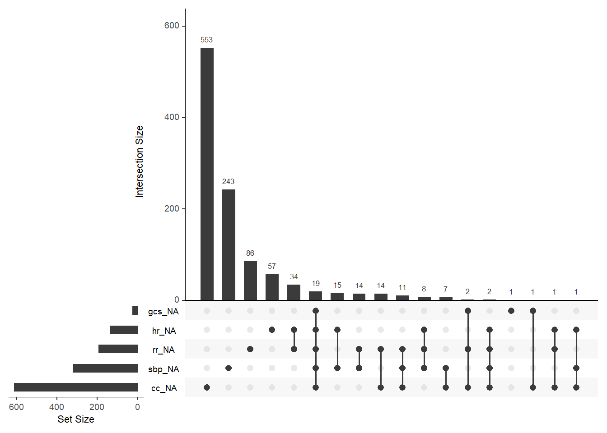
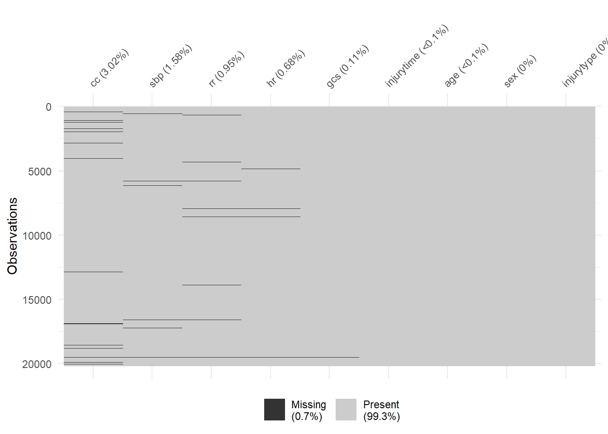
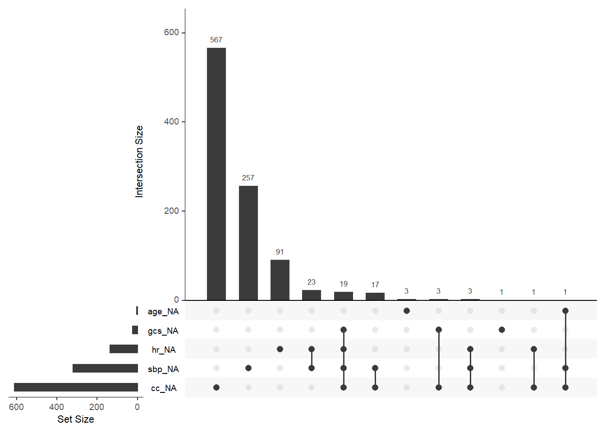
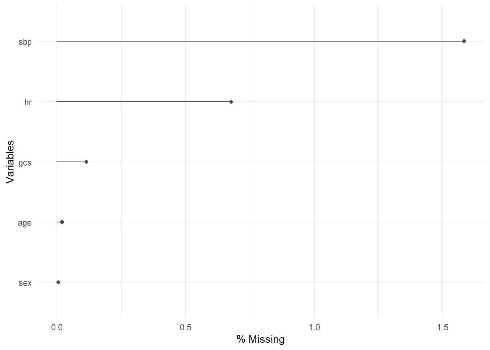
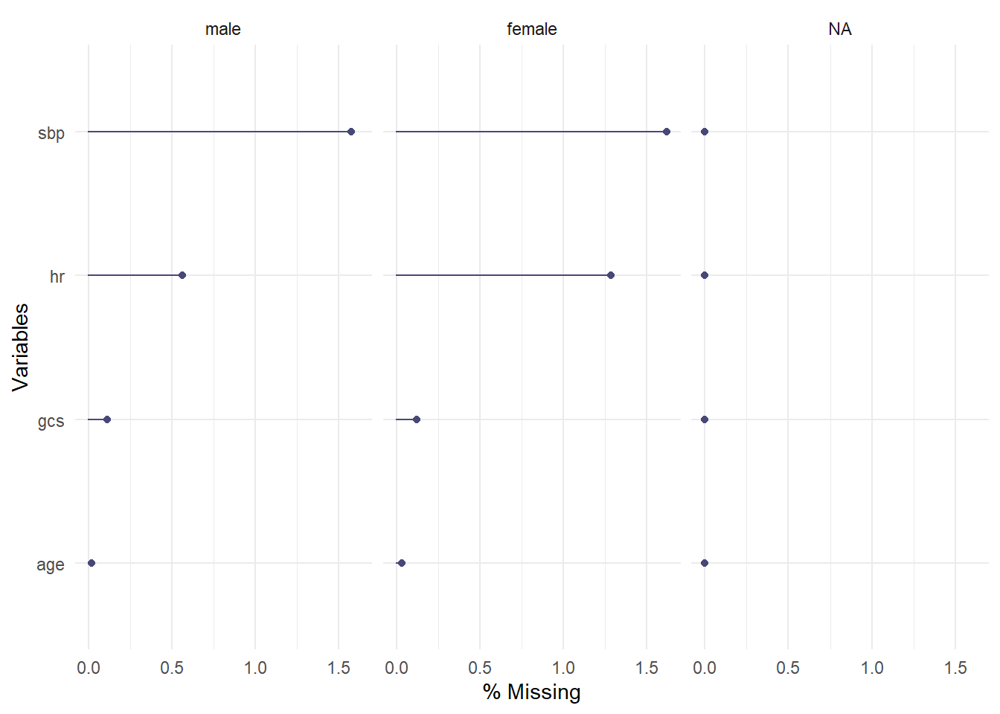
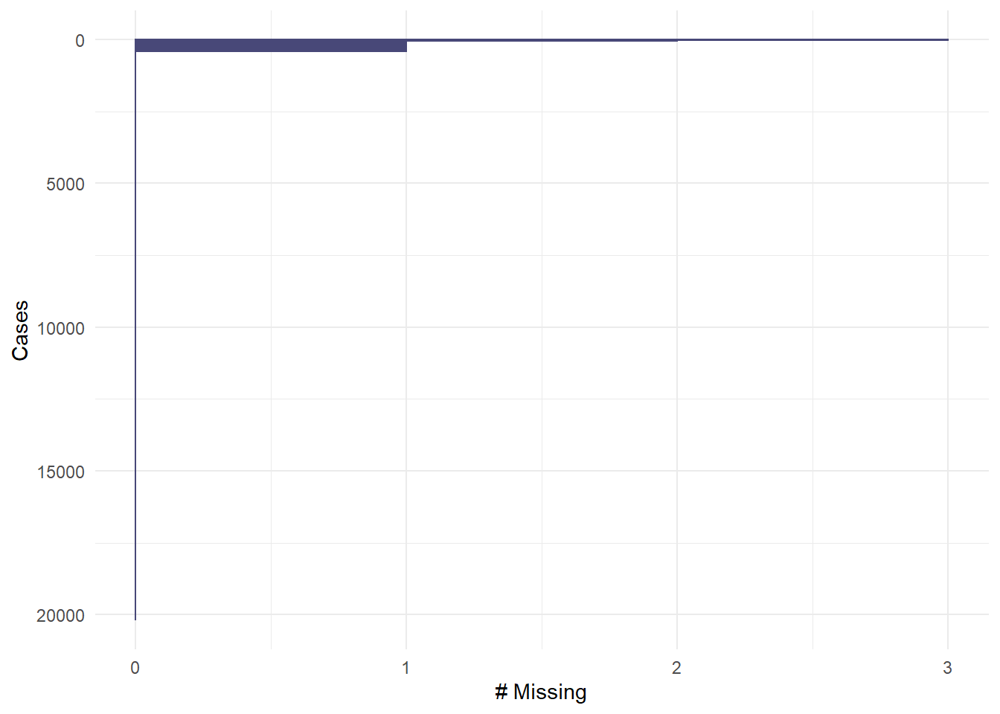

# Missing data


Identify complete cases and patients with missing data. 


```r
cc <-
  a_crash2 %>%  
  select(-time2death,-ddeath) %>% 
  filter(!complete.cases(.))
```


```r
cc %>% gg_miss_upset()
```




```r
a_crash2 %>%
  select(-time2death, -ddeath) %>%
  gg_miss_upset()
```




```r
a_crash2 %>%
  select(sex, age, sbp, hr, cc, gcs) %>%
  gg_miss_upset()
```




```r
a_crash2 %>%
    select(sex, age, sbp, hr, gcs) %>%
  gg_miss_var(show_pct = TRUE)
```




```r
a_crash2 %>%
    select(sex, age, sbp, hr, gcs) %>%
  gg_miss_var(show_pct = TRUE, facet = sex)
```

```
## Warning: Factor `sex` contains implicit NA, consider using
## `forcats::fct_explicit_na`

## Warning: Factor `sex` contains implicit NA, consider using
## `forcats::fct_explicit_na`

## Warning: Factor `sex` contains implicit NA, consider using
## `forcats::fct_explicit_na`

## Warning: Factor `sex` contains implicit NA, consider using
## `forcats::fct_explicit_na`

## Warning: Factor `sex` contains implicit NA, consider using
## `forcats::fct_explicit_na`

## Warning: Factor `sex` contains implicit NA, consider using
## `forcats::fct_explicit_na`

## Warning: Factor `sex` contains implicit NA, consider using
## `forcats::fct_explicit_na`

## Warning: Factor `sex` contains implicit NA, consider using
## `forcats::fct_explicit_na`

## Warning: Factor `sex` contains implicit NA, consider using
## `forcats::fct_explicit_na`
```




```r
a_crash2 %>%
  select(sex, age, sbp, hr, gcs) %>%
  gg_miss_case()
```




```r
a_crash2 %>%
  select(sex, age, sbp, hr, gcs) %>%
  gg_miss_case(order_cases = TRUE)
```


```r
a_crash2 %>%
  select(sex, age, sbp, hr, gcs) %>%
  gg_miss_fct(fct = sex)
```


## Session info


```r
sessionInfo()
```

```
## R version 3.6.1 (2019-07-05)
## Platform: x86_64-w64-mingw32/x64 (64-bit)
## Running under: Windows 10 x64 (build 17763)
## 
## Matrix products: default
## 
## locale:
## [1] LC_COLLATE=English_United States.1252 
## [2] LC_CTYPE=English_United States.1252   
## [3] LC_MONETARY=English_United States.1252
## [4] LC_NUMERIC=C                          
## [5] LC_TIME=English_United States.1252    
## 
## attached base packages:
## [1] stats     graphics  grDevices utils     datasets  methods   base     
## 
## other attached packages:
##  [1] naniar_0.5.2    Hmisc_4.4-0     Formula_1.2-3   survival_3.2-3 
##  [5] lattice_0.20-40 forcats_0.5.0   stringr_1.4.0   dplyr_0.8.5    
##  [9] purrr_0.3.4     readr_1.3.1     tidyr_1.0.2     tibble_3.0.1   
## [13] ggplot2_3.3.0   tidyverse_1.3.0 here_0.1       
## 
## loaded via a namespace (and not attached):
##  [1] viridis_0.5.1       httr_1.4.1          viridisLite_0.3.0  
##  [4] jsonlite_1.6.1      splines_3.6.1       modelr_0.1.6       
##  [7] assertthat_0.2.1    latticeExtra_0.6-29 cellranger_1.1.0   
## [10] yaml_2.2.1          pillar_1.4.4        backports_1.1.7    
## [13] visdat_0.5.3        glue_1.4.1          digest_0.6.25      
## [16] RColorBrewer_1.1-2  checkmate_2.0.0     rvest_0.3.5        
## [19] colorspace_1.4-1    plyr_1.8.6          htmltools_0.4.0    
## [22] Matrix_1.2-18       pkgconfig_2.0.3     broom_0.5.5        
## [25] haven_2.2.0         bookdown_0.18       scales_1.1.1       
## [28] jpeg_0.1-8.1        htmlTable_1.13.3    farver_2.0.3       
## [31] generics_0.0.2      ellipsis_0.3.0      UpSetR_1.4.0       
## [34] withr_2.2.0         nnet_7.3-13         cli_2.0.2          
## [37] magrittr_1.5        crayon_1.3.4        readxl_1.3.1       
## [40] evaluate_0.14       fs_1.3.2            fansi_0.4.1        
## [43] nlme_3.1-145        xml2_1.2.5          foreign_0.8-76     
## [46] tools_3.6.1         data.table_1.12.8   hms_0.5.3          
## [49] lifecycle_0.2.0     munsell_0.5.0       reprex_0.3.0       
## [52] cluster_2.1.0       compiler_3.6.1      rlang_0.4.6        
## [55] grid_3.6.1          rstudioapi_0.11     htmlwidgets_1.5.1  
## [58] labeling_0.3        base64enc_0.1-3     rmarkdown_2.1      
## [61] gtable_0.3.0        DBI_1.1.0           R6_2.4.1           
## [64] gridExtra_2.3       lubridate_1.7.4     knitr_1.28         
## [67] rprojroot_1.3-2     stringi_1.4.6       Rcpp_1.0.4.6       
## [70] vctrs_0.3.0         rpart_4.1-15        acepack_1.4.1      
## [73] png_0.1-7           dbplyr_1.4.2        tidyselect_1.1.0   
## [76] xfun_0.12
```
