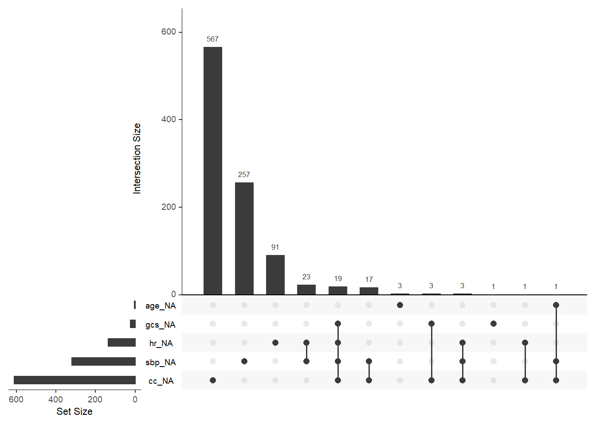
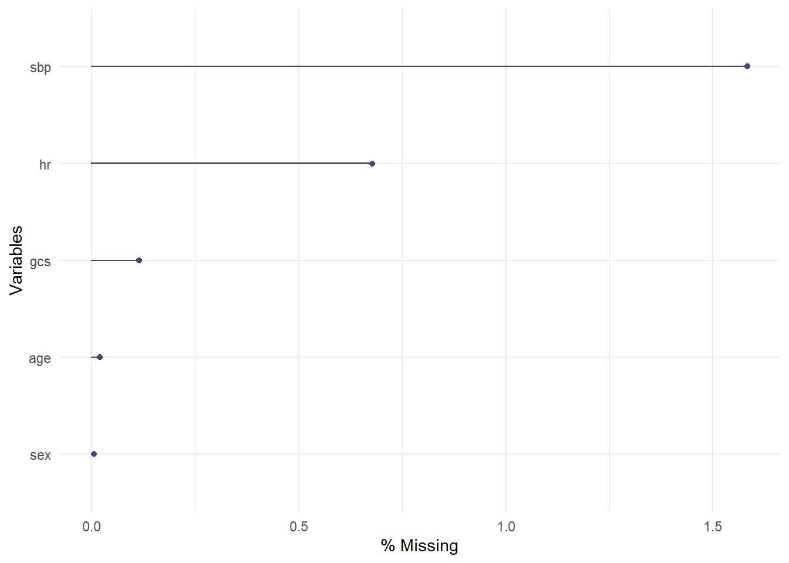
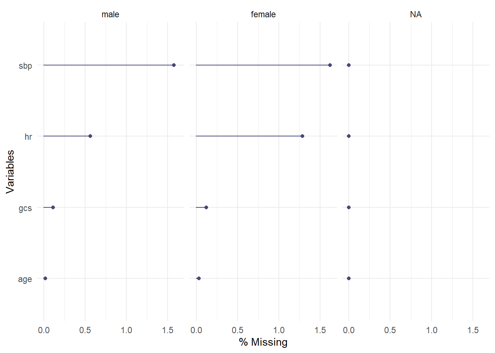
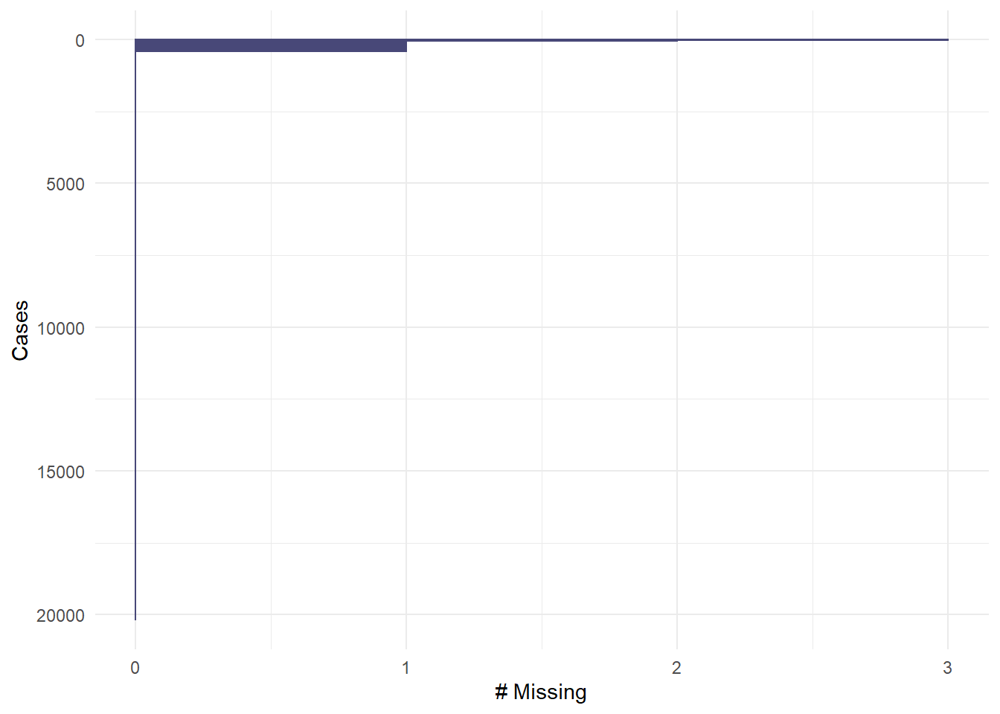

# Missing data


*TODO: organise. Structure as per table in section 4.3*

## Per variable

Number and percentage of missing. 


```r
a_crash2 %>%
  select(-time2death,-ddeath, -entryid, -trandomised, -earlydeath) %>%
  miss_var_summary() %>%
  gt::gt() %>%
    gt::cols_label(
    variable = md("**Variable**"),
    n_miss = md("**Missing (count)**"),
    pct_miss = md("**Missing (%)**")
  ) %>%
  gt::fmt_number(
    columns = vars(pct_miss),
    decimals = 2
  )
```

<!--html_preserve--><style>html {
  font-family: -apple-system, BlinkMacSystemFont, 'Segoe UI', Roboto, Oxygen, Ubuntu, Cantarell, 'Helvetica Neue', 'Fira Sans', 'Droid Sans', Arial, sans-serif;
}

#vskmxtscqn .gt_table {
  display: table;
  border-collapse: collapse;
  margin-left: auto;
  margin-right: auto;
  color: #333333;
  font-size: 16px;
  background-color: #FFFFFF;
  width: auto;
  border-top-style: solid;
  border-top-width: 2px;
  border-top-color: #A8A8A8;
  border-right-style: none;
  border-right-width: 2px;
  border-right-color: #D3D3D3;
  border-bottom-style: solid;
  border-bottom-width: 2px;
  border-bottom-color: #A8A8A8;
  border-left-style: none;
  border-left-width: 2px;
  border-left-color: #D3D3D3;
}

#vskmxtscqn .gt_heading {
  background-color: #FFFFFF;
  text-align: center;
  border-bottom-color: #FFFFFF;
  border-left-style: none;
  border-left-width: 1px;
  border-left-color: #D3D3D3;
  border-right-style: none;
  border-right-width: 1px;
  border-right-color: #D3D3D3;
}

#vskmxtscqn .gt_title {
  color: #333333;
  font-size: 125%;
  font-weight: initial;
  padding-top: 4px;
  padding-bottom: 4px;
  border-bottom-color: #FFFFFF;
  border-bottom-width: 0;
}

#vskmxtscqn .gt_subtitle {
  color: #333333;
  font-size: 85%;
  font-weight: initial;
  padding-top: 0;
  padding-bottom: 4px;
  border-top-color: #FFFFFF;
  border-top-width: 0;
}

#vskmxtscqn .gt_bottom_border {
  border-bottom-style: solid;
  border-bottom-width: 2px;
  border-bottom-color: #D3D3D3;
}

#vskmxtscqn .gt_col_headings {
  border-top-style: solid;
  border-top-width: 2px;
  border-top-color: #D3D3D3;
  border-bottom-style: solid;
  border-bottom-width: 2px;
  border-bottom-color: #D3D3D3;
  border-left-style: none;
  border-left-width: 1px;
  border-left-color: #D3D3D3;
  border-right-style: none;
  border-right-width: 1px;
  border-right-color: #D3D3D3;
}

#vskmxtscqn .gt_col_heading {
  color: #333333;
  background-color: #FFFFFF;
  font-size: 100%;
  font-weight: normal;
  text-transform: inherit;
  border-left-style: none;
  border-left-width: 1px;
  border-left-color: #D3D3D3;
  border-right-style: none;
  border-right-width: 1px;
  border-right-color: #D3D3D3;
  vertical-align: bottom;
  padding-top: 5px;
  padding-bottom: 6px;
  padding-left: 5px;
  padding-right: 5px;
  overflow-x: hidden;
}

#vskmxtscqn .gt_column_spanner_outer {
  color: #333333;
  background-color: #FFFFFF;
  font-size: 100%;
  font-weight: normal;
  text-transform: inherit;
  padding-top: 0;
  padding-bottom: 0;
  padding-left: 4px;
  padding-right: 4px;
}

#vskmxtscqn .gt_column_spanner_outer:first-child {
  padding-left: 0;
}

#vskmxtscqn .gt_column_spanner_outer:last-child {
  padding-right: 0;
}

#vskmxtscqn .gt_column_spanner {
  border-bottom-style: solid;
  border-bottom-width: 2px;
  border-bottom-color: #D3D3D3;
  vertical-align: bottom;
  padding-top: 5px;
  padding-bottom: 6px;
  overflow-x: hidden;
  display: inline-block;
  width: 100%;
}

#vskmxtscqn .gt_group_heading {
  padding: 8px;
  color: #333333;
  background-color: #FFFFFF;
  font-size: 100%;
  font-weight: initial;
  text-transform: inherit;
  border-top-style: solid;
  border-top-width: 2px;
  border-top-color: #D3D3D3;
  border-bottom-style: solid;
  border-bottom-width: 2px;
  border-bottom-color: #D3D3D3;
  border-left-style: none;
  border-left-width: 1px;
  border-left-color: #D3D3D3;
  border-right-style: none;
  border-right-width: 1px;
  border-right-color: #D3D3D3;
  vertical-align: middle;
}

#vskmxtscqn .gt_empty_group_heading {
  padding: 0.5px;
  color: #333333;
  background-color: #FFFFFF;
  font-size: 100%;
  font-weight: initial;
  border-top-style: solid;
  border-top-width: 2px;
  border-top-color: #D3D3D3;
  border-bottom-style: solid;
  border-bottom-width: 2px;
  border-bottom-color: #D3D3D3;
  vertical-align: middle;
}

#vskmxtscqn .gt_striped {
  background-color: rgba(128, 128, 128, 0.05);
}

#vskmxtscqn .gt_from_md > :first-child {
  margin-top: 0;
}

#vskmxtscqn .gt_from_md > :last-child {
  margin-bottom: 0;
}

#vskmxtscqn .gt_row {
  padding-top: 8px;
  padding-bottom: 8px;
  padding-left: 5px;
  padding-right: 5px;
  margin: 10px;
  border-top-style: solid;
  border-top-width: 1px;
  border-top-color: #D3D3D3;
  border-left-style: none;
  border-left-width: 1px;
  border-left-color: #D3D3D3;
  border-right-style: none;
  border-right-width: 1px;
  border-right-color: #D3D3D3;
  vertical-align: middle;
  overflow-x: hidden;
}

#vskmxtscqn .gt_stub {
  color: #333333;
  background-color: #FFFFFF;
  font-size: 100%;
  font-weight: initial;
  text-transform: inherit;
  border-right-style: solid;
  border-right-width: 2px;
  border-right-color: #D3D3D3;
  padding-left: 12px;
}

#vskmxtscqn .gt_summary_row {
  color: #333333;
  background-color: #FFFFFF;
  text-transform: inherit;
  padding-top: 8px;
  padding-bottom: 8px;
  padding-left: 5px;
  padding-right: 5px;
}

#vskmxtscqn .gt_first_summary_row {
  padding-top: 8px;
  padding-bottom: 8px;
  padding-left: 5px;
  padding-right: 5px;
  border-top-style: solid;
  border-top-width: 2px;
  border-top-color: #D3D3D3;
}

#vskmxtscqn .gt_grand_summary_row {
  color: #333333;
  background-color: #FFFFFF;
  text-transform: inherit;
  padding-top: 8px;
  padding-bottom: 8px;
  padding-left: 5px;
  padding-right: 5px;
}

#vskmxtscqn .gt_first_grand_summary_row {
  padding-top: 8px;
  padding-bottom: 8px;
  padding-left: 5px;
  padding-right: 5px;
  border-top-style: double;
  border-top-width: 6px;
  border-top-color: #D3D3D3;
}

#vskmxtscqn .gt_table_body {
  border-top-style: solid;
  border-top-width: 2px;
  border-top-color: #D3D3D3;
  border-bottom-style: solid;
  border-bottom-width: 2px;
  border-bottom-color: #D3D3D3;
}

#vskmxtscqn .gt_footnotes {
  color: #333333;
  background-color: #FFFFFF;
  border-bottom-style: none;
  border-bottom-width: 2px;
  border-bottom-color: #D3D3D3;
  border-left-style: none;
  border-left-width: 2px;
  border-left-color: #D3D3D3;
  border-right-style: none;
  border-right-width: 2px;
  border-right-color: #D3D3D3;
}

#vskmxtscqn .gt_footnote {
  margin: 0px;
  font-size: 90%;
  padding: 4px;
}

#vskmxtscqn .gt_sourcenotes {
  color: #333333;
  background-color: #FFFFFF;
  border-bottom-style: none;
  border-bottom-width: 2px;
  border-bottom-color: #D3D3D3;
  border-left-style: none;
  border-left-width: 2px;
  border-left-color: #D3D3D3;
  border-right-style: none;
  border-right-width: 2px;
  border-right-color: #D3D3D3;
}

#vskmxtscqn .gt_sourcenote {
  font-size: 90%;
  padding: 4px;
}

#vskmxtscqn .gt_left {
  text-align: left;
}

#vskmxtscqn .gt_center {
  text-align: center;
}

#vskmxtscqn .gt_right {
  text-align: right;
  font-variant-numeric: tabular-nums;
}

#vskmxtscqn .gt_font_normal {
  font-weight: normal;
}

#vskmxtscqn .gt_font_bold {
  font-weight: bold;
}

#vskmxtscqn .gt_font_italic {
  font-style: italic;
}

#vskmxtscqn .gt_super {
  font-size: 65%;
}

#vskmxtscqn .gt_footnote_marks {
  font-style: italic;
  font-size: 65%;
}
</style>
<div id="vskmxtscqn" style="overflow-x:auto;overflow-y:auto;width:auto;height:auto;"><table class="gt_table">
  
  <thead class="gt_col_headings">
    <tr>
      <th class="gt_col_heading gt_columns_bottom_border gt_left" rowspan="1" colspan="1"><strong>Variable</strong></th>
      <th class="gt_col_heading gt_columns_bottom_border gt_center" rowspan="1" colspan="1"><strong>Missing (count)</strong></th>
      <th class="gt_col_heading gt_columns_bottom_border gt_right" rowspan="1" colspan="1"><strong>Missing (%)</strong></th>
    </tr>
  </thead>
  <tbody class="gt_table_body">
    <tr>
      <td class="gt_row gt_left">cc</td>
      <td class="gt_row gt_center">611</td>
      <td class="gt_row gt_right">3.02</td>
    </tr>
    <tr>
      <td class="gt_row gt_left">sbp</td>
      <td class="gt_row gt_center">320</td>
      <td class="gt_row gt_right">1.58</td>
    </tr>
    <tr>
      <td class="gt_row gt_left">rr</td>
      <td class="gt_row gt_center">191</td>
      <td class="gt_row gt_right">0.95</td>
    </tr>
    <tr>
      <td class="gt_row gt_left">hr</td>
      <td class="gt_row gt_center">137</td>
      <td class="gt_row gt_right">0.68</td>
    </tr>
    <tr>
      <td class="gt_row gt_left">gcs</td>
      <td class="gt_row gt_center">23</td>
      <td class="gt_row gt_right">0.11</td>
    </tr>
    <tr>
      <td class="gt_row gt_left">injurytime</td>
      <td class="gt_row gt_center">11</td>
      <td class="gt_row gt_right">0.05</td>
    </tr>
    <tr>
      <td class="gt_row gt_left">age</td>
      <td class="gt_row gt_center">4</td>
      <td class="gt_row gt_right">0.02</td>
    </tr>
    <tr>
      <td class="gt_row gt_left">sex</td>
      <td class="gt_row gt_center">1</td>
      <td class="gt_row gt_right">0.00</td>
    </tr>
    <tr>
      <td class="gt_row gt_left">injurytype</td>
      <td class="gt_row gt_center">0</td>
      <td class="gt_row gt_right">0.00</td>
    </tr>
  </tbody>
  
  
</table></div><!--/html_preserve-->


```r
a_crash2 %>%
  select(-time2death,-ddeath, -entryid, -trandomised, -earlydeath) %>%
  gg_miss_var(show_pct = TRUE)
```


## Pattern


```r
a_crash2 %>%
  select(-time2death,-ddeath, -entryid, -trandomised, -earlydeath) %>%
  naniar::vis_miss(sort_miss = TRUE, show_perc_col = TRUE) 
```


```r
a_crash2 %>%
  select(-time2death,-ddeath, -entryid, -trandomised, -earlydeath) %>%
  gg_miss_case()
```


```r
a_crash2 %>%
  select(-time2death,-ddeath, -entryid, -trandomised, -earlydeath) %>%
  visdat::vis_dat()
```


```r
a_crash2 %>%
  select(-time2death,-ddeath, -entryid, -trandomised, -earlydeath) %>%
  gg_miss_upset()
```


## Complete cases


Identify # complete cases and patients with missing data. 


```r
cc <-
  a_crash2 %>%  
  select(-time2death,-ddeath) %>% 
  filter(!complete.cases(.))
```


```r
cc %>% gg_miss_upset()
```


```r
a_crash2 %>%
  select(-time2death, -ddeath) %>%
  gg_miss_upset()
```


```r
a_crash2 %>%
  select(sex, age, sbp, hr, cc, gcs) %>%
  gg_miss_upset()
```




```r
a_crash2 %>%
    select(sex, age, sbp, hr, gcs) %>%
  gg_miss_var(show_pct = TRUE)
```




```r
a_crash2 %>%
    select(sex, age, sbp, hr, gcs) %>%
  gg_miss_var(show_pct = TRUE, facet = sex)
```

```
## Warning: Factor `sex` contains implicit NA, consider using
## `forcats::fct_explicit_na`

## Warning: Factor `sex` contains implicit NA, consider using
## `forcats::fct_explicit_na`

## Warning: Factor `sex` contains implicit NA, consider using
## `forcats::fct_explicit_na`

## Warning: Factor `sex` contains implicit NA, consider using
## `forcats::fct_explicit_na`

## Warning: Factor `sex` contains implicit NA, consider using
## `forcats::fct_explicit_na`

## Warning: Factor `sex` contains implicit NA, consider using
## `forcats::fct_explicit_na`

## Warning: Factor `sex` contains implicit NA, consider using
## `forcats::fct_explicit_na`

## Warning: Factor `sex` contains implicit NA, consider using
## `forcats::fct_explicit_na`

## Warning: Factor `sex` contains implicit NA, consider using
## `forcats::fct_explicit_na`
```




```r
a_crash2 %>%
  select(sex, age, sbp, hr, gcs) %>%
  gg_miss_case()
```




```r
a_crash2 %>%
  select(sex, age, sbp, hr, gcs) %>%
  gg_miss_case(order_cases = TRUE)
```


```r
a_crash2 %>%
  select(sex, age, sbp, hr, gcs) %>%
  gg_miss_fct(fct = sex)
```


## Session info


```r
sessionInfo()
```

```
## R version 3.6.1 (2019-07-05)
## Platform: x86_64-w64-mingw32/x64 (64-bit)
## Running under: Windows 10 x64 (build 17763)
## 
## Matrix products: default
## 
## locale:
## [1] LC_COLLATE=English_United States.1252 
## [2] LC_CTYPE=English_United States.1252   
## [3] LC_MONETARY=English_United States.1252
## [4] LC_NUMERIC=C                          
## [5] LC_TIME=English_United States.1252    
## 
## attached base packages:
## [1] stats     graphics  grDevices utils     datasets  methods   base     
## 
## other attached packages:
##  [1] kableExtra_1.1.0 gt_0.2.0.5       naniar_0.5.2     Hmisc_4.4-0     
##  [5] Formula_1.2-3    survival_3.2-3   lattice_0.20-40  forcats_0.5.0   
##  [9] stringr_1.4.0    dplyr_0.8.5      purrr_0.3.4      readr_1.3.1     
## [13] tidyr_1.0.2      tibble_3.0.1     ggplot2_3.3.0    tidyverse_1.3.0 
## [17] here_0.1        
## 
## loaded via a namespace (and not attached):
##  [1] nlme_3.1-145        fs_1.3.2            lubridate_1.7.4    
##  [4] webshot_0.5.2       RColorBrewer_1.1-2  httr_1.4.1         
##  [7] UpSetR_1.4.0        rprojroot_1.3-2     tools_3.6.1        
## [10] backports_1.1.7     R6_2.4.1            rpart_4.1-15       
## [13] DBI_1.1.0           colorspace_1.4-1    nnet_7.3-13        
## [16] withr_2.2.0         tidyselect_1.1.0    gridExtra_2.3      
## [19] compiler_3.6.1      cli_2.0.2           rvest_0.3.5        
## [22] htmlTable_1.13.3    xml2_1.2.5          labeling_0.3       
## [25] bookdown_0.18       sass_0.2.0          scales_1.1.1       
## [28] checkmate_2.0.0     commonmark_1.7      digest_0.6.25      
## [31] foreign_0.8-76      rmarkdown_2.1       base64enc_0.1-3    
## [34] jpeg_0.1-8.1        pkgconfig_2.0.3     htmltools_0.4.0    
## [37] dbplyr_1.4.2        htmlwidgets_1.5.1   rlang_0.4.6        
## [40] readxl_1.3.1        rstudioapi_0.11     farver_2.0.3       
## [43] generics_0.0.2      jsonlite_1.6.1      acepack_1.4.1      
## [46] magrittr_1.5        Matrix_1.2-18       Rcpp_1.0.4.6       
## [49] munsell_0.5.0       fansi_0.4.1         viridis_0.5.1      
## [52] lifecycle_0.2.0     visdat_0.5.3        stringi_1.4.6      
## [55] yaml_2.2.1          plyr_1.8.6          grid_3.6.1         
## [58] crayon_1.3.4        haven_2.2.0         splines_3.6.1      
## [61] hms_0.5.3           knitr_1.28          pillar_1.4.4       
## [64] reprex_0.3.0        glue_1.4.1          evaluate_0.14      
## [67] latticeExtra_0.6-29 data.table_1.12.8   modelr_0.1.6       
## [70] png_0.1-7           vctrs_0.3.0         rmdformats_0.3.7   
## [73] cellranger_1.1.0    gtable_0.3.0        assertthat_0.2.1   
## [76] xfun_0.12           broom_0.5.5         viridisLite_0.3.0  
## [79] cluster_2.1.0       ellipsis_0.3.0
```
