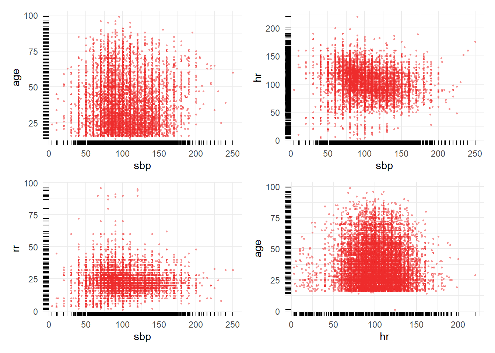
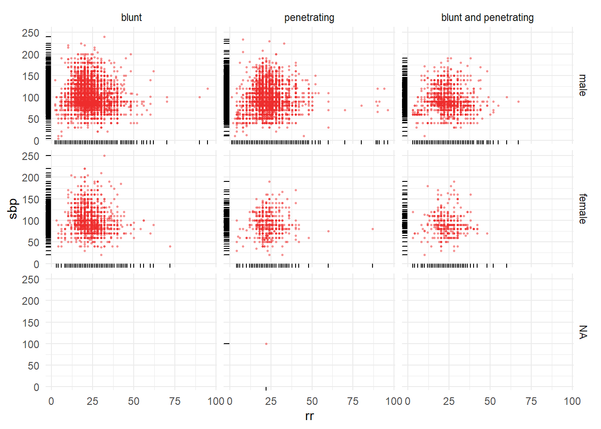

#  Bivariate distributions

Multivariate a_crash2

This code is a continous by example


## Read data 

### Load the dataset.


```r
load(here::here("data", "a_crash2.rda"))

## TODO: Move out to data prep
## TODO: Complete metadata by adding missing labels. 
## This should be a dervived dataset stored in data as we are adding to the oirginal source dataset obtained. 
a_crash2 <- Hmisc::upData(a_crash2,
               labels = c(age = 'Age'),
               units = c(age = "years", injurytime = "hours", gcs = "points"))
```

```
## Input object size:	 1385720 bytes;	 14 variables	 20207 observations
## New object size:	1385720 bytes;	14 variables	20207 observations
```


### Summary 


```r
library(arsenal)
crs.char <-
  tableby(
    sex ~ age + hr + rr + sbp ,
    data = a_crash2,
    test = FALSE,
    numeric.stats = c("median", "q1q3", "range"), 
    digits = 1, digits.p = 2, digits.pct = 1
  )

summary(crs.char, title = 'Patient characteristics') 
```


Table: Patient characteristics

|                            | male (N=16935) | female (N=3271) | Total (N=20206) |
|:---------------------------|:--------------:|:---------------:|:---------------:|
|**Age**                     |                |                 |                 |
|&nbsp;&nbsp;&nbsp;Median    |      30.0      |      35.0       |      30.0       |
|&nbsp;&nbsp;&nbsp;Q1, Q3    |   23.0, 41.0   |   25.0, 50.0    |   24.0, 43.0    |
|&nbsp;&nbsp;&nbsp;Range     |   1.0 - 99.0   |   15.0 - 96.0   |   1.0 - 99.0    |
|**Heart Rate**              |                |                 |                 |
|&nbsp;&nbsp;&nbsp;Median    |     105.0      |      106.0      |      105.0      |
|&nbsp;&nbsp;&nbsp;Q1, Q3    |  90.0, 120.0   |   92.0, 120.0   |   90.0, 120.0   |
|&nbsp;&nbsp;&nbsp;Range     |  3.0 - 198.0   |   3.0 - 220.0   |   3.0 - 220.0   |
|**Respiratory Rate**        |                |                 |                 |
|&nbsp;&nbsp;&nbsp;Median    |      22.0      |      22.0       |      22.0       |
|&nbsp;&nbsp;&nbsp;Q1, Q3    |   20.0, 26.0   |   20.0, 26.0    |   20.0, 26.0    |
|&nbsp;&nbsp;&nbsp;Range     |   1.0 - 96.0   |   3.0 - 87.0    |   1.0 - 96.0    |
|**Systolic Blood Pressure** |                |                 |                 |
|&nbsp;&nbsp;&nbsp;Median    |      95.0      |      90.0       |      95.0       |
|&nbsp;&nbsp;&nbsp;Q1, Q3    |  80.0, 110.0   |   80.0, 110.0   |   80.0, 110.0   |
|&nbsp;&nbsp;&nbsp;Range     |  4.0 - 240.0   |  20.0 - 250.0   |   4.0 - 250.0   |


```r
library(gtsummary)
```

```
## Warning: package 'gtsummary' was built under R version 3.6.3
```

```r
a_crash2 %>%
  select(sex, age, hr, rr, sbp) %>%
  gtsummary::tbl_summary(by = "sex") %>%
  bold_labels()
```

```
## 1 observations missing `sex` have been removed. To include these observations, use `forcats::fct_explicit_na()` on `sex` column before passing to `tbl_summary()`.
```

<!--html_preserve--><style>html {
  font-family: -apple-system, BlinkMacSystemFont, 'Segoe UI', Roboto, Oxygen, Ubuntu, Cantarell, 'Helvetica Neue', 'Fira Sans', 'Droid Sans', Arial, sans-serif;
}

#pfrlbcshcr .gt_table {
  display: table;
  border-collapse: collapse;
  margin-left: auto;
  margin-right: auto;
  color: #333333;
  font-size: 16px;
  background-color: #FFFFFF;
  width: auto;
  border-top-style: solid;
  border-top-width: 2px;
  border-top-color: #A8A8A8;
  border-right-style: none;
  border-right-width: 2px;
  border-right-color: #D3D3D3;
  border-bottom-style: solid;
  border-bottom-width: 2px;
  border-bottom-color: #A8A8A8;
  border-left-style: none;
  border-left-width: 2px;
  border-left-color: #D3D3D3;
}

#pfrlbcshcr .gt_heading {
  background-color: #FFFFFF;
  text-align: center;
  border-bottom-color: #FFFFFF;
  border-left-style: none;
  border-left-width: 1px;
  border-left-color: #D3D3D3;
  border-right-style: none;
  border-right-width: 1px;
  border-right-color: #D3D3D3;
}

#pfrlbcshcr .gt_title {
  color: #333333;
  font-size: 125%;
  font-weight: initial;
  padding-top: 4px;
  padding-bottom: 4px;
  border-bottom-color: #FFFFFF;
  border-bottom-width: 0;
}

#pfrlbcshcr .gt_subtitle {
  color: #333333;
  font-size: 85%;
  font-weight: initial;
  padding-top: 0;
  padding-bottom: 4px;
  border-top-color: #FFFFFF;
  border-top-width: 0;
}

#pfrlbcshcr .gt_bottom_border {
  border-bottom-style: solid;
  border-bottom-width: 2px;
  border-bottom-color: #D3D3D3;
}

#pfrlbcshcr .gt_col_headings {
  border-top-style: solid;
  border-top-width: 2px;
  border-top-color: #D3D3D3;
  border-bottom-style: solid;
  border-bottom-width: 2px;
  border-bottom-color: #D3D3D3;
  border-left-style: none;
  border-left-width: 1px;
  border-left-color: #D3D3D3;
  border-right-style: none;
  border-right-width: 1px;
  border-right-color: #D3D3D3;
}

#pfrlbcshcr .gt_col_heading {
  color: #333333;
  background-color: #FFFFFF;
  font-size: 100%;
  font-weight: normal;
  text-transform: inherit;
  border-left-style: none;
  border-left-width: 1px;
  border-left-color: #D3D3D3;
  border-right-style: none;
  border-right-width: 1px;
  border-right-color: #D3D3D3;
  vertical-align: bottom;
  padding-top: 5px;
  padding-bottom: 6px;
  padding-left: 5px;
  padding-right: 5px;
  overflow-x: hidden;
}

#pfrlbcshcr .gt_column_spanner_outer {
  color: #333333;
  background-color: #FFFFFF;
  font-size: 100%;
  font-weight: normal;
  text-transform: inherit;
  padding-top: 0;
  padding-bottom: 0;
  padding-left: 4px;
  padding-right: 4px;
}

#pfrlbcshcr .gt_column_spanner_outer:first-child {
  padding-left: 0;
}

#pfrlbcshcr .gt_column_spanner_outer:last-child {
  padding-right: 0;
}

#pfrlbcshcr .gt_column_spanner {
  border-bottom-style: solid;
  border-bottom-width: 2px;
  border-bottom-color: #D3D3D3;
  vertical-align: bottom;
  padding-top: 5px;
  padding-bottom: 6px;
  overflow-x: hidden;
  display: inline-block;
  width: 100%;
}

#pfrlbcshcr .gt_group_heading {
  padding: 8px;
  color: #333333;
  background-color: #FFFFFF;
  font-size: 100%;
  font-weight: initial;
  text-transform: inherit;
  border-top-style: solid;
  border-top-width: 2px;
  border-top-color: #D3D3D3;
  border-bottom-style: solid;
  border-bottom-width: 2px;
  border-bottom-color: #D3D3D3;
  border-left-style: none;
  border-left-width: 1px;
  border-left-color: #D3D3D3;
  border-right-style: none;
  border-right-width: 1px;
  border-right-color: #D3D3D3;
  vertical-align: middle;
}

#pfrlbcshcr .gt_empty_group_heading {
  padding: 0.5px;
  color: #333333;
  background-color: #FFFFFF;
  font-size: 100%;
  font-weight: initial;
  border-top-style: solid;
  border-top-width: 2px;
  border-top-color: #D3D3D3;
  border-bottom-style: solid;
  border-bottom-width: 2px;
  border-bottom-color: #D3D3D3;
  vertical-align: middle;
}

#pfrlbcshcr .gt_striped {
  background-color: rgba(128, 128, 128, 0.05);
}

#pfrlbcshcr .gt_from_md > :first-child {
  margin-top: 0;
}

#pfrlbcshcr .gt_from_md > :last-child {
  margin-bottom: 0;
}

#pfrlbcshcr .gt_row {
  padding-top: 8px;
  padding-bottom: 8px;
  padding-left: 5px;
  padding-right: 5px;
  margin: 10px;
  border-top-style: solid;
  border-top-width: 1px;
  border-top-color: #D3D3D3;
  border-left-style: none;
  border-left-width: 1px;
  border-left-color: #D3D3D3;
  border-right-style: none;
  border-right-width: 1px;
  border-right-color: #D3D3D3;
  vertical-align: middle;
  overflow-x: hidden;
}

#pfrlbcshcr .gt_stub {
  color: #333333;
  background-color: #FFFFFF;
  font-size: 100%;
  font-weight: initial;
  text-transform: inherit;
  border-right-style: solid;
  border-right-width: 2px;
  border-right-color: #D3D3D3;
  padding-left: 12px;
}

#pfrlbcshcr .gt_summary_row {
  color: #333333;
  background-color: #FFFFFF;
  text-transform: inherit;
  padding-top: 8px;
  padding-bottom: 8px;
  padding-left: 5px;
  padding-right: 5px;
}

#pfrlbcshcr .gt_first_summary_row {
  padding-top: 8px;
  padding-bottom: 8px;
  padding-left: 5px;
  padding-right: 5px;
  border-top-style: solid;
  border-top-width: 2px;
  border-top-color: #D3D3D3;
}

#pfrlbcshcr .gt_grand_summary_row {
  color: #333333;
  background-color: #FFFFFF;
  text-transform: inherit;
  padding-top: 8px;
  padding-bottom: 8px;
  padding-left: 5px;
  padding-right: 5px;
}

#pfrlbcshcr .gt_first_grand_summary_row {
  padding-top: 8px;
  padding-bottom: 8px;
  padding-left: 5px;
  padding-right: 5px;
  border-top-style: double;
  border-top-width: 6px;
  border-top-color: #D3D3D3;
}

#pfrlbcshcr .gt_table_body {
  border-top-style: solid;
  border-top-width: 2px;
  border-top-color: #D3D3D3;
  border-bottom-style: solid;
  border-bottom-width: 2px;
  border-bottom-color: #D3D3D3;
}

#pfrlbcshcr .gt_footnotes {
  color: #333333;
  background-color: #FFFFFF;
  border-bottom-style: none;
  border-bottom-width: 2px;
  border-bottom-color: #D3D3D3;
  border-left-style: none;
  border-left-width: 2px;
  border-left-color: #D3D3D3;
  border-right-style: none;
  border-right-width: 2px;
  border-right-color: #D3D3D3;
}

#pfrlbcshcr .gt_footnote {
  margin: 0px;
  font-size: 90%;
  padding: 4px;
}

#pfrlbcshcr .gt_sourcenotes {
  color: #333333;
  background-color: #FFFFFF;
  border-bottom-style: none;
  border-bottom-width: 2px;
  border-bottom-color: #D3D3D3;
  border-left-style: none;
  border-left-width: 2px;
  border-left-color: #D3D3D3;
  border-right-style: none;
  border-right-width: 2px;
  border-right-color: #D3D3D3;
}

#pfrlbcshcr .gt_sourcenote {
  font-size: 90%;
  padding: 4px;
}

#pfrlbcshcr .gt_left {
  text-align: left;
}

#pfrlbcshcr .gt_center {
  text-align: center;
}

#pfrlbcshcr .gt_right {
  text-align: right;
  font-variant-numeric: tabular-nums;
}

#pfrlbcshcr .gt_font_normal {
  font-weight: normal;
}

#pfrlbcshcr .gt_font_bold {
  font-weight: bold;
}

#pfrlbcshcr .gt_font_italic {
  font-style: italic;
}

#pfrlbcshcr .gt_super {
  font-size: 65%;
}

#pfrlbcshcr .gt_footnote_marks {
  font-style: italic;
  font-size: 65%;
}
</style>
<div id="pfrlbcshcr" style="overflow-x:auto;overflow-y:auto;width:auto;height:auto;"><table class="gt_table">
  
  <thead class="gt_col_headings">
    <tr>
      <th class="gt_col_heading gt_columns_bottom_border gt_left" rowspan="1" colspan="1"><strong>Characteristic</strong></th>
      <th class="gt_col_heading gt_columns_bottom_border gt_center" rowspan="1" colspan="1"><strong>male</strong>, N = 16935<sup class="gt_footnote_marks">1</sup></th>
      <th class="gt_col_heading gt_columns_bottom_border gt_center" rowspan="1" colspan="1"><strong>female</strong>, N = 3271<sup class="gt_footnote_marks">1</sup></th>
    </tr>
  </thead>
  <tbody class="gt_table_body">
    <tr>
      <td class="gt_row gt_left" style="font-weight: bold;">Age</td>
      <td class="gt_row gt_center">30 (23, 41)</td>
      <td class="gt_row gt_center">35 (25, 50)</td>
    </tr>
    <tr>
      <td class="gt_row gt_left" style="text-align: left; text-indent: 10px;">Unknown</td>
      <td class="gt_row gt_center">3</td>
      <td class="gt_row gt_center">1</td>
    </tr>
    <tr>
      <td class="gt_row gt_left" style="font-weight: bold;">Heart Rate</td>
      <td class="gt_row gt_center">105 (90, 120)</td>
      <td class="gt_row gt_center">106 (92, 120)</td>
    </tr>
    <tr>
      <td class="gt_row gt_left" style="text-align: left; text-indent: 10px;">Unknown</td>
      <td class="gt_row gt_center">95</td>
      <td class="gt_row gt_center">42</td>
    </tr>
    <tr>
      <td class="gt_row gt_left" style="font-weight: bold;">Respiratory Rate</td>
      <td class="gt_row gt_center">22 (20, 26)</td>
      <td class="gt_row gt_center">22 (20, 26)</td>
    </tr>
    <tr>
      <td class="gt_row gt_left" style="text-align: left; text-indent: 10px;">Unknown</td>
      <td class="gt_row gt_center">143</td>
      <td class="gt_row gt_center">48</td>
    </tr>
    <tr>
      <td class="gt_row gt_left" style="font-weight: bold;">Systolic Blood Pressure</td>
      <td class="gt_row gt_center">95 (80, 110)</td>
      <td class="gt_row gt_center">90 (80, 110)</td>
    </tr>
    <tr>
      <td class="gt_row gt_left" style="text-align: left; text-indent: 10px;">Unknown</td>
      <td class="gt_row gt_center">267</td>
      <td class="gt_row gt_center">53</td>
    </tr>
  </tbody>
  
  <tfoot>
    <tr class="gt_footnotes">
      <td colspan="3">
        <p class="gt_footnote">
          <sup class="gt_footnote_marks">
            <em>1</em>
          </sup>
           
          Statistics presented: median (IQR)
          <br />
        </p>
      </td>
    </tr>
  </tfoot>
</table></div><!--/html_preserve-->


### Histograms

<!--html_preserve--><div id="htmlwidget-57335134b3948518d78f" style="width:672px;height:250px;" class="plotly html-widget"></div>
<script type="application/json" data-for="htmlwidget-57335134b3948518d78f">{"x":{"visdat":{"f8d03dcb33c6":["function () ","plotlyVisDat"],"f8d076a8697a":["function () ","data"],"f8d03ba8161e":["function () ","data"],"f8d06e2d7479":["function () ","data"],"f8d0313e7348":["function () ","data"],"f8d04aae63b7":["function () ","data"],"f8d02eb01054":["function () ","data"],"f8d010f628e1":["function () ","data"]},"cur_data":"f8d010f628e1","attrs":{"f8d076a8697a":{"alpha_stroke":1,"sizes":[10,100],"spans":[1,20],"x":{},"y":{},"xend":{},"yend":{},"type":"scatter","mode":"lines","text":{},"hoverinfo":"text","color":["black"],"name":"Histogram","legendgroup":"Histogram","showlegend":true,"inherit":true},"f8d03ba8161e":{"alpha_stroke":1,"sizes":[10,100],"spans":[1,20],"x":{},"y":{},"type":"scatter","mode":"markers","color":["black"],"text":{},"hoverinfo":"text","size":[5],"name":"Mean","legendgroup":"Mean","showlegend":true,"inherit":true},"f8d06e2d7479":{"alpha_stroke":1,"sizes":[10,100],"spans":[1,20],"x":{},"y":{},"xend":{},"yend":{},"type":"scatter","mode":"lines","text":{},"hoverinfo":"text","name":"Median","legendgroup":"Median","showlegend":true,"color":["black"],"line":{"width":3},"inherit":true},"f8d0313e7348":{"alpha_stroke":1,"sizes":[10,100],"spans":[1,20],"x":{},"y":{},"xend":{},"yend":{},"type":"scatter","mode":"lines","text":{},"hoverinfo":"text","name":"Quartiles","legendgroup":"Quartiles","showlegend":true,"color":["blue"],"line":{"width":2},"inherit":true},"f8d04aae63b7":{"alpha_stroke":1,"sizes":[10,100],"spans":[1,20],"x":{},"y":{},"xend":{},"yend":{},"type":"scatter","mode":"lines","text":{},"hoverinfo":"text","name":"0.05, 0.95<br>Quantiles","legendgroup":"0.05, 0.95<br>Quantiles","showlegend":true,"color":["red"],"line":{"width":2},"inherit":true},"f8d04aae63b7.1":{"alpha_stroke":1,"sizes":[10,100],"spans":[1,20],"x":{},"y":{},"xend":{},"yend":{},"type":"scatter","mode":"lines","hoverinfo":"none","showlegend":false,"alpha":0.3,"color":["red"],"legendgroup":"0.05, 0.95<br>Quantiles","name":"ignored","inherit":true},"f8d04aae63b7.2":{"alpha_stroke":1,"sizes":[10,100],"spans":[1,20],"x":{},"y":{},"xend":{},"yend":{},"type":"scatter","mode":"lines","hoverinfo":"none","showlegend":false,"alpha":0.3,"color":["blue"],"legendgroup":"Quartiles","name":"ignored","inherit":true},"f8d04aae63b7.3":{"alpha_stroke":1,"sizes":[10,100],"spans":[1,20],"x":{},"y":{},"xend":{},"yend":{},"type":"scatter","mode":"lines","hoverinfo":"none","showlegend":false,"alpha":0.3,"color":["red"],"legendgroup":"0.05, 0.95<br>Quantiles","name":"ignored","inherit":true},"f8d02eb01054":{"alpha_stroke":1,"sizes":[10,100],"spans":[1,20],"x":{},"y":{},"xend":{},"yend":{},"type":"scatter","mode":"lines","text":{},"hoverinfo":"text","color":["light gray"],"name":"Gini <span style=\"text-decoration: overline\">|Δ|<\/span>","legendgroup":"Gini <span style=\"text-decoration: overline\">|Δ|<\/span>","visible":"legendonly","showlegend":true,"inherit":true},"f8d010f628e1":{"alpha_stroke":1,"sizes":[10,100],"spans":[1,20],"x":{},"y":{},"xend":{},"yend":{},"type":"scatter","mode":"lines","text":{},"hoverinfo":"text","color":["light blue"],"name":"SD","legendgroup":"SD","visible":"legendonly","showlegend":true,"inherit":true}},"layout":{"height":250,"margin":{"b":40,"l":70,"t":25,"r":10},"xaxis":{"domain":[0,1],"automargin":true,"title":"Age <span style='font-family:Verdana;font-size:75%;'>years<\/span>","zeroline":false},"yaxis":{"domain":[0,1],"automargin":true,"title":"","tickvals":[-1,-2],"ticktext":["male","female"]},"hovermode":"closest","showlegend":true},"source":"A","config":{"showSendToCloud":false},"data":[{"x":[1,1,null,14,14,null,15,15,null,16,16,null,17,17,null,18,18,null,19,19,null,20,20,null,21,21,null,22,22,null,23,23,null,24,24,null,25,25,null,26,26,null,27,27,null,28,28,null,29,29,null,30,30,null,31,31,null,32,32,null,33,33,null,34,34,null,35,35,null,36,36,null,37,37,null,38,38,null,39,39,null,40,40,null,41,41,null,42,42,null,43,43,null,44,44,null,45,45,null,46,46,null,47,47,null,48,48,null,49,49,null,50,50,null,51,51,null,52,52,null,53,53,null,54,54,null,55,55,null,56,56,null,57,57,null,58,58,null,59,59,null,60,60,null,61,61,null,62,62,null,63,63,null,64,64,null,65,65,null,66,66,null,67,67,null,68,68,null,69,69,null,70,70,null,71,71,null,72,72,null,73,73,null,74,74,null,75,75,null,76,76,null,77,77,null,78,78,null,79,79,null,80,80,null,81,81,null,82,82,null,83,83,null,84,84,null,85,85,null,86,86,null,87,87,null,88,88,null,89,89,null,90,90,null,91,91,null,92,92,null,94,94,null,95,95,null,96,96,null,99,99,null,15,15,null,16,16,null,17,17,null,18,18,null,19,19,null,20,20,null,21,21,null,22,22,null,23,23,null,24,24,null,25,25,null,26,26,null,27,27,null,28,28,null,29,29,null,30,30,null,31,31,null,32,32,null,33,33,null,34,34,null,35,35,null,36,36,null,37,37,null,38,38,null,39,39,null,40,40,null,41,41,null,42,42,null,43,43,null,44,44,null,45,45,null,46,46,null,47,47,null,48,48,null,49,49,null,50,50,null,51,51,null,52,52,null,53,53,null,54,54,null,55,55,null,56,56,null,57,57,null,58,58,null,59,59,null,60,60,null,61,61,null,62,62,null,63,63,null,64,64,null,65,65,null,66,66,null,67,67,null,68,68,null,69,69,null,70,70,null,71,71,null,72,72,null,73,73,null,74,74,null,75,75,null,76,76,null,77,77,null,78,78,null,79,79,null,80,80,null,81,81,null,82,82,null,83,83,null,84,84,null,85,85,null,86,86,null,87,87,null,88,88,null,89,89,null,91,91,null,95,95,null,96,96],"y":[-1,-0.999338478500551,null,-1,-0.998676957001102,null,-1,-0.998676957001102,null,-1,-0.763175303197354,null,-1,-0.778390297684675,null,-1,-0.609702315325248,null,-1,-0.648070562293275,null,-1,-0.529658213891951,null,-1,-0.671885336273429,null,-1,-0.560088202866593,null,-1,-0.595810363836825,null,-1,-0.601764057331863,null,-1,-0.4,null,-1,-0.663285556780595,null,-1,-0.648070562293275,null,-1,-0.601764057331863,null,-1,-0.714222712238148,null,-1,-0.413230429988975,null,-1,-0.804851157662624,null,-1,-0.69239250275634,null,-1,-0.790297684674752,null,-1,-0.788313120176406,null,-1,-0.560088202866593,null,-1,-0.798897464167585,null,-1,-0.825358324145535,null,-1,-0.763175303197354,null,-1,-0.85380374862183,null,-1,-0.595810363836825,null,-1,-0.888202866593164,null,-1,-0.822050716648291,null,-1,-0.863065049614112,null,-1,-0.890848952590959,null,-1,-0.694377067254686,null,-1,-0.89018743109151,null,-1,-0.87497243660419,null,-1,-0.8696802646086,null,-1,-0.904079382579934,null,-1,-0.778390297684675,null,-1,-0.922601984564498,null,-1,-0.903417861080485,null,-1,-0.914663726571114,null,-1,-0.935170893054024,null,-1,-0.860418963616318,null,-1,-0.933847850055127,null,-1,-0.945755237045204,null,-1,-0.936493936052922,null,-1,-0.952370452039691,null,-1,-0.894156560088203,null,-1,-0.959647188533627,null,-1,-0.966262403528115,null,-1,-0.966923925027563,null,-1,-0.977508269018743,null,-1,-0.929217199558986,null,-1,-0.978831312017641,null,-1,-0.974862183020948,null,-1,-0.972216097023153,null,-1,-0.975523704520397,null,-1,-0.930540242557883,null,-1,-0.98412348401323,null,-1,-0.980815876515987,null,-1,-0.987431091510474,null,-1,-0.988754134509372,null,-1,-0.976185226019846,null,-1,-0.987431091510474,null,-1,-0.98412348401323,null,-1,-0.991400220507166,null,-1,-0.993384785005513,null,-1,-0.987431091510474,null,-1,-0.995369349503859,null,-1,-0.994046306504961,null,-1,-0.995369349503859,null,-1,-0.996692392502756,null,-1,-0.996030871003308,null,-1,-0.998015435501654,null,-1,-0.998015435501654,null,-1,-0.997353914002205,null,-1,-0.998015435501654,null,-1,-0.998015435501654,null,-1,-0.999338478500551,null,-1,-0.999338478500551,null,-1,-0.999338478500551,null,-1,-0.999338478500551,null,-1,-0.999338478500551,null,-1,-0.999338478500551,null,-2,-1.99657465381386,null,-2,-1.70542022799227,null,-2,-1.76365111315659,null,-2,-1.66774141994477,null,-2,-1.72597230510909,null,-2,-1.64033865045568,null,-2,-1.75337507459818,null,-2,-1.72254695892295,null,-2,-1.74309903603977,null,-2,-1.77050180552886,null,-2,-1.53757826487159,null,-2,-1.71569626655068,null,-2,-1.72597230510909,null,-2,-1.68486815087545,null,-2,-1.79447922883182,null,-2,-1.472496687335,null,-2,-1.83900872925159,null,-2,-1.7362483436675,null,-2,-1.85613546018227,null,-2,-1.80818061357636,null,-2,-1.54785430343,null,-2,-1.84585942162386,null,-2,-1.85956080636841,null,-2,-1.79790457501795,null,-2,-1.86983684492682,null,-2,-1.58895845766364,null,-2,-1.8869635758575,null,-2,-1.81503130594864,null,-2,-1.90066496060205,null,-2,-1.89038892204364,null,-2,-1.59238380384977,null,-2,-1.88011288348523,null,-2,-1.86641149874068,null,-2,-1.83558338306545,null,-2,-1.8869635758575,null,-2,-1.65404003520023,null,-2,-1.88353822967136,null,-2,-1.8869635758575,null,-2,-1.89038892204364,null,-2,-1.91436634534659,null,-2,-1.79790457501795,null,-2,-1.91779169153273,null,-2,-1.92806773009114,null,-2,-1.86983684492682,null,-2,-1.93834376864955,null,-2,-1.76365111315659,null,-2,-1.96574653813864,null,-2,-1.91094099916045,null,-2,-1.95889584576636,null,-2,-1.9623211919525,null,-2,-1.79447922883182,null,-2,-1.95889584576636,null,-2,-1.924642383905,null,-2,-1.92806773009114,null,-2,-1.94861980720795,null,-2,-1.85956080636841,null,-2,-1.95547049958023,null,-2,-1.92806773009114,null,-2,-1.95889584576636,null,-2,-1.96917188432477,null,-2,-1.95889584576636,null,-2,-1.95889584576636,null,-2,-1.97602257669705,null,-2,-1.94861980720795,null,-2,-1.96574653813864,null,-2,-1.94519446102182,null,-2,-1.97602257669705,null,-2,-1.96917188432477,null,-2,-1.97602257669705,null,-2,-1.99314930762773,null,-2,-1.97944792288318,null,-2,-1.98629861525545,null,-2,-1.99314930762773,null,-2,-1.99314930762773,null,-2,-1.99657465381386,null,-2,-1.99657465381386,null,-2,-1.99657465381386,null,-2,-1.99657465381386],"type":"scatter","mode":"lines","text":["1<br>0<br>n=1","1<br>0<br>n=1",null,"14<br>0<br>n=2","14<br>0<br>n=2",null,"15<br>0<br>n=2","15<br>0<br>n=2",null,"16<br>0.021<br>n=358","16<br>0.021<br>n=358",null,"17<br>0.02<br>n=335","17<br>0.02<br>n=335",null,"18<br>0.035<br>n=590","18<br>0.035<br>n=590",null,"19<br>0.031<br>n=532","19<br>0.031<br>n=532",null,"20<br>0.042<br>n=711","20<br>0.042<br>n=711",null,"21<br>0.029<br>n=496","21<br>0.029<br>n=496",null,"22<br>0.039<br>n=665","22<br>0.039<br>n=665",null,"23<br>0.036<br>n=611","23<br>0.036<br>n=611",null,"24<br>0.036<br>n=602","24<br>0.036<br>n=602",null,"25<br>0.054<br>n=907","25<br>0.054<br>n=907",null,"26<br>0.03<br>n=509","26<br>0.03<br>n=509",null,"27<br>0.031<br>n=532","27<br>0.031<br>n=532",null,"28<br>0.036<br>n=602","28<br>0.036<br>n=602",null,"29<br>0.026<br>n=432","29<br>0.026<br>n=432",null,"30<br>0.052<br>n=887","30<br>0.052<br>n=887",null,"31<br>0.017<br>n=295","31<br>0.017<br>n=295",null,"32<br>0.027<br>n=465","32<br>0.027<br>n=465",null,"33<br>0.019<br>n=317","33<br>0.019<br>n=317",null,"34<br>0.019<br>n=320","34<br>0.019<br>n=320",null,"35<br>0.039<br>n=665","35<br>0.039<br>n=665",null,"36<br>0.018<br>n=304","36<br>0.018<br>n=304",null,"37<br>0.016<br>n=264","37<br>0.016<br>n=264",null,"38<br>0.021<br>n=358","38<br>0.021<br>n=358",null,"39<br>0.013<br>n=221","39<br>0.013<br>n=221",null,"40<br>0.036<br>n=611","40<br>0.036<br>n=611",null,"41<br>0.01<br>n=169","41<br>0.01<br>n=169",null,"42<br>0.016<br>n=269","42<br>0.016<br>n=269",null,"43<br>0.012<br>n=207","43<br>0.012<br>n=207",null,"44<br>0.01<br>n=165","44<br>0.01<br>n=165",null,"45<br>0.027<br>n=462","45<br>0.027<br>n=462",null,"46<br>0.01<br>n=166","46<br>0.01<br>n=166",null,"47<br>0.011<br>n=189","47<br>0.011<br>n=189",null,"48<br>0.012<br>n=197","48<br>0.012<br>n=197",null,"49<br>0.009<br>n=145","49<br>0.009<br>n=145",null,"50<br>0.02<br>n=335","50<br>0.02<br>n=335",null,"51<br>0.007<br>n=117","51<br>0.007<br>n=117",null,"52<br>0.009<br>n=146","52<br>0.009<br>n=146",null,"53<br>0.008<br>n=129","53<br>0.008<br>n=129",null,"54<br>0.006<br>n=98","54<br>0.006<br>n=98",null,"55<br>0.012<br>n=211","55<br>0.012<br>n=211",null,"56<br>0.006<br>n=100","56<br>0.006<br>n=100",null,"57<br>0.005<br>n=82","57<br>0.005<br>n=82",null,"58<br>0.006<br>n=96","58<br>0.006<br>n=96",null,"59<br>0.004<br>n=72","59<br>0.004<br>n=72",null,"60<br>0.009<br>n=160","60<br>0.009<br>n=160",null,"61<br>0.004<br>n=61","61<br>0.004<br>n=61",null,"62<br>0.003<br>n=51","62<br>0.003<br>n=51",null,"63<br>0.003<br>n=50","63<br>0.003<br>n=50",null,"64<br>0.002<br>n=34","64<br>0.002<br>n=34",null,"65<br>0.006<br>n=107","65<br>0.006<br>n=107",null,"66<br>0.002<br>n=32","66<br>0.002<br>n=32",null,"67<br>0.002<br>n=38","67<br>0.002<br>n=38",null,"68<br>0.002<br>n=42","68<br>0.002<br>n=42",null,"69<br>0.002<br>n=37","69<br>0.002<br>n=37",null,"70<br>0.006<br>n=105","70<br>0.006<br>n=105",null,"71<br>0.001<br>n=24","71<br>0.001<br>n=24",null,"72<br>0.002<br>n=29","72<br>0.002<br>n=29",null,"73<br>0.001<br>n=19","73<br>0.001<br>n=19",null,"74<br>0.001<br>n=17","74<br>0.001<br>n=17",null,"75<br>0.002<br>n=36","75<br>0.002<br>n=36",null,"76<br>0.001<br>n=19","76<br>0.001<br>n=19",null,"77<br>0.001<br>n=24","77<br>0.001<br>n=24",null,"78<br>0.001<br>n=13","78<br>0.001<br>n=13",null,"79<br>0.001<br>n=10","79<br>0.001<br>n=10",null,"80<br>0.001<br>n=19","80<br>0.001<br>n=19",null,"81<br>0<br>n=7","81<br>0<br>n=7",null,"82<br>0.001<br>n=9","82<br>0.001<br>n=9",null,"83<br>0<br>n=7","83<br>0<br>n=7",null,"84<br>0<br>n=5","84<br>0<br>n=5",null,"85<br>0<br>n=6","85<br>0<br>n=6",null,"86<br>0<br>n=3","86<br>0<br>n=3",null,"87<br>0<br>n=3","87<br>0<br>n=3",null,"88<br>0<br>n=4","88<br>0<br>n=4",null,"89<br>0<br>n=3","89<br>0<br>n=3",null,"90<br>0<br>n=3","90<br>0<br>n=3",null,"91<br>0<br>n=1","91<br>0<br>n=1",null,"92<br>0<br>n=1","92<br>0<br>n=1",null,"94<br>0<br>n=1","94<br>0<br>n=1",null,"95<br>0<br>n=1","95<br>0<br>n=1",null,"96<br>0<br>n=1","96<br>0<br>n=1",null,"99<br>0<br>n=1","99<br>0<br>n=1",null,"15<br>0<br>n=1","15<br>0<br>n=1",null,"16<br>0.026<br>n=86","16<br>0.026<br>n=86",null,"17<br>0.021<br>n=69","17<br>0.021<br>n=69",null,"18<br>0.03<br>n=97","18<br>0.03<br>n=97",null,"19<br>0.024<br>n=80","19<br>0.024<br>n=80",null,"20<br>0.032<br>n=105","20<br>0.032<br>n=105",null,"21<br>0.022<br>n=72","21<br>0.022<br>n=72",null,"22<br>0.025<br>n=81","22<br>0.025<br>n=81",null,"23<br>0.023<br>n=75","23<br>0.023<br>n=75",null,"24<br>0.02<br>n=67","24<br>0.02<br>n=67",null,"25<br>0.041<br>n=135","25<br>0.041<br>n=135",null,"26<br>0.025<br>n=83","26<br>0.025<br>n=83",null,"27<br>0.024<br>n=80","27<br>0.024<br>n=80",null,"28<br>0.028<br>n=92","28<br>0.028<br>n=92",null,"29<br>0.018<br>n=60","29<br>0.018<br>n=60",null,"30<br>0.047<br>n=154","30<br>0.047<br>n=154",null,"31<br>0.014<br>n=47","31<br>0.014<br>n=47",null,"32<br>0.024<br>n=77","32<br>0.024<br>n=77",null,"33<br>0.013<br>n=42","33<br>0.013<br>n=42",null,"34<br>0.017<br>n=56","34<br>0.017<br>n=56",null,"35<br>0.04<br>n=132","35<br>0.04<br>n=132",null,"36<br>0.014<br>n=45","36<br>0.014<br>n=45",null,"37<br>0.013<br>n=41","37<br>0.013<br>n=41",null,"38<br>0.018<br>n=59","38<br>0.018<br>n=59",null,"39<br>0.012<br>n=38","39<br>0.012<br>n=38",null,"40<br>0.037<br>n=120","40<br>0.037<br>n=120",null,"41<br>0.01<br>n=33","41<br>0.01<br>n=33",null,"42<br>0.017<br>n=54","42<br>0.017<br>n=54",null,"43<br>0.009<br>n=29","43<br>0.009<br>n=29",null,"44<br>0.01<br>n=32","44<br>0.01<br>n=32",null,"45<br>0.036<br>n=119","45<br>0.036<br>n=119",null,"46<br>0.011<br>n=35","46<br>0.011<br>n=35",null,"47<br>0.012<br>n=39","47<br>0.012<br>n=39",null,"48<br>0.015<br>n=48","48<br>0.015<br>n=48",null,"49<br>0.01<br>n=33","49<br>0.01<br>n=33",null,"50<br>0.031<br>n=101","50<br>0.031<br>n=101",null,"51<br>0.01<br>n=34","51<br>0.01<br>n=34",null,"52<br>0.01<br>n=33","52<br>0.01<br>n=33",null,"53<br>0.01<br>n=32","53<br>0.01<br>n=32",null,"54<br>0.008<br>n=25","54<br>0.008<br>n=25",null,"55<br>0.018<br>n=59","55<br>0.018<br>n=59",null,"56<br>0.007<br>n=24","56<br>0.007<br>n=24",null,"57<br>0.006<br>n=21","57<br>0.006<br>n=21",null,"58<br>0.012<br>n=38","58<br>0.012<br>n=38",null,"59<br>0.006<br>n=18","59<br>0.006<br>n=18",null,"60<br>0.021<br>n=69","60<br>0.021<br>n=69",null,"61<br>0.003<br>n=10","61<br>0.003<br>n=10",null,"62<br>0.008<br>n=26","62<br>0.008<br>n=26",null,"63<br>0.004<br>n=12","63<br>0.004<br>n=12",null,"64<br>0.003<br>n=11","64<br>0.003<br>n=11",null,"65<br>0.018<br>n=60","65<br>0.018<br>n=60",null,"66<br>0.004<br>n=12","66<br>0.004<br>n=12",null,"67<br>0.007<br>n=22","67<br>0.007<br>n=22",null,"68<br>0.006<br>n=21","68<br>0.006<br>n=21",null,"69<br>0.005<br>n=15","69<br>0.005<br>n=15",null,"70<br>0.013<br>n=41","70<br>0.013<br>n=41",null,"71<br>0.004<br>n=13","71<br>0.004<br>n=13",null,"72<br>0.006<br>n=21","72<br>0.006<br>n=21",null,"73<br>0.004<br>n=12","73<br>0.004<br>n=12",null,"74<br>0.003<br>n=9","74<br>0.003<br>n=9",null,"75<br>0.004<br>n=12","75<br>0.004<br>n=12",null,"76<br>0.004<br>n=12","76<br>0.004<br>n=12",null,"77<br>0.002<br>n=7","77<br>0.002<br>n=7",null,"78<br>0.005<br>n=15","78<br>0.005<br>n=15",null,"79<br>0.003<br>n=10","79<br>0.003<br>n=10",null,"80<br>0.005<br>n=16","80<br>0.005<br>n=16",null,"81<br>0.002<br>n=7","81<br>0.002<br>n=7",null,"82<br>0.003<br>n=9","82<br>0.003<br>n=9",null,"83<br>0.002<br>n=7","83<br>0.002<br>n=7",null,"84<br>0.001<br>n=2","84<br>0.001<br>n=2",null,"85<br>0.002<br>n=6","85<br>0.002<br>n=6",null,"86<br>0.001<br>n=4","86<br>0.001<br>n=4",null,"87<br>0.001<br>n=2","87<br>0.001<br>n=2",null,"88<br>0.001<br>n=2","88<br>0.001<br>n=2",null,"89<br>0<br>n=1","89<br>0<br>n=1",null,"91<br>0<br>n=1","91<br>0<br>n=1",null,"95<br>0<br>n=1","95<br>0<br>n=1",null,"96<br>0<br>n=1","96<br>0<br>n=1"],"hoverinfo":["text","text",null,"text","text",null,"text","text",null,"text","text",null,"text","text",null,"text","text",null,"text","text",null,"text","text",null,"text","text",null,"text","text",null,"text","text",null,"text","text",null,"text","text",null,"text","text",null,"text","text",null,"text","text",null,"text","text",null,"text","text",null,"text","text",null,"text","text",null,"text","text",null,"text","text",null,"text","text",null,"text","text",null,"text","text",null,"text","text",null,"text","text",null,"text","text",null,"text","text",null,"text","text",null,"text","text",null,"text","text",null,"text","text",null,"text","text",null,"text","text",null,"text","text",null,"text","text",null,"text","text",null,"text","text",null,"text","text",null,"text","text",null,"text","text",null,"text","text",null,"text","text",null,"text","text",null,"text","text",null,"text","text",null,"text","text",null,"text","text",null,"text","text",null,"text","text",null,"text","text",null,"text","text",null,"text","text",null,"text","text",null,"text","text",null,"text","text",null,"text","text",null,"text","text",null,"text","text",null,"text","text",null,"text","text",null,"text","text",null,"text","text",null,"text","text",null,"text","text",null,"text","text",null,"text","text",null,"text","text",null,"text","text",null,"text","text",null,"text","text",null,"text","text",null,"text","text",null,"text","text",null,"text","text",null,"text","text",null,"text","text",null,"text","text",null,"text","text",null,"text","text",null,"text","text",null,"text","text",null,"text","text",null,"text","text",null,"text","text",null,"text","text",null,"text","text",null,"text","text",null,"text","text",null,"text","text",null,"text","text",null,"text","text",null,"text","text",null,"text","text",null,"text","text",null,"text","text",null,"text","text",null,"text","text",null,"text","text",null,"text","text",null,"text","text",null,"text","text",null,"text","text",null,"text","text",null,"text","text",null,"text","text",null,"text","text",null,"text","text",null,"text","text",null,"text","text",null,"text","text",null,"text","text",null,"text","text",null,"text","text",null,"text","text",null,"text","text",null,"text","text",null,"text","text",null,"text","text",null,"text","text",null,"text","text",null,"text","text",null,"text","text",null,"text","text",null,"text","text",null,"text","text",null,"text","text",null,"text","text",null,"text","text",null,"text","text",null,"text","text",null,"text","text",null,"text","text",null,"text","text",null,"text","text",null,"text","text",null,"text","text",null,"text","text",null,"text","text",null,"text","text",null,"text","text",null,"text","text",null,"text","text",null,"text","text",null,"text","text",null,"text","text",null,"text","text",null,"text","text",null,"text","text",null,"text","text",null,"text","text",null,"text","text",null,"text","text",null,"text","text",null,"text","text",null,"text","text",null,"text","text",null,"text","text",null,"text","text",null,"text","text",null,"text","text"],"name":"Histogram","legendgroup":"Histogram","showlegend":true,"marker":{"color":"rgba(0,0,0,1)","line":{"color":"rgba(0,0,0,1)"}},"textfont":{"color":"rgba(0,0,0,1)"},"error_y":{"color":"rgba(0,0,0,1)"},"error_x":{"color":"rgba(0,0,0,1)"},"line":{"color":"rgba(0,0,0,1)"},"xaxis":"x","yaxis":"y","frame":null},{"x":[33.7453342782896,38.7733944954128],"y":[-1.225,-2.225],"type":"scatter","mode":"markers","text":["Mean:33.745<br>n=16932<br>3 missing","Mean:38.773<br>n=3270<br>1 missing"],"hoverinfo":["text","text"],"name":"Mean","legendgroup":"Mean","showlegend":true,"marker":{"color":"rgba(0,0,0,1)","size":[5,5],"sizemode":"area","line":{"color":"rgba(0,0,0,1)"}},"textfont":{"color":"rgba(0,0,0,1)","size":5},"error_y":{"color":"rgba(0,0,0,1)","width":5},"error_x":{"color":"rgba(0,0,0,1)","width":5},"line":{"color":"rgba(0,0,0,1)","width":5},"xaxis":"x","yaxis":"y","frame":null},{"x":[30,30,null,35,35],"y":[-1.4,-1.05,null,-2.4,-2.05],"type":"scatter","mode":"lines","text":["Q<sub>0.5<\/sub>:30","Q<sub>0.5<\/sub>:30",null,"Q<sub>0.5<\/sub>:35","Q<sub>0.5<\/sub>:35"],"hoverinfo":["text","text",null,"text","text"],"name":"Median","legendgroup":"Median","showlegend":true,"line":{"color":"rgba(0,0,0,1)","width":3},"marker":{"color":"rgba(0,0,0,1)","line":{"color":"rgba(0,0,0,1)"}},"textfont":{"color":"rgba(0,0,0,1)"},"error_y":{"color":"rgba(0,0,0,1)"},"error_x":{"color":"rgba(0,0,0,1)"},"xaxis":"x","yaxis":"y","frame":null},{"x":[23,23,null,41,41,null,25,25,null,50,50],"y":[-1.365,-1.085,null,-1.365,-1.085,null,-2.365,-2.085,null,-2.365,-2.085],"type":"scatter","mode":"lines","text":["Q<sub>0.25<\/sub>:23","Q<sub>0.25<\/sub>:23",null,"Q<sub>0.75<\/sub>:41","Q<sub>0.75<\/sub>:41",null,"Q<sub>0.25<\/sub>:25","Q<sub>0.25<\/sub>:25",null,"Q<sub>0.75<\/sub>:50","Q<sub>0.75<\/sub>:50"],"hoverinfo":["text","text",null,"text","text",null,"text","text",null,"text","text"],"name":"Quartiles","legendgroup":"Quartiles","showlegend":true,"line":{"color":"rgba(0,0,255,1)","width":2},"marker":{"color":"rgba(0,0,255,1)","line":{"color":"rgba(0,0,255,1)"}},"textfont":{"color":"rgba(0,0,255,1)"},"error_y":{"color":"rgba(0,0,255,1)"},"error_x":{"color":"rgba(0,0,255,1)"},"xaxis":"x","yaxis":"y","frame":null},{"x":[18,18,null,60,60,null,18,18,null,71,71],"y":[-1.337,-1.113,null,-1.337,-1.113,null,-2.337,-2.113,null,-2.337,-2.113],"type":"scatter","mode":"lines","text":["Q<sub>0.05<\/sub>:18","Q<sub>0.05<\/sub>:18",null,"Q<sub>0.95<\/sub>:60","Q<sub>0.95<\/sub>:60",null,"Q<sub>0.05<\/sub>:18","Q<sub>0.05<\/sub>:18",null,"Q<sub>0.95<\/sub>:71","Q<sub>0.95<\/sub>:71"],"hoverinfo":["text","text",null,"text","text",null,"text","text",null,"text","text"],"name":"0.05, 0.95<br>Quantiles","legendgroup":"0.05, 0.95<br>Quantiles","showlegend":true,"line":{"color":"rgba(255,0,0,1)","width":2},"marker":{"color":"rgba(255,0,0,1)","line":{"color":"rgba(255,0,0,1)"}},"textfont":{"color":"rgba(255,0,0,1)"},"error_y":{"color":"rgba(255,0,0,1)"},"error_x":{"color":"rgba(255,0,0,1)"},"xaxis":"x","yaxis":"y","frame":null},{"x":[18,23,null,18,25],"y":[-1.225,-1.225,null,-2.225,-2.225],"type":"scatter","mode":"lines","hoverinfo":["none","none",null,"none","none"],"showlegend":false,"legendgroup":"0.05, 0.95<br>Quantiles","name":"ignored","marker":{"color":"rgba(255,0,0,0.3)","line":{"color":"rgba(255,0,0,1)"}},"textfont":{"color":"rgba(255,0,0,0.3)"},"error_y":{"color":"rgba(255,0,0,0.3)"},"error_x":{"color":"rgba(255,0,0,0.3)"},"line":{"color":"rgba(255,0,0,0.3)"},"xaxis":"x","yaxis":"y","frame":null},{"x":[23,41,null,25,50],"y":[-1.225,-1.225,null,-2.225,-2.225],"type":"scatter","mode":"lines","hoverinfo":["none","none",null,"none","none"],"showlegend":false,"legendgroup":"Quartiles","name":"ignored","marker":{"color":"rgba(0,0,255,0.3)","line":{"color":"rgba(0,0,255,1)"}},"textfont":{"color":"rgba(0,0,255,0.3)"},"error_y":{"color":"rgba(0,0,255,0.3)"},"error_x":{"color":"rgba(0,0,255,0.3)"},"line":{"color":"rgba(0,0,255,0.3)"},"xaxis":"x","yaxis":"y","frame":null},{"x":[41,60,null,50,71],"y":[-1.225,-1.225,null,-2.225,-2.225],"type":"scatter","mode":"lines","hoverinfo":["none","none",null,"none","none"],"showlegend":false,"legendgroup":"0.05, 0.95<br>Quantiles","name":"ignored","marker":{"color":"rgba(255,0,0,0.3)","line":{"color":"rgba(255,0,0,1)"}},"textfont":{"color":"rgba(255,0,0,0.3)"},"error_y":{"color":"rgba(255,0,0,0.3)"},"error_x":{"color":"rgba(255,0,0,0.3)"},"line":{"color":"rgba(255,0,0,0.3)"},"xaxis":"x","yaxis":"y","frame":null},{"x":[1,15.7530045205228,null,1,19.8371704165626],"y":[-1.19,-1.19,null,-2.19,-2.19],"type":"scatter","mode":"lines","text":["Gini mean difference:14.753","Gini mean difference:14.753",null,"Gini mean difference:18.837","Gini mean difference:18.837"],"hoverinfo":["text","text",null,"text","text"],"name":"Gini <span style=\"text-decoration: overline\">|Δ|<\/span>","legendgroup":"Gini <span style=\"text-decoration: overline\">|Δ|<\/span>","visible":"legendonly","showlegend":true,"marker":{"color":"rgba(211,211,211,1)","line":{"color":"rgba(211,211,211,1)"}},"textfont":{"color":"rgba(211,211,211,1)"},"error_y":{"color":"rgba(211,211,211,1)"},"error_x":{"color":"rgba(211,211,211,1)"},"line":{"color":"rgba(211,211,211,1)"},"xaxis":"x","yaxis":"y","frame":null},{"x":[1,14.5653520083784,null,1,17.8396526657488],"y":[-1.23,-1.23,null,-2.23,-2.23],"type":"scatter","mode":"lines","text":["SD:13.565","SD:13.565",null,"SD:16.84","SD:16.84"],"hoverinfo":["text","text",null,"text","text"],"name":"SD","legendgroup":"SD","visible":"legendonly","showlegend":true,"marker":{"color":"rgba(173,216,230,1)","line":{"color":"rgba(173,216,230,1)"}},"textfont":{"color":"rgba(173,216,230,1)"},"error_y":{"color":"rgba(173,216,230,1)"},"error_x":{"color":"rgba(173,216,230,1)"},"line":{"color":"rgba(173,216,230,1)"},"xaxis":"x","yaxis":"y","frame":null}],"highlight":{"on":"plotly_click","persistent":false,"dynamic":false,"selectize":false,"opacityDim":0.2,"selected":{"opacity":1},"debounce":0},"shinyEvents":["plotly_hover","plotly_click","plotly_selected","plotly_relayout","plotly_brushed","plotly_brushing","plotly_clickannotation","plotly_doubleclick","plotly_deselect","plotly_afterplot","plotly_sunburstclick"],"base_url":"https://plot.ly"},"evals":[],"jsHooks":[]}</script><!--/html_preserve-->


## Age 

### Continous 


```r
a_crash2 %>% dplyr::filter(!is.na(sbp)) %>% tally()
```

```
##       n
## 1 19887
```

```r
a_crash2 %>% dplyr::filter(is.na(sbp)) %>% tally()
```

```
##     n
## 1 320
```

```r
bigN <- a_crash2 %>% dplyr::filter(!is.na(sbp) & !is.na(age)) %>% tally()
n_miss <- a_crash2 %>% dplyr::filter(is.na(sbp) | is.na(age)) %>% tally()

title <-
  paste0("Plot of ", Hmisc::label(a_crash2$age), " and ", Hmisc::label(a_crash2$sbp))

caption <-
  paste0(
    "n = ",
    bigN,
    " subjects displayed.\n",
    n_miss,
    " subjects with a missing value in at least one of the variables."
  )


x_axis <- paste0(Hmisc::label(a_crash2$age), " [", Hmisc::units(a_crash2$age), "]")
y_axis <- paste0(Hmisc::label(a_crash2$sbp), " [", Hmisc::units(a_crash2$sbp), "]")


p1 <- a_crash2 %>%
  dplyr::filter(!is.na(sbp) & !is.na(age)) %>%
  mutate(sbp = as.numeric(sbp), 
         age = as.numeric(age)) %>%
  ggplot(aes(x = sbp, y = age)) +
  ylab(x_axis) +
  xlab(y_axis) +
  labs(
    title = title,
    caption = caption
  ) +
  geom_point(shape = 16, #size = 0.5,
             alpha = 0.5,
             color = "firebrick2") +
  geom_rug() +
  theme_minimal()

p1
```


### Continous


```r
p1 <- a_crash2 %>%
  filter(!is.na(sbp) & !is.na(age)) %>%
  mutate(sbp = as.numeric(sbp), 
         age = as.numeric(age)) %>%
  ggplot(aes(x = sbp, y = age)) +
  geom_point(shape = 16, size = 0.5,
             alpha = 0.5,
             color = "firebrick2") +
  geom_rug() +
  theme_minimal()

p2 <- a_crash2 %>%
  filter(!is.na(sbp) & !is.na(hr)) %>%
  mutate(sbp = as.numeric(sbp), 
         age = as.numeric(hr)) %>%
  ggplot(aes(x = sbp, y = hr)) +
  geom_point(shape = 16, size = 0.5,
             alpha = 0.5,
             color = "firebrick2") +
  geom_rug() +
  theme_minimal()


p3 <- a_crash2 %>%
  filter(!is.na(sbp) & !is.na(rr)) %>%
  mutate(sbp = as.numeric(sbp), 
         age = as.numeric(rr)) %>%
  ggplot(aes(x = sbp, y = rr)) +
  geom_point(shape = 16, size = 0.5,
             alpha = 0.5,
             color = "firebrick2") +
  geom_rug() +
  theme_minimal()


p4 <- a_crash2 %>%
  filter(!is.na(hr) & !is.na(age)) %>%
  mutate(sbp = as.numeric(hr), 
         age = as.numeric(age)) %>%
  ggplot(aes(x = hr, y = age)) +
  geom_point(shape = 16, size = 0.5,
             alpha = 0.5,
             color = "firebrick2") +
  geom_rug() +
  theme_minimal()
```


### Continous3 


```r
library(patchwork)
```

```
## Warning: package 'patchwork' was built under R version 3.6.3
```

```r
(p1 + p2 ) / (p3 + p4)
```

```
## Don't know how to automatically pick scale for object of type labelled/integer. Defaulting to continuous.
## Don't know how to automatically pick scale for object of type labelled/integer. Defaulting to continuous.
## Don't know how to automatically pick scale for object of type labelled/integer. Defaulting to continuous.
```




## Scatter plots with a third or fourth variable

Scatter plot of age and RR by sex and injury type.


```r
ggplot(a_crash2, aes(
  y = age,
  x = rr
)) +
    geom_point(shape = 16, size = 0.5,
             alpha = 0.5,
             color = "firebrick2") +
  geom_rug() +
  facet_grid(sex ~ injurytype) +
  theme_minimal()
```

```
## Don't know how to automatically pick scale for object of type labelled/integer. Defaulting to continuous.
## Don't know how to automatically pick scale for object of type labelled/integer. Defaulting to continuous.
```

```
## Warning: Removed 195 rows containing missing values (geom_point).
```


Scatter plot of SBP and RR by sex and injury type.


```r
ggplot(a_crash2, aes(
  y = sbp,
  x = rr
)) +
    geom_point(shape = 16, size = 0.5,
             alpha = 0.5,
             color = "firebrick2") +
  geom_rug() +
  facet_grid(sex ~ injurytype) +
  theme_minimal()
```

```
## Don't know how to automatically pick scale for object of type labelled/integer. Defaulting to continuous.
## Don't know how to automatically pick scale for object of type labelled/integer. Defaulting to continuous.
```

```
## Warning: Removed 457 rows containing missing values (geom_point).
```




## Session info


```r
sessionInfo()
```

```
## R version 3.6.1 (2019-07-05)
## Platform: x86_64-w64-mingw32/x64 (64-bit)
## Running under: Windows 10 x64 (build 17763)
## 
## Matrix products: default
## 
## locale:
## [1] LC_COLLATE=English_United States.1252 
## [2] LC_CTYPE=English_United States.1252   
## [3] LC_MONETARY=English_United States.1252
## [4] LC_NUMERIC=C                          
## [5] LC_TIME=English_United States.1252    
## 
## attached base packages:
## [1] stats     graphics  grDevices utils     datasets  methods   base     
## 
## other attached packages:
##  [1] patchwork_1.0.0    gtsummary_1.2.6    arsenal_3.4.0      Hmisc_4.4-0       
##  [5] Formula_1.2-3      survival_3.2-3     lattice_0.20-40    summarytools_0.9.6
##  [9] janitor_2.0.1      forcats_0.5.0      stringr_1.4.0      dplyr_0.8.5       
## [13] purrr_0.3.4        readr_1.3.1        tidyr_1.0.2        tibble_3.0.1      
## [17] ggplot2_3.3.0      tidyverse_1.3.0    here_0.1          
## 
## loaded via a namespace (and not attached):
##  [1] nlme_3.1-145        matrixStats_0.56.0  fs_1.3.2           
##  [4] lubridate_1.7.4     RColorBrewer_1.1-2  httr_1.4.1         
##  [7] rprojroot_1.3-2     tools_3.6.1         backports_1.1.7    
## [10] R6_2.4.1            rpart_4.1-15        lazyeval_0.2.2     
## [13] DBI_1.1.0           colorspace_1.4-1    nnet_7.3-13        
## [16] withr_2.2.0         tidyselect_1.1.0    gridExtra_2.3      
## [19] compiler_3.6.1      cli_2.0.2           rvest_0.3.5        
## [22] gt_0.2.0.5          htmlTable_1.13.3    xml2_1.2.5         
## [25] plotly_4.9.2.1      labeling_0.3        sass_0.2.0         
## [28] bookdown_0.18       scales_1.1.1        checkmate_2.0.0    
## [31] commonmark_1.7      digest_0.6.25       foreign_0.8-76     
## [34] rmarkdown_2.1       base64enc_0.1-3     jpeg_0.1-8.1       
## [37] pkgconfig_2.0.3     htmltools_0.4.0     highr_0.8          
## [40] dbplyr_1.4.2        htmlwidgets_1.5.1   rlang_0.4.6        
## [43] readxl_1.3.1        rstudioapi_0.11     pryr_0.1.4         
## [46] farver_2.0.3        generics_0.0.2      jsonlite_1.6.1     
## [49] crosstalk_1.1.0.1   acepack_1.4.1       magrittr_1.5       
## [52] rapportools_1.0     Matrix_1.2-18       Rcpp_1.0.4.6       
## [55] munsell_0.5.0       fansi_0.4.1         lifecycle_0.2.0    
## [58] stringi_1.4.6       yaml_2.2.1          snakecase_0.11.0   
## [61] plyr_1.8.6          grid_3.6.1          crayon_1.3.4       
## [64] haven_2.2.0         splines_3.6.1       pander_0.6.3       
## [67] hms_0.5.3           magick_2.3          knitr_1.28         
## [70] pillar_1.4.4        tcltk_3.6.1         codetools_0.2-16   
## [73] reprex_0.3.0        glue_1.4.1          evaluate_0.14      
## [76] latticeExtra_0.6-29 data.table_1.12.8   modelr_0.1.6       
## [79] png_0.1-7           vctrs_0.3.0         cellranger_1.1.0   
## [82] gtable_0.3.0        assertthat_0.2.1    xfun_0.12          
## [85] broom_0.5.5         viridisLite_0.3.0   cluster_2.1.0      
## [88] ellipsis_0.3.0
```
