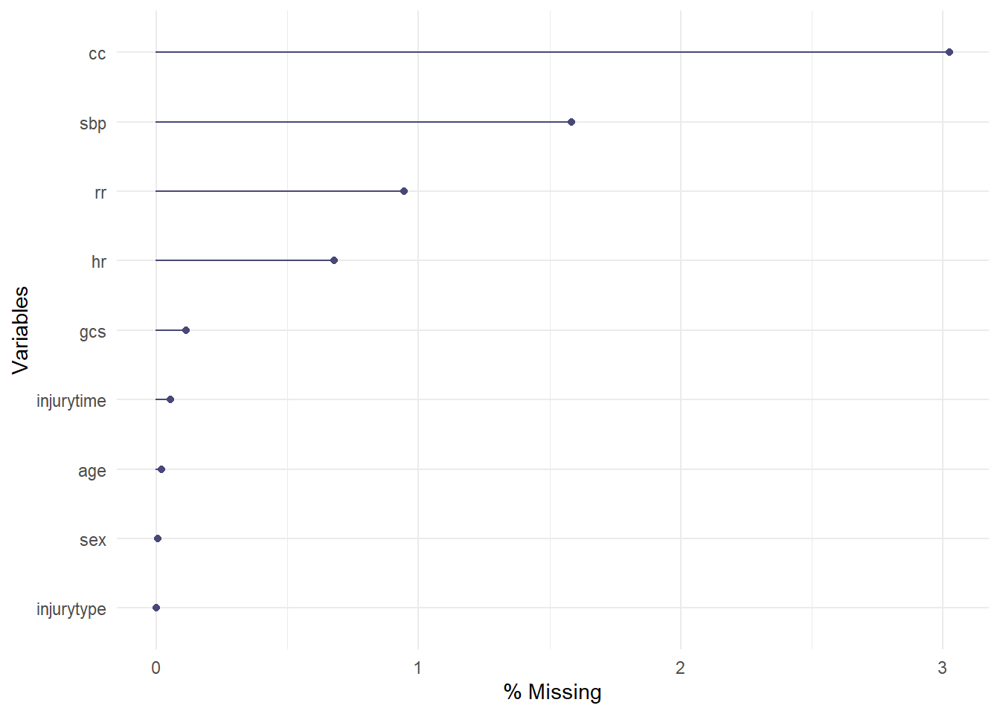
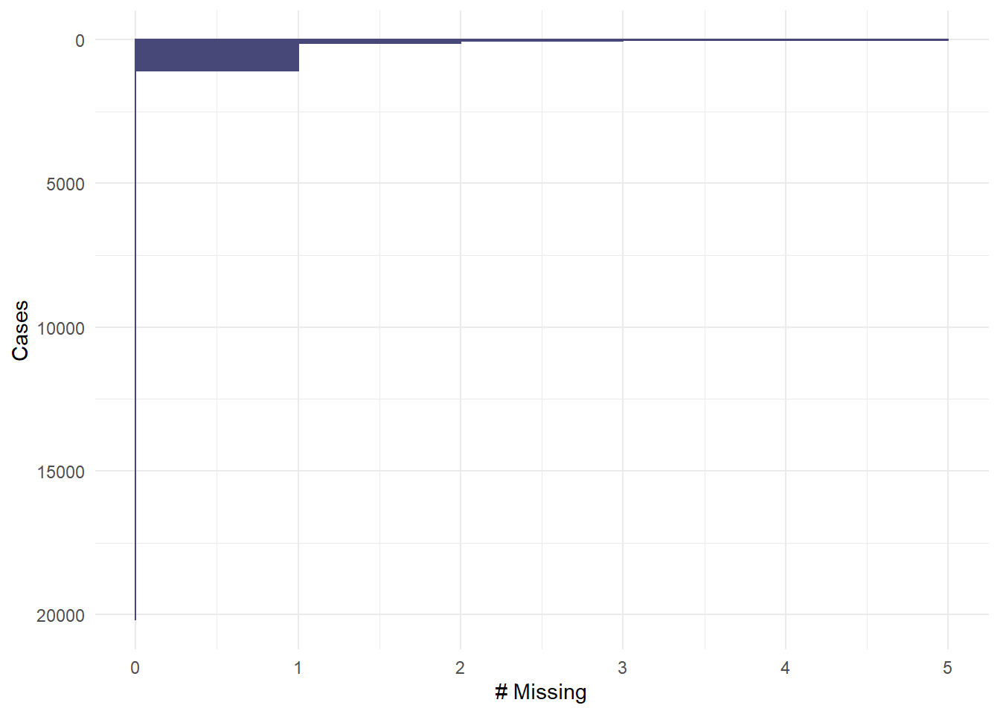

--- 
title: "Regression without regrets"
subtitle: "Workflow of initial data analyses"
author: "M. Baillie, G. Heinze & M. Huebner"
date: "2020-08-24"
knit: "rmarkdown::render_site"
site: bookdown::bookdown_site
output:
  rmdformats::readthedown:
    thumbnails: false
    lightbox: false
    gallery: TRUE
    highlight: tango
    use_bookdown: TRUE
    toc_depth: 2
    fig_caption: false
    code_folding: hide
documentclass: book
bibliography: [book.bib, packages.bib]
biblio-style: apalike
link-citations: yes
github-repo: bailliem/ida-regression-private
description: "The focus of this document/website is to provide guidance on conducting initial data analysis in a reproducible manner in the context of intended regression analyses."
---


# Overview 


The focus of this document/website is to provide guidance on conducting initial data analysis in a reproducible manner in the context of intended regression analyses.


<!--chapter:end:index.Rmd-->

# IDA Framework

The IDA framework consists of six steps [Huebner et al 2018, Figure 1], here we assume that metadata (step I) exist in sufficient detail, and that data cleaning (step II) was already performed. Metadata summarize background information about the data to properly conduct IDA steps, and a data cleaning process identifies and corrects technical errors.  The data screening (step III) examines data properties to inform decisions about the intended analysis. Initial data reporting (step IV) document insight of the previous steps and can be referred to when interpreting results from the regression modeling. Consequences of these analyses can be that the analysis plan needs to be refined or updated (step V). Finally, reporting of IDA results in research papers (step VI) are necessary to ensure transparency regarding key findings that influence the analysis or interpretation of results. Further details about the elements of IDA are discussed  in [TG3 papers].

<div class="figure" style="text-align: center">

<p class="caption">IDA framework</p>
</div>


**References**

Huebner M, le Cessie S, Schmidt CO, Vach W . A contemporary conceptual framework for initial data analysis. Observational Studies 2018; 4: 171-192. [Link](https://obsstudies.org/contemporary-conceptual-framework-initial-data-analysis/)

Huebner M, Vach W, le Cessie S, Schmidt C, Lusa L. Hidden Analyses: a review of reporting practice and recommendations for more transparent reporting of initial data analyses. BMC Med Res Meth 2020; 20:61. [Link](https://obsstudies.org/contemporary-conceptual-framework-initial-data-analysis/)

<!--chapter:end:IDA_framework.Rmd-->

# Scope of the regression analyses for the examples

Regression models can be used for a wide range of purposes, for the purpose of these examples the assumptions on the regression analysis set-up in this paper are listed in Table 1. Thus, IDA tasks will be explained in a well-defined, practically relevant setting. Since a key principle is that IDA does not touch the research question no associations between dependent (outcome)  and independent (non-outcome) variables are considered.

*Table 1:* The scope of the regression analyses considered for IDA tasks

|Aspects of the research plan|Assumptions in this paper|Reason for the assumption|
|-----------|-----------|-----------|
|Dependent (outcome) variable|One dependent variable that can be continuous or binary; exclude time-to-event or longitudinal outcomes|Explain IDA tasks in a well-defined, practically relevant setting|
|Regression models|Models with linear predictors|Explain IDA tasks in a well-defined, practically relevant setting|
|Purpose of regression model|Adjust effect of one variable of interest for confounders; quantify the effects of explanatory variables on the outcome|Explain IDA tasks in a well-defined, practically relevant setting|
|Independent variables|“explanatory” or “confounder” depending on purpose of model; small to moderate number of mixed types; Not high dimensional; no repeated measurements|To demonstrate IDA approaches for a mix of variables likely to be encountered in practice|
|Statistical analysis plan|Exists, defines the outcome variable, the type of regression model to be used, and a set of independent variables|IDA does not touch the research question, but may lead to an update or refinement of the analysis plan|


**References**:

Vach W. Regression Models as a Tool in Medical Research. Chapman/Hall CRC 2012

Harrell FE. Regression Modeling Strategies. Springer (2nd ed) 2015

Royston P and Sauerbrei W. Multivariable Model Building. Wiley (2008)

[…]

<!--chapter:end:scope.Rmd-->

# Data screening and possible actions


## Univariate distributions

||What to look at|Possible actions: Interpretation|Possible actions: SAP|Possible actions: Presentation|
|-|-|-|-|-|
| Continuous variables | General skewness | Help in interpreting results | Update SAP | Update intended presentation of results |
| Continuous   variables | General skewness | Wide CI for coefficients | Use variable as log-transformed | Update intended presentation of results |
| Continuous   variables | Outliers | Disproportional impact on results | Winsorize or transform | Model involves winsorization |
| Continuous   variables | Spike at 0 | Narrow CI at 0 | Use appropriate representation of variable in model | Use 2 (or more) coefficients to distinguish 0 from non-0 continuous part |
| Categorical variables | Frequencies | Comparisons to default reference probably irrelevant | Change reference category | Contrasts compare to (new) reference category |
| Categorical   variables | Rare categories | Wide CI for coefficients | Collapse/exclude | Fewer categories to present |
| Categorical   variables | One very frequent category | Comparisons irrelevant? | Exclude variable | Variable omitted |


## Bivariate distributions

||What to look at|Possible actions: Interpretation|Possible actions: SAP|Possible actions: Presentation|
|-|-|-|-|-|
| Continuous by continuous | Outliers (from the cloud) | Disproportional impact on results | Winsorize or transform | Model involves winsorization |
| Continuous by continuous | Correlations | Wide CI for coefficients | Winsorize or transform | Model involves winsorization |
| Continuous by categorical | Outliers (only visible in bivariate plot) | Wide CI for coefficients |||
| Categorical by categorical | Frequent/rare combinations | Comparison to default reference irrelevant | Change reference category | Contrasts compare to (new) reference category |
| Categorical by categorical | Frequent/rare combinations | interactions relevant? | Remove interaction from model | Fewer interactions to present |

## Missing values

||What to look at|Possible actions: Interpretation|Possible actions: SAP|Possible actions: Presentation|
|-|-|-|-|-|
| Per variable | Number and proportion | Wide CI for coefficients | Remove variable if many missing values |  |
| Pattern | Variables missing independently or together |  | Omit variables together | Changes model |
| Pattern | Variables missing dependent on levels of other variables | Systematic missingness? Model still based on representative? | IPW needed? | Weighted analysis |
| Complete cases | Number and proportion | Few cases left for main CCO analysis | Multiple imputation (or other way of dealing with missing values)? | Result from MI analysis? Or applicability restricted to a subpopulation? |


**References**

Huebner M, le Cessie S, Schmidt CO, Vach W . A contemporary conceptual framework for initial data analysis. Observational Studies 2018; 4: 171-192. Link

Harrell FE. Regression Modeling Strategies. Springer (2nd ed) 2015

[…]

<!--chapter:end:data_screen.Rmd-->

# CRASH-2 {-}


# Introduction to CRASH-2

**Description:** Clinical Randomisation of an Antifibrinolyticin Significant Haemorrhage(CRASH-2)  was a large randomised placebo controlled trial among trauma patients with, or at risk of, significant haemorrhage, of the effects of antifibrinolytic treatment on death and transfusion requirement. The study is described at [the original trial website](http://crash2.lshtm.ac.uk/). A public version of the data set is found at a [repository of public data sets](http://biostat.mc.vanderbilt.edu/wiki/Main/DataSets) hosted by the Vanderbilt University's Department of Biostatistics (Prof. Frank Harrell Jr.).

The data set includes 20,207 patients and 44 variables. 

**Hypothetical research aim for IDA:** Develop a multivariable model for early death (death within 28 days from injury) using 9 independent variables of mixed type (continuous, categorical, semicontinuous) with the primary aim of prediction and a secondary aim of describing the association of each variable with the outcome. The assumed analysis aim is in line with the prediction model presented by [Perel et al, BMJ 2012](https://doi.org/10.1136/bmj.e5166), [supplement available at](https://www.bmj.com/highwire/filestream/634478/field_highwire_adjunct_files/0/perp003158.ww1_default.pdf). However, in contrast to the analysis described there, variables describing the economic region and the treatment allocation are missing in the public version of the data set, and while the data set contains 20,207 patients, the research paper mentions 20,127 patients having been included in the study.


## Crash2 dataset contents

### Source dataset 

We refer to the source data set as the dataset available online [here](http://biostat.mc.vanderbilt.edu/wiki/Main/DataSets)

Display the source dataset contents. This dataset is in the **data-raw** folder of the project directory. 

<!--html_preserve--><hr><h4>Data frame:crash2</h4>20207 observations and 44 variables, maximum # NAs:17121  
 <hr>
 <style>
 .hmisctable575953 {
 border: 1px solid gray;
 border-collapse: collapse;
 font-size: 100%;
 }
 .hmisctable575953 td {
 text-align: right;
 padding: 0 1ex 0 1ex;
 }
 .hmisctable575953 th {
 color: Black;
 text-align: center;
 padding: 0 1ex 0 1ex;
 font-weight: bold;
 }
 </style>
 <table class="hmisctable575953" border="1">
 <tr><th>Name</th><th>Labels</th><th>Units</th><th>Levels</th><th>Class</th><th>Storage</th><th>NAs</th></tr>
 <tr><td>entryid</td><td>Unique Numbers for Entry Forms</td><td></td><td></td><td>integer</td><td>integer</td><td>    0</td></tr>
 <tr><td>source</td><td>Method of Transmission of Entry Form to CC</td><td></td><td><a href="#levels.source">  5</a></td><td></td><td>integer</td><td>    0</td></tr>
 <tr><td>trandomised</td><td>Date of Randomization</td><td></td><td></td><td>Date</td><td>double</td><td>    0</td></tr>
 <tr><td>outcomeid</td><td>Unique Number From Outcome Database</td><td></td><td></td><td>integer</td><td>integer</td><td>   80</td></tr>
 <tr><td>sex</td><td></td><td></td><td><a href="#levels.sex">  2</a></td><td></td><td>integer</td><td>    1</td></tr>
 <tr><td>age</td><td></td><td></td><td></td><td></td><td>integer</td><td>    4</td></tr>
 <tr><td>injurytime</td><td>Hours Since Injury</td><td></td><td></td><td>numeric</td><td>double</td><td>   11</td></tr>
 <tr><td>injurytype</td><td></td><td></td><td><a href="#levels.injurytype">  3</a></td><td></td><td>integer</td><td>    0</td></tr>
 <tr><td>sbp</td><td>Systolic Blood Pressure</td><td>mmHg</td><td></td><td>integer</td><td>integer</td><td>  320</td></tr>
 <tr><td>rr</td><td>Respiratory Rate</td><td>/min</td><td></td><td>integer</td><td>integer</td><td>  191</td></tr>
 <tr><td>cc</td><td>Central Capillary Refille Time</td><td>s</td><td></td><td>integer</td><td>integer</td><td>  611</td></tr>
 <tr><td>hr</td><td>Heart Rate</td><td>/min</td><td></td><td>integer</td><td>integer</td><td>  137</td></tr>
 <tr><td>gcseye</td><td>Glasgow Coma Score Eye Opening</td><td></td><td></td><td>integer</td><td>integer</td><td>  732</td></tr>
 <tr><td>gcsmotor</td><td>Glasgow Coma Score Motor Response</td><td></td><td></td><td>integer</td><td>integer</td><td>  732</td></tr>
 <tr><td>gcsverbal</td><td>Glasgow Coma Score Verbal Response</td><td></td><td></td><td>integer</td><td>integer</td><td>  735</td></tr>
 <tr><td>gcs</td><td>Glasgow Coma Score Total</td><td></td><td></td><td>integer</td><td>integer</td><td>   23</td></tr>
 <tr><td>ddeath</td><td>Date of Death</td><td></td><td></td><td>Date</td><td>double</td><td>17121</td></tr>
 <tr><td>cause</td><td>Main Cause of Death</td><td></td><td><a href="#levels.cause">  7</a></td><td></td><td>integer</td><td>17118</td></tr>
 <tr><td>scauseother</td><td>Description of Other Cause of Death</td><td></td><td><a href="#levels.scauseother">227</a></td><td></td><td>integer</td><td>    0</td></tr>
 <tr><td>status</td><td>Status of Patient at Outcome if Alive</td><td></td><td><a href="#levels.status">  3</a></td><td></td><td>integer</td><td> 3169</td></tr>
 <tr><td>ddischarge</td><td>Date of discharge, transfer to other hospital or day 28 from randomization</td><td></td><td></td><td>Date</td><td>double</td><td> 3185</td></tr>
 <tr><td>condition</td><td>Condition of Patient at Outcome if Alive</td><td></td><td><a href="#levels.condition">  5</a></td><td></td><td>integer</td><td> 3251</td></tr>
 <tr><td>ndaysicu</td><td>Number of Days Spent in ICU</td><td></td><td></td><td>numeric</td><td>double</td><td>  182</td></tr>
 <tr><td>bheadinj</td><td>Significant Head Injury</td><td></td><td></td><td>integer</td><td>integer</td><td>   80</td></tr>
 <tr><td>bneuro</td><td>Neurosurgery Done</td><td></td><td></td><td>integer</td><td>integer</td><td>   80</td></tr>
 <tr><td>bchest</td><td>Chest Surgery Done</td><td></td><td></td><td>integer</td><td>integer</td><td>   80</td></tr>
 <tr><td>babdomen</td><td>Abdominal Surgery Done</td><td></td><td></td><td>integer</td><td>integer</td><td>   80</td></tr>
 <tr><td>bpelvis</td><td>Pelvis Surgery Done</td><td></td><td></td><td>integer</td><td>integer</td><td>   80</td></tr>
 <tr><td>bpe</td><td>Pulmonary Embolism</td><td></td><td></td><td>integer</td><td>integer</td><td>   80</td></tr>
 <tr><td>bdvt</td><td>Deep Vein Thrombosis</td><td></td><td></td><td>integer</td><td>integer</td><td>   80</td></tr>
 <tr><td>bstroke</td><td>Stroke</td><td></td><td></td><td>integer</td><td>integer</td><td>   80</td></tr>
 <tr><td>bbleed</td><td>Surgery for Bleeding</td><td></td><td></td><td>integer</td><td>integer</td><td>   80</td></tr>
 <tr><td>bmi</td><td>Myocardial Infarction</td><td></td><td></td><td>integer</td><td>integer</td><td>   80</td></tr>
 <tr><td>bgi</td><td>Gastrointestinal Bleeding</td><td></td><td></td><td>integer</td><td>integer</td><td>   80</td></tr>
 <tr><td>bloading</td><td>Complete Loading Dose of Trial Drug Given</td><td></td><td></td><td>integer</td><td>integer</td><td>   80</td></tr>
 <tr><td>bmaint</td><td>Complete Maintenance Dose of Trial Drug Given</td><td></td><td></td><td>integer</td><td>integer</td><td>   80</td></tr>
 <tr><td>btransf</td><td>Blood Products Transfusion</td><td></td><td></td><td>integer</td><td>integer</td><td>   80</td></tr>
 <tr><td>ncell</td><td>Number of Units of Red Call Products Transfused</td><td></td><td></td><td>numeric</td><td>double</td><td> 9963</td></tr>
 <tr><td>nplasma</td><td>Number of Units of Fresh Frozen Plasma Transfused</td><td></td><td></td><td>integer</td><td>integer</td><td> 9964</td></tr>
 <tr><td>nplatelets</td><td>Number of Units of Platelets Transfused</td><td></td><td></td><td>integer</td><td>integer</td><td> 9964</td></tr>
 <tr><td>ncryo</td><td>Number of Units of Cryoprecipitate Transfused</td><td></td><td></td><td>integer</td><td>integer</td><td> 9964</td></tr>
 <tr><td>bvii</td><td>Recombinant Factor VIIa Given</td><td></td><td></td><td>integer</td><td>integer</td><td>  374</td></tr>
 <tr><td>boxid</td><td>Treatment Box Number</td><td></td><td></td><td>integer</td><td>integer</td><td>    0</td></tr>
 <tr><td>packnum</td><td>Treatment Pack Number</td><td></td><td></td><td>integer</td><td>integer</td><td>    0</td></tr>
 </table>

 <hr>
 <style>
 .hmisctable579804 {
 border: 1px solid gray;
 border-collapse: collapse;
 font-size: 100%;
 }
 .hmisctable579804 td {
 text-align: right;
 padding: 0 1ex 0 1ex;
 }
 .hmisctable579804 th {
 color: Black;
 text-align: center;
 padding: 0 1ex 0 1ex;
 font-weight: bold;
 }
 </style>
 <table class="hmisctable579804" border="1">
 <tr><th>Variable</th><th>Levels</th></tr>
 <tr><td><a name="levels.source">source</a></td><td>telephone</td></tr>
 <tr><td></td><td>telephone entered manually</td></tr>
 <tr><td></td><td>electronic CRF by email</td></tr>
 <tr><td></td><td>paper CRF enteredd in electronic CRF</td></tr>
 <tr><td></td><td>electronic CRF</td></tr>
 <tr><td><a name="levels.status">sex</a></td><td>male</td></tr>
 <tr><td></td><td>female</td></tr>
 <tr><td><a name="levels.source">injurytype</a></td><td>blunt</td></tr>
 <tr><td></td><td>penetrating</td></tr>
 <tr><td></td><td>blunt and penetrating</td></tr>
 <tr><td><a name="levels.cause">cause</a></td><td>bleeding</td></tr>
 <tr><td></td><td>head injury</td></tr>
 <tr><td></td><td>myocardial infarction</td></tr>
 <tr><td></td><td>stroke</td></tr>
 <tr><td></td><td>pulmonary embolism</td></tr>
 <tr><td></td><td>multi organ failure</td></tr>
 <tr><td></td><td>other</td></tr>
 <tr><td><a name="levels.cause">scauseother</a></td><td></td></tr>
 <tr><td></td><td>Acute Hypoxia</td></tr>
 <tr><td></td><td>ACUTE LUNG INJURY</td></tr>
 <tr><td></td><td>Acute Pulmonary Oedema</td></tr>
 <tr><td></td><td>Acute Renal Failure</td></tr>
 <tr><td></td><td>ACUTE RESPIRATORY DISTRESS SYNDROME (ARDS)</td></tr>
 <tr><td></td><td>acute respiratory failure</td></tr>
 <tr><td></td><td>acute respiratory failure+sepsis</td></tr>
 <tr><td></td><td>air amboli (embolism)</td></tr>
 <tr><td></td><td>Air embolism caused by penetrating lung trauma</td></tr>
 <tr><td></td><td>...</td></tr>
 <tr><td><a name="levels.source">status</a></td><td>discharged</td></tr>
 <tr><td></td><td>still in hospital</td></tr>
 <tr><td></td><td>transferred to other hospital</td></tr>
 <tr><td><a name="levels.cause">condition</a></td><td>no symptoms</td></tr>
 <tr><td></td><td>minor symptoms</td></tr>
 <tr><td></td><td>some restriction in lifestyle but independent</td></tr>
 <tr><td></td><td>dependent, but not requiring constant attention</td></tr>
 <tr><td></td><td>fully dependent, requiring attention day and night</td></tr>
 </table>

 <hr>
<!--/html_preserve-->


### Updated analysis dataset

Additional meta-data is added to the original *source* data set. We write this new modified data set back to the **data** folder after adding additional meta-data for the following variables:

* **age** - add label "Age" and unit "years". 
* **injury time** - add unit "hours". 
* **total Glasgow coma score** - add unit "points". 


At the stage we select the variables of interest to take in to the IDA phase by dropping variables we do not check in IDA.

As a cross check we display the contents again to ensure the additional data is added, and then write back the changes to the data folder in the file "data/a_crash2.rds". 

Input object size:	 1221480 bytes;	 12 variables	 20207 observations
New object size:	1223272 bytes;	12 variables	20207 observations
Input object size:	 1546808 bytes;	 14 variables	 20207 observations
New object size:	1385720 bytes;	14 variables	20207 observations
<!--html_preserve--><hr><h4>Data frame:a_crash2</h4>20207 observations and 14 variables, maximum # NAs:17121  
 <hr>
 <style>
 .hmisctable427324 {
 border: 1px solid gray;
 border-collapse: collapse;
 font-size: 100%;
 }
 .hmisctable427324 td {
 text-align: right;
 padding: 0 1ex 0 1ex;
 }
 .hmisctable427324 th {
 color: Black;
 text-align: center;
 padding: 0 1ex 0 1ex;
 font-weight: bold;
 }
 </style>
 <table class="hmisctable427324" border="1">
 <tr><th>Name</th><th>Labels</th><th>Units</th><th>Levels</th><th>Class</th><th>Storage</th><th>NAs</th></tr>
 <tr><td>entryid</td><td>Unique Numbers for Entry Forms</td><td></td><td></td><td>integer</td><td>integer</td><td>    0</td></tr>
 <tr><td>trandomised</td><td>Date of Randomization</td><td></td><td></td><td>Date</td><td>double</td><td>    0</td></tr>
 <tr><td>ddeath</td><td>Date of Death</td><td></td><td></td><td>Date</td><td>double</td><td>17121</td></tr>
 <tr><td>age</td><td>Age</td><td>years</td><td></td><td>integer</td><td>integer</td><td>    4</td></tr>
 <tr><td>sex</td><td>Sex</td><td></td><td><a href="#levels.sex">2</a></td><td></td><td>integer</td><td>    1</td></tr>
 <tr><td>sbp</td><td>Systolic Blood Pressure</td><td>mmHg</td><td></td><td>integer</td><td>integer</td><td>  320</td></tr>
 <tr><td>hr</td><td>Heart Rate</td><td>/min</td><td></td><td>integer</td><td>integer</td><td>  137</td></tr>
 <tr><td>rr</td><td>Respiratory Rate</td><td>/min</td><td></td><td>integer</td><td>integer</td><td>  191</td></tr>
 <tr><td>gcs</td><td>Glasgow Coma Score Total</td><td>points</td><td></td><td>integer</td><td>integer</td><td>   23</td></tr>
 <tr><td>cc</td><td>Central Capillary Refille Time</td><td>s</td><td></td><td>integer</td><td>integer</td><td>  611</td></tr>
 <tr><td>injurytime</td><td>Hours Since Injury</td><td>hours</td><td></td><td>numeric</td><td>double</td><td>   11</td></tr>
 <tr><td>injurytype</td><td>Injury type</td><td></td><td><a href="#levels.injurytype">3</a></td><td></td><td>integer</td><td>    0</td></tr>
 <tr><td>time2death</td><td></td><td></td><td></td><td></td><td>integer</td><td>17121</td></tr>
 <tr><td>earlydeath</td><td>Death within 28 days from injury</td><td></td><td></td><td>integer</td><td>integer</td><td>    0</td></tr>
 </table>

 <hr>
 <style>
 .hmisctable220491 {
 border: 1px solid gray;
 border-collapse: collapse;
 font-size: 100%;
 }
 .hmisctable220491 td {
 text-align: right;
 padding: 0 1ex 0 1ex;
 }
 .hmisctable220491 th {
 color: Black;
 text-align: center;
 padding: 0 1ex 0 1ex;
 font-weight: bold;
 }
 </style>
 <table class="hmisctable220491" border="1">
 <tr><th>Variable</th><th>Levels</th></tr>
 <tr><td><a name="levels.sex">sex</a></td><td>male</td></tr>
 <tr><td></td><td>female</td></tr>
 <tr><td><a name="levels.sex">injurytype</a></td><td>blunt</td></tr>
 <tr><td></td><td>penetrating</td></tr>
 <tr><td></td><td>blunt and penetrating</td></tr>
 </table>

 <hr>
<!--/html_preserve-->

## Session info


```
## R version 3.6.1 (2019-07-05)
## Platform: x86_64-w64-mingw32/x64 (64-bit)
## Running under: Windows 10 x64 (build 17763)
## 
## Matrix products: default
## 
## locale:
## [1] LC_COLLATE=English_United States.1252 
## [2] LC_CTYPE=English_United States.1252   
## [3] LC_MONETARY=English_United States.1252
## [4] LC_NUMERIC=C                          
## [5] LC_TIME=English_United States.1252    
## 
## attached base packages:
## [1] stats     graphics  grDevices utils     datasets  methods   base     
## 
## other attached packages:
##  [1] Hmisc_4.4-0     Formula_1.2-3   survival_3.2-3  lattice_0.20-40
##  [5] forcats_0.5.0   stringr_1.4.0   dplyr_0.8.5     purrr_0.3.4    
##  [9] readr_1.3.1     tidyr_1.0.2     tibble_3.0.1    ggplot2_3.3.0  
## [13] tidyverse_1.3.0 here_0.1       
## 
## loaded via a namespace (and not attached):
##  [1] Rcpp_1.0.4.6        lubridate_1.7.4     png_0.1-7          
##  [4] assertthat_0.2.1    rprojroot_1.3-2     digest_0.6.25      
##  [7] R6_2.4.1            cellranger_1.1.0    backports_1.1.7    
## [10] acepack_1.4.1       reprex_0.3.0        evaluate_0.14      
## [13] httr_1.4.1          pillar_1.4.4        rlang_0.4.6        
## [16] readxl_1.3.1        data.table_1.12.8   rstudioapi_0.11    
## [19] rpart_4.1-15        Matrix_1.2-18       checkmate_2.0.0    
## [22] rmarkdown_2.1       splines_3.6.1       foreign_0.8-76     
## [25] htmlwidgets_1.5.1   munsell_0.5.0       broom_0.5.5        
## [28] compiler_3.6.1      modelr_0.1.6        xfun_0.12          
## [31] pkgconfig_2.0.3     base64enc_0.1-3     htmltools_0.4.0    
## [34] nnet_7.3-13         tidyselect_1.1.0    htmlTable_1.13.3   
## [37] gridExtra_2.3       bookdown_0.18       fansi_0.4.1        
## [40] crayon_1.3.4        dbplyr_1.4.2        withr_2.2.0        
## [43] grid_3.6.1          nlme_3.1-145        jsonlite_1.6.1     
## [46] gtable_0.3.0        lifecycle_0.2.0     DBI_1.1.0          
## [49] magrittr_1.5        scales_1.1.1        rmdformats_0.3.7   
## [52] cli_2.0.2           stringi_1.4.6       fs_1.3.2           
## [55] latticeExtra_0.6-29 xml2_1.2.5          ellipsis_0.3.0     
## [58] generics_0.0.2      vctrs_0.3.0         RColorBrewer_1.1-2 
## [61] tools_3.6.1         glue_1.4.1          hms_0.5.3          
## [64] jpeg_0.1-8.1        yaml_2.2.1          colorspace_1.4-1   
## [67] cluster_2.1.0       rvest_0.3.5         knitr_1.28         
## [70] haven_2.2.0
```


<!--chapter:end:Crash2_intro.Rmd-->


# Statistical analysis plan


## Outcome variable

Early death, i.e. in-hospital death within 28 days from injury (binary variable)

## Statistical methods 

Logistic regression will be used to model early death by the following independent variables (measured at randomisation) deemed important to predict early death.

Demographic measurements:

* Age (`age`, years)
* Sex (`sex`, male or female)

Physiological measurements:

* Systolic blood pressure (`sbp`, mmHg)
* Heart rate (`hr`, 1/min)
* Respiratory rate (`rr`, 1/min)
* Glasgow coma score (`gcs`, points)
* Central capillary refill time (`cc`, seconds)

Characteristics of injury measurements:

* Time since injury (`injurytime`, hours)
* Type of injury (`injurytype`, 'blunt', 'penetrating' or 'blunt and penetrating')
 
Restricted cubic splines with 3 degrees of freedom with knots set to default values will be used for continuous variables. As the final prediction model should be parsimonious enough to simplify its application, a backward elimination algorithm with a significance level set at $\alpha=0.05$ will be applied to remove statistically insignificant effects. Finally, nonlinear representation of each continuous variable will be tested against linear representation at $\alpha=0.05$. In case of lacking added value of a nonlinear effect, the model will be refitted with a linear effect for that variable.

## Remarks

* Regarding type of injury, the original paper describes its treatment in the model as follows: 'Type of injury had three categories—-penetrating, blunt, or blunt and penetrating—but we analysed it as 'penetrating' or 'blunt and penetrating.' ' It is not clear from that description what happened to the 'blunt' group. (I assume they were collapsed with 'blunt and penetrating'.)

* The original paper describes the modeling approach as follows: 'We used a backward step-wise approach. Firstly, we included all potential prognostic factors and interaction terms that users considered plausible. These interactions included all potential predictors with type of injury, time since injury, and age. We then removed, one at a time, terms for which we found no strong evidence of an association, judged according to the P values (<0.05) from the Wald test.'  This would mean they tested at least 24 interaction terms, each possibly using several degrees of freedom! In the final model, only an interaction of Glasgow coma score and type of injury was included.


## Preparations

The outcome variable, early death (i.e., death within 28 days from injury) must be computed from the time span between date of death and date of randomization using the following logic:

* transform ddeath and trandomisation into an interpretable date format and then compute the difference
* interpret missing (i.e. NAs) as 'not died within study period, at least not within 28 days'
* if patients died after 28 days, treat as alive 


This can be derived using the following code logic:


```r
## NOTE: This is for demostration purposes, this code is not run here. 
## The derivation was executed earlier. 

a_crash2$time2death <-
  as.numeric(as.Date(a_crash2$ddeath) - as.Date(a_crash2$trandomised))

a_crash2$earlydeath[!is.na(a_crash2$time2death)] <-
  (a_crash2$time2death[!is.na(a_crash2$time2death)] <= 28) + 0

# +0 to transform it from TRUE/FALSE to 1/0
# NA in time2death means alive at day 28
a_crash2$earlydeath[is.na(a_crash2$time2death)] <- 0    
```

We also display the marginal distribution of the derived outcome variable. 


```r
a_crash2 %>%
  dplyr::select(earlydeath) %>%
  gtsummary::tbl_summary()
```

<!--html_preserve--><style>html {
  font-family: -apple-system, BlinkMacSystemFont, 'Segoe UI', Roboto, Oxygen, Ubuntu, Cantarell, 'Helvetica Neue', 'Fira Sans', 'Droid Sans', Arial, sans-serif;
}

#jlcupnsegq .gt_table {
  display: table;
  border-collapse: collapse;
  margin-left: auto;
  margin-right: auto;
  color: #333333;
  font-size: 16px;
  background-color: #FFFFFF;
  width: auto;
  border-top-style: solid;
  border-top-width: 2px;
  border-top-color: #A8A8A8;
  border-right-style: none;
  border-right-width: 2px;
  border-right-color: #D3D3D3;
  border-bottom-style: solid;
  border-bottom-width: 2px;
  border-bottom-color: #A8A8A8;
  border-left-style: none;
  border-left-width: 2px;
  border-left-color: #D3D3D3;
}

#jlcupnsegq .gt_heading {
  background-color: #FFFFFF;
  text-align: center;
  border-bottom-color: #FFFFFF;
  border-left-style: none;
  border-left-width: 1px;
  border-left-color: #D3D3D3;
  border-right-style: none;
  border-right-width: 1px;
  border-right-color: #D3D3D3;
}

#jlcupnsegq .gt_title {
  color: #333333;
  font-size: 125%;
  font-weight: initial;
  padding-top: 4px;
  padding-bottom: 4px;
  border-bottom-color: #FFFFFF;
  border-bottom-width: 0;
}

#jlcupnsegq .gt_subtitle {
  color: #333333;
  font-size: 85%;
  font-weight: initial;
  padding-top: 0;
  padding-bottom: 4px;
  border-top-color: #FFFFFF;
  border-top-width: 0;
}

#jlcupnsegq .gt_bottom_border {
  border-bottom-style: solid;
  border-bottom-width: 2px;
  border-bottom-color: #D3D3D3;
}

#jlcupnsegq .gt_col_headings {
  border-top-style: solid;
  border-top-width: 2px;
  border-top-color: #D3D3D3;
  border-bottom-style: solid;
  border-bottom-width: 2px;
  border-bottom-color: #D3D3D3;
  border-left-style: none;
  border-left-width: 1px;
  border-left-color: #D3D3D3;
  border-right-style: none;
  border-right-width: 1px;
  border-right-color: #D3D3D3;
}

#jlcupnsegq .gt_col_heading {
  color: #333333;
  background-color: #FFFFFF;
  font-size: 100%;
  font-weight: normal;
  text-transform: inherit;
  border-left-style: none;
  border-left-width: 1px;
  border-left-color: #D3D3D3;
  border-right-style: none;
  border-right-width: 1px;
  border-right-color: #D3D3D3;
  vertical-align: bottom;
  padding-top: 5px;
  padding-bottom: 6px;
  padding-left: 5px;
  padding-right: 5px;
  overflow-x: hidden;
}

#jlcupnsegq .gt_column_spanner_outer {
  color: #333333;
  background-color: #FFFFFF;
  font-size: 100%;
  font-weight: normal;
  text-transform: inherit;
  padding-top: 0;
  padding-bottom: 0;
  padding-left: 4px;
  padding-right: 4px;
}

#jlcupnsegq .gt_column_spanner_outer:first-child {
  padding-left: 0;
}

#jlcupnsegq .gt_column_spanner_outer:last-child {
  padding-right: 0;
}

#jlcupnsegq .gt_column_spanner {
  border-bottom-style: solid;
  border-bottom-width: 2px;
  border-bottom-color: #D3D3D3;
  vertical-align: bottom;
  padding-top: 5px;
  padding-bottom: 6px;
  overflow-x: hidden;
  display: inline-block;
  width: 100%;
}

#jlcupnsegq .gt_group_heading {
  padding: 8px;
  color: #333333;
  background-color: #FFFFFF;
  font-size: 100%;
  font-weight: initial;
  text-transform: inherit;
  border-top-style: solid;
  border-top-width: 2px;
  border-top-color: #D3D3D3;
  border-bottom-style: solid;
  border-bottom-width: 2px;
  border-bottom-color: #D3D3D3;
  border-left-style: none;
  border-left-width: 1px;
  border-left-color: #D3D3D3;
  border-right-style: none;
  border-right-width: 1px;
  border-right-color: #D3D3D3;
  vertical-align: middle;
}

#jlcupnsegq .gt_empty_group_heading {
  padding: 0.5px;
  color: #333333;
  background-color: #FFFFFF;
  font-size: 100%;
  font-weight: initial;
  border-top-style: solid;
  border-top-width: 2px;
  border-top-color: #D3D3D3;
  border-bottom-style: solid;
  border-bottom-width: 2px;
  border-bottom-color: #D3D3D3;
  vertical-align: middle;
}

#jlcupnsegq .gt_striped {
  background-color: rgba(128, 128, 128, 0.05);
}

#jlcupnsegq .gt_from_md > :first-child {
  margin-top: 0;
}

#jlcupnsegq .gt_from_md > :last-child {
  margin-bottom: 0;
}

#jlcupnsegq .gt_row {
  padding-top: 8px;
  padding-bottom: 8px;
  padding-left: 5px;
  padding-right: 5px;
  margin: 10px;
  border-top-style: solid;
  border-top-width: 1px;
  border-top-color: #D3D3D3;
  border-left-style: none;
  border-left-width: 1px;
  border-left-color: #D3D3D3;
  border-right-style: none;
  border-right-width: 1px;
  border-right-color: #D3D3D3;
  vertical-align: middle;
  overflow-x: hidden;
}

#jlcupnsegq .gt_stub {
  color: #333333;
  background-color: #FFFFFF;
  font-size: 100%;
  font-weight: initial;
  text-transform: inherit;
  border-right-style: solid;
  border-right-width: 2px;
  border-right-color: #D3D3D3;
  padding-left: 12px;
}

#jlcupnsegq .gt_summary_row {
  color: #333333;
  background-color: #FFFFFF;
  text-transform: inherit;
  padding-top: 8px;
  padding-bottom: 8px;
  padding-left: 5px;
  padding-right: 5px;
}

#jlcupnsegq .gt_first_summary_row {
  padding-top: 8px;
  padding-bottom: 8px;
  padding-left: 5px;
  padding-right: 5px;
  border-top-style: solid;
  border-top-width: 2px;
  border-top-color: #D3D3D3;
}

#jlcupnsegq .gt_grand_summary_row {
  color: #333333;
  background-color: #FFFFFF;
  text-transform: inherit;
  padding-top: 8px;
  padding-bottom: 8px;
  padding-left: 5px;
  padding-right: 5px;
}

#jlcupnsegq .gt_first_grand_summary_row {
  padding-top: 8px;
  padding-bottom: 8px;
  padding-left: 5px;
  padding-right: 5px;
  border-top-style: double;
  border-top-width: 6px;
  border-top-color: #D3D3D3;
}

#jlcupnsegq .gt_table_body {
  border-top-style: solid;
  border-top-width: 2px;
  border-top-color: #D3D3D3;
  border-bottom-style: solid;
  border-bottom-width: 2px;
  border-bottom-color: #D3D3D3;
}

#jlcupnsegq .gt_footnotes {
  color: #333333;
  background-color: #FFFFFF;
  border-bottom-style: none;
  border-bottom-width: 2px;
  border-bottom-color: #D3D3D3;
  border-left-style: none;
  border-left-width: 2px;
  border-left-color: #D3D3D3;
  border-right-style: none;
  border-right-width: 2px;
  border-right-color: #D3D3D3;
}

#jlcupnsegq .gt_footnote {
  margin: 0px;
  font-size: 90%;
  padding: 4px;
}

#jlcupnsegq .gt_sourcenotes {
  color: #333333;
  background-color: #FFFFFF;
  border-bottom-style: none;
  border-bottom-width: 2px;
  border-bottom-color: #D3D3D3;
  border-left-style: none;
  border-left-width: 2px;
  border-left-color: #D3D3D3;
  border-right-style: none;
  border-right-width: 2px;
  border-right-color: #D3D3D3;
}

#jlcupnsegq .gt_sourcenote {
  font-size: 90%;
  padding: 4px;
}

#jlcupnsegq .gt_left {
  text-align: left;
}

#jlcupnsegq .gt_center {
  text-align: center;
}

#jlcupnsegq .gt_right {
  text-align: right;
  font-variant-numeric: tabular-nums;
}

#jlcupnsegq .gt_font_normal {
  font-weight: normal;
}

#jlcupnsegq .gt_font_bold {
  font-weight: bold;
}

#jlcupnsegq .gt_font_italic {
  font-style: italic;
}

#jlcupnsegq .gt_super {
  font-size: 65%;
}

#jlcupnsegq .gt_footnote_marks {
  font-style: italic;
  font-size: 65%;
}
</style>
<div id="jlcupnsegq" style="overflow-x:auto;overflow-y:auto;width:auto;height:auto;"><table class="gt_table">
  
  <thead class="gt_col_headings">
    <tr>
      <th class="gt_col_heading gt_columns_bottom_border gt_left" rowspan="1" colspan="1"><strong>Characteristic</strong></th>
      <th class="gt_col_heading gt_columns_bottom_border gt_center" rowspan="1" colspan="1"><strong>N = 20207</strong><sup class="gt_footnote_marks">1</sup></th>
    </tr>
  </thead>
  <tbody class="gt_table_body">
    <tr>
      <td class="gt_row gt_left">Death within 28 days from injury</td>
      <td class="gt_row gt_center">3076 (15%)</td>
    </tr>
  </tbody>
  
  <tfoot>
    <tr class="gt_footnotes">
      <td colspan="2">
        <p class="gt_footnote">
          <sup class="gt_footnote_marks">
            <em>1</em>
          </sup>
           
          Statistics presented: n (%)
          <br />
        </p>
      </td>
    </tr>
  </tfoot>
</table></div><!--/html_preserve-->


The number of deaths computed in the data set coincides with the number reported in [Perel et al, BMJ 2012](https://doi.org/10.1136/bmj.e5166).


## Sources

Data obtained from http://biostat.mc.vanderbilt.edu/wiki/Main/DataSets 

To download the data set, click the [link to data set](http://biostat.mc.vanderbilt.edu/wiki/pub/Main/DataSets/crash2.rda)

### Data dictionary  

The data dictionary can be found [LINK](http://biostat.mc.vanderbilt.edu/wiki/pub/Main/DataSets/crash2.html)

## References

CRASH-2 Collaborators. Effects of tranexamic acid on death, vascular occlusive events, and blood transfusion in trauma patients with significant haemorrhage (CRASH-2): a randomised, placebo-controlled trial. Lancet 2010;376:23-32

Perel P, Prieto-Merino D, Shakur H, Clayton T, Lecky F, Bouamra O, Russell R, Faulkner M, Steyerberg EW, Roberts I. Predicting early death in patients with traumatic bleeding: development and validation of prognostic model. BMJ 2012; 345(aug15 1): e5166.

<!--chapter:end:Crash2_SAP.Rmd-->

# Univariate distributions

Univariate summary CRASH-2 dataset 


## Data set overview

Using Hmisc describe function, provide an overview of the data set is provided including histograms of continuous variables.  

### Demographic variables

<!--html_preserve--><meta http-equiv="Content-Type" content="text/html; charset=utf-8" /> 
<script type="text/javascript">
<!--
    function expand_collapse(id) {
       var e = document.getElementById(id);
       var f = document.getElementById(id+"_earrows");
       if(e.style.display == 'none'){
          e.style.display = 'block';
          f.innerHTML = '&#9650';
       }
       else {
          e.style.display = 'none';
          f.innerHTML = '&#9660';
       }
    }
//-->
</script>
<style>
.earrows {color:silver;font-size:11px;}

fcap {
 font-family: Verdana;
 font-size: 12px;
 color: MidnightBlue
 }

smg {
 font-family: Verdana;
 font-size: 10px;
 color: &#808080;
}

hr.thinhr { margin-top: 0.15em; margin-bottom: 0.15em; }

span.xscript {
position: relative;
}
span.xscript sub {
position: absolute;
left: 0.1em;
bottom: -1ex;
}
</style>
 <font color="MidnightBlue"><div align=center><span style="font-weight:bold">Demographic variables <br><br> 2  Variables   20207  Observations</span></div></font> <hr class="thinhr"> <span style="font-weight:bold">age</span>: Age <span style='font-family:Verdana;font-size:75%;'>years</span><div style='float: right; text-align: right;'></div> <style>
 .hmisctable588312 {
 border: none;
 font-size: 80%;
 }
 .hmisctable588312 td {
 text-align: center;
 padding: 0 1ex 0 1ex;
 }
 .hmisctable588312 th {
 color: MidnightBlue;
 text-align: center;
 padding: 0 1ex 0 1ex;
 font-weight: normal;
 }
 </style>
 <table class="hmisctable588312">
 <tr><th>n</th><th>missing</th><th>distinct</th><th>Info</th><th>Mean</th><th>Gmd</th><th>.05</th><th>.10</th><th>.25</th><th>.50</th><th>.75</th><th>.90</th><th>.95</th></tr>
 <tr><td>20203</td><td>4</td><td>84</td><td>0.999</td><td>34.56</td><td>15.55</td><td>18</td><td>19</td><td>24</td><td>30</td><td>43</td><td>55</td><td>64</td></tr>
 </table>
 <span style="font-size: 85%;"><font color="MidnightBlue">lowest</font> :  1 14 15 16 17 ,  <font color="MidnightBlue">highest</font>: 92 94 95 96 99</span> <hr class="thinhr"> <span style="font-weight:bold">sex</span>: Sex <style>
 .hmisctable435707 {
 border: none;
 font-size: 80%;
 }
 .hmisctable435707 td {
 text-align: center;
 padding: 0 1ex 0 1ex;
 }
 .hmisctable435707 th {
 color: MidnightBlue;
 text-align: center;
 padding: 0 1ex 0 1ex;
 font-weight: normal;
 }
 </style>
 <table class="hmisctable435707">
 <tr><th>n</th><th>missing</th><th>distinct</th></tr>
 <tr><td>20206</td><td>1</td><td>2</td></tr>
 </table>
 <pre style="font-size:85%;">
 Value        male female
 Frequency   16935   3271
 Proportion  0.838  0.162
 </pre>
 <hr class="thinhr"><!--/html_preserve-->


### Physiological measurements

<!--html_preserve--><meta http-equiv="Content-Type" content="text/html; charset=utf-8" /> 
<script type="text/javascript">
<!--
    function expand_collapse(id) {
       var e = document.getElementById(id);
       var f = document.getElementById(id+"_earrows");
       if(e.style.display == 'none'){
          e.style.display = 'block';
          f.innerHTML = '&#9650';
       }
       else {
          e.style.display = 'none';
          f.innerHTML = '&#9660';
       }
    }
//-->
</script>
<style>
.earrows {color:silver;font-size:11px;}

fcap {
 font-family: Verdana;
 font-size: 12px;
 color: MidnightBlue
 }

smg {
 font-family: Verdana;
 font-size: 10px;
 color: &#808080;
}

hr.thinhr { margin-top: 0.15em; margin-bottom: 0.15em; }

span.xscript {
position: relative;
}
span.xscript sub {
position: absolute;
left: 0.1em;
bottom: -1ex;
}
</style>
 <font color="MidnightBlue"><div align=center><span style="font-weight:bold">Physiological measurements <br><br> 5  Variables   20207  Observations</span></div></font> <hr class="thinhr"> <span style="font-weight:bold">sbp</span>: Systolic Blood Pressure <span style='font-family:Verdana;font-size:75%;'>mmHg</span><div style='float: right; text-align: right;'></div> <style>
 .hmisctable144797 {
 border: none;
 font-size: 80%;
 }
 .hmisctable144797 td {
 text-align: center;
 padding: 0 1ex 0 1ex;
 }
 .hmisctable144797 th {
 color: MidnightBlue;
 text-align: center;
 padding: 0 1ex 0 1ex;
 font-weight: normal;
 }
 </style>
 <table class="hmisctable144797">
 <tr><th>n</th><th>missing</th><th>distinct</th><th>Info</th><th>Mean</th><th>Gmd</th><th>.05</th><th>.10</th><th>.25</th><th>.50</th><th>.75</th><th>.90</th><th>.95</th></tr>
 <tr><td>19887</td><td>320</td><td>173</td><td>0.989</td><td>98.45</td><td>27.86</td><td> 60</td><td> 70</td><td> 80</td><td> 95</td><td>110</td><td>130</td><td>143</td></tr>
 </table>
 <span style="font-size: 85%;"><font color="MidnightBlue">lowest</font> :   4  10  12  20  25 ,  <font color="MidnightBlue">highest</font>: 225 230 234 240 250</span> <hr class="thinhr"> <span style="font-weight:bold">hr</span>: Heart Rate <span style='font-family:Verdana;font-size:75%;'>/min</span><div style='float: right; text-align: right;'></div> <style>
 .hmisctable990777 {
 border: none;
 font-size: 80%;
 }
 .hmisctable990777 td {
 text-align: center;
 padding: 0 1ex 0 1ex;
 }
 .hmisctable990777 th {
 color: MidnightBlue;
 text-align: center;
 padding: 0 1ex 0 1ex;
 font-weight: normal;
 }
 </style>
 <table class="hmisctable990777">
 <tr><th>n</th><th>missing</th><th>distinct</th><th>Info</th><th>Mean</th><th>Gmd</th><th>.05</th><th>.10</th><th>.25</th><th>.50</th><th>.75</th><th>.90</th><th>.95</th></tr>
 <tr><td>20070</td><td>137</td><td>173</td><td>0.996</td><td>104.5</td><td>23.38</td><td> 70</td><td> 80</td><td> 90</td><td>105</td><td>120</td><td>130</td><td>140</td></tr>
 </table>
 <span style="font-size: 85%;"><font color="MidnightBlue">lowest</font> :   3   4   5   6  10 ,  <font color="MidnightBlue">highest</font>: 190 192 198 200 220</span> <hr class="thinhr"> <span style="font-weight:bold">rr</span>: Respiratory Rate <span style='font-family:Verdana;font-size:75%;'>/min</span><div style='float: right; text-align: right;'></div> <style>
 .hmisctable904273 {
 border: none;
 font-size: 80%;
 }
 .hmisctable904273 td {
 text-align: center;
 padding: 0 1ex 0 1ex;
 }
 .hmisctable904273 th {
 color: MidnightBlue;
 text-align: center;
 padding: 0 1ex 0 1ex;
 font-weight: normal;
 }
 </style>
 <table class="hmisctable904273">
 <tr><th>n</th><th>missing</th><th>distinct</th><th>Info</th><th>Mean</th><th>Gmd</th><th>.05</th><th>.10</th><th>.25</th><th>.50</th><th>.75</th><th>.90</th><th>.95</th></tr>
 <tr><td>20016</td><td>191</td><td>68</td><td>0.99</td><td>23.06</td><td>7.052</td><td>14</td><td>16</td><td>20</td><td>22</td><td>26</td><td>30</td><td>35</td></tr>
 </table>
 <span style="font-size: 85%;"><font color="MidnightBlue">lowest</font> :  1  2  3  4  5 ,  <font color="MidnightBlue">highest</font>: 90 91 94 95 96</span> <hr class="thinhr"> <span style="font-weight:bold">gcs</span>: Glasgow Coma Score Total <span style='font-family:Verdana;font-size:75%;'>points</span><div style='float: right; text-align: right;'></div> <style>
 .hmisctable616024 {
 border: none;
 font-size: 80%;
 }
 .hmisctable616024 td {
 text-align: center;
 padding: 0 1ex 0 1ex;
 }
 .hmisctable616024 th {
 color: MidnightBlue;
 text-align: center;
 padding: 0 1ex 0 1ex;
 font-weight: normal;
 }
 </style>
 <table class="hmisctable616024">
 <tr><th>n</th><th>missing</th><th>distinct</th><th>Info</th><th>Mean</th><th>Gmd</th><th>.05</th><th>.10</th><th>.25</th><th>.50</th><th>.75</th><th>.90</th><th>.95</th></tr>
 <tr><td>20184</td><td>23</td><td>13</td><td>0.863</td><td>12.47</td><td>3.594</td><td> 4</td><td> 6</td><td>11</td><td>15</td><td>15</td><td>15</td><td>15</td></tr>
 </table>
 <span style="font-size: 85%;"><font color="MidnightBlue">lowest</font> :  3  4  5  6  7 ,  <font color="MidnightBlue">highest</font>: 11 12 13 14 15</span> <pre style="font-size:85%;">
 Value          3     4     5     6     7     8     9    10    11    12    13    14
 Frequency    784   520   441   584   733   576   504   663   586   951  1356  2140
 Proportion 0.039 0.026 0.022 0.029 0.036 0.029 0.025 0.033 0.029 0.047 0.067 0.106
                 
 Value         15
 Frequency  10346
 Proportion 0.513
 </pre>
 <hr class="thinhr"> <span style="font-weight:bold">cc</span>: Central Capillary Refille Time <span style='font-family:Verdana;font-size:75%;'>s</span><div style='float: right; text-align: right;'></div> <style>
 .hmisctable226769 {
 border: none;
 font-size: 80%;
 }
 .hmisctable226769 td {
 text-align: center;
 padding: 0 1ex 0 1ex;
 }
 .hmisctable226769 th {
 color: MidnightBlue;
 text-align: center;
 padding: 0 1ex 0 1ex;
 font-weight: normal;
 }
 </style>
 <table class="hmisctable226769">
 <tr><th>n</th><th>missing</th><th>distinct</th><th>Info</th><th>Mean</th><th>Gmd</th><th>.05</th><th>.10</th><th>.25</th><th>.50</th><th>.75</th><th>.90</th><th>.95</th></tr>
 <tr><td>19596</td><td>611</td><td>20</td><td>0.945</td><td>3.267</td><td>1.67</td><td>1</td><td>2</td><td>2</td><td>3</td><td>4</td><td>5</td><td>6</td></tr>
 </table>
 <span style="font-size: 85%;"><font color="MidnightBlue">lowest</font> :  1  2  3  4  5 ,  <font color="MidnightBlue">highest</font>: 17 18 20 30 60</span> <pre style="font-size:85%;">
 Value          1     2     3     4     5     6     7     8     9    10    11    12
 Frequency   1510  5328  6020  3367  1805   802   268   271    45   139     3     7
 Proportion 0.077 0.272 0.307 0.172 0.092 0.041 0.014 0.014 0.002 0.007 0.000 0.000
                                                           
 Value         13    15    16    17    18    20    30    60
 Frequency      3    19     3     1     1     2     1     1
 Proportion 0.000 0.001 0.000 0.000 0.000 0.000 0.000 0.000
 </pre>
 <hr class="thinhr"><!--/html_preserve-->

### Characteristics of injury

<!--html_preserve--><meta http-equiv="Content-Type" content="text/html; charset=utf-8" /> 
<script type="text/javascript">
<!--
    function expand_collapse(id) {
       var e = document.getElementById(id);
       var f = document.getElementById(id+"_earrows");
       if(e.style.display == 'none'){
          e.style.display = 'block';
          f.innerHTML = '&#9650';
       }
       else {
          e.style.display = 'none';
          f.innerHTML = '&#9660';
       }
    }
//-->
</script>
<style>
.earrows {color:silver;font-size:11px;}

fcap {
 font-family: Verdana;
 font-size: 12px;
 color: MidnightBlue
 }

smg {
 font-family: Verdana;
 font-size: 10px;
 color: &#808080;
}

hr.thinhr { margin-top: 0.15em; margin-bottom: 0.15em; }

span.xscript {
position: relative;
}
span.xscript sub {
position: absolute;
left: 0.1em;
bottom: -1ex;
}
</style>
 <font color="MidnightBlue"><div align=center><span style="font-weight:bold">Characteristics of injury <br><br> 2  Variables   20207  Observations</span></div></font> <hr class="thinhr"> <span style="font-weight:bold">injurytime</span>: Hours Since Injury <span style='font-family:Verdana;font-size:75%;'>hours</span><div style='float: right; text-align: right;'></div> <style>
 .hmisctable909849 {
 border: none;
 font-size: 80%;
 }
 .hmisctable909849 td {
 text-align: center;
 padding: 0 1ex 0 1ex;
 }
 .hmisctable909849 th {
 color: MidnightBlue;
 text-align: center;
 padding: 0 1ex 0 1ex;
 font-weight: normal;
 }
 </style>
 <table class="hmisctable909849">
 <tr><th>n</th><th>missing</th><th>distinct</th><th>Info</th><th>Mean</th><th>Gmd</th><th>.05</th><th>.10</th><th>.25</th><th>.50</th><th>.75</th><th>.90</th><th>.95</th></tr>
 <tr><td>20196</td><td>11</td><td>93</td><td>0.972</td><td>2.844</td><td>2.35</td><td>0.5</td><td>1.0</td><td>1.0</td><td>2.0</td><td>4.0</td><td>6.0</td><td>7.0</td></tr>
 </table>
 <span style="font-size: 85%;"><font color="MidnightBlue">lowest</font> :  0.10  0.15  0.20  0.25  0.30 ,  <font color="MidnightBlue">highest</font>: 22.00 45.00 48.00 72.00 96.00</span> <hr class="thinhr"> <span style="font-weight:bold">injurytype</span>: Injury type<div style='float: right; text-align: right;'></div> <style>
 .hmisctable550075 {
 border: none;
 font-size: 80%;
 }
 .hmisctable550075 td {
 text-align: center;
 padding: 0 1ex 0 1ex;
 }
 .hmisctable550075 th {
 color: MidnightBlue;
 text-align: center;
 padding: 0 1ex 0 1ex;
 font-weight: normal;
 }
 </style>
 <table class="hmisctable550075">
 <tr><th>n</th><th>missing</th><th>distinct</th></tr>
 <tr><td>20207</td><td>0</td><td>3</td></tr>
 </table>
 <pre style="font-size:85%;">
 Value                      blunt           penetrating blunt and penetrating
 Frequency                  11189                  6552                  2466
 Proportion                 0.554                 0.324                 0.122
 </pre>
 <hr class="thinhr"><!--/html_preserve-->

## Categorical plots

A closer examination of the categorical predictors. 


### Categorical ordinal plots

The Glasgow coma score, an ordinal categorical variable, is also displayed separately. 


## Continuous plots 

A closer examination of continuous predictors. 


There is evidence of digit preference. Explore further with targeted summaries. 

More detailed univariate summaries for the variables of interest are also provided below. 

### Age

<div class="figure">

<p class="caption">Distribution of subject age [years]</p>
</div>

Five patients under the age of 17, the inclusion criteria for the study, with one patient aged 1. 

### Blood pressure

<div class="figure">

<p class="caption">Distribution of SBP</p>
</div>


### Respiratory rate


<div class="figure">

<p class="caption">Distribution of respiratory rate</p>
</div>


### Heart rate


<div class="figure">

<p class="caption">Distribution of heart rate</p>
</div>


### Central capillary refill time


<div class="figure">

<p class="caption">Distribution of Central capillary refill time</p>
</div>


### Hours since injury


<div class="figure">

<p class="caption">Distribution of hours since injury</p>
</div>


## Chapter session info


```
## R version 3.6.1 (2019-07-05)
## Platform: x86_64-w64-mingw32/x64 (64-bit)
## Running under: Windows 10 x64 (build 17763)
## 
## Matrix products: default
## 
## locale:
## [1] LC_COLLATE=English_United States.1252 
## [2] LC_CTYPE=English_United States.1252   
## [3] LC_MONETARY=English_United States.1252
## [4] LC_NUMERIC=C                          
## [5] LC_TIME=English_United States.1252    
## 
## attached base packages:
## [1] stats     graphics  grDevices utils     datasets  methods   base     
## 
## other attached packages:
##  [1] Hmisc_4.4-0     Formula_1.2-3   survival_3.2-3  lattice_0.20-40
##  [5] forcats_0.5.0   stringr_1.4.0   dplyr_0.8.5     purrr_0.3.4    
##  [9] readr_1.3.1     tidyr_1.0.2     tibble_3.0.1    ggplot2_3.3.0  
## [13] tidyverse_1.3.0 here_0.1       
## 
## loaded via a namespace (and not attached):
##  [1] httr_1.4.1          jsonlite_1.6.1      splines_3.6.1      
##  [4] modelr_0.1.6        assertthat_0.2.1    highr_0.8          
##  [7] latticeExtra_0.6-29 cellranger_1.1.0    yaml_2.2.1         
## [10] pillar_1.4.4        backports_1.1.7     glue_1.4.1         
## [13] digest_0.6.25       RColorBrewer_1.1-2  checkmate_2.0.0    
## [16] rvest_0.3.5         colorspace_1.4-1    htmltools_0.4.0    
## [19] Matrix_1.2-18       pkgconfig_2.0.3     broom_0.5.5        
## [22] haven_2.2.0         bookdown_0.18       patchwork_1.0.0    
## [25] scales_1.1.1        jpeg_0.1-8.1        htmlTable_1.13.3   
## [28] farver_2.0.3        generics_0.0.2      ellipsis_0.3.0     
## [31] withr_2.2.0         nnet_7.3-13         cli_2.0.2          
## [34] magrittr_1.5        crayon_1.3.4        readxl_1.3.1       
## [37] evaluate_0.14       fs_1.3.2            fansi_0.4.1        
## [40] nlme_3.1-145        xml2_1.2.5          foreign_0.8-76     
## [43] tools_3.6.1         data.table_1.12.8   hms_0.5.3          
## [46] lifecycle_0.2.0     munsell_0.5.0       reprex_0.3.0       
## [49] cluster_2.1.0       compiler_3.6.1      rlang_0.4.6        
## [52] grid_3.6.1          rstudioapi_0.11     htmlwidgets_1.5.1  
## [55] base64enc_0.1-3     labeling_0.3        rmarkdown_2.1      
## [58] gtable_0.3.0        DBI_1.1.0           R6_2.4.1           
## [61] gridExtra_2.3       lubridate_1.7.4     knitr_1.28         
## [64] rprojroot_1.3-2     stringi_1.4.6       rmdformats_0.3.7   
## [67] Rcpp_1.0.4.6        vctrs_0.3.0         rpart_4.1-15       
## [70] acepack_1.4.1       png_0.1-7           dbplyr_1.4.2       
## [73] tidyselect_1.1.0    xfun_0.12
```


<!--chapter:end:Crash2_univar.Rmd-->


#  Multivariate summaries


## Baseline characteristics by sex


### Overall 


<!--html_preserve--><table class='gmisc_table' style='border-collapse: collapse; margin-top: 1em; margin-bottom: 1em;' >
<thead>
<tr><td colspan='4' style='text-align: left;'>
Baseline characteristics by sex.  </td></tr>
<tr>
<th style='font-weight: 900; border-bottom: 1px solid grey; border-top: 2px solid grey; width:26ex; text-align: center;'></th>
<th style='border-bottom: 1px solid grey; border-top: 2px solid grey; text-align: center;'>N<br></th>
<th style='border-bottom: 1px solid grey; border-top: 2px solid grey; text-align: center;'>male<br><i>N=16935</i></th>
<th style='border-bottom: 1px solid grey; border-top: 2px solid grey; text-align: center;'>female<br><i>N=3271</i></th>
</tr>
</thead>
<tbody>
<tr>
<td style='width:26ex; text-align: left;'><div style='float: left; text-align: left;'>Age</div><div style='float: right; text-align: right; font-family: Verdana; font-size:75%;'>years</div></td>
<td style='padding: 0 7px 0 7px; text-align: right;'>20203</td>
<td style='padding: 0 7px 0 7px; text-align: center;'>23.0 30.0 41.0<br>33.7 ± 13.6</td>
<td style='padding: 0 7px 0 7px; text-align: center;'>25.0 35.0 50.0<br>38.8 ± 16.8</td>
</tr>
<tr>
<td style='width:26ex; text-align: left;'><div style='float: left; text-align: left;'>Heart Rate</div><div style='float: right; text-align: right; font-family: Verdana; font-size:75%;'>/min</div></td>
<td style='padding: 0 7px 0 7px; text-align: right;'>20070</td>
<td style='padding: 0 7px 0 7px; text-align: center;'> 90.0 105.0 120.0<br>104.3 ±  21.2</td>
<td style='padding: 0 7px 0 7px; text-align: center;'> 92.0 106.0 120.0<br>105.2 ±  21.0</td>
</tr>
<tr>
<td style='width:26ex; text-align: left;'><div style='float: left; text-align: left;'>Respiratory Rate</div><div style='float: right; text-align: right; font-family: Verdana; font-size:75%;'>/min</div></td>
<td style='padding: 0 7px 0 7px; text-align: right;'>20016</td>
<td style='padding: 0 7px 0 7px; text-align: center;'>20.00 22.00 26.00<br>23.07 ±  6.77</td>
<td style='padding: 0 7px 0 7px; text-align: center;'>20.00 22.00 26.00<br>23.03 ±  6.58</td>
</tr>
<tr>
<td style='width:26ex; text-align: left;'><div style='float: left; text-align: left;'>Systolic Blood Pressure</div><div style='float: right; text-align: right; font-family: Verdana; font-size:75%;'>mmHg</div></td>
<td style='padding: 0 7px 0 7px; text-align: right;'>19887</td>
<td style='padding: 0 7px 0 7px; text-align: center;'> 80.0  95.0 110.0<br> 98.8 ±  25.5</td>
<td style='padding: 0 7px 0 7px; text-align: center;'> 80.0  90.0 110.0<br> 96.7 ±  25.7</td>
</tr>
<tr>
<td style='width:26ex; text-align: left;'><div style='float: left; text-align: left;'>Central Capillary Refille Time</div><div style='float: right; text-align: right; font-family: Verdana; font-size:75%;'>s</div></td>
<td style='padding: 0 7px 0 7px; text-align: right;'>19596</td>
<td style='padding: 0 7px 0 7px; text-align: center;'>2.00 3.00 4.00<br>3.27 ± 1.72</td>
<td style='padding: 0 7px 0 7px; text-align: center;'>2.00 3.00 4.00<br>3.23 ± 1.59</td>
</tr>
<tr>
<td style='width:26ex; text-align: left;'><div style='float: left; text-align: left;'>Glasgow Coma Score Total</div><div style='float: right; text-align: right; font-family: Verdana; font-size:75%;'>points</div></td>
<td style='padding: 0 7px 0 7px; text-align: right;'>20184</td>
<td style='padding: 0 7px 0 7px; text-align: center;'>11.00 15.00 15.00<br>12.44 ±  3.72</td>
<td style='padding: 0 7px 0 7px; text-align: center;'>12.00 14.00 15.00<br>12.62 ±  3.46</td>
</tr>
<tr>
<td style='width:26ex; text-align: left;'><div style='float: left; text-align: left;'>Hours Since Injury</div><div style='float: right; text-align: right; font-family: Verdana; font-size:75%;'>hours</div></td>
<td style='padding: 0 7px 0 7px; text-align: right;'>20196</td>
<td style='padding: 0 7px 0 7px; text-align: center;'>1.00 2.00 4.00<br>2.85 ± 2.39</td>
<td style='padding: 0 7px 0 7px; text-align: center;'>1.00 2.00 4.00<br>2.84 ± 2.67</td>
</tr>
<tr>
<td style='width:26ex; text-align: left;'>Injury type : blunt</td>
<td style='padding: 0 7px 0 7px; text-align: right;'>20207</td>
<td style='padding: 0 7px 0 7px; text-align: center;'>0.53 <span style="font-size: 80%;"><span style="font-size: 82%;"><sup>8962</sup>/<sub>16935</sub></span></span></td>
<td style='padding: 0 7px 0 7px; text-align: center;'>0.68 <span style="font-size: 80%;"><span style="font-size: 82%;"><sup>2227</sup>/<sub> 3271</sub></span></span></td>
</tr>
<tr>
<td style='width:26ex; text-align: left;'>  penetrating</td>
<td style='padding: 0 7px 0 7px; text-align: right;'></td>
<td style='padding: 0 7px 0 7px; text-align: center;'>0.35 <span style="font-size: 80%;"><span style="font-size: 82%;"><sup>5930</sup>/<sub>16935</sub></span></span></td>
<td style='padding: 0 7px 0 7px; text-align: center;'>0.19 <span style="font-size: 80%;"><span style="font-size: 82%;"><sup> 621</sup>/<sub> 3271</sub></span></span></td>
</tr>
<tr>
<td style='width:26ex; border-bottom: 2px solid grey; text-align: left;'>  blunt and penetrating</td>
<td style='padding: 0 7px 0 7px; border-bottom: 2px solid grey; text-align: right;'></td>
<td style='padding: 0 7px 0 7px; border-bottom: 2px solid grey; text-align: center;'>0.12 <span style="font-size: 80%;"><span style="font-size: 82%;"><sup>2043</sup>/<sub>16935</sub></span></span></td>
<td style='padding: 0 7px 0 7px; border-bottom: 2px solid grey; text-align: center;'>0.13 <span style="font-size: 80%;"><span style="font-size: 82%;"><sup> 423</sup>/<sub> 3271</sub></span></span></td>
</tr>
</tbody>
<tfoot><tr><td colspan='4'>
<span style="font-size: 80%;"><i>a</i></span> <i>b</i> <span style="font-size: 80%;"><i>c</i></span> represent the lower quartile <i>a</i>, the median <i>b</i>, and the upper quartile <i>c</i> for continuous variables. <i>x ± s</i> represents <span style="text-decoration: overline">X</span> ± 1 SD.   <i>N</i> is the number of non-missing values.</td></tr></tfoot>
</table><!--/html_preserve-->


### Distribution of age by sex

<div class="figure">
<!--html_preserve--><div id="htmlwidget-a57805e74abc7086a4ef" style="width:768px;height:250px;" class="plotly html-widget"></div>
<script type="application/json" data-for="htmlwidget-a57805e74abc7086a4ef">{"x":{"visdat":{"1dbdc109d7132":["function () ","plotlyVisDat"],"1dbdc2f644ee6":["function () ","data"],"1dbdc6319290c":["function () ","data"],"1dbdc13401691":["function () ","data"],"1dbdc381c6422":["function () ","data"],"1dbdc25d255ff":["function () ","data"],"1dbdc599a1511":["function () ","data"],"1dbdc215c9e1":["function () ","data"]},"cur_data":"1dbdc215c9e1","attrs":{"1dbdc2f644ee6":{"alpha_stroke":1,"sizes":[10,100],"spans":[1,20],"x":{},"y":{},"xend":{},"yend":{},"type":"scatter","mode":"lines","text":{},"hoverinfo":"text","color":["black"],"name":"Histogram","legendgroup":"Histogram","showlegend":true,"inherit":true},"1dbdc6319290c":{"alpha_stroke":1,"sizes":[10,100],"spans":[1,20],"x":{},"y":{},"type":"scatter","mode":"markers","color":["black"],"text":{},"hoverinfo":"text","size":[5],"name":"Mean","legendgroup":"Mean","showlegend":true,"inherit":true},"1dbdc13401691":{"alpha_stroke":1,"sizes":[10,100],"spans":[1,20],"x":{},"y":{},"xend":{},"yend":{},"type":"scatter","mode":"lines","text":{},"hoverinfo":"text","name":"Median","legendgroup":"Median","showlegend":true,"color":["black"],"line":{"width":3},"inherit":true},"1dbdc381c6422":{"alpha_stroke":1,"sizes":[10,100],"spans":[1,20],"x":{},"y":{},"xend":{},"yend":{},"type":"scatter","mode":"lines","text":{},"hoverinfo":"text","name":"Quartiles","legendgroup":"Quartiles","showlegend":true,"color":["blue"],"line":{"width":2},"inherit":true},"1dbdc25d255ff":{"alpha_stroke":1,"sizes":[10,100],"spans":[1,20],"x":{},"y":{},"xend":{},"yend":{},"type":"scatter","mode":"lines","text":{},"hoverinfo":"text","name":"0.05, 0.95<br>Quantiles","legendgroup":"0.05, 0.95<br>Quantiles","showlegend":true,"color":["red"],"line":{"width":2},"inherit":true},"1dbdc25d255ff.1":{"alpha_stroke":1,"sizes":[10,100],"spans":[1,20],"x":{},"y":{},"xend":{},"yend":{},"type":"scatter","mode":"lines","hoverinfo":"none","showlegend":false,"alpha":0.3,"color":["red"],"legendgroup":"0.05, 0.95<br>Quantiles","name":"ignored","inherit":true},"1dbdc25d255ff.2":{"alpha_stroke":1,"sizes":[10,100],"spans":[1,20],"x":{},"y":{},"xend":{},"yend":{},"type":"scatter","mode":"lines","hoverinfo":"none","showlegend":false,"alpha":0.3,"color":["blue"],"legendgroup":"Quartiles","name":"ignored","inherit":true},"1dbdc25d255ff.3":{"alpha_stroke":1,"sizes":[10,100],"spans":[1,20],"x":{},"y":{},"xend":{},"yend":{},"type":"scatter","mode":"lines","hoverinfo":"none","showlegend":false,"alpha":0.3,"color":["red"],"legendgroup":"0.05, 0.95<br>Quantiles","name":"ignored","inherit":true},"1dbdc599a1511":{"alpha_stroke":1,"sizes":[10,100],"spans":[1,20],"x":{},"y":{},"xend":{},"yend":{},"type":"scatter","mode":"lines","text":{},"hoverinfo":"text","color":["light gray"],"name":"Gini <span style=\"text-decoration: overline\">|Δ|<\/span>","legendgroup":"Gini <span style=\"text-decoration: overline\">|Δ|<\/span>","visible":"legendonly","showlegend":true,"inherit":true},"1dbdc215c9e1":{"alpha_stroke":1,"sizes":[10,100],"spans":[1,20],"x":{},"y":{},"xend":{},"yend":{},"type":"scatter","mode":"lines","text":{},"hoverinfo":"text","color":["light blue"],"name":"SD","legendgroup":"SD","visible":"legendonly","showlegend":true,"inherit":true}},"layout":{"height":250,"margin":{"b":40,"l":70,"t":25,"r":10},"xaxis":{"domain":[0,1],"automargin":true,"title":"Age <span style='font-family:Verdana;font-size:75%;'>years<\/span>","zeroline":false},"yaxis":{"domain":[0,1],"automargin":true,"title":"","tickvals":[-1,-2],"ticktext":["male","female"]},"hovermode":"closest","showlegend":true},"source":"A","config":{"showSendToCloud":false},"data":[{"x":[1,1,null,14,14,null,15,15,null,16,16,null,17,17,null,18,18,null,19,19,null,20,20,null,21,21,null,22,22,null,23,23,null,24,24,null,25,25,null,26,26,null,27,27,null,28,28,null,29,29,null,30,30,null,31,31,null,32,32,null,33,33,null,34,34,null,35,35,null,36,36,null,37,37,null,38,38,null,39,39,null,40,40,null,41,41,null,42,42,null,43,43,null,44,44,null,45,45,null,46,46,null,47,47,null,48,48,null,49,49,null,50,50,null,51,51,null,52,52,null,53,53,null,54,54,null,55,55,null,56,56,null,57,57,null,58,58,null,59,59,null,60,60,null,61,61,null,62,62,null,63,63,null,64,64,null,65,65,null,66,66,null,67,67,null,68,68,null,69,69,null,70,70,null,71,71,null,72,72,null,73,73,null,74,74,null,75,75,null,76,76,null,77,77,null,78,78,null,79,79,null,80,80,null,81,81,null,82,82,null,83,83,null,84,84,null,85,85,null,86,86,null,87,87,null,88,88,null,89,89,null,90,90,null,91,91,null,92,92,null,94,94,null,95,95,null,96,96,null,99,99,null,15,15,null,16,16,null,17,17,null,18,18,null,19,19,null,20,20,null,21,21,null,22,22,null,23,23,null,24,24,null,25,25,null,26,26,null,27,27,null,28,28,null,29,29,null,30,30,null,31,31,null,32,32,null,33,33,null,34,34,null,35,35,null,36,36,null,37,37,null,38,38,null,39,39,null,40,40,null,41,41,null,42,42,null,43,43,null,44,44,null,45,45,null,46,46,null,47,47,null,48,48,null,49,49,null,50,50,null,51,51,null,52,52,null,53,53,null,54,54,null,55,55,null,56,56,null,57,57,null,58,58,null,59,59,null,60,60,null,61,61,null,62,62,null,63,63,null,64,64,null,65,65,null,66,66,null,67,67,null,68,68,null,69,69,null,70,70,null,71,71,null,72,72,null,73,73,null,74,74,null,75,75,null,76,76,null,77,77,null,78,78,null,79,79,null,80,80,null,81,81,null,82,82,null,83,83,null,84,84,null,85,85,null,86,86,null,87,87,null,88,88,null,89,89,null,91,91,null,95,95,null,96,96],"y":[-1,-0.999338478500551,null,-1,-0.998676957001102,null,-1,-0.998676957001102,null,-1,-0.763175303197354,null,-1,-0.778390297684675,null,-1,-0.609702315325248,null,-1,-0.648070562293275,null,-1,-0.529658213891951,null,-1,-0.671885336273429,null,-1,-0.560088202866593,null,-1,-0.595810363836825,null,-1,-0.601764057331863,null,-1,-0.4,null,-1,-0.663285556780595,null,-1,-0.648070562293275,null,-1,-0.601764057331863,null,-1,-0.714222712238148,null,-1,-0.413230429988975,null,-1,-0.804851157662624,null,-1,-0.69239250275634,null,-1,-0.790297684674752,null,-1,-0.788313120176406,null,-1,-0.560088202866593,null,-1,-0.798897464167585,null,-1,-0.825358324145535,null,-1,-0.763175303197354,null,-1,-0.85380374862183,null,-1,-0.595810363836825,null,-1,-0.888202866593164,null,-1,-0.822050716648291,null,-1,-0.863065049614112,null,-1,-0.890848952590959,null,-1,-0.694377067254686,null,-1,-0.89018743109151,null,-1,-0.87497243660419,null,-1,-0.8696802646086,null,-1,-0.904079382579934,null,-1,-0.778390297684675,null,-1,-0.922601984564498,null,-1,-0.903417861080485,null,-1,-0.914663726571114,null,-1,-0.935170893054024,null,-1,-0.860418963616318,null,-1,-0.933847850055127,null,-1,-0.945755237045204,null,-1,-0.936493936052922,null,-1,-0.952370452039691,null,-1,-0.894156560088203,null,-1,-0.959647188533627,null,-1,-0.966262403528115,null,-1,-0.966923925027563,null,-1,-0.977508269018743,null,-1,-0.929217199558986,null,-1,-0.978831312017641,null,-1,-0.974862183020948,null,-1,-0.972216097023153,null,-1,-0.975523704520397,null,-1,-0.930540242557883,null,-1,-0.98412348401323,null,-1,-0.980815876515987,null,-1,-0.987431091510474,null,-1,-0.988754134509372,null,-1,-0.976185226019846,null,-1,-0.987431091510474,null,-1,-0.98412348401323,null,-1,-0.991400220507166,null,-1,-0.993384785005513,null,-1,-0.987431091510474,null,-1,-0.995369349503859,null,-1,-0.994046306504961,null,-1,-0.995369349503859,null,-1,-0.996692392502756,null,-1,-0.996030871003308,null,-1,-0.998015435501654,null,-1,-0.998015435501654,null,-1,-0.997353914002205,null,-1,-0.998015435501654,null,-1,-0.998015435501654,null,-1,-0.999338478500551,null,-1,-0.999338478500551,null,-1,-0.999338478500551,null,-1,-0.999338478500551,null,-1,-0.999338478500551,null,-1,-0.999338478500551,null,-2,-1.99657465381386,null,-2,-1.70542022799227,null,-2,-1.76365111315659,null,-2,-1.66774141994477,null,-2,-1.72597230510909,null,-2,-1.64033865045568,null,-2,-1.75337507459818,null,-2,-1.72254695892295,null,-2,-1.74309903603977,null,-2,-1.77050180552886,null,-2,-1.53757826487159,null,-2,-1.71569626655068,null,-2,-1.72597230510909,null,-2,-1.68486815087545,null,-2,-1.79447922883182,null,-2,-1.472496687335,null,-2,-1.83900872925159,null,-2,-1.7362483436675,null,-2,-1.85613546018227,null,-2,-1.80818061357636,null,-2,-1.54785430343,null,-2,-1.84585942162386,null,-2,-1.85956080636841,null,-2,-1.79790457501795,null,-2,-1.86983684492682,null,-2,-1.58895845766364,null,-2,-1.8869635758575,null,-2,-1.81503130594864,null,-2,-1.90066496060205,null,-2,-1.89038892204364,null,-2,-1.59238380384977,null,-2,-1.88011288348523,null,-2,-1.86641149874068,null,-2,-1.83558338306545,null,-2,-1.8869635758575,null,-2,-1.65404003520023,null,-2,-1.88353822967136,null,-2,-1.8869635758575,null,-2,-1.89038892204364,null,-2,-1.91436634534659,null,-2,-1.79790457501795,null,-2,-1.91779169153273,null,-2,-1.92806773009114,null,-2,-1.86983684492682,null,-2,-1.93834376864955,null,-2,-1.76365111315659,null,-2,-1.96574653813864,null,-2,-1.91094099916045,null,-2,-1.95889584576636,null,-2,-1.9623211919525,null,-2,-1.79447922883182,null,-2,-1.95889584576636,null,-2,-1.924642383905,null,-2,-1.92806773009114,null,-2,-1.94861980720795,null,-2,-1.85956080636841,null,-2,-1.95547049958023,null,-2,-1.92806773009114,null,-2,-1.95889584576636,null,-2,-1.96917188432477,null,-2,-1.95889584576636,null,-2,-1.95889584576636,null,-2,-1.97602257669705,null,-2,-1.94861980720795,null,-2,-1.96574653813864,null,-2,-1.94519446102182,null,-2,-1.97602257669705,null,-2,-1.96917188432477,null,-2,-1.97602257669705,null,-2,-1.99314930762773,null,-2,-1.97944792288318,null,-2,-1.98629861525545,null,-2,-1.99314930762773,null,-2,-1.99314930762773,null,-2,-1.99657465381386,null,-2,-1.99657465381386,null,-2,-1.99657465381386,null,-2,-1.99657465381386],"type":"scatter","mode":"lines","text":["1<br>0<br>n=1","1<br>0<br>n=1",null,"14<br>0<br>n=2","14<br>0<br>n=2",null,"15<br>0<br>n=2","15<br>0<br>n=2",null,"16<br>0.021<br>n=358","16<br>0.021<br>n=358",null,"17<br>0.02<br>n=335","17<br>0.02<br>n=335",null,"18<br>0.035<br>n=590","18<br>0.035<br>n=590",null,"19<br>0.031<br>n=532","19<br>0.031<br>n=532",null,"20<br>0.042<br>n=711","20<br>0.042<br>n=711",null,"21<br>0.029<br>n=496","21<br>0.029<br>n=496",null,"22<br>0.039<br>n=665","22<br>0.039<br>n=665",null,"23<br>0.036<br>n=611","23<br>0.036<br>n=611",null,"24<br>0.036<br>n=602","24<br>0.036<br>n=602",null,"25<br>0.054<br>n=907","25<br>0.054<br>n=907",null,"26<br>0.03<br>n=509","26<br>0.03<br>n=509",null,"27<br>0.031<br>n=532","27<br>0.031<br>n=532",null,"28<br>0.036<br>n=602","28<br>0.036<br>n=602",null,"29<br>0.026<br>n=432","29<br>0.026<br>n=432",null,"30<br>0.052<br>n=887","30<br>0.052<br>n=887",null,"31<br>0.017<br>n=295","31<br>0.017<br>n=295",null,"32<br>0.027<br>n=465","32<br>0.027<br>n=465",null,"33<br>0.019<br>n=317","33<br>0.019<br>n=317",null,"34<br>0.019<br>n=320","34<br>0.019<br>n=320",null,"35<br>0.039<br>n=665","35<br>0.039<br>n=665",null,"36<br>0.018<br>n=304","36<br>0.018<br>n=304",null,"37<br>0.016<br>n=264","37<br>0.016<br>n=264",null,"38<br>0.021<br>n=358","38<br>0.021<br>n=358",null,"39<br>0.013<br>n=221","39<br>0.013<br>n=221",null,"40<br>0.036<br>n=611","40<br>0.036<br>n=611",null,"41<br>0.01<br>n=169","41<br>0.01<br>n=169",null,"42<br>0.016<br>n=269","42<br>0.016<br>n=269",null,"43<br>0.012<br>n=207","43<br>0.012<br>n=207",null,"44<br>0.01<br>n=165","44<br>0.01<br>n=165",null,"45<br>0.027<br>n=462","45<br>0.027<br>n=462",null,"46<br>0.01<br>n=166","46<br>0.01<br>n=166",null,"47<br>0.011<br>n=189","47<br>0.011<br>n=189",null,"48<br>0.012<br>n=197","48<br>0.012<br>n=197",null,"49<br>0.009<br>n=145","49<br>0.009<br>n=145",null,"50<br>0.02<br>n=335","50<br>0.02<br>n=335",null,"51<br>0.007<br>n=117","51<br>0.007<br>n=117",null,"52<br>0.009<br>n=146","52<br>0.009<br>n=146",null,"53<br>0.008<br>n=129","53<br>0.008<br>n=129",null,"54<br>0.006<br>n=98","54<br>0.006<br>n=98",null,"55<br>0.012<br>n=211","55<br>0.012<br>n=211",null,"56<br>0.006<br>n=100","56<br>0.006<br>n=100",null,"57<br>0.005<br>n=82","57<br>0.005<br>n=82",null,"58<br>0.006<br>n=96","58<br>0.006<br>n=96",null,"59<br>0.004<br>n=72","59<br>0.004<br>n=72",null,"60<br>0.009<br>n=160","60<br>0.009<br>n=160",null,"61<br>0.004<br>n=61","61<br>0.004<br>n=61",null,"62<br>0.003<br>n=51","62<br>0.003<br>n=51",null,"63<br>0.003<br>n=50","63<br>0.003<br>n=50",null,"64<br>0.002<br>n=34","64<br>0.002<br>n=34",null,"65<br>0.006<br>n=107","65<br>0.006<br>n=107",null,"66<br>0.002<br>n=32","66<br>0.002<br>n=32",null,"67<br>0.002<br>n=38","67<br>0.002<br>n=38",null,"68<br>0.002<br>n=42","68<br>0.002<br>n=42",null,"69<br>0.002<br>n=37","69<br>0.002<br>n=37",null,"70<br>0.006<br>n=105","70<br>0.006<br>n=105",null,"71<br>0.001<br>n=24","71<br>0.001<br>n=24",null,"72<br>0.002<br>n=29","72<br>0.002<br>n=29",null,"73<br>0.001<br>n=19","73<br>0.001<br>n=19",null,"74<br>0.001<br>n=17","74<br>0.001<br>n=17",null,"75<br>0.002<br>n=36","75<br>0.002<br>n=36",null,"76<br>0.001<br>n=19","76<br>0.001<br>n=19",null,"77<br>0.001<br>n=24","77<br>0.001<br>n=24",null,"78<br>0.001<br>n=13","78<br>0.001<br>n=13",null,"79<br>0.001<br>n=10","79<br>0.001<br>n=10",null,"80<br>0.001<br>n=19","80<br>0.001<br>n=19",null,"81<br>0<br>n=7","81<br>0<br>n=7",null,"82<br>0.001<br>n=9","82<br>0.001<br>n=9",null,"83<br>0<br>n=7","83<br>0<br>n=7",null,"84<br>0<br>n=5","84<br>0<br>n=5",null,"85<br>0<br>n=6","85<br>0<br>n=6",null,"86<br>0<br>n=3","86<br>0<br>n=3",null,"87<br>0<br>n=3","87<br>0<br>n=3",null,"88<br>0<br>n=4","88<br>0<br>n=4",null,"89<br>0<br>n=3","89<br>0<br>n=3",null,"90<br>0<br>n=3","90<br>0<br>n=3",null,"91<br>0<br>n=1","91<br>0<br>n=1",null,"92<br>0<br>n=1","92<br>0<br>n=1",null,"94<br>0<br>n=1","94<br>0<br>n=1",null,"95<br>0<br>n=1","95<br>0<br>n=1",null,"96<br>0<br>n=1","96<br>0<br>n=1",null,"99<br>0<br>n=1","99<br>0<br>n=1",null,"15<br>0<br>n=1","15<br>0<br>n=1",null,"16<br>0.026<br>n=86","16<br>0.026<br>n=86",null,"17<br>0.021<br>n=69","17<br>0.021<br>n=69",null,"18<br>0.03<br>n=97","18<br>0.03<br>n=97",null,"19<br>0.024<br>n=80","19<br>0.024<br>n=80",null,"20<br>0.032<br>n=105","20<br>0.032<br>n=105",null,"21<br>0.022<br>n=72","21<br>0.022<br>n=72",null,"22<br>0.025<br>n=81","22<br>0.025<br>n=81",null,"23<br>0.023<br>n=75","23<br>0.023<br>n=75",null,"24<br>0.02<br>n=67","24<br>0.02<br>n=67",null,"25<br>0.041<br>n=135","25<br>0.041<br>n=135",null,"26<br>0.025<br>n=83","26<br>0.025<br>n=83",null,"27<br>0.024<br>n=80","27<br>0.024<br>n=80",null,"28<br>0.028<br>n=92","28<br>0.028<br>n=92",null,"29<br>0.018<br>n=60","29<br>0.018<br>n=60",null,"30<br>0.047<br>n=154","30<br>0.047<br>n=154",null,"31<br>0.014<br>n=47","31<br>0.014<br>n=47",null,"32<br>0.024<br>n=77","32<br>0.024<br>n=77",null,"33<br>0.013<br>n=42","33<br>0.013<br>n=42",null,"34<br>0.017<br>n=56","34<br>0.017<br>n=56",null,"35<br>0.04<br>n=132","35<br>0.04<br>n=132",null,"36<br>0.014<br>n=45","36<br>0.014<br>n=45",null,"37<br>0.013<br>n=41","37<br>0.013<br>n=41",null,"38<br>0.018<br>n=59","38<br>0.018<br>n=59",null,"39<br>0.012<br>n=38","39<br>0.012<br>n=38",null,"40<br>0.037<br>n=120","40<br>0.037<br>n=120",null,"41<br>0.01<br>n=33","41<br>0.01<br>n=33",null,"42<br>0.017<br>n=54","42<br>0.017<br>n=54",null,"43<br>0.009<br>n=29","43<br>0.009<br>n=29",null,"44<br>0.01<br>n=32","44<br>0.01<br>n=32",null,"45<br>0.036<br>n=119","45<br>0.036<br>n=119",null,"46<br>0.011<br>n=35","46<br>0.011<br>n=35",null,"47<br>0.012<br>n=39","47<br>0.012<br>n=39",null,"48<br>0.015<br>n=48","48<br>0.015<br>n=48",null,"49<br>0.01<br>n=33","49<br>0.01<br>n=33",null,"50<br>0.031<br>n=101","50<br>0.031<br>n=101",null,"51<br>0.01<br>n=34","51<br>0.01<br>n=34",null,"52<br>0.01<br>n=33","52<br>0.01<br>n=33",null,"53<br>0.01<br>n=32","53<br>0.01<br>n=32",null,"54<br>0.008<br>n=25","54<br>0.008<br>n=25",null,"55<br>0.018<br>n=59","55<br>0.018<br>n=59",null,"56<br>0.007<br>n=24","56<br>0.007<br>n=24",null,"57<br>0.006<br>n=21","57<br>0.006<br>n=21",null,"58<br>0.012<br>n=38","58<br>0.012<br>n=38",null,"59<br>0.006<br>n=18","59<br>0.006<br>n=18",null,"60<br>0.021<br>n=69","60<br>0.021<br>n=69",null,"61<br>0.003<br>n=10","61<br>0.003<br>n=10",null,"62<br>0.008<br>n=26","62<br>0.008<br>n=26",null,"63<br>0.004<br>n=12","63<br>0.004<br>n=12",null,"64<br>0.003<br>n=11","64<br>0.003<br>n=11",null,"65<br>0.018<br>n=60","65<br>0.018<br>n=60",null,"66<br>0.004<br>n=12","66<br>0.004<br>n=12",null,"67<br>0.007<br>n=22","67<br>0.007<br>n=22",null,"68<br>0.006<br>n=21","68<br>0.006<br>n=21",null,"69<br>0.005<br>n=15","69<br>0.005<br>n=15",null,"70<br>0.013<br>n=41","70<br>0.013<br>n=41",null,"71<br>0.004<br>n=13","71<br>0.004<br>n=13",null,"72<br>0.006<br>n=21","72<br>0.006<br>n=21",null,"73<br>0.004<br>n=12","73<br>0.004<br>n=12",null,"74<br>0.003<br>n=9","74<br>0.003<br>n=9",null,"75<br>0.004<br>n=12","75<br>0.004<br>n=12",null,"76<br>0.004<br>n=12","76<br>0.004<br>n=12",null,"77<br>0.002<br>n=7","77<br>0.002<br>n=7",null,"78<br>0.005<br>n=15","78<br>0.005<br>n=15",null,"79<br>0.003<br>n=10","79<br>0.003<br>n=10",null,"80<br>0.005<br>n=16","80<br>0.005<br>n=16",null,"81<br>0.002<br>n=7","81<br>0.002<br>n=7",null,"82<br>0.003<br>n=9","82<br>0.003<br>n=9",null,"83<br>0.002<br>n=7","83<br>0.002<br>n=7",null,"84<br>0.001<br>n=2","84<br>0.001<br>n=2",null,"85<br>0.002<br>n=6","85<br>0.002<br>n=6",null,"86<br>0.001<br>n=4","86<br>0.001<br>n=4",null,"87<br>0.001<br>n=2","87<br>0.001<br>n=2",null,"88<br>0.001<br>n=2","88<br>0.001<br>n=2",null,"89<br>0<br>n=1","89<br>0<br>n=1",null,"91<br>0<br>n=1","91<br>0<br>n=1",null,"95<br>0<br>n=1","95<br>0<br>n=1",null,"96<br>0<br>n=1","96<br>0<br>n=1"],"hoverinfo":["text","text",null,"text","text",null,"text","text",null,"text","text",null,"text","text",null,"text","text",null,"text","text",null,"text","text",null,"text","text",null,"text","text",null,"text","text",null,"text","text",null,"text","text",null,"text","text",null,"text","text",null,"text","text",null,"text","text",null,"text","text",null,"text","text",null,"text","text",null,"text","text",null,"text","text",null,"text","text",null,"text","text",null,"text","text",null,"text","text",null,"text","text",null,"text","text",null,"text","text",null,"text","text",null,"text","text",null,"text","text",null,"text","text",null,"text","text",null,"text","text",null,"text","text",null,"text","text",null,"text","text",null,"text","text",null,"text","text",null,"text","text",null,"text","text",null,"text","text",null,"text","text",null,"text","text",null,"text","text",null,"text","text",null,"text","text",null,"text","text",null,"text","text",null,"text","text",null,"text","text",null,"text","text",null,"text","text",null,"text","text",null,"text","text",null,"text","text",null,"text","text",null,"text","text",null,"text","text",null,"text","text",null,"text","text",null,"text","text",null,"text","text",null,"text","text",null,"text","text",null,"text","text",null,"text","text",null,"text","text",null,"text","text",null,"text","text",null,"text","text",null,"text","text",null,"text","text",null,"text","text",null,"text","text",null,"text","text",null,"text","text",null,"text","text",null,"text","text",null,"text","text",null,"text","text",null,"text","text",null,"text","text",null,"text","text",null,"text","text",null,"text","text",null,"text","text",null,"text","text",null,"text","text",null,"text","text",null,"text","text",null,"text","text",null,"text","text",null,"text","text",null,"text","text",null,"text","text",null,"text","text",null,"text","text",null,"text","text",null,"text","text",null,"text","text",null,"text","text",null,"text","text",null,"text","text",null,"text","text",null,"text","text",null,"text","text",null,"text","text",null,"text","text",null,"text","text",null,"text","text",null,"text","text",null,"text","text",null,"text","text",null,"text","text",null,"text","text",null,"text","text",null,"text","text",null,"text","text",null,"text","text",null,"text","text",null,"text","text",null,"text","text",null,"text","text",null,"text","text",null,"text","text",null,"text","text",null,"text","text",null,"text","text",null,"text","text",null,"text","text",null,"text","text",null,"text","text",null,"text","text",null,"text","text",null,"text","text",null,"text","text",null,"text","text",null,"text","text",null,"text","text",null,"text","text",null,"text","text",null,"text","text",null,"text","text",null,"text","text",null,"text","text",null,"text","text",null,"text","text",null,"text","text",null,"text","text",null,"text","text",null,"text","text",null,"text","text",null,"text","text",null,"text","text",null,"text","text",null,"text","text",null,"text","text",null,"text","text",null,"text","text",null,"text","text"],"name":"Histogram","legendgroup":"Histogram","showlegend":true,"marker":{"color":"rgba(0,0,0,1)","line":{"color":"rgba(0,0,0,1)"}},"textfont":{"color":"rgba(0,0,0,1)"},"error_y":{"color":"rgba(0,0,0,1)"},"error_x":{"color":"rgba(0,0,0,1)"},"line":{"color":"rgba(0,0,0,1)"},"xaxis":"x","yaxis":"y","frame":null},{"x":[33.7453342782896,38.7733944954128],"y":[-1.225,-2.225],"type":"scatter","mode":"markers","text":["Mean:33.745<br>n=16932<br>3 missing","Mean:38.773<br>n=3270<br>1 missing"],"hoverinfo":["text","text"],"name":"Mean","legendgroup":"Mean","showlegend":true,"marker":{"color":"rgba(0,0,0,1)","size":[5,5],"sizemode":"area","line":{"color":"rgba(0,0,0,1)"}},"textfont":{"color":"rgba(0,0,0,1)","size":5},"error_y":{"color":"rgba(0,0,0,1)","width":5},"error_x":{"color":"rgba(0,0,0,1)","width":5},"line":{"color":"rgba(0,0,0,1)","width":5},"xaxis":"x","yaxis":"y","frame":null},{"x":[30,30,null,35,35],"y":[-1.4,-1.05,null,-2.4,-2.05],"type":"scatter","mode":"lines","text":["Q<sub>0.5<\/sub>:30","Q<sub>0.5<\/sub>:30",null,"Q<sub>0.5<\/sub>:35","Q<sub>0.5<\/sub>:35"],"hoverinfo":["text","text",null,"text","text"],"name":"Median","legendgroup":"Median","showlegend":true,"line":{"color":"rgba(0,0,0,1)","width":3},"marker":{"color":"rgba(0,0,0,1)","line":{"color":"rgba(0,0,0,1)"}},"textfont":{"color":"rgba(0,0,0,1)"},"error_y":{"color":"rgba(0,0,0,1)"},"error_x":{"color":"rgba(0,0,0,1)"},"xaxis":"x","yaxis":"y","frame":null},{"x":[23,23,null,41,41,null,25,25,null,50,50],"y":[-1.365,-1.085,null,-1.365,-1.085,null,-2.365,-2.085,null,-2.365,-2.085],"type":"scatter","mode":"lines","text":["Q<sub>0.25<\/sub>:23","Q<sub>0.25<\/sub>:23",null,"Q<sub>0.75<\/sub>:41","Q<sub>0.75<\/sub>:41",null,"Q<sub>0.25<\/sub>:25","Q<sub>0.25<\/sub>:25",null,"Q<sub>0.75<\/sub>:50","Q<sub>0.75<\/sub>:50"],"hoverinfo":["text","text",null,"text","text",null,"text","text",null,"text","text"],"name":"Quartiles","legendgroup":"Quartiles","showlegend":true,"line":{"color":"rgba(0,0,255,1)","width":2},"marker":{"color":"rgba(0,0,255,1)","line":{"color":"rgba(0,0,255,1)"}},"textfont":{"color":"rgba(0,0,255,1)"},"error_y":{"color":"rgba(0,0,255,1)"},"error_x":{"color":"rgba(0,0,255,1)"},"xaxis":"x","yaxis":"y","frame":null},{"x":[18,18,null,60,60,null,18,18,null,71,71],"y":[-1.337,-1.113,null,-1.337,-1.113,null,-2.337,-2.113,null,-2.337,-2.113],"type":"scatter","mode":"lines","text":["Q<sub>0.05<\/sub>:18","Q<sub>0.05<\/sub>:18",null,"Q<sub>0.95<\/sub>:60","Q<sub>0.95<\/sub>:60",null,"Q<sub>0.05<\/sub>:18","Q<sub>0.05<\/sub>:18",null,"Q<sub>0.95<\/sub>:71","Q<sub>0.95<\/sub>:71"],"hoverinfo":["text","text",null,"text","text",null,"text","text",null,"text","text"],"name":"0.05, 0.95<br>Quantiles","legendgroup":"0.05, 0.95<br>Quantiles","showlegend":true,"line":{"color":"rgba(255,0,0,1)","width":2},"marker":{"color":"rgba(255,0,0,1)","line":{"color":"rgba(255,0,0,1)"}},"textfont":{"color":"rgba(255,0,0,1)"},"error_y":{"color":"rgba(255,0,0,1)"},"error_x":{"color":"rgba(255,0,0,1)"},"xaxis":"x","yaxis":"y","frame":null},{"x":[18,23,null,18,25],"y":[-1.225,-1.225,null,-2.225,-2.225],"type":"scatter","mode":"lines","hoverinfo":["none","none",null,"none","none"],"showlegend":false,"legendgroup":"0.05, 0.95<br>Quantiles","name":"ignored","marker":{"color":"rgba(255,0,0,0.3)","line":{"color":"rgba(255,0,0,1)"}},"textfont":{"color":"rgba(255,0,0,0.3)"},"error_y":{"color":"rgba(255,0,0,0.3)"},"error_x":{"color":"rgba(255,0,0,0.3)"},"line":{"color":"rgba(255,0,0,0.3)"},"xaxis":"x","yaxis":"y","frame":null},{"x":[23,41,null,25,50],"y":[-1.225,-1.225,null,-2.225,-2.225],"type":"scatter","mode":"lines","hoverinfo":["none","none",null,"none","none"],"showlegend":false,"legendgroup":"Quartiles","name":"ignored","marker":{"color":"rgba(0,0,255,0.3)","line":{"color":"rgba(0,0,255,1)"}},"textfont":{"color":"rgba(0,0,255,0.3)"},"error_y":{"color":"rgba(0,0,255,0.3)"},"error_x":{"color":"rgba(0,0,255,0.3)"},"line":{"color":"rgba(0,0,255,0.3)"},"xaxis":"x","yaxis":"y","frame":null},{"x":[41,60,null,50,71],"y":[-1.225,-1.225,null,-2.225,-2.225],"type":"scatter","mode":"lines","hoverinfo":["none","none",null,"none","none"],"showlegend":false,"legendgroup":"0.05, 0.95<br>Quantiles","name":"ignored","marker":{"color":"rgba(255,0,0,0.3)","line":{"color":"rgba(255,0,0,1)"}},"textfont":{"color":"rgba(255,0,0,0.3)"},"error_y":{"color":"rgba(255,0,0,0.3)"},"error_x":{"color":"rgba(255,0,0,0.3)"},"line":{"color":"rgba(255,0,0,0.3)"},"xaxis":"x","yaxis":"y","frame":null},{"x":[1,15.7530045205228,null,1,19.8371704165626],"y":[-1.19,-1.19,null,-2.19,-2.19],"type":"scatter","mode":"lines","text":["Gini mean difference:14.753","Gini mean difference:14.753",null,"Gini mean difference:18.837","Gini mean difference:18.837"],"hoverinfo":["text","text",null,"text","text"],"name":"Gini <span style=\"text-decoration: overline\">|Δ|<\/span>","legendgroup":"Gini <span style=\"text-decoration: overline\">|Δ|<\/span>","visible":"legendonly","showlegend":true,"marker":{"color":"rgba(211,211,211,1)","line":{"color":"rgba(211,211,211,1)"}},"textfont":{"color":"rgba(211,211,211,1)"},"error_y":{"color":"rgba(211,211,211,1)"},"error_x":{"color":"rgba(211,211,211,1)"},"line":{"color":"rgba(211,211,211,1)"},"xaxis":"x","yaxis":"y","frame":null},{"x":[1,14.5653520083784,null,1,17.8396526657488],"y":[-1.23,-1.23,null,-2.23,-2.23],"type":"scatter","mode":"lines","text":["SD:13.565","SD:13.565",null,"SD:16.84","SD:16.84"],"hoverinfo":["text","text",null,"text","text"],"name":"SD","legendgroup":"SD","visible":"legendonly","showlegend":true,"marker":{"color":"rgba(173,216,230,1)","line":{"color":"rgba(173,216,230,1)"}},"textfont":{"color":"rgba(173,216,230,1)"},"error_y":{"color":"rgba(173,216,230,1)"},"error_x":{"color":"rgba(173,216,230,1)"},"line":{"color":"rgba(173,216,230,1)"},"xaxis":"x","yaxis":"y","frame":null}],"highlight":{"on":"plotly_click","persistent":false,"dynamic":false,"selectize":false,"opacityDim":0.2,"selected":{"opacity":1},"debounce":0},"shinyEvents":["plotly_hover","plotly_click","plotly_selected","plotly_relayout","plotly_brushed","plotly_brushing","plotly_clickannotation","plotly_doubleclick","plotly_deselect","plotly_afterplot","plotly_sunburstclick"],"base_url":"https://plot.ly"},"evals":[],"jsHooks":[]}</script><!--/html_preserve-->
<p class="caption">Distribution of age by sex</p>
</div>

### Distribution of systolic blood pressure by sex


<div class="figure">
<!--html_preserve--><div id="htmlwidget-2a1aadb259e489519d44" style="width:768px;height:250px;" class="plotly html-widget"></div>
<script type="application/json" data-for="htmlwidget-2a1aadb259e489519d44">{"x":{"visdat":{"1dbdc19854418":["function () ","plotlyVisDat"],"1dbdc304c27c":["function () ","data"],"1dbdc10473f6d":["function () ","data"],"1dbdc5969b35":["function () ","data"],"1dbdc52085b83":["function () ","data"],"1dbdc70166f2c":["function () ","data"],"1dbdc5d071509":["function () ","data"],"1dbdc521f16b7":["function () ","data"]},"cur_data":"1dbdc521f16b7","attrs":{"1dbdc304c27c":{"alpha_stroke":1,"sizes":[10,100],"spans":[1,20],"x":{},"y":{},"xend":{},"yend":{},"type":"scatter","mode":"lines","text":{},"hoverinfo":"text","color":["black"],"name":"Histogram","legendgroup":"Histogram","showlegend":true,"inherit":true},"1dbdc10473f6d":{"alpha_stroke":1,"sizes":[10,100],"spans":[1,20],"x":{},"y":{},"type":"scatter","mode":"markers","color":["black"],"text":{},"hoverinfo":"text","size":[5],"name":"Mean","legendgroup":"Mean","showlegend":true,"inherit":true},"1dbdc5969b35":{"alpha_stroke":1,"sizes":[10,100],"spans":[1,20],"x":{},"y":{},"xend":{},"yend":{},"type":"scatter","mode":"lines","text":{},"hoverinfo":"text","name":"Median","legendgroup":"Median","showlegend":true,"color":["black"],"line":{"width":3},"inherit":true},"1dbdc52085b83":{"alpha_stroke":1,"sizes":[10,100],"spans":[1,20],"x":{},"y":{},"xend":{},"yend":{},"type":"scatter","mode":"lines","text":{},"hoverinfo":"text","name":"Quartiles","legendgroup":"Quartiles","showlegend":true,"color":["blue"],"line":{"width":2},"inherit":true},"1dbdc70166f2c":{"alpha_stroke":1,"sizes":[10,100],"spans":[1,20],"x":{},"y":{},"xend":{},"yend":{},"type":"scatter","mode":"lines","text":{},"hoverinfo":"text","name":"0.05, 0.95<br>Quantiles","legendgroup":"0.05, 0.95<br>Quantiles","showlegend":true,"color":["red"],"line":{"width":2},"inherit":true},"1dbdc70166f2c.1":{"alpha_stroke":1,"sizes":[10,100],"spans":[1,20],"x":{},"y":{},"xend":{},"yend":{},"type":"scatter","mode":"lines","hoverinfo":"none","showlegend":false,"alpha":0.3,"color":["red"],"legendgroup":"0.05, 0.95<br>Quantiles","name":"ignored","inherit":true},"1dbdc70166f2c.2":{"alpha_stroke":1,"sizes":[10,100],"spans":[1,20],"x":{},"y":{},"xend":{},"yend":{},"type":"scatter","mode":"lines","hoverinfo":"none","showlegend":false,"alpha":0.3,"color":["blue"],"legendgroup":"Quartiles","name":"ignored","inherit":true},"1dbdc70166f2c.3":{"alpha_stroke":1,"sizes":[10,100],"spans":[1,20],"x":{},"y":{},"xend":{},"yend":{},"type":"scatter","mode":"lines","hoverinfo":"none","showlegend":false,"alpha":0.3,"color":["red"],"legendgroup":"0.05, 0.95<br>Quantiles","name":"ignored","inherit":true},"1dbdc5d071509":{"alpha_stroke":1,"sizes":[10,100],"spans":[1,20],"x":{},"y":{},"xend":{},"yend":{},"type":"scatter","mode":"lines","text":{},"hoverinfo":"text","color":["light gray"],"name":"Gini <span style=\"text-decoration: overline\">|Δ|<\/span>","legendgroup":"Gini <span style=\"text-decoration: overline\">|Δ|<\/span>","visible":"legendonly","showlegend":true,"inherit":true},"1dbdc521f16b7":{"alpha_stroke":1,"sizes":[10,100],"spans":[1,20],"x":{},"y":{},"xend":{},"yend":{},"type":"scatter","mode":"lines","text":{},"hoverinfo":"text","color":["light blue"],"name":"SD","legendgroup":"SD","visible":"legendonly","showlegend":true,"inherit":true}},"layout":{"height":250,"margin":{"b":40,"l":70,"t":25,"r":10},"xaxis":{"domain":[0,1],"automargin":true,"title":"Systolic Blood Pressure <span style='font-family:Verdana;font-size:75%;'>mmHg<\/span>","zeroline":false},"yaxis":{"domain":[0,1],"automargin":true,"title":"","tickvals":[-1,-2],"ticktext":["male","female"]},"hovermode":"closest","showlegend":true},"source":"A","config":{"showSendToCloud":false},"data":[{"x":[4,4,null,10,10,null,12,12,null,20,20,null,25,25,null,30,30,null,33,33,null,35,35,null,36,36,null,38,38,null,39,39,null,40,40,null,41,41,null,42,42,null,43,43,null,44,44,null,45,45,null,47,47,null,48,48,null,49,49,null,50,50,null,52,52,null,53,53,null,54,54,null,55,55,null,56,56,null,57,57,null,58,58,null,59,59,null,60,60,null,61,61,null,62,62,null,63,63,null,64,64,null,65,65,null,66,66,null,67,67,null,68,68,null,69,69,null,70,70,null,71,71,null,72,72,null,73,73,null,74,74,null,75,75,null,76,76,null,77,77,null,78,78,null,79,79,null,80,80,null,81,81,null,82,82,null,83,83,null,84,84,null,85,85,null,86,86,null,87,87,null,88,88,null,89,89,null,90,90,null,91,91,null,92,92,null,93,93,null,94,94,null,95,95,null,96,96,null,97,97,null,98,98,null,99,99,null,100,100,null,101,101,null,102,102,null,103,103,null,104,104,null,105,105,null,106,106,null,107,107,null,108,108,null,109,109,null,110,110,null,111,111,null,112,112,null,113,113,null,114,114,null,115,115,null,116,116,null,117,117,null,118,118,null,119,119,null,120,120,null,121,121,null,122,122,null,123,123,null,124,124,null,125,125,null,126,126,null,127,127,null,128,128,null,129,129,null,130,130,null,131,131,null,132,132,null,133,133,null,134,134,null,135,135,null,136,136,null,137,137,null,138,138,null,139,139,null,140,140,null,141,141,null,142,142,null,143,143,null,144,144,null,145,145,null,146,146,null,147,147,null,148,148,null,149,149,null,150,150,null,151,151,null,152,152,null,153,153,null,154,154,null,155,155,null,156,156,null,157,157,null,158,158,null,159,159,null,160,160,null,161,161,null,162,162,null,163,163,null,164,164,null,165,165,null,166,166,null,167,167,null,168,168,null,169,169,null,170,170,null,171,171,null,172,172,null,173,173,null,174,174,null,175,175,null,176,176,null,178,178,null,179,179,null,180,180,null,182,182,null,183,183,null,184,184,null,185,185,null,186,186,null,188,188,null,189,189,null,190,190,null,191,191,null,192,192,null,195,195,null,200,200,null,204,204,null,205,205,null,208,208,null,210,210,null,215,215,null,220,220,null,225,225,null,230,230,null,234,234,null,240,240,null,20,20,null,30,30,null,35,35,null,38,38,null,40,40,null,45,45,null,46,46,null,47,47,null,50,50,null,53,53,null,55,55,null,56,56,null,59,59,null,60,60,null,61,61,null,62,62,null,63,63,null,65,65,null,66,66,null,67,67,null,68,68,null,69,69,null,70,70,null,71,71,null,72,72,null,73,73,null,74,74,null,75,75,null,76,76,null,77,77,null,78,78,null,79,79,null,80,80,null,81,81,null,82,82,null,83,83,null,84,84,null,85,85,null,86,86,null,87,87,null,88,88,null,89,89,null,90,90,null,91,91,null,92,92,null,93,93,null,94,94,null,95,95,null,96,96,null,97,97,null,98,98,null,99,99,null,100,100,null,101,101,null,102,102,null,103,103,null,104,104,null,105,105,null,106,106,null,107,107,null,108,108,null,109,109,null,110,110,null,111,111,null,112,112,null,113,113,null,114,114,null,115,115,null,116,116,null,117,117,null,118,118,null,119,119,null,120,120,null,121,121,null,122,122,null,123,123,null,124,124,null,125,125,null,126,126,null,127,127,null,128,128,null,129,129,null,130,130,null,131,131,null,132,132,null,133,133,null,134,134,null,135,135,null,136,136,null,138,138,null,139,139,null,140,140,null,141,141,null,142,142,null,143,143,null,144,144,null,145,145,null,146,146,null,148,148,null,149,149,null,150,150,null,153,153,null,154,154,null,158,158,null,159,159,null,160,160,null,163,163,null,165,165,null,166,166,null,170,170,null,171,171,null,174,174,null,180,180,null,185,185,null,186,186,null,190,190,null,200,200,null,205,205,null,210,210,null,220,220,null,250,250],"y":[-1,-0.999802761341223,null,-1,-0.999013806706114,null,-1,-0.999802761341223,null,-1,-0.998422090729783,null,-1,-0.999802761341223,null,-1,-0.995266272189349,null,-1,-0.999802761341223,null,-1,-0.999802761341223,null,-1,-0.999605522682446,null,-1,-0.999802761341223,null,-1,-0.999802761341223,null,-1,-0.969230769230769,null,-1,-0.999802761341223,null,-1,-0.999802761341223,null,-1,-0.999802761341223,null,-1,-0.999408284023669,null,-1,-0.99861932938856,null,-1,-0.999605522682446,null,-1,-0.999605522682446,null,-1,-0.999408284023669,null,-1,-0.957790927021696,null,-1,-0.99861932938856,null,-1,-0.999211045364891,null,-1,-0.998816568047337,null,-1,-0.994477317554241,null,-1,-0.998224852071006,null,-1,-0.999408284023669,null,-1,-0.999013806706114,null,-1,-0.999605522682446,null,-1,-0.881656804733728,null,-1,-0.998816568047337,null,-1,-0.999211045364891,null,-1,-0.998224852071006,null,-1,-0.996844181459566,null,-1,-0.989940828402367,null,-1,-0.996252465483235,null,-1,-0.998422090729783,null,-1,-0.996646942800789,null,-1,-0.999013806706114,null,-1,-0.814201183431953,null,-1,-0.997830374753452,null,-1,-0.995660749506903,null,-1,-0.997633136094675,null,-1,-0.993096646942801,null,-1,-0.981459566074951,null,-1,-0.988757396449704,null,-1,-0.99723865877712,null,-1,-0.991715976331361,null,-1,-0.997830374753452,null,-1,-0.622485207100592,null,-1,-0.997830374753452,null,-1,-0.990138067061144,null,-1,-0.995463510848126,null,-1,-0.984023668639053,null,-1,-0.954832347140039,null,-1,-0.971005917159763,null,-1,-0.995266272189349,null,-1,-0.976923076923077,null,-1,-0.994477317554241,null,-1,-0.4,null,-1,-0.997633136094675,null,-1,-0.990927021696252,null,-1,-0.997041420118343,null,-1,-0.98974358974359,null,-1,-0.970808678500986,null,-1,-0.980473372781065,null,-1,-0.996449704142012,null,-1,-0.989151873767258,null,-1,-0.995463510848126,null,-1,-0.551479289940828,null,-1,-0.997633136094675,null,-1,-0.994674556213018,null,-1,-0.996646942800789,null,-1,-0.992702169625247,null,-1,-0.981656804733728,null,-1,-0.989151873767258,null,-1,-0.995463510848126,null,-1,-0.991321499013807,null,-1,-0.995660749506903,null,-1,-0.710059171597633,null,-1,-0.996844181459566,null,-1,-0.995463510848126,null,-1,-0.994477317554241,null,-1,-0.994082840236686,null,-1,-0.985798816568047,null,-1,-0.991518737672584,null,-1,-0.995660749506903,null,-1,-0.994477317554241,null,-1,-0.996844181459566,null,-1,-0.78974358974359,null,-1,-0.996449704142012,null,-1,-0.994477317554241,null,-1,-0.995660749506903,null,-1,-0.993885601577909,null,-1,-0.991518737672584,null,-1,-0.992702169625247,null,-1,-0.996252465483235,null,-1,-0.994477317554241,null,-1,-0.996055226824458,null,-1,-0.849112426035503,null,-1,-0.996055226824458,null,-1,-0.995463510848126,null,-1,-0.995660749506903,null,-1,-0.995660749506903,null,-1,-0.990927021696252,null,-1,-0.994674556213018,null,-1,-0.994674556213018,null,-1,-0.996252465483235,null,-1,-0.995266272189349,null,-1,-0.901972386587771,null,-1,-0.996449704142012,null,-1,-0.996449704142012,null,-1,-0.996055226824458,null,-1,-0.998422090729783,null,-1,-0.992899408284024,null,-1,-0.996844181459566,null,-1,-0.99723865877712,null,-1,-0.998027613412229,null,-1,-0.998422090729783,null,-1,-0.947337278106509,null,-1,-0.998816568047337,null,-1,-0.998027613412229,null,-1,-0.999802761341223,null,-1,-0.99723865877712,null,-1,-0.996449704142012,null,-1,-0.998422090729783,null,-1,-0.99861932938856,null,-1,-0.997830374753452,null,-1,-0.999211045364891,null,-1,-0.970414201183432,null,-1,-0.999013806706114,null,-1,-0.997435897435897,null,-1,-0.999408284023669,null,-1,-0.999605522682446,null,-1,-0.997830374753452,null,-1,-0.999211045364891,null,-1,-0.999408284023669,null,-1,-0.999211045364891,null,-1,-0.999408284023669,null,-1,-0.986587771203156,null,-1,-0.999605522682446,null,-1,-0.99861932938856,null,-1,-0.999013806706114,null,-1,-0.999211045364891,null,-1,-0.999802761341223,null,-1,-0.999802761341223,null,-1,-0.999605522682446,null,-1,-0.999408284023669,null,-1,-0.990335305719921,null,-1,-0.999408284023669,null,-1,-0.999802761341223,null,-1,-0.999605522682446,null,-1,-0.999211045364891,null,-1,-0.999802761341223,null,-1,-0.999211045364891,null,-1,-0.999013806706114,null,-1,-0.996055226824458,null,-1,-0.999802761341223,null,-1,-0.999802761341223,null,-1,-0.999802761341223,null,-1,-0.997435897435897,null,-1,-0.999802761341223,null,-1,-0.999802761341223,null,-1,-0.999802761341223,null,-1,-0.999802761341223,null,-1,-0.999605522682446,null,-1,-0.999605522682446,null,-1,-0.999605522682446,null,-1,-0.999802761341223,null,-1,-0.999802761341223,null,-1,-0.999802761341223,null,-2,-1.995913519,null,-2,-1.99489189875,null,-2,-1.99897837975,null,-2,-1.99897837975,null,-2,-1.95811356975004,null,-2,-1.9979567595,null,-2,-1.99897837975,null,-2,-1.99897837975,null,-2,-1.95300546850004,null,-2,-1.9979567595,null,-2,-1.98876217725001,null,-2,-1.9979567595,null,-2,-1.99897837975,null,-2,-1.87025422825012,null,-2,-1.99897837975,null,-2,-1.99897837975,null,-2,-1.9979567595,null,-2,-1.98263245575002,null,-2,-1.99693513925,null,-2,-1.99693513925,null,-2,-1.9979567595,null,-2,-1.9979567595,null,-2,-1.78954622850019,null,-2,-1.9979567595,null,-2,-1.98978379750001,null,-2,-1.995913519,null,-2,-1.99080541775001,null,-2,-1.97445949375002,null,-2,-1.99182703800001,null,-2,-1.99693513925,null,-2,-1.99182703800001,null,-2,-1.99897837975,null,-2,-1.60871944425035,null,-2,-1.9979567595,null,-2,-1.98263245575002,null,-2,-1.99693513925,null,-2,-1.97241625325002,null,-2,-1.94891898750005,null,-2,-1.97037301275003,null,-2,-1.99387027850001,null,-2,-1.98058921525002,null,-2,-1.99182703800001,null,-2,-1.43504400175051,null,-2,-1.995913519,null,-2,-1.99182703800001,null,-2,-1.99693513925,null,-2,-1.99182703800001,null,-2,-1.96322167100003,null,-2,-1.98161083550002,null,-2,-1.995913519,null,-2,-1.98876217725001,null,-2,-1.99387027850001,null,-2,-1.53924926725041,null,-2,-1.995913519,null,-2,-1.99284865825001,null,-2,-1.995913519,null,-2,-1.98774055700001,null,-2,-1.97445949375002,null,-2,-1.99489189875,null,-2,-1.9979567595,null,-2,-1.99693513925,null,-2,-1.995913519,null,-2,-1.71394633000026,null,-2,-1.99693513925,null,-2,-1.99080541775001,null,-2,-1.99387027850001,null,-2,-1.99284865825001,null,-2,-1.98569731650001,null,-2,-1.99284865825001,null,-2,-1.995913519,null,-2,-1.99489189875,null,-2,-1.99693513925,null,-2,-1.79874081075018,null,-2,-1.995913519,null,-2,-1.9979567595,null,-2,-1.99387027850001,null,-2,-1.99182703800001,null,-2,-1.98774055700001,null,-2,-1.9979567595,null,-2,-1.99693513925,null,-2,-1.99693513925,null,-2,-1.99284865825001,null,-2,-1.86616774725012,null,-2,-1.995913519,null,-2,-1.9979567595,null,-2,-1.9979567595,null,-2,-1.9979567595,null,-2,-1.99387027850001,null,-2,-1.99897837975,null,-2,-1.99387027850001,null,-2,-1.9979567595,null,-2,-1.93461630400006,null,-2,-1.99897837975,null,-2,-1.9979567595,null,-2,-1.99693513925,null,-2,-1.9979567595,null,-2,-1.99489189875,null,-2,-1.9979567595,null,-2,-1.99897837975,null,-2,-1.9979567595,null,-2,-1.95709194950004,null,-2,-1.99897837975,null,-2,-1.99897837975,null,-2,-1.99897837975,null,-2,-1.9979567595,null,-2,-1.96730815200003,null,-2,-1.99897837975,null,-2,-1.9979567595,null,-2,-1.99897837975,null,-2,-1.98263245575002,null,-2,-1.99897837975,null,-2,-1.99897837975,null,-2,-1.98978379750001,null,-2,-1.99897837975,null,-2,-1.99897837975,null,-2,-1.98978379750001,null,-2,-1.995913519,null,-2,-1.9979567595,null,-2,-1.99897837975,null,-2,-1.9979567595,null,-2,-1.99897837975],"type":"scatter","mode":"lines","text":["4<br>0<br>n=1","4<br>0<br>n=1",null,"10<br>0<br>n=5","10<br>0<br>n=5",null,"12<br>0<br>n=1","12<br>0<br>n=1",null,"20<br>0<br>n=8","20<br>0<br>n=8",null,"25<br>0<br>n=1","25<br>0<br>n=1",null,"30<br>0.001<br>n=24","30<br>0.001<br>n=24",null,"33<br>0<br>n=1","33<br>0<br>n=1",null,"35<br>0<br>n=1","35<br>0<br>n=1",null,"36<br>0<br>n=2","36<br>0<br>n=2",null,"38<br>0<br>n=1","38<br>0<br>n=1",null,"39<br>0<br>n=1","39<br>0<br>n=1",null,"40<br>0.009<br>n=156","40<br>0.009<br>n=156",null,"41<br>0<br>n=1","41<br>0<br>n=1",null,"42<br>0<br>n=1","42<br>0<br>n=1",null,"43<br>0<br>n=1","43<br>0<br>n=1",null,"44<br>0<br>n=3","44<br>0<br>n=3",null,"45<br>0<br>n=7","45<br>0<br>n=7",null,"47<br>0<br>n=2","47<br>0<br>n=2",null,"48<br>0<br>n=2","48<br>0<br>n=2",null,"49<br>0<br>n=3","49<br>0<br>n=3",null,"50<br>0.013<br>n=214","50<br>0.013<br>n=214",null,"52<br>0<br>n=7","52<br>0<br>n=7",null,"53<br>0<br>n=4","53<br>0<br>n=4",null,"54<br>0<br>n=6","54<br>0<br>n=6",null,"55<br>0.002<br>n=28","55<br>0.002<br>n=28",null,"56<br>0.001<br>n=9","56<br>0.001<br>n=9",null,"57<br>0<br>n=3","57<br>0<br>n=3",null,"58<br>0<br>n=5","58<br>0<br>n=5",null,"59<br>0<br>n=2","59<br>0<br>n=2",null,"60<br>0.036<br>n=600","60<br>0.036<br>n=600",null,"61<br>0<br>n=6","61<br>0<br>n=6",null,"62<br>0<br>n=4","62<br>0<br>n=4",null,"63<br>0.001<br>n=9","63<br>0.001<br>n=9",null,"64<br>0.001<br>n=16","64<br>0.001<br>n=16",null,"65<br>0.003<br>n=51","65<br>0.003<br>n=51",null,"66<br>0.001<br>n=19","66<br>0.001<br>n=19",null,"67<br>0<br>n=8","67<br>0<br>n=8",null,"68<br>0.001<br>n=17","68<br>0.001<br>n=17",null,"69<br>0<br>n=5","69<br>0<br>n=5",null,"70<br>0.057<br>n=942","70<br>0.057<br>n=942",null,"71<br>0.001<br>n=11","71<br>0.001<br>n=11",null,"72<br>0.001<br>n=22","72<br>0.001<br>n=22",null,"73<br>0.001<br>n=12","73<br>0.001<br>n=12",null,"74<br>0.002<br>n=35","74<br>0.002<br>n=35",null,"75<br>0.006<br>n=94","75<br>0.006<br>n=94",null,"76<br>0.003<br>n=57","76<br>0.003<br>n=57",null,"77<br>0.001<br>n=14","77<br>0.001<br>n=14",null,"78<br>0.003<br>n=42","78<br>0.003<br>n=42",null,"79<br>0.001<br>n=11","79<br>0.001<br>n=11",null,"80<br>0.115<br>n=1914","80<br>0.115<br>n=1914",null,"81<br>0.001<br>n=11","81<br>0.001<br>n=11",null,"82<br>0.003<br>n=50","82<br>0.003<br>n=50",null,"83<br>0.001<br>n=23","83<br>0.001<br>n=23",null,"84<br>0.005<br>n=81","84<br>0.005<br>n=81",null,"85<br>0.014<br>n=229","85<br>0.014<br>n=229",null,"86<br>0.009<br>n=147","86<br>0.009<br>n=147",null,"87<br>0.001<br>n=24","87<br>0.001<br>n=24",null,"88<br>0.007<br>n=117","88<br>0.007<br>n=117",null,"89<br>0.002<br>n=28","89<br>0.002<br>n=28",null,"90<br>0.183<br>n=3042","90<br>0.183<br>n=3042",null,"91<br>0.001<br>n=12","91<br>0.001<br>n=12",null,"92<br>0.003<br>n=46","92<br>0.003<br>n=46",null,"93<br>0.001<br>n=15","93<br>0.001<br>n=15",null,"94<br>0.003<br>n=52","94<br>0.003<br>n=52",null,"95<br>0.009<br>n=148","95<br>0.009<br>n=148",null,"96<br>0.006<br>n=99","96<br>0.006<br>n=99",null,"97<br>0.001<br>n=18","97<br>0.001<br>n=18",null,"98<br>0.003<br>n=55","98<br>0.003<br>n=55",null,"99<br>0.001<br>n=23","99<br>0.001<br>n=23",null,"100<br>0.136<br>n=2274","100<br>0.136<br>n=2274",null,"101<br>0.001<br>n=12","101<br>0.001<br>n=12",null,"102<br>0.002<br>n=27","102<br>0.002<br>n=27",null,"103<br>0.001<br>n=17","103<br>0.001<br>n=17",null,"104<br>0.002<br>n=37","104<br>0.002<br>n=37",null,"105<br>0.006<br>n=93","105<br>0.006<br>n=93",null,"106<br>0.003<br>n=55","106<br>0.003<br>n=55",null,"107<br>0.001<br>n=23","107<br>0.001<br>n=23",null,"108<br>0.003<br>n=44","108<br>0.003<br>n=44",null,"109<br>0.001<br>n=22","109<br>0.001<br>n=22",null,"110<br>0.088<br>n=1470","110<br>0.088<br>n=1470",null,"111<br>0.001<br>n=16","111<br>0.001<br>n=16",null,"112<br>0.001<br>n=23","112<br>0.001<br>n=23",null,"113<br>0.002<br>n=28","113<br>0.002<br>n=28",null,"114<br>0.002<br>n=30","114<br>0.002<br>n=30",null,"115<br>0.004<br>n=72","115<br>0.004<br>n=72",null,"116<br>0.003<br>n=43","116<br>0.003<br>n=43",null,"117<br>0.001<br>n=22","117<br>0.001<br>n=22",null,"118<br>0.002<br>n=28","118<br>0.002<br>n=28",null,"119<br>0.001<br>n=16","119<br>0.001<br>n=16",null,"120<br>0.064<br>n=1066","120<br>0.064<br>n=1066",null,"121<br>0.001<br>n=18","121<br>0.001<br>n=18",null,"122<br>0.002<br>n=28","122<br>0.002<br>n=28",null,"123<br>0.001<br>n=22","123<br>0.001<br>n=22",null,"124<br>0.002<br>n=31","124<br>0.002<br>n=31",null,"125<br>0.003<br>n=43","125<br>0.003<br>n=43",null,"126<br>0.002<br>n=37","126<br>0.002<br>n=37",null,"127<br>0.001<br>n=19","127<br>0.001<br>n=19",null,"128<br>0.002<br>n=28","128<br>0.002<br>n=28",null,"129<br>0.001<br>n=20","129<br>0.001<br>n=20",null,"130<br>0.046<br>n=765","130<br>0.046<br>n=765",null,"131<br>0.001<br>n=20","131<br>0.001<br>n=20",null,"132<br>0.001<br>n=23","132<br>0.001<br>n=23",null,"133<br>0.001<br>n=22","133<br>0.001<br>n=22",null,"134<br>0.001<br>n=22","134<br>0.001<br>n=22",null,"135<br>0.003<br>n=46","135<br>0.003<br>n=46",null,"136<br>0.002<br>n=27","136<br>0.002<br>n=27",null,"137<br>0.002<br>n=27","137<br>0.002<br>n=27",null,"138<br>0.001<br>n=19","138<br>0.001<br>n=19",null,"139<br>0.001<br>n=24","139<br>0.001<br>n=24",null,"140<br>0.03<br>n=497","140<br>0.03<br>n=497",null,"141<br>0.001<br>n=18","141<br>0.001<br>n=18",null,"142<br>0.001<br>n=18","142<br>0.001<br>n=18",null,"143<br>0.001<br>n=20","143<br>0.001<br>n=20",null,"144<br>0<br>n=8","144<br>0<br>n=8",null,"145<br>0.002<br>n=36","145<br>0.002<br>n=36",null,"146<br>0.001<br>n=16","146<br>0.001<br>n=16",null,"147<br>0.001<br>n=14","147<br>0.001<br>n=14",null,"148<br>0.001<br>n=10","148<br>0.001<br>n=10",null,"149<br>0<br>n=8","149<br>0<br>n=8",null,"150<br>0.016<br>n=267","150<br>0.016<br>n=267",null,"151<br>0<br>n=6","151<br>0<br>n=6",null,"152<br>0.001<br>n=10","152<br>0.001<br>n=10",null,"153<br>0<br>n=1","153<br>0<br>n=1",null,"154<br>0.001<br>n=14","154<br>0.001<br>n=14",null,"155<br>0.001<br>n=18","155<br>0.001<br>n=18",null,"156<br>0<br>n=8","156<br>0<br>n=8",null,"157<br>0<br>n=7","157<br>0<br>n=7",null,"158<br>0.001<br>n=11","158<br>0.001<br>n=11",null,"159<br>0<br>n=4","159<br>0<br>n=4",null,"160<br>0.009<br>n=150","160<br>0.009<br>n=150",null,"161<br>0<br>n=5","161<br>0<br>n=5",null,"162<br>0.001<br>n=13","162<br>0.001<br>n=13",null,"163<br>0<br>n=3","163<br>0<br>n=3",null,"164<br>0<br>n=2","164<br>0<br>n=2",null,"165<br>0.001<br>n=11","165<br>0.001<br>n=11",null,"166<br>0<br>n=4","166<br>0<br>n=4",null,"167<br>0<br>n=3","167<br>0<br>n=3",null,"168<br>0<br>n=4","168<br>0<br>n=4",null,"169<br>0<br>n=3","169<br>0<br>n=3",null,"170<br>0.004<br>n=68","170<br>0.004<br>n=68",null,"171<br>0<br>n=2","171<br>0<br>n=2",null,"172<br>0<br>n=7","172<br>0<br>n=7",null,"173<br>0<br>n=5","173<br>0<br>n=5",null,"174<br>0<br>n=4","174<br>0<br>n=4",null,"175<br>0<br>n=1","175<br>0<br>n=1",null,"176<br>0<br>n=1","176<br>0<br>n=1",null,"178<br>0<br>n=2","178<br>0<br>n=2",null,"179<br>0<br>n=3","179<br>0<br>n=3",null,"180<br>0.003<br>n=49","180<br>0.003<br>n=49",null,"182<br>0<br>n=3","182<br>0<br>n=3",null,"183<br>0<br>n=1","183<br>0<br>n=1",null,"184<br>0<br>n=2","184<br>0<br>n=2",null,"185<br>0<br>n=4","185<br>0<br>n=4",null,"186<br>0<br>n=1","186<br>0<br>n=1",null,"188<br>0<br>n=4","188<br>0<br>n=4",null,"189<br>0<br>n=5","189<br>0<br>n=5",null,"190<br>0.001<br>n=20","190<br>0.001<br>n=20",null,"191<br>0<br>n=1","191<br>0<br>n=1",null,"192<br>0<br>n=1","192<br>0<br>n=1",null,"195<br>0<br>n=1","195<br>0<br>n=1",null,"200<br>0.001<br>n=13","200<br>0.001<br>n=13",null,"204<br>0<br>n=1","204<br>0<br>n=1",null,"205<br>0<br>n=1","205<br>0<br>n=1",null,"208<br>0<br>n=1","208<br>0<br>n=1",null,"210<br>0<br>n=1","210<br>0<br>n=1",null,"215<br>0<br>n=2","215<br>0<br>n=2",null,"220<br>0<br>n=2","220<br>0<br>n=2",null,"225<br>0<br>n=2","225<br>0<br>n=2",null,"230<br>0<br>n=1","230<br>0<br>n=1",null,"234<br>0<br>n=1","234<br>0<br>n=1",null,"240<br>0<br>n=1","240<br>0<br>n=1",null,"20<br>0.001<br>n=4","20<br>0.001<br>n=4",null,"30<br>0.002<br>n=5","30<br>0.002<br>n=5",null,"35<br>0<br>n=1","35<br>0<br>n=1",null,"38<br>0<br>n=1","38<br>0<br>n=1",null,"40<br>0.013<br>n=41","40<br>0.013<br>n=41",null,"45<br>0.001<br>n=2","45<br>0.001<br>n=2",null,"46<br>0<br>n=1","46<br>0<br>n=1",null,"47<br>0<br>n=1","47<br>0<br>n=1",null,"50<br>0.014<br>n=46","50<br>0.014<br>n=46",null,"53<br>0.001<br>n=2","53<br>0.001<br>n=2",null,"55<br>0.003<br>n=11","55<br>0.003<br>n=11",null,"56<br>0.001<br>n=2","56<br>0.001<br>n=2",null,"59<br>0<br>n=1","59<br>0<br>n=1",null,"60<br>0.039<br>n=127","60<br>0.039<br>n=127",null,"61<br>0<br>n=1","61<br>0<br>n=1",null,"62<br>0<br>n=1","62<br>0<br>n=1",null,"63<br>0.001<br>n=2","63<br>0.001<br>n=2",null,"65<br>0.005<br>n=17","65<br>0.005<br>n=17",null,"66<br>0.001<br>n=3","66<br>0.001<br>n=3",null,"67<br>0.001<br>n=3","67<br>0.001<br>n=3",null,"68<br>0.001<br>n=2","68<br>0.001<br>n=2",null,"69<br>0.001<br>n=2","69<br>0.001<br>n=2",null,"70<br>0.064<br>n=206","70<br>0.064<br>n=206",null,"71<br>0.001<br>n=2","71<br>0.001<br>n=2",null,"72<br>0.003<br>n=10","72<br>0.003<br>n=10",null,"73<br>0.001<br>n=4","73<br>0.001<br>n=4",null,"74<br>0.003<br>n=9","74<br>0.003<br>n=9",null,"75<br>0.008<br>n=25","75<br>0.008<br>n=25",null,"76<br>0.002<br>n=8","76<br>0.002<br>n=8",null,"77<br>0.001<br>n=3","77<br>0.001<br>n=3",null,"78<br>0.002<br>n=8","78<br>0.002<br>n=8",null,"79<br>0<br>n=1","79<br>0<br>n=1",null,"80<br>0.119<br>n=383","80<br>0.119<br>n=383",null,"81<br>0.001<br>n=2","81<br>0.001<br>n=2",null,"82<br>0.005<br>n=17","82<br>0.005<br>n=17",null,"83<br>0.001<br>n=3","83<br>0.001<br>n=3",null,"84<br>0.008<br>n=27","84<br>0.008<br>n=27",null,"85<br>0.016<br>n=50","85<br>0.016<br>n=50",null,"86<br>0.009<br>n=29","86<br>0.009<br>n=29",null,"87<br>0.002<br>n=6","87<br>0.002<br>n=6",null,"88<br>0.006<br>n=19","88<br>0.006<br>n=19",null,"89<br>0.002<br>n=8","89<br>0.002<br>n=8",null,"90<br>0.172<br>n=553","90<br>0.172<br>n=553",null,"91<br>0.001<br>n=4","91<br>0.001<br>n=4",null,"92<br>0.002<br>n=8","92<br>0.002<br>n=8",null,"93<br>0.001<br>n=3","93<br>0.001<br>n=3",null,"94<br>0.002<br>n=8","94<br>0.002<br>n=8",null,"95<br>0.011<br>n=36","95<br>0.011<br>n=36",null,"96<br>0.006<br>n=18","96<br>0.006<br>n=18",null,"97<br>0.001<br>n=4","97<br>0.001<br>n=4",null,"98<br>0.003<br>n=11","98<br>0.003<br>n=11",null,"99<br>0.002<br>n=6","99<br>0.002<br>n=6",null,"100<br>0.14<br>n=451","100<br>0.14<br>n=451",null,"101<br>0.001<br>n=4","101<br>0.001<br>n=4",null,"102<br>0.002<br>n=7","102<br>0.002<br>n=7",null,"103<br>0.001<br>n=4","103<br>0.001<br>n=4",null,"104<br>0.004<br>n=12","104<br>0.004<br>n=12",null,"105<br>0.008<br>n=25","105<br>0.008<br>n=25",null,"106<br>0.002<br>n=5","106<br>0.002<br>n=5",null,"107<br>0.001<br>n=2","107<br>0.001<br>n=2",null,"108<br>0.001<br>n=3","108<br>0.001<br>n=3",null,"109<br>0.001<br>n=4","109<br>0.001<br>n=4",null,"110<br>0.087<br>n=280","110<br>0.087<br>n=280",null,"111<br>0.001<br>n=3","111<br>0.001<br>n=3",null,"112<br>0.003<br>n=9","112<br>0.003<br>n=9",null,"113<br>0.002<br>n=6","113<br>0.002<br>n=6",null,"114<br>0.002<br>n=7","114<br>0.002<br>n=7",null,"115<br>0.004<br>n=14","115<br>0.004<br>n=14",null,"116<br>0.002<br>n=7","116<br>0.002<br>n=7",null,"117<br>0.001<br>n=4","117<br>0.001<br>n=4",null,"118<br>0.002<br>n=5","118<br>0.002<br>n=5",null,"119<br>0.001<br>n=3","119<br>0.001<br>n=3",null,"120<br>0.061<br>n=197","120<br>0.061<br>n=197",null,"121<br>0.001<br>n=4","121<br>0.001<br>n=4",null,"122<br>0.001<br>n=2","122<br>0.001<br>n=2",null,"123<br>0.002<br>n=6","123<br>0.002<br>n=6",null,"124<br>0.002<br>n=8","124<br>0.002<br>n=8",null,"125<br>0.004<br>n=12","125<br>0.004<br>n=12",null,"126<br>0.001<br>n=2","126<br>0.001<br>n=2",null,"127<br>0.001<br>n=3","127<br>0.001<br>n=3",null,"128<br>0.001<br>n=3","128<br>0.001<br>n=3",null,"129<br>0.002<br>n=7","129<br>0.002<br>n=7",null,"130<br>0.041<br>n=131","130<br>0.041<br>n=131",null,"131<br>0.001<br>n=4","131<br>0.001<br>n=4",null,"132<br>0.001<br>n=2","132<br>0.001<br>n=2",null,"133<br>0.001<br>n=2","133<br>0.001<br>n=2",null,"134<br>0.001<br>n=2","134<br>0.001<br>n=2",null,"135<br>0.002<br>n=6","135<br>0.002<br>n=6",null,"136<br>0<br>n=1","136<br>0<br>n=1",null,"138<br>0.002<br>n=6","138<br>0.002<br>n=6",null,"139<br>0.001<br>n=2","139<br>0.001<br>n=2",null,"140<br>0.02<br>n=64","140<br>0.02<br>n=64",null,"141<br>0<br>n=1","141<br>0<br>n=1",null,"142<br>0.001<br>n=2","142<br>0.001<br>n=2",null,"143<br>0.001<br>n=3","143<br>0.001<br>n=3",null,"144<br>0.001<br>n=2","144<br>0.001<br>n=2",null,"145<br>0.002<br>n=5","145<br>0.002<br>n=5",null,"146<br>0.001<br>n=2","146<br>0.001<br>n=2",null,"148<br>0<br>n=1","148<br>0<br>n=1",null,"149<br>0.001<br>n=2","149<br>0.001<br>n=2",null,"150<br>0.013<br>n=42","150<br>0.013<br>n=42",null,"153<br>0<br>n=1","153<br>0<br>n=1",null,"154<br>0<br>n=1","154<br>0<br>n=1",null,"158<br>0<br>n=1","158<br>0<br>n=1",null,"159<br>0.001<br>n=2","159<br>0.001<br>n=2",null,"160<br>0.01<br>n=32","160<br>0.01<br>n=32",null,"163<br>0<br>n=1","163<br>0<br>n=1",null,"165<br>0.001<br>n=2","165<br>0.001<br>n=2",null,"166<br>0<br>n=1","166<br>0<br>n=1",null,"170<br>0.005<br>n=17","170<br>0.005<br>n=17",null,"171<br>0<br>n=1","171<br>0<br>n=1",null,"174<br>0<br>n=1","174<br>0<br>n=1",null,"180<br>0.003<br>n=10","180<br>0.003<br>n=10",null,"185<br>0<br>n=1","185<br>0<br>n=1",null,"186<br>0<br>n=1","186<br>0<br>n=1",null,"190<br>0.003<br>n=10","190<br>0.003<br>n=10",null,"200<br>0.001<br>n=4","200<br>0.001<br>n=4",null,"205<br>0.001<br>n=2","205<br>0.001<br>n=2",null,"210<br>0<br>n=1","210<br>0<br>n=1",null,"220<br>0.001<br>n=2","220<br>0.001<br>n=2",null,"250<br>0<br>n=1","250<br>0<br>n=1"],"hoverinfo":["text","text",null,"text","text",null,"text","text",null,"text","text",null,"text","text",null,"text","text",null,"text","text",null,"text","text",null,"text","text",null,"text","text",null,"text","text",null,"text","text",null,"text","text",null,"text","text",null,"text","text",null,"text","text",null,"text","text",null,"text","text",null,"text","text",null,"text","text",null,"text","text",null,"text","text",null,"text","text",null,"text","text",null,"text","text",null,"text","text",null,"text","text",null,"text","text",null,"text","text",null,"text","text",null,"text","text",null,"text","text",null,"text","text",null,"text","text",null,"text","text",null,"text","text",null,"text","text",null,"text","text",null,"text","text",null,"text","text",null,"text","text",null,"text","text",null,"text","text",null,"text","text",null,"text","text",null,"text","text",null,"text","text",null,"text","text",null,"text","text",null,"text","text",null,"text","text",null,"text","text",null,"text","text",null,"text","text",null,"text","text",null,"text","text",null,"text","text",null,"text","text",null,"text","text",null,"text","text",null,"text","text",null,"text","text",null,"text","text",null,"text","text",null,"text","text",null,"text","text",null,"text","text",null,"text","text",null,"text","text",null,"text","text",null,"text","text",null,"text","text",null,"text","text",null,"text","text",null,"text","text",null,"text","text",null,"text","text",null,"text","text",null,"text","text",null,"text","text",null,"text","text",null,"text","text",null,"text","text",null,"text","text",null,"text","text",null,"text","text",null,"text","text",null,"text","text",null,"text","text",null,"text","text",null,"text","text",null,"text","text",null,"text","text",null,"text","text",null,"text","text",null,"text","text",null,"text","text",null,"text","text",null,"text","text",null,"text","text",null,"text","text",null,"text","text",null,"text","text",null,"text","text",null,"text","text",null,"text","text",null,"text","text",null,"text","text",null,"text","text",null,"text","text",null,"text","text",null,"text","text",null,"text","text",null,"text","text",null,"text","text",null,"text","text",null,"text","text",null,"text","text",null,"text","text",null,"text","text",null,"text","text",null,"text","text",null,"text","text",null,"text","text",null,"text","text",null,"text","text",null,"text","text",null,"text","text",null,"text","text",null,"text","text",null,"text","text",null,"text","text",null,"text","text",null,"text","text",null,"text","text",null,"text","text",null,"text","text",null,"text","text",null,"text","text",null,"text","text",null,"text","text",null,"text","text",null,"text","text",null,"text","text",null,"text","text",null,"text","text",null,"text","text",null,"text","text",null,"text","text",null,"text","text",null,"text","text",null,"text","text",null,"text","text",null,"text","text",null,"text","text",null,"text","text",null,"text","text",null,"text","text",null,"text","text",null,"text","text",null,"text","text",null,"text","text",null,"text","text",null,"text","text",null,"text","text",null,"text","text",null,"text","text",null,"text","text",null,"text","text",null,"text","text",null,"text","text",null,"text","text",null,"text","text",null,"text","text",null,"text","text",null,"text","text",null,"text","text",null,"text","text",null,"text","text",null,"text","text",null,"text","text",null,"text","text",null,"text","text",null,"text","text",null,"text","text",null,"text","text",null,"text","text",null,"text","text",null,"text","text",null,"text","text",null,"text","text",null,"text","text",null,"text","text",null,"text","text",null,"text","text",null,"text","text",null,"text","text",null,"text","text",null,"text","text",null,"text","text",null,"text","text",null,"text","text",null,"text","text",null,"text","text",null,"text","text",null,"text","text",null,"text","text",null,"text","text",null,"text","text",null,"text","text",null,"text","text",null,"text","text",null,"text","text",null,"text","text",null,"text","text",null,"text","text",null,"text","text",null,"text","text",null,"text","text",null,"text","text",null,"text","text",null,"text","text",null,"text","text",null,"text","text",null,"text","text",null,"text","text",null,"text","text",null,"text","text",null,"text","text",null,"text","text",null,"text","text",null,"text","text",null,"text","text",null,"text","text",null,"text","text",null,"text","text",null,"text","text",null,"text","text",null,"text","text",null,"text","text",null,"text","text",null,"text","text",null,"text","text",null,"text","text",null,"text","text",null,"text","text",null,"text","text",null,"text","text",null,"text","text",null,"text","text",null,"text","text",null,"text","text",null,"text","text",null,"text","text",null,"text","text",null,"text","text",null,"text","text",null,"text","text",null,"text","text",null,"text","text",null,"text","text",null,"text","text",null,"text","text",null,"text","text",null,"text","text",null,"text","text",null,"text","text",null,"text","text",null,"text","text",null,"text","text",null,"text","text",null,"text","text",null,"text","text",null,"text","text",null,"text","text",null,"text","text",null,"text","text",null,"text","text",null,"text","text",null,"text","text",null,"text","text",null,"text","text",null,"text","text",null,"text","text",null,"text","text",null,"text","text",null,"text","text",null,"text","text",null,"text","text",null,"text","text",null,"text","text",null,"text","text"],"name":"Histogram","legendgroup":"Histogram","showlegend":true,"marker":{"color":"rgba(0,0,0,1)","line":{"color":"rgba(0,0,0,1)"}},"textfont":{"color":"rgba(0,0,0,1)"},"error_y":{"color":"rgba(0,0,0,1)"},"error_x":{"color":"rgba(0,0,0,1)"},"line":{"color":"rgba(0,0,0,1)"},"xaxis":"x","yaxis":"y","frame":null},{"x":[98.7765778737701,96.7402113113735],"y":[-1.225,-2.225],"type":"scatter","mode":"markers","text":["Mean:98.777<br>n=16668<br>267 missing","Mean:96.74<br>n=3218<br>53 missing"],"hoverinfo":["text","text"],"name":"Mean","legendgroup":"Mean","showlegend":true,"marker":{"color":"rgba(0,0,0,1)","size":[5,5],"sizemode":"area","line":{"color":"rgba(0,0,0,1)"}},"textfont":{"color":"rgba(0,0,0,1)","size":5},"error_y":{"color":"rgba(0,0,0,1)","width":5},"error_x":{"color":"rgba(0,0,0,1)","width":5},"line":{"color":"rgba(0,0,0,1)","width":5},"xaxis":"x","yaxis":"y","frame":null},{"x":[95,95,null,90,90],"y":[-1.4,-1.05,null,-2.4,-2.05],"type":"scatter","mode":"lines","text":["Q<sub>0.5<\/sub>:95","Q<sub>0.5<\/sub>:95",null,"Q<sub>0.5<\/sub>:90","Q<sub>0.5<\/sub>:90"],"hoverinfo":["text","text",null,"text","text"],"name":"Median","legendgroup":"Median","showlegend":true,"line":{"color":"rgba(0,0,0,1)","width":3},"marker":{"color":"rgba(0,0,0,1)","line":{"color":"rgba(0,0,0,1)"}},"textfont":{"color":"rgba(0,0,0,1)"},"error_y":{"color":"rgba(0,0,0,1)"},"error_x":{"color":"rgba(0,0,0,1)"},"xaxis":"x","yaxis":"y","frame":null},{"x":[80,80,null,110,110,null,80,80,null,110,110],"y":[-1.365,-1.085,null,-1.365,-1.085,null,-2.365,-2.085,null,-2.365,-2.085],"type":"scatter","mode":"lines","text":["Q<sub>0.25<\/sub>:80","Q<sub>0.25<\/sub>:80",null,"Q<sub>0.75<\/sub>:110","Q<sub>0.75<\/sub>:110",null,"Q<sub>0.25<\/sub>:80","Q<sub>0.25<\/sub>:80",null,"Q<sub>0.75<\/sub>:110","Q<sub>0.75<\/sub>:110"],"hoverinfo":["text","text",null,"text","text",null,"text","text",null,"text","text"],"name":"Quartiles","legendgroup":"Quartiles","showlegend":true,"line":{"color":"rgba(0,0,255,1)","width":2},"marker":{"color":"rgba(0,0,255,1)","line":{"color":"rgba(0,0,255,1)"}},"textfont":{"color":"rgba(0,0,255,1)"},"error_y":{"color":"rgba(0,0,255,1)"},"error_x":{"color":"rgba(0,0,255,1)"},"xaxis":"x","yaxis":"y","frame":null},{"x":[60,60,null,145,145,null,60,60,null,140,140],"y":[-1.337,-1.113,null,-1.337,-1.113,null,-2.337,-2.113,null,-2.337,-2.113],"type":"scatter","mode":"lines","text":["Q<sub>0.05<\/sub>:60","Q<sub>0.05<\/sub>:60",null,"Q<sub>0.95<\/sub>:145","Q<sub>0.95<\/sub>:145",null,"Q<sub>0.05<\/sub>:60","Q<sub>0.05<\/sub>:60",null,"Q<sub>0.95<\/sub>:140","Q<sub>0.95<\/sub>:140"],"hoverinfo":["text","text",null,"text","text",null,"text","text",null,"text","text"],"name":"0.05, 0.95<br>Quantiles","legendgroup":"0.05, 0.95<br>Quantiles","showlegend":true,"line":{"color":"rgba(255,0,0,1)","width":2},"marker":{"color":"rgba(255,0,0,1)","line":{"color":"rgba(255,0,0,1)"}},"textfont":{"color":"rgba(255,0,0,1)"},"error_y":{"color":"rgba(255,0,0,1)"},"error_x":{"color":"rgba(255,0,0,1)"},"xaxis":"x","yaxis":"y","frame":null},{"x":[60,80,null,60,80],"y":[-1.225,-1.225,null,-2.225,-2.225],"type":"scatter","mode":"lines","hoverinfo":["none","none",null,"none","none"],"showlegend":false,"legendgroup":"0.05, 0.95<br>Quantiles","name":"ignored","marker":{"color":"rgba(255,0,0,0.3)","line":{"color":"rgba(255,0,0,1)"}},"textfont":{"color":"rgba(255,0,0,0.3)"},"error_y":{"color":"rgba(255,0,0,0.3)"},"error_x":{"color":"rgba(255,0,0,0.3)"},"line":{"color":"rgba(255,0,0,0.3)"},"xaxis":"x","yaxis":"y","frame":null},{"x":[80,110,null,80,110],"y":[-1.225,-1.225,null,-2.225,-2.225],"type":"scatter","mode":"lines","hoverinfo":["none","none",null,"none","none"],"showlegend":false,"legendgroup":"Quartiles","name":"ignored","marker":{"color":"rgba(0,0,255,0.3)","line":{"color":"rgba(0,0,255,1)"}},"textfont":{"color":"rgba(0,0,255,0.3)"},"error_y":{"color":"rgba(0,0,255,0.3)"},"error_x":{"color":"rgba(0,0,255,0.3)"},"line":{"color":"rgba(0,0,255,0.3)"},"xaxis":"x","yaxis":"y","frame":null},{"x":[110,145,null,110,140],"y":[-1.225,-1.225,null,-2.225,-2.225],"type":"scatter","mode":"lines","hoverinfo":["none","none",null,"none","none"],"showlegend":false,"legendgroup":"0.05, 0.95<br>Quantiles","name":"ignored","marker":{"color":"rgba(255,0,0,0.3)","line":{"color":"rgba(255,0,0,1)"}},"textfont":{"color":"rgba(255,0,0,0.3)"},"error_y":{"color":"rgba(255,0,0,0.3)"},"error_x":{"color":"rgba(255,0,0,0.3)"},"line":{"color":"rgba(255,0,0,0.3)"},"xaxis":"x","yaxis":"y","frame":null},{"x":[4,31.8802560305885,null,4,31.6455073874362],"y":[-1.19,-1.19,null,-2.19,-2.19],"type":"scatter","mode":"lines","text":["Gini mean difference:27.88","Gini mean difference:27.88",null,"Gini mean difference:27.646","Gini mean difference:27.646"],"hoverinfo":["text","text",null,"text","text"],"name":"Gini <span style=\"text-decoration: overline\">|Δ|<\/span>","legendgroup":"Gini <span style=\"text-decoration: overline\">|Δ|<\/span>","visible":"legendonly","showlegend":true,"marker":{"color":"rgba(211,211,211,1)","line":{"color":"rgba(211,211,211,1)"}},"textfont":{"color":"rgba(211,211,211,1)"},"error_y":{"color":"rgba(211,211,211,1)"},"error_x":{"color":"rgba(211,211,211,1)"},"line":{"color":"rgba(211,211,211,1)"},"xaxis":"x","yaxis":"y","frame":null},{"x":[4,29.5193819240012,null,4,29.6585310677492],"y":[-1.23,-1.23,null,-2.23,-2.23],"type":"scatter","mode":"lines","text":["SD:25.519","SD:25.519",null,"SD:25.659","SD:25.659"],"hoverinfo":["text","text",null,"text","text"],"name":"SD","legendgroup":"SD","visible":"legendonly","showlegend":true,"marker":{"color":"rgba(173,216,230,1)","line":{"color":"rgba(173,216,230,1)"}},"textfont":{"color":"rgba(173,216,230,1)"},"error_y":{"color":"rgba(173,216,230,1)"},"error_x":{"color":"rgba(173,216,230,1)"},"line":{"color":"rgba(173,216,230,1)"},"xaxis":"x","yaxis":"y","frame":null}],"highlight":{"on":"plotly_click","persistent":false,"dynamic":false,"selectize":false,"opacityDim":0.2,"selected":{"opacity":1},"debounce":0},"shinyEvents":["plotly_hover","plotly_click","plotly_selected","plotly_relayout","plotly_brushed","plotly_brushing","plotly_clickannotation","plotly_doubleclick","plotly_deselect","plotly_afterplot","plotly_sunburstclick"],"base_url":"https://plot.ly"},"evals":[],"jsHooks":[]}</script><!--/html_preserve-->
<p class="caption">Distribution of systolic blood pressure by sex</p>
</div>


### Distribution of heart rate by sex

<div class="figure">
<!--html_preserve--><div id="htmlwidget-43f080a7870c662590ec" style="width:768px;height:250px;" class="plotly html-widget"></div>
<script type="application/json" data-for="htmlwidget-43f080a7870c662590ec">{"x":{"visdat":{"1dbdcb8f65c2":["function () ","plotlyVisDat"],"1dbdc5bf67b6d":["function () ","data"],"1dbdcfbb6e22":["function () ","data"],"1dbdc158e847":["function () ","data"],"1dbdc3821c26":["function () ","data"],"1dbdc13f8b3":["function () ","data"],"1dbdc7cd4116f":["function () ","data"],"1dbdc470ca77":["function () ","data"]},"cur_data":"1dbdc470ca77","attrs":{"1dbdc5bf67b6d":{"alpha_stroke":1,"sizes":[10,100],"spans":[1,20],"x":{},"y":{},"xend":{},"yend":{},"type":"scatter","mode":"lines","text":{},"hoverinfo":"text","color":["black"],"name":"Histogram","legendgroup":"Histogram","showlegend":true,"inherit":true},"1dbdcfbb6e22":{"alpha_stroke":1,"sizes":[10,100],"spans":[1,20],"x":{},"y":{},"type":"scatter","mode":"markers","color":["black"],"text":{},"hoverinfo":"text","size":[5],"name":"Mean","legendgroup":"Mean","showlegend":true,"inherit":true},"1dbdc158e847":{"alpha_stroke":1,"sizes":[10,100],"spans":[1,20],"x":{},"y":{},"xend":{},"yend":{},"type":"scatter","mode":"lines","text":{},"hoverinfo":"text","name":"Median","legendgroup":"Median","showlegend":true,"color":["black"],"line":{"width":3},"inherit":true},"1dbdc3821c26":{"alpha_stroke":1,"sizes":[10,100],"spans":[1,20],"x":{},"y":{},"xend":{},"yend":{},"type":"scatter","mode":"lines","text":{},"hoverinfo":"text","name":"Quartiles","legendgroup":"Quartiles","showlegend":true,"color":["blue"],"line":{"width":2},"inherit":true},"1dbdc13f8b3":{"alpha_stroke":1,"sizes":[10,100],"spans":[1,20],"x":{},"y":{},"xend":{},"yend":{},"type":"scatter","mode":"lines","text":{},"hoverinfo":"text","name":"0.05, 0.95<br>Quantiles","legendgroup":"0.05, 0.95<br>Quantiles","showlegend":true,"color":["red"],"line":{"width":2},"inherit":true},"1dbdc13f8b3.1":{"alpha_stroke":1,"sizes":[10,100],"spans":[1,20],"x":{},"y":{},"xend":{},"yend":{},"type":"scatter","mode":"lines","hoverinfo":"none","showlegend":false,"alpha":0.3,"color":["red"],"legendgroup":"0.05, 0.95<br>Quantiles","name":"ignored","inherit":true},"1dbdc13f8b3.2":{"alpha_stroke":1,"sizes":[10,100],"spans":[1,20],"x":{},"y":{},"xend":{},"yend":{},"type":"scatter","mode":"lines","hoverinfo":"none","showlegend":false,"alpha":0.3,"color":["blue"],"legendgroup":"Quartiles","name":"ignored","inherit":true},"1dbdc13f8b3.3":{"alpha_stroke":1,"sizes":[10,100],"spans":[1,20],"x":{},"y":{},"xend":{},"yend":{},"type":"scatter","mode":"lines","hoverinfo":"none","showlegend":false,"alpha":0.3,"color":["red"],"legendgroup":"0.05, 0.95<br>Quantiles","name":"ignored","inherit":true},"1dbdc7cd4116f":{"alpha_stroke":1,"sizes":[10,100],"spans":[1,20],"x":{},"y":{},"xend":{},"yend":{},"type":"scatter","mode":"lines","text":{},"hoverinfo":"text","color":["light gray"],"name":"Gini <span style=\"text-decoration: overline\">|Δ|<\/span>","legendgroup":"Gini <span style=\"text-decoration: overline\">|Δ|<\/span>","visible":"legendonly","showlegend":true,"inherit":true},"1dbdc470ca77":{"alpha_stroke":1,"sizes":[10,100],"spans":[1,20],"x":{},"y":{},"xend":{},"yend":{},"type":"scatter","mode":"lines","text":{},"hoverinfo":"text","color":["light blue"],"name":"SD","legendgroup":"SD","visible":"legendonly","showlegend":true,"inherit":true}},"layout":{"height":250,"margin":{"b":40,"l":70,"t":25,"r":10},"xaxis":{"domain":[0,1],"automargin":true,"title":"Heart Rate <span style='font-family:Verdana;font-size:75%;'>/min<\/span>","zeroline":false},"yaxis":{"domain":[0,1],"automargin":true,"title":"","tickvals":[-1,-2],"ticktext":["male","female"]},"hovermode":"closest","showlegend":true},"source":"A","config":{"showSendToCloud":false},"data":[{"x":[3,3,null,4,4,null,6,6,null,10,10,null,11,11,null,12,12,null,13,13,null,14,14,null,15,15,null,16,16,null,17,17,null,18,18,null,19,19,null,20,20,null,21,21,null,22,22,null,24,24,null,25,25,null,26,26,null,28,28,null,30,30,null,31,31,null,32,32,null,34,34,null,35,35,null,36,36,null,38,38,null,40,40,null,42,42,null,44,44,null,45,45,null,46,46,null,47,47,null,48,48,null,50,50,null,51,51,null,52,52,null,53,53,null,54,54,null,55,55,null,56,56,null,57,57,null,58,58,null,59,59,null,60,60,null,61,61,null,62,62,null,63,63,null,64,64,null,65,65,null,66,66,null,67,67,null,68,68,null,69,69,null,70,70,null,71,71,null,72,72,null,73,73,null,74,74,null,75,75,null,76,76,null,77,77,null,78,78,null,79,79,null,80,80,null,81,81,null,82,82,null,83,83,null,84,84,null,85,85,null,86,86,null,87,87,null,88,88,null,89,89,null,90,90,null,91,91,null,92,92,null,93,93,null,94,94,null,95,95,null,96,96,null,97,97,null,98,98,null,99,99,null,100,100,null,101,101,null,102,102,null,103,103,null,104,104,null,105,105,null,106,106,null,107,107,null,108,108,null,109,109,null,110,110,null,111,111,null,112,112,null,113,113,null,114,114,null,115,115,null,116,116,null,117,117,null,118,118,null,119,119,null,120,120,null,121,121,null,122,122,null,123,123,null,124,124,null,125,125,null,126,126,null,127,127,null,128,128,null,129,129,null,130,130,null,131,131,null,132,132,null,133,133,null,134,134,null,135,135,null,136,136,null,137,137,null,138,138,null,139,139,null,140,140,null,141,141,null,142,142,null,143,143,null,144,144,null,145,145,null,146,146,null,147,147,null,148,148,null,149,149,null,150,150,null,151,151,null,152,152,null,153,153,null,154,154,null,155,155,null,156,156,null,157,157,null,158,158,null,160,160,null,162,162,null,163,163,null,164,164,null,165,165,null,166,166,null,167,167,null,168,168,null,170,170,null,171,171,null,172,172,null,173,173,null,174,174,null,176,176,null,177,177,null,178,178,null,180,180,null,182,182,null,184,184,null,186,186,null,187,187,null,189,189,null,190,190,null,192,192,null,198,198,null,3,3,null,5,5,null,12,12,null,14,14,null,15,15,null,20,20,null,22,22,null,23,23,null,24,24,null,28,28,null,34,34,null,35,35,null,40,40,null,44,44,null,45,45,null,50,50,null,52,52,null,53,53,null,54,54,null,55,55,null,56,56,null,58,58,null,59,59,null,60,60,null,61,61,null,62,62,null,63,63,null,64,64,null,65,65,null,66,66,null,67,67,null,68,68,null,69,69,null,70,70,null,71,71,null,72,72,null,73,73,null,74,74,null,75,75,null,76,76,null,77,77,null,78,78,null,79,79,null,80,80,null,81,81,null,82,82,null,83,83,null,84,84,null,85,85,null,86,86,null,87,87,null,88,88,null,89,89,null,90,90,null,91,91,null,92,92,null,93,93,null,94,94,null,95,95,null,96,96,null,97,97,null,98,98,null,99,99,null,100,100,null,101,101,null,102,102,null,103,103,null,104,104,null,105,105,null,106,106,null,107,107,null,108,108,null,109,109,null,110,110,null,111,111,null,112,112,null,113,113,null,114,114,null,115,115,null,116,116,null,117,117,null,118,118,null,119,119,null,120,120,null,121,121,null,122,122,null,123,123,null,124,124,null,125,125,null,126,126,null,127,127,null,128,128,null,129,129,null,130,130,null,131,131,null,132,132,null,133,133,null,134,134,null,135,135,null,136,136,null,137,137,null,138,138,null,139,139,null,140,140,null,141,141,null,142,142,null,144,144,null,145,145,null,146,146,null,148,148,null,150,150,null,152,152,null,153,153,null,154,154,null,156,156,null,158,158,null,160,160,null,161,161,null,163,163,null,168,168,null,170,170,null,176,176,null,178,178,null,180,180,null,190,190,null,200,200,null,220,220],"y":[-1,-0.999681697612732,null,-1,-0.999681697612732,null,-1,-0.999363395225464,null,-1,-0.997771883289125,null,-1,-0.999681697612732,null,-1,-0.999363395225464,null,-1,-0.999363395225464,null,-1,-0.999045092838196,null,-1,-0.999363395225464,null,-1,-0.999363395225464,null,-1,-0.999681697612732,null,-1,-0.999045092838196,null,-1,-0.999363395225464,null,-1,-0.996498673740053,null,-1,-0.999363395225464,null,-1,-0.997771883289125,null,-1,-0.99840848806366,null,-1,-0.998090185676393,null,-1,-0.999363395225464,null,-1,-0.99840848806366,null,-1,-0.995862068965517,null,-1,-0.999681697612732,null,-1,-0.999363395225464,null,-1,-0.999681697612732,null,-1,-0.999363395225464,null,-1,-0.999363395225464,null,-1,-0.999681697612732,null,-1,-0.989177718832891,null,-1,-0.999045092838196,null,-1,-0.999363395225464,null,-1,-0.997771883289125,null,-1,-0.99840848806366,null,-1,-0.999363395225464,null,-1,-0.995543766578249,null,-1,-0.989177718832891,null,-1,-0.999363395225464,null,-1,-0.993315649867374,null,-1,-0.999681697612732,null,-1,-0.995543766578249,null,-1,-0.997453580901857,null,-1,-0.994270557029178,null,-1,-0.996816976127321,null,-1,-0.99236074270557,null,-1,-0.997453580901857,null,-1,-0.939840848806366,null,-1,-0.999045092838196,null,-1,-0.98790450928382,null,-1,-0.996498673740053,null,-1,-0.976763925729443,null,-1,-0.991405835543767,null,-1,-0.989177718832891,null,-1,-0.995543766578249,null,-1,-0.962122015915119,null,-1,-0.996180371352785,null,-1,-0.938249336870027,null,-1,-0.994907161803714,null,-1,-0.950026525198939,null,-1,-0.995225464190981,null,-1,-0.976763925729443,null,-1,-0.976127320954907,null,-1,-0.95448275862069,null,-1,-0.995225464190981,null,-1,-0.94525198938992,null,-1,-0.992997347480106,null,-1,-0.782599469496021,null,-1,-0.993315649867374,null,-1,-0.952254641909814,null,-1,-0.991724137931035,null,-1,-0.919787798408488,null,-1,-0.965941644562334,null,-1,-0.932519893899204,null,-1,-0.985358090185676,null,-1,-0.873633952254642,null,-1,-0.984403183023873,null,-1,-0.753633952254642,null,-1,-0.993315649867374,null,-1,-0.912148541114058,null,-1,-0.990769230769231,null,-1,-0.958302387267905,null,-1,-0.949071618037135,null,-1,-0.873633952254642,null,-1,-0.98631299734748,null,-1,-0.889867374005305,null,-1,-0.984403183023873,null,-1,-0.4,null,-1,-0.989177718832891,null,-1,-0.927745358090186,null,-1,-0.987586206896552,null,-1,-0.933793103448276,null,-1,-0.92551724137931,null,-1,-0.941750663129973,null,-1,-0.991724137931035,null,-1,-0.911511936339523,null,-1,-0.979628647214854,null,-1,-0.426419098143236,null,-1,-0.985994694960212,null,-1,-0.887957559681698,null,-1,-0.98790450928382,null,-1,-0.957029177718833,null,-1,-0.922015915119363,null,-1,-0.918196286472149,null,-1,-0.986949602122016,null,-1,-0.933793103448276,null,-1,-0.986949602122016,null,-1,-0.449973474801061,null,-1,-0.98790450928382,null,-1,-0.961167108753316,null,-1,-0.987267904509284,null,-1,-0.949708222811671,null,-1,-0.917877984084881,null,-1,-0.948116710875332,null,-1,-0.99395225464191,null,-1,-0.944297082228117,null,-1,-0.99236074270557,null,-1,-0.79183023872679,null,-1,-0.995543766578249,null,-1,-0.970079575596817,null,-1,-0.994907161803714,null,-1,-0.988222811671087,null,-1,-0.970716180371353,null,-1,-0.973580901856764,null,-1,-0.996498673740053,null,-1,-0.98631299734748,null,-1,-0.997453580901857,null,-1,-0.873315649867374,null,-1,-0.996180371352785,null,-1,-0.98631299734748,null,-1,-0.996816976127321,null,-1,-0.990132625994695,null,-1,-0.989814323607427,null,-1,-0.99236074270557,null,-1,-0.999045092838196,null,-1,-0.992042440318302,null,-1,-0.998726790450928,null,-1,-0.970716180371353,null,-1,-0.999363395225464,null,-1,-0.995862068965517,null,-1,-0.997135278514589,null,-1,-0.994588859416446,null,-1,-0.999363395225464,null,-1,-0.996180371352785,null,-1,-0.999681697612732,null,-1,-0.997135278514589,null,-1,-0.982493368700265,null,-1,-0.999363395225464,null,-1,-0.999363395225464,null,-1,-0.99840848806366,null,-1,-0.999363395225464,null,-1,-0.999681697612732,null,-1,-0.999681697612732,null,-1,-0.99840848806366,null,-1,-0.994588859416446,null,-1,-0.999681697612732,null,-1,-0.999681697612732,null,-1,-0.999681697612732,null,-1,-0.999681697612732,null,-1,-0.999363395225464,null,-1,-0.999681697612732,null,-1,-0.999681697612732,null,-1,-0.997771883289125,null,-1,-0.999045092838196,null,-1,-0.999681697612732,null,-1,-0.999681697612732,null,-1,-0.999681697612732,null,-1,-0.999681697612732,null,-1,-0.999363395225464,null,-1,-0.999681697612732,null,-1,-0.999681697612732,null,-2,-1.99833997763964,null,-2,-1.99667995527929,null,-2,-1.99833997763964,null,-2,-1.99833997763964,null,-2,-1.99667995527929,null,-2,-1.99667995527929,null,-2,-1.99667995527929,null,-2,-1.99833997763964,null,-2,-1.99833997763964,null,-2,-1.99667995527929,null,-2,-1.99833997763964,null,-2,-1.99833997763964,null,-2,-1.99501993291893,null,-2,-1.99667995527929,null,-2,-1.99833997763964,null,-2,-1.99169988819822,null,-2,-1.99501993291893,null,-2,-1.99667995527929,null,-2,-1.99833997763964,null,-2,-1.99667995527929,null,-2,-1.99169988819822,null,-2,-1.99335991055857,null,-2,-1.99667995527929,null,-2,-1.95849944099108,null,-2,-1.99833997763964,null,-2,-1.99335991055857,null,-2,-1.99833997763964,null,-2,-1.96845957515322,null,-2,-1.99003986583786,null,-2,-1.99003986583786,null,-2,-1.99833997763964,null,-2,-1.96015946335144,null,-2,-1.99833997763964,null,-2,-1.93857917266681,null,-2,-1.99501993291893,null,-2,-1.9501993291893,null,-2,-1.99667995527929,null,-2,-1.98007973167572,null,-2,-1.98173975403608,null,-2,-1.95517939627037,null,-2,-1.99833997763964,null,-2,-1.94687928446859,null,-2,-1.9883798434775,null,-2,-1.82569765216256,null,-2,-1.99501993291893,null,-2,-1.95185935154966,null,-2,-1.99335991055857,null,-2,-1.91367883726146,null,-2,-1.95683941863073,null,-2,-1.93193908322538,null,-2,-1.98007973167572,null,-2,-1.84063785340576,null,-2,-1.98173975403608,null,-2,-1.79415722731578,null,-2,-1.9883798434775,null,-2,-1.90869877018039,null,-2,-1.99003986583786,null,-2,-1.93525912794609,null,-2,-1.95351937391001,null,-2,-1.89541859129753,null,-2,-1.99003986583786,null,-2,-1.87881836769397,null,-2,-1.99335991055857,null,-2,-1.43725241983911,null,-2,-1.98505979875679,null,-2,-1.92529899378395,null,-2,-1.97841970931536,null,-2,-1.92031892670288,null,-2,-1.91367883726146,null,-2,-1.92031892670288,null,-2,-1.9883798434775,null,-2,-1.90205868073896,null,-2,-1.97841970931536,null,-2,-1.44389250928053,null,-2,-1.99003986583786,null,-2,-1.89375856893718,null,-2,-1.98671982111715,null,-2,-1.9618194857118,null,-2,-1.91865890434253,null,-2,-1.94023919502716,null,-2,-1.99169988819822,null,-2,-1.94023919502716,null,-2,-1.98505979875679,null,-2,-1.42563226331661,null,-2,-1.98007973167572,null,-2,-1.96679955279287,null,-2,-1.99169988819822,null,-2,-1.93857917266681,null,-2,-1.87881836769397,null,-2,-1.9501993291893,null,-2,-1.98505979875679,null,-2,-1.96513953043251,null,-2,-1.99169988819822,null,-2,-1.79581724967614,null,-2,-1.99667995527929,null,-2,-1.97343964223429,null,-2,-1.99335991055857,null,-2,-1.99169988819822,null,-2,-1.96845957515322,null,-2,-1.97177961987394,null,-2,-1.99501993291893,null,-2,-1.98671982111715,null,-2,-1.99667995527929,null,-2,-1.84229787576612,null,-2,-1.99335991055857,null,-2,-1.98007973167572,null,-2,-1.98505979875679,null,-2,-1.9883798434775,null,-2,-1.99833997763964,null,-2,-1.98671982111715,null,-2,-1.96513953043251,null,-2,-1.99501993291893,null,-2,-1.99667995527929,null,-2,-1.99667995527929,null,-2,-1.99833997763964,null,-2,-1.99667995527929,null,-2,-1.98671982111715,null,-2,-1.99833997763964,null,-2,-1.99833997763964,null,-2,-1.99833997763964,null,-2,-1.99833997763964,null,-2,-1.99667995527929,null,-2,-1.99833997763964,null,-2,-1.99667995527929,null,-2,-1.99833997763964,null,-2,-1.99833997763964,null,-2,-1.99833997763964],"type":"scatter","mode":"lines","text":["3<br>0<br>n=1","3<br>0<br>n=1",null,"4<br>0<br>n=1","4<br>0<br>n=1",null,"6<br>0<br>n=2","6<br>0<br>n=2",null,"10<br>0<br>n=7","10<br>0<br>n=7",null,"11<br>0<br>n=1","11<br>0<br>n=1",null,"12<br>0<br>n=2","12<br>0<br>n=2",null,"13<br>0<br>n=2","13<br>0<br>n=2",null,"14<br>0<br>n=3","14<br>0<br>n=3",null,"15<br>0<br>n=2","15<br>0<br>n=2",null,"16<br>0<br>n=2","16<br>0<br>n=2",null,"17<br>0<br>n=1","17<br>0<br>n=1",null,"18<br>0<br>n=3","18<br>0<br>n=3",null,"19<br>0<br>n=2","19<br>0<br>n=2",null,"20<br>0.001<br>n=11","20<br>0.001<br>n=11",null,"21<br>0<br>n=2","21<br>0<br>n=2",null,"22<br>0<br>n=7","22<br>0<br>n=7",null,"24<br>0<br>n=5","24<br>0<br>n=5",null,"25<br>0<br>n=6","25<br>0<br>n=6",null,"26<br>0<br>n=2","26<br>0<br>n=2",null,"28<br>0<br>n=5","28<br>0<br>n=5",null,"30<br>0.001<br>n=13","30<br>0.001<br>n=13",null,"31<br>0<br>n=1","31<br>0<br>n=1",null,"32<br>0<br>n=2","32<br>0<br>n=2",null,"34<br>0<br>n=1","34<br>0<br>n=1",null,"35<br>0<br>n=2","35<br>0<br>n=2",null,"36<br>0<br>n=2","36<br>0<br>n=2",null,"38<br>0<br>n=1","38<br>0<br>n=1",null,"40<br>0.002<br>n=34","40<br>0.002<br>n=34",null,"42<br>0<br>n=3","42<br>0<br>n=3",null,"44<br>0<br>n=2","44<br>0<br>n=2",null,"45<br>0<br>n=7","45<br>0<br>n=7",null,"46<br>0<br>n=5","46<br>0<br>n=5",null,"47<br>0<br>n=2","47<br>0<br>n=2",null,"48<br>0.001<br>n=14","48<br>0.001<br>n=14",null,"50<br>0.002<br>n=34","50<br>0.002<br>n=34",null,"51<br>0<br>n=2","51<br>0<br>n=2",null,"52<br>0.001<br>n=21","52<br>0.001<br>n=21",null,"53<br>0<br>n=1","53<br>0<br>n=1",null,"54<br>0.001<br>n=14","54<br>0.001<br>n=14",null,"55<br>0<br>n=8","55<br>0<br>n=8",null,"56<br>0.001<br>n=18","56<br>0.001<br>n=18",null,"57<br>0.001<br>n=10","57<br>0.001<br>n=10",null,"58<br>0.001<br>n=24","58<br>0.001<br>n=24",null,"59<br>0<br>n=8","59<br>0<br>n=8",null,"60<br>0.011<br>n=189","60<br>0.011<br>n=189",null,"61<br>0<br>n=3","61<br>0<br>n=3",null,"62<br>0.002<br>n=38","62<br>0.002<br>n=38",null,"63<br>0.001<br>n=11","63<br>0.001<br>n=11",null,"64<br>0.004<br>n=73","64<br>0.004<br>n=73",null,"65<br>0.002<br>n=27","65<br>0.002<br>n=27",null,"66<br>0.002<br>n=34","66<br>0.002<br>n=34",null,"67<br>0.001<br>n=14","67<br>0.001<br>n=14",null,"68<br>0.007<br>n=119","68<br>0.007<br>n=119",null,"69<br>0.001<br>n=12","69<br>0.001<br>n=12",null,"70<br>0.012<br>n=194","70<br>0.012<br>n=194",null,"71<br>0.001<br>n=16","71<br>0.001<br>n=16",null,"72<br>0.009<br>n=157","72<br>0.009<br>n=157",null,"73<br>0.001<br>n=15","73<br>0.001<br>n=15",null,"74<br>0.004<br>n=73","74<br>0.004<br>n=73",null,"75<br>0.004<br>n=75","75<br>0.004<br>n=75",null,"76<br>0.008<br>n=143","76<br>0.008<br>n=143",null,"77<br>0.001<br>n=15","77<br>0.001<br>n=15",null,"78<br>0.01<br>n=172","78<br>0.01<br>n=172",null,"79<br>0.001<br>n=22","79<br>0.001<br>n=22",null,"80<br>0.041<br>n=683","80<br>0.041<br>n=683",null,"81<br>0.001<br>n=21","81<br>0.001<br>n=21",null,"82<br>0.009<br>n=150","82<br>0.009<br>n=150",null,"83<br>0.002<br>n=26","83<br>0.002<br>n=26",null,"84<br>0.015<br>n=252","84<br>0.015<br>n=252",null,"85<br>0.006<br>n=107","85<br>0.006<br>n=107",null,"86<br>0.013<br>n=212","86<br>0.013<br>n=212",null,"87<br>0.003<br>n=46","87<br>0.003<br>n=46",null,"88<br>0.024<br>n=397","88<br>0.024<br>n=397",null,"89<br>0.003<br>n=49","89<br>0.003<br>n=49",null,"90<br>0.046<br>n=774","90<br>0.046<br>n=774",null,"91<br>0.001<br>n=21","91<br>0.001<br>n=21",null,"92<br>0.016<br>n=276","92<br>0.016<br>n=276",null,"93<br>0.002<br>n=29","93<br>0.002<br>n=29",null,"94<br>0.008<br>n=131","94<br>0.008<br>n=131",null,"95<br>0.01<br>n=160","95<br>0.01<br>n=160",null,"96<br>0.024<br>n=397","96<br>0.024<br>n=397",null,"97<br>0.003<br>n=43","97<br>0.003<br>n=43",null,"98<br>0.021<br>n=346","98<br>0.021<br>n=346",null,"99<br>0.003<br>n=49","99<br>0.003<br>n=49",null,"100<br>0.112<br>n=1885","100<br>0.112<br>n=1885",null,"101<br>0.002<br>n=34","101<br>0.002<br>n=34",null,"102<br>0.013<br>n=227","102<br>0.013<br>n=227",null,"103<br>0.002<br>n=39","103<br>0.002<br>n=39",null,"104<br>0.012<br>n=208","104<br>0.012<br>n=208",null,"105<br>0.014<br>n=234","105<br>0.014<br>n=234",null,"106<br>0.011<br>n=183","106<br>0.011<br>n=183",null,"107<br>0.002<br>n=26","107<br>0.002<br>n=26",null,"108<br>0.017<br>n=278","108<br>0.017<br>n=278",null,"109<br>0.004<br>n=64","109<br>0.004<br>n=64",null,"110<br>0.107<br>n=1802","110<br>0.107<br>n=1802",null,"111<br>0.003<br>n=44","111<br>0.003<br>n=44",null,"112<br>0.021<br>n=352","112<br>0.021<br>n=352",null,"113<br>0.002<br>n=38","113<br>0.002<br>n=38",null,"114<br>0.008<br>n=135","114<br>0.008<br>n=135",null,"115<br>0.015<br>n=245","115<br>0.015<br>n=245",null,"116<br>0.015<br>n=257","116<br>0.015<br>n=257",null,"117<br>0.002<br>n=41","117<br>0.002<br>n=41",null,"118<br>0.012<br>n=208","118<br>0.012<br>n=208",null,"119<br>0.002<br>n=41","119<br>0.002<br>n=41",null,"120<br>0.103<br>n=1728","120<br>0.103<br>n=1728",null,"121<br>0.002<br>n=38","121<br>0.002<br>n=38",null,"122<br>0.007<br>n=122","122<br>0.007<br>n=122",null,"123<br>0.002<br>n=40","123<br>0.002<br>n=40",null,"124<br>0.009<br>n=158","124<br>0.009<br>n=158",null,"125<br>0.015<br>n=258","125<br>0.015<br>n=258",null,"126<br>0.01<br>n=163","126<br>0.01<br>n=163",null,"127<br>0.001<br>n=19","127<br>0.001<br>n=19",null,"128<br>0.01<br>n=175","128<br>0.01<br>n=175",null,"129<br>0.001<br>n=24","129<br>0.001<br>n=24",null,"130<br>0.039<br>n=654","130<br>0.039<br>n=654",null,"131<br>0.001<br>n=14","131<br>0.001<br>n=14",null,"132<br>0.006<br>n=94","132<br>0.006<br>n=94",null,"133<br>0.001<br>n=16","133<br>0.001<br>n=16",null,"134<br>0.002<br>n=37","134<br>0.002<br>n=37",null,"135<br>0.005<br>n=92","135<br>0.005<br>n=92",null,"136<br>0.005<br>n=83","136<br>0.005<br>n=83",null,"137<br>0.001<br>n=11","137<br>0.001<br>n=11",null,"138<br>0.003<br>n=43","138<br>0.003<br>n=43",null,"139<br>0<br>n=8","139<br>0<br>n=8",null,"140<br>0.024<br>n=398","140<br>0.024<br>n=398",null,"141<br>0.001<br>n=12","141<br>0.001<br>n=12",null,"142<br>0.003<br>n=43","142<br>0.003<br>n=43",null,"143<br>0.001<br>n=10","143<br>0.001<br>n=10",null,"144<br>0.002<br>n=31","144<br>0.002<br>n=31",null,"145<br>0.002<br>n=32","145<br>0.002<br>n=32",null,"146<br>0.001<br>n=24","146<br>0.001<br>n=24",null,"147<br>0<br>n=3","147<br>0<br>n=3",null,"148<br>0.001<br>n=25","148<br>0.001<br>n=25",null,"149<br>0<br>n=4","149<br>0<br>n=4",null,"150<br>0.005<br>n=92","150<br>0.005<br>n=92",null,"151<br>0<br>n=2","151<br>0<br>n=2",null,"152<br>0.001<br>n=13","152<br>0.001<br>n=13",null,"153<br>0.001<br>n=9","153<br>0.001<br>n=9",null,"154<br>0.001<br>n=17","154<br>0.001<br>n=17",null,"155<br>0<br>n=2","155<br>0<br>n=2",null,"156<br>0.001<br>n=12","156<br>0.001<br>n=12",null,"157<br>0<br>n=1","157<br>0<br>n=1",null,"158<br>0.001<br>n=9","158<br>0.001<br>n=9",null,"160<br>0.003<br>n=55","160<br>0.003<br>n=55",null,"162<br>0<br>n=2","162<br>0<br>n=2",null,"163<br>0<br>n=2","163<br>0<br>n=2",null,"164<br>0<br>n=5","164<br>0<br>n=5",null,"165<br>0<br>n=2","165<br>0<br>n=2",null,"166<br>0<br>n=1","166<br>0<br>n=1",null,"167<br>0<br>n=1","167<br>0<br>n=1",null,"168<br>0<br>n=5","168<br>0<br>n=5",null,"170<br>0.001<br>n=17","170<br>0.001<br>n=17",null,"171<br>0<br>n=1","171<br>0<br>n=1",null,"172<br>0<br>n=1","172<br>0<br>n=1",null,"173<br>0<br>n=1","173<br>0<br>n=1",null,"174<br>0<br>n=1","174<br>0<br>n=1",null,"176<br>0<br>n=2","176<br>0<br>n=2",null,"177<br>0<br>n=1","177<br>0<br>n=1",null,"178<br>0<br>n=1","178<br>0<br>n=1",null,"180<br>0<br>n=7","180<br>0<br>n=7",null,"182<br>0<br>n=3","182<br>0<br>n=3",null,"184<br>0<br>n=1","184<br>0<br>n=1",null,"186<br>0<br>n=1","186<br>0<br>n=1",null,"187<br>0<br>n=1","187<br>0<br>n=1",null,"189<br>0<br>n=1","189<br>0<br>n=1",null,"190<br>0<br>n=2","190<br>0<br>n=2",null,"192<br>0<br>n=1","192<br>0<br>n=1",null,"198<br>0<br>n=1","198<br>0<br>n=1",null,"3<br>0<br>n=1","3<br>0<br>n=1",null,"5<br>0.001<br>n=2","5<br>0.001<br>n=2",null,"12<br>0<br>n=1","12<br>0<br>n=1",null,"14<br>0<br>n=1","14<br>0<br>n=1",null,"15<br>0.001<br>n=2","15<br>0.001<br>n=2",null,"20<br>0.001<br>n=2","20<br>0.001<br>n=2",null,"22<br>0.001<br>n=2","22<br>0.001<br>n=2",null,"23<br>0<br>n=1","23<br>0<br>n=1",null,"24<br>0<br>n=1","24<br>0<br>n=1",null,"28<br>0.001<br>n=2","28<br>0.001<br>n=2",null,"34<br>0<br>n=1","34<br>0<br>n=1",null,"35<br>0<br>n=1","35<br>0<br>n=1",null,"40<br>0.001<br>n=3","40<br>0.001<br>n=3",null,"44<br>0.001<br>n=2","44<br>0.001<br>n=2",null,"45<br>0<br>n=1","45<br>0<br>n=1",null,"50<br>0.002<br>n=5","50<br>0.002<br>n=5",null,"52<br>0.001<br>n=3","52<br>0.001<br>n=3",null,"53<br>0.001<br>n=2","53<br>0.001<br>n=2",null,"54<br>0<br>n=1","54<br>0<br>n=1",null,"55<br>0.001<br>n=2","55<br>0.001<br>n=2",null,"56<br>0.002<br>n=5","56<br>0.002<br>n=5",null,"58<br>0.001<br>n=4","58<br>0.001<br>n=4",null,"59<br>0.001<br>n=2","59<br>0.001<br>n=2",null,"60<br>0.008<br>n=25","60<br>0.008<br>n=25",null,"61<br>0<br>n=1","61<br>0<br>n=1",null,"62<br>0.001<br>n=4","62<br>0.001<br>n=4",null,"63<br>0<br>n=1","63<br>0<br>n=1",null,"64<br>0.006<br>n=19","64<br>0.006<br>n=19",null,"65<br>0.002<br>n=6","65<br>0.002<br>n=6",null,"66<br>0.002<br>n=6","66<br>0.002<br>n=6",null,"67<br>0<br>n=1","67<br>0<br>n=1",null,"68<br>0.007<br>n=24","68<br>0.007<br>n=24",null,"69<br>0<br>n=1","69<br>0<br>n=1",null,"70<br>0.011<br>n=37","70<br>0.011<br>n=37",null,"71<br>0.001<br>n=3","71<br>0.001<br>n=3",null,"72<br>0.009<br>n=30","72<br>0.009<br>n=30",null,"73<br>0.001<br>n=2","73<br>0.001<br>n=2",null,"74<br>0.004<br>n=12","74<br>0.004<br>n=12",null,"75<br>0.003<br>n=11","75<br>0.003<br>n=11",null,"76<br>0.008<br>n=27","76<br>0.008<br>n=27",null,"77<br>0<br>n=1","77<br>0<br>n=1",null,"78<br>0.01<br>n=32","78<br>0.01<br>n=32",null,"79<br>0.002<br>n=7","79<br>0.002<br>n=7",null,"80<br>0.033<br>n=105","80<br>0.033<br>n=105",null,"81<br>0.001<br>n=3","81<br>0.001<br>n=3",null,"82<br>0.009<br>n=29","82<br>0.009<br>n=29",null,"83<br>0.001<br>n=4","83<br>0.001<br>n=4",null,"84<br>0.016<br>n=52","84<br>0.016<br>n=52",null,"85<br>0.008<br>n=26","85<br>0.008<br>n=26",null,"86<br>0.013<br>n=41","86<br>0.013<br>n=41",null,"87<br>0.004<br>n=12","87<br>0.004<br>n=12",null,"88<br>0.03<br>n=96","88<br>0.03<br>n=96",null,"89<br>0.003<br>n=11","89<br>0.003<br>n=11",null,"90<br>0.038<br>n=124","90<br>0.038<br>n=124",null,"91<br>0.002<br>n=7","91<br>0.002<br>n=7",null,"92<br>0.017<br>n=55","92<br>0.017<br>n=55",null,"93<br>0.002<br>n=6","93<br>0.002<br>n=6",null,"94<br>0.012<br>n=39","94<br>0.012<br>n=39",null,"95<br>0.009<br>n=28","95<br>0.009<br>n=28",null,"96<br>0.02<br>n=63","96<br>0.02<br>n=63",null,"97<br>0.002<br>n=6","97<br>0.002<br>n=6",null,"98<br>0.023<br>n=73","98<br>0.023<br>n=73",null,"99<br>0.001<br>n=4","99<br>0.001<br>n=4",null,"100<br>0.105<br>n=339","100<br>0.105<br>n=339",null,"101<br>0.003<br>n=9","101<br>0.003<br>n=9",null,"102<br>0.014<br>n=45","102<br>0.014<br>n=45",null,"103<br>0.004<br>n=13","103<br>0.004<br>n=13",null,"104<br>0.015<br>n=48","104<br>0.015<br>n=48",null,"105<br>0.016<br>n=52","105<br>0.016<br>n=52",null,"106<br>0.015<br>n=48","106<br>0.015<br>n=48",null,"107<br>0.002<br>n=7","107<br>0.002<br>n=7",null,"108<br>0.018<br>n=59","108<br>0.018<br>n=59",null,"109<br>0.004<br>n=13","109<br>0.004<br>n=13",null,"110<br>0.104<br>n=335","110<br>0.104<br>n=335",null,"111<br>0.002<br>n=6","111<br>0.002<br>n=6",null,"112<br>0.02<br>n=64","112<br>0.02<br>n=64",null,"113<br>0.002<br>n=8","113<br>0.002<br>n=8",null,"114<br>0.007<br>n=23","114<br>0.007<br>n=23",null,"115<br>0.015<br>n=49","115<br>0.015<br>n=49",null,"116<br>0.011<br>n=36","116<br>0.011<br>n=36",null,"117<br>0.002<br>n=5","117<br>0.002<br>n=5",null,"118<br>0.011<br>n=36","118<br>0.011<br>n=36",null,"119<br>0.003<br>n=9","119<br>0.003<br>n=9",null,"120<br>0.107<br>n=346","120<br>0.107<br>n=346",null,"121<br>0.004<br>n=12","121<br>0.004<br>n=12",null,"122<br>0.006<br>n=20","122<br>0.006<br>n=20",null,"123<br>0.002<br>n=5","123<br>0.002<br>n=5",null,"124<br>0.011<br>n=37","124<br>0.011<br>n=37",null,"125<br>0.023<br>n=73","125<br>0.023<br>n=73",null,"126<br>0.009<br>n=30","126<br>0.009<br>n=30",null,"127<br>0.003<br>n=9","127<br>0.003<br>n=9",null,"128<br>0.007<br>n=21","128<br>0.007<br>n=21",null,"129<br>0.002<br>n=5","129<br>0.002<br>n=5",null,"130<br>0.038<br>n=123","130<br>0.038<br>n=123",null,"131<br>0.001<br>n=2","131<br>0.001<br>n=2",null,"132<br>0.005<br>n=16","132<br>0.005<br>n=16",null,"133<br>0.001<br>n=4","133<br>0.001<br>n=4",null,"134<br>0.002<br>n=5","134<br>0.002<br>n=5",null,"135<br>0.006<br>n=19","135<br>0.006<br>n=19",null,"136<br>0.005<br>n=17","136<br>0.005<br>n=17",null,"137<br>0.001<br>n=3","137<br>0.001<br>n=3",null,"138<br>0.002<br>n=8","138<br>0.002<br>n=8",null,"139<br>0.001<br>n=2","139<br>0.001<br>n=2",null,"140<br>0.029<br>n=95","140<br>0.029<br>n=95",null,"141<br>0.001<br>n=4","141<br>0.001<br>n=4",null,"142<br>0.004<br>n=12","142<br>0.004<br>n=12",null,"144<br>0.003<br>n=9","144<br>0.003<br>n=9",null,"145<br>0.002<br>n=7","145<br>0.002<br>n=7",null,"146<br>0<br>n=1","146<br>0<br>n=1",null,"148<br>0.002<br>n=8","148<br>0.002<br>n=8",null,"150<br>0.007<br>n=21","150<br>0.007<br>n=21",null,"152<br>0.001<br>n=3","152<br>0.001<br>n=3",null,"153<br>0.001<br>n=2","153<br>0.001<br>n=2",null,"154<br>0.001<br>n=2","154<br>0.001<br>n=2",null,"156<br>0<br>n=1","156<br>0<br>n=1",null,"158<br>0.001<br>n=2","158<br>0.001<br>n=2",null,"160<br>0.002<br>n=8","160<br>0.002<br>n=8",null,"161<br>0<br>n=1","161<br>0<br>n=1",null,"163<br>0<br>n=1","163<br>0<br>n=1",null,"168<br>0<br>n=1","168<br>0<br>n=1",null,"170<br>0<br>n=1","170<br>0<br>n=1",null,"176<br>0.001<br>n=2","176<br>0.001<br>n=2",null,"178<br>0<br>n=1","178<br>0<br>n=1",null,"180<br>0.001<br>n=2","180<br>0.001<br>n=2",null,"190<br>0<br>n=1","190<br>0<br>n=1",null,"200<br>0<br>n=1","200<br>0<br>n=1",null,"220<br>0<br>n=1","220<br>0<br>n=1"],"hoverinfo":["text","text",null,"text","text",null,"text","text",null,"text","text",null,"text","text",null,"text","text",null,"text","text",null,"text","text",null,"text","text",null,"text","text",null,"text","text",null,"text","text",null,"text","text",null,"text","text",null,"text","text",null,"text","text",null,"text","text",null,"text","text",null,"text","text",null,"text","text",null,"text","text",null,"text","text",null,"text","text",null,"text","text",null,"text","text",null,"text","text",null,"text","text",null,"text","text",null,"text","text",null,"text","text",null,"text","text",null,"text","text",null,"text","text",null,"text","text",null,"text","text",null,"text","text",null,"text","text",null,"text","text",null,"text","text",null,"text","text",null,"text","text",null,"text","text",null,"text","text",null,"text","text",null,"text","text",null,"text","text",null,"text","text",null,"text","text",null,"text","text",null,"text","text",null,"text","text",null,"text","text",null,"text","text",null,"text","text",null,"text","text",null,"text","text",null,"text","text",null,"text","text",null,"text","text",null,"text","text",null,"text","text",null,"text","text",null,"text","text",null,"text","text",null,"text","text",null,"text","text",null,"text","text",null,"text","text",null,"text","text",null,"text","text",null,"text","text",null,"text","text",null,"text","text",null,"text","text",null,"text","text",null,"text","text",null,"text","text",null,"text","text",null,"text","text",null,"text","text",null,"text","text",null,"text","text",null,"text","text",null,"text","text",null,"text","text",null,"text","text",null,"text","text",null,"text","text",null,"text","text",null,"text","text",null,"text","text",null,"text","text",null,"text","text",null,"text","text",null,"text","text",null,"text","text",null,"text","text",null,"text","text",null,"text","text",null,"text","text",null,"text","text",null,"text","text",null,"text","text",null,"text","text",null,"text","text",null,"text","text",null,"text","text",null,"text","text",null,"text","text",null,"text","text",null,"text","text",null,"text","text",null,"text","text",null,"text","text",null,"text","text",null,"text","text",null,"text","text",null,"text","text",null,"text","text",null,"text","text",null,"text","text",null,"text","text",null,"text","text",null,"text","text",null,"text","text",null,"text","text",null,"text","text",null,"text","text",null,"text","text",null,"text","text",null,"text","text",null,"text","text",null,"text","text",null,"text","text",null,"text","text",null,"text","text",null,"text","text",null,"text","text",null,"text","text",null,"text","text",null,"text","text",null,"text","text",null,"text","text",null,"text","text",null,"text","text",null,"text","text",null,"text","text",null,"text","text",null,"text","text",null,"text","text",null,"text","text",null,"text","text",null,"text","text",null,"text","text",null,"text","text",null,"text","text",null,"text","text",null,"text","text",null,"text","text",null,"text","text",null,"text","text",null,"text","text",null,"text","text",null,"text","text",null,"text","text",null,"text","text",null,"text","text",null,"text","text",null,"text","text",null,"text","text",null,"text","text",null,"text","text",null,"text","text",null,"text","text",null,"text","text",null,"text","text",null,"text","text",null,"text","text",null,"text","text",null,"text","text",null,"text","text",null,"text","text",null,"text","text",null,"text","text",null,"text","text",null,"text","text",null,"text","text",null,"text","text",null,"text","text",null,"text","text",null,"text","text",null,"text","text",null,"text","text",null,"text","text",null,"text","text",null,"text","text",null,"text","text",null,"text","text",null,"text","text",null,"text","text",null,"text","text",null,"text","text",null,"text","text",null,"text","text",null,"text","text",null,"text","text",null,"text","text",null,"text","text",null,"text","text",null,"text","text",null,"text","text",null,"text","text",null,"text","text",null,"text","text",null,"text","text",null,"text","text",null,"text","text",null,"text","text",null,"text","text",null,"text","text",null,"text","text",null,"text","text",null,"text","text",null,"text","text",null,"text","text",null,"text","text",null,"text","text",null,"text","text",null,"text","text",null,"text","text",null,"text","text",null,"text","text",null,"text","text",null,"text","text",null,"text","text",null,"text","text",null,"text","text",null,"text","text",null,"text","text",null,"text","text",null,"text","text",null,"text","text",null,"text","text",null,"text","text",null,"text","text",null,"text","text",null,"text","text",null,"text","text",null,"text","text",null,"text","text",null,"text","text",null,"text","text",null,"text","text",null,"text","text",null,"text","text",null,"text","text",null,"text","text",null,"text","text",null,"text","text",null,"text","text",null,"text","text",null,"text","text",null,"text","text",null,"text","text",null,"text","text",null,"text","text",null,"text","text",null,"text","text",null,"text","text",null,"text","text",null,"text","text",null,"text","text",null,"text","text",null,"text","text",null,"text","text",null,"text","text",null,"text","text",null,"text","text",null,"text","text",null,"text","text",null,"text","text",null,"text","text",null,"text","text",null,"text","text",null,"text","text",null,"text","text",null,"text","text",null,"text","text",null,"text","text",null,"text","text",null,"text","text",null,"text","text",null,"text","text",null,"text","text",null,"text","text"],"name":"Histogram","legendgroup":"Histogram","showlegend":true,"marker":{"color":"rgba(0,0,0,1)","line":{"color":"rgba(0,0,0,1)"}},"textfont":{"color":"rgba(0,0,0,1)"},"error_y":{"color":"rgba(0,0,0,1)"},"error_x":{"color":"rgba(0,0,0,1)"},"line":{"color":"rgba(0,0,0,1)"},"xaxis":"x","yaxis":"y","frame":null},{"x":[104.317933491686,105.200061938681],"y":[-1.225,-2.225],"type":"scatter","mode":"markers","text":["Mean:104.32<br>n=16840<br>95 missing","Mean:105.2<br>n=3229<br>42 missing"],"hoverinfo":["text","text"],"name":"Mean","legendgroup":"Mean","showlegend":true,"marker":{"color":"rgba(0,0,0,1)","size":[5,5],"sizemode":"area","line":{"color":"rgba(0,0,0,1)"}},"textfont":{"color":"rgba(0,0,0,1)","size":5},"error_y":{"color":"rgba(0,0,0,1)","width":5},"error_x":{"color":"rgba(0,0,0,1)","width":5},"line":{"color":"rgba(0,0,0,1)","width":5},"xaxis":"x","yaxis":"y","frame":null},{"x":[105,105,null,106,106],"y":[-1.4,-1.05,null,-2.4,-2.05],"type":"scatter","mode":"lines","text":["Q<sub>0.5<\/sub>:105","Q<sub>0.5<\/sub>:105",null,"Q<sub>0.5<\/sub>:106","Q<sub>0.5<\/sub>:106"],"hoverinfo":["text","text",null,"text","text"],"name":"Median","legendgroup":"Median","showlegend":true,"line":{"color":"rgba(0,0,0,1)","width":3},"marker":{"color":"rgba(0,0,0,1)","line":{"color":"rgba(0,0,0,1)"}},"textfont":{"color":"rgba(0,0,0,1)"},"error_y":{"color":"rgba(0,0,0,1)"},"error_x":{"color":"rgba(0,0,0,1)"},"xaxis":"x","yaxis":"y","frame":null},{"x":[90,90,null,120,120,null,92,92,null,120,120],"y":[-1.365,-1.085,null,-1.365,-1.085,null,-2.365,-2.085,null,-2.365,-2.085],"type":"scatter","mode":"lines","text":["Q<sub>0.25<\/sub>:90","Q<sub>0.25<\/sub>:90",null,"Q<sub>0.75<\/sub>:120","Q<sub>0.75<\/sub>:120",null,"Q<sub>0.25<\/sub>:92","Q<sub>0.25<\/sub>:92",null,"Q<sub>0.75<\/sub>:120","Q<sub>0.75<\/sub>:120"],"hoverinfo":["text","text",null,"text","text",null,"text","text",null,"text","text"],"name":"Quartiles","legendgroup":"Quartiles","showlegend":true,"line":{"color":"rgba(0,0,255,1)","width":2},"marker":{"color":"rgba(0,0,255,1)","line":{"color":"rgba(0,0,255,1)"}},"textfont":{"color":"rgba(0,0,255,1)"},"error_y":{"color":"rgba(0,0,255,1)"},"error_x":{"color":"rgba(0,0,255,1)"},"xaxis":"x","yaxis":"y","frame":null},{"x":[70,70,null,140,140,null,70,70,null,140,140],"y":[-1.337,-1.113,null,-1.337,-1.113,null,-2.337,-2.113,null,-2.337,-2.113],"type":"scatter","mode":"lines","text":["Q<sub>0.05<\/sub>:70","Q<sub>0.05<\/sub>:70",null,"Q<sub>0.95<\/sub>:140","Q<sub>0.95<\/sub>:140",null,"Q<sub>0.05<\/sub>:70","Q<sub>0.05<\/sub>:70",null,"Q<sub>0.95<\/sub>:140","Q<sub>0.95<\/sub>:140"],"hoverinfo":["text","text",null,"text","text",null,"text","text",null,"text","text"],"name":"0.05, 0.95<br>Quantiles","legendgroup":"0.05, 0.95<br>Quantiles","showlegend":true,"line":{"color":"rgba(255,0,0,1)","width":2},"marker":{"color":"rgba(255,0,0,1)","line":{"color":"rgba(255,0,0,1)"}},"textfont":{"color":"rgba(255,0,0,1)"},"error_y":{"color":"rgba(255,0,0,1)"},"error_x":{"color":"rgba(255,0,0,1)"},"xaxis":"x","yaxis":"y","frame":null},{"x":[70,90,null,70,92],"y":[-1.225,-1.225,null,-2.225,-2.225],"type":"scatter","mode":"lines","hoverinfo":["none","none",null,"none","none"],"showlegend":false,"legendgroup":"0.05, 0.95<br>Quantiles","name":"ignored","marker":{"color":"rgba(255,0,0,0.3)","line":{"color":"rgba(255,0,0,1)"}},"textfont":{"color":"rgba(255,0,0,0.3)"},"error_y":{"color":"rgba(255,0,0,0.3)"},"error_x":{"color":"rgba(255,0,0,0.3)"},"line":{"color":"rgba(255,0,0,0.3)"},"xaxis":"x","yaxis":"y","frame":null},{"x":[90,120,null,92,120],"y":[-1.225,-1.225,null,-2.225,-2.225],"type":"scatter","mode":"lines","hoverinfo":["none","none",null,"none","none"],"showlegend":false,"legendgroup":"Quartiles","name":"ignored","marker":{"color":"rgba(0,0,255,0.3)","line":{"color":"rgba(0,0,255,1)"}},"textfont":{"color":"rgba(0,0,255,0.3)"},"error_y":{"color":"rgba(0,0,255,0.3)"},"error_x":{"color":"rgba(0,0,255,0.3)"},"line":{"color":"rgba(0,0,255,0.3)"},"xaxis":"x","yaxis":"y","frame":null},{"x":[120,140,null,120,140],"y":[-1.225,-1.225,null,-2.225,-2.225],"type":"scatter","mode":"lines","hoverinfo":["none","none",null,"none","none"],"showlegend":false,"legendgroup":"0.05, 0.95<br>Quantiles","name":"ignored","marker":{"color":"rgba(255,0,0,0.3)","line":{"color":"rgba(255,0,0,1)"}},"textfont":{"color":"rgba(255,0,0,0.3)"},"error_y":{"color":"rgba(255,0,0,0.3)"},"error_x":{"color":"rgba(255,0,0,0.3)"},"line":{"color":"rgba(255,0,0,0.3)"},"xaxis":"x","yaxis":"y","frame":null},{"x":[3,26.4148672512445,null,3,26.1768871246215],"y":[-1.19,-1.19,null,-2.19,-2.19],"type":"scatter","mode":"lines","text":["Gini mean difference:23.415","Gini mean difference:23.415",null,"Gini mean difference:23.177","Gini mean difference:23.177"],"hoverinfo":["text","text",null,"text","text"],"name":"Gini <span style=\"text-decoration: overline\">|Δ|<\/span>","legendgroup":"Gini <span style=\"text-decoration: overline\">|Δ|<\/span>","visible":"legendonly","showlegend":true,"marker":{"color":"rgba(211,211,211,1)","line":{"color":"rgba(211,211,211,1)"}},"textfont":{"color":"rgba(211,211,211,1)"},"error_y":{"color":"rgba(211,211,211,1)"},"error_x":{"color":"rgba(211,211,211,1)"},"line":{"color":"rgba(211,211,211,1)"},"xaxis":"x","yaxis":"y","frame":null},{"x":[3,24.1976855361085,null,3,24.0486893515068],"y":[-1.23,-1.23,null,-2.23,-2.23],"type":"scatter","mode":"lines","text":["SD:21.198","SD:21.198",null,"SD:21.049","SD:21.049"],"hoverinfo":["text","text",null,"text","text"],"name":"SD","legendgroup":"SD","visible":"legendonly","showlegend":true,"marker":{"color":"rgba(173,216,230,1)","line":{"color":"rgba(173,216,230,1)"}},"textfont":{"color":"rgba(173,216,230,1)"},"error_y":{"color":"rgba(173,216,230,1)"},"error_x":{"color":"rgba(173,216,230,1)"},"line":{"color":"rgba(173,216,230,1)"},"xaxis":"x","yaxis":"y","frame":null}],"highlight":{"on":"plotly_click","persistent":false,"dynamic":false,"selectize":false,"opacityDim":0.2,"selected":{"opacity":1},"debounce":0},"shinyEvents":["plotly_hover","plotly_click","plotly_selected","plotly_relayout","plotly_brushed","plotly_brushing","plotly_clickannotation","plotly_doubleclick","plotly_deselect","plotly_afterplot","plotly_sunburstclick"],"base_url":"https://plot.ly"},"evals":[],"jsHooks":[]}</script><!--/html_preserve-->
<p class="caption">Distribution of heart rate by sex</p>
</div>


### Distribution of respiratory rate by sex

<div class="figure">
<!--html_preserve--><div id="htmlwidget-8e59db94b6c29485b1c9" style="width:768px;height:250px;" class="plotly html-widget"></div>
<script type="application/json" data-for="htmlwidget-8e59db94b6c29485b1c9">{"x":{"visdat":{"1dbdc79651adc":["function () ","plotlyVisDat"],"1dbdc1ef3279c":["function () ","data"],"1dbdc3b4d54a7":["function () ","data"],"1dbdc5e0f1f46":["function () ","data"],"1dbdc11bca4b":["function () ","data"],"1dbdc43184528":["function () ","data"],"1dbdc6442605d":["function () ","data"],"1dbdc31c422a2":["function () ","data"]},"cur_data":"1dbdc31c422a2","attrs":{"1dbdc1ef3279c":{"alpha_stroke":1,"sizes":[10,100],"spans":[1,20],"x":{},"y":{},"xend":{},"yend":{},"type":"scatter","mode":"lines","text":{},"hoverinfo":"text","color":["black"],"name":"Histogram","legendgroup":"Histogram","showlegend":true,"inherit":true},"1dbdc3b4d54a7":{"alpha_stroke":1,"sizes":[10,100],"spans":[1,20],"x":{},"y":{},"type":"scatter","mode":"markers","color":["black"],"text":{},"hoverinfo":"text","size":[5],"name":"Mean","legendgroup":"Mean","showlegend":true,"inherit":true},"1dbdc5e0f1f46":{"alpha_stroke":1,"sizes":[10,100],"spans":[1,20],"x":{},"y":{},"xend":{},"yend":{},"type":"scatter","mode":"lines","text":{},"hoverinfo":"text","name":"Median","legendgroup":"Median","showlegend":true,"color":["black"],"line":{"width":3},"inherit":true},"1dbdc11bca4b":{"alpha_stroke":1,"sizes":[10,100],"spans":[1,20],"x":{},"y":{},"xend":{},"yend":{},"type":"scatter","mode":"lines","text":{},"hoverinfo":"text","name":"Quartiles","legendgroup":"Quartiles","showlegend":true,"color":["blue"],"line":{"width":2},"inherit":true},"1dbdc43184528":{"alpha_stroke":1,"sizes":[10,100],"spans":[1,20],"x":{},"y":{},"xend":{},"yend":{},"type":"scatter","mode":"lines","text":{},"hoverinfo":"text","name":"0.05, 0.95<br>Quantiles","legendgroup":"0.05, 0.95<br>Quantiles","showlegend":true,"color":["red"],"line":{"width":2},"inherit":true},"1dbdc43184528.1":{"alpha_stroke":1,"sizes":[10,100],"spans":[1,20],"x":{},"y":{},"xend":{},"yend":{},"type":"scatter","mode":"lines","hoverinfo":"none","showlegend":false,"alpha":0.3,"color":["red"],"legendgroup":"0.05, 0.95<br>Quantiles","name":"ignored","inherit":true},"1dbdc43184528.2":{"alpha_stroke":1,"sizes":[10,100],"spans":[1,20],"x":{},"y":{},"xend":{},"yend":{},"type":"scatter","mode":"lines","hoverinfo":"none","showlegend":false,"alpha":0.3,"color":["blue"],"legendgroup":"Quartiles","name":"ignored","inherit":true},"1dbdc43184528.3":{"alpha_stroke":1,"sizes":[10,100],"spans":[1,20],"x":{},"y":{},"xend":{},"yend":{},"type":"scatter","mode":"lines","hoverinfo":"none","showlegend":false,"alpha":0.3,"color":["red"],"legendgroup":"0.05, 0.95<br>Quantiles","name":"ignored","inherit":true},"1dbdc6442605d":{"alpha_stroke":1,"sizes":[10,100],"spans":[1,20],"x":{},"y":{},"xend":{},"yend":{},"type":"scatter","mode":"lines","text":{},"hoverinfo":"text","color":["light gray"],"name":"Gini <span style=\"text-decoration: overline\">|Δ|<\/span>","legendgroup":"Gini <span style=\"text-decoration: overline\">|Δ|<\/span>","visible":"legendonly","showlegend":true,"inherit":true},"1dbdc31c422a2":{"alpha_stroke":1,"sizes":[10,100],"spans":[1,20],"x":{},"y":{},"xend":{},"yend":{},"type":"scatter","mode":"lines","text":{},"hoverinfo":"text","color":["light blue"],"name":"SD","legendgroup":"SD","visible":"legendonly","showlegend":true,"inherit":true}},"layout":{"height":250,"margin":{"b":40,"l":70,"t":25,"r":10},"xaxis":{"domain":[0,1],"automargin":true,"title":"Respiratory Rate <span style='font-family:Verdana;font-size:75%;'>/min<\/span>","zeroline":false},"yaxis":{"domain":[0,1],"automargin":true,"title":"","tickvals":[-1,-2],"ticktext":["male","female"]},"hovermode":"closest","showlegend":true},"source":"A","config":{"showSendToCloud":false},"data":[{"x":[1,1,null,2,2,null,3,3,null,4,4,null,5,5,null,6,6,null,7,7,null,8,8,null,9,9,null,10,10,null,11,11,null,12,12,null,13,13,null,14,14,null,15,15,null,16,16,null,17,17,null,18,18,null,19,19,null,20,20,null,21,21,null,22,22,null,23,23,null,24,24,null,25,25,null,26,26,null,27,27,null,28,28,null,29,29,null,30,30,null,31,31,null,32,32,null,33,33,null,34,34,null,35,35,null,36,36,null,37,37,null,38,38,null,39,39,null,40,40,null,41,41,null,42,42,null,43,43,null,44,44,null,45,45,null,46,46,null,47,47,null,48,48,null,49,49,null,50,50,null,52,52,null,54,54,null,55,55,null,56,56,null,58,58,null,60,60,null,62,62,null,67,67,null,70,70,null,80,80,null,89,89,null,90,90,null,91,91,null,94,94,null,95,95,null,96,96,null,3,3,null,4,4,null,5,5,null,6,6,null,8,8,null,9,9,null,10,10,null,11,11,null,12,12,null,13,13,null,14,14,null,15,15,null,16,16,null,17,17,null,18,18,null,19,19,null,20,20,null,21,21,null,22,22,null,23,23,null,24,24,null,25,25,null,26,26,null,27,27,null,28,28,null,29,29,null,30,30,null,31,31,null,32,32,null,33,33,null,34,34,null,35,35,null,36,36,null,37,37,null,38,38,null,40,40,null,41,41,null,42,42,null,43,43,null,44,44,null,45,45,null,46,46,null,48,48,null,50,50,null,52,52,null,54,54,null,56,56,null,60,60,null,62,62,null,72,72,null,87,87],"y":[-1,-0.999797091646939,null,-1,-0.998782549881637,null,-1,-0.996956374704092,null,-1,-0.9922894825837,null,-1,-0.994318566114305,null,-1,-0.988840040581671,null,-1,-0.996956374704092,null,-1,-0.980520798106189,null,-1,-0.997768008116334,null,-1,-0.964896854920528,null,-1,-0.998173824822455,null,-1,-0.955563070679743,null,-1,-0.991883665877579,null,-1,-0.926344267839026,null,-1,-0.968955021981738,null,-1,-0.831991883665878,null,-1,-0.965302671626649,null,-1,-0.685289144403111,null,-1,-0.939533310787961,null,-1,-0.4,null,-1,-0.957795062563409,null,-1,-0.648968549205276,null,-1,-0.952316537030774,null,-1,-0.598241460940142,null,-1,-0.892458572877917,null,-1,-0.777612445045654,null,-1,-0.978897531281704,null,-1,-0.725059181602976,null,-1,-0.987622590463307,null,-1,-0.819817382482246,null,-1,-0.997768008116334,null,-1,-0.896922556645249,null,-1,-0.993506932702063,null,-1,-0.976868447751099,null,-1,-0.977477172810281,null,-1,-0.953736895502198,null,-1,-0.99634764964491,null,-1,-0.980723706459249,null,-1,-0.997970916469395,null,-1,-0.948867095028745,null,-1,-0.999594183293879,null,-1,-0.99249239093676,null,-1,-0.998782549881637,null,-1,-0.993912749408184,null,-1,-0.996753466351031,null,-1,-0.998782549881637,null,-1,-0.999594183293879,null,-1,-0.992086574230639,null,-1,-0.999391274940818,null,-1,-0.997362191410213,null,-1,-0.997768008116334,null,-1,-0.999797091646939,null,-1,-0.998985458234697,null,-1,-0.999594183293879,null,-1,-0.999594183293879,null,-1,-0.998173824822455,null,-1,-0.999797091646939,null,-1,-0.999797091646939,null,-1,-0.999391274940818,null,-1,-0.999797091646939,null,-1,-0.999797091646939,null,-1,-0.999188366587758,null,-1,-0.999797091646939,null,-1,-0.999797091646939,null,-1,-0.999797091646939,null,-1,-0.999797091646939,null,-2,-1.99682851033392,null,-2,-1.98942836777973,null,-2,-1.99788567355595,null,-2,-1.98942836777973,null,-2,-1.98625687811365,null,-2,-1.99788567355595,null,-2,-1.97357091944933,null,-2,-1.99788567355595,null,-2,-1.95877063434095,null,-2,-1.99365702066784,null,-2,-1.92494141123609,null,-2,-1.96722794011717,null,-2,-1.83402537414179,null,-2,-1.95137049178677,null,-2,-1.66487925861749,null,-2,-1.94185602278852,null,-2,-1.40164561633281,null,-2,-1.94925616534271,null,-2,-1.63950734128885,null,-2,-1.93868453312244,null,-2,-1.59722081240778,null,-2,-1.90591247323961,null,-2,-1.77905288659639,null,-2,-1.95982779756298,null,-2,-1.74628082671356,null,-2,-1.98942836777973,null,-2,-1.83508253736381,null,-2,-1.99471418388987,null,-2,-1.90062665712948,null,-2,-1.99471418388987,null,-2,-1.97885673555946,null,-2,-1.97357091944933,null,-2,-1.95559914467487,null,-2,-1.99682851033392,null,-2,-1.97568524589338,null,-2,-1.95771347111893,null,-2,-1.99894283677797,null,-2,-1.98519971489162,null,-2,-1.99894283677797,null,-2,-1.99577134711189,null,-2,-1.99894283677797,null,-2,-1.99894283677797,null,-2,-1.99365702066784,null,-2,-1.99682851033392,null,-2,-1.99894283677797,null,-2,-1.99894283677797,null,-2,-1.99788567355595,null,-2,-1.99682851033392,null,-2,-1.99894283677797,null,-2,-1.99894283677797,null,-2,-1.99894283677797],"type":"scatter","mode":"lines","text":["1<br>0<br>n=1","1<br>0<br>n=1",null,"2<br>0<br>n=6","2<br>0<br>n=6",null,"3<br>0.001<br>n=15","3<br>0.001<br>n=15",null,"4<br>0.002<br>n=38","4<br>0.002<br>n=38",null,"5<br>0.002<br>n=28","5<br>0.002<br>n=28",null,"6<br>0.003<br>n=55","6<br>0.003<br>n=55",null,"7<br>0.001<br>n=15","7<br>0.001<br>n=15",null,"8<br>0.006<br>n=96","8<br>0.006<br>n=96",null,"9<br>0.001<br>n=11","9<br>0.001<br>n=11",null,"10<br>0.01<br>n=173","10<br>0.01<br>n=173",null,"11<br>0.001<br>n=9","11<br>0.001<br>n=9",null,"12<br>0.013<br>n=219","12<br>0.013<br>n=219",null,"13<br>0.002<br>n=40","13<br>0.002<br>n=40",null,"14<br>0.022<br>n=363","14<br>0.022<br>n=363",null,"15<br>0.009<br>n=153","15<br>0.009<br>n=153",null,"16<br>0.049<br>n=828","16<br>0.049<br>n=828",null,"17<br>0.01<br>n=171","17<br>0.01<br>n=171",null,"18<br>0.092<br>n=1551","18<br>0.092<br>n=1551",null,"19<br>0.018<br>n=298","19<br>0.018<br>n=298",null,"20<br>0.176<br>n=2957","20<br>0.176<br>n=2957",null,"21<br>0.012<br>n=208","21<br>0.012<br>n=208",null,"22<br>0.103<br>n=1730","22<br>0.103<br>n=1730",null,"23<br>0.014<br>n=235","23<br>0.014<br>n=235",null,"24<br>0.118<br>n=1980","24<br>0.118<br>n=1980",null,"25<br>0.032<br>n=530","25<br>0.032<br>n=530",null,"26<br>0.065<br>n=1096","26<br>0.065<br>n=1096",null,"27<br>0.006<br>n=104","27<br>0.006<br>n=104",null,"28<br>0.081<br>n=1355","28<br>0.081<br>n=1355",null,"29<br>0.004<br>n=61","29<br>0.004<br>n=61",null,"30<br>0.053<br>n=888","30<br>0.053<br>n=888",null,"31<br>0.001<br>n=11","31<br>0.001<br>n=11",null,"32<br>0.03<br>n=508","32<br>0.03<br>n=508",null,"33<br>0.002<br>n=32","33<br>0.002<br>n=32",null,"34<br>0.007<br>n=114","34<br>0.007<br>n=114",null,"35<br>0.007<br>n=111","35<br>0.007<br>n=111",null,"36<br>0.014<br>n=228","36<br>0.014<br>n=228",null,"37<br>0.001<br>n=18","37<br>0.001<br>n=18",null,"38<br>0.006<br>n=95","38<br>0.006<br>n=95",null,"39<br>0.001<br>n=10","39<br>0.001<br>n=10",null,"40<br>0.015<br>n=252","40<br>0.015<br>n=252",null,"41<br>0<br>n=2","41<br>0<br>n=2",null,"42<br>0.002<br>n=37","42<br>0.002<br>n=37",null,"43<br>0<br>n=6","43<br>0<br>n=6",null,"44<br>0.002<br>n=30","44<br>0.002<br>n=30",null,"45<br>0.001<br>n=16","45<br>0.001<br>n=16",null,"46<br>0<br>n=6","46<br>0<br>n=6",null,"47<br>0<br>n=2","47<br>0<br>n=2",null,"48<br>0.002<br>n=39","48<br>0.002<br>n=39",null,"49<br>0<br>n=3","49<br>0<br>n=3",null,"50<br>0.001<br>n=13","50<br>0.001<br>n=13",null,"52<br>0.001<br>n=11","52<br>0.001<br>n=11",null,"54<br>0<br>n=1","54<br>0<br>n=1",null,"55<br>0<br>n=5","55<br>0<br>n=5",null,"56<br>0<br>n=2","56<br>0<br>n=2",null,"58<br>0<br>n=2","58<br>0<br>n=2",null,"60<br>0.001<br>n=9","60<br>0.001<br>n=9",null,"62<br>0<br>n=1","62<br>0<br>n=1",null,"67<br>0<br>n=1","67<br>0<br>n=1",null,"70<br>0<br>n=3","70<br>0<br>n=3",null,"80<br>0<br>n=1","80<br>0<br>n=1",null,"89<br>0<br>n=1","89<br>0<br>n=1",null,"90<br>0<br>n=4","90<br>0<br>n=4",null,"91<br>0<br>n=1","91<br>0<br>n=1",null,"94<br>0<br>n=1","94<br>0<br>n=1",null,"95<br>0<br>n=1","95<br>0<br>n=1",null,"96<br>0<br>n=1","96<br>0<br>n=1",null,"3<br>0.001<br>n=3","3<br>0.001<br>n=3",null,"4<br>0.003<br>n=10","4<br>0.003<br>n=10",null,"5<br>0.001<br>n=2","5<br>0.001<br>n=2",null,"6<br>0.003<br>n=10","6<br>0.003<br>n=10",null,"8<br>0.004<br>n=13","8<br>0.004<br>n=13",null,"9<br>0.001<br>n=2","9<br>0.001<br>n=2",null,"10<br>0.008<br>n=25","10<br>0.008<br>n=25",null,"11<br>0.001<br>n=2","11<br>0.001<br>n=2",null,"12<br>0.012<br>n=39","12<br>0.012<br>n=39",null,"13<br>0.002<br>n=6","13<br>0.002<br>n=6",null,"14<br>0.022<br>n=71","14<br>0.022<br>n=71",null,"15<br>0.01<br>n=31","15<br>0.01<br>n=31",null,"16<br>0.049<br>n=157","16<br>0.049<br>n=157",null,"17<br>0.014<br>n=46","17<br>0.014<br>n=46",null,"18<br>0.098<br>n=317","18<br>0.098<br>n=317",null,"19<br>0.017<br>n=55","19<br>0.017<br>n=55",null,"20<br>0.176<br>n=566","20<br>0.176<br>n=566",null,"21<br>0.015<br>n=48","21<br>0.015<br>n=48",null,"22<br>0.106<br>n=341","22<br>0.106<br>n=341",null,"23<br>0.018<br>n=58","23<br>0.018<br>n=58",null,"24<br>0.118<br>n=381","24<br>0.118<br>n=381",null,"25<br>0.028<br>n=89","25<br>0.028<br>n=89",null,"26<br>0.065<br>n=209","26<br>0.065<br>n=209",null,"27<br>0.012<br>n=38","27<br>0.012<br>n=38",null,"28<br>0.074<br>n=240","28<br>0.074<br>n=240",null,"29<br>0.003<br>n=10","29<br>0.003<br>n=10",null,"30<br>0.048<br>n=156","30<br>0.048<br>n=156",null,"31<br>0.002<br>n=5","31<br>0.002<br>n=5",null,"32<br>0.029<br>n=94","32<br>0.029<br>n=94",null,"33<br>0.002<br>n=5","33<br>0.002<br>n=5",null,"34<br>0.006<br>n=20","34<br>0.006<br>n=20",null,"35<br>0.008<br>n=25","35<br>0.008<br>n=25",null,"36<br>0.013<br>n=42","36<br>0.013<br>n=42",null,"37<br>0.001<br>n=3","37<br>0.001<br>n=3",null,"38<br>0.007<br>n=23","38<br>0.007<br>n=23",null,"40<br>0.012<br>n=40","40<br>0.012<br>n=40",null,"41<br>0<br>n=1","41<br>0<br>n=1",null,"42<br>0.004<br>n=14","42<br>0.004<br>n=14",null,"43<br>0<br>n=1","43<br>0<br>n=1",null,"44<br>0.001<br>n=4","44<br>0.001<br>n=4",null,"45<br>0<br>n=1","45<br>0<br>n=1",null,"46<br>0<br>n=1","46<br>0<br>n=1",null,"48<br>0.002<br>n=6","48<br>0.002<br>n=6",null,"50<br>0.001<br>n=3","50<br>0.001<br>n=3",null,"52<br>0<br>n=1","52<br>0<br>n=1",null,"54<br>0<br>n=1","54<br>0<br>n=1",null,"56<br>0.001<br>n=2","56<br>0.001<br>n=2",null,"60<br>0.001<br>n=3","60<br>0.001<br>n=3",null,"62<br>0<br>n=1","62<br>0<br>n=1",null,"72<br>0<br>n=1","72<br>0<br>n=1",null,"87<br>0<br>n=1","87<br>0<br>n=1"],"hoverinfo":["text","text",null,"text","text",null,"text","text",null,"text","text",null,"text","text",null,"text","text",null,"text","text",null,"text","text",null,"text","text",null,"text","text",null,"text","text",null,"text","text",null,"text","text",null,"text","text",null,"text","text",null,"text","text",null,"text","text",null,"text","text",null,"text","text",null,"text","text",null,"text","text",null,"text","text",null,"text","text",null,"text","text",null,"text","text",null,"text","text",null,"text","text",null,"text","text",null,"text","text",null,"text","text",null,"text","text",null,"text","text",null,"text","text",null,"text","text",null,"text","text",null,"text","text",null,"text","text",null,"text","text",null,"text","text",null,"text","text",null,"text","text",null,"text","text",null,"text","text",null,"text","text",null,"text","text",null,"text","text",null,"text","text",null,"text","text",null,"text","text",null,"text","text",null,"text","text",null,"text","text",null,"text","text",null,"text","text",null,"text","text",null,"text","text",null,"text","text",null,"text","text",null,"text","text",null,"text","text",null,"text","text",null,"text","text",null,"text","text",null,"text","text",null,"text","text",null,"text","text",null,"text","text",null,"text","text",null,"text","text",null,"text","text",null,"text","text",null,"text","text",null,"text","text",null,"text","text",null,"text","text",null,"text","text",null,"text","text",null,"text","text",null,"text","text",null,"text","text",null,"text","text",null,"text","text",null,"text","text",null,"text","text",null,"text","text",null,"text","text",null,"text","text",null,"text","text",null,"text","text",null,"text","text",null,"text","text",null,"text","text",null,"text","text",null,"text","text",null,"text","text",null,"text","text",null,"text","text",null,"text","text",null,"text","text",null,"text","text",null,"text","text",null,"text","text",null,"text","text",null,"text","text",null,"text","text",null,"text","text",null,"text","text",null,"text","text",null,"text","text",null,"text","text",null,"text","text",null,"text","text",null,"text","text",null,"text","text",null,"text","text",null,"text","text",null,"text","text"],"name":"Histogram","legendgroup":"Histogram","showlegend":true,"marker":{"color":"rgba(0,0,0,1)","line":{"color":"rgba(0,0,0,1)"}},"textfont":{"color":"rgba(0,0,0,1)"},"error_y":{"color":"rgba(0,0,0,1)"},"error_x":{"color":"rgba(0,0,0,1)"},"line":{"color":"rgba(0,0,0,1)"},"xaxis":"x","yaxis":"y","frame":null},{"x":[23.0699737970462,23.0288551039404],"y":[-1.225,-2.225],"type":"scatter","mode":"markers","text":["Mean:23.07<br>n=16792<br>143 missing","Mean:23.029<br>n=3223<br>48 missing"],"hoverinfo":["text","text"],"name":"Mean","legendgroup":"Mean","showlegend":true,"marker":{"color":"rgba(0,0,0,1)","size":[5,5],"sizemode":"area","line":{"color":"rgba(0,0,0,1)"}},"textfont":{"color":"rgba(0,0,0,1)","size":5},"error_y":{"color":"rgba(0,0,0,1)","width":5},"error_x":{"color":"rgba(0,0,0,1)","width":5},"line":{"color":"rgba(0,0,0,1)","width":5},"xaxis":"x","yaxis":"y","frame":null},{"x":[22,22,null,22,22],"y":[-1.4,-1.05,null,-2.4,-2.05],"type":"scatter","mode":"lines","text":["Q<sub>0.5<\/sub>:22","Q<sub>0.5<\/sub>:22",null,"Q<sub>0.5<\/sub>:22","Q<sub>0.5<\/sub>:22"],"hoverinfo":["text","text",null,"text","text"],"name":"Median","legendgroup":"Median","showlegend":true,"line":{"color":"rgba(0,0,0,1)","width":3},"marker":{"color":"rgba(0,0,0,1)","line":{"color":"rgba(0,0,0,1)"}},"textfont":{"color":"rgba(0,0,0,1)"},"error_y":{"color":"rgba(0,0,0,1)"},"error_x":{"color":"rgba(0,0,0,1)"},"xaxis":"x","yaxis":"y","frame":null},{"x":[20,20,null,26,26,null,20,20,null,26,26],"y":[-1.365,-1.085,null,-1.365,-1.085,null,-2.365,-2.085,null,-2.365,-2.085],"type":"scatter","mode":"lines","text":["Q<sub>0.25<\/sub>:20","Q<sub>0.25<\/sub>:20",null,"Q<sub>0.75<\/sub>:26","Q<sub>0.75<\/sub>:26",null,"Q<sub>0.25<\/sub>:20","Q<sub>0.25<\/sub>:20",null,"Q<sub>0.75<\/sub>:26","Q<sub>0.75<\/sub>:26"],"hoverinfo":["text","text",null,"text","text",null,"text","text",null,"text","text"],"name":"Quartiles","legendgroup":"Quartiles","showlegend":true,"line":{"color":"rgba(0,0,255,1)","width":2},"marker":{"color":"rgba(0,0,255,1)","line":{"color":"rgba(0,0,255,1)"}},"textfont":{"color":"rgba(0,0,255,1)"},"error_y":{"color":"rgba(0,0,255,1)"},"error_x":{"color":"rgba(0,0,255,1)"},"xaxis":"x","yaxis":"y","frame":null},{"x":[14,14,null,35,35,null,14,14,null,35,35],"y":[-1.337,-1.113,null,-1.337,-1.113,null,-2.337,-2.113,null,-2.337,-2.113],"type":"scatter","mode":"lines","text":["Q<sub>0.05<\/sub>:14","Q<sub>0.05<\/sub>:14",null,"Q<sub>0.95<\/sub>:35","Q<sub>0.95<\/sub>:35",null,"Q<sub>0.05<\/sub>:14","Q<sub>0.05<\/sub>:14",null,"Q<sub>0.95<\/sub>:35","Q<sub>0.95<\/sub>:35"],"hoverinfo":["text","text",null,"text","text",null,"text","text",null,"text","text"],"name":"0.05, 0.95<br>Quantiles","legendgroup":"0.05, 0.95<br>Quantiles","showlegend":true,"line":{"color":"rgba(255,0,0,1)","width":2},"marker":{"color":"rgba(255,0,0,1)","line":{"color":"rgba(255,0,0,1)"}},"textfont":{"color":"rgba(255,0,0,1)"},"error_y":{"color":"rgba(255,0,0,1)"},"error_x":{"color":"rgba(255,0,0,1)"},"xaxis":"x","yaxis":"y","frame":null},{"x":[14,20,null,14,20],"y":[-1.225,-1.225,null,-2.225,-2.225],"type":"scatter","mode":"lines","hoverinfo":["none","none",null,"none","none"],"showlegend":false,"legendgroup":"0.05, 0.95<br>Quantiles","name":"ignored","marker":{"color":"rgba(255,0,0,0.3)","line":{"color":"rgba(255,0,0,1)"}},"textfont":{"color":"rgba(255,0,0,0.3)"},"error_y":{"color":"rgba(255,0,0,0.3)"},"error_x":{"color":"rgba(255,0,0,0.3)"},"line":{"color":"rgba(255,0,0,0.3)"},"xaxis":"x","yaxis":"y","frame":null},{"x":[20,26,null,20,26],"y":[-1.225,-1.225,null,-2.225,-2.225],"type":"scatter","mode":"lines","hoverinfo":["none","none",null,"none","none"],"showlegend":false,"legendgroup":"Quartiles","name":"ignored","marker":{"color":"rgba(0,0,255,0.3)","line":{"color":"rgba(0,0,255,1)"}},"textfont":{"color":"rgba(0,0,255,0.3)"},"error_y":{"color":"rgba(0,0,255,0.3)"},"error_x":{"color":"rgba(0,0,255,0.3)"},"line":{"color":"rgba(0,0,255,0.3)"},"xaxis":"x","yaxis":"y","frame":null},{"x":[26,35,null,26,35],"y":[-1.225,-1.225,null,-2.225,-2.225],"type":"scatter","mode":"lines","hoverinfo":["none","none",null,"none","none"],"showlegend":false,"legendgroup":"0.05, 0.95<br>Quantiles","name":"ignored","marker":{"color":"rgba(255,0,0,0.3)","line":{"color":"rgba(255,0,0,1)"}},"textfont":{"color":"rgba(255,0,0,0.3)"},"error_y":{"color":"rgba(255,0,0,0.3)"},"error_x":{"color":"rgba(255,0,0,0.3)"},"line":{"color":"rgba(255,0,0,0.3)"},"xaxis":"x","yaxis":"y","frame":null},{"x":[1,8.08218097707633,null,1,7.8951536067291],"y":[-1.19,-1.19,null,-2.19,-2.19],"type":"scatter","mode":"lines","text":["Gini mean difference:7.0822","Gini mean difference:7.0822",null,"Gini mean difference:6.8952","Gini mean difference:6.8952"],"hoverinfo":["text","text",null,"text","text"],"name":"Gini <span style=\"text-decoration: overline\">|Δ|<\/span>","legendgroup":"Gini <span style=\"text-decoration: overline\">|Δ|<\/span>","visible":"legendonly","showlegend":true,"marker":{"color":"rgba(211,211,211,1)","line":{"color":"rgba(211,211,211,1)"}},"textfont":{"color":"rgba(211,211,211,1)"},"error_y":{"color":"rgba(211,211,211,1)"},"error_x":{"color":"rgba(211,211,211,1)"},"line":{"color":"rgba(211,211,211,1)"},"xaxis":"x","yaxis":"y","frame":null},{"x":[1,7.76988808750315,null,1,7.58498179571883],"y":[-1.23,-1.23,null,-2.23,-2.23],"type":"scatter","mode":"lines","text":["SD:6.7699","SD:6.7699",null,"SD:6.585","SD:6.585"],"hoverinfo":["text","text",null,"text","text"],"name":"SD","legendgroup":"SD","visible":"legendonly","showlegend":true,"marker":{"color":"rgba(173,216,230,1)","line":{"color":"rgba(173,216,230,1)"}},"textfont":{"color":"rgba(173,216,230,1)"},"error_y":{"color":"rgba(173,216,230,1)"},"error_x":{"color":"rgba(173,216,230,1)"},"line":{"color":"rgba(173,216,230,1)"},"xaxis":"x","yaxis":"y","frame":null}],"highlight":{"on":"plotly_click","persistent":false,"dynamic":false,"selectize":false,"opacityDim":0.2,"selected":{"opacity":1},"debounce":0},"shinyEvents":["plotly_hover","plotly_click","plotly_selected","plotly_relayout","plotly_brushed","plotly_brushing","plotly_clickannotation","plotly_doubleclick","plotly_deselect","plotly_afterplot","plotly_sunburstclick"],"base_url":"https://plot.ly"},"evals":[],"jsHooks":[]}</script><!--/html_preserve-->
<p class="caption">Distribution of respiratory rate by sex</p>
</div>


### Distribution of central capillary refille time by sex

<div class="figure">
<!--html_preserve--><div id="htmlwidget-98a91d519d8cd9052905" style="width:768px;height:250px;" class="plotly html-widget"></div>
<script type="application/json" data-for="htmlwidget-98a91d519d8cd9052905">{"x":{"visdat":{"1dbdc7a334299":["function () ","plotlyVisDat"],"1dbdc376e2b42":["function () ","data"],"1dbdc3d2df":["function () ","data"],"1dbdc1f77657f":["function () ","data"],"1dbdc65ac22f7":["function () ","data"],"1dbdc5e6851a4":["function () ","data"],"1dbdc5b9a3f47":["function () ","data"],"1dbdc602ac7e":["function () ","data"]},"cur_data":"1dbdc602ac7e","attrs":{"1dbdc376e2b42":{"alpha_stroke":1,"sizes":[10,100],"spans":[1,20],"x":{},"y":{},"xend":{},"yend":{},"type":"scatter","mode":"lines","text":{},"hoverinfo":"text","color":["black"],"name":"Histogram","legendgroup":"Histogram","showlegend":true,"inherit":true},"1dbdc3d2df":{"alpha_stroke":1,"sizes":[10,100],"spans":[1,20],"x":{},"y":{},"type":"scatter","mode":"markers","color":["black"],"text":{},"hoverinfo":"text","size":[5],"name":"Mean","legendgroup":"Mean","showlegend":true,"inherit":true},"1dbdc1f77657f":{"alpha_stroke":1,"sizes":[10,100],"spans":[1,20],"x":{},"y":{},"xend":{},"yend":{},"type":"scatter","mode":"lines","text":{},"hoverinfo":"text","name":"Median","legendgroup":"Median","showlegend":true,"color":["black"],"line":{"width":3},"inherit":true},"1dbdc65ac22f7":{"alpha_stroke":1,"sizes":[10,100],"spans":[1,20],"x":{},"y":{},"xend":{},"yend":{},"type":"scatter","mode":"lines","text":{},"hoverinfo":"text","name":"Quartiles","legendgroup":"Quartiles","showlegend":true,"color":["blue"],"line":{"width":2},"inherit":true},"1dbdc5e6851a4":{"alpha_stroke":1,"sizes":[10,100],"spans":[1,20],"x":{},"y":{},"xend":{},"yend":{},"type":"scatter","mode":"lines","text":{},"hoverinfo":"text","name":"0.05, 0.95<br>Quantiles","legendgroup":"0.05, 0.95<br>Quantiles","showlegend":true,"color":["red"],"line":{"width":2},"inherit":true},"1dbdc5e6851a4.1":{"alpha_stroke":1,"sizes":[10,100],"spans":[1,20],"x":{},"y":{},"xend":{},"yend":{},"type":"scatter","mode":"lines","hoverinfo":"none","showlegend":false,"alpha":0.3,"color":["red"],"legendgroup":"0.05, 0.95<br>Quantiles","name":"ignored","inherit":true},"1dbdc5e6851a4.2":{"alpha_stroke":1,"sizes":[10,100],"spans":[1,20],"x":{},"y":{},"xend":{},"yend":{},"type":"scatter","mode":"lines","hoverinfo":"none","showlegend":false,"alpha":0.3,"color":["blue"],"legendgroup":"Quartiles","name":"ignored","inherit":true},"1dbdc5e6851a4.3":{"alpha_stroke":1,"sizes":[10,100],"spans":[1,20],"x":{},"y":{},"xend":{},"yend":{},"type":"scatter","mode":"lines","hoverinfo":"none","showlegend":false,"alpha":0.3,"color":["red"],"legendgroup":"0.05, 0.95<br>Quantiles","name":"ignored","inherit":true},"1dbdc5b9a3f47":{"alpha_stroke":1,"sizes":[10,100],"spans":[1,20],"x":{},"y":{},"xend":{},"yend":{},"type":"scatter","mode":"lines","text":{},"hoverinfo":"text","color":["light gray"],"name":"Gini <span style=\"text-decoration: overline\">|Δ|<\/span>","legendgroup":"Gini <span style=\"text-decoration: overline\">|Δ|<\/span>","visible":"legendonly","showlegend":true,"inherit":true},"1dbdc602ac7e":{"alpha_stroke":1,"sizes":[10,100],"spans":[1,20],"x":{},"y":{},"xend":{},"yend":{},"type":"scatter","mode":"lines","text":{},"hoverinfo":"text","color":["light blue"],"name":"SD","legendgroup":"SD","visible":"legendonly","showlegend":true,"inherit":true}},"layout":{"height":250,"margin":{"b":40,"l":70,"t":25,"r":10},"xaxis":{"domain":[0,1],"automargin":true,"title":"Central Capillary Refille Time <span style='font-family:Verdana;font-size:75%;'>s<\/span>","zeroline":false},"yaxis":{"domain":[0,1],"automargin":true,"title":"","tickvals":[-1,-2],"ticktext":["male","female"]},"hovermode":"closest","showlegend":true},"source":"A","config":{"showSendToCloud":false},"data":[{"x":[1,1,null,2,2,null,3,3,null,4,4,null,5,5,null,6,6,null,7,7,null,8,8,null,9,9,null,10,10,null,11,11,null,12,12,null,13,13,null,15,15,null,16,16,null,17,17,null,18,18,null,20,20,null,30,30,null,60,60,null,1,1,null,2,2,null,3,3,null,4,4,null,5,5,null,6,6,null,7,7,null,8,8,null,9,9,null,10,10,null,11,11,null,12,12,null,13,13,null,15,15],"y":[-1,-0.856707558369608,null,-1,-0.461258409180847,null,-1,-0.4,null,-1,-0.668658488326078,null,-1,-0.822041946972695,null,-1,-0.917847249703205,null,-1,-0.973525920063316,null,-1,-0.972813612979818,null,-1,-0.995726157499011,null,-1,-0.985753858330036,null,-1,-0.999762564305501,null,-1,-0.999287692916502,null,-1,-0.999762564305501,null,-1,-0.997863078749505,null,-1,-0.999643846458251,null,-1,-0.99988128215275,null,-1,-0.99988128215275,null,-1,-0.999762564305501,null,-1,-0.99988128215275,null,-1,-0.99988128215275,null,-2,-1.81354749581765,null,-2,-1.51386970856748,null,-2,-1.4055672638939,null,-2,-1.64617099041304,null,-2,-1.81170143141981,null,-2,-1.93231097207902,null,-2,-1.97230903403232,null,-2,-1.97415509843017,null,-2,-1.99446180680647,null,-2,-1.98830825881365,null,-2,-1.99938464520072,null,-2,-1.99938464520072,null,-2,-1.99938464520072,null,-2,-1.99938464520072],"type":"scatter","mode":"lines","text":["1<br>0.073<br>n=1207","1<br>0.073<br>n=1207",null,"2<br>0.276<br>n=4538","2<br>0.276<br>n=4538",null,"3<br>0.308<br>n=5054","3<br>0.308<br>n=5054",null,"4<br>0.17<br>n=2791","4<br>0.17<br>n=2791",null,"5<br>0.091<br>n=1499","5<br>0.091<br>n=1499",null,"6<br>0.042<br>n=692","6<br>0.042<br>n=692",null,"7<br>0.014<br>n=223","7<br>0.014<br>n=223",null,"8<br>0.014<br>n=229","8<br>0.014<br>n=229",null,"9<br>0.002<br>n=36","9<br>0.002<br>n=36",null,"10<br>0.007<br>n=120","10<br>0.007<br>n=120",null,"11<br>0<br>n=2","11<br>0<br>n=2",null,"12<br>0<br>n=6","12<br>0<br>n=6",null,"13<br>0<br>n=2","13<br>0<br>n=2",null,"15<br>0.001<br>n=18","15<br>0.001<br>n=18",null,"16<br>0<br>n=3","16<br>0<br>n=3",null,"17<br>0<br>n=1","17<br>0<br>n=1",null,"18<br>0<br>n=1","18<br>0<br>n=1",null,"20<br>0<br>n=2","20<br>0<br>n=2",null,"30<br>0<br>n=1","30<br>0<br>n=1",null,"60<br>0<br>n=1","60<br>0<br>n=1",null,"1<br>0.096<br>n=303","1<br>0.096<br>n=303",null,"2<br>0.249<br>n=790","2<br>0.249<br>n=790",null,"3<br>0.305<br>n=966","3<br>0.305<br>n=966",null,"4<br>0.181<br>n=575","4<br>0.181<br>n=575",null,"5<br>0.097<br>n=306","5<br>0.097<br>n=306",null,"6<br>0.035<br>n=110","6<br>0.035<br>n=110",null,"7<br>0.014<br>n=45","7<br>0.014<br>n=45",null,"8<br>0.013<br>n=42","8<br>0.013<br>n=42",null,"9<br>0.003<br>n=9","9<br>0.003<br>n=9",null,"10<br>0.006<br>n=19","10<br>0.006<br>n=19",null,"11<br>0<br>n=1","11<br>0<br>n=1",null,"12<br>0<br>n=1","12<br>0<br>n=1",null,"13<br>0<br>n=1","13<br>0<br>n=1",null,"15<br>0<br>n=1","15<br>0<br>n=1"],"hoverinfo":["text","text",null,"text","text",null,"text","text",null,"text","text",null,"text","text",null,"text","text",null,"text","text",null,"text","text",null,"text","text",null,"text","text",null,"text","text",null,"text","text",null,"text","text",null,"text","text",null,"text","text",null,"text","text",null,"text","text",null,"text","text",null,"text","text",null,"text","text",null,"text","text",null,"text","text",null,"text","text",null,"text","text",null,"text","text",null,"text","text",null,"text","text",null,"text","text",null,"text","text",null,"text","text",null,"text","text",null,"text","text",null,"text","text",null,"text","text"],"name":"Histogram","legendgroup":"Histogram","showlegend":true,"marker":{"color":"rgba(0,0,0,1)","line":{"color":"rgba(0,0,0,1)"}},"textfont":{"color":"rgba(0,0,0,1)"},"error_y":{"color":"rgba(0,0,0,1)"},"error_x":{"color":"rgba(0,0,0,1)"},"line":{"color":"rgba(0,0,0,1)"},"xaxis":"x","yaxis":"y","frame":null},{"x":[3.27383416534762,3.23256547806879],"y":[-1.225,-2.225],"type":"scatter","mode":"markers","text":["Mean:3.2738<br>n=16426<br>509 missing","Mean:3.2326<br>n=3169<br>102 missing"],"hoverinfo":["text","text"],"name":"Mean","legendgroup":"Mean","showlegend":true,"marker":{"color":"rgba(0,0,0,1)","size":[5,5],"sizemode":"area","line":{"color":"rgba(0,0,0,1)"}},"textfont":{"color":"rgba(0,0,0,1)","size":5},"error_y":{"color":"rgba(0,0,0,1)","width":5},"error_x":{"color":"rgba(0,0,0,1)","width":5},"line":{"color":"rgba(0,0,0,1)","width":5},"xaxis":"x","yaxis":"y","frame":null},{"x":[3,3,null,3,3],"y":[-1.4,-1.05,null,-2.4,-2.05],"type":"scatter","mode":"lines","text":["Q<sub>0.5<\/sub>:3","Q<sub>0.5<\/sub>:3",null,"Q<sub>0.5<\/sub>:3","Q<sub>0.5<\/sub>:3"],"hoverinfo":["text","text",null,"text","text"],"name":"Median","legendgroup":"Median","showlegend":true,"line":{"color":"rgba(0,0,0,1)","width":3},"marker":{"color":"rgba(0,0,0,1)","line":{"color":"rgba(0,0,0,1)"}},"textfont":{"color":"rgba(0,0,0,1)"},"error_y":{"color":"rgba(0,0,0,1)"},"error_x":{"color":"rgba(0,0,0,1)"},"xaxis":"x","yaxis":"y","frame":null},{"x":[2,2,null,4,4,null,2,2,null,4,4],"y":[-1.365,-1.085,null,-1.365,-1.085,null,-2.365,-2.085,null,-2.365,-2.085],"type":"scatter","mode":"lines","text":["Q<sub>0.25<\/sub>:2","Q<sub>0.25<\/sub>:2",null,"Q<sub>0.75<\/sub>:4","Q<sub>0.75<\/sub>:4",null,"Q<sub>0.25<\/sub>:2","Q<sub>0.25<\/sub>:2",null,"Q<sub>0.75<\/sub>:4","Q<sub>0.75<\/sub>:4"],"hoverinfo":["text","text",null,"text","text",null,"text","text",null,"text","text"],"name":"Quartiles","legendgroup":"Quartiles","showlegend":true,"line":{"color":"rgba(0,0,255,1)","width":2},"marker":{"color":"rgba(0,0,255,1)","line":{"color":"rgba(0,0,255,1)"}},"textfont":{"color":"rgba(0,0,255,1)"},"error_y":{"color":"rgba(0,0,255,1)"},"error_x":{"color":"rgba(0,0,255,1)"},"xaxis":"x","yaxis":"y","frame":null},{"x":[1,1,null,6,6,null,1,1,null,6,6],"y":[-1.337,-1.113,null,-1.337,-1.113,null,-2.337,-2.113,null,-2.337,-2.113],"type":"scatter","mode":"lines","text":["Q<sub>0.05<\/sub>:1","Q<sub>0.05<\/sub>:1",null,"Q<sub>0.95<\/sub>:6","Q<sub>0.95<\/sub>:6",null,"Q<sub>0.05<\/sub>:1","Q<sub>0.05<\/sub>:1",null,"Q<sub>0.95<\/sub>:6","Q<sub>0.95<\/sub>:6"],"hoverinfo":["text","text",null,"text","text",null,"text","text",null,"text","text"],"name":"0.05, 0.95<br>Quantiles","legendgroup":"0.05, 0.95<br>Quantiles","showlegend":true,"line":{"color":"rgba(255,0,0,1)","width":2},"marker":{"color":"rgba(255,0,0,1)","line":{"color":"rgba(255,0,0,1)"}},"textfont":{"color":"rgba(255,0,0,1)"},"error_y":{"color":"rgba(255,0,0,1)"},"error_x":{"color":"rgba(255,0,0,1)"},"xaxis":"x","yaxis":"y","frame":null},{"x":[1,2,null,1,2],"y":[-1.225,-1.225,null,-2.225,-2.225],"type":"scatter","mode":"lines","hoverinfo":["none","none",null,"none","none"],"showlegend":false,"legendgroup":"0.05, 0.95<br>Quantiles","name":"ignored","marker":{"color":"rgba(255,0,0,0.3)","line":{"color":"rgba(255,0,0,1)"}},"textfont":{"color":"rgba(255,0,0,0.3)"},"error_y":{"color":"rgba(255,0,0,0.3)"},"error_x":{"color":"rgba(255,0,0,0.3)"},"line":{"color":"rgba(255,0,0,0.3)"},"xaxis":"x","yaxis":"y","frame":null},{"x":[2,4,null,2,4],"y":[-1.225,-1.225,null,-2.225,-2.225],"type":"scatter","mode":"lines","hoverinfo":["none","none",null,"none","none"],"showlegend":false,"legendgroup":"Quartiles","name":"ignored","marker":{"color":"rgba(0,0,255,0.3)","line":{"color":"rgba(0,0,255,1)"}},"textfont":{"color":"rgba(0,0,255,0.3)"},"error_y":{"color":"rgba(0,0,255,0.3)"},"error_x":{"color":"rgba(0,0,255,0.3)"},"line":{"color":"rgba(0,0,255,0.3)"},"xaxis":"x","yaxis":"y","frame":null},{"x":[4,6,null,4,6],"y":[-1.225,-1.225,null,-2.225,-2.225],"type":"scatter","mode":"lines","hoverinfo":["none","none",null,"none","none"],"showlegend":false,"legendgroup":"0.05, 0.95<br>Quantiles","name":"ignored","marker":{"color":"rgba(255,0,0,0.3)","line":{"color":"rgba(255,0,0,1)"}},"textfont":{"color":"rgba(255,0,0,0.3)"},"error_y":{"color":"rgba(255,0,0,0.3)"},"error_x":{"color":"rgba(255,0,0,0.3)"},"line":{"color":"rgba(255,0,0,0.3)"},"xaxis":"x","yaxis":"y","frame":null},{"x":[1,2.67277321972201,null,1,2.65447389642719],"y":[-1.19,-1.19,null,-2.19,-2.19],"type":"scatter","mode":"lines","text":["Gini mean difference:1.6728","Gini mean difference:1.6728",null,"Gini mean difference:1.6545","Gini mean difference:1.6545"],"hoverinfo":["text","text",null,"text","text"],"name":"Gini <span style=\"text-decoration: overline\">|Δ|<\/span>","legendgroup":"Gini <span style=\"text-decoration: overline\">|Δ|<\/span>","visible":"legendonly","showlegend":true,"marker":{"color":"rgba(211,211,211,1)","line":{"color":"rgba(211,211,211,1)"}},"textfont":{"color":"rgba(211,211,211,1)"},"error_y":{"color":"rgba(211,211,211,1)"},"error_x":{"color":"rgba(211,211,211,1)"},"line":{"color":"rgba(211,211,211,1)"},"xaxis":"x","yaxis":"y","frame":null},{"x":[1,2.71852285025994,null,1,2.59243786277527],"y":[-1.23,-1.23,null,-2.23,-2.23],"type":"scatter","mode":"lines","text":["SD:1.7185","SD:1.7185",null,"SD:1.5924","SD:1.5924"],"hoverinfo":["text","text",null,"text","text"],"name":"SD","legendgroup":"SD","visible":"legendonly","showlegend":true,"marker":{"color":"rgba(173,216,230,1)","line":{"color":"rgba(173,216,230,1)"}},"textfont":{"color":"rgba(173,216,230,1)"},"error_y":{"color":"rgba(173,216,230,1)"},"error_x":{"color":"rgba(173,216,230,1)"},"line":{"color":"rgba(173,216,230,1)"},"xaxis":"x","yaxis":"y","frame":null}],"highlight":{"on":"plotly_click","persistent":false,"dynamic":false,"selectize":false,"opacityDim":0.2,"selected":{"opacity":1},"debounce":0},"shinyEvents":["plotly_hover","plotly_click","plotly_selected","plotly_relayout","plotly_brushed","plotly_brushing","plotly_clickannotation","plotly_doubleclick","plotly_deselect","plotly_afterplot","plotly_sunburstclick"],"base_url":"https://plot.ly"},"evals":[],"jsHooks":[]}</script><!--/html_preserve-->
<p class="caption">Distribution of centrail capillary refille time by sex</p>
</div>


## Baseline characteristics by sex 

### Continuous 


```r
a_crash2 %>% dplyr::filter(!is.na(sbp)) %>% tally()
```

```
##       n
## 1 19887
```

```r
a_crash2 %>% dplyr::filter(is.na(sbp)) %>% tally()
```

```
##     n
## 1 320
```

```r
bigN <- a_crash2 %>% dplyr::filter(!is.na(sbp) & !is.na(age)) %>% tally()
n_miss <- a_crash2 %>% dplyr::filter(is.na(sbp) | is.na(age)) %>% tally()

title <-
  paste0("Plot of ", Hmisc::label(a_crash2$age), " and ", Hmisc::label(a_crash2$sbp))

caption <-
  paste0(
    "n = ",
    bigN,
    " subjects displayed.\n",
    n_miss,
    " subjects with a missing value in at least one of the variables."
  )


x_axis <- paste0(Hmisc::label(a_crash2$age), " [", Hmisc::units(a_crash2$age), "]")
y_axis <- paste0(Hmisc::label(a_crash2$sbp), " [", Hmisc::units(a_crash2$sbp), "]")


p1 <- a_crash2 %>%
  dplyr::filter(!is.na(sbp) & !is.na(age)) %>%
  mutate(sbp = as.numeric(sbp), 
         age = as.numeric(age)) %>%
  ggplot(aes(x = sbp, y = age)) +
  ylab(x_axis) +
  xlab(y_axis) +
  labs(
    title = title,
    caption = caption
  ) +
  geom_point(shape = 16, #size = 0.5,
             alpha = 0.5,
             color = "firebrick2") +
  geom_rug() +
  theme_minimal()

p1
```


### Continuous


```r
p1 <- a_crash2 %>%
  filter(!is.na(sbp) & !is.na(age)) %>%
  mutate(sbp = as.numeric(sbp), 
         age = as.numeric(age)) %>%
  ggplot(aes(x = sbp, y = age)) +
  geom_point(shape = 16, size = 0.5,
             alpha = 0.5,
             color = "firebrick2") +
  geom_rug() +
  theme_minimal()

p2 <- a_crash2 %>%
  filter(!is.na(sbp) & !is.na(hr)) %>%
  mutate(sbp = as.numeric(sbp), 
         age = as.numeric(hr)) %>%
  ggplot(aes(x = sbp, y = hr)) +
  geom_point(shape = 16, size = 0.5,
             alpha = 0.5,
             color = "firebrick2") +
  geom_rug() +
  theme_minimal()


p3 <- a_crash2 %>%
  filter(!is.na(sbp) & !is.na(rr)) %>%
  mutate(sbp = as.numeric(sbp), 
         age = as.numeric(rr)) %>%
  ggplot(aes(x = sbp, y = rr)) +
  geom_point(shape = 16, size = 0.5,
             alpha = 0.5,
             color = "firebrick2") +
  geom_rug() +
  theme_minimal()


p4 <- a_crash2 %>%
  filter(!is.na(hr) & !is.na(age)) %>%
  mutate(sbp = as.numeric(hr), 
         age = as.numeric(age)) %>%
  ggplot(aes(x = hr, y = age)) +
  geom_point(shape = 16, size = 0.5,
             alpha = 0.5,
             color = "firebrick2") +
  geom_rug() +
  theme_minimal()
```


### Continuous


```r
library(patchwork)
```

```
## Warning: package 'patchwork' was built under R version 3.6.3
```

```r
(p1 + p2 ) / (p3 + p4)
```

```
## Don't know how to automatically pick scale for object of type labelled/integer. Defaulting to continuous.
## Don't know how to automatically pick scale for object of type labelled/integer. Defaulting to continuous.
## Don't know how to automatically pick scale for object of type labelled/integer. Defaulting to continuous.
```


## Scatter plots with a third or fourth variable

Scatter plot of age and RR by sex and injury type.


```r
ggplot(a_crash2 %>% filter(!(is.na(sex))), aes(
  y = age,
  x = rr
)) +
    geom_point(shape = 16, size = 0.5,
             alpha = 0.5,
             color = "firebrick2") +
  geom_rug() +
  facet_grid(sex ~ injurytype) +
  theme_minimal()
```

```
## Don't know how to automatically pick scale for object of type labelled/integer. Defaulting to continuous.
## Don't know how to automatically pick scale for object of type labelled/integer. Defaulting to continuous.
```

```
## Warning: Removed 195 rows containing missing values (geom_point).
```


Scatter plot of SBP and RR by sex and injury type.


```r
ggplot(a_crash2 %>% filter(!(is.na(sex))), aes(
  y = sbp,
  x = rr
)) +
    geom_point(shape = 16, size = 0.5,
             alpha = 0.5,
             color = "firebrick2") +
  geom_rug() +
  facet_grid(sex ~ injurytype) +
  theme_minimal()
```

```
## Don't know how to automatically pick scale for object of type labelled/integer. Defaulting to continuous.
## Don't know how to automatically pick scale for object of type labelled/integer. Defaulting to continuous.
```

```
## Warning: Removed 457 rows containing missing values (geom_point).
```


## Chapter session info


```
## R version 3.6.1 (2019-07-05)
## Platform: x86_64-w64-mingw32/x64 (64-bit)
## Running under: Windows 10 x64 (build 17763)
## 
## Matrix products: default
## 
## locale:
## [1] LC_COLLATE=English_United States.1252 
## [2] LC_CTYPE=English_United States.1252   
## [3] LC_MONETARY=English_United States.1252
## [4] LC_NUMERIC=C                          
## [5] LC_TIME=English_United States.1252    
## 
## attached base packages:
## [1] stats     graphics  grDevices utils     datasets  methods   base     
## 
## other attached packages:
##  [1] patchwork_1.0.0 arsenal_3.4.0   Hmisc_4.4-0     Formula_1.2-3  
##  [5] survival_3.2-3  lattice_0.20-40 forcats_0.5.0   stringr_1.4.0  
##  [9] dplyr_0.8.5     purrr_0.3.4     readr_1.3.1     tidyr_1.0.2    
## [13] tibble_3.0.1    ggplot2_3.3.0   tidyverse_1.3.0 here_0.1       
## 
## loaded via a namespace (and not attached):
##  [1] httr_1.4.1          viridisLite_0.3.0   jsonlite_1.6.1     
##  [4] splines_3.6.1       modelr_0.1.6        assertthat_0.2.1   
##  [7] latticeExtra_0.6-29 cellranger_1.1.0    yaml_2.2.1         
## [10] pillar_1.4.4        backports_1.1.7     glue_1.4.1         
## [13] digest_0.6.25       RColorBrewer_1.1-2  checkmate_2.0.0    
## [16] rvest_0.3.5         colorspace_1.4-1    htmltools_0.4.0    
## [19] Matrix_1.2-18       pkgconfig_2.0.3     broom_0.5.5        
## [22] haven_2.2.0         bookdown_0.18       scales_1.1.1       
## [25] jpeg_0.1-8.1        htmlTable_1.13.3    farver_2.0.3       
## [28] generics_0.0.2      ellipsis_0.3.0      withr_2.2.0        
## [31] lazyeval_0.2.2      nnet_7.3-13         cli_2.0.2          
## [34] magrittr_1.5        crayon_1.3.4        readxl_1.3.1       
## [37] evaluate_0.14       fs_1.3.2            fansi_0.4.1        
## [40] nlme_3.1-145        xml2_1.2.5          foreign_0.8-76     
## [43] tools_3.6.1         data.table_1.12.8   hms_0.5.3          
## [46] lifecycle_0.2.0     plotly_4.9.2.1      munsell_0.5.0      
## [49] reprex_0.3.0        cluster_2.1.0       compiler_3.6.1     
## [52] rlang_0.4.6         grid_3.6.1          rstudioapi_0.11    
## [55] htmlwidgets_1.5.1   crosstalk_1.1.0.1   labeling_0.3       
## [58] base64enc_0.1-3     rmarkdown_2.1       gtable_0.3.0       
## [61] DBI_1.1.0           R6_2.4.1            gridExtra_2.3      
## [64] lubridate_1.7.4     knitr_1.28          rprojroot_1.3-2    
## [67] stringi_1.4.6       rmdformats_0.3.7    Rcpp_1.0.4.6       
## [70] vctrs_0.3.0         rpart_4.1-15        acepack_1.4.1      
## [73] png_0.1-7           dbplyr_1.4.2        tidyselect_1.1.0   
## [76] xfun_0.12
```

<!--chapter:end:Crash2_multivar.Rmd-->

# Missing data


## Per variable missingness

Number and percentage of missing. 

<!--html_preserve--><style>html {
  font-family: -apple-system, BlinkMacSystemFont, 'Segoe UI', Roboto, Oxygen, Ubuntu, Cantarell, 'Helvetica Neue', 'Fira Sans', 'Droid Sans', Arial, sans-serif;
}

#bpvxuwunmo .gt_table {
  display: table;
  border-collapse: collapse;
  margin-left: auto;
  margin-right: auto;
  color: #333333;
  font-size: 16px;
  background-color: #FFFFFF;
  width: auto;
  border-top-style: solid;
  border-top-width: 2px;
  border-top-color: #A8A8A8;
  border-right-style: none;
  border-right-width: 2px;
  border-right-color: #D3D3D3;
  border-bottom-style: solid;
  border-bottom-width: 2px;
  border-bottom-color: #A8A8A8;
  border-left-style: none;
  border-left-width: 2px;
  border-left-color: #D3D3D3;
}

#bpvxuwunmo .gt_heading {
  background-color: #FFFFFF;
  text-align: center;
  border-bottom-color: #FFFFFF;
  border-left-style: none;
  border-left-width: 1px;
  border-left-color: #D3D3D3;
  border-right-style: none;
  border-right-width: 1px;
  border-right-color: #D3D3D3;
}

#bpvxuwunmo .gt_title {
  color: #333333;
  font-size: 125%;
  font-weight: initial;
  padding-top: 4px;
  padding-bottom: 4px;
  border-bottom-color: #FFFFFF;
  border-bottom-width: 0;
}

#bpvxuwunmo .gt_subtitle {
  color: #333333;
  font-size: 85%;
  font-weight: initial;
  padding-top: 0;
  padding-bottom: 4px;
  border-top-color: #FFFFFF;
  border-top-width: 0;
}

#bpvxuwunmo .gt_bottom_border {
  border-bottom-style: solid;
  border-bottom-width: 2px;
  border-bottom-color: #D3D3D3;
}

#bpvxuwunmo .gt_col_headings {
  border-top-style: solid;
  border-top-width: 2px;
  border-top-color: #D3D3D3;
  border-bottom-style: solid;
  border-bottom-width: 2px;
  border-bottom-color: #D3D3D3;
  border-left-style: none;
  border-left-width: 1px;
  border-left-color: #D3D3D3;
  border-right-style: none;
  border-right-width: 1px;
  border-right-color: #D3D3D3;
}

#bpvxuwunmo .gt_col_heading {
  color: #333333;
  background-color: #FFFFFF;
  font-size: 100%;
  font-weight: normal;
  text-transform: inherit;
  border-left-style: none;
  border-left-width: 1px;
  border-left-color: #D3D3D3;
  border-right-style: none;
  border-right-width: 1px;
  border-right-color: #D3D3D3;
  vertical-align: bottom;
  padding-top: 5px;
  padding-bottom: 6px;
  padding-left: 5px;
  padding-right: 5px;
  overflow-x: hidden;
}

#bpvxuwunmo .gt_column_spanner_outer {
  color: #333333;
  background-color: #FFFFFF;
  font-size: 100%;
  font-weight: normal;
  text-transform: inherit;
  padding-top: 0;
  padding-bottom: 0;
  padding-left: 4px;
  padding-right: 4px;
}

#bpvxuwunmo .gt_column_spanner_outer:first-child {
  padding-left: 0;
}

#bpvxuwunmo .gt_column_spanner_outer:last-child {
  padding-right: 0;
}

#bpvxuwunmo .gt_column_spanner {
  border-bottom-style: solid;
  border-bottom-width: 2px;
  border-bottom-color: #D3D3D3;
  vertical-align: bottom;
  padding-top: 5px;
  padding-bottom: 6px;
  overflow-x: hidden;
  display: inline-block;
  width: 100%;
}

#bpvxuwunmo .gt_group_heading {
  padding: 8px;
  color: #333333;
  background-color: #FFFFFF;
  font-size: 100%;
  font-weight: initial;
  text-transform: inherit;
  border-top-style: solid;
  border-top-width: 2px;
  border-top-color: #D3D3D3;
  border-bottom-style: solid;
  border-bottom-width: 2px;
  border-bottom-color: #D3D3D3;
  border-left-style: none;
  border-left-width: 1px;
  border-left-color: #D3D3D3;
  border-right-style: none;
  border-right-width: 1px;
  border-right-color: #D3D3D3;
  vertical-align: middle;
}

#bpvxuwunmo .gt_empty_group_heading {
  padding: 0.5px;
  color: #333333;
  background-color: #FFFFFF;
  font-size: 100%;
  font-weight: initial;
  border-top-style: solid;
  border-top-width: 2px;
  border-top-color: #D3D3D3;
  border-bottom-style: solid;
  border-bottom-width: 2px;
  border-bottom-color: #D3D3D3;
  vertical-align: middle;
}

#bpvxuwunmo .gt_striped {
  background-color: rgba(128, 128, 128, 0.05);
}

#bpvxuwunmo .gt_from_md > :first-child {
  margin-top: 0;
}

#bpvxuwunmo .gt_from_md > :last-child {
  margin-bottom: 0;
}

#bpvxuwunmo .gt_row {
  padding-top: 8px;
  padding-bottom: 8px;
  padding-left: 5px;
  padding-right: 5px;
  margin: 10px;
  border-top-style: solid;
  border-top-width: 1px;
  border-top-color: #D3D3D3;
  border-left-style: none;
  border-left-width: 1px;
  border-left-color: #D3D3D3;
  border-right-style: none;
  border-right-width: 1px;
  border-right-color: #D3D3D3;
  vertical-align: middle;
  overflow-x: hidden;
}

#bpvxuwunmo .gt_stub {
  color: #333333;
  background-color: #FFFFFF;
  font-size: 100%;
  font-weight: initial;
  text-transform: inherit;
  border-right-style: solid;
  border-right-width: 2px;
  border-right-color: #D3D3D3;
  padding-left: 12px;
}

#bpvxuwunmo .gt_summary_row {
  color: #333333;
  background-color: #FFFFFF;
  text-transform: inherit;
  padding-top: 8px;
  padding-bottom: 8px;
  padding-left: 5px;
  padding-right: 5px;
}

#bpvxuwunmo .gt_first_summary_row {
  padding-top: 8px;
  padding-bottom: 8px;
  padding-left: 5px;
  padding-right: 5px;
  border-top-style: solid;
  border-top-width: 2px;
  border-top-color: #D3D3D3;
}

#bpvxuwunmo .gt_grand_summary_row {
  color: #333333;
  background-color: #FFFFFF;
  text-transform: inherit;
  padding-top: 8px;
  padding-bottom: 8px;
  padding-left: 5px;
  padding-right: 5px;
}

#bpvxuwunmo .gt_first_grand_summary_row {
  padding-top: 8px;
  padding-bottom: 8px;
  padding-left: 5px;
  padding-right: 5px;
  border-top-style: double;
  border-top-width: 6px;
  border-top-color: #D3D3D3;
}

#bpvxuwunmo .gt_table_body {
  border-top-style: solid;
  border-top-width: 2px;
  border-top-color: #D3D3D3;
  border-bottom-style: solid;
  border-bottom-width: 2px;
  border-bottom-color: #D3D3D3;
}

#bpvxuwunmo .gt_footnotes {
  color: #333333;
  background-color: #FFFFFF;
  border-bottom-style: none;
  border-bottom-width: 2px;
  border-bottom-color: #D3D3D3;
  border-left-style: none;
  border-left-width: 2px;
  border-left-color: #D3D3D3;
  border-right-style: none;
  border-right-width: 2px;
  border-right-color: #D3D3D3;
}

#bpvxuwunmo .gt_footnote {
  margin: 0px;
  font-size: 90%;
  padding: 4px;
}

#bpvxuwunmo .gt_sourcenotes {
  color: #333333;
  background-color: #FFFFFF;
  border-bottom-style: none;
  border-bottom-width: 2px;
  border-bottom-color: #D3D3D3;
  border-left-style: none;
  border-left-width: 2px;
  border-left-color: #D3D3D3;
  border-right-style: none;
  border-right-width: 2px;
  border-right-color: #D3D3D3;
}

#bpvxuwunmo .gt_sourcenote {
  font-size: 90%;
  padding: 4px;
}

#bpvxuwunmo .gt_left {
  text-align: left;
}

#bpvxuwunmo .gt_center {
  text-align: center;
}

#bpvxuwunmo .gt_right {
  text-align: right;
  font-variant-numeric: tabular-nums;
}

#bpvxuwunmo .gt_font_normal {
  font-weight: normal;
}

#bpvxuwunmo .gt_font_bold {
  font-weight: bold;
}

#bpvxuwunmo .gt_font_italic {
  font-style: italic;
}

#bpvxuwunmo .gt_super {
  font-size: 65%;
}

#bpvxuwunmo .gt_footnote_marks {
  font-style: italic;
  font-size: 65%;
}
</style>
<div id="bpvxuwunmo" style="overflow-x:auto;overflow-y:auto;width:auto;height:auto;"><table class="gt_table">
  
  <thead class="gt_col_headings">
    <tr>
      <th class="gt_col_heading gt_columns_bottom_border gt_left" rowspan="1" colspan="1"><strong>Variable</strong></th>
      <th class="gt_col_heading gt_columns_bottom_border gt_center" rowspan="1" colspan="1"><strong>Missing (count)</strong></th>
      <th class="gt_col_heading gt_columns_bottom_border gt_right" rowspan="1" colspan="1"><strong>Missing (%)</strong></th>
    </tr>
  </thead>
  <tbody class="gt_table_body">
    <tr>
      <td class="gt_row gt_left">cc</td>
      <td class="gt_row gt_center">611</td>
      <td class="gt_row gt_right">3.02</td>
    </tr>
    <tr>
      <td class="gt_row gt_left">sbp</td>
      <td class="gt_row gt_center">320</td>
      <td class="gt_row gt_right">1.58</td>
    </tr>
    <tr>
      <td class="gt_row gt_left">rr</td>
      <td class="gt_row gt_center">191</td>
      <td class="gt_row gt_right">0.95</td>
    </tr>
    <tr>
      <td class="gt_row gt_left">hr</td>
      <td class="gt_row gt_center">137</td>
      <td class="gt_row gt_right">0.68</td>
    </tr>
    <tr>
      <td class="gt_row gt_left">gcs</td>
      <td class="gt_row gt_center">23</td>
      <td class="gt_row gt_right">0.11</td>
    </tr>
    <tr>
      <td class="gt_row gt_left">injurytime</td>
      <td class="gt_row gt_center">11</td>
      <td class="gt_row gt_right">0.05</td>
    </tr>
    <tr>
      <td class="gt_row gt_left">age</td>
      <td class="gt_row gt_center">4</td>
      <td class="gt_row gt_right">0.02</td>
    </tr>
    <tr>
      <td class="gt_row gt_left">sex</td>
      <td class="gt_row gt_center">1</td>
      <td class="gt_row gt_right">0.00</td>
    </tr>
    <tr>
      <td class="gt_row gt_left">injurytype</td>
      <td class="gt_row gt_center">0</td>
      <td class="gt_row gt_right">0.00</td>
    </tr>
  </tbody>
  
  
</table></div><!--/html_preserve-->





## Missingness patterns over variables





## Complete cases


List out patients with at least one missing value. 

<!--html_preserve--><div id="htmlwidget-0283f029c0d2636bc5fb" style="width:100%;height:auto;" class="datatables html-widget"></div>
<script type="application/json" data-for="htmlwidget-0283f029c0d2636bc5fb">{"x":{"filter":"none","data":[["1","2","3","4","5","6","7","8","9","10","11","12","13","14","15","16","17","18","19","20","21","22","23","24","25","26","27","28","29","30","31","32","33","34","35","36","37","38","39","40","41","42","43","44","45","46","47","48","49","50","51","52","53","54","55","56","57","58","59","60","61","62","63","64","65","66","67","68","69","70","71","72","73","74","75","76","77","78","79","80","81","82","83","84","85","86","87","88","89","90","91","92","93","94","95","96","97","98","99","100","101","102","103","104","105","106","107","108","109","110","111","112","113","114","115","116","117","118","119","120","121","122","123","124","125","126","127","128","129","130","131","132","133","134","135","136","137","138","139","140","141","142","143","144","145","146","147","148","149","150","151","152","153","154","155","156","157","158","159","160","161","162","163","164","165","166","167","168","169","170","171","172","173","174","175","176","177","178","179","180","181","182","183","184","185","186","187","188","189","190","191","192","193","194","195","196","197","198","199","200","201","202","203","204","205","206","207","208","209","210","211","212","213","214","215","216","217","218","219","220","221","222","223","224","225","226","227","228","229","230","231","232","233","234","235","236","237","238","239","240","241","242","243","244","245","246","247","248","249","250","251","252","253","254","255","256","257","258","259","260","261","262","263","264","265","266","267","268","269","270","271","272","273","274","275","276","277","278","279","280","281","282","283","284","285","286","287","288","289","290","291","292","293","294","295","296","297","298","299","300","301","302","303","304","305","306","307","308","309","310","311","312","313","314","315","316","317","318","319","320","321","322","323","324","325","326","327","328","329","330","331","332","333","334","335","336","337","338","339","340","341","342","343","344","345","346","347","348","349","350","351","352","353","354","355","356","357","358","359","360","361","362","363","364","365","366","367","368","369","370","371","372","373","374","375","376","377","378","379","380","381","382","383","384","385","386","387","388","389","390","391","392","393","394","395","396","397","398","399","400","401","402","403","404","405","406","407","408","409","410","411","412","413","414","415","416","417","418","419","420","421","422","423","424","425","426","427","428","429","430","431","432","433","434","435","436","437","438","439","440","441","442","443","444","445","446","447","448","449","450","451","452","453","454","455","456","457","458","459","460","461","462","463","464","465","466","467","468","469","470","471","472","473","474","475","476","477","478","479","480","481","482","483","484","485","486","487","488","489","490","491","492","493","494","495","496","497","498","499","500","501","502","503","504","505","506","507","508","509","510","511","512","513","514","515","516","517","518","519","520","521","522","523","524","525","526","527","528","529","530","531","532","533","534","535","536","537","538","539","540","541","542","543","544","545","546","547","548","549","550","551","552","553","554","555","556","557","558","559","560","561","562","563","564","565","566","567","568","569","570","571","572","573","574","575","576","577","578","579","580","581","582","583","584","585","586","587","588","589","590","591","592","593","594","595","596","597","598","599","600","601","602","603","604","605","606","607","608","609","610","611","612","613","614","615","616","617","618","619","620","621","622","623","624","625","626","627","628","629","630","631","632","633","634","635","636","637","638","639","640","641","642","643","644","645","646","647","648","649","650","651","652","653","654","655","656","657","658","659","660","661","662","663","664","665","666","667","668","669","670","671","672","673","674","675","676","677","678","679","680","681","682","683","684","685","686","687","688","689","690","691","692","693","694","695","696","697","698","699","700","701","702","703","704","705","706","707","708","709","710","711","712","713","714","715","716","717","718","719","720","721","722","723","724","725","726","727","728","729","730","731","732","733","734","735","736","737","738","739","740","741","742","743","744","745","746","747","748","749","750","751","752","753","754","755","756","757","758","759","760","761","762","763","764","765","766","767","768","769","770","771","772","773","774","775","776","777","778","779","780","781","782","783","784","785","786","787","788","789","790","791","792","793","794","795","796","797","798","799","800","801","802","803","804","805","806","807","808","809","810","811","812","813","814","815","816","817","818","819","820","821","822","823","824","825","826","827","828","829","830","831","832","833","834","835","836","837","838","839","840","841","842","843","844","845","846","847","848","849","850","851","852","853","854","855","856","857","858","859","860","861","862","863","864","865","866","867","868","869","870","871","872","873","874","875","876","877","878","879","880","881","882","883","884","885","886","887","888","889","890","891","892","893","894","895","896","897","898","899","900","901","902","903","904","905","906","907","908","909","910","911","912","913","914","915","916","917","918","919","920","921","922","923","924","925","926","927","928","929","930","931","932","933","934","935","936","937","938","939","940","941","942","943","944","945","946","947","948","949","950","951","952","953","954","955","956","957","958","959","960","961","962","963","964","965","966","967","968","969","970","971","972","973","974","975","976","977","978","979","980","981","982","983","984","985","986","987","988","989","990","991","992","993","994","995","996","997","998","999","1000","1001","1002","1003","1004","1005","1006","1007","1008","1009","1010","1011","1012","1013","1014","1015","1016","1017","1018","1019","1020","1021","1022","1023","1024","1025","1026","1027","1028","1029","1030","1031","1032","1033","1034","1035","1036","1037","1038","1039","1040","1041","1042","1043","1044","1045","1046","1047","1048","1049","1050","1051","1052","1053","1054","1055","1056","1057","1058","1059","1060","1061","1062","1063","1064","1065","1066","1067","1068","1069","1070","1071","1072","1073","1074","1075","1076","1077","1078","1079","1080"],[54,109,129,131,182,183,184,185,186,199,200,227,228,230,256,269,331,340,379,385,386,387,388,411,433,434,449,450,451,452,453,454,455,456,460,494,506,529,556,557,558,559,560,561,562,563,592,618,622,634,654,655,656,657,658,659,660,661,677,689,695,696,697,698,699,700,701,702,745,759,760,761,762,763,764,765,766,783,786,856,883,884,930,959,960,961,962,963,964,965,966,967,968,969,970,971,972,973,974,975,976,1012,1013,1014,1015,1016,1017,1020,1031,1037,1038,1039,1040,1041,1042,1043,1050,1051,1052,1053,1054,1055,1056,1057,1058,1075,1094,1095,1096,1097,1098,1099,1100,1101,1102,1123,1132,1143,1155,1188,1189,1192,1193,1194,1195,1196,1197,1242,1276,1278,1311,1312,1313,1322,1323,1334,1335,1336,1413,1438,1552,1590,1661,1690,1691,1692,1695,1705,1714,1727,1728,1734,1751,1764,1876,1910,1911,1912,1913,1914,1928,1929,1930,1936,1937,1967,1968,1983,2048,2049,2125,2154,2155,2156,2157,2158,2159,2174,2251,2256,2257,2258,2259,2260,2261,2267,2268,2269,2270,2271,2272,2278,2279,2280,2281,2282,2283,2284,2285,2305,2306,2307,2369,2370,2375,2376,2377,2386,2387,2388,2389,2390,2391,2400,2410,2421,2432,2433,2434,2435,2436,2437,2438,2439,2458,2459,2463,2474,2475,2476,2515,2522,2523,2526,2577,2578,2581,2584,2591,2595,2600,2601,2660,2674,2675,2677,2678,2679,2680,2681,2682,2683,2684,2703,2717,2793,2797,2798,2799,2800,2801,2802,2803,2804,2810,2811,2815,2816,2817,2827,2828,2829,2838,2839,2840,2841,2842,2843,2844,2845,2869,2893,3018,3024,3092,3105,3114,3164,3170,3172,3245,3333,3400,3438,3439,3440,3441,3457,3458,3459,3460,3468,3469,3470,3471,3472,3473,3474,3476,3494,3501,3504,3506,3507,3508,3511,3512,3517,3521,3524,3526,3561,3576,3578,3581,3592,3620,3621,3622,3623,3625,3656,3741,3777,3802,3829,3830,3895,3896,3897,3898,3899,3922,3923,3924,3933,3935,3936,3940,3949,3950,3972,3973,3974,3975,3976,4011,4012,4013,4014,4015,4016,4017,4018,4058,4074,4077,4078,4121,4123,4132,4137,4142,4147,4149,4188,4202,4203,4204,4210,4231,4275,4296,4309,4368,4371,4373,4375,4376,4428,4502,4505,4564,4591,4592,4594,4647,4668,4672,4795,4797,4798,4826,4827,4833,4835,4842,4843,4849,4850,4851,4852,4853,4889,4895,4934,4935,4957,4961,4966,5008,5025,5028,5043,5045,5088,5141,5152,5196,5256,5257,5266,5268,5269,5280,5287,5291,5292,5294,5319,5322,5333,5340,5344,5395,5422,5431,5434,5450,5494,5589,5621,5643,5731,5769,5783,5865,5868,5904,5907,5942,5948,5950,5966,5971,5972,5977,5980,5983,5984,6020,6028,6033,6120,6138,6255,6261,6262,6263,6264,6265,6266,6267,6268,6269,6270,6280,6290,6305,6308,6325,6335,6337,6338,6361,6376,6377,6378,6379,6380,6381,6396,6397,6398,6399,6413,6433,6449,6450,6497,6500,6557,6567,6568,6569,6570,6571,6574,6605,6652,6670,6671,6719,6729,6782,6811,6872,6896,6897,6942,6973,6975,6991,7058,7095,7144,7160,7195,7287,7294,7422,7485,7486,7495,7520,7521,7522,7565,7589,7735,7752,7759,7816,7873,7874,7881,7927,7934,7938,7941,7946,7956,7960,7965,7970,7973,7987,7988,8005,8006,8032,8316,8346,8348,8350,8372,8374,8385,8387,8479,8480,8504,8572,8632,8634,8635,8636,8637,8638,8662,8727,8732,8736,8831,8920,8926,8986,8988,9027,9089,9164,9194,9209,9256,9258,9279,9320,9370,9432,9444,9474,9514,9515,9535,9539,9542,9546,9547,9551,9552,9586,9620,9751,9798,10016,10166,10176,10190,10239,10255,10357,10500,10516,10518,10550,10622,10699,10759,10907,10998,11027,11036,11040,11097,11254,11281,11353,11365,11390,11480,11550,11579,11580,11644,11701,11757,11768,11790,11840,11897,11950,11958,11989,12013,12127,12489,12528,12578,12622,12635,12672,12680,12744,12757,12841,12875,12876,12877,12878,12879,12880,12881,12882,12891,12908,13035,13232,13346,13364,13365,13366,13504,13605,13610,13654,13749,13859,13908,13920,13921,13946,13955,13995,13999,14035,14182,14183,14187,14206,14272,14273,14275,14298,14364,14556,14624,14634,14701,14797,15080,14953,14989,15004,15007,15041,15229,15298,15299,15322,15323,15324,15325,15326,15327,15380,15446,15488,15528,15624,15625,15626,15627,15628,15629,15630,15651,15668,15674,15681,15690,15695,15696,15715,15717,15764,15765,15766,15767,15768,15771,15890,15895,15898,16439,16104,16135,16195,16217,16273,16429,16430,16497,16542,16548,16576,16631,16635,16642,16654,16846,16847,16848,16849,16850,16851,16852,16853,16861,16862,16863,16864,16865,16866,16867,16868,16871,16892,16893,16894,16895,16896,16897,16899,16900,16901,16902,16903,16904,16905,16906,16907,16908,16909,16910,16911,16912,16925,16926,16927,16928,16929,16930,16931,16932,16933,16934,16935,16936,16937,16938,16939,16940,16941,16942,16943,16944,16945,16946,16947,16949,16950,16951,16952,16953,16954,16955,16956,16957,16958,16959,16960,16961,16962,16963,16964,16965,16979,17025,17115,17162,17224,17263,17264,17280,17351,17355,17383,17424,17428,17431,17524,17536,17537,17540,17546,17565,17575,17681,17763,17764,17841,17867,17891,17943,17946,17948,17992,18117,18118,18138,18158,18325,18362,18439,18442,18447,18554,18559,18562,18575,18581,18582,18583,18584,18585,18586,18587,18588,18589,18590,18591,18592,18593,18594,18595,18596,18597,18598,18599,18600,18601,18602,18603,18604,18605,18606,18607,18608,18609,18610,18611,18612,18765,18766,18771,18772,18773,18775,18776,18797,18812,18813,18849,18850,18851,18852,18853,18854,18868,18968,18969,18974,18982,19029,19030,19135,19222,19266,19277,19301,19302,19303,19304,19305,19338,19339,19340,19341,19357,19358,19430,19490,19491,19492,19500,19506,19529,19530,19531,19532,19533,19534,19535,19536,19537,19538,19544,19546,19547,19548,19549,19550,19551,19552,19553,19554,19555,19556,19557,19563,19566,19571,19575,19576,19577,19602,19609,19806,19918,19919,19920,19929,19934,19935,19936,19937,19938,19939,19940,19941,19942,19943,19944,19945,19946,19947,19948,19949,19950,19954,20019,20057,20058,20059,20060,20062,20066,20067,20068,20085,20086,20087,20088,20089,20090,20091,20092,20093,20094,20095,20096,20097,20098,20119,20126,20140,20224,20226,20229,20253],["2005-06-22","2005-08-09","2005-08-18","2005-08-23","2005-09-16","2005-09-21","2005-09-21","2005-09-03","2005-09-02","2005-09-22","2005-09-24","2005-10-01","2005-09-28","2005-10-06","2005-10-09","2005-10-19","2005-11-01","2005-11-07","2005-11-17","2005-09-26","2005-10-22","2005-10-20","2005-10-18","2005-11-09","2005-09-14","2005-09-15","2005-11-14","2005-11-16","2005-11-16","2005-11-24","2005-11-24","2005-11-21","2005-11-26","2005-11-29","2005-12-03","2005-12-01","2005-12-11","2005-12-05","2005-12-03","2005-12-14","2005-12-14","2005-12-14","2005-12-14","2005-12-14","2005-12-15","2005-12-15","2005-12-28","2005-12-25","2005-12-29","2006-01-07","2005-12-22","2006-01-01","2005-12-29","2005-12-29","2006-01-02","2006-01-02","2006-01-03","2006-01-02","2006-01-18","2006-01-02","2006-01-05","2006-01-05","2006-01-05","2006-01-05","2006-01-05","2006-01-05","2006-01-07","2006-01-13","2006-02-03","2006-01-12","2006-01-12","2006-01-13","2006-01-13","2006-01-13","2006-01-13","2006-01-13","2006-01-13","2006-02-12","2006-01-14","2006-02-13","2006-03-03","2006-03-03","2006-02-15","2006-01-22","2006-01-22","2006-02-04","2006-02-03","2006-02-02","2006-01-31","2006-02-02","2006-02-05","2006-02-21","2006-03-01","2006-03-01","2006-02-28","2006-02-28","2006-03-03","2006-03-03","2006-03-04","2006-03-01","2006-03-01","2006-03-01","2006-03-01","2006-03-01","2006-03-01","2006-03-05","2006-03-08","2005-12-18","2006-02-18","2006-03-13","2006-03-13","2006-03-13","2006-03-14","2006-03-14","2006-03-17","2006-03-18","2006-03-13","2006-03-19","2006-03-19","2006-03-19","2006-03-20","2006-03-20","2006-03-21","2006-03-20","2006-03-20","2006-01-28","2006-03-25","2006-03-25","2006-03-25","2006-03-25","2006-03-25","2006-03-26","2006-03-25","2006-03-29","2006-03-28","2006-04-06","2005-10-21","2006-04-09","2006-04-04","2006-04-19","2006-04-16","2006-04-06","2006-04-15","2006-04-15","2006-04-15","2006-04-19","2006-04-15","2006-04-30","2006-04-27","2006-04-28","2006-04-29","2006-04-30","2006-04-30","2006-04-30","2006-04-30","2006-05-01","2006-05-03","2006-05-03","2006-05-22","2006-04-14","2006-06-09","2006-06-08","2006-06-20","2006-05-28","2006-05-27","2006-05-27","2006-06-26","2006-06-23","2006-06-16","2006-05-27","2006-05-27","2006-06-29","2006-07-03","2006-05-31","2006-07-10","2006-05-16","2006-05-16","2006-05-27","2006-05-27","2006-05-30","2006-05-21","2006-05-21","2006-05-21","2006-05-25","2006-05-19","2006-07-29","2006-07-05","2006-07-30","2006-07-25","2006-07-27","2006-07-29","2006-05-25","2006-05-25","2006-05-25","2006-05-25","2006-05-25","2006-08-22","2006-08-17","2006-08-31","2006-06-15","2006-06-15","2006-05-18","2006-05-25","2006-05-25","2006-05-26","2006-06-15","2006-06-15","2006-06-15","2006-06-15","2006-06-26","2006-06-18","2006-05-30","2006-06-01","2006-06-03","2006-06-03","2006-06-03","2006-06-03","2006-06-04","2006-06-06","2006-06-26","2006-06-26","2006-07-07","2006-07-06","2006-07-13","2006-07-20","2006-07-13","2006-07-23","2006-09-10","2006-09-10","2006-09-10","2006-09-12","2006-09-12","2006-09-14","2006-09-03","2006-09-24","2006-09-16","2006-07-13","2006-07-15","2006-08-12","2006-08-10","2006-08-13","2006-08-13","2006-08-13","2006-08-15","2006-08-20","2006-09-07","2006-09-12","2006-09-18","2006-09-18","2006-09-18","2006-07-11","2006-09-22","2006-09-22","2006-09-28","2006-09-14","2006-09-14","2006-09-20","2006-09-26","2006-09-16","2006-09-18","2006-09-19","2006-09-23","2006-10-16","2006-09-26","2006-09-26","2006-09-27","2006-09-27","2006-09-27","2006-09-27","2006-09-27","2006-09-28","2006-09-28","2006-09-29","2006-10-19","2006-10-01","2006-11-01","2006-09-29","2006-09-30","2006-09-30","2006-10-01","2006-10-01","2006-10-02","2006-10-02","2006-10-04","2006-10-05","2006-10-09","2006-10-04","2006-10-04","2006-10-12","2006-10-12","2006-10-13","2006-10-17","2006-10-24","2006-10-26","2006-10-24","2006-10-26","2006-10-26","2006-10-28","2006-10-28","2006-10-28","2006-11-17","2006-11-21","2006-10-02","2006-10-22","2006-12-09","2006-11-29","2006-12-15","2006-10-01","2006-08-27","2006-10-01","2006-12-11","2007-01-14","2006-12-20","2006-11-13","2006-11-13","2006-11-14","2006-11-16","2006-11-16","2006-11-16","2006-11-17","2006-11-18","2006-11-18","2006-11-21","2006-11-27","2006-11-27","2006-11-29","2006-12-06","2006-12-06","2006-11-22","2007-01-08","2006-12-20","2006-12-23","2006-12-24","2006-12-25","2006-12-26","2006-12-28","2006-04-18","2007-01-31","2007-01-23","2007-01-26","2007-01-27","2007-02-05","2006-11-28","2006-12-21","2006-09-28","2006-07-30","2006-12-02","2006-12-02","2006-12-02","2006-12-06","2006-12-06","2007-02-14","2007-01-04","2007-02-27","2007-01-29","2007-03-11","2007-03-11","2006-12-07","2006-12-15","2006-12-15","2006-12-28","2006-12-16","2006-12-30","2006-12-30","2006-12-31","2007-03-03","2007-03-06","2007-03-06","2007-03-18","2006-12-07","2006-12-07","2007-01-13","2007-01-13","2007-01-13","2007-01-13","2007-01-13","2007-01-18","2007-01-19","2007-01-19","2007-01-22","2007-01-22","2007-01-22","2007-01-22","2007-01-23","2007-03-11","2007-02-11","2005-11-30","2006-01-20","2007-03-04","2007-03-05","2007-03-24","2007-03-28","2007-03-11","2007-03-15","2007-03-24","2007-04-06","2007-04-02","2007-04-01","2007-04-01","2007-04-08","2007-04-08","2007-04-14","2007-04-11","2007-04-22","2007-04-02","2007-04-05","2007-04-06","2007-04-06","2007-04-06","2006-12-06","2007-05-11","2007-05-12","2007-04-30","2007-04-19","2007-05-07","2007-05-17","2007-05-27","2007-05-25","2007-06-06","2007-05-27","2007-05-29","2007-05-30","2007-04-24","2007-04-26","2007-03-23","2007-05-18","2007-05-06","2007-04-28","2007-05-23","2007-05-23","2007-05-01","2007-05-01","2007-05-02","2007-05-07","2007-05-11","2007-04-13","2007-04-14","2007-06-16","2007-06-17","2007-05-02","2006-12-22","2007-06-15","2007-06-13","2007-07-02","2007-07-03","2007-07-09","2007-07-17","2007-07-15","2007-07-24","2007-07-07","2007-07-09","2007-07-16","2007-07-17","2007-07-18","2007-06-17","2007-07-01","2007-07-22","2007-07-23","2007-05-15","2007-06-22","2007-07-25","2007-05-10","2007-06-15","2007-07-16","2007-08-01","2007-08-06","2007-07-29","2007-07-02","2007-08-08","2007-08-10","2007-08-20","2006-07-22","2007-08-29","2006-10-12","2007-09-11","2007-08-16","2007-07-29","2007-05-15","2007-08-11","2007-08-17","2007-07-25","2007-09-13","2007-09-17","2007-09-21","2007-09-17","2007-09-18","2007-07-17","2007-09-03","2007-09-05","2007-09-07","2007-09-18","2007-09-12","2007-09-19","2007-10-05","2007-10-06","2007-09-22","2007-01-13","2007-01-13","2007-01-13","2007-03-11","2007-04-19","2007-04-24","2007-04-26","2007-04-30","2007-04-30","2007-05-09","2007-05-16","2007-09-30","2007-10-01","2007-10-04","2007-05-20","2007-05-24","2007-05-27","2007-05-31","2007-10-19","2007-06-09","2007-06-11","2007-07-03","2007-05-24","2007-06-03","2007-06-01","2007-10-20","2007-10-24","2007-10-25","2007-10-26","2007-08-22","2007-11-01","2007-10-20","2007-10-22","2007-10-28","2007-11-06","2007-10-31","2007-01-20","2007-01-07","2007-01-29","2006-12-30","2006-11-13","2007-11-17","2007-11-18","2007-09-16","2006-04-30","2007-05-02","2007-07-29","2007-11-12","2007-10-02","2007-11-08","2007-11-28","2007-12-14","2007-12-14","2007-12-08","2007-09-11","2007-10-08","2007-12-18","2007-12-28","2007-11-28","2007-07-22","2007-12-18","2007-12-16","2008-01-02","2008-01-08","2008-01-30","2008-02-01","2008-02-02","2007-12-15","2007-12-25","2007-12-28","2008-01-24","2008-01-26","2007-12-26","2008-02-16","2008-01-15","2008-02-17","2008-01-13","2008-02-22","2008-02-25","2008-02-25","2008-03-04","2007-10-22","2007-10-26","2007-10-28","2007-11-19","2007-12-24","2007-11-05","2007-11-25","2007-12-09","2008-03-03","2007-10-17","2007-10-17","2007-10-21","2007-10-21","2007-09-18","2008-03-09","2007-12-17","2007-06-10","2008-01-10","2008-01-06","2008-01-08","2008-02-21","2008-02-26","2008-03-20","2008-03-21","2008-01-31","2007-12-20","2007-01-31","2007-01-31","2007-01-31","2007-01-31","2007-02-02","2007-02-02","2008-04-06","2008-04-05","2008-04-12","2008-02-28","2008-04-26","2008-05-04","2008-03-09","2008-05-06","2008-02-27","2008-04-17","2008-05-05","2008-04-26","2008-05-08","2008-05-06","2008-05-19","2008-05-19","2008-03-08","2008-05-23","2008-05-12","2008-05-20","2008-05-31","2008-05-23","2008-03-30","2008-03-30","2008-05-23","2008-05-10","2008-05-16","2008-04-12","2008-04-16","2008-04-20","2008-04-21","2008-05-07","2008-06-01","2008-05-23","2008-06-09","2008-06-09","2008-06-15","2008-06-09","2008-06-22","2008-06-23","2008-07-02","2008-03-02","2008-07-06","2008-05-09","2008-07-12","2008-07-10","2008-06-29","2008-06-12","2008-07-17","2008-07-21","2008-08-11","2008-07-26","2008-07-27","2008-08-10","2008-07-17","2008-08-31","2008-08-28","2008-08-02","2008-09-05","2008-09-07","2008-09-01","2008-09-09","2008-08-26","2008-09-17","2008-09-23","2008-09-28","2008-09-08","2008-09-02","2008-07-18","2008-09-09","2008-10-05","2008-10-01","2008-09-28","2008-10-13","2008-10-08","2008-09-07","2008-11-07","2008-10-05","2008-11-09","2008-11-12","2008-10-30","2008-10-16","2008-10-25","2008-10-15","2008-11-15","2008-11-17","2007-06-25","2007-06-25","2007-06-26","2007-06-25","2007-06-15","2007-07-05","2007-07-03","2007-07-05","2008-11-16","2008-12-02","2008-12-08","2008-12-08","2008-12-15","2008-10-23","2008-12-14","2008-12-14","2008-12-28","2009-01-09","2009-01-06","2008-12-11","2009-01-13","2008-12-12","2009-01-06","2009-01-16","2008-12-31","2009-01-13","2008-12-25","2009-02-02","2009-02-03","2009-01-29","2009-01-11","2009-02-15","2009-02-17","2009-02-10","2009-02-02","2009-02-03","2009-02-15","2009-02-24","2009-02-17","2009-02-27","2009-03-06","2008-11-16","2009-02-24","2008-04-03","2009-02-06","2009-03-05","2009-03-16","2009-02-09","2009-02-14","2009-02-22","2009-03-04","2008-02-09","2008-02-09","2008-02-11","2008-02-12","2008-02-13","2008-02-14","2008-02-15","2008-02-17","2009-01-26","2009-04-12","2008-12-08","2009-03-21","2009-02-19","2009-02-16","2009-02-14","2009-02-19","2009-02-19","2009-03-01","2009-02-19","2009-04-25","2008-09-19","2009-04-03","2008-08-03","2008-07-18","2008-10-25","2008-12-07","2009-04-21","2009-04-22","2008-02-19","2008-02-19","2008-02-19","2008-02-19","2008-02-19","2008-02-19","2009-04-18","2009-04-12","2009-04-13","2009-06-06","2009-04-28","2009-04-25","2009-05-15","2009-06-01","2009-05-31","2009-06-14","2009-06-13","2009-06-22","2009-05-11","2009-05-20","2009-05-02","2009-06-18","2009-05-06","2009-06-13","2009-06-29","2009-04-24","2009-04-24","2009-04-24","2009-04-24","2009-04-24","2009-04-24","2009-04-24","2009-04-25","2009-05-14","2009-05-16","2009-05-15","2009-05-16","2009-05-17","2009-05-17","2009-05-17","2009-05-17","2009-06-12","2009-03-14","2009-04-05","2009-04-11","2009-06-08","2009-06-15","2009-06-15","2009-05-21","2009-05-21","2009-05-22","2009-05-23","2009-05-25","2009-05-26","2009-05-28","2009-05-30","2009-06-16","2009-06-15","2009-06-11","2009-06-09","2009-06-08","2009-06-09","2009-04-26","2009-04-26","2009-05-04","2009-05-04","2009-05-08","2009-05-07","2009-05-06","2008-02-13","2008-02-22","2008-02-23","2008-02-21","2008-02-19","2008-02-19","2008-02-20","2008-02-20","2008-02-22","2008-02-22","2008-02-22","2008-02-22","2008-02-22","2008-02-22","2008-02-21","2008-02-22","2008-02-09","2008-02-09","2009-06-09","2009-06-09","2008-02-19","2008-02-19","2008-02-19","2008-02-20","2008-02-19","2008-02-19","2009-05-31","2009-05-31","2009-05-31","2009-05-31","2009-06-02","2009-06-04","2009-06-09","2009-06-02","2009-07-26","2009-08-02","2009-08-05","2009-08-07","2009-08-10","2009-08-11","2009-08-12","2009-08-10","2009-08-17","2009-08-17","2009-08-26","2008-08-19","2009-08-20","2009-08-14","2009-07-30","2009-07-30","2009-08-28","2009-07-02","2009-07-30","2009-08-31","2009-07-13","2009-09-11","2009-09-09","2009-09-17","2009-09-10","2009-03-22","2009-09-25","2009-04-27","2009-09-25","2009-09-22","2009-09-25","2009-09-26","2009-09-29","2008-10-15","2009-10-08","2009-10-10","2009-09-22","2009-10-15","2009-10-21","2009-10-08","2009-10-12","2009-10-16","2009-09-13","2007-01-16","2007-01-27","2007-01-31","2007-01-31","2007-01-31","2007-01-31","2007-01-31","2009-04-09","2009-04-10","2009-04-17","2009-04-19","2008-10-23","2008-10-24","2008-10-21","2008-10-30","2008-11-09","2008-11-09","2008-11-09","2008-11-10","2008-11-12","2008-11-12","2009-04-01","2009-04-03","2009-03-31","2008-11-08","2009-04-13","2009-04-17","2009-04-19","2009-04-13","2008-11-09","2008-11-09","2008-11-09","2008-10-29","2008-10-31","2008-11-02","2008-11-02","2008-11-09","2008-11-08","2008-11-08","2009-11-14","2007-01-31","2008-11-16","2007-11-22","2008-02-25","2008-02-28","2008-02-27","2008-02-22","2008-10-31","2008-02-09","2009-11-24","2009-11-25","2008-02-22","2009-11-29","2008-10-24","2008-11-03","2009-06-30","2009-07-29","2009-06-25","2009-10-24","2008-05-04","2008-05-03","2008-05-20","2008-05-05","2008-05-05","2008-05-05","2008-05-05","2008-05-05","2008-05-15","2009-11-14","2009-11-14","2009-12-05","2009-08-07","2009-08-10","2009-08-14","2009-03-08","2009-10-06","2008-03-02","2009-02-18","2009-05-12","2009-06-16","2008-05-05","2008-05-05","2008-05-06","2008-06-07","2008-12-07","2008-12-15","2007-06-19","2009-08-22","2009-10-13","2009-10-17","2007-09-12","2007-09-13","2007-09-12","2007-09-16","2007-09-16","2007-09-18","2007-09-17","2007-09-17","2007-10-06","2009-08-09","2009-11-15","2009-08-30","2008-11-26","2008-12-09","2009-05-25","2008-11-23","2009-11-20","2009-12-29","2010-01-07","2008-08-11","2008-12-13","2008-01-04","2008-03-04","2008-03-13","2008-03-13","2008-03-15","2008-04-17","2008-04-16","2008-04-17","2008-04-17","2008-04-15","2008-04-18","2008-04-18","2008-03-20","2008-03-25","2008-03-25","2008-03-31","2008-04-14","2008-03-31","2009-04-24","2009-08-23","2007-11-09","2007-11-29","2007-12-23","2008-01-13","2009-02-24","2008-03-17","2008-06-08","2008-11-09","2008-02-27","2008-02-22","2008-05-21","2009-02-19","2009-04-08","2008-01-01","2008-03-11","2008-03-13","2008-03-16","2008-04-17","2008-03-25","2008-03-28","2008-02-19","2008-05-10","2009-11-06","2009-09-25","2009-05-08","2009-11-03","2009-12-14","2009-11-29","2008-10-20"],[40,28,26,30,20,26,50,30,38,30,30,26,36,46,45,19,19,37,21,44,23,25,27,28,30,25,21,19,47,30,34,17,45,21,23,23,45,18,19,29,50,24,51,25,29,31,22,26,23,30,19,28,19,47,46,21,33,39,19,23,49,22,35,53,39,40,18,23,45,39,16,18,17,18,27,19,27,55,37,24,60,35,26,19,19,24,34,43,23,32,24,44,24,16,25,17,35,20,24,31,20,51,20,25,20,22,22,26,29,45,52,35,28,46,29,57,38,45,59,26,19,23,21,45,19,17,51,46,30,26,48,23,22,32,25,32,1,25,17,33,26,20,19,22,37,17,19,19,25,19,21,27,26,19,29,36,17,16,34,20,22,18,20,16,23,51,26,50,30,51,31,22,25,35,22,23,25,22,69,32,22,22,21,65,18,45,25,36,24,80,28,28,40,60,47,40,16,18,55,27,28,32,35,42,50,41,35,25,22,36,43,18,35,25,43,52,51,20,27,27,30,23,24,60,25,37,64,18,22,18,32,24,29,19,17,27,18,24,23,31,29,18,22,27,20,50,52,58,38,46,16,45,27,46,30,30,30,30,40,35,48,47,43,23,22,22,54,26,35,31,37,19,27,26,22,30,49,83,20,22,22,21,16,20,38,28,34,77,46,35,37,37,60,21,27,20,19,19,18,23,71,18,40,18,40,41,68,21,29,29,16,24,28,31,22,22,23,34,32,25,22,44,65,32,50,48,34,38,22,30,32,42,20,40,27,30,36,20,40,30,20,40,29,55,22,50,33,35,23,40,31,40,25,30,70,55,60,22,63,27,30,21,82,42,25,55,20,21,30,32,28,39,74,20,46,20,22,28,27,22,31,28,45,37,16,19,27,54,25,30,30,40,40,30,30,40,29,20,82,36,50,25,82,27,40,22,25,25,45,25,20,35,30,30,66,30,29,32,30,25,28,53,30,30,46,35,45,25,40,30,25,25,35,30,25,25,35,30,19,26,86,34,70,25,16,79,60,25,30,35,35,35,25,30,35,25,40,45,38,40,35,40,25,40,30,44,51,18,30,35,37,28,75,57,70,62,49,24,45,54,35,45,20,30,20,30,30,25,30,45,50,16,54,38,22,35,21,22,28,28,48,24,28,40,19,44,65,46,18,22,26,32,28,53,67,28,25,17,35,51,36,30,38,25,31,50,38,48,38,40,46,17,37,19,29,35,27,18,29,44,22,30,31,22,16,40,51,31,24,40,30,35,40,63,65,21,18,28,47,26,30,35,20,20,26,35,22,25,38,65,39,22,18,30,32,52,25,35,25,45,40,45,35,30,30,25,35,25,30,25,28,41,40,55,25,38,30,45,49,25,40,27,35,35,38,24,45,23,29,37,38,27,68,23,36,40,22,31,30,33,18,32,40,38,31,45,34,38,47,35,27,52,25,35,30,35,20,20,30,28,50,19,39,81,30,28,25,27,28,77,66,40,17,24,32,23,40,35,33,17,46,21,22,48,50,28,23,34,31,57,56,48,27,38,85,22,16,30,28,44,35,28,20,17,50,37,45,28,40,27,23,47,32,24,40,49,27,24,32,69,19,18,31,26,27,50,41,26,19,21,22,23,60,25,72,30,43,24,18,25,54,32,52,18,null,27,24,31,28,40,22,25,18,54,25,40,31,38,45,23,53,26,25,38,31,35,26,49,23,30,19,46,36,20,41,31,50,25,25,25,40,30,33,28,36,37,40,28,34,30,28,25,49,50,21,32,46,53,61,21,26,21,23,31,32,54,34,18,51,34,36,44,49,23,29,40,25,28,42,38,32,42,19,40,38,23,51,56,28,35,88,30,30,37,40,50,27,25,37,58,17,18,41,59,56,23,53,49,35,39,31,32,71,27,83,61,17,39,34,57,31,41,45,19,20,22,28,39,61,25,39,39,62,16,44,60,31,38,72,32,27,36,24,19,51,39,37,38,38,29,18,37,19,33,22,21,40,26,40,23,22,29,25,40,26,24,22,26,61,19,17,30,38,39,29,19,45,29,25,20,27,27,84,70,45,75,63,42,35,24,20,27,47,40,55,28,30,16,30,58,43,59,36,42,37,41,45,18,30,23,24,57,22,25,77,67,23,31,22,28,26,36,41,47,18,45,43,32,45,19,19,26,70,23,19,20,29,31,16,48,37,43,48,41,25,30,25,54,25,18,55,25,29,17,55,30,56,22,28,43,21,36,30,37,27,48,32,44,51,40,20,33,38,30,44,null,19,28,29,35,48,33,38,19,24,46,18,16,27,19,17,38,25,22,22,35,40,23,45,48,27,46,null,45,35,19,42,40,24,null,40,21,37,17,28,21,40,32,68,23,21,71,40,43,39,28,32,23,27,19,31,21,62,41,37,39,19,19,18,25,52,43,28,30,22,34,40,50,46,23,26,18,24,48,46,36,36,20,45,35],["male","male","male","male","male","male","male","female","male","male","male","male","male","male","female","male","male","male","male","male","male","male","male","male","male","female","male","male","female","female","female","male","female","male","male","male","male","male","male","male","female","male","female","male","male","male","male","male","male","male","male","male","male","male","female","male","male","male","female","male","male","male","male","male","male","male","male","male","male","male","male","male","male","male","female","male","male","male","male","male","female","female","male","male","male","male","female","female","female","male","male","male","male","male","male","male","male","female","male","male","male","male","male","male","male","male","male","male","male","male","male","male","male","male","male","male","male","male","male","male","male","male","male","male","female","male","male","male","male","female","male","male","male","male","male","female","male","male","male","male","male","female","male","male","female","male","male","male","male","male","male","male","male","male","male","male","male","male","male","male","male","male","male","male","male","female","female","female","male","female","male","male","male","male","male","male","male","male","male","male","male","male","male","male","male","male","male","male","male","female","male","male","male","male","female","male","male","male","male","male","male","male","male","male","male","male","male","male","male","male","female","male","male","male","male","male","male","male","male","male","male","male","male","male","male","male","male","male","male","female","male","male","male","male","male","male","female","female","male","male","male","male","male","male","male","male","male","male","male","male","male","male","male","female","male","female","male","male","male","male","male","male","female","male","male","female","female","male","male","male","male","male","male","male","male","female","male","male","male","male","male","male","male","male","male","male","male","male","male","male","male","male","male","female","male","female","male","male","male","male","male","male","male","male","male","female","male","male","male","male","male","male","female","male","male","male","male","male","male","male","male","male","male","male","male","female","male","male","male","male","male","male","male","female","male","male","male","male","male","male","male","male","male","male","male","male","male","male","male","female","female","male","female","male","male","male","male","male","male","male","male","male","male","male","male","male","male","male","female","male","male","male","male","female","male","female","female","male","male","female","female","male","male","male","male","male","male","female","male","male","female","female","female","female","male","male","male","male","female","male","male","male","male","male","female","male","male","female","female","male","male","male","female","male","female","male","male","male","male","male","male","male","male","male","female","male","female","female","male","male","male","male","male","female","male","male","male","male","male","female","female","male","male","male","female","female","male","male","female","female","female","male","male","female","female","female","male","female","male","female","female","male","male","male","male","female","female","male","female","male","male","male","female","male","male","female","male","male","male","male","male","female","male","female","male","female","male","male","male","female","male","male","female","male","male","male","female","female","male","male","female","male","male","female","female","male","male","male","female","male","male","male","male","male","female","male","male","male","male","male","male","male","male","female","male","male","male","male","male","male","male","male","male","male","female","male","male","female","female","male","male","male","male","male","male","male","male","female","male","male","male","male","male","male","male","male","male","male","male","male","male","male","female","female","female","male","male","female","male","female","male","male","male","male","male","male","male","female","male","male","female","male","female","male","male","male","female","female","male","male","male","male","male","male","male","male","male","male","male","female","male","male","female","male","male","female","male","male","male","male","male","male","male","male","male","male","male","male","male","male","male","female","male","male","female","male","male","male","male","male","male","male","male","male","male","male","male","male","male","male","male","female","male","male","male","male","male","male","male","male","female","male","male","male","female","female","male","male","male","female","female","male","male","male","male","male","male","male","male","male","female","male","male","female","female","male","male","male","female","male","female","male","male","male","male","male","male","male","male","male","male","female","male","male","male","male","male","male","female","male","male","male","male","male","male","male","female","male","male","male","male","female","female","male","male","male","male","female","male","male","male","female","male","male","female","male","male","male","male","female","male","male","male","male","male","male","male","male","male","female","male","male","male","female","male","male","male","male","male","male","female","male","male","male","male","female","male","male","female","female","female","female","female","female","female","male","male","male","male","male","female","male","male","male","female","male","female","male","male","female","male","male","male","male","male","male","male","female","male","male","female","male","male","male","male","male","male","male","male","male","male","male","male","male","male","male","female","male","male","male","male","male","male","male","male","male","male","male","female","female","male","male","male","female","male","male","female","female","female","male","male","male","male","male","female","female","male","male","male","male","male","male","male","female","male","male","male","male","male","male","male","male","male","male","male","male","male","male","male","female","male","male","male","male","female","female","female","male","male","male","male","male","male","male","male","male","male","male","male","male","male","male","female","female","male","male","male","female","male","female","male","female","male","male","male","male","female","male","male","female","male","male","male","male","male","female","male","female","male","male","male","male","male","female","male","male","male","male","male","male","male","female","male","male","female","male","male","male","male","male","male","female","male","male","male","male","male","male","male","male","male","male","male","male","male","male","male","male","male","female","female","male","male","male","male","male","male","male","male","male","male","female","male","male","male","male","male","male","male","male","male","male","male","male","male","female","male","male","male","male","male","male","male","male","male","male","male","male","male","male","male","male","male",null,"male","male","male","male","male","male","male","male","male","female","female","male","male","male","female","male","male","female","male","male","male","male","male","male","male","female","male","male","male","male","male","female","female","female","male","male","male","male","male","female","male","female","male","male","male","male","male","male","male","male","male","male","male","male","male","male","female","male","male","male","male","male","female","male","female","male","male","male","male","male","male","male","male","male","male","male","female","female","male","male","male","male","female","male","female","male"],[150,90,80,90,95,90,80,90,95,40,80,85,90,null,80,null,110,145,null,90,85,90,90,null,90,80,95,85,60,90,90,80,80,80,null,80,null,null,90,80,85,70,80,90,90,90,null,null,null,180,85,90,85,80,90,90,90,85,113,null,90,90,80,85,90,90,85,90,null,90,80,85,90,75,90,85,80,null,null,null,90,87,null,80,75,80,75,80,80,85,85,90,80,100,100,100,100,100,90,90,95,80,85,85,90,80,80,null,null,85,80,90,85,90,85,90,90,85,90,90,80,90,85,80,70,100,100,90,90,90,88,80,92,90,null,null,null,null,null,100,null,80,85,70,80,70,85,null,null,null,90,85,100,80,79,85,80,75,40,60,null,null,null,90,85,90,84,null,null,70,80,70,null,91,110,80,60,90,90,80,90,90,85,85,75,100,null,null,60,60,null,85,90,80,60,80,null,60,null,85,70,90,85,90,70,85,90,65,80,90,75,90,85,90,70,90,80,75,90,70,80,80,70,80,90,90,70,80,90,75,80,70,90,null,null,126,90,70,70,90,80,90,80,70,40,70,90,60,90,70,80,100,80,100,50,50,55,40,40,40,60,90,140,80,90,90,70,80,90,90,70,90,90,null,90,null,90,80,60,90,90,90,50,70,90,70,80,80,80,70,90,80,90,60,90,70,85,90,90,60,120,143,null,null,null,53,null,null,130,null,null,null,null,90,80,70,40,90,80,60,90,90,60,80,40,90,90,80,90,55,40,50,50,80,50,50,110,60,40,40,55,70,148,null,null,172,70,40,90,90,80,null,45,null,118,null,null,80,90,90,60,70,70,90,50,76,null,null,73,90,90,90,80,70,80,80,80,60,40,80,80,80,70,90,50,null,140,85,50,45,30,50,40,40,138,null,null,null,null,null,null,null,100,130,50,50,40,50,50,60,70,149,90,null,null,80,null,null,null,null,60,130,50,55,null,null,40,50,40,45,40,40,45,45,50,40,40,null,null,null,92,60,40,null,90,null,null,null,null,40,50,50,50,40,50,40,50,40,null,40,40,null,50,70,80,101,80,null,135,null,110,120,86,148,null,null,null,80,null,null,40,40,50,50,40,40,50,55,50,40,40,null,138,140,null,null,60,60,80,80,70,80,90,80,70,90,80,null,null,null,80,90,90,80,110,70,90,80,90,40,70,65,71,90,89,null,null,null,130,90,90,55,69,128,98,85,86,null,null,70,100,null,null,null,84,null,null,null,null,null,95,100,null,65,null,null,90,null,null,null,null,null,null,null,80,null,null,50,80,null,null,null,null,75,92,112,null,40,40,50,55,110,40,55,55,null,40,50,45,55,40,60,null,null,null,null,null,null,60,null,null,60,40,60,30,80,80,50,90,null,null,null,105,null,null,null,null,106,70,50,100,null,null,120,80,70,null,null,null,null,null,50,86,null,null,40,90,null,null,null,100,null,90,80,null,null,null,null,null,106,null,null,60,null,60,null,null,null,null,85,null,null,null,100,114,null,80,140,null,110,null,null,null,null,103,null,null,50,null,null,null,null,null,null,null,null,null,null,null,null,null,null,null,null,null,50,90,90,90,90,80,70,90,70,null,null,80,null,null,null,null,null,null,78,null,90,null,46,135,null,null,null,null,null,90,60,null,null,null,73,90,79,null,105,null,null,70,null,90,null,null,140,null,null,null,null,80,80,90,80,70,90,80,70,98,null,null,null,90,70,70,70,70,60,70,140,null,40,null,null,null,null,null,38,80,90,90,80,50,70,null,50,160,null,null,null,null,73,20,null,null,116,null,null,null,null,null,null,null,100,90,80,110,100,90,110,100,70,90,85,90,90,90,90,90,75,90,85,60,85,80,90,80,100,90,75,85,60,110,90,90,80,90,85,100,70,60,80,90,60,90,90,90,90,90,90,90,90,65,90,90,90,80,85,90,90,90,90,90,90,70,80,90,90,80,90,80,85,70,90,80,70,90,70,80,90,85,null,null,90,null,null,null,null,120,200,100,92,70,null,40,null,null,130,null,90,138,null,null,null,null,null,60,null,30,null,25,89,null,null,90,null,null,null,null,null,null,null,null,90,80,90,40,90,40,80,70,85,90,90,90,110,120,110,90,110,110,null,120,null,null,90,80,80,null,70,90,80,85,90,null,90,100,130,null,null,null,null,null,null,70,null,50,80,null,90,90,90,40,null,null,80,null,90,80,null,60,90,null,90,80,80,90,90,70,90,90,90,104,null,null,100,90,100,null,90,90,90,80,90,90,90,90,70,80,null,null,null,null,null,null,null,null,null,null,null,null,null,null,190,90,80,80,70,80,null,90,null,null,null,120,80,90,70,90,90,100,90,90,90,80,70,90,70,90,90,90,90,90,90,143,70,90,90,90,90,80,80,70,90,90,90,90,70,80,70,90,90,90,60,90,80,90,85,null,null,null,null,null,null],[95,100,120,100,95,100,110,110,100,62,100,120,100,117,130,110,100,70,120,100,100,100,110,90,100,120,115,130,130,100,110,110,115,130,140,90,94,160,110,120,100,120,110,100,100,100,142,138,120,148,110,100,100,110,120,100,95,115,121,150,90,100,110,110,96,94,100,100,48,110,120,100,100,115,100,105,100,130,null,160,96,100,132,100,105,100,105,95,100,105,100,100,100,90,98,90,90,110,100,90,100,110,110,100,90,120,115,60,120,110,110,100,100,90,120,95,100,110,100,100,110,100,105,110,120,110,94,105,110,95,100,110,105,100,120,140,124,180,60,115,null,130,110,130,120,130,110,null,95,60,105,110,94,110,115,100,110,105,null,120,null,60,112,100,105,105,98,133,130,120,125,132,108,111,120,110,120,100,90,105,100,105,110,110,110,110,120,110,120,82,138,100,100,120,125,120,135,88,76,110,120,110,120,110,120,115,100,130,120,100,120,110,115,100,130,90,120,120,110,130,110,100,130,110,110,130,140,110,110,120,120,120,120,null,60,142,120,130,140,120,110,110,100,140,140,120,120,130,110,140,86,98,110,90,null,null,null,null,null,null,140,110,72,120,120,110,130,126,110,100,120,110,120,60,102,140,120,130,150,120,120,110,150,130,100,123,120,130,120,140,110,130,110,140,120,150,110,100,110,140,122,65,50,null,98,110,130,50,120,80,40,102,null,110,120,130,140,100,130,120,110,110,140,130,140,120,100,120,110,null,null,null,null,115,null,null,102,null,null,null,null,110,95,110,110,108,130,140,120,110,130,127,null,110,133,130,86,120,100,120,150,130,130,110,130,72,134,120,138,110,120,120,126,130,120,130,130,130,160,130,120,140,120,120,120,80,72,59,null,null,null,null,null,null,110,100,110,115,136,50,130,170,113,80,null,null,null,null,null,140,120,84,132,168,140,120,60,152,144,40,120,120,null,null,100,130,null,null,null,null,null,null,null,null,null,null,null,null,100,88,75,50,138,130,88,128,90,120,68,null,null,null,null,null,null,null,null,null,100,null,null,110,null,120,137,103,null,null,140,90,132,80,140,78,120,79,88,126,150,127,null,null,null,null,null,null,null,null,null,null,null,100,92,null,60,130,140,130,120,130,130,120,120,130,140,110,120,10,120,120,120,120,110,120,135,170,120,120,110,140,130,100,116,130,120,130,120,120,114,110,120,102,160,110,89,98,104,68,126,98,70,130,100,null,116,140,130,130,138,110,120,140,84,108,40,null,125,null,null,140,45,120,130,100,106,130,110,110,120,120,64,104,130,96,145,122,120,null,null,null,null,null,null,null,null,192,null,null,null,125,null,124,null,100,110,null,70,40,45,170,null,30,null,130,160,130,120,150,120,124,150,105,90,130,94,74,90,114,100,17,117,112,120,116,136,null,90,110,138,120,90,null,null,48,30,120,null,60,90,90,100,140,null,116,88,60,116,130,60,144,null,60,135,130,99,140,null,160,100,111,105,99,116,60,91,116,120,147,30,75,120,124,128,120,53,112,100,100,130,132,110,110,182,120,114,102,80,20,88,120,null,120,136,128,140,150,110,120,110,110,130,120,120,136,54,140,40,74,120,32,134,100,64,138,null,126,125,60,140,40,120,126,104,60,130,null,110,112,100,60,120,75,150,60,120,60,120,120,65,100,150,82,128,90,35,null,110,110,110,120,120,100,120,130,102,140,130,140,90,110,140,110,105,120,105,78,120,54,60,40,null,90,120,null,120,110,110,120,130,140,20,100,50,136,110,120,null,134,40,80,148,156,64,111,100,120,110,45,90,105,110,115,105,106,100,105,105,130,100,110,100,110,100,110,100,145,100,120,140,120,110,100,90,100,110,130,120,110,100,100,110,130,100,120,100,78,140,120,110,130,110,100,120,110,100,110,110,100,120,120,140,110,120,110,110,150,100,110,100,120,110,100,100,110,120,110,120,120,130,100,120,126,110,120,120,100,124,92,null,142,60,140,44,96,110,130,130,null,148,50,30,80,115,110,30,110,100,110,148,96,98,30,78,96,40,78,120,98,132,120,115,98,130,null,108,100,90,150,60,64,120,110,140,110,150,120,140,110,100,104,120,88,80,80,100,95,110,null,20,95,100,110,120,110,100,120,110,110,120,100,90,110,140,140,null,null,80,80,null,104,130,null,140,120,110,120,120,120,160,140,160,130,144,110,120,124,100,100,55,100,110,120,100,110,120,120,110,100,109,130,140,89,null,108,100,96,110,120,110,100,100,110,120,130,130,null,null,null,null,null,null,null,null,null,null,null,null,null,null,null,100,14,94,null,71,null,null,100,68,120,130,120,100,130,120,100,110,108,100,120,120,120,100,130,100,100,106,120,100,120,120,120,110,100,120,110,120,140,120,110,100,100,100,140,130,140,110,120,120,150,130,120,110,10,115,130,80,116,104,145],[24,20,35,28,22,25,30,30,25,30,50,30,25,36,35,35,20,20,20,25,25,23,27,20,22,30,25,30,30,25,28,28,32,30,30,20,11,50,22,27,20,30,26,20,18,24,28,10,24,null,22,20,22,24,20,22,19,22,null,45,19,19,22,20,18,18,20,19,14,18,22,19,20,22,18,19,21,32,null,42,18,18,28,21,20,19,20,19,22,22,21,19,20,20,19,19,22,19,20,18,20,22,20,20,18,22,22,24,null,21,22,20,20,18,22,19,20,20,18,18,23,19,21,22,25,16,18,22,22,18,18,21,22,19,9,40,32,30,30,null,55,24,22,26,22,30,20,24,25,25,20,22,18,26,23,21,19,23,15,null,30,30,12,18,20,18,null,28,30,22,22,null,26,32,52,21,25,20,18,22,18,20,21,22,19,20,32,8,28,28,44,20,18,22,24,22,45,null,12,20,23,18,20,20,24,22,18,24,20,19,20,22,19,18,22,20,20,22,18,22,20,22,25,20,18,21,26,20,18,23,24,24,20,null,30,40,20,26,30,22,20,19,20,30,28,22,20,30,25,22,null,18,32,20,26,25,27,20,22,20,30,22,null,24,20,18,28,29,20,18,25,20,24,32,null,20,21,26,32,21,21,20,30,28,20,26,21,24,28,35,20,22,25,28,24,27,18,18,20,32,null,null,4,8,30,17,24,8,20,39,32,18,42,24,28,30,32,22,28,25,20,20,26,24,30,22,18,27,20,21,null,25,23,null,23,null,26,21,null,null,20,null,20,28,6,36,26,36,23,20,28,49,20,32,null,18,22,30,19,24,30,26,28,20,30,24,7,24,null,26,25,26,30,28,25,24,30,30,32,30,28,30,24,22,16,5,14,16,23,20,23,20,21,21,null,20,25,32,36,4,26,22,null,20,25,26,25,23,23,30,26,28,20,58,42,20,16,28,26,4,null,20,21,25,28,32,20,20,23,null,21,21,20,20,23,21,20,null,30,24,14,24,null,null,null,24,22,24,22,null,null,null,23,null,22,null,null,null,30,null,null,33,21,null,null,null,null,4,null,20,null,24,null,32,30,null,20,22,30,20,23,null,22,20,null,null,20,21,24,20,null,null,null,24,26,36,32,27,22,26,28,30,24,28,30,24,28,null,34,10,30,30,24,28,22,32,28,34,28,36,32,52,32,30,32,26,24,null,24,20,18,null,null,30,null,26,26,22,32,16,20,24,6,36,null,30,30,28,42,22,null,null,28,null,null,4,45,null,30,null,10,19,26,20,30,40,18,null,20,52,6,10,48,30,16,null,14,null,null,24,23,null,null,20,23,42,null,null,null,null,null,null,7,18,36,4,10,5,null,38,28,null,null,28,22,28,22,30,26,24,28,26,20,45,20,18,26,22,null,10,null,12,10,null,18,36,15,38,46,22,40,null,null,10,null,null,null,12,16,null,null,30,16,22,24,5,4,30,24,null,48,5,null,28,null,32,35,24,30,null,25,28,32,null,null,25,null,null,null,20,25,20,40,17,null,50,16,null,36,33,14,28,null,48,20,20,24,6,30,38,null,30,20,24,24,36,30,28,26,36,30,30,24,null,20,12,null,7,25,6,null,38,16,null,null,null,30,null,20,4,30,40,32,null,22,60,22,20,36,24,18,18,3,null,44,26,null,28,null,26,44,null,28,18,10,32,20,24,22,24,30,22,24,28,25,35,24,30,20,22,30,30,22,30,28,20,35,null,12,5,null,30,30,25,26,22,24,22,28,28,2,null,null,26,10,28,null,null,null,20,36,null,8,16,10,null,20,6,26,26,18,20,19,24,18,19,24,24,18,24,18,20,18,20,18,null,20,20,24,24,22,18,24,20,18,26,22,30,26,19,20,24,20,22,19,26,28,22,22,26,20,18,18,20,19,22,20,19,28,22,26,20,24,20,18,28,18,20,18,20,24,26,20,24,26,20,22,20,26,20,22,26,19,28,22,19,null,24,null,null,8,38,10,14,null,null,null,24,null,5,null,null,30,null,5,null,null,24,26,20,28,null,null,25,null,10,null,null,22,22,10,22,null,18,22,16,12,24,14,null,20,18,30,20,32,24,26,24,20,19,20,null,null,null,null,null,null,null,95,null,null,24,26,23,null,26,18,23,22,null,null,null,null,null,null,null,null,null,null,28,25,null,30,24,null,20,22,20,null,4,3,24,18,22,24,20,22,20,18,20,24,22,18,20,20,20,22,18,null,4,30,49,null,22,10,24,20,24,20,20,18,18,18,28,26,null,null,null,null,null,null,null,null,null,null,null,null,null,null,null,17,null,21,null,7,null,null,40,20,18,36,24,18,22,20,18,18,20,18,20,24,26,18,24,18,20,18,24,18,20,null,24,22,18,20,18,24,22,22,20,18,18,18,24,20,26,18,18,18,14,20,20,18,null,28,30,20,28,60,32],[5,15,14,13,15,15,14,14,15,7,15,14,15,3,14,12,15,15,10,14,14,15,15,7,15,14,15,15,13,15,14,8,15,14,15,15,3,4,15,13,14,11,13,14,14,15,13,12,10,4,13,14,13,11,14,14,14,12,3,5,14,13,13,14,13,14,12,14,3,14,14,14,13,13,14,14,13,6,3,3,3,13,12,14,13,14,13,14,13,14,14,15,10,15,13,15,13,15,14,14,15,14,15,15,15,14,14,15,4,13,14,15,14,14,15,15,14,14,14,13,13,14,14,12,12,8,15,13,14,14,14,14,15,14,5,15,3,15,14,3,3,11,13,10,15,7,11,7,4,6,15,12,14,15,11,13,15,15,7,6,15,10,15,12,15,14,15,13,14,15,15,7,15,13,15,15,7,14,15,15,15,14,15,15,7,3,9,6,9,3,5,15,14,13,6,14,7,9,15,15,15,15,15,11,5,15,13,15,14,13,15,15,15,13,15,12,14,15,15,14,8,15,14,15,15,15,13,9,15,13,15,15,15,3,12,8,15,13,11,14,12,15,15,12,15,15,15,14,7,14,6,15,15,8,10,10,12,10,10,9,15,15,3,15,15,12,6,15,15,15,15,12,15,15,4,14,15,15,13,12,12,15,12,15,11,15,15,15,6,4,15,15,15,6,15,14,15,13,15,12,3,3,3,3,15,15,11,3,15,9,14,3,4,12,14,13,10,15,14,14,15,12,8,15,5,12,15,15,15,14,10,10,14,10,12,12,15,14,10,10,14,3,15,15,9,15,9,8,14,13,13,14,12,14,13,3,15,14,15,15,6,11,12,10,12,15,7,15,3,15,9,15,9,14,15,13,15,11,5,12,9,14,14,15,15,3,13,15,12,12,12,12,12,12,3,10,14,14,10,3,14,12,3,null,12,10,10,10,11,11,15,15,3,8,15,15,3,3,15,14,3,15,12,13,14,11,12,12,10,9,12,12,12,12,12,12,12,3,7,13,15,4,3,3,7,15,15,10,14,10,10,12,12,10,12,10,12,10,13,10,10,6,12,13,10,3,15,3,13,15,5,10,14,15,9,4,15,10,10,14,10,10,12,12,10,10,12,12,12,10,13,15,15,8,5,3,9,6,14,15,14,8,9,15,14,15,14,3,3,10,14,8,12,14,15,14,13,14,9,5,13,5,15,3,15,15,15,7,15,10,10,7,3,15,15,15,12,3,15,13,15,7,9,12,6,3,15,8,8,15,4,7,15,3,4,3,null,3,11,3,5,8,8,15,15,10,9,4,3,15,3,8,4,12,14,3,10,12,10,12,12,10,10,12,12,3,10,12,12,12,3,7,4,15,3,3,13,3,7,12,12,3,10,10,3,11,14,11,15,9,8,5,15,12,15,4,9,15,3,3,3,15,3,3,15,11,15,9,5,8,15,15,12,3,3,3,12,3,8,15,15,14,15,15,12,3,3,8,15,3,15,3,3,3,5,13,12,13,15,3,3,6,15,4,3,15,7,3,3,15,15,15,9,15,3,14,10,3,15,15,15,9,3,14,14,15,15,3,15,14,3,4,13,15,14,5,12,15,6,6,13,9,10,7,15,3,3,5,14,12,14,14,3,3,3,15,14,3,15,3,9,9,15,3,15,15,15,15,13,15,15,15,10,3,3,15,3,13,5,15,15,3,8,3,4,3,14,15,15,13,8,15,14,13,15,13,15,15,15,15,12,15,15,15,15,15,9,3,13,3,8,8,10,9,15,15,15,14,11,12,3,6,3,15,3,12,3,5,3,12,5,3,10,14,7,3,3,3,15,14,13,13,13,10,14,13,14,13,14,7,15,12,14,13,14,11,15,15,13,15,13,15,15,14,13,13,14,10,11,13,14,11,13,14,14,13,12,14,14,13,14,14,14,12,14,14,14,13,14,12,6,15,15,14,14,13,15,15,15,14,8,14,12,12,13,14,15,15,14,14,13,14,15,14,15,14,3,15,5,3,15,13,7,8,6,6,3,15,14,15,3,3,13,8,3,8,4,15,11,15,15,3,3,5,3,3,3,8,4,12,3,13,3,14,15,14,3,3,3,8,9,15,11,15,10,9,13,15,15,12,12,12,14,15,14,14,14,null,12,14,15,14,13,13,8,12,12,14,14,14,15,14,null,null,null,14,15,14,null,7,14,null,12,13,14,14,14,13,8,3,3,14,15,14,13,6,15,15,6,14,14,15,14,14,12,13,14,11,6,3,5,15,14,14,14,15,8,15,12,15,13,13,14,13,8,null,null,null,null,null,null,null,null,null,null,null,null,null,null,15,14,15,15,4,15,null,13,12,15,15,15,8,14,11,14,15,14,12,14,15,14,14,14,5,13,14,15,8,14,8,3,9,10,12,9,14,14,6,14,14,13,14,14,7,14,14,13,14,14,6,10,14,12,3,15,15,15,15,3,14],[null,null,null,null,null,null,null,null,null,null,null,null,null,3,null,5,null,4,2,null,null,null,null,5,null,null,null,null,null,null,null,null,null,null,2,null,4,4,null,null,null,null,null,null,null,null,2,7,5,4,null,null,null,null,null,null,null,null,6,4,null,null,null,null,null,null,null,null,4,null,null,null,null,null,null,null,null,7,7,5,null,null,6,null,null,null,null,null,null,null,null,null,null,null,null,null,null,null,null,null,null,null,null,null,null,null,null,4,4,null,null,null,null,null,null,null,null,null,null,null,null,null,null,null,null,null,null,null,null,null,null,null,null,null,7,2,5,4,4,4,5,null,null,null,null,null,null,5,7,8,null,null,null,null,null,null,null,null,8,3,4,6,2,null,null,null,3,10,4,null,null,5,4,null,null,null,null,null,null,null,null,null,null,null,null,null,2,7,null,null,10,null,null,null,null,null,2,8,3,null,null,null,null,null,null,null,null,null,null,null,null,null,null,null,null,null,null,null,null,null,null,null,null,null,null,null,null,null,null,null,null,null,null,7,5,null,null,null,null,null,null,null,null,null,null,null,null,null,null,null,1,null,null,null,5,4,4,4,4,5,null,null,3,null,null,null,null,null,null,null,null,null,null,10,null,null,null,null,null,null,null,null,null,null,null,null,null,null,null,null,null,null,null,null,null,null,null,null,null,null,3,3,4,null,3,null,4,4,null,2,6,3,4,null,null,null,null,null,null,null,null,null,null,null,null,null,null,null,null,4,4,4,4,3,4,4,null,4,5,5,4,2,null,5,3,null,null,null,null,null,null,2,5,2,4,3,3,null,null,null,null,null,null,null,null,null,7,6,5,null,null,null,null,null,null,null,null,null,null,null,null,null,null,null,null,6,null,null,4,4,5,4,4,4,null,2,5,5,5,6,5,15,4,null,4,3,4,4,4,null,null,null,null,null,5,null,3,3,4,4,3,null,4,4,5,5,4,4,4,4,4,4,4,4,4,4,4,6,3,6,null,null,7,null,null,5,2,4,3,4,4,4,4,4,4,4,4,4,2,4,5,6,4,12,null,3,2,5,6,2,4,null,3,5,10,2,5,null,4,3,4,4,4,4,4,5,4,4,3,4,5,5,4,4,5,4,null,null,null,null,null,null,null,null,null,null,null,10,6,6,null,null,null,null,null,null,null,null,null,null,null,null,null,null,null,4,5,null,null,null,null,10,5,2,null,4,5,5,3,null,null,2,3,4,5,4,2,8,5,6,4,3,1,6,5,8,2,16,3,null,5,6,6,3,null,3,null,5,null,4,5,5,8,null,null,2,6,3,4,4,4,null,4,4,4,4,4,4,3,3,5,7,6,6,6,8,5,6,6,4,4,4,4,null,null,null,null,null,null,4,4,8,null,5,4,3,4,null,3,null,5,6,5,3,null,2,5,2,6,4,5,6,3,8,6,6,3,null,3,null,4,8,4,null,5,6,6,4,1,10,7,5,5,6,3,5,4,5,5,4,6,6,4,3,5,5,5,2,5,null,4,3,4,5,3,4,2,4,4,4,3,5,5,2,10,2,5,8,1,3,15,2,8,15,3,null,null,null,null,null,null,null,null,5,3,6,3,5,5,9,10,4,4,1,5,4,5,10,2,6,2,2,3,5,3,3,2,3,5,null,null,null,10,5,5,4,4,4,3,5,10,2,3,4,5,5,null,null,null,null,null,null,null,null,null,2,8,3,null,null,null,null,null,null,null,null,4,5,4,6,6,6,4,5,null,null,null,null,null,null,2,2,2,3,5,5,null,5,4,3,4,3,2,5,5,6,4,6,3,null,null,null,null,null,null,null,null,null,null,null,null,null,null,null,null,3,null,null,null,null,null,null,null,null,null,null,null,null,null,null,null,null,null,null,null,null,null,null,null,null,null,null,null,null,null,null,null,null,null,null,null,null,null,null,null,null,null,null,null,null,null,null,null,null,null,null,null,null,null,null,null,null,null,null,null,null,null,4,2,6,7,3,3,4,4,3,5,2,7,4,6,6,5,4,6,4,3,4,null,4,5,6,3,5,8,5,8,2,1,3,null,6,15,3,5,5,4,4,4,4,null,null,null,null,null,null,null,null,null,null,null,null,null,null,null,null,null,null,null,null,null,null,null,null,null,null,null,null,null,1,null,null,null,null,null,null,null,null,null,3,null,null,null,null,null,null,null,null,null,8,8,null,5,null,null,5,null,null,4,null,null,null,null,null,null,null,null,null,2,5,null,null,4,4,5,2,null,null,null,null,null,null,null,null,null,null,null,null,null,null,null,null,null,null,null,null,null,null,null,2,null,2,2,4,null,null,2,5,5,null,2,null,null,null,null,null,null,null,null,null,null,null,null,null,null,null,null,null,null,null,2,null,null,null,null,null,null,null,null,null,null,null,null,null,null,null,null,null,null,null,null,null,null,5,3,4,3,3,3,4],[1,1,1,1,3,1,2,3,1,4,7.5,1,2,5,1,2,1,null,7,1,1,1,2,1,1,2,2,1,4,2,1,1,1,2,5,9,7,0.5,2,1,2,3,3,1,3,2,3,3,1,4,1,1,2,3,1,1,1,2,3,0.5,1,1,1,1,1,1,2,1,2,3,1,1,2,2,1,1,1,0.2,0.5,0.5,1,1,1,1,2,2,1,3,1,4,2,1,3,1,1,2,1,2,2,1,2,1,1,2,1,1,3,6,1,1,1,1,2,1,2,2,1,1,2,1,2,1,3,2,2,1,2,2,1,1,2,2,1,2,0.5,3.5,4,1,0.5,1,2.5,1,2,1,2,1,2,1.5,0.5,0.5,1,3,2,2,2,2,1,1,0.25,4.5,3,1,7,1,2,2,1,2,3,2,1,6,2,2,4,1,1,1,1,2,2,1,2,2,2,3,4,1,4,0.5,1,1,1,2,2,2,2.5,0.5,3,1,2,1,1,1,2,1,1,1,1,2,1,1,1,2,2,1,2,1,1,2,1,1,2,1,1,1,1,2,1,1,2,1,1,0.3,1,1,1,1,2,1,2,1,1,3,1,2,3,1,1,2,5,1,0.5,2,1,1.5,1,2,1.5,2.5,1,1,1,3,1,1,2,1,1,2,1,1,1,0.75,0.5,2,1,2,1,2,2,1,1,1,1,1,2,1,1,1,2,1,1,1,1,3,1,1,1,1,1,1,0.2,1,3,7.5,2,0.6,1,1,1,6,6,2,1,1,1,2,1,1,1,2,1,1,2,1,2,1,1,1,1.5,1,1.5,2,1,1.5,3,2,1,1,1,2.3,1,3,2,1,1,2,1,1,1,2.5,1,5,3,3,4,1,1,1,2,1,1,1,1,2,1,1,2,1,1,1,1,2,1,1,2,1,3,2,1,1,1,1,0.5,1,0.2,96,2,2,1.5,2,1,2,3,1,1,1,2,0.5,4,6,1,8,1.5,1,2,1.5,2,2,0.5,1,0.5,6,1,0.5,5,4,1,0.2,0.5,96,1.5,2,4,1,1.5,1.5,2,2,1,1.5,1,1.5,1.5,1,2,0.5,0.5,0.5,0.25,3,1,0.5,0.5,8,3,4.5,6,1,1,1,1,1.5,1,1,1,2,1,1.5,2,1,1,1,4,2,3,0.3,3.5,2,5,7,4,null,1,1,2,7,0.5,0.5,1,2,1,2,1,2,1,1.5,1,1,2,2,4,2,1,2,1,2,1,1,1,1,2,1,1,1,1,0.5,1,0.5,1,1,1,1,1,1,1,1,2,1,1,1,0.5,0.6,0.3,2,2,1,1,2,7,3,null,null,null,null,null,6,7,8,1,6.5,3,2,3,4,3,6,7,7,4,3,1,3,1,1.5,8,1,5,2,1,0.4,0.4,3,3,3,2,1,4,3,0.5,1,2,2,3,1,1,1.5,1,1,1,2,2,1,2,7,2,1.5,1.5,1,0.25,1,0.5,0.2,1,1.5,1,1,0.5,3,1,1,2,1,1,2,1,1,1,6,1,0.3,0.5,3.2,1.3,0.2,1,2,1,3,4,0.1,0.5,6,1.5,2,2.5,6,1,2,1,0.5,0.3,1,1,1,0.6,0.2,0.6,0.5,6,2,1,4,1,3,2,3,1,2,1,1,2,4.3,2,3,2,0.3,1,1.5,1,7,5,2.5,1,2,7.5,1,0.5,3,2,2,2,1,1,1,1,3,0.5,6,6,2,0.6,3,6,4,1,1,0.5,3,1,4,1,2,0.5,1,1,1,1,1,1,1,1,4,1.5,1,3,6,1,0.5,0.2,4,1,2,4,2,3,3,null,4,1,2,8,1,8,2,3,7.1,6,5,4.5,3,1,1,1,4,1,5,4,1,1,2,1,1,1,1,1,1,1,1,1,1,1,2,3,1,16,4,8,8,1,8,8,8,2,2.5,2,0.3,2,3,2,1,1,1,2,2,1,1,1,2,0.5,0.5,1,3,8,0.8,0.5,1,3,3,5.5,3,0.3,2,1,0.7,2,2,5.5,1,1,1,1,1,1,1,1,1,1,1,1,1,1,1,1,6,1,1,1,1,1,1,1,1,1,1,1,1,1,1,1,1,1,1,1,1,1,1,1,1,1,1,1,1,1,1,1,1,1,1,1,1,1,1,1,1,1,1,1,1,1,1,1,1,1,1,1,1,1,1,1,1,1,1,1,1,2,3,1.1,2.75,2,1,1,5,6,4.5,4,6,7,1,3,2,1,7.5,2,3,2.5,1,1,0.5,2,2,0.5,2,4,2.5,2,4,3,1,4,1,1,2,5,2,1,2,1,3,1,1,1,2,1,1,1,1,1,1,1,1,1,1,1,null,1,1,1,1,1,1,1,1,2,1,1,1,1,2,1,1,1,1,1,1,1,1,1,2,1,1,1,2,5,2,1,4,2,5,6,1,4,1,1,1,1,1,1.5,2,2,1,3,3,2,3,3,1,6,0.5,1,8,5,1,1,8,3,1,1,1,5,5,1,1,5,8,8,8,8,8,8,8,8,8,8,8,8,8,8,3,4,1.5,2,3,2,8,5,2,8,null,null,1,2,3,2,1,1,5,1,1,1,1,1,3,2,1,1,1,1,1,4,1,3,1,2,1,2,1,1,1,1,1,1,1,1,1,1,2,1,1,1,1,1,0.5,6,4,2,3,3,2],["blunt and penetrating","blunt and penetrating","blunt","blunt","blunt","blunt","blunt","blunt","blunt","blunt and penetrating","penetrating","blunt","penetrating","penetrating","penetrating","penetrating","blunt and penetrating","penetrating","blunt","blunt","penetrating","blunt","blunt","blunt","blunt","blunt","blunt","penetrating","blunt","blunt","blunt","blunt","penetrating","penetrating","blunt and penetrating","blunt","blunt","penetrating","blunt","blunt","penetrating","blunt","blunt","blunt","blunt","blunt","blunt","blunt and penetrating","penetrating","blunt","blunt and penetrating","blunt","blunt","blunt","penetrating","blunt","blunt","blunt and penetrating","blunt","blunt and penetrating","blunt","blunt","blunt","blunt","blunt","blunt","blunt and penetrating","blunt","blunt","blunt","blunt","blunt","blunt","blunt","blunt and penetrating","blunt","blunt and penetrating","blunt and penetrating","blunt and penetrating","blunt and penetrating","blunt and penetrating","blunt","blunt and penetrating","blunt and penetrating","blunt and penetrating","blunt and penetrating","blunt","blunt and penetrating","blunt and penetrating","blunt","blunt and penetrating","penetrating","blunt and penetrating","blunt","blunt","blunt","blunt","blunt","blunt","blunt","blunt","blunt and penetrating","penetrating","blunt","blunt","penetrating","penetrating","penetrating","penetrating","blunt","blunt","blunt","blunt","blunt","blunt","blunt","blunt","blunt and penetrating","blunt","blunt and penetrating","blunt","blunt","blunt","blunt","blunt","penetrating","blunt","blunt and penetrating","penetrating","blunt","blunt and penetrating","blunt and penetrating","penetrating","blunt","blunt and penetrating","blunt","blunt","blunt and penetrating","penetrating","blunt","penetrating","blunt and penetrating","blunt","blunt","penetrating","blunt","blunt","blunt and penetrating","penetrating","penetrating","penetrating","blunt","blunt","blunt","blunt","blunt","penetrating","blunt","penetrating","blunt","blunt","penetrating","blunt","blunt","blunt","blunt","blunt","blunt","blunt and penetrating","penetrating","penetrating","blunt","blunt","penetrating","penetrating","penetrating","blunt","blunt and penetrating","blunt","penetrating","penetrating","blunt","blunt","blunt","blunt","blunt and penetrating","blunt and penetrating","penetrating","blunt","blunt","blunt","blunt","blunt","blunt","blunt","blunt","blunt","penetrating","penetrating","blunt","penetrating","blunt","blunt","blunt","blunt","blunt","blunt","penetrating","blunt","blunt","penetrating","penetrating","penetrating","blunt","penetrating","blunt","blunt","penetrating","penetrating","blunt","blunt","penetrating","blunt","penetrating","blunt","blunt","blunt","blunt","penetrating","blunt and penetrating","penetrating","penetrating","penetrating","blunt","penetrating","penetrating","blunt","blunt","blunt and penetrating","blunt","blunt","penetrating","penetrating","blunt and penetrating","penetrating","blunt","blunt","blunt","blunt","blunt","blunt","blunt","penetrating","blunt","penetrating","penetrating","penetrating","blunt and penetrating","penetrating","penetrating","penetrating","blunt","blunt","blunt and penetrating","blunt and penetrating","blunt","blunt","blunt","blunt","penetrating","penetrating","blunt","penetrating","penetrating","blunt and penetrating","blunt and penetrating","blunt","blunt","blunt","blunt","blunt","penetrating","penetrating","blunt","blunt","blunt","blunt","blunt","blunt","blunt","blunt","blunt and penetrating","penetrating","blunt","penetrating","blunt and penetrating","blunt","blunt","blunt and penetrating","blunt","penetrating","blunt","penetrating","penetrating","blunt","blunt","penetrating","penetrating","penetrating","penetrating","penetrating","blunt","blunt and penetrating","blunt","blunt","blunt","penetrating","blunt","blunt","blunt","blunt and penetrating","blunt","blunt","penetrating","blunt","blunt","blunt and penetrating","blunt","penetrating","penetrating","blunt and penetrating","penetrating","penetrating","blunt","penetrating","penetrating","blunt","blunt and penetrating","penetrating","blunt and penetrating","penetrating","blunt","penetrating","penetrating","penetrating","penetrating","blunt","penetrating","blunt","blunt","blunt","blunt","blunt","blunt","blunt and penetrating","blunt","blunt","penetrating","blunt","penetrating","blunt","blunt","blunt and penetrating","blunt","blunt","blunt","penetrating","penetrating","blunt","penetrating","blunt","blunt","blunt","blunt","penetrating","blunt","blunt","blunt","blunt and penetrating","blunt","penetrating","blunt","blunt","penetrating","penetrating","penetrating","blunt","blunt","penetrating","penetrating","penetrating","blunt and penetrating","penetrating","penetrating","blunt","blunt","penetrating","blunt","penetrating","penetrating","blunt","blunt","blunt","penetrating","penetrating","blunt","penetrating","blunt and penetrating","blunt and penetrating","blunt and penetrating","penetrating","penetrating","blunt and penetrating","blunt","blunt","penetrating","blunt","blunt","blunt","penetrating","penetrating","blunt","blunt and penetrating","blunt and penetrating","blunt and penetrating","penetrating","penetrating","blunt and penetrating","blunt and penetrating","blunt and penetrating","penetrating","penetrating","penetrating","penetrating","penetrating","blunt and penetrating","penetrating","penetrating","penetrating","blunt","blunt","blunt and penetrating","blunt","penetrating","penetrating","blunt","penetrating","penetrating","blunt","blunt and penetrating","penetrating","blunt","penetrating","penetrating","penetrating","penetrating","penetrating","blunt and penetrating","blunt","penetrating","blunt and penetrating","blunt and penetrating","penetrating","blunt","blunt","blunt","blunt","blunt and penetrating","blunt","blunt","blunt","penetrating","blunt","penetrating","blunt","blunt","penetrating","blunt","penetrating","penetrating","penetrating","blunt and penetrating","penetrating","blunt and penetrating","penetrating","blunt and penetrating","penetrating","penetrating","blunt","blunt and penetrating","penetrating","penetrating","penetrating","blunt","blunt","blunt","blunt","blunt","blunt","penetrating","blunt","blunt","blunt","penetrating","penetrating","blunt","blunt","penetrating","penetrating","penetrating","penetrating","blunt","blunt","blunt","blunt and penetrating","blunt","blunt","penetrating","blunt","blunt","blunt","blunt and penetrating","blunt and penetrating","blunt and penetrating","blunt and penetrating","blunt","penetrating","blunt and penetrating","blunt","blunt","blunt","blunt","penetrating","penetrating","penetrating","penetrating","penetrating","blunt","blunt","blunt","penetrating","blunt and penetrating","penetrating","blunt and penetrating","blunt","blunt","penetrating","blunt","blunt","blunt","blunt","blunt","penetrating","blunt","blunt","penetrating","blunt and penetrating","penetrating","blunt","blunt","penetrating","blunt","penetrating","blunt and penetrating","penetrating","penetrating","penetrating","blunt and penetrating","penetrating","blunt and penetrating","penetrating","blunt and penetrating","blunt","blunt","blunt","blunt","penetrating","penetrating","penetrating","penetrating","penetrating","penetrating","penetrating","penetrating","penetrating","blunt","penetrating","blunt and penetrating","penetrating","penetrating","penetrating","blunt and penetrating","blunt and penetrating","penetrating","penetrating","penetrating","penetrating","penetrating","penetrating","blunt","blunt","penetrating","blunt and penetrating","blunt","blunt","blunt","blunt","blunt","penetrating","blunt and penetrating","penetrating","blunt","penetrating","blunt","blunt and penetrating","blunt","blunt and penetrating","penetrating","blunt","blunt","blunt","penetrating","blunt","blunt","penetrating","blunt and penetrating","blunt","blunt and penetrating","blunt","blunt","penetrating","penetrating","penetrating","penetrating","penetrating","penetrating","penetrating","penetrating","penetrating","penetrating","penetrating","blunt","penetrating","blunt","penetrating","penetrating","penetrating","blunt","blunt","blunt","penetrating","penetrating","penetrating","blunt","penetrating","blunt","penetrating","blunt","blunt and penetrating","blunt","penetrating","penetrating","blunt","penetrating","blunt","blunt and penetrating","blunt","blunt","penetrating","blunt","blunt","penetrating","blunt","penetrating","blunt","blunt and penetrating","penetrating","penetrating","blunt","blunt","blunt","blunt and penetrating","blunt","penetrating","penetrating","blunt","blunt and penetrating","penetrating","blunt","penetrating","penetrating","blunt and penetrating","blunt","blunt and penetrating","penetrating","blunt","blunt","blunt and penetrating","blunt","blunt","blunt","blunt","blunt","blunt and penetrating","blunt","blunt","blunt","blunt","penetrating","penetrating","penetrating","blunt","blunt","blunt","blunt","blunt","penetrating","blunt","penetrating","penetrating","penetrating","blunt","blunt","penetrating","blunt","blunt","penetrating","blunt","blunt","blunt","penetrating","penetrating","penetrating","penetrating","blunt","blunt","blunt","blunt and penetrating","blunt","blunt","blunt","blunt","penetrating","penetrating","penetrating","blunt and penetrating","blunt","blunt","blunt and penetrating","blunt and penetrating","blunt","blunt","blunt","blunt","penetrating","blunt","blunt","penetrating","blunt","blunt","blunt","blunt","blunt","blunt","blunt and penetrating","penetrating","penetrating","penetrating","penetrating","penetrating","penetrating","penetrating","penetrating","penetrating","blunt","blunt","blunt","blunt","blunt","blunt","penetrating","penetrating","penetrating","penetrating","blunt and penetrating","blunt and penetrating","penetrating","blunt","blunt and penetrating","penetrating","blunt","blunt","penetrating","penetrating","penetrating","penetrating","penetrating","penetrating","blunt","penetrating","blunt","blunt","blunt","blunt","blunt","blunt","penetrating","penetrating","blunt","blunt","blunt","blunt","blunt","blunt","blunt","blunt and penetrating","blunt","blunt","penetrating","blunt","blunt","blunt","penetrating","blunt","blunt","penetrating","blunt and penetrating","blunt","penetrating","blunt","blunt","blunt","blunt","blunt","blunt","blunt","penetrating","penetrating","blunt","blunt","blunt","blunt","blunt","blunt","penetrating","blunt","blunt","blunt","blunt","blunt","blunt","blunt","penetrating","blunt","blunt","blunt","blunt","blunt","blunt","penetrating","blunt","blunt","blunt","blunt","blunt","blunt","blunt","blunt","blunt","blunt","blunt","blunt","blunt","penetrating","blunt","blunt","blunt","blunt","blunt","blunt and penetrating","penetrating","penetrating","blunt and penetrating","blunt","penetrating","blunt","blunt and penetrating","blunt","blunt","penetrating","blunt","penetrating","penetrating","penetrating","penetrating","penetrating","blunt","penetrating","penetrating","blunt","blunt","penetrating","blunt","blunt","blunt","blunt","blunt","blunt and penetrating","blunt","penetrating","blunt","penetrating","penetrating","penetrating","blunt","blunt and penetrating","penetrating","penetrating","penetrating","blunt","blunt","blunt","blunt and penetrating","blunt","blunt","blunt","blunt","penetrating","blunt","blunt","blunt","blunt","blunt","blunt","blunt","blunt","blunt","blunt","blunt","blunt","blunt","blunt","penetrating","blunt","blunt","blunt","blunt","blunt","blunt","blunt","blunt","blunt","blunt","blunt","penetrating","blunt","blunt","blunt","penetrating","blunt","blunt","blunt","blunt","blunt","blunt","blunt","blunt","blunt","blunt","blunt and penetrating","blunt and penetrating","blunt","blunt","blunt","blunt","blunt","blunt","blunt","penetrating","blunt","blunt","blunt","blunt","blunt","blunt","blunt","blunt","blunt","penetrating","penetrating","blunt","blunt and penetrating","penetrating","penetrating","penetrating","blunt and penetrating","blunt","blunt","blunt","penetrating","blunt","blunt","blunt","blunt","blunt","blunt","blunt and penetrating","penetrating","blunt","penetrating","blunt and penetrating","penetrating","blunt","penetrating","blunt and penetrating","penetrating","blunt and penetrating","penetrating","penetrating","penetrating","penetrating","penetrating","penetrating","blunt","penetrating","penetrating","blunt","penetrating","blunt","penetrating","blunt and penetrating","blunt","blunt","blunt","blunt","blunt","blunt","blunt","blunt","penetrating","penetrating","blunt","blunt","blunt","blunt","blunt and penetrating","penetrating","blunt","blunt","blunt","blunt","blunt","blunt","blunt","blunt","blunt","blunt","penetrating","blunt","blunt","blunt","blunt","blunt","blunt","blunt","blunt","blunt","blunt","blunt","blunt","blunt","blunt","blunt","penetrating","penetrating","blunt","blunt","blunt and penetrating","blunt and penetrating","blunt and penetrating"],[1,1,0,0,0,0,0,0,0,1,1,0,0,1,0,0,0,0,0,0,0,0,0,0,0,0,0,0,0,0,0,0,0,0,0,0,0,1,0,0,0,0,0,0,0,0,1,0,0,1,0,0,0,0,0,0,0,0,1,1,0,0,0,0,0,0,0,0,1,0,0,0,0,0,0,0,0,0,0,1,0,0,1,0,0,0,0,0,0,0,0,0,0,0,0,0,0,0,0,0,0,0,0,0,0,0,0,0,0,0,0,0,0,0,0,0,0,0,0,0,0,0,0,0,0,0,0,0,0,0,0,0,0,0,0,0,1,0,1,0,1,1,0,0,0,1,0,0,0,0,0,0,0,0,0,0,0,0,1,1,1,0,0,0,0,0,0,1,1,0,0,0,1,0,0,0,1,0,0,0,0,0,0,0,1,1,0,0,0,1,1,0,0,0,1,0,0,0,0,0,0,0,0,0,1,0,0,0,0,0,0,0,0,0,0,0,0,0,0,1,1,0,0,0,0,0,0,1,0,0,0,0,0,1,1,0,0,1,0,0,0,0,0,0,1,0,0,0,1,0,0,0,1,0,1,0,0,1,0,1,0,0,0,0,0,0,1,0,0,0,0,0,0,1,1,0,0,0,0,0,0,0,1,0,0,0,0,0,1,1,0,0,0,1,0,0,0,0,0,0,1,1,1,0,1,0,1,0,0,0,0,0,1,0,0,0,1,0,0,0,0,0,1,0,1,0,0,0,0,0,1,0,0,0,0,1,0,0,0,0,0,0,0,0,0,0,0,1,0,0,0,0,0,0,0,1,0,0,0,0,1,0,0,0,0,0,0,0,1,0,0,0,1,0,0,0,0,0,1,0,0,0,0,0,0,1,0,0,1,0,1,1,1,1,0,0,0,1,1,0,1,1,1,0,0,1,1,1,1,0,0,0,0,0,1,0,1,0,0,0,0,0,0,0,1,1,0,0,1,1,1,0,1,1,0,1,0,0,0,0,0,1,1,0,0,0,0,0,1,1,0,0,0,0,1,0,0,1,1,1,1,1,1,1,1,1,0,0,0,0,0,0,1,0,1,1,0,0,1,1,0,1,0,0,0,1,0,1,0,1,1,0,0,0,1,1,0,1,0,0,0,0,1,0,0,0,0,0,0,0,0,1,0,0,1,0,0,0,0,0,0,1,0,1,0,1,1,1,0,0,0,1,1,0,0,0,1,1,0,0,0,0,0,1,0,1,0,0,0,0,1,0,0,0,1,1,0,1,1,0,1,1,0,0,1,0,1,1,1,0,1,0,1,0,0,0,1,0,1,0,0,1,1,0,0,0,1,0,0,1,1,0,0,0,0,0,1,1,0,1,0,1,1,0,1,0,0,0,0,1,1,1,0,1,0,1,1,0,1,1,1,0,1,1,0,1,1,1,1,1,0,0,0,0,0,0,0,0,0,0,0,0,0,0,0,1,0,1,0,1,0,0,0,1,1,0,1,1,0,1,1,0,0,1,0,0,1,1,1,1,1,0,1,1,1,0,0,1,0,0,0,1,1,0,0,1,0,1,0,0,1,1,1,0,0,1,0,0,1,1,0,1,0,1,0,1,1,1,1,0,1,0,1,0,1,0,1,1,0,1,0,0,1,1,0,1,0,0,0,0,0,0,1,1,1,0,1,1,1,0,0,0,0,0,1,1,0,0,0,0,1,0,0,0,1,0,0,0,0,0,0,0,0,0,0,0,1,1,0,0,1,0,0,0,0,0,0,0,1,0,1,0,1,0,1,1,1,1,1,1,0,1,1,0,0,0,0,0,0,0,0,0,0,0,0,0,0,0,0,0,0,0,0,0,0,0,0,0,0,0,0,0,0,0,0,0,0,0,0,0,0,0,0,0,0,0,0,0,0,0,0,0,0,0,0,0,0,0,0,0,0,0,0,0,0,0,0,0,0,0,0,0,0,0,0,0,0,0,0,0,0,0,0,0,0,0,1,1,1,0,1,1,1,1,1,0,1,0,1,0,1,1,0,0,0,0,0,0,0,0,0,1,1,1,1,1,0,0,0,1,0,1,1,0,0,0,0,0,0,0,0,0,0,0,0,0,0,0,0,0,0,0,0,0,0,0,0,0,0,0,0,0,0,0,0,0,0,0,0,0,0,0,0,0,0,0,0,0,0,0,0,1,1,0,0,0,0,0,1,1,1,0,0,0,0,1,1,0,0,0,0,0,0,0,0,0,0,0,1,1,1,0,0,0,1,0,0,0,0,0,0,0,0,0,0,0,0,0,0,0,1,0,1,0,0,0,0,0,0,0,0,0,0,0,0,0,0,0,0,0,0,0,0,0,0,0,0,0,0,0,0,0,0,0,0,0,0,0,0,0,1,0,0,0,0,0,0,1,0,0,0,0,0,1,0,0,0,0,0,1,0,0,0,1,0,0,0,0,0,0]],"container":"<table class=\"display\">\n  <thead>\n    <tr>\n      <th> <\/th>\n      <th>entryid<\/th>\n      <th>trandomised<\/th>\n      <th>age<\/th>\n      <th>sex<\/th>\n      <th>sbp<\/th>\n      <th>hr<\/th>\n      <th>rr<\/th>\n      <th>gcs<\/th>\n      <th>cc<\/th>\n      <th>injurytime<\/th>\n      <th>injurytype<\/th>\n      <th>earlydeath<\/th>\n    <\/tr>\n  <\/thead>\n<\/table>","options":{"columnDefs":[{"className":"dt-right","targets":[1,3,5,6,7,8,9,10,12]},{"orderable":false,"targets":0}],"order":[],"autoWidth":false,"orderClasses":false}},"evals":[],"jsHooks":[]}</script><!--/html_preserve-->


Look at the pattern of missing for this set of patients. 


## Chapter session info


```
## R version 3.6.1 (2019-07-05)
## Platform: x86_64-w64-mingw32/x64 (64-bit)
## Running under: Windows 10 x64 (build 17763)
## 
## Matrix products: default
## 
## locale:
## [1] LC_COLLATE=English_United States.1252 
## [2] LC_CTYPE=English_United States.1252   
## [3] LC_MONETARY=English_United States.1252
## [4] LC_NUMERIC=C                          
## [5] LC_TIME=English_United States.1252    
## 
## attached base packages:
## [1] stats     graphics  grDevices utils     datasets  methods   base     
## 
## other attached packages:
##  [1] DT_0.13          kableExtra_1.1.0 gt_0.2.0.5       naniar_0.5.2    
##  [5] Hmisc_4.4-0      Formula_1.2-3    survival_3.2-3   lattice_0.20-40 
##  [9] forcats_0.5.0    stringr_1.4.0    dplyr_0.8.5      purrr_0.3.4     
## [13] readr_1.3.1      tidyr_1.0.2      tibble_3.0.1     ggplot2_3.3.0   
## [17] tidyverse_1.3.0  here_0.1        
## 
## loaded via a namespace (and not attached):
##  [1] nlme_3.1-145        fs_1.3.2            lubridate_1.7.4    
##  [4] webshot_0.5.2       RColorBrewer_1.1-2  httr_1.4.1         
##  [7] UpSetR_1.4.0        rprojroot_1.3-2     tools_3.6.1        
## [10] backports_1.1.7     R6_2.4.1            rpart_4.1-15       
## [13] DBI_1.1.0           colorspace_1.4-1    nnet_7.3-13        
## [16] withr_2.2.0         tidyselect_1.1.0    gridExtra_2.3      
## [19] compiler_3.6.1      cli_2.0.2           rvest_0.3.5        
## [22] htmlTable_1.13.3    xml2_1.2.5          labeling_0.3       
## [25] bookdown_0.18       sass_0.2.0          scales_1.1.1       
## [28] checkmate_2.0.0     commonmark_1.7      digest_0.6.25      
## [31] foreign_0.8-76      rmarkdown_2.1       base64enc_0.1-3    
## [34] jpeg_0.1-8.1        pkgconfig_2.0.3     htmltools_0.4.0    
## [37] dbplyr_1.4.2        htmlwidgets_1.5.1   rlang_0.4.6        
## [40] readxl_1.3.1        rstudioapi_0.11     farver_2.0.3       
## [43] generics_0.0.2      jsonlite_1.6.1      crosstalk_1.1.0.1  
## [46] acepack_1.4.1       magrittr_1.5        Matrix_1.2-18      
## [49] Rcpp_1.0.4.6        munsell_0.5.0       fansi_0.4.1        
## [52] lifecycle_0.2.0     visdat_0.5.3        stringi_1.4.6      
## [55] yaml_2.2.1          plyr_1.8.6          grid_3.6.1         
## [58] crayon_1.3.4        haven_2.2.0         splines_3.6.1      
## [61] hms_0.5.3           knitr_1.28          pillar_1.4.4       
## [64] reprex_0.3.0        glue_1.4.1          evaluate_0.14      
## [67] latticeExtra_0.6-29 data.table_1.12.8   modelr_0.1.6       
## [70] png_0.1-7           vctrs_0.3.0         rmdformats_0.3.7   
## [73] cellranger_1.1.0    gtable_0.3.0        assertthat_0.2.1   
## [76] xfun_0.12           broom_0.5.5         viridisLite_0.3.0  
## [79] cluster_2.1.0       ellipsis_0.3.0
```

<!--chapter:end:Crash2_missing.Rmd-->

