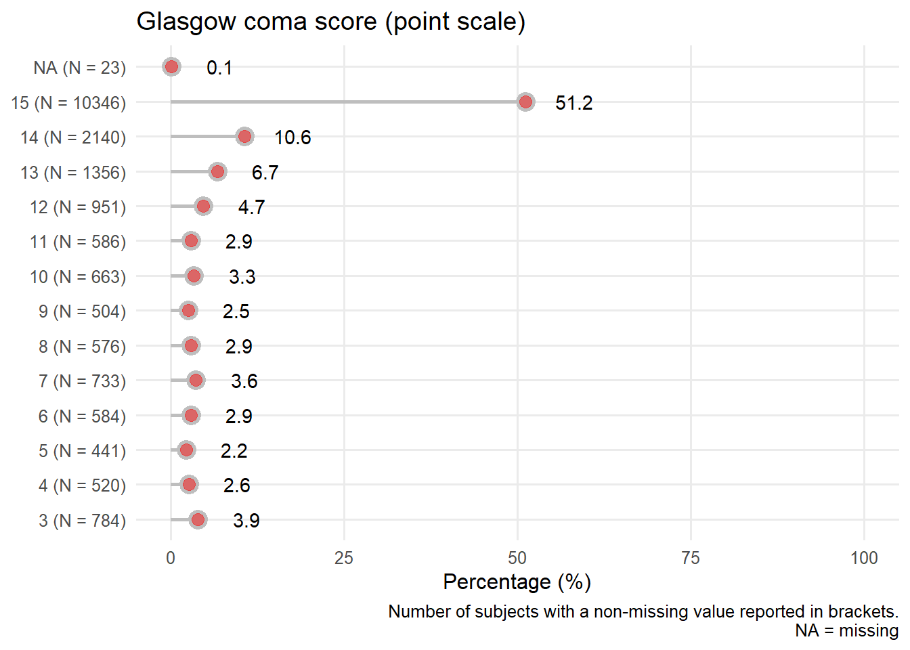
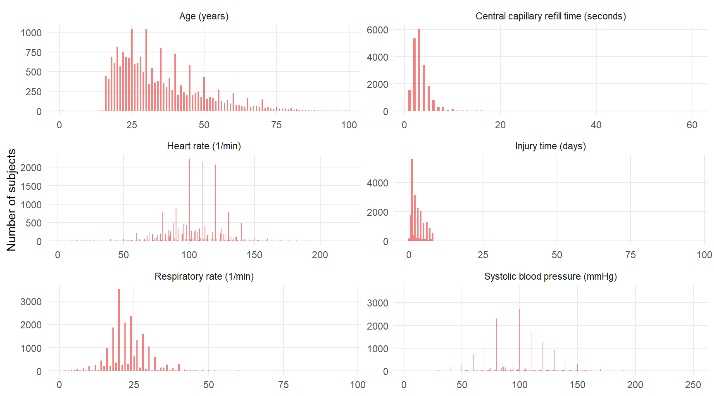
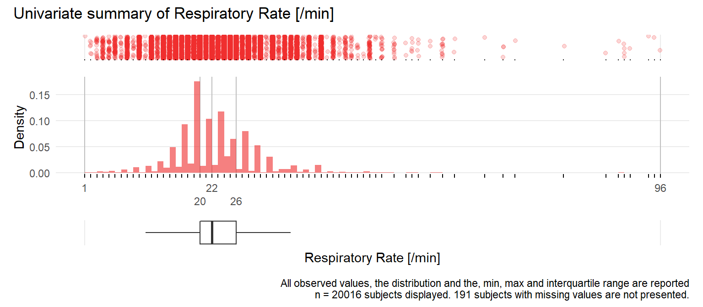

--- 
title: "Regression without regrets"
subtitle: "Workflow of initial data analyses"
author: "M. Baillie, G. Heinze & M. Huebner"
date: "2020-08-24"
knit: "rmarkdown::render_site"
site: bookdown::bookdown_site
output:
  rmdformats::readthedown:
    thumbnails: false
    lightbox: false
    gallery: TRUE
    highlight: tango
    use_bookdown: TRUE
    toc_depth: 2
    fig_caption: false
    code_folding: hide
documentclass: book
bibliography: [book.bib, packages.bib]
biblio-style: apalike
link-citations: yes
github-repo: bailliem/ida-regression-private
description: "The focus of this document/website is to provide guidance on conducting initial data analysis in a reproducible manner in the context of intended regression analyses."
---


# Overview 


The focus of this document/website is to provide guidance on conducting initial data analysis in a reproducible manner in the context of intended regression analyses.


<!--chapter:end:index.Rmd-->

# IDA Framework

The IDA framework consists of six steps [Huebner et al 2018, Figure 1], here we assume that metadata (step I) exist in sufficient detail, and that data cleaning (step II) was already performed. Metadata summarize background information about the data to properly conduct IDA steps, and a data cleaning process identifies and corrects technical errors.  The data screening (step III) examines data properties to inform decisions about the intended analysis. Initial data reporting (step IV) document insight of the previous steps and can be referred to when interpreting results from the regression modeling. Consequences of these analyses can be that the analysis plan needs to be refined or updated (step V). Finally, reporting of IDA results in research papers (step VI) are necessary to ensure transparency regarding key findings that influence the analysis or interpretation of results. Further details about the elements of IDA are discussed  in [TG3 papers].

<div class="figure" style="text-align: center">

<p class="caption">IDA framework</p>
</div>


**References**

Huebner M, le Cessie S, Schmidt CO, Vach W . A contemporary conceptual framework for initial data analysis. Observational Studies 2018; 4: 171-192. [Link](https://obsstudies.org/contemporary-conceptual-framework-initial-data-analysis/)

Huebner M, Vach W, le Cessie S, Schmidt C, Lusa L. Hidden Analyses: a review of reporting practice and recommendations for more transparent reporting of initial data analyses. BMC Med Res Meth 2020; 20:61. [Link](https://obsstudies.org/contemporary-conceptual-framework-initial-data-analysis/)

<!--chapter:end:IDA_framework.Rmd-->

# Scope of the regression analyses for the examples

Regression models can be used for a wide range of purposes, for the purpose of these examples the assumptions on the regression analysis set-up in this paper are listed in Table 1. Thus, IDA tasks will be explained in a well-defined, practically relevant setting. Since a key principle is that IDA does not touch the research question no associations between dependent (outcome)  and independent (non-outcome) variables are considered.

*Table 1:* The scope of the regression analyses considered for IDA tasks

|Aspects of the research plan|Assumptions in this paper|Reason for the assumption|
|-----------|-----------|-----------|
|Dependent (outcome) variable|One dependent variable that can be continuous or binary; exclude time-to-event or longitudinal outcomes|Explain IDA tasks in a well-defined, practically relevant setting|
|Regression models|Models with linear predictors|Explain IDA tasks in a well-defined, practically relevant setting|
|Purpose of regression model|Adjust effect of one variable of interest for confounders; quantify the effects of explanatory variables on the outcome|Explain IDA tasks in a well-defined, practically relevant setting|
|Independent variables|“explanatory” or “confounder” depending on purpose of model; small to moderate number of mixed types; Not high dimensional; no repeated measurements|To demonstrate IDA approaches for a mix of variables likely to be encountered in practice|
|Statistical analysis plan|Exists, defines the outcome variable, the type of regression model to be used, and a set of independent variables|IDA does not touch the research question, but may lead to an update or refinement of the analysis plan|


**References**:

Vach W. Regression Models as a Tool in Medical Research. Chapman/Hall CRC 2012

Harrell FE. Regression Modeling Strategies. Springer (2nd ed) 2015

Royston P and Sauerbrei W. Multivariable Model Building. Wiley (2008)

[…]

<!--chapter:end:scope.Rmd-->

# Data screening and possible actions


## Univariate distributions

||What to look at|Possible actions: Interpretation|Possible actions: SAP|Possible actions: Presentation|
|-|-|-|-|-|
| Continuous variables | General skewness | Help in interpreting results | Update SAP | Update intended presentation of results |
| Continuous   variables | General skewness | Wide CI for coefficients | Use variable as log-transformed | Update intended presentation of results |
| Continuous   variables | Outliers | Disproportional impact on results | Winsorize or transform | Model involves winsorization |
| Continuous   variables | Spike at 0 | Narrow CI at 0 | Use appropriate representation of variable in model | Use 2 (or more) coefficients to distinguish 0 from non-0 continuous part |
| Categorical variables | Frequencies | Comparisons to default reference probably irrelevant | Change reference category | Contrasts compare to (new) reference category |
| Categorical   variables | Rare categories | Wide CI for coefficients | Collapse/exclude | Fewer categories to present |
| Categorical   variables | One very frequent category | Comparisons irrelevant? | Exclude variable | Variable omitted |


## Bivariate distributions

||What to look at|Possible actions: Interpretation|Possible actions: SAP|Possible actions: Presentation|
|-|-|-|-|-|
| Continuous by continuous | Outliers (from the cloud) | Disproportional impact on results | Winsorize or transform | Model involves winsorization |
| Continuous by continuous | Correlations | Wide CI for coefficients | Winsorize or transform | Model involves winsorization |
| Continuous by categorical | Outliers (only visible in bivariate plot) | Wide CI for coefficients |||
| Categorical by categorical | Frequent/rare combinations | Comparison to default reference irrelevant | Change reference category | Contrasts compare to (new) reference category |
| Categorical by categorical | Frequent/rare combinations | interactions relevant? | Remove interaction from model | Fewer interactions to present |

## Missing values

||What to look at|Possible actions: Interpretation|Possible actions: SAP|Possible actions: Presentation|
|-|-|-|-|-|
| Per variable | Number and proportion | Wide CI for coefficients | Remove variable if many missing values |  |
| Pattern | Variables missing independently or together |  | Omit variables together | Changes model |
| Pattern | Variables missing dependent on levels of other variables | Systematic missingness? Model still based on representative? | IPW needed? | Weighted analysis |
| Complete cases | Number and proportion | Few cases left for main CCO analysis | Multiple imputation (or other way of dealing with missing values)? | Result from MI analysis? Or applicability restricted to a subpopulation? |


**References**

Huebner M, le Cessie S, Schmidt CO, Vach W . A contemporary conceptual framework for initial data analysis. Observational Studies 2018; 4: 171-192. Link

Harrell FE. Regression Modeling Strategies. Springer (2nd ed) 2015

[…]

<!--chapter:end:data_screen.Rmd-->

# CRASH-2 {-}


# Introduction to CRASH-2

Since a key principle of IDA is not to touch the research questions, before IDA commences the research aim and statistical analysis plan need to be in place. 
IDA may lead to an update or refinement of the analysis plan. To demonstrate the workflow and content of IDA, we created a hypothetical research aim and corresponding statistical analysis plan, which is described in more detail in the section [Crash2_SAP.Rmd](Crash2_SAP.Rmd).

**Hypothetical research aim for IDA** is to develop a multivariable model for early death (death within 28 days from injury) using nine independent variables of mixed type (continuous, categorical, semicontinuous) with the primary aim of prediction and a secondary aim of describing the association of each variable with the outcome. 

A prediction model was developed and validated based on this data set in "Predicting early death in patients with traumatic bleeding"  [Perel et al, BMJ 2012](https://doi.org/10.1136/bmj.e5166), [supplement available at]. The assumed research aim is in line with the prediction model


## CRASH-2 Description

Clinical Randomisation of an Antifibrinolyticin Significant Haemorrhage(CRASH-2)  was a large randomised placebo controlled trial among trauma patients with, or at risk of, significant haemorrhage, of the effects of antifibrinolytic treatment on death and transfusion requirement. The study is described at [the original trial website](http://crash2.lshtm.ac.uk/). A public version of the data set is found at a [repository of public data sets](http://biostat.mc.vanderbilt.edu/wiki/Main/DataSets) hosted by the Vanderbilt University's Department of Biostatistics (Prof. Frank Harrell Jr.).

The data set includes 20,207 patients and 44 variables. 

**Note:** In contrast to the analysis described in Perel et al, variables describing the economic region and the treatment allocation are missing in the public version of the data set, and while the data set contains 20,207 patients, the research paper mentions 20,127 patients having been included in the study.


## Crash2 dataset contents

### Source dataset 

We refer to the source data set as the dataset available online [here](http://biostat.mc.vanderbilt.edu/wiki/Main/DataSets)

Display the source dataset contents. This dataset is in the **data-raw** folder of the project directory. 

<!--html_preserve--><hr><h4>Data frame:crash2</h4>20207 observations and 44 variables, maximum # NAs:17121  
 <hr>
 <style>
 .hmisctable587337 {
 border: 1px solid gray;
 border-collapse: collapse;
 font-size: 100%;
 }
 .hmisctable587337 td {
 text-align: right;
 padding: 0 1ex 0 1ex;
 }
 .hmisctable587337 th {
 color: Black;
 text-align: center;
 padding: 0 1ex 0 1ex;
 font-weight: bold;
 }
 </style>
 <table class="hmisctable587337" border="1">
 <tr><th>Name</th><th>Labels</th><th>Units</th><th>Levels</th><th>Class</th><th>Storage</th><th>NAs</th></tr>
 <tr><td>entryid</td><td>Unique Numbers for Entry Forms</td><td></td><td></td><td>integer</td><td>integer</td><td>    0</td></tr>
 <tr><td>source</td><td>Method of Transmission of Entry Form to CC</td><td></td><td><a href="#levels.source">  5</a></td><td></td><td>integer</td><td>    0</td></tr>
 <tr><td>trandomised</td><td>Date of Randomization</td><td></td><td></td><td>Date</td><td>double</td><td>    0</td></tr>
 <tr><td>outcomeid</td><td>Unique Number From Outcome Database</td><td></td><td></td><td>integer</td><td>integer</td><td>   80</td></tr>
 <tr><td>sex</td><td></td><td></td><td><a href="#levels.sex">  2</a></td><td></td><td>integer</td><td>    1</td></tr>
 <tr><td>age</td><td></td><td></td><td></td><td></td><td>integer</td><td>    4</td></tr>
 <tr><td>injurytime</td><td>Hours Since Injury</td><td></td><td></td><td>numeric</td><td>double</td><td>   11</td></tr>
 <tr><td>injurytype</td><td></td><td></td><td><a href="#levels.injurytype">  3</a></td><td></td><td>integer</td><td>    0</td></tr>
 <tr><td>sbp</td><td>Systolic Blood Pressure</td><td>mmHg</td><td></td><td>integer</td><td>integer</td><td>  320</td></tr>
 <tr><td>rr</td><td>Respiratory Rate</td><td>/min</td><td></td><td>integer</td><td>integer</td><td>  191</td></tr>
 <tr><td>cc</td><td>Central Capillary Refille Time</td><td>s</td><td></td><td>integer</td><td>integer</td><td>  611</td></tr>
 <tr><td>hr</td><td>Heart Rate</td><td>/min</td><td></td><td>integer</td><td>integer</td><td>  137</td></tr>
 <tr><td>gcseye</td><td>Glasgow Coma Score Eye Opening</td><td></td><td></td><td>integer</td><td>integer</td><td>  732</td></tr>
 <tr><td>gcsmotor</td><td>Glasgow Coma Score Motor Response</td><td></td><td></td><td>integer</td><td>integer</td><td>  732</td></tr>
 <tr><td>gcsverbal</td><td>Glasgow Coma Score Verbal Response</td><td></td><td></td><td>integer</td><td>integer</td><td>  735</td></tr>
 <tr><td>gcs</td><td>Glasgow Coma Score Total</td><td></td><td></td><td>integer</td><td>integer</td><td>   23</td></tr>
 <tr><td>ddeath</td><td>Date of Death</td><td></td><td></td><td>Date</td><td>double</td><td>17121</td></tr>
 <tr><td>cause</td><td>Main Cause of Death</td><td></td><td><a href="#levels.cause">  7</a></td><td></td><td>integer</td><td>17118</td></tr>
 <tr><td>scauseother</td><td>Description of Other Cause of Death</td><td></td><td><a href="#levels.scauseother">227</a></td><td></td><td>integer</td><td>    0</td></tr>
 <tr><td>status</td><td>Status of Patient at Outcome if Alive</td><td></td><td><a href="#levels.status">  3</a></td><td></td><td>integer</td><td> 3169</td></tr>
 <tr><td>ddischarge</td><td>Date of discharge, transfer to other hospital or day 28 from randomization</td><td></td><td></td><td>Date</td><td>double</td><td> 3185</td></tr>
 <tr><td>condition</td><td>Condition of Patient at Outcome if Alive</td><td></td><td><a href="#levels.condition">  5</a></td><td></td><td>integer</td><td> 3251</td></tr>
 <tr><td>ndaysicu</td><td>Number of Days Spent in ICU</td><td></td><td></td><td>numeric</td><td>double</td><td>  182</td></tr>
 <tr><td>bheadinj</td><td>Significant Head Injury</td><td></td><td></td><td>integer</td><td>integer</td><td>   80</td></tr>
 <tr><td>bneuro</td><td>Neurosurgery Done</td><td></td><td></td><td>integer</td><td>integer</td><td>   80</td></tr>
 <tr><td>bchest</td><td>Chest Surgery Done</td><td></td><td></td><td>integer</td><td>integer</td><td>   80</td></tr>
 <tr><td>babdomen</td><td>Abdominal Surgery Done</td><td></td><td></td><td>integer</td><td>integer</td><td>   80</td></tr>
 <tr><td>bpelvis</td><td>Pelvis Surgery Done</td><td></td><td></td><td>integer</td><td>integer</td><td>   80</td></tr>
 <tr><td>bpe</td><td>Pulmonary Embolism</td><td></td><td></td><td>integer</td><td>integer</td><td>   80</td></tr>
 <tr><td>bdvt</td><td>Deep Vein Thrombosis</td><td></td><td></td><td>integer</td><td>integer</td><td>   80</td></tr>
 <tr><td>bstroke</td><td>Stroke</td><td></td><td></td><td>integer</td><td>integer</td><td>   80</td></tr>
 <tr><td>bbleed</td><td>Surgery for Bleeding</td><td></td><td></td><td>integer</td><td>integer</td><td>   80</td></tr>
 <tr><td>bmi</td><td>Myocardial Infarction</td><td></td><td></td><td>integer</td><td>integer</td><td>   80</td></tr>
 <tr><td>bgi</td><td>Gastrointestinal Bleeding</td><td></td><td></td><td>integer</td><td>integer</td><td>   80</td></tr>
 <tr><td>bloading</td><td>Complete Loading Dose of Trial Drug Given</td><td></td><td></td><td>integer</td><td>integer</td><td>   80</td></tr>
 <tr><td>bmaint</td><td>Complete Maintenance Dose of Trial Drug Given</td><td></td><td></td><td>integer</td><td>integer</td><td>   80</td></tr>
 <tr><td>btransf</td><td>Blood Products Transfusion</td><td></td><td></td><td>integer</td><td>integer</td><td>   80</td></tr>
 <tr><td>ncell</td><td>Number of Units of Red Call Products Transfused</td><td></td><td></td><td>numeric</td><td>double</td><td> 9963</td></tr>
 <tr><td>nplasma</td><td>Number of Units of Fresh Frozen Plasma Transfused</td><td></td><td></td><td>integer</td><td>integer</td><td> 9964</td></tr>
 <tr><td>nplatelets</td><td>Number of Units of Platelets Transfused</td><td></td><td></td><td>integer</td><td>integer</td><td> 9964</td></tr>
 <tr><td>ncryo</td><td>Number of Units of Cryoprecipitate Transfused</td><td></td><td></td><td>integer</td><td>integer</td><td> 9964</td></tr>
 <tr><td>bvii</td><td>Recombinant Factor VIIa Given</td><td></td><td></td><td>integer</td><td>integer</td><td>  374</td></tr>
 <tr><td>boxid</td><td>Treatment Box Number</td><td></td><td></td><td>integer</td><td>integer</td><td>    0</td></tr>
 <tr><td>packnum</td><td>Treatment Pack Number</td><td></td><td></td><td>integer</td><td>integer</td><td>    0</td></tr>
 </table>

 <hr>
 <style>
 .hmisctable589218 {
 border: 1px solid gray;
 border-collapse: collapse;
 font-size: 100%;
 }
 .hmisctable589218 td {
 text-align: right;
 padding: 0 1ex 0 1ex;
 }
 .hmisctable589218 th {
 color: Black;
 text-align: center;
 padding: 0 1ex 0 1ex;
 font-weight: bold;
 }
 </style>
 <table class="hmisctable589218" border="1">
 <tr><th>Variable</th><th>Levels</th></tr>
 <tr><td><a name="levels.source">source</a></td><td>telephone</td></tr>
 <tr><td></td><td>telephone entered manually</td></tr>
 <tr><td></td><td>electronic CRF by email</td></tr>
 <tr><td></td><td>paper CRF enteredd in electronic CRF</td></tr>
 <tr><td></td><td>electronic CRF</td></tr>
 <tr><td><a name="levels.status">sex</a></td><td>male</td></tr>
 <tr><td></td><td>female</td></tr>
 <tr><td><a name="levels.source">injurytype</a></td><td>blunt</td></tr>
 <tr><td></td><td>penetrating</td></tr>
 <tr><td></td><td>blunt and penetrating</td></tr>
 <tr><td><a name="levels.cause">cause</a></td><td>bleeding</td></tr>
 <tr><td></td><td>head injury</td></tr>
 <tr><td></td><td>myocardial infarction</td></tr>
 <tr><td></td><td>stroke</td></tr>
 <tr><td></td><td>pulmonary embolism</td></tr>
 <tr><td></td><td>multi organ failure</td></tr>
 <tr><td></td><td>other</td></tr>
 <tr><td><a name="levels.cause">scauseother</a></td><td></td></tr>
 <tr><td></td><td>Acute Hypoxia</td></tr>
 <tr><td></td><td>ACUTE LUNG INJURY</td></tr>
 <tr><td></td><td>Acute Pulmonary Oedema</td></tr>
 <tr><td></td><td>Acute Renal Failure</td></tr>
 <tr><td></td><td>ACUTE RESPIRATORY DISTRESS SYNDROME (ARDS)</td></tr>
 <tr><td></td><td>acute respiratory failure</td></tr>
 <tr><td></td><td>acute respiratory failure+sepsis</td></tr>
 <tr><td></td><td>air amboli (embolism)</td></tr>
 <tr><td></td><td>Air embolism caused by penetrating lung trauma</td></tr>
 <tr><td></td><td>...</td></tr>
 <tr><td><a name="levels.source">status</a></td><td>discharged</td></tr>
 <tr><td></td><td>still in hospital</td></tr>
 <tr><td></td><td>transferred to other hospital</td></tr>
 <tr><td><a name="levels.cause">condition</a></td><td>no symptoms</td></tr>
 <tr><td></td><td>minor symptoms</td></tr>
 <tr><td></td><td>some restriction in lifestyle but independent</td></tr>
 <tr><td></td><td>dependent, but not requiring constant attention</td></tr>
 <tr><td></td><td>fully dependent, requiring attention day and night</td></tr>
 </table>

 <hr>
<!--/html_preserve-->


### Updated analysis dataset

Additional meta-data is added to the original *source* data set. We write this new modified data set back to the **data** folder after adding additional meta-data for the following variables:

* **age** - add label "Age" and unit "years". 
* **injury time** - add unit "hours". 
* **total Glasgow coma score** - add unit "points". 


At the stage we select the variables of interest to take in to the IDA phase by dropping variables we do not check in IDA.

As a cross check we display the contents again to ensure the additional data is added, and then write back the changes to the data folder in the file "data/a_crash2.rds". 

Input object size:	 1221480 bytes;	 12 variables	 20207 observations
New object size:	1223272 bytes;	12 variables	20207 observations
Input object size:	 1546808 bytes;	 14 variables	 20207 observations
New object size:	1385720 bytes;	14 variables	20207 observations
<!--html_preserve--><hr><h4>Data frame:a_crash2</h4>20207 observations and 14 variables, maximum # NAs:17121  
 <hr>
 <style>
 .hmisctable914732 {
 border: 1px solid gray;
 border-collapse: collapse;
 font-size: 100%;
 }
 .hmisctable914732 td {
 text-align: right;
 padding: 0 1ex 0 1ex;
 }
 .hmisctable914732 th {
 color: Black;
 text-align: center;
 padding: 0 1ex 0 1ex;
 font-weight: bold;
 }
 </style>
 <table class="hmisctable914732" border="1">
 <tr><th>Name</th><th>Labels</th><th>Units</th><th>Levels</th><th>Class</th><th>Storage</th><th>NAs</th></tr>
 <tr><td>entryid</td><td>Unique Numbers for Entry Forms</td><td></td><td></td><td>integer</td><td>integer</td><td>    0</td></tr>
 <tr><td>trandomised</td><td>Date of Randomization</td><td></td><td></td><td>Date</td><td>double</td><td>    0</td></tr>
 <tr><td>ddeath</td><td>Date of Death</td><td></td><td></td><td>Date</td><td>double</td><td>17121</td></tr>
 <tr><td>age</td><td>Age</td><td>years</td><td></td><td>integer</td><td>integer</td><td>    4</td></tr>
 <tr><td>sex</td><td>Sex</td><td></td><td><a href="#levels.sex">2</a></td><td></td><td>integer</td><td>    1</td></tr>
 <tr><td>sbp</td><td>Systolic Blood Pressure</td><td>mmHg</td><td></td><td>integer</td><td>integer</td><td>  320</td></tr>
 <tr><td>hr</td><td>Heart Rate</td><td>/min</td><td></td><td>integer</td><td>integer</td><td>  137</td></tr>
 <tr><td>rr</td><td>Respiratory Rate</td><td>/min</td><td></td><td>integer</td><td>integer</td><td>  191</td></tr>
 <tr><td>gcs</td><td>Glasgow Coma Score Total</td><td>points</td><td></td><td>integer</td><td>integer</td><td>   23</td></tr>
 <tr><td>cc</td><td>Central Capillary Refille Time</td><td>s</td><td></td><td>integer</td><td>integer</td><td>  611</td></tr>
 <tr><td>injurytime</td><td>Hours Since Injury</td><td>hours</td><td></td><td>numeric</td><td>double</td><td>   11</td></tr>
 <tr><td>injurytype</td><td>Injury type</td><td></td><td><a href="#levels.injurytype">3</a></td><td></td><td>integer</td><td>    0</td></tr>
 <tr><td>time2death</td><td></td><td></td><td></td><td></td><td>integer</td><td>17121</td></tr>
 <tr><td>earlydeath</td><td>Death within 28 days from injury</td><td></td><td></td><td>integer</td><td>integer</td><td>    0</td></tr>
 </table>

 <hr>
 <style>
 .hmisctable177447 {
 border: 1px solid gray;
 border-collapse: collapse;
 font-size: 100%;
 }
 .hmisctable177447 td {
 text-align: right;
 padding: 0 1ex 0 1ex;
 }
 .hmisctable177447 th {
 color: Black;
 text-align: center;
 padding: 0 1ex 0 1ex;
 font-weight: bold;
 }
 </style>
 <table class="hmisctable177447" border="1">
 <tr><th>Variable</th><th>Levels</th></tr>
 <tr><td><a name="levels.sex">sex</a></td><td>male</td></tr>
 <tr><td></td><td>female</td></tr>
 <tr><td><a name="levels.sex">injurytype</a></td><td>blunt</td></tr>
 <tr><td></td><td>penetrating</td></tr>
 <tr><td></td><td>blunt and penetrating</td></tr>
 </table>

 <hr>
<!--/html_preserve-->

## Chapter session info


```
## R version 3.6.1 (2019-07-05)
## Platform: x86_64-w64-mingw32/x64 (64-bit)
## Running under: Windows 10 x64 (build 17763)
## 
## Matrix products: default
## 
## locale:
## [1] LC_COLLATE=English_United States.1252 
## [2] LC_CTYPE=English_United States.1252   
## [3] LC_MONETARY=English_United States.1252
## [4] LC_NUMERIC=C                          
## [5] LC_TIME=English_United States.1252    
## 
## attached base packages:
## [1] stats     graphics  grDevices utils     datasets  methods   base     
## 
## other attached packages:
##  [1] Hmisc_4.4-0     Formula_1.2-3   survival_3.2-3  lattice_0.20-40
##  [5] forcats_0.5.0   stringr_1.4.0   dplyr_0.8.5     purrr_0.3.4    
##  [9] readr_1.3.1     tidyr_1.0.2     tibble_3.0.1    ggplot2_3.3.0  
## [13] tidyverse_1.3.0 here_0.1       
## 
## loaded via a namespace (and not attached):
##  [1] Rcpp_1.0.4.6        lubridate_1.7.4     png_0.1-7          
##  [4] assertthat_0.2.1    rprojroot_1.3-2     digest_0.6.25      
##  [7] R6_2.4.1            cellranger_1.1.0    backports_1.1.7    
## [10] acepack_1.4.1       reprex_0.3.0        evaluate_0.14      
## [13] httr_1.4.1          pillar_1.4.4        rlang_0.4.6        
## [16] readxl_1.3.1        data.table_1.12.8   rstudioapi_0.11    
## [19] rpart_4.1-15        Matrix_1.2-18       checkmate_2.0.0    
## [22] rmarkdown_2.1       splines_3.6.1       foreign_0.8-76     
## [25] htmlwidgets_1.5.1   munsell_0.5.0       broom_0.5.5        
## [28] compiler_3.6.1      modelr_0.1.6        xfun_0.12          
## [31] pkgconfig_2.0.3     base64enc_0.1-3     htmltools_0.4.0    
## [34] nnet_7.3-13         tidyselect_1.1.0    htmlTable_1.13.3   
## [37] gridExtra_2.3       bookdown_0.18       fansi_0.4.1        
## [40] crayon_1.3.4        dbplyr_1.4.2        withr_2.2.0        
## [43] grid_3.6.1          nlme_3.1-145        jsonlite_1.6.1     
## [46] gtable_0.3.0        lifecycle_0.2.0     DBI_1.1.0          
## [49] magrittr_1.5        scales_1.1.1        rmdformats_0.3.7   
## [52] cli_2.0.2           stringi_1.4.6       fs_1.3.2           
## [55] latticeExtra_0.6-29 xml2_1.2.5          ellipsis_0.3.0     
## [58] generics_0.0.2      vctrs_0.3.0         RColorBrewer_1.1-2 
## [61] tools_3.6.1         glue_1.4.1          hms_0.5.3          
## [64] jpeg_0.1-8.1        yaml_2.2.1          colorspace_1.4-1   
## [67] cluster_2.1.0       rvest_0.3.5         knitr_1.28         
## [70] haven_2.2.0
```


<!--chapter:end:Crash2_intro.Rmd-->


# Statistical analysis plan


Since a key principle of IDA is not to touch the research questions, before IDA commences the research aim and statistical analysis plan needs to be in place. 
IDA may lead to an update or refinement of the analysis plan. To demonstrate the workflow and content of IDA, we created a hypothetical research aim and corresponding statistical analysis plan.
 
**Hypothetical research aim for IDA:** Develop a multivariable model for early death (death within 28 days from injury) using nine independent variables of mixed type (continuous, categorical, semicontinuous) with the primary aim of prediction and a secondary aim of describing the association of each variable with the outcome. 

The assumed analysis aim is in line with the prediction model presented by [Perel et al, BMJ 2012](https://doi.org/10.1136/bmj.e5166), [supplement available at](https://www.bmj.com/highwire/filestream/634478/field_highwire_adjunct_files/0/perp003158.ww1_default.pdf). 

## Outcome variable

Early death, i.e. in-hospital death within 28 days from injury (binary variable)

## Statistical methods 

Logistic regression will be used to model early death by the following independent variables (measured at randomisation) deemed important to predict early death.

Demographic measurements:

* Age (`age`, years)
* Sex (`sex`, male or female)

Physiological measurements:

* Systolic blood pressure (`sbp`, mmHg)
* Heart rate (`hr`, 1/min)
* Respiratory rate (`rr`, 1/min)
* Glasgow coma score (`gcs`, points)
* Central capillary refill time (`cc`, seconds)

Characteristics of injury measurements:

* Time since injury (`injurytime`, hours)
* Type of injury (`injurytype`, 'blunt', 'penetrating' or 'blunt and penetrating')
 
Restricted cubic splines with 3 degrees of freedom with knots set to default values will be used for continuous variables. As the final prediction model should be parsimonious enough to simplify its application, a backward elimination algorithm with a significance level set at $\alpha=0.05$ will be applied to remove statistically insignificant effects. Finally, nonlinear representation of each continuous variable will be tested against linear representation at $\alpha=0.05$. In case of lacking added value of a nonlinear effect, the model will be refitted with a linear effect for that variable.

## Remarks

* Regarding type of injury, the original paper describes its treatment in the model as follows: 'Type of injury had three categories—-penetrating, blunt, or blunt and penetrating—but we analysed it as 'penetrating' or 'blunt and penetrating.' ' It is not clear from that description what happened to the 'blunt' group. (I assume they were collapsed with 'blunt and penetrating'.)  ** we are going to consider the three categories, and then check aout recommendations for the final analysis-MH**

* The original paper describes the modeling approach as follows: 'We used a backward step-wise approach. Firstly, we included all potential prognostic factors and interaction terms that users considered plausible. These interactions included all potential predictors with type of injury, time since injury, and age. We then removed, one at a time, terms for which we found no strong evidence of an association, judged according to the P values (<0.05) from the Wald test.'  This would mean they tested at least 24 interaction terms, each possibly using several degrees of freedom! In the final model, only an interaction of Glasgow coma score and type of injury was included.


## Preparations

The outcome variable, early death (i.e., death within 28 days from injury) must be computed from the time span between date of death and date of randomization using the following logic:

* transform ddeath and trandomisation into an interpretable date format and then compute the difference
* interpret missing (i.e. NAs) as 'not died within study period, at least not within 28 days'
* if patients died after 28 days, treat as alive 


This can be derived using the following code logic:


```r
## NOTE: This is for demostration purposes, this code is not run here. 
## The derivation was executed earlier. 

a_crash2$time2death <-
  as.numeric(as.Date(a_crash2$ddeath) - as.Date(a_crash2$trandomised))

a_crash2$earlydeath[!is.na(a_crash2$time2death)] <-
  (a_crash2$time2death[!is.na(a_crash2$time2death)] <= 28) + 0

# +0 to transform it from TRUE/FALSE to 1/0
# NA in time2death means alive at day 28
a_crash2$earlydeath[is.na(a_crash2$time2death)] <- 0    
```

We also display the marginal distribution of the derived outcome variable. 


```r
a_crash2 %>%
  dplyr::select(earlydeath) %>%
  gtsummary::tbl_summary()
```

<!--html_preserve--><style>html {
  font-family: -apple-system, BlinkMacSystemFont, 'Segoe UI', Roboto, Oxygen, Ubuntu, Cantarell, 'Helvetica Neue', 'Fira Sans', 'Droid Sans', Arial, sans-serif;
}

#xxbugdnwch .gt_table {
  display: table;
  border-collapse: collapse;
  margin-left: auto;
  margin-right: auto;
  color: #333333;
  font-size: 16px;
  background-color: #FFFFFF;
  width: auto;
  border-top-style: solid;
  border-top-width: 2px;
  border-top-color: #A8A8A8;
  border-right-style: none;
  border-right-width: 2px;
  border-right-color: #D3D3D3;
  border-bottom-style: solid;
  border-bottom-width: 2px;
  border-bottom-color: #A8A8A8;
  border-left-style: none;
  border-left-width: 2px;
  border-left-color: #D3D3D3;
}

#xxbugdnwch .gt_heading {
  background-color: #FFFFFF;
  text-align: center;
  border-bottom-color: #FFFFFF;
  border-left-style: none;
  border-left-width: 1px;
  border-left-color: #D3D3D3;
  border-right-style: none;
  border-right-width: 1px;
  border-right-color: #D3D3D3;
}

#xxbugdnwch .gt_title {
  color: #333333;
  font-size: 125%;
  font-weight: initial;
  padding-top: 4px;
  padding-bottom: 4px;
  border-bottom-color: #FFFFFF;
  border-bottom-width: 0;
}

#xxbugdnwch .gt_subtitle {
  color: #333333;
  font-size: 85%;
  font-weight: initial;
  padding-top: 0;
  padding-bottom: 4px;
  border-top-color: #FFFFFF;
  border-top-width: 0;
}

#xxbugdnwch .gt_bottom_border {
  border-bottom-style: solid;
  border-bottom-width: 2px;
  border-bottom-color: #D3D3D3;
}

#xxbugdnwch .gt_col_headings {
  border-top-style: solid;
  border-top-width: 2px;
  border-top-color: #D3D3D3;
  border-bottom-style: solid;
  border-bottom-width: 2px;
  border-bottom-color: #D3D3D3;
  border-left-style: none;
  border-left-width: 1px;
  border-left-color: #D3D3D3;
  border-right-style: none;
  border-right-width: 1px;
  border-right-color: #D3D3D3;
}

#xxbugdnwch .gt_col_heading {
  color: #333333;
  background-color: #FFFFFF;
  font-size: 100%;
  font-weight: normal;
  text-transform: inherit;
  border-left-style: none;
  border-left-width: 1px;
  border-left-color: #D3D3D3;
  border-right-style: none;
  border-right-width: 1px;
  border-right-color: #D3D3D3;
  vertical-align: bottom;
  padding-top: 5px;
  padding-bottom: 6px;
  padding-left: 5px;
  padding-right: 5px;
  overflow-x: hidden;
}

#xxbugdnwch .gt_column_spanner_outer {
  color: #333333;
  background-color: #FFFFFF;
  font-size: 100%;
  font-weight: normal;
  text-transform: inherit;
  padding-top: 0;
  padding-bottom: 0;
  padding-left: 4px;
  padding-right: 4px;
}

#xxbugdnwch .gt_column_spanner_outer:first-child {
  padding-left: 0;
}

#xxbugdnwch .gt_column_spanner_outer:last-child {
  padding-right: 0;
}

#xxbugdnwch .gt_column_spanner {
  border-bottom-style: solid;
  border-bottom-width: 2px;
  border-bottom-color: #D3D3D3;
  vertical-align: bottom;
  padding-top: 5px;
  padding-bottom: 6px;
  overflow-x: hidden;
  display: inline-block;
  width: 100%;
}

#xxbugdnwch .gt_group_heading {
  padding: 8px;
  color: #333333;
  background-color: #FFFFFF;
  font-size: 100%;
  font-weight: initial;
  text-transform: inherit;
  border-top-style: solid;
  border-top-width: 2px;
  border-top-color: #D3D3D3;
  border-bottom-style: solid;
  border-bottom-width: 2px;
  border-bottom-color: #D3D3D3;
  border-left-style: none;
  border-left-width: 1px;
  border-left-color: #D3D3D3;
  border-right-style: none;
  border-right-width: 1px;
  border-right-color: #D3D3D3;
  vertical-align: middle;
}

#xxbugdnwch .gt_empty_group_heading {
  padding: 0.5px;
  color: #333333;
  background-color: #FFFFFF;
  font-size: 100%;
  font-weight: initial;
  border-top-style: solid;
  border-top-width: 2px;
  border-top-color: #D3D3D3;
  border-bottom-style: solid;
  border-bottom-width: 2px;
  border-bottom-color: #D3D3D3;
  vertical-align: middle;
}

#xxbugdnwch .gt_striped {
  background-color: rgba(128, 128, 128, 0.05);
}

#xxbugdnwch .gt_from_md > :first-child {
  margin-top: 0;
}

#xxbugdnwch .gt_from_md > :last-child {
  margin-bottom: 0;
}

#xxbugdnwch .gt_row {
  padding-top: 8px;
  padding-bottom: 8px;
  padding-left: 5px;
  padding-right: 5px;
  margin: 10px;
  border-top-style: solid;
  border-top-width: 1px;
  border-top-color: #D3D3D3;
  border-left-style: none;
  border-left-width: 1px;
  border-left-color: #D3D3D3;
  border-right-style: none;
  border-right-width: 1px;
  border-right-color: #D3D3D3;
  vertical-align: middle;
  overflow-x: hidden;
}

#xxbugdnwch .gt_stub {
  color: #333333;
  background-color: #FFFFFF;
  font-size: 100%;
  font-weight: initial;
  text-transform: inherit;
  border-right-style: solid;
  border-right-width: 2px;
  border-right-color: #D3D3D3;
  padding-left: 12px;
}

#xxbugdnwch .gt_summary_row {
  color: #333333;
  background-color: #FFFFFF;
  text-transform: inherit;
  padding-top: 8px;
  padding-bottom: 8px;
  padding-left: 5px;
  padding-right: 5px;
}

#xxbugdnwch .gt_first_summary_row {
  padding-top: 8px;
  padding-bottom: 8px;
  padding-left: 5px;
  padding-right: 5px;
  border-top-style: solid;
  border-top-width: 2px;
  border-top-color: #D3D3D3;
}

#xxbugdnwch .gt_grand_summary_row {
  color: #333333;
  background-color: #FFFFFF;
  text-transform: inherit;
  padding-top: 8px;
  padding-bottom: 8px;
  padding-left: 5px;
  padding-right: 5px;
}

#xxbugdnwch .gt_first_grand_summary_row {
  padding-top: 8px;
  padding-bottom: 8px;
  padding-left: 5px;
  padding-right: 5px;
  border-top-style: double;
  border-top-width: 6px;
  border-top-color: #D3D3D3;
}

#xxbugdnwch .gt_table_body {
  border-top-style: solid;
  border-top-width: 2px;
  border-top-color: #D3D3D3;
  border-bottom-style: solid;
  border-bottom-width: 2px;
  border-bottom-color: #D3D3D3;
}

#xxbugdnwch .gt_footnotes {
  color: #333333;
  background-color: #FFFFFF;
  border-bottom-style: none;
  border-bottom-width: 2px;
  border-bottom-color: #D3D3D3;
  border-left-style: none;
  border-left-width: 2px;
  border-left-color: #D3D3D3;
  border-right-style: none;
  border-right-width: 2px;
  border-right-color: #D3D3D3;
}

#xxbugdnwch .gt_footnote {
  margin: 0px;
  font-size: 90%;
  padding: 4px;
}

#xxbugdnwch .gt_sourcenotes {
  color: #333333;
  background-color: #FFFFFF;
  border-bottom-style: none;
  border-bottom-width: 2px;
  border-bottom-color: #D3D3D3;
  border-left-style: none;
  border-left-width: 2px;
  border-left-color: #D3D3D3;
  border-right-style: none;
  border-right-width: 2px;
  border-right-color: #D3D3D3;
}

#xxbugdnwch .gt_sourcenote {
  font-size: 90%;
  padding: 4px;
}

#xxbugdnwch .gt_left {
  text-align: left;
}

#xxbugdnwch .gt_center {
  text-align: center;
}

#xxbugdnwch .gt_right {
  text-align: right;
  font-variant-numeric: tabular-nums;
}

#xxbugdnwch .gt_font_normal {
  font-weight: normal;
}

#xxbugdnwch .gt_font_bold {
  font-weight: bold;
}

#xxbugdnwch .gt_font_italic {
  font-style: italic;
}

#xxbugdnwch .gt_super {
  font-size: 65%;
}

#xxbugdnwch .gt_footnote_marks {
  font-style: italic;
  font-size: 65%;
}
</style>
<div id="xxbugdnwch" style="overflow-x:auto;overflow-y:auto;width:auto;height:auto;"><table class="gt_table">
  
  <thead class="gt_col_headings">
    <tr>
      <th class="gt_col_heading gt_columns_bottom_border gt_left" rowspan="1" colspan="1"><strong>Characteristic</strong></th>
      <th class="gt_col_heading gt_columns_bottom_border gt_center" rowspan="1" colspan="1"><strong>N = 20207</strong><sup class="gt_footnote_marks">1</sup></th>
    </tr>
  </thead>
  <tbody class="gt_table_body">
    <tr>
      <td class="gt_row gt_left">Death within 28 days from injury</td>
      <td class="gt_row gt_center">3076 (15%)</td>
    </tr>
  </tbody>
  
  <tfoot>
    <tr class="gt_footnotes">
      <td colspan="2">
        <p class="gt_footnote">
          <sup class="gt_footnote_marks">
            <em>1</em>
          </sup>
           
          Statistics presented: n (%)
          <br />
        </p>
      </td>
    </tr>
  </tfoot>
</table></div><!--/html_preserve-->


The number of deaths computed in the data set coincides with the number reported in [Perel et al, BMJ 2012](https://doi.org/10.1136/bmj.e5166).


## Sources

Data obtained from http://biostat.mc.vanderbilt.edu/wiki/Main/DataSets 

To download the data set, click the [link to data set](http://biostat.mc.vanderbilt.edu/wiki/pub/Main/DataSets/crash2.rda)

### Data dictionary  

The data dictionary can be found [LINK](http://biostat.mc.vanderbilt.edu/wiki/pub/Main/DataSets/crash2.html)

## References

CRASH-2 Collaborators. Effects of tranexamic acid on death, vascular occlusive events, and blood transfusion in trauma patients with significant haemorrhage (CRASH-2): a randomised, placebo-controlled trial. Lancet 2010;376:23-32

Perel P, Prieto-Merino D, Shakur H, Clayton T, Lecky F, Bouamra O, Russell R, Faulkner M, Steyerberg EW, Roberts I. Predicting early death in patients with traumatic bleeding: development and validation of prognostic model. BMJ 2012; 345(aug15 1): e5166.

<!--chapter:end:Crash2_SAP.Rmd-->

# Univariate distributions

Univariate summary CRASH-2 dataset 


## Data set overview

Using Hmisc describe function, provide an overview of the data set is provided including histograms of continuous variables.  

### Demographic variables

<!--html_preserve--><meta http-equiv="Content-Type" content="text/html; charset=utf-8" /> 
<script type="text/javascript">
<!--
    function expand_collapse(id) {
       var e = document.getElementById(id);
       var f = document.getElementById(id+"_earrows");
       if(e.style.display == 'none'){
          e.style.display = 'block';
          f.innerHTML = '&#9650';
       }
       else {
          e.style.display = 'none';
          f.innerHTML = '&#9660';
       }
    }
//-->
</script>
<style>
.earrows {color:silver;font-size:11px;}

fcap {
 font-family: Verdana;
 font-size: 12px;
 color: MidnightBlue
 }

smg {
 font-family: Verdana;
 font-size: 10px;
 color: &#808080;
}

hr.thinhr { margin-top: 0.15em; margin-bottom: 0.15em; }

span.xscript {
position: relative;
}
span.xscript sub {
position: absolute;
left: 0.1em;
bottom: -1ex;
}
</style>
 <font color="MidnightBlue"><div align=center><span style="font-weight:bold">Demographic variables <br><br> 2  Variables   20207  Observations</span></div></font> <hr class="thinhr"> <span style="font-weight:bold">age</span>: Age <span style='font-family:Verdana;font-size:75%;'>years</span><div style='float: right; text-align: right;'></div> <style>
 .hmisctable273108 {
 border: none;
 font-size: 80%;
 }
 .hmisctable273108 td {
 text-align: center;
 padding: 0 1ex 0 1ex;
 }
 .hmisctable273108 th {
 color: MidnightBlue;
 text-align: center;
 padding: 0 1ex 0 1ex;
 font-weight: normal;
 }
 </style>
 <table class="hmisctable273108">
 <tr><th>n</th><th>missing</th><th>distinct</th><th>Info</th><th>Mean</th><th>Gmd</th><th>.05</th><th>.10</th><th>.25</th><th>.50</th><th>.75</th><th>.90</th><th>.95</th></tr>
 <tr><td>20203</td><td>4</td><td>84</td><td>0.999</td><td>34.56</td><td>15.55</td><td>18</td><td>19</td><td>24</td><td>30</td><td>43</td><td>55</td><td>64</td></tr>
 </table>
 <span style="font-size: 85%;"><font color="MidnightBlue">lowest</font> :  1 14 15 16 17 ,  <font color="MidnightBlue">highest</font>: 92 94 95 96 99</span> <hr class="thinhr"> <span style="font-weight:bold">sex</span>: Sex <style>
 .hmisctable381140 {
 border: none;
 font-size: 80%;
 }
 .hmisctable381140 td {
 text-align: center;
 padding: 0 1ex 0 1ex;
 }
 .hmisctable381140 th {
 color: MidnightBlue;
 text-align: center;
 padding: 0 1ex 0 1ex;
 font-weight: normal;
 }
 </style>
 <table class="hmisctable381140">
 <tr><th>n</th><th>missing</th><th>distinct</th></tr>
 <tr><td>20206</td><td>1</td><td>2</td></tr>
 </table>
 <pre style="font-size:85%;">
 Value        male female
 Frequency   16935   3271
 Proportion  0.838  0.162
 </pre>
 <hr class="thinhr"><!--/html_preserve-->


### Physiological measurements

<!--html_preserve--><meta http-equiv="Content-Type" content="text/html; charset=utf-8" /> 
<script type="text/javascript">
<!--
    function expand_collapse(id) {
       var e = document.getElementById(id);
       var f = document.getElementById(id+"_earrows");
       if(e.style.display == 'none'){
          e.style.display = 'block';
          f.innerHTML = '&#9650';
       }
       else {
          e.style.display = 'none';
          f.innerHTML = '&#9660';
       }
    }
//-->
</script>
<style>
.earrows {color:silver;font-size:11px;}

fcap {
 font-family: Verdana;
 font-size: 12px;
 color: MidnightBlue
 }

smg {
 font-family: Verdana;
 font-size: 10px;
 color: &#808080;
}

hr.thinhr { margin-top: 0.15em; margin-bottom: 0.15em; }

span.xscript {
position: relative;
}
span.xscript sub {
position: absolute;
left: 0.1em;
bottom: -1ex;
}
</style>
 <font color="MidnightBlue"><div align=center><span style="font-weight:bold">Physiological measurements <br><br> 5  Variables   20207  Observations</span></div></font> <hr class="thinhr"> <span style="font-weight:bold">sbp</span>: Systolic Blood Pressure <span style='font-family:Verdana;font-size:75%;'>mmHg</span><div style='float: right; text-align: right;'></div> <style>
 .hmisctable413935 {
 border: none;
 font-size: 80%;
 }
 .hmisctable413935 td {
 text-align: center;
 padding: 0 1ex 0 1ex;
 }
 .hmisctable413935 th {
 color: MidnightBlue;
 text-align: center;
 padding: 0 1ex 0 1ex;
 font-weight: normal;
 }
 </style>
 <table class="hmisctable413935">
 <tr><th>n</th><th>missing</th><th>distinct</th><th>Info</th><th>Mean</th><th>Gmd</th><th>.05</th><th>.10</th><th>.25</th><th>.50</th><th>.75</th><th>.90</th><th>.95</th></tr>
 <tr><td>19887</td><td>320</td><td>173</td><td>0.989</td><td>98.45</td><td>27.86</td><td> 60</td><td> 70</td><td> 80</td><td> 95</td><td>110</td><td>130</td><td>143</td></tr>
 </table>
 <span style="font-size: 85%;"><font color="MidnightBlue">lowest</font> :   4  10  12  20  25 ,  <font color="MidnightBlue">highest</font>: 225 230 234 240 250</span> <hr class="thinhr"> <span style="font-weight:bold">hr</span>: Heart Rate <span style='font-family:Verdana;font-size:75%;'>/min</span><div style='float: right; text-align: right;'></div> <style>
 .hmisctable378588 {
 border: none;
 font-size: 80%;
 }
 .hmisctable378588 td {
 text-align: center;
 padding: 0 1ex 0 1ex;
 }
 .hmisctable378588 th {
 color: MidnightBlue;
 text-align: center;
 padding: 0 1ex 0 1ex;
 font-weight: normal;
 }
 </style>
 <table class="hmisctable378588">
 <tr><th>n</th><th>missing</th><th>distinct</th><th>Info</th><th>Mean</th><th>Gmd</th><th>.05</th><th>.10</th><th>.25</th><th>.50</th><th>.75</th><th>.90</th><th>.95</th></tr>
 <tr><td>20070</td><td>137</td><td>173</td><td>0.996</td><td>104.5</td><td>23.38</td><td> 70</td><td> 80</td><td> 90</td><td>105</td><td>120</td><td>130</td><td>140</td></tr>
 </table>
 <span style="font-size: 85%;"><font color="MidnightBlue">lowest</font> :   3   4   5   6  10 ,  <font color="MidnightBlue">highest</font>: 190 192 198 200 220</span> <hr class="thinhr"> <span style="font-weight:bold">rr</span>: Respiratory Rate <span style='font-family:Verdana;font-size:75%;'>/min</span><div style='float: right; text-align: right;'></div> <style>
 .hmisctable103893 {
 border: none;
 font-size: 80%;
 }
 .hmisctable103893 td {
 text-align: center;
 padding: 0 1ex 0 1ex;
 }
 .hmisctable103893 th {
 color: MidnightBlue;
 text-align: center;
 padding: 0 1ex 0 1ex;
 font-weight: normal;
 }
 </style>
 <table class="hmisctable103893">
 <tr><th>n</th><th>missing</th><th>distinct</th><th>Info</th><th>Mean</th><th>Gmd</th><th>.05</th><th>.10</th><th>.25</th><th>.50</th><th>.75</th><th>.90</th><th>.95</th></tr>
 <tr><td>20016</td><td>191</td><td>68</td><td>0.99</td><td>23.06</td><td>7.052</td><td>14</td><td>16</td><td>20</td><td>22</td><td>26</td><td>30</td><td>35</td></tr>
 </table>
 <span style="font-size: 85%;"><font color="MidnightBlue">lowest</font> :  1  2  3  4  5 ,  <font color="MidnightBlue">highest</font>: 90 91 94 95 96</span> <hr class="thinhr"> <span style="font-weight:bold">gcs</span>: Glasgow Coma Score Total <span style='font-family:Verdana;font-size:75%;'>points</span><div style='float: right; text-align: right;'></div> <style>
 .hmisctable461540 {
 border: none;
 font-size: 80%;
 }
 .hmisctable461540 td {
 text-align: center;
 padding: 0 1ex 0 1ex;
 }
 .hmisctable461540 th {
 color: MidnightBlue;
 text-align: center;
 padding: 0 1ex 0 1ex;
 font-weight: normal;
 }
 </style>
 <table class="hmisctable461540">
 <tr><th>n</th><th>missing</th><th>distinct</th><th>Info</th><th>Mean</th><th>Gmd</th><th>.05</th><th>.10</th><th>.25</th><th>.50</th><th>.75</th><th>.90</th><th>.95</th></tr>
 <tr><td>20184</td><td>23</td><td>13</td><td>0.863</td><td>12.47</td><td>3.594</td><td> 4</td><td> 6</td><td>11</td><td>15</td><td>15</td><td>15</td><td>15</td></tr>
 </table>
 <span style="font-size: 85%;"><font color="MidnightBlue">lowest</font> :  3  4  5  6  7 ,  <font color="MidnightBlue">highest</font>: 11 12 13 14 15</span> <pre style="font-size:85%;">
 Value          3     4     5     6     7     8     9    10    11    12    13    14
 Frequency    784   520   441   584   733   576   504   663   586   951  1356  2140
 Proportion 0.039 0.026 0.022 0.029 0.036 0.029 0.025 0.033 0.029 0.047 0.067 0.106
                 
 Value         15
 Frequency  10346
 Proportion 0.513
 </pre>
 <hr class="thinhr"> <span style="font-weight:bold">cc</span>: Central Capillary Refille Time <span style='font-family:Verdana;font-size:75%;'>s</span><div style='float: right; text-align: right;'></div> <style>
 .hmisctable681598 {
 border: none;
 font-size: 80%;
 }
 .hmisctable681598 td {
 text-align: center;
 padding: 0 1ex 0 1ex;
 }
 .hmisctable681598 th {
 color: MidnightBlue;
 text-align: center;
 padding: 0 1ex 0 1ex;
 font-weight: normal;
 }
 </style>
 <table class="hmisctable681598">
 <tr><th>n</th><th>missing</th><th>distinct</th><th>Info</th><th>Mean</th><th>Gmd</th><th>.05</th><th>.10</th><th>.25</th><th>.50</th><th>.75</th><th>.90</th><th>.95</th></tr>
 <tr><td>19596</td><td>611</td><td>20</td><td>0.945</td><td>3.267</td><td>1.67</td><td>1</td><td>2</td><td>2</td><td>3</td><td>4</td><td>5</td><td>6</td></tr>
 </table>
 <span style="font-size: 85%;"><font color="MidnightBlue">lowest</font> :  1  2  3  4  5 ,  <font color="MidnightBlue">highest</font>: 17 18 20 30 60</span> <pre style="font-size:85%;">
 Value          1     2     3     4     5     6     7     8     9    10    11    12
 Frequency   1510  5328  6020  3367  1805   802   268   271    45   139     3     7
 Proportion 0.077 0.272 0.307 0.172 0.092 0.041 0.014 0.014 0.002 0.007 0.000 0.000
                                                           
 Value         13    15    16    17    18    20    30    60
 Frequency      3    19     3     1     1     2     1     1
 Proportion 0.000 0.001 0.000 0.000 0.000 0.000 0.000 0.000
 </pre>
 <hr class="thinhr"><!--/html_preserve-->

### Characteristics of injury

<!--html_preserve--><meta http-equiv="Content-Type" content="text/html; charset=utf-8" /> 
<script type="text/javascript">
<!--
    function expand_collapse(id) {
       var e = document.getElementById(id);
       var f = document.getElementById(id+"_earrows");
       if(e.style.display == 'none'){
          e.style.display = 'block';
          f.innerHTML = '&#9650';
       }
       else {
          e.style.display = 'none';
          f.innerHTML = '&#9660';
       }
    }
//-->
</script>
<style>
.earrows {color:silver;font-size:11px;}

fcap {
 font-family: Verdana;
 font-size: 12px;
 color: MidnightBlue
 }

smg {
 font-family: Verdana;
 font-size: 10px;
 color: &#808080;
}

hr.thinhr { margin-top: 0.15em; margin-bottom: 0.15em; }

span.xscript {
position: relative;
}
span.xscript sub {
position: absolute;
left: 0.1em;
bottom: -1ex;
}
</style>
 <font color="MidnightBlue"><div align=center><span style="font-weight:bold">Characteristics of injury <br><br> 2  Variables   20207  Observations</span></div></font> <hr class="thinhr"> <span style="font-weight:bold">injurytime</span>: Hours Since Injury <span style='font-family:Verdana;font-size:75%;'>hours</span><div style='float: right; text-align: right;'></div> <style>
 .hmisctable995719 {
 border: none;
 font-size: 80%;
 }
 .hmisctable995719 td {
 text-align: center;
 padding: 0 1ex 0 1ex;
 }
 .hmisctable995719 th {
 color: MidnightBlue;
 text-align: center;
 padding: 0 1ex 0 1ex;
 font-weight: normal;
 }
 </style>
 <table class="hmisctable995719">
 <tr><th>n</th><th>missing</th><th>distinct</th><th>Info</th><th>Mean</th><th>Gmd</th><th>.05</th><th>.10</th><th>.25</th><th>.50</th><th>.75</th><th>.90</th><th>.95</th></tr>
 <tr><td>20196</td><td>11</td><td>93</td><td>0.972</td><td>2.844</td><td>2.35</td><td>0.5</td><td>1.0</td><td>1.0</td><td>2.0</td><td>4.0</td><td>6.0</td><td>7.0</td></tr>
 </table>
 <span style="font-size: 85%;"><font color="MidnightBlue">lowest</font> :  0.10  0.15  0.20  0.25  0.30 ,  <font color="MidnightBlue">highest</font>: 22.00 45.00 48.00 72.00 96.00</span> <hr class="thinhr"> <span style="font-weight:bold">injurytype</span>: Injury type<div style='float: right; text-align: right;'></div> <style>
 .hmisctable550051 {
 border: none;
 font-size: 80%;
 }
 .hmisctable550051 td {
 text-align: center;
 padding: 0 1ex 0 1ex;
 }
 .hmisctable550051 th {
 color: MidnightBlue;
 text-align: center;
 padding: 0 1ex 0 1ex;
 font-weight: normal;
 }
 </style>
 <table class="hmisctable550051">
 <tr><th>n</th><th>missing</th><th>distinct</th></tr>
 <tr><td>20207</td><td>0</td><td>3</td></tr>
 </table>
 <pre style="font-size:85%;">
 Value                      blunt           penetrating blunt and penetrating
 Frequency                  11189                  6552                  2466
 Proportion                 0.554                 0.324                 0.122
 </pre>
 <hr class="thinhr"><!--/html_preserve-->

## Categorical plots

A closer examination of the categorical predictors. 


### Categorical ordinal plots

The Glasgow coma score, an ordinal categorical variable, is also displayed separately. 




## Continuous plots 

A closer examination of continuous predictors. 




There is evidence of digit preference. Explore further with targeted summaries. 

More detailed univariate summaries for the variables of interest are also provided below. 

### Age

<div class="figure">

<p class="caption">Distribution of subject age [years]</p>
</div>

Five patients under the age of 17, the inclusion criteria for the study, with one patient aged 1. 

### Blood pressure

<div class="figure">

<p class="caption">Distribution of SBP</p>
</div>


### Respiratory rate


<div class="figure">

<p class="caption">Distribution of respiratory rate</p>
</div>


### Heart rate


<div class="figure">

<p class="caption">Distribution of heart rate</p>
</div>


### Central capillary refill time


<div class="figure">

<p class="caption">Distribution of Central capillary refill time</p>
</div>


### Hours since injury


<div class="figure">

<p class="caption">Distribution of hours since injury</p>
</div>


## Chapter session info


```
## R version 3.6.1 (2019-07-05)
## Platform: x86_64-w64-mingw32/x64 (64-bit)
## Running under: Windows 10 x64 (build 17763)
## 
## Matrix products: default
## 
## locale:
## [1] LC_COLLATE=English_United States.1252 
## [2] LC_CTYPE=English_United States.1252   
## [3] LC_MONETARY=English_United States.1252
## [4] LC_NUMERIC=C                          
## [5] LC_TIME=English_United States.1252    
## 
## attached base packages:
## [1] stats     graphics  grDevices utils     datasets  methods   base     
## 
## other attached packages:
##  [1] Hmisc_4.4-0     Formula_1.2-3   survival_3.2-3  lattice_0.20-40
##  [5] forcats_0.5.0   stringr_1.4.0   dplyr_0.8.5     purrr_0.3.4    
##  [9] readr_1.3.1     tidyr_1.0.2     tibble_3.0.1    ggplot2_3.3.0  
## [13] tidyverse_1.3.0 here_0.1       
## 
## loaded via a namespace (and not attached):
##  [1] httr_1.4.1          jsonlite_1.6.1      splines_3.6.1      
##  [4] modelr_0.1.6        assertthat_0.2.1    highr_0.8          
##  [7] latticeExtra_0.6-29 cellranger_1.1.0    yaml_2.2.1         
## [10] pillar_1.4.4        backports_1.1.7     glue_1.4.1         
## [13] digest_0.6.25       RColorBrewer_1.1-2  checkmate_2.0.0    
## [16] rvest_0.3.5         colorspace_1.4-1    htmltools_0.4.0    
## [19] Matrix_1.2-18       pkgconfig_2.0.3     broom_0.5.5        
## [22] haven_2.2.0         bookdown_0.18       patchwork_1.0.0    
## [25] scales_1.1.1        jpeg_0.1-8.1        htmlTable_1.13.3   
## [28] farver_2.0.3        generics_0.0.2      ellipsis_0.3.0     
## [31] withr_2.2.0         nnet_7.3-13         cli_2.0.2          
## [34] magrittr_1.5        crayon_1.3.4        readxl_1.3.1       
## [37] evaluate_0.14       fs_1.3.2            fansi_0.4.1        
## [40] nlme_3.1-145        xml2_1.2.5          foreign_0.8-76     
## [43] tools_3.6.1         data.table_1.12.8   hms_0.5.3          
## [46] lifecycle_0.2.0     munsell_0.5.0       reprex_0.3.0       
## [49] cluster_2.1.0       compiler_3.6.1      rlang_0.4.6        
## [52] grid_3.6.1          rstudioapi_0.11     htmlwidgets_1.5.1  
## [55] base64enc_0.1-3     labeling_0.3        rmarkdown_2.1      
## [58] gtable_0.3.0        DBI_1.1.0           R6_2.4.1           
## [61] gridExtra_2.3       lubridate_1.7.4     knitr_1.28         
## [64] rprojroot_1.3-2     stringi_1.4.6       rmdformats_0.3.7   
## [67] Rcpp_1.0.4.6        vctrs_0.3.0         rpart_4.1-15       
## [70] acepack_1.4.1       png_0.1-7           dbplyr_1.4.2       
## [73] tidyselect_1.1.0    xfun_0.12
```


<!--chapter:end:Crash2_univar.Rmd-->


#  Multivariate distributions


## Baseline characteristics by sex


### Overall 


<!--html_preserve--><table class='gmisc_table' style='border-collapse: collapse; margin-top: 1em; margin-bottom: 1em;' >
<thead>
<tr><td colspan='4' style='text-align: left;'>
Baseline characteristics by sex.  </td></tr>
<tr>
<th style='font-weight: 900; border-bottom: 1px solid grey; border-top: 2px solid grey; width:26ex; text-align: center;'></th>
<th style='border-bottom: 1px solid grey; border-top: 2px solid grey; text-align: center;'>N<br></th>
<th style='border-bottom: 1px solid grey; border-top: 2px solid grey; text-align: center;'>male<br><i>N=16935</i></th>
<th style='border-bottom: 1px solid grey; border-top: 2px solid grey; text-align: center;'>female<br><i>N=3271</i></th>
</tr>
</thead>
<tbody>
<tr>
<td style='width:26ex; text-align: left;'><div style='float: left; text-align: left;'>Age</div><div style='float: right; text-align: right; font-family: Verdana; font-size:75%;'>years</div></td>
<td style='padding: 0 7px 0 7px; text-align: right;'>20203</td>
<td style='padding: 0 7px 0 7px; text-align: center;'>23.0 30.0 41.0<br>33.7 ± 13.6</td>
<td style='padding: 0 7px 0 7px; text-align: center;'>25.0 35.0 50.0<br>38.8 ± 16.8</td>
</tr>
<tr>
<td style='width:26ex; text-align: left;'><div style='float: left; text-align: left;'>Heart Rate</div><div style='float: right; text-align: right; font-family: Verdana; font-size:75%;'>/min</div></td>
<td style='padding: 0 7px 0 7px; text-align: right;'>20070</td>
<td style='padding: 0 7px 0 7px; text-align: center;'> 90.0 105.0 120.0<br>104.3 ±  21.2</td>
<td style='padding: 0 7px 0 7px; text-align: center;'> 92.0 106.0 120.0<br>105.2 ±  21.0</td>
</tr>
<tr>
<td style='width:26ex; text-align: left;'><div style='float: left; text-align: left;'>Respiratory Rate</div><div style='float: right; text-align: right; font-family: Verdana; font-size:75%;'>/min</div></td>
<td style='padding: 0 7px 0 7px; text-align: right;'>20016</td>
<td style='padding: 0 7px 0 7px; text-align: center;'>20.00 22.00 26.00<br>23.07 ±  6.77</td>
<td style='padding: 0 7px 0 7px; text-align: center;'>20.00 22.00 26.00<br>23.03 ±  6.58</td>
</tr>
<tr>
<td style='width:26ex; text-align: left;'><div style='float: left; text-align: left;'>Systolic Blood Pressure</div><div style='float: right; text-align: right; font-family: Verdana; font-size:75%;'>mmHg</div></td>
<td style='padding: 0 7px 0 7px; text-align: right;'>19887</td>
<td style='padding: 0 7px 0 7px; text-align: center;'> 80.0  95.0 110.0<br> 98.8 ±  25.5</td>
<td style='padding: 0 7px 0 7px; text-align: center;'> 80.0  90.0 110.0<br> 96.7 ±  25.7</td>
</tr>
<tr>
<td style='width:26ex; text-align: left;'><div style='float: left; text-align: left;'>Central Capillary Refille Time</div><div style='float: right; text-align: right; font-family: Verdana; font-size:75%;'>s</div></td>
<td style='padding: 0 7px 0 7px; text-align: right;'>19596</td>
<td style='padding: 0 7px 0 7px; text-align: center;'>2.00 3.00 4.00<br>3.27 ± 1.72</td>
<td style='padding: 0 7px 0 7px; text-align: center;'>2.00 3.00 4.00<br>3.23 ± 1.59</td>
</tr>
<tr>
<td style='width:26ex; text-align: left;'><div style='float: left; text-align: left;'>Glasgow Coma Score Total</div><div style='float: right; text-align: right; font-family: Verdana; font-size:75%;'>points</div></td>
<td style='padding: 0 7px 0 7px; text-align: right;'>20184</td>
<td style='padding: 0 7px 0 7px; text-align: center;'>11.00 15.00 15.00<br>12.44 ±  3.72</td>
<td style='padding: 0 7px 0 7px; text-align: center;'>12.00 14.00 15.00<br>12.62 ±  3.46</td>
</tr>
<tr>
<td style='width:26ex; text-align: left;'><div style='float: left; text-align: left;'>Hours Since Injury</div><div style='float: right; text-align: right; font-family: Verdana; font-size:75%;'>hours</div></td>
<td style='padding: 0 7px 0 7px; text-align: right;'>20196</td>
<td style='padding: 0 7px 0 7px; text-align: center;'>1.00 2.00 4.00<br>2.85 ± 2.39</td>
<td style='padding: 0 7px 0 7px; text-align: center;'>1.00 2.00 4.00<br>2.84 ± 2.67</td>
</tr>
<tr>
<td style='width:26ex; text-align: left;'>Injury type : blunt</td>
<td style='padding: 0 7px 0 7px; text-align: right;'>20207</td>
<td style='padding: 0 7px 0 7px; text-align: center;'>0.53 <span style="font-size: 80%;"><span style="font-size: 82%;"><sup>8962</sup>/<sub>16935</sub></span></span></td>
<td style='padding: 0 7px 0 7px; text-align: center;'>0.68 <span style="font-size: 80%;"><span style="font-size: 82%;"><sup>2227</sup>/<sub> 3271</sub></span></span></td>
</tr>
<tr>
<td style='width:26ex; text-align: left;'>  penetrating</td>
<td style='padding: 0 7px 0 7px; text-align: right;'></td>
<td style='padding: 0 7px 0 7px; text-align: center;'>0.35 <span style="font-size: 80%;"><span style="font-size: 82%;"><sup>5930</sup>/<sub>16935</sub></span></span></td>
<td style='padding: 0 7px 0 7px; text-align: center;'>0.19 <span style="font-size: 80%;"><span style="font-size: 82%;"><sup> 621</sup>/<sub> 3271</sub></span></span></td>
</tr>
<tr>
<td style='width:26ex; border-bottom: 2px solid grey; text-align: left;'>  blunt and penetrating</td>
<td style='padding: 0 7px 0 7px; border-bottom: 2px solid grey; text-align: right;'></td>
<td style='padding: 0 7px 0 7px; border-bottom: 2px solid grey; text-align: center;'>0.12 <span style="font-size: 80%;"><span style="font-size: 82%;"><sup>2043</sup>/<sub>16935</sub></span></span></td>
<td style='padding: 0 7px 0 7px; border-bottom: 2px solid grey; text-align: center;'>0.13 <span style="font-size: 80%;"><span style="font-size: 82%;"><sup> 423</sup>/<sub> 3271</sub></span></span></td>
</tr>
</tbody>
<tfoot><tr><td colspan='4'>
<span style="font-size: 80%;"><i>a</i></span> <i>b</i> <span style="font-size: 80%;"><i>c</i></span> represent the lower quartile <i>a</i>, the median <i>b</i>, and the upper quartile <i>c</i> for continuous variables. <i>x ± s</i> represents <span style="text-decoration: overline">X</span> ± 1 SD.   <i>N</i> is the number of non-missing values.</td></tr></tfoot>
</table><!--/html_preserve-->


### Distribution of age by sex

<div class="figure">
<!--html_preserve--><div id="htmlwidget-054ca2b49e19b27e392e" style="width:768px;height:250px;" class="plotly html-widget"></div>
<script type="application/json" data-for="htmlwidget-054ca2b49e19b27e392e">{"x":{"visdat":{"24ce41056499e":["function () ","plotlyVisDat"],"24ce4306929ea":["function () ","data"],"24ce42259dea":["function () ","data"],"24ce47da51e65":["function () ","data"],"24ce44e892768":["function () ","data"],"24ce422043b19":["function () ","data"],"24ce423153022":["function () ","data"],"24ce45ad185":["function () ","data"]},"cur_data":"24ce45ad185","attrs":{"24ce4306929ea":{"alpha_stroke":1,"sizes":[10,100],"spans":[1,20],"x":{},"y":{},"xend":{},"yend":{},"type":"scatter","mode":"lines","text":{},"hoverinfo":"text","color":["black"],"name":"Histogram","legendgroup":"Histogram","showlegend":true,"inherit":true},"24ce42259dea":{"alpha_stroke":1,"sizes":[10,100],"spans":[1,20],"x":{},"y":{},"type":"scatter","mode":"markers","color":["black"],"text":{},"hoverinfo":"text","size":[5],"name":"Mean","legendgroup":"Mean","showlegend":true,"inherit":true},"24ce47da51e65":{"alpha_stroke":1,"sizes":[10,100],"spans":[1,20],"x":{},"y":{},"xend":{},"yend":{},"type":"scatter","mode":"lines","text":{},"hoverinfo":"text","name":"Median","legendgroup":"Median","showlegend":true,"color":["black"],"line":{"width":3},"inherit":true},"24ce44e892768":{"alpha_stroke":1,"sizes":[10,100],"spans":[1,20],"x":{},"y":{},"xend":{},"yend":{},"type":"scatter","mode":"lines","text":{},"hoverinfo":"text","name":"Quartiles","legendgroup":"Quartiles","showlegend":true,"color":["blue"],"line":{"width":2},"inherit":true},"24ce422043b19":{"alpha_stroke":1,"sizes":[10,100],"spans":[1,20],"x":{},"y":{},"xend":{},"yend":{},"type":"scatter","mode":"lines","text":{},"hoverinfo":"text","name":"0.05, 0.95<br>Quantiles","legendgroup":"0.05, 0.95<br>Quantiles","showlegend":true,"color":["red"],"line":{"width":2},"inherit":true},"24ce422043b19.1":{"alpha_stroke":1,"sizes":[10,100],"spans":[1,20],"x":{},"y":{},"xend":{},"yend":{},"type":"scatter","mode":"lines","hoverinfo":"none","showlegend":false,"alpha":0.3,"color":["red"],"legendgroup":"0.05, 0.95<br>Quantiles","name":"ignored","inherit":true},"24ce422043b19.2":{"alpha_stroke":1,"sizes":[10,100],"spans":[1,20],"x":{},"y":{},"xend":{},"yend":{},"type":"scatter","mode":"lines","hoverinfo":"none","showlegend":false,"alpha":0.3,"color":["blue"],"legendgroup":"Quartiles","name":"ignored","inherit":true},"24ce422043b19.3":{"alpha_stroke":1,"sizes":[10,100],"spans":[1,20],"x":{},"y":{},"xend":{},"yend":{},"type":"scatter","mode":"lines","hoverinfo":"none","showlegend":false,"alpha":0.3,"color":["red"],"legendgroup":"0.05, 0.95<br>Quantiles","name":"ignored","inherit":true},"24ce423153022":{"alpha_stroke":1,"sizes":[10,100],"spans":[1,20],"x":{},"y":{},"xend":{},"yend":{},"type":"scatter","mode":"lines","text":{},"hoverinfo":"text","color":["light gray"],"name":"Gini <span style=\"text-decoration: overline\">|Δ|<\/span>","legendgroup":"Gini <span style=\"text-decoration: overline\">|Δ|<\/span>","visible":"legendonly","showlegend":true,"inherit":true},"24ce45ad185":{"alpha_stroke":1,"sizes":[10,100],"spans":[1,20],"x":{},"y":{},"xend":{},"yend":{},"type":"scatter","mode":"lines","text":{},"hoverinfo":"text","color":["light blue"],"name":"SD","legendgroup":"SD","visible":"legendonly","showlegend":true,"inherit":true}},"layout":{"height":250,"margin":{"b":40,"l":70,"t":25,"r":10},"xaxis":{"domain":[0,1],"automargin":true,"title":"Age <span style='font-family:Verdana;font-size:75%;'>years<\/span>","zeroline":false},"yaxis":{"domain":[0,1],"automargin":true,"title":"","tickvals":[-1,-2],"ticktext":["male","female"]},"hovermode":"closest","showlegend":true},"source":"A","config":{"showSendToCloud":false},"data":[{"x":[1,1,null,14,14,null,15,15,null,16,16,null,17,17,null,18,18,null,19,19,null,20,20,null,21,21,null,22,22,null,23,23,null,24,24,null,25,25,null,26,26,null,27,27,null,28,28,null,29,29,null,30,30,null,31,31,null,32,32,null,33,33,null,34,34,null,35,35,null,36,36,null,37,37,null,38,38,null,39,39,null,40,40,null,41,41,null,42,42,null,43,43,null,44,44,null,45,45,null,46,46,null,47,47,null,48,48,null,49,49,null,50,50,null,51,51,null,52,52,null,53,53,null,54,54,null,55,55,null,56,56,null,57,57,null,58,58,null,59,59,null,60,60,null,61,61,null,62,62,null,63,63,null,64,64,null,65,65,null,66,66,null,67,67,null,68,68,null,69,69,null,70,70,null,71,71,null,72,72,null,73,73,null,74,74,null,75,75,null,76,76,null,77,77,null,78,78,null,79,79,null,80,80,null,81,81,null,82,82,null,83,83,null,84,84,null,85,85,null,86,86,null,87,87,null,88,88,null,89,89,null,90,90,null,91,91,null,92,92,null,94,94,null,95,95,null,96,96,null,99,99,null,15,15,null,16,16,null,17,17,null,18,18,null,19,19,null,20,20,null,21,21,null,22,22,null,23,23,null,24,24,null,25,25,null,26,26,null,27,27,null,28,28,null,29,29,null,30,30,null,31,31,null,32,32,null,33,33,null,34,34,null,35,35,null,36,36,null,37,37,null,38,38,null,39,39,null,40,40,null,41,41,null,42,42,null,43,43,null,44,44,null,45,45,null,46,46,null,47,47,null,48,48,null,49,49,null,50,50,null,51,51,null,52,52,null,53,53,null,54,54,null,55,55,null,56,56,null,57,57,null,58,58,null,59,59,null,60,60,null,61,61,null,62,62,null,63,63,null,64,64,null,65,65,null,66,66,null,67,67,null,68,68,null,69,69,null,70,70,null,71,71,null,72,72,null,73,73,null,74,74,null,75,75,null,76,76,null,77,77,null,78,78,null,79,79,null,80,80,null,81,81,null,82,82,null,83,83,null,84,84,null,85,85,null,86,86,null,87,87,null,88,88,null,89,89,null,91,91,null,95,95,null,96,96],"y":[-1,-0.999338478500551,null,-1,-0.998676957001102,null,-1,-0.998676957001102,null,-1,-0.763175303197354,null,-1,-0.778390297684675,null,-1,-0.609702315325248,null,-1,-0.648070562293275,null,-1,-0.529658213891951,null,-1,-0.671885336273429,null,-1,-0.560088202866593,null,-1,-0.595810363836825,null,-1,-0.601764057331863,null,-1,-0.4,null,-1,-0.663285556780595,null,-1,-0.648070562293275,null,-1,-0.601764057331863,null,-1,-0.714222712238148,null,-1,-0.413230429988975,null,-1,-0.804851157662624,null,-1,-0.69239250275634,null,-1,-0.790297684674752,null,-1,-0.788313120176406,null,-1,-0.560088202866593,null,-1,-0.798897464167585,null,-1,-0.825358324145535,null,-1,-0.763175303197354,null,-1,-0.85380374862183,null,-1,-0.595810363836825,null,-1,-0.888202866593164,null,-1,-0.822050716648291,null,-1,-0.863065049614112,null,-1,-0.890848952590959,null,-1,-0.694377067254686,null,-1,-0.89018743109151,null,-1,-0.87497243660419,null,-1,-0.8696802646086,null,-1,-0.904079382579934,null,-1,-0.778390297684675,null,-1,-0.922601984564498,null,-1,-0.903417861080485,null,-1,-0.914663726571114,null,-1,-0.935170893054024,null,-1,-0.860418963616318,null,-1,-0.933847850055127,null,-1,-0.945755237045204,null,-1,-0.936493936052922,null,-1,-0.952370452039691,null,-1,-0.894156560088203,null,-1,-0.959647188533627,null,-1,-0.966262403528115,null,-1,-0.966923925027563,null,-1,-0.977508269018743,null,-1,-0.929217199558986,null,-1,-0.978831312017641,null,-1,-0.974862183020948,null,-1,-0.972216097023153,null,-1,-0.975523704520397,null,-1,-0.930540242557883,null,-1,-0.98412348401323,null,-1,-0.980815876515987,null,-1,-0.987431091510474,null,-1,-0.988754134509372,null,-1,-0.976185226019846,null,-1,-0.987431091510474,null,-1,-0.98412348401323,null,-1,-0.991400220507166,null,-1,-0.993384785005513,null,-1,-0.987431091510474,null,-1,-0.995369349503859,null,-1,-0.994046306504961,null,-1,-0.995369349503859,null,-1,-0.996692392502756,null,-1,-0.996030871003308,null,-1,-0.998015435501654,null,-1,-0.998015435501654,null,-1,-0.997353914002205,null,-1,-0.998015435501654,null,-1,-0.998015435501654,null,-1,-0.999338478500551,null,-1,-0.999338478500551,null,-1,-0.999338478500551,null,-1,-0.999338478500551,null,-1,-0.999338478500551,null,-1,-0.999338478500551,null,-2,-1.99657465381386,null,-2,-1.70542022799227,null,-2,-1.76365111315659,null,-2,-1.66774141994477,null,-2,-1.72597230510909,null,-2,-1.64033865045568,null,-2,-1.75337507459818,null,-2,-1.72254695892295,null,-2,-1.74309903603977,null,-2,-1.77050180552886,null,-2,-1.53757826487159,null,-2,-1.71569626655068,null,-2,-1.72597230510909,null,-2,-1.68486815087545,null,-2,-1.79447922883182,null,-2,-1.472496687335,null,-2,-1.83900872925159,null,-2,-1.7362483436675,null,-2,-1.85613546018227,null,-2,-1.80818061357636,null,-2,-1.54785430343,null,-2,-1.84585942162386,null,-2,-1.85956080636841,null,-2,-1.79790457501795,null,-2,-1.86983684492682,null,-2,-1.58895845766364,null,-2,-1.8869635758575,null,-2,-1.81503130594864,null,-2,-1.90066496060205,null,-2,-1.89038892204364,null,-2,-1.59238380384977,null,-2,-1.88011288348523,null,-2,-1.86641149874068,null,-2,-1.83558338306545,null,-2,-1.8869635758575,null,-2,-1.65404003520023,null,-2,-1.88353822967136,null,-2,-1.8869635758575,null,-2,-1.89038892204364,null,-2,-1.91436634534659,null,-2,-1.79790457501795,null,-2,-1.91779169153273,null,-2,-1.92806773009114,null,-2,-1.86983684492682,null,-2,-1.93834376864955,null,-2,-1.76365111315659,null,-2,-1.96574653813864,null,-2,-1.91094099916045,null,-2,-1.95889584576636,null,-2,-1.9623211919525,null,-2,-1.79447922883182,null,-2,-1.95889584576636,null,-2,-1.924642383905,null,-2,-1.92806773009114,null,-2,-1.94861980720795,null,-2,-1.85956080636841,null,-2,-1.95547049958023,null,-2,-1.92806773009114,null,-2,-1.95889584576636,null,-2,-1.96917188432477,null,-2,-1.95889584576636,null,-2,-1.95889584576636,null,-2,-1.97602257669705,null,-2,-1.94861980720795,null,-2,-1.96574653813864,null,-2,-1.94519446102182,null,-2,-1.97602257669705,null,-2,-1.96917188432477,null,-2,-1.97602257669705,null,-2,-1.99314930762773,null,-2,-1.97944792288318,null,-2,-1.98629861525545,null,-2,-1.99314930762773,null,-2,-1.99314930762773,null,-2,-1.99657465381386,null,-2,-1.99657465381386,null,-2,-1.99657465381386,null,-2,-1.99657465381386],"type":"scatter","mode":"lines","text":["1<br>0<br>n=1","1<br>0<br>n=1",null,"14<br>0<br>n=2","14<br>0<br>n=2",null,"15<br>0<br>n=2","15<br>0<br>n=2",null,"16<br>0.021<br>n=358","16<br>0.021<br>n=358",null,"17<br>0.02<br>n=335","17<br>0.02<br>n=335",null,"18<br>0.035<br>n=590","18<br>0.035<br>n=590",null,"19<br>0.031<br>n=532","19<br>0.031<br>n=532",null,"20<br>0.042<br>n=711","20<br>0.042<br>n=711",null,"21<br>0.029<br>n=496","21<br>0.029<br>n=496",null,"22<br>0.039<br>n=665","22<br>0.039<br>n=665",null,"23<br>0.036<br>n=611","23<br>0.036<br>n=611",null,"24<br>0.036<br>n=602","24<br>0.036<br>n=602",null,"25<br>0.054<br>n=907","25<br>0.054<br>n=907",null,"26<br>0.03<br>n=509","26<br>0.03<br>n=509",null,"27<br>0.031<br>n=532","27<br>0.031<br>n=532",null,"28<br>0.036<br>n=602","28<br>0.036<br>n=602",null,"29<br>0.026<br>n=432","29<br>0.026<br>n=432",null,"30<br>0.052<br>n=887","30<br>0.052<br>n=887",null,"31<br>0.017<br>n=295","31<br>0.017<br>n=295",null,"32<br>0.027<br>n=465","32<br>0.027<br>n=465",null,"33<br>0.019<br>n=317","33<br>0.019<br>n=317",null,"34<br>0.019<br>n=320","34<br>0.019<br>n=320",null,"35<br>0.039<br>n=665","35<br>0.039<br>n=665",null,"36<br>0.018<br>n=304","36<br>0.018<br>n=304",null,"37<br>0.016<br>n=264","37<br>0.016<br>n=264",null,"38<br>0.021<br>n=358","38<br>0.021<br>n=358",null,"39<br>0.013<br>n=221","39<br>0.013<br>n=221",null,"40<br>0.036<br>n=611","40<br>0.036<br>n=611",null,"41<br>0.01<br>n=169","41<br>0.01<br>n=169",null,"42<br>0.016<br>n=269","42<br>0.016<br>n=269",null,"43<br>0.012<br>n=207","43<br>0.012<br>n=207",null,"44<br>0.01<br>n=165","44<br>0.01<br>n=165",null,"45<br>0.027<br>n=462","45<br>0.027<br>n=462",null,"46<br>0.01<br>n=166","46<br>0.01<br>n=166",null,"47<br>0.011<br>n=189","47<br>0.011<br>n=189",null,"48<br>0.012<br>n=197","48<br>0.012<br>n=197",null,"49<br>0.009<br>n=145","49<br>0.009<br>n=145",null,"50<br>0.02<br>n=335","50<br>0.02<br>n=335",null,"51<br>0.007<br>n=117","51<br>0.007<br>n=117",null,"52<br>0.009<br>n=146","52<br>0.009<br>n=146",null,"53<br>0.008<br>n=129","53<br>0.008<br>n=129",null,"54<br>0.006<br>n=98","54<br>0.006<br>n=98",null,"55<br>0.012<br>n=211","55<br>0.012<br>n=211",null,"56<br>0.006<br>n=100","56<br>0.006<br>n=100",null,"57<br>0.005<br>n=82","57<br>0.005<br>n=82",null,"58<br>0.006<br>n=96","58<br>0.006<br>n=96",null,"59<br>0.004<br>n=72","59<br>0.004<br>n=72",null,"60<br>0.009<br>n=160","60<br>0.009<br>n=160",null,"61<br>0.004<br>n=61","61<br>0.004<br>n=61",null,"62<br>0.003<br>n=51","62<br>0.003<br>n=51",null,"63<br>0.003<br>n=50","63<br>0.003<br>n=50",null,"64<br>0.002<br>n=34","64<br>0.002<br>n=34",null,"65<br>0.006<br>n=107","65<br>0.006<br>n=107",null,"66<br>0.002<br>n=32","66<br>0.002<br>n=32",null,"67<br>0.002<br>n=38","67<br>0.002<br>n=38",null,"68<br>0.002<br>n=42","68<br>0.002<br>n=42",null,"69<br>0.002<br>n=37","69<br>0.002<br>n=37",null,"70<br>0.006<br>n=105","70<br>0.006<br>n=105",null,"71<br>0.001<br>n=24","71<br>0.001<br>n=24",null,"72<br>0.002<br>n=29","72<br>0.002<br>n=29",null,"73<br>0.001<br>n=19","73<br>0.001<br>n=19",null,"74<br>0.001<br>n=17","74<br>0.001<br>n=17",null,"75<br>0.002<br>n=36","75<br>0.002<br>n=36",null,"76<br>0.001<br>n=19","76<br>0.001<br>n=19",null,"77<br>0.001<br>n=24","77<br>0.001<br>n=24",null,"78<br>0.001<br>n=13","78<br>0.001<br>n=13",null,"79<br>0.001<br>n=10","79<br>0.001<br>n=10",null,"80<br>0.001<br>n=19","80<br>0.001<br>n=19",null,"81<br>0<br>n=7","81<br>0<br>n=7",null,"82<br>0.001<br>n=9","82<br>0.001<br>n=9",null,"83<br>0<br>n=7","83<br>0<br>n=7",null,"84<br>0<br>n=5","84<br>0<br>n=5",null,"85<br>0<br>n=6","85<br>0<br>n=6",null,"86<br>0<br>n=3","86<br>0<br>n=3",null,"87<br>0<br>n=3","87<br>0<br>n=3",null,"88<br>0<br>n=4","88<br>0<br>n=4",null,"89<br>0<br>n=3","89<br>0<br>n=3",null,"90<br>0<br>n=3","90<br>0<br>n=3",null,"91<br>0<br>n=1","91<br>0<br>n=1",null,"92<br>0<br>n=1","92<br>0<br>n=1",null,"94<br>0<br>n=1","94<br>0<br>n=1",null,"95<br>0<br>n=1","95<br>0<br>n=1",null,"96<br>0<br>n=1","96<br>0<br>n=1",null,"99<br>0<br>n=1","99<br>0<br>n=1",null,"15<br>0<br>n=1","15<br>0<br>n=1",null,"16<br>0.026<br>n=86","16<br>0.026<br>n=86",null,"17<br>0.021<br>n=69","17<br>0.021<br>n=69",null,"18<br>0.03<br>n=97","18<br>0.03<br>n=97",null,"19<br>0.024<br>n=80","19<br>0.024<br>n=80",null,"20<br>0.032<br>n=105","20<br>0.032<br>n=105",null,"21<br>0.022<br>n=72","21<br>0.022<br>n=72",null,"22<br>0.025<br>n=81","22<br>0.025<br>n=81",null,"23<br>0.023<br>n=75","23<br>0.023<br>n=75",null,"24<br>0.02<br>n=67","24<br>0.02<br>n=67",null,"25<br>0.041<br>n=135","25<br>0.041<br>n=135",null,"26<br>0.025<br>n=83","26<br>0.025<br>n=83",null,"27<br>0.024<br>n=80","27<br>0.024<br>n=80",null,"28<br>0.028<br>n=92","28<br>0.028<br>n=92",null,"29<br>0.018<br>n=60","29<br>0.018<br>n=60",null,"30<br>0.047<br>n=154","30<br>0.047<br>n=154",null,"31<br>0.014<br>n=47","31<br>0.014<br>n=47",null,"32<br>0.024<br>n=77","32<br>0.024<br>n=77",null,"33<br>0.013<br>n=42","33<br>0.013<br>n=42",null,"34<br>0.017<br>n=56","34<br>0.017<br>n=56",null,"35<br>0.04<br>n=132","35<br>0.04<br>n=132",null,"36<br>0.014<br>n=45","36<br>0.014<br>n=45",null,"37<br>0.013<br>n=41","37<br>0.013<br>n=41",null,"38<br>0.018<br>n=59","38<br>0.018<br>n=59",null,"39<br>0.012<br>n=38","39<br>0.012<br>n=38",null,"40<br>0.037<br>n=120","40<br>0.037<br>n=120",null,"41<br>0.01<br>n=33","41<br>0.01<br>n=33",null,"42<br>0.017<br>n=54","42<br>0.017<br>n=54",null,"43<br>0.009<br>n=29","43<br>0.009<br>n=29",null,"44<br>0.01<br>n=32","44<br>0.01<br>n=32",null,"45<br>0.036<br>n=119","45<br>0.036<br>n=119",null,"46<br>0.011<br>n=35","46<br>0.011<br>n=35",null,"47<br>0.012<br>n=39","47<br>0.012<br>n=39",null,"48<br>0.015<br>n=48","48<br>0.015<br>n=48",null,"49<br>0.01<br>n=33","49<br>0.01<br>n=33",null,"50<br>0.031<br>n=101","50<br>0.031<br>n=101",null,"51<br>0.01<br>n=34","51<br>0.01<br>n=34",null,"52<br>0.01<br>n=33","52<br>0.01<br>n=33",null,"53<br>0.01<br>n=32","53<br>0.01<br>n=32",null,"54<br>0.008<br>n=25","54<br>0.008<br>n=25",null,"55<br>0.018<br>n=59","55<br>0.018<br>n=59",null,"56<br>0.007<br>n=24","56<br>0.007<br>n=24",null,"57<br>0.006<br>n=21","57<br>0.006<br>n=21",null,"58<br>0.012<br>n=38","58<br>0.012<br>n=38",null,"59<br>0.006<br>n=18","59<br>0.006<br>n=18",null,"60<br>0.021<br>n=69","60<br>0.021<br>n=69",null,"61<br>0.003<br>n=10","61<br>0.003<br>n=10",null,"62<br>0.008<br>n=26","62<br>0.008<br>n=26",null,"63<br>0.004<br>n=12","63<br>0.004<br>n=12",null,"64<br>0.003<br>n=11","64<br>0.003<br>n=11",null,"65<br>0.018<br>n=60","65<br>0.018<br>n=60",null,"66<br>0.004<br>n=12","66<br>0.004<br>n=12",null,"67<br>0.007<br>n=22","67<br>0.007<br>n=22",null,"68<br>0.006<br>n=21","68<br>0.006<br>n=21",null,"69<br>0.005<br>n=15","69<br>0.005<br>n=15",null,"70<br>0.013<br>n=41","70<br>0.013<br>n=41",null,"71<br>0.004<br>n=13","71<br>0.004<br>n=13",null,"72<br>0.006<br>n=21","72<br>0.006<br>n=21",null,"73<br>0.004<br>n=12","73<br>0.004<br>n=12",null,"74<br>0.003<br>n=9","74<br>0.003<br>n=9",null,"75<br>0.004<br>n=12","75<br>0.004<br>n=12",null,"76<br>0.004<br>n=12","76<br>0.004<br>n=12",null,"77<br>0.002<br>n=7","77<br>0.002<br>n=7",null,"78<br>0.005<br>n=15","78<br>0.005<br>n=15",null,"79<br>0.003<br>n=10","79<br>0.003<br>n=10",null,"80<br>0.005<br>n=16","80<br>0.005<br>n=16",null,"81<br>0.002<br>n=7","81<br>0.002<br>n=7",null,"82<br>0.003<br>n=9","82<br>0.003<br>n=9",null,"83<br>0.002<br>n=7","83<br>0.002<br>n=7",null,"84<br>0.001<br>n=2","84<br>0.001<br>n=2",null,"85<br>0.002<br>n=6","85<br>0.002<br>n=6",null,"86<br>0.001<br>n=4","86<br>0.001<br>n=4",null,"87<br>0.001<br>n=2","87<br>0.001<br>n=2",null,"88<br>0.001<br>n=2","88<br>0.001<br>n=2",null,"89<br>0<br>n=1","89<br>0<br>n=1",null,"91<br>0<br>n=1","91<br>0<br>n=1",null,"95<br>0<br>n=1","95<br>0<br>n=1",null,"96<br>0<br>n=1","96<br>0<br>n=1"],"hoverinfo":["text","text",null,"text","text",null,"text","text",null,"text","text",null,"text","text",null,"text","text",null,"text","text",null,"text","text",null,"text","text",null,"text","text",null,"text","text",null,"text","text",null,"text","text",null,"text","text",null,"text","text",null,"text","text",null,"text","text",null,"text","text",null,"text","text",null,"text","text",null,"text","text",null,"text","text",null,"text","text",null,"text","text",null,"text","text",null,"text","text",null,"text","text",null,"text","text",null,"text","text",null,"text","text",null,"text","text",null,"text","text",null,"text","text",null,"text","text",null,"text","text",null,"text","text",null,"text","text",null,"text","text",null,"text","text",null,"text","text",null,"text","text",null,"text","text",null,"text","text",null,"text","text",null,"text","text",null,"text","text",null,"text","text",null,"text","text",null,"text","text",null,"text","text",null,"text","text",null,"text","text",null,"text","text",null,"text","text",null,"text","text",null,"text","text",null,"text","text",null,"text","text",null,"text","text",null,"text","text",null,"text","text",null,"text","text",null,"text","text",null,"text","text",null,"text","text",null,"text","text",null,"text","text",null,"text","text",null,"text","text",null,"text","text",null,"text","text",null,"text","text",null,"text","text",null,"text","text",null,"text","text",null,"text","text",null,"text","text",null,"text","text",null,"text","text",null,"text","text",null,"text","text",null,"text","text",null,"text","text",null,"text","text",null,"text","text",null,"text","text",null,"text","text",null,"text","text",null,"text","text",null,"text","text",null,"text","text",null,"text","text",null,"text","text",null,"text","text",null,"text","text",null,"text","text",null,"text","text",null,"text","text",null,"text","text",null,"text","text",null,"text","text",null,"text","text",null,"text","text",null,"text","text",null,"text","text",null,"text","text",null,"text","text",null,"text","text",null,"text","text",null,"text","text",null,"text","text",null,"text","text",null,"text","text",null,"text","text",null,"text","text",null,"text","text",null,"text","text",null,"text","text",null,"text","text",null,"text","text",null,"text","text",null,"text","text",null,"text","text",null,"text","text",null,"text","text",null,"text","text",null,"text","text",null,"text","text",null,"text","text",null,"text","text",null,"text","text",null,"text","text",null,"text","text",null,"text","text",null,"text","text",null,"text","text",null,"text","text",null,"text","text",null,"text","text",null,"text","text",null,"text","text",null,"text","text",null,"text","text",null,"text","text",null,"text","text",null,"text","text",null,"text","text",null,"text","text",null,"text","text",null,"text","text",null,"text","text",null,"text","text",null,"text","text",null,"text","text",null,"text","text",null,"text","text",null,"text","text",null,"text","text",null,"text","text",null,"text","text",null,"text","text",null,"text","text"],"name":"Histogram","legendgroup":"Histogram","showlegend":true,"marker":{"color":"rgba(0,0,0,1)","line":{"color":"rgba(0,0,0,1)"}},"textfont":{"color":"rgba(0,0,0,1)"},"error_y":{"color":"rgba(0,0,0,1)"},"error_x":{"color":"rgba(0,0,0,1)"},"line":{"color":"rgba(0,0,0,1)"},"xaxis":"x","yaxis":"y","frame":null},{"x":[33.7453342782896,38.7733944954128],"y":[-1.225,-2.225],"type":"scatter","mode":"markers","text":["Mean:33.745<br>n=16932<br>3 missing","Mean:38.773<br>n=3270<br>1 missing"],"hoverinfo":["text","text"],"name":"Mean","legendgroup":"Mean","showlegend":true,"marker":{"color":"rgba(0,0,0,1)","size":[5,5],"sizemode":"area","line":{"color":"rgba(0,0,0,1)"}},"textfont":{"color":"rgba(0,0,0,1)","size":5},"error_y":{"color":"rgba(0,0,0,1)","width":5},"error_x":{"color":"rgba(0,0,0,1)","width":5},"line":{"color":"rgba(0,0,0,1)","width":5},"xaxis":"x","yaxis":"y","frame":null},{"x":[30,30,null,35,35],"y":[-1.4,-1.05,null,-2.4,-2.05],"type":"scatter","mode":"lines","text":["Q<sub>0.5<\/sub>:30","Q<sub>0.5<\/sub>:30",null,"Q<sub>0.5<\/sub>:35","Q<sub>0.5<\/sub>:35"],"hoverinfo":["text","text",null,"text","text"],"name":"Median","legendgroup":"Median","showlegend":true,"line":{"color":"rgba(0,0,0,1)","width":3},"marker":{"color":"rgba(0,0,0,1)","line":{"color":"rgba(0,0,0,1)"}},"textfont":{"color":"rgba(0,0,0,1)"},"error_y":{"color":"rgba(0,0,0,1)"},"error_x":{"color":"rgba(0,0,0,1)"},"xaxis":"x","yaxis":"y","frame":null},{"x":[23,23,null,41,41,null,25,25,null,50,50],"y":[-1.365,-1.085,null,-1.365,-1.085,null,-2.365,-2.085,null,-2.365,-2.085],"type":"scatter","mode":"lines","text":["Q<sub>0.25<\/sub>:23","Q<sub>0.25<\/sub>:23",null,"Q<sub>0.75<\/sub>:41","Q<sub>0.75<\/sub>:41",null,"Q<sub>0.25<\/sub>:25","Q<sub>0.25<\/sub>:25",null,"Q<sub>0.75<\/sub>:50","Q<sub>0.75<\/sub>:50"],"hoverinfo":["text","text",null,"text","text",null,"text","text",null,"text","text"],"name":"Quartiles","legendgroup":"Quartiles","showlegend":true,"line":{"color":"rgba(0,0,255,1)","width":2},"marker":{"color":"rgba(0,0,255,1)","line":{"color":"rgba(0,0,255,1)"}},"textfont":{"color":"rgba(0,0,255,1)"},"error_y":{"color":"rgba(0,0,255,1)"},"error_x":{"color":"rgba(0,0,255,1)"},"xaxis":"x","yaxis":"y","frame":null},{"x":[18,18,null,60,60,null,18,18,null,71,71],"y":[-1.337,-1.113,null,-1.337,-1.113,null,-2.337,-2.113,null,-2.337,-2.113],"type":"scatter","mode":"lines","text":["Q<sub>0.05<\/sub>:18","Q<sub>0.05<\/sub>:18",null,"Q<sub>0.95<\/sub>:60","Q<sub>0.95<\/sub>:60",null,"Q<sub>0.05<\/sub>:18","Q<sub>0.05<\/sub>:18",null,"Q<sub>0.95<\/sub>:71","Q<sub>0.95<\/sub>:71"],"hoverinfo":["text","text",null,"text","text",null,"text","text",null,"text","text"],"name":"0.05, 0.95<br>Quantiles","legendgroup":"0.05, 0.95<br>Quantiles","showlegend":true,"line":{"color":"rgba(255,0,0,1)","width":2},"marker":{"color":"rgba(255,0,0,1)","line":{"color":"rgba(255,0,0,1)"}},"textfont":{"color":"rgba(255,0,0,1)"},"error_y":{"color":"rgba(255,0,0,1)"},"error_x":{"color":"rgba(255,0,0,1)"},"xaxis":"x","yaxis":"y","frame":null},{"x":[18,23,null,18,25],"y":[-1.225,-1.225,null,-2.225,-2.225],"type":"scatter","mode":"lines","hoverinfo":["none","none",null,"none","none"],"showlegend":false,"legendgroup":"0.05, 0.95<br>Quantiles","name":"ignored","marker":{"color":"rgba(255,0,0,0.3)","line":{"color":"rgba(255,0,0,1)"}},"textfont":{"color":"rgba(255,0,0,0.3)"},"error_y":{"color":"rgba(255,0,0,0.3)"},"error_x":{"color":"rgba(255,0,0,0.3)"},"line":{"color":"rgba(255,0,0,0.3)"},"xaxis":"x","yaxis":"y","frame":null},{"x":[23,41,null,25,50],"y":[-1.225,-1.225,null,-2.225,-2.225],"type":"scatter","mode":"lines","hoverinfo":["none","none",null,"none","none"],"showlegend":false,"legendgroup":"Quartiles","name":"ignored","marker":{"color":"rgba(0,0,255,0.3)","line":{"color":"rgba(0,0,255,1)"}},"textfont":{"color":"rgba(0,0,255,0.3)"},"error_y":{"color":"rgba(0,0,255,0.3)"},"error_x":{"color":"rgba(0,0,255,0.3)"},"line":{"color":"rgba(0,0,255,0.3)"},"xaxis":"x","yaxis":"y","frame":null},{"x":[41,60,null,50,71],"y":[-1.225,-1.225,null,-2.225,-2.225],"type":"scatter","mode":"lines","hoverinfo":["none","none",null,"none","none"],"showlegend":false,"legendgroup":"0.05, 0.95<br>Quantiles","name":"ignored","marker":{"color":"rgba(255,0,0,0.3)","line":{"color":"rgba(255,0,0,1)"}},"textfont":{"color":"rgba(255,0,0,0.3)"},"error_y":{"color":"rgba(255,0,0,0.3)"},"error_x":{"color":"rgba(255,0,0,0.3)"},"line":{"color":"rgba(255,0,0,0.3)"},"xaxis":"x","yaxis":"y","frame":null},{"x":[1,15.7530045205228,null,1,19.8371704165626],"y":[-1.19,-1.19,null,-2.19,-2.19],"type":"scatter","mode":"lines","text":["Gini mean difference:14.753","Gini mean difference:14.753",null,"Gini mean difference:18.837","Gini mean difference:18.837"],"hoverinfo":["text","text",null,"text","text"],"name":"Gini <span style=\"text-decoration: overline\">|Δ|<\/span>","legendgroup":"Gini <span style=\"text-decoration: overline\">|Δ|<\/span>","visible":"legendonly","showlegend":true,"marker":{"color":"rgba(211,211,211,1)","line":{"color":"rgba(211,211,211,1)"}},"textfont":{"color":"rgba(211,211,211,1)"},"error_y":{"color":"rgba(211,211,211,1)"},"error_x":{"color":"rgba(211,211,211,1)"},"line":{"color":"rgba(211,211,211,1)"},"xaxis":"x","yaxis":"y","frame":null},{"x":[1,14.5653520083784,null,1,17.8396526657488],"y":[-1.23,-1.23,null,-2.23,-2.23],"type":"scatter","mode":"lines","text":["SD:13.565","SD:13.565",null,"SD:16.84","SD:16.84"],"hoverinfo":["text","text",null,"text","text"],"name":"SD","legendgroup":"SD","visible":"legendonly","showlegend":true,"marker":{"color":"rgba(173,216,230,1)","line":{"color":"rgba(173,216,230,1)"}},"textfont":{"color":"rgba(173,216,230,1)"},"error_y":{"color":"rgba(173,216,230,1)"},"error_x":{"color":"rgba(173,216,230,1)"},"line":{"color":"rgba(173,216,230,1)"},"xaxis":"x","yaxis":"y","frame":null}],"highlight":{"on":"plotly_click","persistent":false,"dynamic":false,"selectize":false,"opacityDim":0.2,"selected":{"opacity":1},"debounce":0},"shinyEvents":["plotly_hover","plotly_click","plotly_selected","plotly_relayout","plotly_brushed","plotly_brushing","plotly_clickannotation","plotly_doubleclick","plotly_deselect","plotly_afterplot","plotly_sunburstclick"],"base_url":"https://plot.ly"},"evals":[],"jsHooks":[]}</script><!--/html_preserve-->
<p class="caption">Distribution of age by sex</p>
</div>

### Distribution of systolic blood pressure by sex


<div class="figure">
<!--html_preserve--><div id="htmlwidget-3f6882b4e10ed2333b5a" style="width:768px;height:250px;" class="plotly html-widget"></div>
<script type="application/json" data-for="htmlwidget-3f6882b4e10ed2333b5a">{"x":{"visdat":{"24ce4c3c17df":["function () ","plotlyVisDat"],"24ce43e616657":["function () ","data"],"24ce42c5b1f66":["function () ","data"],"24ce41ccf7321":["function () ","data"],"24ce45f6e10f4":["function () ","data"],"24ce4547b37f2":["function () ","data"],"24ce4296776d2":["function () ","data"],"24ce43b7c87":["function () ","data"]},"cur_data":"24ce43b7c87","attrs":{"24ce43e616657":{"alpha_stroke":1,"sizes":[10,100],"spans":[1,20],"x":{},"y":{},"xend":{},"yend":{},"type":"scatter","mode":"lines","text":{},"hoverinfo":"text","color":["black"],"name":"Histogram","legendgroup":"Histogram","showlegend":true,"inherit":true},"24ce42c5b1f66":{"alpha_stroke":1,"sizes":[10,100],"spans":[1,20],"x":{},"y":{},"type":"scatter","mode":"markers","color":["black"],"text":{},"hoverinfo":"text","size":[5],"name":"Mean","legendgroup":"Mean","showlegend":true,"inherit":true},"24ce41ccf7321":{"alpha_stroke":1,"sizes":[10,100],"spans":[1,20],"x":{},"y":{},"xend":{},"yend":{},"type":"scatter","mode":"lines","text":{},"hoverinfo":"text","name":"Median","legendgroup":"Median","showlegend":true,"color":["black"],"line":{"width":3},"inherit":true},"24ce45f6e10f4":{"alpha_stroke":1,"sizes":[10,100],"spans":[1,20],"x":{},"y":{},"xend":{},"yend":{},"type":"scatter","mode":"lines","text":{},"hoverinfo":"text","name":"Quartiles","legendgroup":"Quartiles","showlegend":true,"color":["blue"],"line":{"width":2},"inherit":true},"24ce4547b37f2":{"alpha_stroke":1,"sizes":[10,100],"spans":[1,20],"x":{},"y":{},"xend":{},"yend":{},"type":"scatter","mode":"lines","text":{},"hoverinfo":"text","name":"0.05, 0.95<br>Quantiles","legendgroup":"0.05, 0.95<br>Quantiles","showlegend":true,"color":["red"],"line":{"width":2},"inherit":true},"24ce4547b37f2.1":{"alpha_stroke":1,"sizes":[10,100],"spans":[1,20],"x":{},"y":{},"xend":{},"yend":{},"type":"scatter","mode":"lines","hoverinfo":"none","showlegend":false,"alpha":0.3,"color":["red"],"legendgroup":"0.05, 0.95<br>Quantiles","name":"ignored","inherit":true},"24ce4547b37f2.2":{"alpha_stroke":1,"sizes":[10,100],"spans":[1,20],"x":{},"y":{},"xend":{},"yend":{},"type":"scatter","mode":"lines","hoverinfo":"none","showlegend":false,"alpha":0.3,"color":["blue"],"legendgroup":"Quartiles","name":"ignored","inherit":true},"24ce4547b37f2.3":{"alpha_stroke":1,"sizes":[10,100],"spans":[1,20],"x":{},"y":{},"xend":{},"yend":{},"type":"scatter","mode":"lines","hoverinfo":"none","showlegend":false,"alpha":0.3,"color":["red"],"legendgroup":"0.05, 0.95<br>Quantiles","name":"ignored","inherit":true},"24ce4296776d2":{"alpha_stroke":1,"sizes":[10,100],"spans":[1,20],"x":{},"y":{},"xend":{},"yend":{},"type":"scatter","mode":"lines","text":{},"hoverinfo":"text","color":["light gray"],"name":"Gini <span style=\"text-decoration: overline\">|Δ|<\/span>","legendgroup":"Gini <span style=\"text-decoration: overline\">|Δ|<\/span>","visible":"legendonly","showlegend":true,"inherit":true},"24ce43b7c87":{"alpha_stroke":1,"sizes":[10,100],"spans":[1,20],"x":{},"y":{},"xend":{},"yend":{},"type":"scatter","mode":"lines","text":{},"hoverinfo":"text","color":["light blue"],"name":"SD","legendgroup":"SD","visible":"legendonly","showlegend":true,"inherit":true}},"layout":{"height":250,"margin":{"b":40,"l":70,"t":25,"r":10},"xaxis":{"domain":[0,1],"automargin":true,"title":"Systolic Blood Pressure <span style='font-family:Verdana;font-size:75%;'>mmHg<\/span>","zeroline":false},"yaxis":{"domain":[0,1],"automargin":true,"title":"","tickvals":[-1,-2],"ticktext":["male","female"]},"hovermode":"closest","showlegend":true},"source":"A","config":{"showSendToCloud":false},"data":[{"x":[4,4,null,10,10,null,12,12,null,20,20,null,25,25,null,30,30,null,33,33,null,35,35,null,36,36,null,38,38,null,39,39,null,40,40,null,41,41,null,42,42,null,43,43,null,44,44,null,45,45,null,47,47,null,48,48,null,49,49,null,50,50,null,52,52,null,53,53,null,54,54,null,55,55,null,56,56,null,57,57,null,58,58,null,59,59,null,60,60,null,61,61,null,62,62,null,63,63,null,64,64,null,65,65,null,66,66,null,67,67,null,68,68,null,69,69,null,70,70,null,71,71,null,72,72,null,73,73,null,74,74,null,75,75,null,76,76,null,77,77,null,78,78,null,79,79,null,80,80,null,81,81,null,82,82,null,83,83,null,84,84,null,85,85,null,86,86,null,87,87,null,88,88,null,89,89,null,90,90,null,91,91,null,92,92,null,93,93,null,94,94,null,95,95,null,96,96,null,97,97,null,98,98,null,99,99,null,100,100,null,101,101,null,102,102,null,103,103,null,104,104,null,105,105,null,106,106,null,107,107,null,108,108,null,109,109,null,110,110,null,111,111,null,112,112,null,113,113,null,114,114,null,115,115,null,116,116,null,117,117,null,118,118,null,119,119,null,120,120,null,121,121,null,122,122,null,123,123,null,124,124,null,125,125,null,126,126,null,127,127,null,128,128,null,129,129,null,130,130,null,131,131,null,132,132,null,133,133,null,134,134,null,135,135,null,136,136,null,137,137,null,138,138,null,139,139,null,140,140,null,141,141,null,142,142,null,143,143,null,144,144,null,145,145,null,146,146,null,147,147,null,148,148,null,149,149,null,150,150,null,151,151,null,152,152,null,153,153,null,154,154,null,155,155,null,156,156,null,157,157,null,158,158,null,159,159,null,160,160,null,161,161,null,162,162,null,163,163,null,164,164,null,165,165,null,166,166,null,167,167,null,168,168,null,169,169,null,170,170,null,171,171,null,172,172,null,173,173,null,174,174,null,175,175,null,176,176,null,178,178,null,179,179,null,180,180,null,182,182,null,183,183,null,184,184,null,185,185,null,186,186,null,188,188,null,189,189,null,190,190,null,191,191,null,192,192,null,195,195,null,200,200,null,204,204,null,205,205,null,208,208,null,210,210,null,215,215,null,220,220,null,225,225,null,230,230,null,234,234,null,240,240,null,20,20,null,30,30,null,35,35,null,38,38,null,40,40,null,45,45,null,46,46,null,47,47,null,50,50,null,53,53,null,55,55,null,56,56,null,59,59,null,60,60,null,61,61,null,62,62,null,63,63,null,65,65,null,66,66,null,67,67,null,68,68,null,69,69,null,70,70,null,71,71,null,72,72,null,73,73,null,74,74,null,75,75,null,76,76,null,77,77,null,78,78,null,79,79,null,80,80,null,81,81,null,82,82,null,83,83,null,84,84,null,85,85,null,86,86,null,87,87,null,88,88,null,89,89,null,90,90,null,91,91,null,92,92,null,93,93,null,94,94,null,95,95,null,96,96,null,97,97,null,98,98,null,99,99,null,100,100,null,101,101,null,102,102,null,103,103,null,104,104,null,105,105,null,106,106,null,107,107,null,108,108,null,109,109,null,110,110,null,111,111,null,112,112,null,113,113,null,114,114,null,115,115,null,116,116,null,117,117,null,118,118,null,119,119,null,120,120,null,121,121,null,122,122,null,123,123,null,124,124,null,125,125,null,126,126,null,127,127,null,128,128,null,129,129,null,130,130,null,131,131,null,132,132,null,133,133,null,134,134,null,135,135,null,136,136,null,138,138,null,139,139,null,140,140,null,141,141,null,142,142,null,143,143,null,144,144,null,145,145,null,146,146,null,148,148,null,149,149,null,150,150,null,153,153,null,154,154,null,158,158,null,159,159,null,160,160,null,163,163,null,165,165,null,166,166,null,170,170,null,171,171,null,174,174,null,180,180,null,185,185,null,186,186,null,190,190,null,200,200,null,205,205,null,210,210,null,220,220,null,250,250],"y":[-1,-0.999802761341223,null,-1,-0.999013806706114,null,-1,-0.999802761341223,null,-1,-0.998422090729783,null,-1,-0.999802761341223,null,-1,-0.995266272189349,null,-1,-0.999802761341223,null,-1,-0.999802761341223,null,-1,-0.999605522682446,null,-1,-0.999802761341223,null,-1,-0.999802761341223,null,-1,-0.969230769230769,null,-1,-0.999802761341223,null,-1,-0.999802761341223,null,-1,-0.999802761341223,null,-1,-0.999408284023669,null,-1,-0.99861932938856,null,-1,-0.999605522682446,null,-1,-0.999605522682446,null,-1,-0.999408284023669,null,-1,-0.957790927021696,null,-1,-0.99861932938856,null,-1,-0.999211045364891,null,-1,-0.998816568047337,null,-1,-0.994477317554241,null,-1,-0.998224852071006,null,-1,-0.999408284023669,null,-1,-0.999013806706114,null,-1,-0.999605522682446,null,-1,-0.881656804733728,null,-1,-0.998816568047337,null,-1,-0.999211045364891,null,-1,-0.998224852071006,null,-1,-0.996844181459566,null,-1,-0.989940828402367,null,-1,-0.996252465483235,null,-1,-0.998422090729783,null,-1,-0.996646942800789,null,-1,-0.999013806706114,null,-1,-0.814201183431953,null,-1,-0.997830374753452,null,-1,-0.995660749506903,null,-1,-0.997633136094675,null,-1,-0.993096646942801,null,-1,-0.981459566074951,null,-1,-0.988757396449704,null,-1,-0.99723865877712,null,-1,-0.991715976331361,null,-1,-0.997830374753452,null,-1,-0.622485207100592,null,-1,-0.997830374753452,null,-1,-0.990138067061144,null,-1,-0.995463510848126,null,-1,-0.984023668639053,null,-1,-0.954832347140039,null,-1,-0.971005917159763,null,-1,-0.995266272189349,null,-1,-0.976923076923077,null,-1,-0.994477317554241,null,-1,-0.4,null,-1,-0.997633136094675,null,-1,-0.990927021696252,null,-1,-0.997041420118343,null,-1,-0.98974358974359,null,-1,-0.970808678500986,null,-1,-0.980473372781065,null,-1,-0.996449704142012,null,-1,-0.989151873767258,null,-1,-0.995463510848126,null,-1,-0.551479289940828,null,-1,-0.997633136094675,null,-1,-0.994674556213018,null,-1,-0.996646942800789,null,-1,-0.992702169625247,null,-1,-0.981656804733728,null,-1,-0.989151873767258,null,-1,-0.995463510848126,null,-1,-0.991321499013807,null,-1,-0.995660749506903,null,-1,-0.710059171597633,null,-1,-0.996844181459566,null,-1,-0.995463510848126,null,-1,-0.994477317554241,null,-1,-0.994082840236686,null,-1,-0.985798816568047,null,-1,-0.991518737672584,null,-1,-0.995660749506903,null,-1,-0.994477317554241,null,-1,-0.996844181459566,null,-1,-0.78974358974359,null,-1,-0.996449704142012,null,-1,-0.994477317554241,null,-1,-0.995660749506903,null,-1,-0.993885601577909,null,-1,-0.991518737672584,null,-1,-0.992702169625247,null,-1,-0.996252465483235,null,-1,-0.994477317554241,null,-1,-0.996055226824458,null,-1,-0.849112426035503,null,-1,-0.996055226824458,null,-1,-0.995463510848126,null,-1,-0.995660749506903,null,-1,-0.995660749506903,null,-1,-0.990927021696252,null,-1,-0.994674556213018,null,-1,-0.994674556213018,null,-1,-0.996252465483235,null,-1,-0.995266272189349,null,-1,-0.901972386587771,null,-1,-0.996449704142012,null,-1,-0.996449704142012,null,-1,-0.996055226824458,null,-1,-0.998422090729783,null,-1,-0.992899408284024,null,-1,-0.996844181459566,null,-1,-0.99723865877712,null,-1,-0.998027613412229,null,-1,-0.998422090729783,null,-1,-0.947337278106509,null,-1,-0.998816568047337,null,-1,-0.998027613412229,null,-1,-0.999802761341223,null,-1,-0.99723865877712,null,-1,-0.996449704142012,null,-1,-0.998422090729783,null,-1,-0.99861932938856,null,-1,-0.997830374753452,null,-1,-0.999211045364891,null,-1,-0.970414201183432,null,-1,-0.999013806706114,null,-1,-0.997435897435897,null,-1,-0.999408284023669,null,-1,-0.999605522682446,null,-1,-0.997830374753452,null,-1,-0.999211045364891,null,-1,-0.999408284023669,null,-1,-0.999211045364891,null,-1,-0.999408284023669,null,-1,-0.986587771203156,null,-1,-0.999605522682446,null,-1,-0.99861932938856,null,-1,-0.999013806706114,null,-1,-0.999211045364891,null,-1,-0.999802761341223,null,-1,-0.999802761341223,null,-1,-0.999605522682446,null,-1,-0.999408284023669,null,-1,-0.990335305719921,null,-1,-0.999408284023669,null,-1,-0.999802761341223,null,-1,-0.999605522682446,null,-1,-0.999211045364891,null,-1,-0.999802761341223,null,-1,-0.999211045364891,null,-1,-0.999013806706114,null,-1,-0.996055226824458,null,-1,-0.999802761341223,null,-1,-0.999802761341223,null,-1,-0.999802761341223,null,-1,-0.997435897435897,null,-1,-0.999802761341223,null,-1,-0.999802761341223,null,-1,-0.999802761341223,null,-1,-0.999802761341223,null,-1,-0.999605522682446,null,-1,-0.999605522682446,null,-1,-0.999605522682446,null,-1,-0.999802761341223,null,-1,-0.999802761341223,null,-1,-0.999802761341223,null,-2,-1.995913519,null,-2,-1.99489189875,null,-2,-1.99897837975,null,-2,-1.99897837975,null,-2,-1.95811356975004,null,-2,-1.9979567595,null,-2,-1.99897837975,null,-2,-1.99897837975,null,-2,-1.95300546850004,null,-2,-1.9979567595,null,-2,-1.98876217725001,null,-2,-1.9979567595,null,-2,-1.99897837975,null,-2,-1.87025422825012,null,-2,-1.99897837975,null,-2,-1.99897837975,null,-2,-1.9979567595,null,-2,-1.98263245575002,null,-2,-1.99693513925,null,-2,-1.99693513925,null,-2,-1.9979567595,null,-2,-1.9979567595,null,-2,-1.78954622850019,null,-2,-1.9979567595,null,-2,-1.98978379750001,null,-2,-1.995913519,null,-2,-1.99080541775001,null,-2,-1.97445949375002,null,-2,-1.99182703800001,null,-2,-1.99693513925,null,-2,-1.99182703800001,null,-2,-1.99897837975,null,-2,-1.60871944425035,null,-2,-1.9979567595,null,-2,-1.98263245575002,null,-2,-1.99693513925,null,-2,-1.97241625325002,null,-2,-1.94891898750005,null,-2,-1.97037301275003,null,-2,-1.99387027850001,null,-2,-1.98058921525002,null,-2,-1.99182703800001,null,-2,-1.43504400175051,null,-2,-1.995913519,null,-2,-1.99182703800001,null,-2,-1.99693513925,null,-2,-1.99182703800001,null,-2,-1.96322167100003,null,-2,-1.98161083550002,null,-2,-1.995913519,null,-2,-1.98876217725001,null,-2,-1.99387027850001,null,-2,-1.53924926725041,null,-2,-1.995913519,null,-2,-1.99284865825001,null,-2,-1.995913519,null,-2,-1.98774055700001,null,-2,-1.97445949375002,null,-2,-1.99489189875,null,-2,-1.9979567595,null,-2,-1.99693513925,null,-2,-1.995913519,null,-2,-1.71394633000026,null,-2,-1.99693513925,null,-2,-1.99080541775001,null,-2,-1.99387027850001,null,-2,-1.99284865825001,null,-2,-1.98569731650001,null,-2,-1.99284865825001,null,-2,-1.995913519,null,-2,-1.99489189875,null,-2,-1.99693513925,null,-2,-1.79874081075018,null,-2,-1.995913519,null,-2,-1.9979567595,null,-2,-1.99387027850001,null,-2,-1.99182703800001,null,-2,-1.98774055700001,null,-2,-1.9979567595,null,-2,-1.99693513925,null,-2,-1.99693513925,null,-2,-1.99284865825001,null,-2,-1.86616774725012,null,-2,-1.995913519,null,-2,-1.9979567595,null,-2,-1.9979567595,null,-2,-1.9979567595,null,-2,-1.99387027850001,null,-2,-1.99897837975,null,-2,-1.99387027850001,null,-2,-1.9979567595,null,-2,-1.93461630400006,null,-2,-1.99897837975,null,-2,-1.9979567595,null,-2,-1.99693513925,null,-2,-1.9979567595,null,-2,-1.99489189875,null,-2,-1.9979567595,null,-2,-1.99897837975,null,-2,-1.9979567595,null,-2,-1.95709194950004,null,-2,-1.99897837975,null,-2,-1.99897837975,null,-2,-1.99897837975,null,-2,-1.9979567595,null,-2,-1.96730815200003,null,-2,-1.99897837975,null,-2,-1.9979567595,null,-2,-1.99897837975,null,-2,-1.98263245575002,null,-2,-1.99897837975,null,-2,-1.99897837975,null,-2,-1.98978379750001,null,-2,-1.99897837975,null,-2,-1.99897837975,null,-2,-1.98978379750001,null,-2,-1.995913519,null,-2,-1.9979567595,null,-2,-1.99897837975,null,-2,-1.9979567595,null,-2,-1.99897837975],"type":"scatter","mode":"lines","text":["4<br>0<br>n=1","4<br>0<br>n=1",null,"10<br>0<br>n=5","10<br>0<br>n=5",null,"12<br>0<br>n=1","12<br>0<br>n=1",null,"20<br>0<br>n=8","20<br>0<br>n=8",null,"25<br>0<br>n=1","25<br>0<br>n=1",null,"30<br>0.001<br>n=24","30<br>0.001<br>n=24",null,"33<br>0<br>n=1","33<br>0<br>n=1",null,"35<br>0<br>n=1","35<br>0<br>n=1",null,"36<br>0<br>n=2","36<br>0<br>n=2",null,"38<br>0<br>n=1","38<br>0<br>n=1",null,"39<br>0<br>n=1","39<br>0<br>n=1",null,"40<br>0.009<br>n=156","40<br>0.009<br>n=156",null,"41<br>0<br>n=1","41<br>0<br>n=1",null,"42<br>0<br>n=1","42<br>0<br>n=1",null,"43<br>0<br>n=1","43<br>0<br>n=1",null,"44<br>0<br>n=3","44<br>0<br>n=3",null,"45<br>0<br>n=7","45<br>0<br>n=7",null,"47<br>0<br>n=2","47<br>0<br>n=2",null,"48<br>0<br>n=2","48<br>0<br>n=2",null,"49<br>0<br>n=3","49<br>0<br>n=3",null,"50<br>0.013<br>n=214","50<br>0.013<br>n=214",null,"52<br>0<br>n=7","52<br>0<br>n=7",null,"53<br>0<br>n=4","53<br>0<br>n=4",null,"54<br>0<br>n=6","54<br>0<br>n=6",null,"55<br>0.002<br>n=28","55<br>0.002<br>n=28",null,"56<br>0.001<br>n=9","56<br>0.001<br>n=9",null,"57<br>0<br>n=3","57<br>0<br>n=3",null,"58<br>0<br>n=5","58<br>0<br>n=5",null,"59<br>0<br>n=2","59<br>0<br>n=2",null,"60<br>0.036<br>n=600","60<br>0.036<br>n=600",null,"61<br>0<br>n=6","61<br>0<br>n=6",null,"62<br>0<br>n=4","62<br>0<br>n=4",null,"63<br>0.001<br>n=9","63<br>0.001<br>n=9",null,"64<br>0.001<br>n=16","64<br>0.001<br>n=16",null,"65<br>0.003<br>n=51","65<br>0.003<br>n=51",null,"66<br>0.001<br>n=19","66<br>0.001<br>n=19",null,"67<br>0<br>n=8","67<br>0<br>n=8",null,"68<br>0.001<br>n=17","68<br>0.001<br>n=17",null,"69<br>0<br>n=5","69<br>0<br>n=5",null,"70<br>0.057<br>n=942","70<br>0.057<br>n=942",null,"71<br>0.001<br>n=11","71<br>0.001<br>n=11",null,"72<br>0.001<br>n=22","72<br>0.001<br>n=22",null,"73<br>0.001<br>n=12","73<br>0.001<br>n=12",null,"74<br>0.002<br>n=35","74<br>0.002<br>n=35",null,"75<br>0.006<br>n=94","75<br>0.006<br>n=94",null,"76<br>0.003<br>n=57","76<br>0.003<br>n=57",null,"77<br>0.001<br>n=14","77<br>0.001<br>n=14",null,"78<br>0.003<br>n=42","78<br>0.003<br>n=42",null,"79<br>0.001<br>n=11","79<br>0.001<br>n=11",null,"80<br>0.115<br>n=1914","80<br>0.115<br>n=1914",null,"81<br>0.001<br>n=11","81<br>0.001<br>n=11",null,"82<br>0.003<br>n=50","82<br>0.003<br>n=50",null,"83<br>0.001<br>n=23","83<br>0.001<br>n=23",null,"84<br>0.005<br>n=81","84<br>0.005<br>n=81",null,"85<br>0.014<br>n=229","85<br>0.014<br>n=229",null,"86<br>0.009<br>n=147","86<br>0.009<br>n=147",null,"87<br>0.001<br>n=24","87<br>0.001<br>n=24",null,"88<br>0.007<br>n=117","88<br>0.007<br>n=117",null,"89<br>0.002<br>n=28","89<br>0.002<br>n=28",null,"90<br>0.183<br>n=3042","90<br>0.183<br>n=3042",null,"91<br>0.001<br>n=12","91<br>0.001<br>n=12",null,"92<br>0.003<br>n=46","92<br>0.003<br>n=46",null,"93<br>0.001<br>n=15","93<br>0.001<br>n=15",null,"94<br>0.003<br>n=52","94<br>0.003<br>n=52",null,"95<br>0.009<br>n=148","95<br>0.009<br>n=148",null,"96<br>0.006<br>n=99","96<br>0.006<br>n=99",null,"97<br>0.001<br>n=18","97<br>0.001<br>n=18",null,"98<br>0.003<br>n=55","98<br>0.003<br>n=55",null,"99<br>0.001<br>n=23","99<br>0.001<br>n=23",null,"100<br>0.136<br>n=2274","100<br>0.136<br>n=2274",null,"101<br>0.001<br>n=12","101<br>0.001<br>n=12",null,"102<br>0.002<br>n=27","102<br>0.002<br>n=27",null,"103<br>0.001<br>n=17","103<br>0.001<br>n=17",null,"104<br>0.002<br>n=37","104<br>0.002<br>n=37",null,"105<br>0.006<br>n=93","105<br>0.006<br>n=93",null,"106<br>0.003<br>n=55","106<br>0.003<br>n=55",null,"107<br>0.001<br>n=23","107<br>0.001<br>n=23",null,"108<br>0.003<br>n=44","108<br>0.003<br>n=44",null,"109<br>0.001<br>n=22","109<br>0.001<br>n=22",null,"110<br>0.088<br>n=1470","110<br>0.088<br>n=1470",null,"111<br>0.001<br>n=16","111<br>0.001<br>n=16",null,"112<br>0.001<br>n=23","112<br>0.001<br>n=23",null,"113<br>0.002<br>n=28","113<br>0.002<br>n=28",null,"114<br>0.002<br>n=30","114<br>0.002<br>n=30",null,"115<br>0.004<br>n=72","115<br>0.004<br>n=72",null,"116<br>0.003<br>n=43","116<br>0.003<br>n=43",null,"117<br>0.001<br>n=22","117<br>0.001<br>n=22",null,"118<br>0.002<br>n=28","118<br>0.002<br>n=28",null,"119<br>0.001<br>n=16","119<br>0.001<br>n=16",null,"120<br>0.064<br>n=1066","120<br>0.064<br>n=1066",null,"121<br>0.001<br>n=18","121<br>0.001<br>n=18",null,"122<br>0.002<br>n=28","122<br>0.002<br>n=28",null,"123<br>0.001<br>n=22","123<br>0.001<br>n=22",null,"124<br>0.002<br>n=31","124<br>0.002<br>n=31",null,"125<br>0.003<br>n=43","125<br>0.003<br>n=43",null,"126<br>0.002<br>n=37","126<br>0.002<br>n=37",null,"127<br>0.001<br>n=19","127<br>0.001<br>n=19",null,"128<br>0.002<br>n=28","128<br>0.002<br>n=28",null,"129<br>0.001<br>n=20","129<br>0.001<br>n=20",null,"130<br>0.046<br>n=765","130<br>0.046<br>n=765",null,"131<br>0.001<br>n=20","131<br>0.001<br>n=20",null,"132<br>0.001<br>n=23","132<br>0.001<br>n=23",null,"133<br>0.001<br>n=22","133<br>0.001<br>n=22",null,"134<br>0.001<br>n=22","134<br>0.001<br>n=22",null,"135<br>0.003<br>n=46","135<br>0.003<br>n=46",null,"136<br>0.002<br>n=27","136<br>0.002<br>n=27",null,"137<br>0.002<br>n=27","137<br>0.002<br>n=27",null,"138<br>0.001<br>n=19","138<br>0.001<br>n=19",null,"139<br>0.001<br>n=24","139<br>0.001<br>n=24",null,"140<br>0.03<br>n=497","140<br>0.03<br>n=497",null,"141<br>0.001<br>n=18","141<br>0.001<br>n=18",null,"142<br>0.001<br>n=18","142<br>0.001<br>n=18",null,"143<br>0.001<br>n=20","143<br>0.001<br>n=20",null,"144<br>0<br>n=8","144<br>0<br>n=8",null,"145<br>0.002<br>n=36","145<br>0.002<br>n=36",null,"146<br>0.001<br>n=16","146<br>0.001<br>n=16",null,"147<br>0.001<br>n=14","147<br>0.001<br>n=14",null,"148<br>0.001<br>n=10","148<br>0.001<br>n=10",null,"149<br>0<br>n=8","149<br>0<br>n=8",null,"150<br>0.016<br>n=267","150<br>0.016<br>n=267",null,"151<br>0<br>n=6","151<br>0<br>n=6",null,"152<br>0.001<br>n=10","152<br>0.001<br>n=10",null,"153<br>0<br>n=1","153<br>0<br>n=1",null,"154<br>0.001<br>n=14","154<br>0.001<br>n=14",null,"155<br>0.001<br>n=18","155<br>0.001<br>n=18",null,"156<br>0<br>n=8","156<br>0<br>n=8",null,"157<br>0<br>n=7","157<br>0<br>n=7",null,"158<br>0.001<br>n=11","158<br>0.001<br>n=11",null,"159<br>0<br>n=4","159<br>0<br>n=4",null,"160<br>0.009<br>n=150","160<br>0.009<br>n=150",null,"161<br>0<br>n=5","161<br>0<br>n=5",null,"162<br>0.001<br>n=13","162<br>0.001<br>n=13",null,"163<br>0<br>n=3","163<br>0<br>n=3",null,"164<br>0<br>n=2","164<br>0<br>n=2",null,"165<br>0.001<br>n=11","165<br>0.001<br>n=11",null,"166<br>0<br>n=4","166<br>0<br>n=4",null,"167<br>0<br>n=3","167<br>0<br>n=3",null,"168<br>0<br>n=4","168<br>0<br>n=4",null,"169<br>0<br>n=3","169<br>0<br>n=3",null,"170<br>0.004<br>n=68","170<br>0.004<br>n=68",null,"171<br>0<br>n=2","171<br>0<br>n=2",null,"172<br>0<br>n=7","172<br>0<br>n=7",null,"173<br>0<br>n=5","173<br>0<br>n=5",null,"174<br>0<br>n=4","174<br>0<br>n=4",null,"175<br>0<br>n=1","175<br>0<br>n=1",null,"176<br>0<br>n=1","176<br>0<br>n=1",null,"178<br>0<br>n=2","178<br>0<br>n=2",null,"179<br>0<br>n=3","179<br>0<br>n=3",null,"180<br>0.003<br>n=49","180<br>0.003<br>n=49",null,"182<br>0<br>n=3","182<br>0<br>n=3",null,"183<br>0<br>n=1","183<br>0<br>n=1",null,"184<br>0<br>n=2","184<br>0<br>n=2",null,"185<br>0<br>n=4","185<br>0<br>n=4",null,"186<br>0<br>n=1","186<br>0<br>n=1",null,"188<br>0<br>n=4","188<br>0<br>n=4",null,"189<br>0<br>n=5","189<br>0<br>n=5",null,"190<br>0.001<br>n=20","190<br>0.001<br>n=20",null,"191<br>0<br>n=1","191<br>0<br>n=1",null,"192<br>0<br>n=1","192<br>0<br>n=1",null,"195<br>0<br>n=1","195<br>0<br>n=1",null,"200<br>0.001<br>n=13","200<br>0.001<br>n=13",null,"204<br>0<br>n=1","204<br>0<br>n=1",null,"205<br>0<br>n=1","205<br>0<br>n=1",null,"208<br>0<br>n=1","208<br>0<br>n=1",null,"210<br>0<br>n=1","210<br>0<br>n=1",null,"215<br>0<br>n=2","215<br>0<br>n=2",null,"220<br>0<br>n=2","220<br>0<br>n=2",null,"225<br>0<br>n=2","225<br>0<br>n=2",null,"230<br>0<br>n=1","230<br>0<br>n=1",null,"234<br>0<br>n=1","234<br>0<br>n=1",null,"240<br>0<br>n=1","240<br>0<br>n=1",null,"20<br>0.001<br>n=4","20<br>0.001<br>n=4",null,"30<br>0.002<br>n=5","30<br>0.002<br>n=5",null,"35<br>0<br>n=1","35<br>0<br>n=1",null,"38<br>0<br>n=1","38<br>0<br>n=1",null,"40<br>0.013<br>n=41","40<br>0.013<br>n=41",null,"45<br>0.001<br>n=2","45<br>0.001<br>n=2",null,"46<br>0<br>n=1","46<br>0<br>n=1",null,"47<br>0<br>n=1","47<br>0<br>n=1",null,"50<br>0.014<br>n=46","50<br>0.014<br>n=46",null,"53<br>0.001<br>n=2","53<br>0.001<br>n=2",null,"55<br>0.003<br>n=11","55<br>0.003<br>n=11",null,"56<br>0.001<br>n=2","56<br>0.001<br>n=2",null,"59<br>0<br>n=1","59<br>0<br>n=1",null,"60<br>0.039<br>n=127","60<br>0.039<br>n=127",null,"61<br>0<br>n=1","61<br>0<br>n=1",null,"62<br>0<br>n=1","62<br>0<br>n=1",null,"63<br>0.001<br>n=2","63<br>0.001<br>n=2",null,"65<br>0.005<br>n=17","65<br>0.005<br>n=17",null,"66<br>0.001<br>n=3","66<br>0.001<br>n=3",null,"67<br>0.001<br>n=3","67<br>0.001<br>n=3",null,"68<br>0.001<br>n=2","68<br>0.001<br>n=2",null,"69<br>0.001<br>n=2","69<br>0.001<br>n=2",null,"70<br>0.064<br>n=206","70<br>0.064<br>n=206",null,"71<br>0.001<br>n=2","71<br>0.001<br>n=2",null,"72<br>0.003<br>n=10","72<br>0.003<br>n=10",null,"73<br>0.001<br>n=4","73<br>0.001<br>n=4",null,"74<br>0.003<br>n=9","74<br>0.003<br>n=9",null,"75<br>0.008<br>n=25","75<br>0.008<br>n=25",null,"76<br>0.002<br>n=8","76<br>0.002<br>n=8",null,"77<br>0.001<br>n=3","77<br>0.001<br>n=3",null,"78<br>0.002<br>n=8","78<br>0.002<br>n=8",null,"79<br>0<br>n=1","79<br>0<br>n=1",null,"80<br>0.119<br>n=383","80<br>0.119<br>n=383",null,"81<br>0.001<br>n=2","81<br>0.001<br>n=2",null,"82<br>0.005<br>n=17","82<br>0.005<br>n=17",null,"83<br>0.001<br>n=3","83<br>0.001<br>n=3",null,"84<br>0.008<br>n=27","84<br>0.008<br>n=27",null,"85<br>0.016<br>n=50","85<br>0.016<br>n=50",null,"86<br>0.009<br>n=29","86<br>0.009<br>n=29",null,"87<br>0.002<br>n=6","87<br>0.002<br>n=6",null,"88<br>0.006<br>n=19","88<br>0.006<br>n=19",null,"89<br>0.002<br>n=8","89<br>0.002<br>n=8",null,"90<br>0.172<br>n=553","90<br>0.172<br>n=553",null,"91<br>0.001<br>n=4","91<br>0.001<br>n=4",null,"92<br>0.002<br>n=8","92<br>0.002<br>n=8",null,"93<br>0.001<br>n=3","93<br>0.001<br>n=3",null,"94<br>0.002<br>n=8","94<br>0.002<br>n=8",null,"95<br>0.011<br>n=36","95<br>0.011<br>n=36",null,"96<br>0.006<br>n=18","96<br>0.006<br>n=18",null,"97<br>0.001<br>n=4","97<br>0.001<br>n=4",null,"98<br>0.003<br>n=11","98<br>0.003<br>n=11",null,"99<br>0.002<br>n=6","99<br>0.002<br>n=6",null,"100<br>0.14<br>n=451","100<br>0.14<br>n=451",null,"101<br>0.001<br>n=4","101<br>0.001<br>n=4",null,"102<br>0.002<br>n=7","102<br>0.002<br>n=7",null,"103<br>0.001<br>n=4","103<br>0.001<br>n=4",null,"104<br>0.004<br>n=12","104<br>0.004<br>n=12",null,"105<br>0.008<br>n=25","105<br>0.008<br>n=25",null,"106<br>0.002<br>n=5","106<br>0.002<br>n=5",null,"107<br>0.001<br>n=2","107<br>0.001<br>n=2",null,"108<br>0.001<br>n=3","108<br>0.001<br>n=3",null,"109<br>0.001<br>n=4","109<br>0.001<br>n=4",null,"110<br>0.087<br>n=280","110<br>0.087<br>n=280",null,"111<br>0.001<br>n=3","111<br>0.001<br>n=3",null,"112<br>0.003<br>n=9","112<br>0.003<br>n=9",null,"113<br>0.002<br>n=6","113<br>0.002<br>n=6",null,"114<br>0.002<br>n=7","114<br>0.002<br>n=7",null,"115<br>0.004<br>n=14","115<br>0.004<br>n=14",null,"116<br>0.002<br>n=7","116<br>0.002<br>n=7",null,"117<br>0.001<br>n=4","117<br>0.001<br>n=4",null,"118<br>0.002<br>n=5","118<br>0.002<br>n=5",null,"119<br>0.001<br>n=3","119<br>0.001<br>n=3",null,"120<br>0.061<br>n=197","120<br>0.061<br>n=197",null,"121<br>0.001<br>n=4","121<br>0.001<br>n=4",null,"122<br>0.001<br>n=2","122<br>0.001<br>n=2",null,"123<br>0.002<br>n=6","123<br>0.002<br>n=6",null,"124<br>0.002<br>n=8","124<br>0.002<br>n=8",null,"125<br>0.004<br>n=12","125<br>0.004<br>n=12",null,"126<br>0.001<br>n=2","126<br>0.001<br>n=2",null,"127<br>0.001<br>n=3","127<br>0.001<br>n=3",null,"128<br>0.001<br>n=3","128<br>0.001<br>n=3",null,"129<br>0.002<br>n=7","129<br>0.002<br>n=7",null,"130<br>0.041<br>n=131","130<br>0.041<br>n=131",null,"131<br>0.001<br>n=4","131<br>0.001<br>n=4",null,"132<br>0.001<br>n=2","132<br>0.001<br>n=2",null,"133<br>0.001<br>n=2","133<br>0.001<br>n=2",null,"134<br>0.001<br>n=2","134<br>0.001<br>n=2",null,"135<br>0.002<br>n=6","135<br>0.002<br>n=6",null,"136<br>0<br>n=1","136<br>0<br>n=1",null,"138<br>0.002<br>n=6","138<br>0.002<br>n=6",null,"139<br>0.001<br>n=2","139<br>0.001<br>n=2",null,"140<br>0.02<br>n=64","140<br>0.02<br>n=64",null,"141<br>0<br>n=1","141<br>0<br>n=1",null,"142<br>0.001<br>n=2","142<br>0.001<br>n=2",null,"143<br>0.001<br>n=3","143<br>0.001<br>n=3",null,"144<br>0.001<br>n=2","144<br>0.001<br>n=2",null,"145<br>0.002<br>n=5","145<br>0.002<br>n=5",null,"146<br>0.001<br>n=2","146<br>0.001<br>n=2",null,"148<br>0<br>n=1","148<br>0<br>n=1",null,"149<br>0.001<br>n=2","149<br>0.001<br>n=2",null,"150<br>0.013<br>n=42","150<br>0.013<br>n=42",null,"153<br>0<br>n=1","153<br>0<br>n=1",null,"154<br>0<br>n=1","154<br>0<br>n=1",null,"158<br>0<br>n=1","158<br>0<br>n=1",null,"159<br>0.001<br>n=2","159<br>0.001<br>n=2",null,"160<br>0.01<br>n=32","160<br>0.01<br>n=32",null,"163<br>0<br>n=1","163<br>0<br>n=1",null,"165<br>0.001<br>n=2","165<br>0.001<br>n=2",null,"166<br>0<br>n=1","166<br>0<br>n=1",null,"170<br>0.005<br>n=17","170<br>0.005<br>n=17",null,"171<br>0<br>n=1","171<br>0<br>n=1",null,"174<br>0<br>n=1","174<br>0<br>n=1",null,"180<br>0.003<br>n=10","180<br>0.003<br>n=10",null,"185<br>0<br>n=1","185<br>0<br>n=1",null,"186<br>0<br>n=1","186<br>0<br>n=1",null,"190<br>0.003<br>n=10","190<br>0.003<br>n=10",null,"200<br>0.001<br>n=4","200<br>0.001<br>n=4",null,"205<br>0.001<br>n=2","205<br>0.001<br>n=2",null,"210<br>0<br>n=1","210<br>0<br>n=1",null,"220<br>0.001<br>n=2","220<br>0.001<br>n=2",null,"250<br>0<br>n=1","250<br>0<br>n=1"],"hoverinfo":["text","text",null,"text","text",null,"text","text",null,"text","text",null,"text","text",null,"text","text",null,"text","text",null,"text","text",null,"text","text",null,"text","text",null,"text","text",null,"text","text",null,"text","text",null,"text","text",null,"text","text",null,"text","text",null,"text","text",null,"text","text",null,"text","text",null,"text","text",null,"text","text",null,"text","text",null,"text","text",null,"text","text",null,"text","text",null,"text","text",null,"text","text",null,"text","text",null,"text","text",null,"text","text",null,"text","text",null,"text","text",null,"text","text",null,"text","text",null,"text","text",null,"text","text",null,"text","text",null,"text","text",null,"text","text",null,"text","text",null,"text","text",null,"text","text",null,"text","text",null,"text","text",null,"text","text",null,"text","text",null,"text","text",null,"text","text",null,"text","text",null,"text","text",null,"text","text",null,"text","text",null,"text","text",null,"text","text",null,"text","text",null,"text","text",null,"text","text",null,"text","text",null,"text","text",null,"text","text",null,"text","text",null,"text","text",null,"text","text",null,"text","text",null,"text","text",null,"text","text",null,"text","text",null,"text","text",null,"text","text",null,"text","text",null,"text","text",null,"text","text",null,"text","text",null,"text","text",null,"text","text",null,"text","text",null,"text","text",null,"text","text",null,"text","text",null,"text","text",null,"text","text",null,"text","text",null,"text","text",null,"text","text",null,"text","text",null,"text","text",null,"text","text",null,"text","text",null,"text","text",null,"text","text",null,"text","text",null,"text","text",null,"text","text",null,"text","text",null,"text","text",null,"text","text",null,"text","text",null,"text","text",null,"text","text",null,"text","text",null,"text","text",null,"text","text",null,"text","text",null,"text","text",null,"text","text",null,"text","text",null,"text","text",null,"text","text",null,"text","text",null,"text","text",null,"text","text",null,"text","text",null,"text","text",null,"text","text",null,"text","text",null,"text","text",null,"text","text",null,"text","text",null,"text","text",null,"text","text",null,"text","text",null,"text","text",null,"text","text",null,"text","text",null,"text","text",null,"text","text",null,"text","text",null,"text","text",null,"text","text",null,"text","text",null,"text","text",null,"text","text",null,"text","text",null,"text","text",null,"text","text",null,"text","text",null,"text","text",null,"text","text",null,"text","text",null,"text","text",null,"text","text",null,"text","text",null,"text","text",null,"text","text",null,"text","text",null,"text","text",null,"text","text",null,"text","text",null,"text","text",null,"text","text",null,"text","text",null,"text","text",null,"text","text",null,"text","text",null,"text","text",null,"text","text",null,"text","text",null,"text","text",null,"text","text",null,"text","text",null,"text","text",null,"text","text",null,"text","text",null,"text","text",null,"text","text",null,"text","text",null,"text","text",null,"text","text",null,"text","text",null,"text","text",null,"text","text",null,"text","text",null,"text","text",null,"text","text",null,"text","text",null,"text","text",null,"text","text",null,"text","text",null,"text","text",null,"text","text",null,"text","text",null,"text","text",null,"text","text",null,"text","text",null,"text","text",null,"text","text",null,"text","text",null,"text","text",null,"text","text",null,"text","text",null,"text","text",null,"text","text",null,"text","text",null,"text","text",null,"text","text",null,"text","text",null,"text","text",null,"text","text",null,"text","text",null,"text","text",null,"text","text",null,"text","text",null,"text","text",null,"text","text",null,"text","text",null,"text","text",null,"text","text",null,"text","text",null,"text","text",null,"text","text",null,"text","text",null,"text","text",null,"text","text",null,"text","text",null,"text","text",null,"text","text",null,"text","text",null,"text","text",null,"text","text",null,"text","text",null,"text","text",null,"text","text",null,"text","text",null,"text","text",null,"text","text",null,"text","text",null,"text","text",null,"text","text",null,"text","text",null,"text","text",null,"text","text",null,"text","text",null,"text","text",null,"text","text",null,"text","text",null,"text","text",null,"text","text",null,"text","text",null,"text","text",null,"text","text",null,"text","text",null,"text","text",null,"text","text",null,"text","text",null,"text","text",null,"text","text",null,"text","text",null,"text","text",null,"text","text",null,"text","text",null,"text","text",null,"text","text",null,"text","text",null,"text","text",null,"text","text",null,"text","text",null,"text","text",null,"text","text",null,"text","text",null,"text","text",null,"text","text",null,"text","text",null,"text","text",null,"text","text",null,"text","text",null,"text","text",null,"text","text",null,"text","text",null,"text","text",null,"text","text",null,"text","text",null,"text","text",null,"text","text",null,"text","text",null,"text","text",null,"text","text",null,"text","text",null,"text","text",null,"text","text",null,"text","text",null,"text","text",null,"text","text",null,"text","text",null,"text","text",null,"text","text",null,"text","text",null,"text","text",null,"text","text",null,"text","text",null,"text","text",null,"text","text",null,"text","text"],"name":"Histogram","legendgroup":"Histogram","showlegend":true,"marker":{"color":"rgba(0,0,0,1)","line":{"color":"rgba(0,0,0,1)"}},"textfont":{"color":"rgba(0,0,0,1)"},"error_y":{"color":"rgba(0,0,0,1)"},"error_x":{"color":"rgba(0,0,0,1)"},"line":{"color":"rgba(0,0,0,1)"},"xaxis":"x","yaxis":"y","frame":null},{"x":[98.7765778737701,96.7402113113735],"y":[-1.225,-2.225],"type":"scatter","mode":"markers","text":["Mean:98.777<br>n=16668<br>267 missing","Mean:96.74<br>n=3218<br>53 missing"],"hoverinfo":["text","text"],"name":"Mean","legendgroup":"Mean","showlegend":true,"marker":{"color":"rgba(0,0,0,1)","size":[5,5],"sizemode":"area","line":{"color":"rgba(0,0,0,1)"}},"textfont":{"color":"rgba(0,0,0,1)","size":5},"error_y":{"color":"rgba(0,0,0,1)","width":5},"error_x":{"color":"rgba(0,0,0,1)","width":5},"line":{"color":"rgba(0,0,0,1)","width":5},"xaxis":"x","yaxis":"y","frame":null},{"x":[95,95,null,90,90],"y":[-1.4,-1.05,null,-2.4,-2.05],"type":"scatter","mode":"lines","text":["Q<sub>0.5<\/sub>:95","Q<sub>0.5<\/sub>:95",null,"Q<sub>0.5<\/sub>:90","Q<sub>0.5<\/sub>:90"],"hoverinfo":["text","text",null,"text","text"],"name":"Median","legendgroup":"Median","showlegend":true,"line":{"color":"rgba(0,0,0,1)","width":3},"marker":{"color":"rgba(0,0,0,1)","line":{"color":"rgba(0,0,0,1)"}},"textfont":{"color":"rgba(0,0,0,1)"},"error_y":{"color":"rgba(0,0,0,1)"},"error_x":{"color":"rgba(0,0,0,1)"},"xaxis":"x","yaxis":"y","frame":null},{"x":[80,80,null,110,110,null,80,80,null,110,110],"y":[-1.365,-1.085,null,-1.365,-1.085,null,-2.365,-2.085,null,-2.365,-2.085],"type":"scatter","mode":"lines","text":["Q<sub>0.25<\/sub>:80","Q<sub>0.25<\/sub>:80",null,"Q<sub>0.75<\/sub>:110","Q<sub>0.75<\/sub>:110",null,"Q<sub>0.25<\/sub>:80","Q<sub>0.25<\/sub>:80",null,"Q<sub>0.75<\/sub>:110","Q<sub>0.75<\/sub>:110"],"hoverinfo":["text","text",null,"text","text",null,"text","text",null,"text","text"],"name":"Quartiles","legendgroup":"Quartiles","showlegend":true,"line":{"color":"rgba(0,0,255,1)","width":2},"marker":{"color":"rgba(0,0,255,1)","line":{"color":"rgba(0,0,255,1)"}},"textfont":{"color":"rgba(0,0,255,1)"},"error_y":{"color":"rgba(0,0,255,1)"},"error_x":{"color":"rgba(0,0,255,1)"},"xaxis":"x","yaxis":"y","frame":null},{"x":[60,60,null,145,145,null,60,60,null,140,140],"y":[-1.337,-1.113,null,-1.337,-1.113,null,-2.337,-2.113,null,-2.337,-2.113],"type":"scatter","mode":"lines","text":["Q<sub>0.05<\/sub>:60","Q<sub>0.05<\/sub>:60",null,"Q<sub>0.95<\/sub>:145","Q<sub>0.95<\/sub>:145",null,"Q<sub>0.05<\/sub>:60","Q<sub>0.05<\/sub>:60",null,"Q<sub>0.95<\/sub>:140","Q<sub>0.95<\/sub>:140"],"hoverinfo":["text","text",null,"text","text",null,"text","text",null,"text","text"],"name":"0.05, 0.95<br>Quantiles","legendgroup":"0.05, 0.95<br>Quantiles","showlegend":true,"line":{"color":"rgba(255,0,0,1)","width":2},"marker":{"color":"rgba(255,0,0,1)","line":{"color":"rgba(255,0,0,1)"}},"textfont":{"color":"rgba(255,0,0,1)"},"error_y":{"color":"rgba(255,0,0,1)"},"error_x":{"color":"rgba(255,0,0,1)"},"xaxis":"x","yaxis":"y","frame":null},{"x":[60,80,null,60,80],"y":[-1.225,-1.225,null,-2.225,-2.225],"type":"scatter","mode":"lines","hoverinfo":["none","none",null,"none","none"],"showlegend":false,"legendgroup":"0.05, 0.95<br>Quantiles","name":"ignored","marker":{"color":"rgba(255,0,0,0.3)","line":{"color":"rgba(255,0,0,1)"}},"textfont":{"color":"rgba(255,0,0,0.3)"},"error_y":{"color":"rgba(255,0,0,0.3)"},"error_x":{"color":"rgba(255,0,0,0.3)"},"line":{"color":"rgba(255,0,0,0.3)"},"xaxis":"x","yaxis":"y","frame":null},{"x":[80,110,null,80,110],"y":[-1.225,-1.225,null,-2.225,-2.225],"type":"scatter","mode":"lines","hoverinfo":["none","none",null,"none","none"],"showlegend":false,"legendgroup":"Quartiles","name":"ignored","marker":{"color":"rgba(0,0,255,0.3)","line":{"color":"rgba(0,0,255,1)"}},"textfont":{"color":"rgba(0,0,255,0.3)"},"error_y":{"color":"rgba(0,0,255,0.3)"},"error_x":{"color":"rgba(0,0,255,0.3)"},"line":{"color":"rgba(0,0,255,0.3)"},"xaxis":"x","yaxis":"y","frame":null},{"x":[110,145,null,110,140],"y":[-1.225,-1.225,null,-2.225,-2.225],"type":"scatter","mode":"lines","hoverinfo":["none","none",null,"none","none"],"showlegend":false,"legendgroup":"0.05, 0.95<br>Quantiles","name":"ignored","marker":{"color":"rgba(255,0,0,0.3)","line":{"color":"rgba(255,0,0,1)"}},"textfont":{"color":"rgba(255,0,0,0.3)"},"error_y":{"color":"rgba(255,0,0,0.3)"},"error_x":{"color":"rgba(255,0,0,0.3)"},"line":{"color":"rgba(255,0,0,0.3)"},"xaxis":"x","yaxis":"y","frame":null},{"x":[4,31.8802560305885,null,4,31.6455073874362],"y":[-1.19,-1.19,null,-2.19,-2.19],"type":"scatter","mode":"lines","text":["Gini mean difference:27.88","Gini mean difference:27.88",null,"Gini mean difference:27.646","Gini mean difference:27.646"],"hoverinfo":["text","text",null,"text","text"],"name":"Gini <span style=\"text-decoration: overline\">|Δ|<\/span>","legendgroup":"Gini <span style=\"text-decoration: overline\">|Δ|<\/span>","visible":"legendonly","showlegend":true,"marker":{"color":"rgba(211,211,211,1)","line":{"color":"rgba(211,211,211,1)"}},"textfont":{"color":"rgba(211,211,211,1)"},"error_y":{"color":"rgba(211,211,211,1)"},"error_x":{"color":"rgba(211,211,211,1)"},"line":{"color":"rgba(211,211,211,1)"},"xaxis":"x","yaxis":"y","frame":null},{"x":[4,29.5193819240012,null,4,29.6585310677492],"y":[-1.23,-1.23,null,-2.23,-2.23],"type":"scatter","mode":"lines","text":["SD:25.519","SD:25.519",null,"SD:25.659","SD:25.659"],"hoverinfo":["text","text",null,"text","text"],"name":"SD","legendgroup":"SD","visible":"legendonly","showlegend":true,"marker":{"color":"rgba(173,216,230,1)","line":{"color":"rgba(173,216,230,1)"}},"textfont":{"color":"rgba(173,216,230,1)"},"error_y":{"color":"rgba(173,216,230,1)"},"error_x":{"color":"rgba(173,216,230,1)"},"line":{"color":"rgba(173,216,230,1)"},"xaxis":"x","yaxis":"y","frame":null}],"highlight":{"on":"plotly_click","persistent":false,"dynamic":false,"selectize":false,"opacityDim":0.2,"selected":{"opacity":1},"debounce":0},"shinyEvents":["plotly_hover","plotly_click","plotly_selected","plotly_relayout","plotly_brushed","plotly_brushing","plotly_clickannotation","plotly_doubleclick","plotly_deselect","plotly_afterplot","plotly_sunburstclick"],"base_url":"https://plot.ly"},"evals":[],"jsHooks":[]}</script><!--/html_preserve-->
<p class="caption">Distribution of systolic blood pressure by sex</p>
</div>


### Distribution of heart rate by sex

<div class="figure">
<!--html_preserve--><div id="htmlwidget-2b33b93f48b0176011cb" style="width:768px;height:250px;" class="plotly html-widget"></div>
<script type="application/json" data-for="htmlwidget-2b33b93f48b0176011cb">{"x":{"visdat":{"24ce417f41645":["function () ","plotlyVisDat"],"24ce4e115b96":["function () ","data"],"24ce4837382a":["function () ","data"],"24ce46333436":["function () ","data"],"24ce436304f02":["function () ","data"],"24ce47e6203":["function () ","data"],"24ce45a0131de":["function () ","data"],"24ce41c0224a5":["function () ","data"]},"cur_data":"24ce41c0224a5","attrs":{"24ce4e115b96":{"alpha_stroke":1,"sizes":[10,100],"spans":[1,20],"x":{},"y":{},"xend":{},"yend":{},"type":"scatter","mode":"lines","text":{},"hoverinfo":"text","color":["black"],"name":"Histogram","legendgroup":"Histogram","showlegend":true,"inherit":true},"24ce4837382a":{"alpha_stroke":1,"sizes":[10,100],"spans":[1,20],"x":{},"y":{},"type":"scatter","mode":"markers","color":["black"],"text":{},"hoverinfo":"text","size":[5],"name":"Mean","legendgroup":"Mean","showlegend":true,"inherit":true},"24ce46333436":{"alpha_stroke":1,"sizes":[10,100],"spans":[1,20],"x":{},"y":{},"xend":{},"yend":{},"type":"scatter","mode":"lines","text":{},"hoverinfo":"text","name":"Median","legendgroup":"Median","showlegend":true,"color":["black"],"line":{"width":3},"inherit":true},"24ce436304f02":{"alpha_stroke":1,"sizes":[10,100],"spans":[1,20],"x":{},"y":{},"xend":{},"yend":{},"type":"scatter","mode":"lines","text":{},"hoverinfo":"text","name":"Quartiles","legendgroup":"Quartiles","showlegend":true,"color":["blue"],"line":{"width":2},"inherit":true},"24ce47e6203":{"alpha_stroke":1,"sizes":[10,100],"spans":[1,20],"x":{},"y":{},"xend":{},"yend":{},"type":"scatter","mode":"lines","text":{},"hoverinfo":"text","name":"0.05, 0.95<br>Quantiles","legendgroup":"0.05, 0.95<br>Quantiles","showlegend":true,"color":["red"],"line":{"width":2},"inherit":true},"24ce47e6203.1":{"alpha_stroke":1,"sizes":[10,100],"spans":[1,20],"x":{},"y":{},"xend":{},"yend":{},"type":"scatter","mode":"lines","hoverinfo":"none","showlegend":false,"alpha":0.3,"color":["red"],"legendgroup":"0.05, 0.95<br>Quantiles","name":"ignored","inherit":true},"24ce47e6203.2":{"alpha_stroke":1,"sizes":[10,100],"spans":[1,20],"x":{},"y":{},"xend":{},"yend":{},"type":"scatter","mode":"lines","hoverinfo":"none","showlegend":false,"alpha":0.3,"color":["blue"],"legendgroup":"Quartiles","name":"ignored","inherit":true},"24ce47e6203.3":{"alpha_stroke":1,"sizes":[10,100],"spans":[1,20],"x":{},"y":{},"xend":{},"yend":{},"type":"scatter","mode":"lines","hoverinfo":"none","showlegend":false,"alpha":0.3,"color":["red"],"legendgroup":"0.05, 0.95<br>Quantiles","name":"ignored","inherit":true},"24ce45a0131de":{"alpha_stroke":1,"sizes":[10,100],"spans":[1,20],"x":{},"y":{},"xend":{},"yend":{},"type":"scatter","mode":"lines","text":{},"hoverinfo":"text","color":["light gray"],"name":"Gini <span style=\"text-decoration: overline\">|Δ|<\/span>","legendgroup":"Gini <span style=\"text-decoration: overline\">|Δ|<\/span>","visible":"legendonly","showlegend":true,"inherit":true},"24ce41c0224a5":{"alpha_stroke":1,"sizes":[10,100],"spans":[1,20],"x":{},"y":{},"xend":{},"yend":{},"type":"scatter","mode":"lines","text":{},"hoverinfo":"text","color":["light blue"],"name":"SD","legendgroup":"SD","visible":"legendonly","showlegend":true,"inherit":true}},"layout":{"height":250,"margin":{"b":40,"l":70,"t":25,"r":10},"xaxis":{"domain":[0,1],"automargin":true,"title":"Heart Rate <span style='font-family:Verdana;font-size:75%;'>/min<\/span>","zeroline":false},"yaxis":{"domain":[0,1],"automargin":true,"title":"","tickvals":[-1,-2],"ticktext":["male","female"]},"hovermode":"closest","showlegend":true},"source":"A","config":{"showSendToCloud":false},"data":[{"x":[3,3,null,4,4,null,6,6,null,10,10,null,11,11,null,12,12,null,13,13,null,14,14,null,15,15,null,16,16,null,17,17,null,18,18,null,19,19,null,20,20,null,21,21,null,22,22,null,24,24,null,25,25,null,26,26,null,28,28,null,30,30,null,31,31,null,32,32,null,34,34,null,35,35,null,36,36,null,38,38,null,40,40,null,42,42,null,44,44,null,45,45,null,46,46,null,47,47,null,48,48,null,50,50,null,51,51,null,52,52,null,53,53,null,54,54,null,55,55,null,56,56,null,57,57,null,58,58,null,59,59,null,60,60,null,61,61,null,62,62,null,63,63,null,64,64,null,65,65,null,66,66,null,67,67,null,68,68,null,69,69,null,70,70,null,71,71,null,72,72,null,73,73,null,74,74,null,75,75,null,76,76,null,77,77,null,78,78,null,79,79,null,80,80,null,81,81,null,82,82,null,83,83,null,84,84,null,85,85,null,86,86,null,87,87,null,88,88,null,89,89,null,90,90,null,91,91,null,92,92,null,93,93,null,94,94,null,95,95,null,96,96,null,97,97,null,98,98,null,99,99,null,100,100,null,101,101,null,102,102,null,103,103,null,104,104,null,105,105,null,106,106,null,107,107,null,108,108,null,109,109,null,110,110,null,111,111,null,112,112,null,113,113,null,114,114,null,115,115,null,116,116,null,117,117,null,118,118,null,119,119,null,120,120,null,121,121,null,122,122,null,123,123,null,124,124,null,125,125,null,126,126,null,127,127,null,128,128,null,129,129,null,130,130,null,131,131,null,132,132,null,133,133,null,134,134,null,135,135,null,136,136,null,137,137,null,138,138,null,139,139,null,140,140,null,141,141,null,142,142,null,143,143,null,144,144,null,145,145,null,146,146,null,147,147,null,148,148,null,149,149,null,150,150,null,151,151,null,152,152,null,153,153,null,154,154,null,155,155,null,156,156,null,157,157,null,158,158,null,160,160,null,162,162,null,163,163,null,164,164,null,165,165,null,166,166,null,167,167,null,168,168,null,170,170,null,171,171,null,172,172,null,173,173,null,174,174,null,176,176,null,177,177,null,178,178,null,180,180,null,182,182,null,184,184,null,186,186,null,187,187,null,189,189,null,190,190,null,192,192,null,198,198,null,3,3,null,5,5,null,12,12,null,14,14,null,15,15,null,20,20,null,22,22,null,23,23,null,24,24,null,28,28,null,34,34,null,35,35,null,40,40,null,44,44,null,45,45,null,50,50,null,52,52,null,53,53,null,54,54,null,55,55,null,56,56,null,58,58,null,59,59,null,60,60,null,61,61,null,62,62,null,63,63,null,64,64,null,65,65,null,66,66,null,67,67,null,68,68,null,69,69,null,70,70,null,71,71,null,72,72,null,73,73,null,74,74,null,75,75,null,76,76,null,77,77,null,78,78,null,79,79,null,80,80,null,81,81,null,82,82,null,83,83,null,84,84,null,85,85,null,86,86,null,87,87,null,88,88,null,89,89,null,90,90,null,91,91,null,92,92,null,93,93,null,94,94,null,95,95,null,96,96,null,97,97,null,98,98,null,99,99,null,100,100,null,101,101,null,102,102,null,103,103,null,104,104,null,105,105,null,106,106,null,107,107,null,108,108,null,109,109,null,110,110,null,111,111,null,112,112,null,113,113,null,114,114,null,115,115,null,116,116,null,117,117,null,118,118,null,119,119,null,120,120,null,121,121,null,122,122,null,123,123,null,124,124,null,125,125,null,126,126,null,127,127,null,128,128,null,129,129,null,130,130,null,131,131,null,132,132,null,133,133,null,134,134,null,135,135,null,136,136,null,137,137,null,138,138,null,139,139,null,140,140,null,141,141,null,142,142,null,144,144,null,145,145,null,146,146,null,148,148,null,150,150,null,152,152,null,153,153,null,154,154,null,156,156,null,158,158,null,160,160,null,161,161,null,163,163,null,168,168,null,170,170,null,176,176,null,178,178,null,180,180,null,190,190,null,200,200,null,220,220],"y":[-1,-0.999681697612732,null,-1,-0.999681697612732,null,-1,-0.999363395225464,null,-1,-0.997771883289125,null,-1,-0.999681697612732,null,-1,-0.999363395225464,null,-1,-0.999363395225464,null,-1,-0.999045092838196,null,-1,-0.999363395225464,null,-1,-0.999363395225464,null,-1,-0.999681697612732,null,-1,-0.999045092838196,null,-1,-0.999363395225464,null,-1,-0.996498673740053,null,-1,-0.999363395225464,null,-1,-0.997771883289125,null,-1,-0.99840848806366,null,-1,-0.998090185676393,null,-1,-0.999363395225464,null,-1,-0.99840848806366,null,-1,-0.995862068965517,null,-1,-0.999681697612732,null,-1,-0.999363395225464,null,-1,-0.999681697612732,null,-1,-0.999363395225464,null,-1,-0.999363395225464,null,-1,-0.999681697612732,null,-1,-0.989177718832891,null,-1,-0.999045092838196,null,-1,-0.999363395225464,null,-1,-0.997771883289125,null,-1,-0.99840848806366,null,-1,-0.999363395225464,null,-1,-0.995543766578249,null,-1,-0.989177718832891,null,-1,-0.999363395225464,null,-1,-0.993315649867374,null,-1,-0.999681697612732,null,-1,-0.995543766578249,null,-1,-0.997453580901857,null,-1,-0.994270557029178,null,-1,-0.996816976127321,null,-1,-0.99236074270557,null,-1,-0.997453580901857,null,-1,-0.939840848806366,null,-1,-0.999045092838196,null,-1,-0.98790450928382,null,-1,-0.996498673740053,null,-1,-0.976763925729443,null,-1,-0.991405835543767,null,-1,-0.989177718832891,null,-1,-0.995543766578249,null,-1,-0.962122015915119,null,-1,-0.996180371352785,null,-1,-0.938249336870027,null,-1,-0.994907161803714,null,-1,-0.950026525198939,null,-1,-0.995225464190981,null,-1,-0.976763925729443,null,-1,-0.976127320954907,null,-1,-0.95448275862069,null,-1,-0.995225464190981,null,-1,-0.94525198938992,null,-1,-0.992997347480106,null,-1,-0.782599469496021,null,-1,-0.993315649867374,null,-1,-0.952254641909814,null,-1,-0.991724137931035,null,-1,-0.919787798408488,null,-1,-0.965941644562334,null,-1,-0.932519893899204,null,-1,-0.985358090185676,null,-1,-0.873633952254642,null,-1,-0.984403183023873,null,-1,-0.753633952254642,null,-1,-0.993315649867374,null,-1,-0.912148541114058,null,-1,-0.990769230769231,null,-1,-0.958302387267905,null,-1,-0.949071618037135,null,-1,-0.873633952254642,null,-1,-0.98631299734748,null,-1,-0.889867374005305,null,-1,-0.984403183023873,null,-1,-0.4,null,-1,-0.989177718832891,null,-1,-0.927745358090186,null,-1,-0.987586206896552,null,-1,-0.933793103448276,null,-1,-0.92551724137931,null,-1,-0.941750663129973,null,-1,-0.991724137931035,null,-1,-0.911511936339523,null,-1,-0.979628647214854,null,-1,-0.426419098143236,null,-1,-0.985994694960212,null,-1,-0.887957559681698,null,-1,-0.98790450928382,null,-1,-0.957029177718833,null,-1,-0.922015915119363,null,-1,-0.918196286472149,null,-1,-0.986949602122016,null,-1,-0.933793103448276,null,-1,-0.986949602122016,null,-1,-0.449973474801061,null,-1,-0.98790450928382,null,-1,-0.961167108753316,null,-1,-0.987267904509284,null,-1,-0.949708222811671,null,-1,-0.917877984084881,null,-1,-0.948116710875332,null,-1,-0.99395225464191,null,-1,-0.944297082228117,null,-1,-0.99236074270557,null,-1,-0.79183023872679,null,-1,-0.995543766578249,null,-1,-0.970079575596817,null,-1,-0.994907161803714,null,-1,-0.988222811671087,null,-1,-0.970716180371353,null,-1,-0.973580901856764,null,-1,-0.996498673740053,null,-1,-0.98631299734748,null,-1,-0.997453580901857,null,-1,-0.873315649867374,null,-1,-0.996180371352785,null,-1,-0.98631299734748,null,-1,-0.996816976127321,null,-1,-0.990132625994695,null,-1,-0.989814323607427,null,-1,-0.99236074270557,null,-1,-0.999045092838196,null,-1,-0.992042440318302,null,-1,-0.998726790450928,null,-1,-0.970716180371353,null,-1,-0.999363395225464,null,-1,-0.995862068965517,null,-1,-0.997135278514589,null,-1,-0.994588859416446,null,-1,-0.999363395225464,null,-1,-0.996180371352785,null,-1,-0.999681697612732,null,-1,-0.997135278514589,null,-1,-0.982493368700265,null,-1,-0.999363395225464,null,-1,-0.999363395225464,null,-1,-0.99840848806366,null,-1,-0.999363395225464,null,-1,-0.999681697612732,null,-1,-0.999681697612732,null,-1,-0.99840848806366,null,-1,-0.994588859416446,null,-1,-0.999681697612732,null,-1,-0.999681697612732,null,-1,-0.999681697612732,null,-1,-0.999681697612732,null,-1,-0.999363395225464,null,-1,-0.999681697612732,null,-1,-0.999681697612732,null,-1,-0.997771883289125,null,-1,-0.999045092838196,null,-1,-0.999681697612732,null,-1,-0.999681697612732,null,-1,-0.999681697612732,null,-1,-0.999681697612732,null,-1,-0.999363395225464,null,-1,-0.999681697612732,null,-1,-0.999681697612732,null,-2,-1.99833997763964,null,-2,-1.99667995527929,null,-2,-1.99833997763964,null,-2,-1.99833997763964,null,-2,-1.99667995527929,null,-2,-1.99667995527929,null,-2,-1.99667995527929,null,-2,-1.99833997763964,null,-2,-1.99833997763964,null,-2,-1.99667995527929,null,-2,-1.99833997763964,null,-2,-1.99833997763964,null,-2,-1.99501993291893,null,-2,-1.99667995527929,null,-2,-1.99833997763964,null,-2,-1.99169988819822,null,-2,-1.99501993291893,null,-2,-1.99667995527929,null,-2,-1.99833997763964,null,-2,-1.99667995527929,null,-2,-1.99169988819822,null,-2,-1.99335991055857,null,-2,-1.99667995527929,null,-2,-1.95849944099108,null,-2,-1.99833997763964,null,-2,-1.99335991055857,null,-2,-1.99833997763964,null,-2,-1.96845957515322,null,-2,-1.99003986583786,null,-2,-1.99003986583786,null,-2,-1.99833997763964,null,-2,-1.96015946335144,null,-2,-1.99833997763964,null,-2,-1.93857917266681,null,-2,-1.99501993291893,null,-2,-1.9501993291893,null,-2,-1.99667995527929,null,-2,-1.98007973167572,null,-2,-1.98173975403608,null,-2,-1.95517939627037,null,-2,-1.99833997763964,null,-2,-1.94687928446859,null,-2,-1.9883798434775,null,-2,-1.82569765216256,null,-2,-1.99501993291893,null,-2,-1.95185935154966,null,-2,-1.99335991055857,null,-2,-1.91367883726146,null,-2,-1.95683941863073,null,-2,-1.93193908322538,null,-2,-1.98007973167572,null,-2,-1.84063785340576,null,-2,-1.98173975403608,null,-2,-1.79415722731578,null,-2,-1.9883798434775,null,-2,-1.90869877018039,null,-2,-1.99003986583786,null,-2,-1.93525912794609,null,-2,-1.95351937391001,null,-2,-1.89541859129753,null,-2,-1.99003986583786,null,-2,-1.87881836769397,null,-2,-1.99335991055857,null,-2,-1.43725241983911,null,-2,-1.98505979875679,null,-2,-1.92529899378395,null,-2,-1.97841970931536,null,-2,-1.92031892670288,null,-2,-1.91367883726146,null,-2,-1.92031892670288,null,-2,-1.9883798434775,null,-2,-1.90205868073896,null,-2,-1.97841970931536,null,-2,-1.44389250928053,null,-2,-1.99003986583786,null,-2,-1.89375856893718,null,-2,-1.98671982111715,null,-2,-1.9618194857118,null,-2,-1.91865890434253,null,-2,-1.94023919502716,null,-2,-1.99169988819822,null,-2,-1.94023919502716,null,-2,-1.98505979875679,null,-2,-1.42563226331661,null,-2,-1.98007973167572,null,-2,-1.96679955279287,null,-2,-1.99169988819822,null,-2,-1.93857917266681,null,-2,-1.87881836769397,null,-2,-1.9501993291893,null,-2,-1.98505979875679,null,-2,-1.96513953043251,null,-2,-1.99169988819822,null,-2,-1.79581724967614,null,-2,-1.99667995527929,null,-2,-1.97343964223429,null,-2,-1.99335991055857,null,-2,-1.99169988819822,null,-2,-1.96845957515322,null,-2,-1.97177961987394,null,-2,-1.99501993291893,null,-2,-1.98671982111715,null,-2,-1.99667995527929,null,-2,-1.84229787576612,null,-2,-1.99335991055857,null,-2,-1.98007973167572,null,-2,-1.98505979875679,null,-2,-1.9883798434775,null,-2,-1.99833997763964,null,-2,-1.98671982111715,null,-2,-1.96513953043251,null,-2,-1.99501993291893,null,-2,-1.99667995527929,null,-2,-1.99667995527929,null,-2,-1.99833997763964,null,-2,-1.99667995527929,null,-2,-1.98671982111715,null,-2,-1.99833997763964,null,-2,-1.99833997763964,null,-2,-1.99833997763964,null,-2,-1.99833997763964,null,-2,-1.99667995527929,null,-2,-1.99833997763964,null,-2,-1.99667995527929,null,-2,-1.99833997763964,null,-2,-1.99833997763964,null,-2,-1.99833997763964],"type":"scatter","mode":"lines","text":["3<br>0<br>n=1","3<br>0<br>n=1",null,"4<br>0<br>n=1","4<br>0<br>n=1",null,"6<br>0<br>n=2","6<br>0<br>n=2",null,"10<br>0<br>n=7","10<br>0<br>n=7",null,"11<br>0<br>n=1","11<br>0<br>n=1",null,"12<br>0<br>n=2","12<br>0<br>n=2",null,"13<br>0<br>n=2","13<br>0<br>n=2",null,"14<br>0<br>n=3","14<br>0<br>n=3",null,"15<br>0<br>n=2","15<br>0<br>n=2",null,"16<br>0<br>n=2","16<br>0<br>n=2",null,"17<br>0<br>n=1","17<br>0<br>n=1",null,"18<br>0<br>n=3","18<br>0<br>n=3",null,"19<br>0<br>n=2","19<br>0<br>n=2",null,"20<br>0.001<br>n=11","20<br>0.001<br>n=11",null,"21<br>0<br>n=2","21<br>0<br>n=2",null,"22<br>0<br>n=7","22<br>0<br>n=7",null,"24<br>0<br>n=5","24<br>0<br>n=5",null,"25<br>0<br>n=6","25<br>0<br>n=6",null,"26<br>0<br>n=2","26<br>0<br>n=2",null,"28<br>0<br>n=5","28<br>0<br>n=5",null,"30<br>0.001<br>n=13","30<br>0.001<br>n=13",null,"31<br>0<br>n=1","31<br>0<br>n=1",null,"32<br>0<br>n=2","32<br>0<br>n=2",null,"34<br>0<br>n=1","34<br>0<br>n=1",null,"35<br>0<br>n=2","35<br>0<br>n=2",null,"36<br>0<br>n=2","36<br>0<br>n=2",null,"38<br>0<br>n=1","38<br>0<br>n=1",null,"40<br>0.002<br>n=34","40<br>0.002<br>n=34",null,"42<br>0<br>n=3","42<br>0<br>n=3",null,"44<br>0<br>n=2","44<br>0<br>n=2",null,"45<br>0<br>n=7","45<br>0<br>n=7",null,"46<br>0<br>n=5","46<br>0<br>n=5",null,"47<br>0<br>n=2","47<br>0<br>n=2",null,"48<br>0.001<br>n=14","48<br>0.001<br>n=14",null,"50<br>0.002<br>n=34","50<br>0.002<br>n=34",null,"51<br>0<br>n=2","51<br>0<br>n=2",null,"52<br>0.001<br>n=21","52<br>0.001<br>n=21",null,"53<br>0<br>n=1","53<br>0<br>n=1",null,"54<br>0.001<br>n=14","54<br>0.001<br>n=14",null,"55<br>0<br>n=8","55<br>0<br>n=8",null,"56<br>0.001<br>n=18","56<br>0.001<br>n=18",null,"57<br>0.001<br>n=10","57<br>0.001<br>n=10",null,"58<br>0.001<br>n=24","58<br>0.001<br>n=24",null,"59<br>0<br>n=8","59<br>0<br>n=8",null,"60<br>0.011<br>n=189","60<br>0.011<br>n=189",null,"61<br>0<br>n=3","61<br>0<br>n=3",null,"62<br>0.002<br>n=38","62<br>0.002<br>n=38",null,"63<br>0.001<br>n=11","63<br>0.001<br>n=11",null,"64<br>0.004<br>n=73","64<br>0.004<br>n=73",null,"65<br>0.002<br>n=27","65<br>0.002<br>n=27",null,"66<br>0.002<br>n=34","66<br>0.002<br>n=34",null,"67<br>0.001<br>n=14","67<br>0.001<br>n=14",null,"68<br>0.007<br>n=119","68<br>0.007<br>n=119",null,"69<br>0.001<br>n=12","69<br>0.001<br>n=12",null,"70<br>0.012<br>n=194","70<br>0.012<br>n=194",null,"71<br>0.001<br>n=16","71<br>0.001<br>n=16",null,"72<br>0.009<br>n=157","72<br>0.009<br>n=157",null,"73<br>0.001<br>n=15","73<br>0.001<br>n=15",null,"74<br>0.004<br>n=73","74<br>0.004<br>n=73",null,"75<br>0.004<br>n=75","75<br>0.004<br>n=75",null,"76<br>0.008<br>n=143","76<br>0.008<br>n=143",null,"77<br>0.001<br>n=15","77<br>0.001<br>n=15",null,"78<br>0.01<br>n=172","78<br>0.01<br>n=172",null,"79<br>0.001<br>n=22","79<br>0.001<br>n=22",null,"80<br>0.041<br>n=683","80<br>0.041<br>n=683",null,"81<br>0.001<br>n=21","81<br>0.001<br>n=21",null,"82<br>0.009<br>n=150","82<br>0.009<br>n=150",null,"83<br>0.002<br>n=26","83<br>0.002<br>n=26",null,"84<br>0.015<br>n=252","84<br>0.015<br>n=252",null,"85<br>0.006<br>n=107","85<br>0.006<br>n=107",null,"86<br>0.013<br>n=212","86<br>0.013<br>n=212",null,"87<br>0.003<br>n=46","87<br>0.003<br>n=46",null,"88<br>0.024<br>n=397","88<br>0.024<br>n=397",null,"89<br>0.003<br>n=49","89<br>0.003<br>n=49",null,"90<br>0.046<br>n=774","90<br>0.046<br>n=774",null,"91<br>0.001<br>n=21","91<br>0.001<br>n=21",null,"92<br>0.016<br>n=276","92<br>0.016<br>n=276",null,"93<br>0.002<br>n=29","93<br>0.002<br>n=29",null,"94<br>0.008<br>n=131","94<br>0.008<br>n=131",null,"95<br>0.01<br>n=160","95<br>0.01<br>n=160",null,"96<br>0.024<br>n=397","96<br>0.024<br>n=397",null,"97<br>0.003<br>n=43","97<br>0.003<br>n=43",null,"98<br>0.021<br>n=346","98<br>0.021<br>n=346",null,"99<br>0.003<br>n=49","99<br>0.003<br>n=49",null,"100<br>0.112<br>n=1885","100<br>0.112<br>n=1885",null,"101<br>0.002<br>n=34","101<br>0.002<br>n=34",null,"102<br>0.013<br>n=227","102<br>0.013<br>n=227",null,"103<br>0.002<br>n=39","103<br>0.002<br>n=39",null,"104<br>0.012<br>n=208","104<br>0.012<br>n=208",null,"105<br>0.014<br>n=234","105<br>0.014<br>n=234",null,"106<br>0.011<br>n=183","106<br>0.011<br>n=183",null,"107<br>0.002<br>n=26","107<br>0.002<br>n=26",null,"108<br>0.017<br>n=278","108<br>0.017<br>n=278",null,"109<br>0.004<br>n=64","109<br>0.004<br>n=64",null,"110<br>0.107<br>n=1802","110<br>0.107<br>n=1802",null,"111<br>0.003<br>n=44","111<br>0.003<br>n=44",null,"112<br>0.021<br>n=352","112<br>0.021<br>n=352",null,"113<br>0.002<br>n=38","113<br>0.002<br>n=38",null,"114<br>0.008<br>n=135","114<br>0.008<br>n=135",null,"115<br>0.015<br>n=245","115<br>0.015<br>n=245",null,"116<br>0.015<br>n=257","116<br>0.015<br>n=257",null,"117<br>0.002<br>n=41","117<br>0.002<br>n=41",null,"118<br>0.012<br>n=208","118<br>0.012<br>n=208",null,"119<br>0.002<br>n=41","119<br>0.002<br>n=41",null,"120<br>0.103<br>n=1728","120<br>0.103<br>n=1728",null,"121<br>0.002<br>n=38","121<br>0.002<br>n=38",null,"122<br>0.007<br>n=122","122<br>0.007<br>n=122",null,"123<br>0.002<br>n=40","123<br>0.002<br>n=40",null,"124<br>0.009<br>n=158","124<br>0.009<br>n=158",null,"125<br>0.015<br>n=258","125<br>0.015<br>n=258",null,"126<br>0.01<br>n=163","126<br>0.01<br>n=163",null,"127<br>0.001<br>n=19","127<br>0.001<br>n=19",null,"128<br>0.01<br>n=175","128<br>0.01<br>n=175",null,"129<br>0.001<br>n=24","129<br>0.001<br>n=24",null,"130<br>0.039<br>n=654","130<br>0.039<br>n=654",null,"131<br>0.001<br>n=14","131<br>0.001<br>n=14",null,"132<br>0.006<br>n=94","132<br>0.006<br>n=94",null,"133<br>0.001<br>n=16","133<br>0.001<br>n=16",null,"134<br>0.002<br>n=37","134<br>0.002<br>n=37",null,"135<br>0.005<br>n=92","135<br>0.005<br>n=92",null,"136<br>0.005<br>n=83","136<br>0.005<br>n=83",null,"137<br>0.001<br>n=11","137<br>0.001<br>n=11",null,"138<br>0.003<br>n=43","138<br>0.003<br>n=43",null,"139<br>0<br>n=8","139<br>0<br>n=8",null,"140<br>0.024<br>n=398","140<br>0.024<br>n=398",null,"141<br>0.001<br>n=12","141<br>0.001<br>n=12",null,"142<br>0.003<br>n=43","142<br>0.003<br>n=43",null,"143<br>0.001<br>n=10","143<br>0.001<br>n=10",null,"144<br>0.002<br>n=31","144<br>0.002<br>n=31",null,"145<br>0.002<br>n=32","145<br>0.002<br>n=32",null,"146<br>0.001<br>n=24","146<br>0.001<br>n=24",null,"147<br>0<br>n=3","147<br>0<br>n=3",null,"148<br>0.001<br>n=25","148<br>0.001<br>n=25",null,"149<br>0<br>n=4","149<br>0<br>n=4",null,"150<br>0.005<br>n=92","150<br>0.005<br>n=92",null,"151<br>0<br>n=2","151<br>0<br>n=2",null,"152<br>0.001<br>n=13","152<br>0.001<br>n=13",null,"153<br>0.001<br>n=9","153<br>0.001<br>n=9",null,"154<br>0.001<br>n=17","154<br>0.001<br>n=17",null,"155<br>0<br>n=2","155<br>0<br>n=2",null,"156<br>0.001<br>n=12","156<br>0.001<br>n=12",null,"157<br>0<br>n=1","157<br>0<br>n=1",null,"158<br>0.001<br>n=9","158<br>0.001<br>n=9",null,"160<br>0.003<br>n=55","160<br>0.003<br>n=55",null,"162<br>0<br>n=2","162<br>0<br>n=2",null,"163<br>0<br>n=2","163<br>0<br>n=2",null,"164<br>0<br>n=5","164<br>0<br>n=5",null,"165<br>0<br>n=2","165<br>0<br>n=2",null,"166<br>0<br>n=1","166<br>0<br>n=1",null,"167<br>0<br>n=1","167<br>0<br>n=1",null,"168<br>0<br>n=5","168<br>0<br>n=5",null,"170<br>0.001<br>n=17","170<br>0.001<br>n=17",null,"171<br>0<br>n=1","171<br>0<br>n=1",null,"172<br>0<br>n=1","172<br>0<br>n=1",null,"173<br>0<br>n=1","173<br>0<br>n=1",null,"174<br>0<br>n=1","174<br>0<br>n=1",null,"176<br>0<br>n=2","176<br>0<br>n=2",null,"177<br>0<br>n=1","177<br>0<br>n=1",null,"178<br>0<br>n=1","178<br>0<br>n=1",null,"180<br>0<br>n=7","180<br>0<br>n=7",null,"182<br>0<br>n=3","182<br>0<br>n=3",null,"184<br>0<br>n=1","184<br>0<br>n=1",null,"186<br>0<br>n=1","186<br>0<br>n=1",null,"187<br>0<br>n=1","187<br>0<br>n=1",null,"189<br>0<br>n=1","189<br>0<br>n=1",null,"190<br>0<br>n=2","190<br>0<br>n=2",null,"192<br>0<br>n=1","192<br>0<br>n=1",null,"198<br>0<br>n=1","198<br>0<br>n=1",null,"3<br>0<br>n=1","3<br>0<br>n=1",null,"5<br>0.001<br>n=2","5<br>0.001<br>n=2",null,"12<br>0<br>n=1","12<br>0<br>n=1",null,"14<br>0<br>n=1","14<br>0<br>n=1",null,"15<br>0.001<br>n=2","15<br>0.001<br>n=2",null,"20<br>0.001<br>n=2","20<br>0.001<br>n=2",null,"22<br>0.001<br>n=2","22<br>0.001<br>n=2",null,"23<br>0<br>n=1","23<br>0<br>n=1",null,"24<br>0<br>n=1","24<br>0<br>n=1",null,"28<br>0.001<br>n=2","28<br>0.001<br>n=2",null,"34<br>0<br>n=1","34<br>0<br>n=1",null,"35<br>0<br>n=1","35<br>0<br>n=1",null,"40<br>0.001<br>n=3","40<br>0.001<br>n=3",null,"44<br>0.001<br>n=2","44<br>0.001<br>n=2",null,"45<br>0<br>n=1","45<br>0<br>n=1",null,"50<br>0.002<br>n=5","50<br>0.002<br>n=5",null,"52<br>0.001<br>n=3","52<br>0.001<br>n=3",null,"53<br>0.001<br>n=2","53<br>0.001<br>n=2",null,"54<br>0<br>n=1","54<br>0<br>n=1",null,"55<br>0.001<br>n=2","55<br>0.001<br>n=2",null,"56<br>0.002<br>n=5","56<br>0.002<br>n=5",null,"58<br>0.001<br>n=4","58<br>0.001<br>n=4",null,"59<br>0.001<br>n=2","59<br>0.001<br>n=2",null,"60<br>0.008<br>n=25","60<br>0.008<br>n=25",null,"61<br>0<br>n=1","61<br>0<br>n=1",null,"62<br>0.001<br>n=4","62<br>0.001<br>n=4",null,"63<br>0<br>n=1","63<br>0<br>n=1",null,"64<br>0.006<br>n=19","64<br>0.006<br>n=19",null,"65<br>0.002<br>n=6","65<br>0.002<br>n=6",null,"66<br>0.002<br>n=6","66<br>0.002<br>n=6",null,"67<br>0<br>n=1","67<br>0<br>n=1",null,"68<br>0.007<br>n=24","68<br>0.007<br>n=24",null,"69<br>0<br>n=1","69<br>0<br>n=1",null,"70<br>0.011<br>n=37","70<br>0.011<br>n=37",null,"71<br>0.001<br>n=3","71<br>0.001<br>n=3",null,"72<br>0.009<br>n=30","72<br>0.009<br>n=30",null,"73<br>0.001<br>n=2","73<br>0.001<br>n=2",null,"74<br>0.004<br>n=12","74<br>0.004<br>n=12",null,"75<br>0.003<br>n=11","75<br>0.003<br>n=11",null,"76<br>0.008<br>n=27","76<br>0.008<br>n=27",null,"77<br>0<br>n=1","77<br>0<br>n=1",null,"78<br>0.01<br>n=32","78<br>0.01<br>n=32",null,"79<br>0.002<br>n=7","79<br>0.002<br>n=7",null,"80<br>0.033<br>n=105","80<br>0.033<br>n=105",null,"81<br>0.001<br>n=3","81<br>0.001<br>n=3",null,"82<br>0.009<br>n=29","82<br>0.009<br>n=29",null,"83<br>0.001<br>n=4","83<br>0.001<br>n=4",null,"84<br>0.016<br>n=52","84<br>0.016<br>n=52",null,"85<br>0.008<br>n=26","85<br>0.008<br>n=26",null,"86<br>0.013<br>n=41","86<br>0.013<br>n=41",null,"87<br>0.004<br>n=12","87<br>0.004<br>n=12",null,"88<br>0.03<br>n=96","88<br>0.03<br>n=96",null,"89<br>0.003<br>n=11","89<br>0.003<br>n=11",null,"90<br>0.038<br>n=124","90<br>0.038<br>n=124",null,"91<br>0.002<br>n=7","91<br>0.002<br>n=7",null,"92<br>0.017<br>n=55","92<br>0.017<br>n=55",null,"93<br>0.002<br>n=6","93<br>0.002<br>n=6",null,"94<br>0.012<br>n=39","94<br>0.012<br>n=39",null,"95<br>0.009<br>n=28","95<br>0.009<br>n=28",null,"96<br>0.02<br>n=63","96<br>0.02<br>n=63",null,"97<br>0.002<br>n=6","97<br>0.002<br>n=6",null,"98<br>0.023<br>n=73","98<br>0.023<br>n=73",null,"99<br>0.001<br>n=4","99<br>0.001<br>n=4",null,"100<br>0.105<br>n=339","100<br>0.105<br>n=339",null,"101<br>0.003<br>n=9","101<br>0.003<br>n=9",null,"102<br>0.014<br>n=45","102<br>0.014<br>n=45",null,"103<br>0.004<br>n=13","103<br>0.004<br>n=13",null,"104<br>0.015<br>n=48","104<br>0.015<br>n=48",null,"105<br>0.016<br>n=52","105<br>0.016<br>n=52",null,"106<br>0.015<br>n=48","106<br>0.015<br>n=48",null,"107<br>0.002<br>n=7","107<br>0.002<br>n=7",null,"108<br>0.018<br>n=59","108<br>0.018<br>n=59",null,"109<br>0.004<br>n=13","109<br>0.004<br>n=13",null,"110<br>0.104<br>n=335","110<br>0.104<br>n=335",null,"111<br>0.002<br>n=6","111<br>0.002<br>n=6",null,"112<br>0.02<br>n=64","112<br>0.02<br>n=64",null,"113<br>0.002<br>n=8","113<br>0.002<br>n=8",null,"114<br>0.007<br>n=23","114<br>0.007<br>n=23",null,"115<br>0.015<br>n=49","115<br>0.015<br>n=49",null,"116<br>0.011<br>n=36","116<br>0.011<br>n=36",null,"117<br>0.002<br>n=5","117<br>0.002<br>n=5",null,"118<br>0.011<br>n=36","118<br>0.011<br>n=36",null,"119<br>0.003<br>n=9","119<br>0.003<br>n=9",null,"120<br>0.107<br>n=346","120<br>0.107<br>n=346",null,"121<br>0.004<br>n=12","121<br>0.004<br>n=12",null,"122<br>0.006<br>n=20","122<br>0.006<br>n=20",null,"123<br>0.002<br>n=5","123<br>0.002<br>n=5",null,"124<br>0.011<br>n=37","124<br>0.011<br>n=37",null,"125<br>0.023<br>n=73","125<br>0.023<br>n=73",null,"126<br>0.009<br>n=30","126<br>0.009<br>n=30",null,"127<br>0.003<br>n=9","127<br>0.003<br>n=9",null,"128<br>0.007<br>n=21","128<br>0.007<br>n=21",null,"129<br>0.002<br>n=5","129<br>0.002<br>n=5",null,"130<br>0.038<br>n=123","130<br>0.038<br>n=123",null,"131<br>0.001<br>n=2","131<br>0.001<br>n=2",null,"132<br>0.005<br>n=16","132<br>0.005<br>n=16",null,"133<br>0.001<br>n=4","133<br>0.001<br>n=4",null,"134<br>0.002<br>n=5","134<br>0.002<br>n=5",null,"135<br>0.006<br>n=19","135<br>0.006<br>n=19",null,"136<br>0.005<br>n=17","136<br>0.005<br>n=17",null,"137<br>0.001<br>n=3","137<br>0.001<br>n=3",null,"138<br>0.002<br>n=8","138<br>0.002<br>n=8",null,"139<br>0.001<br>n=2","139<br>0.001<br>n=2",null,"140<br>0.029<br>n=95","140<br>0.029<br>n=95",null,"141<br>0.001<br>n=4","141<br>0.001<br>n=4",null,"142<br>0.004<br>n=12","142<br>0.004<br>n=12",null,"144<br>0.003<br>n=9","144<br>0.003<br>n=9",null,"145<br>0.002<br>n=7","145<br>0.002<br>n=7",null,"146<br>0<br>n=1","146<br>0<br>n=1",null,"148<br>0.002<br>n=8","148<br>0.002<br>n=8",null,"150<br>0.007<br>n=21","150<br>0.007<br>n=21",null,"152<br>0.001<br>n=3","152<br>0.001<br>n=3",null,"153<br>0.001<br>n=2","153<br>0.001<br>n=2",null,"154<br>0.001<br>n=2","154<br>0.001<br>n=2",null,"156<br>0<br>n=1","156<br>0<br>n=1",null,"158<br>0.001<br>n=2","158<br>0.001<br>n=2",null,"160<br>0.002<br>n=8","160<br>0.002<br>n=8",null,"161<br>0<br>n=1","161<br>0<br>n=1",null,"163<br>0<br>n=1","163<br>0<br>n=1",null,"168<br>0<br>n=1","168<br>0<br>n=1",null,"170<br>0<br>n=1","170<br>0<br>n=1",null,"176<br>0.001<br>n=2","176<br>0.001<br>n=2",null,"178<br>0<br>n=1","178<br>0<br>n=1",null,"180<br>0.001<br>n=2","180<br>0.001<br>n=2",null,"190<br>0<br>n=1","190<br>0<br>n=1",null,"200<br>0<br>n=1","200<br>0<br>n=1",null,"220<br>0<br>n=1","220<br>0<br>n=1"],"hoverinfo":["text","text",null,"text","text",null,"text","text",null,"text","text",null,"text","text",null,"text","text",null,"text","text",null,"text","text",null,"text","text",null,"text","text",null,"text","text",null,"text","text",null,"text","text",null,"text","text",null,"text","text",null,"text","text",null,"text","text",null,"text","text",null,"text","text",null,"text","text",null,"text","text",null,"text","text",null,"text","text",null,"text","text",null,"text","text",null,"text","text",null,"text","text",null,"text","text",null,"text","text",null,"text","text",null,"text","text",null,"text","text",null,"text","text",null,"text","text",null,"text","text",null,"text","text",null,"text","text",null,"text","text",null,"text","text",null,"text","text",null,"text","text",null,"text","text",null,"text","text",null,"text","text",null,"text","text",null,"text","text",null,"text","text",null,"text","text",null,"text","text",null,"text","text",null,"text","text",null,"text","text",null,"text","text",null,"text","text",null,"text","text",null,"text","text",null,"text","text",null,"text","text",null,"text","text",null,"text","text",null,"text","text",null,"text","text",null,"text","text",null,"text","text",null,"text","text",null,"text","text",null,"text","text",null,"text","text",null,"text","text",null,"text","text",null,"text","text",null,"text","text",null,"text","text",null,"text","text",null,"text","text",null,"text","text",null,"text","text",null,"text","text",null,"text","text",null,"text","text",null,"text","text",null,"text","text",null,"text","text",null,"text","text",null,"text","text",null,"text","text",null,"text","text",null,"text","text",null,"text","text",null,"text","text",null,"text","text",null,"text","text",null,"text","text",null,"text","text",null,"text","text",null,"text","text",null,"text","text",null,"text","text",null,"text","text",null,"text","text",null,"text","text",null,"text","text",null,"text","text",null,"text","text",null,"text","text",null,"text","text",null,"text","text",null,"text","text",null,"text","text",null,"text","text",null,"text","text",null,"text","text",null,"text","text",null,"text","text",null,"text","text",null,"text","text",null,"text","text",null,"text","text",null,"text","text",null,"text","text",null,"text","text",null,"text","text",null,"text","text",null,"text","text",null,"text","text",null,"text","text",null,"text","text",null,"text","text",null,"text","text",null,"text","text",null,"text","text",null,"text","text",null,"text","text",null,"text","text",null,"text","text",null,"text","text",null,"text","text",null,"text","text",null,"text","text",null,"text","text",null,"text","text",null,"text","text",null,"text","text",null,"text","text",null,"text","text",null,"text","text",null,"text","text",null,"text","text",null,"text","text",null,"text","text",null,"text","text",null,"text","text",null,"text","text",null,"text","text",null,"text","text",null,"text","text",null,"text","text",null,"text","text",null,"text","text",null,"text","text",null,"text","text",null,"text","text",null,"text","text",null,"text","text",null,"text","text",null,"text","text",null,"text","text",null,"text","text",null,"text","text",null,"text","text",null,"text","text",null,"text","text",null,"text","text",null,"text","text",null,"text","text",null,"text","text",null,"text","text",null,"text","text",null,"text","text",null,"text","text",null,"text","text",null,"text","text",null,"text","text",null,"text","text",null,"text","text",null,"text","text",null,"text","text",null,"text","text",null,"text","text",null,"text","text",null,"text","text",null,"text","text",null,"text","text",null,"text","text",null,"text","text",null,"text","text",null,"text","text",null,"text","text",null,"text","text",null,"text","text",null,"text","text",null,"text","text",null,"text","text",null,"text","text",null,"text","text",null,"text","text",null,"text","text",null,"text","text",null,"text","text",null,"text","text",null,"text","text",null,"text","text",null,"text","text",null,"text","text",null,"text","text",null,"text","text",null,"text","text",null,"text","text",null,"text","text",null,"text","text",null,"text","text",null,"text","text",null,"text","text",null,"text","text",null,"text","text",null,"text","text",null,"text","text",null,"text","text",null,"text","text",null,"text","text",null,"text","text",null,"text","text",null,"text","text",null,"text","text",null,"text","text",null,"text","text",null,"text","text",null,"text","text",null,"text","text",null,"text","text",null,"text","text",null,"text","text",null,"text","text",null,"text","text",null,"text","text",null,"text","text",null,"text","text",null,"text","text",null,"text","text",null,"text","text",null,"text","text",null,"text","text",null,"text","text",null,"text","text",null,"text","text",null,"text","text",null,"text","text",null,"text","text",null,"text","text",null,"text","text",null,"text","text",null,"text","text",null,"text","text",null,"text","text",null,"text","text",null,"text","text",null,"text","text",null,"text","text",null,"text","text",null,"text","text",null,"text","text",null,"text","text",null,"text","text",null,"text","text",null,"text","text",null,"text","text",null,"text","text",null,"text","text",null,"text","text",null,"text","text",null,"text","text",null,"text","text",null,"text","text",null,"text","text",null,"text","text",null,"text","text",null,"text","text",null,"text","text",null,"text","text",null,"text","text",null,"text","text",null,"text","text",null,"text","text",null,"text","text",null,"text","text"],"name":"Histogram","legendgroup":"Histogram","showlegend":true,"marker":{"color":"rgba(0,0,0,1)","line":{"color":"rgba(0,0,0,1)"}},"textfont":{"color":"rgba(0,0,0,1)"},"error_y":{"color":"rgba(0,0,0,1)"},"error_x":{"color":"rgba(0,0,0,1)"},"line":{"color":"rgba(0,0,0,1)"},"xaxis":"x","yaxis":"y","frame":null},{"x":[104.317933491686,105.200061938681],"y":[-1.225,-2.225],"type":"scatter","mode":"markers","text":["Mean:104.32<br>n=16840<br>95 missing","Mean:105.2<br>n=3229<br>42 missing"],"hoverinfo":["text","text"],"name":"Mean","legendgroup":"Mean","showlegend":true,"marker":{"color":"rgba(0,0,0,1)","size":[5,5],"sizemode":"area","line":{"color":"rgba(0,0,0,1)"}},"textfont":{"color":"rgba(0,0,0,1)","size":5},"error_y":{"color":"rgba(0,0,0,1)","width":5},"error_x":{"color":"rgba(0,0,0,1)","width":5},"line":{"color":"rgba(0,0,0,1)","width":5},"xaxis":"x","yaxis":"y","frame":null},{"x":[105,105,null,106,106],"y":[-1.4,-1.05,null,-2.4,-2.05],"type":"scatter","mode":"lines","text":["Q<sub>0.5<\/sub>:105","Q<sub>0.5<\/sub>:105",null,"Q<sub>0.5<\/sub>:106","Q<sub>0.5<\/sub>:106"],"hoverinfo":["text","text",null,"text","text"],"name":"Median","legendgroup":"Median","showlegend":true,"line":{"color":"rgba(0,0,0,1)","width":3},"marker":{"color":"rgba(0,0,0,1)","line":{"color":"rgba(0,0,0,1)"}},"textfont":{"color":"rgba(0,0,0,1)"},"error_y":{"color":"rgba(0,0,0,1)"},"error_x":{"color":"rgba(0,0,0,1)"},"xaxis":"x","yaxis":"y","frame":null},{"x":[90,90,null,120,120,null,92,92,null,120,120],"y":[-1.365,-1.085,null,-1.365,-1.085,null,-2.365,-2.085,null,-2.365,-2.085],"type":"scatter","mode":"lines","text":["Q<sub>0.25<\/sub>:90","Q<sub>0.25<\/sub>:90",null,"Q<sub>0.75<\/sub>:120","Q<sub>0.75<\/sub>:120",null,"Q<sub>0.25<\/sub>:92","Q<sub>0.25<\/sub>:92",null,"Q<sub>0.75<\/sub>:120","Q<sub>0.75<\/sub>:120"],"hoverinfo":["text","text",null,"text","text",null,"text","text",null,"text","text"],"name":"Quartiles","legendgroup":"Quartiles","showlegend":true,"line":{"color":"rgba(0,0,255,1)","width":2},"marker":{"color":"rgba(0,0,255,1)","line":{"color":"rgba(0,0,255,1)"}},"textfont":{"color":"rgba(0,0,255,1)"},"error_y":{"color":"rgba(0,0,255,1)"},"error_x":{"color":"rgba(0,0,255,1)"},"xaxis":"x","yaxis":"y","frame":null},{"x":[70,70,null,140,140,null,70,70,null,140,140],"y":[-1.337,-1.113,null,-1.337,-1.113,null,-2.337,-2.113,null,-2.337,-2.113],"type":"scatter","mode":"lines","text":["Q<sub>0.05<\/sub>:70","Q<sub>0.05<\/sub>:70",null,"Q<sub>0.95<\/sub>:140","Q<sub>0.95<\/sub>:140",null,"Q<sub>0.05<\/sub>:70","Q<sub>0.05<\/sub>:70",null,"Q<sub>0.95<\/sub>:140","Q<sub>0.95<\/sub>:140"],"hoverinfo":["text","text",null,"text","text",null,"text","text",null,"text","text"],"name":"0.05, 0.95<br>Quantiles","legendgroup":"0.05, 0.95<br>Quantiles","showlegend":true,"line":{"color":"rgba(255,0,0,1)","width":2},"marker":{"color":"rgba(255,0,0,1)","line":{"color":"rgba(255,0,0,1)"}},"textfont":{"color":"rgba(255,0,0,1)"},"error_y":{"color":"rgba(255,0,0,1)"},"error_x":{"color":"rgba(255,0,0,1)"},"xaxis":"x","yaxis":"y","frame":null},{"x":[70,90,null,70,92],"y":[-1.225,-1.225,null,-2.225,-2.225],"type":"scatter","mode":"lines","hoverinfo":["none","none",null,"none","none"],"showlegend":false,"legendgroup":"0.05, 0.95<br>Quantiles","name":"ignored","marker":{"color":"rgba(255,0,0,0.3)","line":{"color":"rgba(255,0,0,1)"}},"textfont":{"color":"rgba(255,0,0,0.3)"},"error_y":{"color":"rgba(255,0,0,0.3)"},"error_x":{"color":"rgba(255,0,0,0.3)"},"line":{"color":"rgba(255,0,0,0.3)"},"xaxis":"x","yaxis":"y","frame":null},{"x":[90,120,null,92,120],"y":[-1.225,-1.225,null,-2.225,-2.225],"type":"scatter","mode":"lines","hoverinfo":["none","none",null,"none","none"],"showlegend":false,"legendgroup":"Quartiles","name":"ignored","marker":{"color":"rgba(0,0,255,0.3)","line":{"color":"rgba(0,0,255,1)"}},"textfont":{"color":"rgba(0,0,255,0.3)"},"error_y":{"color":"rgba(0,0,255,0.3)"},"error_x":{"color":"rgba(0,0,255,0.3)"},"line":{"color":"rgba(0,0,255,0.3)"},"xaxis":"x","yaxis":"y","frame":null},{"x":[120,140,null,120,140],"y":[-1.225,-1.225,null,-2.225,-2.225],"type":"scatter","mode":"lines","hoverinfo":["none","none",null,"none","none"],"showlegend":false,"legendgroup":"0.05, 0.95<br>Quantiles","name":"ignored","marker":{"color":"rgba(255,0,0,0.3)","line":{"color":"rgba(255,0,0,1)"}},"textfont":{"color":"rgba(255,0,0,0.3)"},"error_y":{"color":"rgba(255,0,0,0.3)"},"error_x":{"color":"rgba(255,0,0,0.3)"},"line":{"color":"rgba(255,0,0,0.3)"},"xaxis":"x","yaxis":"y","frame":null},{"x":[3,26.4148672512445,null,3,26.1768871246215],"y":[-1.19,-1.19,null,-2.19,-2.19],"type":"scatter","mode":"lines","text":["Gini mean difference:23.415","Gini mean difference:23.415",null,"Gini mean difference:23.177","Gini mean difference:23.177"],"hoverinfo":["text","text",null,"text","text"],"name":"Gini <span style=\"text-decoration: overline\">|Δ|<\/span>","legendgroup":"Gini <span style=\"text-decoration: overline\">|Δ|<\/span>","visible":"legendonly","showlegend":true,"marker":{"color":"rgba(211,211,211,1)","line":{"color":"rgba(211,211,211,1)"}},"textfont":{"color":"rgba(211,211,211,1)"},"error_y":{"color":"rgba(211,211,211,1)"},"error_x":{"color":"rgba(211,211,211,1)"},"line":{"color":"rgba(211,211,211,1)"},"xaxis":"x","yaxis":"y","frame":null},{"x":[3,24.1976855361085,null,3,24.0486893515068],"y":[-1.23,-1.23,null,-2.23,-2.23],"type":"scatter","mode":"lines","text":["SD:21.198","SD:21.198",null,"SD:21.049","SD:21.049"],"hoverinfo":["text","text",null,"text","text"],"name":"SD","legendgroup":"SD","visible":"legendonly","showlegend":true,"marker":{"color":"rgba(173,216,230,1)","line":{"color":"rgba(173,216,230,1)"}},"textfont":{"color":"rgba(173,216,230,1)"},"error_y":{"color":"rgba(173,216,230,1)"},"error_x":{"color":"rgba(173,216,230,1)"},"line":{"color":"rgba(173,216,230,1)"},"xaxis":"x","yaxis":"y","frame":null}],"highlight":{"on":"plotly_click","persistent":false,"dynamic":false,"selectize":false,"opacityDim":0.2,"selected":{"opacity":1},"debounce":0},"shinyEvents":["plotly_hover","plotly_click","plotly_selected","plotly_relayout","plotly_brushed","plotly_brushing","plotly_clickannotation","plotly_doubleclick","plotly_deselect","plotly_afterplot","plotly_sunburstclick"],"base_url":"https://plot.ly"},"evals":[],"jsHooks":[]}</script><!--/html_preserve-->
<p class="caption">Distribution of heart rate by sex</p>
</div>


### Distribution of respiratory rate by sex

<div class="figure">
<!--html_preserve--><div id="htmlwidget-e152971f7fe565fcf6e9" style="width:768px;height:250px;" class="plotly html-widget"></div>
<script type="application/json" data-for="htmlwidget-e152971f7fe565fcf6e9">{"x":{"visdat":{"24ce47268146c":["function () ","plotlyVisDat"],"24ce4456c4b9e":["function () ","data"],"24ce418436ae4":["function () ","data"],"24ce441ae737f":["function () ","data"],"24ce4638e59aa":["function () ","data"],"24ce4d1f407":["function () ","data"],"24ce437d737f":["function () ","data"],"24ce43c5d2f1b":["function () ","data"]},"cur_data":"24ce43c5d2f1b","attrs":{"24ce4456c4b9e":{"alpha_stroke":1,"sizes":[10,100],"spans":[1,20],"x":{},"y":{},"xend":{},"yend":{},"type":"scatter","mode":"lines","text":{},"hoverinfo":"text","color":["black"],"name":"Histogram","legendgroup":"Histogram","showlegend":true,"inherit":true},"24ce418436ae4":{"alpha_stroke":1,"sizes":[10,100],"spans":[1,20],"x":{},"y":{},"type":"scatter","mode":"markers","color":["black"],"text":{},"hoverinfo":"text","size":[5],"name":"Mean","legendgroup":"Mean","showlegend":true,"inherit":true},"24ce441ae737f":{"alpha_stroke":1,"sizes":[10,100],"spans":[1,20],"x":{},"y":{},"xend":{},"yend":{},"type":"scatter","mode":"lines","text":{},"hoverinfo":"text","name":"Median","legendgroup":"Median","showlegend":true,"color":["black"],"line":{"width":3},"inherit":true},"24ce4638e59aa":{"alpha_stroke":1,"sizes":[10,100],"spans":[1,20],"x":{},"y":{},"xend":{},"yend":{},"type":"scatter","mode":"lines","text":{},"hoverinfo":"text","name":"Quartiles","legendgroup":"Quartiles","showlegend":true,"color":["blue"],"line":{"width":2},"inherit":true},"24ce4d1f407":{"alpha_stroke":1,"sizes":[10,100],"spans":[1,20],"x":{},"y":{},"xend":{},"yend":{},"type":"scatter","mode":"lines","text":{},"hoverinfo":"text","name":"0.05, 0.95<br>Quantiles","legendgroup":"0.05, 0.95<br>Quantiles","showlegend":true,"color":["red"],"line":{"width":2},"inherit":true},"24ce4d1f407.1":{"alpha_stroke":1,"sizes":[10,100],"spans":[1,20],"x":{},"y":{},"xend":{},"yend":{},"type":"scatter","mode":"lines","hoverinfo":"none","showlegend":false,"alpha":0.3,"color":["red"],"legendgroup":"0.05, 0.95<br>Quantiles","name":"ignored","inherit":true},"24ce4d1f407.2":{"alpha_stroke":1,"sizes":[10,100],"spans":[1,20],"x":{},"y":{},"xend":{},"yend":{},"type":"scatter","mode":"lines","hoverinfo":"none","showlegend":false,"alpha":0.3,"color":["blue"],"legendgroup":"Quartiles","name":"ignored","inherit":true},"24ce4d1f407.3":{"alpha_stroke":1,"sizes":[10,100],"spans":[1,20],"x":{},"y":{},"xend":{},"yend":{},"type":"scatter","mode":"lines","hoverinfo":"none","showlegend":false,"alpha":0.3,"color":["red"],"legendgroup":"0.05, 0.95<br>Quantiles","name":"ignored","inherit":true},"24ce437d737f":{"alpha_stroke":1,"sizes":[10,100],"spans":[1,20],"x":{},"y":{},"xend":{},"yend":{},"type":"scatter","mode":"lines","text":{},"hoverinfo":"text","color":["light gray"],"name":"Gini <span style=\"text-decoration: overline\">|Δ|<\/span>","legendgroup":"Gini <span style=\"text-decoration: overline\">|Δ|<\/span>","visible":"legendonly","showlegend":true,"inherit":true},"24ce43c5d2f1b":{"alpha_stroke":1,"sizes":[10,100],"spans":[1,20],"x":{},"y":{},"xend":{},"yend":{},"type":"scatter","mode":"lines","text":{},"hoverinfo":"text","color":["light blue"],"name":"SD","legendgroup":"SD","visible":"legendonly","showlegend":true,"inherit":true}},"layout":{"height":250,"margin":{"b":40,"l":70,"t":25,"r":10},"xaxis":{"domain":[0,1],"automargin":true,"title":"Respiratory Rate <span style='font-family:Verdana;font-size:75%;'>/min<\/span>","zeroline":false},"yaxis":{"domain":[0,1],"automargin":true,"title":"","tickvals":[-1,-2],"ticktext":["male","female"]},"hovermode":"closest","showlegend":true},"source":"A","config":{"showSendToCloud":false},"data":[{"x":[1,1,null,2,2,null,3,3,null,4,4,null,5,5,null,6,6,null,7,7,null,8,8,null,9,9,null,10,10,null,11,11,null,12,12,null,13,13,null,14,14,null,15,15,null,16,16,null,17,17,null,18,18,null,19,19,null,20,20,null,21,21,null,22,22,null,23,23,null,24,24,null,25,25,null,26,26,null,27,27,null,28,28,null,29,29,null,30,30,null,31,31,null,32,32,null,33,33,null,34,34,null,35,35,null,36,36,null,37,37,null,38,38,null,39,39,null,40,40,null,41,41,null,42,42,null,43,43,null,44,44,null,45,45,null,46,46,null,47,47,null,48,48,null,49,49,null,50,50,null,52,52,null,54,54,null,55,55,null,56,56,null,58,58,null,60,60,null,62,62,null,67,67,null,70,70,null,80,80,null,89,89,null,90,90,null,91,91,null,94,94,null,95,95,null,96,96,null,3,3,null,4,4,null,5,5,null,6,6,null,8,8,null,9,9,null,10,10,null,11,11,null,12,12,null,13,13,null,14,14,null,15,15,null,16,16,null,17,17,null,18,18,null,19,19,null,20,20,null,21,21,null,22,22,null,23,23,null,24,24,null,25,25,null,26,26,null,27,27,null,28,28,null,29,29,null,30,30,null,31,31,null,32,32,null,33,33,null,34,34,null,35,35,null,36,36,null,37,37,null,38,38,null,40,40,null,41,41,null,42,42,null,43,43,null,44,44,null,45,45,null,46,46,null,48,48,null,50,50,null,52,52,null,54,54,null,56,56,null,60,60,null,62,62,null,72,72,null,87,87],"y":[-1,-0.999797091646939,null,-1,-0.998782549881637,null,-1,-0.996956374704092,null,-1,-0.9922894825837,null,-1,-0.994318566114305,null,-1,-0.988840040581671,null,-1,-0.996956374704092,null,-1,-0.980520798106189,null,-1,-0.997768008116334,null,-1,-0.964896854920528,null,-1,-0.998173824822455,null,-1,-0.955563070679743,null,-1,-0.991883665877579,null,-1,-0.926344267839026,null,-1,-0.968955021981738,null,-1,-0.831991883665878,null,-1,-0.965302671626649,null,-1,-0.685289144403111,null,-1,-0.939533310787961,null,-1,-0.4,null,-1,-0.957795062563409,null,-1,-0.648968549205276,null,-1,-0.952316537030774,null,-1,-0.598241460940142,null,-1,-0.892458572877917,null,-1,-0.777612445045654,null,-1,-0.978897531281704,null,-1,-0.725059181602976,null,-1,-0.987622590463307,null,-1,-0.819817382482246,null,-1,-0.997768008116334,null,-1,-0.896922556645249,null,-1,-0.993506932702063,null,-1,-0.976868447751099,null,-1,-0.977477172810281,null,-1,-0.953736895502198,null,-1,-0.99634764964491,null,-1,-0.980723706459249,null,-1,-0.997970916469395,null,-1,-0.948867095028745,null,-1,-0.999594183293879,null,-1,-0.99249239093676,null,-1,-0.998782549881637,null,-1,-0.993912749408184,null,-1,-0.996753466351031,null,-1,-0.998782549881637,null,-1,-0.999594183293879,null,-1,-0.992086574230639,null,-1,-0.999391274940818,null,-1,-0.997362191410213,null,-1,-0.997768008116334,null,-1,-0.999797091646939,null,-1,-0.998985458234697,null,-1,-0.999594183293879,null,-1,-0.999594183293879,null,-1,-0.998173824822455,null,-1,-0.999797091646939,null,-1,-0.999797091646939,null,-1,-0.999391274940818,null,-1,-0.999797091646939,null,-1,-0.999797091646939,null,-1,-0.999188366587758,null,-1,-0.999797091646939,null,-1,-0.999797091646939,null,-1,-0.999797091646939,null,-1,-0.999797091646939,null,-2,-1.99682851033392,null,-2,-1.98942836777973,null,-2,-1.99788567355595,null,-2,-1.98942836777973,null,-2,-1.98625687811365,null,-2,-1.99788567355595,null,-2,-1.97357091944933,null,-2,-1.99788567355595,null,-2,-1.95877063434095,null,-2,-1.99365702066784,null,-2,-1.92494141123609,null,-2,-1.96722794011717,null,-2,-1.83402537414179,null,-2,-1.95137049178677,null,-2,-1.66487925861749,null,-2,-1.94185602278852,null,-2,-1.40164561633281,null,-2,-1.94925616534271,null,-2,-1.63950734128885,null,-2,-1.93868453312244,null,-2,-1.59722081240778,null,-2,-1.90591247323961,null,-2,-1.77905288659639,null,-2,-1.95982779756298,null,-2,-1.74628082671356,null,-2,-1.98942836777973,null,-2,-1.83508253736381,null,-2,-1.99471418388987,null,-2,-1.90062665712948,null,-2,-1.99471418388987,null,-2,-1.97885673555946,null,-2,-1.97357091944933,null,-2,-1.95559914467487,null,-2,-1.99682851033392,null,-2,-1.97568524589338,null,-2,-1.95771347111893,null,-2,-1.99894283677797,null,-2,-1.98519971489162,null,-2,-1.99894283677797,null,-2,-1.99577134711189,null,-2,-1.99894283677797,null,-2,-1.99894283677797,null,-2,-1.99365702066784,null,-2,-1.99682851033392,null,-2,-1.99894283677797,null,-2,-1.99894283677797,null,-2,-1.99788567355595,null,-2,-1.99682851033392,null,-2,-1.99894283677797,null,-2,-1.99894283677797,null,-2,-1.99894283677797],"type":"scatter","mode":"lines","text":["1<br>0<br>n=1","1<br>0<br>n=1",null,"2<br>0<br>n=6","2<br>0<br>n=6",null,"3<br>0.001<br>n=15","3<br>0.001<br>n=15",null,"4<br>0.002<br>n=38","4<br>0.002<br>n=38",null,"5<br>0.002<br>n=28","5<br>0.002<br>n=28",null,"6<br>0.003<br>n=55","6<br>0.003<br>n=55",null,"7<br>0.001<br>n=15","7<br>0.001<br>n=15",null,"8<br>0.006<br>n=96","8<br>0.006<br>n=96",null,"9<br>0.001<br>n=11","9<br>0.001<br>n=11",null,"10<br>0.01<br>n=173","10<br>0.01<br>n=173",null,"11<br>0.001<br>n=9","11<br>0.001<br>n=9",null,"12<br>0.013<br>n=219","12<br>0.013<br>n=219",null,"13<br>0.002<br>n=40","13<br>0.002<br>n=40",null,"14<br>0.022<br>n=363","14<br>0.022<br>n=363",null,"15<br>0.009<br>n=153","15<br>0.009<br>n=153",null,"16<br>0.049<br>n=828","16<br>0.049<br>n=828",null,"17<br>0.01<br>n=171","17<br>0.01<br>n=171",null,"18<br>0.092<br>n=1551","18<br>0.092<br>n=1551",null,"19<br>0.018<br>n=298","19<br>0.018<br>n=298",null,"20<br>0.176<br>n=2957","20<br>0.176<br>n=2957",null,"21<br>0.012<br>n=208","21<br>0.012<br>n=208",null,"22<br>0.103<br>n=1730","22<br>0.103<br>n=1730",null,"23<br>0.014<br>n=235","23<br>0.014<br>n=235",null,"24<br>0.118<br>n=1980","24<br>0.118<br>n=1980",null,"25<br>0.032<br>n=530","25<br>0.032<br>n=530",null,"26<br>0.065<br>n=1096","26<br>0.065<br>n=1096",null,"27<br>0.006<br>n=104","27<br>0.006<br>n=104",null,"28<br>0.081<br>n=1355","28<br>0.081<br>n=1355",null,"29<br>0.004<br>n=61","29<br>0.004<br>n=61",null,"30<br>0.053<br>n=888","30<br>0.053<br>n=888",null,"31<br>0.001<br>n=11","31<br>0.001<br>n=11",null,"32<br>0.03<br>n=508","32<br>0.03<br>n=508",null,"33<br>0.002<br>n=32","33<br>0.002<br>n=32",null,"34<br>0.007<br>n=114","34<br>0.007<br>n=114",null,"35<br>0.007<br>n=111","35<br>0.007<br>n=111",null,"36<br>0.014<br>n=228","36<br>0.014<br>n=228",null,"37<br>0.001<br>n=18","37<br>0.001<br>n=18",null,"38<br>0.006<br>n=95","38<br>0.006<br>n=95",null,"39<br>0.001<br>n=10","39<br>0.001<br>n=10",null,"40<br>0.015<br>n=252","40<br>0.015<br>n=252",null,"41<br>0<br>n=2","41<br>0<br>n=2",null,"42<br>0.002<br>n=37","42<br>0.002<br>n=37",null,"43<br>0<br>n=6","43<br>0<br>n=6",null,"44<br>0.002<br>n=30","44<br>0.002<br>n=30",null,"45<br>0.001<br>n=16","45<br>0.001<br>n=16",null,"46<br>0<br>n=6","46<br>0<br>n=6",null,"47<br>0<br>n=2","47<br>0<br>n=2",null,"48<br>0.002<br>n=39","48<br>0.002<br>n=39",null,"49<br>0<br>n=3","49<br>0<br>n=3",null,"50<br>0.001<br>n=13","50<br>0.001<br>n=13",null,"52<br>0.001<br>n=11","52<br>0.001<br>n=11",null,"54<br>0<br>n=1","54<br>0<br>n=1",null,"55<br>0<br>n=5","55<br>0<br>n=5",null,"56<br>0<br>n=2","56<br>0<br>n=2",null,"58<br>0<br>n=2","58<br>0<br>n=2",null,"60<br>0.001<br>n=9","60<br>0.001<br>n=9",null,"62<br>0<br>n=1","62<br>0<br>n=1",null,"67<br>0<br>n=1","67<br>0<br>n=1",null,"70<br>0<br>n=3","70<br>0<br>n=3",null,"80<br>0<br>n=1","80<br>0<br>n=1",null,"89<br>0<br>n=1","89<br>0<br>n=1",null,"90<br>0<br>n=4","90<br>0<br>n=4",null,"91<br>0<br>n=1","91<br>0<br>n=1",null,"94<br>0<br>n=1","94<br>0<br>n=1",null,"95<br>0<br>n=1","95<br>0<br>n=1",null,"96<br>0<br>n=1","96<br>0<br>n=1",null,"3<br>0.001<br>n=3","3<br>0.001<br>n=3",null,"4<br>0.003<br>n=10","4<br>0.003<br>n=10",null,"5<br>0.001<br>n=2","5<br>0.001<br>n=2",null,"6<br>0.003<br>n=10","6<br>0.003<br>n=10",null,"8<br>0.004<br>n=13","8<br>0.004<br>n=13",null,"9<br>0.001<br>n=2","9<br>0.001<br>n=2",null,"10<br>0.008<br>n=25","10<br>0.008<br>n=25",null,"11<br>0.001<br>n=2","11<br>0.001<br>n=2",null,"12<br>0.012<br>n=39","12<br>0.012<br>n=39",null,"13<br>0.002<br>n=6","13<br>0.002<br>n=6",null,"14<br>0.022<br>n=71","14<br>0.022<br>n=71",null,"15<br>0.01<br>n=31","15<br>0.01<br>n=31",null,"16<br>0.049<br>n=157","16<br>0.049<br>n=157",null,"17<br>0.014<br>n=46","17<br>0.014<br>n=46",null,"18<br>0.098<br>n=317","18<br>0.098<br>n=317",null,"19<br>0.017<br>n=55","19<br>0.017<br>n=55",null,"20<br>0.176<br>n=566","20<br>0.176<br>n=566",null,"21<br>0.015<br>n=48","21<br>0.015<br>n=48",null,"22<br>0.106<br>n=341","22<br>0.106<br>n=341",null,"23<br>0.018<br>n=58","23<br>0.018<br>n=58",null,"24<br>0.118<br>n=381","24<br>0.118<br>n=381",null,"25<br>0.028<br>n=89","25<br>0.028<br>n=89",null,"26<br>0.065<br>n=209","26<br>0.065<br>n=209",null,"27<br>0.012<br>n=38","27<br>0.012<br>n=38",null,"28<br>0.074<br>n=240","28<br>0.074<br>n=240",null,"29<br>0.003<br>n=10","29<br>0.003<br>n=10",null,"30<br>0.048<br>n=156","30<br>0.048<br>n=156",null,"31<br>0.002<br>n=5","31<br>0.002<br>n=5",null,"32<br>0.029<br>n=94","32<br>0.029<br>n=94",null,"33<br>0.002<br>n=5","33<br>0.002<br>n=5",null,"34<br>0.006<br>n=20","34<br>0.006<br>n=20",null,"35<br>0.008<br>n=25","35<br>0.008<br>n=25",null,"36<br>0.013<br>n=42","36<br>0.013<br>n=42",null,"37<br>0.001<br>n=3","37<br>0.001<br>n=3",null,"38<br>0.007<br>n=23","38<br>0.007<br>n=23",null,"40<br>0.012<br>n=40","40<br>0.012<br>n=40",null,"41<br>0<br>n=1","41<br>0<br>n=1",null,"42<br>0.004<br>n=14","42<br>0.004<br>n=14",null,"43<br>0<br>n=1","43<br>0<br>n=1",null,"44<br>0.001<br>n=4","44<br>0.001<br>n=4",null,"45<br>0<br>n=1","45<br>0<br>n=1",null,"46<br>0<br>n=1","46<br>0<br>n=1",null,"48<br>0.002<br>n=6","48<br>0.002<br>n=6",null,"50<br>0.001<br>n=3","50<br>0.001<br>n=3",null,"52<br>0<br>n=1","52<br>0<br>n=1",null,"54<br>0<br>n=1","54<br>0<br>n=1",null,"56<br>0.001<br>n=2","56<br>0.001<br>n=2",null,"60<br>0.001<br>n=3","60<br>0.001<br>n=3",null,"62<br>0<br>n=1","62<br>0<br>n=1",null,"72<br>0<br>n=1","72<br>0<br>n=1",null,"87<br>0<br>n=1","87<br>0<br>n=1"],"hoverinfo":["text","text",null,"text","text",null,"text","text",null,"text","text",null,"text","text",null,"text","text",null,"text","text",null,"text","text",null,"text","text",null,"text","text",null,"text","text",null,"text","text",null,"text","text",null,"text","text",null,"text","text",null,"text","text",null,"text","text",null,"text","text",null,"text","text",null,"text","text",null,"text","text",null,"text","text",null,"text","text",null,"text","text",null,"text","text",null,"text","text",null,"text","text",null,"text","text",null,"text","text",null,"text","text",null,"text","text",null,"text","text",null,"text","text",null,"text","text",null,"text","text",null,"text","text",null,"text","text",null,"text","text",null,"text","text",null,"text","text",null,"text","text",null,"text","text",null,"text","text",null,"text","text",null,"text","text",null,"text","text",null,"text","text",null,"text","text",null,"text","text",null,"text","text",null,"text","text",null,"text","text",null,"text","text",null,"text","text",null,"text","text",null,"text","text",null,"text","text",null,"text","text",null,"text","text",null,"text","text",null,"text","text",null,"text","text",null,"text","text",null,"text","text",null,"text","text",null,"text","text",null,"text","text",null,"text","text",null,"text","text",null,"text","text",null,"text","text",null,"text","text",null,"text","text",null,"text","text",null,"text","text",null,"text","text",null,"text","text",null,"text","text",null,"text","text",null,"text","text",null,"text","text",null,"text","text",null,"text","text",null,"text","text",null,"text","text",null,"text","text",null,"text","text",null,"text","text",null,"text","text",null,"text","text",null,"text","text",null,"text","text",null,"text","text",null,"text","text",null,"text","text",null,"text","text",null,"text","text",null,"text","text",null,"text","text",null,"text","text",null,"text","text",null,"text","text",null,"text","text",null,"text","text",null,"text","text",null,"text","text",null,"text","text",null,"text","text",null,"text","text",null,"text","text",null,"text","text",null,"text","text",null,"text","text",null,"text","text",null,"text","text",null,"text","text",null,"text","text"],"name":"Histogram","legendgroup":"Histogram","showlegend":true,"marker":{"color":"rgba(0,0,0,1)","line":{"color":"rgba(0,0,0,1)"}},"textfont":{"color":"rgba(0,0,0,1)"},"error_y":{"color":"rgba(0,0,0,1)"},"error_x":{"color":"rgba(0,0,0,1)"},"line":{"color":"rgba(0,0,0,1)"},"xaxis":"x","yaxis":"y","frame":null},{"x":[23.0699737970462,23.0288551039404],"y":[-1.225,-2.225],"type":"scatter","mode":"markers","text":["Mean:23.07<br>n=16792<br>143 missing","Mean:23.029<br>n=3223<br>48 missing"],"hoverinfo":["text","text"],"name":"Mean","legendgroup":"Mean","showlegend":true,"marker":{"color":"rgba(0,0,0,1)","size":[5,5],"sizemode":"area","line":{"color":"rgba(0,0,0,1)"}},"textfont":{"color":"rgba(0,0,0,1)","size":5},"error_y":{"color":"rgba(0,0,0,1)","width":5},"error_x":{"color":"rgba(0,0,0,1)","width":5},"line":{"color":"rgba(0,0,0,1)","width":5},"xaxis":"x","yaxis":"y","frame":null},{"x":[22,22,null,22,22],"y":[-1.4,-1.05,null,-2.4,-2.05],"type":"scatter","mode":"lines","text":["Q<sub>0.5<\/sub>:22","Q<sub>0.5<\/sub>:22",null,"Q<sub>0.5<\/sub>:22","Q<sub>0.5<\/sub>:22"],"hoverinfo":["text","text",null,"text","text"],"name":"Median","legendgroup":"Median","showlegend":true,"line":{"color":"rgba(0,0,0,1)","width":3},"marker":{"color":"rgba(0,0,0,1)","line":{"color":"rgba(0,0,0,1)"}},"textfont":{"color":"rgba(0,0,0,1)"},"error_y":{"color":"rgba(0,0,0,1)"},"error_x":{"color":"rgba(0,0,0,1)"},"xaxis":"x","yaxis":"y","frame":null},{"x":[20,20,null,26,26,null,20,20,null,26,26],"y":[-1.365,-1.085,null,-1.365,-1.085,null,-2.365,-2.085,null,-2.365,-2.085],"type":"scatter","mode":"lines","text":["Q<sub>0.25<\/sub>:20","Q<sub>0.25<\/sub>:20",null,"Q<sub>0.75<\/sub>:26","Q<sub>0.75<\/sub>:26",null,"Q<sub>0.25<\/sub>:20","Q<sub>0.25<\/sub>:20",null,"Q<sub>0.75<\/sub>:26","Q<sub>0.75<\/sub>:26"],"hoverinfo":["text","text",null,"text","text",null,"text","text",null,"text","text"],"name":"Quartiles","legendgroup":"Quartiles","showlegend":true,"line":{"color":"rgba(0,0,255,1)","width":2},"marker":{"color":"rgba(0,0,255,1)","line":{"color":"rgba(0,0,255,1)"}},"textfont":{"color":"rgba(0,0,255,1)"},"error_y":{"color":"rgba(0,0,255,1)"},"error_x":{"color":"rgba(0,0,255,1)"},"xaxis":"x","yaxis":"y","frame":null},{"x":[14,14,null,35,35,null,14,14,null,35,35],"y":[-1.337,-1.113,null,-1.337,-1.113,null,-2.337,-2.113,null,-2.337,-2.113],"type":"scatter","mode":"lines","text":["Q<sub>0.05<\/sub>:14","Q<sub>0.05<\/sub>:14",null,"Q<sub>0.95<\/sub>:35","Q<sub>0.95<\/sub>:35",null,"Q<sub>0.05<\/sub>:14","Q<sub>0.05<\/sub>:14",null,"Q<sub>0.95<\/sub>:35","Q<sub>0.95<\/sub>:35"],"hoverinfo":["text","text",null,"text","text",null,"text","text",null,"text","text"],"name":"0.05, 0.95<br>Quantiles","legendgroup":"0.05, 0.95<br>Quantiles","showlegend":true,"line":{"color":"rgba(255,0,0,1)","width":2},"marker":{"color":"rgba(255,0,0,1)","line":{"color":"rgba(255,0,0,1)"}},"textfont":{"color":"rgba(255,0,0,1)"},"error_y":{"color":"rgba(255,0,0,1)"},"error_x":{"color":"rgba(255,0,0,1)"},"xaxis":"x","yaxis":"y","frame":null},{"x":[14,20,null,14,20],"y":[-1.225,-1.225,null,-2.225,-2.225],"type":"scatter","mode":"lines","hoverinfo":["none","none",null,"none","none"],"showlegend":false,"legendgroup":"0.05, 0.95<br>Quantiles","name":"ignored","marker":{"color":"rgba(255,0,0,0.3)","line":{"color":"rgba(255,0,0,1)"}},"textfont":{"color":"rgba(255,0,0,0.3)"},"error_y":{"color":"rgba(255,0,0,0.3)"},"error_x":{"color":"rgba(255,0,0,0.3)"},"line":{"color":"rgba(255,0,0,0.3)"},"xaxis":"x","yaxis":"y","frame":null},{"x":[20,26,null,20,26],"y":[-1.225,-1.225,null,-2.225,-2.225],"type":"scatter","mode":"lines","hoverinfo":["none","none",null,"none","none"],"showlegend":false,"legendgroup":"Quartiles","name":"ignored","marker":{"color":"rgba(0,0,255,0.3)","line":{"color":"rgba(0,0,255,1)"}},"textfont":{"color":"rgba(0,0,255,0.3)"},"error_y":{"color":"rgba(0,0,255,0.3)"},"error_x":{"color":"rgba(0,0,255,0.3)"},"line":{"color":"rgba(0,0,255,0.3)"},"xaxis":"x","yaxis":"y","frame":null},{"x":[26,35,null,26,35],"y":[-1.225,-1.225,null,-2.225,-2.225],"type":"scatter","mode":"lines","hoverinfo":["none","none",null,"none","none"],"showlegend":false,"legendgroup":"0.05, 0.95<br>Quantiles","name":"ignored","marker":{"color":"rgba(255,0,0,0.3)","line":{"color":"rgba(255,0,0,1)"}},"textfont":{"color":"rgba(255,0,0,0.3)"},"error_y":{"color":"rgba(255,0,0,0.3)"},"error_x":{"color":"rgba(255,0,0,0.3)"},"line":{"color":"rgba(255,0,0,0.3)"},"xaxis":"x","yaxis":"y","frame":null},{"x":[1,8.08218097707633,null,1,7.8951536067291],"y":[-1.19,-1.19,null,-2.19,-2.19],"type":"scatter","mode":"lines","text":["Gini mean difference:7.0822","Gini mean difference:7.0822",null,"Gini mean difference:6.8952","Gini mean difference:6.8952"],"hoverinfo":["text","text",null,"text","text"],"name":"Gini <span style=\"text-decoration: overline\">|Δ|<\/span>","legendgroup":"Gini <span style=\"text-decoration: overline\">|Δ|<\/span>","visible":"legendonly","showlegend":true,"marker":{"color":"rgba(211,211,211,1)","line":{"color":"rgba(211,211,211,1)"}},"textfont":{"color":"rgba(211,211,211,1)"},"error_y":{"color":"rgba(211,211,211,1)"},"error_x":{"color":"rgba(211,211,211,1)"},"line":{"color":"rgba(211,211,211,1)"},"xaxis":"x","yaxis":"y","frame":null},{"x":[1,7.76988808750315,null,1,7.58498179571883],"y":[-1.23,-1.23,null,-2.23,-2.23],"type":"scatter","mode":"lines","text":["SD:6.7699","SD:6.7699",null,"SD:6.585","SD:6.585"],"hoverinfo":["text","text",null,"text","text"],"name":"SD","legendgroup":"SD","visible":"legendonly","showlegend":true,"marker":{"color":"rgba(173,216,230,1)","line":{"color":"rgba(173,216,230,1)"}},"textfont":{"color":"rgba(173,216,230,1)"},"error_y":{"color":"rgba(173,216,230,1)"},"error_x":{"color":"rgba(173,216,230,1)"},"line":{"color":"rgba(173,216,230,1)"},"xaxis":"x","yaxis":"y","frame":null}],"highlight":{"on":"plotly_click","persistent":false,"dynamic":false,"selectize":false,"opacityDim":0.2,"selected":{"opacity":1},"debounce":0},"shinyEvents":["plotly_hover","plotly_click","plotly_selected","plotly_relayout","plotly_brushed","plotly_brushing","plotly_clickannotation","plotly_doubleclick","plotly_deselect","plotly_afterplot","plotly_sunburstclick"],"base_url":"https://plot.ly"},"evals":[],"jsHooks":[]}</script><!--/html_preserve-->
<p class="caption">Distribution of respiratory rate by sex</p>
</div>


### Distribution of central capillary refille time by sex

<div class="figure">
<!--html_preserve--><div id="htmlwidget-87ceb5ec9e8dee84ec6f" style="width:768px;height:250px;" class="plotly html-widget"></div>
<script type="application/json" data-for="htmlwidget-87ceb5ec9e8dee84ec6f">{"x":{"visdat":{"24ce4625664db":["function () ","plotlyVisDat"],"24ce43ad06f43":["function () ","data"],"24ce42dad39d7":["function () ","data"],"24ce450e17d9e":["function () ","data"],"24ce4755f7d7f":["function () ","data"],"24ce478f81c5":["function () ","data"],"24ce478a614dc":["function () ","data"],"24ce46dbf3319":["function () ","data"]},"cur_data":"24ce46dbf3319","attrs":{"24ce43ad06f43":{"alpha_stroke":1,"sizes":[10,100],"spans":[1,20],"x":{},"y":{},"xend":{},"yend":{},"type":"scatter","mode":"lines","text":{},"hoverinfo":"text","color":["black"],"name":"Histogram","legendgroup":"Histogram","showlegend":true,"inherit":true},"24ce42dad39d7":{"alpha_stroke":1,"sizes":[10,100],"spans":[1,20],"x":{},"y":{},"type":"scatter","mode":"markers","color":["black"],"text":{},"hoverinfo":"text","size":[5],"name":"Mean","legendgroup":"Mean","showlegend":true,"inherit":true},"24ce450e17d9e":{"alpha_stroke":1,"sizes":[10,100],"spans":[1,20],"x":{},"y":{},"xend":{},"yend":{},"type":"scatter","mode":"lines","text":{},"hoverinfo":"text","name":"Median","legendgroup":"Median","showlegend":true,"color":["black"],"line":{"width":3},"inherit":true},"24ce4755f7d7f":{"alpha_stroke":1,"sizes":[10,100],"spans":[1,20],"x":{},"y":{},"xend":{},"yend":{},"type":"scatter","mode":"lines","text":{},"hoverinfo":"text","name":"Quartiles","legendgroup":"Quartiles","showlegend":true,"color":["blue"],"line":{"width":2},"inherit":true},"24ce478f81c5":{"alpha_stroke":1,"sizes":[10,100],"spans":[1,20],"x":{},"y":{},"xend":{},"yend":{},"type":"scatter","mode":"lines","text":{},"hoverinfo":"text","name":"0.05, 0.95<br>Quantiles","legendgroup":"0.05, 0.95<br>Quantiles","showlegend":true,"color":["red"],"line":{"width":2},"inherit":true},"24ce478f81c5.1":{"alpha_stroke":1,"sizes":[10,100],"spans":[1,20],"x":{},"y":{},"xend":{},"yend":{},"type":"scatter","mode":"lines","hoverinfo":"none","showlegend":false,"alpha":0.3,"color":["red"],"legendgroup":"0.05, 0.95<br>Quantiles","name":"ignored","inherit":true},"24ce478f81c5.2":{"alpha_stroke":1,"sizes":[10,100],"spans":[1,20],"x":{},"y":{},"xend":{},"yend":{},"type":"scatter","mode":"lines","hoverinfo":"none","showlegend":false,"alpha":0.3,"color":["blue"],"legendgroup":"Quartiles","name":"ignored","inherit":true},"24ce478f81c5.3":{"alpha_stroke":1,"sizes":[10,100],"spans":[1,20],"x":{},"y":{},"xend":{},"yend":{},"type":"scatter","mode":"lines","hoverinfo":"none","showlegend":false,"alpha":0.3,"color":["red"],"legendgroup":"0.05, 0.95<br>Quantiles","name":"ignored","inherit":true},"24ce478a614dc":{"alpha_stroke":1,"sizes":[10,100],"spans":[1,20],"x":{},"y":{},"xend":{},"yend":{},"type":"scatter","mode":"lines","text":{},"hoverinfo":"text","color":["light gray"],"name":"Gini <span style=\"text-decoration: overline\">|Δ|<\/span>","legendgroup":"Gini <span style=\"text-decoration: overline\">|Δ|<\/span>","visible":"legendonly","showlegend":true,"inherit":true},"24ce46dbf3319":{"alpha_stroke":1,"sizes":[10,100],"spans":[1,20],"x":{},"y":{},"xend":{},"yend":{},"type":"scatter","mode":"lines","text":{},"hoverinfo":"text","color":["light blue"],"name":"SD","legendgroup":"SD","visible":"legendonly","showlegend":true,"inherit":true}},"layout":{"height":250,"margin":{"b":40,"l":70,"t":25,"r":10},"xaxis":{"domain":[0,1],"automargin":true,"title":"Central Capillary Refille Time <span style='font-family:Verdana;font-size:75%;'>s<\/span>","zeroline":false},"yaxis":{"domain":[0,1],"automargin":true,"title":"","tickvals":[-1,-2],"ticktext":["male","female"]},"hovermode":"closest","showlegend":true},"source":"A","config":{"showSendToCloud":false},"data":[{"x":[1,1,null,2,2,null,3,3,null,4,4,null,5,5,null,6,6,null,7,7,null,8,8,null,9,9,null,10,10,null,11,11,null,12,12,null,13,13,null,15,15,null,16,16,null,17,17,null,18,18,null,20,20,null,30,30,null,60,60,null,1,1,null,2,2,null,3,3,null,4,4,null,5,5,null,6,6,null,7,7,null,8,8,null,9,9,null,10,10,null,11,11,null,12,12,null,13,13,null,15,15],"y":[-1,-0.856707558369608,null,-1,-0.461258409180847,null,-1,-0.4,null,-1,-0.668658488326078,null,-1,-0.822041946972695,null,-1,-0.917847249703205,null,-1,-0.973525920063316,null,-1,-0.972813612979818,null,-1,-0.995726157499011,null,-1,-0.985753858330036,null,-1,-0.999762564305501,null,-1,-0.999287692916502,null,-1,-0.999762564305501,null,-1,-0.997863078749505,null,-1,-0.999643846458251,null,-1,-0.99988128215275,null,-1,-0.99988128215275,null,-1,-0.999762564305501,null,-1,-0.99988128215275,null,-1,-0.99988128215275,null,-2,-1.81354749581765,null,-2,-1.51386970856748,null,-2,-1.4055672638939,null,-2,-1.64617099041304,null,-2,-1.81170143141981,null,-2,-1.93231097207902,null,-2,-1.97230903403232,null,-2,-1.97415509843017,null,-2,-1.99446180680647,null,-2,-1.98830825881365,null,-2,-1.99938464520072,null,-2,-1.99938464520072,null,-2,-1.99938464520072,null,-2,-1.99938464520072],"type":"scatter","mode":"lines","text":["1<br>0.073<br>n=1207","1<br>0.073<br>n=1207",null,"2<br>0.276<br>n=4538","2<br>0.276<br>n=4538",null,"3<br>0.308<br>n=5054","3<br>0.308<br>n=5054",null,"4<br>0.17<br>n=2791","4<br>0.17<br>n=2791",null,"5<br>0.091<br>n=1499","5<br>0.091<br>n=1499",null,"6<br>0.042<br>n=692","6<br>0.042<br>n=692",null,"7<br>0.014<br>n=223","7<br>0.014<br>n=223",null,"8<br>0.014<br>n=229","8<br>0.014<br>n=229",null,"9<br>0.002<br>n=36","9<br>0.002<br>n=36",null,"10<br>0.007<br>n=120","10<br>0.007<br>n=120",null,"11<br>0<br>n=2","11<br>0<br>n=2",null,"12<br>0<br>n=6","12<br>0<br>n=6",null,"13<br>0<br>n=2","13<br>0<br>n=2",null,"15<br>0.001<br>n=18","15<br>0.001<br>n=18",null,"16<br>0<br>n=3","16<br>0<br>n=3",null,"17<br>0<br>n=1","17<br>0<br>n=1",null,"18<br>0<br>n=1","18<br>0<br>n=1",null,"20<br>0<br>n=2","20<br>0<br>n=2",null,"30<br>0<br>n=1","30<br>0<br>n=1",null,"60<br>0<br>n=1","60<br>0<br>n=1",null,"1<br>0.096<br>n=303","1<br>0.096<br>n=303",null,"2<br>0.249<br>n=790","2<br>0.249<br>n=790",null,"3<br>0.305<br>n=966","3<br>0.305<br>n=966",null,"4<br>0.181<br>n=575","4<br>0.181<br>n=575",null,"5<br>0.097<br>n=306","5<br>0.097<br>n=306",null,"6<br>0.035<br>n=110","6<br>0.035<br>n=110",null,"7<br>0.014<br>n=45","7<br>0.014<br>n=45",null,"8<br>0.013<br>n=42","8<br>0.013<br>n=42",null,"9<br>0.003<br>n=9","9<br>0.003<br>n=9",null,"10<br>0.006<br>n=19","10<br>0.006<br>n=19",null,"11<br>0<br>n=1","11<br>0<br>n=1",null,"12<br>0<br>n=1","12<br>0<br>n=1",null,"13<br>0<br>n=1","13<br>0<br>n=1",null,"15<br>0<br>n=1","15<br>0<br>n=1"],"hoverinfo":["text","text",null,"text","text",null,"text","text",null,"text","text",null,"text","text",null,"text","text",null,"text","text",null,"text","text",null,"text","text",null,"text","text",null,"text","text",null,"text","text",null,"text","text",null,"text","text",null,"text","text",null,"text","text",null,"text","text",null,"text","text",null,"text","text",null,"text","text",null,"text","text",null,"text","text",null,"text","text",null,"text","text",null,"text","text",null,"text","text",null,"text","text",null,"text","text",null,"text","text",null,"text","text",null,"text","text",null,"text","text",null,"text","text",null,"text","text"],"name":"Histogram","legendgroup":"Histogram","showlegend":true,"marker":{"color":"rgba(0,0,0,1)","line":{"color":"rgba(0,0,0,1)"}},"textfont":{"color":"rgba(0,0,0,1)"},"error_y":{"color":"rgba(0,0,0,1)"},"error_x":{"color":"rgba(0,0,0,1)"},"line":{"color":"rgba(0,0,0,1)"},"xaxis":"x","yaxis":"y","frame":null},{"x":[3.27383416534762,3.23256547806879],"y":[-1.225,-2.225],"type":"scatter","mode":"markers","text":["Mean:3.2738<br>n=16426<br>509 missing","Mean:3.2326<br>n=3169<br>102 missing"],"hoverinfo":["text","text"],"name":"Mean","legendgroup":"Mean","showlegend":true,"marker":{"color":"rgba(0,0,0,1)","size":[5,5],"sizemode":"area","line":{"color":"rgba(0,0,0,1)"}},"textfont":{"color":"rgba(0,0,0,1)","size":5},"error_y":{"color":"rgba(0,0,0,1)","width":5},"error_x":{"color":"rgba(0,0,0,1)","width":5},"line":{"color":"rgba(0,0,0,1)","width":5},"xaxis":"x","yaxis":"y","frame":null},{"x":[3,3,null,3,3],"y":[-1.4,-1.05,null,-2.4,-2.05],"type":"scatter","mode":"lines","text":["Q<sub>0.5<\/sub>:3","Q<sub>0.5<\/sub>:3",null,"Q<sub>0.5<\/sub>:3","Q<sub>0.5<\/sub>:3"],"hoverinfo":["text","text",null,"text","text"],"name":"Median","legendgroup":"Median","showlegend":true,"line":{"color":"rgba(0,0,0,1)","width":3},"marker":{"color":"rgba(0,0,0,1)","line":{"color":"rgba(0,0,0,1)"}},"textfont":{"color":"rgba(0,0,0,1)"},"error_y":{"color":"rgba(0,0,0,1)"},"error_x":{"color":"rgba(0,0,0,1)"},"xaxis":"x","yaxis":"y","frame":null},{"x":[2,2,null,4,4,null,2,2,null,4,4],"y":[-1.365,-1.085,null,-1.365,-1.085,null,-2.365,-2.085,null,-2.365,-2.085],"type":"scatter","mode":"lines","text":["Q<sub>0.25<\/sub>:2","Q<sub>0.25<\/sub>:2",null,"Q<sub>0.75<\/sub>:4","Q<sub>0.75<\/sub>:4",null,"Q<sub>0.25<\/sub>:2","Q<sub>0.25<\/sub>:2",null,"Q<sub>0.75<\/sub>:4","Q<sub>0.75<\/sub>:4"],"hoverinfo":["text","text",null,"text","text",null,"text","text",null,"text","text"],"name":"Quartiles","legendgroup":"Quartiles","showlegend":true,"line":{"color":"rgba(0,0,255,1)","width":2},"marker":{"color":"rgba(0,0,255,1)","line":{"color":"rgba(0,0,255,1)"}},"textfont":{"color":"rgba(0,0,255,1)"},"error_y":{"color":"rgba(0,0,255,1)"},"error_x":{"color":"rgba(0,0,255,1)"},"xaxis":"x","yaxis":"y","frame":null},{"x":[1,1,null,6,6,null,1,1,null,6,6],"y":[-1.337,-1.113,null,-1.337,-1.113,null,-2.337,-2.113,null,-2.337,-2.113],"type":"scatter","mode":"lines","text":["Q<sub>0.05<\/sub>:1","Q<sub>0.05<\/sub>:1",null,"Q<sub>0.95<\/sub>:6","Q<sub>0.95<\/sub>:6",null,"Q<sub>0.05<\/sub>:1","Q<sub>0.05<\/sub>:1",null,"Q<sub>0.95<\/sub>:6","Q<sub>0.95<\/sub>:6"],"hoverinfo":["text","text",null,"text","text",null,"text","text",null,"text","text"],"name":"0.05, 0.95<br>Quantiles","legendgroup":"0.05, 0.95<br>Quantiles","showlegend":true,"line":{"color":"rgba(255,0,0,1)","width":2},"marker":{"color":"rgba(255,0,0,1)","line":{"color":"rgba(255,0,0,1)"}},"textfont":{"color":"rgba(255,0,0,1)"},"error_y":{"color":"rgba(255,0,0,1)"},"error_x":{"color":"rgba(255,0,0,1)"},"xaxis":"x","yaxis":"y","frame":null},{"x":[1,2,null,1,2],"y":[-1.225,-1.225,null,-2.225,-2.225],"type":"scatter","mode":"lines","hoverinfo":["none","none",null,"none","none"],"showlegend":false,"legendgroup":"0.05, 0.95<br>Quantiles","name":"ignored","marker":{"color":"rgba(255,0,0,0.3)","line":{"color":"rgba(255,0,0,1)"}},"textfont":{"color":"rgba(255,0,0,0.3)"},"error_y":{"color":"rgba(255,0,0,0.3)"},"error_x":{"color":"rgba(255,0,0,0.3)"},"line":{"color":"rgba(255,0,0,0.3)"},"xaxis":"x","yaxis":"y","frame":null},{"x":[2,4,null,2,4],"y":[-1.225,-1.225,null,-2.225,-2.225],"type":"scatter","mode":"lines","hoverinfo":["none","none",null,"none","none"],"showlegend":false,"legendgroup":"Quartiles","name":"ignored","marker":{"color":"rgba(0,0,255,0.3)","line":{"color":"rgba(0,0,255,1)"}},"textfont":{"color":"rgba(0,0,255,0.3)"},"error_y":{"color":"rgba(0,0,255,0.3)"},"error_x":{"color":"rgba(0,0,255,0.3)"},"line":{"color":"rgba(0,0,255,0.3)"},"xaxis":"x","yaxis":"y","frame":null},{"x":[4,6,null,4,6],"y":[-1.225,-1.225,null,-2.225,-2.225],"type":"scatter","mode":"lines","hoverinfo":["none","none",null,"none","none"],"showlegend":false,"legendgroup":"0.05, 0.95<br>Quantiles","name":"ignored","marker":{"color":"rgba(255,0,0,0.3)","line":{"color":"rgba(255,0,0,1)"}},"textfont":{"color":"rgba(255,0,0,0.3)"},"error_y":{"color":"rgba(255,0,0,0.3)"},"error_x":{"color":"rgba(255,0,0,0.3)"},"line":{"color":"rgba(255,0,0,0.3)"},"xaxis":"x","yaxis":"y","frame":null},{"x":[1,2.67277321972201,null,1,2.65447389642719],"y":[-1.19,-1.19,null,-2.19,-2.19],"type":"scatter","mode":"lines","text":["Gini mean difference:1.6728","Gini mean difference:1.6728",null,"Gini mean difference:1.6545","Gini mean difference:1.6545"],"hoverinfo":["text","text",null,"text","text"],"name":"Gini <span style=\"text-decoration: overline\">|Δ|<\/span>","legendgroup":"Gini <span style=\"text-decoration: overline\">|Δ|<\/span>","visible":"legendonly","showlegend":true,"marker":{"color":"rgba(211,211,211,1)","line":{"color":"rgba(211,211,211,1)"}},"textfont":{"color":"rgba(211,211,211,1)"},"error_y":{"color":"rgba(211,211,211,1)"},"error_x":{"color":"rgba(211,211,211,1)"},"line":{"color":"rgba(211,211,211,1)"},"xaxis":"x","yaxis":"y","frame":null},{"x":[1,2.71852285025994,null,1,2.59243786277527],"y":[-1.23,-1.23,null,-2.23,-2.23],"type":"scatter","mode":"lines","text":["SD:1.7185","SD:1.7185",null,"SD:1.5924","SD:1.5924"],"hoverinfo":["text","text",null,"text","text"],"name":"SD","legendgroup":"SD","visible":"legendonly","showlegend":true,"marker":{"color":"rgba(173,216,230,1)","line":{"color":"rgba(173,216,230,1)"}},"textfont":{"color":"rgba(173,216,230,1)"},"error_y":{"color":"rgba(173,216,230,1)"},"error_x":{"color":"rgba(173,216,230,1)"},"line":{"color":"rgba(173,216,230,1)"},"xaxis":"x","yaxis":"y","frame":null}],"highlight":{"on":"plotly_click","persistent":false,"dynamic":false,"selectize":false,"opacityDim":0.2,"selected":{"opacity":1},"debounce":0},"shinyEvents":["plotly_hover","plotly_click","plotly_selected","plotly_relayout","plotly_brushed","plotly_brushing","plotly_clickannotation","plotly_doubleclick","plotly_deselect","plotly_afterplot","plotly_sunburstclick"],"base_url":"https://plot.ly"},"evals":[],"jsHooks":[]}</script><!--/html_preserve-->
<p class="caption">Distribution of centrail capillary refille time by sex</p>
</div>


## Baseline characteristics by Glasgow comma score


<!--html_preserve--><table class='gmisc_table' style='border-collapse: collapse; margin-top: 1em; margin-bottom: 1em;' >
<thead>
<tr><td colspan='15' style='text-align: left;'>
Baseline characteristics by sex.  </td></tr>
<tr>
<th style='font-weight: 900; border-bottom: 1px solid grey; border-top: 2px solid grey; width:26ex; text-align: center;'></th>
<th style='border-bottom: 1px solid grey; border-top: 2px solid grey; text-align: center;'>N<br></th>
<th style='border-bottom: 1px solid grey; border-top: 2px solid grey; text-align: center;'>3<br><i>N=784</i></th>
<th style='border-bottom: 1px solid grey; border-top: 2px solid grey; text-align: center;'>4<br><i>N=520</i></th>
<th style='border-bottom: 1px solid grey; border-top: 2px solid grey; text-align: center;'>5<br><i>N=441</i></th>
<th style='border-bottom: 1px solid grey; border-top: 2px solid grey; text-align: center;'>6<br><i>N=584</i></th>
<th style='border-bottom: 1px solid grey; border-top: 2px solid grey; text-align: center;'>7<br><i>N=733</i></th>
<th style='border-bottom: 1px solid grey; border-top: 2px solid grey; text-align: center;'>8<br><i>N=576</i></th>
<th style='border-bottom: 1px solid grey; border-top: 2px solid grey; text-align: center;'>9<br><i>N=504</i></th>
<th style='border-bottom: 1px solid grey; border-top: 2px solid grey; text-align: center;'>10<br><i>N=663</i></th>
<th style='border-bottom: 1px solid grey; border-top: 2px solid grey; text-align: center;'>11<br><i>N=586</i></th>
<th style='border-bottom: 1px solid grey; border-top: 2px solid grey; text-align: center;'>12<br><i>N=951</i></th>
<th style='border-bottom: 1px solid grey; border-top: 2px solid grey; text-align: center;'>13<br><i>N=1356</i></th>
<th style='border-bottom: 1px solid grey; border-top: 2px solid grey; text-align: center;'>14<br><i>N=2140</i></th>
<th style='border-bottom: 1px solid grey; border-top: 2px solid grey; text-align: center;'>15<br><i>N=10346</i></th>
</tr>
</thead>
<tbody>
<tr>
<td style='width:26ex; text-align: left;'><div style='float: left; text-align: left;'>Age</div><div style='float: right; text-align: right; font-family: Verdana; font-size:75%;'>years</div></td>
<td style='padding: 0 7px 0 7px; text-align: right;'>20203</td>
<td style='padding: 0 7px 0 7px; text-align: center;'>24.0 32.0 44.0<br>35.5 ± 14.9</td>
<td style='padding: 0 7px 0 7px; text-align: center;'>25.0 33.0 44.0<br>35.5 ± 14.1</td>
<td style='padding: 0 7px 0 7px; text-align: center;'>24.0 32.0 45.0<br>35.4 ± 14.7</td>
<td style='padding: 0 7px 0 7px; text-align: center;'>23.0 31.0 45.0<br>35.4 ± 15.4</td>
<td style='padding: 0 7px 0 7px; text-align: center;'>23.0 30.0 42.0<br>33.9 ± 14.0</td>
<td style='padding: 0 7px 0 7px; text-align: center;'>24.0 32.0 45.0<br>35.7 ± 15.0</td>
<td style='padding: 0 7px 0 7px; text-align: center;'>24.0 32.0 44.0<br>35.5 ± 14.6</td>
<td style='padding: 0 7px 0 7px; text-align: center;'>24.0 31.0 42.0<br>34.4 ± 13.8</td>
<td style='padding: 0 7px 0 7px; text-align: center;'>24.0 33.0 46.0<br>36.6 ± 15.6</td>
<td style='padding: 0 7px 0 7px; text-align: center;'>25.0 32.0 45.0<br>35.9 ± 14.3</td>
<td style='padding: 0 7px 0 7px; text-align: center;'>25.0 33.0 45.0<br>36.4 ± 15.0</td>
<td style='padding: 0 7px 0 7px; text-align: center;'>24.0 31.0 44.0<br>35.1 ± 14.7</td>
<td style='padding: 0 7px 0 7px; text-align: center;'>23.0 30.0 41.0<br>33.7 ± 13.8</td>
</tr>
<tr>
<td style='width:26ex; text-align: left;'><div style='float: left; text-align: left;'>Heart Rate</div><div style='float: right; text-align: right; font-family: Verdana; font-size:75%;'>/min</div></td>
<td style='padding: 0 7px 0 7px; text-align: right;'>20070</td>
<td style='padding: 0 7px 0 7px; text-align: center;'> 90.0 112.0 128.0<br>106.9 ±  31.3</td>
<td style='padding: 0 7px 0 7px; text-align: center;'> 95.0 114.0 130.0<br>110.8 ±  29.2</td>
<td style='padding: 0 7px 0 7px; text-align: center;'> 98.0 110.5 130.0<br>111.4 ±  25.4</td>
<td style='padding: 0 7px 0 7px; text-align: center;'> 90.0 110.0 123.2<br>106.2 ±  24.4</td>
<td style='padding: 0 7px 0 7px; text-align: center;'> 95.0 109.0 120.0<br>107.1 ±  23.0</td>
<td style='padding: 0 7px 0 7px; text-align: center;'> 95.0 110.0 120.0<br>107.4 ±  24.0</td>
<td style='padding: 0 7px 0 7px; text-align: center;'> 92.0 109.0 120.0<br>105.5 ±  21.9</td>
<td style='padding: 0 7px 0 7px; text-align: center;'> 96.0 110.0 124.8<br>108.4 ±  24.0</td>
<td style='padding: 0 7px 0 7px; text-align: center;'> 96.0 110.0 122.0<br>107.8 ±  20.4</td>
<td style='padding: 0 7px 0 7px; text-align: center;'>100.0 110.0 122.0<br>109.3 ±  20.2</td>
<td style='padding: 0 7px 0 7px; text-align: center;'> 96.0 108.0 120.0<br>106.5 ±  20.1</td>
<td style='padding: 0 7px 0 7px; text-align: center;'> 92.0 105.0 120.0<br>104.5 ±  19.9</td>
<td style='padding: 0 7px 0 7px; text-align: center;'> 90.0 100.0 115.0<br>102.0 ±  18.9</td>
</tr>
<tr>
<td style='width:26ex; text-align: left;'><div style='float: left; text-align: left;'>Respiratory Rate</div><div style='float: right; text-align: right; font-family: Verdana; font-size:75%;'>/min</div></td>
<td style='padding: 0 7px 0 7px; text-align: right;'>20016</td>
<td style='padding: 0 7px 0 7px; text-align: center;'>12.00 20.00 28.00<br>20.67 ± 10.74</td>
<td style='padding: 0 7px 0 7px; text-align: center;'>16.00 22.00 28.00<br>22.22 ±  9.14</td>
<td style='padding: 0 7px 0 7px; text-align: center;'>18.00 22.00 28.00<br>22.89 ±  8.69</td>
<td style='padding: 0 7px 0 7px; text-align: center;'>18.00 21.00 26.00<br>22.12 ±  7.56</td>
<td style='padding: 0 7px 0 7px; text-align: center;'>18.00 20.00 26.00<br>21.97 ±  7.69</td>
<td style='padding: 0 7px 0 7px; text-align: center;'>18.00 22.00 28.00<br>23.11 ±  7.73</td>
<td style='padding: 0 7px 0 7px; text-align: center;'>20.00 24.00 28.00<br>23.23 ±  6.99</td>
<td style='padding: 0 7px 0 7px; text-align: center;'>19.00 22.00 28.00<br>23.05 ±  6.73</td>
<td style='padding: 0 7px 0 7px; text-align: center;'>20.00 23.00 28.00<br>23.45 ±  6.37</td>
<td style='padding: 0 7px 0 7px; text-align: center;'>20.00 24.00 28.00<br>24.32 ±  6.41</td>
<td style='padding: 0 7px 0 7px; text-align: center;'>20.00 22.00 27.00<br>23.45 ±  6.53</td>
<td style='padding: 0 7px 0 7px; text-align: center;'>20.00 22.00 26.00<br>23.41 ±  6.09</td>
<td style='padding: 0 7px 0 7px; text-align: center;'>20.00 22.00 26.00<br>23.14 ±  6.07</td>
</tr>
<tr>
<td style='width:26ex; text-align: left;'><div style='float: left; text-align: left;'>Systolic Blood Pressure</div><div style='float: right; text-align: right; font-family: Verdana; font-size:75%;'>mmHg</div></td>
<td style='padding: 0 7px 0 7px; text-align: right;'>19887</td>
<td style='padding: 0 7px 0 7px; text-align: center;'> 70.0  85.0 103.0<br> 88.7 ±  33.7</td>
<td style='padding: 0 7px 0 7px; text-align: center;'> 78.0  90.0 116.0<br> 96.5 ±  31.2</td>
<td style='padding: 0 7px 0 7px; text-align: center;'> 80.0  90.0 118.0<br> 99.0 ±  30.7</td>
<td style='padding: 0 7px 0 7px; text-align: center;'> 80.0 100.0 127.0<br>104.3 ±  32.1</td>
<td style='padding: 0 7px 0 7px; text-align: center;'> 80.0 100.0 130.0<br>105.4 ±  30.6</td>
<td style='padding: 0 7px 0 7px; text-align: center;'> 80.0  90.0 115.0<br> 99.2 ±  29.4</td>
<td style='padding: 0 7px 0 7px; text-align: center;'> 80.0  96.0 120.0<br> 99.6 ±  28.9</td>
<td style='padding: 0 7px 0 7px; text-align: center;'> 80.0  90.0 110.0<br> 92.6 ±  28.0</td>
<td style='padding: 0 7px 0 7px; text-align: center;'> 80.0  90.0 110.0<br> 94.4 ±  26.4</td>
<td style='padding: 0 7px 0 7px; text-align: center;'> 71.0  90.0 100.0<br> 88.4 ±  24.7</td>
<td style='padding: 0 7px 0 7px; text-align: center;'> 80.0  90.0 110.0<br> 95.9 ±  23.5</td>
<td style='padding: 0 7px 0 7px; text-align: center;'> 80.0  90.0 110.0<br> 96.4 ±  22.8</td>
<td style='padding: 0 7px 0 7px; text-align: center;'> 90.0 100.0 110.0<br>100.5 ±  23.1</td>
</tr>
<tr>
<td style='width:26ex; text-align: left;'><div style='float: left; text-align: left;'>Central Capillary Refille Time</div><div style='float: right; text-align: right; font-family: Verdana; font-size:75%;'>s</div></td>
<td style='padding: 0 7px 0 7px; text-align: right;'>19596</td>
<td style='padding: 0 7px 0 7px; text-align: center;'>3.00 4.00 5.00<br>4.15 ± 2.13</td>
<td style='padding: 0 7px 0 7px; text-align: center;'>3.00 4.00 5.00<br>3.84 ± 1.90</td>
<td style='padding: 0 7px 0 7px; text-align: center;'>2.00 3.00 5.00<br>3.76 ± 1.91</td>
<td style='padding: 0 7px 0 7px; text-align: center;'>2.00 3.00 4.00<br>3.49 ± 1.64</td>
<td style='padding: 0 7px 0 7px; text-align: center;'>2.00 3.00 4.00<br>3.28 ± 1.55</td>
<td style='padding: 0 7px 0 7px; text-align: center;'>2.00 3.00 4.00<br>3.52 ± 1.69</td>
<td style='padding: 0 7px 0 7px; text-align: center;'>2.00 3.00 4.00<br>3.40 ± 3.00</td>
<td style='padding: 0 7px 0 7px; text-align: center;'>2.00 3.00 4.00<br>3.37 ± 1.66</td>
<td style='padding: 0 7px 0 7px; text-align: center;'>2.00 3.00 4.00<br>3.27 ± 1.51</td>
<td style='padding: 0 7px 0 7px; text-align: center;'>3.00 3.00 4.00<br>3.53 ± 1.60</td>
<td style='padding: 0 7px 0 7px; text-align: center;'>2.00 3.00 4.00<br>3.40 ± 1.69</td>
<td style='padding: 0 7px 0 7px; text-align: center;'>2.00 3.00 4.00<br>3.31 ± 1.73</td>
<td style='padding: 0 7px 0 7px; text-align: center;'>2.00 3.00 4.00<br>3.06 ± 1.54</td>
</tr>
<tr>
<td style='width:26ex; text-align: left;'>Sex : female</td>
<td style='padding: 0 7px 0 7px; text-align: right;'>20206</td>
<td style='padding: 0 7px 0 7px; text-align: center;'>0.14 <span style="font-size: 80%;"><span style="font-size: 82%;"><sup> 107</sup>/<sub>  784</sub></span></span></td>
<td style='padding: 0 7px 0 7px; text-align: center;'>0.13 <span style="font-size: 80%;"><span style="font-size: 82%;"><sup>  68</sup>/<sub>  520</sub></span></span></td>
<td style='padding: 0 7px 0 7px; text-align: center;'>0.12 <span style="font-size: 80%;"><span style="font-size: 82%;"><sup>  53</sup>/<sub>  441</sub></span></span></td>
<td style='padding: 0 7px 0 7px; text-align: center;'>0.16 <span style="font-size: 80%;"><span style="font-size: 82%;"><sup>  92</sup>/<sub>  584</sub></span></span></td>
<td style='padding: 0 7px 0 7px; text-align: center;'>0.14 <span style="font-size: 80%;"><span style="font-size: 82%;"><sup> 100</sup>/<sub>  733</sub></span></span></td>
<td style='padding: 0 7px 0 7px; text-align: center;'>0.15 <span style="font-size: 80%;"><span style="font-size: 82%;"><sup>  89</sup>/<sub>  576</sub></span></span></td>
<td style='padding: 0 7px 0 7px; text-align: center;'>0.15 <span style="font-size: 80%;"><span style="font-size: 82%;"><sup>  74</sup>/<sub>  504</sub></span></span></td>
<td style='padding: 0 7px 0 7px; text-align: center;'>0.19 <span style="font-size: 80%;"><span style="font-size: 82%;"><sup> 124</sup>/<sub>  663</sub></span></span></td>
<td style='padding: 0 7px 0 7px; text-align: center;'>0.17 <span style="font-size: 80%;"><span style="font-size: 82%;"><sup>  97</sup>/<sub>  586</sub></span></span></td>
<td style='padding: 0 7px 0 7px; text-align: center;'>0.21 <span style="font-size: 80%;"><span style="font-size: 82%;"><sup> 198</sup>/<sub>  951</sub></span></span></td>
<td style='padding: 0 7px 0 7px; text-align: center;'>0.20 <span style="font-size: 80%;"><span style="font-size: 82%;"><sup> 270</sup>/<sub> 1356</sub></span></span></td>
<td style='padding: 0 7px 0 7px; text-align: center;'>0.18 <span style="font-size: 80%;"><span style="font-size: 82%;"><sup> 391</sup>/<sub> 2139</sub></span></span></td>
<td style='padding: 0 7px 0 7px; text-align: center;'>0.16 <span style="font-size: 80%;"><span style="font-size: 82%;"><sup>1604</sup>/<sub>10346</sub></span></span></td>
</tr>
<tr>
<td style='width:26ex; text-align: left;'><div style='float: left; text-align: left;'>Hours Since Injury</div><div style='float: right; text-align: right; font-family: Verdana; font-size:75%;'>hours</div></td>
<td style='padding: 0 7px 0 7px; text-align: right;'>20196</td>
<td style='padding: 0 7px 0 7px; text-align: center;'>1.00 2.00 4.00<br>2.54 ± 1.94</td>
<td style='padding: 0 7px 0 7px; text-align: center;'>1.00 3.00 5.00<br>3.26 ± 2.20</td>
<td style='padding: 0 7px 0 7px; text-align: center;'>1.00 3.00 5.00<br>3.42 ± 2.19</td>
<td style='padding: 0 7px 0 7px; text-align: center;'>2.00 3.75 6.00<br>3.75 ± 2.31</td>
<td style='padding: 0 7px 0 7px; text-align: center;'>2.00 3.00 5.00<br>3.62 ± 2.20</td>
<td style='padding: 0 7px 0 7px; text-align: center;'>1.00 3.00 5.00<br>3.30 ± 2.17</td>
<td style='padding: 0 7px 0 7px; text-align: center;'>1.00 3.00 5.00<br>3.12 ± 2.20</td>
<td style='padding: 0 7px 0 7px; text-align: center;'>1.00 2.00 4.00<br>3.03 ± 2.19</td>
<td style='padding: 0 7px 0 7px; text-align: center;'>1.00 2.50 4.00<br>3.01 ± 2.05</td>
<td style='padding: 0 7px 0 7px; text-align: center;'>1.00 2.00 4.00<br>2.75 ± 2.03</td>
<td style='padding: 0 7px 0 7px; text-align: center;'>1.00 2.00 4.00<br>2.79 ± 1.97</td>
<td style='padding: 0 7px 0 7px; text-align: center;'>1.00 2.00 4.00<br>2.64 ± 1.99</td>
<td style='padding: 0 7px 0 7px; text-align: center;'>1.00 2.00 4.00<br>2.71 ± 2.69</td>
</tr>
<tr>
<td style='width:26ex; text-align: left;'>Injury type : blunt</td>
<td style='padding: 0 7px 0 7px; text-align: right;'>20207</td>
<td style='padding: 0 7px 0 7px; text-align: center;'>0.62 <span style="font-size: 80%;"><span style="font-size: 82%;"><sup> 483</sup>/<sub>  784</sub></span></span></td>
<td style='padding: 0 7px 0 7px; text-align: center;'>0.71 <span style="font-size: 80%;"><span style="font-size: 82%;"><sup> 371</sup>/<sub>  520</sub></span></span></td>
<td style='padding: 0 7px 0 7px; text-align: center;'>0.73 <span style="font-size: 80%;"><span style="font-size: 82%;"><sup> 324</sup>/<sub>  441</sub></span></span></td>
<td style='padding: 0 7px 0 7px; text-align: center;'>0.76 <span style="font-size: 80%;"><span style="font-size: 82%;"><sup> 443</sup>/<sub>  584</sub></span></span></td>
<td style='padding: 0 7px 0 7px; text-align: center;'>0.76 <span style="font-size: 80%;"><span style="font-size: 82%;"><sup> 559</sup>/<sub>  733</sub></span></span></td>
<td style='padding: 0 7px 0 7px; text-align: center;'>0.69 <span style="font-size: 80%;"><span style="font-size: 82%;"><sup> 399</sup>/<sub>  576</sub></span></span></td>
<td style='padding: 0 7px 0 7px; text-align: center;'>0.67 <span style="font-size: 80%;"><span style="font-size: 82%;"><sup> 338</sup>/<sub>  504</sub></span></span></td>
<td style='padding: 0 7px 0 7px; text-align: center;'>0.61 <span style="font-size: 80%;"><span style="font-size: 82%;"><sup> 407</sup>/<sub>  663</sub></span></span></td>
<td style='padding: 0 7px 0 7px; text-align: center;'>0.64 <span style="font-size: 80%;"><span style="font-size: 82%;"><sup> 377</sup>/<sub>  586</sub></span></span></td>
<td style='padding: 0 7px 0 7px; text-align: center;'>0.58 <span style="font-size: 80%;"><span style="font-size: 82%;"><sup> 550</sup>/<sub>  951</sub></span></span></td>
<td style='padding: 0 7px 0 7px; text-align: center;'>0.60 <span style="font-size: 80%;"><span style="font-size: 82%;"><sup> 814</sup>/<sub> 1356</sub></span></span></td>
<td style='padding: 0 7px 0 7px; text-align: center;'>0.58 <span style="font-size: 80%;"><span style="font-size: 82%;"><sup>1237</sup>/<sub> 2140</sub></span></span></td>
<td style='padding: 0 7px 0 7px; text-align: center;'>0.47 <span style="font-size: 80%;"><span style="font-size: 82%;"><sup>4880</sup>/<sub>10346</sub></span></span></td>
</tr>
<tr>
<td style='width:26ex; text-align: left;'>  penetrating</td>
<td style='padding: 0 7px 0 7px; text-align: right;'></td>
<td style='padding: 0 7px 0 7px; text-align: center;'>0.22 <span style="font-size: 80%;"><span style="font-size: 82%;"><sup> 175</sup>/<sub>  784</sub></span></span></td>
<td style='padding: 0 7px 0 7px; text-align: center;'>0.10 <span style="font-size: 80%;"><span style="font-size: 82%;"><sup>  53</sup>/<sub>  520</sub></span></span></td>
<td style='padding: 0 7px 0 7px; text-align: center;'>0.09 <span style="font-size: 80%;"><span style="font-size: 82%;"><sup>  41</sup>/<sub>  441</sub></span></span></td>
<td style='padding: 0 7px 0 7px; text-align: center;'>0.10 <span style="font-size: 80%;"><span style="font-size: 82%;"><sup>  59</sup>/<sub>  584</sub></span></span></td>
<td style='padding: 0 7px 0 7px; text-align: center;'>0.11 <span style="font-size: 80%;"><span style="font-size: 82%;"><sup>  77</sup>/<sub>  733</sub></span></span></td>
<td style='padding: 0 7px 0 7px; text-align: center;'>0.15 <span style="font-size: 80%;"><span style="font-size: 82%;"><sup>  89</sup>/<sub>  576</sub></span></span></td>
<td style='padding: 0 7px 0 7px; text-align: center;'>0.17 <span style="font-size: 80%;"><span style="font-size: 82%;"><sup>  88</sup>/<sub>  504</sub></span></span></td>
<td style='padding: 0 7px 0 7px; text-align: center;'>0.23 <span style="font-size: 80%;"><span style="font-size: 82%;"><sup> 151</sup>/<sub>  663</sub></span></span></td>
<td style='padding: 0 7px 0 7px; text-align: center;'>0.21 <span style="font-size: 80%;"><span style="font-size: 82%;"><sup> 123</sup>/<sub>  586</sub></span></span></td>
<td style='padding: 0 7px 0 7px; text-align: center;'>0.29 <span style="font-size: 80%;"><span style="font-size: 82%;"><sup> 272</sup>/<sub>  951</sub></span></span></td>
<td style='padding: 0 7px 0 7px; text-align: center;'>0.24 <span style="font-size: 80%;"><span style="font-size: 82%;"><sup> 326</sup>/<sub> 1356</sub></span></span></td>
<td style='padding: 0 7px 0 7px; text-align: center;'>0.29 <span style="font-size: 80%;"><span style="font-size: 82%;"><sup> 629</sup>/<sub> 2140</sub></span></span></td>
<td style='padding: 0 7px 0 7px; text-align: center;'>0.43 <span style="font-size: 80%;"><span style="font-size: 82%;"><sup>4458</sup>/<sub>10346</sub></span></span></td>
</tr>
<tr>
<td style='width:26ex; border-bottom: 2px solid grey; text-align: left;'>  blunt and penetrating</td>
<td style='padding: 0 7px 0 7px; border-bottom: 2px solid grey; text-align: right;'></td>
<td style='padding: 0 7px 0 7px; border-bottom: 2px solid grey; text-align: center;'>0.16 <span style="font-size: 80%;"><span style="font-size: 82%;"><sup> 126</sup>/<sub>  784</sub></span></span></td>
<td style='padding: 0 7px 0 7px; border-bottom: 2px solid grey; text-align: center;'>0.18 <span style="font-size: 80%;"><span style="font-size: 82%;"><sup>  96</sup>/<sub>  520</sub></span></span></td>
<td style='padding: 0 7px 0 7px; border-bottom: 2px solid grey; text-align: center;'>0.17 <span style="font-size: 80%;"><span style="font-size: 82%;"><sup>  76</sup>/<sub>  441</sub></span></span></td>
<td style='padding: 0 7px 0 7px; border-bottom: 2px solid grey; text-align: center;'>0.14 <span style="font-size: 80%;"><span style="font-size: 82%;"><sup>  82</sup>/<sub>  584</sub></span></span></td>
<td style='padding: 0 7px 0 7px; border-bottom: 2px solid grey; text-align: center;'>0.13 <span style="font-size: 80%;"><span style="font-size: 82%;"><sup>  97</sup>/<sub>  733</sub></span></span></td>
<td style='padding: 0 7px 0 7px; border-bottom: 2px solid grey; text-align: center;'>0.15 <span style="font-size: 80%;"><span style="font-size: 82%;"><sup>  88</sup>/<sub>  576</sub></span></span></td>
<td style='padding: 0 7px 0 7px; border-bottom: 2px solid grey; text-align: center;'>0.15 <span style="font-size: 80%;"><span style="font-size: 82%;"><sup>  78</sup>/<sub>  504</sub></span></span></td>
<td style='padding: 0 7px 0 7px; border-bottom: 2px solid grey; text-align: center;'>0.16 <span style="font-size: 80%;"><span style="font-size: 82%;"><sup> 105</sup>/<sub>  663</sub></span></span></td>
<td style='padding: 0 7px 0 7px; border-bottom: 2px solid grey; text-align: center;'>0.15 <span style="font-size: 80%;"><span style="font-size: 82%;"><sup>  86</sup>/<sub>  586</sub></span></span></td>
<td style='padding: 0 7px 0 7px; border-bottom: 2px solid grey; text-align: center;'>0.14 <span style="font-size: 80%;"><span style="font-size: 82%;"><sup> 129</sup>/<sub>  951</sub></span></span></td>
<td style='padding: 0 7px 0 7px; border-bottom: 2px solid grey; text-align: center;'>0.16 <span style="font-size: 80%;"><span style="font-size: 82%;"><sup> 216</sup>/<sub> 1356</sub></span></span></td>
<td style='padding: 0 7px 0 7px; border-bottom: 2px solid grey; text-align: center;'>0.13 <span style="font-size: 80%;"><span style="font-size: 82%;"><sup> 274</sup>/<sub> 2140</sub></span></span></td>
<td style='padding: 0 7px 0 7px; border-bottom: 2px solid grey; text-align: center;'>0.10 <span style="font-size: 80%;"><span style="font-size: 82%;"><sup>1008</sup>/<sub>10346</sub></span></span></td>
</tr>
</tbody>
<tfoot><tr><td colspan='15'>
<span style="font-size: 80%;"><i>a</i></span> <i>b</i> <span style="font-size: 80%;"><i>c</i></span> represent the lower quartile <i>a</i>, the median <i>b</i>, and the upper quartile <i>c</i> for continuous variables. <i>x ± s</i> represents <span style="text-decoration: overline">X</span> ± 1 SD.   <i>N</i> is the number of non-missing values.</td></tr></tfoot>
</table><!--/html_preserve-->


### Distribution of age by sex

<div class="figure">
<!--html_preserve--><div id="htmlwidget-d4d2052a2699da2205f6" style="width:768px;height:440px;" class="plotly html-widget"></div>
<script type="application/json" data-for="htmlwidget-d4d2052a2699da2205f6">{"x":{"visdat":{"24ce47e251cb6":["function () ","plotlyVisDat"],"24ce41ba05f4":["function () ","data"],"24ce424887f05":["function () ","data"],"24ce427784e1b":["function () ","data"],"24ce4755d6bd3":["function () ","data"],"24ce440403d1b":["function () ","data"],"24ce4112c5164":["function () ","data"],"24ce456646f6a":["function () ","data"]},"cur_data":"24ce456646f6a","attrs":{"24ce41ba05f4":{"alpha_stroke":1,"sizes":[10,100],"spans":[1,20],"x":{},"y":{},"xend":{},"yend":{},"type":"scatter","mode":"lines","text":{},"hoverinfo":"text","color":["black"],"name":"Histogram","legendgroup":"Histogram","showlegend":true,"inherit":true},"24ce424887f05":{"alpha_stroke":1,"sizes":[10,100],"spans":[1,20],"x":{},"y":{},"type":"scatter","mode":"markers","color":["black"],"text":{},"hoverinfo":"text","size":[5],"name":"Mean","legendgroup":"Mean","showlegend":true,"inherit":true},"24ce427784e1b":{"alpha_stroke":1,"sizes":[10,100],"spans":[1,20],"x":{},"y":{},"xend":{},"yend":{},"type":"scatter","mode":"lines","text":{},"hoverinfo":"text","name":"Median","legendgroup":"Median","showlegend":true,"color":["black"],"line":{"width":3},"inherit":true},"24ce4755d6bd3":{"alpha_stroke":1,"sizes":[10,100],"spans":[1,20],"x":{},"y":{},"xend":{},"yend":{},"type":"scatter","mode":"lines","text":{},"hoverinfo":"text","name":"Quartiles","legendgroup":"Quartiles","showlegend":true,"color":["blue"],"line":{"width":2},"inherit":true},"24ce440403d1b":{"alpha_stroke":1,"sizes":[10,100],"spans":[1,20],"x":{},"y":{},"xend":{},"yend":{},"type":"scatter","mode":"lines","text":{},"hoverinfo":"text","name":"0.05, 0.95<br>Quantiles","legendgroup":"0.05, 0.95<br>Quantiles","showlegend":true,"color":["red"],"line":{"width":2},"inherit":true},"24ce440403d1b.1":{"alpha_stroke":1,"sizes":[10,100],"spans":[1,20],"x":{},"y":{},"xend":{},"yend":{},"type":"scatter","mode":"lines","hoverinfo":"none","showlegend":false,"alpha":0.3,"color":["red"],"legendgroup":"0.05, 0.95<br>Quantiles","name":"ignored","inherit":true},"24ce440403d1b.2":{"alpha_stroke":1,"sizes":[10,100],"spans":[1,20],"x":{},"y":{},"xend":{},"yend":{},"type":"scatter","mode":"lines","hoverinfo":"none","showlegend":false,"alpha":0.3,"color":["blue"],"legendgroup":"Quartiles","name":"ignored","inherit":true},"24ce440403d1b.3":{"alpha_stroke":1,"sizes":[10,100],"spans":[1,20],"x":{},"y":{},"xend":{},"yend":{},"type":"scatter","mode":"lines","hoverinfo":"none","showlegend":false,"alpha":0.3,"color":["red"],"legendgroup":"0.05, 0.95<br>Quantiles","name":"ignored","inherit":true},"24ce4112c5164":{"alpha_stroke":1,"sizes":[10,100],"spans":[1,20],"x":{},"y":{},"xend":{},"yend":{},"type":"scatter","mode":"lines","text":{},"hoverinfo":"text","color":["light gray"],"name":"Gini <span style=\"text-decoration: overline\">|Δ|<\/span>","legendgroup":"Gini <span style=\"text-decoration: overline\">|Δ|<\/span>","visible":"legendonly","showlegend":true,"inherit":true},"24ce456646f6a":{"alpha_stroke":1,"sizes":[10,100],"spans":[1,20],"x":{},"y":{},"xend":{},"yend":{},"type":"scatter","mode":"lines","text":{},"hoverinfo":"text","color":["light blue"],"name":"SD","legendgroup":"SD","visible":"legendonly","showlegend":true,"inherit":true}},"layout":{"height":440,"margin":{"b":40,"l":70,"t":25,"r":10},"xaxis":{"domain":[0,1],"automargin":true,"title":"Age <span style='font-family:Verdana;font-size:75%;'>years<\/span>","zeroline":false},"yaxis":{"domain":[0,1],"automargin":true,"title":"","tickvals":[-1,-2,-3,-4,-5,-6,-7,-8,-9,-10,-11,-12,-13],"ticktext":["3","4","5","6","7","8","9","10","11","12","13","14","15"]},"hovermode":"closest","showlegend":true},"source":"A","config":{"showSendToCloud":false},"data":[{"x":[1,1,null,16,16,null,17,17,null,18,18,null,19,19,null,20,20,null,21,21,null,22,22,null,23,23,null,24,24,null,25,25,null,26,26,null,27,27,null,28,28,null,29,29,null,30,30,null,31,31,null,32,32,null,33,33,null,34,34,null,35,35,null,36,36,null,37,37,null,38,38,null,39,39,null,40,40,null,41,41,null,42,42,null,43,43,null,44,44,null,45,45,null,46,46,null,47,47,null,48,48,null,49,49,null,50,50,null,51,51,null,52,52,null,53,53,null,54,54,null,55,55,null,56,56,null,57,57,null,58,58,null,59,59,null,60,60,null,61,61,null,62,62,null,63,63,null,64,64,null,65,65,null,67,67,null,68,68,null,69,69,null,70,70,null,71,71,null,72,72,null,73,73,null,74,74,null,75,75,null,76,76,null,77,77,null,78,78,null,79,79,null,80,80,null,81,81,null,82,82,null,83,83,null,84,84,null,85,85,null,92,92,null,16,16,null,17,17,null,18,18,null,19,19,null,20,20,null,21,21,null,22,22,null,23,23,null,24,24,null,25,25,null,26,26,null,27,27,null,28,28,null,29,29,null,30,30,null,31,31,null,32,32,null,33,33,null,34,34,null,35,35,null,36,36,null,37,37,null,38,38,null,39,39,null,40,40,null,41,41,null,42,42,null,43,43,null,44,44,null,45,45,null,46,46,null,47,47,null,48,48,null,49,49,null,50,50,null,51,51,null,52,52,null,53,53,null,54,54,null,55,55,null,56,56,null,57,57,null,58,58,null,59,59,null,60,60,null,61,61,null,62,62,null,63,63,null,64,64,null,65,65,null,66,66,null,67,67,null,68,68,null,69,69,null,70,70,null,72,72,null,73,73,null,74,74,null,75,75,null,80,80,null,16,16,null,17,17,null,18,18,null,19,19,null,20,20,null,21,21,null,22,22,null,23,23,null,24,24,null,25,25,null,26,26,null,27,27,null,28,28,null,29,29,null,30,30,null,31,31,null,32,32,null,33,33,null,34,34,null,35,35,null,36,36,null,37,37,null,38,38,null,39,39,null,40,40,null,41,41,null,42,42,null,43,43,null,44,44,null,45,45,null,46,46,null,47,47,null,48,48,null,49,49,null,50,50,null,51,51,null,52,52,null,53,53,null,54,54,null,55,55,null,56,56,null,59,59,null,60,60,null,61,61,null,62,62,null,64,64,null,65,65,null,66,66,null,67,67,null,68,68,null,69,69,null,70,70,null,71,71,null,72,72,null,74,74,null,75,75,null,76,76,null,90,90,null,16,16,null,17,17,null,18,18,null,19,19,null,20,20,null,21,21,null,22,22,null,23,23,null,24,24,null,25,25,null,26,26,null,27,27,null,28,28,null,29,29,null,30,30,null,31,31,null,32,32,null,33,33,null,34,34,null,35,35,null,36,36,null,37,37,null,38,38,null,39,39,null,40,40,null,41,41,null,42,42,null,43,43,null,44,44,null,45,45,null,46,46,null,47,47,null,48,48,null,49,49,null,50,50,null,51,51,null,52,52,null,53,53,null,54,54,null,55,55,null,56,56,null,57,57,null,58,58,null,59,59,null,60,60,null,61,61,null,62,62,null,63,63,null,65,65,null,66,66,null,67,67,null,68,68,null,69,69,null,70,70,null,71,71,null,72,72,null,74,74,null,75,75,null,76,76,null,77,77,null,80,80,null,82,82,null,86,86,null,16,16,null,17,17,null,18,18,null,19,19,null,20,20,null,21,21,null,22,22,null,23,23,null,24,24,null,25,25,null,26,26,null,27,27,null,28,28,null,29,29,null,30,30,null,31,31,null,32,32,null,33,33,null,34,34,null,35,35,null,36,36,null,37,37,null,38,38,null,39,39,null,40,40,null,41,41,null,42,42,null,43,43,null,44,44,null,45,45,null,46,46,null,47,47,null,48,48,null,49,49,null,50,50,null,51,51,null,52,52,null,53,53,null,54,54,null,55,55,null,56,56,null,57,57,null,58,58,null,59,59,null,60,60,null,61,61,null,62,62,null,63,63,null,64,64,null,65,65,null,66,66,null,67,67,null,69,69,null,70,70,null,71,71,null,72,72,null,75,75,null,76,76,null,85,85,null,16,16,null,17,17,null,18,18,null,19,19,null,20,20,null,21,21,null,22,22,null,23,23,null,24,24,null,25,25,null,26,26,null,27,27,null,28,28,null,29,29,null,30,30,null,31,31,null,32,32,null,33,33,null,34,34,null,35,35,null,36,36,null,37,37,null,38,38,null,39,39,null,40,40,null,41,41,null,42,42,null,43,43,null,44,44,null,45,45,null,46,46,null,47,47,null,48,48,null,49,49,null,50,50,null,51,51,null,52,52,null,53,53,null,54,54,null,55,55,null,56,56,null,58,58,null,59,59,null,60,60,null,61,61,null,63,63,null,65,65,null,67,67,null,68,68,null,70,70,null,71,71,null,72,72,null,73,73,null,74,74,null,75,75,null,76,76,null,77,77,null,80,80,null,89,89,null,16,16,null,17,17,null,18,18,null,19,19,null,20,20,null,21,21,null,22,22,null,23,23,null,24,24,null,25,25,null,26,26,null,27,27,null,28,28,null,29,29,null,30,30,null,31,31,null,32,32,null,33,33,null,34,34,null,35,35,null,36,36,null,37,37,null,38,38,null,39,39,null,40,40,null,41,41,null,42,42,null,43,43,null,44,44,null,45,45,null,46,46,null,47,47,null,48,48,null,49,49,null,50,50,null,51,51,null,52,52,null,53,53,null,54,54,null,55,55,null,57,57,null,58,58,null,59,59,null,60,60,null,62,62,null,63,63,null,65,65,null,66,66,null,67,67,null,69,69,null,70,70,null,71,71,null,72,72,null,74,74,null,75,75,null,76,76,null,77,77,null,78,78,null,82,82,null,85,85,null,86,86,null,87,87,null,89,89,null,16,16,null,17,17,null,18,18,null,19,19,null,20,20,null,21,21,null,22,22,null,23,23,null,24,24,null,25,25,null,26,26,null,27,27,null,28,28,null,29,29,null,30,30,null,31,31,null,32,32,null,33,33,null,34,34,null,35,35,null,36,36,null,37,37,null,38,38,null,39,39,null,40,40,null,41,41,null,42,42,null,43,43,null,44,44,null,45,45,null,46,46,null,47,47,null,48,48,null,49,49,null,50,50,null,51,51,null,52,52,null,53,53,null,54,54,null,55,55,null,56,56,null,57,57,null,58,58,null,60,60,null,61,61,null,62,62,null,63,63,null,64,64,null,65,65,null,66,66,null,67,67,null,68,68,null,69,69,null,70,70,null,71,71,null,75,75,null,76,76,null,78,78,null,80,80,null,82,82,null,85,85,null,86,86,null,87,87,null,16,16,null,17,17,null,18,18,null,19,19,null,20,20,null,21,21,null,22,22,null,23,23,null,24,24,null,25,25,null,26,26,null,27,27,null,28,28,null,29,29,null,30,30,null,31,31,null,32,32,null,33,33,null,34,34,null,35,35,null,36,36,null,37,37,null,38,38,null,39,39,null,40,40,null,41,41,null,42,42,null,43,43,null,44,44,null,45,45,null,46,46,null,47,47,null,48,48,null,49,49,null,50,50,null,51,51,null,52,52,null,53,53,null,54,54,null,55,55,null,56,56,null,57,57,null,58,58,null,59,59,null,60,60,null,61,61,null,62,62,null,63,63,null,64,64,null,65,65,null,67,67,null,68,68,null,69,69,null,70,70,null,71,71,null,72,72,null,73,73,null,75,75,null,76,76,null,78,78,null,80,80,null,82,82,null,86,86,null,87,87,null,96,96,null,16,16,null,17,17,null,18,18,null,19,19,null,20,20,null,21,21,null,22,22,null,23,23,null,24,24,null,25,25,null,26,26,null,27,27,null,28,28,null,29,29,null,30,30,null,31,31,null,32,32,null,33,33,null,34,34,null,35,35,null,36,36,null,37,37,null,38,38,null,39,39,null,40,40,null,41,41,null,42,42,null,43,43,null,44,44,null,45,45,null,46,46,null,47,47,null,48,48,null,49,49,null,50,50,null,51,51,null,52,52,null,53,53,null,54,54,null,55,55,null,56,56,null,57,57,null,58,58,null,59,59,null,60,60,null,61,61,null,62,62,null,63,63,null,64,64,null,65,65,null,66,66,null,67,67,null,68,68,null,69,69,null,70,70,null,71,71,null,72,72,null,73,73,null,74,74,null,75,75,null,76,76,null,77,77,null,79,79,null,80,80,null,82,82,null,15,15,null,16,16,null,17,17,null,18,18,null,19,19,null,20,20,null,21,21,null,22,22,null,23,23,null,24,24,null,25,25,null,26,26,null,27,27,null,28,28,null,29,29,null,30,30,null,31,31,null,32,32,null,33,33,null,34,34,null,35,35,null,36,36,null,37,37,null,38,38,null,39,39,null,40,40,null,41,41,null,42,42,null,43,43,null,44,44,null,45,45,null,46,46,null,47,47,null,48,48,null,49,49,null,50,50,null,51,51,null,52,52,null,53,53,null,54,54,null,55,55,null,56,56,null,57,57,null,58,58,null,59,59,null,60,60,null,61,61,null,62,62,null,63,63,null,64,64,null,65,65,null,66,66,null,67,67,null,68,68,null,69,69,null,70,70,null,71,71,null,72,72,null,73,73,null,75,75,null,76,76,null,77,77,null,78,78,null,79,79,null,80,80,null,81,81,null,87,87,null,90,90,null,15,15,null,16,16,null,17,17,null,18,18,null,19,19,null,20,20,null,21,21,null,22,22,null,23,23,null,24,24,null,25,25,null,26,26,null,27,27,null,28,28,null,29,29,null,30,30,null,31,31,null,32,32,null,33,33,null,34,34,null,35,35,null,36,36,null,37,37,null,38,38,null,39,39,null,40,40,null,41,41,null,42,42,null,43,43,null,44,44,null,45,45,null,46,46,null,47,47,null,48,48,null,49,49,null,50,50,null,51,51,null,52,52,null,53,53,null,54,54,null,55,55,null,56,56,null,57,57,null,58,58,null,59,59,null,60,60,null,61,61,null,62,62,null,63,63,null,64,64,null,65,65,null,66,66,null,67,67,null,68,68,null,69,69,null,70,70,null,71,71,null,72,72,null,73,73,null,74,74,null,75,75,null,77,77,null,78,78,null,79,79,null,80,80,null,81,81,null,82,82,null,83,83,null,84,84,null,86,86,null,89,89,null,95,95,null,96,96,null,14,14,null,15,15,null,16,16,null,17,17,null,18,18,null,19,19,null,20,20,null,21,21,null,22,22,null,23,23,null,24,24,null,25,25,null,26,26,null,27,27,null,28,28,null,29,29,null,30,30,null,31,31,null,32,32,null,33,33,null,34,34,null,35,35,null,36,36,null,37,37,null,38,38,null,39,39,null,40,40,null,41,41,null,42,42,null,43,43,null,44,44,null,45,45,null,46,46,null,47,47,null,48,48,null,49,49,null,50,50,null,51,51,null,52,52,null,53,53,null,54,54,null,55,55,null,56,56,null,57,57,null,58,58,null,59,59,null,60,60,null,61,61,null,62,62,null,63,63,null,64,64,null,65,65,null,66,66,null,67,67,null,68,68,null,69,69,null,70,70,null,71,71,null,72,72,null,73,73,null,74,74,null,75,75,null,76,76,null,77,77,null,78,78,null,79,79,null,80,80,null,81,81,null,82,82,null,83,83,null,84,84,null,85,85,null,86,86,null,87,87,null,88,88,null,89,89,null,90,90,null,91,91,null,94,94,null,95,95,null,99,99],"y":[-1,-0.991231251536759,null,-1,-0.903543766904352,null,-1,-0.886006269977871,null,-1,-0.798318785345464,null,-1,-0.798318785345464,null,-1,-0.701862552249816,null,-1,-0.850931276124908,null,-1,-0.789550036882223,null,-1,-0.763243791492501,null,-1,-0.710631300713056,null,-1,-0.658018809933612,null,-1,-0.815856282271945,null,-1,-0.87723752151463,null,-1,-0.728168797639538,null,-1,-0.850931276124908,null,-1,-0.605406319154168,null,-1,-0.859700024588149,null,-1,-0.824625030735186,null,-1,-0.868468773051389,null,-1,-0.886006269977871,null,-1,-0.728168797639538,null,-1,-0.886006269977871,null,-1,-0.886006269977871,null,-1,-0.894775018441111,null,-1,-0.912312515367593,null,-1,-0.640481313007131,null,-1,-0.947387509220556,null,-1,-0.886006269977871,null,-1,-0.982462503073519,null,-1,-0.894775018441111,null,-1,-0.745706294566019,null,-1,-0.938618760757315,null,-1,-0.912312515367593,null,-1,-0.929850012294074,null,-1,-0.921081263830834,null,-1,-0.824625030735186,null,-1,-0.956156257683796,null,-1,-0.929850012294074,null,-1,-0.973693754610278,null,-1,-0.973693754610278,null,-1,-0.929850012294074,null,-1,-0.964925006147037,null,-1,-0.973693754610278,null,-1,-0.956156257683796,null,-1,-0.973693754610278,null,-1,-0.886006269977871,null,-1,-0.991231251536759,null,-1,-0.973693754610278,null,-1,-0.956156257683796,null,-1,-0.982462503073519,null,-1,-0.921081263830834,null,-1,-0.991231251536759,null,-1,-0.991231251536759,null,-1,-0.991231251536759,null,-1,-0.956156257683796,null,-1,-0.991231251536759,null,-1,-0.956156257683796,null,-1,-0.991231251536759,null,-1,-0.982462503073519,null,-1,-0.991231251536759,null,-1,-0.991231251536759,null,-1,-0.973693754610278,null,-1,-0.991231251536759,null,-1,-0.991231251536759,null,-1,-0.991231251536759,null,-1,-0.982462503073519,null,-1,-0.982462503073519,null,-1,-0.982462503073519,null,-1,-0.982462503073519,null,-1,-0.982462503073519,null,-1,-0.991231251536759,null,-2,-1.8413531047266,null,-2,-1.90745597775718,null,-2,-1.65626506024096,null,-2,-1.85457367933272,null,-2,-1.7620296570899,null,-2,-1.89423540315107,null,-2,-1.77525023169601,null,-2,-1.8413531047266,null,-2,-1.82813253012048,null,-2,-1.6033827618165,null,-2,-1.8413531047266,null,-2,-1.81491195551437,null,-2,-1.80169138090825,null,-2,-1.90745597775718,null,-2,-1.48439759036145,null,-2,-1.88101482854495,null,-2,-1.89423540315107,null,-2,-1.86779425393883,null,-2,-1.86779425393883,null,-2,-1.59016218721038,null,-2,-1.89423540315107,null,-2,-1.89423540315107,null,-2,-1.82813253012048,null,-2,-1.9206765523633,null,-2,-1.6827062094532,null,-2,-1.93389712696942,null,-2,-1.88101482854495,null,-2,-1.93389712696942,null,-2,-1.9206765523633,null,-2,-1.82813253012048,null,-2,-1.96033827618165,null,-2,-1.9206765523633,null,-2,-1.90745597775718,null,-2,-1.96033827618165,null,-2,-1.78847080630213,null,-2,-1.98677942539388,null,-2,-1.96033827618165,null,-2,-1.9206765523633,null,-2,-1.97355885078777,null,-2,-1.90745597775718,null,-2,-1.94711770157553,null,-2,-1.97355885078777,null,-2,-1.94711770157553,null,-2,-1.93389712696942,null,-2,-1.89423540315107,null,-2,-1.96033827618165,null,-2,-1.97355885078777,null,-2,-1.98677942539388,null,-2,-1.96033827618165,null,-2,-1.8413531047266,null,-2,-1.97355885078777,null,-2,-1.97355885078777,null,-2,-1.98677942539388,null,-2,-1.97355885078777,null,-2,-1.96033827618165,null,-2,-1.98677942539388,null,-2,-1.97355885078777,null,-2,-1.98677942539388,null,-2,-1.98677942539388,null,-2,-1.98677942539388,null,-3,-2.8285222522744,null,-3,-2.8285222522744,null,-3,-2.68822227686255,null,-3,-2.78175559380379,null,-3,-2.7194000491763,null,-3,-2.87528891074502,null,-3,-2.81293336611753,null,-3,-2.85970002458815,null,-3,-2.78175559380379,null,-3,-2.68822227686255,null,-3,-2.8285222522744,null,-3,-2.79734447996066,null,-3,-2.7194000491763,null,-3,-2.87528891074502,null,-3,-2.56351118760757,null,-3,-2.95323334152938,null,-3,-2.89087779690189,null,-3,-2.93764445537251,null,-3,-2.84411113843128,null,-3,-2.70381116301942,null,-3,-2.85970002458815,null,-3,-2.92205556921564,null,-3,-2.8285222522744,null,-3,-2.95323334152938,null,-3,-2.7194000491763,null,-3,-2.96882222768626,null,-3,-2.90646668305877,null,-3,-2.92205556921564,null,-3,-2.93764445537251,null,-3,-2.81293336611753,null,-3,-2.90646668305877,null,-3,-2.90646668305877,null,-3,-2.90646668305877,null,-3,-2.90646668305877,null,-3,-2.7194000491763,null,-3,-2.90646668305877,null,-3,-2.89087779690189,null,-3,-2.98441111384313,null,-3,-2.93764445537251,null,-3,-2.92205556921564,null,-3,-2.95323334152938,null,-3,-2.95323334152938,null,-3,-2.95323334152938,null,-3,-2.95323334152938,null,-3,-2.96882222768626,null,-3,-2.98441111384313,null,-3,-2.87528891074502,null,-3,-2.98441111384313,null,-3,-2.96882222768626,null,-3,-2.98441111384313,null,-3,-2.98441111384313,null,-3,-2.89087779690189,null,-3,-2.98441111384313,null,-3,-2.96882222768626,null,-3,-2.98441111384313,null,-3,-2.98441111384313,null,-3,-2.96882222768626,null,-3,-2.98441111384313,null,-4,-3.77633685426638,null,-4,-3.84696732134016,null,-4,-3.74102162072949,null,-4,-3.82342383231556,null,-4,-3.65861940914342,null,-4,-3.74102162072949,null,-4,-3.76456510975408,null,-4,-3.82342383231556,null,-4,-3.78810859877868,null,-4,-3.7292498762172,null,-4,-3.78810859877868,null,-4,-3.83519557682786,null,-4,-3.79988034329097,null,-4,-3.89405429938934,null,-4,-3.63507592011883,null,-4,-3.88228255487704,null,-4,-3.88228255487704,null,-4,-3.91759778841393,null,-4,-3.82342383231556,null,-4,-3.7292498762172,null,-4,-3.87051081036475,null,-4,-3.92936953292623,null,-4,-3.85873906585245,null,-4,-3.95291302195082,null,-4,-3.77633685426638,null,-4,-3.96468476646311,null,-4,-3.79988034329097,null,-4,-3.89405429938934,null,-4,-3.94114127743852,null,-4,-3.77633685426638,null,-4,-3.90582604390163,null,-4,-3.96468476646311,null,-4,-3.92936953292623,null,-4,-3.97645651097541,null,-4,-3.91759778841393,null,-4,-3.92936953292623,null,-4,-3.96468476646311,null,-4,-3.94114127743852,null,-4,-3.94114127743852,null,-4,-3.88228255487704,null,-4,-3.90582604390163,null,-4,-3.95291302195082,null,-4,-3.97645651097541,null,-4,-3.90582604390163,null,-4,-3.88228255487704,null,-4,-3.97645651097541,null,-4,-3.9882282554877,null,-4,-3.97645651097541,null,-4,-3.96468476646311,null,-4,-3.9882282554877,null,-4,-3.96468476646311,null,-4,-3.95291302195082,null,-4,-3.94114127743852,null,-4,-3.94114127743852,null,-4,-3.9882282554877,null,-4,-3.9882282554877,null,-4,-3.97645651097541,null,-4,-3.95291302195082,null,-4,-3.9882282554877,null,-4,-3.9882282554877,null,-4,-3.96468476646311,null,-4,-3.97645651097541,null,-4,-3.9882282554877,null,-5,-4.77490754285902,null,-5,-4.7842863952399,null,-5,-4.7467709857164,null,-5,-4.83118065714427,null,-5,-4.69987672381203,null,-5,-4.7842863952399,null,-5,-4.67174016666941,null,-5,-4.76552869047815,null,-5,-4.87807491904864,null,-5,-4.68111901905028,null,-5,-4.79366524762077,null,-5,-4.80304410000164,null,-5,-4.72801328095465,null,-5,-4.88745377142951,null,-5,-4.57795164286066,null,-5,-4.89683262381038,null,-5,-4.75614983809727,null,-5,-4.97186344285738,null,-5,-4.87807491904864,null,-5,-4.72801328095465,null,-5,-4.91559032857213,null,-5,-4.92496918095301,null,-5,-4.85931721428689,null,-5,-4.87807491904864,null,-5,-4.71863442857378,null,-5,-4.94372688571476,null,-5,-4.93434803333388,null,-5,-4.92496918095301,null,-5,-4.93434803333388,null,-5,-4.88745377142951,null,-5,-4.98124229523825,null,-5,-4.91559032857213,null,-5,-4.87807491904864,null,-5,-4.95310573809563,null,-5,-4.84993836190601,null,-5,-4.92496918095301,null,-5,-4.88745377142951,null,-5,-4.9624845904765,null,-5,-4.95310573809563,null,-5,-4.93434803333388,null,-5,-4.89683262381038,null,-5,-4.97186344285738,null,-5,-4.91559032857213,null,-5,-4.97186344285738,null,-5,-4.94372688571476,null,-5,-4.94372688571476,null,-5,-4.95310573809563,null,-5,-4.99062114761913,null,-5,-4.98124229523825,null,-5,-4.9624845904765,null,-5,-4.9624845904765,null,-5,-4.98124229523825,null,-5,-4.99062114761913,null,-5,-4.92496918095301,null,-5,-4.98124229523825,null,-5,-4.99062114761913,null,-5,-4.98124229523825,null,-5,-4.99062114761913,null,-5,-4.99062114761913,null,-6,-5.77323042168675,null,-6,-5.85677710843374,null,-6,-5.7851656626506,null,-6,-5.7851656626506,null,-6,-5.80903614457831,null,-6,-5.77323042168675,null,-6,-5.8925828313253,null,-6,-5.83290662650602,null,-6,-5.74935993975904,null,-6,-5.54646084337349,null,-6,-5.85677710843374,null,-6,-5.79710090361446,null,-6,-5.79710090361446,null,-6,-5.8925828313253,null,-6,-5.55839608433735,null,-6,-5.92838855421687,null,-6,-5.88064759036145,null,-6,-5.91645331325301,null,-6,-5.88064759036145,null,-6,-5.64194277108434,null,-6,-5.91645331325301,null,-6,-5.95225903614458,null,-6,-5.84484186746988,null,-6,-5.90451807228916,null,-6,-5.6777484939759,null,-6,-5.92838855421687,null,-6,-5.86871234939759,null,-6,-5.92838855421687,null,-6,-5.90451807228916,null,-6,-5.82097138554217,null,-6,-5.92838855421687,null,-6,-5.94032379518072,null,-6,-5.92838855421687,null,-6,-5.90451807228916,null,-6,-5.79710090361446,null,-6,-5.94032379518072,null,-6,-5.96419427710843,null,-6,-5.98806475903614,null,-6,-5.95225903614458,null,-6,-5.92838855421687,null,-6,-5.95225903614458,null,-6,-5.94032379518072,null,-6,-5.96419427710843,null,-6,-5.82097138554217,null,-6,-5.94032379518072,null,-6,-5.97612951807229,null,-6,-5.91645331325301,null,-6,-5.96419427710843,null,-6,-5.96419427710843,null,-6,-5.90451807228916,null,-6,-5.96419427710843,null,-6,-5.98806475903614,null,-6,-5.97612951807229,null,-6,-5.98806475903614,null,-6,-5.95225903614458,null,-6,-5.98806475903614,null,-6,-5.98806475903614,null,-6,-5.97612951807229,null,-6,-5.98806475903614,null,-7,-6.8499569707401,null,-7,-6.87723752151463,null,-7,-6.75447504302926,null,-7,-6.8499569707401,null,-7,-6.82267641996558,null,-7,-6.82267641996558,null,-7,-6.65899311531842,null,-7,-6.78175559380379,null,-7,-6.80903614457831,null,-7,-6.71355421686747,null,-7,-6.86359724612737,null,-7,-6.82267641996558,null,-7,-6.79539586919105,null,-7,-6.82267641996558,null,-7,-6.52259036144578,null,-7,-6.90451807228916,null,-7,-6.79539586919105,null,-7,-6.86359724612737,null,-7,-6.86359724612737,null,-7,-6.72719449225473,null,-7,-6.86359724612737,null,-7,-6.90451807228916,null,-7,-6.76811531841652,null,-7,-6.91815834767642,null,-7,-6.69991394148021,null,-7,-6.97271944922547,null,-7,-6.94543889845095,null,-7,-6.89087779690189,null,-7,-6.94543889845095,null,-7,-6.740834767642,null,-7,-6.93179862306368,null,-7,-6.93179862306368,null,-7,-6.91815834767642,null,-7,-6.91815834767642,null,-7,-6.83631669535284,null,-7,-6.93179862306368,null,-7,-6.97271944922547,null,-7,-6.90451807228916,null,-7,-6.97271944922547,null,-7,-6.89087779690189,null,-7,-6.94543889845095,null,-7,-6.94543889845095,null,-7,-6.97271944922547,null,-7,-6.93179862306368,null,-7,-6.94543889845095,null,-7,-6.97271944922547,null,-7,-6.94543889845095,null,-7,-6.98635972461274,null,-7,-6.95907917383821,null,-7,-6.98635972461274,null,-7,-6.95907917383821,null,-7,-6.98635972461274,null,-7,-6.98635972461274,null,-7,-6.98635972461274,null,-7,-6.97271944922547,null,-7,-6.97271944922547,null,-7,-6.98635972461274,null,-7,-6.97271944922547,null,-7,-6.98635972461274,null,-7,-6.98635972461274,null,-7,-6.98635972461274,null,-7,-6.98635972461274,null,-7,-6.98635972461274,null,-8,-7.813356593796,null,-8,-7.906678296898,null,-8,-7.79261843755111,null,-8,-7.79261843755111,null,-8,-7.69929673444911,null,-8,-7.83409475004089,null,-8,-7.77188028130622,null,-8,-7.813356593796,null,-8,-7.813356593796,null,-8,-7.54376056261244,null,-8,-7.80298751567355,null,-8,-7.85483290628578,null,-8,-7.75114212506133,null,-8,-7.86520198440822,null,-8,-7.59560595322466,null,-8,-7.813356593796,null,-8,-7.78224935942866,null,-8,-7.91704737502044,null,-8,-7.94815460938778,null,-8,-7.57486779697977,null,-8,-7.86520198440822,null,-8,-7.92741645314289,null,-8,-7.93778553126533,null,-8,-7.89630921877555,null,-8,-7.65782042195933,null,-8,-7.906678296898,null,-8,-7.86520198440822,null,-8,-7.94815460938778,null,-8,-7.94815460938778,null,-8,-7.77188028130622,null,-8,-7.92741645314289,null,-8,-7.93778553126533,null,-8,-7.93778553126533,null,-8,-7.91704737502044,null,-8,-7.83409475004089,null,-8,-7.97926184375511,null,-8,-7.93778553126533,null,-8,-7.906678296898,null,-8,-7.97926184375511,null,-8,-7.95852368751022,null,-8,-7.97926184375511,null,-8,-7.97926184375511,null,-8,-7.93778553126533,null,-8,-7.83409475004089,null,-8,-7.98963092187756,null,-8,-7.97926184375511,null,-8,-7.97926184375511,null,-8,-7.97926184375511,null,-8,-7.98963092187756,null,-8,-7.97926184375511,null,-8,-7.97926184375511,null,-8,-7.97926184375511,null,-8,-7.96889276563267,null,-8,-7.95852368751022,null,-8,-7.96889276563267,null,-8,-7.98963092187756,null,-8,-7.98963092187756,null,-8,-7.98963092187756,null,-8,-7.98963092187756,null,-8,-7.98963092187756,null,-8,-7.98963092187756,null,-8,-7.98963092187756,null,-8,-7.98963092187756,null,-9,-8.81229491344216,null,-9,-8.91787902463095,null,-9,-8.77710020971257,null,-9,-8.82402648135203,null,-9,-8.77710020971257,null,-9,-8.84748961717176,null,-9,-8.78883177762244,null,-9,-8.71844237016325,null,-9,-8.76536864180271,null,-9,-8.67151609852379,null,-9,-8.75363707389284,null,-9,-8.83575804926189,null,-9,-8.82402648135203,null,-9,-8.89441588881122,null,-9,-8.73017393807311,null,-9,-8.92961059254081,null,-9,-8.70671080225338,null,-9,-8.87095275299149,null,-9,-8.85922118508162,null,-9,-8.70671080225338,null,-9,-8.91787902463095,null,-9,-8.88268432090135,null,-9,-8.90614745672108,null,-9,-8.95307372836054,null,-9,-8.8005633455323,null,-9,-8.97653686418027,null,-9,-8.83575804926189,null,-9,-8.92961059254081,null,-9,-8.92961059254081,null,-9,-8.75363707389284,null,-9,-8.90614745672108,null,-9,-8.94134216045068,null,-9,-8.92961059254081,null,-9,-8.96480529627041,null,-9,-8.81229491344216,null,-9,-8.95307372836054,null,-9,-8.88268432090135,null,-9,-8.96480529627041,null,-9,-8.92961059254081,null,-9,-8.87095275299149,null,-9,-8.91787902463095,null,-9,-8.97653686418027,null,-9,-8.97653686418027,null,-9,-8.96480529627041,null,-9,-8.89441588881122,null,-9,-8.91787902463095,null,-9,-8.96480529627041,null,-9,-8.98826843209014,null,-9,-8.94134216045068,null,-9,-8.90614745672108,null,-9,-8.96480529627041,null,-9,-8.94134216045068,null,-9,-8.97653686418027,null,-9,-8.92961059254081,null,-9,-8.98826843209014,null,-9,-8.97653686418027,null,-9,-8.98826843209014,null,-9,-8.96480529627041,null,-9,-8.98826843209014,null,-9,-8.96480529627041,null,-9,-8.98826843209014,null,-9,-8.98826843209014,null,-9,-8.98826843209014,null,-9,-8.98826843209014,null,-9,-8.98826843209014,null,-10,-9.88433734939759,null,-10,-9.90602409638554,null,-10,-9.86265060240964,null,-10,-9.84819277108434,null,-10,-9.74698795180723,null,-10,-9.83373493975904,null,-10,-9.71084337349398,null,-10,-9.81204819277109,null,-10,-9.84819277108434,null,-10,-9.52289156626506,null,-10,-9.89156626506024,null,-10,-9.79759036144578,null,-10,-9.85542168674699,null,-10,-9.84096385542169,null,-10,-9.4,null,-10,-9.93493975903614,null,-10,-9.80481927710843,null,-10,-9.9421686746988,null,-10,-9.85542168674699,null,-10,-9.67469879518072,null,-10,-9.90602409638554,null,-10,-9.89156626506024,null,-10,-9.85542168674699,null,-10,-9.92048192771084,null,-10,-9.61686746987952,null,-10,-9.92048192771084,null,-10,-9.92048192771084,null,-10,-9.90602409638554,null,-10,-9.9566265060241,null,-10,-9.75421686746988,null,-10,-9.94939759036145,null,-10,-9.91325301204819,null,-10,-9.92048192771084,null,-10,-9.94939759036145,null,-10,-9.86987951807229,null,-10,-9.93493975903614,null,-10,-9.88433734939759,null,-10,-9.92771084337349,null,-10,-9.97831325301205,null,-10,-9.9421686746988,null,-10,-9.97831325301205,null,-10,-9.94939759036145,null,-10,-9.94939759036145,null,-10,-9.97831325301205,null,-10,-9.89156626506024,null,-10,-9.9710843373494,null,-10,-9.99277108433735,null,-10,-9.94939759036145,null,-10,-9.9855421686747,null,-10,-9.89156626506024,null,-10,-9.9855421686747,null,-10,-9.96385542168675,null,-10,-9.97831325301205,null,-10,-9.9566265060241,null,-10,-9.9710843373494,null,-10,-9.99277108433735,null,-10,-9.97831325301205,null,-10,-9.9855421686747,null,-10,-9.9855421686747,null,-10,-9.9855421686747,null,-10,-9.99277108433735,null,-10,-9.97831325301205,null,-10,-9.99277108433735,null,-10,-9.9710843373494,null,-10,-9.97831325301205,null,-11,-10.9949301631304,null,-11,-10.8783239151295,null,-11,-10.898603262608,null,-11,-10.7414383196503,null,-11,-10.8276255464335,null,-11,-10.7363684827807,null,-11,-10.8428350570423,null,-11,-10.7718573408679,null,-11,-10.8225557095639,null,-11,-10.8479048939119,null,-11,-10.7465081565199,null,-11,-10.7819970146071,null,-11,-10.7972065252159,null,-11,-10.7769271777375,null,-11,-10.7921366883463,null,-11,-10.7008796246935,null,-11,-10.8732540782599,null,-11,-10.8580445676511,null,-11,-10.8681842413903,null,-11,-10.8681842413903,null,-11,-10.6653907666062,null,-11,-10.8681842413903,null,-11,-10.8884635888687,null,-11,-10.8124160358247,null,-11,-10.9036730994776,null,-11,-10.7819970146071,null,-11,-10.9087429363472,null,-11,-10.8884635888687,null,-11,-10.923952446956,null,-11,-10.9138127732168,null,-11,-10.7921366883463,null,-11,-10.9442317944344,null,-11,-10.9290222838256,null,-11,-10.9036730994776,null,-11,-10.949301631304,null,-11,-10.8225557095639,null,-11,-10.9391619575648,null,-11,-10.9391619575648,null,-11,-10.9391619575648,null,-11,-10.9594413050432,null,-11,-10.8732540782599,null,-11,-10.9391619575648,null,-11,-10.9797206525216,null,-11,-10.9290222838256,null,-11,-10.9695809787824,null,-11,-10.8884635888687,null,-11,-10.9797206525216,null,-11,-10.9543714681736,null,-11,-10.9898603262608,null,-11,-10.9695809787824,null,-11,-10.9340921206952,null,-11,-10.9797206525216,null,-11,-10.9695809787824,null,-11,-10.974650815652,null,-11,-10.9695809787824,null,-11,-10.8935334257384,null,-11,-10.9797206525216,null,-11,-10.9898603262608,null,-11,-10.9847904893912,null,-11,-10.974650815652,null,-11,-10.9898603262608,null,-11,-10.9847904893912,null,-11,-10.9847904893912,null,-11,-10.9898603262608,null,-11,-10.9695809787824,null,-11,-10.9949301631304,null,-11,-10.9949301631304,null,-11,-10.9949301631304,null,-12,-11.9967875239275,null,-12,-11.8747134331719,null,-12,-11.8650760049544,null,-12,-11.8040389595766,null,-12,-11.7462143902714,null,-12,-11.7397894381263,null,-12,-11.7847641031415,null,-12,-11.7237270577638,null,-12,-11.7622767706339,null,-12,-11.7976140074316,null,-12,-11.7558518184889,null,-12,-11.768701722779,null,-12,-11.7622767706339,null,-12,-11.7430019141989,null,-12,-11.8168888638667,null,-12,-11.6787523927486,null,-12,-11.887563337462,null,-12,-11.8329512442293,null,-12,-11.8747134331719,null,-12,-11.8682884810269,null,-12,-11.7654892467065,null,-12,-11.8522261006643,null,-12,-11.9100506699696,null,-12,-11.8265262920842,null,-12,-11.9196880981871,null,-12,-11.781551627069,null,-12,-11.9357504785497,null,-12,-11.8907758135345,null,-12,-11.9036257178246,null,-12,-11.9293255264047,null,-12,-11.8136763877942,null,-12,-11.9100506699696,null,-12,-11.9357504785497,null,-12,-11.9036257178246,null,-12,-11.9486003828398,null,-12,-11.8650760049544,null,-12,-11.9325380024772,null,-12,-11.9518128589123,null,-12,-11.9068381938971,null,-12,-11.9582378110573,null,-12,-11.887563337462,null,-12,-11.9614502871298,null,-12,-11.9614502871298,null,-12,-11.9453879067673,null,-12,-11.9710877153474,null,-12,-11.9453879067673,null,-12,-11.9646627632023,null,-12,-11.9678752392749,null,-12,-11.9743001914199,null,-12,-11.9839376196374,null,-12,-11.9389629546222,null,-12,-11.9871500957099,null,-12,-11.9807251435649,null,-12,-11.9807251435649,null,-12,-11.9871500957099,null,-12,-11.9550253349848,null,-12,-11.9903625717825,null,-12,-11.9646627632023,null,-12,-11.9807251435649,null,-12,-11.993575047855,null,-12,-11.9743001914199,null,-12,-11.993575047855,null,-12,-11.9839376196374,null,-12,-11.9903625717825,null,-12,-11.9871500957099,null,-12,-11.9871500957099,null,-12,-11.9967875239275,null,-12,-11.9903625717825,null,-12,-11.9871500957099,null,-12,-11.9967875239275,null,-12,-11.9967875239275,null,-12,-11.9967875239275,null,-12,-11.9967875239275,null,-13,-12.9986705281773,null,-13,-12.9993352640886,null,-13,-12.8524286276803,null,-13,-12.8510991558576,null,-13,-12.7600303360027,null,-13,-12.7806371492545,null,-13,-12.707516199006,null,-13,-12.7952613393042,null,-13,-12.7400882586622,null,-13,-12.7414177304849,null,-13,-12.7400882586622,null,-13,-12.6197710587079,null,-13,-12.7899434520134,null,-13,-12.7779782056091,null,-13,-12.7547124487119,null,-13,-12.8171976243788,null,-13,-12.6822562343747,null,-13,-12.8763591204889,null,-13,-12.8052323779745,null,-13,-12.8597407227052,null,-13,-12.8730354409322,null,-13,-12.75870086418,null,-13,-12.8823417436911,null,-13,-12.8856654232478,null,-13,-12.8683822895527,null,-13,-12.906936972411,null,-13,-12.7773134696978,null,-13,-12.9255495779288,null,-13,-12.8923127823613,null,-13,-12.918237482904,null,-13,-12.9368500884218,null,-13,-12.8105502652653,null,-13,-12.9321969370423,null,-13,-12.9155785392586,null,-13,-12.9195669547267,null,-13,-12.9368500884218,null,-13,-12.865058609996,null,-13,-12.9554626939396,null,-13,-12.9454916552693,null,-13,-12.9528037502942,null,-13,-12.9561274298509,null,-13,-12.9095959160564,null,-13,-12.9641042607871,null,-13,-12.960115845319,null,-13,-12.9607805812304,null,-13,-12.9720810917233,null,-13,-12.9401737679785,null,-13,-12.9840463381276,null,-13,-12.9767342431028,null,-13,-12.9807226585709,null,-13,-12.9886994895071,null,-13,-12.9574569016736,null,-13,-12.984711074039,null,-13,-12.9853758099503,null,-13,-12.9787284508368,null,-13,-12.986705281773,null,-13,-12.9621100530531,null,-13,-12.9893642254184,null,-13,-12.986705281773,null,-13,-12.9906936972411,null,-13,-12.9906936972411,null,-13,-12.9906936972411,null,-13,-12.9880347535957,null,-13,-12.9886994895071,null,-13,-12.9913584331525,null,-13,-12.9913584331525,null,-13,-12.9920231690638,null,-13,-12.9953468486206,null,-13,-12.9953468486206,null,-13,-12.9940173767979,null,-13,-12.9993352640886,null,-13,-12.9953468486206,null,-13,-12.9986705281773,null,-13,-12.9993352640886,null,-13,-12.9960115845319,null,-13,-12.9993352640886,null,-13,-12.9993352640886,null,-13,-12.9986705281773,null,-13,-12.9993352640886,null,-13,-12.9993352640886,null,-13,-12.9993352640886],"type":"scatter","mode":"lines","text":["1<br>0.001<br>n=1","1<br>0.001<br>n=1",null,"16<br>0.014<br>n=11","16<br>0.014<br>n=11",null,"17<br>0.017<br>n=13","17<br>0.017<br>n=13",null,"18<br>0.029<br>n=23","18<br>0.029<br>n=23",null,"19<br>0.029<br>n=23","19<br>0.029<br>n=23",null,"20<br>0.043<br>n=34","20<br>0.043<br>n=34",null,"21<br>0.022<br>n=17","21<br>0.022<br>n=17",null,"22<br>0.031<br>n=24","22<br>0.031<br>n=24",null,"23<br>0.034<br>n=27","23<br>0.034<br>n=27",null,"24<br>0.042<br>n=33","24<br>0.042<br>n=33",null,"25<br>0.05<br>n=39","25<br>0.05<br>n=39",null,"26<br>0.027<br>n=21","26<br>0.027<br>n=21",null,"27<br>0.018<br>n=14","27<br>0.018<br>n=14",null,"28<br>0.04<br>n=31","28<br>0.04<br>n=31",null,"29<br>0.022<br>n=17","29<br>0.022<br>n=17",null,"30<br>0.057<br>n=45","30<br>0.057<br>n=45",null,"31<br>0.02<br>n=16","31<br>0.02<br>n=16",null,"32<br>0.026<br>n=20","32<br>0.026<br>n=20",null,"33<br>0.019<br>n=15","33<br>0.019<br>n=15",null,"34<br>0.017<br>n=13","34<br>0.017<br>n=13",null,"35<br>0.04<br>n=31","35<br>0.04<br>n=31",null,"36<br>0.017<br>n=13","36<br>0.017<br>n=13",null,"37<br>0.017<br>n=13","37<br>0.017<br>n=13",null,"38<br>0.015<br>n=12","38<br>0.015<br>n=12",null,"39<br>0.013<br>n=10","39<br>0.013<br>n=10",null,"40<br>0.052<br>n=41","40<br>0.052<br>n=41",null,"41<br>0.008<br>n=6","41<br>0.008<br>n=6",null,"42<br>0.017<br>n=13","42<br>0.017<br>n=13",null,"43<br>0.003<br>n=2","43<br>0.003<br>n=2",null,"44<br>0.015<br>n=12","44<br>0.015<br>n=12",null,"45<br>0.037<br>n=29","45<br>0.037<br>n=29",null,"46<br>0.009<br>n=7","46<br>0.009<br>n=7",null,"47<br>0.013<br>n=10","47<br>0.013<br>n=10",null,"48<br>0.01<br>n=8","48<br>0.01<br>n=8",null,"49<br>0.011<br>n=9","49<br>0.011<br>n=9",null,"50<br>0.026<br>n=20","50<br>0.026<br>n=20",null,"51<br>0.006<br>n=5","51<br>0.006<br>n=5",null,"52<br>0.01<br>n=8","52<br>0.01<br>n=8",null,"53<br>0.004<br>n=3","53<br>0.004<br>n=3",null,"54<br>0.004<br>n=3","54<br>0.004<br>n=3",null,"55<br>0.01<br>n=8","55<br>0.01<br>n=8",null,"56<br>0.005<br>n=4","56<br>0.005<br>n=4",null,"57<br>0.004<br>n=3","57<br>0.004<br>n=3",null,"58<br>0.006<br>n=5","58<br>0.006<br>n=5",null,"59<br>0.004<br>n=3","59<br>0.004<br>n=3",null,"60<br>0.017<br>n=13","60<br>0.017<br>n=13",null,"61<br>0.001<br>n=1","61<br>0.001<br>n=1",null,"62<br>0.004<br>n=3","62<br>0.004<br>n=3",null,"63<br>0.006<br>n=5","63<br>0.006<br>n=5",null,"64<br>0.003<br>n=2","64<br>0.003<br>n=2",null,"65<br>0.011<br>n=9","65<br>0.011<br>n=9",null,"67<br>0.001<br>n=1","67<br>0.001<br>n=1",null,"68<br>0.001<br>n=1","68<br>0.001<br>n=1",null,"69<br>0.001<br>n=1","69<br>0.001<br>n=1",null,"70<br>0.006<br>n=5","70<br>0.006<br>n=5",null,"71<br>0.001<br>n=1","71<br>0.001<br>n=1",null,"72<br>0.006<br>n=5","72<br>0.006<br>n=5",null,"73<br>0.001<br>n=1","73<br>0.001<br>n=1",null,"74<br>0.003<br>n=2","74<br>0.003<br>n=2",null,"75<br>0.001<br>n=1","75<br>0.001<br>n=1",null,"76<br>0.001<br>n=1","76<br>0.001<br>n=1",null,"77<br>0.004<br>n=3","77<br>0.004<br>n=3",null,"78<br>0.001<br>n=1","78<br>0.001<br>n=1",null,"79<br>0.001<br>n=1","79<br>0.001<br>n=1",null,"80<br>0.001<br>n=1","80<br>0.001<br>n=1",null,"81<br>0.003<br>n=2","81<br>0.003<br>n=2",null,"82<br>0.003<br>n=2","82<br>0.003<br>n=2",null,"83<br>0.003<br>n=2","83<br>0.003<br>n=2",null,"84<br>0.003<br>n=2","84<br>0.003<br>n=2",null,"85<br>0.003<br>n=2","85<br>0.003<br>n=2",null,"92<br>0.001<br>n=1","92<br>0.001<br>n=1",null,"16<br>0.023<br>n=12","16<br>0.023<br>n=12",null,"17<br>0.013<br>n=7","17<br>0.013<br>n=7",null,"18<br>0.05<br>n=26","18<br>0.05<br>n=26",null,"19<br>0.021<br>n=11","19<br>0.021<br>n=11",null,"20<br>0.035<br>n=18","20<br>0.035<br>n=18",null,"21<br>0.015<br>n=8","21<br>0.015<br>n=8",null,"22<br>0.033<br>n=17","22<br>0.033<br>n=17",null,"23<br>0.023<br>n=12","23<br>0.023<br>n=12",null,"24<br>0.025<br>n=13","24<br>0.025<br>n=13",null,"25<br>0.058<br>n=30","25<br>0.058<br>n=30",null,"26<br>0.023<br>n=12","26<br>0.023<br>n=12",null,"27<br>0.027<br>n=14","27<br>0.027<br>n=14",null,"28<br>0.029<br>n=15","28<br>0.029<br>n=15",null,"29<br>0.013<br>n=7","29<br>0.013<br>n=7",null,"30<br>0.075<br>n=39","30<br>0.075<br>n=39",null,"31<br>0.017<br>n=9","31<br>0.017<br>n=9",null,"32<br>0.015<br>n=8","32<br>0.015<br>n=8",null,"33<br>0.019<br>n=10","33<br>0.019<br>n=10",null,"34<br>0.019<br>n=10","34<br>0.019<br>n=10",null,"35<br>0.06<br>n=31","35<br>0.06<br>n=31",null,"36<br>0.015<br>n=8","36<br>0.015<br>n=8",null,"37<br>0.015<br>n=8","37<br>0.015<br>n=8",null,"38<br>0.025<br>n=13","38<br>0.025<br>n=13",null,"39<br>0.012<br>n=6","39<br>0.012<br>n=6",null,"40<br>0.046<br>n=24","40<br>0.046<br>n=24",null,"41<br>0.01<br>n=5","41<br>0.01<br>n=5",null,"42<br>0.017<br>n=9","42<br>0.017<br>n=9",null,"43<br>0.01<br>n=5","43<br>0.01<br>n=5",null,"44<br>0.012<br>n=6","44<br>0.012<br>n=6",null,"45<br>0.025<br>n=13","45<br>0.025<br>n=13",null,"46<br>0.006<br>n=3","46<br>0.006<br>n=3",null,"47<br>0.012<br>n=6","47<br>0.012<br>n=6",null,"48<br>0.013<br>n=7","48<br>0.013<br>n=7",null,"49<br>0.006<br>n=3","49<br>0.006<br>n=3",null,"50<br>0.031<br>n=16","50<br>0.031<br>n=16",null,"51<br>0.002<br>n=1","51<br>0.002<br>n=1",null,"52<br>0.006<br>n=3","52<br>0.006<br>n=3",null,"53<br>0.012<br>n=6","53<br>0.012<br>n=6",null,"54<br>0.004<br>n=2","54<br>0.004<br>n=2",null,"55<br>0.013<br>n=7","55<br>0.013<br>n=7",null,"56<br>0.008<br>n=4","56<br>0.008<br>n=4",null,"57<br>0.004<br>n=2","57<br>0.004<br>n=2",null,"58<br>0.008<br>n=4","58<br>0.008<br>n=4",null,"59<br>0.01<br>n=5","59<br>0.01<br>n=5",null,"60<br>0.015<br>n=8","60<br>0.015<br>n=8",null,"61<br>0.006<br>n=3","61<br>0.006<br>n=3",null,"62<br>0.004<br>n=2","62<br>0.004<br>n=2",null,"63<br>0.002<br>n=1","63<br>0.002<br>n=1",null,"64<br>0.006<br>n=3","64<br>0.006<br>n=3",null,"65<br>0.023<br>n=12","65<br>0.023<br>n=12",null,"66<br>0.004<br>n=2","66<br>0.004<br>n=2",null,"67<br>0.004<br>n=2","67<br>0.004<br>n=2",null,"68<br>0.002<br>n=1","68<br>0.002<br>n=1",null,"69<br>0.004<br>n=2","69<br>0.004<br>n=2",null,"70<br>0.006<br>n=3","70<br>0.006<br>n=3",null,"72<br>0.002<br>n=1","72<br>0.002<br>n=1",null,"73<br>0.004<br>n=2","73<br>0.004<br>n=2",null,"74<br>0.002<br>n=1","74<br>0.002<br>n=1",null,"75<br>0.002<br>n=1","75<br>0.002<br>n=1",null,"80<br>0.002<br>n=1","80<br>0.002<br>n=1",null,"16<br>0.025<br>n=11","16<br>0.025<br>n=11",null,"17<br>0.025<br>n=11","17<br>0.025<br>n=11",null,"18<br>0.045<br>n=20","18<br>0.045<br>n=20",null,"19<br>0.032<br>n=14","19<br>0.032<br>n=14",null,"20<br>0.041<br>n=18","20<br>0.041<br>n=18",null,"21<br>0.018<br>n=8","21<br>0.018<br>n=8",null,"22<br>0.027<br>n=12","22<br>0.027<br>n=12",null,"23<br>0.02<br>n=9","23<br>0.02<br>n=9",null,"24<br>0.032<br>n=14","24<br>0.032<br>n=14",null,"25<br>0.045<br>n=20","25<br>0.045<br>n=20",null,"26<br>0.025<br>n=11","26<br>0.025<br>n=11",null,"27<br>0.029<br>n=13","27<br>0.029<br>n=13",null,"28<br>0.041<br>n=18","28<br>0.041<br>n=18",null,"29<br>0.018<br>n=8","29<br>0.018<br>n=8",null,"30<br>0.063<br>n=28","30<br>0.063<br>n=28",null,"31<br>0.007<br>n=3","31<br>0.007<br>n=3",null,"32<br>0.016<br>n=7","32<br>0.016<br>n=7",null,"33<br>0.009<br>n=4","33<br>0.009<br>n=4",null,"34<br>0.023<br>n=10","34<br>0.023<br>n=10",null,"35<br>0.043<br>n=19","35<br>0.043<br>n=19",null,"36<br>0.02<br>n=9","36<br>0.02<br>n=9",null,"37<br>0.011<br>n=5","37<br>0.011<br>n=5",null,"38<br>0.025<br>n=11","38<br>0.025<br>n=11",null,"39<br>0.007<br>n=3","39<br>0.007<br>n=3",null,"40<br>0.041<br>n=18","40<br>0.041<br>n=18",null,"41<br>0.005<br>n=2","41<br>0.005<br>n=2",null,"42<br>0.014<br>n=6","42<br>0.014<br>n=6",null,"43<br>0.011<br>n=5","43<br>0.011<br>n=5",null,"44<br>0.009<br>n=4","44<br>0.009<br>n=4",null,"45<br>0.027<br>n=12","45<br>0.027<br>n=12",null,"46<br>0.014<br>n=6","46<br>0.014<br>n=6",null,"47<br>0.014<br>n=6","47<br>0.014<br>n=6",null,"48<br>0.014<br>n=6","48<br>0.014<br>n=6",null,"49<br>0.014<br>n=6","49<br>0.014<br>n=6",null,"50<br>0.041<br>n=18","50<br>0.041<br>n=18",null,"51<br>0.014<br>n=6","51<br>0.014<br>n=6",null,"52<br>0.016<br>n=7","52<br>0.016<br>n=7",null,"53<br>0.002<br>n=1","53<br>0.002<br>n=1",null,"54<br>0.009<br>n=4","54<br>0.009<br>n=4",null,"55<br>0.011<br>n=5","55<br>0.011<br>n=5",null,"56<br>0.007<br>n=3","56<br>0.007<br>n=3",null,"59<br>0.007<br>n=3","59<br>0.007<br>n=3",null,"60<br>0.007<br>n=3","60<br>0.007<br>n=3",null,"61<br>0.007<br>n=3","61<br>0.007<br>n=3",null,"62<br>0.005<br>n=2","62<br>0.005<br>n=2",null,"64<br>0.002<br>n=1","64<br>0.002<br>n=1",null,"65<br>0.018<br>n=8","65<br>0.018<br>n=8",null,"66<br>0.002<br>n=1","66<br>0.002<br>n=1",null,"67<br>0.005<br>n=2","67<br>0.005<br>n=2",null,"68<br>0.002<br>n=1","68<br>0.002<br>n=1",null,"69<br>0.002<br>n=1","69<br>0.002<br>n=1",null,"70<br>0.016<br>n=7","70<br>0.016<br>n=7",null,"71<br>0.002<br>n=1","71<br>0.002<br>n=1",null,"72<br>0.005<br>n=2","72<br>0.005<br>n=2",null,"74<br>0.002<br>n=1","74<br>0.002<br>n=1",null,"75<br>0.002<br>n=1","75<br>0.002<br>n=1",null,"76<br>0.005<br>n=2","76<br>0.005<br>n=2",null,"90<br>0.002<br>n=1","90<br>0.002<br>n=1",null,"16<br>0.033<br>n=19","16<br>0.033<br>n=19",null,"17<br>0.022<br>n=13","17<br>0.022<br>n=13",null,"18<br>0.038<br>n=22","18<br>0.038<br>n=22",null,"19<br>0.026<br>n=15","19<br>0.026<br>n=15",null,"20<br>0.05<br>n=29","20<br>0.05<br>n=29",null,"21<br>0.038<br>n=22","21<br>0.038<br>n=22",null,"22<br>0.034<br>n=20","22<br>0.034<br>n=20",null,"23<br>0.026<br>n=15","23<br>0.026<br>n=15",null,"24<br>0.031<br>n=18","24<br>0.031<br>n=18",null,"25<br>0.039<br>n=23","25<br>0.039<br>n=23",null,"26<br>0.031<br>n=18","26<br>0.031<br>n=18",null,"27<br>0.024<br>n=14","27<br>0.024<br>n=14",null,"28<br>0.029<br>n=17","28<br>0.029<br>n=17",null,"29<br>0.015<br>n=9","29<br>0.015<br>n=9",null,"30<br>0.053<br>n=31","30<br>0.053<br>n=31",null,"31<br>0.017<br>n=10","31<br>0.017<br>n=10",null,"32<br>0.017<br>n=10","32<br>0.017<br>n=10",null,"33<br>0.012<br>n=7","33<br>0.012<br>n=7",null,"34<br>0.026<br>n=15","34<br>0.026<br>n=15",null,"35<br>0.039<br>n=23","35<br>0.039<br>n=23",null,"36<br>0.019<br>n=11","36<br>0.019<br>n=11",null,"37<br>0.01<br>n=6","37<br>0.01<br>n=6",null,"38<br>0.021<br>n=12","38<br>0.021<br>n=12",null,"39<br>0.007<br>n=4","39<br>0.007<br>n=4",null,"40<br>0.033<br>n=19","40<br>0.033<br>n=19",null,"41<br>0.005<br>n=3","41<br>0.005<br>n=3",null,"42<br>0.029<br>n=17","42<br>0.029<br>n=17",null,"43<br>0.015<br>n=9","43<br>0.015<br>n=9",null,"44<br>0.009<br>n=5","44<br>0.009<br>n=5",null,"45<br>0.033<br>n=19","45<br>0.033<br>n=19",null,"46<br>0.014<br>n=8","46<br>0.014<br>n=8",null,"47<br>0.005<br>n=3","47<br>0.005<br>n=3",null,"48<br>0.01<br>n=6","48<br>0.01<br>n=6",null,"49<br>0.003<br>n=2","49<br>0.003<br>n=2",null,"50<br>0.012<br>n=7","50<br>0.012<br>n=7",null,"51<br>0.01<br>n=6","51<br>0.01<br>n=6",null,"52<br>0.005<br>n=3","52<br>0.005<br>n=3",null,"53<br>0.009<br>n=5","53<br>0.009<br>n=5",null,"54<br>0.009<br>n=5","54<br>0.009<br>n=5",null,"55<br>0.017<br>n=10","55<br>0.017<br>n=10",null,"56<br>0.014<br>n=8","56<br>0.014<br>n=8",null,"57<br>0.007<br>n=4","57<br>0.007<br>n=4",null,"58<br>0.003<br>n=2","58<br>0.003<br>n=2",null,"59<br>0.014<br>n=8","59<br>0.014<br>n=8",null,"60<br>0.017<br>n=10","60<br>0.017<br>n=10",null,"61<br>0.003<br>n=2","61<br>0.003<br>n=2",null,"62<br>0.002<br>n=1","62<br>0.002<br>n=1",null,"63<br>0.003<br>n=2","63<br>0.003<br>n=2",null,"65<br>0.005<br>n=3","65<br>0.005<br>n=3",null,"66<br>0.002<br>n=1","66<br>0.002<br>n=1",null,"67<br>0.005<br>n=3","67<br>0.005<br>n=3",null,"68<br>0.007<br>n=4","68<br>0.007<br>n=4",null,"69<br>0.009<br>n=5","69<br>0.009<br>n=5",null,"70<br>0.009<br>n=5","70<br>0.009<br>n=5",null,"71<br>0.002<br>n=1","71<br>0.002<br>n=1",null,"72<br>0.002<br>n=1","72<br>0.002<br>n=1",null,"74<br>0.003<br>n=2","74<br>0.003<br>n=2",null,"75<br>0.007<br>n=4","75<br>0.007<br>n=4",null,"76<br>0.002<br>n=1","76<br>0.002<br>n=1",null,"77<br>0.002<br>n=1","77<br>0.002<br>n=1",null,"80<br>0.005<br>n=3","80<br>0.005<br>n=3",null,"82<br>0.003<br>n=2","82<br>0.003<br>n=2",null,"86<br>0.002<br>n=1","86<br>0.002<br>n=1",null,"16<br>0.033<br>n=24","16<br>0.033<br>n=24",null,"17<br>0.031<br>n=23","17<br>0.031<br>n=23",null,"18<br>0.037<br>n=27","18<br>0.037<br>n=27",null,"19<br>0.025<br>n=18","19<br>0.025<br>n=18",null,"20<br>0.044<br>n=32","20<br>0.044<br>n=32",null,"21<br>0.031<br>n=23","21<br>0.031<br>n=23",null,"22<br>0.048<br>n=35","22<br>0.048<br>n=35",null,"23<br>0.034<br>n=25","23<br>0.034<br>n=25",null,"24<br>0.018<br>n=13","24<br>0.018<br>n=13",null,"25<br>0.046<br>n=34","25<br>0.046<br>n=34",null,"26<br>0.03<br>n=22","26<br>0.03<br>n=22",null,"27<br>0.029<br>n=21","27<br>0.029<br>n=21",null,"28<br>0.04<br>n=29","28<br>0.04<br>n=29",null,"29<br>0.016<br>n=12","29<br>0.016<br>n=12",null,"30<br>0.061<br>n=45","30<br>0.061<br>n=45",null,"31<br>0.015<br>n=11","31<br>0.015<br>n=11",null,"32<br>0.035<br>n=26","32<br>0.035<br>n=26",null,"33<br>0.004<br>n=3","33<br>0.004<br>n=3",null,"34<br>0.018<br>n=13","34<br>0.018<br>n=13",null,"35<br>0.04<br>n=29","35<br>0.04<br>n=29",null,"36<br>0.012<br>n=9","36<br>0.012<br>n=9",null,"37<br>0.011<br>n=8","37<br>0.011<br>n=8",null,"38<br>0.02<br>n=15","38<br>0.02<br>n=15",null,"39<br>0.018<br>n=13","39<br>0.018<br>n=13",null,"40<br>0.041<br>n=30","40<br>0.041<br>n=30",null,"41<br>0.008<br>n=6","41<br>0.008<br>n=6",null,"42<br>0.01<br>n=7","42<br>0.01<br>n=7",null,"43<br>0.011<br>n=8","43<br>0.011<br>n=8",null,"44<br>0.01<br>n=7","44<br>0.01<br>n=7",null,"45<br>0.016<br>n=12","45<br>0.016<br>n=12",null,"46<br>0.003<br>n=2","46<br>0.003<br>n=2",null,"47<br>0.012<br>n=9","47<br>0.012<br>n=9",null,"48<br>0.018<br>n=13","48<br>0.018<br>n=13",null,"49<br>0.007<br>n=5","49<br>0.007<br>n=5",null,"50<br>0.022<br>n=16","50<br>0.022<br>n=16",null,"51<br>0.011<br>n=8","51<br>0.011<br>n=8",null,"52<br>0.016<br>n=12","52<br>0.016<br>n=12",null,"53<br>0.005<br>n=4","53<br>0.005<br>n=4",null,"54<br>0.007<br>n=5","54<br>0.007<br>n=5",null,"55<br>0.01<br>n=7","55<br>0.01<br>n=7",null,"56<br>0.015<br>n=11","56<br>0.015<br>n=11",null,"57<br>0.004<br>n=3","57<br>0.004<br>n=3",null,"58<br>0.012<br>n=9","58<br>0.012<br>n=9",null,"59<br>0.004<br>n=3","59<br>0.004<br>n=3",null,"60<br>0.008<br>n=6","60<br>0.008<br>n=6",null,"61<br>0.008<br>n=6","61<br>0.008<br>n=6",null,"62<br>0.007<br>n=5","62<br>0.007<br>n=5",null,"63<br>0.001<br>n=1","63<br>0.001<br>n=1",null,"64<br>0.003<br>n=2","64<br>0.003<br>n=2",null,"65<br>0.005<br>n=4","65<br>0.005<br>n=4",null,"66<br>0.005<br>n=4","66<br>0.005<br>n=4",null,"67<br>0.003<br>n=2","67<br>0.003<br>n=2",null,"69<br>0.001<br>n=1","69<br>0.001<br>n=1",null,"70<br>0.011<br>n=8","70<br>0.011<br>n=8",null,"71<br>0.003<br>n=2","71<br>0.003<br>n=2",null,"72<br>0.001<br>n=1","72<br>0.001<br>n=1",null,"75<br>0.003<br>n=2","75<br>0.003<br>n=2",null,"76<br>0.001<br>n=1","76<br>0.001<br>n=1",null,"85<br>0.001<br>n=1","85<br>0.001<br>n=1",null,"16<br>0.033<br>n=19","16<br>0.033<br>n=19",null,"17<br>0.021<br>n=12","17<br>0.021<br>n=12",null,"18<br>0.031<br>n=18","18<br>0.031<br>n=18",null,"19<br>0.031<br>n=18","19<br>0.031<br>n=18",null,"20<br>0.028<br>n=16","20<br>0.028<br>n=16",null,"21<br>0.033<br>n=19","21<br>0.033<br>n=19",null,"22<br>0.016<br>n=9","22<br>0.016<br>n=9",null,"23<br>0.024<br>n=14","23<br>0.024<br>n=14",null,"24<br>0.036<br>n=21","24<br>0.036<br>n=21",null,"25<br>0.066<br>n=38","25<br>0.066<br>n=38",null,"26<br>0.021<br>n=12","26<br>0.021<br>n=12",null,"27<br>0.03<br>n=17","27<br>0.03<br>n=17",null,"28<br>0.03<br>n=17","28<br>0.03<br>n=17",null,"29<br>0.016<br>n=9","29<br>0.016<br>n=9",null,"30<br>0.064<br>n=37","30<br>0.064<br>n=37",null,"31<br>0.01<br>n=6","31<br>0.01<br>n=6",null,"32<br>0.017<br>n=10","32<br>0.017<br>n=10",null,"33<br>0.012<br>n=7","33<br>0.012<br>n=7",null,"34<br>0.017<br>n=10","34<br>0.017<br>n=10",null,"35<br>0.052<br>n=30","35<br>0.052<br>n=30",null,"36<br>0.012<br>n=7","36<br>0.012<br>n=7",null,"37<br>0.007<br>n=4","37<br>0.007<br>n=4",null,"38<br>0.023<br>n=13","38<br>0.023<br>n=13",null,"39<br>0.014<br>n=8","39<br>0.014<br>n=8",null,"40<br>0.047<br>n=27","40<br>0.047<br>n=27",null,"41<br>0.01<br>n=6","41<br>0.01<br>n=6",null,"42<br>0.019<br>n=11","42<br>0.019<br>n=11",null,"43<br>0.01<br>n=6","43<br>0.01<br>n=6",null,"44<br>0.014<br>n=8","44<br>0.014<br>n=8",null,"45<br>0.026<br>n=15","45<br>0.026<br>n=15",null,"46<br>0.01<br>n=6","46<br>0.01<br>n=6",null,"47<br>0.009<br>n=5","47<br>0.009<br>n=5",null,"48<br>0.01<br>n=6","48<br>0.01<br>n=6",null,"49<br>0.014<br>n=8","49<br>0.014<br>n=8",null,"50<br>0.03<br>n=17","50<br>0.03<br>n=17",null,"51<br>0.009<br>n=5","51<br>0.009<br>n=5",null,"52<br>0.005<br>n=3","52<br>0.005<br>n=3",null,"53<br>0.002<br>n=1","53<br>0.002<br>n=1",null,"54<br>0.007<br>n=4","54<br>0.007<br>n=4",null,"55<br>0.01<br>n=6","55<br>0.01<br>n=6",null,"56<br>0.007<br>n=4","56<br>0.007<br>n=4",null,"58<br>0.009<br>n=5","58<br>0.009<br>n=5",null,"59<br>0.005<br>n=3","59<br>0.005<br>n=3",null,"60<br>0.026<br>n=15","60<br>0.026<br>n=15",null,"61<br>0.009<br>n=5","61<br>0.009<br>n=5",null,"63<br>0.003<br>n=2","63<br>0.003<br>n=2",null,"65<br>0.012<br>n=7","65<br>0.012<br>n=7",null,"67<br>0.005<br>n=3","67<br>0.005<br>n=3",null,"68<br>0.005<br>n=3","68<br>0.005<br>n=3",null,"70<br>0.014<br>n=8","70<br>0.014<br>n=8",null,"71<br>0.005<br>n=3","71<br>0.005<br>n=3",null,"72<br>0.002<br>n=1","72<br>0.002<br>n=1",null,"73<br>0.003<br>n=2","73<br>0.003<br>n=2",null,"74<br>0.002<br>n=1","74<br>0.002<br>n=1",null,"75<br>0.007<br>n=4","75<br>0.007<br>n=4",null,"76<br>0.002<br>n=1","76<br>0.002<br>n=1",null,"77<br>0.002<br>n=1","77<br>0.002<br>n=1",null,"80<br>0.003<br>n=2","80<br>0.003<br>n=2",null,"89<br>0.002<br>n=1","89<br>0.002<br>n=1",null,"16<br>0.022<br>n=11","16<br>0.022<br>n=11",null,"17<br>0.018<br>n=9","17<br>0.018<br>n=9",null,"18<br>0.036<br>n=18","18<br>0.036<br>n=18",null,"19<br>0.022<br>n=11","19<br>0.022<br>n=11",null,"20<br>0.026<br>n=13","20<br>0.026<br>n=13",null,"21<br>0.026<br>n=13","21<br>0.026<br>n=13",null,"22<br>0.05<br>n=25","22<br>0.05<br>n=25",null,"23<br>0.032<br>n=16","23<br>0.032<br>n=16",null,"24<br>0.028<br>n=14","24<br>0.028<br>n=14",null,"25<br>0.042<br>n=21","25<br>0.042<br>n=21",null,"26<br>0.02<br>n=10","26<br>0.02<br>n=10",null,"27<br>0.026<br>n=13","27<br>0.026<br>n=13",null,"28<br>0.03<br>n=15","28<br>0.03<br>n=15",null,"29<br>0.026<br>n=13","29<br>0.026<br>n=13",null,"30<br>0.069<br>n=35","30<br>0.069<br>n=35",null,"31<br>0.014<br>n=7","31<br>0.014<br>n=7",null,"32<br>0.03<br>n=15","32<br>0.03<br>n=15",null,"33<br>0.02<br>n=10","33<br>0.02<br>n=10",null,"34<br>0.02<br>n=10","34<br>0.02<br>n=10",null,"35<br>0.04<br>n=20","35<br>0.04<br>n=20",null,"36<br>0.02<br>n=10","36<br>0.02<br>n=10",null,"37<br>0.014<br>n=7","37<br>0.014<br>n=7",null,"38<br>0.034<br>n=17","38<br>0.034<br>n=17",null,"39<br>0.012<br>n=6","39<br>0.012<br>n=6",null,"40<br>0.044<br>n=22","40<br>0.044<br>n=22",null,"41<br>0.004<br>n=2","41<br>0.004<br>n=2",null,"42<br>0.008<br>n=4","42<br>0.008<br>n=4",null,"43<br>0.016<br>n=8","43<br>0.016<br>n=8",null,"44<br>0.008<br>n=4","44<br>0.008<br>n=4",null,"45<br>0.038<br>n=19","45<br>0.038<br>n=19",null,"46<br>0.01<br>n=5","46<br>0.01<br>n=5",null,"47<br>0.01<br>n=5","47<br>0.01<br>n=5",null,"48<br>0.012<br>n=6","48<br>0.012<br>n=6",null,"49<br>0.012<br>n=6","49<br>0.012<br>n=6",null,"50<br>0.024<br>n=12","50<br>0.024<br>n=12",null,"51<br>0.01<br>n=5","51<br>0.01<br>n=5",null,"52<br>0.004<br>n=2","52<br>0.004<br>n=2",null,"53<br>0.014<br>n=7","53<br>0.014<br>n=7",null,"54<br>0.004<br>n=2","54<br>0.004<br>n=2",null,"55<br>0.016<br>n=8","55<br>0.016<br>n=8",null,"57<br>0.008<br>n=4","57<br>0.008<br>n=4",null,"58<br>0.008<br>n=4","58<br>0.008<br>n=4",null,"59<br>0.004<br>n=2","59<br>0.004<br>n=2",null,"60<br>0.01<br>n=5","60<br>0.01<br>n=5",null,"62<br>0.008<br>n=4","62<br>0.008<br>n=4",null,"63<br>0.004<br>n=2","63<br>0.004<br>n=2",null,"65<br>0.008<br>n=4","65<br>0.008<br>n=4",null,"66<br>0.002<br>n=1","66<br>0.002<br>n=1",null,"67<br>0.006<br>n=3","67<br>0.006<br>n=3",null,"69<br>0.002<br>n=1","69<br>0.002<br>n=1",null,"70<br>0.006<br>n=3","70<br>0.006<br>n=3",null,"71<br>0.002<br>n=1","71<br>0.002<br>n=1",null,"72<br>0.002<br>n=1","72<br>0.002<br>n=1",null,"74<br>0.002<br>n=1","74<br>0.002<br>n=1",null,"75<br>0.004<br>n=2","75<br>0.004<br>n=2",null,"76<br>0.004<br>n=2","76<br>0.004<br>n=2",null,"77<br>0.002<br>n=1","77<br>0.002<br>n=1",null,"78<br>0.004<br>n=2","78<br>0.004<br>n=2",null,"82<br>0.002<br>n=1","82<br>0.002<br>n=1",null,"85<br>0.002<br>n=1","85<br>0.002<br>n=1",null,"86<br>0.002<br>n=1","86<br>0.002<br>n=1",null,"87<br>0.002<br>n=1","87<br>0.002<br>n=1",null,"89<br>0.002<br>n=1","89<br>0.002<br>n=1",null,"16<br>0.027<br>n=18","16<br>0.027<br>n=18",null,"17<br>0.014<br>n=9","17<br>0.014<br>n=9",null,"18<br>0.03<br>n=20","18<br>0.03<br>n=20",null,"19<br>0.03<br>n=20","19<br>0.03<br>n=20",null,"20<br>0.044<br>n=29","20<br>0.044<br>n=29",null,"21<br>0.024<br>n=16","21<br>0.024<br>n=16",null,"22<br>0.033<br>n=22","22<br>0.033<br>n=22",null,"23<br>0.027<br>n=18","23<br>0.027<br>n=18",null,"24<br>0.027<br>n=18","24<br>0.027<br>n=18",null,"25<br>0.066<br>n=44","25<br>0.066<br>n=44",null,"26<br>0.029<br>n=19","26<br>0.029<br>n=19",null,"27<br>0.021<br>n=14","27<br>0.021<br>n=14",null,"28<br>0.036<br>n=24","28<br>0.036<br>n=24",null,"29<br>0.02<br>n=13","29<br>0.02<br>n=13",null,"30<br>0.059<br>n=39","30<br>0.059<br>n=39",null,"31<br>0.027<br>n=18","31<br>0.027<br>n=18",null,"32<br>0.032<br>n=21","32<br>0.032<br>n=21",null,"33<br>0.012<br>n=8","33<br>0.012<br>n=8",null,"34<br>0.008<br>n=5","34<br>0.008<br>n=5",null,"35<br>0.062<br>n=41","35<br>0.062<br>n=41",null,"36<br>0.02<br>n=13","36<br>0.02<br>n=13",null,"37<br>0.011<br>n=7","37<br>0.011<br>n=7",null,"38<br>0.009<br>n=6","38<br>0.009<br>n=6",null,"39<br>0.015<br>n=10","39<br>0.015<br>n=10",null,"40<br>0.05<br>n=33","40<br>0.05<br>n=33",null,"41<br>0.014<br>n=9","41<br>0.014<br>n=9",null,"42<br>0.02<br>n=13","42<br>0.02<br>n=13",null,"43<br>0.008<br>n=5","43<br>0.008<br>n=5",null,"44<br>0.008<br>n=5","44<br>0.008<br>n=5",null,"45<br>0.033<br>n=22","45<br>0.033<br>n=22",null,"46<br>0.011<br>n=7","46<br>0.011<br>n=7",null,"47<br>0.009<br>n=6","47<br>0.009<br>n=6",null,"48<br>0.009<br>n=6","48<br>0.009<br>n=6",null,"49<br>0.012<br>n=8","49<br>0.012<br>n=8",null,"50<br>0.024<br>n=16","50<br>0.024<br>n=16",null,"51<br>0.003<br>n=2","51<br>0.003<br>n=2",null,"52<br>0.009<br>n=6","52<br>0.009<br>n=6",null,"53<br>0.014<br>n=9","53<br>0.014<br>n=9",null,"54<br>0.003<br>n=2","54<br>0.003<br>n=2",null,"55<br>0.006<br>n=4","55<br>0.006<br>n=4",null,"56<br>0.003<br>n=2","56<br>0.003<br>n=2",null,"57<br>0.003<br>n=2","57<br>0.003<br>n=2",null,"58<br>0.009<br>n=6","58<br>0.009<br>n=6",null,"60<br>0.024<br>n=16","60<br>0.024<br>n=16",null,"61<br>0.002<br>n=1","61<br>0.002<br>n=1",null,"62<br>0.003<br>n=2","62<br>0.003<br>n=2",null,"63<br>0.003<br>n=2","63<br>0.003<br>n=2",null,"64<br>0.003<br>n=2","64<br>0.003<br>n=2",null,"65<br>0.002<br>n=1","65<br>0.002<br>n=1",null,"66<br>0.003<br>n=2","66<br>0.003<br>n=2",null,"67<br>0.003<br>n=2","67<br>0.003<br>n=2",null,"68<br>0.003<br>n=2","68<br>0.003<br>n=2",null,"69<br>0.005<br>n=3","69<br>0.005<br>n=3",null,"70<br>0.006<br>n=4","70<br>0.006<br>n=4",null,"71<br>0.005<br>n=3","71<br>0.005<br>n=3",null,"75<br>0.002<br>n=1","75<br>0.002<br>n=1",null,"76<br>0.002<br>n=1","76<br>0.002<br>n=1",null,"78<br>0.002<br>n=1","78<br>0.002<br>n=1",null,"80<br>0.002<br>n=1","80<br>0.002<br>n=1",null,"82<br>0.002<br>n=1","82<br>0.002<br>n=1",null,"85<br>0.002<br>n=1","85<br>0.002<br>n=1",null,"86<br>0.002<br>n=1","86<br>0.002<br>n=1",null,"87<br>0.002<br>n=1","87<br>0.002<br>n=1",null,"16<br>0.027<br>n=16","16<br>0.027<br>n=16",null,"17<br>0.012<br>n=7","17<br>0.012<br>n=7",null,"18<br>0.032<br>n=19","18<br>0.032<br>n=19",null,"19<br>0.026<br>n=15","19<br>0.026<br>n=15",null,"20<br>0.032<br>n=19","20<br>0.032<br>n=19",null,"21<br>0.022<br>n=13","21<br>0.022<br>n=13",null,"22<br>0.031<br>n=18","22<br>0.031<br>n=18",null,"23<br>0.041<br>n=24","23<br>0.041<br>n=24",null,"24<br>0.034<br>n=20","24<br>0.034<br>n=20",null,"25<br>0.048<br>n=28","25<br>0.048<br>n=28",null,"26<br>0.036<br>n=21","26<br>0.036<br>n=21",null,"27<br>0.024<br>n=14","27<br>0.024<br>n=14",null,"28<br>0.026<br>n=15","28<br>0.026<br>n=15",null,"29<br>0.015<br>n=9","29<br>0.015<br>n=9",null,"30<br>0.039<br>n=23","30<br>0.039<br>n=23",null,"31<br>0.01<br>n=6","31<br>0.01<br>n=6",null,"32<br>0.043<br>n=25","32<br>0.043<br>n=25",null,"33<br>0.019<br>n=11","33<br>0.019<br>n=11",null,"34<br>0.02<br>n=12","34<br>0.02<br>n=12",null,"35<br>0.043<br>n=25","35<br>0.043<br>n=25",null,"36<br>0.012<br>n=7","36<br>0.012<br>n=7",null,"37<br>0.017<br>n=10","37<br>0.017<br>n=10",null,"38<br>0.014<br>n=8","38<br>0.014<br>n=8",null,"39<br>0.007<br>n=4","39<br>0.007<br>n=4",null,"40<br>0.029<br>n=17","40<br>0.029<br>n=17",null,"41<br>0.003<br>n=2","41<br>0.003<br>n=2",null,"42<br>0.024<br>n=14","42<br>0.024<br>n=14",null,"43<br>0.01<br>n=6","43<br>0.01<br>n=6",null,"44<br>0.01<br>n=6","44<br>0.01<br>n=6",null,"45<br>0.036<br>n=21","45<br>0.036<br>n=21",null,"46<br>0.014<br>n=8","46<br>0.014<br>n=8",null,"47<br>0.009<br>n=5","47<br>0.009<br>n=5",null,"48<br>0.01<br>n=6","48<br>0.01<br>n=6",null,"49<br>0.005<br>n=3","49<br>0.005<br>n=3",null,"50<br>0.027<br>n=16","50<br>0.027<br>n=16",null,"51<br>0.007<br>n=4","51<br>0.007<br>n=4",null,"52<br>0.017<br>n=10","52<br>0.017<br>n=10",null,"53<br>0.005<br>n=3","53<br>0.005<br>n=3",null,"54<br>0.01<br>n=6","54<br>0.01<br>n=6",null,"55<br>0.019<br>n=11","55<br>0.019<br>n=11",null,"56<br>0.012<br>n=7","56<br>0.012<br>n=7",null,"57<br>0.003<br>n=2","57<br>0.003<br>n=2",null,"58<br>0.003<br>n=2","58<br>0.003<br>n=2",null,"59<br>0.005<br>n=3","59<br>0.005<br>n=3",null,"60<br>0.015<br>n=9","60<br>0.015<br>n=9",null,"61<br>0.012<br>n=7","61<br>0.012<br>n=7",null,"62<br>0.005<br>n=3","62<br>0.005<br>n=3",null,"63<br>0.002<br>n=1","63<br>0.002<br>n=1",null,"64<br>0.009<br>n=5","64<br>0.009<br>n=5",null,"65<br>0.014<br>n=8","65<br>0.014<br>n=8",null,"67<br>0.005<br>n=3","67<br>0.005<br>n=3",null,"68<br>0.009<br>n=5","68<br>0.009<br>n=5",null,"69<br>0.003<br>n=2","69<br>0.003<br>n=2",null,"70<br>0.01<br>n=6","70<br>0.01<br>n=6",null,"71<br>0.002<br>n=1","71<br>0.002<br>n=1",null,"72<br>0.003<br>n=2","72<br>0.003<br>n=2",null,"73<br>0.002<br>n=1","73<br>0.002<br>n=1",null,"75<br>0.005<br>n=3","75<br>0.005<br>n=3",null,"76<br>0.002<br>n=1","76<br>0.002<br>n=1",null,"78<br>0.005<br>n=3","78<br>0.005<br>n=3",null,"80<br>0.002<br>n=1","80<br>0.002<br>n=1",null,"82<br>0.002<br>n=1","82<br>0.002<br>n=1",null,"86<br>0.002<br>n=1","86<br>0.002<br>n=1",null,"87<br>0.002<br>n=1","87<br>0.002<br>n=1",null,"96<br>0.002<br>n=1","96<br>0.002<br>n=1",null,"16<br>0.017<br>n=16","16<br>0.017<br>n=16",null,"17<br>0.014<br>n=13","17<br>0.014<br>n=13",null,"18<br>0.02<br>n=19","18<br>0.02<br>n=19",null,"19<br>0.022<br>n=21","19<br>0.022<br>n=21",null,"20<br>0.037<br>n=35","20<br>0.037<br>n=35",null,"21<br>0.024<br>n=23","21<br>0.024<br>n=23",null,"22<br>0.042<br>n=40","22<br>0.042<br>n=40",null,"23<br>0.027<br>n=26","23<br>0.027<br>n=26",null,"24<br>0.022<br>n=21","24<br>0.022<br>n=21",null,"25<br>0.069<br>n=66","25<br>0.069<br>n=66",null,"26<br>0.016<br>n=15","26<br>0.016<br>n=15",null,"27<br>0.029<br>n=28","27<br>0.029<br>n=28",null,"28<br>0.021<br>n=20","28<br>0.021<br>n=20",null,"29<br>0.023<br>n=22","29<br>0.023<br>n=22",null,"30<br>0.087<br>n=83","30<br>0.087<br>n=83",null,"31<br>0.009<br>n=9","31<br>0.009<br>n=9",null,"32<br>0.028<br>n=27","32<br>0.028<br>n=27",null,"33<br>0.008<br>n=8","33<br>0.008<br>n=8",null,"34<br>0.021<br>n=20","34<br>0.021<br>n=20",null,"35<br>0.047<br>n=45","35<br>0.047<br>n=45",null,"36<br>0.014<br>n=13","36<br>0.014<br>n=13",null,"37<br>0.016<br>n=15","37<br>0.016<br>n=15",null,"38<br>0.021<br>n=20","38<br>0.021<br>n=20",null,"39<br>0.012<br>n=11","39<br>0.012<br>n=11",null,"40<br>0.056<br>n=53","40<br>0.056<br>n=53",null,"41<br>0.012<br>n=11","41<br>0.012<br>n=11",null,"42<br>0.012<br>n=11","42<br>0.012<br>n=11",null,"43<br>0.014<br>n=13","43<br>0.014<br>n=13",null,"44<br>0.006<br>n=6","44<br>0.006<br>n=6",null,"45<br>0.036<br>n=34","45<br>0.036<br>n=34",null,"46<br>0.007<br>n=7","46<br>0.007<br>n=7",null,"47<br>0.013<br>n=12","47<br>0.013<br>n=12",null,"48<br>0.012<br>n=11","48<br>0.012<br>n=11",null,"49<br>0.007<br>n=7","49<br>0.007<br>n=7",null,"50<br>0.019<br>n=18","50<br>0.019<br>n=18",null,"51<br>0.009<br>n=9","51<br>0.009<br>n=9",null,"52<br>0.017<br>n=16","52<br>0.017<br>n=16",null,"53<br>0.011<br>n=10","53<br>0.011<br>n=10",null,"54<br>0.003<br>n=3","54<br>0.003<br>n=3",null,"55<br>0.008<br>n=8","55<br>0.008<br>n=8",null,"56<br>0.003<br>n=3","56<br>0.003<br>n=3",null,"57<br>0.007<br>n=7","57<br>0.007<br>n=7",null,"58<br>0.007<br>n=7","58<br>0.007<br>n=7",null,"59<br>0.003<br>n=3","59<br>0.003<br>n=3",null,"60<br>0.016<br>n=15","60<br>0.016<br>n=15",null,"61<br>0.004<br>n=4","61<br>0.004<br>n=4",null,"62<br>0.001<br>n=1","62<br>0.001<br>n=1",null,"63<br>0.007<br>n=7","63<br>0.007<br>n=7",null,"64<br>0.002<br>n=2","64<br>0.002<br>n=2",null,"65<br>0.016<br>n=15","65<br>0.016<br>n=15",null,"66<br>0.002<br>n=2","66<br>0.002<br>n=2",null,"67<br>0.005<br>n=5","67<br>0.005<br>n=5",null,"68<br>0.003<br>n=3","68<br>0.003<br>n=3",null,"69<br>0.006<br>n=6","69<br>0.006<br>n=6",null,"70<br>0.004<br>n=4","70<br>0.004<br>n=4",null,"71<br>0.001<br>n=1","71<br>0.001<br>n=1",null,"72<br>0.003<br>n=3","72<br>0.003<br>n=3",null,"73<br>0.002<br>n=2","73<br>0.002<br>n=2",null,"74<br>0.002<br>n=2","74<br>0.002<br>n=2",null,"75<br>0.002<br>n=2","75<br>0.002<br>n=2",null,"76<br>0.001<br>n=1","76<br>0.001<br>n=1",null,"77<br>0.003<br>n=3","77<br>0.003<br>n=3",null,"79<br>0.001<br>n=1","79<br>0.001<br>n=1",null,"80<br>0.004<br>n=4","80<br>0.004<br>n=4",null,"82<br>0.003<br>n=3","82<br>0.003<br>n=3",null,"15<br>0.001<br>n=1","15<br>0.001<br>n=1",null,"16<br>0.018<br>n=24","16<br>0.018<br>n=24",null,"17<br>0.015<br>n=20","17<br>0.015<br>n=20",null,"18<br>0.038<br>n=51","18<br>0.038<br>n=51",null,"19<br>0.025<br>n=34","19<br>0.025<br>n=34",null,"20<br>0.038<br>n=52","20<br>0.038<br>n=52",null,"21<br>0.023<br>n=31","21<br>0.023<br>n=31",null,"22<br>0.033<br>n=45","22<br>0.033<br>n=45",null,"23<br>0.026<br>n=35","23<br>0.026<br>n=35",null,"24<br>0.022<br>n=30","24<br>0.022<br>n=30",null,"25<br>0.037<br>n=50","25<br>0.037<br>n=50",null,"26<br>0.032<br>n=43","26<br>0.032<br>n=43",null,"27<br>0.029<br>n=40","27<br>0.029<br>n=40",null,"28<br>0.032<br>n=44","28<br>0.032<br>n=44",null,"29<br>0.03<br>n=41","29<br>0.03<br>n=41",null,"30<br>0.044<br>n=59","30<br>0.044<br>n=59",null,"31<br>0.018<br>n=25","31<br>0.018<br>n=25",null,"32<br>0.021<br>n=28","32<br>0.021<br>n=28",null,"33<br>0.019<br>n=26","33<br>0.019<br>n=26",null,"34<br>0.019<br>n=26","34<br>0.019<br>n=26",null,"35<br>0.049<br>n=66","35<br>0.049<br>n=66",null,"36<br>0.019<br>n=26","36<br>0.019<br>n=26",null,"37<br>0.016<br>n=22","37<br>0.016<br>n=22",null,"38<br>0.027<br>n=37","38<br>0.027<br>n=37",null,"39<br>0.014<br>n=19","39<br>0.014<br>n=19",null,"40<br>0.032<br>n=43","40<br>0.032<br>n=43",null,"41<br>0.013<br>n=18","41<br>0.013<br>n=18",null,"42<br>0.016<br>n=22","42<br>0.016<br>n=22",null,"43<br>0.011<br>n=15","43<br>0.011<br>n=15",null,"44<br>0.013<br>n=17","44<br>0.013<br>n=17",null,"45<br>0.03<br>n=41","45<br>0.03<br>n=41",null,"46<br>0.008<br>n=11","46<br>0.008<br>n=11",null,"47<br>0.01<br>n=14","47<br>0.01<br>n=14",null,"48<br>0.014<br>n=19","48<br>0.014<br>n=19",null,"49<br>0.007<br>n=10","49<br>0.007<br>n=10",null,"50<br>0.026<br>n=35","50<br>0.026<br>n=35",null,"51<br>0.009<br>n=12","51<br>0.009<br>n=12",null,"52<br>0.009<br>n=12","52<br>0.009<br>n=12",null,"53<br>0.009<br>n=12","53<br>0.009<br>n=12",null,"54<br>0.006<br>n=8","54<br>0.006<br>n=8",null,"55<br>0.018<br>n=25","55<br>0.018<br>n=25",null,"56<br>0.009<br>n=12","56<br>0.009<br>n=12",null,"57<br>0.003<br>n=4","57<br>0.003<br>n=4",null,"58<br>0.01<br>n=14","58<br>0.01<br>n=14",null,"59<br>0.004<br>n=6","59<br>0.004<br>n=6",null,"60<br>0.016<br>n=22","60<br>0.016<br>n=22",null,"61<br>0.003<br>n=4","61<br>0.003<br>n=4",null,"62<br>0.007<br>n=9","62<br>0.007<br>n=9",null,"63<br>0.001<br>n=2","63<br>0.001<br>n=2",null,"64<br>0.004<br>n=6","64<br>0.004<br>n=6",null,"65<br>0.01<br>n=13","65<br>0.01<br>n=13",null,"66<br>0.003<br>n=4","66<br>0.003<br>n=4",null,"67<br>0.004<br>n=6","67<br>0.004<br>n=6",null,"68<br>0.004<br>n=5","68<br>0.004<br>n=5",null,"69<br>0.004<br>n=6","69<br>0.004<br>n=6",null,"70<br>0.015<br>n=21","70<br>0.015<br>n=21",null,"71<br>0.003<br>n=4","71<br>0.003<br>n=4",null,"72<br>0.001<br>n=2","72<br>0.001<br>n=2",null,"73<br>0.002<br>n=3","73<br>0.002<br>n=3",null,"75<br>0.004<br>n=5","75<br>0.004<br>n=5",null,"76<br>0.001<br>n=2","76<br>0.001<br>n=2",null,"77<br>0.002<br>n=3","77<br>0.002<br>n=3",null,"78<br>0.002<br>n=3","78<br>0.002<br>n=3",null,"79<br>0.001<br>n=2","79<br>0.001<br>n=2",null,"80<br>0.004<br>n=6","80<br>0.004<br>n=6",null,"81<br>0.001<br>n=1","81<br>0.001<br>n=1",null,"87<br>0.001<br>n=1","87<br>0.001<br>n=1",null,"90<br>0.001<br>n=1","90<br>0.001<br>n=1",null,"15<br>0<br>n=1","15<br>0<br>n=1",null,"16<br>0.018<br>n=39","16<br>0.018<br>n=39",null,"17<br>0.02<br>n=42","17<br>0.02<br>n=42",null,"18<br>0.029<br>n=61","18<br>0.029<br>n=61",null,"19<br>0.037<br>n=79","19<br>0.037<br>n=79",null,"20<br>0.038<br>n=81","20<br>0.038<br>n=81",null,"21<br>0.031<br>n=67","21<br>0.031<br>n=67",null,"22<br>0.04<br>n=86","22<br>0.04<br>n=86",null,"23<br>0.035<br>n=74","23<br>0.035<br>n=74",null,"24<br>0.029<br>n=63","24<br>0.029<br>n=63",null,"25<br>0.036<br>n=76","25<br>0.036<br>n=76",null,"26<br>0.034<br>n=72","26<br>0.034<br>n=72",null,"27<br>0.035<br>n=74","27<br>0.035<br>n=74",null,"28<br>0.037<br>n=80","28<br>0.037<br>n=80",null,"29<br>0.027<br>n=57","29<br>0.027<br>n=57",null,"30<br>0.047<br>n=100","30<br>0.047<br>n=100",null,"31<br>0.016<br>n=35","31<br>0.016<br>n=35",null,"32<br>0.024<br>n=52","32<br>0.024<br>n=52",null,"33<br>0.018<br>n=39","33<br>0.018<br>n=39",null,"34<br>0.019<br>n=41","34<br>0.019<br>n=41",null,"35<br>0.034<br>n=73","35<br>0.034<br>n=73",null,"36<br>0.021<br>n=46","36<br>0.021<br>n=46",null,"37<br>0.013<br>n=28","37<br>0.013<br>n=28",null,"38<br>0.025<br>n=54","38<br>0.025<br>n=54",null,"39<br>0.012<br>n=25","39<br>0.012<br>n=25",null,"40<br>0.032<br>n=68","40<br>0.032<br>n=68",null,"41<br>0.009<br>n=20","41<br>0.009<br>n=20",null,"42<br>0.016<br>n=34","42<br>0.016<br>n=34",null,"43<br>0.014<br>n=30","43<br>0.014<br>n=30",null,"44<br>0.01<br>n=22","44<br>0.01<br>n=22",null,"45<br>0.027<br>n=58","45<br>0.027<br>n=58",null,"46<br>0.013<br>n=28","46<br>0.013<br>n=28",null,"47<br>0.009<br>n=20","47<br>0.009<br>n=20",null,"48<br>0.014<br>n=30","48<br>0.014<br>n=30",null,"49<br>0.007<br>n=16","49<br>0.007<br>n=16",null,"50<br>0.02<br>n=42","50<br>0.02<br>n=42",null,"51<br>0.01<br>n=21","51<br>0.01<br>n=21",null,"52<br>0.007<br>n=15","52<br>0.007<br>n=15",null,"53<br>0.014<br>n=29","53<br>0.014<br>n=29",null,"54<br>0.006<br>n=13","54<br>0.006<br>n=13",null,"55<br>0.016<br>n=35","55<br>0.016<br>n=35",null,"56<br>0.006<br>n=12","56<br>0.006<br>n=12",null,"57<br>0.006<br>n=12","57<br>0.006<br>n=12",null,"58<br>0.008<br>n=17","58<br>0.008<br>n=17",null,"59<br>0.004<br>n=9","59<br>0.004<br>n=9",null,"60<br>0.008<br>n=17","60<br>0.008<br>n=17",null,"61<br>0.005<br>n=11","61<br>0.005<br>n=11",null,"62<br>0.005<br>n=10","62<br>0.005<br>n=10",null,"63<br>0.004<br>n=8","63<br>0.004<br>n=8",null,"64<br>0.002<br>n=5","64<br>0.002<br>n=5",null,"65<br>0.009<br>n=19","65<br>0.009<br>n=19",null,"66<br>0.002<br>n=4","66<br>0.002<br>n=4",null,"67<br>0.003<br>n=6","67<br>0.003<br>n=6",null,"68<br>0.003<br>n=6","68<br>0.003<br>n=6",null,"69<br>0.002<br>n=4","69<br>0.002<br>n=4",null,"70<br>0.007<br>n=14","70<br>0.007<br>n=14",null,"71<br>0.001<br>n=3","71<br>0.001<br>n=3",null,"72<br>0.005<br>n=11","72<br>0.005<br>n=11",null,"73<br>0.003<br>n=6","73<br>0.003<br>n=6",null,"74<br>0.001<br>n=2","74<br>0.001<br>n=2",null,"75<br>0.004<br>n=8","75<br>0.004<br>n=8",null,"77<br>0.001<br>n=2","77<br>0.001<br>n=2",null,"78<br>0.002<br>n=5","78<br>0.002<br>n=5",null,"79<br>0.001<br>n=3","79<br>0.001<br>n=3",null,"80<br>0.002<br>n=4","80<br>0.002<br>n=4",null,"81<br>0.002<br>n=4","81<br>0.002<br>n=4",null,"82<br>0<br>n=1","82<br>0<br>n=1",null,"83<br>0.001<br>n=3","83<br>0.001<br>n=3",null,"84<br>0.002<br>n=4","84<br>0.002<br>n=4",null,"86<br>0<br>n=1","86<br>0<br>n=1",null,"89<br>0<br>n=1","89<br>0<br>n=1",null,"95<br>0<br>n=1","95<br>0<br>n=1",null,"96<br>0<br>n=1","96<br>0<br>n=1",null,"14<br>0<br>n=2","14<br>0<br>n=2",null,"15<br>0<br>n=1","15<br>0<br>n=1",null,"16<br>0.021<br>n=222","16<br>0.021<br>n=222",null,"17<br>0.022<br>n=224","17<br>0.022<br>n=224",null,"18<br>0.035<br>n=361","18<br>0.035<br>n=361",null,"19<br>0.032<br>n=330","19<br>0.032<br>n=330",null,"20<br>0.043<br>n=440","20<br>0.043<br>n=440",null,"21<br>0.03<br>n=308","21<br>0.03<br>n=308",null,"22<br>0.038<br>n=391","22<br>0.038<br>n=391",null,"23<br>0.038<br>n=389","23<br>0.038<br>n=389",null,"24<br>0.038<br>n=391","24<br>0.038<br>n=391",null,"25<br>0.055<br>n=572","25<br>0.055<br>n=572",null,"26<br>0.031<br>n=316","26<br>0.031<br>n=316",null,"27<br>0.032<br>n=334","27<br>0.032<br>n=334",null,"28<br>0.036<br>n=369","28<br>0.036<br>n=369",null,"29<br>0.027<br>n=275","29<br>0.027<br>n=275",null,"30<br>0.046<br>n=478","30<br>0.046<br>n=478",null,"31<br>0.018<br>n=186","31<br>0.018<br>n=186",null,"32<br>0.028<br>n=293","32<br>0.028<br>n=293",null,"33<br>0.02<br>n=211","33<br>0.02<br>n=211",null,"34<br>0.018<br>n=191","34<br>0.018<br>n=191",null,"35<br>0.035<br>n=363","35<br>0.035<br>n=363",null,"36<br>0.017<br>n=177","36<br>0.017<br>n=177",null,"37<br>0.017<br>n=172","37<br>0.017<br>n=172",null,"38<br>0.019<br>n=198","38<br>0.019<br>n=198",null,"39<br>0.014<br>n=140","39<br>0.014<br>n=140",null,"40<br>0.032<br>n=335","40<br>0.032<br>n=335",null,"41<br>0.011<br>n=112","41<br>0.011<br>n=112",null,"42<br>0.016<br>n=162","42<br>0.016<br>n=162",null,"43<br>0.012<br>n=123","43<br>0.012<br>n=123",null,"44<br>0.009<br>n=95","44<br>0.009<br>n=95",null,"45<br>0.028<br>n=285","45<br>0.028<br>n=285",null,"46<br>0.01<br>n=102","46<br>0.01<br>n=102",null,"47<br>0.012<br>n=127","47<br>0.012<br>n=127",null,"48<br>0.012<br>n=121","48<br>0.012<br>n=121",null,"49<br>0.009<br>n=95","49<br>0.009<br>n=95",null,"50<br>0.02<br>n=203","50<br>0.02<br>n=203",null,"51<br>0.006<br>n=67","51<br>0.006<br>n=67",null,"52<br>0.008<br>n=82","52<br>0.008<br>n=82",null,"53<br>0.007<br>n=71","53<br>0.007<br>n=71",null,"54<br>0.006<br>n=66","54<br>0.006<br>n=66",null,"55<br>0.013<br>n=136","55<br>0.013<br>n=136",null,"56<br>0.005<br>n=54","56<br>0.005<br>n=54",null,"57<br>0.006<br>n=60","57<br>0.006<br>n=60",null,"58<br>0.006<br>n=59","58<br>0.006<br>n=59",null,"59<br>0.004<br>n=42","59<br>0.004<br>n=42",null,"60<br>0.009<br>n=90","60<br>0.009<br>n=90",null,"61<br>0.002<br>n=24","61<br>0.002<br>n=24",null,"62<br>0.003<br>n=35","62<br>0.003<br>n=35",null,"63<br>0.003<br>n=29","63<br>0.003<br>n=29",null,"64<br>0.002<br>n=17","64<br>0.002<br>n=17",null,"65<br>0.006<br>n=64","65<br>0.006<br>n=64",null,"66<br>0.002<br>n=23","66<br>0.002<br>n=23",null,"67<br>0.002<br>n=22","67<br>0.002<br>n=22",null,"68<br>0.003<br>n=32","68<br>0.003<br>n=32",null,"69<br>0.002<br>n=20","69<br>0.002<br>n=20",null,"70<br>0.006<br>n=57","70<br>0.006<br>n=57",null,"71<br>0.002<br>n=16","71<br>0.002<br>n=16",null,"72<br>0.002<br>n=20","72<br>0.002<br>n=20",null,"73<br>0.001<br>n=14","73<br>0.001<br>n=14",null,"74<br>0.001<br>n=14","74<br>0.001<br>n=14",null,"75<br>0.001<br>n=14","75<br>0.001<br>n=14",null,"76<br>0.002<br>n=18","76<br>0.002<br>n=18",null,"77<br>0.002<br>n=17","77<br>0.002<br>n=17",null,"78<br>0.001<br>n=13","78<br>0.001<br>n=13",null,"79<br>0.001<br>n=13","79<br>0.001<br>n=13",null,"80<br>0.001<br>n=12","80<br>0.001<br>n=12",null,"81<br>0.001<br>n=7","81<br>0.001<br>n=7",null,"82<br>0.001<br>n=7","82<br>0.001<br>n=7",null,"83<br>0.001<br>n=9","83<br>0.001<br>n=9",null,"84<br>0<br>n=1","84<br>0<br>n=1",null,"85<br>0.001<br>n=7","85<br>0.001<br>n=7",null,"86<br>0<br>n=2","86<br>0<br>n=2",null,"87<br>0<br>n=1","87<br>0<br>n=1",null,"88<br>0.001<br>n=6","88<br>0.001<br>n=6",null,"89<br>0<br>n=1","89<br>0<br>n=1",null,"90<br>0<br>n=1","90<br>0<br>n=1",null,"91<br>0<br>n=2","91<br>0<br>n=2",null,"94<br>0<br>n=1","94<br>0<br>n=1",null,"95<br>0<br>n=1","95<br>0<br>n=1",null,"99<br>0<br>n=1","99<br>0<br>n=1"],"hoverinfo":["text","text",null,"text","text",null,"text","text",null,"text","text",null,"text","text",null,"text","text",null,"text","text",null,"text","text",null,"text","text",null,"text","text",null,"text","text",null,"text","text",null,"text","text",null,"text","text",null,"text","text",null,"text","text",null,"text","text",null,"text","text",null,"text","text",null,"text","text",null,"text","text",null,"text","text",null,"text","text",null,"text","text",null,"text","text",null,"text","text",null,"text","text",null,"text","text",null,"text","text",null,"text","text",null,"text","text",null,"text","text",null,"text","text",null,"text","text",null,"text","text",null,"text","text",null,"text","text",null,"text","text",null,"text","text",null,"text","text",null,"text","text",null,"text","text",null,"text","text",null,"text","text",null,"text","text",null,"text","text",null,"text","text",null,"text","text",null,"text","text",null,"text","text",null,"text","text",null,"text","text",null,"text","text",null,"text","text",null,"text","text",null,"text","text",null,"text","text",null,"text","text",null,"text","text",null,"text","text",null,"text","text",null,"text","text",null,"text","text",null,"text","text",null,"text","text",null,"text","text",null,"text","text",null,"text","text",null,"text","text",null,"text","text",null,"text","text",null,"text","text",null,"text","text",null,"text","text",null,"text","text",null,"text","text",null,"text","text",null,"text","text",null,"text","text",null,"text","text",null,"text","text",null,"text","text",null,"text","text",null,"text","text",null,"text","text",null,"text","text",null,"text","text",null,"text","text",null,"text","text",null,"text","text",null,"text","text",null,"text","text",null,"text","text",null,"text","text",null,"text","text",null,"text","text",null,"text","text",null,"text","text",null,"text","text",null,"text","text",null,"text","text",null,"text","text",null,"text","text",null,"text","text",null,"text","text",null,"text","text",null,"text","text",null,"text","text",null,"text","text",null,"text","text",null,"text","text",null,"text","text",null,"text","text",null,"text","text",null,"text","text",null,"text","text",null,"text","text",null,"text","text",null,"text","text",null,"text","text",null,"text","text",null,"text","text",null,"text","text",null,"text","text",null,"text","text",null,"text","text",null,"text","text",null,"text","text",null,"text","text",null,"text","text",null,"text","text",null,"text","text",null,"text","text",null,"text","text",null,"text","text",null,"text","text",null,"text","text",null,"text","text",null,"text","text",null,"text","text",null,"text","text",null,"text","text",null,"text","text",null,"text","text",null,"text","text",null,"text","text",null,"text","text",null,"text","text",null,"text","text",null,"text","text",null,"text","text",null,"text","text",null,"text","text",null,"text","text",null,"text","text",null,"text","text",null,"text","text",null,"text","text",null,"text","text",null,"text","text",null,"text","text",null,"text","text",null,"text","text",null,"text","text",null,"text","text",null,"text","text",null,"text","text",null,"text","text",null,"text","text",null,"text","text",null,"text","text",null,"text","text",null,"text","text",null,"text","text",null,"text","text",null,"text","text",null,"text","text",null,"text","text",null,"text","text",null,"text","text",null,"text","text",null,"text","text",null,"text","text",null,"text","text",null,"text","text",null,"text","text",null,"text","text",null,"text","text",null,"text","text",null,"text","text",null,"text","text",null,"text","text",null,"text","text",null,"text","text",null,"text","text",null,"text","text",null,"text","text",null,"text","text",null,"text","text",null,"text","text",null,"text","text",null,"text","text",null,"text","text",null,"text","text",null,"text","text",null,"text","text",null,"text","text",null,"text","text",null,"text","text",null,"text","text",null,"text","text",null,"text","text",null,"text","text",null,"text","text",null,"text","text",null,"text","text",null,"text","text",null,"text","text",null,"text","text",null,"text","text",null,"text","text",null,"text","text",null,"text","text",null,"text","text",null,"text","text",null,"text","text",null,"text","text",null,"text","text",null,"text","text",null,"text","text",null,"text","text",null,"text","text",null,"text","text",null,"text","text",null,"text","text",null,"text","text",null,"text","text",null,"text","text",null,"text","text",null,"text","text",null,"text","text",null,"text","text",null,"text","text",null,"text","text",null,"text","text",null,"text","text",null,"text","text",null,"text","text",null,"text","text",null,"text","text",null,"text","text",null,"text","text",null,"text","text",null,"text","text",null,"text","text",null,"text","text",null,"text","text",null,"text","text",null,"text","text",null,"text","text",null,"text","text",null,"text","text",null,"text","text",null,"text","text",null,"text","text",null,"text","text",null,"text","text",null,"text","text",null,"text","text",null,"text","text",null,"text","text",null,"text","text",null,"text","text",null,"text","text",null,"text","text",null,"text","text",null,"text","text",null,"text","text",null,"text","text",null,"text","text",null,"text","text",null,"text","text",null,"text","text",null,"text","text",null,"text","text",null,"text","text",null,"text","text",null,"text","text",null,"text","text",null,"text","text",null,"text","text",null,"text","text",null,"text","text",null,"text","text",null,"text","text",null,"text","text",null,"text","text",null,"text","text",null,"text","text",null,"text","text",null,"text","text",null,"text","text",null,"text","text",null,"text","text",null,"text","text",null,"text","text",null,"text","text",null,"text","text",null,"text","text",null,"text","text",null,"text","text",null,"text","text",null,"text","text",null,"text","text",null,"text","text",null,"text","text",null,"text","text",null,"text","text",null,"text","text",null,"text","text",null,"text","text",null,"text","text",null,"text","text",null,"text","text",null,"text","text",null,"text","text",null,"text","text",null,"text","text",null,"text","text",null,"text","text",null,"text","text",null,"text","text",null,"text","text",null,"text","text",null,"text","text",null,"text","text",null,"text","text",null,"text","text",null,"text","text",null,"text","text",null,"text","text",null,"text","text",null,"text","text",null,"text","text",null,"text","text",null,"text","text",null,"text","text",null,"text","text",null,"text","text",null,"text","text",null,"text","text",null,"text","text",null,"text","text",null,"text","text",null,"text","text",null,"text","text",null,"text","text",null,"text","text",null,"text","text",null,"text","text",null,"text","text",null,"text","text",null,"text","text",null,"text","text",null,"text","text",null,"text","text",null,"text","text",null,"text","text",null,"text","text",null,"text","text",null,"text","text",null,"text","text",null,"text","text",null,"text","text",null,"text","text",null,"text","text",null,"text","text",null,"text","text",null,"text","text",null,"text","text",null,"text","text",null,"text","text",null,"text","text",null,"text","text",null,"text","text",null,"text","text",null,"text","text",null,"text","text",null,"text","text",null,"text","text",null,"text","text",null,"text","text",null,"text","text",null,"text","text",null,"text","text",null,"text","text",null,"text","text",null,"text","text",null,"text","text",null,"text","text",null,"text","text",null,"text","text",null,"text","text",null,"text","text",null,"text","text",null,"text","text",null,"text","text",null,"text","text",null,"text","text",null,"text","text",null,"text","text",null,"text","text",null,"text","text",null,"text","text",null,"text","text",null,"text","text",null,"text","text",null,"text","text",null,"text","text",null,"text","text",null,"text","text",null,"text","text",null,"text","text",null,"text","text",null,"text","text",null,"text","text",null,"text","text",null,"text","text",null,"text","text",null,"text","text",null,"text","text",null,"text","text",null,"text","text",null,"text","text",null,"text","text",null,"text","text",null,"text","text",null,"text","text",null,"text","text",null,"text","text",null,"text","text",null,"text","text",null,"text","text",null,"text","text",null,"text","text",null,"text","text",null,"text","text",null,"text","text",null,"text","text",null,"text","text",null,"text","text",null,"text","text",null,"text","text",null,"text","text",null,"text","text",null,"text","text",null,"text","text",null,"text","text",null,"text","text",null,"text","text",null,"text","text",null,"text","text",null,"text","text",null,"text","text",null,"text","text",null,"text","text",null,"text","text",null,"text","text",null,"text","text",null,"text","text",null,"text","text",null,"text","text",null,"text","text",null,"text","text",null,"text","text",null,"text","text",null,"text","text",null,"text","text",null,"text","text",null,"text","text",null,"text","text",null,"text","text",null,"text","text",null,"text","text",null,"text","text",null,"text","text",null,"text","text",null,"text","text",null,"text","text",null,"text","text",null,"text","text",null,"text","text",null,"text","text",null,"text","text",null,"text","text",null,"text","text",null,"text","text",null,"text","text",null,"text","text",null,"text","text",null,"text","text",null,"text","text",null,"text","text",null,"text","text",null,"text","text",null,"text","text",null,"text","text",null,"text","text",null,"text","text",null,"text","text",null,"text","text",null,"text","text",null,"text","text",null,"text","text",null,"text","text",null,"text","text",null,"text","text",null,"text","text",null,"text","text",null,"text","text",null,"text","text",null,"text","text",null,"text","text",null,"text","text",null,"text","text",null,"text","text",null,"text","text",null,"text","text",null,"text","text",null,"text","text",null,"text","text",null,"text","text",null,"text","text",null,"text","text",null,"text","text",null,"text","text",null,"text","text",null,"text","text",null,"text","text",null,"text","text",null,"text","text",null,"text","text",null,"text","text",null,"text","text",null,"text","text",null,"text","text",null,"text","text",null,"text","text",null,"text","text",null,"text","text",null,"text","text",null,"text","text",null,"text","text",null,"text","text",null,"text","text",null,"text","text",null,"text","text",null,"text","text",null,"text","text",null,"text","text",null,"text","text",null,"text","text",null,"text","text",null,"text","text",null,"text","text",null,"text","text",null,"text","text",null,"text","text",null,"text","text",null,"text","text",null,"text","text",null,"text","text",null,"text","text",null,"text","text",null,"text","text",null,"text","text",null,"text","text",null,"text","text",null,"text","text",null,"text","text",null,"text","text",null,"text","text",null,"text","text",null,"text","text",null,"text","text",null,"text","text",null,"text","text",null,"text","text",null,"text","text",null,"text","text",null,"text","text",null,"text","text",null,"text","text",null,"text","text",null,"text","text",null,"text","text",null,"text","text",null,"text","text",null,"text","text",null,"text","text",null,"text","text",null,"text","text",null,"text","text",null,"text","text",null,"text","text",null,"text","text",null,"text","text",null,"text","text",null,"text","text",null,"text","text",null,"text","text",null,"text","text",null,"text","text",null,"text","text",null,"text","text",null,"text","text",null,"text","text",null,"text","text",null,"text","text",null,"text","text",null,"text","text",null,"text","text",null,"text","text",null,"text","text",null,"text","text",null,"text","text",null,"text","text",null,"text","text",null,"text","text",null,"text","text",null,"text","text",null,"text","text",null,"text","text",null,"text","text",null,"text","text",null,"text","text",null,"text","text",null,"text","text",null,"text","text",null,"text","text",null,"text","text",null,"text","text",null,"text","text",null,"text","text",null,"text","text",null,"text","text",null,"text","text",null,"text","text",null,"text","text",null,"text","text",null,"text","text",null,"text","text",null,"text","text",null,"text","text",null,"text","text",null,"text","text",null,"text","text",null,"text","text",null,"text","text",null,"text","text",null,"text","text",null,"text","text",null,"text","text",null,"text","text",null,"text","text",null,"text","text",null,"text","text",null,"text","text",null,"text","text",null,"text","text",null,"text","text",null,"text","text",null,"text","text",null,"text","text",null,"text","text",null,"text","text",null,"text","text",null,"text","text",null,"text","text",null,"text","text",null,"text","text",null,"text","text",null,"text","text",null,"text","text",null,"text","text",null,"text","text",null,"text","text",null,"text","text",null,"text","text",null,"text","text",null,"text","text",null,"text","text",null,"text","text",null,"text","text",null,"text","text",null,"text","text",null,"text","text",null,"text","text",null,"text","text",null,"text","text",null,"text","text",null,"text","text",null,"text","text",null,"text","text",null,"text","text",null,"text","text",null,"text","text",null,"text","text",null,"text","text",null,"text","text",null,"text","text",null,"text","text",null,"text","text",null,"text","text",null,"text","text",null,"text","text",null,"text","text",null,"text","text",null,"text","text",null,"text","text",null,"text","text",null,"text","text",null,"text","text",null,"text","text",null,"text","text",null,"text","text",null,"text","text",null,"text","text",null,"text","text",null,"text","text",null,"text","text",null,"text","text",null,"text","text",null,"text","text",null,"text","text",null,"text","text",null,"text","text",null,"text","text",null,"text","text",null,"text","text",null,"text","text",null,"text","text",null,"text","text",null,"text","text",null,"text","text",null,"text","text",null,"text","text",null,"text","text",null,"text","text",null,"text","text",null,"text","text",null,"text","text",null,"text","text",null,"text","text",null,"text","text",null,"text","text",null,"text","text",null,"text","text",null,"text","text",null,"text","text",null,"text","text",null,"text","text",null,"text","text",null,"text","text",null,"text","text",null,"text","text",null,"text","text",null,"text","text",null,"text","text",null,"text","text",null,"text","text",null,"text","text",null,"text","text",null,"text","text",null,"text","text",null,"text","text",null,"text","text",null,"text","text",null,"text","text",null,"text","text",null,"text","text",null,"text","text",null,"text","text",null,"text","text",null,"text","text",null,"text","text",null,"text","text",null,"text","text",null,"text","text",null,"text","text",null,"text","text",null,"text","text",null,"text","text",null,"text","text",null,"text","text",null,"text","text",null,"text","text",null,"text","text",null,"text","text",null,"text","text",null,"text","text",null,"text","text",null,"text","text",null,"text","text",null,"text","text",null,"text","text",null,"text","text",null,"text","text",null,"text","text",null,"text","text",null,"text","text",null,"text","text",null,"text","text",null,"text","text",null,"text","text",null,"text","text",null,"text","text",null,"text","text",null,"text","text",null,"text","text",null,"text","text",null,"text","text",null,"text","text",null,"text","text",null,"text","text",null,"text","text",null,"text","text",null,"text","text",null,"text","text",null,"text","text",null,"text","text",null,"text","text",null,"text","text",null,"text","text",null,"text","text",null,"text","text",null,"text","text",null,"text","text",null,"text","text",null,"text","text",null,"text","text",null,"text","text",null,"text","text",null,"text","text",null,"text","text",null,"text","text",null,"text","text",null,"text","text"],"name":"Histogram","legendgroup":"Histogram","showlegend":true,"marker":{"color":"rgba(0,0,0,1)","line":{"color":"rgba(0,0,0,1)"}},"textfont":{"color":"rgba(0,0,0,1)"},"error_y":{"color":"rgba(0,0,0,1)"},"error_x":{"color":"rgba(0,0,0,1)"},"line":{"color":"rgba(0,0,0,1)"},"xaxis":"x","yaxis":"y","frame":null},{"x":[35.5280612244898,35.4942307692308,35.4263038548753,35.3544520547945,33.8990450204638,35.7482638888889,35.4503968253968,34.4102564102564,36.6331058020478,35.9148264984227,36.3945427728614,35.0827102803738,33.7251015277509],"y":[-1.225,-2.225,-3.225,-4.225,-5.225,-6.225,-7.225,-8.225,-9.225,-10.225,-11.225,-12.225,-13.225],"type":"scatter","mode":"markers","text":["Mean:35.528<br>n=784<br>0 missing","Mean:35.494<br>n=520<br>0 missing","Mean:35.426<br>n=441<br>0 missing","Mean:35.354<br>n=584<br>0 missing","Mean:33.899<br>n=733<br>0 missing","Mean:35.748<br>n=576<br>0 missing","Mean:35.45<br>n=504<br>0 missing","Mean:34.41<br>n=663<br>0 missing","Mean:36.633<br>n=586<br>0 missing","Mean:35.915<br>n=951<br>0 missing","Mean:36.395<br>n=1356<br>0 missing","Mean:35.083<br>n=2140<br>0 missing","Mean:33.725<br>n=10342<br>4 missing"],"hoverinfo":["text","text","text","text","text","text","text","text","text","text","text","text","text"],"name":"Mean","legendgroup":"Mean","showlegend":true,"marker":{"color":"rgba(0,0,0,1)","size":[5,5,5,5,5,5,5,5,5,5,5,5,5],"sizemode":"area","line":{"color":"rgba(0,0,0,1)"}},"textfont":{"color":"rgba(0,0,0,1)","size":5},"error_y":{"color":"rgba(0,0,0,1)","width":5},"error_x":{"color":"rgba(0,0,0,1)","width":5},"line":{"color":"rgba(0,0,0,1)","width":5},"xaxis":"x","yaxis":"y","frame":null},{"x":[32,32,null,33,33,null,32,32,null,31,31,null,30,30,null,32,32,null,32,32,null,31,31,null,33,33,null,32,32,null,33,33,null,31,31,null,30,30],"y":[-1.4,-1.05,null,-2.4,-2.05,null,-3.4,-3.05,null,-4.4,-4.05,null,-5.4,-5.05,null,-6.4,-6.05,null,-7.4,-7.05,null,-8.4,-8.05,null,-9.4,-9.05,null,-10.4,-10.05,null,-11.4,-11.05,null,-12.4,-12.05,null,-13.4,-13.05],"type":"scatter","mode":"lines","text":["Q<sub>0.5<\/sub>:32","Q<sub>0.5<\/sub>:32",null,"Q<sub>0.5<\/sub>:33","Q<sub>0.5<\/sub>:33",null,"Q<sub>0.5<\/sub>:32","Q<sub>0.5<\/sub>:32",null,"Q<sub>0.5<\/sub>:31","Q<sub>0.5<\/sub>:31",null,"Q<sub>0.5<\/sub>:30","Q<sub>0.5<\/sub>:30",null,"Q<sub>0.5<\/sub>:32","Q<sub>0.5<\/sub>:32",null,"Q<sub>0.5<\/sub>:32","Q<sub>0.5<\/sub>:32",null,"Q<sub>0.5<\/sub>:31","Q<sub>0.5<\/sub>:31",null,"Q<sub>0.5<\/sub>:33","Q<sub>0.5<\/sub>:33",null,"Q<sub>0.5<\/sub>:32","Q<sub>0.5<\/sub>:32",null,"Q<sub>0.5<\/sub>:33","Q<sub>0.5<\/sub>:33",null,"Q<sub>0.5<\/sub>:31","Q<sub>0.5<\/sub>:31",null,"Q<sub>0.5<\/sub>:30","Q<sub>0.5<\/sub>:30"],"hoverinfo":["text","text",null,"text","text",null,"text","text",null,"text","text",null,"text","text",null,"text","text",null,"text","text",null,"text","text",null,"text","text",null,"text","text",null,"text","text",null,"text","text",null,"text","text"],"name":"Median","legendgroup":"Median","showlegend":true,"line":{"color":"rgba(0,0,0,1)","width":3},"marker":{"color":"rgba(0,0,0,1)","line":{"color":"rgba(0,0,0,1)"}},"textfont":{"color":"rgba(0,0,0,1)"},"error_y":{"color":"rgba(0,0,0,1)"},"error_x":{"color":"rgba(0,0,0,1)"},"xaxis":"x","yaxis":"y","frame":null},{"x":[24,24,null,44,44,null,25,25,null,44,44,null,24,24,null,45,45,null,23,23,null,45,45,null,23,23,null,42,42,null,24,24,null,45,45,null,24,24,null,44,44,null,24,24,null,42,42,null,24,24,null,46,46,null,25,25,null,45,45,null,25,25,null,45,45,null,24,24,null,44,44,null,23,23,null,41,41],"y":[-1.365,-1.085,null,-1.365,-1.085,null,-2.365,-2.085,null,-2.365,-2.085,null,-3.365,-3.085,null,-3.365,-3.085,null,-4.365,-4.085,null,-4.365,-4.085,null,-5.365,-5.085,null,-5.365,-5.085,null,-6.365,-6.085,null,-6.365,-6.085,null,-7.365,-7.085,null,-7.365,-7.085,null,-8.365,-8.085,null,-8.365,-8.085,null,-9.365,-9.085,null,-9.365,-9.085,null,-10.365,-10.085,null,-10.365,-10.085,null,-11.365,-11.085,null,-11.365,-11.085,null,-12.365,-12.085,null,-12.365,-12.085,null,-13.365,-13.085,null,-13.365,-13.085],"type":"scatter","mode":"lines","text":["Q<sub>0.25<\/sub>:24","Q<sub>0.25<\/sub>:24",null,"Q<sub>0.75<\/sub>:44","Q<sub>0.75<\/sub>:44",null,"Q<sub>0.25<\/sub>:25","Q<sub>0.25<\/sub>:25",null,"Q<sub>0.75<\/sub>:44","Q<sub>0.75<\/sub>:44",null,"Q<sub>0.25<\/sub>:24","Q<sub>0.25<\/sub>:24",null,"Q<sub>0.75<\/sub>:45","Q<sub>0.75<\/sub>:45",null,"Q<sub>0.25<\/sub>:23","Q<sub>0.25<\/sub>:23",null,"Q<sub>0.75<\/sub>:45","Q<sub>0.75<\/sub>:45",null,"Q<sub>0.25<\/sub>:23","Q<sub>0.25<\/sub>:23",null,"Q<sub>0.75<\/sub>:42","Q<sub>0.75<\/sub>:42",null,"Q<sub>0.25<\/sub>:24","Q<sub>0.25<\/sub>:24",null,"Q<sub>0.75<\/sub>:45","Q<sub>0.75<\/sub>:45",null,"Q<sub>0.25<\/sub>:24","Q<sub>0.25<\/sub>:24",null,"Q<sub>0.75<\/sub>:44","Q<sub>0.75<\/sub>:44",null,"Q<sub>0.25<\/sub>:24","Q<sub>0.25<\/sub>:24",null,"Q<sub>0.75<\/sub>:42","Q<sub>0.75<\/sub>:42",null,"Q<sub>0.25<\/sub>:24","Q<sub>0.25<\/sub>:24",null,"Q<sub>0.75<\/sub>:46","Q<sub>0.75<\/sub>:46",null,"Q<sub>0.25<\/sub>:25","Q<sub>0.25<\/sub>:25",null,"Q<sub>0.75<\/sub>:45","Q<sub>0.75<\/sub>:45",null,"Q<sub>0.25<\/sub>:25","Q<sub>0.25<\/sub>:25",null,"Q<sub>0.75<\/sub>:45","Q<sub>0.75<\/sub>:45",null,"Q<sub>0.25<\/sub>:24","Q<sub>0.25<\/sub>:24",null,"Q<sub>0.75<\/sub>:44","Q<sub>0.75<\/sub>:44",null,"Q<sub>0.25<\/sub>:23","Q<sub>0.25<\/sub>:23",null,"Q<sub>0.75<\/sub>:41","Q<sub>0.75<\/sub>:41"],"hoverinfo":["text","text",null,"text","text",null,"text","text",null,"text","text",null,"text","text",null,"text","text",null,"text","text",null,"text","text",null,"text","text",null,"text","text",null,"text","text",null,"text","text",null,"text","text",null,"text","text",null,"text","text",null,"text","text",null,"text","text",null,"text","text",null,"text","text",null,"text","text",null,"text","text",null,"text","text",null,"text","text",null,"text","text",null,"text","text",null,"text","text"],"name":"Quartiles","legendgroup":"Quartiles","showlegend":true,"line":{"color":"rgba(0,0,255,1)","width":2},"marker":{"color":"rgba(0,0,255,1)","line":{"color":"rgba(0,0,255,1)"}},"textfont":{"color":"rgba(0,0,255,1)"},"error_y":{"color":"rgba(0,0,255,1)"},"error_x":{"color":"rgba(0,0,255,1)"},"xaxis":"x","yaxis":"y","frame":null},{"x":[18,18,null,65,65,null,18,18,null,65,65,null,18,18,null,65,65,null,17,17,null,67.85,67.85,null,17,17,null,61,61,null,17,17,null,67,67,null,18,18,null,65,65,null,18,18,null,60,60,null,18,18,null,67,67,null,18.5,18.5,null,65,65,null,18,18,null,67,67,null,18,18,null,65,65,null,18,18,null,61,61],"y":[-1.337,-1.113,null,-1.337,-1.113,null,-2.337,-2.113,null,-2.337,-2.113,null,-3.337,-3.113,null,-3.337,-3.113,null,-4.337,-4.113,null,-4.337,-4.113,null,-5.337,-5.113,null,-5.337,-5.113,null,-6.337,-6.113,null,-6.337,-6.113,null,-7.337,-7.113,null,-7.337,-7.113,null,-8.337,-8.113,null,-8.337,-8.113,null,-9.337,-9.113,null,-9.337,-9.113,null,-10.337,-10.113,null,-10.337,-10.113,null,-11.337,-11.113,null,-11.337,-11.113,null,-12.337,-12.113,null,-12.337,-12.113,null,-13.337,-13.113,null,-13.337,-13.113],"type":"scatter","mode":"lines","text":["Q<sub>0.05<\/sub>:18","Q<sub>0.05<\/sub>:18",null,"Q<sub>0.95<\/sub>:65","Q<sub>0.95<\/sub>:65",null,"Q<sub>0.05<\/sub>:18","Q<sub>0.05<\/sub>:18",null,"Q<sub>0.95<\/sub>:65","Q<sub>0.95<\/sub>:65",null,"Q<sub>0.05<\/sub>:18","Q<sub>0.05<\/sub>:18",null,"Q<sub>0.95<\/sub>:65","Q<sub>0.95<\/sub>:65",null,"Q<sub>0.05<\/sub>:17","Q<sub>0.05<\/sub>:17",null,"Q<sub>0.95<\/sub>:67.85","Q<sub>0.95<\/sub>:67.85",null,"Q<sub>0.05<\/sub>:17","Q<sub>0.05<\/sub>:17",null,"Q<sub>0.95<\/sub>:61","Q<sub>0.95<\/sub>:61",null,"Q<sub>0.05<\/sub>:17","Q<sub>0.05<\/sub>:17",null,"Q<sub>0.95<\/sub>:67","Q<sub>0.95<\/sub>:67",null,"Q<sub>0.05<\/sub>:18","Q<sub>0.05<\/sub>:18",null,"Q<sub>0.95<\/sub>:65","Q<sub>0.95<\/sub>:65",null,"Q<sub>0.05<\/sub>:18","Q<sub>0.05<\/sub>:18",null,"Q<sub>0.95<\/sub>:60","Q<sub>0.95<\/sub>:60",null,"Q<sub>0.05<\/sub>:18","Q<sub>0.05<\/sub>:18",null,"Q<sub>0.95<\/sub>:67","Q<sub>0.95<\/sub>:67",null,"Q<sub>0.05<\/sub>:18.5","Q<sub>0.05<\/sub>:18.5",null,"Q<sub>0.95<\/sub>:65","Q<sub>0.95<\/sub>:65",null,"Q<sub>0.05<\/sub>:18","Q<sub>0.05<\/sub>:18",null,"Q<sub>0.95<\/sub>:67","Q<sub>0.95<\/sub>:67",null,"Q<sub>0.05<\/sub>:18","Q<sub>0.05<\/sub>:18",null,"Q<sub>0.95<\/sub>:65","Q<sub>0.95<\/sub>:65",null,"Q<sub>0.05<\/sub>:18","Q<sub>0.05<\/sub>:18",null,"Q<sub>0.95<\/sub>:61","Q<sub>0.95<\/sub>:61"],"hoverinfo":["text","text",null,"text","text",null,"text","text",null,"text","text",null,"text","text",null,"text","text",null,"text","text",null,"text","text",null,"text","text",null,"text","text",null,"text","text",null,"text","text",null,"text","text",null,"text","text",null,"text","text",null,"text","text",null,"text","text",null,"text","text",null,"text","text",null,"text","text",null,"text","text",null,"text","text",null,"text","text",null,"text","text",null,"text","text",null,"text","text"],"name":"0.05, 0.95<br>Quantiles","legendgroup":"0.05, 0.95<br>Quantiles","showlegend":true,"line":{"color":"rgba(255,0,0,1)","width":2},"marker":{"color":"rgba(255,0,0,1)","line":{"color":"rgba(255,0,0,1)"}},"textfont":{"color":"rgba(255,0,0,1)"},"error_y":{"color":"rgba(255,0,0,1)"},"error_x":{"color":"rgba(255,0,0,1)"},"xaxis":"x","yaxis":"y","frame":null},{"x":[18,24,null,18,25,null,18,24,null,17,23,null,17,23,null,17,24,null,18,24,null,18,24,null,18,24,null,18.5,25,null,18,25,null,18,24,null,18,23],"y":[-1.225,-1.225,null,-2.225,-2.225,null,-3.225,-3.225,null,-4.225,-4.225,null,-5.225,-5.225,null,-6.225,-6.225,null,-7.225,-7.225,null,-8.225,-8.225,null,-9.225,-9.225,null,-10.225,-10.225,null,-11.225,-11.225,null,-12.225,-12.225,null,-13.225,-13.225],"type":"scatter","mode":"lines","hoverinfo":["none","none",null,"none","none",null,"none","none",null,"none","none",null,"none","none",null,"none","none",null,"none","none",null,"none","none",null,"none","none",null,"none","none",null,"none","none",null,"none","none",null,"none","none"],"showlegend":false,"legendgroup":"0.05, 0.95<br>Quantiles","name":"ignored","marker":{"color":"rgba(255,0,0,0.3)","line":{"color":"rgba(255,0,0,1)"}},"textfont":{"color":"rgba(255,0,0,0.3)"},"error_y":{"color":"rgba(255,0,0,0.3)"},"error_x":{"color":"rgba(255,0,0,0.3)"},"line":{"color":"rgba(255,0,0,0.3)"},"xaxis":"x","yaxis":"y","frame":null},{"x":[24,44,null,25,44,null,24,45,null,23,45,null,23,42,null,24,45,null,24,44,null,24,42,null,24,46,null,25,45,null,25,45,null,24,44,null,23,41],"y":[-1.225,-1.225,null,-2.225,-2.225,null,-3.225,-3.225,null,-4.225,-4.225,null,-5.225,-5.225,null,-6.225,-6.225,null,-7.225,-7.225,null,-8.225,-8.225,null,-9.225,-9.225,null,-10.225,-10.225,null,-11.225,-11.225,null,-12.225,-12.225,null,-13.225,-13.225],"type":"scatter","mode":"lines","hoverinfo":["none","none",null,"none","none",null,"none","none",null,"none","none",null,"none","none",null,"none","none",null,"none","none",null,"none","none",null,"none","none",null,"none","none",null,"none","none",null,"none","none",null,"none","none"],"showlegend":false,"legendgroup":"Quartiles","name":"ignored","marker":{"color":"rgba(0,0,255,0.3)","line":{"color":"rgba(0,0,255,1)"}},"textfont":{"color":"rgba(0,0,255,0.3)"},"error_y":{"color":"rgba(0,0,255,0.3)"},"error_x":{"color":"rgba(0,0,255,0.3)"},"line":{"color":"rgba(0,0,255,0.3)"},"xaxis":"x","yaxis":"y","frame":null},{"x":[44,65,null,44,65,null,45,65,null,45,67.85,null,42,61,null,45,67,null,44,65,null,42,60,null,46,67,null,45,65,null,45,67,null,44,65,null,41,61],"y":[-1.225,-1.225,null,-2.225,-2.225,null,-3.225,-3.225,null,-4.225,-4.225,null,-5.225,-5.225,null,-6.225,-6.225,null,-7.225,-7.225,null,-8.225,-8.225,null,-9.225,-9.225,null,-10.225,-10.225,null,-11.225,-11.225,null,-12.225,-12.225,null,-13.225,-13.225],"type":"scatter","mode":"lines","hoverinfo":["none","none",null,"none","none",null,"none","none",null,"none","none",null,"none","none",null,"none","none",null,"none","none",null,"none","none",null,"none","none",null,"none","none",null,"none","none",null,"none","none",null,"none","none"],"showlegend":false,"legendgroup":"0.05, 0.95<br>Quantiles","name":"ignored","marker":{"color":"rgba(255,0,0,0.3)","line":{"color":"rgba(255,0,0,1)"}},"textfont":{"color":"rgba(255,0,0,0.3)"},"error_y":{"color":"rgba(255,0,0,0.3)"},"error_x":{"color":"rgba(255,0,0,0.3)"},"line":{"color":"rgba(255,0,0,0.3)"},"xaxis":"x","yaxis":"y","frame":null},{"x":[1,17.185093960956,null,1,16.6965836668149,null,1,17.3126571840858,null,1,17.9352134683616,null,1,16.4230387881228,null,1,17.5842572463768,null,1,16.8808971567421,null,1,16.0131189821966,null,1,18.2445669612905,null,1,16.7437246112126,null,1,17.5494116622582,null,1,17.0086200644025,null,1,15.942586835515],"y":[-1.19,-1.19,null,-2.19,-2.19,null,-3.19,-3.19,null,-4.19,-4.19,null,-5.19,-5.19,null,-6.19,-6.19,null,-7.19,-7.19,null,-8.19,-8.19,null,-9.19,-9.19,null,-10.19,-10.19,null,-11.19,-11.19,null,-12.19,-12.19,null,-13.19,-13.19],"type":"scatter","mode":"lines","text":["Gini mean difference:16.185","Gini mean difference:16.185",null,"Gini mean difference:15.697","Gini mean difference:15.697",null,"Gini mean difference:16.313","Gini mean difference:16.313",null,"Gini mean difference:16.935","Gini mean difference:16.935",null,"Gini mean difference:15.423","Gini mean difference:15.423",null,"Gini mean difference:16.584","Gini mean difference:16.584",null,"Gini mean difference:15.881","Gini mean difference:15.881",null,"Gini mean difference:15.013","Gini mean difference:15.013",null,"Gini mean difference:17.245","Gini mean difference:17.245",null,"Gini mean difference:15.744","Gini mean difference:15.744",null,"Gini mean difference:16.549","Gini mean difference:16.549",null,"Gini mean difference:16.009","Gini mean difference:16.009",null,"Gini mean difference:14.943","Gini mean difference:14.943"],"hoverinfo":["text","text",null,"text","text",null,"text","text",null,"text","text",null,"text","text",null,"text","text",null,"text","text",null,"text","text",null,"text","text",null,"text","text",null,"text","text",null,"text","text",null,"text","text"],"name":"Gini <span style=\"text-decoration: overline\">|Δ|<\/span>","legendgroup":"Gini <span style=\"text-decoration: overline\">|Δ|<\/span>","visible":"legendonly","showlegend":true,"marker":{"color":"rgba(211,211,211,1)","line":{"color":"rgba(211,211,211,1)"}},"textfont":{"color":"rgba(211,211,211,1)"},"error_y":{"color":"rgba(211,211,211,1)"},"error_x":{"color":"rgba(211,211,211,1)"},"line":{"color":"rgba(211,211,211,1)"},"xaxis":"x","yaxis":"y","frame":null},{"x":[1,15.9408960159255,null,1,15.1031148045864,null,1,15.6939887891183,null,1,16.385923286458,null,1,14.9562415934462,null,1,16.0116765140768,null,1,15.5943669462536,null,1,14.7645506781813,null,1,16.5886282104233,null,1,15.3280402650986,null,1,15.950494434962,null,1,15.6802981875807,null,1,14.8037814712927],"y":[-1.23,-1.23,null,-2.23,-2.23,null,-3.23,-3.23,null,-4.23,-4.23,null,-5.23,-5.23,null,-6.23,-6.23,null,-7.23,-7.23,null,-8.23,-8.23,null,-9.23,-9.23,null,-10.23,-10.23,null,-11.23,-11.23,null,-12.23,-12.23,null,-13.23,-13.23],"type":"scatter","mode":"lines","text":["SD:14.941","SD:14.941",null,"SD:14.103","SD:14.103",null,"SD:14.694","SD:14.694",null,"SD:15.386","SD:15.386",null,"SD:13.956","SD:13.956",null,"SD:15.012","SD:15.012",null,"SD:14.594","SD:14.594",null,"SD:13.765","SD:13.765",null,"SD:15.589","SD:15.589",null,"SD:14.328","SD:14.328",null,"SD:14.95","SD:14.95",null,"SD:14.68","SD:14.68",null,"SD:13.804","SD:13.804"],"hoverinfo":["text","text",null,"text","text",null,"text","text",null,"text","text",null,"text","text",null,"text","text",null,"text","text",null,"text","text",null,"text","text",null,"text","text",null,"text","text",null,"text","text",null,"text","text"],"name":"SD","legendgroup":"SD","visible":"legendonly","showlegend":true,"marker":{"color":"rgba(173,216,230,1)","line":{"color":"rgba(173,216,230,1)"}},"textfont":{"color":"rgba(173,216,230,1)"},"error_y":{"color":"rgba(173,216,230,1)"},"error_x":{"color":"rgba(173,216,230,1)"},"line":{"color":"rgba(173,216,230,1)"},"xaxis":"x","yaxis":"y","frame":null}],"highlight":{"on":"plotly_click","persistent":false,"dynamic":false,"selectize":false,"opacityDim":0.2,"selected":{"opacity":1},"debounce":0},"shinyEvents":["plotly_hover","plotly_click","plotly_selected","plotly_relayout","plotly_brushed","plotly_brushing","plotly_clickannotation","plotly_doubleclick","plotly_deselect","plotly_afterplot","plotly_sunburstclick"],"base_url":"https://plot.ly"},"evals":[],"jsHooks":[]}</script><!--/html_preserve-->
<p class="caption">Distribution of age by gcs</p>
</div>

### Distribution of systolic blood pressure by gcs


<div class="figure">
<!--html_preserve--><div id="htmlwidget-ff3002a420b37567449a" style="width:768px;height:440px;" class="plotly html-widget"></div>
<script type="application/json" data-for="htmlwidget-ff3002a420b37567449a">{"x":{"visdat":{"24ce456cc72ff":["function () ","plotlyVisDat"],"24ce42da61393":["function () ","data"],"24ce416a71367":["function () ","data"],"24ce485c3e0d":["function () ","data"],"24ce42c672c16":["function () ","data"],"24ce4d2a4eab":["function () ","data"],"24ce45a0c74fb":["function () ","data"],"24ce43eaa1fd":["function () ","data"]},"cur_data":"24ce43eaa1fd","attrs":{"24ce42da61393":{"alpha_stroke":1,"sizes":[10,100],"spans":[1,20],"x":{},"y":{},"xend":{},"yend":{},"type":"scatter","mode":"lines","text":{},"hoverinfo":"text","color":["black"],"name":"Histogram","legendgroup":"Histogram","showlegend":true,"inherit":true},"24ce416a71367":{"alpha_stroke":1,"sizes":[10,100],"spans":[1,20],"x":{},"y":{},"type":"scatter","mode":"markers","color":["black"],"text":{},"hoverinfo":"text","size":[5],"name":"Mean","legendgroup":"Mean","showlegend":true,"inherit":true},"24ce485c3e0d":{"alpha_stroke":1,"sizes":[10,100],"spans":[1,20],"x":{},"y":{},"xend":{},"yend":{},"type":"scatter","mode":"lines","text":{},"hoverinfo":"text","name":"Median","legendgroup":"Median","showlegend":true,"color":["black"],"line":{"width":3},"inherit":true},"24ce42c672c16":{"alpha_stroke":1,"sizes":[10,100],"spans":[1,20],"x":{},"y":{},"xend":{},"yend":{},"type":"scatter","mode":"lines","text":{},"hoverinfo":"text","name":"Quartiles","legendgroup":"Quartiles","showlegend":true,"color":["blue"],"line":{"width":2},"inherit":true},"24ce4d2a4eab":{"alpha_stroke":1,"sizes":[10,100],"spans":[1,20],"x":{},"y":{},"xend":{},"yend":{},"type":"scatter","mode":"lines","text":{},"hoverinfo":"text","name":"0.05, 0.95<br>Quantiles","legendgroup":"0.05, 0.95<br>Quantiles","showlegend":true,"color":["red"],"line":{"width":2},"inherit":true},"24ce4d2a4eab.1":{"alpha_stroke":1,"sizes":[10,100],"spans":[1,20],"x":{},"y":{},"xend":{},"yend":{},"type":"scatter","mode":"lines","hoverinfo":"none","showlegend":false,"alpha":0.3,"color":["red"],"legendgroup":"0.05, 0.95<br>Quantiles","name":"ignored","inherit":true},"24ce4d2a4eab.2":{"alpha_stroke":1,"sizes":[10,100],"spans":[1,20],"x":{},"y":{},"xend":{},"yend":{},"type":"scatter","mode":"lines","hoverinfo":"none","showlegend":false,"alpha":0.3,"color":["blue"],"legendgroup":"Quartiles","name":"ignored","inherit":true},"24ce4d2a4eab.3":{"alpha_stroke":1,"sizes":[10,100],"spans":[1,20],"x":{},"y":{},"xend":{},"yend":{},"type":"scatter","mode":"lines","hoverinfo":"none","showlegend":false,"alpha":0.3,"color":["red"],"legendgroup":"0.05, 0.95<br>Quantiles","name":"ignored","inherit":true},"24ce45a0c74fb":{"alpha_stroke":1,"sizes":[10,100],"spans":[1,20],"x":{},"y":{},"xend":{},"yend":{},"type":"scatter","mode":"lines","text":{},"hoverinfo":"text","color":["light gray"],"name":"Gini <span style=\"text-decoration: overline\">|Δ|<\/span>","legendgroup":"Gini <span style=\"text-decoration: overline\">|Δ|<\/span>","visible":"legendonly","showlegend":true,"inherit":true},"24ce43eaa1fd":{"alpha_stroke":1,"sizes":[10,100],"spans":[1,20],"x":{},"y":{},"xend":{},"yend":{},"type":"scatter","mode":"lines","text":{},"hoverinfo":"text","color":["light blue"],"name":"SD","legendgroup":"SD","visible":"legendonly","showlegend":true,"inherit":true}},"layout":{"height":440,"margin":{"b":40,"l":70,"t":25,"r":10},"xaxis":{"domain":[0,1],"automargin":true,"title":"Systolic Blood Pressure <span style='font-family:Verdana;font-size:75%;'>mmHg<\/span>","zeroline":false},"yaxis":{"domain":[0,1],"automargin":true,"title":"","tickvals":[-1,-2,-3,-4,-5,-6,-7,-8,-9,-10,-11,-12,-13],"ticktext":["3","4","5","6","7","8","9","10","11","12","13","14","15"]},"hovermode":"closest","showlegend":true},"source":"A","config":{"showSendToCloud":false},"data":[{"x":[4,4,null,10,10,null,12,12,null,20,20,null,25,25,null,30,30,null,33,33,null,36,36,null,39,39,null,40,40,null,41,41,null,46,46,null,50,50,null,52,52,null,53,53,null,54,54,null,55,55,null,56,56,null,60,60,null,61,61,null,63,63,null,64,64,null,65,65,null,68,68,null,69,69,null,70,70,null,71,71,null,72,72,null,73,73,null,74,74,null,75,75,null,76,76,null,78,78,null,80,80,null,81,81,null,82,82,null,83,83,null,84,84,null,85,85,null,86,86,null,87,87,null,88,88,null,90,90,null,91,91,null,92,92,null,93,93,null,94,94,null,96,96,null,97,97,null,98,98,null,99,99,null,100,100,null,101,101,null,102,102,null,103,103,null,105,105,null,106,106,null,107,107,null,108,108,null,110,110,null,112,112,null,113,113,null,114,114,null,115,115,null,116,116,null,118,118,null,119,119,null,120,120,null,123,123,null,125,125,null,130,130,null,132,132,null,133,133,null,138,138,null,139,139,null,140,140,null,141,141,null,143,143,null,144,144,null,145,145,null,146,146,null,147,147,null,150,150,null,154,154,null,155,155,null,158,158,null,160,160,null,162,162,null,170,170,null,171,171,null,173,173,null,179,179,null,180,180,null,185,185,null,189,189,null,190,190,null,200,200,null,205,205,null,210,210,null,234,234,null,10,10,null,20,20,null,30,30,null,40,40,null,43,43,null,50,50,null,60,60,null,62,62,null,63,63,null,65,65,null,66,66,null,67,67,null,70,70,null,75,75,null,76,76,null,78,78,null,80,80,null,82,82,null,83,83,null,84,84,null,85,85,null,86,86,null,87,87,null,88,88,null,89,89,null,90,90,null,92,92,null,95,95,null,96,96,null,97,97,null,98,98,null,100,100,null,101,101,null,103,103,null,104,104,null,105,105,null,106,106,null,107,107,null,108,108,null,110,110,null,112,112,null,113,113,null,115,115,null,116,116,null,120,120,null,121,121,null,125,125,null,127,127,null,128,128,null,130,130,null,131,131,null,135,135,null,137,137,null,138,138,null,140,140,null,142,142,null,143,143,null,148,148,null,150,150,null,155,155,null,159,159,null,160,160,null,170,170,null,172,172,null,180,180,null,200,200,null,30,30,null,36,36,null,40,40,null,50,50,null,55,55,null,56,56,null,60,60,null,63,63,null,64,64,null,65,65,null,66,66,null,70,70,null,72,72,null,73,73,null,75,75,null,76,76,null,79,79,null,80,80,null,82,82,null,85,85,null,86,86,null,87,87,null,88,88,null,89,89,null,90,90,null,94,94,null,95,95,null,96,96,null,97,97,null,98,98,null,99,99,null,100,100,null,102,102,null,103,103,null,105,105,null,106,106,null,109,109,null,110,110,null,111,111,null,112,112,null,114,114,null,115,115,null,116,116,null,117,117,null,118,118,null,119,119,null,120,120,null,123,123,null,125,125,null,126,126,null,129,129,null,130,130,null,131,131,null,132,132,null,133,133,null,135,135,null,138,138,null,140,140,null,142,142,null,145,145,null,150,150,null,151,151,null,154,154,null,158,158,null,160,160,null,162,162,null,168,168,null,169,169,null,170,170,null,180,180,null,190,190,null,200,200,null,225,225,null,10,10,null,20,20,null,30,30,null,40,40,null,50,50,null,54,54,null,56,56,null,60,60,null,62,62,null,65,65,null,66,66,null,67,67,null,70,70,null,72,72,null,73,73,null,75,75,null,76,76,null,80,80,null,81,81,null,83,83,null,84,84,null,85,85,null,86,86,null,87,87,null,88,88,null,89,89,null,90,90,null,91,91,null,92,92,null,93,93,null,94,94,null,95,95,null,98,98,null,99,99,null,100,100,null,104,104,null,105,105,null,106,106,null,107,107,null,108,108,null,109,109,null,110,110,null,111,111,null,112,112,null,113,113,null,114,114,null,116,116,null,117,117,null,118,118,null,119,119,null,120,120,null,122,122,null,123,123,null,124,124,null,125,125,null,126,126,null,127,127,null,128,128,null,129,129,null,130,130,null,131,131,null,132,132,null,134,134,null,135,135,null,136,136,null,137,137,null,139,139,null,140,140,null,141,141,null,142,142,null,147,147,null,150,150,null,151,151,null,152,152,null,154,154,null,155,155,null,156,156,null,157,157,null,158,158,null,160,160,null,161,161,null,162,162,null,166,166,null,170,170,null,171,171,null,173,173,null,178,178,null,179,179,null,180,180,null,185,185,null,188,188,null,190,190,null,200,200,null,40,40,null,50,50,null,55,55,null,56,56,null,60,60,null,61,61,null,65,65,null,66,66,null,68,68,null,70,70,null,71,71,null,72,72,null,73,73,null,74,74,null,75,75,null,76,76,null,77,77,null,78,78,null,80,80,null,82,82,null,84,84,null,85,85,null,86,86,null,87,87,null,88,88,null,89,89,null,90,90,null,93,93,null,94,94,null,95,95,null,96,96,null,97,97,null,98,98,null,99,99,null,100,100,null,101,101,null,102,102,null,104,104,null,105,105,null,106,106,null,107,107,null,108,108,null,109,109,null,110,110,null,111,111,null,112,112,null,113,113,null,114,114,null,115,115,null,116,116,null,117,117,null,118,118,null,119,119,null,120,120,null,121,121,null,122,122,null,123,123,null,124,124,null,125,125,null,126,126,null,127,127,null,128,128,null,129,129,null,130,130,null,131,131,null,132,132,null,133,133,null,134,134,null,135,135,null,136,136,null,137,137,null,138,138,null,139,139,null,140,140,null,141,141,null,142,142,null,143,143,null,144,144,null,145,145,null,146,146,null,148,148,null,149,149,null,150,150,null,151,151,null,154,154,null,156,156,null,160,160,null,161,161,null,162,162,null,163,163,null,165,165,null,166,166,null,168,168,null,169,169,null,170,170,null,172,172,null,180,180,null,186,186,null,190,190,null,191,191,null,200,200,null,204,204,null,215,215,null,220,220,null,40,40,null,50,50,null,52,52,null,55,55,null,56,56,null,58,58,null,60,60,null,63,63,null,65,65,null,67,67,null,69,69,null,70,70,null,72,72,null,74,74,null,75,75,null,76,76,null,78,78,null,80,80,null,82,82,null,83,83,null,84,84,null,85,85,null,86,86,null,88,88,null,89,89,null,90,90,null,92,92,null,93,93,null,95,95,null,96,96,null,97,97,null,98,98,null,99,99,null,100,100,null,102,102,null,105,105,null,106,106,null,107,107,null,109,109,null,110,110,null,111,111,null,112,112,null,113,113,null,114,114,null,115,115,null,117,117,null,120,120,null,122,122,null,123,123,null,124,124,null,125,125,null,126,126,null,127,127,null,128,128,null,129,129,null,130,130,null,131,131,null,133,133,null,134,134,null,135,135,null,138,138,null,139,139,null,140,140,null,141,141,null,143,143,null,150,150,null,153,153,null,157,157,null,158,158,null,160,160,null,165,165,null,170,170,null,172,172,null,180,180,null,189,189,null,190,190,null,192,192,null,200,200,null,205,205,null,240,240,null,30,30,null,38,38,null,40,40,null,45,45,null,50,50,null,52,52,null,60,60,null,64,64,null,69,69,null,70,70,null,72,72,null,74,74,null,75,75,null,76,76,null,80,80,null,81,81,null,82,82,null,84,84,null,85,85,null,86,86,null,88,88,null,89,89,null,90,90,null,92,92,null,94,94,null,95,95,null,96,96,null,97,97,null,98,98,null,100,100,null,102,102,null,103,103,null,104,104,null,105,105,null,106,106,null,108,108,null,110,110,null,112,112,null,113,113,null,114,114,null,115,115,null,117,117,null,120,120,null,121,121,null,122,122,null,123,123,null,124,124,null,125,125,null,126,126,null,128,128,null,129,129,null,130,130,null,131,131,null,132,132,null,133,133,null,135,135,null,137,137,null,138,138,null,140,140,null,145,145,null,150,150,null,151,151,null,156,156,null,158,158,null,160,160,null,162,162,null,170,170,null,174,174,null,180,180,null,190,190,null,200,200,null,210,210,null,40,40,null,50,50,null,55,55,null,60,60,null,64,64,null,65,65,null,66,66,null,67,67,null,68,68,null,70,70,null,72,72,null,73,73,null,74,74,null,75,75,null,76,76,null,80,80,null,82,82,null,83,83,null,84,84,null,85,85,null,86,86,null,88,88,null,90,90,null,93,93,null,94,94,null,95,95,null,96,96,null,97,97,null,98,98,null,100,100,null,104,104,null,105,105,null,106,106,null,108,108,null,109,109,null,110,110,null,112,112,null,114,114,null,116,116,null,117,117,null,119,119,null,120,120,null,122,122,null,123,123,null,124,124,null,125,125,null,127,127,null,128,128,null,130,130,null,131,131,null,133,133,null,134,134,null,135,135,null,136,136,null,137,137,null,139,139,null,140,140,null,141,141,null,143,143,null,145,145,null,148,148,null,150,150,null,154,154,null,158,158,null,160,160,null,163,163,null,165,165,null,170,170,null,174,174,null,176,176,null,180,180,null,185,185,null,189,189,null,190,190,null,200,200,null,30,30,null,40,40,null,48,48,null,50,50,null,60,60,null,62,62,null,64,64,null,65,65,null,66,66,null,70,70,null,72,72,null,74,74,null,75,75,null,76,76,null,78,78,null,79,79,null,80,80,null,81,81,null,82,82,null,84,84,null,85,85,null,86,86,null,87,87,null,88,88,null,89,89,null,90,90,null,92,92,null,94,94,null,95,95,null,96,96,null,97,97,null,98,98,null,99,99,null,100,100,null,102,102,null,105,105,null,106,106,null,107,107,null,108,108,null,110,110,null,112,112,null,114,114,null,115,115,null,116,116,null,117,117,null,118,118,null,120,120,null,122,122,null,126,126,null,127,127,null,129,129,null,130,130,null,132,132,null,133,133,null,135,135,null,139,139,null,140,140,null,142,142,null,143,143,null,146,146,null,150,150,null,154,154,null,157,157,null,160,160,null,161,161,null,170,170,null,180,180,null,188,188,null,190,190,null,20,20,null,30,30,null,40,40,null,44,44,null,45,45,null,50,50,null,55,55,null,56,56,null,59,59,null,60,60,null,63,63,null,64,64,null,65,65,null,66,66,null,68,68,null,69,69,null,70,70,null,72,72,null,74,74,null,75,75,null,76,76,null,77,77,null,78,78,null,80,80,null,81,81,null,82,82,null,83,83,null,84,84,null,85,85,null,86,86,null,88,88,null,89,89,null,90,90,null,92,92,null,94,94,null,95,95,null,96,96,null,98,98,null,99,99,null,100,100,null,102,102,null,105,105,null,106,106,null,107,107,null,108,108,null,110,110,null,111,111,null,112,112,null,113,113,null,114,114,null,119,119,null,120,120,null,121,121,null,122,122,null,123,123,null,124,124,null,125,125,null,126,126,null,127,127,null,128,128,null,130,130,null,131,131,null,134,134,null,136,136,null,137,137,null,139,139,null,140,140,null,145,145,null,149,149,null,150,150,null,156,156,null,160,160,null,166,166,null,168,168,null,170,170,null,180,180,null,186,186,null,190,190,null,30,30,null,35,35,null,40,40,null,48,48,null,50,50,null,52,52,null,53,53,null,54,54,null,55,55,null,60,60,null,61,61,null,63,63,null,64,64,null,65,65,null,66,66,null,68,68,null,70,70,null,71,71,null,72,72,null,73,73,null,74,74,null,75,75,null,76,76,null,77,77,null,78,78,null,79,79,null,80,80,null,82,82,null,83,83,null,84,84,null,85,85,null,86,86,null,87,87,null,88,88,null,90,90,null,91,91,null,92,92,null,94,94,null,95,95,null,96,96,null,98,98,null,100,100,null,102,102,null,104,104,null,105,105,null,106,106,null,107,107,null,108,108,null,109,109,null,110,110,null,113,113,null,114,114,null,115,115,null,117,117,null,118,118,null,119,119,null,120,120,null,121,121,null,122,122,null,123,123,null,124,124,null,125,125,null,126,126,null,129,129,null,130,130,null,131,131,null,133,133,null,134,134,null,135,135,null,137,137,null,138,138,null,140,140,null,142,142,null,143,143,null,145,145,null,146,146,null,150,150,null,155,155,null,158,158,null,160,160,null,162,162,null,170,170,null,171,171,null,180,180,null,190,190,null,220,220,null,250,250,null,30,30,null,40,40,null,45,45,null,47,47,null,49,49,null,50,50,null,55,55,null,56,56,null,58,58,null,60,60,null,61,61,null,63,63,null,65,65,null,67,67,null,68,68,null,70,70,null,71,71,null,72,72,null,73,73,null,74,74,null,75,75,null,76,76,null,77,77,null,78,78,null,79,79,null,80,80,null,81,81,null,82,82,null,83,83,null,84,84,null,85,85,null,86,86,null,87,87,null,88,88,null,89,89,null,90,90,null,92,92,null,93,93,null,94,94,null,95,95,null,96,96,null,97,97,null,98,98,null,99,99,null,100,100,null,101,101,null,102,102,null,104,104,null,105,105,null,106,106,null,107,107,null,109,109,null,110,110,null,111,111,null,112,112,null,113,113,null,114,114,null,115,115,null,116,116,null,117,117,null,118,118,null,119,119,null,120,120,null,121,121,null,122,122,null,123,123,null,124,124,null,125,125,null,126,126,null,128,128,null,129,129,null,130,130,null,131,131,null,132,132,null,134,134,null,135,135,null,136,136,null,138,138,null,139,139,null,140,140,null,142,142,null,144,144,null,145,145,null,146,146,null,147,147,null,148,148,null,149,149,null,150,150,null,151,151,null,152,152,null,154,154,null,157,157,null,159,159,null,160,160,null,162,162,null,165,165,null,166,166,null,170,170,null,180,180,null,185,185,null,188,188,null,190,190,null,200,200,null,220,220,null,20,20,null,30,30,null,35,35,null,38,38,null,40,40,null,42,42,null,44,44,null,45,45,null,47,47,null,49,49,null,50,50,null,52,52,null,53,53,null,54,54,null,55,55,null,56,56,null,57,57,null,58,58,null,59,59,null,60,60,null,61,61,null,62,62,null,63,63,null,64,64,null,65,65,null,66,66,null,67,67,null,68,68,null,69,69,null,70,70,null,71,71,null,72,72,null,73,73,null,74,74,null,75,75,null,76,76,null,77,77,null,78,78,null,79,79,null,80,80,null,81,81,null,82,82,null,83,83,null,84,84,null,85,85,null,86,86,null,87,87,null,88,88,null,89,89,null,90,90,null,91,91,null,92,92,null,93,93,null,94,94,null,95,95,null,96,96,null,97,97,null,98,98,null,99,99,null,100,100,null,101,101,null,102,102,null,103,103,null,104,104,null,105,105,null,106,106,null,107,107,null,108,108,null,109,109,null,110,110,null,111,111,null,112,112,null,113,113,null,114,114,null,115,115,null,116,116,null,117,117,null,118,118,null,119,119,null,120,120,null,121,121,null,122,122,null,123,123,null,124,124,null,125,125,null,126,126,null,127,127,null,128,128,null,129,129,null,130,130,null,131,131,null,132,132,null,133,133,null,134,134,null,135,135,null,136,136,null,137,137,null,138,138,null,139,139,null,140,140,null,141,141,null,142,142,null,143,143,null,144,144,null,145,145,null,146,146,null,147,147,null,148,148,null,149,149,null,150,150,null,151,151,null,152,152,null,153,153,null,154,154,null,155,155,null,156,156,null,157,157,null,158,158,null,159,159,null,160,160,null,161,161,null,162,162,null,163,163,null,164,164,null,165,165,null,166,166,null,167,167,null,168,168,null,169,169,null,170,170,null,172,172,null,173,173,null,174,174,null,175,175,null,178,178,null,179,179,null,180,180,null,182,182,null,183,183,null,184,184,null,185,185,null,190,190,null,195,195,null,200,200,null,205,205,null,208,208,null,215,215,null,225,225,null,230,230],"y":[-1,-0.996231137810198,null,-1,-0.988693413430594,null,-1,-0.996231137810198,null,-1,-0.988693413430594,null,-1,-0.996231137810198,null,-1,-0.966080240291783,null,-1,-0.996231137810198,null,-1,-0.996231137810198,null,-1,-0.996231137810198,null,-1,-0.886934134305943,null,-1,-0.996231137810198,null,-1,-0.996231137810198,null,-1,-0.875627547736537,null,-1,-0.992462275620396,null,-1,-0.996231137810198,null,-1,-0.996231137810198,null,-1,-0.996231137810198,null,-1,-0.996231137810198,null,-1,-0.732410784524065,null,-1,-0.996231137810198,null,-1,-0.996231137810198,null,-1,-0.996231137810198,null,-1,-0.988693413430594,null,-1,-0.988693413430594,null,-1,-0.996231137810198,null,-1,-0.770099406422084,null,-1,-0.992462275620396,null,-1,-0.988693413430594,null,-1,-0.996231137810198,null,-1,-0.996231137810198,null,-1,-0.988693413430594,null,-1,-0.992462275620396,null,-1,-0.984924551240792,null,-1,-0.690953300436244,null,-1,-0.996231137810198,null,-1,-0.988693413430594,null,-1,-0.988693413430594,null,-1,-0.984924551240792,null,-1,-0.951004791532575,null,-1,-0.969849102481585,null,-1,-0.996231137810198,null,-1,-0.984924551240792,null,-1,-0.62311378101981,null,-1,-0.992462275620396,null,-1,-0.988693413430594,null,-1,-0.996231137810198,null,-1,-0.992462275620396,null,-1,-0.996231137810198,null,-1,-0.992462275620396,null,-1,-0.988693413430594,null,-1,-0.996231137810198,null,-1,-0.837938925838518,null,-1,-0.988693413430594,null,-1,-0.992462275620396,null,-1,-0.984924551240792,null,-1,-0.988693413430594,null,-1,-0.992462275620396,null,-1,-0.996231137810198,null,-1,-0.996231137810198,null,-1,-0.894471858685547,null,-1,-0.988693413430594,null,-1,-0.992462275620396,null,-1,-0.992462275620396,null,-1,-0.992462275620396,null,-1,-0.984924551240792,null,-1,-0.992462275620396,null,-1,-0.996231137810198,null,-1,-0.898240720875349,null,-1,-0.992462275620396,null,-1,-0.996231137810198,null,-1,-0.935929342773368,null,-1,-0.996231137810198,null,-1,-0.996231137810198,null,-1,-0.996231137810198,null,-1,-0.996231137810198,null,-1,-0.917085031824358,null,-1,-0.996231137810198,null,-1,-0.992462275620396,null,-1,-0.992462275620396,null,-1,-0.992462275620396,null,-1,-0.992462275620396,null,-1,-0.996231137810198,null,-1,-0.962311378101981,null,-1,-0.996231137810198,null,-1,-0.996231137810198,null,-1,-0.996231137810198,null,-1,-0.984924551240792,null,-1,-0.996231137810198,null,-1,-0.992462275620396,null,-1,-0.996231137810198,null,-1,-0.996231137810198,null,-1,-0.996231137810198,null,-1,-0.969849102481585,null,-1,-0.996231137810198,null,-1,-0.988693413430594,null,-1,-0.992462275620396,null,-1,-0.996231137810198,null,-1,-0.996231137810198,null,-1,-0.996231137810198,null,-1,-0.996231137810198,null,-2,-1.99472507673829,null,-2,-1.98945015347658,null,-2,-1.98945015347658,null,-2,-1.9525256906446,null,-2,-1.99472507673829,null,-2,-1.94725076738289,null,-2,-1.8048278393167,null,-2,-1.99472507673829,null,-2,-1.99472507673829,null,-2,-1.95780061390631,null,-2,-1.99472507673829,null,-2,-1.99472507673829,null,-2,-1.74680368343788,null,-2,-1.99472507673829,null,-2,-1.98417523021487,null,-2,-1.98945015347658,null,-2,-1.68350460429734,null,-2,-1.99472507673829,null,-2,-1.99472507673829,null,-2,-1.96307553716802,null,-2,-1.98417523021487,null,-2,-1.98945015347658,null,-2,-1.98945015347658,null,-2,-1.97362538369145,null,-2,-1.98945015347658,null,-2,-1.62548044841852,null,-2,-1.99472507673829,null,-2,-1.95780061390631,null,-2,-1.98945015347658,null,-2,-1.99472507673829,null,-2,-1.99472507673829,null,-2,-1.73625383691445,null,-2,-1.98945015347658,null,-2,-1.99472507673829,null,-2,-1.99472507673829,null,-2,-1.99472507673829,null,-2,-1.99472507673829,null,-2,-1.99472507673829,null,-2,-1.98945015347658,null,-2,-1.88395168824236,null,-2,-1.99472507673829,null,-2,-1.98945015347658,null,-2,-1.99472507673829,null,-2,-1.98945015347658,null,-2,-1.87867676498065,null,-2,-1.99472507673829,null,-2,-1.98945015347658,null,-2,-1.98945015347658,null,-2,-1.98945015347658,null,-2,-1.88922661150407,null,-2,-1.99472507673829,null,-2,-1.99472507673829,null,-2,-1.98417523021487,null,-2,-1.98945015347658,null,-2,-1.88395168824236,null,-2,-1.99472507673829,null,-2,-1.99472507673829,null,-2,-1.99472507673829,null,-2,-1.91560122781263,null,-2,-1.99472507673829,null,-2,-1.98945015347658,null,-2,-1.93670092085947,null,-2,-1.96835046042973,null,-2,-1.99472507673829,null,-2,-1.97890030695316,null,-2,-1.99472507673829,null,-3,-2.98750740784639,null,-3,-2.9937537039232,null,-3,-2.96876851961598,null,-3,-2.98750740784639,null,-3,-2.9937537039232,null,-3,-2.9937537039232,null,-3,-2.84384259807989,null,-3,-2.9937537039232,null,-3,-2.9937537039232,null,-3,-2.98126111176959,null,-3,-2.97501481569278,null,-3,-2.7189166765438,null,-3,-2.9937537039232,null,-3,-2.9937537039232,null,-3,-2.95002963138556,null,-3,-2.9937537039232,null,-3,-2.9937537039232,null,-3,-2.71267038046699,null,-3,-2.9937537039232,null,-3,-2.98750740784639,null,-3,-2.98750740784639,null,-3,-2.9937537039232,null,-3,-2.98126111176959,null,-3,-2.98126111176959,null,-3,-2.63771482754534,null,-3,-2.9937537039232,null,-3,-2.98750740784639,null,-3,-2.98750740784639,null,-3,-2.9937537039232,null,-3,-2.9937537039232,null,-3,-2.98126111176959,null,-3,-2.70017778831338,null,-3,-2.98750740784639,null,-3,-2.9937537039232,null,-3,-2.98126111176959,null,-3,-2.9937537039232,null,-3,-2.98750740784639,null,-3,-2.83759630200308,null,-3,-2.9937537039232,null,-3,-2.9937537039232,null,-3,-2.98126111176959,null,-3,-2.9937537039232,null,-3,-2.9937537039232,null,-3,-2.9937537039232,null,-3,-2.98750740784639,null,-3,-2.9937537039232,null,-3,-2.8625814863103,null,-3,-2.9937537039232,null,-3,-2.9937537039232,null,-3,-2.9937537039232,null,-3,-2.9937537039232,null,-3,-2.88132037454071,null,-3,-2.9937537039232,null,-3,-2.9937537039232,null,-3,-2.9937537039232,null,-3,-2.9937537039232,null,-3,-2.9937537039232,null,-3,-2.90005926277113,null,-3,-2.9937537039232,null,-3,-2.98750740784639,null,-3,-2.92504444707835,null,-3,-2.9937537039232,null,-3,-2.9937537039232,null,-3,-2.9937537039232,null,-3,-2.95627592746237,null,-3,-2.9937537039232,null,-3,-2.9937537039232,null,-3,-2.9937537039232,null,-3,-2.97501481569278,null,-3,-2.97501481569278,null,-3,-2.9937537039232,null,-3,-2.98750740784639,null,-3,-2.9937537039232,null,-4,-3.99535587345416,null,-4,-3.99071174690832,null,-4,-3.99535587345416,null,-4,-3.94891460799577,null,-4,-3.96749111417913,null,-4,-3.99535587345416,null,-4,-3.99535587345416,null,-4,-3.86532033017067,null,-4,-3.99535587345416,null,-4,-3.99535587345416,null,-4,-3.99535587345416,null,-4,-3.99535587345416,null,-4,-3.86067620362483,null,-4,-3.99071174690832,null,-4,-3.99535587345416,null,-4,-3.98142349381664,null,-4,-3.99535587345416,null,-4,-3.71670828070382,null,-4,-3.99535587345416,null,-4,-3.99535587345416,null,-4,-3.99535587345416,null,-4,-3.9767793672708,null,-4,-3.96284698763329,null,-4,-3.99535587345416,null,-4,-3.99071174690832,null,-4,-3.99071174690832,null,-4,-3.71670828070382,null,-4,-3.99535587345416,null,-4,-3.99535587345416,null,-4,-3.99071174690832,null,-4,-3.98606762036248,null,-4,-3.98142349381664,null,-4,-3.99535587345416,null,-4,-3.9767793672708,null,-4,-3.74457303997885,null,-4,-3.96284698763329,null,-4,-3.97213524072497,null,-4,-3.98606762036248,null,-4,-3.98606762036248,null,-4,-3.97213524072497,null,-4,-3.98142349381664,null,-4,-3.81887906471228,null,-4,-3.99535587345416,null,-4,-3.98606762036248,null,-4,-3.99071174690832,null,-4,-3.99535587345416,null,-4,-3.9767793672708,null,-4,-3.99535587345416,null,-4,-3.99535587345416,null,-4,-3.99535587345416,null,-4,-3.86532033017067,null,-4,-3.98606762036248,null,-4,-3.99535587345416,null,-4,-3.99535587345416,null,-4,-3.99071174690832,null,-4,-3.99071174690832,null,-4,-3.99071174690832,null,-4,-3.99071174690832,null,-4,-3.99071174690832,null,-4,-3.88854096289986,null,-4,-3.99071174690832,null,-4,-3.98606762036248,null,-4,-3.99071174690832,null,-4,-3.98606762036248,null,-4,-3.99535587345416,null,-4,-3.98606762036248,null,-4,-3.99071174690832,null,-4,-3.87460858326234,null,-4,-3.99535587345416,null,-4,-3.99071174690832,null,-4,-3.99071174690832,null,-4,-3.8931850894457,null,-4,-3.99535587345416,null,-4,-3.99071174690832,null,-4,-3.99071174690832,null,-4,-3.99535587345416,null,-4,-3.99535587345416,null,-4,-3.99535587345416,null,-4,-3.99535587345416,null,-4,-3.96284698763329,null,-4,-3.99071174690832,null,-4,-3.99071174690832,null,-4,-3.99535587345416,null,-4,-3.97213524072497,null,-4,-3.99535587345416,null,-4,-3.99535587345416,null,-4,-3.99535587345416,null,-4,-3.99535587345416,null,-4,-3.98142349381664,null,-4,-3.99535587345416,null,-4,-3.99071174690832,null,-4,-3.98142349381664,null,-4,-3.99535587345416,null,-5,-4.9666432238554,null,-5,-4.96293691539489,null,-5,-4.99258738307898,null,-5,-4.99629369153949,null,-5,-4.90734228848724,null,-5,-4.99629369153949,null,-5,-4.98146845769745,null,-5,-4.99629369153949,null,-5,-4.99258738307898,null,-5,-4.84433504465856,null,-5,-4.99629369153949,null,-5,-4.99629369153949,null,-5,-4.99629369153949,null,-5,-4.99258738307898,null,-5,-4.97776214923694,null,-5,-4.99258738307898,null,-5,-4.99629369153949,null,-5,-4.98517476615796,null,-5,-4.70720163161966,null,-5,-4.99629369153949,null,-5,-4.98517476615796,null,-5,-4.95181799001336,null,-5,-4.99629369153949,null,-5,-4.99629369153949,null,-5,-4.98517476615796,null,-5,-4.99629369153949,null,-5,-4.72943948238273,null,-5,-4.99629369153949,null,-5,-4.98517476615796,null,-5,-4.98146845769745,null,-5,-4.99258738307898,null,-5,-4.99629369153949,null,-5,-4.98146845769745,null,-5,-4.99629369153949,null,-5,-4.72573317392222,null,-5,-4.99629369153949,null,-5,-4.99629369153949,null,-5,-4.99258738307898,null,-5,-4.98146845769745,null,-5,-4.99258738307898,null,-5,-4.98517476615796,null,-5,-4.99258738307898,null,-5,-4.99258738307898,null,-5,-4.82950981081651,null,-5,-4.99258738307898,null,-5,-4.99258738307898,null,-5,-4.99629369153949,null,-5,-4.99629369153949,null,-5,-4.98517476615796,null,-5,-4.98888107461847,null,-5,-4.98517476615796,null,-5,-4.98517476615796,null,-5,-4.99629369153949,null,-5,-4.85174766157958,null,-5,-4.98888107461847,null,-5,-4.99629369153949,null,-5,-4.99258738307898,null,-5,-4.97776214923694,null,-5,-4.99629369153949,null,-5,-4.98517476615796,null,-5,-4.99629369153949,null,-5,-4.98146845769745,null,-5,-4.99258738307898,null,-5,-4.84433504465856,null,-5,-4.99258738307898,null,-5,-4.98517476615796,null,-5,-4.98517476615796,null,-5,-4.98517476615796,null,-5,-4.98517476615796,null,-5,-4.99258738307898,null,-5,-4.99258738307898,null,-5,-4.98888107461847,null,-5,-4.99258738307898,null,-5,-4.88510443772417,null,-5,-4.99258738307898,null,-5,-4.99258738307898,null,-5,-4.98888107461847,null,-5,-4.99629369153949,null,-5,-4.98517476615796,null,-5,-4.99258738307898,null,-5,-4.99629369153949,null,-5,-4.99258738307898,null,-5,-4.91475490540826,null,-5,-4.99629369153949,null,-5,-4.99629369153949,null,-5,-4.99258738307898,null,-5,-4.95181799001336,null,-5,-4.99629369153949,null,-5,-4.99629369153949,null,-5,-4.99258738307898,null,-5,-4.99629369153949,null,-5,-4.99629369153949,null,-5,-4.99629369153949,null,-5,-4.99629369153949,null,-5,-4.97034953231592,null,-5,-4.99629369153949,null,-5,-4.98888107461847,null,-5,-4.99629369153949,null,-5,-4.99258738307898,null,-5,-4.99629369153949,null,-5,-4.99629369153949,null,-5,-4.99629369153949,null,-5,-4.99629369153949,null,-5,-4.99629369153949,null,-6,-5.95223420647149,null,-6,-5.94268104776579,null,-6,-5.99522342064715,null,-6,-5.99522342064715,null,-6,-5.99522342064715,null,-6,-5.99522342064715,null,-6,-5.89013867488444,null,-6,-5.99522342064715,null,-6,-5.99522342064715,null,-6,-5.99522342064715,null,-6,-5.99522342064715,null,-6,-5.81371340523883,null,-6,-5.9904468412943,null,-6,-5.99522342064715,null,-6,-5.98567026194145,null,-6,-5.98567026194145,null,-6,-5.99522342064715,null,-6,-5.72295839753467,null,-6,-5.99522342064715,null,-6,-5.99522342064715,null,-6,-5.98567026194145,null,-6,-5.94745762711864,null,-6,-5.97611710323575,null,-6,-5.99522342064715,null,-6,-5.99522342064715,null,-6,-5.51278890600924,null,-6,-5.98567026194145,null,-6,-5.9904468412943,null,-6,-5.98567026194145,null,-6,-5.9904468412943,null,-6,-5.99522342064715,null,-6,-5.97611710323575,null,-6,-5.99522342064715,null,-6,-5.66563944530046,null,-6,-5.99522342064715,null,-6,-5.98567026194145,null,-6,-5.9904468412943,null,-6,-5.99522342064715,null,-6,-5.99522342064715,null,-6,-5.84237288135593,null,-6,-5.99522342064715,null,-6,-5.99522342064715,null,-6,-5.9904468412943,null,-6,-5.99522342064715,null,-6,-5.97611710323575,null,-6,-5.99522342064715,null,-6,-5.84237288135593,null,-6,-5.99522342064715,null,-6,-5.9904468412943,null,-6,-5.9904468412943,null,-6,-5.99522342064715,null,-6,-5.9904468412943,null,-6,-5.99522342064715,null,-6,-5.99522342064715,null,-6,-5.99522342064715,null,-6,-5.86625577812018,null,-6,-5.9904468412943,null,-6,-5.99522342064715,null,-6,-5.99522342064715,null,-6,-5.9808936825886,null,-6,-5.99522342064715,null,-6,-5.99522342064715,null,-6,-5.93790446841294,null,-6,-5.9904468412943,null,-6,-5.99522342064715,null,-6,-5.9617873651772,null,-6,-5.99522342064715,null,-6,-5.9904468412943,null,-6,-5.99522342064715,null,-6,-5.95701078582435,null,-6,-5.99522342064715,null,-6,-5.9808936825886,null,-6,-5.99522342064715,null,-6,-5.97611710323575,null,-6,-5.99522342064715,null,-6,-5.9904468412943,null,-6,-5.99522342064715,null,-6,-5.99522342064715,null,-6,-5.99522342064715,null,-6,-5.99522342064715,null,-7,-6.99453130404704,null,-7,-6.99453130404704,null,-7,-6.95625043237634,null,-7,-6.99453130404704,null,-7,-6.97265652023521,null,-7,-6.99453130404704,null,-7,-6.87421999308198,null,-7,-6.99453130404704,null,-7,-6.98906260809408,null,-7,-6.80859564164649,null,-7,-6.99453130404704,null,-7,-6.99453130404704,null,-7,-6.97265652023521,null,-7,-6.98359391214113,null,-7,-6.62265997924594,null,-7,-6.99453130404704,null,-7,-6.99453130404704,null,-7,-6.98906260809408,null,-7,-6.98906260809408,null,-7,-6.97812521618817,null,-7,-6.96718782428225,null,-7,-6.98906260809408,null,-7,-6.64453476305777,null,-7,-6.99453130404704,null,-7,-6.99453130404704,null,-7,-6.99453130404704,null,-7,-6.98359391214113,null,-7,-6.99453130404704,null,-7,-6.98359391214113,null,-7,-6.69922172258734,null,-7,-6.99453130404704,null,-7,-6.99453130404704,null,-7,-6.99453130404704,null,-7,-6.99453130404704,null,-7,-6.98906260809408,null,-7,-6.99453130404704,null,-7,-6.75937737806987,null,-7,-6.99453130404704,null,-7,-6.99453130404704,null,-7,-6.99453130404704,null,-7,-6.97265652023521,null,-7,-6.99453130404704,null,-7,-6.84687651331719,null,-7,-6.99453130404704,null,-7,-6.99453130404704,null,-7,-6.98906260809408,null,-7,-6.99453130404704,null,-7,-6.99453130404704,null,-7,-6.99453130404704,null,-7,-6.99453130404704,null,-7,-6.99453130404704,null,-7,-6.84140781736423,null,-7,-6.99453130404704,null,-7,-6.99453130404704,null,-7,-6.99453130404704,null,-7,-6.99453130404704,null,-7,-6.99453130404704,null,-7,-6.99453130404704,null,-7,-6.89609477689381,null,-7,-6.98906260809408,null,-7,-6.95625043237634,null,-7,-6.99453130404704,null,-7,-6.99453130404704,null,-7,-6.99453130404704,null,-7,-6.9617191283293,null,-7,-6.99453130404704,null,-7,-6.96718782428225,null,-7,-6.99453130404704,null,-7,-6.98906260809408,null,-7,-6.99453130404704,null,-7,-6.98906260809408,null,-7,-6.99453130404704,null,-8,-7.85961714240944,null,-8,-7.93393747878091,null,-8,-7.99174218484761,null,-8,-7.89264840301899,null,-8,-7.99587109242381,null,-8,-7.99587109242381,null,-8,-7.99587109242381,null,-8,-7.99587109242381,null,-8,-7.99174218484761,null,-8,-7.77291008330939,null,-8,-7.99587109242381,null,-8,-7.99587109242381,null,-8,-7.98761327727142,null,-8,-7.96283983181426,null,-8,-7.99587109242381,null,-8,-7.57885142722833,null,-8,-7.98348436969523,null,-8,-7.99587109242381,null,-8,-7.96283983181426,null,-8,-7.95458201666188,null,-8,-7.95871092423807,null,-8,-7.96283983181426,null,-8,-7.64904285602361,null,-8,-7.99587109242381,null,-8,-7.99174218484761,null,-8,-7.96696873939046,null,-8,-7.98348436969523,null,-8,-7.99174218484761,null,-8,-7.99174218484761,null,-8,-7.73574991512366,null,-8,-7.99587109242381,null,-8,-7.98761327727142,null,-8,-7.98761327727142,null,-8,-7.99174218484761,null,-8,-7.99587109242381,null,-8,-7.78942571361417,null,-8,-7.99174218484761,null,-8,-7.99587109242381,null,-8,-7.99587109242381,null,-8,-7.99587109242381,null,-8,-7.99587109242381,null,-8,-7.89264840301899,null,-8,-7.99587109242381,null,-8,-7.99587109242381,null,-8,-7.99587109242381,null,-8,-7.99174218484761,null,-8,-7.99174218484761,null,-8,-7.98761327727142,null,-8,-7.91329294089995,null,-8,-7.99587109242381,null,-8,-7.99587109242381,null,-8,-7.99587109242381,null,-8,-7.99587109242381,null,-8,-7.99587109242381,null,-8,-7.99587109242381,null,-8,-7.99174218484761,null,-8,-7.93806638635711,null,-8,-7.99587109242381,null,-8,-7.99174218484761,null,-8,-7.98761327727142,null,-8,-7.99587109242381,null,-8,-7.95871092423807,null,-8,-7.99587109242381,null,-8,-7.99587109242381,null,-8,-7.99174218484761,null,-8,-7.99587109242381,null,-8,-7.99587109242381,null,-8,-7.98761327727142,null,-8,-7.99587109242381,null,-8,-7.99587109242381,null,-8,-7.99587109242381,null,-8,-7.99587109242381,null,-8,-7.99587109242381,null,-8,-7.99174218484761,null,-8,-7.99587109242381,null,-9,-8.99079154289708,null,-9,-8.97237462869125,null,-9,-8.99539577144854,null,-9,-8.93554080027957,null,-9,-8.88489428621352,null,-9,-8.99539577144854,null,-9,-8.99539577144854,null,-9,-8.99539577144854,null,-9,-8.99079154289708,null,-9,-8.7974139437358,null,-9,-8.99539577144854,null,-9,-8.9769788572427,null,-9,-8.95395771448541,null,-9,-8.9769788572427,null,-9,-8.9769788572427,null,-9,-8.99539577144854,null,-9,-8.6178490302289,null,-9,-8.99539577144854,null,-9,-8.97237462869125,null,-9,-8.9769788572427,null,-9,-8.94474925738249,null,-9,-8.97237462869125,null,-9,-8.99539577144854,null,-9,-8.9769788572427,null,-9,-8.99539577144854,null,-9,-8.47051371658221,null,-9,-8.99539577144854,null,-9,-8.99539577144854,null,-9,-8.96316617158833,null,-9,-8.99539577144854,null,-9,-8.99079154289708,null,-9,-8.99539577144854,null,-9,-8.99539577144854,null,-9,-8.76518434387559,null,-9,-8.99539577144854,null,-9,-8.98158308579416,null,-9,-8.99539577144854,null,-9,-8.99539577144854,null,-9,-8.99539577144854,null,-9,-8.84806045780185,null,-9,-8.99539577144854,null,-9,-8.99539577144854,null,-9,-8.99079154289708,null,-9,-8.99539577144854,null,-9,-8.99539577144854,null,-9,-8.99539577144854,null,-9,-8.88029005766207,null,-9,-8.99079154289708,null,-9,-8.99539577144854,null,-9,-8.99539577144854,null,-9,-8.99539577144854,null,-9,-8.87568582911061,null,-9,-8.99539577144854,null,-9,-8.99539577144854,null,-9,-8.98158308579416,null,-9,-8.99079154289708,null,-9,-8.93554080027957,null,-9,-8.99539577144854,null,-9,-8.99079154289708,null,-9,-8.99539577144854,null,-9,-8.97237462869125,null,-9,-8.99539577144854,null,-9,-8.99539577144854,null,-9,-8.9769788572427,null,-9,-8.99539577144854,null,-9,-8.98158308579416,null,-9,-8.98618731434562,null,-9,-8.99539577144854,null,-9,-8.98618731434562,null,-10,-9.99713405238829,null,-10,-9.99140215716487,null,-10,-9.95701078582434,null,-10,-9.99426810477658,null,-10,-9.98567026194145,null,-10,-9.87676425269646,null,-10,-9.94268104776579,null,-10,-9.99713405238829,null,-10,-9.99713405238829,null,-10,-9.85670261941448,null,-10,-9.99713405238829,null,-10,-9.99140215716487,null,-10,-9.98280431432974,null,-10,-9.99140215716487,null,-10,-9.99140215716487,null,-10,-9.99426810477658,null,-10,-9.78505392912172,null,-10,-9.99713405238829,null,-10,-9.99140215716487,null,-10,-9.95701078582434,null,-10,-9.98567026194145,null,-10,-9.99713405238829,null,-10,-9.98853620955316,null,-10,-9.64748844375963,null,-10,-9.99713405238829,null,-10,-9.97420647149461,null,-10,-9.99713405238829,null,-10,-9.97993836671803,null,-10,-9.93981510015408,null,-10,-9.93121725731895,null,-10,-9.97707241910632,null,-10,-9.99426810477658,null,-10,-9.52425269645609,null,-10,-9.98853620955316,null,-10,-9.98853620955316,null,-10,-9.95987673343606,null,-10,-9.98567026194145,null,-10,-9.99140215716487,null,-10,-9.99713405238829,null,-10,-9.74206471494607,null,-10,-9.99140215716487,null,-10,-9.96847457627119,null,-10,-9.99140215716487,null,-10,-9.99713405238829,null,-10,-9.99713405238829,null,-10,-9.88536209553159,null,-10,-9.99426810477658,null,-10,-9.99713405238829,null,-10,-9.99713405238829,null,-10,-9.99713405238829,null,-10,-9.99713405238829,null,-10,-9.8882280431433,null,-10,-9.99713405238829,null,-10,-9.99140215716487,null,-10,-9.99713405238829,null,-10,-9.99713405238829,null,-10,-9.99426810477658,null,-10,-9.99426810477658,null,-10,-9.99713405238829,null,-10,-9.99713405238829,null,-10,-9.9168875192604,null,-10,-9.99713405238829,null,-10,-9.99426810477658,null,-10,-9.99713405238829,null,-10,-9.99713405238829,null,-10,-9.99713405238829,null,-10,-9.95414483821263,null,-10,-9.99713405238829,null,-10,-9.99713405238829,null,-10,-9.98853620955316,null,-10,-9.99713405238829,null,-10,-9.98567026194145,null,-10,-9.99713405238829,null,-10,-9.99713405238829,null,-10,-9.98853620955316,null,-10,-9.99426810477658,null,-10,-9.99713405238829,null,-10,-9.99713405238829,null,-11,-10.9980017442081,null,-11,-10.9980017442081,null,-11,-10.9760209304971,null,-11,-10.9980017442081,null,-11,-10.9660296515376,null,-11,-10.9960034884162,null,-11,-10.9960034884162,null,-11,-10.9980017442081,null,-11,-10.9940052326243,null,-11,-10.8960906988208,null,-11,-10.9960034884162,null,-11,-10.9980017442081,null,-11,-10.9920069768324,null,-11,-10.9940052326243,null,-11,-10.9960034884162,null,-11,-10.9980017442081,null,-11,-10.8860994198612,null,-11,-10.9980017442081,null,-11,-10.9940052326243,null,-11,-10.9960034884162,null,-11,-10.9880104652485,null,-11,-10.9820156978728,null,-11,-10.9920069768324,null,-11,-10.9980017442081,null,-11,-10.9800174420809,null,-11,-10.9960034884162,null,-11,-10.6602965153756,null,-11,-10.9860122094566,null,-11,-10.9900087210405,null,-11,-10.9760209304971,null,-11,-10.9240662799075,null,-11,-10.9700261631214,null,-11,-10.9900087210405,null,-11,-10.9720244189133,null,-11,-10.4824517498957,null,-11,-10.9960034884162,null,-11,-10.9920069768324,null,-11,-10.9940052326243,null,-11,-10.9460470936185,null,-11,-10.9860122094566,null,-11,-10.9880104652485,null,-11,-10.6363174458727,null,-11,-10.9940052326243,null,-11,-10.9940052326243,null,-11,-10.956038372578,null,-11,-10.9900087210405,null,-11,-10.9980017442081,null,-11,-10.9960034884162,null,-11,-10.9980017442081,null,-11,-10.804170932393,null,-11,-10.9980017442081,null,-11,-10.9920069768324,null,-11,-10.9900087210405,null,-11,-10.9980017442081,null,-11,-10.9960034884162,null,-11,-10.9940052326243,null,-11,-10.8501308156069,null,-11,-10.9980017442081,null,-11,-10.9980017442081,null,-11,-10.9960034884162,null,-11,-10.9960034884162,null,-11,-10.9880104652485,null,-11,-10.9940052326243,null,-11,-10.9980017442081,null,-11,-10.8801046524855,null,-11,-10.9980017442081,null,-11,-10.9980017442081,null,-11,-10.9980017442081,null,-11,-10.9920069768324,null,-11,-10.9980017442081,null,-11,-10.9980017442081,null,-11,-10.956038372578,null,-11,-10.9980017442081,null,-11,-10.9980017442081,null,-11,-10.9980017442081,null,-11,-10.9960034884162,null,-11,-10.9540401167861,null,-11,-10.9940052326243,null,-11,-10.9980017442081,null,-11,-10.9900087210405,null,-11,-10.9980017442081,null,-11,-10.9860122094566,null,-11,-10.9980017442081,null,-11,-10.9940052326243,null,-11,-10.9980017442081,null,-11,-10.9980017442081,null,-11,-10.9980017442081,null,-12,-11.996186440678,null,-12,-11.9860169491525,null,-12,-11.9987288135593,null,-12,-11.9974576271186,null,-12,-11.9987288135593,null,-12,-11.9720338983051,null,-12,-11.9949152542373,null,-12,-11.9987288135593,null,-12,-11.9974576271186,null,-12,-11.9173728813559,null,-12,-11.9987288135593,null,-12,-11.9974576271186,null,-12,-11.9936440677966,null,-12,-11.9974576271186,null,-12,-11.9987288135593,null,-12,-11.8271186440678,null,-12,-11.9987288135593,null,-12,-11.996186440678,null,-12,-11.9987288135593,null,-12,-11.9936440677966,null,-12,-11.9923728813559,null,-12,-11.996186440678,null,-12,-11.9949152542373,null,-12,-11.9949152542373,null,-12,-11.9987288135593,null,-12,-11.6402542372881,null,-12,-11.9936440677966,null,-12,-11.9898305084746,null,-12,-11.996186440678,null,-12,-11.9796610169492,null,-12,-11.9466101694915,null,-12,-11.9783898305085,null,-12,-11.9949152542373,null,-12,-11.9822033898305,null,-12,-11.9974576271186,null,-12,-11.4,null,-12,-11.9911016949153,null,-12,-11.9974576271186,null,-12,-11.9923728813559,null,-12,-11.9771186440678,null,-12,-11.9847457627119,null,-12,-11.9987288135593,null,-12,-11.9936440677966,null,-12,-11.9974576271186,null,-12,-11.6427966101695,null,-12,-11.9987288135593,null,-12,-11.9987288135593,null,-12,-11.9949152542373,null,-12,-11.9796610169492,null,-12,-11.996186440678,null,-12,-11.9974576271186,null,-12,-11.9949152542373,null,-12,-11.7610169491525,null,-12,-11.9974576271186,null,-12,-11.9936440677966,null,-12,-11.9949152542373,null,-12,-11.996186440678,null,-12,-11.9898305084746,null,-12,-11.9974576271186,null,-12,-11.996186440678,null,-12,-11.9987288135593,null,-12,-11.9987288135593,null,-12,-11.8283898305085,null,-12,-11.996186440678,null,-12,-11.9987288135593,null,-12,-11.9987288135593,null,-12,-11.9987288135593,null,-12,-11.9872881355932,null,-12,-11.9987288135593,null,-12,-11.9974576271186,null,-12,-11.9936440677966,null,-12,-11.9059322033898,null,-12,-11.9949152542373,null,-12,-11.9974576271186,null,-12,-11.9974576271186,null,-12,-11.9974576271186,null,-12,-11.9949152542373,null,-12,-11.9949152542373,null,-12,-11.9974576271186,null,-12,-11.9440677966102,null,-12,-11.996186440678,null,-12,-11.9987288135593,null,-12,-11.9936440677966,null,-12,-11.9987288135593,null,-12,-11.9987288135593,null,-12,-11.9987288135593,null,-12,-11.9987288135593,null,-12,-11.9694915254237,null,-12,-11.9987288135593,null,-12,-11.9987288135593,null,-12,-11.9987288135593,null,-12,-11.9987288135593,null,-12,-11.9987288135593,null,-12,-11.9809322033898,null,-12,-11.9987288135593,null,-12,-11.9987288135593,null,-12,-11.9987288135593,null,-12,-11.9936440677966,null,-12,-11.996186440678,null,-12,-11.9987288135593,null,-12,-11.9987288135593,null,-12,-11.9974576271186,null,-12,-11.9974576271186,null,-12,-11.9974576271186,null,-13,-12.9989562134514,null,-13,-12.9986952668142,null,-13,-12.9997390533628,null,-13,-12.9997390533628,null,-13,-12.9903449744252,null,-13,-12.9997390533628,null,-13,-12.9997390533628,null,-13,-12.9994781067257,null,-13,-12.9997390533628,null,-13,-12.9994781067257,null,-13,-12.9819946820363,null,-13,-12.9997390533628,null,-13,-12.9992171600885,null,-13,-12.9992171600885,null,-13,-12.9986952668142,null,-13,-12.9989562134514,null,-13,-12.9992171600885,null,-13,-12.9994781067257,null,-13,-12.9994781067257,null,-13,-12.9279787281451,null,-13,-12.9994781067257,null,-13,-12.9994781067257,null,-13,-12.9992171600885,null,-13,-12.9989562134514,null,-13,-12.9919106542482,null,-13,-12.9981733735399,null,-13,-12.9986952668142,null,-13,-12.9981733735399,null,-13,-12.9997390533628,null,-13,-12.8744846675282,null,-13,-12.9979124269028,null,-13,-12.996607693717,null,-13,-12.9979124269028,null,-13,-12.9955639071684,null,-13,-12.9895621345138,null,-13,-12.991649707611,null,-13,-12.9973905336284,null,-13,-12.9958248538055,null,-13,-12.9981733735399,null,-13,-12.717916685235,null,-13,-12.9992171600885,null,-13,-12.9934763340711,null,-13,-12.9973905336284,null,-13,-12.9900840277881,null,-13,-12.9723396564615,null,-13,-12.9806899488505,null,-13,-12.9963467470798,null,-13,-12.9840822551335,null,-13,-12.9947810672569,null,-13,-12.4867179647153,null,-13,-12.9971295869913,null,-13,-12.9924325475225,null,-13,-12.9976514802656,null,-13,-12.9913887609739,null,-13,-12.9775585892046,null,-13,-12.9801680555762,null,-13,-12.9973905336284,null,-13,-12.9921716008853,null,-13,-12.9963467470798,null,-13,-12.5663066890477,null,-13,-12.9976514802656,null,-13,-12.995042013894,null,-13,-12.9963467470798,null,-13,-12.9924325475225,null,-13,-12.9895621345138,null,-13,-12.991649707611,null,-13,-12.9973905336284,null,-13,-12.9924325475225,null,-13,-12.9971295869913,null,-13,-12.7124368058547,null,-13,-12.9973905336284,null,-13,-12.9971295869913,null,-13,-12.9953029605312,null,-13,-12.9953029605312,null,-13,-12.9861698282308,null,-13,-12.9919106542482,null,-13,-12.9968686403541,null,-13,-12.9947810672569,null,-13,-12.9976514802656,null,-13,-12.8016805557619,null,-13,-12.9968686403541,null,-13,-12.9958248538055,null,-13,-12.996607693717,null,-13,-12.9937372807083,null,-13,-12.993215387434,null,-13,-12.9942591739826,null,-13,-12.9968686403541,null,-13,-12.9963467470798,null,-13,-12.996607693717,null,-13,-12.8687438415108,null,-13,-12.9979124269028,null,-13,-12.9968686403541,null,-13,-12.996607693717,null,-13,-12.9971295869913,null,-13,-12.9929544407968,null,-13,-12.995042013894,null,-13,-12.9960858004427,null,-13,-12.9971295869913,null,-13,-12.996607693717,null,-13,-12.9217160088534,null,-13,-12.9968686403541,null,-13,-12.9976514802656,null,-13,-12.9971295869913,null,-13,-12.9984343201771,null,-13,-12.9945201206197,null,-13,-12.9973905336284,null,-13,-12.9973905336284,null,-13,-12.9981733735399,null,-13,-12.9984343201771,null,-13,-12.9629455775239,null,-13,-12.9997390533628,null,-13,-12.9981733735399,null,-13,-12.9997390533628,null,-13,-12.9981733735399,null,-13,-12.9968686403541,null,-13,-12.9992171600885,null,-13,-12.9994781067257,null,-13,-12.9986952668142,null,-13,-12.9992171600885,null,-13,-12.976514802656,null,-13,-12.9997390533628,null,-13,-12.9986952668142,null,-13,-12.9997390533628,null,-13,-12.9994781067257,null,-13,-12.9976514802656,null,-13,-12.9997390533628,null,-13,-12.9992171600885,null,-13,-12.9997390533628,null,-13,-12.9997390533628,null,-13,-12.993215387434,null,-13,-12.9989562134514,null,-13,-12.9992171600885,null,-13,-12.9992171600885,null,-13,-12.9997390533628,null,-13,-12.9997390533628,null,-13,-12.9997390533628,null,-13,-12.9955639071684,null,-13,-12.9992171600885,null,-13,-12.9997390533628,null,-13,-12.9994781067257,null,-13,-12.9997390533628,null,-13,-12.9976514802656,null,-13,-12.9997390533628,null,-13,-12.9986952668142,null,-13,-12.9997390533628,null,-13,-12.9997390533628,null,-13,-12.9997390533628,null,-13,-12.9997390533628,null,-13,-12.9997390533628],"type":"scatter","mode":"lines","text":["4<br>0.001<br>n=1","4<br>0.001<br>n=1",null,"10<br>0.004<br>n=3","10<br>0.004<br>n=3",null,"12<br>0.001<br>n=1","12<br>0.001<br>n=1",null,"20<br>0.004<br>n=3","20<br>0.004<br>n=3",null,"25<br>0.001<br>n=1","25<br>0.001<br>n=1",null,"30<br>0.013<br>n=9","30<br>0.013<br>n=9",null,"33<br>0.001<br>n=1","33<br>0.001<br>n=1",null,"36<br>0.001<br>n=1","36<br>0.001<br>n=1",null,"39<br>0.001<br>n=1","39<br>0.001<br>n=1",null,"40<br>0.042<br>n=30","40<br>0.042<br>n=30",null,"41<br>0.001<br>n=1","41<br>0.001<br>n=1",null,"46<br>0.001<br>n=1","46<br>0.001<br>n=1",null,"50<br>0.046<br>n=33","50<br>0.046<br>n=33",null,"52<br>0.003<br>n=2","52<br>0.003<br>n=2",null,"53<br>0.001<br>n=1","53<br>0.001<br>n=1",null,"54<br>0.001<br>n=1","54<br>0.001<br>n=1",null,"55<br>0.001<br>n=1","55<br>0.001<br>n=1",null,"56<br>0.001<br>n=1","56<br>0.001<br>n=1",null,"60<br>0.1<br>n=71","60<br>0.1<br>n=71",null,"61<br>0.001<br>n=1","61<br>0.001<br>n=1",null,"63<br>0.001<br>n=1","63<br>0.001<br>n=1",null,"64<br>0.001<br>n=1","64<br>0.001<br>n=1",null,"65<br>0.004<br>n=3","65<br>0.004<br>n=3",null,"68<br>0.004<br>n=3","68<br>0.004<br>n=3",null,"69<br>0.001<br>n=1","69<br>0.001<br>n=1",null,"70<br>0.086<br>n=61","70<br>0.086<br>n=61",null,"71<br>0.003<br>n=2","71<br>0.003<br>n=2",null,"72<br>0.004<br>n=3","72<br>0.004<br>n=3",null,"73<br>0.001<br>n=1","73<br>0.001<br>n=1",null,"74<br>0.001<br>n=1","74<br>0.001<br>n=1",null,"75<br>0.004<br>n=3","75<br>0.004<br>n=3",null,"76<br>0.003<br>n=2","76<br>0.003<br>n=2",null,"78<br>0.006<br>n=4","78<br>0.006<br>n=4",null,"80<br>0.115<br>n=82","80<br>0.115<br>n=82",null,"81<br>0.001<br>n=1","81<br>0.001<br>n=1",null,"82<br>0.004<br>n=3","82<br>0.004<br>n=3",null,"83<br>0.004<br>n=3","83<br>0.004<br>n=3",null,"84<br>0.006<br>n=4","84<br>0.006<br>n=4",null,"85<br>0.018<br>n=13","85<br>0.018<br>n=13",null,"86<br>0.011<br>n=8","86<br>0.011<br>n=8",null,"87<br>0.001<br>n=1","87<br>0.001<br>n=1",null,"88<br>0.006<br>n=4","88<br>0.006<br>n=4",null,"90<br>0.141<br>n=100","90<br>0.141<br>n=100",null,"91<br>0.003<br>n=2","91<br>0.003<br>n=2",null,"92<br>0.004<br>n=3","92<br>0.004<br>n=3",null,"93<br>0.001<br>n=1","93<br>0.001<br>n=1",null,"94<br>0.003<br>n=2","94<br>0.003<br>n=2",null,"96<br>0.001<br>n=1","96<br>0.001<br>n=1",null,"97<br>0.003<br>n=2","97<br>0.003<br>n=2",null,"98<br>0.004<br>n=3","98<br>0.004<br>n=3",null,"99<br>0.001<br>n=1","99<br>0.001<br>n=1",null,"100<br>0.06<br>n=43","100<br>0.06<br>n=43",null,"101<br>0.004<br>n=3","101<br>0.004<br>n=3",null,"102<br>0.003<br>n=2","102<br>0.003<br>n=2",null,"103<br>0.006<br>n=4","103<br>0.006<br>n=4",null,"105<br>0.004<br>n=3","105<br>0.004<br>n=3",null,"106<br>0.003<br>n=2","106<br>0.003<br>n=2",null,"107<br>0.001<br>n=1","107<br>0.001<br>n=1",null,"108<br>0.001<br>n=1","108<br>0.001<br>n=1",null,"110<br>0.039<br>n=28","110<br>0.039<br>n=28",null,"112<br>0.004<br>n=3","112<br>0.004<br>n=3",null,"113<br>0.003<br>n=2","113<br>0.003<br>n=2",null,"114<br>0.003<br>n=2","114<br>0.003<br>n=2",null,"115<br>0.003<br>n=2","115<br>0.003<br>n=2",null,"116<br>0.006<br>n=4","116<br>0.006<br>n=4",null,"118<br>0.003<br>n=2","118<br>0.003<br>n=2",null,"119<br>0.001<br>n=1","119<br>0.001<br>n=1",null,"120<br>0.038<br>n=27","120<br>0.038<br>n=27",null,"123<br>0.003<br>n=2","123<br>0.003<br>n=2",null,"125<br>0.001<br>n=1","125<br>0.001<br>n=1",null,"130<br>0.024<br>n=17","130<br>0.024<br>n=17",null,"132<br>0.001<br>n=1","132<br>0.001<br>n=1",null,"133<br>0.001<br>n=1","133<br>0.001<br>n=1",null,"138<br>0.001<br>n=1","138<br>0.001<br>n=1",null,"139<br>0.001<br>n=1","139<br>0.001<br>n=1",null,"140<br>0.031<br>n=22","140<br>0.031<br>n=22",null,"141<br>0.001<br>n=1","141<br>0.001<br>n=1",null,"143<br>0.003<br>n=2","143<br>0.003<br>n=2",null,"144<br>0.003<br>n=2","144<br>0.003<br>n=2",null,"145<br>0.003<br>n=2","145<br>0.003<br>n=2",null,"146<br>0.003<br>n=2","146<br>0.003<br>n=2",null,"147<br>0.001<br>n=1","147<br>0.001<br>n=1",null,"150<br>0.014<br>n=10","150<br>0.014<br>n=10",null,"154<br>0.001<br>n=1","154<br>0.001<br>n=1",null,"155<br>0.001<br>n=1","155<br>0.001<br>n=1",null,"158<br>0.001<br>n=1","158<br>0.001<br>n=1",null,"160<br>0.006<br>n=4","160<br>0.006<br>n=4",null,"162<br>0.001<br>n=1","162<br>0.001<br>n=1",null,"170<br>0.003<br>n=2","170<br>0.003<br>n=2",null,"171<br>0.001<br>n=1","171<br>0.001<br>n=1",null,"173<br>0.001<br>n=1","173<br>0.001<br>n=1",null,"179<br>0.001<br>n=1","179<br>0.001<br>n=1",null,"180<br>0.011<br>n=8","180<br>0.011<br>n=8",null,"185<br>0.001<br>n=1","185<br>0.001<br>n=1",null,"189<br>0.004<br>n=3","189<br>0.004<br>n=3",null,"190<br>0.003<br>n=2","190<br>0.003<br>n=2",null,"200<br>0.001<br>n=1","200<br>0.001<br>n=1",null,"205<br>0.001<br>n=1","205<br>0.001<br>n=1",null,"210<br>0.001<br>n=1","210<br>0.001<br>n=1",null,"234<br>0.001<br>n=1","234<br>0.001<br>n=1",null,"10<br>0.002<br>n=1","10<br>0.002<br>n=1",null,"20<br>0.004<br>n=2","20<br>0.004<br>n=2",null,"30<br>0.004<br>n=2","30<br>0.004<br>n=2",null,"40<br>0.018<br>n=9","40<br>0.018<br>n=9",null,"43<br>0.002<br>n=1","43<br>0.002<br>n=1",null,"50<br>0.02<br>n=10","50<br>0.02<br>n=10",null,"60<br>0.073<br>n=37","60<br>0.073<br>n=37",null,"62<br>0.002<br>n=1","62<br>0.002<br>n=1",null,"63<br>0.002<br>n=1","63<br>0.002<br>n=1",null,"65<br>0.016<br>n=8","65<br>0.016<br>n=8",null,"66<br>0.002<br>n=1","66<br>0.002<br>n=1",null,"67<br>0.002<br>n=1","67<br>0.002<br>n=1",null,"70<br>0.094<br>n=48","70<br>0.094<br>n=48",null,"75<br>0.002<br>n=1","75<br>0.002<br>n=1",null,"76<br>0.006<br>n=3","76<br>0.006<br>n=3",null,"78<br>0.004<br>n=2","78<br>0.004<br>n=2",null,"80<br>0.118<br>n=60","80<br>0.118<br>n=60",null,"82<br>0.002<br>n=1","82<br>0.002<br>n=1",null,"83<br>0.002<br>n=1","83<br>0.002<br>n=1",null,"84<br>0.014<br>n=7","84<br>0.014<br>n=7",null,"85<br>0.006<br>n=3","85<br>0.006<br>n=3",null,"86<br>0.004<br>n=2","86<br>0.004<br>n=2",null,"87<br>0.004<br>n=2","87<br>0.004<br>n=2",null,"88<br>0.01<br>n=5","88<br>0.01<br>n=5",null,"89<br>0.004<br>n=2","89<br>0.004<br>n=2",null,"90<br>0.14<br>n=71","90<br>0.14<br>n=71",null,"92<br>0.002<br>n=1","92<br>0.002<br>n=1",null,"95<br>0.016<br>n=8","95<br>0.016<br>n=8",null,"96<br>0.004<br>n=2","96<br>0.004<br>n=2",null,"97<br>0.002<br>n=1","97<br>0.002<br>n=1",null,"98<br>0.002<br>n=1","98<br>0.002<br>n=1",null,"100<br>0.098<br>n=50","100<br>0.098<br>n=50",null,"101<br>0.004<br>n=2","101<br>0.004<br>n=2",null,"103<br>0.002<br>n=1","103<br>0.002<br>n=1",null,"104<br>0.002<br>n=1","104<br>0.002<br>n=1",null,"105<br>0.002<br>n=1","105<br>0.002<br>n=1",null,"106<br>0.002<br>n=1","106<br>0.002<br>n=1",null,"107<br>0.002<br>n=1","107<br>0.002<br>n=1",null,"108<br>0.004<br>n=2","108<br>0.004<br>n=2",null,"110<br>0.043<br>n=22","110<br>0.043<br>n=22",null,"112<br>0.002<br>n=1","112<br>0.002<br>n=1",null,"113<br>0.004<br>n=2","113<br>0.004<br>n=2",null,"115<br>0.002<br>n=1","115<br>0.002<br>n=1",null,"116<br>0.004<br>n=2","116<br>0.004<br>n=2",null,"120<br>0.045<br>n=23","120<br>0.045<br>n=23",null,"121<br>0.002<br>n=1","121<br>0.002<br>n=1",null,"125<br>0.004<br>n=2","125<br>0.004<br>n=2",null,"127<br>0.004<br>n=2","127<br>0.004<br>n=2",null,"128<br>0.004<br>n=2","128<br>0.004<br>n=2",null,"130<br>0.041<br>n=21","130<br>0.041<br>n=21",null,"131<br>0.002<br>n=1","131<br>0.002<br>n=1",null,"135<br>0.002<br>n=1","135<br>0.002<br>n=1",null,"137<br>0.006<br>n=3","137<br>0.006<br>n=3",null,"138<br>0.004<br>n=2","138<br>0.004<br>n=2",null,"140<br>0.043<br>n=22","140<br>0.043<br>n=22",null,"142<br>0.002<br>n=1","142<br>0.002<br>n=1",null,"143<br>0.002<br>n=1","143<br>0.002<br>n=1",null,"148<br>0.002<br>n=1","148<br>0.002<br>n=1",null,"150<br>0.031<br>n=16","150<br>0.031<br>n=16",null,"155<br>0.002<br>n=1","155<br>0.002<br>n=1",null,"159<br>0.004<br>n=2","159<br>0.004<br>n=2",null,"160<br>0.024<br>n=12","160<br>0.024<br>n=12",null,"170<br>0.012<br>n=6","170<br>0.012<br>n=6",null,"172<br>0.002<br>n=1","172<br>0.002<br>n=1",null,"180<br>0.008<br>n=4","180<br>0.008<br>n=4",null,"200<br>0.002<br>n=1","200<br>0.002<br>n=1",null,"30<br>0.005<br>n=2","30<br>0.005<br>n=2",null,"36<br>0.002<br>n=1","36<br>0.002<br>n=1",null,"40<br>0.012<br>n=5","40<br>0.012<br>n=5",null,"50<br>0.005<br>n=2","50<br>0.005<br>n=2",null,"55<br>0.002<br>n=1","55<br>0.002<br>n=1",null,"56<br>0.002<br>n=1","56<br>0.002<br>n=1",null,"60<br>0.058<br>n=25","60<br>0.058<br>n=25",null,"63<br>0.002<br>n=1","63<br>0.002<br>n=1",null,"64<br>0.002<br>n=1","64<br>0.002<br>n=1",null,"65<br>0.007<br>n=3","65<br>0.007<br>n=3",null,"66<br>0.009<br>n=4","66<br>0.009<br>n=4",null,"70<br>0.105<br>n=45","70<br>0.105<br>n=45",null,"72<br>0.002<br>n=1","72<br>0.002<br>n=1",null,"73<br>0.002<br>n=1","73<br>0.002<br>n=1",null,"75<br>0.019<br>n=8","75<br>0.019<br>n=8",null,"76<br>0.002<br>n=1","76<br>0.002<br>n=1",null,"79<br>0.002<br>n=1","79<br>0.002<br>n=1",null,"80<br>0.107<br>n=46","80<br>0.107<br>n=46",null,"82<br>0.002<br>n=1","82<br>0.002<br>n=1",null,"85<br>0.005<br>n=2","85<br>0.005<br>n=2",null,"86<br>0.005<br>n=2","86<br>0.005<br>n=2",null,"87<br>0.002<br>n=1","87<br>0.002<br>n=1",null,"88<br>0.007<br>n=3","88<br>0.007<br>n=3",null,"89<br>0.007<br>n=3","89<br>0.007<br>n=3",null,"90<br>0.135<br>n=58","90<br>0.135<br>n=58",null,"94<br>0.002<br>n=1","94<br>0.002<br>n=1",null,"95<br>0.005<br>n=2","95<br>0.005<br>n=2",null,"96<br>0.005<br>n=2","96<br>0.005<br>n=2",null,"97<br>0.002<br>n=1","97<br>0.002<br>n=1",null,"98<br>0.002<br>n=1","98<br>0.002<br>n=1",null,"99<br>0.007<br>n=3","99<br>0.007<br>n=3",null,"100<br>0.112<br>n=48","100<br>0.112<br>n=48",null,"102<br>0.005<br>n=2","102<br>0.005<br>n=2",null,"103<br>0.002<br>n=1","103<br>0.002<br>n=1",null,"105<br>0.007<br>n=3","105<br>0.007<br>n=3",null,"106<br>0.002<br>n=1","106<br>0.002<br>n=1",null,"109<br>0.005<br>n=2","109<br>0.005<br>n=2",null,"110<br>0.061<br>n=26","110<br>0.061<br>n=26",null,"111<br>0.002<br>n=1","111<br>0.002<br>n=1",null,"112<br>0.002<br>n=1","112<br>0.002<br>n=1",null,"114<br>0.007<br>n=3","114<br>0.007<br>n=3",null,"115<br>0.002<br>n=1","115<br>0.002<br>n=1",null,"116<br>0.002<br>n=1","116<br>0.002<br>n=1",null,"117<br>0.002<br>n=1","117<br>0.002<br>n=1",null,"118<br>0.005<br>n=2","118<br>0.005<br>n=2",null,"119<br>0.002<br>n=1","119<br>0.002<br>n=1",null,"120<br>0.051<br>n=22","120<br>0.051<br>n=22",null,"123<br>0.002<br>n=1","123<br>0.002<br>n=1",null,"125<br>0.002<br>n=1","125<br>0.002<br>n=1",null,"126<br>0.002<br>n=1","126<br>0.002<br>n=1",null,"129<br>0.002<br>n=1","129<br>0.002<br>n=1",null,"130<br>0.044<br>n=19","130<br>0.044<br>n=19",null,"131<br>0.002<br>n=1","131<br>0.002<br>n=1",null,"132<br>0.002<br>n=1","132<br>0.002<br>n=1",null,"133<br>0.002<br>n=1","133<br>0.002<br>n=1",null,"135<br>0.002<br>n=1","135<br>0.002<br>n=1",null,"138<br>0.002<br>n=1","138<br>0.002<br>n=1",null,"140<br>0.037<br>n=16","140<br>0.037<br>n=16",null,"142<br>0.002<br>n=1","142<br>0.002<br>n=1",null,"145<br>0.005<br>n=2","145<br>0.005<br>n=2",null,"150<br>0.028<br>n=12","150<br>0.028<br>n=12",null,"151<br>0.002<br>n=1","151<br>0.002<br>n=1",null,"154<br>0.002<br>n=1","154<br>0.002<br>n=1",null,"158<br>0.002<br>n=1","158<br>0.002<br>n=1",null,"160<br>0.016<br>n=7","160<br>0.016<br>n=7",null,"162<br>0.002<br>n=1","162<br>0.002<br>n=1",null,"168<br>0.002<br>n=1","168<br>0.002<br>n=1",null,"169<br>0.002<br>n=1","169<br>0.002<br>n=1",null,"170<br>0.009<br>n=4","170<br>0.009<br>n=4",null,"180<br>0.009<br>n=4","180<br>0.009<br>n=4",null,"190<br>0.002<br>n=1","190<br>0.002<br>n=1",null,"200<br>0.005<br>n=2","200<br>0.005<br>n=2",null,"225<br>0.002<br>n=1","225<br>0.002<br>n=1",null,"10<br>0.002<br>n=1","10<br>0.002<br>n=1",null,"20<br>0.003<br>n=2","20<br>0.003<br>n=2",null,"30<br>0.002<br>n=1","30<br>0.002<br>n=1",null,"40<br>0.019<br>n=11","40<br>0.019<br>n=11",null,"50<br>0.012<br>n=7","50<br>0.012<br>n=7",null,"54<br>0.002<br>n=1","54<br>0.002<br>n=1",null,"56<br>0.002<br>n=1","56<br>0.002<br>n=1",null,"60<br>0.05<br>n=29","60<br>0.05<br>n=29",null,"62<br>0.002<br>n=1","62<br>0.002<br>n=1",null,"65<br>0.002<br>n=1","65<br>0.002<br>n=1",null,"66<br>0.002<br>n=1","66<br>0.002<br>n=1",null,"67<br>0.002<br>n=1","67<br>0.002<br>n=1",null,"70<br>0.052<br>n=30","70<br>0.052<br>n=30",null,"72<br>0.003<br>n=2","72<br>0.003<br>n=2",null,"73<br>0.002<br>n=1","73<br>0.002<br>n=1",null,"75<br>0.007<br>n=4","75<br>0.007<br>n=4",null,"76<br>0.002<br>n=1","76<br>0.002<br>n=1",null,"80<br>0.106<br>n=61","80<br>0.106<br>n=61",null,"81<br>0.002<br>n=1","81<br>0.002<br>n=1",null,"83<br>0.002<br>n=1","83<br>0.002<br>n=1",null,"84<br>0.002<br>n=1","84<br>0.002<br>n=1",null,"85<br>0.009<br>n=5","85<br>0.009<br>n=5",null,"86<br>0.014<br>n=8","86<br>0.014<br>n=8",null,"87<br>0.002<br>n=1","87<br>0.002<br>n=1",null,"88<br>0.003<br>n=2","88<br>0.003<br>n=2",null,"89<br>0.003<br>n=2","89<br>0.003<br>n=2",null,"90<br>0.106<br>n=61","90<br>0.106<br>n=61",null,"91<br>0.002<br>n=1","91<br>0.002<br>n=1",null,"92<br>0.002<br>n=1","92<br>0.002<br>n=1",null,"93<br>0.003<br>n=2","93<br>0.003<br>n=2",null,"94<br>0.005<br>n=3","94<br>0.005<br>n=3",null,"95<br>0.007<br>n=4","95<br>0.007<br>n=4",null,"98<br>0.002<br>n=1","98<br>0.002<br>n=1",null,"99<br>0.009<br>n=5","99<br>0.009<br>n=5",null,"100<br>0.095<br>n=55","100<br>0.095<br>n=55",null,"104<br>0.014<br>n=8","104<br>0.014<br>n=8",null,"105<br>0.01<br>n=6","105<br>0.01<br>n=6",null,"106<br>0.005<br>n=3","106<br>0.005<br>n=3",null,"107<br>0.005<br>n=3","107<br>0.005<br>n=3",null,"108<br>0.01<br>n=6","108<br>0.01<br>n=6",null,"109<br>0.007<br>n=4","109<br>0.007<br>n=4",null,"110<br>0.068<br>n=39","110<br>0.068<br>n=39",null,"111<br>0.002<br>n=1","111<br>0.002<br>n=1",null,"112<br>0.005<br>n=3","112<br>0.005<br>n=3",null,"113<br>0.003<br>n=2","113<br>0.003<br>n=2",null,"114<br>0.002<br>n=1","114<br>0.002<br>n=1",null,"116<br>0.009<br>n=5","116<br>0.009<br>n=5",null,"117<br>0.002<br>n=1","117<br>0.002<br>n=1",null,"118<br>0.002<br>n=1","118<br>0.002<br>n=1",null,"119<br>0.002<br>n=1","119<br>0.002<br>n=1",null,"120<br>0.05<br>n=29","120<br>0.05<br>n=29",null,"122<br>0.005<br>n=3","122<br>0.005<br>n=3",null,"123<br>0.002<br>n=1","123<br>0.002<br>n=1",null,"124<br>0.002<br>n=1","124<br>0.002<br>n=1",null,"125<br>0.003<br>n=2","125<br>0.003<br>n=2",null,"126<br>0.003<br>n=2","126<br>0.003<br>n=2",null,"127<br>0.003<br>n=2","127<br>0.003<br>n=2",null,"128<br>0.003<br>n=2","128<br>0.003<br>n=2",null,"129<br>0.003<br>n=2","129<br>0.003<br>n=2",null,"130<br>0.042<br>n=24","130<br>0.042<br>n=24",null,"131<br>0.003<br>n=2","131<br>0.003<br>n=2",null,"132<br>0.005<br>n=3","132<br>0.005<br>n=3",null,"134<br>0.003<br>n=2","134<br>0.003<br>n=2",null,"135<br>0.005<br>n=3","135<br>0.005<br>n=3",null,"136<br>0.002<br>n=1","136<br>0.002<br>n=1",null,"137<br>0.005<br>n=3","137<br>0.005<br>n=3",null,"139<br>0.003<br>n=2","139<br>0.003<br>n=2",null,"140<br>0.047<br>n=27","140<br>0.047<br>n=27",null,"141<br>0.002<br>n=1","141<br>0.002<br>n=1",null,"142<br>0.003<br>n=2","142<br>0.003<br>n=2",null,"147<br>0.003<br>n=2","147<br>0.003<br>n=2",null,"150<br>0.04<br>n=23","150<br>0.04<br>n=23",null,"151<br>0.002<br>n=1","151<br>0.002<br>n=1",null,"152<br>0.003<br>n=2","152<br>0.003<br>n=2",null,"154<br>0.003<br>n=2","154<br>0.003<br>n=2",null,"155<br>0.002<br>n=1","155<br>0.002<br>n=1",null,"156<br>0.002<br>n=1","156<br>0.002<br>n=1",null,"157<br>0.002<br>n=1","157<br>0.002<br>n=1",null,"158<br>0.002<br>n=1","158<br>0.002<br>n=1",null,"160<br>0.014<br>n=8","160<br>0.014<br>n=8",null,"161<br>0.003<br>n=2","161<br>0.003<br>n=2",null,"162<br>0.003<br>n=2","162<br>0.003<br>n=2",null,"166<br>0.002<br>n=1","166<br>0.002<br>n=1",null,"170<br>0.01<br>n=6","170<br>0.01<br>n=6",null,"171<br>0.002<br>n=1","171<br>0.002<br>n=1",null,"173<br>0.002<br>n=1","173<br>0.002<br>n=1",null,"178<br>0.002<br>n=1","178<br>0.002<br>n=1",null,"179<br>0.002<br>n=1","179<br>0.002<br>n=1",null,"180<br>0.007<br>n=4","180<br>0.007<br>n=4",null,"185<br>0.002<br>n=1","185<br>0.002<br>n=1",null,"188<br>0.003<br>n=2","188<br>0.003<br>n=2",null,"190<br>0.007<br>n=4","190<br>0.007<br>n=4",null,"200<br>0.002<br>n=1","200<br>0.002<br>n=1",null,"40<br>0.012<br>n=9","40<br>0.012<br>n=9",null,"50<br>0.014<br>n=10","50<br>0.014<br>n=10",null,"55<br>0.003<br>n=2","55<br>0.003<br>n=2",null,"56<br>0.001<br>n=1","56<br>0.001<br>n=1",null,"60<br>0.035<br>n=25","60<br>0.035<br>n=25",null,"61<br>0.001<br>n=1","61<br>0.001<br>n=1",null,"65<br>0.007<br>n=5","65<br>0.007<br>n=5",null,"66<br>0.001<br>n=1","66<br>0.001<br>n=1",null,"68<br>0.003<br>n=2","68<br>0.003<br>n=2",null,"70<br>0.058<br>n=42","70<br>0.058<br>n=42",null,"71<br>0.001<br>n=1","71<br>0.001<br>n=1",null,"72<br>0.001<br>n=1","72<br>0.001<br>n=1",null,"73<br>0.001<br>n=1","73<br>0.001<br>n=1",null,"74<br>0.003<br>n=2","74<br>0.003<br>n=2",null,"75<br>0.008<br>n=6","75<br>0.008<br>n=6",null,"76<br>0.003<br>n=2","76<br>0.003<br>n=2",null,"77<br>0.001<br>n=1","77<br>0.001<br>n=1",null,"78<br>0.006<br>n=4","78<br>0.006<br>n=4",null,"80<br>0.109<br>n=79","80<br>0.109<br>n=79",null,"82<br>0.001<br>n=1","82<br>0.001<br>n=1",null,"84<br>0.006<br>n=4","84<br>0.006<br>n=4",null,"85<br>0.018<br>n=13","85<br>0.018<br>n=13",null,"86<br>0.001<br>n=1","86<br>0.001<br>n=1",null,"87<br>0.001<br>n=1","87<br>0.001<br>n=1",null,"88<br>0.006<br>n=4","88<br>0.006<br>n=4",null,"89<br>0.001<br>n=1","89<br>0.001<br>n=1",null,"90<br>0.101<br>n=73","90<br>0.101<br>n=73",null,"93<br>0.001<br>n=1","93<br>0.001<br>n=1",null,"94<br>0.006<br>n=4","94<br>0.006<br>n=4",null,"95<br>0.007<br>n=5","95<br>0.007<br>n=5",null,"96<br>0.003<br>n=2","96<br>0.003<br>n=2",null,"97<br>0.001<br>n=1","97<br>0.001<br>n=1",null,"98<br>0.007<br>n=5","98<br>0.007<br>n=5",null,"99<br>0.001<br>n=1","99<br>0.001<br>n=1",null,"100<br>0.102<br>n=74","100<br>0.102<br>n=74",null,"101<br>0.001<br>n=1","101<br>0.001<br>n=1",null,"102<br>0.001<br>n=1","102<br>0.001<br>n=1",null,"104<br>0.003<br>n=2","104<br>0.003<br>n=2",null,"105<br>0.007<br>n=5","105<br>0.007<br>n=5",null,"106<br>0.003<br>n=2","106<br>0.003<br>n=2",null,"107<br>0.006<br>n=4","107<br>0.006<br>n=4",null,"108<br>0.003<br>n=2","108<br>0.003<br>n=2",null,"109<br>0.003<br>n=2","109<br>0.003<br>n=2",null,"110<br>0.064<br>n=46","110<br>0.064<br>n=46",null,"111<br>0.003<br>n=2","111<br>0.003<br>n=2",null,"112<br>0.003<br>n=2","112<br>0.003<br>n=2",null,"113<br>0.001<br>n=1","113<br>0.001<br>n=1",null,"114<br>0.001<br>n=1","114<br>0.001<br>n=1",null,"115<br>0.006<br>n=4","115<br>0.006<br>n=4",null,"116<br>0.004<br>n=3","116<br>0.004<br>n=3",null,"117<br>0.006<br>n=4","117<br>0.006<br>n=4",null,"118<br>0.006<br>n=4","118<br>0.006<br>n=4",null,"119<br>0.001<br>n=1","119<br>0.001<br>n=1",null,"120<br>0.055<br>n=40","120<br>0.055<br>n=40",null,"121<br>0.004<br>n=3","121<br>0.004<br>n=3",null,"122<br>0.001<br>n=1","122<br>0.001<br>n=1",null,"123<br>0.003<br>n=2","123<br>0.003<br>n=2",null,"124<br>0.008<br>n=6","124<br>0.008<br>n=6",null,"125<br>0.001<br>n=1","125<br>0.001<br>n=1",null,"126<br>0.006<br>n=4","126<br>0.006<br>n=4",null,"127<br>0.001<br>n=1","127<br>0.001<br>n=1",null,"128<br>0.007<br>n=5","128<br>0.007<br>n=5",null,"129<br>0.003<br>n=2","129<br>0.003<br>n=2",null,"130<br>0.058<br>n=42","130<br>0.058<br>n=42",null,"131<br>0.003<br>n=2","131<br>0.003<br>n=2",null,"132<br>0.006<br>n=4","132<br>0.006<br>n=4",null,"133<br>0.006<br>n=4","133<br>0.006<br>n=4",null,"134<br>0.006<br>n=4","134<br>0.006<br>n=4",null,"135<br>0.006<br>n=4","135<br>0.006<br>n=4",null,"136<br>0.003<br>n=2","136<br>0.003<br>n=2",null,"137<br>0.003<br>n=2","137<br>0.003<br>n=2",null,"138<br>0.004<br>n=3","138<br>0.004<br>n=3",null,"139<br>0.003<br>n=2","139<br>0.003<br>n=2",null,"140<br>0.043<br>n=31","140<br>0.043<br>n=31",null,"141<br>0.003<br>n=2","141<br>0.003<br>n=2",null,"142<br>0.003<br>n=2","142<br>0.003<br>n=2",null,"143<br>0.004<br>n=3","143<br>0.004<br>n=3",null,"144<br>0.001<br>n=1","144<br>0.001<br>n=1",null,"145<br>0.006<br>n=4","145<br>0.006<br>n=4",null,"146<br>0.003<br>n=2","146<br>0.003<br>n=2",null,"148<br>0.001<br>n=1","148<br>0.001<br>n=1",null,"149<br>0.003<br>n=2","149<br>0.003<br>n=2",null,"150<br>0.032<br>n=23","150<br>0.032<br>n=23",null,"151<br>0.001<br>n=1","151<br>0.001<br>n=1",null,"154<br>0.001<br>n=1","154<br>0.001<br>n=1",null,"156<br>0.003<br>n=2","156<br>0.003<br>n=2",null,"160<br>0.018<br>n=13","160<br>0.018<br>n=13",null,"161<br>0.001<br>n=1","161<br>0.001<br>n=1",null,"162<br>0.001<br>n=1","162<br>0.001<br>n=1",null,"163<br>0.003<br>n=2","163<br>0.003<br>n=2",null,"165<br>0.001<br>n=1","165<br>0.001<br>n=1",null,"166<br>0.001<br>n=1","166<br>0.001<br>n=1",null,"168<br>0.001<br>n=1","168<br>0.001<br>n=1",null,"169<br>0.001<br>n=1","169<br>0.001<br>n=1",null,"170<br>0.011<br>n=8","170<br>0.011<br>n=8",null,"172<br>0.001<br>n=1","172<br>0.001<br>n=1",null,"180<br>0.004<br>n=3","180<br>0.004<br>n=3",null,"186<br>0.001<br>n=1","186<br>0.001<br>n=1",null,"190<br>0.003<br>n=2","190<br>0.003<br>n=2",null,"191<br>0.001<br>n=1","191<br>0.001<br>n=1",null,"200<br>0.001<br>n=1","200<br>0.001<br>n=1",null,"204<br>0.001<br>n=1","204<br>0.001<br>n=1",null,"215<br>0.001<br>n=1","215<br>0.001<br>n=1",null,"220<br>0.001<br>n=1","220<br>0.001<br>n=1",null,"40<br>0.018<br>n=10","40<br>0.018<br>n=10",null,"50<br>0.021<br>n=12","50<br>0.021<br>n=12",null,"52<br>0.002<br>n=1","52<br>0.002<br>n=1",null,"55<br>0.002<br>n=1","55<br>0.002<br>n=1",null,"56<br>0.002<br>n=1","56<br>0.002<br>n=1",null,"58<br>0.002<br>n=1","58<br>0.002<br>n=1",null,"60<br>0.041<br>n=23","60<br>0.041<br>n=23",null,"63<br>0.002<br>n=1","63<br>0.002<br>n=1",null,"65<br>0.002<br>n=1","65<br>0.002<br>n=1",null,"67<br>0.002<br>n=1","67<br>0.002<br>n=1",null,"69<br>0.002<br>n=1","69<br>0.002<br>n=1",null,"70<br>0.07<br>n=39","70<br>0.07<br>n=39",null,"72<br>0.004<br>n=2","72<br>0.004<br>n=2",null,"74<br>0.002<br>n=1","74<br>0.002<br>n=1",null,"75<br>0.005<br>n=3","75<br>0.005<br>n=3",null,"76<br>0.005<br>n=3","76<br>0.005<br>n=3",null,"78<br>0.002<br>n=1","78<br>0.002<br>n=1",null,"80<br>0.103<br>n=58","80<br>0.103<br>n=58",null,"82<br>0.002<br>n=1","82<br>0.002<br>n=1",null,"83<br>0.002<br>n=1","83<br>0.002<br>n=1",null,"84<br>0.005<br>n=3","84<br>0.005<br>n=3",null,"85<br>0.02<br>n=11","85<br>0.02<br>n=11",null,"86<br>0.009<br>n=5","86<br>0.009<br>n=5",null,"88<br>0.002<br>n=1","88<br>0.002<br>n=1",null,"89<br>0.002<br>n=1","89<br>0.002<br>n=1",null,"90<br>0.182<br>n=102","90<br>0.182<br>n=102",null,"92<br>0.005<br>n=3","92<br>0.005<br>n=3",null,"93<br>0.004<br>n=2","93<br>0.004<br>n=2",null,"95<br>0.005<br>n=3","95<br>0.005<br>n=3",null,"96<br>0.004<br>n=2","96<br>0.004<br>n=2",null,"97<br>0.002<br>n=1","97<br>0.002<br>n=1",null,"98<br>0.009<br>n=5","98<br>0.009<br>n=5",null,"99<br>0.002<br>n=1","99<br>0.002<br>n=1",null,"100<br>0.125<br>n=70","100<br>0.125<br>n=70",null,"102<br>0.002<br>n=1","102<br>0.002<br>n=1",null,"105<br>0.005<br>n=3","105<br>0.005<br>n=3",null,"106<br>0.004<br>n=2","106<br>0.004<br>n=2",null,"107<br>0.002<br>n=1","107<br>0.002<br>n=1",null,"109<br>0.002<br>n=1","109<br>0.002<br>n=1",null,"110<br>0.059<br>n=33","110<br>0.059<br>n=33",null,"111<br>0.002<br>n=1","111<br>0.002<br>n=1",null,"112<br>0.002<br>n=1","112<br>0.002<br>n=1",null,"113<br>0.004<br>n=2","113<br>0.004<br>n=2",null,"114<br>0.002<br>n=1","114<br>0.002<br>n=1",null,"115<br>0.009<br>n=5","115<br>0.009<br>n=5",null,"117<br>0.002<br>n=1","117<br>0.002<br>n=1",null,"120<br>0.059<br>n=33","120<br>0.059<br>n=33",null,"122<br>0.002<br>n=1","122<br>0.002<br>n=1",null,"123<br>0.004<br>n=2","123<br>0.004<br>n=2",null,"124<br>0.004<br>n=2","124<br>0.004<br>n=2",null,"125<br>0.002<br>n=1","125<br>0.002<br>n=1",null,"126<br>0.004<br>n=2","126<br>0.004<br>n=2",null,"127<br>0.002<br>n=1","127<br>0.002<br>n=1",null,"128<br>0.002<br>n=1","128<br>0.002<br>n=1",null,"129<br>0.002<br>n=1","129<br>0.002<br>n=1",null,"130<br>0.05<br>n=28","130<br>0.05<br>n=28",null,"131<br>0.004<br>n=2","131<br>0.004<br>n=2",null,"133<br>0.002<br>n=1","133<br>0.002<br>n=1",null,"134<br>0.002<br>n=1","134<br>0.002<br>n=1",null,"135<br>0.007<br>n=4","135<br>0.007<br>n=4",null,"138<br>0.002<br>n=1","138<br>0.002<br>n=1",null,"139<br>0.002<br>n=1","139<br>0.002<br>n=1",null,"140<br>0.023<br>n=13","140<br>0.023<br>n=13",null,"141<br>0.004<br>n=2","141<br>0.004<br>n=2",null,"143<br>0.002<br>n=1","143<br>0.002<br>n=1",null,"150<br>0.014<br>n=8","150<br>0.014<br>n=8",null,"153<br>0.002<br>n=1","153<br>0.002<br>n=1",null,"157<br>0.004<br>n=2","157<br>0.004<br>n=2",null,"158<br>0.002<br>n=1","158<br>0.002<br>n=1",null,"160<br>0.016<br>n=9","160<br>0.016<br>n=9",null,"165<br>0.002<br>n=1","165<br>0.002<br>n=1",null,"170<br>0.007<br>n=4","170<br>0.007<br>n=4",null,"172<br>0.002<br>n=1","172<br>0.002<br>n=1",null,"180<br>0.009<br>n=5","180<br>0.009<br>n=5",null,"189<br>0.002<br>n=1","189<br>0.002<br>n=1",null,"190<br>0.004<br>n=2","190<br>0.004<br>n=2",null,"192<br>0.002<br>n=1","192<br>0.002<br>n=1",null,"200<br>0.002<br>n=1","200<br>0.002<br>n=1",null,"205<br>0.002<br>n=1","205<br>0.002<br>n=1",null,"240<br>0.002<br>n=1","240<br>0.002<br>n=1",null,"30<br>0.002<br>n=1","30<br>0.002<br>n=1",null,"38<br>0.002<br>n=1","38<br>0.002<br>n=1",null,"40<br>0.016<br>n=8","40<br>0.016<br>n=8",null,"45<br>0.002<br>n=1","45<br>0.002<br>n=1",null,"50<br>0.01<br>n=5","50<br>0.01<br>n=5",null,"52<br>0.002<br>n=1","52<br>0.002<br>n=1",null,"60<br>0.047<br>n=23","60<br>0.047<br>n=23",null,"64<br>0.002<br>n=1","64<br>0.002<br>n=1",null,"69<br>0.004<br>n=2","69<br>0.004<br>n=2",null,"70<br>0.071<br>n=35","70<br>0.071<br>n=35",null,"72<br>0.002<br>n=1","72<br>0.002<br>n=1",null,"74<br>0.002<br>n=1","74<br>0.002<br>n=1",null,"75<br>0.01<br>n=5","75<br>0.01<br>n=5",null,"76<br>0.006<br>n=3","76<br>0.006<br>n=3",null,"80<br>0.141<br>n=69","80<br>0.141<br>n=69",null,"81<br>0.002<br>n=1","81<br>0.002<br>n=1",null,"82<br>0.002<br>n=1","82<br>0.002<br>n=1",null,"84<br>0.004<br>n=2","84<br>0.004<br>n=2",null,"85<br>0.004<br>n=2","85<br>0.004<br>n=2",null,"86<br>0.008<br>n=4","86<br>0.008<br>n=4",null,"88<br>0.012<br>n=6","88<br>0.012<br>n=6",null,"89<br>0.004<br>n=2","89<br>0.004<br>n=2",null,"90<br>0.133<br>n=65","90<br>0.133<br>n=65",null,"92<br>0.002<br>n=1","92<br>0.002<br>n=1",null,"94<br>0.002<br>n=1","94<br>0.002<br>n=1",null,"95<br>0.002<br>n=1","95<br>0.002<br>n=1",null,"96<br>0.006<br>n=3","96<br>0.006<br>n=3",null,"97<br>0.002<br>n=1","97<br>0.002<br>n=1",null,"98<br>0.006<br>n=3","98<br>0.006<br>n=3",null,"100<br>0.112<br>n=55","100<br>0.112<br>n=55",null,"102<br>0.002<br>n=1","102<br>0.002<br>n=1",null,"103<br>0.002<br>n=1","103<br>0.002<br>n=1",null,"104<br>0.002<br>n=1","104<br>0.002<br>n=1",null,"105<br>0.002<br>n=1","105<br>0.002<br>n=1",null,"106<br>0.004<br>n=2","106<br>0.004<br>n=2",null,"108<br>0.002<br>n=1","108<br>0.002<br>n=1",null,"110<br>0.09<br>n=44","110<br>0.09<br>n=44",null,"112<br>0.002<br>n=1","112<br>0.002<br>n=1",null,"113<br>0.002<br>n=1","113<br>0.002<br>n=1",null,"114<br>0.002<br>n=1","114<br>0.002<br>n=1",null,"115<br>0.01<br>n=5","115<br>0.01<br>n=5",null,"117<br>0.002<br>n=1","117<br>0.002<br>n=1",null,"120<br>0.057<br>n=28","120<br>0.057<br>n=28",null,"121<br>0.002<br>n=1","121<br>0.002<br>n=1",null,"122<br>0.002<br>n=1","122<br>0.002<br>n=1",null,"123<br>0.004<br>n=2","123<br>0.004<br>n=2",null,"124<br>0.002<br>n=1","124<br>0.002<br>n=1",null,"125<br>0.002<br>n=1","125<br>0.002<br>n=1",null,"126<br>0.002<br>n=1","126<br>0.002<br>n=1",null,"128<br>0.002<br>n=1","128<br>0.002<br>n=1",null,"129<br>0.002<br>n=1","129<br>0.002<br>n=1",null,"130<br>0.059<br>n=29","130<br>0.059<br>n=29",null,"131<br>0.002<br>n=1","131<br>0.002<br>n=1",null,"132<br>0.002<br>n=1","132<br>0.002<br>n=1",null,"133<br>0.002<br>n=1","133<br>0.002<br>n=1",null,"135<br>0.002<br>n=1","135<br>0.002<br>n=1",null,"137<br>0.002<br>n=1","137<br>0.002<br>n=1",null,"138<br>0.002<br>n=1","138<br>0.002<br>n=1",null,"140<br>0.039<br>n=19","140<br>0.039<br>n=19",null,"145<br>0.004<br>n=2","145<br>0.004<br>n=2",null,"150<br>0.016<br>n=8","150<br>0.016<br>n=8",null,"151<br>0.002<br>n=1","151<br>0.002<br>n=1",null,"156<br>0.002<br>n=1","156<br>0.002<br>n=1",null,"158<br>0.002<br>n=1","158<br>0.002<br>n=1",null,"160<br>0.014<br>n=7","160<br>0.014<br>n=7",null,"162<br>0.002<br>n=1","162<br>0.002<br>n=1",null,"170<br>0.012<br>n=6","170<br>0.012<br>n=6",null,"174<br>0.002<br>n=1","174<br>0.002<br>n=1",null,"180<br>0.004<br>n=2","180<br>0.004<br>n=2",null,"190<br>0.002<br>n=1","190<br>0.002<br>n=1",null,"200<br>0.004<br>n=2","200<br>0.004<br>n=2",null,"210<br>0.002<br>n=1","210<br>0.002<br>n=1",null,"40<br>0.052<br>n=34","40<br>0.052<br>n=34",null,"50<br>0.025<br>n=16","50<br>0.025<br>n=16",null,"55<br>0.003<br>n=2","55<br>0.003<br>n=2",null,"60<br>0.04<br>n=26","60<br>0.04<br>n=26",null,"64<br>0.002<br>n=1","64<br>0.002<br>n=1",null,"65<br>0.002<br>n=1","65<br>0.002<br>n=1",null,"66<br>0.002<br>n=1","66<br>0.002<br>n=1",null,"67<br>0.002<br>n=1","67<br>0.002<br>n=1",null,"68<br>0.003<br>n=2","68<br>0.003<br>n=2",null,"70<br>0.085<br>n=55","70<br>0.085<br>n=55",null,"72<br>0.002<br>n=1","72<br>0.002<br>n=1",null,"73<br>0.002<br>n=1","73<br>0.002<br>n=1",null,"74<br>0.005<br>n=3","74<br>0.005<br>n=3",null,"75<br>0.014<br>n=9","75<br>0.014<br>n=9",null,"76<br>0.002<br>n=1","76<br>0.002<br>n=1",null,"80<br>0.157<br>n=102","80<br>0.157<br>n=102",null,"82<br>0.006<br>n=4","82<br>0.006<br>n=4",null,"83<br>0.002<br>n=1","83<br>0.002<br>n=1",null,"84<br>0.014<br>n=9","84<br>0.014<br>n=9",null,"85<br>0.017<br>n=11","85<br>0.017<br>n=11",null,"86<br>0.015<br>n=10","86<br>0.015<br>n=10",null,"88<br>0.014<br>n=9","88<br>0.014<br>n=9",null,"90<br>0.131<br>n=85","90<br>0.131<br>n=85",null,"93<br>0.002<br>n=1","93<br>0.002<br>n=1",null,"94<br>0.003<br>n=2","94<br>0.003<br>n=2",null,"95<br>0.012<br>n=8","95<br>0.012<br>n=8",null,"96<br>0.006<br>n=4","96<br>0.006<br>n=4",null,"97<br>0.003<br>n=2","97<br>0.003<br>n=2",null,"98<br>0.003<br>n=2","98<br>0.003<br>n=2",null,"100<br>0.099<br>n=64","100<br>0.099<br>n=64",null,"104<br>0.002<br>n=1","104<br>0.002<br>n=1",null,"105<br>0.005<br>n=3","105<br>0.005<br>n=3",null,"106<br>0.005<br>n=3","106<br>0.005<br>n=3",null,"108<br>0.003<br>n=2","108<br>0.003<br>n=2",null,"109<br>0.002<br>n=1","109<br>0.002<br>n=1",null,"110<br>0.079<br>n=51","110<br>0.079<br>n=51",null,"112<br>0.003<br>n=2","112<br>0.003<br>n=2",null,"114<br>0.002<br>n=1","114<br>0.002<br>n=1",null,"116<br>0.002<br>n=1","116<br>0.002<br>n=1",null,"117<br>0.002<br>n=1","117<br>0.002<br>n=1",null,"119<br>0.002<br>n=1","119<br>0.002<br>n=1",null,"120<br>0.04<br>n=26","120<br>0.04<br>n=26",null,"122<br>0.002<br>n=1","122<br>0.002<br>n=1",null,"123<br>0.002<br>n=1","123<br>0.002<br>n=1",null,"124<br>0.002<br>n=1","124<br>0.002<br>n=1",null,"125<br>0.003<br>n=2","125<br>0.003<br>n=2",null,"127<br>0.003<br>n=2","127<br>0.003<br>n=2",null,"128<br>0.005<br>n=3","128<br>0.005<br>n=3",null,"130<br>0.032<br>n=21","130<br>0.032<br>n=21",null,"131<br>0.002<br>n=1","131<br>0.002<br>n=1",null,"133<br>0.002<br>n=1","133<br>0.002<br>n=1",null,"134<br>0.002<br>n=1","134<br>0.002<br>n=1",null,"135<br>0.002<br>n=1","135<br>0.002<br>n=1",null,"136<br>0.002<br>n=1","136<br>0.002<br>n=1",null,"137<br>0.002<br>n=1","137<br>0.002<br>n=1",null,"139<br>0.003<br>n=2","139<br>0.003<br>n=2",null,"140<br>0.023<br>n=15","140<br>0.023<br>n=15",null,"141<br>0.002<br>n=1","141<br>0.002<br>n=1",null,"143<br>0.003<br>n=2","143<br>0.003<br>n=2",null,"145<br>0.005<br>n=3","145<br>0.005<br>n=3",null,"148<br>0.002<br>n=1","148<br>0.002<br>n=1",null,"150<br>0.015<br>n=10","150<br>0.015<br>n=10",null,"154<br>0.002<br>n=1","154<br>0.002<br>n=1",null,"158<br>0.002<br>n=1","158<br>0.002<br>n=1",null,"160<br>0.003<br>n=2","160<br>0.003<br>n=2",null,"163<br>0.002<br>n=1","163<br>0.002<br>n=1",null,"165<br>0.002<br>n=1","165<br>0.002<br>n=1",null,"170<br>0.005<br>n=3","170<br>0.005<br>n=3",null,"174<br>0.002<br>n=1","174<br>0.002<br>n=1",null,"176<br>0.002<br>n=1","176<br>0.002<br>n=1",null,"180<br>0.002<br>n=1","180<br>0.002<br>n=1",null,"185<br>0.002<br>n=1","185<br>0.002<br>n=1",null,"189<br>0.002<br>n=1","189<br>0.002<br>n=1",null,"190<br>0.003<br>n=2","190<br>0.003<br>n=2",null,"200<br>0.002<br>n=1","200<br>0.002<br>n=1",null,"30<br>0.003<br>n=2","30<br>0.003<br>n=2",null,"40<br>0.01<br>n=6","40<br>0.01<br>n=6",null,"48<br>0.002<br>n=1","48<br>0.002<br>n=1",null,"50<br>0.024<br>n=14","50<br>0.024<br>n=14",null,"60<br>0.043<br>n=25","60<br>0.043<br>n=25",null,"62<br>0.002<br>n=1","62<br>0.002<br>n=1",null,"64<br>0.002<br>n=1","64<br>0.002<br>n=1",null,"65<br>0.002<br>n=1","65<br>0.002<br>n=1",null,"66<br>0.003<br>n=2","66<br>0.003<br>n=2",null,"70<br>0.076<br>n=44","70<br>0.076<br>n=44",null,"72<br>0.002<br>n=1","72<br>0.002<br>n=1",null,"74<br>0.009<br>n=5","74<br>0.009<br>n=5",null,"75<br>0.017<br>n=10","75<br>0.017<br>n=10",null,"76<br>0.009<br>n=5","76<br>0.009<br>n=5",null,"78<br>0.009<br>n=5","78<br>0.009<br>n=5",null,"79<br>0.002<br>n=1","79<br>0.002<br>n=1",null,"80<br>0.143<br>n=83","80<br>0.143<br>n=83",null,"81<br>0.002<br>n=1","81<br>0.002<br>n=1",null,"82<br>0.01<br>n=6","82<br>0.01<br>n=6",null,"84<br>0.009<br>n=5","84<br>0.009<br>n=5",null,"85<br>0.021<br>n=12","85<br>0.021<br>n=12",null,"86<br>0.01<br>n=6","86<br>0.01<br>n=6",null,"87<br>0.002<br>n=1","87<br>0.002<br>n=1",null,"88<br>0.009<br>n=5","88<br>0.009<br>n=5",null,"89<br>0.002<br>n=1","89<br>0.002<br>n=1",null,"90<br>0.198<br>n=115","90<br>0.198<br>n=115",null,"92<br>0.002<br>n=1","92<br>0.002<br>n=1",null,"94<br>0.002<br>n=1","94<br>0.002<br>n=1",null,"95<br>0.014<br>n=8","95<br>0.014<br>n=8",null,"96<br>0.002<br>n=1","96<br>0.002<br>n=1",null,"97<br>0.003<br>n=2","97<br>0.003<br>n=2",null,"98<br>0.002<br>n=1","98<br>0.002<br>n=1",null,"99<br>0.002<br>n=1","99<br>0.002<br>n=1",null,"100<br>0.088<br>n=51","100<br>0.088<br>n=51",null,"102<br>0.002<br>n=1","102<br>0.002<br>n=1",null,"105<br>0.007<br>n=4","105<br>0.007<br>n=4",null,"106<br>0.002<br>n=1","106<br>0.002<br>n=1",null,"107<br>0.002<br>n=1","107<br>0.002<br>n=1",null,"108<br>0.002<br>n=1","108<br>0.002<br>n=1",null,"110<br>0.057<br>n=33","110<br>0.057<br>n=33",null,"112<br>0.002<br>n=1","112<br>0.002<br>n=1",null,"114<br>0.002<br>n=1","114<br>0.002<br>n=1",null,"115<br>0.003<br>n=2","115<br>0.003<br>n=2",null,"116<br>0.002<br>n=1","116<br>0.002<br>n=1",null,"117<br>0.002<br>n=1","117<br>0.002<br>n=1",null,"118<br>0.002<br>n=1","118<br>0.002<br>n=1",null,"120<br>0.045<br>n=26","120<br>0.045<br>n=26",null,"122<br>0.003<br>n=2","122<br>0.003<br>n=2",null,"126<br>0.002<br>n=1","126<br>0.002<br>n=1",null,"127<br>0.002<br>n=1","127<br>0.002<br>n=1",null,"129<br>0.002<br>n=1","129<br>0.002<br>n=1",null,"130<br>0.046<br>n=27","130<br>0.046<br>n=27",null,"132<br>0.002<br>n=1","132<br>0.002<br>n=1",null,"133<br>0.002<br>n=1","133<br>0.002<br>n=1",null,"135<br>0.007<br>n=4","135<br>0.007<br>n=4",null,"139<br>0.003<br>n=2","139<br>0.003<br>n=2",null,"140<br>0.024<br>n=14","140<br>0.024<br>n=14",null,"142<br>0.002<br>n=1","142<br>0.002<br>n=1",null,"143<br>0.003<br>n=2","143<br>0.003<br>n=2",null,"146<br>0.002<br>n=1","146<br>0.002<br>n=1",null,"150<br>0.01<br>n=6","150<br>0.01<br>n=6",null,"154<br>0.002<br>n=1","154<br>0.002<br>n=1",null,"157<br>0.002<br>n=1","157<br>0.002<br>n=1",null,"160<br>0.009<br>n=5","160<br>0.009<br>n=5",null,"161<br>0.002<br>n=1","161<br>0.002<br>n=1",null,"170<br>0.007<br>n=4","170<br>0.007<br>n=4",null,"180<br>0.005<br>n=3","180<br>0.005<br>n=3",null,"188<br>0.002<br>n=1","188<br>0.002<br>n=1",null,"190<br>0.005<br>n=3","190<br>0.005<br>n=3",null,"20<br>0.001<br>n=1","20<br>0.001<br>n=1",null,"30<br>0.003<br>n=3","30<br>0.003<br>n=3",null,"40<br>0.016<br>n=15","40<br>0.016<br>n=15",null,"44<br>0.002<br>n=2","44<br>0.002<br>n=2",null,"45<br>0.005<br>n=5","45<br>0.005<br>n=5",null,"50<br>0.046<br>n=43","50<br>0.046<br>n=43",null,"55<br>0.021<br>n=20","55<br>0.021<br>n=20",null,"56<br>0.001<br>n=1","56<br>0.001<br>n=1",null,"59<br>0.001<br>n=1","59<br>0.001<br>n=1",null,"60<br>0.053<br>n=50","60<br>0.053<br>n=50",null,"63<br>0.001<br>n=1","63<br>0.001<br>n=1",null,"64<br>0.003<br>n=3","64<br>0.003<br>n=3",null,"65<br>0.006<br>n=6","65<br>0.006<br>n=6",null,"66<br>0.003<br>n=3","66<br>0.003<br>n=3",null,"68<br>0.003<br>n=3","68<br>0.003<br>n=3",null,"69<br>0.002<br>n=2","69<br>0.002<br>n=2",null,"70<br>0.08<br>n=75","70<br>0.08<br>n=75",null,"72<br>0.001<br>n=1","72<br>0.001<br>n=1",null,"74<br>0.003<br>n=3","74<br>0.003<br>n=3",null,"75<br>0.016<br>n=15","75<br>0.016<br>n=15",null,"76<br>0.005<br>n=5","76<br>0.005<br>n=5",null,"77<br>0.001<br>n=1","77<br>0.001<br>n=1",null,"78<br>0.004<br>n=4","78<br>0.004<br>n=4",null,"80<br>0.132<br>n=123","80<br>0.132<br>n=123",null,"81<br>0.001<br>n=1","81<br>0.001<br>n=1",null,"82<br>0.01<br>n=9","82<br>0.01<br>n=9",null,"83<br>0.001<br>n=1","83<br>0.001<br>n=1",null,"84<br>0.007<br>n=7","84<br>0.007<br>n=7",null,"85<br>0.022<br>n=21","85<br>0.022<br>n=21",null,"86<br>0.026<br>n=24","86<br>0.026<br>n=24",null,"88<br>0.009<br>n=8","88<br>0.009<br>n=8",null,"89<br>0.002<br>n=2","89<br>0.002<br>n=2",null,"90<br>0.178<br>n=166","90<br>0.178<br>n=166",null,"92<br>0.004<br>n=4","92<br>0.004<br>n=4",null,"94<br>0.004<br>n=4","94<br>0.004<br>n=4",null,"95<br>0.015<br>n=14","95<br>0.015<br>n=14",null,"96<br>0.005<br>n=5","96<br>0.005<br>n=5",null,"98<br>0.003<br>n=3","98<br>0.003<br>n=3",null,"99<br>0.001<br>n=1","99<br>0.001<br>n=1",null,"100<br>0.096<br>n=90","100<br>0.096<br>n=90",null,"102<br>0.003<br>n=3","102<br>0.003<br>n=3",null,"105<br>0.012<br>n=11","105<br>0.012<br>n=11",null,"106<br>0.003<br>n=3","106<br>0.003<br>n=3",null,"107<br>0.001<br>n=1","107<br>0.001<br>n=1",null,"108<br>0.001<br>n=1","108<br>0.001<br>n=1",null,"110<br>0.043<br>n=40","110<br>0.043<br>n=40",null,"111<br>0.002<br>n=2","111<br>0.002<br>n=2",null,"112<br>0.001<br>n=1","112<br>0.001<br>n=1",null,"113<br>0.001<br>n=1","113<br>0.001<br>n=1",null,"114<br>0.001<br>n=1","114<br>0.001<br>n=1",null,"119<br>0.001<br>n=1","119<br>0.001<br>n=1",null,"120<br>0.042<br>n=39","120<br>0.042<br>n=39",null,"121<br>0.001<br>n=1","121<br>0.001<br>n=1",null,"122<br>0.003<br>n=3","122<br>0.003<br>n=3",null,"123<br>0.001<br>n=1","123<br>0.001<br>n=1",null,"124<br>0.001<br>n=1","124<br>0.001<br>n=1",null,"125<br>0.002<br>n=2","125<br>0.002<br>n=2",null,"126<br>0.002<br>n=2","126<br>0.002<br>n=2",null,"127<br>0.001<br>n=1","127<br>0.001<br>n=1",null,"128<br>0.001<br>n=1","128<br>0.001<br>n=1",null,"130<br>0.031<br>n=29","130<br>0.031<br>n=29",null,"131<br>0.001<br>n=1","131<br>0.001<br>n=1",null,"134<br>0.002<br>n=2","134<br>0.002<br>n=2",null,"136<br>0.001<br>n=1","136<br>0.001<br>n=1",null,"137<br>0.001<br>n=1","137<br>0.001<br>n=1",null,"139<br>0.001<br>n=1","139<br>0.001<br>n=1",null,"140<br>0.017<br>n=16","140<br>0.017<br>n=16",null,"145<br>0.001<br>n=1","145<br>0.001<br>n=1",null,"149<br>0.001<br>n=1","149<br>0.001<br>n=1",null,"150<br>0.004<br>n=4","150<br>0.004<br>n=4",null,"156<br>0.001<br>n=1","156<br>0.001<br>n=1",null,"160<br>0.005<br>n=5","160<br>0.005<br>n=5",null,"166<br>0.001<br>n=1","166<br>0.001<br>n=1",null,"168<br>0.001<br>n=1","168<br>0.001<br>n=1",null,"170<br>0.004<br>n=4","170<br>0.004<br>n=4",null,"180<br>0.002<br>n=2","180<br>0.002<br>n=2",null,"186<br>0.001<br>n=1","186<br>0.001<br>n=1",null,"190<br>0.001<br>n=1","190<br>0.001<br>n=1",null,"30<br>0.001<br>n=1","30<br>0.001<br>n=1",null,"35<br>0.001<br>n=1","35<br>0.001<br>n=1",null,"40<br>0.009<br>n=12","40<br>0.009<br>n=12",null,"48<br>0.001<br>n=1","48<br>0.001<br>n=1",null,"50<br>0.013<br>n=17","50<br>0.013<br>n=17",null,"52<br>0.001<br>n=2","52<br>0.001<br>n=2",null,"53<br>0.001<br>n=2","53<br>0.001<br>n=2",null,"54<br>0.001<br>n=1","54<br>0.001<br>n=1",null,"55<br>0.002<br>n=3","55<br>0.002<br>n=3",null,"60<br>0.039<br>n=52","60<br>0.039<br>n=52",null,"61<br>0.001<br>n=2","61<br>0.001<br>n=2",null,"63<br>0.001<br>n=1","63<br>0.001<br>n=1",null,"64<br>0.003<br>n=4","64<br>0.003<br>n=4",null,"65<br>0.002<br>n=3","65<br>0.002<br>n=3",null,"66<br>0.001<br>n=2","66<br>0.001<br>n=2",null,"68<br>0.001<br>n=1","68<br>0.001<br>n=1",null,"70<br>0.043<br>n=57","70<br>0.043<br>n=57",null,"71<br>0.001<br>n=1","71<br>0.001<br>n=1",null,"72<br>0.002<br>n=3","72<br>0.002<br>n=3",null,"73<br>0.001<br>n=2","73<br>0.001<br>n=2",null,"74<br>0.004<br>n=6","74<br>0.004<br>n=6",null,"75<br>0.007<br>n=9","75<br>0.007<br>n=9",null,"76<br>0.003<br>n=4","76<br>0.003<br>n=4",null,"77<br>0.001<br>n=1","77<br>0.001<br>n=1",null,"78<br>0.007<br>n=10","78<br>0.007<br>n=10",null,"79<br>0.001<br>n=2","79<br>0.001<br>n=2",null,"80<br>0.127<br>n=170","80<br>0.127<br>n=170",null,"82<br>0.005<br>n=7","82<br>0.005<br>n=7",null,"83<br>0.004<br>n=5","83<br>0.004<br>n=5",null,"84<br>0.009<br>n=12","84<br>0.009<br>n=12",null,"85<br>0.028<br>n=38","85<br>0.028<br>n=38",null,"86<br>0.011<br>n=15","86<br>0.011<br>n=15",null,"87<br>0.004<br>n=5","87<br>0.004<br>n=5",null,"88<br>0.01<br>n=14","88<br>0.01<br>n=14",null,"90<br>0.193<br>n=259","90<br>0.193<br>n=259",null,"91<br>0.001<br>n=2","91<br>0.001<br>n=2",null,"92<br>0.003<br>n=4","92<br>0.003<br>n=4",null,"94<br>0.002<br>n=3","94<br>0.002<br>n=3",null,"95<br>0.02<br>n=27","95<br>0.02<br>n=27",null,"96<br>0.005<br>n=7","96<br>0.005<br>n=7",null,"98<br>0.004<br>n=6","98<br>0.004<br>n=6",null,"100<br>0.136<br>n=182","100<br>0.136<br>n=182",null,"102<br>0.002<br>n=3","102<br>0.002<br>n=3",null,"104<br>0.002<br>n=3","104<br>0.002<br>n=3",null,"105<br>0.016<br>n=22","105<br>0.016<br>n=22",null,"106<br>0.004<br>n=5","106<br>0.004<br>n=5",null,"107<br>0.001<br>n=1","107<br>0.001<br>n=1",null,"108<br>0.001<br>n=2","108<br>0.001<br>n=2",null,"109<br>0.001<br>n=1","109<br>0.001<br>n=1",null,"110<br>0.073<br>n=98","110<br>0.073<br>n=98",null,"113<br>0.001<br>n=1","113<br>0.001<br>n=1",null,"114<br>0.003<br>n=4","114<br>0.003<br>n=4",null,"115<br>0.004<br>n=5","115<br>0.004<br>n=5",null,"117<br>0.001<br>n=1","117<br>0.001<br>n=1",null,"118<br>0.001<br>n=2","118<br>0.001<br>n=2",null,"119<br>0.002<br>n=3","119<br>0.002<br>n=3",null,"120<br>0.056<br>n=75","120<br>0.056<br>n=75",null,"121<br>0.001<br>n=1","121<br>0.001<br>n=1",null,"122<br>0.001<br>n=1","122<br>0.001<br>n=1",null,"123<br>0.001<br>n=2","123<br>0.001<br>n=2",null,"124<br>0.001<br>n=2","124<br>0.001<br>n=2",null,"125<br>0.004<br>n=6","125<br>0.004<br>n=6",null,"126<br>0.002<br>n=3","126<br>0.002<br>n=3",null,"129<br>0.001<br>n=1","129<br>0.001<br>n=1",null,"130<br>0.045<br>n=60","130<br>0.045<br>n=60",null,"131<br>0.001<br>n=1","131<br>0.001<br>n=1",null,"133<br>0.001<br>n=1","133<br>0.001<br>n=1",null,"134<br>0.001<br>n=1","134<br>0.001<br>n=1",null,"135<br>0.003<br>n=4","135<br>0.003<br>n=4",null,"137<br>0.001<br>n=1","137<br>0.001<br>n=1",null,"138<br>0.001<br>n=1","138<br>0.001<br>n=1",null,"140<br>0.016<br>n=22","140<br>0.016<br>n=22",null,"142<br>0.001<br>n=1","142<br>0.001<br>n=1",null,"143<br>0.001<br>n=1","143<br>0.001<br>n=1",null,"145<br>0.001<br>n=1","145<br>0.001<br>n=1",null,"146<br>0.001<br>n=2","146<br>0.001<br>n=2",null,"150<br>0.017<br>n=23","150<br>0.017<br>n=23",null,"155<br>0.002<br>n=3","155<br>0.002<br>n=3",null,"158<br>0.001<br>n=1","158<br>0.001<br>n=1",null,"160<br>0.004<br>n=5","160<br>0.004<br>n=5",null,"162<br>0.001<br>n=1","162<br>0.001<br>n=1",null,"170<br>0.005<br>n=7","170<br>0.005<br>n=7",null,"171<br>0.001<br>n=1","171<br>0.001<br>n=1",null,"180<br>0.002<br>n=3","180<br>0.002<br>n=3",null,"190<br>0.001<br>n=1","190<br>0.001<br>n=1",null,"220<br>0.001<br>n=1","220<br>0.001<br>n=1",null,"250<br>0.001<br>n=1","250<br>0.001<br>n=1",null,"30<br>0.001<br>n=3","30<br>0.001<br>n=3",null,"40<br>0.005<br>n=11","40<br>0.005<br>n=11",null,"45<br>0<br>n=1","45<br>0<br>n=1",null,"47<br>0.001<br>n=2","47<br>0.001<br>n=2",null,"49<br>0<br>n=1","49<br>0<br>n=1",null,"50<br>0.01<br>n=22","50<br>0.01<br>n=22",null,"55<br>0.002<br>n=4","55<br>0.002<br>n=4",null,"56<br>0<br>n=1","56<br>0<br>n=1",null,"58<br>0.001<br>n=2","58<br>0.001<br>n=2",null,"60<br>0.031<br>n=65","60<br>0.031<br>n=65",null,"61<br>0<br>n=1","61<br>0<br>n=1",null,"63<br>0.001<br>n=2","63<br>0.001<br>n=2",null,"65<br>0.002<br>n=5","65<br>0.002<br>n=5",null,"67<br>0.001<br>n=2","67<br>0.001<br>n=2",null,"68<br>0<br>n=1","68<br>0<br>n=1",null,"70<br>0.065<br>n=136","70<br>0.065<br>n=136",null,"71<br>0<br>n=1","71<br>0<br>n=1",null,"72<br>0.001<br>n=3","72<br>0.001<br>n=3",null,"73<br>0<br>n=1","73<br>0<br>n=1",null,"74<br>0.002<br>n=5","74<br>0.002<br>n=5",null,"75<br>0.003<br>n=6","75<br>0.003<br>n=6",null,"76<br>0.001<br>n=3","76<br>0.001<br>n=3",null,"77<br>0.002<br>n=4","77<br>0.002<br>n=4",null,"78<br>0.002<br>n=4","78<br>0.002<br>n=4",null,"79<br>0<br>n=1","79<br>0<br>n=1",null,"80<br>0.134<br>n=283","80<br>0.134<br>n=283",null,"81<br>0.002<br>n=5","81<br>0.002<br>n=5",null,"82<br>0.004<br>n=8","82<br>0.004<br>n=8",null,"83<br>0.001<br>n=3","83<br>0.001<br>n=3",null,"84<br>0.008<br>n=16","84<br>0.008<br>n=16",null,"85<br>0.02<br>n=42","85<br>0.02<br>n=42",null,"86<br>0.008<br>n=17","86<br>0.008<br>n=17",null,"87<br>0.002<br>n=4","87<br>0.002<br>n=4",null,"88<br>0.007<br>n=14","88<br>0.007<br>n=14",null,"89<br>0.001<br>n=2","89<br>0.001<br>n=2",null,"90<br>0.224<br>n=472","90<br>0.224<br>n=472",null,"92<br>0.003<br>n=7","92<br>0.003<br>n=7",null,"93<br>0.001<br>n=2","93<br>0.001<br>n=2",null,"94<br>0.003<br>n=6","94<br>0.003<br>n=6",null,"95<br>0.009<br>n=18","95<br>0.009<br>n=18",null,"96<br>0.006<br>n=12","96<br>0.006<br>n=12",null,"97<br>0<br>n=1","97<br>0<br>n=1",null,"98<br>0.002<br>n=5","98<br>0.002<br>n=5",null,"99<br>0.001<br>n=2","99<br>0.001<br>n=2",null,"100<br>0.133<br>n=281","100<br>0.133<br>n=281",null,"101<br>0<br>n=1","101<br>0<br>n=1",null,"102<br>0<br>n=1","102<br>0<br>n=1",null,"104<br>0.002<br>n=4","104<br>0.002<br>n=4",null,"105<br>0.008<br>n=16","105<br>0.008<br>n=16",null,"106<br>0.001<br>n=3","106<br>0.001<br>n=3",null,"107<br>0.001<br>n=2","107<br>0.001<br>n=2",null,"109<br>0.002<br>n=4","109<br>0.002<br>n=4",null,"110<br>0.089<br>n=188","110<br>0.089<br>n=188",null,"111<br>0.001<br>n=2","111<br>0.001<br>n=2",null,"112<br>0.002<br>n=5","112<br>0.002<br>n=5",null,"113<br>0.002<br>n=4","113<br>0.002<br>n=4",null,"114<br>0.001<br>n=3","114<br>0.001<br>n=3",null,"115<br>0.004<br>n=8","115<br>0.004<br>n=8",null,"116<br>0.001<br>n=2","116<br>0.001<br>n=2",null,"117<br>0.001<br>n=3","117<br>0.001<br>n=3",null,"118<br>0<br>n=1","118<br>0<br>n=1",null,"119<br>0<br>n=1","119<br>0<br>n=1",null,"120<br>0.064<br>n=135","120<br>0.064<br>n=135",null,"121<br>0.001<br>n=3","121<br>0.001<br>n=3",null,"122<br>0<br>n=1","122<br>0<br>n=1",null,"123<br>0<br>n=1","123<br>0<br>n=1",null,"124<br>0<br>n=1","124<br>0<br>n=1",null,"125<br>0.005<br>n=10","125<br>0.005<br>n=10",null,"126<br>0<br>n=1","126<br>0<br>n=1",null,"128<br>0.001<br>n=2","128<br>0.001<br>n=2",null,"129<br>0.002<br>n=5","129<br>0.002<br>n=5",null,"130<br>0.035<br>n=74","130<br>0.035<br>n=74",null,"131<br>0.002<br>n=4","131<br>0.002<br>n=4",null,"132<br>0.001<br>n=2","132<br>0.001<br>n=2",null,"134<br>0.001<br>n=2","134<br>0.001<br>n=2",null,"135<br>0.001<br>n=2","135<br>0.001<br>n=2",null,"136<br>0.002<br>n=4","136<br>0.002<br>n=4",null,"138<br>0.002<br>n=4","138<br>0.002<br>n=4",null,"139<br>0.001<br>n=2","139<br>0.001<br>n=2",null,"140<br>0.021<br>n=44","140<br>0.021<br>n=44",null,"142<br>0.001<br>n=3","142<br>0.001<br>n=3",null,"144<br>0<br>n=1","144<br>0<br>n=1",null,"145<br>0.002<br>n=5","145<br>0.002<br>n=5",null,"146<br>0<br>n=1","146<br>0<br>n=1",null,"147<br>0<br>n=1","147<br>0<br>n=1",null,"148<br>0<br>n=1","148<br>0<br>n=1",null,"149<br>0<br>n=1","149<br>0<br>n=1",null,"150<br>0.011<br>n=24","150<br>0.011<br>n=24",null,"151<br>0<br>n=1","151<br>0<br>n=1",null,"152<br>0<br>n=1","152<br>0<br>n=1",null,"154<br>0<br>n=1","154<br>0<br>n=1",null,"157<br>0<br>n=1","157<br>0<br>n=1",null,"159<br>0<br>n=1","159<br>0<br>n=1",null,"160<br>0.007<br>n=15","160<br>0.007<br>n=15",null,"162<br>0<br>n=1","162<br>0<br>n=1",null,"165<br>0<br>n=1","165<br>0<br>n=1",null,"166<br>0<br>n=1","166<br>0<br>n=1",null,"170<br>0.002<br>n=5","170<br>0.002<br>n=5",null,"180<br>0.001<br>n=3","180<br>0.001<br>n=3",null,"185<br>0<br>n=1","185<br>0<br>n=1",null,"188<br>0<br>n=1","188<br>0<br>n=1",null,"190<br>0.001<br>n=2","190<br>0.001<br>n=2",null,"200<br>0.001<br>n=2","200<br>0.001<br>n=2",null,"220<br>0.001<br>n=2","220<br>0.001<br>n=2",null,"20<br>0<br>n=4","20<br>0<br>n=4",null,"30<br>0<br>n=5","30<br>0<br>n=5",null,"35<br>0<br>n=1","35<br>0<br>n=1",null,"38<br>0<br>n=1","38<br>0<br>n=1",null,"40<br>0.004<br>n=37","40<br>0.004<br>n=37",null,"42<br>0<br>n=1","42<br>0<br>n=1",null,"44<br>0<br>n=1","44<br>0<br>n=1",null,"45<br>0<br>n=2","45<br>0<br>n=2",null,"47<br>0<br>n=1","47<br>0<br>n=1",null,"49<br>0<br>n=2","49<br>0<br>n=2",null,"50<br>0.007<br>n=69","50<br>0.007<br>n=69",null,"52<br>0<br>n=1","52<br>0<br>n=1",null,"53<br>0<br>n=3","53<br>0<br>n=3",null,"54<br>0<br>n=3","54<br>0<br>n=3",null,"55<br>0<br>n=5","55<br>0<br>n=5",null,"56<br>0<br>n=4","56<br>0<br>n=4",null,"57<br>0<br>n=3","57<br>0<br>n=3",null,"58<br>0<br>n=2","58<br>0<br>n=2",null,"59<br>0<br>n=2","59<br>0<br>n=2",null,"60<br>0.027<br>n=276","60<br>0.027<br>n=276",null,"61<br>0<br>n=2","61<br>0<br>n=2",null,"62<br>0<br>n=2","62<br>0<br>n=2",null,"63<br>0<br>n=3","63<br>0<br>n=3",null,"64<br>0<br>n=4","64<br>0<br>n=4",null,"65<br>0.003<br>n=31","65<br>0.003<br>n=31",null,"66<br>0.001<br>n=7","66<br>0.001<br>n=7",null,"67<br>0<br>n=5","67<br>0<br>n=5",null,"68<br>0.001<br>n=7","68<br>0.001<br>n=7",null,"69<br>0<br>n=1","69<br>0<br>n=1",null,"70<br>0.047<br>n=481","70<br>0.047<br>n=481",null,"71<br>0.001<br>n=8","71<br>0.001<br>n=8",null,"72<br>0.001<br>n=13","72<br>0.001<br>n=13",null,"73<br>0.001<br>n=8","73<br>0.001<br>n=8",null,"74<br>0.002<br>n=17","74<br>0.002<br>n=17",null,"75<br>0.004<br>n=40","75<br>0.004<br>n=40",null,"76<br>0.003<br>n=32","76<br>0.003<br>n=32",null,"77<br>0.001<br>n=10","77<br>0.001<br>n=10",null,"78<br>0.002<br>n=16","78<br>0.002<br>n=16",null,"79<br>0.001<br>n=7","79<br>0.001<br>n=7",null,"80<br>0.105<br>n=1081","80<br>0.105<br>n=1081",null,"81<br>0<br>n=3","81<br>0<br>n=3",null,"82<br>0.002<br>n=25","82<br>0.002<br>n=25",null,"83<br>0.001<br>n=10","83<br>0.001<br>n=10",null,"84<br>0.004<br>n=38","84<br>0.004<br>n=38",null,"85<br>0.01<br>n=106","85<br>0.01<br>n=106",null,"86<br>0.007<br>n=74","86<br>0.007<br>n=74",null,"87<br>0.001<br>n=14","87<br>0.001<br>n=14",null,"88<br>0.006<br>n=61","88<br>0.006<br>n=61",null,"89<br>0.002<br>n=20","89<br>0.002<br>n=20",null,"90<br>0.192<br>n=1967","90<br>0.192<br>n=1967",null,"91<br>0.001<br>n=11","91<br>0.001<br>n=11",null,"92<br>0.003<br>n=29","92<br>0.003<br>n=29",null,"93<br>0.001<br>n=9","93<br>0.001<br>n=9",null,"94<br>0.003<br>n=33","94<br>0.003<br>n=33",null,"95<br>0.008<br>n=86","95<br>0.008<br>n=86",null,"96<br>0.007<br>n=76","96<br>0.007<br>n=76",null,"97<br>0.001<br>n=10","97<br>0.001<br>n=10",null,"98<br>0.003<br>n=30","98<br>0.003<br>n=30",null,"99<br>0.001<br>n=14","99<br>0.001<br>n=14",null,"100<br>0.162<br>n=1662","100<br>0.162<br>n=1662",null,"101<br>0.001<br>n=9","101<br>0.001<br>n=9",null,"102<br>0.002<br>n=19","102<br>0.002<br>n=19",null,"103<br>0.001<br>n=14","103<br>0.001<br>n=14",null,"104<br>0.003<br>n=29","104<br>0.003<br>n=29",null,"105<br>0.004<br>n=40","105<br>0.004<br>n=40",null,"106<br>0.003<br>n=32","106<br>0.003<br>n=32",null,"107<br>0.001<br>n=10","107<br>0.001<br>n=10",null,"108<br>0.003<br>n=29","108<br>0.003<br>n=29",null,"109<br>0.001<br>n=11","109<br>0.001<br>n=11",null,"110<br>0.107<br>n=1102","110<br>0.107<br>n=1102",null,"111<br>0.001<br>n=10","111<br>0.001<br>n=10",null,"112<br>0.001<br>n=11","112<br>0.001<br>n=11",null,"113<br>0.002<br>n=18","113<br>0.002<br>n=18",null,"114<br>0.002<br>n=18","114<br>0.002<br>n=18",null,"115<br>0.005<br>n=53","115<br>0.005<br>n=53",null,"116<br>0.003<br>n=31","116<br>0.003<br>n=31",null,"117<br>0.001<br>n=12","117<br>0.001<br>n=12",null,"118<br>0.002<br>n=20","118<br>0.002<br>n=20",null,"119<br>0.001<br>n=9","119<br>0.001<br>n=9",null,"120<br>0.074<br>n=760","120<br>0.074<br>n=760",null,"121<br>0.001<br>n=12","121<br>0.001<br>n=12",null,"122<br>0.002<br>n=16","122<br>0.002<br>n=16",null,"123<br>0.001<br>n=13","123<br>0.001<br>n=13",null,"124<br>0.002<br>n=24","124<br>0.002<br>n=24",null,"125<br>0.003<br>n=26","125<br>0.003<br>n=26",null,"126<br>0.002<br>n=22","126<br>0.002<br>n=22",null,"127<br>0.001<br>n=12","127<br>0.001<br>n=12",null,"128<br>0.001<br>n=14","128<br>0.001<br>n=14",null,"129<br>0.001<br>n=13","129<br>0.001<br>n=13",null,"130<br>0.049<br>n=503","130<br>0.049<br>n=503",null,"131<br>0.001<br>n=8","131<br>0.001<br>n=8",null,"132<br>0.001<br>n=12","132<br>0.001<br>n=12",null,"133<br>0.001<br>n=13","133<br>0.001<br>n=13",null,"134<br>0.001<br>n=11","134<br>0.001<br>n=11",null,"135<br>0.003<br>n=27","135<br>0.003<br>n=27",null,"136<br>0.002<br>n=19","136<br>0.002<br>n=19",null,"137<br>0.001<br>n=15","137<br>0.001<br>n=15",null,"138<br>0.001<br>n=11","138<br>0.001<br>n=11",null,"139<br>0.001<br>n=13","139<br>0.001<br>n=13",null,"140<br>0.029<br>n=300","140<br>0.029<br>n=300",null,"141<br>0.001<br>n=12","141<br>0.001<br>n=12",null,"142<br>0.001<br>n=9","142<br>0.001<br>n=9",null,"143<br>0.001<br>n=11","143<br>0.001<br>n=11",null,"144<br>0.001<br>n=6","144<br>0.001<br>n=6",null,"145<br>0.002<br>n=21","145<br>0.002<br>n=21",null,"146<br>0.001<br>n=10","146<br>0.001<br>n=10",null,"147<br>0.001<br>n=10","147<br>0.001<br>n=10",null,"148<br>0.001<br>n=7","148<br>0.001<br>n=7",null,"149<br>0.001<br>n=6","149<br>0.001<br>n=6",null,"150<br>0.014<br>n=142","150<br>0.014<br>n=142",null,"151<br>0<br>n=1","151<br>0<br>n=1",null,"152<br>0.001<br>n=7","152<br>0.001<br>n=7",null,"153<br>0<br>n=1","153<br>0<br>n=1",null,"154<br>0.001<br>n=7","154<br>0.001<br>n=7",null,"155<br>0.001<br>n=12","155<br>0.001<br>n=12",null,"156<br>0<br>n=3","156<br>0<br>n=3",null,"157<br>0<br>n=2","157<br>0<br>n=2",null,"158<br>0<br>n=5","158<br>0<br>n=5",null,"159<br>0<br>n=3","159<br>0<br>n=3",null,"160<br>0.009<br>n=90","160<br>0.009<br>n=90",null,"161<br>0<br>n=1","161<br>0<br>n=1",null,"162<br>0<br>n=5","162<br>0<br>n=5",null,"163<br>0<br>n=1","163<br>0<br>n=1",null,"164<br>0<br>n=2","164<br>0<br>n=2",null,"165<br>0.001<br>n=9","165<br>0.001<br>n=9",null,"166<br>0<br>n=1","166<br>0<br>n=1",null,"167<br>0<br>n=3","167<br>0<br>n=3",null,"168<br>0<br>n=1","168<br>0<br>n=1",null,"169<br>0<br>n=1","169<br>0<br>n=1",null,"170<br>0.003<br>n=26","170<br>0.003<br>n=26",null,"172<br>0<br>n=4","172<br>0<br>n=4",null,"173<br>0<br>n=3","173<br>0<br>n=3",null,"174<br>0<br>n=3","174<br>0<br>n=3",null,"175<br>0<br>n=1","175<br>0<br>n=1",null,"178<br>0<br>n=1","178<br>0<br>n=1",null,"179<br>0<br>n=1","179<br>0<br>n=1",null,"180<br>0.002<br>n=17","180<br>0.002<br>n=17",null,"182<br>0<br>n=3","182<br>0<br>n=3",null,"183<br>0<br>n=1","183<br>0<br>n=1",null,"184<br>0<br>n=2","184<br>0<br>n=2",null,"185<br>0<br>n=1","185<br>0<br>n=1",null,"190<br>0.001<br>n=9","190<br>0.001<br>n=9",null,"195<br>0<br>n=1","195<br>0<br>n=1",null,"200<br>0<br>n=5","200<br>0<br>n=5",null,"205<br>0<br>n=1","205<br>0<br>n=1",null,"208<br>0<br>n=1","208<br>0<br>n=1",null,"215<br>0<br>n=1","215<br>0<br>n=1",null,"225<br>0<br>n=1","225<br>0<br>n=1",null,"230<br>0<br>n=1","230<br>0<br>n=1"],"hoverinfo":["text","text",null,"text","text",null,"text","text",null,"text","text",null,"text","text",null,"text","text",null,"text","text",null,"text","text",null,"text","text",null,"text","text",null,"text","text",null,"text","text",null,"text","text",null,"text","text",null,"text","text",null,"text","text",null,"text","text",null,"text","text",null,"text","text",null,"text","text",null,"text","text",null,"text","text",null,"text","text",null,"text","text",null,"text","text",null,"text","text",null,"text","text",null,"text","text",null,"text","text",null,"text","text",null,"text","text",null,"text","text",null,"text","text",null,"text","text",null,"text","text",null,"text","text",null,"text","text",null,"text","text",null,"text","text",null,"text","text",null,"text","text",null,"text","text",null,"text","text",null,"text","text",null,"text","text",null,"text","text",null,"text","text",null,"text","text",null,"text","text",null,"text","text",null,"text","text",null,"text","text",null,"text","text",null,"text","text",null,"text","text",null,"text","text",null,"text","text",null,"text","text",null,"text","text",null,"text","text",null,"text","text",null,"text","text",null,"text","text",null,"text","text",null,"text","text",null,"text","text",null,"text","text",null,"text","text",null,"text","text",null,"text","text",null,"text","text",null,"text","text",null,"text","text",null,"text","text",null,"text","text",null,"text","text",null,"text","text",null,"text","text",null,"text","text",null,"text","text",null,"text","text",null,"text","text",null,"text","text",null,"text","text",null,"text","text",null,"text","text",null,"text","text",null,"text","text",null,"text","text",null,"text","text",null,"text","text",null,"text","text",null,"text","text",null,"text","text",null,"text","text",null,"text","text",null,"text","text",null,"text","text",null,"text","text",null,"text","text",null,"text","text",null,"text","text",null,"text","text",null,"text","text",null,"text","text",null,"text","text",null,"text","text",null,"text","text",null,"text","text",null,"text","text",null,"text","text",null,"text","text",null,"text","text",null,"text","text",null,"text","text",null,"text","text",null,"text","text",null,"text","text",null,"text","text",null,"text","text",null,"text","text",null,"text","text",null,"text","text",null,"text","text",null,"text","text",null,"text","text",null,"text","text",null,"text","text",null,"text","text",null,"text","text",null,"text","text",null,"text","text",null,"text","text",null,"text","text",null,"text","text",null,"text","text",null,"text","text",null,"text","text",null,"text","text",null,"text","text",null,"text","text",null,"text","text",null,"text","text",null,"text","text",null,"text","text",null,"text","text",null,"text","text",null,"text","text",null,"text","text",null,"text","text",null,"text","text",null,"text","text",null,"text","text",null,"text","text",null,"text","text",null,"text","text",null,"text","text",null,"text","text",null,"text","text",null,"text","text",null,"text","text",null,"text","text",null,"text","text",null,"text","text",null,"text","text",null,"text","text",null,"text","text",null,"text","text",null,"text","text",null,"text","text",null,"text","text",null,"text","text",null,"text","text",null,"text","text",null,"text","text",null,"text","text",null,"text","text",null,"text","text",null,"text","text",null,"text","text",null,"text","text",null,"text","text",null,"text","text",null,"text","text",null,"text","text",null,"text","text",null,"text","text",null,"text","text",null,"text","text",null,"text","text",null,"text","text",null,"text","text",null,"text","text",null,"text","text",null,"text","text",null,"text","text",null,"text","text",null,"text","text",null,"text","text",null,"text","text",null,"text","text",null,"text","text",null,"text","text",null,"text","text",null,"text","text",null,"text","text",null,"text","text",null,"text","text",null,"text","text",null,"text","text",null,"text","text",null,"text","text",null,"text","text",null,"text","text",null,"text","text",null,"text","text",null,"text","text",null,"text","text",null,"text","text",null,"text","text",null,"text","text",null,"text","text",null,"text","text",null,"text","text",null,"text","text",null,"text","text",null,"text","text",null,"text","text",null,"text","text",null,"text","text",null,"text","text",null,"text","text",null,"text","text",null,"text","text",null,"text","text",null,"text","text",null,"text","text",null,"text","text",null,"text","text",null,"text","text",null,"text","text",null,"text","text",null,"text","text",null,"text","text",null,"text","text",null,"text","text",null,"text","text",null,"text","text",null,"text","text",null,"text","text",null,"text","text",null,"text","text",null,"text","text",null,"text","text",null,"text","text",null,"text","text",null,"text","text",null,"text","text",null,"text","text",null,"text","text",null,"text","text",null,"text","text",null,"text","text",null,"text","text",null,"text","text",null,"text","text",null,"text","text",null,"text","text",null,"text","text",null,"text","text",null,"text","text",null,"text","text",null,"text","text",null,"text","text",null,"text","text",null,"text","text",null,"text","text",null,"text","text",null,"text","text",null,"text","text",null,"text","text",null,"text","text",null,"text","text",null,"text","text",null,"text","text",null,"text","text",null,"text","text",null,"text","text",null,"text","text",null,"text","text",null,"text","text",null,"text","text",null,"text","text",null,"text","text",null,"text","text",null,"text","text",null,"text","text",null,"text","text",null,"text","text",null,"text","text",null,"text","text",null,"text","text",null,"text","text",null,"text","text",null,"text","text",null,"text","text",null,"text","text",null,"text","text",null,"text","text",null,"text","text",null,"text","text",null,"text","text",null,"text","text",null,"text","text",null,"text","text",null,"text","text",null,"text","text",null,"text","text",null,"text","text",null,"text","text",null,"text","text",null,"text","text",null,"text","text",null,"text","text",null,"text","text",null,"text","text",null,"text","text",null,"text","text",null,"text","text",null,"text","text",null,"text","text",null,"text","text",null,"text","text",null,"text","text",null,"text","text",null,"text","text",null,"text","text",null,"text","text",null,"text","text",null,"text","text",null,"text","text",null,"text","text",null,"text","text",null,"text","text",null,"text","text",null,"text","text",null,"text","text",null,"text","text",null,"text","text",null,"text","text",null,"text","text",null,"text","text",null,"text","text",null,"text","text",null,"text","text",null,"text","text",null,"text","text",null,"text","text",null,"text","text",null,"text","text",null,"text","text",null,"text","text",null,"text","text",null,"text","text",null,"text","text",null,"text","text",null,"text","text",null,"text","text",null,"text","text",null,"text","text",null,"text","text",null,"text","text",null,"text","text",null,"text","text",null,"text","text",null,"text","text",null,"text","text",null,"text","text",null,"text","text",null,"text","text",null,"text","text",null,"text","text",null,"text","text",null,"text","text",null,"text","text",null,"text","text",null,"text","text",null,"text","text",null,"text","text",null,"text","text",null,"text","text",null,"text","text",null,"text","text",null,"text","text",null,"text","text",null,"text","text",null,"text","text",null,"text","text",null,"text","text",null,"text","text",null,"text","text",null,"text","text",null,"text","text",null,"text","text",null,"text","text",null,"text","text",null,"text","text",null,"text","text",null,"text","text",null,"text","text",null,"text","text",null,"text","text",null,"text","text",null,"text","text",null,"text","text",null,"text","text",null,"text","text",null,"text","text",null,"text","text",null,"text","text",null,"text","text",null,"text","text",null,"text","text",null,"text","text",null,"text","text",null,"text","text",null,"text","text",null,"text","text",null,"text","text",null,"text","text",null,"text","text",null,"text","text",null,"text","text",null,"text","text",null,"text","text",null,"text","text",null,"text","text",null,"text","text",null,"text","text",null,"text","text",null,"text","text",null,"text","text",null,"text","text",null,"text","text",null,"text","text",null,"text","text",null,"text","text",null,"text","text",null,"text","text",null,"text","text",null,"text","text",null,"text","text",null,"text","text",null,"text","text",null,"text","text",null,"text","text",null,"text","text",null,"text","text",null,"text","text",null,"text","text",null,"text","text",null,"text","text",null,"text","text",null,"text","text",null,"text","text",null,"text","text",null,"text","text",null,"text","text",null,"text","text",null,"text","text",null,"text","text",null,"text","text",null,"text","text",null,"text","text",null,"text","text",null,"text","text",null,"text","text",null,"text","text",null,"text","text",null,"text","text",null,"text","text",null,"text","text",null,"text","text",null,"text","text",null,"text","text",null,"text","text",null,"text","text",null,"text","text",null,"text","text",null,"text","text",null,"text","text",null,"text","text",null,"text","text",null,"text","text",null,"text","text",null,"text","text",null,"text","text",null,"text","text",null,"text","text",null,"text","text",null,"text","text",null,"text","text",null,"text","text",null,"text","text",null,"text","text",null,"text","text",null,"text","text",null,"text","text",null,"text","text",null,"text","text",null,"text","text",null,"text","text",null,"text","text",null,"text","text",null,"text","text",null,"text","text",null,"text","text",null,"text","text",null,"text","text",null,"text","text",null,"text","text",null,"text","text",null,"text","text",null,"text","text",null,"text","text",null,"text","text",null,"text","text",null,"text","text",null,"text","text",null,"text","text",null,"text","text",null,"text","text",null,"text","text",null,"text","text",null,"text","text",null,"text","text",null,"text","text",null,"text","text",null,"text","text",null,"text","text",null,"text","text",null,"text","text",null,"text","text",null,"text","text",null,"text","text",null,"text","text",null,"text","text",null,"text","text",null,"text","text",null,"text","text",null,"text","text",null,"text","text",null,"text","text",null,"text","text",null,"text","text",null,"text","text",null,"text","text",null,"text","text",null,"text","text",null,"text","text",null,"text","text",null,"text","text",null,"text","text",null,"text","text",null,"text","text",null,"text","text",null,"text","text",null,"text","text",null,"text","text",null,"text","text",null,"text","text",null,"text","text",null,"text","text",null,"text","text",null,"text","text",null,"text","text",null,"text","text",null,"text","text",null,"text","text",null,"text","text",null,"text","text",null,"text","text",null,"text","text",null,"text","text",null,"text","text",null,"text","text",null,"text","text",null,"text","text",null,"text","text",null,"text","text",null,"text","text",null,"text","text",null,"text","text",null,"text","text",null,"text","text",null,"text","text",null,"text","text",null,"text","text",null,"text","text",null,"text","text",null,"text","text",null,"text","text",null,"text","text",null,"text","text",null,"text","text",null,"text","text",null,"text","text",null,"text","text",null,"text","text",null,"text","text",null,"text","text",null,"text","text",null,"text","text",null,"text","text",null,"text","text",null,"text","text",null,"text","text",null,"text","text",null,"text","text",null,"text","text",null,"text","text",null,"text","text",null,"text","text",null,"text","text",null,"text","text",null,"text","text",null,"text","text",null,"text","text",null,"text","text",null,"text","text",null,"text","text",null,"text","text",null,"text","text",null,"text","text",null,"text","text",null,"text","text",null,"text","text",null,"text","text",null,"text","text",null,"text","text",null,"text","text",null,"text","text",null,"text","text",null,"text","text",null,"text","text",null,"text","text",null,"text","text",null,"text","text",null,"text","text",null,"text","text",null,"text","text",null,"text","text",null,"text","text",null,"text","text",null,"text","text",null,"text","text",null,"text","text",null,"text","text",null,"text","text",null,"text","text",null,"text","text",null,"text","text",null,"text","text",null,"text","text",null,"text","text",null,"text","text",null,"text","text",null,"text","text",null,"text","text",null,"text","text",null,"text","text",null,"text","text",null,"text","text",null,"text","text",null,"text","text",null,"text","text",null,"text","text",null,"text","text",null,"text","text",null,"text","text",null,"text","text",null,"text","text",null,"text","text",null,"text","text",null,"text","text",null,"text","text",null,"text","text",null,"text","text",null,"text","text",null,"text","text",null,"text","text",null,"text","text",null,"text","text",null,"text","text",null,"text","text",null,"text","text",null,"text","text",null,"text","text",null,"text","text",null,"text","text",null,"text","text",null,"text","text",null,"text","text",null,"text","text",null,"text","text",null,"text","text",null,"text","text",null,"text","text",null,"text","text",null,"text","text",null,"text","text",null,"text","text",null,"text","text",null,"text","text",null,"text","text",null,"text","text",null,"text","text",null,"text","text",null,"text","text",null,"text","text",null,"text","text",null,"text","text",null,"text","text",null,"text","text",null,"text","text",null,"text","text",null,"text","text",null,"text","text",null,"text","text",null,"text","text",null,"text","text",null,"text","text",null,"text","text",null,"text","text",null,"text","text",null,"text","text",null,"text","text",null,"text","text",null,"text","text",null,"text","text",null,"text","text",null,"text","text",null,"text","text",null,"text","text",null,"text","text",null,"text","text",null,"text","text",null,"text","text",null,"text","text",null,"text","text",null,"text","text",null,"text","text",null,"text","text",null,"text","text",null,"text","text",null,"text","text",null,"text","text",null,"text","text",null,"text","text",null,"text","text",null,"text","text",null,"text","text",null,"text","text",null,"text","text",null,"text","text",null,"text","text",null,"text","text",null,"text","text",null,"text","text",null,"text","text",null,"text","text",null,"text","text",null,"text","text",null,"text","text",null,"text","text",null,"text","text",null,"text","text",null,"text","text",null,"text","text",null,"text","text",null,"text","text",null,"text","text",null,"text","text",null,"text","text",null,"text","text",null,"text","text",null,"text","text",null,"text","text",null,"text","text",null,"text","text",null,"text","text",null,"text","text",null,"text","text",null,"text","text",null,"text","text",null,"text","text",null,"text","text",null,"text","text",null,"text","text",null,"text","text",null,"text","text",null,"text","text",null,"text","text",null,"text","text",null,"text","text",null,"text","text",null,"text","text",null,"text","text",null,"text","text",null,"text","text",null,"text","text",null,"text","text",null,"text","text",null,"text","text",null,"text","text",null,"text","text",null,"text","text",null,"text","text",null,"text","text",null,"text","text",null,"text","text",null,"text","text",null,"text","text",null,"text","text",null,"text","text",null,"text","text",null,"text","text",null,"text","text",null,"text","text",null,"text","text",null,"text","text",null,"text","text",null,"text","text",null,"text","text",null,"text","text",null,"text","text",null,"text","text",null,"text","text",null,"text","text",null,"text","text",null,"text","text",null,"text","text",null,"text","text",null,"text","text",null,"text","text",null,"text","text",null,"text","text",null,"text","text",null,"text","text",null,"text","text",null,"text","text",null,"text","text",null,"text","text",null,"text","text",null,"text","text",null,"text","text",null,"text","text",null,"text","text",null,"text","text",null,"text","text",null,"text","text",null,"text","text",null,"text","text",null,"text","text",null,"text","text",null,"text","text",null,"text","text",null,"text","text",null,"text","text",null,"text","text",null,"text","text",null,"text","text",null,"text","text",null,"text","text",null,"text","text",null,"text","text",null,"text","text",null,"text","text",null,"text","text",null,"text","text",null,"text","text",null,"text","text",null,"text","text",null,"text","text",null,"text","text",null,"text","text",null,"text","text",null,"text","text",null,"text","text",null,"text","text",null,"text","text",null,"text","text",null,"text","text",null,"text","text",null,"text","text",null,"text","text",null,"text","text",null,"text","text",null,"text","text",null,"text","text",null,"text","text",null,"text","text",null,"text","text",null,"text","text",null,"text","text",null,"text","text",null,"text","text",null,"text","text",null,"text","text",null,"text","text",null,"text","text",null,"text","text",null,"text","text",null,"text","text",null,"text","text",null,"text","text",null,"text","text",null,"text","text",null,"text","text",null,"text","text",null,"text","text",null,"text","text",null,"text","text",null,"text","text",null,"text","text",null,"text","text",null,"text","text",null,"text","text",null,"text","text",null,"text","text",null,"text","text",null,"text","text",null,"text","text",null,"text","text",null,"text","text",null,"text","text",null,"text","text",null,"text","text",null,"text","text",null,"text","text",null,"text","text",null,"text","text",null,"text","text",null,"text","text",null,"text","text",null,"text","text",null,"text","text",null,"text","text",null,"text","text",null,"text","text",null,"text","text",null,"text","text",null,"text","text",null,"text","text",null,"text","text",null,"text","text",null,"text","text",null,"text","text",null,"text","text",null,"text","text",null,"text","text",null,"text","text",null,"text","text",null,"text","text",null,"text","text",null,"text","text",null,"text","text",null,"text","text",null,"text","text",null,"text","text",null,"text","text",null,"text","text",null,"text","text",null,"text","text",null,"text","text",null,"text","text",null,"text","text",null,"text","text",null,"text","text",null,"text","text",null,"text","text",null,"text","text",null,"text","text",null,"text","text",null,"text","text",null,"text","text",null,"text","text",null,"text","text",null,"text","text",null,"text","text",null,"text","text",null,"text","text",null,"text","text",null,"text","text",null,"text","text",null,"text","text",null,"text","text",null,"text","text",null,"text","text",null,"text","text",null,"text","text",null,"text","text",null,"text","text",null,"text","text",null,"text","text",null,"text","text",null,"text","text",null,"text","text",null,"text","text",null,"text","text",null,"text","text",null,"text","text",null,"text","text",null,"text","text",null,"text","text",null,"text","text",null,"text","text",null,"text","text",null,"text","text",null,"text","text",null,"text","text",null,"text","text",null,"text","text",null,"text","text",null,"text","text",null,"text","text",null,"text","text",null,"text","text",null,"text","text",null,"text","text",null,"text","text",null,"text","text",null,"text","text",null,"text","text",null,"text","text",null,"text","text",null,"text","text",null,"text","text",null,"text","text",null,"text","text",null,"text","text",null,"text","text",null,"text","text",null,"text","text",null,"text","text",null,"text","text",null,"text","text",null,"text","text",null,"text","text",null,"text","text",null,"text","text",null,"text","text",null,"text","text",null,"text","text",null,"text","text",null,"text","text",null,"text","text",null,"text","text",null,"text","text",null,"text","text",null,"text","text",null,"text","text",null,"text","text",null,"text","text",null,"text","text",null,"text","text",null,"text","text",null,"text","text",null,"text","text",null,"text","text",null,"text","text",null,"text","text",null,"text","text",null,"text","text",null,"text","text",null,"text","text",null,"text","text",null,"text","text",null,"text","text",null,"text","text",null,"text","text",null,"text","text",null,"text","text",null,"text","text",null,"text","text",null,"text","text",null,"text","text",null,"text","text",null,"text","text",null,"text","text",null,"text","text",null,"text","text",null,"text","text",null,"text","text",null,"text","text",null,"text","text",null,"text","text",null,"text","text",null,"text","text",null,"text","text",null,"text","text",null,"text","text",null,"text","text",null,"text","text",null,"text","text",null,"text","text",null,"text","text",null,"text","text",null,"text","text",null,"text","text",null,"text","text",null,"text","text",null,"text","text",null,"text","text",null,"text","text",null,"text","text",null,"text","text",null,"text","text",null,"text","text",null,"text","text",null,"text","text",null,"text","text",null,"text","text",null,"text","text",null,"text","text",null,"text","text",null,"text","text",null,"text","text",null,"text","text",null,"text","text",null,"text","text",null,"text","text",null,"text","text",null,"text","text",null,"text","text",null,"text","text",null,"text","text",null,"text","text",null,"text","text",null,"text","text",null,"text","text",null,"text","text",null,"text","text",null,"text","text",null,"text","text",null,"text","text",null,"text","text",null,"text","text",null,"text","text",null,"text","text"],"name":"Histogram","legendgroup":"Histogram","showlegend":true,"marker":{"color":"rgba(0,0,0,1)","line":{"color":"rgba(0,0,0,1)"}},"textfont":{"color":"rgba(0,0,0,1)"},"error_y":{"color":"rgba(0,0,0,1)"},"error_x":{"color":"rgba(0,0,0,1)"},"line":{"color":"rgba(0,0,0,1)"},"xaxis":"x","yaxis":"y","frame":null},{"x":[88.7398030942335,96.498031496063,99.016317016317,104.32582322357,105.424619640387,99.1693404634581,99.6122448979592,92.5916795069337,94.4381443298969,88.3689839572193,95.8754660700969,96.4146110056926,100.537734930373],"y":[-1.225,-2.225,-3.225,-4.225,-5.225,-6.225,-7.225,-8.225,-9.225,-10.225,-11.225,-12.225,-13.225],"type":"scatter","mode":"markers","text":["Mean:88.74<br>n=711<br>73 missing","Mean:96.498<br>n=508<br>12 missing","Mean:99.016<br>n=429<br>12 missing","Mean:104.33<br>n=577<br>7 missing","Mean:105.42<br>n=723<br>10 missing","Mean:99.169<br>n=561<br>15 missing","Mean:99.612<br>n=490<br>14 missing","Mean:92.592<br>n=649<br>14 missing","Mean:94.438<br>n=582<br>4 missing","Mean:88.369<br>n=935<br>16 missing","Mean:95.875<br>n=1341<br>15 missing","Mean:96.415<br>n=2108<br>32 missing","Mean:100.54<br>n=10269<br>77 missing"],"hoverinfo":["text","text","text","text","text","text","text","text","text","text","text","text","text"],"name":"Mean","legendgroup":"Mean","showlegend":true,"marker":{"color":"rgba(0,0,0,1)","size":[5,5,5,5,5,5,5,5,5,5,5,5,5],"sizemode":"area","line":{"color":"rgba(0,0,0,1)"}},"textfont":{"color":"rgba(0,0,0,1)","size":5},"error_y":{"color":"rgba(0,0,0,1)","width":5},"error_x":{"color":"rgba(0,0,0,1)","width":5},"line":{"color":"rgba(0,0,0,1)","width":5},"xaxis":"x","yaxis":"y","frame":null},{"x":[85,85,null,90,90,null,90,90,null,100,100,null,100,100,null,90,90,null,96,96,null,90,90,null,90,90,null,90,90,null,90,90,null,90,90,null,100,100],"y":[-1.4,-1.05,null,-2.4,-2.05,null,-3.4,-3.05,null,-4.4,-4.05,null,-5.4,-5.05,null,-6.4,-6.05,null,-7.4,-7.05,null,-8.4,-8.05,null,-9.4,-9.05,null,-10.4,-10.05,null,-11.4,-11.05,null,-12.4,-12.05,null,-13.4,-13.05],"type":"scatter","mode":"lines","text":["Q<sub>0.5<\/sub>:85","Q<sub>0.5<\/sub>:85",null,"Q<sub>0.5<\/sub>:90","Q<sub>0.5<\/sub>:90",null,"Q<sub>0.5<\/sub>:90","Q<sub>0.5<\/sub>:90",null,"Q<sub>0.5<\/sub>:100","Q<sub>0.5<\/sub>:100",null,"Q<sub>0.5<\/sub>:100","Q<sub>0.5<\/sub>:100",null,"Q<sub>0.5<\/sub>:90","Q<sub>0.5<\/sub>:90",null,"Q<sub>0.5<\/sub>:96","Q<sub>0.5<\/sub>:96",null,"Q<sub>0.5<\/sub>:90","Q<sub>0.5<\/sub>:90",null,"Q<sub>0.5<\/sub>:90","Q<sub>0.5<\/sub>:90",null,"Q<sub>0.5<\/sub>:90","Q<sub>0.5<\/sub>:90",null,"Q<sub>0.5<\/sub>:90","Q<sub>0.5<\/sub>:90",null,"Q<sub>0.5<\/sub>:90","Q<sub>0.5<\/sub>:90",null,"Q<sub>0.5<\/sub>:100","Q<sub>0.5<\/sub>:100"],"hoverinfo":["text","text",null,"text","text",null,"text","text",null,"text","text",null,"text","text",null,"text","text",null,"text","text",null,"text","text",null,"text","text",null,"text","text",null,"text","text",null,"text","text",null,"text","text"],"name":"Median","legendgroup":"Median","showlegend":true,"line":{"color":"rgba(0,0,0,1)","width":3},"marker":{"color":"rgba(0,0,0,1)","line":{"color":"rgba(0,0,0,1)"}},"textfont":{"color":"rgba(0,0,0,1)"},"error_y":{"color":"rgba(0,0,0,1)"},"error_x":{"color":"rgba(0,0,0,1)"},"xaxis":"x","yaxis":"y","frame":null},{"x":[70,70,null,103,103,null,78,78,null,116,116,null,80,80,null,118,118,null,80,80,null,127,127,null,80,80,null,130,130,null,80,80,null,115,115,null,80,80,null,120,120,null,80,80,null,110,110,null,80,80,null,110,110,null,71,71,null,100,100,null,80,80,null,110,110,null,80,80,null,110,110,null,90,90,null,110,110],"y":[-1.365,-1.085,null,-1.365,-1.085,null,-2.365,-2.085,null,-2.365,-2.085,null,-3.365,-3.085,null,-3.365,-3.085,null,-4.365,-4.085,null,-4.365,-4.085,null,-5.365,-5.085,null,-5.365,-5.085,null,-6.365,-6.085,null,-6.365,-6.085,null,-7.365,-7.085,null,-7.365,-7.085,null,-8.365,-8.085,null,-8.365,-8.085,null,-9.365,-9.085,null,-9.365,-9.085,null,-10.365,-10.085,null,-10.365,-10.085,null,-11.365,-11.085,null,-11.365,-11.085,null,-12.365,-12.085,null,-12.365,-12.085,null,-13.365,-13.085,null,-13.365,-13.085],"type":"scatter","mode":"lines","text":["Q<sub>0.25<\/sub>:70","Q<sub>0.25<\/sub>:70",null,"Q<sub>0.75<\/sub>:103","Q<sub>0.75<\/sub>:103",null,"Q<sub>0.25<\/sub>:78","Q<sub>0.25<\/sub>:78",null,"Q<sub>0.75<\/sub>:116","Q<sub>0.75<\/sub>:116",null,"Q<sub>0.25<\/sub>:80","Q<sub>0.25<\/sub>:80",null,"Q<sub>0.75<\/sub>:118","Q<sub>0.75<\/sub>:118",null,"Q<sub>0.25<\/sub>:80","Q<sub>0.25<\/sub>:80",null,"Q<sub>0.75<\/sub>:127","Q<sub>0.75<\/sub>:127",null,"Q<sub>0.25<\/sub>:80","Q<sub>0.25<\/sub>:80",null,"Q<sub>0.75<\/sub>:130","Q<sub>0.75<\/sub>:130",null,"Q<sub>0.25<\/sub>:80","Q<sub>0.25<\/sub>:80",null,"Q<sub>0.75<\/sub>:115","Q<sub>0.75<\/sub>:115",null,"Q<sub>0.25<\/sub>:80","Q<sub>0.25<\/sub>:80",null,"Q<sub>0.75<\/sub>:120","Q<sub>0.75<\/sub>:120",null,"Q<sub>0.25<\/sub>:80","Q<sub>0.25<\/sub>:80",null,"Q<sub>0.75<\/sub>:110","Q<sub>0.75<\/sub>:110",null,"Q<sub>0.25<\/sub>:80","Q<sub>0.25<\/sub>:80",null,"Q<sub>0.75<\/sub>:110","Q<sub>0.75<\/sub>:110",null,"Q<sub>0.25<\/sub>:71","Q<sub>0.25<\/sub>:71",null,"Q<sub>0.75<\/sub>:100","Q<sub>0.75<\/sub>:100",null,"Q<sub>0.25<\/sub>:80","Q<sub>0.25<\/sub>:80",null,"Q<sub>0.75<\/sub>:110","Q<sub>0.75<\/sub>:110",null,"Q<sub>0.25<\/sub>:80","Q<sub>0.25<\/sub>:80",null,"Q<sub>0.75<\/sub>:110","Q<sub>0.75<\/sub>:110",null,"Q<sub>0.25<\/sub>:90","Q<sub>0.25<\/sub>:90",null,"Q<sub>0.75<\/sub>:110","Q<sub>0.75<\/sub>:110"],"hoverinfo":["text","text",null,"text","text",null,"text","text",null,"text","text",null,"text","text",null,"text","text",null,"text","text",null,"text","text",null,"text","text",null,"text","text",null,"text","text",null,"text","text",null,"text","text",null,"text","text",null,"text","text",null,"text","text",null,"text","text",null,"text","text",null,"text","text",null,"text","text",null,"text","text",null,"text","text",null,"text","text",null,"text","text",null,"text","text",null,"text","text"],"name":"Quartiles","legendgroup":"Quartiles","showlegend":true,"line":{"color":"rgba(0,0,255,1)","width":2},"marker":{"color":"rgba(0,0,255,1)","line":{"color":"rgba(0,0,255,1)"}},"textfont":{"color":"rgba(0,0,255,1)"},"error_y":{"color":"rgba(0,0,255,1)"},"error_x":{"color":"rgba(0,0,255,1)"},"xaxis":"x","yaxis":"y","frame":null},{"x":[40,40,null,150,150,null,60,60,null,157.6,157.6,null,60,60,null,159.2,159.2,null,60,60,null,160,160,null,60,60,null,160,160,null,60,60,null,157,157,null,60,60,null,150,150,null,40,40,null,142.2,142.2,null,60,60,null,140,140,null,50,50,null,130,130,null,60,60,null,140,140,null,60,60,null,140,140,null,70,70,null,140,140],"y":[-1.337,-1.113,null,-1.337,-1.113,null,-2.337,-2.113,null,-2.337,-2.113,null,-3.337,-3.113,null,-3.337,-3.113,null,-4.337,-4.113,null,-4.337,-4.113,null,-5.337,-5.113,null,-5.337,-5.113,null,-6.337,-6.113,null,-6.337,-6.113,null,-7.337,-7.113,null,-7.337,-7.113,null,-8.337,-8.113,null,-8.337,-8.113,null,-9.337,-9.113,null,-9.337,-9.113,null,-10.337,-10.113,null,-10.337,-10.113,null,-11.337,-11.113,null,-11.337,-11.113,null,-12.337,-12.113,null,-12.337,-12.113,null,-13.337,-13.113,null,-13.337,-13.113],"type":"scatter","mode":"lines","text":["Q<sub>0.05<\/sub>:40","Q<sub>0.05<\/sub>:40",null,"Q<sub>0.95<\/sub>:150","Q<sub>0.95<\/sub>:150",null,"Q<sub>0.05<\/sub>:60","Q<sub>0.05<\/sub>:60",null,"Q<sub>0.95<\/sub>:157.6","Q<sub>0.95<\/sub>:157.6",null,"Q<sub>0.05<\/sub>:60","Q<sub>0.05<\/sub>:60",null,"Q<sub>0.95<\/sub>:159.2","Q<sub>0.95<\/sub>:159.2",null,"Q<sub>0.05<\/sub>:60","Q<sub>0.05<\/sub>:60",null,"Q<sub>0.95<\/sub>:160","Q<sub>0.95<\/sub>:160",null,"Q<sub>0.05<\/sub>:60","Q<sub>0.05<\/sub>:60",null,"Q<sub>0.95<\/sub>:160","Q<sub>0.95<\/sub>:160",null,"Q<sub>0.05<\/sub>:60","Q<sub>0.05<\/sub>:60",null,"Q<sub>0.95<\/sub>:157","Q<sub>0.95<\/sub>:157",null,"Q<sub>0.05<\/sub>:60","Q<sub>0.05<\/sub>:60",null,"Q<sub>0.95<\/sub>:150","Q<sub>0.95<\/sub>:150",null,"Q<sub>0.05<\/sub>:40","Q<sub>0.05<\/sub>:40",null,"Q<sub>0.95<\/sub>:142.2","Q<sub>0.95<\/sub>:142.2",null,"Q<sub>0.05<\/sub>:60","Q<sub>0.05<\/sub>:60",null,"Q<sub>0.95<\/sub>:140","Q<sub>0.95<\/sub>:140",null,"Q<sub>0.05<\/sub>:50","Q<sub>0.05<\/sub>:50",null,"Q<sub>0.95<\/sub>:130","Q<sub>0.95<\/sub>:130",null,"Q<sub>0.05<\/sub>:60","Q<sub>0.05<\/sub>:60",null,"Q<sub>0.95<\/sub>:140","Q<sub>0.95<\/sub>:140",null,"Q<sub>0.05<\/sub>:60","Q<sub>0.05<\/sub>:60",null,"Q<sub>0.95<\/sub>:140","Q<sub>0.95<\/sub>:140",null,"Q<sub>0.05<\/sub>:70","Q<sub>0.05<\/sub>:70",null,"Q<sub>0.95<\/sub>:140","Q<sub>0.95<\/sub>:140"],"hoverinfo":["text","text",null,"text","text",null,"text","text",null,"text","text",null,"text","text",null,"text","text",null,"text","text",null,"text","text",null,"text","text",null,"text","text",null,"text","text",null,"text","text",null,"text","text",null,"text","text",null,"text","text",null,"text","text",null,"text","text",null,"text","text",null,"text","text",null,"text","text",null,"text","text",null,"text","text",null,"text","text",null,"text","text",null,"text","text",null,"text","text"],"name":"0.05, 0.95<br>Quantiles","legendgroup":"0.05, 0.95<br>Quantiles","showlegend":true,"line":{"color":"rgba(255,0,0,1)","width":2},"marker":{"color":"rgba(255,0,0,1)","line":{"color":"rgba(255,0,0,1)"}},"textfont":{"color":"rgba(255,0,0,1)"},"error_y":{"color":"rgba(255,0,0,1)"},"error_x":{"color":"rgba(255,0,0,1)"},"xaxis":"x","yaxis":"y","frame":null},{"x":[40,70,null,60,78,null,60,80,null,60,80,null,60,80,null,60,80,null,60,80,null,40,80,null,60,80,null,50,71,null,60,80,null,60,80,null,70,90],"y":[-1.225,-1.225,null,-2.225,-2.225,null,-3.225,-3.225,null,-4.225,-4.225,null,-5.225,-5.225,null,-6.225,-6.225,null,-7.225,-7.225,null,-8.225,-8.225,null,-9.225,-9.225,null,-10.225,-10.225,null,-11.225,-11.225,null,-12.225,-12.225,null,-13.225,-13.225],"type":"scatter","mode":"lines","hoverinfo":["none","none",null,"none","none",null,"none","none",null,"none","none",null,"none","none",null,"none","none",null,"none","none",null,"none","none",null,"none","none",null,"none","none",null,"none","none",null,"none","none",null,"none","none"],"showlegend":false,"legendgroup":"0.05, 0.95<br>Quantiles","name":"ignored","marker":{"color":"rgba(255,0,0,0.3)","line":{"color":"rgba(255,0,0,1)"}},"textfont":{"color":"rgba(255,0,0,0.3)"},"error_y":{"color":"rgba(255,0,0,0.3)"},"error_x":{"color":"rgba(255,0,0,0.3)"},"line":{"color":"rgba(255,0,0,0.3)"},"xaxis":"x","yaxis":"y","frame":null},{"x":[70,103,null,78,116,null,80,118,null,80,127,null,80,130,null,80,115,null,80,120,null,80,110,null,80,110,null,71,100,null,80,110,null,80,110,null,90,110],"y":[-1.225,-1.225,null,-2.225,-2.225,null,-3.225,-3.225,null,-4.225,-4.225,null,-5.225,-5.225,null,-6.225,-6.225,null,-7.225,-7.225,null,-8.225,-8.225,null,-9.225,-9.225,null,-10.225,-10.225,null,-11.225,-11.225,null,-12.225,-12.225,null,-13.225,-13.225],"type":"scatter","mode":"lines","hoverinfo":["none","none",null,"none","none",null,"none","none",null,"none","none",null,"none","none",null,"none","none",null,"none","none",null,"none","none",null,"none","none",null,"none","none",null,"none","none",null,"none","none",null,"none","none"],"showlegend":false,"legendgroup":"Quartiles","name":"ignored","marker":{"color":"rgba(0,0,255,0.3)","line":{"color":"rgba(0,0,255,1)"}},"textfont":{"color":"rgba(0,0,255,0.3)"},"error_y":{"color":"rgba(0,0,255,0.3)"},"error_x":{"color":"rgba(0,0,255,0.3)"},"line":{"color":"rgba(0,0,255,0.3)"},"xaxis":"x","yaxis":"y","frame":null},{"x":[103,150,null,116,157.6,null,118,159.2,null,127,160,null,130,160,null,115,157,null,120,150,null,110,142.2,null,110,140,null,100,130,null,110,140,null,110,140,null,110,140],"y":[-1.225,-1.225,null,-2.225,-2.225,null,-3.225,-3.225,null,-4.225,-4.225,null,-5.225,-5.225,null,-6.225,-6.225,null,-7.225,-7.225,null,-8.225,-8.225,null,-9.225,-9.225,null,-10.225,-10.225,null,-11.225,-11.225,null,-12.225,-12.225,null,-13.225,-13.225],"type":"scatter","mode":"lines","hoverinfo":["none","none",null,"none","none",null,"none","none",null,"none","none",null,"none","none",null,"none","none",null,"none","none",null,"none","none",null,"none","none",null,"none","none",null,"none","none",null,"none","none",null,"none","none"],"showlegend":false,"legendgroup":"0.05, 0.95<br>Quantiles","name":"ignored","marker":{"color":"rgba(255,0,0,0.3)","line":{"color":"rgba(255,0,0,1)"}},"textfont":{"color":"rgba(255,0,0,0.3)"},"error_y":{"color":"rgba(255,0,0,0.3)"},"error_x":{"color":"rgba(255,0,0,0.3)"},"line":{"color":"rgba(255,0,0,0.3)"},"xaxis":"x","yaxis":"y","frame":null},{"x":[4,40.6218577286504,null,4,38.5784140148162,null,4,37.7493192166089,null,4,40.0132750818409,null,4,38.4230985850737,null,4,35.792666157372,null,4,35.8292558741288,null,4,34.5914417242101,null,4,32.2743640245814,null,4,30.8606717127186,null,4,29.205128718822,null,4,28.5262254939485,null,4,29.2555537308573],"y":[-1.19,-1.19,null,-2.19,-2.19,null,-3.19,-3.19,null,-4.19,-4.19,null,-5.19,-5.19,null,-6.19,-6.19,null,-7.19,-7.19,null,-8.19,-8.19,null,-9.19,-9.19,null,-10.19,-10.19,null,-11.19,-11.19,null,-12.19,-12.19,null,-13.19,-13.19],"type":"scatter","mode":"lines","text":["Gini mean difference:36.622","Gini mean difference:36.622",null,"Gini mean difference:34.578","Gini mean difference:34.578",null,"Gini mean difference:33.749","Gini mean difference:33.749",null,"Gini mean difference:36.013","Gini mean difference:36.013",null,"Gini mean difference:34.423","Gini mean difference:34.423",null,"Gini mean difference:31.793","Gini mean difference:31.793",null,"Gini mean difference:31.829","Gini mean difference:31.829",null,"Gini mean difference:30.591","Gini mean difference:30.591",null,"Gini mean difference:28.274","Gini mean difference:28.274",null,"Gini mean difference:26.861","Gini mean difference:26.861",null,"Gini mean difference:25.205","Gini mean difference:25.205",null,"Gini mean difference:24.526","Gini mean difference:24.526",null,"Gini mean difference:25.256","Gini mean difference:25.256"],"hoverinfo":["text","text",null,"text","text",null,"text","text",null,"text","text",null,"text","text",null,"text","text",null,"text","text",null,"text","text",null,"text","text",null,"text","text",null,"text","text",null,"text","text",null,"text","text"],"name":"Gini <span style=\"text-decoration: overline\">|Δ|<\/span>","legendgroup":"Gini <span style=\"text-decoration: overline\">|Δ|<\/span>","visible":"legendonly","showlegend":true,"marker":{"color":"rgba(211,211,211,1)","line":{"color":"rgba(211,211,211,1)"}},"textfont":{"color":"rgba(211,211,211,1)"},"error_y":{"color":"rgba(211,211,211,1)"},"error_x":{"color":"rgba(211,211,211,1)"},"line":{"color":"rgba(211,211,211,1)"},"xaxis":"x","yaxis":"y","frame":null},{"x":[4,37.7283444049542,null,4,35.1530230353907,null,4,34.6999682555197,null,4,36.116074885191,null,4,34.6078457925207,null,4,33.39864284574,null,4,32.8796362094152,null,4,32.0248125033468,null,4,30.3542421866413,null,4,28.7142491676681,null,4,27.5364468531874,null,4,26.8463806679646,null,4,27.0946432430681],"y":[-1.23,-1.23,null,-2.23,-2.23,null,-3.23,-3.23,null,-4.23,-4.23,null,-5.23,-5.23,null,-6.23,-6.23,null,-7.23,-7.23,null,-8.23,-8.23,null,-9.23,-9.23,null,-10.23,-10.23,null,-11.23,-11.23,null,-12.23,-12.23,null,-13.23,-13.23],"type":"scatter","mode":"lines","text":["SD:33.728","SD:33.728",null,"SD:31.153","SD:31.153",null,"SD:30.7","SD:30.7",null,"SD:32.116","SD:32.116",null,"SD:30.608","SD:30.608",null,"SD:29.399","SD:29.399",null,"SD:28.88","SD:28.88",null,"SD:28.025","SD:28.025",null,"SD:26.354","SD:26.354",null,"SD:24.714","SD:24.714",null,"SD:23.536","SD:23.536",null,"SD:22.846","SD:22.846",null,"SD:23.095","SD:23.095"],"hoverinfo":["text","text",null,"text","text",null,"text","text",null,"text","text",null,"text","text",null,"text","text",null,"text","text",null,"text","text",null,"text","text",null,"text","text",null,"text","text",null,"text","text",null,"text","text"],"name":"SD","legendgroup":"SD","visible":"legendonly","showlegend":true,"marker":{"color":"rgba(173,216,230,1)","line":{"color":"rgba(173,216,230,1)"}},"textfont":{"color":"rgba(173,216,230,1)"},"error_y":{"color":"rgba(173,216,230,1)"},"error_x":{"color":"rgba(173,216,230,1)"},"line":{"color":"rgba(173,216,230,1)"},"xaxis":"x","yaxis":"y","frame":null}],"highlight":{"on":"plotly_click","persistent":false,"dynamic":false,"selectize":false,"opacityDim":0.2,"selected":{"opacity":1},"debounce":0},"shinyEvents":["plotly_hover","plotly_click","plotly_selected","plotly_relayout","plotly_brushed","plotly_brushing","plotly_clickannotation","plotly_doubleclick","plotly_deselect","plotly_afterplot","plotly_sunburstclick"],"base_url":"https://plot.ly"},"evals":[],"jsHooks":[]}</script><!--/html_preserve-->
<p class="caption">Distribution of systolic blood pressure by gcs</p>
</div>


### Distribution of heart rate by gcs

<div class="figure">
<!--html_preserve--><div id="htmlwidget-57fd64c7db1543fc0845" style="width:768px;height:440px;" class="plotly html-widget"></div>
<script type="application/json" data-for="htmlwidget-57fd64c7db1543fc0845">{"x":{"visdat":{"24ce435004068":["function () ","plotlyVisDat"],"24ce4351548ce":["function () ","data"],"24ce47cbc43d7":["function () ","data"],"24ce47e1442bf":["function () ","data"],"24ce45d0245ae":["function () ","data"],"24ce423767bd1":["function () ","data"],"24ce448e84900":["function () ","data"],"24ce42eae65ce":["function () ","data"]},"cur_data":"24ce42eae65ce","attrs":{"24ce4351548ce":{"alpha_stroke":1,"sizes":[10,100],"spans":[1,20],"x":{},"y":{},"xend":{},"yend":{},"type":"scatter","mode":"lines","text":{},"hoverinfo":"text","color":["black"],"name":"Histogram","legendgroup":"Histogram","showlegend":true,"inherit":true},"24ce47cbc43d7":{"alpha_stroke":1,"sizes":[10,100],"spans":[1,20],"x":{},"y":{},"type":"scatter","mode":"markers","color":["black"],"text":{},"hoverinfo":"text","size":[5],"name":"Mean","legendgroup":"Mean","showlegend":true,"inherit":true},"24ce47e1442bf":{"alpha_stroke":1,"sizes":[10,100],"spans":[1,20],"x":{},"y":{},"xend":{},"yend":{},"type":"scatter","mode":"lines","text":{},"hoverinfo":"text","name":"Median","legendgroup":"Median","showlegend":true,"color":["black"],"line":{"width":3},"inherit":true},"24ce45d0245ae":{"alpha_stroke":1,"sizes":[10,100],"spans":[1,20],"x":{},"y":{},"xend":{},"yend":{},"type":"scatter","mode":"lines","text":{},"hoverinfo":"text","name":"Quartiles","legendgroup":"Quartiles","showlegend":true,"color":["blue"],"line":{"width":2},"inherit":true},"24ce423767bd1":{"alpha_stroke":1,"sizes":[10,100],"spans":[1,20],"x":{},"y":{},"xend":{},"yend":{},"type":"scatter","mode":"lines","text":{},"hoverinfo":"text","name":"0.05, 0.95<br>Quantiles","legendgroup":"0.05, 0.95<br>Quantiles","showlegend":true,"color":["red"],"line":{"width":2},"inherit":true},"24ce423767bd1.1":{"alpha_stroke":1,"sizes":[10,100],"spans":[1,20],"x":{},"y":{},"xend":{},"yend":{},"type":"scatter","mode":"lines","hoverinfo":"none","showlegend":false,"alpha":0.3,"color":["red"],"legendgroup":"0.05, 0.95<br>Quantiles","name":"ignored","inherit":true},"24ce423767bd1.2":{"alpha_stroke":1,"sizes":[10,100],"spans":[1,20],"x":{},"y":{},"xend":{},"yend":{},"type":"scatter","mode":"lines","hoverinfo":"none","showlegend":false,"alpha":0.3,"color":["blue"],"legendgroup":"Quartiles","name":"ignored","inherit":true},"24ce423767bd1.3":{"alpha_stroke":1,"sizes":[10,100],"spans":[1,20],"x":{},"y":{},"xend":{},"yend":{},"type":"scatter","mode":"lines","hoverinfo":"none","showlegend":false,"alpha":0.3,"color":["red"],"legendgroup":"0.05, 0.95<br>Quantiles","name":"ignored","inherit":true},"24ce448e84900":{"alpha_stroke":1,"sizes":[10,100],"spans":[1,20],"x":{},"y":{},"xend":{},"yend":{},"type":"scatter","mode":"lines","text":{},"hoverinfo":"text","color":["light gray"],"name":"Gini <span style=\"text-decoration: overline\">|Δ|<\/span>","legendgroup":"Gini <span style=\"text-decoration: overline\">|Δ|<\/span>","visible":"legendonly","showlegend":true,"inherit":true},"24ce42eae65ce":{"alpha_stroke":1,"sizes":[10,100],"spans":[1,20],"x":{},"y":{},"xend":{},"yend":{},"type":"scatter","mode":"lines","text":{},"hoverinfo":"text","color":["light blue"],"name":"SD","legendgroup":"SD","visible":"legendonly","showlegend":true,"inherit":true}},"layout":{"height":440,"margin":{"b":40,"l":70,"t":25,"r":10},"xaxis":{"domain":[0,1],"automargin":true,"title":"Heart Rate <span style='font-family:Verdana;font-size:75%;'>/min<\/span>","zeroline":false},"yaxis":{"domain":[0,1],"automargin":true,"title":"","tickvals":[-1,-2,-3,-4,-5,-6,-7,-8,-9,-10,-11,-12,-13],"ticktext":["3","4","5","6","7","8","9","10","11","12","13","14","15"]},"hovermode":"closest","showlegend":true},"source":"A","config":{"showSendToCloud":false},"data":[{"x":[3,3,null,6,6,null,10,10,null,13,13,null,17,17,null,20,20,null,21,21,null,30,30,null,35,35,null,40,40,null,42,42,null,45,45,null,46,46,null,48,48,null,50,50,null,52,52,null,53,53,null,54,54,null,56,56,null,57,57,null,59,59,null,60,60,null,63,63,null,64,64,null,65,65,null,66,66,null,67,67,null,68,68,null,70,70,null,72,72,null,73,73,null,74,74,null,75,75,null,76,76,null,77,77,null,78,78,null,79,79,null,80,80,null,81,81,null,82,82,null,83,83,null,84,84,null,85,85,null,86,86,null,87,87,null,88,88,null,90,90,null,91,91,null,92,92,null,93,93,null,94,94,null,95,95,null,96,96,null,97,97,null,98,98,null,99,99,null,100,100,null,101,101,null,102,102,null,103,103,null,104,104,null,105,105,null,106,106,null,107,107,null,108,108,null,109,109,null,110,110,null,111,111,null,112,112,null,113,113,null,114,114,null,115,115,null,116,116,null,117,117,null,118,118,null,119,119,null,120,120,null,121,121,null,122,122,null,123,123,null,124,124,null,125,125,null,126,126,null,127,127,null,128,128,null,130,130,null,131,131,null,132,132,null,133,133,null,134,134,null,135,135,null,136,136,null,138,138,null,139,139,null,140,140,null,142,142,null,143,143,null,144,144,null,145,145,null,146,146,null,147,147,null,148,148,null,149,149,null,150,150,null,152,152,null,154,154,null,156,156,null,160,160,null,164,164,null,165,165,null,170,170,null,176,176,null,180,180,null,182,182,null,190,190,null,192,192,null,10,10,null,30,30,null,35,35,null,36,36,null,40,40,null,44,44,null,47,47,null,50,50,null,52,52,null,54,54,null,58,58,null,59,59,null,60,60,null,62,62,null,64,64,null,65,65,null,66,66,null,67,67,null,68,68,null,69,69,null,70,70,null,72,72,null,74,74,null,75,75,null,76,76,null,78,78,null,79,79,null,80,80,null,82,82,null,83,83,null,84,84,null,85,85,null,86,86,null,87,87,null,88,88,null,90,90,null,92,92,null,94,94,null,95,95,null,96,96,null,98,98,null,100,100,null,102,102,null,103,103,null,104,104,null,105,105,null,106,106,null,108,108,null,109,109,null,110,110,null,111,111,null,112,112,null,114,114,null,115,115,null,116,116,null,118,118,null,119,119,null,120,120,null,122,122,null,123,123,null,124,124,null,125,125,null,126,126,null,128,128,null,129,129,null,130,130,null,132,132,null,133,133,null,134,134,null,135,135,null,136,136,null,137,137,null,138,138,null,140,140,null,141,141,null,142,142,null,143,143,null,144,144,null,145,145,null,146,146,null,148,148,null,149,149,null,150,150,null,152,152,null,153,153,null,154,154,null,156,156,null,158,158,null,160,160,null,161,161,null,164,164,null,165,165,null,167,167,null,168,168,null,170,170,null,176,176,null,180,180,null,189,189,null,5,5,null,40,40,null,45,45,null,46,46,null,48,48,null,50,50,null,52,52,null,55,55,null,58,58,null,60,60,null,62,62,null,64,64,null,65,65,null,66,66,null,68,68,null,70,70,null,72,72,null,73,73,null,74,74,null,75,75,null,76,76,null,78,78,null,80,80,null,84,84,null,85,85,null,86,86,null,87,87,null,88,88,null,89,89,null,90,90,null,91,91,null,92,92,null,94,94,null,95,95,null,96,96,null,97,97,null,98,98,null,99,99,null,100,100,null,101,101,null,102,102,null,103,103,null,104,104,null,105,105,null,106,106,null,107,107,null,108,108,null,109,109,null,110,110,null,111,111,null,112,112,null,113,113,null,114,114,null,115,115,null,116,116,null,117,117,null,118,118,null,120,120,null,121,121,null,122,122,null,123,123,null,124,124,null,125,125,null,126,126,null,128,128,null,130,130,null,131,131,null,132,132,null,134,134,null,135,135,null,136,136,null,137,137,null,138,138,null,139,139,null,140,140,null,141,141,null,142,142,null,145,145,null,147,147,null,148,148,null,150,150,null,151,151,null,152,152,null,154,154,null,160,160,null,168,168,null,170,170,null,171,171,null,173,173,null,174,174,null,220,220,null,12,12,null,16,16,null,20,20,null,24,24,null,40,40,null,48,48,null,50,50,null,51,51,null,52,52,null,54,54,null,55,55,null,56,56,null,57,57,null,58,58,null,60,60,null,62,62,null,64,64,null,65,65,null,68,68,null,70,70,null,71,71,null,72,72,null,73,73,null,74,74,null,75,75,null,76,76,null,77,77,null,78,78,null,80,80,null,82,82,null,83,83,null,84,84,null,85,85,null,86,86,null,87,87,null,88,88,null,89,89,null,90,90,null,91,91,null,92,92,null,94,94,null,95,95,null,96,96,null,98,98,null,99,99,null,100,100,null,101,101,null,102,102,null,104,104,null,105,105,null,106,106,null,107,107,null,108,108,null,109,109,null,110,110,null,111,111,null,112,112,null,114,114,null,115,115,null,116,116,null,117,117,null,118,118,null,119,119,null,120,120,null,121,121,null,122,122,null,123,123,null,124,124,null,125,125,null,126,126,null,127,127,null,128,128,null,129,129,null,130,130,null,132,132,null,134,134,null,135,135,null,136,136,null,137,137,null,138,138,null,140,140,null,141,141,null,142,142,null,144,144,null,145,145,null,148,148,null,150,150,null,152,152,null,153,153,null,154,154,null,160,160,null,166,166,null,170,170,null,22,22,null,25,25,null,30,30,null,40,40,null,44,44,null,45,45,null,48,48,null,50,50,null,51,51,null,54,54,null,56,56,null,58,58,null,59,59,null,60,60,null,62,62,null,64,64,null,66,66,null,68,68,null,70,70,null,72,72,null,73,73,null,74,74,null,76,76,null,77,77,null,78,78,null,79,79,null,80,80,null,81,81,null,82,82,null,83,83,null,84,84,null,85,85,null,86,86,null,87,87,null,88,88,null,89,89,null,90,90,null,91,91,null,92,92,null,94,94,null,95,95,null,96,96,null,97,97,null,98,98,null,100,100,null,101,101,null,102,102,null,103,103,null,104,104,null,105,105,null,106,106,null,107,107,null,108,108,null,109,109,null,110,110,null,111,111,null,112,112,null,114,114,null,115,115,null,116,116,null,118,118,null,119,119,null,120,120,null,121,121,null,122,122,null,123,123,null,124,124,null,125,125,null,126,126,null,127,127,null,128,128,null,129,129,null,130,130,null,131,131,null,132,132,null,134,134,null,135,135,null,136,136,null,137,137,null,138,138,null,140,140,null,141,141,null,142,142,null,144,144,null,145,145,null,146,146,null,148,148,null,150,150,null,153,153,null,158,158,null,160,160,null,170,170,null,190,190,null,198,198,null,12,12,null,16,16,null,24,24,null,35,35,null,40,40,null,48,48,null,50,50,null,53,53,null,54,54,null,56,56,null,57,57,null,58,58,null,60,60,null,61,61,null,62,62,null,64,64,null,65,65,null,68,68,null,69,69,null,70,70,null,71,71,null,72,72,null,75,75,null,76,76,null,78,78,null,80,80,null,82,82,null,84,84,null,85,85,null,86,86,null,87,87,null,88,88,null,89,89,null,90,90,null,92,92,null,94,94,null,95,95,null,96,96,null,98,98,null,99,99,null,100,100,null,102,102,null,103,103,null,104,104,null,105,105,null,106,106,null,108,108,null,109,109,null,110,110,null,111,111,null,112,112,null,113,113,null,114,114,null,115,115,null,116,116,null,117,117,null,118,118,null,119,119,null,120,120,null,121,121,null,122,122,null,123,123,null,124,124,null,125,125,null,126,126,null,127,127,null,128,128,null,129,129,null,130,130,null,132,132,null,133,133,null,134,134,null,135,135,null,136,136,null,138,138,null,140,140,null,142,142,null,143,143,null,144,144,null,145,145,null,148,148,null,150,150,null,152,152,null,154,154,null,155,155,null,160,160,null,168,168,null,170,170,null,178,178,null,200,200,null,4,4,null,31,31,null,40,40,null,48,48,null,50,50,null,52,52,null,54,54,null,55,55,null,56,56,null,58,58,null,60,60,null,62,62,null,63,63,null,64,64,null,65,65,null,66,66,null,68,68,null,70,70,null,72,72,null,73,73,null,74,74,null,76,76,null,78,78,null,80,80,null,82,82,null,84,84,null,85,85,null,86,86,null,87,87,null,88,88,null,90,90,null,92,92,null,94,94,null,95,95,null,96,96,null,98,98,null,99,99,null,100,100,null,102,102,null,103,103,null,104,104,null,105,105,null,106,106,null,108,108,null,109,109,null,110,110,null,112,112,null,113,113,null,114,114,null,115,115,null,116,116,null,117,117,null,118,118,null,119,119,null,120,120,null,121,121,null,122,122,null,123,123,null,124,124,null,125,125,null,126,126,null,127,127,null,128,128,null,129,129,null,130,130,null,132,132,null,134,134,null,135,135,null,136,136,null,138,138,null,139,139,null,140,140,null,142,142,null,144,144,null,148,148,null,150,150,null,153,153,null,154,154,null,158,158,null,162,162,null,177,177,null,180,180,null,10,10,null,19,19,null,25,25,null,30,30,null,38,38,null,40,40,null,50,50,null,52,52,null,55,55,null,56,56,null,59,59,null,60,60,null,62,62,null,64,64,null,65,65,null,66,66,null,68,68,null,70,70,null,72,72,null,73,73,null,74,74,null,75,75,null,76,76,null,78,78,null,80,80,null,81,81,null,82,82,null,84,84,null,85,85,null,86,86,null,87,87,null,88,88,null,89,89,null,90,90,null,92,92,null,94,94,null,95,95,null,96,96,null,97,97,null,98,98,null,99,99,null,100,100,null,102,102,null,104,104,null,105,105,null,106,106,null,107,107,null,108,108,null,109,109,null,110,110,null,111,111,null,112,112,null,113,113,null,114,114,null,115,115,null,116,116,null,117,117,null,118,118,null,119,119,null,120,120,null,121,121,null,122,122,null,124,124,null,125,125,null,126,126,null,127,127,null,128,128,null,129,129,null,130,130,null,132,132,null,133,133,null,135,135,null,136,136,null,137,137,null,138,138,null,140,140,null,141,141,null,142,142,null,143,143,null,144,144,null,145,145,null,146,146,null,150,150,null,152,152,null,153,153,null,154,154,null,156,156,null,158,158,null,163,163,null,170,170,null,176,176,null,180,180,null,40,40,null,42,42,null,48,48,null,57,57,null,58,58,null,60,60,null,62,62,null,64,64,null,65,65,null,66,66,null,68,68,null,70,70,null,71,71,null,72,72,null,74,74,null,75,75,null,76,76,null,77,77,null,78,78,null,80,80,null,82,82,null,84,84,null,85,85,null,86,86,null,87,87,null,88,88,null,89,89,null,90,90,null,91,91,null,92,92,null,94,94,null,95,95,null,96,96,null,97,97,null,98,98,null,99,99,null,100,100,null,101,101,null,102,102,null,103,103,null,104,104,null,105,105,null,106,106,null,107,107,null,108,108,null,109,109,null,110,110,null,111,111,null,112,112,null,114,114,null,115,115,null,116,116,null,118,118,null,119,119,null,120,120,null,121,121,null,122,122,null,123,123,null,124,124,null,125,125,null,126,126,null,127,127,null,128,128,null,129,129,null,130,130,null,132,132,null,133,133,null,134,134,null,135,135,null,136,136,null,138,138,null,140,140,null,141,141,null,142,142,null,144,144,null,145,145,null,148,148,null,150,150,null,160,160,null,6,6,null,20,20,null,32,32,null,34,34,null,40,40,null,50,50,null,52,52,null,56,56,null,58,58,null,60,60,null,62,62,null,63,63,null,64,64,null,65,65,null,66,66,null,68,68,null,69,69,null,70,70,null,72,72,null,74,74,null,75,75,null,76,76,null,78,78,null,79,79,null,80,80,null,82,82,null,84,84,null,85,85,null,86,86,null,88,88,null,89,89,null,90,90,null,92,92,null,93,93,null,94,94,null,95,95,null,96,96,null,97,97,null,98,98,null,99,99,null,100,100,null,101,101,null,102,102,null,103,103,null,104,104,null,105,105,null,106,106,null,107,107,null,108,108,null,109,109,null,110,110,null,112,112,null,114,114,null,115,115,null,116,116,null,117,117,null,118,118,null,119,119,null,120,120,null,121,121,null,122,122,null,123,123,null,124,124,null,125,125,null,126,126,null,127,127,null,128,128,null,129,129,null,130,130,null,131,131,null,132,132,null,134,134,null,135,135,null,136,136,null,138,138,null,139,139,null,140,140,null,141,141,null,142,142,null,144,144,null,146,146,null,148,148,null,149,149,null,150,150,null,152,152,null,154,154,null,156,156,null,160,160,null,163,163,null,170,170,null,13,13,null,22,22,null,28,28,null,30,30,null,32,32,null,42,42,null,45,45,null,50,50,null,54,54,null,56,56,null,57,57,null,58,58,null,59,59,null,60,60,null,62,62,null,64,64,null,65,65,null,66,66,null,67,67,null,68,68,null,69,69,null,70,70,null,71,71,null,72,72,null,74,74,null,75,75,null,76,76,null,78,78,null,79,79,null,80,80,null,81,81,null,82,82,null,83,83,null,84,84,null,85,85,null,86,86,null,87,87,null,88,88,null,89,89,null,90,90,null,91,91,null,92,92,null,93,93,null,94,94,null,95,95,null,96,96,null,97,97,null,98,98,null,99,99,null,100,100,null,101,101,null,102,102,null,103,103,null,104,104,null,105,105,null,106,106,null,107,107,null,108,108,null,109,109,null,110,110,null,111,111,null,112,112,null,113,113,null,114,114,null,115,115,null,116,116,null,117,117,null,118,118,null,119,119,null,120,120,null,121,121,null,122,122,null,123,123,null,124,124,null,125,125,null,126,126,null,128,128,null,129,129,null,130,130,null,131,131,null,132,132,null,133,133,null,134,134,null,135,135,null,136,136,null,137,137,null,138,138,null,140,140,null,141,141,null,142,142,null,143,143,null,144,144,null,145,145,null,146,146,null,148,148,null,150,150,null,152,152,null,153,153,null,154,154,null,160,160,null,176,176,null,12,12,null,14,14,null,15,15,null,20,20,null,25,25,null,26,26,null,28,28,null,36,36,null,40,40,null,47,47,null,50,50,null,54,54,null,55,55,null,56,56,null,58,58,null,60,60,null,62,62,null,63,63,null,64,64,null,65,65,null,66,66,null,67,67,null,68,68,null,69,69,null,70,70,null,72,72,null,73,73,null,74,74,null,75,75,null,76,76,null,77,77,null,78,78,null,79,79,null,80,80,null,81,81,null,82,82,null,83,83,null,84,84,null,85,85,null,86,86,null,87,87,null,88,88,null,89,89,null,90,90,null,91,91,null,92,92,null,93,93,null,94,94,null,95,95,null,96,96,null,97,97,null,98,98,null,99,99,null,100,100,null,101,101,null,102,102,null,103,103,null,104,104,null,105,105,null,106,106,null,107,107,null,108,108,null,109,109,null,110,110,null,111,111,null,112,112,null,113,113,null,114,114,null,115,115,null,116,116,null,117,117,null,118,118,null,119,119,null,120,120,null,121,121,null,122,122,null,123,123,null,124,124,null,125,125,null,126,126,null,127,127,null,128,128,null,129,129,null,130,130,null,131,131,null,132,132,null,133,133,null,134,134,null,135,135,null,136,136,null,137,137,null,138,138,null,139,139,null,140,140,null,141,141,null,142,142,null,144,144,null,145,145,null,146,146,null,147,147,null,148,148,null,150,150,null,152,152,null,158,158,null,160,160,null,170,170,null,182,182,null,186,186,null,187,187,null,3,3,null,5,5,null,10,10,null,11,11,null,14,14,null,15,15,null,18,18,null,19,19,null,20,20,null,21,21,null,22,22,null,23,23,null,24,24,null,25,25,null,26,26,null,28,28,null,34,34,null,40,40,null,44,44,null,45,45,null,46,46,null,48,48,null,50,50,null,52,52,null,53,53,null,54,54,null,55,55,null,56,56,null,57,57,null,58,58,null,59,59,null,60,60,null,61,61,null,62,62,null,63,63,null,64,64,null,65,65,null,66,66,null,67,67,null,68,68,null,69,69,null,70,70,null,71,71,null,72,72,null,73,73,null,74,74,null,75,75,null,76,76,null,77,77,null,78,78,null,79,79,null,80,80,null,81,81,null,82,82,null,83,83,null,84,84,null,85,85,null,86,86,null,87,87,null,88,88,null,89,89,null,90,90,null,91,91,null,92,92,null,93,93,null,94,94,null,95,95,null,96,96,null,97,97,null,98,98,null,99,99,null,100,100,null,101,101,null,102,102,null,103,103,null,104,104,null,105,105,null,106,106,null,107,107,null,108,108,null,109,109,null,110,110,null,111,111,null,112,112,null,113,113,null,114,114,null,115,115,null,116,116,null,117,117,null,118,118,null,119,119,null,120,120,null,121,121,null,122,122,null,123,123,null,124,124,null,125,125,null,126,126,null,127,127,null,128,128,null,129,129,null,130,130,null,131,131,null,132,132,null,133,133,null,134,134,null,135,135,null,136,136,null,137,137,null,138,138,null,139,139,null,140,140,null,141,141,null,142,142,null,143,143,null,144,144,null,145,145,null,146,146,null,148,148,null,149,149,null,150,150,null,151,151,null,152,152,null,153,153,null,154,154,null,155,155,null,156,156,null,157,157,null,158,158,null,160,160,null,162,162,null,163,163,null,164,164,null,168,168,null,170,170,null,172,172,null,178,178,null,180,180,null,182,182,null,184,184,null,190,190],"y":[-1,-0.993934022182197,null,-1,-0.993934022182197,null,-1,-0.987868044364395,null,-1,-0.993934022182197,null,-1,-0.993934022182197,null,-1,-0.963604133093184,null,-1,-0.993934022182197,null,-1,-0.957538155275382,null,-1,-0.993934022182197,null,-1,-0.909010332732961,null,-1,-0.993934022182197,null,-1,-0.987868044364395,null,-1,-0.981802066546592,null,-1,-0.981802066546592,null,-1,-0.963604133093184,null,-1,-0.963604133093184,null,-1,-0.993934022182197,null,-1,-0.993934022182197,null,-1,-0.993934022182197,null,-1,-0.987868044364395,null,-1,-0.987868044364395,null,-1,-0.848350554554934,null,-1,-0.993934022182197,null,-1,-0.969670110910987,null,-1,-0.987868044364395,null,-1,-0.987868044364395,null,-1,-0.993934022182197,null,-1,-0.957538155275382,null,-1,-0.957538155275382,null,-1,-0.969670110910987,null,-1,-0.993934022182197,null,-1,-0.993934022182197,null,-1,-0.987868044364395,null,-1,-0.987868044364395,null,-1,-0.993934022182197,null,-1,-0.969670110910987,null,-1,-0.993934022182197,null,-1,-0.88474642146175,null,-1,-0.993934022182197,null,-1,-0.951472177457579,null,-1,-0.987868044364395,null,-1,-0.951472177457579,null,-1,-0.987868044364395,null,-1,-0.993934022182197,null,-1,-0.981802066546592,null,-1,-0.939340221821974,null,-1,-0.902944354915158,null,-1,-0.993934022182197,null,-1,-0.939340221821974,null,-1,-0.993934022182197,null,-1,-0.975736088728789,null,-1,-0.987868044364395,null,-1,-0.969670110910987,null,-1,-0.987868044364395,null,-1,-0.975736088728789,null,-1,-0.993934022182197,null,-1,-0.745228931652289,null,-1,-0.975736088728789,null,-1,-0.969670110910987,null,-1,-0.987868044364395,null,-1,-0.975736088728789,null,-1,-0.945406199639776,null,-1,-0.981802066546592,null,-1,-0.993934022182197,null,-1,-0.945406199639776,null,-1,-0.975736088728789,null,-1,-0.696701109109868,null,-1,-0.975736088728789,null,-1,-0.896878377097355,null,-1,-0.993934022182197,null,-1,-0.969670110910987,null,-1,-0.921142288368566,null,-1,-0.909010332732961,null,-1,-0.981802066546592,null,-1,-0.921142288368566,null,-1,-0.993934022182197,null,-1,-0.478325907668973,null,-1,-0.981802066546592,null,-1,-0.945406199639776,null,-1,-0.981802066546592,null,-1,-0.945406199639776,null,-1,-0.933274244004171,null,-1,-0.957538155275382,null,-1,-0.993934022182197,null,-1,-0.915076310550763,null,-1,-0.690635131292066,null,-1,-0.993934022182197,null,-1,-0.969670110910987,null,-1,-0.993934022182197,null,-1,-0.975736088728789,null,-1,-0.945406199639776,null,-1,-0.969670110910987,null,-1,-0.939340221821974,null,-1,-0.993934022182197,null,-1,-0.757360887287895,null,-1,-0.981802066546592,null,-1,-0.993934022182197,null,-1,-0.969670110910987,null,-1,-0.975736088728789,null,-1,-0.981802066546592,null,-1,-0.993934022182197,null,-1,-0.993934022182197,null,-1,-0.993934022182197,null,-1,-0.896878377097355,null,-1,-0.981802066546592,null,-1,-0.993934022182197,null,-1,-0.981802066546592,null,-1,-0.927208266186368,null,-1,-0.993934022182197,null,-1,-0.993934022182197,null,-1,-0.993934022182197,null,-1,-0.993934022182197,null,-1,-0.993934022182197,null,-1,-0.993934022182197,null,-1,-0.993934022182197,null,-1,-0.993934022182197,null,-2,-1.99096556495221,null,-2,-1.97289669485663,null,-2,-1.99096556495221,null,-2,-1.99096556495221,null,-2,-1.97289669485663,null,-2,-1.99096556495221,null,-2,-1.99096556495221,null,-2,-1.96386225980884,null,-2,-1.98193112990442,null,-2,-1.99096556495221,null,-2,-1.97289669485663,null,-2,-1.99096556495221,null,-2,-1.89158677942651,null,-2,-1.97289669485663,null,-2,-1.93675895466546,null,-2,-1.98193112990442,null,-2,-1.98193112990442,null,-2,-1.99096556495221,null,-2,-1.90965564952209,null,-2,-1.99096556495221,null,-2,-1.97289669485663,null,-2,-1.97289669485663,null,-2,-1.97289669485663,null,-2,-1.98193112990442,null,-2,-1.98193112990442,null,-2,-1.96386225980884,null,-2,-1.97289669485663,null,-2,-1.88255234437871,null,-2,-1.99096556495221,null,-2,-1.99096556495221,null,-2,-1.98193112990442,null,-2,-1.99096556495221,null,-2,-1.95482782476104,null,-2,-1.99096556495221,null,-2,-1.95482782476104,null,-2,-1.92772451961767,null,-2,-1.93675895466546,null,-2,-1.97289669485663,null,-2,-1.97289669485663,null,-2,-1.9006212144743,null,-2,-1.94579338971325,null,-2,-1.71993251351847,null,-2,-1.96386225980884,null,-2,-1.99096556495221,null,-2,-1.95482782476104,null,-2,-1.93675895466546,null,-2,-1.90965564952209,null,-2,-1.94579338971325,null,-2,-1.99096556495221,null,-2,-1.66572590323173,null,-2,-1.99096556495221,null,-2,-1.94579338971325,null,-2,-1.97289669485663,null,-2,-1.91869008456988,null,-2,-1.85544903923534,null,-2,-1.96386225980884,null,-2,-1.99096556495221,null,-2,-1.56634711770602,null,-2,-1.98193112990442,null,-2,-1.99096556495221,null,-2,-1.93675895466546,null,-2,-1.94579338971325,null,-2,-1.92772451961767,null,-2,-1.94579338971325,null,-2,-1.98193112990442,null,-2,-1.73800138361406,null,-2,-1.97289669485663,null,-2,-1.99096556495221,null,-2,-1.96386225980884,null,-2,-1.97289669485663,null,-2,-1.90965564952209,null,-2,-1.99096556495221,null,-2,-1.99096556495221,null,-2,-1.73800138361406,null,-2,-1.98193112990442,null,-2,-1.95482782476104,null,-2,-1.97289669485663,null,-2,-1.97289669485663,null,-2,-1.94579338971325,null,-2,-1.98193112990442,null,-2,-1.95482782476104,null,-2,-1.99096556495221,null,-2,-1.94579338971325,null,-2,-1.98193112990442,null,-2,-1.98193112990442,null,-2,-1.98193112990442,null,-2,-1.96386225980884,null,-2,-1.96386225980884,null,-2,-1.91869008456988,null,-2,-1.99096556495221,null,-2,-1.98193112990442,null,-2,-1.99096556495221,null,-2,-1.99096556495221,null,-2,-1.99096556495221,null,-2,-1.99096556495221,null,-2,-1.99096556495221,null,-2,-1.98193112990442,null,-2,-1.99096556495221,null,-3,-2.98938453881885,null,-3,-2.98938453881885,null,-3,-2.98938453881885,null,-3,-2.98938453881885,null,-3,-2.98938453881885,null,-3,-2.95753815527538,null,-3,-2.98938453881885,null,-3,-2.98938453881885,null,-3,-2.98938453881885,null,-3,-2.95753815527538,null,-3,-2.97876907763769,null,-3,-2.95753815527538,null,-3,-2.97876907763769,null,-3,-2.98938453881885,null,-3,-2.96815361645654,null,-3,-2.96815361645654,null,-3,-2.98938453881885,null,-3,-2.98938453881885,null,-3,-2.98938453881885,null,-3,-2.98938453881885,null,-3,-2.95753815527538,null,-3,-2.96815361645654,null,-3,-2.91507631055076,null,-3,-2.95753815527538,null,-3,-2.96815361645654,null,-3,-2.94692269409423,null,-3,-2.98938453881885,null,-3,-2.85138354346384,null,-3,-2.97876907763769,null,-3,-2.91507631055076,null,-3,-2.98938453881885,null,-3,-2.98938453881885,null,-3,-2.97876907763769,null,-3,-2.94692269409423,null,-3,-2.8832299270073,null,-3,-2.97876907763769,null,-3,-2.94692269409423,null,-3,-2.97876907763769,null,-3,-2.70276708692767,null,-3,-2.98938453881885,null,-3,-2.94692269409423,null,-3,-2.97876907763769,null,-3,-2.90446084936961,null,-3,-2.92569177173192,null,-3,-2.96815361645654,null,-3,-2.98938453881885,null,-3,-2.87261446582614,null,-3,-2.97876907763769,null,-3,-2.63907431984074,null,-3,-2.97876907763769,null,-3,-2.89384538818845,null,-3,-2.97876907763769,null,-3,-2.96815361645654,null,-3,-2.94692269409423,null,-3,-2.91507631055076,null,-3,-2.98938453881885,null,-3,-2.95753815527538,null,-3,-2.57538155275382,null,-3,-2.98938453881885,null,-3,-2.94692269409423,null,-3,-2.98938453881885,null,-3,-2.93630723291307,null,-3,-2.93630723291307,null,-3,-2.92569177173192,null,-3,-2.92569177173192,null,-3,-2.7664598540146,null,-3,-2.96815361645654,null,-3,-2.91507631055076,null,-3,-2.98938453881885,null,-3,-2.94692269409423,null,-3,-2.95753815527538,null,-3,-2.98938453881885,null,-3,-2.94692269409423,null,-3,-2.98938453881885,null,-3,-2.67092070338421,null,-3,-2.98938453881885,null,-3,-2.97876907763769,null,-3,-2.97876907763769,null,-3,-2.98938453881885,null,-3,-2.97876907763769,null,-3,-2.93630723291307,null,-3,-2.98938453881885,null,-3,-2.98938453881885,null,-3,-2.98938453881885,null,-3,-2.93630723291307,null,-3,-2.98938453881885,null,-3,-2.96815361645654,null,-3,-2.98938453881885,null,-3,-2.98938453881885,null,-3,-2.98938453881885,null,-3,-2.98938453881885,null,-4,-3.99200204979502,null,-4,-3.99200204979502,null,-4,-3.99200204979502,null,-4,-3.99200204979502,null,-4,-3.99200204979502,null,-4,-3.99200204979502,null,-4,-3.98400409959004,null,-4,-3.99200204979502,null,-4,-3.98400409959004,null,-4,-3.99200204979502,null,-4,-3.99200204979502,null,-4,-3.98400409959004,null,-4,-3.97600614938506,null,-4,-3.97600614938506,null,-4,-3.95201229877012,null,-4,-3.99200204979502,null,-4,-3.99200204979502,null,-4,-3.98400409959004,null,-4,-3.91202254774523,null,-4,-3.96800819918008,null,-4,-3.99200204979502,null,-4,-3.9600102489751,null,-4,-3.99200204979502,null,-4,-3.97600614938506,null,-4,-3.96800819918008,null,-4,-3.95201229877012,null,-4,-3.99200204979502,null,-4,-3.9600102489751,null,-4,-3.86403484651535,null,-4,-3.9600102489751,null,-4,-3.99200204979502,null,-4,-3.94401434856514,null,-4,-3.99200204979502,null,-4,-3.95201229877012,null,-4,-3.98400409959004,null,-4,-3.87203279672033,null,-4,-3.97600614938506,null,-4,-3.74406559344066,null,-4,-3.99200204979502,null,-4,-3.92002049795021,null,-4,-3.9600102489751,null,-4,-3.94401434856514,null,-4,-3.85603689631037,null,-4,-3.96800819918008,null,-4,-3.99200204979502,null,-4,-3.6880799420058,null,-4,-3.97600614938506,null,-4,-3.96800819918008,null,-4,-3.95201229877012,null,-4,-3.94401434856514,null,-4,-3.94401434856514,null,-4,-3.99200204979502,null,-4,-3.92002049795021,null,-4,-3.96800819918008,null,-4,-3.56811068893111,null,-4,-3.97600614938506,null,-4,-3.89602664733527,null,-4,-3.97600614938506,null,-4,-3.96800819918008,null,-4,-3.94401434856514,null,-4,-3.98400409959004,null,-4,-3.9600102489751,null,-4,-3.99200204979502,null,-4,-3.58410658934107,null,-4,-3.99200204979502,null,-4,-3.99200204979502,null,-4,-3.97600614938506,null,-4,-3.96800819918008,null,-4,-3.89602664733527,null,-4,-3.93601639836016,null,-4,-3.98400409959004,null,-4,-3.9600102489751,null,-4,-3.98400409959004,null,-4,-3.77605739426057,null,-4,-3.93601639836016,null,-4,-3.99200204979502,null,-4,-3.92801844815518,null,-4,-3.96800819918008,null,-4,-3.99200204979502,null,-4,-3.97600614938506,null,-4,-3.79205329467053,null,-4,-3.97600614938506,null,-4,-3.99200204979502,null,-4,-3.96800819918008,null,-4,-3.97600614938506,null,-4,-3.97600614938506,null,-4,-3.91202254774523,null,-4,-3.99200204979502,null,-4,-3.99200204979502,null,-4,-3.99200204979502,null,-4,-3.98400409959004,null,-4,-3.99200204979502,null,-4,-3.99200204979502,null,-5,-4.9936103927227,null,-5,-4.9936103927227,null,-5,-4.9936103927227,null,-5,-4.9936103927227,null,-5,-4.9936103927227,null,-5,-4.9872207854454,null,-5,-4.9936103927227,null,-5,-4.9872207854454,null,-5,-4.9936103927227,null,-5,-4.9872207854454,null,-5,-4.9936103927227,null,-5,-4.9872207854454,null,-5,-4.98083117816809,null,-5,-4.95527274905888,null,-5,-4.9872207854454,null,-5,-4.98083117816809,null,-5,-4.9936103927227,null,-5,-4.94249353450428,null,-5,-4.94249353450428,null,-5,-4.97444157089079,null,-5,-4.9936103927227,null,-5,-4.96805196361349,null,-5,-4.96805196361349,null,-5,-4.9936103927227,null,-5,-4.92971431994967,null,-5,-4.9872207854454,null,-5,-4.85942863989935,null,-5,-4.9872207854454,null,-5,-4.97444157089079,null,-5,-4.98083117816809,null,-5,-4.92332471267237,null,-5,-4.96166235633619,null,-5,-4.97444157089079,null,-5,-4.9872207854454,null,-5,-4.93610392722698,null,-5,-4.9936103927227,null,-5,-4.82748060351284,null,-5,-4.9936103927227,null,-5,-4.98083117816809,null,-5,-4.97444157089079,null,-5,-4.94249353450428,null,-5,-4.88498706900856,null,-5,-4.9936103927227,null,-5,-4.89776628356316,null,-5,-4.54633788331153,null,-5,-4.9936103927227,null,-5,-4.91054549811777,null,-5,-4.98083117816809,null,-5,-4.94249353450428,null,-5,-4.90415589084046,null,-5,-4.92971431994967,null,-5,-4.9872207854454,null,-5,-4.91693510539507,null,-5,-4.96805196361349,null,-5,-4.64857159974837,null,-5,-4.98083117816809,null,-5,-4.89137667628586,null,-5,-4.95527274905888,null,-5,-4.95527274905888,null,-5,-4.95527274905888,null,-5,-4.94888314178158,null,-5,-4.9936103927227,null,-5,-4.48883141781581,null,-5,-4.9872207854454,null,-5,-4.95527274905888,null,-5,-4.9872207854454,null,-5,-4.94249353450428,null,-5,-4.95527274905888,null,-5,-4.92332471267237,null,-5,-4.9936103927227,null,-5,-4.96166235633619,null,-5,-4.9936103927227,null,-5,-4.80831178168093,null,-5,-4.9936103927227,null,-5,-4.94249353450428,null,-5,-4.97444157089079,null,-5,-4.94888314178158,null,-5,-4.93610392722698,null,-5,-4.9872207854454,null,-5,-4.97444157089079,null,-5,-4.78275335257172,null,-5,-4.9936103927227,null,-5,-4.96805196361349,null,-5,-4.9936103927227,null,-5,-4.9872207854454,null,-5,-4.9936103927227,null,-5,-4.9872207854454,null,-5,-4.94249353450428,null,-5,-4.9936103927227,null,-5,-4.9936103927227,null,-5,-4.98083117816809,null,-5,-4.9936103927227,null,-5,-4.9936103927227,null,-5,-4.9936103927227,null,-6,-5.99186271268344,null,-6,-5.99186271268344,null,-6,-5.99186271268344,null,-6,-5.99186271268344,null,-6,-5.98372542536687,null,-6,-5.98372542536687,null,-6,-5.99186271268344,null,-6,-5.99186271268344,null,-6,-5.99186271268344,null,-6,-5.99186271268344,null,-6,-5.99186271268344,null,-6,-5.95931356341718,null,-6,-5.94303898878405,null,-6,-5.99186271268344,null,-6,-5.99186271268344,null,-6,-5.95117627610061,null,-6,-5.99186271268344,null,-6,-5.95117627610061,null,-6,-5.99186271268344,null,-6,-5.94303898878405,null,-6,-5.99186271268344,null,-6,-5.97558813805031,null,-6,-5.98372542536687,null,-6,-5.99186271268344,null,-6,-5.95931356341718,null,-6,-5.90235255220123,null,-6,-5.93490170146748,null,-6,-5.95117627610061,null,-6,-5.97558813805031,null,-6,-5.95931356341718,null,-6,-5.96745085073374,null,-6,-5.92676441415092,null,-6,-5.98372542536687,null,-6,-5.8616661156184,null,-6,-5.89421526488466,null,-6,-5.97558813805031,null,-6,-5.97558813805031,null,-6,-5.86980340293497,null,-6,-5.86980340293497,null,-6,-5.97558813805031,null,-6,-5.6338220707546,null,-6,-5.95931356341718,null,-6,-5.96745085073374,null,-6,-5.93490170146748,null,-6,-5.94303898878405,null,-6,-5.95117627610061,null,-6,-5.94303898878405,null,-6,-5.96745085073374,null,-6,-5.495488186373,null,-6,-5.99186271268344,null,-6,-5.91862712683436,null,-6,-5.97558813805031,null,-6,-5.96745085073374,null,-6,-5.95931356341718,null,-6,-5.95117627610061,null,-6,-5.97558813805031,null,-6,-5.93490170146748,null,-6,-5.98372542536687,null,-6,-5.43038988784048,null,-6,-5.97558813805031,null,-6,-5.99186271268344,null,-6,-5.98372542536687,null,-6,-5.95931356341718,null,-6,-5.95117627610061,null,-6,-5.93490170146748,null,-6,-5.98372542536687,null,-6,-5.96745085073374,null,-6,-5.99186271268344,null,-6,-5.69892036928711,null,-6,-5.99186271268344,null,-6,-5.97558813805031,null,-6,-5.98372542536687,null,-6,-5.95117627610061,null,-6,-5.99186271268344,null,-6,-5.97558813805031,null,-6,-5.80470510440245,null,-6,-5.98372542536687,null,-6,-5.99186271268344,null,-6,-5.99186271268344,null,-6,-5.98372542536687,null,-6,-5.99186271268344,null,-6,-5.97558813805031,null,-6,-5.99186271268344,null,-6,-5.98372542536687,null,-6,-5.99186271268344,null,-6,-5.96745085073374,null,-6,-5.97558813805031,null,-6,-5.98372542536687,null,-6,-5.99186271268344,null,-6,-5.99186271268344,null,-7,-6.99067704008042,null,-7,-6.99067704008042,null,-7,-6.99067704008042,null,-7,-6.99067704008042,null,-7,-6.98135408016085,null,-7,-6.99067704008042,null,-7,-6.98135408016085,null,-7,-6.97203112024127,null,-7,-6.99067704008042,null,-7,-6.99067704008042,null,-7,-6.93473928056296,null,-7,-6.99067704008042,null,-7,-6.99067704008042,null,-7,-6.98135408016085,null,-7,-6.99067704008042,null,-7,-6.98135408016085,null,-7,-6.97203112024127,null,-7,-6.96270816032169,null,-7,-6.97203112024127,null,-7,-6.99067704008042,null,-7,-6.98135408016085,null,-7,-6.99067704008042,null,-7,-6.99067704008042,null,-7,-6.74828008217142,null,-7,-6.98135408016085,null,-7,-6.8788015210455,null,-7,-6.97203112024127,null,-7,-6.92541632064338,null,-7,-6.99067704008042,null,-7,-6.92541632064338,null,-7,-6.83218672144762,null,-7,-6.94406224048254,null,-7,-6.96270816032169,null,-7,-6.97203112024127,null,-7,-6.90677040080423,null,-7,-6.93473928056296,null,-7,-6.98135408016085,null,-7,-6.55249792386031,null,-7,-6.91609336072381,null,-7,-6.99067704008042,null,-7,-6.89744744088465,null,-7,-6.93473928056296,null,-7,-6.89744744088465,null,-7,-6.94406224048254,null,-7,-6.96270816032169,null,-7,-6.54317496394073,null,-7,-6.85083264128677,null,-7,-6.98135408016085,null,-7,-6.94406224048254,null,-7,-6.95338520040212,null,-7,-6.93473928056296,null,-7,-6.97203112024127,null,-7,-6.96270816032169,null,-7,-6.98135408016085,null,-7,-6.48723720442327,null,-7,-6.99067704008042,null,-7,-6.97203112024127,null,-7,-6.98135408016085,null,-7,-6.89744744088465,null,-7,-6.95338520040212,null,-7,-6.92541632064338,null,-7,-6.99067704008042,null,-7,-6.90677040080423,null,-7,-6.99067704008042,null,-7,-6.81354080160846,null,-7,-6.98135408016085,null,-7,-6.97203112024127,null,-7,-6.98135408016085,null,-7,-6.98135408016085,null,-7,-6.99067704008042,null,-7,-6.99067704008042,null,-7,-6.8788015210455,null,-7,-6.98135408016085,null,-7,-6.98135408016085,null,-7,-6.99067704008042,null,-7,-6.97203112024127,null,-7,-6.99067704008042,null,-7,-6.99067704008042,null,-7,-6.99067704008042,null,-7,-6.99067704008042,null,-7,-6.99067704008042,null,-7,-6.99067704008042,null,-8,-7.99263280296576,null,-8,-7.99263280296576,null,-8,-7.99263280296576,null,-8,-7.99263280296576,null,-8,-7.99263280296576,null,-8,-7.97789840889728,null,-8,-7.98526560593152,null,-8,-7.99263280296576,null,-8,-7.98526560593152,null,-8,-7.99263280296576,null,-8,-7.98526560593152,null,-8,-7.8894920444864,null,-8,-7.97053121186304,null,-8,-7.97789840889728,null,-8,-7.99263280296576,null,-8,-7.99263280296576,null,-8,-7.98526560593152,null,-8,-7.91896083262336,null,-8,-7.94842962076032,null,-8,-7.99263280296576,null,-8,-7.98526560593152,null,-8,-7.99263280296576,null,-8,-7.98526560593152,null,-8,-7.97789840889728,null,-8,-7.83055446821249,null,-8,-7.99263280296576,null,-8,-7.99263280296576,null,-8,-7.97053121186304,null,-8,-7.9631640148288,null,-8,-7.9631640148288,null,-8,-7.99263280296576,null,-8,-7.93369522669184,null,-8,-7.99263280296576,null,-8,-7.84528886228096,null,-8,-7.94842962076032,null,-8,-7.98526560593152,null,-8,-7.9631640148288,null,-8,-7.94842962076032,null,-8,-7.99263280296576,null,-8,-7.91159363558912,null,-8,-7.98526560593152,null,-8,-7.60953855718529,null,-8,-7.93369522669184,null,-8,-7.9631640148288,null,-8,-7.97053121186304,null,-8,-7.9631640148288,null,-8,-7.99263280296576,null,-8,-7.95579681779456,null,-8,-7.97789840889728,null,-8,-7.52849938980865,null,-8,-7.99263280296576,null,-8,-7.86002325634944,null,-8,-7.98526560593152,null,-8,-7.97789840889728,null,-8,-7.9263280296576,null,-8,-7.93369522669184,null,-8,-7.97789840889728,null,-8,-7.90422643855488,null,-8,-7.97789840889728,null,-8,-7.48429620760321,null,-8,-7.98526560593152,null,-8,-7.93369522669184,null,-8,-7.9631640148288,null,-8,-7.81582007414401,null,-8,-7.97053121186304,null,-8,-7.98526560593152,null,-8,-7.9631640148288,null,-8,-7.99263280296576,null,-8,-7.72741370973313,null,-8,-7.9631640148288,null,-8,-7.99263280296576,null,-8,-7.9263280296576,null,-8,-7.94842962076032,null,-8,-7.98526560593152,null,-8,-7.99263280296576,null,-8,-7.77161689193857,null,-8,-7.99263280296576,null,-8,-7.97789840889728,null,-8,-7.99263280296576,null,-8,-7.98526560593152,null,-8,-7.99263280296576,null,-8,-7.99263280296576,null,-8,-7.9263280296576,null,-8,-7.99263280296576,null,-8,-7.99263280296576,null,-8,-7.99263280296576,null,-8,-7.99263280296576,null,-8,-7.99263280296576,null,-8,-7.99263280296576,null,-8,-7.99263280296576,null,-8,-7.99263280296576,null,-8,-7.99263280296576,null,-9,-8.99198833118403,null,-9,-8.99198833118403,null,-9,-8.98397666236807,null,-9,-8.99198833118403,null,-9,-8.99198833118403,null,-9,-8.94391831828824,null,-9,-8.99198833118403,null,-9,-8.99198833118403,null,-9,-8.99198833118403,null,-9,-8.98397666236807,null,-9,-8.9759649935521,null,-9,-8.95192998710421,null,-9,-8.99198833118403,null,-9,-8.95192998710421,null,-9,-8.96795332473614,null,-9,-8.98397666236807,null,-9,-8.99198833118403,null,-9,-8.99198833118403,null,-9,-8.92789498065631,null,-9,-8.87181329894455,null,-9,-8.99198833118403,null,-9,-8.92789498065631,null,-9,-8.96795332473614,null,-9,-8.95994165592017,null,-9,-8.99198833118403,null,-9,-8.87181329894455,null,-9,-8.99198833118403,null,-9,-8.78368494196893,null,-9,-8.98397666236807,null,-9,-8.95192998710421,null,-9,-8.9759649935521,null,-9,-8.98397666236807,null,-9,-8.90385997420841,null,-9,-8.98397666236807,null,-9,-8.93590664947227,null,-9,-8.99198833118403,null,-9,-8.55935821512188,null,-9,-8.9759649935521,null,-9,-8.93590664947227,null,-9,-8.9759649935521,null,-9,-8.89584830539244,null,-9,-8.91187164302438,null,-9,-8.96795332473614,null,-9,-8.99198833118403,null,-9,-8.95994165592017,null,-9,-8.9759649935521,null,-9,-8.51929987104205,null,-9,-8.9759649935521,null,-9,-8.91988331184034,null,-9,-8.95994165592017,null,-9,-8.91187164302438,null,-9,-8.96795332473614,null,-9,-8.93590664947227,null,-9,-8.98397666236807,null,-9,-8.57538155275382,null,-9,-8.98397666236807,null,-9,-8.92789498065631,null,-9,-8.99198833118403,null,-9,-8.92789498065631,null,-9,-8.83175495486472,null,-9,-8.94391831828824,null,-9,-8.99198833118403,null,-9,-8.91988331184034,null,-9,-8.9759649935521,null,-9,-8.72760326025717,null,-9,-8.9759649935521,null,-9,-8.98397666236807,null,-9,-8.98397666236807,null,-9,-8.92789498065631,null,-9,-8.95994165592017,null,-9,-8.99198833118403,null,-9,-8.84777829249665,null,-9,-8.99198833118403,null,-9,-8.99198833118403,null,-9,-8.99198833118403,null,-9,-8.96795332473614,null,-9,-8.98397666236807,null,-9,-8.96795332473614,null,-9,-8.9759649935521,null,-10,-9.99485594392103,null,-10,-9.99485594392103,null,-10,-9.99485594392103,null,-10,-9.99485594392103,null,-10,-9.99485594392103,null,-10,-9.98971188784205,null,-10,-9.99485594392103,null,-10,-9.99485594392103,null,-10,-9.99485594392103,null,-10,-9.92798321489437,null,-10,-9.97427971960513,null,-10,-9.99485594392103,null,-10,-9.98971188784205,null,-10,-9.98456783176308,null,-10,-9.98971188784205,null,-10,-9.99485594392103,null,-10,-9.99485594392103,null,-10,-9.96913566352616,null,-10,-9.96913566352616,null,-10,-9.99485594392103,null,-10,-9.98971188784205,null,-10,-9.97427971960513,null,-10,-9.98971188784205,null,-10,-9.99485594392103,null,-10,-9.86111048586771,null,-10,-9.97427971960513,null,-10,-9.95370349528924,null,-10,-9.98971188784205,null,-10,-9.94341538313129,null,-10,-9.9228391588154,null,-10,-9.98971188784205,null,-10,-9.89711887842053,null,-10,-9.95370349528924,null,-10,-9.99485594392103,null,-10,-9.96913566352616,null,-10,-9.96913566352616,null,-10,-9.93312727097334,null,-10,-9.99485594392103,null,-10,-9.91255104665745,null,-10,-9.99485594392103,null,-10,-9.60905173799801,null,-10,-9.98456783176308,null,-10,-9.87654265410463,null,-10,-9.96399160744718,null,-10,-9.93312727097334,null,-10,-9.93312727097334,null,-10,-9.94341538313129,null,-10,-9.98971188784205,null,-10,-9.9228391588154,null,-10,-9.94855943921026,null,-10,-9.48045033602367,null,-10,-9.87654265410463,null,-10,-9.96913566352616,null,-10,-9.9228391588154,null,-10,-9.91769510273642,null,-10,-9.97942377568411,null,-10,-9.91769510273642,null,-10,-9.97427971960513,null,-10,-9.49073844818161,null,-10,-9.95370349528924,null,-10,-9.96399160744718,null,-10,-9.97942377568411,null,-10,-9.95370349528924,null,-10,-9.63991607447185,null,-10,-9.96913566352616,null,-10,-9.99485594392103,null,-10,-9.95884755136821,null,-10,-9.98456783176308,null,-10,-9.79938181292003,null,-10,-9.97427971960513,null,-10,-9.96399160744718,null,-10,-9.97942377568411,null,-10,-9.96913566352616,null,-10,-9.97942377568411,null,-10,-9.98971188784205,null,-10,-9.97942377568411,null,-10,-9.87654265410463,null,-10,-9.99485594392103,null,-10,-9.97427971960513,null,-10,-9.97427971960513,null,-10,-9.99485594392103,null,-10,-9.97942377568411,null,-10,-9.99485594392103,null,-10,-9.98971188784205,null,-10,-9.98971188784205,null,-10,-9.98971188784205,null,-10,-9.98971188784205,null,-10,-9.99485594392103,null,-10,-9.99485594392103,null,-10,-9.98971188784205,null,-11,-10.9965478175021,null,-11,-10.9965478175021,null,-11,-10.9930956350041,null,-11,-10.9965478175021,null,-11,-10.9965478175021,null,-11,-10.9965478175021,null,-11,-10.9965478175021,null,-11,-10.9896434525062,null,-11,-10.9861912700083,null,-11,-10.9965478175021,null,-11,-10.9965478175021,null,-11,-10.9896434525062,null,-11,-10.9965478175021,null,-11,-10.948217262531,null,-11,-10.9827390875103,null,-11,-10.9792869050124,null,-11,-10.9965478175021,null,-11,-10.9965478175021,null,-11,-10.9965478175021,null,-11,-10.9827390875103,null,-11,-10.9965478175021,null,-11,-10.9378607150371,null,-11,-10.9930956350041,null,-11,-10.9585738100248,null,-11,-10.9827390875103,null,-11,-10.9930956350041,null,-11,-10.9792869050124,null,-11,-10.9551216275268,null,-11,-10.9965478175021,null,-11,-10.8998867075598,null,-11,-10.9930956350041,null,-11,-10.9792869050124,null,-11,-10.9965478175021,null,-11,-10.9378607150371,null,-11,-10.9723825400165,null,-11,-10.9585738100248,null,-11,-10.9930956350041,null,-11,-10.8998867075598,null,-11,-10.9965478175021,null,-11,-10.834295240099,null,-11,-10.9930956350041,null,-11,-10.9205998025475,null,-11,-10.9896434525062,null,-11,-10.944765080033,null,-11,-10.9723825400165,null,-11,-10.9033388900578,null,-11,-10.9965478175021,null,-11,-10.8757214300743,null,-11,-10.9930956350041,null,-11,-10.5063379027951,null,-11,-10.9930956350041,null,-11,-10.8653648825805,null,-11,-10.9827390875103,null,-11,-10.9344085325392,null,-11,-10.8826257950702,null,-11,-10.9344085325392,null,-11,-10.9965478175021,null,-11,-10.8826257950702,null,-11,-10.9758347225144,null,-11,-10.5305031802806,null,-11,-10.9896434525062,null,-11,-10.9067910725557,null,-11,-10.9896434525062,null,-11,-10.9585738100248,null,-11,-10.9378607150371,null,-11,-10.9378607150371,null,-11,-10.9896434525062,null,-11,-10.9413128975351,null,-11,-10.9896434525062,null,-11,-10.5063379027951,null,-11,-10.9930956350041,null,-11,-10.9413128975351,null,-11,-10.9930956350041,null,-11,-10.9309563500413,null,-11,-10.8964345250619,null,-11,-10.9585738100248,null,-11,-10.9585738100248,null,-11,-10.9965478175021,null,-11,-10.7341819476589,null,-11,-10.9965478175021,null,-11,-10.9792869050124,null,-11,-10.9861912700083,null,-11,-10.9930956350041,null,-11,-10.9620259925227,null,-11,-10.9758347225144,null,-11,-10.9965478175021,null,-11,-10.9930956350041,null,-11,-10.8860779775681,null,-11,-10.9930956350041,null,-11,-10.9861912700083,null,-11,-10.9965478175021,null,-11,-10.9792869050124,null,-11,-10.9965478175021,null,-11,-10.9896434525062,null,-11,-10.9861912700083,null,-11,-10.9689303575186,null,-11,-10.9965478175021,null,-11,-10.9965478175021,null,-11,-10.9965478175021,null,-11,-10.9896434525062,null,-11,-10.9965478175021,null,-12,-11.9978102189781,null,-12,-11.9934306569343,null,-12,-11.9978102189781,null,-12,-11.9978102189781,null,-12,-11.9978102189781,null,-12,-11.9978102189781,null,-12,-11.9956204379562,null,-12,-11.9978102189781,null,-12,-11.9890510948905,null,-12,-11.9978102189781,null,-12,-11.9978102189781,null,-12,-11.9978102189781,null,-12,-11.9978102189781,null,-12,-11.9956204379562,null,-12,-11.9934306569343,null,-12,-11.9605839416058,null,-12,-11.9934306569343,null,-12,-11.9978102189781,null,-12,-11.9868613138686,null,-12,-11.9912408759124,null,-12,-11.9912408759124,null,-12,-11.9978102189781,null,-12,-11.9715328467153,null,-12,-11.9978102189781,null,-12,-11.9452554744526,null,-12,-11.9583941605839,null,-12,-11.9978102189781,null,-12,-11.9759124087591,null,-12,-11.9671532846715,null,-12,-11.9583941605839,null,-12,-11.9956204379562,null,-12,-11.9496350364963,null,-12,-11.9890510948905,null,-12,-11.8379562043796,null,-12,-11.9934306569343,null,-12,-11.9452554744526,null,-12,-11.9934306569343,null,-12,-11.9343065693431,null,-12,-11.9605839416058,null,-12,-11.936496350365,null,-12,-11.9934306569343,null,-12,-11.9167883211679,null,-12,-11.9868613138686,null,-12,-11.7744525547445,null,-12,-11.9978102189781,null,-12,-11.9255474452555,null,-12,-11.9890510948905,null,-12,-11.956204379562,null,-12,-11.9233576642336,null,-12,-11.9233576642336,null,-12,-11.9890510948905,null,-12,-11.8883211678832,null,-12,-11.9890510948905,null,-12,-11.4,null,-12,-11.9890510948905,null,-12,-11.9474452554745,null,-12,-11.9846715328467,null,-12,-11.956204379562,null,-12,-11.9299270072993,null,-12,-11.9671532846715,null,-12,-11.9868613138686,null,-12,-11.9211678832117,null,-12,-11.9802919708029,null,-12,-11.4897810218978,null,-12,-11.9890510948905,null,-12,-11.914598540146,null,-12,-11.9890510948905,null,-12,-11.9715328467153,null,-12,-11.936496350365,null,-12,-11.9452554744526,null,-12,-11.9912408759124,null,-12,-11.9474452554745,null,-12,-11.9890510948905,null,-12,-11.4284671532847,null,-12,-11.9868613138686,null,-12,-11.978102189781,null,-12,-11.9956204379562,null,-12,-11.9452554744526,null,-12,-11.9321167883212,null,-12,-11.9605839416058,null,-12,-11.9890510948905,null,-12,-11.9452554744526,null,-12,-11.9890510948905,null,-12,-11.7810218978102,null,-12,-11.9956204379562,null,-12,-11.9802919708029,null,-12,-11.9934306569343,null,-12,-11.9912408759124,null,-12,-11.9824817518248,null,-12,-11.9934306569343,null,-12,-11.9978102189781,null,-12,-11.9934306569343,null,-12,-11.9978102189781,null,-12,-11.9058394160584,null,-12,-11.9978102189781,null,-12,-11.9890510948905,null,-12,-11.9956204379562,null,-12,-11.9890510948905,null,-12,-11.9912408759124,null,-12,-11.9978102189781,null,-12,-11.9934306569343,null,-12,-11.9824817518248,null,-12,-11.9978102189781,null,-12,-11.9978102189781,null,-12,-11.9956204379562,null,-12,-11.9934306569343,null,-12,-11.9978102189781,null,-12,-11.9978102189781,null,-12,-11.9978102189781,null,-13,-12.9995481908571,null,-13,-12.9995481908571,null,-13,-12.9986445725712,null,-13,-12.9995481908571,null,-13,-12.9995481908571,null,-13,-12.9986445725712,null,-13,-12.9986445725712,null,-13,-12.9995481908571,null,-13,-12.9981927634282,null,-13,-12.9995481908571,null,-13,-12.9968373359994,null,-13,-12.9995481908571,null,-13,-12.9981927634282,null,-13,-12.9986445725712,null,-13,-12.9995481908571,null,-13,-12.9986445725712,null,-13,-12.9995481908571,null,-13,-12.9986445725712,null,-13,-12.9990963817141,null,-13,-12.9990963817141,null,-13,-12.9995481908571,null,-13,-12.9986445725712,null,-13,-12.9954819085706,null,-13,-12.9954819085706,null,-13,-12.9995481908571,null,-13,-12.9990963817141,null,-13,-12.9990963817141,null,-13,-12.9945782902847,null,-13,-12.9990963817141,null,-13,-12.9977409542853,null,-13,-12.9995481908571,null,-13,-12.9652106959937,null,-13,-12.9986445725712,null,-13,-12.9936746719988,null,-13,-12.9963855268565,null,-13,-12.9792167794248,null,-13,-12.9941264811418,null,-13,-12.9900601988553,null,-13,-12.9950300994277,null,-13,-12.9683733599942,null,-13,-12.9963855268565,null,-13,-12.9421684297038,null,-13,-12.9936746719988,null,-13,-12.9489455668478,null,-13,-12.9954819085706,null,-13,-12.9787649702818,null,-13,-12.9760541154242,null,-13,-12.947590139419,null,-13,-12.9954819085706,null,-13,-12.9457829028473,null,-13,-12.992771053713,null,-13,-12.7740954285303,null,-13,-12.9932228628559,null,-13,-12.9489455668478,null,-13,-12.9914156262841,null,-13,-12.917770735985,null,-13,-12.9652106959937,null,-13,-12.9290659645585,null,-13,-12.9832830617112,null,-13,-12.858131929117,null,-13,-12.9814758251395,null,-13,-12.7501495439545,null,-13,-12.9914156262841,null,-13,-12.9087345531262,null,-13,-12.9887047714265,null,-13,-12.9557227039919,null,-13,-12.9548190857061,null,-13,-12.8753006765487,null,-13,-12.9846384891401,null,-13,-12.8929212331234,null,-13,-12.985090298283,null,-13,-12.4040637404629,null,-13,-12.9905120079983,null,-13,-12.9448792845614,null,-13,-12.99231924457,null,-13,-12.9394575748461,null,-13,-12.9399093839891,null,-13,-12.9430720479896,null,-13,-12.99231924457,null,-13,-12.9191261634138,null,-13,-12.9905120079983,null,-13,-12.4569254101868,null,-13,-12.9891565805695,null,-13,-12.9060236982686,null,-13,-12.9873493439977,null,-13,-12.9602407954213,null,-13,-12.9263551097009,null,-13,-12.9299695828444,null,-13,-12.9909638171412,null,-13,-12.9457829028473,null,-13,-12.9891565805695,null,-13,-12.5405101016306,null,-13,-12.9918674354271,null,-13,-12.9719878331378,null,-13,-12.9900601988553,null,-13,-12.9656625051366,null,-13,-12.955270894849,null,-13,-12.9602407954213,null,-13,-12.9945782902847,null,-13,-12.9620480319931,null,-13,-12.9959337177135,null,-13,-12.8766561039775,null,-13,-12.9986445725712,null,-13,-12.9801203977107,null,-13,-12.9977409542853,null,-13,-12.9950300994277,null,-13,-12.9887047714265,null,-13,-12.9828312525683,null,-13,-12.9977409542853,null,-13,-12.9932228628559,null,-13,-12.9990963817141,null,-13,-12.9349394834167,null,-13,-12.9986445725712,null,-13,-12.99231924457,null,-13,-12.9986445725712,null,-13,-12.9963855268565,null,-13,-12.9959337177135,null,-13,-12.9954819085706,null,-13,-12.9977409542853,null,-13,-12.9995481908571,null,-13,-12.9887047714265,null,-13,-12.9995481908571,null,-13,-12.9986445725712,null,-13,-12.9981927634282,null,-13,-12.9968373359994,null,-13,-12.9995481908571,null,-13,-12.9986445725712,null,-13,-12.9995481908571,null,-13,-12.9986445725712,null,-13,-12.9918674354271,null,-13,-12.9995481908571,null,-13,-12.9995481908571,null,-13,-12.9990963817141,null,-13,-12.9995481908571,null,-13,-12.9986445725712,null,-13,-12.9995481908571,null,-13,-12.9995481908571,null,-13,-12.9981927634282,null,-13,-12.9995481908571,null,-13,-12.9995481908571,null,-13,-12.9995481908571],"type":"scatter","mode":"lines","text":["3<br>0.001<br>n=1","3<br>0.001<br>n=1",null,"6<br>0.001<br>n=1","6<br>0.001<br>n=1",null,"10<br>0.003<br>n=2","10<br>0.003<br>n=2",null,"13<br>0.001<br>n=1","13<br>0.001<br>n=1",null,"17<br>0.001<br>n=1","17<br>0.001<br>n=1",null,"20<br>0.008<br>n=6","20<br>0.008<br>n=6",null,"21<br>0.001<br>n=1","21<br>0.001<br>n=1",null,"30<br>0.009<br>n=7","30<br>0.009<br>n=7",null,"35<br>0.001<br>n=1","35<br>0.001<br>n=1",null,"40<br>0.019<br>n=15","40<br>0.019<br>n=15",null,"42<br>0.001<br>n=1","42<br>0.001<br>n=1",null,"45<br>0.003<br>n=2","45<br>0.003<br>n=2",null,"46<br>0.004<br>n=3","46<br>0.004<br>n=3",null,"48<br>0.004<br>n=3","48<br>0.004<br>n=3",null,"50<br>0.008<br>n=6","50<br>0.008<br>n=6",null,"52<br>0.008<br>n=6","52<br>0.008<br>n=6",null,"53<br>0.001<br>n=1","53<br>0.001<br>n=1",null,"54<br>0.001<br>n=1","54<br>0.001<br>n=1",null,"56<br>0.001<br>n=1","56<br>0.001<br>n=1",null,"57<br>0.003<br>n=2","57<br>0.003<br>n=2",null,"59<br>0.003<br>n=2","59<br>0.003<br>n=2",null,"60<br>0.032<br>n=25","60<br>0.032<br>n=25",null,"63<br>0.001<br>n=1","63<br>0.001<br>n=1",null,"64<br>0.006<br>n=5","64<br>0.006<br>n=5",null,"65<br>0.003<br>n=2","65<br>0.003<br>n=2",null,"66<br>0.003<br>n=2","66<br>0.003<br>n=2",null,"67<br>0.001<br>n=1","67<br>0.001<br>n=1",null,"68<br>0.009<br>n=7","68<br>0.009<br>n=7",null,"70<br>0.009<br>n=7","70<br>0.009<br>n=7",null,"72<br>0.006<br>n=5","72<br>0.006<br>n=5",null,"73<br>0.001<br>n=1","73<br>0.001<br>n=1",null,"74<br>0.001<br>n=1","74<br>0.001<br>n=1",null,"75<br>0.003<br>n=2","75<br>0.003<br>n=2",null,"76<br>0.003<br>n=2","76<br>0.003<br>n=2",null,"77<br>0.001<br>n=1","77<br>0.001<br>n=1",null,"78<br>0.006<br>n=5","78<br>0.006<br>n=5",null,"79<br>0.001<br>n=1","79<br>0.001<br>n=1",null,"80<br>0.025<br>n=19","80<br>0.025<br>n=19",null,"81<br>0.001<br>n=1","81<br>0.001<br>n=1",null,"82<br>0.01<br>n=8","82<br>0.01<br>n=8",null,"83<br>0.003<br>n=2","83<br>0.003<br>n=2",null,"84<br>0.01<br>n=8","84<br>0.01<br>n=8",null,"85<br>0.003<br>n=2","85<br>0.003<br>n=2",null,"86<br>0.001<br>n=1","86<br>0.001<br>n=1",null,"87<br>0.004<br>n=3","87<br>0.004<br>n=3",null,"88<br>0.013<br>n=10","88<br>0.013<br>n=10",null,"90<br>0.021<br>n=16","90<br>0.021<br>n=16",null,"91<br>0.001<br>n=1","91<br>0.001<br>n=1",null,"92<br>0.013<br>n=10","92<br>0.013<br>n=10",null,"93<br>0.001<br>n=1","93<br>0.001<br>n=1",null,"94<br>0.005<br>n=4","94<br>0.005<br>n=4",null,"95<br>0.003<br>n=2","95<br>0.003<br>n=2",null,"96<br>0.006<br>n=5","96<br>0.006<br>n=5",null,"97<br>0.003<br>n=2","97<br>0.003<br>n=2",null,"98<br>0.005<br>n=4","98<br>0.005<br>n=4",null,"99<br>0.001<br>n=1","99<br>0.001<br>n=1",null,"100<br>0.055<br>n=42","100<br>0.055<br>n=42",null,"101<br>0.005<br>n=4","101<br>0.005<br>n=4",null,"102<br>0.006<br>n=5","102<br>0.006<br>n=5",null,"103<br>0.003<br>n=2","103<br>0.003<br>n=2",null,"104<br>0.005<br>n=4","104<br>0.005<br>n=4",null,"105<br>0.012<br>n=9","105<br>0.012<br>n=9",null,"106<br>0.004<br>n=3","106<br>0.004<br>n=3",null,"107<br>0.001<br>n=1","107<br>0.001<br>n=1",null,"108<br>0.012<br>n=9","108<br>0.012<br>n=9",null,"109<br>0.005<br>n=4","109<br>0.005<br>n=4",null,"110<br>0.065<br>n=50","110<br>0.065<br>n=50",null,"111<br>0.005<br>n=4","111<br>0.005<br>n=4",null,"112<br>0.022<br>n=17","112<br>0.022<br>n=17",null,"113<br>0.001<br>n=1","113<br>0.001<br>n=1",null,"114<br>0.006<br>n=5","114<br>0.006<br>n=5",null,"115<br>0.017<br>n=13","115<br>0.017<br>n=13",null,"116<br>0.019<br>n=15","116<br>0.019<br>n=15",null,"117<br>0.004<br>n=3","117<br>0.004<br>n=3",null,"118<br>0.017<br>n=13","118<br>0.017<br>n=13",null,"119<br>0.001<br>n=1","119<br>0.001<br>n=1",null,"120<br>0.112<br>n=86","120<br>0.112<br>n=86",null,"121<br>0.004<br>n=3","121<br>0.004<br>n=3",null,"122<br>0.012<br>n=9","122<br>0.012<br>n=9",null,"123<br>0.004<br>n=3","123<br>0.004<br>n=3",null,"124<br>0.012<br>n=9","124<br>0.012<br>n=9",null,"125<br>0.014<br>n=11","125<br>0.014<br>n=11",null,"126<br>0.009<br>n=7","126<br>0.009<br>n=7",null,"127<br>0.001<br>n=1","127<br>0.001<br>n=1",null,"128<br>0.018<br>n=14","128<br>0.018<br>n=14",null,"130<br>0.066<br>n=51","130<br>0.066<br>n=51",null,"131<br>0.001<br>n=1","131<br>0.001<br>n=1",null,"132<br>0.006<br>n=5","132<br>0.006<br>n=5",null,"133<br>0.001<br>n=1","133<br>0.001<br>n=1",null,"134<br>0.005<br>n=4","134<br>0.005<br>n=4",null,"135<br>0.012<br>n=9","135<br>0.012<br>n=9",null,"136<br>0.006<br>n=5","136<br>0.006<br>n=5",null,"138<br>0.013<br>n=10","138<br>0.013<br>n=10",null,"139<br>0.001<br>n=1","139<br>0.001<br>n=1",null,"140<br>0.052<br>n=40","140<br>0.052<br>n=40",null,"142<br>0.004<br>n=3","142<br>0.004<br>n=3",null,"143<br>0.001<br>n=1","143<br>0.001<br>n=1",null,"144<br>0.006<br>n=5","144<br>0.006<br>n=5",null,"145<br>0.005<br>n=4","145<br>0.005<br>n=4",null,"146<br>0.004<br>n=3","146<br>0.004<br>n=3",null,"147<br>0.001<br>n=1","147<br>0.001<br>n=1",null,"148<br>0.001<br>n=1","148<br>0.001<br>n=1",null,"149<br>0.001<br>n=1","149<br>0.001<br>n=1",null,"150<br>0.022<br>n=17","150<br>0.022<br>n=17",null,"152<br>0.004<br>n=3","152<br>0.004<br>n=3",null,"154<br>0.001<br>n=1","154<br>0.001<br>n=1",null,"156<br>0.004<br>n=3","156<br>0.004<br>n=3",null,"160<br>0.016<br>n=12","160<br>0.016<br>n=12",null,"164<br>0.001<br>n=1","164<br>0.001<br>n=1",null,"165<br>0.001<br>n=1","165<br>0.001<br>n=1",null,"170<br>0.001<br>n=1","170<br>0.001<br>n=1",null,"176<br>0.001<br>n=1","176<br>0.001<br>n=1",null,"180<br>0.001<br>n=1","180<br>0.001<br>n=1",null,"182<br>0.001<br>n=1","182<br>0.001<br>n=1",null,"190<br>0.001<br>n=1","190<br>0.001<br>n=1",null,"192<br>0.001<br>n=1","192<br>0.001<br>n=1",null,"10<br>0.002<br>n=1","10<br>0.002<br>n=1",null,"30<br>0.006<br>n=3","30<br>0.006<br>n=3",null,"35<br>0.002<br>n=1","35<br>0.002<br>n=1",null,"36<br>0.002<br>n=1","36<br>0.002<br>n=1",null,"40<br>0.006<br>n=3","40<br>0.006<br>n=3",null,"44<br>0.002<br>n=1","44<br>0.002<br>n=1",null,"47<br>0.002<br>n=1","47<br>0.002<br>n=1",null,"50<br>0.008<br>n=4","50<br>0.008<br>n=4",null,"52<br>0.004<br>n=2","52<br>0.004<br>n=2",null,"54<br>0.002<br>n=1","54<br>0.002<br>n=1",null,"58<br>0.006<br>n=3","58<br>0.006<br>n=3",null,"59<br>0.002<br>n=1","59<br>0.002<br>n=1",null,"60<br>0.023<br>n=12","60<br>0.023<br>n=12",null,"62<br>0.006<br>n=3","62<br>0.006<br>n=3",null,"64<br>0.014<br>n=7","64<br>0.014<br>n=7",null,"65<br>0.004<br>n=2","65<br>0.004<br>n=2",null,"66<br>0.004<br>n=2","66<br>0.004<br>n=2",null,"67<br>0.002<br>n=1","67<br>0.002<br>n=1",null,"68<br>0.019<br>n=10","68<br>0.019<br>n=10",null,"69<br>0.002<br>n=1","69<br>0.002<br>n=1",null,"70<br>0.006<br>n=3","70<br>0.006<br>n=3",null,"72<br>0.006<br>n=3","72<br>0.006<br>n=3",null,"74<br>0.006<br>n=3","74<br>0.006<br>n=3",null,"75<br>0.004<br>n=2","75<br>0.004<br>n=2",null,"76<br>0.004<br>n=2","76<br>0.004<br>n=2",null,"78<br>0.008<br>n=4","78<br>0.008<br>n=4",null,"79<br>0.006<br>n=3","79<br>0.006<br>n=3",null,"80<br>0.025<br>n=13","80<br>0.025<br>n=13",null,"82<br>0.002<br>n=1","82<br>0.002<br>n=1",null,"83<br>0.002<br>n=1","83<br>0.002<br>n=1",null,"84<br>0.004<br>n=2","84<br>0.004<br>n=2",null,"85<br>0.002<br>n=1","85<br>0.002<br>n=1",null,"86<br>0.01<br>n=5","86<br>0.01<br>n=5",null,"87<br>0.002<br>n=1","87<br>0.002<br>n=1",null,"88<br>0.01<br>n=5","88<br>0.01<br>n=5",null,"90<br>0.015<br>n=8","90<br>0.015<br>n=8",null,"92<br>0.014<br>n=7","92<br>0.014<br>n=7",null,"94<br>0.006<br>n=3","94<br>0.006<br>n=3",null,"95<br>0.006<br>n=3","95<br>0.006<br>n=3",null,"96<br>0.021<br>n=11","96<br>0.021<br>n=11",null,"98<br>0.012<br>n=6","98<br>0.012<br>n=6",null,"100<br>0.06<br>n=31","100<br>0.06<br>n=31",null,"102<br>0.008<br>n=4","102<br>0.008<br>n=4",null,"103<br>0.002<br>n=1","103<br>0.002<br>n=1",null,"104<br>0.01<br>n=5","104<br>0.01<br>n=5",null,"105<br>0.014<br>n=7","105<br>0.014<br>n=7",null,"106<br>0.019<br>n=10","106<br>0.019<br>n=10",null,"108<br>0.012<br>n=6","108<br>0.012<br>n=6",null,"109<br>0.002<br>n=1","109<br>0.002<br>n=1",null,"110<br>0.072<br>n=37","110<br>0.072<br>n=37",null,"111<br>0.002<br>n=1","111<br>0.002<br>n=1",null,"112<br>0.012<br>n=6","112<br>0.012<br>n=6",null,"114<br>0.006<br>n=3","114<br>0.006<br>n=3",null,"115<br>0.017<br>n=9","115<br>0.017<br>n=9",null,"116<br>0.031<br>n=16","116<br>0.031<br>n=16",null,"118<br>0.008<br>n=4","118<br>0.008<br>n=4",null,"119<br>0.002<br>n=1","119<br>0.002<br>n=1",null,"120<br>0.093<br>n=48","120<br>0.093<br>n=48",null,"122<br>0.004<br>n=2","122<br>0.004<br>n=2",null,"123<br>0.002<br>n=1","123<br>0.002<br>n=1",null,"124<br>0.014<br>n=7","124<br>0.014<br>n=7",null,"125<br>0.012<br>n=6","125<br>0.012<br>n=6",null,"126<br>0.015<br>n=8","126<br>0.015<br>n=8",null,"128<br>0.012<br>n=6","128<br>0.012<br>n=6",null,"129<br>0.004<br>n=2","129<br>0.004<br>n=2",null,"130<br>0.056<br>n=29","130<br>0.056<br>n=29",null,"132<br>0.006<br>n=3","132<br>0.006<br>n=3",null,"133<br>0.002<br>n=1","133<br>0.002<br>n=1",null,"134<br>0.008<br>n=4","134<br>0.008<br>n=4",null,"135<br>0.006<br>n=3","135<br>0.006<br>n=3",null,"136<br>0.019<br>n=10","136<br>0.019<br>n=10",null,"137<br>0.002<br>n=1","137<br>0.002<br>n=1",null,"138<br>0.002<br>n=1","138<br>0.002<br>n=1",null,"140<br>0.056<br>n=29","140<br>0.056<br>n=29",null,"141<br>0.004<br>n=2","141<br>0.004<br>n=2",null,"142<br>0.01<br>n=5","142<br>0.01<br>n=5",null,"143<br>0.006<br>n=3","143<br>0.006<br>n=3",null,"144<br>0.006<br>n=3","144<br>0.006<br>n=3",null,"145<br>0.012<br>n=6","145<br>0.012<br>n=6",null,"146<br>0.004<br>n=2","146<br>0.004<br>n=2",null,"148<br>0.01<br>n=5","148<br>0.01<br>n=5",null,"149<br>0.002<br>n=1","149<br>0.002<br>n=1",null,"150<br>0.012<br>n=6","150<br>0.012<br>n=6",null,"152<br>0.004<br>n=2","152<br>0.004<br>n=2",null,"153<br>0.004<br>n=2","153<br>0.004<br>n=2",null,"154<br>0.004<br>n=2","154<br>0.004<br>n=2",null,"156<br>0.008<br>n=4","156<br>0.008<br>n=4",null,"158<br>0.008<br>n=4","158<br>0.008<br>n=4",null,"160<br>0.017<br>n=9","160<br>0.017<br>n=9",null,"161<br>0.002<br>n=1","161<br>0.002<br>n=1",null,"164<br>0.004<br>n=2","164<br>0.004<br>n=2",null,"165<br>0.002<br>n=1","165<br>0.002<br>n=1",null,"167<br>0.002<br>n=1","167<br>0.002<br>n=1",null,"168<br>0.002<br>n=1","168<br>0.002<br>n=1",null,"170<br>0.002<br>n=1","170<br>0.002<br>n=1",null,"176<br>0.002<br>n=1","176<br>0.002<br>n=1",null,"180<br>0.004<br>n=2","180<br>0.004<br>n=2",null,"189<br>0.002<br>n=1","189<br>0.002<br>n=1",null,"5<br>0.002<br>n=1","5<br>0.002<br>n=1",null,"40<br>0.002<br>n=1","40<br>0.002<br>n=1",null,"45<br>0.002<br>n=1","45<br>0.002<br>n=1",null,"46<br>0.002<br>n=1","46<br>0.002<br>n=1",null,"48<br>0.002<br>n=1","48<br>0.002<br>n=1",null,"50<br>0.009<br>n=4","50<br>0.009<br>n=4",null,"52<br>0.002<br>n=1","52<br>0.002<br>n=1",null,"55<br>0.002<br>n=1","55<br>0.002<br>n=1",null,"58<br>0.002<br>n=1","58<br>0.002<br>n=1",null,"60<br>0.009<br>n=4","60<br>0.009<br>n=4",null,"62<br>0.005<br>n=2","62<br>0.005<br>n=2",null,"64<br>0.009<br>n=4","64<br>0.009<br>n=4",null,"65<br>0.005<br>n=2","65<br>0.005<br>n=2",null,"66<br>0.002<br>n=1","66<br>0.002<br>n=1",null,"68<br>0.007<br>n=3","68<br>0.007<br>n=3",null,"70<br>0.007<br>n=3","70<br>0.007<br>n=3",null,"72<br>0.002<br>n=1","72<br>0.002<br>n=1",null,"73<br>0.002<br>n=1","73<br>0.002<br>n=1",null,"74<br>0.002<br>n=1","74<br>0.002<br>n=1",null,"75<br>0.002<br>n=1","75<br>0.002<br>n=1",null,"76<br>0.009<br>n=4","76<br>0.009<br>n=4",null,"78<br>0.007<br>n=3","78<br>0.007<br>n=3",null,"80<br>0.018<br>n=8","80<br>0.018<br>n=8",null,"84<br>0.009<br>n=4","84<br>0.009<br>n=4",null,"85<br>0.007<br>n=3","85<br>0.007<br>n=3",null,"86<br>0.011<br>n=5","86<br>0.011<br>n=5",null,"87<br>0.002<br>n=1","87<br>0.002<br>n=1",null,"88<br>0.032<br>n=14","88<br>0.032<br>n=14",null,"89<br>0.005<br>n=2","89<br>0.005<br>n=2",null,"90<br>0.018<br>n=8","90<br>0.018<br>n=8",null,"91<br>0.002<br>n=1","91<br>0.002<br>n=1",null,"92<br>0.002<br>n=1","92<br>0.002<br>n=1",null,"94<br>0.005<br>n=2","94<br>0.005<br>n=2",null,"95<br>0.011<br>n=5","95<br>0.011<br>n=5",null,"96<br>0.025<br>n=11","96<br>0.025<br>n=11",null,"97<br>0.005<br>n=2","97<br>0.005<br>n=2",null,"98<br>0.011<br>n=5","98<br>0.011<br>n=5",null,"99<br>0.005<br>n=2","99<br>0.005<br>n=2",null,"100<br>0.064<br>n=28","100<br>0.064<br>n=28",null,"101<br>0.002<br>n=1","101<br>0.002<br>n=1",null,"102<br>0.011<br>n=5","102<br>0.011<br>n=5",null,"103<br>0.005<br>n=2","103<br>0.005<br>n=2",null,"104<br>0.02<br>n=9","104<br>0.02<br>n=9",null,"105<br>0.016<br>n=7","105<br>0.016<br>n=7",null,"106<br>0.007<br>n=3","106<br>0.007<br>n=3",null,"107<br>0.002<br>n=1","107<br>0.002<br>n=1",null,"108<br>0.027<br>n=12","108<br>0.027<br>n=12",null,"109<br>0.005<br>n=2","109<br>0.005<br>n=2",null,"110<br>0.077<br>n=34","110<br>0.077<br>n=34",null,"111<br>0.005<br>n=2","111<br>0.005<br>n=2",null,"112<br>0.023<br>n=10","112<br>0.023<br>n=10",null,"113<br>0.005<br>n=2","113<br>0.005<br>n=2",null,"114<br>0.007<br>n=3","114<br>0.007<br>n=3",null,"115<br>0.011<br>n=5","115<br>0.011<br>n=5",null,"116<br>0.018<br>n=8","116<br>0.018<br>n=8",null,"117<br>0.002<br>n=1","117<br>0.002<br>n=1",null,"118<br>0.009<br>n=4","118<br>0.009<br>n=4",null,"120<br>0.091<br>n=40","120<br>0.091<br>n=40",null,"121<br>0.002<br>n=1","121<br>0.002<br>n=1",null,"122<br>0.011<br>n=5","122<br>0.011<br>n=5",null,"123<br>0.002<br>n=1","123<br>0.002<br>n=1",null,"124<br>0.014<br>n=6","124<br>0.014<br>n=6",null,"125<br>0.014<br>n=6","125<br>0.014<br>n=6",null,"126<br>0.016<br>n=7","126<br>0.016<br>n=7",null,"128<br>0.016<br>n=7","128<br>0.016<br>n=7",null,"130<br>0.05<br>n=22","130<br>0.05<br>n=22",null,"131<br>0.007<br>n=3","131<br>0.007<br>n=3",null,"132<br>0.018<br>n=8","132<br>0.018<br>n=8",null,"134<br>0.002<br>n=1","134<br>0.002<br>n=1",null,"135<br>0.011<br>n=5","135<br>0.011<br>n=5",null,"136<br>0.009<br>n=4","136<br>0.009<br>n=4",null,"137<br>0.002<br>n=1","137<br>0.002<br>n=1",null,"138<br>0.011<br>n=5","138<br>0.011<br>n=5",null,"139<br>0.002<br>n=1","139<br>0.002<br>n=1",null,"140<br>0.07<br>n=31","140<br>0.07<br>n=31",null,"141<br>0.002<br>n=1","141<br>0.002<br>n=1",null,"142<br>0.005<br>n=2","142<br>0.005<br>n=2",null,"145<br>0.005<br>n=2","145<br>0.005<br>n=2",null,"147<br>0.002<br>n=1","147<br>0.002<br>n=1",null,"148<br>0.005<br>n=2","148<br>0.005<br>n=2",null,"150<br>0.014<br>n=6","150<br>0.014<br>n=6",null,"151<br>0.002<br>n=1","151<br>0.002<br>n=1",null,"152<br>0.002<br>n=1","152<br>0.002<br>n=1",null,"154<br>0.002<br>n=1","154<br>0.002<br>n=1",null,"160<br>0.014<br>n=6","160<br>0.014<br>n=6",null,"168<br>0.002<br>n=1","168<br>0.002<br>n=1",null,"170<br>0.007<br>n=3","170<br>0.007<br>n=3",null,"171<br>0.002<br>n=1","171<br>0.002<br>n=1",null,"173<br>0.002<br>n=1","173<br>0.002<br>n=1",null,"174<br>0.002<br>n=1","174<br>0.002<br>n=1",null,"220<br>0.002<br>n=1","220<br>0.002<br>n=1",null,"12<br>0.002<br>n=1","12<br>0.002<br>n=1",null,"16<br>0.002<br>n=1","16<br>0.002<br>n=1",null,"20<br>0.002<br>n=1","20<br>0.002<br>n=1",null,"24<br>0.002<br>n=1","24<br>0.002<br>n=1",null,"40<br>0.002<br>n=1","40<br>0.002<br>n=1",null,"48<br>0.002<br>n=1","48<br>0.002<br>n=1",null,"50<br>0.003<br>n=2","50<br>0.003<br>n=2",null,"51<br>0.002<br>n=1","51<br>0.002<br>n=1",null,"52<br>0.003<br>n=2","52<br>0.003<br>n=2",null,"54<br>0.002<br>n=1","54<br>0.002<br>n=1",null,"55<br>0.002<br>n=1","55<br>0.002<br>n=1",null,"56<br>0.003<br>n=2","56<br>0.003<br>n=2",null,"57<br>0.005<br>n=3","57<br>0.005<br>n=3",null,"58<br>0.005<br>n=3","58<br>0.005<br>n=3",null,"60<br>0.01<br>n=6","60<br>0.01<br>n=6",null,"62<br>0.002<br>n=1","62<br>0.002<br>n=1",null,"64<br>0.002<br>n=1","64<br>0.002<br>n=1",null,"65<br>0.003<br>n=2","65<br>0.003<br>n=2",null,"68<br>0.019<br>n=11","68<br>0.019<br>n=11",null,"70<br>0.007<br>n=4","70<br>0.007<br>n=4",null,"71<br>0.002<br>n=1","71<br>0.002<br>n=1",null,"72<br>0.009<br>n=5","72<br>0.009<br>n=5",null,"73<br>0.002<br>n=1","73<br>0.002<br>n=1",null,"74<br>0.005<br>n=3","74<br>0.005<br>n=3",null,"75<br>0.007<br>n=4","75<br>0.007<br>n=4",null,"76<br>0.01<br>n=6","76<br>0.01<br>n=6",null,"77<br>0.002<br>n=1","77<br>0.002<br>n=1",null,"78<br>0.009<br>n=5","78<br>0.009<br>n=5",null,"80<br>0.029<br>n=17","80<br>0.029<br>n=17",null,"82<br>0.009<br>n=5","82<br>0.009<br>n=5",null,"83<br>0.002<br>n=1","83<br>0.002<br>n=1",null,"84<br>0.012<br>n=7","84<br>0.012<br>n=7",null,"85<br>0.002<br>n=1","85<br>0.002<br>n=1",null,"86<br>0.01<br>n=6","86<br>0.01<br>n=6",null,"87<br>0.003<br>n=2","87<br>0.003<br>n=2",null,"88<br>0.027<br>n=16","88<br>0.027<br>n=16",null,"89<br>0.005<br>n=3","89<br>0.005<br>n=3",null,"90<br>0.055<br>n=32","90<br>0.055<br>n=32",null,"91<br>0.002<br>n=1","91<br>0.002<br>n=1",null,"92<br>0.017<br>n=10","92<br>0.017<br>n=10",null,"94<br>0.009<br>n=5","94<br>0.009<br>n=5",null,"95<br>0.012<br>n=7","95<br>0.012<br>n=7",null,"96<br>0.031<br>n=18","96<br>0.031<br>n=18",null,"98<br>0.007<br>n=4","98<br>0.007<br>n=4",null,"99<br>0.002<br>n=1","99<br>0.002<br>n=1",null,"100<br>0.067<br>n=39","100<br>0.067<br>n=39",null,"101<br>0.005<br>n=3","101<br>0.005<br>n=3",null,"102<br>0.007<br>n=4","102<br>0.007<br>n=4",null,"104<br>0.01<br>n=6","104<br>0.01<br>n=6",null,"105<br>0.012<br>n=7","105<br>0.012<br>n=7",null,"106<br>0.012<br>n=7","106<br>0.012<br>n=7",null,"107<br>0.002<br>n=1","107<br>0.002<br>n=1",null,"108<br>0.017<br>n=10","108<br>0.017<br>n=10",null,"109<br>0.007<br>n=4","109<br>0.007<br>n=4",null,"110<br>0.092<br>n=54","110<br>0.092<br>n=54",null,"111<br>0.005<br>n=3","111<br>0.005<br>n=3",null,"112<br>0.022<br>n=13","112<br>0.022<br>n=13",null,"114<br>0.005<br>n=3","114<br>0.005<br>n=3",null,"115<br>0.007<br>n=4","115<br>0.007<br>n=4",null,"116<br>0.012<br>n=7","116<br>0.012<br>n=7",null,"117<br>0.003<br>n=2","117<br>0.003<br>n=2",null,"118<br>0.009<br>n=5","118<br>0.009<br>n=5",null,"119<br>0.002<br>n=1","119<br>0.002<br>n=1",null,"120<br>0.089<br>n=52","120<br>0.089<br>n=52",null,"121<br>0.002<br>n=1","121<br>0.002<br>n=1",null,"122<br>0.002<br>n=1","122<br>0.002<br>n=1",null,"123<br>0.005<br>n=3","123<br>0.005<br>n=3",null,"124<br>0.007<br>n=4","124<br>0.007<br>n=4",null,"125<br>0.022<br>n=13","125<br>0.022<br>n=13",null,"126<br>0.014<br>n=8","126<br>0.014<br>n=8",null,"127<br>0.003<br>n=2","127<br>0.003<br>n=2",null,"128<br>0.009<br>n=5","128<br>0.009<br>n=5",null,"129<br>0.003<br>n=2","129<br>0.003<br>n=2",null,"130<br>0.048<br>n=28","130<br>0.048<br>n=28",null,"132<br>0.014<br>n=8","132<br>0.014<br>n=8",null,"134<br>0.002<br>n=1","134<br>0.002<br>n=1",null,"135<br>0.015<br>n=9","135<br>0.015<br>n=9",null,"136<br>0.007<br>n=4","136<br>0.007<br>n=4",null,"137<br>0.002<br>n=1","137<br>0.002<br>n=1",null,"138<br>0.005<br>n=3","138<br>0.005<br>n=3",null,"140<br>0.045<br>n=26","140<br>0.045<br>n=26",null,"141<br>0.005<br>n=3","141<br>0.005<br>n=3",null,"142<br>0.002<br>n=1","142<br>0.002<br>n=1",null,"144<br>0.007<br>n=4","144<br>0.007<br>n=4",null,"145<br>0.005<br>n=3","145<br>0.005<br>n=3",null,"148<br>0.005<br>n=3","148<br>0.005<br>n=3",null,"150<br>0.019<br>n=11","150<br>0.019<br>n=11",null,"152<br>0.002<br>n=1","152<br>0.002<br>n=1",null,"153<br>0.002<br>n=1","153<br>0.002<br>n=1",null,"154<br>0.002<br>n=1","154<br>0.002<br>n=1",null,"160<br>0.003<br>n=2","160<br>0.003<br>n=2",null,"166<br>0.002<br>n=1","166<br>0.002<br>n=1",null,"170<br>0.002<br>n=1","170<br>0.002<br>n=1",null,"22<br>0.001<br>n=1","22<br>0.001<br>n=1",null,"25<br>0.001<br>n=1","25<br>0.001<br>n=1",null,"30<br>0.001<br>n=1","30<br>0.001<br>n=1",null,"40<br>0.001<br>n=1","40<br>0.001<br>n=1",null,"44<br>0.001<br>n=1","44<br>0.001<br>n=1",null,"45<br>0.003<br>n=2","45<br>0.003<br>n=2",null,"48<br>0.001<br>n=1","48<br>0.001<br>n=1",null,"50<br>0.003<br>n=2","50<br>0.003<br>n=2",null,"51<br>0.001<br>n=1","51<br>0.001<br>n=1",null,"54<br>0.003<br>n=2","54<br>0.003<br>n=2",null,"56<br>0.001<br>n=1","56<br>0.001<br>n=1",null,"58<br>0.003<br>n=2","58<br>0.003<br>n=2",null,"59<br>0.004<br>n=3","59<br>0.004<br>n=3",null,"60<br>0.01<br>n=7","60<br>0.01<br>n=7",null,"62<br>0.003<br>n=2","62<br>0.003<br>n=2",null,"64<br>0.004<br>n=3","64<br>0.004<br>n=3",null,"66<br>0.001<br>n=1","66<br>0.001<br>n=1",null,"68<br>0.012<br>n=9","68<br>0.012<br>n=9",null,"70<br>0.012<br>n=9","70<br>0.012<br>n=9",null,"72<br>0.005<br>n=4","72<br>0.005<br>n=4",null,"73<br>0.001<br>n=1","73<br>0.001<br>n=1",null,"74<br>0.007<br>n=5","74<br>0.007<br>n=5",null,"76<br>0.007<br>n=5","76<br>0.007<br>n=5",null,"77<br>0.001<br>n=1","77<br>0.001<br>n=1",null,"78<br>0.015<br>n=11","78<br>0.015<br>n=11",null,"79<br>0.003<br>n=2","79<br>0.003<br>n=2",null,"80<br>0.03<br>n=22","80<br>0.03<br>n=22",null,"81<br>0.003<br>n=2","81<br>0.003<br>n=2",null,"82<br>0.005<br>n=4","82<br>0.005<br>n=4",null,"83<br>0.004<br>n=3","83<br>0.004<br>n=3",null,"84<br>0.016<br>n=12","84<br>0.016<br>n=12",null,"85<br>0.008<br>n=6","85<br>0.008<br>n=6",null,"86<br>0.005<br>n=4","86<br>0.005<br>n=4",null,"87<br>0.003<br>n=2","87<br>0.003<br>n=2",null,"88<br>0.014<br>n=10","88<br>0.014<br>n=10",null,"89<br>0.001<br>n=1","89<br>0.001<br>n=1",null,"90<br>0.037<br>n=27","90<br>0.037<br>n=27",null,"91<br>0.001<br>n=1","91<br>0.001<br>n=1",null,"92<br>0.004<br>n=3","92<br>0.004<br>n=3",null,"94<br>0.005<br>n=4","94<br>0.005<br>n=4",null,"95<br>0.012<br>n=9","95<br>0.012<br>n=9",null,"96<br>0.025<br>n=18","96<br>0.025<br>n=18",null,"97<br>0.001<br>n=1","97<br>0.001<br>n=1",null,"98<br>0.022<br>n=16","98<br>0.022<br>n=16",null,"100<br>0.097<br>n=71","100<br>0.097<br>n=71",null,"101<br>0.001<br>n=1","101<br>0.001<br>n=1",null,"102<br>0.019<br>n=14","102<br>0.019<br>n=14",null,"103<br>0.004<br>n=3","103<br>0.004<br>n=3",null,"104<br>0.012<br>n=9","104<br>0.012<br>n=9",null,"105<br>0.021<br>n=15","105<br>0.021<br>n=15",null,"106<br>0.015<br>n=11","106<br>0.015<br>n=11",null,"107<br>0.003<br>n=2","107<br>0.003<br>n=2",null,"108<br>0.018<br>n=13","108<br>0.018<br>n=13",null,"109<br>0.007<br>n=5","109<br>0.007<br>n=5",null,"110<br>0.075<br>n=55","110<br>0.075<br>n=55",null,"111<br>0.004<br>n=3","111<br>0.004<br>n=3",null,"112<br>0.023<br>n=17","112<br>0.023<br>n=17",null,"114<br>0.01<br>n=7","114<br>0.01<br>n=7",null,"115<br>0.01<br>n=7","115<br>0.01<br>n=7",null,"116<br>0.01<br>n=7","116<br>0.01<br>n=7",null,"118<br>0.011<br>n=8","118<br>0.011<br>n=8",null,"119<br>0.001<br>n=1","119<br>0.001<br>n=1",null,"120<br>0.109<br>n=80","120<br>0.109<br>n=80",null,"121<br>0.003<br>n=2","121<br>0.003<br>n=2",null,"122<br>0.01<br>n=7","122<br>0.01<br>n=7",null,"123<br>0.003<br>n=2","123<br>0.003<br>n=2",null,"124<br>0.012<br>n=9","124<br>0.012<br>n=9",null,"125<br>0.01<br>n=7","125<br>0.01<br>n=7",null,"126<br>0.016<br>n=12","126<br>0.016<br>n=12",null,"127<br>0.001<br>n=1","127<br>0.001<br>n=1",null,"128<br>0.008<br>n=6","128<br>0.008<br>n=6",null,"129<br>0.001<br>n=1","129<br>0.001<br>n=1",null,"130<br>0.041<br>n=30","130<br>0.041<br>n=30",null,"131<br>0.001<br>n=1","131<br>0.001<br>n=1",null,"132<br>0.012<br>n=9","132<br>0.012<br>n=9",null,"134<br>0.005<br>n=4","134<br>0.005<br>n=4",null,"135<br>0.011<br>n=8","135<br>0.011<br>n=8",null,"136<br>0.014<br>n=10","136<br>0.014<br>n=10",null,"137<br>0.003<br>n=2","137<br>0.003<br>n=2",null,"138<br>0.005<br>n=4","138<br>0.005<br>n=4",null,"140<br>0.047<br>n=34","140<br>0.047<br>n=34",null,"141<br>0.001<br>n=1","141<br>0.001<br>n=1",null,"142<br>0.007<br>n=5","142<br>0.007<br>n=5",null,"144<br>0.001<br>n=1","144<br>0.001<br>n=1",null,"145<br>0.003<br>n=2","145<br>0.003<br>n=2",null,"146<br>0.001<br>n=1","146<br>0.001<br>n=1",null,"148<br>0.003<br>n=2","148<br>0.003<br>n=2",null,"150<br>0.012<br>n=9","150<br>0.012<br>n=9",null,"153<br>0.001<br>n=1","153<br>0.001<br>n=1",null,"158<br>0.001<br>n=1","158<br>0.001<br>n=1",null,"160<br>0.004<br>n=3","160<br>0.004<br>n=3",null,"170<br>0.001<br>n=1","170<br>0.001<br>n=1",null,"190<br>0.001<br>n=1","190<br>0.001<br>n=1",null,"198<br>0.001<br>n=1","198<br>0.001<br>n=1",null,"12<br>0.002<br>n=1","12<br>0.002<br>n=1",null,"16<br>0.002<br>n=1","16<br>0.002<br>n=1",null,"24<br>0.002<br>n=1","24<br>0.002<br>n=1",null,"35<br>0.002<br>n=1","35<br>0.002<br>n=1",null,"40<br>0.003<br>n=2","40<br>0.003<br>n=2",null,"48<br>0.003<br>n=2","48<br>0.003<br>n=2",null,"50<br>0.002<br>n=1","50<br>0.002<br>n=1",null,"53<br>0.002<br>n=1","53<br>0.002<br>n=1",null,"54<br>0.002<br>n=1","54<br>0.002<br>n=1",null,"56<br>0.002<br>n=1","56<br>0.002<br>n=1",null,"57<br>0.002<br>n=1","57<br>0.002<br>n=1",null,"58<br>0.009<br>n=5","58<br>0.009<br>n=5",null,"60<br>0.012<br>n=7","60<br>0.012<br>n=7",null,"61<br>0.002<br>n=1","61<br>0.002<br>n=1",null,"62<br>0.002<br>n=1","62<br>0.002<br>n=1",null,"64<br>0.01<br>n=6","64<br>0.01<br>n=6",null,"65<br>0.002<br>n=1","65<br>0.002<br>n=1",null,"68<br>0.01<br>n=6","68<br>0.01<br>n=6",null,"69<br>0.002<br>n=1","69<br>0.002<br>n=1",null,"70<br>0.012<br>n=7","70<br>0.012<br>n=7",null,"71<br>0.002<br>n=1","71<br>0.002<br>n=1",null,"72<br>0.005<br>n=3","72<br>0.005<br>n=3",null,"75<br>0.003<br>n=2","75<br>0.003<br>n=2",null,"76<br>0.002<br>n=1","76<br>0.002<br>n=1",null,"78<br>0.009<br>n=5","78<br>0.009<br>n=5",null,"80<br>0.021<br>n=12","80<br>0.021<br>n=12",null,"82<br>0.014<br>n=8","82<br>0.014<br>n=8",null,"84<br>0.01<br>n=6","84<br>0.01<br>n=6",null,"85<br>0.005<br>n=3","85<br>0.005<br>n=3",null,"86<br>0.009<br>n=5","86<br>0.009<br>n=5",null,"87<br>0.007<br>n=4","87<br>0.007<br>n=4",null,"88<br>0.016<br>n=9","88<br>0.016<br>n=9",null,"89<br>0.003<br>n=2","89<br>0.003<br>n=2",null,"90<br>0.03<br>n=17","90<br>0.03<br>n=17",null,"92<br>0.023<br>n=13","92<br>0.023<br>n=13",null,"94<br>0.005<br>n=3","94<br>0.005<br>n=3",null,"95<br>0.005<br>n=3","95<br>0.005<br>n=3",null,"96<br>0.028<br>n=16","96<br>0.028<br>n=16",null,"98<br>0.028<br>n=16","98<br>0.028<br>n=16",null,"99<br>0.005<br>n=3","99<br>0.005<br>n=3",null,"100<br>0.078<br>n=45","100<br>0.078<br>n=45",null,"102<br>0.009<br>n=5","102<br>0.009<br>n=5",null,"103<br>0.007<br>n=4","103<br>0.007<br>n=4",null,"104<br>0.014<br>n=8","104<br>0.014<br>n=8",null,"105<br>0.012<br>n=7","105<br>0.012<br>n=7",null,"106<br>0.01<br>n=6","106<br>0.01<br>n=6",null,"108<br>0.012<br>n=7","108<br>0.012<br>n=7",null,"109<br>0.007<br>n=4","109<br>0.007<br>n=4",null,"110<br>0.108<br>n=62","110<br>0.108<br>n=62",null,"111<br>0.002<br>n=1","111<br>0.002<br>n=1",null,"112<br>0.017<br>n=10","112<br>0.017<br>n=10",null,"113<br>0.005<br>n=3","113<br>0.005<br>n=3",null,"114<br>0.007<br>n=4","114<br>0.007<br>n=4",null,"115<br>0.009<br>n=5","115<br>0.009<br>n=5",null,"116<br>0.01<br>n=6","116<br>0.01<br>n=6",null,"117<br>0.005<br>n=3","117<br>0.005<br>n=3",null,"118<br>0.014<br>n=8","118<br>0.014<br>n=8",null,"119<br>0.003<br>n=2","119<br>0.003<br>n=2",null,"120<br>0.122<br>n=70","120<br>0.122<br>n=70",null,"121<br>0.005<br>n=3","121<br>0.005<br>n=3",null,"122<br>0.002<br>n=1","122<br>0.002<br>n=1",null,"123<br>0.003<br>n=2","123<br>0.003<br>n=2",null,"124<br>0.009<br>n=5","124<br>0.009<br>n=5",null,"125<br>0.01<br>n=6","125<br>0.01<br>n=6",null,"126<br>0.014<br>n=8","126<br>0.014<br>n=8",null,"127<br>0.003<br>n=2","127<br>0.003<br>n=2",null,"128<br>0.007<br>n=4","128<br>0.007<br>n=4",null,"129<br>0.002<br>n=1","129<br>0.002<br>n=1",null,"130<br>0.064<br>n=37","130<br>0.064<br>n=37",null,"132<br>0.002<br>n=1","132<br>0.002<br>n=1",null,"133<br>0.005<br>n=3","133<br>0.005<br>n=3",null,"134<br>0.003<br>n=2","134<br>0.003<br>n=2",null,"135<br>0.01<br>n=6","135<br>0.01<br>n=6",null,"136<br>0.002<br>n=1","136<br>0.002<br>n=1",null,"138<br>0.005<br>n=3","138<br>0.005<br>n=3",null,"140<br>0.042<br>n=24","140<br>0.042<br>n=24",null,"142<br>0.003<br>n=2","142<br>0.003<br>n=2",null,"143<br>0.002<br>n=1","143<br>0.002<br>n=1",null,"144<br>0.002<br>n=1","144<br>0.002<br>n=1",null,"145<br>0.003<br>n=2","145<br>0.003<br>n=2",null,"148<br>0.002<br>n=1","148<br>0.002<br>n=1",null,"150<br>0.005<br>n=3","150<br>0.005<br>n=3",null,"152<br>0.002<br>n=1","152<br>0.002<br>n=1",null,"154<br>0.003<br>n=2","154<br>0.003<br>n=2",null,"155<br>0.002<br>n=1","155<br>0.002<br>n=1",null,"160<br>0.007<br>n=4","160<br>0.007<br>n=4",null,"168<br>0.005<br>n=3","168<br>0.005<br>n=3",null,"170<br>0.003<br>n=2","170<br>0.003<br>n=2",null,"178<br>0.002<br>n=1","178<br>0.002<br>n=1",null,"200<br>0.002<br>n=1","200<br>0.002<br>n=1",null,"4<br>0.002<br>n=1","4<br>0.002<br>n=1",null,"31<br>0.002<br>n=1","31<br>0.002<br>n=1",null,"40<br>0.002<br>n=1","40<br>0.002<br>n=1",null,"48<br>0.002<br>n=1","48<br>0.002<br>n=1",null,"50<br>0.004<br>n=2","50<br>0.004<br>n=2",null,"52<br>0.002<br>n=1","52<br>0.002<br>n=1",null,"54<br>0.004<br>n=2","54<br>0.004<br>n=2",null,"55<br>0.006<br>n=3","55<br>0.006<br>n=3",null,"56<br>0.002<br>n=1","56<br>0.002<br>n=1",null,"58<br>0.002<br>n=1","58<br>0.002<br>n=1",null,"60<br>0.014<br>n=7","60<br>0.014<br>n=7",null,"62<br>0.002<br>n=1","62<br>0.002<br>n=1",null,"63<br>0.002<br>n=1","63<br>0.002<br>n=1",null,"64<br>0.004<br>n=2","64<br>0.004<br>n=2",null,"65<br>0.002<br>n=1","65<br>0.002<br>n=1",null,"66<br>0.004<br>n=2","66<br>0.004<br>n=2",null,"68<br>0.006<br>n=3","68<br>0.006<br>n=3",null,"70<br>0.008<br>n=4","70<br>0.008<br>n=4",null,"72<br>0.006<br>n=3","72<br>0.006<br>n=3",null,"73<br>0.002<br>n=1","73<br>0.002<br>n=1",null,"74<br>0.004<br>n=2","74<br>0.004<br>n=2",null,"76<br>0.002<br>n=1","76<br>0.002<br>n=1",null,"78<br>0.002<br>n=1","78<br>0.002<br>n=1",null,"80<br>0.054<br>n=27","80<br>0.054<br>n=27",null,"82<br>0.004<br>n=2","82<br>0.004<br>n=2",null,"84<br>0.026<br>n=13","84<br>0.026<br>n=13",null,"85<br>0.006<br>n=3","85<br>0.006<br>n=3",null,"86<br>0.016<br>n=8","86<br>0.016<br>n=8",null,"87<br>0.002<br>n=1","87<br>0.002<br>n=1",null,"88<br>0.016<br>n=8","88<br>0.016<br>n=8",null,"90<br>0.036<br>n=18","90<br>0.036<br>n=18",null,"92<br>0.012<br>n=6","92<br>0.012<br>n=6",null,"94<br>0.008<br>n=4","94<br>0.008<br>n=4",null,"95<br>0.006<br>n=3","95<br>0.006<br>n=3",null,"96<br>0.02<br>n=10","96<br>0.02<br>n=10",null,"98<br>0.014<br>n=7","98<br>0.014<br>n=7",null,"99<br>0.004<br>n=2","99<br>0.004<br>n=2",null,"100<br>0.096<br>n=48","100<br>0.096<br>n=48",null,"102<br>0.018<br>n=9","102<br>0.018<br>n=9",null,"103<br>0.002<br>n=1","103<br>0.002<br>n=1",null,"104<br>0.022<br>n=11","104<br>0.022<br>n=11",null,"105<br>0.014<br>n=7","105<br>0.014<br>n=7",null,"106<br>0.022<br>n=11","106<br>0.022<br>n=11",null,"108<br>0.012<br>n=6","108<br>0.012<br>n=6",null,"109<br>0.008<br>n=4","109<br>0.008<br>n=4",null,"110<br>0.098<br>n=49","110<br>0.098<br>n=49",null,"112<br>0.032<br>n=16","112<br>0.032<br>n=16",null,"113<br>0.004<br>n=2","113<br>0.004<br>n=2",null,"114<br>0.012<br>n=6","114<br>0.012<br>n=6",null,"115<br>0.01<br>n=5","115<br>0.01<br>n=5",null,"116<br>0.014<br>n=7","116<br>0.014<br>n=7",null,"117<br>0.006<br>n=3","117<br>0.006<br>n=3",null,"118<br>0.008<br>n=4","118<br>0.008<br>n=4",null,"119<br>0.004<br>n=2","119<br>0.004<br>n=2",null,"120<br>0.11<br>n=55","120<br>0.11<br>n=55",null,"121<br>0.002<br>n=1","121<br>0.002<br>n=1",null,"122<br>0.006<br>n=3","122<br>0.006<br>n=3",null,"123<br>0.004<br>n=2","123<br>0.004<br>n=2",null,"124<br>0.022<br>n=11","124<br>0.022<br>n=11",null,"125<br>0.01<br>n=5","125<br>0.01<br>n=5",null,"126<br>0.016<br>n=8","126<br>0.016<br>n=8",null,"127<br>0.002<br>n=1","127<br>0.002<br>n=1",null,"128<br>0.02<br>n=10","128<br>0.02<br>n=10",null,"129<br>0.002<br>n=1","129<br>0.002<br>n=1",null,"130<br>0.04<br>n=20","130<br>0.04<br>n=20",null,"132<br>0.004<br>n=2","132<br>0.004<br>n=2",null,"134<br>0.006<br>n=3","134<br>0.006<br>n=3",null,"135<br>0.004<br>n=2","135<br>0.004<br>n=2",null,"136<br>0.004<br>n=2","136<br>0.004<br>n=2",null,"138<br>0.002<br>n=1","138<br>0.002<br>n=1",null,"139<br>0.002<br>n=1","139<br>0.002<br>n=1",null,"140<br>0.026<br>n=13","140<br>0.026<br>n=13",null,"142<br>0.004<br>n=2","142<br>0.004<br>n=2",null,"144<br>0.004<br>n=2","144<br>0.004<br>n=2",null,"148<br>0.002<br>n=1","148<br>0.002<br>n=1",null,"150<br>0.006<br>n=3","150<br>0.006<br>n=3",null,"153<br>0.002<br>n=1","153<br>0.002<br>n=1",null,"154<br>0.002<br>n=1","154<br>0.002<br>n=1",null,"158<br>0.002<br>n=1","158<br>0.002<br>n=1",null,"162<br>0.002<br>n=1","162<br>0.002<br>n=1",null,"177<br>0.002<br>n=1","177<br>0.002<br>n=1",null,"180<br>0.002<br>n=1","180<br>0.002<br>n=1",null,"10<br>0.002<br>n=1","10<br>0.002<br>n=1",null,"19<br>0.002<br>n=1","19<br>0.002<br>n=1",null,"25<br>0.002<br>n=1","25<br>0.002<br>n=1",null,"30<br>0.002<br>n=1","30<br>0.002<br>n=1",null,"38<br>0.002<br>n=1","38<br>0.002<br>n=1",null,"40<br>0.005<br>n=3","40<br>0.005<br>n=3",null,"50<br>0.003<br>n=2","50<br>0.003<br>n=2",null,"52<br>0.002<br>n=1","52<br>0.002<br>n=1",null,"55<br>0.003<br>n=2","55<br>0.003<br>n=2",null,"56<br>0.002<br>n=1","56<br>0.002<br>n=1",null,"59<br>0.003<br>n=2","59<br>0.003<br>n=2",null,"60<br>0.024<br>n=15","60<br>0.024<br>n=15",null,"62<br>0.006<br>n=4","62<br>0.006<br>n=4",null,"64<br>0.005<br>n=3","64<br>0.005<br>n=3",null,"65<br>0.002<br>n=1","65<br>0.002<br>n=1",null,"66<br>0.002<br>n=1","66<br>0.002<br>n=1",null,"68<br>0.003<br>n=2","68<br>0.003<br>n=2",null,"70<br>0.017<br>n=11","70<br>0.017<br>n=11",null,"72<br>0.011<br>n=7","72<br>0.011<br>n=7",null,"73<br>0.002<br>n=1","73<br>0.002<br>n=1",null,"74<br>0.003<br>n=2","74<br>0.003<br>n=2",null,"75<br>0.002<br>n=1","75<br>0.002<br>n=1",null,"76<br>0.003<br>n=2","76<br>0.003<br>n=2",null,"78<br>0.005<br>n=3","78<br>0.005<br>n=3",null,"80<br>0.036<br>n=23","80<br>0.036<br>n=23",null,"81<br>0.002<br>n=1","81<br>0.002<br>n=1",null,"82<br>0.002<br>n=1","82<br>0.002<br>n=1",null,"84<br>0.006<br>n=4","84<br>0.006<br>n=4",null,"85<br>0.008<br>n=5","85<br>0.008<br>n=5",null,"86<br>0.008<br>n=5","86<br>0.008<br>n=5",null,"87<br>0.002<br>n=1","87<br>0.002<br>n=1",null,"88<br>0.014<br>n=9","88<br>0.014<br>n=9",null,"89<br>0.002<br>n=1","89<br>0.002<br>n=1",null,"90<br>0.033<br>n=21","90<br>0.033<br>n=21",null,"92<br>0.011<br>n=7","92<br>0.011<br>n=7",null,"94<br>0.003<br>n=2","94<br>0.003<br>n=2",null,"95<br>0.008<br>n=5","95<br>0.008<br>n=5",null,"96<br>0.011<br>n=7","96<br>0.011<br>n=7",null,"97<br>0.002<br>n=1","97<br>0.002<br>n=1",null,"98<br>0.019<br>n=12","98<br>0.019<br>n=12",null,"99<br>0.003<br>n=2","99<br>0.003<br>n=2",null,"100<br>0.084<br>n=53","100<br>0.084<br>n=53",null,"102<br>0.014<br>n=9","102<br>0.014<br>n=9",null,"104<br>0.008<br>n=5","104<br>0.008<br>n=5",null,"105<br>0.006<br>n=4","105<br>0.006<br>n=4",null,"106<br>0.008<br>n=5","106<br>0.008<br>n=5",null,"107<br>0.002<br>n=1","107<br>0.002<br>n=1",null,"108<br>0.009<br>n=6","108<br>0.009<br>n=6",null,"109<br>0.005<br>n=3","109<br>0.005<br>n=3",null,"110<br>0.101<br>n=64","110<br>0.101<br>n=64",null,"111<br>0.002<br>n=1","111<br>0.002<br>n=1",null,"112<br>0.03<br>n=19","112<br>0.03<br>n=19",null,"113<br>0.003<br>n=2","113<br>0.003<br>n=2",null,"114<br>0.005<br>n=3","114<br>0.005<br>n=3",null,"115<br>0.016<br>n=10","115<br>0.016<br>n=10",null,"116<br>0.014<br>n=9","116<br>0.014<br>n=9",null,"117<br>0.005<br>n=3","117<br>0.005<br>n=3",null,"118<br>0.021<br>n=13","118<br>0.021<br>n=13",null,"119<br>0.005<br>n=3","119<br>0.005<br>n=3",null,"120<br>0.11<br>n=70","120<br>0.11<br>n=70",null,"121<br>0.003<br>n=2","121<br>0.003<br>n=2",null,"122<br>0.014<br>n=9","122<br>0.014<br>n=9",null,"124<br>0.008<br>n=5","124<br>0.008<br>n=5",null,"125<br>0.039<br>n=25","125<br>0.039<br>n=25",null,"126<br>0.006<br>n=4","126<br>0.006<br>n=4",null,"127<br>0.003<br>n=2","127<br>0.003<br>n=2",null,"128<br>0.008<br>n=5","128<br>0.008<br>n=5",null,"129<br>0.002<br>n=1","129<br>0.002<br>n=1",null,"130<br>0.058<br>n=37","130<br>0.058<br>n=37",null,"132<br>0.008<br>n=5","132<br>0.008<br>n=5",null,"133<br>0.002<br>n=1","133<br>0.002<br>n=1",null,"135<br>0.016<br>n=10","135<br>0.016<br>n=10",null,"136<br>0.011<br>n=7","136<br>0.011<br>n=7",null,"137<br>0.003<br>n=2","137<br>0.003<br>n=2",null,"138<br>0.002<br>n=1","138<br>0.002<br>n=1",null,"140<br>0.049<br>n=31","140<br>0.049<br>n=31",null,"141<br>0.002<br>n=1","141<br>0.002<br>n=1",null,"142<br>0.005<br>n=3","142<br>0.005<br>n=3",null,"143<br>0.002<br>n=1","143<br>0.002<br>n=1",null,"144<br>0.003<br>n=2","144<br>0.003<br>n=2",null,"145<br>0.002<br>n=1","145<br>0.002<br>n=1",null,"146<br>0.002<br>n=1","146<br>0.002<br>n=1",null,"150<br>0.016<br>n=10","150<br>0.016<br>n=10",null,"152<br>0.002<br>n=1","152<br>0.002<br>n=1",null,"153<br>0.002<br>n=1","153<br>0.002<br>n=1",null,"154<br>0.002<br>n=1","154<br>0.002<br>n=1",null,"156<br>0.002<br>n=1","156<br>0.002<br>n=1",null,"158<br>0.002<br>n=1","158<br>0.002<br>n=1",null,"163<br>0.002<br>n=1","163<br>0.002<br>n=1",null,"170<br>0.002<br>n=1","170<br>0.002<br>n=1",null,"176<br>0.002<br>n=1","176<br>0.002<br>n=1",null,"180<br>0.002<br>n=1","180<br>0.002<br>n=1",null,"40<br>0.002<br>n=1","40<br>0.002<br>n=1",null,"42<br>0.002<br>n=1","42<br>0.002<br>n=1",null,"48<br>0.003<br>n=2","48<br>0.003<br>n=2",null,"57<br>0.002<br>n=1","57<br>0.002<br>n=1",null,"58<br>0.002<br>n=1","58<br>0.002<br>n=1",null,"60<br>0.012<br>n=7","60<br>0.012<br>n=7",null,"62<br>0.002<br>n=1","62<br>0.002<br>n=1",null,"64<br>0.002<br>n=1","64<br>0.002<br>n=1",null,"65<br>0.002<br>n=1","65<br>0.002<br>n=1",null,"66<br>0.003<br>n=2","66<br>0.003<br>n=2",null,"68<br>0.005<br>n=3","68<br>0.005<br>n=3",null,"70<br>0.01<br>n=6","70<br>0.01<br>n=6",null,"71<br>0.002<br>n=1","71<br>0.002<br>n=1",null,"72<br>0.01<br>n=6","72<br>0.01<br>n=6",null,"74<br>0.007<br>n=4","74<br>0.007<br>n=4",null,"75<br>0.003<br>n=2","75<br>0.003<br>n=2",null,"76<br>0.002<br>n=1","76<br>0.002<br>n=1",null,"77<br>0.002<br>n=1","77<br>0.002<br>n=1",null,"78<br>0.015<br>n=9","78<br>0.015<br>n=9",null,"80<br>0.027<br>n=16","80<br>0.027<br>n=16",null,"82<br>0.002<br>n=1","82<br>0.002<br>n=1",null,"84<br>0.015<br>n=9","84<br>0.015<br>n=9",null,"85<br>0.007<br>n=4","85<br>0.007<br>n=4",null,"86<br>0.009<br>n=5","86<br>0.009<br>n=5",null,"87<br>0.002<br>n=1","87<br>0.002<br>n=1",null,"88<br>0.027<br>n=16","88<br>0.027<br>n=16",null,"89<br>0.002<br>n=1","89<br>0.002<br>n=1",null,"90<br>0.046<br>n=27","90<br>0.046<br>n=27",null,"91<br>0.003<br>n=2","91<br>0.003<br>n=2",null,"92<br>0.01<br>n=6","92<br>0.01<br>n=6",null,"94<br>0.005<br>n=3","94<br>0.005<br>n=3",null,"95<br>0.003<br>n=2","95<br>0.003<br>n=2",null,"96<br>0.021<br>n=12","96<br>0.021<br>n=12",null,"97<br>0.003<br>n=2","97<br>0.003<br>n=2",null,"98<br>0.014<br>n=8","98<br>0.014<br>n=8",null,"99<br>0.002<br>n=1","99<br>0.002<br>n=1",null,"100<br>0.094<br>n=55","100<br>0.094<br>n=55",null,"101<br>0.005<br>n=3","101<br>0.005<br>n=3",null,"102<br>0.014<br>n=8","102<br>0.014<br>n=8",null,"103<br>0.005<br>n=3","103<br>0.005<br>n=3",null,"104<br>0.022<br>n=13","104<br>0.022<br>n=13",null,"105<br>0.019<br>n=11","105<br>0.019<br>n=11",null,"106<br>0.007<br>n=4","106<br>0.007<br>n=4",null,"107<br>0.002<br>n=1","107<br>0.002<br>n=1",null,"108<br>0.009<br>n=5","108<br>0.009<br>n=5",null,"109<br>0.005<br>n=3","109<br>0.005<br>n=3",null,"110<br>0.103<br>n=60","110<br>0.103<br>n=60",null,"111<br>0.005<br>n=3","111<br>0.005<br>n=3",null,"112<br>0.017<br>n=10","112<br>0.017<br>n=10",null,"114<br>0.009<br>n=5","114<br>0.009<br>n=5",null,"115<br>0.019<br>n=11","115<br>0.019<br>n=11",null,"116<br>0.007<br>n=4","116<br>0.007<br>n=4",null,"118<br>0.014<br>n=8","118<br>0.014<br>n=8",null,"119<br>0.003<br>n=2","119<br>0.003<br>n=2",null,"120<br>0.091<br>n=53","120<br>0.091<br>n=53",null,"121<br>0.003<br>n=2","121<br>0.003<br>n=2",null,"122<br>0.015<br>n=9","122<br>0.015<br>n=9",null,"123<br>0.002<br>n=1","123<br>0.002<br>n=1",null,"124<br>0.015<br>n=9","124<br>0.015<br>n=9",null,"125<br>0.036<br>n=21","125<br>0.036<br>n=21",null,"126<br>0.012<br>n=7","126<br>0.012<br>n=7",null,"127<br>0.002<br>n=1","127<br>0.002<br>n=1",null,"128<br>0.017<br>n=10","128<br>0.017<br>n=10",null,"129<br>0.005<br>n=3","129<br>0.005<br>n=3",null,"130<br>0.058<br>n=34","130<br>0.058<br>n=34",null,"132<br>0.005<br>n=3","132<br>0.005<br>n=3",null,"133<br>0.003<br>n=2","133<br>0.003<br>n=2",null,"134<br>0.003<br>n=2","134<br>0.003<br>n=2",null,"135<br>0.015<br>n=9","135<br>0.015<br>n=9",null,"136<br>0.009<br>n=5","136<br>0.009<br>n=5",null,"138<br>0.002<br>n=1","138<br>0.002<br>n=1",null,"140<br>0.033<br>n=19","140<br>0.033<br>n=19",null,"141<br>0.002<br>n=1","141<br>0.002<br>n=1",null,"142<br>0.002<br>n=1","142<br>0.002<br>n=1",null,"144<br>0.002<br>n=1","144<br>0.002<br>n=1",null,"145<br>0.007<br>n=4","145<br>0.007<br>n=4",null,"148<br>0.003<br>n=2","148<br>0.003<br>n=2",null,"150<br>0.007<br>n=4","150<br>0.007<br>n=4",null,"160<br>0.005<br>n=3","160<br>0.005<br>n=3",null,"6<br>0.001<br>n=1","6<br>0.001<br>n=1",null,"20<br>0.001<br>n=1","20<br>0.001<br>n=1",null,"32<br>0.001<br>n=1","32<br>0.001<br>n=1",null,"34<br>0.001<br>n=1","34<br>0.001<br>n=1",null,"40<br>0.001<br>n=1","40<br>0.001<br>n=1",null,"50<br>0.002<br>n=2","50<br>0.002<br>n=2",null,"52<br>0.001<br>n=1","52<br>0.001<br>n=1",null,"56<br>0.001<br>n=1","56<br>0.001<br>n=1",null,"58<br>0.001<br>n=1","58<br>0.001<br>n=1",null,"60<br>0.015<br>n=14","60<br>0.015<br>n=14",null,"62<br>0.006<br>n=5","62<br>0.006<br>n=5",null,"63<br>0.001<br>n=1","63<br>0.001<br>n=1",null,"64<br>0.002<br>n=2","64<br>0.002<br>n=2",null,"65<br>0.003<br>n=3","65<br>0.003<br>n=3",null,"66<br>0.002<br>n=2","66<br>0.002<br>n=2",null,"68<br>0.001<br>n=1","68<br>0.001<br>n=1",null,"69<br>0.001<br>n=1","69<br>0.001<br>n=1",null,"70<br>0.007<br>n=6","70<br>0.007<br>n=6",null,"72<br>0.007<br>n=6","72<br>0.007<br>n=6",null,"74<br>0.001<br>n=1","74<br>0.001<br>n=1",null,"75<br>0.002<br>n=2","75<br>0.002<br>n=2",null,"76<br>0.006<br>n=5","76<br>0.006<br>n=5",null,"78<br>0.002<br>n=2","78<br>0.002<br>n=2",null,"79<br>0.001<br>n=1","79<br>0.001<br>n=1",null,"80<br>0.03<br>n=27","80<br>0.03<br>n=27",null,"82<br>0.006<br>n=5","82<br>0.006<br>n=5",null,"84<br>0.01<br>n=9","84<br>0.01<br>n=9",null,"85<br>0.002<br>n=2","85<br>0.002<br>n=2",null,"86<br>0.012<br>n=11","86<br>0.012<br>n=11",null,"88<br>0.017<br>n=15","88<br>0.017<br>n=15",null,"89<br>0.002<br>n=2","89<br>0.002<br>n=2",null,"90<br>0.022<br>n=20","90<br>0.022<br>n=20",null,"92<br>0.01<br>n=9","92<br>0.01<br>n=9",null,"93<br>0.001<br>n=1","93<br>0.001<br>n=1",null,"94<br>0.007<br>n=6","94<br>0.007<br>n=6",null,"95<br>0.007<br>n=6","95<br>0.007<br>n=6",null,"96<br>0.014<br>n=13","96<br>0.014<br>n=13",null,"97<br>0.001<br>n=1","97<br>0.001<br>n=1",null,"98<br>0.019<br>n=17","98<br>0.019<br>n=17",null,"99<br>0.001<br>n=1","99<br>0.001<br>n=1",null,"100<br>0.084<br>n=76","100<br>0.084<br>n=76",null,"101<br>0.003<br>n=3","101<br>0.003<br>n=3",null,"102<br>0.026<br>n=24","102<br>0.026<br>n=24",null,"103<br>0.008<br>n=7","103<br>0.008<br>n=7",null,"104<br>0.014<br>n=13","104<br>0.014<br>n=13",null,"105<br>0.014<br>n=13","105<br>0.014<br>n=13",null,"106<br>0.012<br>n=11","106<br>0.012<br>n=11",null,"107<br>0.002<br>n=2","107<br>0.002<br>n=2",null,"108<br>0.017<br>n=15","108<br>0.017<br>n=15",null,"109<br>0.011<br>n=10","109<br>0.011<br>n=10",null,"110<br>0.111<br>n=101","110<br>0.111<br>n=101",null,"112<br>0.026<br>n=24","112<br>0.026<br>n=24",null,"114<br>0.007<br>n=6","114<br>0.007<br>n=6",null,"115<br>0.017<br>n=15","115<br>0.017<br>n=15",null,"116<br>0.018<br>n=16","116<br>0.018<br>n=16",null,"117<br>0.004<br>n=4","117<br>0.004<br>n=4",null,"118<br>0.018<br>n=16","118<br>0.018<br>n=16",null,"119<br>0.006<br>n=5","119<br>0.006<br>n=5",null,"120<br>0.109<br>n=99","120<br>0.109<br>n=99",null,"121<br>0.01<br>n=9","121<br>0.01<br>n=9",null,"122<br>0.008<br>n=7","122<br>0.008<br>n=7",null,"123<br>0.004<br>n=4","123<br>0.004<br>n=4",null,"124<br>0.01<br>n=9","124<br>0.01<br>n=9",null,"125<br>0.077<br>n=70","125<br>0.077<br>n=70",null,"126<br>0.007<br>n=6","126<br>0.007<br>n=6",null,"127<br>0.001<br>n=1","127<br>0.001<br>n=1",null,"128<br>0.009<br>n=8","128<br>0.009<br>n=8",null,"129<br>0.003<br>n=3","129<br>0.003<br>n=3",null,"130<br>0.043<br>n=39","130<br>0.043<br>n=39",null,"131<br>0.006<br>n=5","131<br>0.006<br>n=5",null,"132<br>0.008<br>n=7","132<br>0.008<br>n=7",null,"134<br>0.004<br>n=4","134<br>0.004<br>n=4",null,"135<br>0.007<br>n=6","135<br>0.007<br>n=6",null,"136<br>0.004<br>n=4","136<br>0.004<br>n=4",null,"138<br>0.002<br>n=2","138<br>0.002<br>n=2",null,"139<br>0.004<br>n=4","139<br>0.004<br>n=4",null,"140<br>0.026<br>n=24","140<br>0.026<br>n=24",null,"141<br>0.001<br>n=1","141<br>0.001<br>n=1",null,"142<br>0.006<br>n=5","142<br>0.006<br>n=5",null,"144<br>0.006<br>n=5","144<br>0.006<br>n=5",null,"146<br>0.001<br>n=1","146<br>0.001<br>n=1",null,"148<br>0.004<br>n=4","148<br>0.004<br>n=4",null,"149<br>0.001<br>n=1","149<br>0.001<br>n=1",null,"150<br>0.002<br>n=2","150<br>0.002<br>n=2",null,"152<br>0.002<br>n=2","152<br>0.002<br>n=2",null,"154<br>0.002<br>n=2","154<br>0.002<br>n=2",null,"156<br>0.002<br>n=2","156<br>0.002<br>n=2",null,"160<br>0.001<br>n=1","160<br>0.001<br>n=1",null,"163<br>0.001<br>n=1","163<br>0.001<br>n=1",null,"170<br>0.002<br>n=2","170<br>0.002<br>n=2",null,"13<br>0.001<br>n=1","13<br>0.001<br>n=1",null,"22<br>0.001<br>n=1","22<br>0.001<br>n=1",null,"28<br>0.001<br>n=2","28<br>0.001<br>n=2",null,"30<br>0.001<br>n=1","30<br>0.001<br>n=1",null,"32<br>0.001<br>n=1","32<br>0.001<br>n=1",null,"42<br>0.001<br>n=1","42<br>0.001<br>n=1",null,"45<br>0.001<br>n=1","45<br>0.001<br>n=1",null,"50<br>0.002<br>n=3","50<br>0.002<br>n=3",null,"54<br>0.003<br>n=4","54<br>0.003<br>n=4",null,"56<br>0.001<br>n=1","56<br>0.001<br>n=1",null,"57<br>0.001<br>n=1","57<br>0.001<br>n=1",null,"58<br>0.002<br>n=3","58<br>0.002<br>n=3",null,"59<br>0.001<br>n=1","59<br>0.001<br>n=1",null,"60<br>0.011<br>n=15","60<br>0.011<br>n=15",null,"62<br>0.004<br>n=5","62<br>0.004<br>n=5",null,"64<br>0.004<br>n=6","64<br>0.004<br>n=6",null,"65<br>0.001<br>n=1","65<br>0.001<br>n=1",null,"66<br>0.001<br>n=1","66<br>0.001<br>n=1",null,"67<br>0.001<br>n=1","67<br>0.001<br>n=1",null,"68<br>0.004<br>n=5","68<br>0.004<br>n=5",null,"69<br>0.001<br>n=1","69<br>0.001<br>n=1",null,"70<br>0.013<br>n=18","70<br>0.013<br>n=18",null,"71<br>0.001<br>n=2","71<br>0.001<br>n=2",null,"72<br>0.009<br>n=12","72<br>0.009<br>n=12",null,"74<br>0.004<br>n=5","74<br>0.004<br>n=5",null,"75<br>0.001<br>n=2","75<br>0.001<br>n=2",null,"76<br>0.004<br>n=6","76<br>0.004<br>n=6",null,"78<br>0.01<br>n=13","78<br>0.01<br>n=13",null,"79<br>0.001<br>n=1","79<br>0.001<br>n=1",null,"80<br>0.021<br>n=29","80<br>0.021<br>n=29",null,"81<br>0.001<br>n=2","81<br>0.001<br>n=2",null,"82<br>0.004<br>n=6","82<br>0.004<br>n=6",null,"83<br>0.001<br>n=1","83<br>0.001<br>n=1",null,"84<br>0.013<br>n=18","84<br>0.013<br>n=18",null,"85<br>0.006<br>n=8","85<br>0.006<br>n=8",null,"86<br>0.009<br>n=12","86<br>0.009<br>n=12",null,"87<br>0.001<br>n=2","87<br>0.001<br>n=2",null,"88<br>0.021<br>n=29","88<br>0.021<br>n=29",null,"89<br>0.001<br>n=1","89<br>0.001<br>n=1",null,"90<br>0.035<br>n=48","90<br>0.035<br>n=48",null,"91<br>0.001<br>n=2","91<br>0.001<br>n=2",null,"92<br>0.017<br>n=23","92<br>0.017<br>n=23",null,"93<br>0.002<br>n=3","93<br>0.002<br>n=3",null,"94<br>0.012<br>n=16","94<br>0.012<br>n=16",null,"95<br>0.006<br>n=8","95<br>0.006<br>n=8",null,"96<br>0.021<br>n=28","96<br>0.021<br>n=28",null,"97<br>0.001<br>n=1","97<br>0.001<br>n=1",null,"98<br>0.027<br>n=36","98<br>0.027<br>n=36",null,"99<br>0.001<br>n=2","99<br>0.001<br>n=2",null,"100<br>0.106<br>n=143","100<br>0.106<br>n=143",null,"101<br>0.001<br>n=2","101<br>0.001<br>n=2",null,"102<br>0.029<br>n=39","102<br>0.029<br>n=39",null,"103<br>0.004<br>n=5","103<br>0.004<br>n=5",null,"104<br>0.014<br>n=19","104<br>0.014<br>n=19",null,"105<br>0.025<br>n=34","105<br>0.025<br>n=34",null,"106<br>0.014<br>n=19","106<br>0.014<br>n=19",null,"107<br>0.001<br>n=1","107<br>0.001<br>n=1",null,"108<br>0.025<br>n=34","108<br>0.025<br>n=34",null,"109<br>0.005<br>n=7","109<br>0.005<br>n=7",null,"110<br>0.101<br>n=136","110<br>0.101<br>n=136",null,"111<br>0.002<br>n=3","111<br>0.002<br>n=3",null,"112<br>0.02<br>n=27","112<br>0.02<br>n=27",null,"113<br>0.002<br>n=3","113<br>0.002<br>n=3",null,"114<br>0.009<br>n=12","114<br>0.009<br>n=12",null,"115<br>0.013<br>n=18","115<br>0.013<br>n=18",null,"116<br>0.013<br>n=18","116<br>0.013<br>n=18",null,"117<br>0.002<br>n=3","117<br>0.002<br>n=3",null,"118<br>0.013<br>n=17","118<br>0.013<br>n=17",null,"119<br>0.002<br>n=3","119<br>0.002<br>n=3",null,"120<br>0.106<br>n=143","120<br>0.106<br>n=143",null,"121<br>0.001<br>n=2","121<br>0.001<br>n=2",null,"122<br>0.013<br>n=17","122<br>0.013<br>n=17",null,"123<br>0.001<br>n=2","123<br>0.001<br>n=2",null,"124<br>0.015<br>n=20","124<br>0.015<br>n=20",null,"125<br>0.022<br>n=30","125<br>0.022<br>n=30",null,"126<br>0.009<br>n=12","126<br>0.009<br>n=12",null,"128<br>0.009<br>n=12","128<br>0.009<br>n=12",null,"129<br>0.001<br>n=1","129<br>0.001<br>n=1",null,"130<br>0.057<br>n=77","130<br>0.057<br>n=77",null,"131<br>0.001<br>n=1","131<br>0.001<br>n=1",null,"132<br>0.004<br>n=6","132<br>0.004<br>n=6",null,"133<br>0.003<br>n=4","133<br>0.003<br>n=4",null,"134<br>0.001<br>n=2","134<br>0.001<br>n=2",null,"135<br>0.008<br>n=11","135<br>0.008<br>n=11",null,"136<br>0.005<br>n=7","136<br>0.005<br>n=7",null,"137<br>0.001<br>n=1","137<br>0.001<br>n=1",null,"138<br>0.001<br>n=2","138<br>0.001<br>n=2",null,"140<br>0.024<br>n=33","140<br>0.024<br>n=33",null,"141<br>0.001<br>n=2","141<br>0.001<br>n=2",null,"142<br>0.003<br>n=4","142<br>0.003<br>n=4",null,"143<br>0.001<br>n=1","143<br>0.001<br>n=1",null,"144<br>0.004<br>n=6","144<br>0.004<br>n=6",null,"145<br>0.001<br>n=1","145<br>0.001<br>n=1",null,"146<br>0.002<br>n=3","146<br>0.002<br>n=3",null,"148<br>0.003<br>n=4","148<br>0.003<br>n=4",null,"150<br>0.007<br>n=9","150<br>0.007<br>n=9",null,"152<br>0.001<br>n=1","152<br>0.001<br>n=1",null,"153<br>0.001<br>n=1","153<br>0.001<br>n=1",null,"154<br>0.001<br>n=1","154<br>0.001<br>n=1",null,"160<br>0.002<br>n=3","160<br>0.002<br>n=3",null,"176<br>0.001<br>n=1","176<br>0.001<br>n=1",null,"12<br>0<br>n=1","12<br>0<br>n=1",null,"14<br>0.001<br>n=3","14<br>0.001<br>n=3",null,"15<br>0<br>n=1","15<br>0<br>n=1",null,"20<br>0<br>n=1","20<br>0<br>n=1",null,"25<br>0<br>n=1","25<br>0<br>n=1",null,"26<br>0<br>n=1","26<br>0<br>n=1",null,"28<br>0.001<br>n=2","28<br>0.001<br>n=2",null,"36<br>0<br>n=1","36<br>0<br>n=1",null,"40<br>0.002<br>n=5","40<br>0.002<br>n=5",null,"47<br>0<br>n=1","47<br>0<br>n=1",null,"50<br>0<br>n=1","50<br>0<br>n=1",null,"54<br>0<br>n=1","54<br>0<br>n=1",null,"55<br>0<br>n=1","55<br>0<br>n=1",null,"56<br>0.001<br>n=2","56<br>0.001<br>n=2",null,"58<br>0.001<br>n=3","58<br>0.001<br>n=3",null,"60<br>0.008<br>n=18","60<br>0.008<br>n=18",null,"62<br>0.001<br>n=3","62<br>0.001<br>n=3",null,"63<br>0<br>n=1","63<br>0<br>n=1",null,"64<br>0.003<br>n=6","64<br>0.003<br>n=6",null,"65<br>0.002<br>n=4","65<br>0.002<br>n=4",null,"66<br>0.002<br>n=4","66<br>0.002<br>n=4",null,"67<br>0<br>n=1","67<br>0<br>n=1",null,"68<br>0.006<br>n=13","68<br>0.006<br>n=13",null,"69<br>0<br>n=1","69<br>0<br>n=1",null,"70<br>0.012<br>n=25","70<br>0.012<br>n=25",null,"72<br>0.009<br>n=19","72<br>0.009<br>n=19",null,"73<br>0<br>n=1","73<br>0<br>n=1",null,"74<br>0.005<br>n=11","74<br>0.005<br>n=11",null,"75<br>0.007<br>n=15","75<br>0.007<br>n=15",null,"76<br>0.009<br>n=19","76<br>0.009<br>n=19",null,"77<br>0.001<br>n=2","77<br>0.001<br>n=2",null,"78<br>0.011<br>n=23","78<br>0.011<br>n=23",null,"79<br>0.002<br>n=5","79<br>0.002<br>n=5",null,"80<br>0.035<br>n=74","80<br>0.035<br>n=74",null,"81<br>0.001<br>n=3","81<br>0.001<br>n=3",null,"82<br>0.012<br>n=25","82<br>0.012<br>n=25",null,"83<br>0.001<br>n=3","83<br>0.001<br>n=3",null,"84<br>0.014<br>n=30","84<br>0.014<br>n=30",null,"85<br>0.008<br>n=18","85<br>0.008<br>n=18",null,"86<br>0.014<br>n=29","86<br>0.014<br>n=29",null,"87<br>0.001<br>n=3","87<br>0.001<br>n=3",null,"88<br>0.018<br>n=38","88<br>0.018<br>n=38",null,"89<br>0.003<br>n=6","89<br>0.003<br>n=6",null,"90<br>0.048<br>n=103","90<br>0.048<br>n=103",null,"91<br>0<br>n=1","91<br>0<br>n=1",null,"92<br>0.016<br>n=34","92<br>0.016<br>n=34",null,"93<br>0.002<br>n=5","93<br>0.002<br>n=5",null,"94<br>0.009<br>n=20","94<br>0.009<br>n=20",null,"95<br>0.016<br>n=35","95<br>0.016<br>n=35",null,"96<br>0.016<br>n=35","96<br>0.016<br>n=35",null,"97<br>0.002<br>n=5","97<br>0.002<br>n=5",null,"98<br>0.024<br>n=51","98<br>0.024<br>n=51",null,"99<br>0.002<br>n=5","99<br>0.002<br>n=5",null,"100<br>0.128<br>n=274","100<br>0.128<br>n=274",null,"101<br>0.002<br>n=5","101<br>0.002<br>n=5",null,"102<br>0.011<br>n=24","102<br>0.011<br>n=24",null,"103<br>0.003<br>n=7","103<br>0.003<br>n=7",null,"104<br>0.009<br>n=20","104<br>0.009<br>n=20",null,"105<br>0.015<br>n=32","105<br>0.015<br>n=32",null,"106<br>0.007<br>n=15","106<br>0.007<br>n=15",null,"107<br>0.003<br>n=6","107<br>0.003<br>n=6",null,"108<br>0.017<br>n=36","108<br>0.017<br>n=36",null,"109<br>0.004<br>n=9","109<br>0.004<br>n=9",null,"110<br>0.109<br>n=233","110<br>0.109<br>n=233",null,"111<br>0.002<br>n=5","111<br>0.002<br>n=5",null,"112<br>0.018<br>n=39","112<br>0.018<br>n=39",null,"113<br>0.002<br>n=5","113<br>0.002<br>n=5",null,"114<br>0.006<br>n=13","114<br>0.006<br>n=13",null,"115<br>0.014<br>n=29","115<br>0.014<br>n=29",null,"116<br>0.012<br>n=25","116<br>0.012<br>n=25",null,"117<br>0.002<br>n=4","117<br>0.002<br>n=4",null,"118<br>0.011<br>n=24","118<br>0.011<br>n=24",null,"119<br>0.002<br>n=5","119<br>0.002<br>n=5",null,"120<br>0.122<br>n=261","120<br>0.122<br>n=261",null,"121<br>0.003<br>n=6","121<br>0.003<br>n=6",null,"122<br>0.005<br>n=10","122<br>0.005<br>n=10",null,"123<br>0.001<br>n=2","123<br>0.001<br>n=2",null,"124<br>0.012<br>n=25","124<br>0.012<br>n=25",null,"125<br>0.015<br>n=31","125<br>0.015<br>n=31",null,"126<br>0.008<br>n=18","126<br>0.008<br>n=18",null,"127<br>0.002<br>n=5","127<br>0.002<br>n=5",null,"128<br>0.012<br>n=25","128<br>0.012<br>n=25",null,"129<br>0.002<br>n=5","129<br>0.002<br>n=5",null,"130<br>0.047<br>n=100","130<br>0.047<br>n=100",null,"131<br>0.001<br>n=2","131<br>0.001<br>n=2",null,"132<br>0.004<br>n=9","132<br>0.004<br>n=9",null,"133<br>0.001<br>n=3","133<br>0.001<br>n=3",null,"134<br>0.002<br>n=4","134<br>0.002<br>n=4",null,"135<br>0.004<br>n=8","135<br>0.004<br>n=8",null,"136<br>0.001<br>n=3","136<br>0.001<br>n=3",null,"137<br>0<br>n=1","137<br>0<br>n=1",null,"138<br>0.001<br>n=3","138<br>0.001<br>n=3",null,"139<br>0<br>n=1","139<br>0<br>n=1",null,"140<br>0.02<br>n=43","140<br>0.02<br>n=43",null,"141<br>0<br>n=1","141<br>0<br>n=1",null,"142<br>0.002<br>n=5","142<br>0.002<br>n=5",null,"144<br>0.001<br>n=2","144<br>0.001<br>n=2",null,"145<br>0.002<br>n=5","145<br>0.002<br>n=5",null,"146<br>0.002<br>n=4","146<br>0.002<br>n=4",null,"147<br>0<br>n=1","147<br>0<br>n=1",null,"148<br>0.001<br>n=3","148<br>0.001<br>n=3",null,"150<br>0.004<br>n=8","150<br>0.004<br>n=8",null,"152<br>0<br>n=1","152<br>0<br>n=1",null,"158<br>0<br>n=1","158<br>0<br>n=1",null,"160<br>0.001<br>n=2","160<br>0.001<br>n=2",null,"170<br>0.001<br>n=3","170<br>0.001<br>n=3",null,"182<br>0<br>n=1","182<br>0<br>n=1",null,"186<br>0<br>n=1","186<br>0<br>n=1",null,"187<br>0<br>n=1","187<br>0<br>n=1",null,"3<br>0<br>n=1","3<br>0<br>n=1",null,"5<br>0<br>n=1","5<br>0<br>n=1",null,"10<br>0<br>n=3","10<br>0<br>n=3",null,"11<br>0<br>n=1","11<br>0<br>n=1",null,"14<br>0<br>n=1","14<br>0<br>n=1",null,"15<br>0<br>n=3","15<br>0<br>n=3",null,"18<br>0<br>n=3","18<br>0<br>n=3",null,"19<br>0<br>n=1","19<br>0<br>n=1",null,"20<br>0<br>n=4","20<br>0<br>n=4",null,"21<br>0<br>n=1","21<br>0<br>n=1",null,"22<br>0.001<br>n=7","22<br>0.001<br>n=7",null,"23<br>0<br>n=1","23<br>0<br>n=1",null,"24<br>0<br>n=4","24<br>0<br>n=4",null,"25<br>0<br>n=3","25<br>0<br>n=3",null,"26<br>0<br>n=1","26<br>0<br>n=1",null,"28<br>0<br>n=3","28<br>0<br>n=3",null,"34<br>0<br>n=1","34<br>0<br>n=1",null,"40<br>0<br>n=3","40<br>0<br>n=3",null,"44<br>0<br>n=2","44<br>0<br>n=2",null,"45<br>0<br>n=2","45<br>0<br>n=2",null,"46<br>0<br>n=1","46<br>0<br>n=1",null,"48<br>0<br>n=3","48<br>0<br>n=3",null,"50<br>0.001<br>n=10","50<br>0.001<br>n=10",null,"52<br>0.001<br>n=10","52<br>0.001<br>n=10",null,"53<br>0<br>n=1","53<br>0<br>n=1",null,"54<br>0<br>n=2","54<br>0<br>n=2",null,"55<br>0<br>n=2","55<br>0<br>n=2",null,"56<br>0.001<br>n=12","56<br>0.001<br>n=12",null,"57<br>0<br>n=2","57<br>0<br>n=2",null,"58<br>0<br>n=5","58<br>0<br>n=5",null,"59<br>0<br>n=1","59<br>0<br>n=1",null,"60<br>0.007<br>n=77","60<br>0.007<br>n=77",null,"61<br>0<br>n=3","61<br>0<br>n=3",null,"62<br>0.001<br>n=14","62<br>0.001<br>n=14",null,"63<br>0.001<br>n=8","63<br>0.001<br>n=8",null,"64<br>0.004<br>n=46","64<br>0.004<br>n=46",null,"65<br>0.001<br>n=13","65<br>0.001<br>n=13",null,"66<br>0.002<br>n=22","66<br>0.002<br>n=22",null,"67<br>0.001<br>n=11","67<br>0.001<br>n=11",null,"68<br>0.007<br>n=70","68<br>0.007<br>n=70",null,"69<br>0.001<br>n=8","69<br>0.001<br>n=8",null,"70<br>0.012<br>n=128","70<br>0.012<br>n=128",null,"71<br>0.001<br>n=14","71<br>0.001<br>n=14",null,"72<br>0.011<br>n=113","72<br>0.011<br>n=113",null,"73<br>0.001<br>n=10","73<br>0.001<br>n=10",null,"74<br>0.005<br>n=47","74<br>0.005<br>n=47",null,"75<br>0.005<br>n=53","75<br>0.005<br>n=53",null,"76<br>0.011<br>n=116","76<br>0.011<br>n=116",null,"77<br>0.001<br>n=10","77<br>0.001<br>n=10",null,"78<br>0.012<br>n=120","78<br>0.012<br>n=120",null,"79<br>0.002<br>n=16","79<br>0.002<br>n=16",null,"80<br>0.048<br>n=500","80<br>0.048<br>n=500",null,"81<br>0.001<br>n=15","81<br>0.001<br>n=15",null,"82<br>0.011<br>n=113","82<br>0.011<br>n=113",null,"83<br>0.002<br>n=19","83<br>0.002<br>n=19",null,"84<br>0.018<br>n=182","84<br>0.018<br>n=182",null,"85<br>0.007<br>n=77","85<br>0.007<br>n=77",null,"86<br>0.015<br>n=157","86<br>0.015<br>n=157",null,"87<br>0.004<br>n=37","87<br>0.004<br>n=37",null,"88<br>0.03<br>n=314","88<br>0.03<br>n=314",null,"89<br>0.004<br>n=41","89<br>0.004<br>n=41",null,"90<br>0.053<br>n=553","90<br>0.053<br>n=553",null,"91<br>0.002<br>n=19","91<br>0.002<br>n=19",null,"92<br>0.02<br>n=202","92<br>0.02<br>n=202",null,"93<br>0.002<br>n=25","93<br>0.002<br>n=25",null,"94<br>0.009<br>n=98","94<br>0.009<br>n=98",null,"95<br>0.01<br>n=100","95<br>0.01<br>n=100",null,"96<br>0.027<br>n=276","96<br>0.027<br>n=276",null,"97<br>0.003<br>n=34","97<br>0.003<br>n=34",null,"98<br>0.023<br>n=237","98<br>0.023<br>n=237",null,"99<br>0.003<br>n=33","99<br>0.003<br>n=33",null,"100<br>0.128<br>n=1319","100<br>0.128<br>n=1319",null,"101<br>0.002<br>n=21","101<br>0.002<br>n=21",null,"102<br>0.012<br>n=122","102<br>0.012<br>n=122",null,"103<br>0.002<br>n=17","103<br>0.002<br>n=17",null,"104<br>0.013<br>n=134","104<br>0.013<br>n=134",null,"105<br>0.013<br>n=133","105<br>0.013<br>n=133",null,"106<br>0.012<br>n=126","106<br>0.012<br>n=126",null,"107<br>0.002<br>n=17","107<br>0.002<br>n=17",null,"108<br>0.017<br>n=179","108<br>0.017<br>n=179",null,"109<br>0.002<br>n=21","109<br>0.002<br>n=21",null,"110<br>0.116<br>n=1202","110<br>0.116<br>n=1202",null,"111<br>0.002<br>n=24","111<br>0.002<br>n=24",null,"112<br>0.02<br>n=208","112<br>0.02<br>n=208",null,"113<br>0.003<br>n=28","113<br>0.003<br>n=28",null,"114<br>0.009<br>n=88","114<br>0.009<br>n=88",null,"115<br>0.016<br>n=163","115<br>0.016<br>n=163",null,"116<br>0.015<br>n=155","116<br>0.015<br>n=155",null,"117<br>0.002<br>n=20","117<br>0.002<br>n=20",null,"118<br>0.012<br>n=120","118<br>0.012<br>n=120",null,"119<br>0.002<br>n=24","119<br>0.002<br>n=24",null,"120<br>0.098<br>n=1017","120<br>0.098<br>n=1017",null,"121<br>0.002<br>n=18","121<br>0.002<br>n=18",null,"122<br>0.006<br>n=62","122<br>0.006<br>n=62",null,"123<br>0.002<br>n=22","123<br>0.002<br>n=22",null,"124<br>0.007<br>n=76","124<br>0.007<br>n=76",null,"125<br>0.01<br>n=99","125<br>0.01<br>n=99",null,"126<br>0.009<br>n=88","126<br>0.009<br>n=88",null,"127<br>0.001<br>n=12","127<br>0.001<br>n=12",null,"128<br>0.008<br>n=84","128<br>0.008<br>n=84",null,"129<br>0.001<br>n=9","129<br>0.001<br>n=9",null,"130<br>0.026<br>n=273","130<br>0.026<br>n=273",null,"131<br>0<br>n=3","131<br>0<br>n=3",null,"132<br>0.004<br>n=44","132<br>0.004<br>n=44",null,"133<br>0<br>n=5","133<br>0<br>n=5",null,"134<br>0.001<br>n=11","134<br>0.001<br>n=11",null,"135<br>0.002<br>n=25","135<br>0.002<br>n=25",null,"136<br>0.004<br>n=38","136<br>0.004<br>n=38",null,"137<br>0<br>n=5","137<br>0<br>n=5",null,"138<br>0.001<br>n=15","138<br>0.001<br>n=15",null,"139<br>0<br>n=2","139<br>0<br>n=2",null,"140<br>0.014<br>n=144","140<br>0.014<br>n=144",null,"141<br>0<br>n=3","141<br>0<br>n=3",null,"142<br>0.002<br>n=17","142<br>0.002<br>n=17",null,"143<br>0<br>n=3","143<br>0<br>n=3",null,"144<br>0.001<br>n=8","144<br>0.001<br>n=8",null,"145<br>0.001<br>n=9","145<br>0.001<br>n=9",null,"146<br>0.001<br>n=10","146<br>0.001<br>n=10",null,"148<br>0<br>n=5","148<br>0<br>n=5",null,"149<br>0<br>n=1","149<br>0<br>n=1",null,"150<br>0.002<br>n=25","150<br>0.002<br>n=25",null,"151<br>0<br>n=1","151<br>0<br>n=1",null,"152<br>0<br>n=3","152<br>0<br>n=3",null,"153<br>0<br>n=4","153<br>0<br>n=4",null,"154<br>0.001<br>n=7","154<br>0.001<br>n=7",null,"155<br>0<br>n=1","155<br>0<br>n=1",null,"156<br>0<br>n=3","156<br>0<br>n=3",null,"157<br>0<br>n=1","157<br>0<br>n=1",null,"158<br>0<br>n=3","158<br>0<br>n=3",null,"160<br>0.002<br>n=18","160<br>0.002<br>n=18",null,"162<br>0<br>n=1","162<br>0<br>n=1",null,"163<br>0<br>n=1","163<br>0<br>n=1",null,"164<br>0<br>n=2","164<br>0<br>n=2",null,"168<br>0<br>n=1","168<br>0<br>n=1",null,"170<br>0<br>n=3","170<br>0<br>n=3",null,"172<br>0<br>n=1","172<br>0<br>n=1",null,"178<br>0<br>n=1","178<br>0<br>n=1",null,"180<br>0<br>n=4","180<br>0<br>n=4",null,"182<br>0<br>n=1","182<br>0<br>n=1",null,"184<br>0<br>n=1","184<br>0<br>n=1",null,"190<br>0<br>n=1","190<br>0<br>n=1"],"hoverinfo":["text","text",null,"text","text",null,"text","text",null,"text","text",null,"text","text",null,"text","text",null,"text","text",null,"text","text",null,"text","text",null,"text","text",null,"text","text",null,"text","text",null,"text","text",null,"text","text",null,"text","text",null,"text","text",null,"text","text",null,"text","text",null,"text","text",null,"text","text",null,"text","text",null,"text","text",null,"text","text",null,"text","text",null,"text","text",null,"text","text",null,"text","text",null,"text","text",null,"text","text",null,"text","text",null,"text","text",null,"text","text",null,"text","text",null,"text","text",null,"text","text",null,"text","text",null,"text","text",null,"text","text",null,"text","text",null,"text","text",null,"text","text",null,"text","text",null,"text","text",null,"text","text",null,"text","text",null,"text","text",null,"text","text",null,"text","text",null,"text","text",null,"text","text",null,"text","text",null,"text","text",null,"text","text",null,"text","text",null,"text","text",null,"text","text",null,"text","text",null,"text","text",null,"text","text",null,"text","text",null,"text","text",null,"text","text",null,"text","text",null,"text","text",null,"text","text",null,"text","text",null,"text","text",null,"text","text",null,"text","text",null,"text","text",null,"text","text",null,"text","text",null,"text","text",null,"text","text",null,"text","text",null,"text","text",null,"text","text",null,"text","text",null,"text","text",null,"text","text",null,"text","text",null,"text","text",null,"text","text",null,"text","text",null,"text","text",null,"text","text",null,"text","text",null,"text","text",null,"text","text",null,"text","text",null,"text","text",null,"text","text",null,"text","text",null,"text","text",null,"text","text",null,"text","text",null,"text","text",null,"text","text",null,"text","text",null,"text","text",null,"text","text",null,"text","text",null,"text","text",null,"text","text",null,"text","text",null,"text","text",null,"text","text",null,"text","text",null,"text","text",null,"text","text",null,"text","text",null,"text","text",null,"text","text",null,"text","text",null,"text","text",null,"text","text",null,"text","text",null,"text","text",null,"text","text",null,"text","text",null,"text","text",null,"text","text",null,"text","text",null,"text","text",null,"text","text",null,"text","text",null,"text","text",null,"text","text",null,"text","text",null,"text","text",null,"text","text",null,"text","text",null,"text","text",null,"text","text",null,"text","text",null,"text","text",null,"text","text",null,"text","text",null,"text","text",null,"text","text",null,"text","text",null,"text","text",null,"text","text",null,"text","text",null,"text","text",null,"text","text",null,"text","text",null,"text","text",null,"text","text",null,"text","text",null,"text","text",null,"text","text",null,"text","text",null,"text","text",null,"text","text",null,"text","text",null,"text","text",null,"text","text",null,"text","text",null,"text","text",null,"text","text",null,"text","text",null,"text","text",null,"text","text",null,"text","text",null,"text","text",null,"text","text",null,"text","text",null,"text","text",null,"text","text",null,"text","text",null,"text","text",null,"text","text",null,"text","text",null,"text","text",null,"text","text",null,"text","text",null,"text","text",null,"text","text",null,"text","text",null,"text","text",null,"text","text",null,"text","text",null,"text","text",null,"text","text",null,"text","text",null,"text","text",null,"text","text",null,"text","text",null,"text","text",null,"text","text",null,"text","text",null,"text","text",null,"text","text",null,"text","text",null,"text","text",null,"text","text",null,"text","text",null,"text","text",null,"text","text",null,"text","text",null,"text","text",null,"text","text",null,"text","text",null,"text","text",null,"text","text",null,"text","text",null,"text","text",null,"text","text",null,"text","text",null,"text","text",null,"text","text",null,"text","text",null,"text","text",null,"text","text",null,"text","text",null,"text","text",null,"text","text",null,"text","text",null,"text","text",null,"text","text",null,"text","text",null,"text","text",null,"text","text",null,"text","text",null,"text","text",null,"text","text",null,"text","text",null,"text","text",null,"text","text",null,"text","text",null,"text","text",null,"text","text",null,"text","text",null,"text","text",null,"text","text",null,"text","text",null,"text","text",null,"text","text",null,"text","text",null,"text","text",null,"text","text",null,"text","text",null,"text","text",null,"text","text",null,"text","text",null,"text","text",null,"text","text",null,"text","text",null,"text","text",null,"text","text",null,"text","text",null,"text","text",null,"text","text",null,"text","text",null,"text","text",null,"text","text",null,"text","text",null,"text","text",null,"text","text",null,"text","text",null,"text","text",null,"text","text",null,"text","text",null,"text","text",null,"text","text",null,"text","text",null,"text","text",null,"text","text",null,"text","text",null,"text","text",null,"text","text",null,"text","text",null,"text","text",null,"text","text",null,"text","text",null,"text","text",null,"text","text",null,"text","text",null,"text","text",null,"text","text",null,"text","text",null,"text","text",null,"text","text",null,"text","text",null,"text","text",null,"text","text",null,"text","text",null,"text","text",null,"text","text",null,"text","text",null,"text","text",null,"text","text",null,"text","text",null,"text","text",null,"text","text",null,"text","text",null,"text","text",null,"text","text",null,"text","text",null,"text","text",null,"text","text",null,"text","text",null,"text","text",null,"text","text",null,"text","text",null,"text","text",null,"text","text",null,"text","text",null,"text","text",null,"text","text",null,"text","text",null,"text","text",null,"text","text",null,"text","text",null,"text","text",null,"text","text",null,"text","text",null,"text","text",null,"text","text",null,"text","text",null,"text","text",null,"text","text",null,"text","text",null,"text","text",null,"text","text",null,"text","text",null,"text","text",null,"text","text",null,"text","text",null,"text","text",null,"text","text",null,"text","text",null,"text","text",null,"text","text",null,"text","text",null,"text","text",null,"text","text",null,"text","text",null,"text","text",null,"text","text",null,"text","text",null,"text","text",null,"text","text",null,"text","text",null,"text","text",null,"text","text",null,"text","text",null,"text","text",null,"text","text",null,"text","text",null,"text","text",null,"text","text",null,"text","text",null,"text","text",null,"text","text",null,"text","text",null,"text","text",null,"text","text",null,"text","text",null,"text","text",null,"text","text",null,"text","text",null,"text","text",null,"text","text",null,"text","text",null,"text","text",null,"text","text",null,"text","text",null,"text","text",null,"text","text",null,"text","text",null,"text","text",null,"text","text",null,"text","text",null,"text","text",null,"text","text",null,"text","text",null,"text","text",null,"text","text",null,"text","text",null,"text","text",null,"text","text",null,"text","text",null,"text","text",null,"text","text",null,"text","text",null,"text","text",null,"text","text",null,"text","text",null,"text","text",null,"text","text",null,"text","text",null,"text","text",null,"text","text",null,"text","text",null,"text","text",null,"text","text",null,"text","text",null,"text","text",null,"text","text",null,"text","text",null,"text","text",null,"text","text",null,"text","text",null,"text","text",null,"text","text",null,"text","text",null,"text","text",null,"text","text",null,"text","text",null,"text","text",null,"text","text",null,"text","text",null,"text","text",null,"text","text",null,"text","text",null,"text","text",null,"text","text",null,"text","text",null,"text","text",null,"text","text",null,"text","text",null,"text","text",null,"text","text",null,"text","text",null,"text","text",null,"text","text",null,"text","text",null,"text","text",null,"text","text",null,"text","text",null,"text","text",null,"text","text",null,"text","text",null,"text","text",null,"text","text",null,"text","text",null,"text","text",null,"text","text",null,"text","text",null,"text","text",null,"text","text",null,"text","text",null,"text","text",null,"text","text",null,"text","text",null,"text","text",null,"text","text",null,"text","text",null,"text","text",null,"text","text",null,"text","text",null,"text","text",null,"text","text",null,"text","text",null,"text","text",null,"text","text",null,"text","text",null,"text","text",null,"text","text",null,"text","text",null,"text","text",null,"text","text",null,"text","text",null,"text","text",null,"text","text",null,"text","text",null,"text","text",null,"text","text",null,"text","text",null,"text","text",null,"text","text",null,"text","text",null,"text","text",null,"text","text",null,"text","text",null,"text","text",null,"text","text",null,"text","text",null,"text","text",null,"text","text",null,"text","text",null,"text","text",null,"text","text",null,"text","text",null,"text","text",null,"text","text",null,"text","text",null,"text","text",null,"text","text",null,"text","text",null,"text","text",null,"text","text",null,"text","text",null,"text","text",null,"text","text",null,"text","text",null,"text","text",null,"text","text",null,"text","text",null,"text","text",null,"text","text",null,"text","text",null,"text","text",null,"text","text",null,"text","text",null,"text","text",null,"text","text",null,"text","text",null,"text","text",null,"text","text",null,"text","text",null,"text","text",null,"text","text",null,"text","text",null,"text","text",null,"text","text",null,"text","text",null,"text","text",null,"text","text",null,"text","text",null,"text","text",null,"text","text",null,"text","text",null,"text","text",null,"text","text",null,"text","text",null,"text","text",null,"text","text",null,"text","text",null,"text","text",null,"text","text",null,"text","text",null,"text","text",null,"text","text",null,"text","text",null,"text","text",null,"text","text",null,"text","text",null,"text","text",null,"text","text",null,"text","text",null,"text","text",null,"text","text",null,"text","text",null,"text","text",null,"text","text",null,"text","text",null,"text","text",null,"text","text",null,"text","text",null,"text","text",null,"text","text",null,"text","text",null,"text","text",null,"text","text",null,"text","text",null,"text","text",null,"text","text",null,"text","text",null,"text","text",null,"text","text",null,"text","text",null,"text","text",null,"text","text",null,"text","text",null,"text","text",null,"text","text",null,"text","text",null,"text","text",null,"text","text",null,"text","text",null,"text","text",null,"text","text",null,"text","text",null,"text","text",null,"text","text",null,"text","text",null,"text","text",null,"text","text",null,"text","text",null,"text","text",null,"text","text",null,"text","text",null,"text","text",null,"text","text",null,"text","text",null,"text","text",null,"text","text",null,"text","text",null,"text","text",null,"text","text",null,"text","text",null,"text","text",null,"text","text",null,"text","text",null,"text","text",null,"text","text",null,"text","text",null,"text","text",null,"text","text",null,"text","text",null,"text","text",null,"text","text",null,"text","text",null,"text","text",null,"text","text",null,"text","text",null,"text","text",null,"text","text",null,"text","text",null,"text","text",null,"text","text",null,"text","text",null,"text","text",null,"text","text",null,"text","text",null,"text","text",null,"text","text",null,"text","text",null,"text","text",null,"text","text",null,"text","text",null,"text","text",null,"text","text",null,"text","text",null,"text","text",null,"text","text",null,"text","text",null,"text","text",null,"text","text",null,"text","text",null,"text","text",null,"text","text",null,"text","text",null,"text","text",null,"text","text",null,"text","text",null,"text","text",null,"text","text",null,"text","text",null,"text","text",null,"text","text",null,"text","text",null,"text","text",null,"text","text",null,"text","text",null,"text","text",null,"text","text",null,"text","text",null,"text","text",null,"text","text",null,"text","text",null,"text","text",null,"text","text",null,"text","text",null,"text","text",null,"text","text",null,"text","text",null,"text","text",null,"text","text",null,"text","text",null,"text","text",null,"text","text",null,"text","text",null,"text","text",null,"text","text",null,"text","text",null,"text","text",null,"text","text",null,"text","text",null,"text","text",null,"text","text",null,"text","text",null,"text","text",null,"text","text",null,"text","text",null,"text","text",null,"text","text",null,"text","text",null,"text","text",null,"text","text",null,"text","text",null,"text","text",null,"text","text",null,"text","text",null,"text","text",null,"text","text",null,"text","text",null,"text","text",null,"text","text",null,"text","text",null,"text","text",null,"text","text",null,"text","text",null,"text","text",null,"text","text",null,"text","text",null,"text","text",null,"text","text",null,"text","text",null,"text","text",null,"text","text",null,"text","text",null,"text","text",null,"text","text",null,"text","text",null,"text","text",null,"text","text",null,"text","text",null,"text","text",null,"text","text",null,"text","text",null,"text","text",null,"text","text",null,"text","text",null,"text","text",null,"text","text",null,"text","text",null,"text","text",null,"text","text",null,"text","text",null,"text","text",null,"text","text",null,"text","text",null,"text","text",null,"text","text",null,"text","text",null,"text","text",null,"text","text",null,"text","text",null,"text","text",null,"text","text",null,"text","text",null,"text","text",null,"text","text",null,"text","text",null,"text","text",null,"text","text",null,"text","text",null,"text","text",null,"text","text",null,"text","text",null,"text","text",null,"text","text",null,"text","text",null,"text","text",null,"text","text",null,"text","text",null,"text","text",null,"text","text",null,"text","text",null,"text","text",null,"text","text",null,"text","text",null,"text","text",null,"text","text",null,"text","text",null,"text","text",null,"text","text",null,"text","text",null,"text","text",null,"text","text",null,"text","text",null,"text","text",null,"text","text",null,"text","text",null,"text","text",null,"text","text",null,"text","text",null,"text","text",null,"text","text",null,"text","text",null,"text","text",null,"text","text",null,"text","text",null,"text","text",null,"text","text",null,"text","text",null,"text","text",null,"text","text",null,"text","text",null,"text","text",null,"text","text",null,"text","text",null,"text","text",null,"text","text",null,"text","text",null,"text","text",null,"text","text",null,"text","text",null,"text","text",null,"text","text",null,"text","text",null,"text","text",null,"text","text",null,"text","text",null,"text","text",null,"text","text",null,"text","text",null,"text","text",null,"text","text",null,"text","text",null,"text","text",null,"text","text",null,"text","text",null,"text","text",null,"text","text",null,"text","text",null,"text","text",null,"text","text",null,"text","text",null,"text","text",null,"text","text",null,"text","text",null,"text","text",null,"text","text",null,"text","text",null,"text","text",null,"text","text",null,"text","text",null,"text","text",null,"text","text",null,"text","text",null,"text","text",null,"text","text",null,"text","text",null,"text","text",null,"text","text",null,"text","text",null,"text","text",null,"text","text",null,"text","text",null,"text","text",null,"text","text",null,"text","text",null,"text","text",null,"text","text",null,"text","text",null,"text","text",null,"text","text",null,"text","text",null,"text","text",null,"text","text",null,"text","text",null,"text","text",null,"text","text",null,"text","text",null,"text","text",null,"text","text",null,"text","text",null,"text","text",null,"text","text",null,"text","text",null,"text","text",null,"text","text",null,"text","text",null,"text","text",null,"text","text",null,"text","text",null,"text","text",null,"text","text",null,"text","text",null,"text","text",null,"text","text",null,"text","text",null,"text","text",null,"text","text",null,"text","text",null,"text","text",null,"text","text",null,"text","text",null,"text","text",null,"text","text",null,"text","text",null,"text","text",null,"text","text",null,"text","text",null,"text","text",null,"text","text",null,"text","text",null,"text","text",null,"text","text",null,"text","text",null,"text","text",null,"text","text",null,"text","text",null,"text","text",null,"text","text",null,"text","text",null,"text","text",null,"text","text",null,"text","text",null,"text","text",null,"text","text",null,"text","text",null,"text","text",null,"text","text",null,"text","text",null,"text","text",null,"text","text",null,"text","text",null,"text","text",null,"text","text",null,"text","text",null,"text","text",null,"text","text",null,"text","text",null,"text","text",null,"text","text",null,"text","text",null,"text","text",null,"text","text",null,"text","text",null,"text","text",null,"text","text",null,"text","text",null,"text","text",null,"text","text",null,"text","text",null,"text","text",null,"text","text",null,"text","text",null,"text","text",null,"text","text",null,"text","text",null,"text","text",null,"text","text",null,"text","text",null,"text","text",null,"text","text",null,"text","text",null,"text","text",null,"text","text",null,"text","text",null,"text","text",null,"text","text",null,"text","text",null,"text","text",null,"text","text",null,"text","text",null,"text","text",null,"text","text",null,"text","text",null,"text","text",null,"text","text",null,"text","text",null,"text","text",null,"text","text",null,"text","text",null,"text","text",null,"text","text",null,"text","text",null,"text","text",null,"text","text",null,"text","text",null,"text","text",null,"text","text",null,"text","text",null,"text","text",null,"text","text",null,"text","text",null,"text","text",null,"text","text",null,"text","text",null,"text","text",null,"text","text",null,"text","text",null,"text","text",null,"text","text",null,"text","text",null,"text","text",null,"text","text",null,"text","text",null,"text","text",null,"text","text",null,"text","text",null,"text","text",null,"text","text",null,"text","text",null,"text","text",null,"text","text",null,"text","text",null,"text","text",null,"text","text",null,"text","text",null,"text","text",null,"text","text",null,"text","text",null,"text","text",null,"text","text",null,"text","text",null,"text","text",null,"text","text",null,"text","text",null,"text","text",null,"text","text",null,"text","text",null,"text","text",null,"text","text",null,"text","text",null,"text","text",null,"text","text",null,"text","text",null,"text","text",null,"text","text",null,"text","text",null,"text","text",null,"text","text",null,"text","text",null,"text","text",null,"text","text",null,"text","text",null,"text","text",null,"text","text",null,"text","text",null,"text","text",null,"text","text",null,"text","text",null,"text","text",null,"text","text",null,"text","text",null,"text","text",null,"text","text",null,"text","text",null,"text","text",null,"text","text",null,"text","text",null,"text","text",null,"text","text",null,"text","text",null,"text","text",null,"text","text",null,"text","text",null,"text","text",null,"text","text",null,"text","text",null,"text","text",null,"text","text",null,"text","text",null,"text","text",null,"text","text",null,"text","text",null,"text","text",null,"text","text",null,"text","text",null,"text","text",null,"text","text",null,"text","text",null,"text","text",null,"text","text",null,"text","text",null,"text","text",null,"text","text",null,"text","text",null,"text","text",null,"text","text",null,"text","text",null,"text","text",null,"text","text",null,"text","text",null,"text","text",null,"text","text",null,"text","text",null,"text","text",null,"text","text",null,"text","text",null,"text","text",null,"text","text",null,"text","text",null,"text","text",null,"text","text",null,"text","text",null,"text","text",null,"text","text",null,"text","text",null,"text","text",null,"text","text",null,"text","text",null,"text","text",null,"text","text",null,"text","text",null,"text","text",null,"text","text",null,"text","text",null,"text","text",null,"text","text",null,"text","text",null,"text","text",null,"text","text",null,"text","text",null,"text","text",null,"text","text",null,"text","text",null,"text","text",null,"text","text",null,"text","text",null,"text","text",null,"text","text",null,"text","text",null,"text","text",null,"text","text",null,"text","text",null,"text","text",null,"text","text",null,"text","text",null,"text","text",null,"text","text",null,"text","text",null,"text","text",null,"text","text",null,"text","text",null,"text","text",null,"text","text",null,"text","text",null,"text","text",null,"text","text",null,"text","text",null,"text","text",null,"text","text",null,"text","text",null,"text","text",null,"text","text",null,"text","text",null,"text","text",null,"text","text",null,"text","text",null,"text","text",null,"text","text",null,"text","text",null,"text","text",null,"text","text",null,"text","text",null,"text","text",null,"text","text",null,"text","text",null,"text","text",null,"text","text",null,"text","text",null,"text","text",null,"text","text",null,"text","text",null,"text","text",null,"text","text",null,"text","text",null,"text","text",null,"text","text",null,"text","text",null,"text","text",null,"text","text",null,"text","text",null,"text","text",null,"text","text",null,"text","text",null,"text","text",null,"text","text",null,"text","text",null,"text","text",null,"text","text",null,"text","text",null,"text","text",null,"text","text",null,"text","text",null,"text","text",null,"text","text",null,"text","text",null,"text","text",null,"text","text",null,"text","text",null,"text","text",null,"text","text",null,"text","text",null,"text","text",null,"text","text",null,"text","text",null,"text","text",null,"text","text",null,"text","text",null,"text","text",null,"text","text",null,"text","text",null,"text","text",null,"text","text",null,"text","text",null,"text","text",null,"text","text",null,"text","text",null,"text","text",null,"text","text",null,"text","text",null,"text","text",null,"text","text",null,"text","text",null,"text","text",null,"text","text",null,"text","text",null,"text","text",null,"text","text",null,"text","text",null,"text","text",null,"text","text",null,"text","text",null,"text","text",null,"text","text",null,"text","text",null,"text","text",null,"text","text",null,"text","text",null,"text","text",null,"text","text",null,"text","text",null,"text","text",null,"text","text",null,"text","text",null,"text","text",null,"text","text",null,"text","text",null,"text","text",null,"text","text",null,"text","text",null,"text","text",null,"text","text",null,"text","text",null,"text","text",null,"text","text",null,"text","text",null,"text","text",null,"text","text",null,"text","text",null,"text","text",null,"text","text",null,"text","text",null,"text","text",null,"text","text",null,"text","text",null,"text","text",null,"text","text",null,"text","text",null,"text","text",null,"text","text",null,"text","text",null,"text","text",null,"text","text",null,"text","text",null,"text","text",null,"text","text",null,"text","text",null,"text","text",null,"text","text",null,"text","text",null,"text","text",null,"text","text",null,"text","text",null,"text","text",null,"text","text",null,"text","text",null,"text","text",null,"text","text",null,"text","text",null,"text","text",null,"text","text",null,"text","text",null,"text","text",null,"text","text",null,"text","text",null,"text","text",null,"text","text",null,"text","text",null,"text","text",null,"text","text",null,"text","text",null,"text","text",null,"text","text",null,"text","text",null,"text","text"],"name":"Histogram","legendgroup":"Histogram","showlegend":true,"marker":{"color":"rgba(0,0,0,1)","line":{"color":"rgba(0,0,0,1)"}},"textfont":{"color":"rgba(0,0,0,1)"},"error_y":{"color":"rgba(0,0,0,1)"},"error_x":{"color":"rgba(0,0,0,1)"},"line":{"color":"rgba(0,0,0,1)"},"xaxis":"x","yaxis":"y","frame":null},{"x":[106.901298701299,110.773694390716,111.425,106.21404109589,107.112175102599,107.383275261324,105.487025948104,108.384858044164,107.777015437393,109.29845814978,106.487804878049,104.471167369902,102.040433352679],"y":[-1.225,-2.225,-3.225,-4.225,-5.225,-6.225,-7.225,-8.225,-9.225,-10.225,-11.225,-12.225,-13.225],"type":"scatter","mode":"markers","text":["Mean:106.9<br>n=770<br>14 missing","Mean:110.77<br>n=517<br>3 missing","Mean:111.42<br>n=440<br>1 missing","Mean:106.21<br>n=584<br>0 missing","Mean:107.11<br>n=731<br>2 missing","Mean:107.38<br>n=574<br>2 missing","Mean:105.49<br>n=501<br>3 missing","Mean:108.38<br>n=634<br>29 missing","Mean:107.78<br>n=583<br>3 missing","Mean:109.3<br>n=908<br>43 missing","Mean:106.49<br>n=1353<br>3 missing","Mean:104.47<br>n=2133<br>7 missing","Mean:102.04<br>n=10338<br>8 missing"],"hoverinfo":["text","text","text","text","text","text","text","text","text","text","text","text","text"],"name":"Mean","legendgroup":"Mean","showlegend":true,"marker":{"color":"rgba(0,0,0,1)","size":[5,5,5,5,5,5,5,5,5,5,5,5,5],"sizemode":"area","line":{"color":"rgba(0,0,0,1)"}},"textfont":{"color":"rgba(0,0,0,1)","size":5},"error_y":{"color":"rgba(0,0,0,1)","width":5},"error_x":{"color":"rgba(0,0,0,1)","width":5},"line":{"color":"rgba(0,0,0,1)","width":5},"xaxis":"x","yaxis":"y","frame":null},{"x":[112,112,null,114,114,null,110.5,110.5,null,110,110,null,109,109,null,110,110,null,109,109,null,110,110,null,110,110,null,110,110,null,108,108,null,105,105,null,100,100],"y":[-1.4,-1.05,null,-2.4,-2.05,null,-3.4,-3.05,null,-4.4,-4.05,null,-5.4,-5.05,null,-6.4,-6.05,null,-7.4,-7.05,null,-8.4,-8.05,null,-9.4,-9.05,null,-10.4,-10.05,null,-11.4,-11.05,null,-12.4,-12.05,null,-13.4,-13.05],"type":"scatter","mode":"lines","text":["Q<sub>0.5<\/sub>:112","Q<sub>0.5<\/sub>:112",null,"Q<sub>0.5<\/sub>:114","Q<sub>0.5<\/sub>:114",null,"Q<sub>0.5<\/sub>:110.5","Q<sub>0.5<\/sub>:110.5",null,"Q<sub>0.5<\/sub>:110","Q<sub>0.5<\/sub>:110",null,"Q<sub>0.5<\/sub>:109","Q<sub>0.5<\/sub>:109",null,"Q<sub>0.5<\/sub>:110","Q<sub>0.5<\/sub>:110",null,"Q<sub>0.5<\/sub>:109","Q<sub>0.5<\/sub>:109",null,"Q<sub>0.5<\/sub>:110","Q<sub>0.5<\/sub>:110",null,"Q<sub>0.5<\/sub>:110","Q<sub>0.5<\/sub>:110",null,"Q<sub>0.5<\/sub>:110","Q<sub>0.5<\/sub>:110",null,"Q<sub>0.5<\/sub>:108","Q<sub>0.5<\/sub>:108",null,"Q<sub>0.5<\/sub>:105","Q<sub>0.5<\/sub>:105",null,"Q<sub>0.5<\/sub>:100","Q<sub>0.5<\/sub>:100"],"hoverinfo":["text","text",null,"text","text",null,"text","text",null,"text","text",null,"text","text",null,"text","text",null,"text","text",null,"text","text",null,"text","text",null,"text","text",null,"text","text",null,"text","text",null,"text","text"],"name":"Median","legendgroup":"Median","showlegend":true,"line":{"color":"rgba(0,0,0,1)","width":3},"marker":{"color":"rgba(0,0,0,1)","line":{"color":"rgba(0,0,0,1)"}},"textfont":{"color":"rgba(0,0,0,1)"},"error_y":{"color":"rgba(0,0,0,1)"},"error_x":{"color":"rgba(0,0,0,1)"},"xaxis":"x","yaxis":"y","frame":null},{"x":[90,90,null,128,128,null,95,95,null,130,130,null,98,98,null,130,130,null,90,90,null,123.25,123.25,null,95,95,null,120,120,null,95,95,null,120,120,null,92,92,null,120,120,null,96,96,null,124.75,124.75,null,96,96,null,122,122,null,100,100,null,122,122,null,96,96,null,120,120,null,92,92,null,120,120,null,90,90,null,115,115],"y":[-1.365,-1.085,null,-1.365,-1.085,null,-2.365,-2.085,null,-2.365,-2.085,null,-3.365,-3.085,null,-3.365,-3.085,null,-4.365,-4.085,null,-4.365,-4.085,null,-5.365,-5.085,null,-5.365,-5.085,null,-6.365,-6.085,null,-6.365,-6.085,null,-7.365,-7.085,null,-7.365,-7.085,null,-8.365,-8.085,null,-8.365,-8.085,null,-9.365,-9.085,null,-9.365,-9.085,null,-10.365,-10.085,null,-10.365,-10.085,null,-11.365,-11.085,null,-11.365,-11.085,null,-12.365,-12.085,null,-12.365,-12.085,null,-13.365,-13.085,null,-13.365,-13.085],"type":"scatter","mode":"lines","text":["Q<sub>0.25<\/sub>:90","Q<sub>0.25<\/sub>:90",null,"Q<sub>0.75<\/sub>:128","Q<sub>0.75<\/sub>:128",null,"Q<sub>0.25<\/sub>:95","Q<sub>0.25<\/sub>:95",null,"Q<sub>0.75<\/sub>:130","Q<sub>0.75<\/sub>:130",null,"Q<sub>0.25<\/sub>:98","Q<sub>0.25<\/sub>:98",null,"Q<sub>0.75<\/sub>:130","Q<sub>0.75<\/sub>:130",null,"Q<sub>0.25<\/sub>:90","Q<sub>0.25<\/sub>:90",null,"Q<sub>0.75<\/sub>:123.25","Q<sub>0.75<\/sub>:123.25",null,"Q<sub>0.25<\/sub>:95","Q<sub>0.25<\/sub>:95",null,"Q<sub>0.75<\/sub>:120","Q<sub>0.75<\/sub>:120",null,"Q<sub>0.25<\/sub>:95","Q<sub>0.25<\/sub>:95",null,"Q<sub>0.75<\/sub>:120","Q<sub>0.75<\/sub>:120",null,"Q<sub>0.25<\/sub>:92","Q<sub>0.25<\/sub>:92",null,"Q<sub>0.75<\/sub>:120","Q<sub>0.75<\/sub>:120",null,"Q<sub>0.25<\/sub>:96","Q<sub>0.25<\/sub>:96",null,"Q<sub>0.75<\/sub>:124.75","Q<sub>0.75<\/sub>:124.75",null,"Q<sub>0.25<\/sub>:96","Q<sub>0.25<\/sub>:96",null,"Q<sub>0.75<\/sub>:122","Q<sub>0.75<\/sub>:122",null,"Q<sub>0.25<\/sub>:100","Q<sub>0.25<\/sub>:100",null,"Q<sub>0.75<\/sub>:122","Q<sub>0.75<\/sub>:122",null,"Q<sub>0.25<\/sub>:96","Q<sub>0.25<\/sub>:96",null,"Q<sub>0.75<\/sub>:120","Q<sub>0.75<\/sub>:120",null,"Q<sub>0.25<\/sub>:92","Q<sub>0.25<\/sub>:92",null,"Q<sub>0.75<\/sub>:120","Q<sub>0.75<\/sub>:120",null,"Q<sub>0.25<\/sub>:90","Q<sub>0.25<\/sub>:90",null,"Q<sub>0.75<\/sub>:115","Q<sub>0.75<\/sub>:115"],"hoverinfo":["text","text",null,"text","text",null,"text","text",null,"text","text",null,"text","text",null,"text","text",null,"text","text",null,"text","text",null,"text","text",null,"text","text",null,"text","text",null,"text","text",null,"text","text",null,"text","text",null,"text","text",null,"text","text",null,"text","text",null,"text","text",null,"text","text",null,"text","text",null,"text","text",null,"text","text",null,"text","text",null,"text","text",null,"text","text",null,"text","text"],"name":"Quartiles","legendgroup":"Quartiles","showlegend":true,"line":{"color":"rgba(0,0,255,1)","width":2},"marker":{"color":"rgba(0,0,255,1)","line":{"color":"rgba(0,0,255,1)"}},"textfont":{"color":"rgba(0,0,255,1)"},"error_y":{"color":"rgba(0,0,255,1)"},"error_x":{"color":"rgba(0,0,255,1)"},"xaxis":"x","yaxis":"y","frame":null},{"x":[45.45,45.45,null,150,150,null,60,60,null,156,156,null,64.95,64.95,null,150,150,null,65,65,null,141,141,null,68,68,null,140,140,null,64,64,null,140,140,null,65,65,null,140,140,null,62,62,null,140,140,null,72,72,null,140,140,null,72,72,null,140,140,null,70,70,null,140,140,null,72,72,null,132,132,null,72,72,null,130,130],"y":[-1.337,-1.113,null,-1.337,-1.113,null,-2.337,-2.113,null,-2.337,-2.113,null,-3.337,-3.113,null,-3.337,-3.113,null,-4.337,-4.113,null,-4.337,-4.113,null,-5.337,-5.113,null,-5.337,-5.113,null,-6.337,-6.113,null,-6.337,-6.113,null,-7.337,-7.113,null,-7.337,-7.113,null,-8.337,-8.113,null,-8.337,-8.113,null,-9.337,-9.113,null,-9.337,-9.113,null,-10.337,-10.113,null,-10.337,-10.113,null,-11.337,-11.113,null,-11.337,-11.113,null,-12.337,-12.113,null,-12.337,-12.113,null,-13.337,-13.113,null,-13.337,-13.113],"type":"scatter","mode":"lines","text":["Q<sub>0.05<\/sub>:45.45","Q<sub>0.05<\/sub>:45.45",null,"Q<sub>0.95<\/sub>:150","Q<sub>0.95<\/sub>:150",null,"Q<sub>0.05<\/sub>:60","Q<sub>0.05<\/sub>:60",null,"Q<sub>0.95<\/sub>:156","Q<sub>0.95<\/sub>:156",null,"Q<sub>0.05<\/sub>:64.95","Q<sub>0.05<\/sub>:64.95",null,"Q<sub>0.95<\/sub>:150","Q<sub>0.95<\/sub>:150",null,"Q<sub>0.05<\/sub>:65","Q<sub>0.05<\/sub>:65",null,"Q<sub>0.95<\/sub>:141","Q<sub>0.95<\/sub>:141",null,"Q<sub>0.05<\/sub>:68","Q<sub>0.05<\/sub>:68",null,"Q<sub>0.95<\/sub>:140","Q<sub>0.95<\/sub>:140",null,"Q<sub>0.05<\/sub>:64","Q<sub>0.05<\/sub>:64",null,"Q<sub>0.95<\/sub>:140","Q<sub>0.95<\/sub>:140",null,"Q<sub>0.05<\/sub>:65","Q<sub>0.05<\/sub>:65",null,"Q<sub>0.95<\/sub>:140","Q<sub>0.95<\/sub>:140",null,"Q<sub>0.05<\/sub>:62","Q<sub>0.05<\/sub>:62",null,"Q<sub>0.95<\/sub>:140","Q<sub>0.95<\/sub>:140",null,"Q<sub>0.05<\/sub>:72","Q<sub>0.05<\/sub>:72",null,"Q<sub>0.95<\/sub>:140","Q<sub>0.95<\/sub>:140",null,"Q<sub>0.05<\/sub>:72","Q<sub>0.05<\/sub>:72",null,"Q<sub>0.95<\/sub>:140","Q<sub>0.95<\/sub>:140",null,"Q<sub>0.05<\/sub>:70","Q<sub>0.05<\/sub>:70",null,"Q<sub>0.95<\/sub>:140","Q<sub>0.95<\/sub>:140",null,"Q<sub>0.05<\/sub>:72","Q<sub>0.05<\/sub>:72",null,"Q<sub>0.95<\/sub>:132","Q<sub>0.95<\/sub>:132",null,"Q<sub>0.05<\/sub>:72","Q<sub>0.05<\/sub>:72",null,"Q<sub>0.95<\/sub>:130","Q<sub>0.95<\/sub>:130"],"hoverinfo":["text","text",null,"text","text",null,"text","text",null,"text","text",null,"text","text",null,"text","text",null,"text","text",null,"text","text",null,"text","text",null,"text","text",null,"text","text",null,"text","text",null,"text","text",null,"text","text",null,"text","text",null,"text","text",null,"text","text",null,"text","text",null,"text","text",null,"text","text",null,"text","text",null,"text","text",null,"text","text",null,"text","text",null,"text","text",null,"text","text"],"name":"0.05, 0.95<br>Quantiles","legendgroup":"0.05, 0.95<br>Quantiles","showlegend":true,"line":{"color":"rgba(255,0,0,1)","width":2},"marker":{"color":"rgba(255,0,0,1)","line":{"color":"rgba(255,0,0,1)"}},"textfont":{"color":"rgba(255,0,0,1)"},"error_y":{"color":"rgba(255,0,0,1)"},"error_x":{"color":"rgba(255,0,0,1)"},"xaxis":"x","yaxis":"y","frame":null},{"x":[45.45,90,null,60,95,null,64.95,98,null,65,90,null,68,95,null,64,95,null,65,92,null,62,96,null,72,96,null,72,100,null,70,96,null,72,92,null,72,90],"y":[-1.225,-1.225,null,-2.225,-2.225,null,-3.225,-3.225,null,-4.225,-4.225,null,-5.225,-5.225,null,-6.225,-6.225,null,-7.225,-7.225,null,-8.225,-8.225,null,-9.225,-9.225,null,-10.225,-10.225,null,-11.225,-11.225,null,-12.225,-12.225,null,-13.225,-13.225],"type":"scatter","mode":"lines","hoverinfo":["none","none",null,"none","none",null,"none","none",null,"none","none",null,"none","none",null,"none","none",null,"none","none",null,"none","none",null,"none","none",null,"none","none",null,"none","none",null,"none","none",null,"none","none"],"showlegend":false,"legendgroup":"0.05, 0.95<br>Quantiles","name":"ignored","marker":{"color":"rgba(255,0,0,0.3)","line":{"color":"rgba(255,0,0,1)"}},"textfont":{"color":"rgba(255,0,0,0.3)"},"error_y":{"color":"rgba(255,0,0,0.3)"},"error_x":{"color":"rgba(255,0,0,0.3)"},"line":{"color":"rgba(255,0,0,0.3)"},"xaxis":"x","yaxis":"y","frame":null},{"x":[90,128,null,95,130,null,98,130,null,90,123.25,null,95,120,null,95,120,null,92,120,null,96,124.75,null,96,122,null,100,122,null,96,120,null,92,120,null,90,115],"y":[-1.225,-1.225,null,-2.225,-2.225,null,-3.225,-3.225,null,-4.225,-4.225,null,-5.225,-5.225,null,-6.225,-6.225,null,-7.225,-7.225,null,-8.225,-8.225,null,-9.225,-9.225,null,-10.225,-10.225,null,-11.225,-11.225,null,-12.225,-12.225,null,-13.225,-13.225],"type":"scatter","mode":"lines","hoverinfo":["none","none",null,"none","none",null,"none","none",null,"none","none",null,"none","none",null,"none","none",null,"none","none",null,"none","none",null,"none","none",null,"none","none",null,"none","none",null,"none","none",null,"none","none"],"showlegend":false,"legendgroup":"Quartiles","name":"ignored","marker":{"color":"rgba(0,0,255,0.3)","line":{"color":"rgba(0,0,255,1)"}},"textfont":{"color":"rgba(0,0,255,0.3)"},"error_y":{"color":"rgba(0,0,255,0.3)"},"error_x":{"color":"rgba(0,0,255,0.3)"},"line":{"color":"rgba(0,0,255,0.3)"},"xaxis":"x","yaxis":"y","frame":null},{"x":[128,150,null,130,156,null,130,150,null,123.25,141,null,120,140,null,120,140,null,120,140,null,124.75,140,null,122,140,null,122,140,null,120,140,null,120,132,null,115,130],"y":[-1.225,-1.225,null,-2.225,-2.225,null,-3.225,-3.225,null,-4.225,-4.225,null,-5.225,-5.225,null,-6.225,-6.225,null,-7.225,-7.225,null,-8.225,-8.225,null,-9.225,-9.225,null,-10.225,-10.225,null,-11.225,-11.225,null,-12.225,-12.225,null,-13.225,-13.225],"type":"scatter","mode":"lines","hoverinfo":["none","none",null,"none","none",null,"none","none",null,"none","none",null,"none","none",null,"none","none",null,"none","none",null,"none","none",null,"none","none",null,"none","none",null,"none","none",null,"none","none",null,"none","none"],"showlegend":false,"legendgroup":"0.05, 0.95<br>Quantiles","name":"ignored","marker":{"color":"rgba(255,0,0,0.3)","line":{"color":"rgba(255,0,0,1)"}},"textfont":{"color":"rgba(255,0,0,0.3)"},"error_y":{"color":"rgba(255,0,0,0.3)"},"error_x":{"color":"rgba(255,0,0,0.3)"},"line":{"color":"rgba(255,0,0,0.3)"},"xaxis":"x","yaxis":"y","frame":null},{"x":[3,37.3770050495668,null,3,35.7542920546384,null,3,30.9768999792918,null,3,30.3282090744613,null,3,28.5834042313963,null,3,29.2750606563657,null,3,27.0929341317365,null,3,29.3916356441959,null,3,26.022864317165,null,3,25.0502042362632,null,3,25.1768325483147,null,3,24.9842614362528,null,3,23.9056833090117],"y":[-1.19,-1.19,null,-2.19,-2.19,null,-3.19,-3.19,null,-4.19,-4.19,null,-5.19,-5.19,null,-6.19,-6.19,null,-7.19,-7.19,null,-8.19,-8.19,null,-9.19,-9.19,null,-10.19,-10.19,null,-11.19,-11.19,null,-12.19,-12.19,null,-13.19,-13.19],"type":"scatter","mode":"lines","text":["Gini mean difference:34.377","Gini mean difference:34.377",null,"Gini mean difference:32.754","Gini mean difference:32.754",null,"Gini mean difference:27.977","Gini mean difference:27.977",null,"Gini mean difference:27.328","Gini mean difference:27.328",null,"Gini mean difference:25.583","Gini mean difference:25.583",null,"Gini mean difference:26.275","Gini mean difference:26.275",null,"Gini mean difference:24.093","Gini mean difference:24.093",null,"Gini mean difference:26.392","Gini mean difference:26.392",null,"Gini mean difference:23.023","Gini mean difference:23.023",null,"Gini mean difference:22.05","Gini mean difference:22.05",null,"Gini mean difference:22.177","Gini mean difference:22.177",null,"Gini mean difference:21.984","Gini mean difference:21.984",null,"Gini mean difference:20.906","Gini mean difference:20.906"],"hoverinfo":["text","text",null,"text","text",null,"text","text",null,"text","text",null,"text","text",null,"text","text",null,"text","text",null,"text","text",null,"text","text",null,"text","text",null,"text","text",null,"text","text",null,"text","text"],"name":"Gini <span style=\"text-decoration: overline\">|Δ|<\/span>","legendgroup":"Gini <span style=\"text-decoration: overline\">|Δ|<\/span>","visible":"legendonly","showlegend":true,"marker":{"color":"rgba(211,211,211,1)","line":{"color":"rgba(211,211,211,1)"}},"textfont":{"color":"rgba(211,211,211,1)"},"error_y":{"color":"rgba(211,211,211,1)"},"error_x":{"color":"rgba(211,211,211,1)"},"line":{"color":"rgba(211,211,211,1)"},"xaxis":"x","yaxis":"y","frame":null},{"x":[3,34.3450219561594,null,3,32.1982173397821,null,3,28.3700415670061,null,3,27.374657313438,null,3,25.9781552498695,null,3,26.9668793948563,null,3,24.8991856318295,null,3,26.9560582013272,null,3,23.4409724319485,null,3,23.2380027711415,null,3,23.0882676609683,null,3,22.9442877506446,null,3,21.8742602349219],"y":[-1.23,-1.23,null,-2.23,-2.23,null,-3.23,-3.23,null,-4.23,-4.23,null,-5.23,-5.23,null,-6.23,-6.23,null,-7.23,-7.23,null,-8.23,-8.23,null,-9.23,-9.23,null,-10.23,-10.23,null,-11.23,-11.23,null,-12.23,-12.23,null,-13.23,-13.23],"type":"scatter","mode":"lines","text":["SD:31.345","SD:31.345",null,"SD:29.198","SD:29.198",null,"SD:25.37","SD:25.37",null,"SD:24.375","SD:24.375",null,"SD:22.978","SD:22.978",null,"SD:23.967","SD:23.967",null,"SD:21.899","SD:21.899",null,"SD:23.956","SD:23.956",null,"SD:20.441","SD:20.441",null,"SD:20.238","SD:20.238",null,"SD:20.088","SD:20.088",null,"SD:19.944","SD:19.944",null,"SD:18.874","SD:18.874"],"hoverinfo":["text","text",null,"text","text",null,"text","text",null,"text","text",null,"text","text",null,"text","text",null,"text","text",null,"text","text",null,"text","text",null,"text","text",null,"text","text",null,"text","text",null,"text","text"],"name":"SD","legendgroup":"SD","visible":"legendonly","showlegend":true,"marker":{"color":"rgba(173,216,230,1)","line":{"color":"rgba(173,216,230,1)"}},"textfont":{"color":"rgba(173,216,230,1)"},"error_y":{"color":"rgba(173,216,230,1)"},"error_x":{"color":"rgba(173,216,230,1)"},"line":{"color":"rgba(173,216,230,1)"},"xaxis":"x","yaxis":"y","frame":null}],"highlight":{"on":"plotly_click","persistent":false,"dynamic":false,"selectize":false,"opacityDim":0.2,"selected":{"opacity":1},"debounce":0},"shinyEvents":["plotly_hover","plotly_click","plotly_selected","plotly_relayout","plotly_brushed","plotly_brushing","plotly_clickannotation","plotly_doubleclick","plotly_deselect","plotly_afterplot","plotly_sunburstclick"],"base_url":"https://plot.ly"},"evals":[],"jsHooks":[]}</script><!--/html_preserve-->
<p class="caption">Distribution of heart rate by gcs</p>
</div>


### Distribution of respiratory rate by gcs

<div class="figure">
<!--html_preserve--><div id="htmlwidget-f3a34f6d2f958cfa7125" style="width:768px;height:440px;" class="plotly html-widget"></div>
<script type="application/json" data-for="htmlwidget-f3a34f6d2f958cfa7125">{"x":{"visdat":{"24ce41c951b5":["function () ","plotlyVisDat"],"24ce422d633be":["function () ","data"],"24ce43068340a":["function () ","data"],"24ce43cdb90b":["function () ","data"],"24ce478103371":["function () ","data"],"24ce4c0355bd":["function () ","data"],"24ce465a7457b":["function () ","data"],"24ce45cd3b1a":["function () ","data"]},"cur_data":"24ce45cd3b1a","attrs":{"24ce422d633be":{"alpha_stroke":1,"sizes":[10,100],"spans":[1,20],"x":{},"y":{},"xend":{},"yend":{},"type":"scatter","mode":"lines","text":{},"hoverinfo":"text","color":["black"],"name":"Histogram","legendgroup":"Histogram","showlegend":true,"inherit":true},"24ce43068340a":{"alpha_stroke":1,"sizes":[10,100],"spans":[1,20],"x":{},"y":{},"type":"scatter","mode":"markers","color":["black"],"text":{},"hoverinfo":"text","size":[5],"name":"Mean","legendgroup":"Mean","showlegend":true,"inherit":true},"24ce43cdb90b":{"alpha_stroke":1,"sizes":[10,100],"spans":[1,20],"x":{},"y":{},"xend":{},"yend":{},"type":"scatter","mode":"lines","text":{},"hoverinfo":"text","name":"Median","legendgroup":"Median","showlegend":true,"color":["black"],"line":{"width":3},"inherit":true},"24ce478103371":{"alpha_stroke":1,"sizes":[10,100],"spans":[1,20],"x":{},"y":{},"xend":{},"yend":{},"type":"scatter","mode":"lines","text":{},"hoverinfo":"text","name":"Quartiles","legendgroup":"Quartiles","showlegend":true,"color":["blue"],"line":{"width":2},"inherit":true},"24ce4c0355bd":{"alpha_stroke":1,"sizes":[10,100],"spans":[1,20],"x":{},"y":{},"xend":{},"yend":{},"type":"scatter","mode":"lines","text":{},"hoverinfo":"text","name":"0.05, 0.95<br>Quantiles","legendgroup":"0.05, 0.95<br>Quantiles","showlegend":true,"color":["red"],"line":{"width":2},"inherit":true},"24ce4c0355bd.1":{"alpha_stroke":1,"sizes":[10,100],"spans":[1,20],"x":{},"y":{},"xend":{},"yend":{},"type":"scatter","mode":"lines","hoverinfo":"none","showlegend":false,"alpha":0.3,"color":["red"],"legendgroup":"0.05, 0.95<br>Quantiles","name":"ignored","inherit":true},"24ce4c0355bd.2":{"alpha_stroke":1,"sizes":[10,100],"spans":[1,20],"x":{},"y":{},"xend":{},"yend":{},"type":"scatter","mode":"lines","hoverinfo":"none","showlegend":false,"alpha":0.3,"color":["blue"],"legendgroup":"Quartiles","name":"ignored","inherit":true},"24ce4c0355bd.3":{"alpha_stroke":1,"sizes":[10,100],"spans":[1,20],"x":{},"y":{},"xend":{},"yend":{},"type":"scatter","mode":"lines","hoverinfo":"none","showlegend":false,"alpha":0.3,"color":["red"],"legendgroup":"0.05, 0.95<br>Quantiles","name":"ignored","inherit":true},"24ce465a7457b":{"alpha_stroke":1,"sizes":[10,100],"spans":[1,20],"x":{},"y":{},"xend":{},"yend":{},"type":"scatter","mode":"lines","text":{},"hoverinfo":"text","color":["light gray"],"name":"Gini <span style=\"text-decoration: overline\">|Δ|<\/span>","legendgroup":"Gini <span style=\"text-decoration: overline\">|Δ|<\/span>","visible":"legendonly","showlegend":true,"inherit":true},"24ce45cd3b1a":{"alpha_stroke":1,"sizes":[10,100],"spans":[1,20],"x":{},"y":{},"xend":{},"yend":{},"type":"scatter","mode":"lines","text":{},"hoverinfo":"text","color":["light blue"],"name":"SD","legendgroup":"SD","visible":"legendonly","showlegend":true,"inherit":true}},"layout":{"height":440,"margin":{"b":40,"l":70,"t":25,"r":10},"xaxis":{"domain":[0,1],"automargin":true,"title":"Respiratory Rate <span style='font-family:Verdana;font-size:75%;'>/min<\/span>","zeroline":false},"yaxis":{"domain":[0,1],"automargin":true,"title":"","tickvals":[-1,-2,-3,-4,-5,-6,-7,-8,-9,-10,-11,-12,-13],"ticktext":["3","4","5","6","7","8","9","10","11","12","13","14","15"]},"hovermode":"closest","showlegend":true},"source":"A","config":{"showSendToCloud":false},"data":[{"x":[2,2,null,3,3,null,4,4,null,5,5,null,6,6,null,7,7,null,8,8,null,9,9,null,10,10,null,11,11,null,12,12,null,14,14,null,15,15,null,16,16,null,17,17,null,18,18,null,19,19,null,20,20,null,21,21,null,22,22,null,23,23,null,24,24,null,25,25,null,26,26,null,27,27,null,28,28,null,29,29,null,30,30,null,32,32,null,33,33,null,34,34,null,35,35,null,36,36,null,37,37,null,38,38,null,39,39,null,40,40,null,42,42,null,44,44,null,45,45,null,48,48,null,50,50,null,52,52,null,55,55,null,60,60,null,2,2,null,3,3,null,4,4,null,5,5,null,6,6,null,7,7,null,8,8,null,10,10,null,12,12,null,13,13,null,14,14,null,15,15,null,16,16,null,17,17,null,18,18,null,19,19,null,20,20,null,21,21,null,22,22,null,23,23,null,24,24,null,25,25,null,26,26,null,27,27,null,28,28,null,29,29,null,30,30,null,32,32,null,34,34,null,35,35,null,36,36,null,38,38,null,40,40,null,42,42,null,44,44,null,46,46,null,48,48,null,50,50,null,60,60,null,3,3,null,4,4,null,5,5,null,6,6,null,7,7,null,8,8,null,9,9,null,10,10,null,11,11,null,12,12,null,14,14,null,15,15,null,16,16,null,18,18,null,20,20,null,21,21,null,22,22,null,23,23,null,24,24,null,25,25,null,26,26,null,27,27,null,28,28,null,29,29,null,30,30,null,32,32,null,33,33,null,34,34,null,35,35,null,36,36,null,38,38,null,40,40,null,42,42,null,44,44,null,45,45,null,46,46,null,48,48,null,52,52,null,2,2,null,3,3,null,4,4,null,5,5,null,6,6,null,7,7,null,8,8,null,9,9,null,10,10,null,12,12,null,14,14,null,15,15,null,16,16,null,17,17,null,18,18,null,19,19,null,20,20,null,21,21,null,22,22,null,23,23,null,24,24,null,25,25,null,26,26,null,27,27,null,28,28,null,30,30,null,32,32,null,33,33,null,34,34,null,35,35,null,36,36,null,37,37,null,38,38,null,40,40,null,42,42,null,44,44,null,45,45,null,50,50,null,52,52,null,3,3,null,4,4,null,5,5,null,6,6,null,7,7,null,8,8,null,10,10,null,12,12,null,13,13,null,14,14,null,15,15,null,16,16,null,17,17,null,18,18,null,19,19,null,20,20,null,21,21,null,22,22,null,23,23,null,24,24,null,25,25,null,26,26,null,27,27,null,28,28,null,29,29,null,30,30,null,32,32,null,33,33,null,34,34,null,35,35,null,36,36,null,38,38,null,40,40,null,42,42,null,43,43,null,44,44,null,45,45,null,49,49,null,50,50,null,55,55,null,56,56,null,4,4,null,5,5,null,6,6,null,8,8,null,9,9,null,10,10,null,12,12,null,13,13,null,14,14,null,15,15,null,16,16,null,17,17,null,18,18,null,19,19,null,20,20,null,21,21,null,22,22,null,23,23,null,24,24,null,25,25,null,26,26,null,27,27,null,28,28,null,29,29,null,30,30,null,31,31,null,32,32,null,33,33,null,34,34,null,35,35,null,36,36,null,38,38,null,39,39,null,40,40,null,42,42,null,44,44,null,58,58,null,60,60,null,5,5,null,6,6,null,8,8,null,10,10,null,11,11,null,12,12,null,13,13,null,14,14,null,15,15,null,16,16,null,17,17,null,18,18,null,19,19,null,20,20,null,21,21,null,22,22,null,23,23,null,24,24,null,25,25,null,26,26,null,27,27,null,28,28,null,29,29,null,30,30,null,32,32,null,33,33,null,34,34,null,35,35,null,36,36,null,38,38,null,39,39,null,40,40,null,42,42,null,44,44,null,48,48,null,60,60,null,2,2,null,3,3,null,5,5,null,6,6,null,8,8,null,9,9,null,10,10,null,11,11,null,12,12,null,14,14,null,15,15,null,16,16,null,17,17,null,18,18,null,19,19,null,20,20,null,21,21,null,22,22,null,23,23,null,24,24,null,25,25,null,26,26,null,27,27,null,28,28,null,29,29,null,30,30,null,31,31,null,32,32,null,34,34,null,35,35,null,36,36,null,37,37,null,38,38,null,40,40,null,42,42,null,3,3,null,6,6,null,8,8,null,10,10,null,12,12,null,13,13,null,14,14,null,15,15,null,16,16,null,17,17,null,18,18,null,19,19,null,20,20,null,21,21,null,22,22,null,23,23,null,24,24,null,25,25,null,26,26,null,27,27,null,28,28,null,29,29,null,30,30,null,31,31,null,32,32,null,34,34,null,35,35,null,36,36,null,38,38,null,40,40,null,41,41,null,42,42,null,44,44,null,48,48,null,50,50,null,6,6,null,9,9,null,10,10,null,12,12,null,13,13,null,14,14,null,15,15,null,16,16,null,17,17,null,18,18,null,19,19,null,20,20,null,21,21,null,22,22,null,23,23,null,24,24,null,25,25,null,26,26,null,27,27,null,28,28,null,29,29,null,30,30,null,31,31,null,32,32,null,34,34,null,35,35,null,36,36,null,37,37,null,38,38,null,40,40,null,42,42,null,45,45,null,48,48,null,50,50,null,72,72,null,95,95,null,2,2,null,6,6,null,8,8,null,10,10,null,11,11,null,12,12,null,13,13,null,14,14,null,15,15,null,16,16,null,17,17,null,18,18,null,19,19,null,20,20,null,21,21,null,22,22,null,23,23,null,24,24,null,25,25,null,26,26,null,27,27,null,28,28,null,29,29,null,30,30,null,31,31,null,32,32,null,33,33,null,34,34,null,35,35,null,36,36,null,37,37,null,38,38,null,39,39,null,40,40,null,42,42,null,48,48,null,52,52,null,54,54,null,56,56,null,60,60,null,90,90,null,4,4,null,7,7,null,8,8,null,10,10,null,12,12,null,13,13,null,14,14,null,15,15,null,16,16,null,17,17,null,18,18,null,19,19,null,20,20,null,21,21,null,22,22,null,23,23,null,24,24,null,25,25,null,26,26,null,27,27,null,28,28,null,29,29,null,30,30,null,31,31,null,32,32,null,33,33,null,34,34,null,35,35,null,36,36,null,37,37,null,38,38,null,39,39,null,40,40,null,42,42,null,44,44,null,47,47,null,48,48,null,49,49,null,50,50,null,56,56,null,60,60,null,80,80,null,1,1,null,4,4,null,5,5,null,7,7,null,8,8,null,9,9,null,10,10,null,11,11,null,12,12,null,13,13,null,14,14,null,15,15,null,16,16,null,17,17,null,18,18,null,19,19,null,20,20,null,21,21,null,22,22,null,23,23,null,24,24,null,25,25,null,26,26,null,27,27,null,28,28,null,29,29,null,30,30,null,31,31,null,32,32,null,33,33,null,34,34,null,35,35,null,36,36,null,37,37,null,38,38,null,39,39,null,40,40,null,41,41,null,42,42,null,43,43,null,44,44,null,45,45,null,46,46,null,47,47,null,48,48,null,49,49,null,50,50,null,52,52,null,54,54,null,55,55,null,56,56,null,58,58,null,60,60,null,62,62,null,67,67,null,70,70,null,87,87,null,89,89,null,90,90,null,91,91,null,94,94,null,96,96],"y":[-1,-0.992541080719106,null,-1,-0.985082161438211,null,-1,-0.903034049348375,null,-1,-0.951517024674187,null,-1,-0.899304589707928,null,-1,-0.992541080719106,null,-1,-0.880657291505692,null,-1,-0.996270540359553,null,-1,-0.824715396898985,null,-1,-0.988811621078659,null,-1,-0.820985937258538,null,-1,-0.903034049348375,null,-1,-0.940328645752846,null,-1,-0.862009993303456,null,-1,-0.988811621078659,null,-1,-0.817256477618091,null,-1,-0.981352701797764,null,-1,-0.828444856539432,null,-1,-0.985082161438211,null,-1,-0.895575130067481,null,-1,-0.97389378251687,null,-1,-0.813527017977644,null,-1,-0.94778756503374,null,-1,-0.895575130067481,null,-1,-0.985082161438211,null,-1,-0.873198372224798,null,-1,-0.996270540359553,null,-1,-0.820985937258538,null,-1,-0.888116210786586,null,-1,-0.996270540359553,null,-1,-0.977623242157317,null,-1,-0.977623242157317,null,-1,-0.962705403595529,null,-1,-0.996270540359553,null,-1,-0.958975943955082,null,-1,-0.996270540359553,null,-1,-0.903034049348375,null,-1,-0.97389378251687,null,-1,-0.992541080719106,null,-1,-0.988811621078659,null,-1,-0.992541080719106,null,-1,-0.992541080719106,null,-1,-0.992541080719106,null,-1,-0.992541080719106,null,-1,-0.992541080719106,null,-2,-1.99474219317357,null,-2,-1.97371096586783,null,-2,-1.95267973856209,null,-2,-1.9842265795207,null,-2,-1.95793754538853,null,-2,-1.9842265795207,null,-2,-1.92113289760349,null,-2,-1.88958605664488,null,-2,-1.93690631808279,null,-2,-1.97896877269426,null,-2,-1.92639070442992,null,-2,-1.96319535221496,null,-2,-1.84752360203341,null,-2,-1.97896877269426,null,-2,-1.88432824981845,null,-2,-1.97896877269426,null,-2,-1.58989106753813,null,-2,-1.98948438634713,null,-2,-1.76339869281046,null,-2,-1.97896877269426,null,-2,-1.81071895424837,null,-2,-1.93690631808279,null,-2,-1.86329702251271,null,-2,-1.9842265795207,null,-2,-1.82649237472767,null,-2,-1.9842265795207,null,-2,-1.84752360203341,null,-2,-1.91061728395062,null,-2,-1.93690631808279,null,-2,-1.96319535221496,null,-2,-1.91587509077705,null,-2,-1.97371096586783,null,-2,-1.94742193173566,null,-2,-1.9842265795207,null,-2,-1.99474219317357,null,-2,-1.98948438634713,null,-2,-1.9842265795207,null,-2,-1.99474219317357,null,-2,-1.99474219317357,null,-3,-2.9815494393476,null,-3,-2.97539925246347,null,-3,-2.9815494393476,null,-3,-2.95694869181108,null,-3,-2.98769962623174,null,-3,-2.92619775739042,null,-3,-2.9815494393476,null,-3,-2.92004757050629,null,-3,-2.99384981311587,null,-3,-2.94464831804281,null,-3,-2.94464831804281,null,-3,-2.96309887869521,null,-3,-2.8646958885491,null,-3,-2.84009514101257,null,-3,-2.66173972137275,null,-3,-2.95079850492695,null,-3,-2.74169215086646,null,-3,-2.98769962623174,null,-3,-2.74169215086646,null,-3,-2.98769962623174,null,-3,-2.80319401970778,null,-3,-2.9815494393476,null,-3,-2.81549439347604,null,-3,-2.99384981311587,null,-3,-2.77859327217125,null,-3,-2.85854570166497,null,-3,-2.97539925246347,null,-3,-2.99384981311587,null,-3,-2.99384981311587,null,-3,-2.95079850492695,null,-3,-2.96924906557934,null,-3,-2.93234794427455,null,-3,-2.99384981311587,null,-3,-2.9815494393476,null,-3,-2.98769962623174,null,-3,-2.99384981311587,null,-3,-2.99384981311587,null,-3,-2.98769962623174,null,-4,-3.99535271840298,null,-4,-3.99535271840298,null,-4,-3.99070543680596,null,-4,-3.99535271840298,null,-4,-3.97211631041787,null,-4,-3.99070543680596,null,-4,-3.96282174722383,null,-4,-3.98141087361191,null,-4,-3.89775980486552,null,-4,-3.91634893125361,null,-4,-3.94423262083574,null,-4,-3.98141087361191,null,-4,-3.87452339688042,null,-4,-3.98605815520893,null,-4,-3.82340329931318,null,-4,-3.94887990243276,null,-4,-3.43303164516336,null,-4,-3.95352718402978,null,-4,-3.77693048334296,null,-4,-3.97211631041787,null,-4,-3.74439951216381,null,-4,-3.90705436805957,null,-4,-3.85593427049233,null,-4,-3.99535271840298,null,-4,-3.82340329931318,null,-4,-3.85128698889531,null,-4,-3.95817446562681,null,-4,-3.98605815520893,null,-4,-3.98141087361191,null,-4,-3.98605815520893,null,-4,-3.95817446562681,null,-4,-3.99535271840298,null,-4,-3.98141087361191,null,-4,-3.94887990243276,null,-4,-3.98141087361191,null,-4,-3.99070543680596,null,-4,-3.99535271840298,null,-4,-3.99070543680596,null,-4,-3.99535271840298,null,-5,-4.99259259259259,null,-5,-4.98518518518518,null,-5,-4.9962962962963,null,-5,-4.99259259259259,null,-5,-4.98518518518518,null,-5,-4.95185185185185,null,-5,-4.9,null,-5,-4.92592592592593,null,-5,-4.97777777777778,null,-5,-4.94074074074074,null,-5,-4.97777777777778,null,-5,-4.79259259259259,null,-5,-4.98518518518518,null,-5,-4.8,null,-5,-4.96666666666667,null,-5,-4.4,null,-5,-4.97777777777778,null,-5,-4.78888888888889,null,-5,-4.98518518518518,null,-5,-4.77037037037037,null,-5,-4.94074074074074,null,-5,-4.86296296296296,null,-5,-4.9962962962963,null,-5,-4.86296296296296,null,-5,-4.98888888888889,null,-5,-4.87777777777778,null,-5,-4.91481481481481,null,-5,-4.98888888888889,null,-5,-4.97407407407407,null,-5,-4.97037037037037,null,-5,-4.96666666666667,null,-5,-4.98148148148148,null,-5,-4.94814814814815,null,-5,-4.98888888888889,null,-5,-4.99259259259259,null,-5,-4.99259259259259,null,-5,-4.99259259259259,null,-5,-4.9962962962963,null,-5,-4.9962962962963,null,-5,-4.9962962962963,null,-5,-4.9962962962963,null,-6,-5.99528737876717,null,-6,-5.98114951506867,null,-6,-5.99057475753434,null,-6,-5.96229903013734,null,-6,-5.99057475753434,null,-6,-5.91517281780902,null,-6,-5.92931068150752,null,-6,-5.99057475753434,null,-6,-5.91517281780902,null,-6,-5.98114951506867,null,-6,-5.82092039315238,null,-6,-5.9858621363015,null,-6,-5.83977087808371,null,-6,-5.95758640890451,null,-6,-5.62299030137343,null,-6,-5.95287378767168,null,-6,-5.78321942328972,null,-6,-5.95287378767168,null,-6,-5.76908155959123,null,-6,-5.91517281780902,null,-6,-5.86333398424787,null,-6,-5.99528737876717,null,-6,-5.78793204452255,null,-6,-5.99528737876717,null,-6,-5.82092039315238,null,-6,-5.99528737876717,null,-6,-5.8680466054807,null,-6,-5.9858621363015,null,-6,-5.96701165137017,null,-6,-5.94344854520601,null,-6,-5.95287378767168,null,-6,-5.97172427260301,null,-6,-5.99528737876717,null,-6,-5.95287378767168,null,-6,-5.99057475753434,null,-6,-5.99057475753434,null,-6,-5.99528737876717,null,-6,-5.99528737876717,null,-7,-6.99465840342334,null,-7,-6.97329201711672,null,-7,-6.98397521027003,null,-7,-6.97329201711672,null,-7,-6.99465840342334,null,-7,-6.93055924450347,null,-7,-6.98931680684669,null,-7,-6.9145344547735,null,-7,-6.98931680684669,null,-7,-6.829068909547,null,-7,-6.97863361369337,null,-7,-6.7916777335104,null,-7,-6.98931680684669,null,-7,-6.59938025675077,null,-7,-6.96260882396341,null,-7,-6.80236092666372,null,-7,-6.96795042054006,null,-7,-6.59938025675077,null,-7,-6.91987605135015,null,-7,-6.83975210270031,null,-7,-6.98931680684669,null,-7,-6.80770252324037,null,-7,-6.98397521027003,null,-7,-6.82372731297034,null,-7,-6.88782647189022,null,-7,-6.99465840342334,null,-7,-6.96795042054006,null,-7,-6.98397521027003,null,-7,-6.95726722738675,null,-7,-6.98397521027003,null,-7,-6.99465840342334,null,-7,-6.94658403423344,null,-7,-6.99465840342334,null,-7,-6.98931680684669,null,-7,-6.99465840342334,null,-7,-6.99465840342334,null,-8,-7.99582973331029,null,-8,-7.99165946662059,null,-8,-7.99165946662059,null,-8,-7.99165946662059,null,-8,-7.97914866655147,null,-8,-7.99582973331029,null,-8,-7.97080813317205,null,-8,-7.99582973331029,null,-8,-7.96663786648235,null,-8,-7.94578653303381,null,-8,-7.97080813317205,null,-8,-7.84152986579114,null,-8,-7.96663786648235,null,-8,-7.78731639882495,null,-8,-7.92076493289557,null,-8,-7.47037613040724,null,-8,-7.97497839986176,null,-8,-7.79982719889407,null,-8,-7.96663786648235,null,-8,-7.72893266516906,null,-8,-7.89991359944704,null,-8,-7.86238119923968,null,-8,-7.99165946662059,null,-8,-7.80399746558378,null,-8,-7.98331893324117,null,-8,-7.84152986579114,null,-8,-7.99165946662059,null,-8,-7.89991359944704,null,-8,-7.97080813317205,null,-8,-7.96663786648235,null,-8,-7.95829733310293,null,-8,-7.99582973331029,null,-8,-7.97914866655147,null,-8,-7.9374459996544,null,-8,-7.98331893324117,null,-9,-8.99541627097183,null,-9,-8.99083254194365,null,-9,-8.98166508388731,null,-9,-8.97249762583096,null,-9,-8.97249762583096,null,-9,-8.98624881291548,null,-9,-8.9312440645774,null,-9,-8.98624881291548,null,-9,-8.85790440012662,null,-9,-8.98624881291548,null,-9,-8.79373219373219,null,-9,-8.94041152263375,null,-9,-8.53704336815448,null,-9,-8.95416270971826,null,-9,-8.78914846470402,null,-9,-8.94499525166192,null,-9,-8.74331117442228,null,-9,-8.94041152263375,null,-9,-8.81206710984489,null,-9,-8.97708135485913,null,-9,-8.72039252928142,null,-9,-8.98166508388731,null,-9,-8.75706236150681,null,-9,-8.99541627097183,null,-9,-8.91749287749288,null,-9,-8.98166508388731,null,-9,-8.97708135485913,null,-9,-8.96791389680279,null,-9,-8.98166508388731,null,-9,-8.97708135485913,null,-9,-8.99541627097183,null,-9,-8.99083254194365,null,-9,-8.99541627097183,null,-9,-8.99083254194365,null,-9,-8.99541627097183,null,-10,-9.99430078324871,null,-10,-9.99715039162436,null,-10,-9.98290234974613,null,-10,-9.98005274137049,null,-10,-9.99715039162436,null,-10,-9.96580469949227,null,-10,-9.98290234974613,null,-10,-9.9230605738576,null,-10,-9.98575195812178,null,-10,-9.7948281969536,null,-10,-9.98005274137049,null,-10,-9.59250600228284,null,-10,-9.94015822411147,null,-10,-9.73498642106506,null,-10,-9.90311331522809,null,-10,-9.70933994568426,null,-10,-9.90596292360373,null,-10,-9.76633211319715,null,-10,-9.94585744086275,null,-10,-9.70079112055733,null,-10,-9.98005274137049,null,-10,-9.81477545558311,null,-10,-9.99430078324871,null,-10,-9.91736135710631,null,-10,-9.98575195812178,null,-10,-9.97720313299484,null,-10,-9.95155665761404,null,-10,-9.99715039162436,null,-10,-9.98860156649742,null,-10,-9.95155665761404,null,-10,-9.99715039162436,null,-10,-9.99430078324871,null,-10,-9.99430078324871,null,-10,-9.99715039162436,null,-10,-9.99715039162436,null,-10,-9.99715039162436,null,-11,-10.9980151876525,null,-11,-10.996030375305,null,-11,-10.99206075061,null,-11,-10.988091125915,null,-11,-10.9980151876525,null,-11,-10.9861063135675,null,-11,-10.9980151876525,null,-11,-10.9642733777449,null,-11,-10.988091125915,null,-11,-10.8213668887244,null,-11,-10.9662581900924,null,-11,-10.7042629602215,null,-11,-10.9404556295748,null,-11,-10.5970830934562,null,-11,-10.9622885653974,null,-11,-10.7300655207391,null,-11,-10.9662581900924,null,-11,-10.6923540861365,null,-11,-10.9483948789648,null,-11,-10.7638073306467,null,-11,-10.9702278147874,null,-11,-10.7399895824766,null,-11,-10.99206075061,null,-11,-10.8451846368945,null,-11,-10.9940455629575,null,-11,-10.9285467554898,null,-11,-10.9980151876525,null,-11,-10.9861063135675,null,-11,-10.9841215012199,null,-11,-10.9583189407024,null,-11,-10.996030375305,null,-11,-10.9801518765249,null,-11,-10.9980151876525,null,-11,-10.9682430024399,null,-11,-10.9940455629575,null,-11,-10.996030375305,null,-11,-10.9980151876525,null,-11,-10.9980151876525,null,-11,-10.9980151876525,null,-11,-10.9980151876525,null,-11,-10.996030375305,null,-12,-11.9987387199052,null,-12,-11.9987387199052,null,-12,-11.9974774398105,null,-12,-11.9936935995261,null,-12,-11.9722518379151,null,-12,-11.9936935995261,null,-12,-11.9293683146929,null,-12,-11.9709905578203,null,-12,-11.8877460715655,null,-12,-11.950810076304,null,-12,-11.7414375805721,null,-12,-11.9344134350719,null,-12,-11.5799937284415,null,-12,-11.967206717536,null,-12,-11.719995818961,null,-12,-11.9659454374412,null,-12,-11.6834186962127,null,-12,-11.9154942336504,null,-12,-11.7830598236995,null,-12,-11.9684679976307,null,-12,-11.7767534232257,null,-12,-11.9861259189575,null,-12,-11.8372948677746,null,-12,-11.9987387199052,null,-12,-11.923061914219,null,-12,-11.9949548796209,null,-12,-11.9798195184837,null,-12,-11.9735131180098,null,-12,-11.9735131180098,null,-12,-11.9962161597157,null,-12,-11.983603358768,null,-12,-11.9974774398105,null,-12,-11.9684679976307,null,-12,-11.9949548796209,null,-12,-11.9949548796209,null,-12,-11.9987387199052,null,-12,-11.9962161597157,null,-12,-11.9987387199052,null,-12,-11.9962161597157,null,-12,-11.9987387199052,null,-12,-11.9987387199052,null,-12,-11.9987387199052,null,-13,-12.9997404431825,null,-13,-12.9997404431825,null,-13,-12.999480886365,null,-13,-12.9997404431825,null,-13,-12.9992213295475,null,-13,-12.9997404431825,null,-13,-12.9961066477377,null,-13,-12.99896177273,null,-13,-12.9810523523233,null,-13,-12.9942897500152,null,-13,-12.9457526251447,null,-13,-12.975601659156,null,-13,-12.8782678525975,null,-13,-12.9678149546313,null,-13,-12.7186404098416,null,-13,-12.9501650910421,null,-13,-12.481665035474,null,-13,-12.9670362841789,null,-13,-12.6823024553932,null,-13,-12.9595091364717,null,-13,-12.6462240577621,null,-13,-12.9068191025214,null,-13,-12.8325858527194,null,-13,-12.9841670341332,null,-13,-12.7869038528413,null,-13,-12.9924728522928,null,-13,-12.8878714548446,null,-13,-12.9984426590951,null,-13,-12.9265454206505,null,-13,-12.9955875341027,null,-13,-12.9865030454906,null,-13,-12.9880603863955,null,-13,-12.9678149546313,null,-13,-12.9968853181901,null,-13,-12.988839056848,null,-13,-12.99896177273,null,-13,-12.9683340682663,null,-13,-12.999480886365,null,-13,-12.9958470909202,null,-13,-12.9987022159126,null,-13,-12.9961066477377,null,-13,-12.9984426590951,null,-13,-12.99896177273,null,-13,-12.9997404431825,null,-13,-12.9924728522928,null,-13,-12.9997404431825,null,-13,-12.9987022159126,null,-13,-12.9984426590951,null,-13,-12.9997404431825,null,-13,-12.999480886365,null,-13,-12.9997404431825,null,-13,-12.9997404431825,null,-13,-12.9987022159126,null,-13,-12.999480886365,null,-13,-12.9997404431825,null,-13,-12.9992213295475,null,-13,-12.9997404431825,null,-13,-12.9997404431825,null,-13,-12.999480886365,null,-13,-12.9997404431825,null,-13,-12.9997404431825,null,-13,-12.9997404431825],"type":"scatter","mode":"lines","text":["2<br>0.003<br>n=2","2<br>0.003<br>n=2",null,"3<br>0.006<br>n=4","3<br>0.006<br>n=4",null,"4<br>0.036<br>n=26","4<br>0.036<br>n=26",null,"5<br>0.018<br>n=13","5<br>0.018<br>n=13",null,"6<br>0.038<br>n=27","6<br>0.038<br>n=27",null,"7<br>0.003<br>n=2","7<br>0.003<br>n=2",null,"8<br>0.045<br>n=32","8<br>0.045<br>n=32",null,"9<br>0.001<br>n=1","9<br>0.001<br>n=1",null,"10<br>0.065<br>n=47","10<br>0.065<br>n=47",null,"11<br>0.004<br>n=3","11<br>0.004<br>n=3",null,"12<br>0.067<br>n=48","12<br>0.067<br>n=48",null,"14<br>0.036<br>n=26","14<br>0.036<br>n=26",null,"15<br>0.022<br>n=16","15<br>0.022<br>n=16",null,"16<br>0.051<br>n=37","16<br>0.051<br>n=37",null,"17<br>0.004<br>n=3","17<br>0.004<br>n=3",null,"18<br>0.068<br>n=49","18<br>0.068<br>n=49",null,"19<br>0.007<br>n=5","19<br>0.007<br>n=5",null,"20<br>0.064<br>n=46","20<br>0.064<br>n=46",null,"21<br>0.006<br>n=4","21<br>0.006<br>n=4",null,"22<br>0.039<br>n=28","22<br>0.039<br>n=28",null,"23<br>0.01<br>n=7","23<br>0.01<br>n=7",null,"24<br>0.07<br>n=50","24<br>0.07<br>n=50",null,"25<br>0.019<br>n=14","25<br>0.019<br>n=14",null,"26<br>0.039<br>n=28","26<br>0.039<br>n=28",null,"27<br>0.006<br>n=4","27<br>0.006<br>n=4",null,"28<br>0.047<br>n=34","28<br>0.047<br>n=34",null,"29<br>0.001<br>n=1","29<br>0.001<br>n=1",null,"30<br>0.067<br>n=48","30<br>0.067<br>n=48",null,"32<br>0.042<br>n=30","32<br>0.042<br>n=30",null,"33<br>0.001<br>n=1","33<br>0.001<br>n=1",null,"34<br>0.008<br>n=6","34<br>0.008<br>n=6",null,"35<br>0.008<br>n=6","35<br>0.008<br>n=6",null,"36<br>0.014<br>n=10","36<br>0.014<br>n=10",null,"37<br>0.001<br>n=1","37<br>0.001<br>n=1",null,"38<br>0.015<br>n=11","38<br>0.015<br>n=11",null,"39<br>0.001<br>n=1","39<br>0.001<br>n=1",null,"40<br>0.036<br>n=26","40<br>0.036<br>n=26",null,"42<br>0.01<br>n=7","42<br>0.01<br>n=7",null,"44<br>0.003<br>n=2","44<br>0.003<br>n=2",null,"45<br>0.004<br>n=3","45<br>0.004<br>n=3",null,"48<br>0.003<br>n=2","48<br>0.003<br>n=2",null,"50<br>0.003<br>n=2","50<br>0.003<br>n=2",null,"52<br>0.003<br>n=2","52<br>0.003<br>n=2",null,"55<br>0.003<br>n=2","55<br>0.003<br>n=2",null,"60<br>0.003<br>n=2","60<br>0.003<br>n=2",null,"2<br>0.002<br>n=1","2<br>0.002<br>n=1",null,"3<br>0.01<br>n=5","3<br>0.01<br>n=5",null,"4<br>0.018<br>n=9","4<br>0.018<br>n=9",null,"5<br>0.006<br>n=3","5<br>0.006<br>n=3",null,"6<br>0.016<br>n=8","6<br>0.016<br>n=8",null,"7<br>0.006<br>n=3","7<br>0.006<br>n=3",null,"8<br>0.029<br>n=15","8<br>0.029<br>n=15",null,"10<br>0.041<br>n=21","10<br>0.041<br>n=21",null,"12<br>0.024<br>n=12","12<br>0.024<br>n=12",null,"13<br>0.008<br>n=4","13<br>0.008<br>n=4",null,"14<br>0.027<br>n=14","14<br>0.027<br>n=14",null,"15<br>0.014<br>n=7","15<br>0.014<br>n=7",null,"16<br>0.057<br>n=29","16<br>0.057<br>n=29",null,"17<br>0.008<br>n=4","17<br>0.008<br>n=4",null,"18<br>0.043<br>n=22","18<br>0.043<br>n=22",null,"19<br>0.008<br>n=4","19<br>0.008<br>n=4",null,"20<br>0.153<br>n=78","20<br>0.153<br>n=78",null,"21<br>0.004<br>n=2","21<br>0.004<br>n=2",null,"22<br>0.088<br>n=45","22<br>0.088<br>n=45",null,"23<br>0.008<br>n=4","23<br>0.008<br>n=4",null,"24<br>0.071<br>n=36","24<br>0.071<br>n=36",null,"25<br>0.024<br>n=12","25<br>0.024<br>n=12",null,"26<br>0.051<br>n=26","26<br>0.051<br>n=26",null,"27<br>0.006<br>n=3","27<br>0.006<br>n=3",null,"28<br>0.065<br>n=33","28<br>0.065<br>n=33",null,"29<br>0.006<br>n=3","29<br>0.006<br>n=3",null,"30<br>0.057<br>n=29","30<br>0.057<br>n=29",null,"32<br>0.033<br>n=17","32<br>0.033<br>n=17",null,"34<br>0.024<br>n=12","34<br>0.024<br>n=12",null,"35<br>0.014<br>n=7","35<br>0.014<br>n=7",null,"36<br>0.031<br>n=16","36<br>0.031<br>n=16",null,"38<br>0.01<br>n=5","38<br>0.01<br>n=5",null,"40<br>0.02<br>n=10","40<br>0.02<br>n=10",null,"42<br>0.006<br>n=3","42<br>0.006<br>n=3",null,"44<br>0.002<br>n=1","44<br>0.002<br>n=1",null,"46<br>0.004<br>n=2","46<br>0.004<br>n=2",null,"48<br>0.006<br>n=3","48<br>0.006<br>n=3",null,"50<br>0.002<br>n=1","50<br>0.002<br>n=1",null,"60<br>0.002<br>n=1","60<br>0.002<br>n=1",null,"3<br>0.007<br>n=3","3<br>0.007<br>n=3",null,"4<br>0.009<br>n=4","4<br>0.009<br>n=4",null,"5<br>0.007<br>n=3","5<br>0.007<br>n=3",null,"6<br>0.016<br>n=7","6<br>0.016<br>n=7",null,"7<br>0.005<br>n=2","7<br>0.005<br>n=2",null,"8<br>0.028<br>n=12","8<br>0.028<br>n=12",null,"9<br>0.007<br>n=3","9<br>0.007<br>n=3",null,"10<br>0.03<br>n=13","10<br>0.03<br>n=13",null,"11<br>0.002<br>n=1","11<br>0.002<br>n=1",null,"12<br>0.021<br>n=9","12<br>0.021<br>n=9",null,"14<br>0.021<br>n=9","14<br>0.021<br>n=9",null,"15<br>0.014<br>n=6","15<br>0.014<br>n=6",null,"16<br>0.05<br>n=22","16<br>0.05<br>n=22",null,"18<br>0.06<br>n=26","18<br>0.06<br>n=26",null,"20<br>0.126<br>n=55","20<br>0.126<br>n=55",null,"21<br>0.018<br>n=8","21<br>0.018<br>n=8",null,"22<br>0.096<br>n=42","22<br>0.096<br>n=42",null,"23<br>0.005<br>n=2","23<br>0.005<br>n=2",null,"24<br>0.096<br>n=42","24<br>0.096<br>n=42",null,"25<br>0.005<br>n=2","25<br>0.005<br>n=2",null,"26<br>0.073<br>n=32","26<br>0.073<br>n=32",null,"27<br>0.007<br>n=3","27<br>0.007<br>n=3",null,"28<br>0.069<br>n=30","28<br>0.069<br>n=30",null,"29<br>0.002<br>n=1","29<br>0.002<br>n=1",null,"30<br>0.083<br>n=36","30<br>0.083<br>n=36",null,"32<br>0.053<br>n=23","32<br>0.053<br>n=23",null,"33<br>0.009<br>n=4","33<br>0.009<br>n=4",null,"34<br>0.002<br>n=1","34<br>0.002<br>n=1",null,"35<br>0.002<br>n=1","35<br>0.002<br>n=1",null,"36<br>0.018<br>n=8","36<br>0.018<br>n=8",null,"38<br>0.011<br>n=5","38<br>0.011<br>n=5",null,"40<br>0.025<br>n=11","40<br>0.025<br>n=11",null,"42<br>0.002<br>n=1","42<br>0.002<br>n=1",null,"44<br>0.007<br>n=3","44<br>0.007<br>n=3",null,"45<br>0.005<br>n=2","45<br>0.005<br>n=2",null,"46<br>0.002<br>n=1","46<br>0.002<br>n=1",null,"48<br>0.002<br>n=1","48<br>0.002<br>n=1",null,"52<br>0.005<br>n=2","52<br>0.005<br>n=2",null,"2<br>0.002<br>n=1","2<br>0.002<br>n=1",null,"3<br>0.002<br>n=1","3<br>0.002<br>n=1",null,"4<br>0.003<br>n=2","4<br>0.003<br>n=2",null,"5<br>0.002<br>n=1","5<br>0.002<br>n=1",null,"6<br>0.01<br>n=6","6<br>0.01<br>n=6",null,"7<br>0.003<br>n=2","7<br>0.003<br>n=2",null,"8<br>0.014<br>n=8","8<br>0.014<br>n=8",null,"9<br>0.007<br>n=4","9<br>0.007<br>n=4",null,"10<br>0.038<br>n=22","10<br>0.038<br>n=22",null,"12<br>0.031<br>n=18","12<br>0.031<br>n=18",null,"14<br>0.021<br>n=12","14<br>0.021<br>n=12",null,"15<br>0.007<br>n=4","15<br>0.007<br>n=4",null,"16<br>0.047<br>n=27","16<br>0.047<br>n=27",null,"17<br>0.005<br>n=3","17<br>0.005<br>n=3",null,"18<br>0.066<br>n=38","18<br>0.066<br>n=38",null,"19<br>0.019<br>n=11","19<br>0.019<br>n=11",null,"20<br>0.211<br>n=122","20<br>0.211<br>n=122",null,"21<br>0.017<br>n=10","21<br>0.017<br>n=10",null,"22<br>0.083<br>n=48","22<br>0.083<br>n=48",null,"23<br>0.01<br>n=6","23<br>0.01<br>n=6",null,"24<br>0.095<br>n=55","24<br>0.095<br>n=55",null,"25<br>0.035<br>n=20","25<br>0.035<br>n=20",null,"26<br>0.054<br>n=31","26<br>0.054<br>n=31",null,"27<br>0.002<br>n=1","27<br>0.002<br>n=1",null,"28<br>0.066<br>n=38","28<br>0.066<br>n=38",null,"30<br>0.055<br>n=32","30<br>0.055<br>n=32",null,"32<br>0.016<br>n=9","32<br>0.016<br>n=9",null,"33<br>0.005<br>n=3","33<br>0.005<br>n=3",null,"34<br>0.007<br>n=4","34<br>0.007<br>n=4",null,"35<br>0.005<br>n=3","35<br>0.005<br>n=3",null,"36<br>0.016<br>n=9","36<br>0.016<br>n=9",null,"37<br>0.002<br>n=1","37<br>0.002<br>n=1",null,"38<br>0.007<br>n=4","38<br>0.007<br>n=4",null,"40<br>0.019<br>n=11","40<br>0.019<br>n=11",null,"42<br>0.007<br>n=4","42<br>0.007<br>n=4",null,"44<br>0.003<br>n=2","44<br>0.003<br>n=2",null,"45<br>0.002<br>n=1","45<br>0.002<br>n=1",null,"50<br>0.003<br>n=2","50<br>0.003<br>n=2",null,"52<br>0.002<br>n=1","52<br>0.002<br>n=1",null,"3<br>0.003<br>n=2","3<br>0.003<br>n=2",null,"4<br>0.006<br>n=4","4<br>0.006<br>n=4",null,"5<br>0.001<br>n=1","5<br>0.001<br>n=1",null,"6<br>0.003<br>n=2","6<br>0.003<br>n=2",null,"7<br>0.006<br>n=4","7<br>0.006<br>n=4",null,"8<br>0.018<br>n=13","8<br>0.018<br>n=13",null,"10<br>0.037<br>n=27","10<br>0.037<br>n=27",null,"12<br>0.028<br>n=20","12<br>0.028<br>n=20",null,"13<br>0.008<br>n=6","13<br>0.008<br>n=6",null,"14<br>0.022<br>n=16","14<br>0.022<br>n=16",null,"15<br>0.008<br>n=6","15<br>0.008<br>n=6",null,"16<br>0.077<br>n=56","16<br>0.077<br>n=56",null,"17<br>0.006<br>n=4","17<br>0.006<br>n=4",null,"18<br>0.075<br>n=54","18<br>0.075<br>n=54",null,"19<br>0.012<br>n=9","19<br>0.012<br>n=9",null,"20<br>0.224<br>n=162","20<br>0.224<br>n=162",null,"21<br>0.008<br>n=6","21<br>0.008<br>n=6",null,"22<br>0.079<br>n=57","22<br>0.079<br>n=57",null,"23<br>0.006<br>n=4","23<br>0.006<br>n=4",null,"24<br>0.086<br>n=62","24<br>0.086<br>n=62",null,"25<br>0.022<br>n=16","25<br>0.022<br>n=16",null,"26<br>0.051<br>n=37","26<br>0.051<br>n=37",null,"27<br>0.001<br>n=1","27<br>0.001<br>n=1",null,"28<br>0.051<br>n=37","28<br>0.051<br>n=37",null,"29<br>0.004<br>n=3","29<br>0.004<br>n=3",null,"30<br>0.046<br>n=33","30<br>0.046<br>n=33",null,"32<br>0.032<br>n=23","32<br>0.032<br>n=23",null,"33<br>0.004<br>n=3","33<br>0.004<br>n=3",null,"34<br>0.01<br>n=7","34<br>0.01<br>n=7",null,"35<br>0.011<br>n=8","35<br>0.011<br>n=8",null,"36<br>0.012<br>n=9","36<br>0.012<br>n=9",null,"38<br>0.007<br>n=5","38<br>0.007<br>n=5",null,"40<br>0.019<br>n=14","40<br>0.019<br>n=14",null,"42<br>0.004<br>n=3","42<br>0.004<br>n=3",null,"43<br>0.003<br>n=2","43<br>0.003<br>n=2",null,"44<br>0.003<br>n=2","44<br>0.003<br>n=2",null,"45<br>0.003<br>n=2","45<br>0.003<br>n=2",null,"49<br>0.001<br>n=1","49<br>0.001<br>n=1",null,"50<br>0.001<br>n=1","50<br>0.001<br>n=1",null,"55<br>0.001<br>n=1","55<br>0.001<br>n=1",null,"56<br>0.001<br>n=1","56<br>0.001<br>n=1",null,"4<br>0.002<br>n=1","4<br>0.002<br>n=1",null,"5<br>0.007<br>n=4","5<br>0.007<br>n=4",null,"6<br>0.004<br>n=2","6<br>0.004<br>n=2",null,"8<br>0.014<br>n=8","8<br>0.014<br>n=8",null,"9<br>0.004<br>n=2","9<br>0.004<br>n=2",null,"10<br>0.032<br>n=18","10<br>0.032<br>n=18",null,"12<br>0.026<br>n=15","12<br>0.026<br>n=15",null,"13<br>0.004<br>n=2","13<br>0.004<br>n=2",null,"14<br>0.032<br>n=18","14<br>0.032<br>n=18",null,"15<br>0.007<br>n=4","15<br>0.007<br>n=4",null,"16<br>0.067<br>n=38","16<br>0.067<br>n=38",null,"17<br>0.005<br>n=3","17<br>0.005<br>n=3",null,"18<br>0.06<br>n=34","18<br>0.06<br>n=34",null,"19<br>0.016<br>n=9","19<br>0.016<br>n=9",null,"20<br>0.141<br>n=80","20<br>0.141<br>n=80",null,"21<br>0.018<br>n=10","21<br>0.018<br>n=10",null,"22<br>0.081<br>n=46","22<br>0.081<br>n=46",null,"23<br>0.018<br>n=10","23<br>0.018<br>n=10",null,"24<br>0.086<br>n=49","24<br>0.086<br>n=49",null,"25<br>0.032<br>n=18","25<br>0.032<br>n=18",null,"26<br>0.051<br>n=29","26<br>0.051<br>n=29",null,"27<br>0.002<br>n=1","27<br>0.002<br>n=1",null,"28<br>0.079<br>n=45","28<br>0.079<br>n=45",null,"29<br>0.002<br>n=1","29<br>0.002<br>n=1",null,"30<br>0.067<br>n=38","30<br>0.067<br>n=38",null,"31<br>0.002<br>n=1","31<br>0.002<br>n=1",null,"32<br>0.049<br>n=28","32<br>0.049<br>n=28",null,"33<br>0.005<br>n=3","33<br>0.005<br>n=3",null,"34<br>0.012<br>n=7","34<br>0.012<br>n=7",null,"35<br>0.021<br>n=12","35<br>0.021<br>n=12",null,"36<br>0.018<br>n=10","36<br>0.018<br>n=10",null,"38<br>0.011<br>n=6","38<br>0.011<br>n=6",null,"39<br>0.002<br>n=1","39<br>0.002<br>n=1",null,"40<br>0.018<br>n=10","40<br>0.018<br>n=10",null,"42<br>0.004<br>n=2","42<br>0.004<br>n=2",null,"44<br>0.004<br>n=2","44<br>0.004<br>n=2",null,"58<br>0.002<br>n=1","58<br>0.002<br>n=1",null,"60<br>0.002<br>n=1","60<br>0.002<br>n=1",null,"5<br>0.002<br>n=1","5<br>0.002<br>n=1",null,"6<br>0.01<br>n=5","6<br>0.01<br>n=5",null,"8<br>0.006<br>n=3","8<br>0.006<br>n=3",null,"10<br>0.01<br>n=5","10<br>0.01<br>n=5",null,"11<br>0.002<br>n=1","11<br>0.002<br>n=1",null,"12<br>0.026<br>n=13","12<br>0.026<br>n=13",null,"13<br>0.004<br>n=2","13<br>0.004<br>n=2",null,"14<br>0.032<br>n=16","14<br>0.032<br>n=16",null,"15<br>0.004<br>n=2","15<br>0.004<br>n=2",null,"16<br>0.064<br>n=32","16<br>0.064<br>n=32",null,"17<br>0.008<br>n=4","17<br>0.008<br>n=4",null,"18<br>0.078<br>n=39","18<br>0.078<br>n=39",null,"19<br>0.004<br>n=2","19<br>0.004<br>n=2",null,"20<br>0.149<br>n=75","20<br>0.149<br>n=75",null,"21<br>0.014<br>n=7","21<br>0.014<br>n=7",null,"22<br>0.074<br>n=37","22<br>0.074<br>n=37",null,"23<br>0.012<br>n=6","23<br>0.012<br>n=6",null,"24<br>0.149<br>n=75","24<br>0.149<br>n=75",null,"25<br>0.03<br>n=15","25<br>0.03<br>n=15",null,"26<br>0.06<br>n=30","26<br>0.06<br>n=30",null,"27<br>0.004<br>n=2","27<br>0.004<br>n=2",null,"28<br>0.072<br>n=36","28<br>0.072<br>n=36",null,"29<br>0.006<br>n=3","29<br>0.006<br>n=3",null,"30<br>0.066<br>n=33","30<br>0.066<br>n=33",null,"32<br>0.042<br>n=21","32<br>0.042<br>n=21",null,"33<br>0.002<br>n=1","33<br>0.002<br>n=1",null,"34<br>0.012<br>n=6","34<br>0.012<br>n=6",null,"35<br>0.006<br>n=3","35<br>0.006<br>n=3",null,"36<br>0.016<br>n=8","36<br>0.016<br>n=8",null,"38<br>0.006<br>n=3","38<br>0.006<br>n=3",null,"39<br>0.002<br>n=1","39<br>0.002<br>n=1",null,"40<br>0.02<br>n=10","40<br>0.02<br>n=10",null,"42<br>0.002<br>n=1","42<br>0.002<br>n=1",null,"44<br>0.004<br>n=2","44<br>0.004<br>n=2",null,"48<br>0.002<br>n=1","48<br>0.002<br>n=1",null,"60<br>0.002<br>n=1","60<br>0.002<br>n=1",null,"2<br>0.002<br>n=1","2<br>0.002<br>n=1",null,"3<br>0.003<br>n=2","3<br>0.003<br>n=2",null,"5<br>0.003<br>n=2","5<br>0.003<br>n=2",null,"6<br>0.003<br>n=2","6<br>0.003<br>n=2",null,"8<br>0.008<br>n=5","8<br>0.008<br>n=5",null,"9<br>0.002<br>n=1","9<br>0.002<br>n=1",null,"10<br>0.011<br>n=7","10<br>0.011<br>n=7",null,"11<br>0.002<br>n=1","11<br>0.002<br>n=1",null,"12<br>0.012<br>n=8","12<br>0.012<br>n=8",null,"14<br>0.02<br>n=13","14<br>0.02<br>n=13",null,"15<br>0.011<br>n=7","15<br>0.011<br>n=7",null,"16<br>0.059<br>n=38","16<br>0.059<br>n=38",null,"17<br>0.012<br>n=8","17<br>0.012<br>n=8",null,"18<br>0.079<br>n=51","18<br>0.079<br>n=51",null,"19<br>0.03<br>n=19","19<br>0.03<br>n=19",null,"20<br>0.198<br>n=127","20<br>0.198<br>n=127",null,"21<br>0.009<br>n=6","21<br>0.009<br>n=6",null,"22<br>0.075<br>n=48","22<br>0.075<br>n=48",null,"23<br>0.012<br>n=8","23<br>0.012<br>n=8",null,"24<br>0.101<br>n=65","24<br>0.101<br>n=65",null,"25<br>0.037<br>n=24","25<br>0.037<br>n=24",null,"26<br>0.051<br>n=33","26<br>0.051<br>n=33",null,"27<br>0.003<br>n=2","27<br>0.003<br>n=2",null,"28<br>0.073<br>n=47","28<br>0.073<br>n=47",null,"29<br>0.006<br>n=4","29<br>0.006<br>n=4",null,"30<br>0.059<br>n=38","30<br>0.059<br>n=38",null,"31<br>0.003<br>n=2","31<br>0.003<br>n=2",null,"32<br>0.037<br>n=24","32<br>0.037<br>n=24",null,"34<br>0.011<br>n=7","34<br>0.011<br>n=7",null,"35<br>0.012<br>n=8","35<br>0.012<br>n=8",null,"36<br>0.016<br>n=10","36<br>0.016<br>n=10",null,"37<br>0.002<br>n=1","37<br>0.002<br>n=1",null,"38<br>0.008<br>n=5","38<br>0.008<br>n=5",null,"40<br>0.023<br>n=15","40<br>0.023<br>n=15",null,"42<br>0.006<br>n=4","42<br>0.006<br>n=4",null,"3<br>0.002<br>n=1","3<br>0.002<br>n=1",null,"6<br>0.003<br>n=2","6<br>0.003<br>n=2",null,"8<br>0.007<br>n=4","8<br>0.007<br>n=4",null,"10<br>0.01<br>n=6","10<br>0.01<br>n=6",null,"12<br>0.01<br>n=6","12<br>0.01<br>n=6",null,"13<br>0.005<br>n=3","13<br>0.005<br>n=3",null,"14<br>0.026<br>n=15","14<br>0.026<br>n=15",null,"15<br>0.005<br>n=3","15<br>0.005<br>n=3",null,"16<br>0.053<br>n=31","16<br>0.053<br>n=31",null,"17<br>0.005<br>n=3","17<br>0.005<br>n=3",null,"18<br>0.077<br>n=45","18<br>0.077<br>n=45",null,"19<br>0.022<br>n=13","19<br>0.022<br>n=13",null,"20<br>0.173<br>n=101","20<br>0.173<br>n=101",null,"21<br>0.017<br>n=10","21<br>0.017<br>n=10",null,"22<br>0.079<br>n=46","22<br>0.079<br>n=46",null,"23<br>0.021<br>n=12","23<br>0.021<br>n=12",null,"24<br>0.096<br>n=56","24<br>0.096<br>n=56",null,"25<br>0.022<br>n=13","25<br>0.022<br>n=13",null,"26<br>0.07<br>n=41","26<br>0.07<br>n=41",null,"27<br>0.009<br>n=5","27<br>0.009<br>n=5",null,"28<br>0.104<br>n=61","28<br>0.104<br>n=61",null,"29<br>0.007<br>n=4","29<br>0.007<br>n=4",null,"30<br>0.091<br>n=53","30<br>0.091<br>n=53",null,"31<br>0.002<br>n=1","31<br>0.002<br>n=1",null,"32<br>0.031<br>n=18","32<br>0.031<br>n=18",null,"34<br>0.007<br>n=4","34<br>0.007<br>n=4",null,"35<br>0.009<br>n=5","35<br>0.009<br>n=5",null,"36<br>0.012<br>n=7","36<br>0.012<br>n=7",null,"38<br>0.007<br>n=4","38<br>0.007<br>n=4",null,"40<br>0.009<br>n=5","40<br>0.009<br>n=5",null,"41<br>0.002<br>n=1","41<br>0.002<br>n=1",null,"42<br>0.003<br>n=2","42<br>0.003<br>n=2",null,"44<br>0.002<br>n=1","44<br>0.002<br>n=1",null,"48<br>0.003<br>n=2","48<br>0.003<br>n=2",null,"50<br>0.002<br>n=1","50<br>0.002<br>n=1",null,"6<br>0.002<br>n=2","6<br>0.002<br>n=2",null,"9<br>0.001<br>n=1","9<br>0.001<br>n=1",null,"10<br>0.006<br>n=6","10<br>0.006<br>n=6",null,"12<br>0.007<br>n=7","12<br>0.007<br>n=7",null,"13<br>0.001<br>n=1","13<br>0.001<br>n=1",null,"14<br>0.013<br>n=12","14<br>0.013<br>n=12",null,"15<br>0.006<br>n=6","15<br>0.006<br>n=6",null,"16<br>0.029<br>n=27","16<br>0.029<br>n=27",null,"17<br>0.005<br>n=5","17<br>0.005<br>n=5",null,"18<br>0.077<br>n=72","18<br>0.077<br>n=72",null,"19<br>0.007<br>n=7","19<br>0.007<br>n=7",null,"20<br>0.152<br>n=143","20<br>0.152<br>n=143",null,"21<br>0.022<br>n=21","21<br>0.022<br>n=21",null,"22<br>0.099<br>n=93","22<br>0.099<br>n=93",null,"23<br>0.036<br>n=34","23<br>0.036<br>n=34",null,"24<br>0.108<br>n=102","24<br>0.108<br>n=102",null,"25<br>0.035<br>n=33","25<br>0.035<br>n=33",null,"26<br>0.087<br>n=82","26<br>0.087<br>n=82",null,"27<br>0.02<br>n=19","27<br>0.02<br>n=19",null,"28<br>0.112<br>n=105","28<br>0.112<br>n=105",null,"29<br>0.007<br>n=7","29<br>0.007<br>n=7",null,"30<br>0.069<br>n=65","30<br>0.069<br>n=65",null,"31<br>0.002<br>n=2","31<br>0.002<br>n=2",null,"32<br>0.031<br>n=29","32<br>0.031<br>n=29",null,"34<br>0.005<br>n=5","34<br>0.005<br>n=5",null,"35<br>0.009<br>n=8","35<br>0.009<br>n=8",null,"36<br>0.018<br>n=17","36<br>0.018<br>n=17",null,"37<br>0.001<br>n=1","37<br>0.001<br>n=1",null,"38<br>0.004<br>n=4","38<br>0.004<br>n=4",null,"40<br>0.018<br>n=17","40<br>0.018<br>n=17",null,"42<br>0.001<br>n=1","42<br>0.001<br>n=1",null,"45<br>0.002<br>n=2","45<br>0.002<br>n=2",null,"48<br>0.002<br>n=2","48<br>0.002<br>n=2",null,"50<br>0.001<br>n=1","50<br>0.001<br>n=1",null,"72<br>0.001<br>n=1","72<br>0.001<br>n=1",null,"95<br>0.001<br>n=1","95<br>0.001<br>n=1",null,"2<br>0.001<br>n=1","2<br>0.001<br>n=1",null,"6<br>0.001<br>n=2","6<br>0.001<br>n=2",null,"8<br>0.003<br>n=4","8<br>0.003<br>n=4",null,"10<br>0.004<br>n=6","10<br>0.004<br>n=6",null,"11<br>0.001<br>n=1","11<br>0.001<br>n=1",null,"12<br>0.005<br>n=7","12<br>0.005<br>n=7",null,"13<br>0.001<br>n=1","13<br>0.001<br>n=1",null,"14<br>0.013<br>n=18","14<br>0.013<br>n=18",null,"15<br>0.004<br>n=6","15<br>0.004<br>n=6",null,"16<br>0.067<br>n=90","16<br>0.067<br>n=90",null,"17<br>0.013<br>n=17","17<br>0.013<br>n=17",null,"18<br>0.11<br>n=149","18<br>0.11<br>n=149",null,"19<br>0.022<br>n=30","19<br>0.022<br>n=30",null,"20<br>0.15<br>n=203","20<br>0.15<br>n=203",null,"21<br>0.014<br>n=19","21<br>0.014<br>n=19",null,"22<br>0.101<br>n=136","22<br>0.101<br>n=136",null,"23<br>0.013<br>n=17","23<br>0.013<br>n=17",null,"24<br>0.115<br>n=155","24<br>0.115<br>n=155",null,"25<br>0.019<br>n=26","25<br>0.019<br>n=26",null,"26<br>0.088<br>n=119","26<br>0.088<br>n=119",null,"27<br>0.011<br>n=15","27<br>0.011<br>n=15",null,"28<br>0.097<br>n=131","28<br>0.097<br>n=131",null,"29<br>0.003<br>n=4","29<br>0.003<br>n=4",null,"30<br>0.058<br>n=78","30<br>0.058<br>n=78",null,"31<br>0.002<br>n=3","31<br>0.002<br>n=3",null,"32<br>0.027<br>n=36","32<br>0.027<br>n=36",null,"33<br>0.001<br>n=1","33<br>0.001<br>n=1",null,"34<br>0.005<br>n=7","34<br>0.005<br>n=7",null,"35<br>0.006<br>n=8","35<br>0.006<br>n=8",null,"36<br>0.016<br>n=21","36<br>0.016<br>n=21",null,"37<br>0.001<br>n=2","37<br>0.001<br>n=2",null,"38<br>0.007<br>n=10","38<br>0.007<br>n=10",null,"39<br>0.001<br>n=1","39<br>0.001<br>n=1",null,"40<br>0.012<br>n=16","40<br>0.012<br>n=16",null,"42<br>0.002<br>n=3","42<br>0.002<br>n=3",null,"48<br>0.001<br>n=2","48<br>0.001<br>n=2",null,"52<br>0.001<br>n=1","52<br>0.001<br>n=1",null,"54<br>0.001<br>n=1","54<br>0.001<br>n=1",null,"56<br>0.001<br>n=1","56<br>0.001<br>n=1",null,"60<br>0.001<br>n=1","60<br>0.001<br>n=1",null,"90<br>0.001<br>n=2","90<br>0.001<br>n=2",null,"4<br>0<br>n=1","4<br>0<br>n=1",null,"7<br>0<br>n=1","7<br>0<br>n=1",null,"8<br>0.001<br>n=2","8<br>0.001<br>n=2",null,"10<br>0.002<br>n=5","10<br>0.002<br>n=5",null,"12<br>0.01<br>n=22","12<br>0.01<br>n=22",null,"13<br>0.002<br>n=5","13<br>0.002<br>n=5",null,"14<br>0.026<br>n=56","14<br>0.026<br>n=56",null,"15<br>0.011<br>n=23","15<br>0.011<br>n=23",null,"16<br>0.042<br>n=89","16<br>0.042<br>n=89",null,"17<br>0.018<br>n=39","17<br>0.018<br>n=39",null,"18<br>0.096<br>n=205","18<br>0.096<br>n=205",null,"19<br>0.024<br>n=52","19<br>0.024<br>n=52",null,"20<br>0.157<br>n=333","20<br>0.157<br>n=333",null,"21<br>0.012<br>n=26","21<br>0.012<br>n=26",null,"22<br>0.104<br>n=222","22<br>0.104<br>n=222",null,"23<br>0.013<br>n=27","23<br>0.013<br>n=27",null,"24<br>0.118<br>n=251","24<br>0.118<br>n=251",null,"25<br>0.032<br>n=67","25<br>0.032<br>n=67",null,"26<br>0.081<br>n=172","26<br>0.081<br>n=172",null,"27<br>0.012<br>n=25","27<br>0.012<br>n=25",null,"28<br>0.083<br>n=177","28<br>0.083<br>n=177",null,"29<br>0.005<br>n=11","29<br>0.005<br>n=11",null,"30<br>0.061<br>n=129","30<br>0.061<br>n=129",null,"31<br>0<br>n=1","31<br>0<br>n=1",null,"32<br>0.029<br>n=61","32<br>0.029<br>n=61",null,"33<br>0.002<br>n=4","33<br>0.002<br>n=4",null,"34<br>0.008<br>n=16","34<br>0.008<br>n=16",null,"35<br>0.01<br>n=21","35<br>0.01<br>n=21",null,"36<br>0.01<br>n=21","36<br>0.01<br>n=21",null,"37<br>0.001<br>n=3","37<br>0.001<br>n=3",null,"38<br>0.006<br>n=13","38<br>0.006<br>n=13",null,"39<br>0.001<br>n=2","39<br>0.001<br>n=2",null,"40<br>0.012<br>n=25","40<br>0.012<br>n=25",null,"42<br>0.002<br>n=4","42<br>0.002<br>n=4",null,"44<br>0.002<br>n=4","44<br>0.002<br>n=4",null,"47<br>0<br>n=1","47<br>0<br>n=1",null,"48<br>0.001<br>n=3","48<br>0.001<br>n=3",null,"49<br>0<br>n=1","49<br>0<br>n=1",null,"50<br>0.001<br>n=3","50<br>0.001<br>n=3",null,"56<br>0<br>n=1","56<br>0<br>n=1",null,"60<br>0<br>n=1","60<br>0<br>n=1",null,"80<br>0<br>n=1","80<br>0<br>n=1",null,"1<br>0<br>n=1","1<br>0<br>n=1",null,"4<br>0<br>n=1","4<br>0<br>n=1",null,"5<br>0<br>n=2","5<br>0<br>n=2",null,"7<br>0<br>n=1","7<br>0<br>n=1",null,"8<br>0<br>n=3","8<br>0<br>n=3",null,"9<br>0<br>n=1","9<br>0<br>n=1",null,"10<br>0.001<br>n=15","10<br>0.001<br>n=15",null,"11<br>0<br>n=4","11<br>0<br>n=4",null,"12<br>0.007<br>n=73","12<br>0.007<br>n=73",null,"13<br>0.002<br>n=22","13<br>0.002<br>n=22",null,"14<br>0.02<br>n=209","14<br>0.02<br>n=209",null,"15<br>0.009<br>n=94","15<br>0.009<br>n=94",null,"16<br>0.045<br>n=469","16<br>0.045<br>n=469",null,"17<br>0.012<br>n=124","17<br>0.012<br>n=124",null,"18<br>0.105<br>n=1084","18<br>0.105<br>n=1084",null,"19<br>0.019<br>n=192","19<br>0.019<br>n=192",null,"20<br>0.193<br>n=1997","20<br>0.193<br>n=1997",null,"21<br>0.012<br>n=127","21<br>0.012<br>n=127",null,"22<br>0.118<br>n=1224","22<br>0.118<br>n=1224",null,"23<br>0.015<br>n=156","23<br>0.015<br>n=156",null,"24<br>0.132<br>n=1363","24<br>0.132<br>n=1363",null,"25<br>0.035<br>n=359","25<br>0.035<br>n=359",null,"26<br>0.062<br>n=645","26<br>0.062<br>n=645",null,"27<br>0.006<br>n=61","27<br>0.006<br>n=61",null,"28<br>0.079<br>n=821","28<br>0.079<br>n=821",null,"29<br>0.003<br>n=29","29<br>0.003<br>n=29",null,"30<br>0.042<br>n=432","30<br>0.042<br>n=432",null,"31<br>0.001<br>n=6","31<br>0.001<br>n=6",null,"32<br>0.027<br>n=283","32<br>0.027<br>n=283",null,"33<br>0.002<br>n=17","33<br>0.002<br>n=17",null,"34<br>0.005<br>n=52","34<br>0.005<br>n=52",null,"35<br>0.004<br>n=46","35<br>0.004<br>n=46",null,"36<br>0.012<br>n=124","36<br>0.012<br>n=124",null,"37<br>0.001<br>n=12","37<br>0.001<br>n=12",null,"38<br>0.004<br>n=43","38<br>0.004<br>n=43",null,"39<br>0<br>n=4","39<br>0<br>n=4",null,"40<br>0.012<br>n=122","40<br>0.012<br>n=122",null,"41<br>0<br>n=2","41<br>0<br>n=2",null,"42<br>0.002<br>n=16","42<br>0.002<br>n=16",null,"43<br>0<br>n=5","43<br>0<br>n=5",null,"44<br>0.001<br>n=15","44<br>0.001<br>n=15",null,"45<br>0.001<br>n=6","45<br>0.001<br>n=6",null,"46<br>0<br>n=4","46<br>0<br>n=4",null,"47<br>0<br>n=1","47<br>0<br>n=1",null,"48<br>0.003<br>n=29","48<br>0.003<br>n=29",null,"49<br>0<br>n=1","49<br>0<br>n=1",null,"50<br>0<br>n=5","50<br>0<br>n=5",null,"52<br>0.001<br>n=6","52<br>0.001<br>n=6",null,"54<br>0<br>n=1","54<br>0<br>n=1",null,"55<br>0<br>n=2","55<br>0<br>n=2",null,"56<br>0<br>n=1","56<br>0<br>n=1",null,"58<br>0<br>n=1","58<br>0<br>n=1",null,"60<br>0<br>n=5","60<br>0<br>n=5",null,"62<br>0<br>n=2","62<br>0<br>n=2",null,"67<br>0<br>n=1","67<br>0<br>n=1",null,"70<br>0<br>n=3","70<br>0<br>n=3",null,"87<br>0<br>n=1","87<br>0<br>n=1",null,"89<br>0<br>n=1","89<br>0<br>n=1",null,"90<br>0<br>n=2","90<br>0<br>n=2",null,"91<br>0<br>n=1","91<br>0<br>n=1",null,"94<br>0<br>n=1","94<br>0<br>n=1",null,"96<br>0<br>n=1","96<br>0<br>n=1"],"hoverinfo":["text","text",null,"text","text",null,"text","text",null,"text","text",null,"text","text",null,"text","text",null,"text","text",null,"text","text",null,"text","text",null,"text","text",null,"text","text",null,"text","text",null,"text","text",null,"text","text",null,"text","text",null,"text","text",null,"text","text",null,"text","text",null,"text","text",null,"text","text",null,"text","text",null,"text","text",null,"text","text",null,"text","text",null,"text","text",null,"text","text",null,"text","text",null,"text","text",null,"text","text",null,"text","text",null,"text","text",null,"text","text",null,"text","text",null,"text","text",null,"text","text",null,"text","text",null,"text","text",null,"text","text",null,"text","text",null,"text","text",null,"text","text",null,"text","text",null,"text","text",null,"text","text",null,"text","text",null,"text","text",null,"text","text",null,"text","text",null,"text","text",null,"text","text",null,"text","text",null,"text","text",null,"text","text",null,"text","text",null,"text","text",null,"text","text",null,"text","text",null,"text","text",null,"text","text",null,"text","text",null,"text","text",null,"text","text",null,"text","text",null,"text","text",null,"text","text",null,"text","text",null,"text","text",null,"text","text",null,"text","text",null,"text","text",null,"text","text",null,"text","text",null,"text","text",null,"text","text",null,"text","text",null,"text","text",null,"text","text",null,"text","text",null,"text","text",null,"text","text",null,"text","text",null,"text","text",null,"text","text",null,"text","text",null,"text","text",null,"text","text",null,"text","text",null,"text","text",null,"text","text",null,"text","text",null,"text","text",null,"text","text",null,"text","text",null,"text","text",null,"text","text",null,"text","text",null,"text","text",null,"text","text",null,"text","text",null,"text","text",null,"text","text",null,"text","text",null,"text","text",null,"text","text",null,"text","text",null,"text","text",null,"text","text",null,"text","text",null,"text","text",null,"text","text",null,"text","text",null,"text","text",null,"text","text",null,"text","text",null,"text","text",null,"text","text",null,"text","text",null,"text","text",null,"text","text",null,"text","text",null,"text","text",null,"text","text",null,"text","text",null,"text","text",null,"text","text",null,"text","text",null,"text","text",null,"text","text",null,"text","text",null,"text","text",null,"text","text",null,"text","text",null,"text","text",null,"text","text",null,"text","text",null,"text","text",null,"text","text",null,"text","text",null,"text","text",null,"text","text",null,"text","text",null,"text","text",null,"text","text",null,"text","text",null,"text","text",null,"text","text",null,"text","text",null,"text","text",null,"text","text",null,"text","text",null,"text","text",null,"text","text",null,"text","text",null,"text","text",null,"text","text",null,"text","text",null,"text","text",null,"text","text",null,"text","text",null,"text","text",null,"text","text",null,"text","text",null,"text","text",null,"text","text",null,"text","text",null,"text","text",null,"text","text",null,"text","text",null,"text","text",null,"text","text",null,"text","text",null,"text","text",null,"text","text",null,"text","text",null,"text","text",null,"text","text",null,"text","text",null,"text","text",null,"text","text",null,"text","text",null,"text","text",null,"text","text",null,"text","text",null,"text","text",null,"text","text",null,"text","text",null,"text","text",null,"text","text",null,"text","text",null,"text","text",null,"text","text",null,"text","text",null,"text","text",null,"text","text",null,"text","text",null,"text","text",null,"text","text",null,"text","text",null,"text","text",null,"text","text",null,"text","text",null,"text","text",null,"text","text",null,"text","text",null,"text","text",null,"text","text",null,"text","text",null,"text","text",null,"text","text",null,"text","text",null,"text","text",null,"text","text",null,"text","text",null,"text","text",null,"text","text",null,"text","text",null,"text","text",null,"text","text",null,"text","text",null,"text","text",null,"text","text",null,"text","text",null,"text","text",null,"text","text",null,"text","text",null,"text","text",null,"text","text",null,"text","text",null,"text","text",null,"text","text",null,"text","text",null,"text","text",null,"text","text",null,"text","text",null,"text","text",null,"text","text",null,"text","text",null,"text","text",null,"text","text",null,"text","text",null,"text","text",null,"text","text",null,"text","text",null,"text","text",null,"text","text",null,"text","text",null,"text","text",null,"text","text",null,"text","text",null,"text","text",null,"text","text",null,"text","text",null,"text","text",null,"text","text",null,"text","text",null,"text","text",null,"text","text",null,"text","text",null,"text","text",null,"text","text",null,"text","text",null,"text","text",null,"text","text",null,"text","text",null,"text","text",null,"text","text",null,"text","text",null,"text","text",null,"text","text",null,"text","text",null,"text","text",null,"text","text",null,"text","text",null,"text","text",null,"text","text",null,"text","text",null,"text","text",null,"text","text",null,"text","text",null,"text","text",null,"text","text",null,"text","text",null,"text","text",null,"text","text",null,"text","text",null,"text","text",null,"text","text",null,"text","text",null,"text","text",null,"text","text",null,"text","text",null,"text","text",null,"text","text",null,"text","text",null,"text","text",null,"text","text",null,"text","text",null,"text","text",null,"text","text",null,"text","text",null,"text","text",null,"text","text",null,"text","text",null,"text","text",null,"text","text",null,"text","text",null,"text","text",null,"text","text",null,"text","text",null,"text","text",null,"text","text",null,"text","text",null,"text","text",null,"text","text",null,"text","text",null,"text","text",null,"text","text",null,"text","text",null,"text","text",null,"text","text",null,"text","text",null,"text","text",null,"text","text",null,"text","text",null,"text","text",null,"text","text",null,"text","text",null,"text","text",null,"text","text",null,"text","text",null,"text","text",null,"text","text",null,"text","text",null,"text","text",null,"text","text",null,"text","text",null,"text","text",null,"text","text",null,"text","text",null,"text","text",null,"text","text",null,"text","text",null,"text","text",null,"text","text",null,"text","text",null,"text","text",null,"text","text",null,"text","text",null,"text","text",null,"text","text",null,"text","text",null,"text","text",null,"text","text",null,"text","text",null,"text","text",null,"text","text",null,"text","text",null,"text","text",null,"text","text",null,"text","text",null,"text","text",null,"text","text",null,"text","text",null,"text","text",null,"text","text",null,"text","text",null,"text","text",null,"text","text",null,"text","text",null,"text","text",null,"text","text",null,"text","text",null,"text","text",null,"text","text",null,"text","text",null,"text","text",null,"text","text",null,"text","text",null,"text","text",null,"text","text",null,"text","text",null,"text","text",null,"text","text",null,"text","text",null,"text","text",null,"text","text",null,"text","text",null,"text","text",null,"text","text",null,"text","text",null,"text","text",null,"text","text",null,"text","text",null,"text","text",null,"text","text",null,"text","text",null,"text","text",null,"text","text",null,"text","text",null,"text","text",null,"text","text",null,"text","text",null,"text","text",null,"text","text",null,"text","text",null,"text","text",null,"text","text",null,"text","text",null,"text","text",null,"text","text",null,"text","text",null,"text","text",null,"text","text",null,"text","text",null,"text","text",null,"text","text",null,"text","text",null,"text","text",null,"text","text",null,"text","text",null,"text","text",null,"text","text",null,"text","text",null,"text","text",null,"text","text",null,"text","text",null,"text","text",null,"text","text",null,"text","text",null,"text","text",null,"text","text",null,"text","text",null,"text","text",null,"text","text",null,"text","text",null,"text","text",null,"text","text",null,"text","text",null,"text","text",null,"text","text",null,"text","text",null,"text","text",null,"text","text",null,"text","text",null,"text","text",null,"text","text",null,"text","text",null,"text","text",null,"text","text",null,"text","text",null,"text","text",null,"text","text",null,"text","text",null,"text","text",null,"text","text",null,"text","text",null,"text","text",null,"text","text",null,"text","text",null,"text","text",null,"text","text",null,"text","text",null,"text","text",null,"text","text",null,"text","text",null,"text","text",null,"text","text",null,"text","text",null,"text","text",null,"text","text",null,"text","text",null,"text","text",null,"text","text",null,"text","text",null,"text","text",null,"text","text",null,"text","text",null,"text","text",null,"text","text",null,"text","text",null,"text","text",null,"text","text",null,"text","text",null,"text","text",null,"text","text",null,"text","text",null,"text","text",null,"text","text",null,"text","text",null,"text","text",null,"text","text",null,"text","text",null,"text","text",null,"text","text",null,"text","text",null,"text","text",null,"text","text",null,"text","text",null,"text","text",null,"text","text",null,"text","text",null,"text","text",null,"text","text",null,"text","text",null,"text","text",null,"text","text",null,"text","text",null,"text","text",null,"text","text",null,"text","text",null,"text","text",null,"text","text",null,"text","text",null,"text","text",null,"text","text",null,"text","text",null,"text","text",null,"text","text",null,"text","text",null,"text","text",null,"text","text",null,"text","text",null,"text","text",null,"text","text",null,"text","text",null,"text","text",null,"text","text"],"name":"Histogram","legendgroup":"Histogram","showlegend":true,"marker":{"color":"rgba(0,0,0,1)","line":{"color":"rgba(0,0,0,1)"}},"textfont":{"color":"rgba(0,0,0,1)"},"error_y":{"color":"rgba(0,0,0,1)"},"error_x":{"color":"rgba(0,0,0,1)"},"line":{"color":"rgba(0,0,0,1)"},"xaxis":"x","yaxis":"y","frame":null},{"x":[20.6745479833102,22.221568627451,22.8876146788991,22.1195840554593,21.9737569060773,23.1054481546573,23.2310756972112,23.0466562986003,23.4461538461538,24.3230605738576,23.4500370096225,23.4078080903104,23.1384183525312],"y":[-1.225,-2.225,-3.225,-4.225,-5.225,-6.225,-7.225,-8.225,-9.225,-10.225,-11.225,-12.225,-13.225],"type":"scatter","mode":"markers","text":["Mean:20.675<br>n=719<br>65 missing","Mean:22.222<br>n=510<br>10 missing","Mean:22.888<br>n=436<br>5 missing","Mean:22.12<br>n=577<br>7 missing","Mean:21.974<br>n=724<br>9 missing","Mean:23.105<br>n=569<br>7 missing","Mean:23.231<br>n=502<br>2 missing","Mean:23.047<br>n=643<br>20 missing","Mean:23.446<br>n=585<br>1 missing","Mean:24.323<br>n=941<br>10 missing","Mean:23.45<br>n=1351<br>5 missing","Mean:23.408<br>n=2126<br>14 missing","Mean:23.138<br>n=10331<br>15 missing"],"hoverinfo":["text","text","text","text","text","text","text","text","text","text","text","text","text"],"name":"Mean","legendgroup":"Mean","showlegend":true,"marker":{"color":"rgba(0,0,0,1)","size":[5,5,5,5,5,5,5,5,5,5,5,5,5],"sizemode":"area","line":{"color":"rgba(0,0,0,1)"}},"textfont":{"color":"rgba(0,0,0,1)","size":5},"error_y":{"color":"rgba(0,0,0,1)","width":5},"error_x":{"color":"rgba(0,0,0,1)","width":5},"line":{"color":"rgba(0,0,0,1)","width":5},"xaxis":"x","yaxis":"y","frame":null},{"x":[20,20,null,22,22,null,22,22,null,21,21,null,20,20,null,22,22,null,24,24,null,22,22,null,23,23,null,24,24,null,22,22,null,22,22,null,22,22],"y":[-1.4,-1.05,null,-2.4,-2.05,null,-3.4,-3.05,null,-4.4,-4.05,null,-5.4,-5.05,null,-6.4,-6.05,null,-7.4,-7.05,null,-8.4,-8.05,null,-9.4,-9.05,null,-10.4,-10.05,null,-11.4,-11.05,null,-12.4,-12.05,null,-13.4,-13.05],"type":"scatter","mode":"lines","text":["Q<sub>0.5<\/sub>:20","Q<sub>0.5<\/sub>:20",null,"Q<sub>0.5<\/sub>:22","Q<sub>0.5<\/sub>:22",null,"Q<sub>0.5<\/sub>:22","Q<sub>0.5<\/sub>:22",null,"Q<sub>0.5<\/sub>:21","Q<sub>0.5<\/sub>:21",null,"Q<sub>0.5<\/sub>:20","Q<sub>0.5<\/sub>:20",null,"Q<sub>0.5<\/sub>:22","Q<sub>0.5<\/sub>:22",null,"Q<sub>0.5<\/sub>:24","Q<sub>0.5<\/sub>:24",null,"Q<sub>0.5<\/sub>:22","Q<sub>0.5<\/sub>:22",null,"Q<sub>0.5<\/sub>:23","Q<sub>0.5<\/sub>:23",null,"Q<sub>0.5<\/sub>:24","Q<sub>0.5<\/sub>:24",null,"Q<sub>0.5<\/sub>:22","Q<sub>0.5<\/sub>:22",null,"Q<sub>0.5<\/sub>:22","Q<sub>0.5<\/sub>:22",null,"Q<sub>0.5<\/sub>:22","Q<sub>0.5<\/sub>:22"],"hoverinfo":["text","text",null,"text","text",null,"text","text",null,"text","text",null,"text","text",null,"text","text",null,"text","text",null,"text","text",null,"text","text",null,"text","text",null,"text","text",null,"text","text",null,"text","text"],"name":"Median","legendgroup":"Median","showlegend":true,"line":{"color":"rgba(0,0,0,1)","width":3},"marker":{"color":"rgba(0,0,0,1)","line":{"color":"rgba(0,0,0,1)"}},"textfont":{"color":"rgba(0,0,0,1)"},"error_y":{"color":"rgba(0,0,0,1)"},"error_x":{"color":"rgba(0,0,0,1)"},"xaxis":"x","yaxis":"y","frame":null},{"x":[12,12,null,28,28,null,16,16,null,28,28,null,18,18,null,28,28,null,18,18,null,26,26,null,18,18,null,26,26,null,18,18,null,28,28,null,20,20,null,28,28,null,19,19,null,28,28,null,20,20,null,28,28,null,20,20,null,28,28,null,20,20,null,27,27,null,20,20,null,26,26,null,20,20,null,26,26],"y":[-1.365,-1.085,null,-1.365,-1.085,null,-2.365,-2.085,null,-2.365,-2.085,null,-3.365,-3.085,null,-3.365,-3.085,null,-4.365,-4.085,null,-4.365,-4.085,null,-5.365,-5.085,null,-5.365,-5.085,null,-6.365,-6.085,null,-6.365,-6.085,null,-7.365,-7.085,null,-7.365,-7.085,null,-8.365,-8.085,null,-8.365,-8.085,null,-9.365,-9.085,null,-9.365,-9.085,null,-10.365,-10.085,null,-10.365,-10.085,null,-11.365,-11.085,null,-11.365,-11.085,null,-12.365,-12.085,null,-12.365,-12.085,null,-13.365,-13.085,null,-13.365,-13.085],"type":"scatter","mode":"lines","text":["Q<sub>0.25<\/sub>:12","Q<sub>0.25<\/sub>:12",null,"Q<sub>0.75<\/sub>:28","Q<sub>0.75<\/sub>:28",null,"Q<sub>0.25<\/sub>:16","Q<sub>0.25<\/sub>:16",null,"Q<sub>0.75<\/sub>:28","Q<sub>0.75<\/sub>:28",null,"Q<sub>0.25<\/sub>:18","Q<sub>0.25<\/sub>:18",null,"Q<sub>0.75<\/sub>:28","Q<sub>0.75<\/sub>:28",null,"Q<sub>0.25<\/sub>:18","Q<sub>0.25<\/sub>:18",null,"Q<sub>0.75<\/sub>:26","Q<sub>0.75<\/sub>:26",null,"Q<sub>0.25<\/sub>:18","Q<sub>0.25<\/sub>:18",null,"Q<sub>0.75<\/sub>:26","Q<sub>0.75<\/sub>:26",null,"Q<sub>0.25<\/sub>:18","Q<sub>0.25<\/sub>:18",null,"Q<sub>0.75<\/sub>:28","Q<sub>0.75<\/sub>:28",null,"Q<sub>0.25<\/sub>:20","Q<sub>0.25<\/sub>:20",null,"Q<sub>0.75<\/sub>:28","Q<sub>0.75<\/sub>:28",null,"Q<sub>0.25<\/sub>:19","Q<sub>0.25<\/sub>:19",null,"Q<sub>0.75<\/sub>:28","Q<sub>0.75<\/sub>:28",null,"Q<sub>0.25<\/sub>:20","Q<sub>0.25<\/sub>:20",null,"Q<sub>0.75<\/sub>:28","Q<sub>0.75<\/sub>:28",null,"Q<sub>0.25<\/sub>:20","Q<sub>0.25<\/sub>:20",null,"Q<sub>0.75<\/sub>:28","Q<sub>0.75<\/sub>:28",null,"Q<sub>0.25<\/sub>:20","Q<sub>0.25<\/sub>:20",null,"Q<sub>0.75<\/sub>:27","Q<sub>0.75<\/sub>:27",null,"Q<sub>0.25<\/sub>:20","Q<sub>0.25<\/sub>:20",null,"Q<sub>0.75<\/sub>:26","Q<sub>0.75<\/sub>:26",null,"Q<sub>0.25<\/sub>:20","Q<sub>0.25<\/sub>:20",null,"Q<sub>0.75<\/sub>:26","Q<sub>0.75<\/sub>:26"],"hoverinfo":["text","text",null,"text","text",null,"text","text",null,"text","text",null,"text","text",null,"text","text",null,"text","text",null,"text","text",null,"text","text",null,"text","text",null,"text","text",null,"text","text",null,"text","text",null,"text","text",null,"text","text",null,"text","text",null,"text","text",null,"text","text",null,"text","text",null,"text","text",null,"text","text",null,"text","text",null,"text","text",null,"text","text",null,"text","text",null,"text","text"],"name":"Quartiles","legendgroup":"Quartiles","showlegend":true,"line":{"color":"rgba(0,0,255,1)","width":2},"marker":{"color":"rgba(0,0,255,1)","line":{"color":"rgba(0,0,255,1)"}},"textfont":{"color":"rgba(0,0,255,1)"},"error_y":{"color":"rgba(0,0,255,1)"},"error_x":{"color":"rgba(0,0,255,1)"},"xaxis":"x","yaxis":"y","frame":null},{"x":[5,5,null,40,40,null,6.45,6.45,null,37.0999999999999,37.0999999999999,null,8,8,null,38,38,null,10,10,null,36,36,null,10,10,null,36,36,null,10,10,null,36,36,null,12,12,null,36,36,null,14,14,null,36,36,null,14,14,null,34,34,null,16,16,null,35,35,null,16,16,null,35,35,null,15,15,null,34,34,null,16,16,null,33,33],"y":[-1.337,-1.113,null,-1.337,-1.113,null,-2.337,-2.113,null,-2.337,-2.113,null,-3.337,-3.113,null,-3.337,-3.113,null,-4.337,-4.113,null,-4.337,-4.113,null,-5.337,-5.113,null,-5.337,-5.113,null,-6.337,-6.113,null,-6.337,-6.113,null,-7.337,-7.113,null,-7.337,-7.113,null,-8.337,-8.113,null,-8.337,-8.113,null,-9.337,-9.113,null,-9.337,-9.113,null,-10.337,-10.113,null,-10.337,-10.113,null,-11.337,-11.113,null,-11.337,-11.113,null,-12.337,-12.113,null,-12.337,-12.113,null,-13.337,-13.113,null,-13.337,-13.113],"type":"scatter","mode":"lines","text":["Q<sub>0.05<\/sub>:5","Q<sub>0.05<\/sub>:5",null,"Q<sub>0.95<\/sub>:40","Q<sub>0.95<\/sub>:40",null,"Q<sub>0.05<\/sub>:6.45","Q<sub>0.05<\/sub>:6.45",null,"Q<sub>0.95<\/sub>:37.1","Q<sub>0.95<\/sub>:37.1",null,"Q<sub>0.05<\/sub>:8","Q<sub>0.05<\/sub>:8",null,"Q<sub>0.95<\/sub>:38","Q<sub>0.95<\/sub>:38",null,"Q<sub>0.05<\/sub>:10","Q<sub>0.05<\/sub>:10",null,"Q<sub>0.95<\/sub>:36","Q<sub>0.95<\/sub>:36",null,"Q<sub>0.05<\/sub>:10","Q<sub>0.05<\/sub>:10",null,"Q<sub>0.95<\/sub>:36","Q<sub>0.95<\/sub>:36",null,"Q<sub>0.05<\/sub>:10","Q<sub>0.05<\/sub>:10",null,"Q<sub>0.95<\/sub>:36","Q<sub>0.95<\/sub>:36",null,"Q<sub>0.05<\/sub>:12","Q<sub>0.05<\/sub>:12",null,"Q<sub>0.95<\/sub>:36","Q<sub>0.95<\/sub>:36",null,"Q<sub>0.05<\/sub>:14","Q<sub>0.05<\/sub>:14",null,"Q<sub>0.95<\/sub>:36","Q<sub>0.95<\/sub>:36",null,"Q<sub>0.05<\/sub>:14","Q<sub>0.05<\/sub>:14",null,"Q<sub>0.95<\/sub>:34","Q<sub>0.95<\/sub>:34",null,"Q<sub>0.05<\/sub>:16","Q<sub>0.05<\/sub>:16",null,"Q<sub>0.95<\/sub>:35","Q<sub>0.95<\/sub>:35",null,"Q<sub>0.05<\/sub>:16","Q<sub>0.05<\/sub>:16",null,"Q<sub>0.95<\/sub>:35","Q<sub>0.95<\/sub>:35",null,"Q<sub>0.05<\/sub>:15","Q<sub>0.05<\/sub>:15",null,"Q<sub>0.95<\/sub>:34","Q<sub>0.95<\/sub>:34",null,"Q<sub>0.05<\/sub>:16","Q<sub>0.05<\/sub>:16",null,"Q<sub>0.95<\/sub>:33","Q<sub>0.95<\/sub>:33"],"hoverinfo":["text","text",null,"text","text",null,"text","text",null,"text","text",null,"text","text",null,"text","text",null,"text","text",null,"text","text",null,"text","text",null,"text","text",null,"text","text",null,"text","text",null,"text","text",null,"text","text",null,"text","text",null,"text","text",null,"text","text",null,"text","text",null,"text","text",null,"text","text",null,"text","text",null,"text","text",null,"text","text",null,"text","text",null,"text","text",null,"text","text"],"name":"0.05, 0.95<br>Quantiles","legendgroup":"0.05, 0.95<br>Quantiles","showlegend":true,"line":{"color":"rgba(255,0,0,1)","width":2},"marker":{"color":"rgba(255,0,0,1)","line":{"color":"rgba(255,0,0,1)"}},"textfont":{"color":"rgba(255,0,0,1)"},"error_y":{"color":"rgba(255,0,0,1)"},"error_x":{"color":"rgba(255,0,0,1)"},"xaxis":"x","yaxis":"y","frame":null},{"x":[5,12,null,6.45,16,null,8,18,null,10,18,null,10,18,null,10,18,null,12,20,null,14,19,null,14,20,null,16,20,null,16,20,null,15,20,null,16,20],"y":[-1.225,-1.225,null,-2.225,-2.225,null,-3.225,-3.225,null,-4.225,-4.225,null,-5.225,-5.225,null,-6.225,-6.225,null,-7.225,-7.225,null,-8.225,-8.225,null,-9.225,-9.225,null,-10.225,-10.225,null,-11.225,-11.225,null,-12.225,-12.225,null,-13.225,-13.225],"type":"scatter","mode":"lines","hoverinfo":["none","none",null,"none","none",null,"none","none",null,"none","none",null,"none","none",null,"none","none",null,"none","none",null,"none","none",null,"none","none",null,"none","none",null,"none","none",null,"none","none",null,"none","none"],"showlegend":false,"legendgroup":"0.05, 0.95<br>Quantiles","name":"ignored","marker":{"color":"rgba(255,0,0,0.3)","line":{"color":"rgba(255,0,0,1)"}},"textfont":{"color":"rgba(255,0,0,0.3)"},"error_y":{"color":"rgba(255,0,0,0.3)"},"error_x":{"color":"rgba(255,0,0,0.3)"},"line":{"color":"rgba(255,0,0,0.3)"},"xaxis":"x","yaxis":"y","frame":null},{"x":[12,28,null,16,28,null,18,28,null,18,26,null,18,26,null,18,28,null,20,28,null,19,28,null,20,28,null,20,28,null,20,27,null,20,26,null,20,26],"y":[-1.225,-1.225,null,-2.225,-2.225,null,-3.225,-3.225,null,-4.225,-4.225,null,-5.225,-5.225,null,-6.225,-6.225,null,-7.225,-7.225,null,-8.225,-8.225,null,-9.225,-9.225,null,-10.225,-10.225,null,-11.225,-11.225,null,-12.225,-12.225,null,-13.225,-13.225],"type":"scatter","mode":"lines","hoverinfo":["none","none",null,"none","none",null,"none","none",null,"none","none",null,"none","none",null,"none","none",null,"none","none",null,"none","none",null,"none","none",null,"none","none",null,"none","none",null,"none","none",null,"none","none"],"showlegend":false,"legendgroup":"Quartiles","name":"ignored","marker":{"color":"rgba(0,0,255,0.3)","line":{"color":"rgba(0,0,255,1)"}},"textfont":{"color":"rgba(0,0,255,0.3)"},"error_y":{"color":"rgba(0,0,255,0.3)"},"error_x":{"color":"rgba(0,0,255,0.3)"},"line":{"color":"rgba(0,0,255,0.3)"},"xaxis":"x","yaxis":"y","frame":null},{"x":[28,40,null,28,37.0999999999999,null,28,38,null,26,36,null,26,36,null,28,36,null,28,36,null,28,36,null,28,34,null,28,35,null,27,35,null,26,34,null,26,33],"y":[-1.225,-1.225,null,-2.225,-2.225,null,-3.225,-3.225,null,-4.225,-4.225,null,-5.225,-5.225,null,-6.225,-6.225,null,-7.225,-7.225,null,-8.225,-8.225,null,-9.225,-9.225,null,-10.225,-10.225,null,-11.225,-11.225,null,-12.225,-12.225,null,-13.225,-13.225],"type":"scatter","mode":"lines","hoverinfo":["none","none",null,"none","none",null,"none","none",null,"none","none",null,"none","none",null,"none","none",null,"none","none",null,"none","none",null,"none","none",null,"none","none",null,"none","none",null,"none","none",null,"none","none"],"showlegend":false,"legendgroup":"0.05, 0.95<br>Quantiles","name":"ignored","marker":{"color":"rgba(255,0,0,0.3)","line":{"color":"rgba(255,0,0,1)"}},"textfont":{"color":"rgba(255,0,0,0.3)"},"error_y":{"color":"rgba(255,0,0,0.3)"},"error_x":{"color":"rgba(255,0,0,0.3)"},"line":{"color":"rgba(255,0,0,0.3)"},"xaxis":"x","yaxis":"y","frame":null},{"x":[1,13.119486597371,null,1,11.1921722716592,null,1,10.6441526942951,null,1,9.17326208357404,null,1,9.30510151838182,null,1,9.56849179435135,null,1,8.63512019785131,null,1,8.38281904817275,null,1,7.98755415056785,null,1,7.52779071607841,null,1,7.65323573758807,null,1,7.50996403076753,null,1,7.16160690064949],"y":[-1.19,-1.19,null,-2.19,-2.19,null,-3.19,-3.19,null,-4.19,-4.19,null,-5.19,-5.19,null,-6.19,-6.19,null,-7.19,-7.19,null,-8.19,-8.19,null,-9.19,-9.19,null,-10.19,-10.19,null,-11.19,-11.19,null,-12.19,-12.19,null,-13.19,-13.19],"type":"scatter","mode":"lines","text":["Gini mean difference:12.119","Gini mean difference:12.119",null,"Gini mean difference:10.192","Gini mean difference:10.192",null,"Gini mean difference:9.6442","Gini mean difference:9.6442",null,"Gini mean difference:8.1733","Gini mean difference:8.1733",null,"Gini mean difference:8.3051","Gini mean difference:8.3051",null,"Gini mean difference:8.5685","Gini mean difference:8.5685",null,"Gini mean difference:7.6351","Gini mean difference:7.6351",null,"Gini mean difference:7.3828","Gini mean difference:7.3828",null,"Gini mean difference:6.9876","Gini mean difference:6.9876",null,"Gini mean difference:6.5278","Gini mean difference:6.5278",null,"Gini mean difference:6.6532","Gini mean difference:6.6532",null,"Gini mean difference:6.51","Gini mean difference:6.51",null,"Gini mean difference:6.1616","Gini mean difference:6.1616"],"hoverinfo":["text","text",null,"text","text",null,"text","text",null,"text","text",null,"text","text",null,"text","text",null,"text","text",null,"text","text",null,"text","text",null,"text","text",null,"text","text",null,"text","text",null,"text","text"],"name":"Gini <span style=\"text-decoration: overline\">|Δ|<\/span>","legendgroup":"Gini <span style=\"text-decoration: overline\">|Δ|<\/span>","visible":"legendonly","showlegend":true,"marker":{"color":"rgba(211,211,211,1)","line":{"color":"rgba(211,211,211,1)"}},"textfont":{"color":"rgba(211,211,211,1)"},"error_y":{"color":"rgba(211,211,211,1)"},"error_x":{"color":"rgba(211,211,211,1)"},"line":{"color":"rgba(211,211,211,1)"},"xaxis":"x","yaxis":"y","frame":null},{"x":[1,11.7418326963797,null,1,10.1436863189422,null,1,9.69423023358794,null,1,8.56163892023569,null,1,8.68919967716169,null,1,8.73387385288869,null,1,7.99203927419057,null,1,7.72774979520783,null,1,7.37129610990781,null,1,7.41389694547535,null,1,7.52734291685252,null,1,7.08857871508134,null,1,7.07043253701379],"y":[-1.23,-1.23,null,-2.23,-2.23,null,-3.23,-3.23,null,-4.23,-4.23,null,-5.23,-5.23,null,-6.23,-6.23,null,-7.23,-7.23,null,-8.23,-8.23,null,-9.23,-9.23,null,-10.23,-10.23,null,-11.23,-11.23,null,-12.23,-12.23,null,-13.23,-13.23],"type":"scatter","mode":"lines","text":["SD:10.742","SD:10.742",null,"SD:9.1437","SD:9.1437",null,"SD:8.6942","SD:8.6942",null,"SD:7.5616","SD:7.5616",null,"SD:7.6892","SD:7.6892",null,"SD:7.7339","SD:7.7339",null,"SD:6.992","SD:6.992",null,"SD:6.7277","SD:6.7277",null,"SD:6.3713","SD:6.3713",null,"SD:6.4139","SD:6.4139",null,"SD:6.5273","SD:6.5273",null,"SD:6.0886","SD:6.0886",null,"SD:6.0704","SD:6.0704"],"hoverinfo":["text","text",null,"text","text",null,"text","text",null,"text","text",null,"text","text",null,"text","text",null,"text","text",null,"text","text",null,"text","text",null,"text","text",null,"text","text",null,"text","text",null,"text","text"],"name":"SD","legendgroup":"SD","visible":"legendonly","showlegend":true,"marker":{"color":"rgba(173,216,230,1)","line":{"color":"rgba(173,216,230,1)"}},"textfont":{"color":"rgba(173,216,230,1)"},"error_y":{"color":"rgba(173,216,230,1)"},"error_x":{"color":"rgba(173,216,230,1)"},"line":{"color":"rgba(173,216,230,1)"},"xaxis":"x","yaxis":"y","frame":null}],"highlight":{"on":"plotly_click","persistent":false,"dynamic":false,"selectize":false,"opacityDim":0.2,"selected":{"opacity":1},"debounce":0},"shinyEvents":["plotly_hover","plotly_click","plotly_selected","plotly_relayout","plotly_brushed","plotly_brushing","plotly_clickannotation","plotly_doubleclick","plotly_deselect","plotly_afterplot","plotly_sunburstclick"],"base_url":"https://plot.ly"},"evals":[],"jsHooks":[]}</script><!--/html_preserve-->
<p class="caption">Distribution of respiratory rate by gcs</p>
</div>


### Distribution of central capillary refille time by gcs

<div class="figure">
<!--html_preserve--><div id="htmlwidget-d4e14b38a8792b5f21c4" style="width:768px;height:440px;" class="plotly html-widget"></div>
<script type="application/json" data-for="htmlwidget-d4e14b38a8792b5f21c4">{"x":{"visdat":{"24ce46042128e":["function () ","plotlyVisDat"],"24ce47dc5732e":["function () ","data"],"24ce4221f2da0":["function () ","data"],"24ce4208e1fa0":["function () ","data"],"24ce47e365223":["function () ","data"],"24ce461905db2":["function () ","data"],"24ce47e1246b1":["function () ","data"],"24ce4664c38d4":["function () ","data"]},"cur_data":"24ce4664c38d4","attrs":{"24ce47dc5732e":{"alpha_stroke":1,"sizes":[10,100],"spans":[1,20],"x":{},"y":{},"xend":{},"yend":{},"type":"scatter","mode":"lines","text":{},"hoverinfo":"text","color":["black"],"name":"Histogram","legendgroup":"Histogram","showlegend":true,"inherit":true},"24ce4221f2da0":{"alpha_stroke":1,"sizes":[10,100],"spans":[1,20],"x":{},"y":{},"type":"scatter","mode":"markers","color":["black"],"text":{},"hoverinfo":"text","size":[5],"name":"Mean","legendgroup":"Mean","showlegend":true,"inherit":true},"24ce4208e1fa0":{"alpha_stroke":1,"sizes":[10,100],"spans":[1,20],"x":{},"y":{},"xend":{},"yend":{},"type":"scatter","mode":"lines","text":{},"hoverinfo":"text","name":"Median","legendgroup":"Median","showlegend":true,"color":["black"],"line":{"width":3},"inherit":true},"24ce47e365223":{"alpha_stroke":1,"sizes":[10,100],"spans":[1,20],"x":{},"y":{},"xend":{},"yend":{},"type":"scatter","mode":"lines","text":{},"hoverinfo":"text","name":"Quartiles","legendgroup":"Quartiles","showlegend":true,"color":["blue"],"line":{"width":2},"inherit":true},"24ce461905db2":{"alpha_stroke":1,"sizes":[10,100],"spans":[1,20],"x":{},"y":{},"xend":{},"yend":{},"type":"scatter","mode":"lines","text":{},"hoverinfo":"text","name":"0.05, 0.95<br>Quantiles","legendgroup":"0.05, 0.95<br>Quantiles","showlegend":true,"color":["red"],"line":{"width":2},"inherit":true},"24ce461905db2.1":{"alpha_stroke":1,"sizes":[10,100],"spans":[1,20],"x":{},"y":{},"xend":{},"yend":{},"type":"scatter","mode":"lines","hoverinfo":"none","showlegend":false,"alpha":0.3,"color":["red"],"legendgroup":"0.05, 0.95<br>Quantiles","name":"ignored","inherit":true},"24ce461905db2.2":{"alpha_stroke":1,"sizes":[10,100],"spans":[1,20],"x":{},"y":{},"xend":{},"yend":{},"type":"scatter","mode":"lines","hoverinfo":"none","showlegend":false,"alpha":0.3,"color":["blue"],"legendgroup":"Quartiles","name":"ignored","inherit":true},"24ce461905db2.3":{"alpha_stroke":1,"sizes":[10,100],"spans":[1,20],"x":{},"y":{},"xend":{},"yend":{},"type":"scatter","mode":"lines","hoverinfo":"none","showlegend":false,"alpha":0.3,"color":["red"],"legendgroup":"0.05, 0.95<br>Quantiles","name":"ignored","inherit":true},"24ce47e1246b1":{"alpha_stroke":1,"sizes":[10,100],"spans":[1,20],"x":{},"y":{},"xend":{},"yend":{},"type":"scatter","mode":"lines","text":{},"hoverinfo":"text","color":["light gray"],"name":"Gini <span style=\"text-decoration: overline\">|Δ|<\/span>","legendgroup":"Gini <span style=\"text-decoration: overline\">|Δ|<\/span>","visible":"legendonly","showlegend":true,"inherit":true},"24ce4664c38d4":{"alpha_stroke":1,"sizes":[10,100],"spans":[1,20],"x":{},"y":{},"xend":{},"yend":{},"type":"scatter","mode":"lines","text":{},"hoverinfo":"text","color":["light blue"],"name":"SD","legendgroup":"SD","visible":"legendonly","showlegend":true,"inherit":true}},"layout":{"height":440,"margin":{"b":40,"l":70,"t":25,"r":10},"xaxis":{"domain":[0,1],"automargin":true,"title":"Central Capillary Refille Time <span style='font-family:Verdana;font-size:75%;'>s<\/span>","zeroline":false},"yaxis":{"domain":[0,1],"automargin":true,"title":"","tickvals":[-1,-2,-3,-4,-5,-6,-7,-8,-9,-10,-11,-12,-13],"ticktext":["3","4","5","6","7","8","9","10","11","12","13","14","15"]},"hovermode":"closest","showlegend":true},"source":"A","config":{"showSendToCloud":false},"data":[{"x":[1,1,null,2,2,null,3,3,null,4,4,null,5,5,null,6,6,null,7,7,null,8,8,null,9,9,null,10,10,null,12,12,null,13,13,null,15,15,null,16,16,null,1,1,null,2,2,null,3,3,null,4,4,null,5,5,null,6,6,null,7,7,null,8,8,null,9,9,null,10,10,null,15,15,null,1,1,null,2,2,null,3,3,null,4,4,null,5,5,null,6,6,null,7,7,null,8,8,null,9,9,null,10,10,null,15,15,null,1,1,null,2,2,null,3,3,null,4,4,null,5,5,null,6,6,null,7,7,null,8,8,null,9,9,null,10,10,null,1,1,null,2,2,null,3,3,null,4,4,null,5,5,null,6,6,null,7,7,null,8,8,null,9,9,null,10,10,null,1,1,null,2,2,null,3,3,null,4,4,null,5,5,null,6,6,null,7,7,null,8,8,null,10,10,null,11,11,null,12,12,null,1,1,null,2,2,null,3,3,null,4,4,null,5,5,null,6,6,null,7,7,null,8,8,null,10,10,null,60,60,null,1,1,null,2,2,null,3,3,null,4,4,null,5,5,null,6,6,null,7,7,null,8,8,null,9,9,null,10,10,null,15,15,null,1,1,null,2,2,null,3,3,null,4,4,null,5,5,null,6,6,null,7,7,null,8,8,null,1,1,null,2,2,null,3,3,null,4,4,null,5,5,null,6,6,null,7,7,null,8,8,null,9,9,null,10,10,null,15,15,null,1,1,null,2,2,null,3,3,null,4,4,null,5,5,null,6,6,null,7,7,null,8,8,null,9,9,null,10,10,null,12,12,null,15,15,null,1,1,null,2,2,null,3,3,null,4,4,null,5,5,null,6,6,null,7,7,null,8,8,null,9,9,null,10,10,null,11,11,null,12,12,null,13,13,null,15,15,null,1,1,null,2,2,null,3,3,null,4,4,null,5,5,null,6,6,null,7,7,null,8,8,null,9,9,null,10,10,null,11,11,null,12,12,null,15,15,null,17,17,null,18,18,null,20,20,null,30,30],"y":[-1,-0.94317927484333,null,-1,-0.685118481423456,null,-1,-0.585682212399284,null,-1,-0.59751986347359,null,-1,-0.720631434646374,null,-1,-0.82717029431513,null,-1,-0.950281865487914,null,-1,-0.938444214413608,null,-1,-0.995264939570278,null,-1,-0.955016925917637,null,-1,-0.997632469785139,null,-1,-0.997632469785139,null,-1,-0.995264939570278,null,-1,-0.992897409355416,null,-2,-1.91207624733978,null,-2,-1.66237278978474,null,-2,-1.53576258595402,null,-2,-1.59555073776297,null,-2,-1.74677959233856,null,-2,-1.86283894585005,null,-2,-1.94724574840387,null,-2,-1.95076269851027,null,-2,-1.99296609978718,null,-2,-1.98593219957436,null,-2,-1.98944914968077,null,-3,-2.95370163135382,null,-3,-2.54122525614244,null,-3,-2.50755371530886,null,-3,-2.71800084551875,null,-3,-2.70537401770616,null,-3,-2.88214960708246,null,-3,-2.95370163135382,null,-3,-2.96632845916642,null,-3,-2.98737317218741,null,-3,-2.97474634437481,null,-3,-2.9915821147916,null,-4,-3.89528327091546,null,-4,-3.57478661523246,null,-4,-3.4732431203626,null,-4,-3.63825129952612,null,-4,-3.78739330761623,null,-4,-3.89845650513014,null,-4,-3.97144089206785,null,-4,-3.96509442363849,null,-4,-3.99682676578532,null,-4,-3.9809605947119,null,-5,-4.84680379073782,null,-5,-4.58059398447895,null,-5,-4.4148407088838,null,-5,-4.65091355594355,null,-5,-4.81415541827211,null,-5,-4.95228314793473,null,-5,-4.9623288010011,null,-5,-4.97488586733407,null,-5,-4.99748858673341,null,-5,-4.98744293366703,null,-6,-5.90533279543018,null,-6,-5.55930784079567,null,-6,-5.51687081805747,null,-6,-5.5691009998891,null,-6,-5.81392997722484,null,-6,-5.92165472725256,null,-6,-5.96082736362628,null,-6,-5.95756297726181,null,-6,-5.98367806817762,null,-6,-5.99673561363552,null,-6,-5.99673561363552,null,-7,-6.88473178045927,null,-7,-6.49430716588584,null,-7,-6.47943384723542,null,-7,-6.62073037441438,null,-7,-6.84011182450802,null,-7,-6.93678839573573,null,-7,-6.97769002202438,null,-7,-6.97025336269917,null,-7,-6.98140835168698,null,-7,-6.9962816703374,null,-8,-7.85082360701902,null,-8,-7.56372941675374,null,-8,-7.52432433181537,null,-8,-7.57498801245042,null,-8,-7.81423317100482,null,-8,-7.92963377689577,null,-8,-7.97185351075831,null,-8,-7.97466815968248,null,-8,-7.99718535107583,null,-8,-7.98311210645498,null,-8,-7.99718535107583,null,-9,-8.84580100028155,null,-9,-8.49885325091503,null,-9,-8.55667787580945,null,-9,-8.61771497986467,null,-9,-8.81688868783434,null,-9,-8.89398818769356,null,-9,-8.98393760419599,null,-9,-8.96787520839199,null,-10,-9.89375088217672,null,-10,-9.67523854552131,null,-10,-9.45071210785702,null,-10,-9.51486251861825,null,-10,-9.77747826267201,null,-10,-9.93985898991135,null,-10,-9.97794829630083,null,-10,-9.97995299663712,null,-10,-9.98997649831856,null,-10,-9.98596709764598,null,-10,-9.99599059932742,null,-11,-10.8323788607878,null,-11,-10.6093575145479,null,-11,-10.4857724373321,null,-11,-10.6022549239033,null,-11,-10.8210147157565,null,-11,-10.9090868397493,null,-11,-10.9772717099373,null,-11,-10.9744306736795,null,-11,-10.9886358549687,null,-11,-10.9843743005819,null,-11,-10.9985794818711,null,-11,-10.9985794818711,null,-12,-11.8017441432191,null,-12,-11.6126667983263,null,-12,-11.4355215188878,null,-12,-11.6640664648991,null,-12,-11.8182654646175,null,-12,-11.926571904896,null,-12,-11.9733823155248,null,-12,-11.9798072738464,null,-12,-11.9917393393008,null,-12,-11.9843965297904,null,-12,-11.9990821488112,null,-12,-11.9990821488112,null,-12,-11.9981642976224,null,-12,-11.9972464464336,null,-13,-12.8553267681289,null,-13,-12.4186213070725,null,-13,-12.4,null,-13,-12.7547000895255,null,-13,-12.8664279319606,null,-13,-12.9394807520143,null,-13,-12.9806624888093,null,-13,-12.9799462846911,null,-13,-12.9976723366159,null,-13,-12.9914055505819,null,-13,-12.9998209489705,null,-13,-12.9994628469114,null,-13,-12.9991047448523,null,-13,-12.9998209489705,null,-13,-12.9998209489705,null,-13,-12.9996418979409,null,-13,-12.9998209489705],"type":"scatter","mode":"lines","text":["1<br>0.031<br>n=24","1<br>0.031<br>n=24",null,"2<br>0.173<br>n=133","2<br>0.173<br>n=133",null,"3<br>0.228<br>n=175","3<br>0.228<br>n=175",null,"4<br>0.221<br>n=170","4<br>0.221<br>n=170",null,"5<br>0.154<br>n=118","5<br>0.154<br>n=118",null,"6<br>0.095<br>n=73","6<br>0.095<br>n=73",null,"7<br>0.027<br>n=21","7<br>0.027<br>n=21",null,"8<br>0.034<br>n=26","8<br>0.034<br>n=26",null,"9<br>0.003<br>n=2","9<br>0.003<br>n=2",null,"10<br>0.025<br>n=19","10<br>0.025<br>n=19",null,"12<br>0.001<br>n=1","12<br>0.001<br>n=1",null,"13<br>0.001<br>n=1","13<br>0.001<br>n=1",null,"15<br>0.003<br>n=2","15<br>0.003<br>n=2",null,"16<br>0.004<br>n=3","16<br>0.004<br>n=3",null,"1<br>0.048<br>n=25","1<br>0.048<br>n=25",null,"2<br>0.186<br>n=96","2<br>0.186<br>n=96",null,"3<br>0.255<br>n=132","3<br>0.255<br>n=132",null,"4<br>0.222<br>n=115","4<br>0.222<br>n=115",null,"5<br>0.139<br>n=72","5<br>0.139<br>n=72",null,"6<br>0.075<br>n=39","6<br>0.075<br>n=39",null,"7<br>0.029<br>n=15","7<br>0.029<br>n=15",null,"8<br>0.027<br>n=14","8<br>0.027<br>n=14",null,"9<br>0.004<br>n=2","9<br>0.004<br>n=2",null,"10<br>0.008<br>n=4","10<br>0.008<br>n=4",null,"15<br>0.006<br>n=3","15<br>0.006<br>n=3",null,"1<br>0.025<br>n=11","1<br>0.025<br>n=11",null,"2<br>0.252<br>n=109","2<br>0.252<br>n=109",null,"3<br>0.271<br>n=117","3<br>0.271<br>n=117",null,"4<br>0.155<br>n=67","4<br>0.155<br>n=67",null,"5<br>0.162<br>n=70","5<br>0.162<br>n=70",null,"6<br>0.065<br>n=28","6<br>0.065<br>n=28",null,"7<br>0.025<br>n=11","7<br>0.025<br>n=11",null,"8<br>0.019<br>n=8","8<br>0.019<br>n=8",null,"9<br>0.007<br>n=3","9<br>0.007<br>n=3",null,"10<br>0.014<br>n=6","10<br>0.014<br>n=6",null,"15<br>0.005<br>n=2","15<br>0.005<br>n=2",null,"1<br>0.058<br>n=33","1<br>0.058<br>n=33",null,"2<br>0.234<br>n=134","2<br>0.234<br>n=134",null,"3<br>0.29<br>n=166","3<br>0.29<br>n=166",null,"4<br>0.199<br>n=114","4<br>0.199<br>n=114",null,"5<br>0.117<br>n=67","5<br>0.117<br>n=67",null,"6<br>0.056<br>n=32","6<br>0.056<br>n=32",null,"7<br>0.016<br>n=9","7<br>0.016<br>n=9",null,"8<br>0.019<br>n=11","8<br>0.019<br>n=11",null,"9<br>0.002<br>n=1","9<br>0.002<br>n=1",null,"10<br>0.01<br>n=6","10<br>0.01<br>n=6",null,"1<br>0.084<br>n=61","1<br>0.084<br>n=61",null,"2<br>0.231<br>n=167","2<br>0.231<br>n=167",null,"3<br>0.322<br>n=233","3<br>0.322<br>n=233",null,"4<br>0.192<br>n=139","4<br>0.192<br>n=139",null,"5<br>0.102<br>n=74","5<br>0.102<br>n=74",null,"6<br>0.026<br>n=19","6<br>0.026<br>n=19",null,"7<br>0.021<br>n=15","7<br>0.021<br>n=15",null,"8<br>0.014<br>n=10","8<br>0.014<br>n=10",null,"9<br>0.001<br>n=1","9<br>0.001<br>n=1",null,"10<br>0.007<br>n=5","10<br>0.007<br>n=5",null,"1<br>0.052<br>n=29","1<br>0.052<br>n=29",null,"2<br>0.242<br>n=135","2<br>0.242<br>n=135",null,"3<br>0.266<br>n=148","3<br>0.266<br>n=148",null,"4<br>0.237<br>n=132","4<br>0.237<br>n=132",null,"5<br>0.102<br>n=57","5<br>0.102<br>n=57",null,"6<br>0.043<br>n=24","6<br>0.043<br>n=24",null,"7<br>0.022<br>n=12","7<br>0.022<br>n=12",null,"8<br>0.023<br>n=13","8<br>0.023<br>n=13",null,"10<br>0.009<br>n=5","10<br>0.009<br>n=5",null,"11<br>0.002<br>n=1","11<br>0.002<br>n=1",null,"12<br>0.002<br>n=1","12<br>0.002<br>n=1",null,"1<br>0.063<br>n=31","1<br>0.063<br>n=31",null,"2<br>0.278<br>n=136","2<br>0.278<br>n=136",null,"3<br>0.286<br>n=140","3<br>0.286<br>n=140",null,"4<br>0.209<br>n=102","4<br>0.209<br>n=102",null,"5<br>0.088<br>n=43","5<br>0.088<br>n=43",null,"6<br>0.035<br>n=17","6<br>0.035<br>n=17",null,"7<br>0.012<br>n=6","7<br>0.012<br>n=6",null,"8<br>0.016<br>n=8","8<br>0.016<br>n=8",null,"10<br>0.01<br>n=5","10<br>0.01<br>n=5",null,"60<br>0.002<br>n=1","60<br>0.002<br>n=1",null,"1<br>0.082<br>n=53","1<br>0.082<br>n=53",null,"2<br>0.24<br>n=155","2<br>0.24<br>n=155",null,"3<br>0.262<br>n=169","3<br>0.262<br>n=169",null,"4<br>0.234<br>n=151","4<br>0.234<br>n=151",null,"5<br>0.102<br>n=66","5<br>0.102<br>n=66",null,"6<br>0.039<br>n=25","6<br>0.039<br>n=25",null,"7<br>0.015<br>n=10","7<br>0.015<br>n=10",null,"8<br>0.014<br>n=9","8<br>0.014<br>n=9",null,"9<br>0.002<br>n=1","9<br>0.002<br>n=1",null,"10<br>0.009<br>n=6","10<br>0.009<br>n=6",null,"15<br>0.002<br>n=1","15<br>0.002<br>n=1",null,"1<br>0.085<br>n=48","1<br>0.085<br>n=48",null,"2<br>0.276<br>n=156","2<br>0.276<br>n=156",null,"3<br>0.244<br>n=138","3<br>0.244<br>n=138",null,"4<br>0.21<br>n=119","4<br>0.21<br>n=119",null,"5<br>0.101<br>n=57","5<br>0.101<br>n=57",null,"6<br>0.058<br>n=33","6<br>0.058<br>n=33",null,"7<br>0.009<br>n=5","7<br>0.009<br>n=5",null,"8<br>0.018<br>n=10","8<br>0.018<br>n=10",null,"1<br>0.058<br>n=53","1<br>0.058<br>n=53",null,"2<br>0.179<br>n=162","2<br>0.179<br>n=162",null,"3<br>0.302<br>n=274","3<br>0.302<br>n=274",null,"4<br>0.267<br>n=242","4<br>0.267<br>n=242",null,"5<br>0.122<br>n=111","5<br>0.122<br>n=111",null,"6<br>0.033<br>n=30","6<br>0.033<br>n=30",null,"7<br>0.012<br>n=11","7<br>0.012<br>n=11",null,"8<br>0.011<br>n=10","8<br>0.011<br>n=10",null,"9<br>0.006<br>n=5","9<br>0.006<br>n=5",null,"10<br>0.008<br>n=7","10<br>0.008<br>n=7",null,"15<br>0.002<br>n=2","15<br>0.002<br>n=2",null,"1<br>0.092<br>n=118","1<br>0.092<br>n=118",null,"2<br>0.215<br>n=275","2<br>0.215<br>n=275",null,"3<br>0.283<br>n=362","3<br>0.283<br>n=362",null,"4<br>0.219<br>n=280","4<br>0.219<br>n=280",null,"5<br>0.098<br>n=126","5<br>0.098<br>n=126",null,"6<br>0.05<br>n=64","6<br>0.05<br>n=64",null,"7<br>0.012<br>n=16","7<br>0.012<br>n=16",null,"8<br>0.014<br>n=18","8<br>0.014<br>n=18",null,"9<br>0.006<br>n=8","9<br>0.006<br>n=8",null,"10<br>0.009<br>n=11","10<br>0.009<br>n=11",null,"12<br>0.001<br>n=1","12<br>0.001<br>n=1",null,"15<br>0.001<br>n=1","15<br>0.001<br>n=1",null,"1<br>0.109<br>n=216","1<br>0.109<br>n=216",null,"2<br>0.213<br>n=422","2<br>0.213<br>n=422",null,"3<br>0.31<br>n=615","3<br>0.31<br>n=615",null,"4<br>0.185<br>n=366","4<br>0.185<br>n=366",null,"5<br>0.1<br>n=198","5<br>0.1<br>n=198",null,"6<br>0.04<br>n=80","6<br>0.04<br>n=80",null,"7<br>0.015<br>n=29","7<br>0.015<br>n=29",null,"8<br>0.011<br>n=22","8<br>0.011<br>n=22",null,"9<br>0.005<br>n=9","9<br>0.005<br>n=9",null,"10<br>0.009<br>n=17","10<br>0.009<br>n=17",null,"11<br>0.001<br>n=1","11<br>0.001<br>n=1",null,"12<br>0.001<br>n=1","12<br>0.001<br>n=1",null,"13<br>0.001<br>n=2","13<br>0.001<br>n=2",null,"15<br>0.002<br>n=3","15<br>0.002<br>n=3",null,"1<br>0.08<br>n=808","1<br>0.08<br>n=808",null,"2<br>0.32<br>n=3247","2<br>0.32<br>n=3247",null,"3<br>0.33<br>n=3351","3<br>0.33<br>n=3351",null,"4<br>0.135<br>n=1370","4<br>0.135<br>n=1370",null,"5<br>0.073<br>n=746","5<br>0.073<br>n=746",null,"6<br>0.033<br>n=338","6<br>0.033<br>n=338",null,"7<br>0.011<br>n=108","7<br>0.011<br>n=108",null,"8<br>0.011<br>n=112","8<br>0.011<br>n=112",null,"9<br>0.001<br>n=13","9<br>0.001<br>n=13",null,"10<br>0.005<br>n=48","10<br>0.005<br>n=48",null,"11<br>0<br>n=1","11<br>0<br>n=1",null,"12<br>0<br>n=3","12<br>0<br>n=3",null,"15<br>0<br>n=5","15<br>0<br>n=5",null,"17<br>0<br>n=1","17<br>0<br>n=1",null,"18<br>0<br>n=1","18<br>0<br>n=1",null,"20<br>0<br>n=2","20<br>0<br>n=2",null,"30<br>0<br>n=1","30<br>0<br>n=1"],"hoverinfo":["text","text",null,"text","text",null,"text","text",null,"text","text",null,"text","text",null,"text","text",null,"text","text",null,"text","text",null,"text","text",null,"text","text",null,"text","text",null,"text","text",null,"text","text",null,"text","text",null,"text","text",null,"text","text",null,"text","text",null,"text","text",null,"text","text",null,"text","text",null,"text","text",null,"text","text",null,"text","text",null,"text","text",null,"text","text",null,"text","text",null,"text","text",null,"text","text",null,"text","text",null,"text","text",null,"text","text",null,"text","text",null,"text","text",null,"text","text",null,"text","text",null,"text","text",null,"text","text",null,"text","text",null,"text","text",null,"text","text",null,"text","text",null,"text","text",null,"text","text",null,"text","text",null,"text","text",null,"text","text",null,"text","text",null,"text","text",null,"text","text",null,"text","text",null,"text","text",null,"text","text",null,"text","text",null,"text","text",null,"text","text",null,"text","text",null,"text","text",null,"text","text",null,"text","text",null,"text","text",null,"text","text",null,"text","text",null,"text","text",null,"text","text",null,"text","text",null,"text","text",null,"text","text",null,"text","text",null,"text","text",null,"text","text",null,"text","text",null,"text","text",null,"text","text",null,"text","text",null,"text","text",null,"text","text",null,"text","text",null,"text","text",null,"text","text",null,"text","text",null,"text","text",null,"text","text",null,"text","text",null,"text","text",null,"text","text",null,"text","text",null,"text","text",null,"text","text",null,"text","text",null,"text","text",null,"text","text",null,"text","text",null,"text","text",null,"text","text",null,"text","text",null,"text","text",null,"text","text",null,"text","text",null,"text","text",null,"text","text",null,"text","text",null,"text","text",null,"text","text",null,"text","text",null,"text","text",null,"text","text",null,"text","text",null,"text","text",null,"text","text",null,"text","text",null,"text","text",null,"text","text",null,"text","text",null,"text","text",null,"text","text",null,"text","text",null,"text","text",null,"text","text",null,"text","text",null,"text","text",null,"text","text",null,"text","text",null,"text","text",null,"text","text",null,"text","text",null,"text","text",null,"text","text",null,"text","text",null,"text","text",null,"text","text",null,"text","text",null,"text","text",null,"text","text",null,"text","text",null,"text","text",null,"text","text",null,"text","text",null,"text","text",null,"text","text",null,"text","text",null,"text","text",null,"text","text",null,"text","text",null,"text","text",null,"text","text",null,"text","text",null,"text","text",null,"text","text",null,"text","text",null,"text","text"],"name":"Histogram","legendgroup":"Histogram","showlegend":true,"marker":{"color":"rgba(0,0,0,1)","line":{"color":"rgba(0,0,0,1)"}},"textfont":{"color":"rgba(0,0,0,1)"},"error_y":{"color":"rgba(0,0,0,1)"},"error_x":{"color":"rgba(0,0,0,1)"},"line":{"color":"rgba(0,0,0,1)"},"xaxis":"x","yaxis":"y","frame":null},{"x":[4.15234375,3.84332688588008,3.75925925925926,3.49389179755672,3.28453038674033,3.52064631956912,3.40286298568507,3.37461300309598,3.26501766784452,3.53252480705623,3.40078125,3.31297324583544,3.05947808961103],"y":[-1.225,-2.225,-3.225,-4.225,-5.225,-6.225,-7.225,-8.225,-9.225,-10.225,-11.225,-12.225,-13.225],"type":"scatter","mode":"markers","text":["Mean:4.1523<br>n=768<br>16 missing","Mean:3.8433<br>n=517<br>3 missing","Mean:3.7593<br>n=432<br>9 missing","Mean:3.4939<br>n=573<br>11 missing","Mean:3.2845<br>n=724<br>9 missing","Mean:3.5206<br>n=557<br>19 missing","Mean:3.4029<br>n=489<br>15 missing","Mean:3.3746<br>n=646<br>17 missing","Mean:3.265<br>n=566<br>20 missing","Mean:3.5325<br>n=907<br>44 missing","Mean:3.4008<br>n=1280<br>76 missing","Mean:3.313<br>n=1981<br>159 missing","Mean:3.0595<br>n=10155<br>191 missing"],"hoverinfo":["text","text","text","text","text","text","text","text","text","text","text","text","text"],"name":"Mean","legendgroup":"Mean","showlegend":true,"marker":{"color":"rgba(0,0,0,1)","size":[5,5,5,5,5,5,5,5,5,5,5,5,5],"sizemode":"area","line":{"color":"rgba(0,0,0,1)"}},"textfont":{"color":"rgba(0,0,0,1)","size":5},"error_y":{"color":"rgba(0,0,0,1)","width":5},"error_x":{"color":"rgba(0,0,0,1)","width":5},"line":{"color":"rgba(0,0,0,1)","width":5},"xaxis":"x","yaxis":"y","frame":null},{"x":[4,4,null,4,4,null,3,3,null,3,3,null,3,3,null,3,3,null,3,3,null,3,3,null,3,3,null,3,3,null,3,3,null,3,3,null,3,3],"y":[-1.4,-1.05,null,-2.4,-2.05,null,-3.4,-3.05,null,-4.4,-4.05,null,-5.4,-5.05,null,-6.4,-6.05,null,-7.4,-7.05,null,-8.4,-8.05,null,-9.4,-9.05,null,-10.4,-10.05,null,-11.4,-11.05,null,-12.4,-12.05,null,-13.4,-13.05],"type":"scatter","mode":"lines","text":["Q<sub>0.5<\/sub>:4","Q<sub>0.5<\/sub>:4",null,"Q<sub>0.5<\/sub>:4","Q<sub>0.5<\/sub>:4",null,"Q<sub>0.5<\/sub>:3","Q<sub>0.5<\/sub>:3",null,"Q<sub>0.5<\/sub>:3","Q<sub>0.5<\/sub>:3",null,"Q<sub>0.5<\/sub>:3","Q<sub>0.5<\/sub>:3",null,"Q<sub>0.5<\/sub>:3","Q<sub>0.5<\/sub>:3",null,"Q<sub>0.5<\/sub>:3","Q<sub>0.5<\/sub>:3",null,"Q<sub>0.5<\/sub>:3","Q<sub>0.5<\/sub>:3",null,"Q<sub>0.5<\/sub>:3","Q<sub>0.5<\/sub>:3",null,"Q<sub>0.5<\/sub>:3","Q<sub>0.5<\/sub>:3",null,"Q<sub>0.5<\/sub>:3","Q<sub>0.5<\/sub>:3",null,"Q<sub>0.5<\/sub>:3","Q<sub>0.5<\/sub>:3",null,"Q<sub>0.5<\/sub>:3","Q<sub>0.5<\/sub>:3"],"hoverinfo":["text","text",null,"text","text",null,"text","text",null,"text","text",null,"text","text",null,"text","text",null,"text","text",null,"text","text",null,"text","text",null,"text","text",null,"text","text",null,"text","text",null,"text","text"],"name":"Median","legendgroup":"Median","showlegend":true,"line":{"color":"rgba(0,0,0,1)","width":3},"marker":{"color":"rgba(0,0,0,1)","line":{"color":"rgba(0,0,0,1)"}},"textfont":{"color":"rgba(0,0,0,1)"},"error_y":{"color":"rgba(0,0,0,1)"},"error_x":{"color":"rgba(0,0,0,1)"},"xaxis":"x","yaxis":"y","frame":null},{"x":[3,3,null,5,5,null,3,3,null,5,5,null,2,2,null,5,5,null,2,2,null,4,4,null,2,2,null,4,4,null,2,2,null,4,4,null,2,2,null,4,4,null,2,2,null,4,4,null,2,2,null,4,4,null,3,3,null,4,4,null,2,2,null,4,4,null,2,2,null,4,4,null,2,2,null,4,4],"y":[-1.365,-1.085,null,-1.365,-1.085,null,-2.365,-2.085,null,-2.365,-2.085,null,-3.365,-3.085,null,-3.365,-3.085,null,-4.365,-4.085,null,-4.365,-4.085,null,-5.365,-5.085,null,-5.365,-5.085,null,-6.365,-6.085,null,-6.365,-6.085,null,-7.365,-7.085,null,-7.365,-7.085,null,-8.365,-8.085,null,-8.365,-8.085,null,-9.365,-9.085,null,-9.365,-9.085,null,-10.365,-10.085,null,-10.365,-10.085,null,-11.365,-11.085,null,-11.365,-11.085,null,-12.365,-12.085,null,-12.365,-12.085,null,-13.365,-13.085,null,-13.365,-13.085],"type":"scatter","mode":"lines","text":["Q<sub>0.25<\/sub>:3","Q<sub>0.25<\/sub>:3",null,"Q<sub>0.75<\/sub>:5","Q<sub>0.75<\/sub>:5",null,"Q<sub>0.25<\/sub>:3","Q<sub>0.25<\/sub>:3",null,"Q<sub>0.75<\/sub>:5","Q<sub>0.75<\/sub>:5",null,"Q<sub>0.25<\/sub>:2","Q<sub>0.25<\/sub>:2",null,"Q<sub>0.75<\/sub>:5","Q<sub>0.75<\/sub>:5",null,"Q<sub>0.25<\/sub>:2","Q<sub>0.25<\/sub>:2",null,"Q<sub>0.75<\/sub>:4","Q<sub>0.75<\/sub>:4",null,"Q<sub>0.25<\/sub>:2","Q<sub>0.25<\/sub>:2",null,"Q<sub>0.75<\/sub>:4","Q<sub>0.75<\/sub>:4",null,"Q<sub>0.25<\/sub>:2","Q<sub>0.25<\/sub>:2",null,"Q<sub>0.75<\/sub>:4","Q<sub>0.75<\/sub>:4",null,"Q<sub>0.25<\/sub>:2","Q<sub>0.25<\/sub>:2",null,"Q<sub>0.75<\/sub>:4","Q<sub>0.75<\/sub>:4",null,"Q<sub>0.25<\/sub>:2","Q<sub>0.25<\/sub>:2",null,"Q<sub>0.75<\/sub>:4","Q<sub>0.75<\/sub>:4",null,"Q<sub>0.25<\/sub>:2","Q<sub>0.25<\/sub>:2",null,"Q<sub>0.75<\/sub>:4","Q<sub>0.75<\/sub>:4",null,"Q<sub>0.25<\/sub>:3","Q<sub>0.25<\/sub>:3",null,"Q<sub>0.75<\/sub>:4","Q<sub>0.75<\/sub>:4",null,"Q<sub>0.25<\/sub>:2","Q<sub>0.25<\/sub>:2",null,"Q<sub>0.75<\/sub>:4","Q<sub>0.75<\/sub>:4",null,"Q<sub>0.25<\/sub>:2","Q<sub>0.25<\/sub>:2",null,"Q<sub>0.75<\/sub>:4","Q<sub>0.75<\/sub>:4",null,"Q<sub>0.25<\/sub>:2","Q<sub>0.25<\/sub>:2",null,"Q<sub>0.75<\/sub>:4","Q<sub>0.75<\/sub>:4"],"hoverinfo":["text","text",null,"text","text",null,"text","text",null,"text","text",null,"text","text",null,"text","text",null,"text","text",null,"text","text",null,"text","text",null,"text","text",null,"text","text",null,"text","text",null,"text","text",null,"text","text",null,"text","text",null,"text","text",null,"text","text",null,"text","text",null,"text","text",null,"text","text",null,"text","text",null,"text","text",null,"text","text",null,"text","text",null,"text","text",null,"text","text"],"name":"Quartiles","legendgroup":"Quartiles","showlegend":true,"line":{"color":"rgba(0,0,255,1)","width":2},"marker":{"color":"rgba(0,0,255,1)","line":{"color":"rgba(0,0,255,1)"}},"textfont":{"color":"rgba(0,0,255,1)"},"error_y":{"color":"rgba(0,0,255,1)"},"error_x":{"color":"rgba(0,0,255,1)"},"xaxis":"x","yaxis":"y","frame":null},{"x":[2,2,null,8,8,null,2,2,null,7,7,null,2,2,null,7,7,null,1,1,null,6,6,null,1,1,null,6,6,null,1,1,null,7,7,null,1,1,null,6,6,null,1,1,null,6,6,null,1,1,null,6,6,null,1,1,null,6,6,null,1,1,null,6,6,null,1,1,null,6,6,null,1,1,null,6,6],"y":[-1.337,-1.113,null,-1.337,-1.113,null,-2.337,-2.113,null,-2.337,-2.113,null,-3.337,-3.113,null,-3.337,-3.113,null,-4.337,-4.113,null,-4.337,-4.113,null,-5.337,-5.113,null,-5.337,-5.113,null,-6.337,-6.113,null,-6.337,-6.113,null,-7.337,-7.113,null,-7.337,-7.113,null,-8.337,-8.113,null,-8.337,-8.113,null,-9.337,-9.113,null,-9.337,-9.113,null,-10.337,-10.113,null,-10.337,-10.113,null,-11.337,-11.113,null,-11.337,-11.113,null,-12.337,-12.113,null,-12.337,-12.113,null,-13.337,-13.113,null,-13.337,-13.113],"type":"scatter","mode":"lines","text":["Q<sub>0.05<\/sub>:2","Q<sub>0.05<\/sub>:2",null,"Q<sub>0.95<\/sub>:8","Q<sub>0.95<\/sub>:8",null,"Q<sub>0.05<\/sub>:2","Q<sub>0.05<\/sub>:2",null,"Q<sub>0.95<\/sub>:7","Q<sub>0.95<\/sub>:7",null,"Q<sub>0.05<\/sub>:2","Q<sub>0.05<\/sub>:2",null,"Q<sub>0.95<\/sub>:7","Q<sub>0.95<\/sub>:7",null,"Q<sub>0.05<\/sub>:1","Q<sub>0.05<\/sub>:1",null,"Q<sub>0.95<\/sub>:6","Q<sub>0.95<\/sub>:6",null,"Q<sub>0.05<\/sub>:1","Q<sub>0.05<\/sub>:1",null,"Q<sub>0.95<\/sub>:6","Q<sub>0.95<\/sub>:6",null,"Q<sub>0.05<\/sub>:1","Q<sub>0.05<\/sub>:1",null,"Q<sub>0.95<\/sub>:7","Q<sub>0.95<\/sub>:7",null,"Q<sub>0.05<\/sub>:1","Q<sub>0.05<\/sub>:1",null,"Q<sub>0.95<\/sub>:6","Q<sub>0.95<\/sub>:6",null,"Q<sub>0.05<\/sub>:1","Q<sub>0.05<\/sub>:1",null,"Q<sub>0.95<\/sub>:6","Q<sub>0.95<\/sub>:6",null,"Q<sub>0.05<\/sub>:1","Q<sub>0.05<\/sub>:1",null,"Q<sub>0.95<\/sub>:6","Q<sub>0.95<\/sub>:6",null,"Q<sub>0.05<\/sub>:1","Q<sub>0.05<\/sub>:1",null,"Q<sub>0.95<\/sub>:6","Q<sub>0.95<\/sub>:6",null,"Q<sub>0.05<\/sub>:1","Q<sub>0.05<\/sub>:1",null,"Q<sub>0.95<\/sub>:6","Q<sub>0.95<\/sub>:6",null,"Q<sub>0.05<\/sub>:1","Q<sub>0.05<\/sub>:1",null,"Q<sub>0.95<\/sub>:6","Q<sub>0.95<\/sub>:6",null,"Q<sub>0.05<\/sub>:1","Q<sub>0.05<\/sub>:1",null,"Q<sub>0.95<\/sub>:6","Q<sub>0.95<\/sub>:6"],"hoverinfo":["text","text",null,"text","text",null,"text","text",null,"text","text",null,"text","text",null,"text","text",null,"text","text",null,"text","text",null,"text","text",null,"text","text",null,"text","text",null,"text","text",null,"text","text",null,"text","text",null,"text","text",null,"text","text",null,"text","text",null,"text","text",null,"text","text",null,"text","text",null,"text","text",null,"text","text",null,"text","text",null,"text","text",null,"text","text",null,"text","text"],"name":"0.05, 0.95<br>Quantiles","legendgroup":"0.05, 0.95<br>Quantiles","showlegend":true,"line":{"color":"rgba(255,0,0,1)","width":2},"marker":{"color":"rgba(255,0,0,1)","line":{"color":"rgba(255,0,0,1)"}},"textfont":{"color":"rgba(255,0,0,1)"},"error_y":{"color":"rgba(255,0,0,1)"},"error_x":{"color":"rgba(255,0,0,1)"},"xaxis":"x","yaxis":"y","frame":null},{"x":[2,3,null,2,3,null,2,2,null,1,2,null,1,2,null,1,2,null,1,2,null,1,2,null,1,2,null,1,3,null,1,2,null,1,2,null,1,2],"y":[-1.225,-1.225,null,-2.225,-2.225,null,-3.225,-3.225,null,-4.225,-4.225,null,-5.225,-5.225,null,-6.225,-6.225,null,-7.225,-7.225,null,-8.225,-8.225,null,-9.225,-9.225,null,-10.225,-10.225,null,-11.225,-11.225,null,-12.225,-12.225,null,-13.225,-13.225],"type":"scatter","mode":"lines","hoverinfo":["none","none",null,"none","none",null,"none","none",null,"none","none",null,"none","none",null,"none","none",null,"none","none",null,"none","none",null,"none","none",null,"none","none",null,"none","none",null,"none","none",null,"none","none"],"showlegend":false,"legendgroup":"0.05, 0.95<br>Quantiles","name":"ignored","marker":{"color":"rgba(255,0,0,0.3)","line":{"color":"rgba(255,0,0,1)"}},"textfont":{"color":"rgba(255,0,0,0.3)"},"error_y":{"color":"rgba(255,0,0,0.3)"},"error_x":{"color":"rgba(255,0,0,0.3)"},"line":{"color":"rgba(255,0,0,0.3)"},"xaxis":"x","yaxis":"y","frame":null},{"x":[3,5,null,3,5,null,2,5,null,2,4,null,2,4,null,2,4,null,2,4,null,2,4,null,2,4,null,3,4,null,2,4,null,2,4,null,2,4],"y":[-1.225,-1.225,null,-2.225,-2.225,null,-3.225,-3.225,null,-4.225,-4.225,null,-5.225,-5.225,null,-6.225,-6.225,null,-7.225,-7.225,null,-8.225,-8.225,null,-9.225,-9.225,null,-10.225,-10.225,null,-11.225,-11.225,null,-12.225,-12.225,null,-13.225,-13.225],"type":"scatter","mode":"lines","hoverinfo":["none","none",null,"none","none",null,"none","none",null,"none","none",null,"none","none",null,"none","none",null,"none","none",null,"none","none",null,"none","none",null,"none","none",null,"none","none",null,"none","none",null,"none","none"],"showlegend":false,"legendgroup":"Quartiles","name":"ignored","marker":{"color":"rgba(0,0,255,0.3)","line":{"color":"rgba(0,0,255,1)"}},"textfont":{"color":"rgba(0,0,255,0.3)"},"error_y":{"color":"rgba(0,0,255,0.3)"},"error_x":{"color":"rgba(0,0,255,0.3)"},"line":{"color":"rgba(0,0,255,0.3)"},"xaxis":"x","yaxis":"y","frame":null},{"x":[5,8,null,5,7,null,5,7,null,4,6,null,4,6,null,4,7,null,4,6,null,4,6,null,4,6,null,4,6,null,4,6,null,4,6,null,4,6],"y":[-1.225,-1.225,null,-2.225,-2.225,null,-3.225,-3.225,null,-4.225,-4.225,null,-5.225,-5.225,null,-6.225,-6.225,null,-7.225,-7.225,null,-8.225,-8.225,null,-9.225,-9.225,null,-10.225,-10.225,null,-11.225,-11.225,null,-12.225,-12.225,null,-13.225,-13.225],"type":"scatter","mode":"lines","hoverinfo":["none","none",null,"none","none",null,"none","none",null,"none","none",null,"none","none",null,"none","none",null,"none","none",null,"none","none",null,"none","none",null,"none","none",null,"none","none",null,"none","none",null,"none","none"],"showlegend":false,"legendgroup":"0.05, 0.95<br>Quantiles","name":"ignored","marker":{"color":"rgba(255,0,0,0.3)","line":{"color":"rgba(255,0,0,1)"}},"textfont":{"color":"rgba(255,0,0,0.3)"},"error_y":{"color":"rgba(255,0,0,0.3)"},"error_x":{"color":"rgba(255,0,0,0.3)"},"line":{"color":"rgba(255,0,0,0.3)"},"xaxis":"x","yaxis":"y","frame":null},{"x":[1,3.17134194372012,null,1,2.95774669005743,null,1,2.94551860445132,null,1,2.73474169809248,null,1,2.61844065931547,null,1,2.75230874546323,null,1,2.83978678467263,null,1,2.71524707802338,null,1,2.64116451421245,null,1,2.61407351699195,null,1,2.76095704652072,null,1,2.76335286229279,null,1,2.50927722914483],"y":[-1.19,-1.19,null,-2.19,-2.19,null,-3.19,-3.19,null,-4.19,-4.19,null,-5.19,-5.19,null,-6.19,-6.19,null,-7.19,-7.19,null,-8.19,-8.19,null,-9.19,-9.19,null,-10.19,-10.19,null,-11.19,-11.19,null,-12.19,-12.19,null,-13.19,-13.19],"type":"scatter","mode":"lines","text":["Gini mean difference:2.1713","Gini mean difference:2.1713",null,"Gini mean difference:1.9577","Gini mean difference:1.9577",null,"Gini mean difference:1.9455","Gini mean difference:1.9455",null,"Gini mean difference:1.7347","Gini mean difference:1.7347",null,"Gini mean difference:1.6184","Gini mean difference:1.6184",null,"Gini mean difference:1.7523","Gini mean difference:1.7523",null,"Gini mean difference:1.8398","Gini mean difference:1.8398",null,"Gini mean difference:1.7152","Gini mean difference:1.7152",null,"Gini mean difference:1.6412","Gini mean difference:1.6412",null,"Gini mean difference:1.6141","Gini mean difference:1.6141",null,"Gini mean difference:1.761","Gini mean difference:1.761",null,"Gini mean difference:1.7634","Gini mean difference:1.7634",null,"Gini mean difference:1.5093","Gini mean difference:1.5093"],"hoverinfo":["text","text",null,"text","text",null,"text","text",null,"text","text",null,"text","text",null,"text","text",null,"text","text",null,"text","text",null,"text","text",null,"text","text",null,"text","text",null,"text","text",null,"text","text"],"name":"Gini <span style=\"text-decoration: overline\">|Δ|<\/span>","legendgroup":"Gini <span style=\"text-decoration: overline\">|Δ|<\/span>","visible":"legendonly","showlegend":true,"marker":{"color":"rgba(211,211,211,1)","line":{"color":"rgba(211,211,211,1)"}},"textfont":{"color":"rgba(211,211,211,1)"},"error_y":{"color":"rgba(211,211,211,1)"},"error_x":{"color":"rgba(211,211,211,1)"},"line":{"color":"rgba(211,211,211,1)"},"xaxis":"x","yaxis":"y","frame":null},{"x":[1,3.12797097512886,null,1,2.90486396885388,null,1,2.90795316947189,null,1,2.64360842009933,null,1,2.54659611088212,null,1,2.68734848364548,null,1,4.00192424347545,null,1,2.65905719619119,null,1,2.50647414049179,null,1,2.59669585646371,null,1,2.6914907348198,null,1,2.72883398955055,null,1,2.53554417915121],"y":[-1.23,-1.23,null,-2.23,-2.23,null,-3.23,-3.23,null,-4.23,-4.23,null,-5.23,-5.23,null,-6.23,-6.23,null,-7.23,-7.23,null,-8.23,-8.23,null,-9.23,-9.23,null,-10.23,-10.23,null,-11.23,-11.23,null,-12.23,-12.23,null,-13.23,-13.23],"type":"scatter","mode":"lines","text":["SD:2.128","SD:2.128",null,"SD:1.9049","SD:1.9049",null,"SD:1.908","SD:1.908",null,"SD:1.6436","SD:1.6436",null,"SD:1.5466","SD:1.5466",null,"SD:1.6873","SD:1.6873",null,"SD:3.0019","SD:3.0019",null,"SD:1.6591","SD:1.6591",null,"SD:1.5065","SD:1.5065",null,"SD:1.5967","SD:1.5967",null,"SD:1.6915","SD:1.6915",null,"SD:1.7288","SD:1.7288",null,"SD:1.5355","SD:1.5355"],"hoverinfo":["text","text",null,"text","text",null,"text","text",null,"text","text",null,"text","text",null,"text","text",null,"text","text",null,"text","text",null,"text","text",null,"text","text",null,"text","text",null,"text","text",null,"text","text"],"name":"SD","legendgroup":"SD","visible":"legendonly","showlegend":true,"marker":{"color":"rgba(173,216,230,1)","line":{"color":"rgba(173,216,230,1)"}},"textfont":{"color":"rgba(173,216,230,1)"},"error_y":{"color":"rgba(173,216,230,1)"},"error_x":{"color":"rgba(173,216,230,1)"},"line":{"color":"rgba(173,216,230,1)"},"xaxis":"x","yaxis":"y","frame":null}],"highlight":{"on":"plotly_click","persistent":false,"dynamic":false,"selectize":false,"opacityDim":0.2,"selected":{"opacity":1},"debounce":0},"shinyEvents":["plotly_hover","plotly_click","plotly_selected","plotly_relayout","plotly_brushed","plotly_brushing","plotly_clickannotation","plotly_doubleclick","plotly_deselect","plotly_afterplot","plotly_sunburstclick"],"base_url":"https://plot.ly"},"evals":[],"jsHooks":[]}</script><!--/html_preserve-->
<p class="caption">Distribution of centrail capillary refille time by gcs</p>
</div>


## Baseline characteristics by age 

Categorize age for the purposes of exploring the relationship between age and other baseline variables. This is purely for exploratory purposes only, and not to influence the analysis strategy to pursue the dichotomization of age.


```r
a_crash2 <- a_crash2 %>%
  mutate(age_C = case_when(is.na(age) ~ "NA", 
                           age < 30 ~ "<30",
                            age < 45 ~ "30-44",
                            age < 60 ~ "45-59",
                            age >= 60 ~ "60+"))
```


<!--html_preserve--><table class='gmisc_table' style='border-collapse: collapse; margin-top: 1em; margin-bottom: 1em;' >
<thead>
<tr><td colspan='15' style='text-align: left;'>
Baseline characteristics by sex.  </td></tr>
<tr>
<th style='font-weight: 900; border-bottom: 1px solid grey; border-top: 2px solid grey; width:26ex; text-align: center;'></th>
<th style='border-bottom: 1px solid grey; border-top: 2px solid grey; text-align: center;'>N<br></th>
<th style='border-bottom: 1px solid grey; border-top: 2px solid grey; text-align: center;'>3<br><i>N=784</i></th>
<th style='border-bottom: 1px solid grey; border-top: 2px solid grey; text-align: center;'>4<br><i>N=520</i></th>
<th style='border-bottom: 1px solid grey; border-top: 2px solid grey; text-align: center;'>5<br><i>N=441</i></th>
<th style='border-bottom: 1px solid grey; border-top: 2px solid grey; text-align: center;'>6<br><i>N=584</i></th>
<th style='border-bottom: 1px solid grey; border-top: 2px solid grey; text-align: center;'>7<br><i>N=733</i></th>
<th style='border-bottom: 1px solid grey; border-top: 2px solid grey; text-align: center;'>8<br><i>N=576</i></th>
<th style='border-bottom: 1px solid grey; border-top: 2px solid grey; text-align: center;'>9<br><i>N=504</i></th>
<th style='border-bottom: 1px solid grey; border-top: 2px solid grey; text-align: center;'>10<br><i>N=663</i></th>
<th style='border-bottom: 1px solid grey; border-top: 2px solid grey; text-align: center;'>11<br><i>N=586</i></th>
<th style='border-bottom: 1px solid grey; border-top: 2px solid grey; text-align: center;'>12<br><i>N=951</i></th>
<th style='border-bottom: 1px solid grey; border-top: 2px solid grey; text-align: center;'>13<br><i>N=1356</i></th>
<th style='border-bottom: 1px solid grey; border-top: 2px solid grey; text-align: center;'>14<br><i>N=2140</i></th>
<th style='border-bottom: 1px solid grey; border-top: 2px solid grey; text-align: center;'>15<br><i>N=10346</i></th>
</tr>
</thead>
<tbody>
<tr>
<td style='width:26ex; text-align: left;'><div style='float: left; text-align: left;'>Age</div><div style='float: right; text-align: right; font-family: Verdana; font-size:75%;'>years</div></td>
<td style='padding: 0 7px 0 7px; text-align: right;'>20203</td>
<td style='padding: 0 7px 0 7px; text-align: center;'>24.0 32.0 44.0<br>35.5 ± 14.9</td>
<td style='padding: 0 7px 0 7px; text-align: center;'>25.0 33.0 44.0<br>35.5 ± 14.1</td>
<td style='padding: 0 7px 0 7px; text-align: center;'>24.0 32.0 45.0<br>35.4 ± 14.7</td>
<td style='padding: 0 7px 0 7px; text-align: center;'>23.0 31.0 45.0<br>35.4 ± 15.4</td>
<td style='padding: 0 7px 0 7px; text-align: center;'>23.0 30.0 42.0<br>33.9 ± 14.0</td>
<td style='padding: 0 7px 0 7px; text-align: center;'>24.0 32.0 45.0<br>35.7 ± 15.0</td>
<td style='padding: 0 7px 0 7px; text-align: center;'>24.0 32.0 44.0<br>35.5 ± 14.6</td>
<td style='padding: 0 7px 0 7px; text-align: center;'>24.0 31.0 42.0<br>34.4 ± 13.8</td>
<td style='padding: 0 7px 0 7px; text-align: center;'>24.0 33.0 46.0<br>36.6 ± 15.6</td>
<td style='padding: 0 7px 0 7px; text-align: center;'>25.0 32.0 45.0<br>35.9 ± 14.3</td>
<td style='padding: 0 7px 0 7px; text-align: center;'>25.0 33.0 45.0<br>36.4 ± 15.0</td>
<td style='padding: 0 7px 0 7px; text-align: center;'>24.0 31.0 44.0<br>35.1 ± 14.7</td>
<td style='padding: 0 7px 0 7px; text-align: center;'>23.0 30.0 41.0<br>33.7 ± 13.8</td>
</tr>
<tr>
<td style='width:26ex; text-align: left;'><div style='float: left; text-align: left;'>Heart Rate</div><div style='float: right; text-align: right; font-family: Verdana; font-size:75%;'>/min</div></td>
<td style='padding: 0 7px 0 7px; text-align: right;'>20070</td>
<td style='padding: 0 7px 0 7px; text-align: center;'> 90.0 112.0 128.0<br>106.9 ±  31.3</td>
<td style='padding: 0 7px 0 7px; text-align: center;'> 95.0 114.0 130.0<br>110.8 ±  29.2</td>
<td style='padding: 0 7px 0 7px; text-align: center;'> 98.0 110.5 130.0<br>111.4 ±  25.4</td>
<td style='padding: 0 7px 0 7px; text-align: center;'> 90.0 110.0 123.2<br>106.2 ±  24.4</td>
<td style='padding: 0 7px 0 7px; text-align: center;'> 95.0 109.0 120.0<br>107.1 ±  23.0</td>
<td style='padding: 0 7px 0 7px; text-align: center;'> 95.0 110.0 120.0<br>107.4 ±  24.0</td>
<td style='padding: 0 7px 0 7px; text-align: center;'> 92.0 109.0 120.0<br>105.5 ±  21.9</td>
<td style='padding: 0 7px 0 7px; text-align: center;'> 96.0 110.0 124.8<br>108.4 ±  24.0</td>
<td style='padding: 0 7px 0 7px; text-align: center;'> 96.0 110.0 122.0<br>107.8 ±  20.4</td>
<td style='padding: 0 7px 0 7px; text-align: center;'>100.0 110.0 122.0<br>109.3 ±  20.2</td>
<td style='padding: 0 7px 0 7px; text-align: center;'> 96.0 108.0 120.0<br>106.5 ±  20.1</td>
<td style='padding: 0 7px 0 7px; text-align: center;'> 92.0 105.0 120.0<br>104.5 ±  19.9</td>
<td style='padding: 0 7px 0 7px; text-align: center;'> 90.0 100.0 115.0<br>102.0 ±  18.9</td>
</tr>
<tr>
<td style='width:26ex; text-align: left;'><div style='float: left; text-align: left;'>Respiratory Rate</div><div style='float: right; text-align: right; font-family: Verdana; font-size:75%;'>/min</div></td>
<td style='padding: 0 7px 0 7px; text-align: right;'>20016</td>
<td style='padding: 0 7px 0 7px; text-align: center;'>12.00 20.00 28.00<br>20.67 ± 10.74</td>
<td style='padding: 0 7px 0 7px; text-align: center;'>16.00 22.00 28.00<br>22.22 ±  9.14</td>
<td style='padding: 0 7px 0 7px; text-align: center;'>18.00 22.00 28.00<br>22.89 ±  8.69</td>
<td style='padding: 0 7px 0 7px; text-align: center;'>18.00 21.00 26.00<br>22.12 ±  7.56</td>
<td style='padding: 0 7px 0 7px; text-align: center;'>18.00 20.00 26.00<br>21.97 ±  7.69</td>
<td style='padding: 0 7px 0 7px; text-align: center;'>18.00 22.00 28.00<br>23.11 ±  7.73</td>
<td style='padding: 0 7px 0 7px; text-align: center;'>20.00 24.00 28.00<br>23.23 ±  6.99</td>
<td style='padding: 0 7px 0 7px; text-align: center;'>19.00 22.00 28.00<br>23.05 ±  6.73</td>
<td style='padding: 0 7px 0 7px; text-align: center;'>20.00 23.00 28.00<br>23.45 ±  6.37</td>
<td style='padding: 0 7px 0 7px; text-align: center;'>20.00 24.00 28.00<br>24.32 ±  6.41</td>
<td style='padding: 0 7px 0 7px; text-align: center;'>20.00 22.00 27.00<br>23.45 ±  6.53</td>
<td style='padding: 0 7px 0 7px; text-align: center;'>20.00 22.00 26.00<br>23.41 ±  6.09</td>
<td style='padding: 0 7px 0 7px; text-align: center;'>20.00 22.00 26.00<br>23.14 ±  6.07</td>
</tr>
<tr>
<td style='width:26ex; text-align: left;'><div style='float: left; text-align: left;'>Systolic Blood Pressure</div><div style='float: right; text-align: right; font-family: Verdana; font-size:75%;'>mmHg</div></td>
<td style='padding: 0 7px 0 7px; text-align: right;'>19887</td>
<td style='padding: 0 7px 0 7px; text-align: center;'> 70.0  85.0 103.0<br> 88.7 ±  33.7</td>
<td style='padding: 0 7px 0 7px; text-align: center;'> 78.0  90.0 116.0<br> 96.5 ±  31.2</td>
<td style='padding: 0 7px 0 7px; text-align: center;'> 80.0  90.0 118.0<br> 99.0 ±  30.7</td>
<td style='padding: 0 7px 0 7px; text-align: center;'> 80.0 100.0 127.0<br>104.3 ±  32.1</td>
<td style='padding: 0 7px 0 7px; text-align: center;'> 80.0 100.0 130.0<br>105.4 ±  30.6</td>
<td style='padding: 0 7px 0 7px; text-align: center;'> 80.0  90.0 115.0<br> 99.2 ±  29.4</td>
<td style='padding: 0 7px 0 7px; text-align: center;'> 80.0  96.0 120.0<br> 99.6 ±  28.9</td>
<td style='padding: 0 7px 0 7px; text-align: center;'> 80.0  90.0 110.0<br> 92.6 ±  28.0</td>
<td style='padding: 0 7px 0 7px; text-align: center;'> 80.0  90.0 110.0<br> 94.4 ±  26.4</td>
<td style='padding: 0 7px 0 7px; text-align: center;'> 71.0  90.0 100.0<br> 88.4 ±  24.7</td>
<td style='padding: 0 7px 0 7px; text-align: center;'> 80.0  90.0 110.0<br> 95.9 ±  23.5</td>
<td style='padding: 0 7px 0 7px; text-align: center;'> 80.0  90.0 110.0<br> 96.4 ±  22.8</td>
<td style='padding: 0 7px 0 7px; text-align: center;'> 90.0 100.0 110.0<br>100.5 ±  23.1</td>
</tr>
<tr>
<td style='width:26ex; text-align: left;'><div style='float: left; text-align: left;'>Central Capillary Refille Time</div><div style='float: right; text-align: right; font-family: Verdana; font-size:75%;'>s</div></td>
<td style='padding: 0 7px 0 7px; text-align: right;'>19596</td>
<td style='padding: 0 7px 0 7px; text-align: center;'>3.00 4.00 5.00<br>4.15 ± 2.13</td>
<td style='padding: 0 7px 0 7px; text-align: center;'>3.00 4.00 5.00<br>3.84 ± 1.90</td>
<td style='padding: 0 7px 0 7px; text-align: center;'>2.00 3.00 5.00<br>3.76 ± 1.91</td>
<td style='padding: 0 7px 0 7px; text-align: center;'>2.00 3.00 4.00<br>3.49 ± 1.64</td>
<td style='padding: 0 7px 0 7px; text-align: center;'>2.00 3.00 4.00<br>3.28 ± 1.55</td>
<td style='padding: 0 7px 0 7px; text-align: center;'>2.00 3.00 4.00<br>3.52 ± 1.69</td>
<td style='padding: 0 7px 0 7px; text-align: center;'>2.00 3.00 4.00<br>3.40 ± 3.00</td>
<td style='padding: 0 7px 0 7px; text-align: center;'>2.00 3.00 4.00<br>3.37 ± 1.66</td>
<td style='padding: 0 7px 0 7px; text-align: center;'>2.00 3.00 4.00<br>3.27 ± 1.51</td>
<td style='padding: 0 7px 0 7px; text-align: center;'>3.00 3.00 4.00<br>3.53 ± 1.60</td>
<td style='padding: 0 7px 0 7px; text-align: center;'>2.00 3.00 4.00<br>3.40 ± 1.69</td>
<td style='padding: 0 7px 0 7px; text-align: center;'>2.00 3.00 4.00<br>3.31 ± 1.73</td>
<td style='padding: 0 7px 0 7px; text-align: center;'>2.00 3.00 4.00<br>3.06 ± 1.54</td>
</tr>
<tr>
<td style='width:26ex; text-align: left;'>Sex : female</td>
<td style='padding: 0 7px 0 7px; text-align: right;'>20206</td>
<td style='padding: 0 7px 0 7px; text-align: center;'>0.14 <span style="font-size: 80%;"><span style="font-size: 82%;"><sup> 107</sup>/<sub>  784</sub></span></span></td>
<td style='padding: 0 7px 0 7px; text-align: center;'>0.13 <span style="font-size: 80%;"><span style="font-size: 82%;"><sup>  68</sup>/<sub>  520</sub></span></span></td>
<td style='padding: 0 7px 0 7px; text-align: center;'>0.12 <span style="font-size: 80%;"><span style="font-size: 82%;"><sup>  53</sup>/<sub>  441</sub></span></span></td>
<td style='padding: 0 7px 0 7px; text-align: center;'>0.16 <span style="font-size: 80%;"><span style="font-size: 82%;"><sup>  92</sup>/<sub>  584</sub></span></span></td>
<td style='padding: 0 7px 0 7px; text-align: center;'>0.14 <span style="font-size: 80%;"><span style="font-size: 82%;"><sup> 100</sup>/<sub>  733</sub></span></span></td>
<td style='padding: 0 7px 0 7px; text-align: center;'>0.15 <span style="font-size: 80%;"><span style="font-size: 82%;"><sup>  89</sup>/<sub>  576</sub></span></span></td>
<td style='padding: 0 7px 0 7px; text-align: center;'>0.15 <span style="font-size: 80%;"><span style="font-size: 82%;"><sup>  74</sup>/<sub>  504</sub></span></span></td>
<td style='padding: 0 7px 0 7px; text-align: center;'>0.19 <span style="font-size: 80%;"><span style="font-size: 82%;"><sup> 124</sup>/<sub>  663</sub></span></span></td>
<td style='padding: 0 7px 0 7px; text-align: center;'>0.17 <span style="font-size: 80%;"><span style="font-size: 82%;"><sup>  97</sup>/<sub>  586</sub></span></span></td>
<td style='padding: 0 7px 0 7px; text-align: center;'>0.21 <span style="font-size: 80%;"><span style="font-size: 82%;"><sup> 198</sup>/<sub>  951</sub></span></span></td>
<td style='padding: 0 7px 0 7px; text-align: center;'>0.20 <span style="font-size: 80%;"><span style="font-size: 82%;"><sup> 270</sup>/<sub> 1356</sub></span></span></td>
<td style='padding: 0 7px 0 7px; text-align: center;'>0.18 <span style="font-size: 80%;"><span style="font-size: 82%;"><sup> 391</sup>/<sub> 2139</sub></span></span></td>
<td style='padding: 0 7px 0 7px; text-align: center;'>0.16 <span style="font-size: 80%;"><span style="font-size: 82%;"><sup>1604</sup>/<sub>10346</sub></span></span></td>
</tr>
<tr>
<td style='width:26ex; text-align: left;'><div style='float: left; text-align: left;'>Hours Since Injury</div><div style='float: right; text-align: right; font-family: Verdana; font-size:75%;'>hours</div></td>
<td style='padding: 0 7px 0 7px; text-align: right;'>20196</td>
<td style='padding: 0 7px 0 7px; text-align: center;'>1.00 2.00 4.00<br>2.54 ± 1.94</td>
<td style='padding: 0 7px 0 7px; text-align: center;'>1.00 3.00 5.00<br>3.26 ± 2.20</td>
<td style='padding: 0 7px 0 7px; text-align: center;'>1.00 3.00 5.00<br>3.42 ± 2.19</td>
<td style='padding: 0 7px 0 7px; text-align: center;'>2.00 3.75 6.00<br>3.75 ± 2.31</td>
<td style='padding: 0 7px 0 7px; text-align: center;'>2.00 3.00 5.00<br>3.62 ± 2.20</td>
<td style='padding: 0 7px 0 7px; text-align: center;'>1.00 3.00 5.00<br>3.30 ± 2.17</td>
<td style='padding: 0 7px 0 7px; text-align: center;'>1.00 3.00 5.00<br>3.12 ± 2.20</td>
<td style='padding: 0 7px 0 7px; text-align: center;'>1.00 2.00 4.00<br>3.03 ± 2.19</td>
<td style='padding: 0 7px 0 7px; text-align: center;'>1.00 2.50 4.00<br>3.01 ± 2.05</td>
<td style='padding: 0 7px 0 7px; text-align: center;'>1.00 2.00 4.00<br>2.75 ± 2.03</td>
<td style='padding: 0 7px 0 7px; text-align: center;'>1.00 2.00 4.00<br>2.79 ± 1.97</td>
<td style='padding: 0 7px 0 7px; text-align: center;'>1.00 2.00 4.00<br>2.64 ± 1.99</td>
<td style='padding: 0 7px 0 7px; text-align: center;'>1.00 2.00 4.00<br>2.71 ± 2.69</td>
</tr>
<tr>
<td style='width:26ex; text-align: left;'>Injury type : blunt</td>
<td style='padding: 0 7px 0 7px; text-align: right;'>20207</td>
<td style='padding: 0 7px 0 7px; text-align: center;'>0.62 <span style="font-size: 80%;"><span style="font-size: 82%;"><sup> 483</sup>/<sub>  784</sub></span></span></td>
<td style='padding: 0 7px 0 7px; text-align: center;'>0.71 <span style="font-size: 80%;"><span style="font-size: 82%;"><sup> 371</sup>/<sub>  520</sub></span></span></td>
<td style='padding: 0 7px 0 7px; text-align: center;'>0.73 <span style="font-size: 80%;"><span style="font-size: 82%;"><sup> 324</sup>/<sub>  441</sub></span></span></td>
<td style='padding: 0 7px 0 7px; text-align: center;'>0.76 <span style="font-size: 80%;"><span style="font-size: 82%;"><sup> 443</sup>/<sub>  584</sub></span></span></td>
<td style='padding: 0 7px 0 7px; text-align: center;'>0.76 <span style="font-size: 80%;"><span style="font-size: 82%;"><sup> 559</sup>/<sub>  733</sub></span></span></td>
<td style='padding: 0 7px 0 7px; text-align: center;'>0.69 <span style="font-size: 80%;"><span style="font-size: 82%;"><sup> 399</sup>/<sub>  576</sub></span></span></td>
<td style='padding: 0 7px 0 7px; text-align: center;'>0.67 <span style="font-size: 80%;"><span style="font-size: 82%;"><sup> 338</sup>/<sub>  504</sub></span></span></td>
<td style='padding: 0 7px 0 7px; text-align: center;'>0.61 <span style="font-size: 80%;"><span style="font-size: 82%;"><sup> 407</sup>/<sub>  663</sub></span></span></td>
<td style='padding: 0 7px 0 7px; text-align: center;'>0.64 <span style="font-size: 80%;"><span style="font-size: 82%;"><sup> 377</sup>/<sub>  586</sub></span></span></td>
<td style='padding: 0 7px 0 7px; text-align: center;'>0.58 <span style="font-size: 80%;"><span style="font-size: 82%;"><sup> 550</sup>/<sub>  951</sub></span></span></td>
<td style='padding: 0 7px 0 7px; text-align: center;'>0.60 <span style="font-size: 80%;"><span style="font-size: 82%;"><sup> 814</sup>/<sub> 1356</sub></span></span></td>
<td style='padding: 0 7px 0 7px; text-align: center;'>0.58 <span style="font-size: 80%;"><span style="font-size: 82%;"><sup>1237</sup>/<sub> 2140</sub></span></span></td>
<td style='padding: 0 7px 0 7px; text-align: center;'>0.47 <span style="font-size: 80%;"><span style="font-size: 82%;"><sup>4880</sup>/<sub>10346</sub></span></span></td>
</tr>
<tr>
<td style='width:26ex; text-align: left;'>  penetrating</td>
<td style='padding: 0 7px 0 7px; text-align: right;'></td>
<td style='padding: 0 7px 0 7px; text-align: center;'>0.22 <span style="font-size: 80%;"><span style="font-size: 82%;"><sup> 175</sup>/<sub>  784</sub></span></span></td>
<td style='padding: 0 7px 0 7px; text-align: center;'>0.10 <span style="font-size: 80%;"><span style="font-size: 82%;"><sup>  53</sup>/<sub>  520</sub></span></span></td>
<td style='padding: 0 7px 0 7px; text-align: center;'>0.09 <span style="font-size: 80%;"><span style="font-size: 82%;"><sup>  41</sup>/<sub>  441</sub></span></span></td>
<td style='padding: 0 7px 0 7px; text-align: center;'>0.10 <span style="font-size: 80%;"><span style="font-size: 82%;"><sup>  59</sup>/<sub>  584</sub></span></span></td>
<td style='padding: 0 7px 0 7px; text-align: center;'>0.11 <span style="font-size: 80%;"><span style="font-size: 82%;"><sup>  77</sup>/<sub>  733</sub></span></span></td>
<td style='padding: 0 7px 0 7px; text-align: center;'>0.15 <span style="font-size: 80%;"><span style="font-size: 82%;"><sup>  89</sup>/<sub>  576</sub></span></span></td>
<td style='padding: 0 7px 0 7px; text-align: center;'>0.17 <span style="font-size: 80%;"><span style="font-size: 82%;"><sup>  88</sup>/<sub>  504</sub></span></span></td>
<td style='padding: 0 7px 0 7px; text-align: center;'>0.23 <span style="font-size: 80%;"><span style="font-size: 82%;"><sup> 151</sup>/<sub>  663</sub></span></span></td>
<td style='padding: 0 7px 0 7px; text-align: center;'>0.21 <span style="font-size: 80%;"><span style="font-size: 82%;"><sup> 123</sup>/<sub>  586</sub></span></span></td>
<td style='padding: 0 7px 0 7px; text-align: center;'>0.29 <span style="font-size: 80%;"><span style="font-size: 82%;"><sup> 272</sup>/<sub>  951</sub></span></span></td>
<td style='padding: 0 7px 0 7px; text-align: center;'>0.24 <span style="font-size: 80%;"><span style="font-size: 82%;"><sup> 326</sup>/<sub> 1356</sub></span></span></td>
<td style='padding: 0 7px 0 7px; text-align: center;'>0.29 <span style="font-size: 80%;"><span style="font-size: 82%;"><sup> 629</sup>/<sub> 2140</sub></span></span></td>
<td style='padding: 0 7px 0 7px; text-align: center;'>0.43 <span style="font-size: 80%;"><span style="font-size: 82%;"><sup>4458</sup>/<sub>10346</sub></span></span></td>
</tr>
<tr>
<td style='width:26ex; border-bottom: 2px solid grey; text-align: left;'>  blunt and penetrating</td>
<td style='padding: 0 7px 0 7px; border-bottom: 2px solid grey; text-align: right;'></td>
<td style='padding: 0 7px 0 7px; border-bottom: 2px solid grey; text-align: center;'>0.16 <span style="font-size: 80%;"><span style="font-size: 82%;"><sup> 126</sup>/<sub>  784</sub></span></span></td>
<td style='padding: 0 7px 0 7px; border-bottom: 2px solid grey; text-align: center;'>0.18 <span style="font-size: 80%;"><span style="font-size: 82%;"><sup>  96</sup>/<sub>  520</sub></span></span></td>
<td style='padding: 0 7px 0 7px; border-bottom: 2px solid grey; text-align: center;'>0.17 <span style="font-size: 80%;"><span style="font-size: 82%;"><sup>  76</sup>/<sub>  441</sub></span></span></td>
<td style='padding: 0 7px 0 7px; border-bottom: 2px solid grey; text-align: center;'>0.14 <span style="font-size: 80%;"><span style="font-size: 82%;"><sup>  82</sup>/<sub>  584</sub></span></span></td>
<td style='padding: 0 7px 0 7px; border-bottom: 2px solid grey; text-align: center;'>0.13 <span style="font-size: 80%;"><span style="font-size: 82%;"><sup>  97</sup>/<sub>  733</sub></span></span></td>
<td style='padding: 0 7px 0 7px; border-bottom: 2px solid grey; text-align: center;'>0.15 <span style="font-size: 80%;"><span style="font-size: 82%;"><sup>  88</sup>/<sub>  576</sub></span></span></td>
<td style='padding: 0 7px 0 7px; border-bottom: 2px solid grey; text-align: center;'>0.15 <span style="font-size: 80%;"><span style="font-size: 82%;"><sup>  78</sup>/<sub>  504</sub></span></span></td>
<td style='padding: 0 7px 0 7px; border-bottom: 2px solid grey; text-align: center;'>0.16 <span style="font-size: 80%;"><span style="font-size: 82%;"><sup> 105</sup>/<sub>  663</sub></span></span></td>
<td style='padding: 0 7px 0 7px; border-bottom: 2px solid grey; text-align: center;'>0.15 <span style="font-size: 80%;"><span style="font-size: 82%;"><sup>  86</sup>/<sub>  586</sub></span></span></td>
<td style='padding: 0 7px 0 7px; border-bottom: 2px solid grey; text-align: center;'>0.14 <span style="font-size: 80%;"><span style="font-size: 82%;"><sup> 129</sup>/<sub>  951</sub></span></span></td>
<td style='padding: 0 7px 0 7px; border-bottom: 2px solid grey; text-align: center;'>0.16 <span style="font-size: 80%;"><span style="font-size: 82%;"><sup> 216</sup>/<sub> 1356</sub></span></span></td>
<td style='padding: 0 7px 0 7px; border-bottom: 2px solid grey; text-align: center;'>0.13 <span style="font-size: 80%;"><span style="font-size: 82%;"><sup> 274</sup>/<sub> 2140</sub></span></span></td>
<td style='padding: 0 7px 0 7px; border-bottom: 2px solid grey; text-align: center;'>0.10 <span style="font-size: 80%;"><span style="font-size: 82%;"><sup>1008</sup>/<sub>10346</sub></span></span></td>
</tr>
</tbody>
<tfoot><tr><td colspan='15'>
<span style="font-size: 80%;"><i>a</i></span> <i>b</i> <span style="font-size: 80%;"><i>c</i></span> represent the lower quartile <i>a</i>, the median <i>b</i>, and the upper quartile <i>c</i> for continuous variables. <i>x ± s</i> represents <span style="text-decoration: overline">X</span> ± 1 SD.   <i>N</i> is the number of non-missing values.</td></tr></tfoot>
</table><!--/html_preserve-->


### Distribution of systolic blood pressure by age categories


<div class="figure">
<!--html_preserve--><div id="htmlwidget-b98622483bb75ab9fe3a" style="width:768px;height:250px;" class="plotly html-widget"></div>
<script type="application/json" data-for="htmlwidget-b98622483bb75ab9fe3a">{"x":{"visdat":{"24ce478df6864":["function () ","plotlyVisDat"],"24ce442f92e5f":["function () ","data"],"24ce49ab6809":["function () ","data"],"24ce47237602":["function () ","data"],"24ce464653b18":["function () ","data"],"24ce41b61760":["function () ","data"],"24ce46f5b4910":["function () ","data"],"24ce450cd1921":["function () ","data"]},"cur_data":"24ce450cd1921","attrs":{"24ce442f92e5f":{"alpha_stroke":1,"sizes":[10,100],"spans":[1,20],"x":{},"y":{},"xend":{},"yend":{},"type":"scatter","mode":"lines","text":{},"hoverinfo":"text","color":["black"],"name":"Histogram","legendgroup":"Histogram","showlegend":true,"inherit":true},"24ce49ab6809":{"alpha_stroke":1,"sizes":[10,100],"spans":[1,20],"x":{},"y":{},"type":"scatter","mode":"markers","color":["black"],"text":{},"hoverinfo":"text","size":[5],"name":"Mean","legendgroup":"Mean","showlegend":true,"inherit":true},"24ce47237602":{"alpha_stroke":1,"sizes":[10,100],"spans":[1,20],"x":{},"y":{},"xend":{},"yend":{},"type":"scatter","mode":"lines","text":{},"hoverinfo":"text","name":"Median","legendgroup":"Median","showlegend":true,"color":["black"],"line":{"width":3},"inherit":true},"24ce464653b18":{"alpha_stroke":1,"sizes":[10,100],"spans":[1,20],"x":{},"y":{},"xend":{},"yend":{},"type":"scatter","mode":"lines","text":{},"hoverinfo":"text","name":"Quartiles","legendgroup":"Quartiles","showlegend":true,"color":["blue"],"line":{"width":2},"inherit":true},"24ce41b61760":{"alpha_stroke":1,"sizes":[10,100],"spans":[1,20],"x":{},"y":{},"xend":{},"yend":{},"type":"scatter","mode":"lines","text":{},"hoverinfo":"text","name":"0.05, 0.95<br>Quantiles","legendgroup":"0.05, 0.95<br>Quantiles","showlegend":true,"color":["red"],"line":{"width":2},"inherit":true},"24ce41b61760.1":{"alpha_stroke":1,"sizes":[10,100],"spans":[1,20],"x":{},"y":{},"xend":{},"yend":{},"type":"scatter","mode":"lines","hoverinfo":"none","showlegend":false,"alpha":0.3,"color":["red"],"legendgroup":"0.05, 0.95<br>Quantiles","name":"ignored","inherit":true},"24ce41b61760.2":{"alpha_stroke":1,"sizes":[10,100],"spans":[1,20],"x":{},"y":{},"xend":{},"yend":{},"type":"scatter","mode":"lines","hoverinfo":"none","showlegend":false,"alpha":0.3,"color":["blue"],"legendgroup":"Quartiles","name":"ignored","inherit":true},"24ce41b61760.3":{"alpha_stroke":1,"sizes":[10,100],"spans":[1,20],"x":{},"y":{},"xend":{},"yend":{},"type":"scatter","mode":"lines","hoverinfo":"none","showlegend":false,"alpha":0.3,"color":["red"],"legendgroup":"0.05, 0.95<br>Quantiles","name":"ignored","inherit":true},"24ce46f5b4910":{"alpha_stroke":1,"sizes":[10,100],"spans":[1,20],"x":{},"y":{},"xend":{},"yend":{},"type":"scatter","mode":"lines","text":{},"hoverinfo":"text","color":["light gray"],"name":"Gini <span style=\"text-decoration: overline\">|Δ|<\/span>","legendgroup":"Gini <span style=\"text-decoration: overline\">|Δ|<\/span>","visible":"legendonly","showlegend":true,"inherit":true},"24ce450cd1921":{"alpha_stroke":1,"sizes":[10,100],"spans":[1,20],"x":{},"y":{},"xend":{},"yend":{},"type":"scatter","mode":"lines","text":{},"hoverinfo":"text","color":["light blue"],"name":"SD","legendgroup":"SD","visible":"legendonly","showlegend":true,"inherit":true}},"layout":{"height":250,"margin":{"b":40,"l":70,"t":25,"r":10},"xaxis":{"domain":[0,1],"automargin":true,"title":"Systolic Blood Pressure <span style='font-family:Verdana;font-size:75%;'>mmHg<\/span>","zeroline":false},"yaxis":{"domain":[0,1],"automargin":true,"title":"","tickvals":[-1,-2,-3,-4,-5],"ticktext":["<30","30-44","45-59","60+","NA"]},"hovermode":"closest","showlegend":true},"source":"A","config":{"showSendToCloud":false},"data":[{"x":[4,4,null,10,10,null,20,20,null,30,30,null,33,33,null,35,35,null,36,36,null,38,38,null,39,39,null,40,40,null,42,42,null,44,44,null,45,45,null,46,46,null,47,47,null,49,49,null,50,50,null,52,52,null,53,53,null,54,54,null,55,55,null,56,56,null,57,57,null,58,58,null,59,59,null,60,60,null,61,61,null,62,62,null,63,63,null,64,64,null,65,65,null,66,66,null,67,67,null,68,68,null,70,70,null,71,71,null,72,72,null,73,73,null,74,74,null,75,75,null,76,76,null,77,77,null,78,78,null,79,79,null,80,80,null,81,81,null,82,82,null,83,83,null,84,84,null,85,85,null,86,86,null,87,87,null,88,88,null,89,89,null,90,90,null,91,91,null,92,92,null,93,93,null,94,94,null,95,95,null,96,96,null,97,97,null,98,98,null,99,99,null,100,100,null,101,101,null,102,102,null,103,103,null,104,104,null,105,105,null,106,106,null,107,107,null,108,108,null,109,109,null,110,110,null,111,111,null,112,112,null,113,113,null,114,114,null,115,115,null,116,116,null,117,117,null,118,118,null,119,119,null,120,120,null,121,121,null,122,122,null,123,123,null,124,124,null,125,125,null,126,126,null,127,127,null,128,128,null,129,129,null,130,130,null,131,131,null,132,132,null,133,133,null,134,134,null,135,135,null,136,136,null,137,137,null,138,138,null,139,139,null,140,140,null,141,141,null,142,142,null,143,143,null,144,144,null,145,145,null,146,146,null,147,147,null,148,148,null,149,149,null,150,150,null,151,151,null,152,152,null,153,153,null,154,154,null,155,155,null,156,156,null,157,157,null,158,158,null,159,159,null,160,160,null,161,161,null,162,162,null,163,163,null,164,164,null,165,165,null,166,166,null,167,167,null,168,168,null,169,169,null,170,170,null,172,172,null,173,173,null,174,174,null,175,175,null,180,180,null,183,183,null,184,184,null,185,185,null,189,189,null,190,190,null,200,200,null,234,234,null,10,10,null,12,12,null,20,20,null,30,30,null,35,35,null,36,36,null,40,40,null,41,41,null,43,43,null,44,44,null,45,45,null,50,50,null,52,52,null,53,53,null,54,54,null,55,55,null,56,56,null,58,58,null,60,60,null,61,61,null,62,62,null,63,63,null,64,64,null,65,65,null,66,66,null,67,67,null,68,68,null,69,69,null,70,70,null,71,71,null,72,72,null,73,73,null,74,74,null,75,75,null,76,76,null,77,77,null,78,78,null,79,79,null,80,80,null,81,81,null,82,82,null,83,83,null,84,84,null,85,85,null,86,86,null,87,87,null,88,88,null,89,89,null,90,90,null,91,91,null,92,92,null,93,93,null,94,94,null,95,95,null,96,96,null,97,97,null,98,98,null,99,99,null,100,100,null,101,101,null,102,102,null,103,103,null,104,104,null,105,105,null,106,106,null,107,107,null,108,108,null,109,109,null,110,110,null,111,111,null,112,112,null,113,113,null,114,114,null,115,115,null,116,116,null,117,117,null,118,118,null,119,119,null,120,120,null,121,121,null,122,122,null,123,123,null,124,124,null,125,125,null,126,126,null,127,127,null,128,128,null,129,129,null,130,130,null,131,131,null,132,132,null,133,133,null,134,134,null,135,135,null,136,136,null,137,137,null,138,138,null,139,139,null,140,140,null,141,141,null,142,142,null,143,143,null,144,144,null,145,145,null,146,146,null,147,147,null,148,148,null,149,149,null,150,150,null,151,151,null,152,152,null,153,153,null,154,154,null,155,155,null,156,156,null,157,157,null,158,158,null,159,159,null,160,160,null,162,162,null,165,165,null,166,166,null,167,167,null,168,168,null,170,170,null,171,171,null,173,173,null,174,174,null,176,176,null,178,178,null,179,179,null,180,180,null,182,182,null,185,185,null,186,186,null,188,188,null,189,189,null,190,190,null,192,192,null,200,200,null,205,205,null,210,210,null,225,225,null,240,240,null,10,10,null,20,20,null,30,30,null,38,38,null,40,40,null,45,45,null,47,47,null,48,48,null,50,50,null,53,53,null,54,54,null,55,55,null,56,56,null,58,58,null,59,59,null,60,60,null,62,62,null,63,63,null,64,64,null,65,65,null,66,66,null,67,67,null,68,68,null,70,70,null,71,71,null,72,72,null,73,73,null,74,74,null,75,75,null,76,76,null,77,77,null,78,78,null,79,79,null,80,80,null,81,81,null,82,82,null,83,83,null,84,84,null,85,85,null,86,86,null,87,87,null,88,88,null,89,89,null,90,90,null,92,92,null,94,94,null,95,95,null,96,96,null,97,97,null,98,98,null,99,99,null,100,100,null,101,101,null,102,102,null,103,103,null,104,104,null,105,105,null,106,106,null,107,107,null,108,108,null,109,109,null,110,110,null,111,111,null,112,112,null,113,113,null,114,114,null,115,115,null,116,116,null,117,117,null,118,118,null,119,119,null,120,120,null,121,121,null,122,122,null,123,123,null,124,124,null,125,125,null,126,126,null,127,127,null,128,128,null,129,129,null,130,130,null,131,131,null,132,132,null,133,133,null,134,134,null,135,135,null,136,136,null,137,137,null,138,138,null,139,139,null,140,140,null,141,141,null,142,142,null,143,143,null,144,144,null,145,145,null,146,146,null,147,147,null,148,148,null,149,149,null,150,150,null,152,152,null,154,154,null,155,155,null,156,156,null,157,157,null,158,158,null,159,159,null,160,160,null,161,161,null,162,162,null,164,164,null,165,165,null,166,166,null,168,168,null,169,169,null,170,170,null,171,171,null,172,172,null,173,173,null,174,174,null,178,178,null,180,180,null,184,184,null,185,185,null,190,190,null,200,200,null,204,204,null,208,208,null,210,210,null,220,220,null,230,230,null,25,25,null,30,30,null,40,40,null,44,44,null,50,50,null,52,52,null,55,55,null,56,56,null,60,60,null,61,61,null,63,63,null,64,64,null,65,65,null,66,66,null,68,68,null,69,69,null,70,70,null,71,71,null,72,72,null,73,73,null,74,74,null,75,75,null,76,76,null,78,78,null,79,79,null,80,80,null,81,81,null,82,82,null,83,83,null,84,84,null,85,85,null,86,86,null,87,87,null,88,88,null,89,89,null,90,90,null,91,91,null,92,92,null,93,93,null,94,94,null,95,95,null,96,96,null,98,98,null,100,100,null,101,101,null,102,102,null,103,103,null,104,104,null,105,105,null,106,106,null,107,107,null,108,108,null,109,109,null,110,110,null,111,111,null,112,112,null,113,113,null,114,114,null,115,115,null,116,116,null,117,117,null,118,118,null,119,119,null,120,120,null,121,121,null,123,123,null,124,124,null,125,125,null,126,126,null,127,127,null,129,129,null,130,130,null,132,132,null,133,133,null,134,134,null,135,135,null,136,136,null,139,139,null,140,140,null,141,141,null,145,145,null,146,146,null,147,147,null,149,149,null,150,150,null,155,155,null,156,156,null,160,160,null,162,162,null,163,163,null,166,166,null,169,169,null,170,170,null,172,172,null,174,174,null,180,180,null,185,185,null,188,188,null,189,189,null,190,190,null,191,191,null,195,195,null,200,200,null,205,205,null,215,215,null,220,220,null,225,225,null,250,250,null,80,80,null,90,90],"y":[-1,-0.99989898989899,null,-1,-0.99979797979798,null,-1,-0.999393939393939,null,-1,-0.998686868686869,null,-1,-0.99989898989899,null,-1,-0.99989898989899,null,-1,-0.99989898989899,null,-1,-0.99989898989899,null,-1,-0.99989898989899,null,-1,-0.991414141414141,null,-1,-0.99989898989899,null,-1,-0.99989898989899,null,-1,-0.99969696969697,null,-1,-0.99989898989899,null,-1,-0.99979797979798,null,-1,-0.99969696969697,null,-1,-0.987979797979798,null,-1,-0.99949494949495,null,-1,-0.99959595959596,null,-1,-0.99979797979798,null,-1,-0.998383838383838,null,-1,-0.99949494949495,null,-1,-0.99969696969697,null,-1,-0.99979797979798,null,-1,-0.99979797979798,null,-1,-0.968686868686869,null,-1,-0.99969696969697,null,-1,-0.99979797979798,null,-1,-0.99969696969697,null,-1,-0.99949494949495,null,-1,-0.997979797979798,null,-1,-0.999292929292929,null,-1,-0.99949494949495,null,-1,-0.999191919191919,null,-1,-0.951818181818182,null,-1,-0.99949494949495,null,-1,-0.998383838383838,null,-1,-0.999090909090909,null,-1,-0.998787878787879,null,-1,-0.994646464646465,null,-1,-0.997878787878788,null,-1,-0.999191919191919,null,-1,-0.998181818181818,null,-1,-0.999292929292929,null,-1,-0.901313131313131,null,-1,-0.99949494949495,null,-1,-0.997979797979798,null,-1,-0.998787878787879,null,-1,-0.995757575757576,null,-1,-0.987272727272727,null,-1,-0.991212121212121,null,-1,-0.998585858585859,null,-1,-0.994848484848485,null,-1,-0.998787878787879,null,-1,-0.833939393939394,null,-1,-0.999292929292929,null,-1,-0.997373737373737,null,-1,-0.999393939393939,null,-1,-0.997474747474748,null,-1,-0.991717171717172,null,-1,-0.994848484848485,null,-1,-0.998686868686869,null,-1,-0.997676767676768,null,-1,-0.998282828282828,null,-1,-0.865252525252525,null,-1,-0.99949494949495,null,-1,-0.999292929292929,null,-1,-0.998888888888889,null,-1,-0.997474747474748,null,-1,-0.995454545454545,null,-1,-0.997272727272727,null,-1,-0.998686868686869,null,-1,-0.997979797979798,null,-1,-0.998989898989899,null,-1,-0.912020202020202,null,-1,-0.999090909090909,null,-1,-0.998585858585859,null,-1,-0.997676767676768,null,-1,-0.997777777777778,null,-1,-0.996363636363636,null,-1,-0.997373737373737,null,-1,-0.998484848484849,null,-1,-0.998686868686869,null,-1,-0.999191919191919,null,-1,-0.938181818181818,null,-1,-0.998787878787879,null,-1,-0.998181818181818,null,-1,-0.998484848484849,null,-1,-0.997474747474748,null,-1,-0.997272727272727,null,-1,-0.997474747474748,null,-1,-0.998888888888889,null,-1,-0.998787878787879,null,-1,-0.999090909090909,null,-1,-0.958686868686869,null,-1,-0.998989898989899,null,-1,-0.998888888888889,null,-1,-0.998888888888889,null,-1,-0.998989898989899,null,-1,-0.997575757575758,null,-1,-0.998686868686869,null,-1,-0.998686868686869,null,-1,-0.998484848484849,null,-1,-0.998989898989899,null,-1,-0.977979797979798,null,-1,-0.998686868686869,null,-1,-0.998989898989899,null,-1,-0.998585858585859,null,-1,-0.999393939393939,null,-1,-0.998383838383838,null,-1,-0.999090909090909,null,-1,-0.999393939393939,null,-1,-0.999292929292929,null,-1,-0.99949494949495,null,-1,-0.989393939393939,null,-1,-0.99959595959596,null,-1,-0.99959595959596,null,-1,-0.99989898989899,null,-1,-0.99949494949495,null,-1,-0.99949494949495,null,-1,-0.99959595959596,null,-1,-0.99979797979798,null,-1,-0.999191919191919,null,-1,-0.99989898989899,null,-1,-0.994343434343434,null,-1,-0.99959595959596,null,-1,-0.99959595959596,null,-1,-0.99969696969697,null,-1,-0.99989898989899,null,-1,-0.999393939393939,null,-1,-0.99979797979798,null,-1,-0.99979797979798,null,-1,-0.99989898989899,null,-1,-0.99989898989899,null,-1,-0.997979797979798,null,-1,-0.99979797979798,null,-1,-0.99979797979798,null,-1,-0.99979797979798,null,-1,-0.99989898989899,null,-1,-0.998787878787879,null,-1,-0.99989898989899,null,-1,-0.99989898989899,null,-1,-0.99989898989899,null,-1,-0.99979797979798,null,-1,-0.99949494949495,null,-1,-0.99989898989899,null,-1,-0.99989898989899,null,-2,-1.99985884567127,null,-2,-1.99985884567127,null,-2,-1.99971769134253,null,-2,-1.99901191969887,null,-2,-1.99985884567127,null,-2,-1.99985884567127,null,-2,-1.98969573400251,null,-2,-1.99985884567127,null,-2,-1.99985884567127,null,-2,-1.99985884567127,null,-2,-1.99929422835634,null,-2,-1.98814303638645,null,-2,-1.99985884567127,null,-2,-1.99985884567127,null,-2,-1.99971769134253,null,-2,-1.99760037641154,null,-2,-1.9995765370138,null,-2,-1.99971769134253,null,-2,-1.96442910915935,null,-2,-1.99971769134253,null,-2,-1.99971769134253,null,-2,-1.9995765370138,null,-2,-1.9991530740276,null,-2,-1.99590652446675,null,-2,-1.99858845671267,null,-2,-1.99929422835634,null,-2,-1.99943538268507,null,-2,-1.9991530740276,null,-2,-1.94692597239649,null,-2,-1.99929422835634,null,-2,-1.99872961104141,null,-2,-1.99943538268507,null,-2,-1.99760037641154,null,-2,-1.99449498117942,null,-2,-1.99647114178168,null,-2,-1.9991530740276,null,-2,-1.99717691342534,null,-2,-1.9995765370138,null,-2,-1.88989962358846,null,-2,-1.9991530740276,null,-2,-1.99703575909661,null,-2,-1.99872961104141,null,-2,-1.99576537013802,null,-2,-1.98870765370138,null,-2,-1.99336574654956,null,-2,-1.99872961104141,null,-2,-1.99407151819322,null,-2,-1.99788268506901,null,-2,-1.83640213299875,null,-2,-1.99929422835634,null,-2,-1.99788268506901,null,-2,-1.99858845671267,null,-2,-1.99788268506901,null,-2,-1.99068381430364,null,-2,-1.99407151819322,null,-2,-1.9991530740276,null,-2,-1.99618883312422,null,-2,-1.99901191969887,null,-2,-1.88157151819322,null,-2,-1.9991530740276,null,-2,-1.99802383939774,null,-2,-1.9991530740276,null,-2,-1.99802383939774,null,-2,-1.99463613550816,null,-2,-1.99802383939774,null,-2,-1.9991530740276,null,-2,-1.99802383939774,null,-2,-1.99872961104141,null,-2,-1.92547051442911,null,-2,-1.99929422835634,null,-2,-1.99872961104141,null,-2,-1.99901191969887,null,-2,-1.99887076537014,null,-2,-1.99562421580928,null,-2,-1.99788268506901,null,-2,-1.99901191969887,null,-2,-1.99774153074028,null,-2,-1.99887076537014,null,-2,-1.94452634880803,null,-2,-1.99929422835634,null,-2,-1.99887076537014,null,-2,-1.99901191969887,null,-2,-1.99887076537014,null,-2,-1.99788268506901,null,-2,-1.99858845671267,null,-2,-1.99901191969887,null,-2,-1.99774153074028,null,-2,-1.99802383939774,null,-2,-1.95835947302384,null,-2,-1.99858845671267,null,-2,-1.99858845671267,null,-2,-1.99901191969887,null,-2,-1.99844730238394,null,-2,-1.99717691342534,null,-2,-1.99858845671267,null,-2,-1.99858845671267,null,-2,-1.99943538268507,null,-2,-1.99872961104141,null,-2,-1.97360414052698,null,-2,-1.99943538268507,null,-2,-1.9991530740276,null,-2,-1.9991530740276,null,-2,-1.9995765370138,null,-2,-1.99788268506901,null,-2,-1.99929422835634,null,-2,-1.99943538268507,null,-2,-1.99971769134253,null,-2,-1.9995765370138,null,-2,-1.98644918444166,null,-2,-1.99971769134253,null,-2,-1.99943538268507,null,-2,-1.99985884567127,null,-2,-1.99901191969887,null,-2,-1.9991530740276,null,-2,-1.99985884567127,null,-2,-1.99943538268507,null,-2,-1.99971769134253,null,-2,-1.99943538268507,null,-2,-1.9926599749059,null,-2,-1.9991530740276,null,-2,-1.99929422835634,null,-2,-1.99985884567127,null,-2,-1.99985884567127,null,-2,-1.99971769134253,null,-2,-1.99675345043915,null,-2,-1.99985884567127,null,-2,-1.99971769134253,null,-2,-1.99985884567127,null,-2,-1.99985884567127,null,-2,-1.99985884567127,null,-2,-1.9995765370138,null,-2,-1.99816499372647,null,-2,-1.9995765370138,null,-2,-1.99971769134253,null,-2,-1.99971769134253,null,-2,-1.99971769134253,null,-2,-1.99971769134253,null,-2,-1.99985884567127,null,-2,-1.99985884567127,null,-2,-1.99943538268507,null,-2,-1.99985884567127,null,-2,-1.99985884567127,null,-2,-1.99985884567127,null,-2,-1.99985884567127,null,-3,-2.99943055994938,null,-3,-2.99886111989877,null,-3,-2.99829167984815,null,-3,-2.99971527997469,null,-3,-2.99145839924075,null,-3,-2.99971527997469,null,-3,-2.99971527997469,null,-3,-2.99943055994938,null,-3,-2.98775703891174,null,-3,-2.99971527997469,null,-3,-2.99943055994938,null,-3,-2.99886111989877,null,-3,-2.99971527997469,null,-3,-2.99971527997469,null,-3,-2.99971527997469,null,-3,-2.96668775703891,null,-3,-2.99971527997469,null,-3,-2.99914583992407,null,-3,-2.99914583992407,null,-3,-2.9965833596963,null,-3,-2.99971527997469,null,-3,-2.99971527997469,null,-3,-2.99857639987346,null,-3,-2.94476431509016,null,-3,-2.99971527997469,null,-3,-2.99857639987346,null,-3,-2.99971527997469,null,-3,-2.99800695982284,null,-3,-2.99487503954445,null,-3,-2.99629863967099,null,-3,-2.99914583992407,null,-3,-2.99772223979753,null,-3,-2.99971527997469,null,-3,-2.89778551091427,null,-3,-2.99971527997469,null,-3,-2.99572919962037,null,-3,-2.99886111989877,null,-3,-2.99487503954445,null,-3,-2.98434039860804,null,-3,-2.99259727934198,null,-3,-2.99829167984815,null,-3,-2.99259727934198,null,-3,-2.99800695982284,null,-3,-2.84112622587789,null,-3,-2.99772223979753,null,-3,-2.99629863967099,null,-3,-2.99402087946852,null,-3,-2.99430559949383,null,-3,-2.99914583992407,null,-3,-2.99629863967099,null,-3,-2.99857639987346,null,-3,-2.89237583043341,null,-3,-2.99886111989877,null,-3,-2.99743751977222,null,-3,-2.99971527997469,null,-3,-2.99743751977222,null,-3,-2.99288199936729,null,-3,-2.99601391964568,null,-3,-2.99886111989877,null,-3,-2.99743751977222,null,-3,-2.99857639987346,null,-3,-2.92825055362227,null,-3,-2.99943055994938,null,-3,-2.99800695982284,null,-3,-2.99914583992407,null,-3,-2.99914583992407,null,-3,-2.9965833596963,null,-3,-2.99772223979753,null,-3,-2.99914583992407,null,-3,-2.99943055994938,null,-3,-2.99971527997469,null,-3,-2.95074343562164,null,-3,-2.99943055994938,null,-3,-2.99886111989877,null,-3,-2.99886111989877,null,-3,-2.99914583992407,null,-3,-2.99743751977222,null,-3,-2.99914583992407,null,-3,-2.99914583992407,null,-3,-2.99914583992407,null,-3,-2.99943055994938,null,-3,-2.9595697564062,null,-3,-2.99886111989877,null,-3,-2.99914583992407,null,-3,-2.99857639987346,null,-3,-2.99971527997469,null,-3,-2.99829167984815,null,-3,-2.99886111989877,null,-3,-2.99886111989877,null,-3,-2.99829167984815,null,-3,-2.99829167984815,null,-3,-2.96839607719076,null,-3,-2.99971527997469,null,-3,-2.99886111989877,null,-3,-2.99914583992407,null,-3,-2.99971527997469,null,-3,-2.99886111989877,null,-3,-2.99914583992407,null,-3,-2.99971527997469,null,-3,-2.99943055994938,null,-3,-2.99971527997469,null,-3,-2.97579879784878,null,-3,-2.99943055994938,null,-3,-2.99914583992407,null,-3,-2.99914583992407,null,-3,-2.99943055994938,null,-3,-2.99971527997469,null,-3,-2.99943055994938,null,-3,-2.99971527997469,null,-3,-2.98604871875989,null,-3,-2.99971527997469,null,-3,-2.99943055994938,null,-3,-2.99971527997469,null,-3,-2.99943055994938,null,-3,-2.99971527997469,null,-3,-2.99971527997469,null,-3,-2.99971527997469,null,-3,-2.99231255931667,null,-3,-2.99943055994938,null,-3,-2.99943055994938,null,-3,-2.99971527997469,null,-3,-2.99971527997469,null,-3,-2.99971527997469,null,-3,-2.99373615944321,null,-3,-2.99971527997469,null,-3,-2.99971527997469,null,-3,-2.99601391964568,null,-3,-2.99857639987346,null,-3,-2.99971527997469,null,-3,-2.99971527997469,null,-3,-2.99971527997469,null,-3,-2.99943055994938,null,-3,-2.99971527997469,null,-4,-3.99937369519833,null,-4,-3.99812108559499,null,-4,-3.99436325678497,null,-4,-3.99937369519833,null,-4,-3.99123173277662,null,-4,-3.99937369519833,null,-4,-3.99874739039666,null,-4,-3.99874739039666,null,-4,-3.96993736951983,null,-4,-3.99874739039666,null,-4,-3.99874739039666,null,-4,-3.99874739039666,null,-4,-3.99561586638831,null,-4,-3.99749478079332,null,-4,-3.99874739039666,null,-4,-3.99937369519833,null,-4,-3.93674321503132,null,-4,-3.99874739039666,null,-4,-3.99874739039666,null,-4,-3.99874739039666,null,-4,-3.99498956158664,null,-4,-3.99436325678497,null,-4,-3.99624217118998,null,-4,-3.99749478079332,null,-4,-3.99937369519833,null,-4,-3.88726513569937,null,-4,-3.99937369519833,null,-4,-3.99311064718163,null,-4,-3.99937369519833,null,-4,-3.98872651356994,null,-4,-3.98872651356994,null,-4,-3.98997912317328,null,-4,-3.99937369519833,null,-4,-3.98935281837161,null,-4,-3.99874739039666,null,-4,-3.85469728601253,null,-4,-3.99749478079332,null,-4,-3.99686847599165,null,-4,-3.99874739039666,null,-4,-3.99561586638831,null,-4,-3.99060542797495,null,-4,-3.99749478079332,null,-4,-3.99812108559499,null,-4,-3.89039665970772,null,-4,-3.99937369519833,null,-4,-3.99749478079332,null,-4,-3.99812108559499,null,-4,-3.99937369519833,null,-4,-3.9937369519833,null,-4,-3.99686847599165,null,-4,-3.99874739039666,null,-4,-3.99749478079332,null,-4,-3.99874739039666,null,-4,-3.93799582463466,null,-4,-3.99812108559499,null,-4,-3.99874739039666,null,-4,-3.99937369519833,null,-4,-3.99749478079332,null,-4,-3.99561586638831,null,-4,-3.99937369519833,null,-4,-3.99937369519833,null,-4,-3.99874739039666,null,-4,-3.99874739039666,null,-4,-3.94676409185804,null,-4,-3.99812108559499,null,-4,-3.99874739039666,null,-4,-3.99812108559499,null,-4,-3.99749478079332,null,-4,-3.99937369519833,null,-4,-3.99937369519833,null,-4,-3.99874739039666,null,-4,-3.96868475991649,null,-4,-3.99937369519833,null,-4,-3.99937369519833,null,-4,-3.99874739039666,null,-4,-3.99874739039666,null,-4,-3.99937369519833,null,-4,-3.99937369519833,null,-4,-3.97181628392484,null,-4,-3.99937369519833,null,-4,-3.99624217118998,null,-4,-3.99937369519833,null,-4,-3.99812108559499,null,-4,-3.99937369519833,null,-4,-3.98559498956159,null,-4,-3.99749478079332,null,-4,-3.99937369519833,null,-4,-3.98434237995825,null,-4,-3.99937369519833,null,-4,-3.99937369519833,null,-4,-3.99937369519833,null,-4,-3.99937369519833,null,-4,-3.99060542797495,null,-4,-3.99812108559499,null,-4,-3.99937369519833,null,-4,-3.99248434237996,null,-4,-3.99937369519833,null,-4,-3.99874739039666,null,-4,-3.99937369519833,null,-4,-3.9937369519833,null,-4,-3.99937369519833,null,-4,-3.99937369519833,null,-4,-3.99561586638831,null,-4,-3.99874739039666,null,-4,-3.99874739039666,null,-4,-3.99874739039666,null,-4,-3.99937369519833,null,-4,-3.99937369519833,null,-5,-4.7,null,-5,-4.4],"type":"scatter","mode":"lines","text":["4<br>0<br>n=1","4<br>0<br>n=1",null,"10<br>0<br>n=2","10<br>0<br>n=2",null,"20<br>0.001<br>n=6","20<br>0.001<br>n=6",null,"30<br>0.001<br>n=13","30<br>0.001<br>n=13",null,"33<br>0<br>n=1","33<br>0<br>n=1",null,"35<br>0<br>n=1","35<br>0<br>n=1",null,"36<br>0<br>n=1","36<br>0<br>n=1",null,"38<br>0<br>n=1","38<br>0<br>n=1",null,"39<br>0<br>n=1","39<br>0<br>n=1",null,"40<br>0.01<br>n=85","40<br>0.01<br>n=85",null,"42<br>0<br>n=1","42<br>0<br>n=1",null,"44<br>0<br>n=1","44<br>0<br>n=1",null,"45<br>0<br>n=3","45<br>0<br>n=3",null,"46<br>0<br>n=1","46<br>0<br>n=1",null,"47<br>0<br>n=2","47<br>0<br>n=2",null,"49<br>0<br>n=3","49<br>0<br>n=3",null,"50<br>0.013<br>n=119","50<br>0.013<br>n=119",null,"52<br>0.001<br>n=5","52<br>0.001<br>n=5",null,"53<br>0<br>n=4","53<br>0<br>n=4",null,"54<br>0<br>n=2","54<br>0<br>n=2",null,"55<br>0.002<br>n=16","55<br>0.002<br>n=16",null,"56<br>0.001<br>n=5","56<br>0.001<br>n=5",null,"57<br>0<br>n=3","57<br>0<br>n=3",null,"58<br>0<br>n=2","58<br>0<br>n=2",null,"59<br>0<br>n=2","59<br>0<br>n=2",null,"60<br>0.035<br>n=310","60<br>0.035<br>n=310",null,"61<br>0<br>n=3","61<br>0<br>n=3",null,"62<br>0<br>n=2","62<br>0<br>n=2",null,"63<br>0<br>n=3","63<br>0<br>n=3",null,"64<br>0.001<br>n=5","64<br>0.001<br>n=5",null,"65<br>0.002<br>n=20","65<br>0.002<br>n=20",null,"66<br>0.001<br>n=7","66<br>0.001<br>n=7",null,"67<br>0.001<br>n=5","67<br>0.001<br>n=5",null,"68<br>0.001<br>n=8","68<br>0.001<br>n=8",null,"70<br>0.054<br>n=477","70<br>0.054<br>n=477",null,"71<br>0.001<br>n=5","71<br>0.001<br>n=5",null,"72<br>0.002<br>n=16","72<br>0.002<br>n=16",null,"73<br>0.001<br>n=9","73<br>0.001<br>n=9",null,"74<br>0.001<br>n=12","74<br>0.001<br>n=12",null,"75<br>0.006<br>n=53","75<br>0.006<br>n=53",null,"76<br>0.002<br>n=21","76<br>0.002<br>n=21",null,"77<br>0.001<br>n=8","77<br>0.001<br>n=8",null,"78<br>0.002<br>n=18","78<br>0.002<br>n=18",null,"79<br>0.001<br>n=7","79<br>0.001<br>n=7",null,"80<br>0.11<br>n=977","80<br>0.11<br>n=977",null,"81<br>0.001<br>n=5","81<br>0.001<br>n=5",null,"82<br>0.002<br>n=20","82<br>0.002<br>n=20",null,"83<br>0.001<br>n=12","83<br>0.001<br>n=12",null,"84<br>0.005<br>n=42","84<br>0.005<br>n=42",null,"85<br>0.014<br>n=126","85<br>0.014<br>n=126",null,"86<br>0.01<br>n=87","86<br>0.01<br>n=87",null,"87<br>0.002<br>n=14","87<br>0.002<br>n=14",null,"88<br>0.006<br>n=51","88<br>0.006<br>n=51",null,"89<br>0.001<br>n=12","89<br>0.001<br>n=12",null,"90<br>0.185<br>n=1644","90<br>0.185<br>n=1644",null,"91<br>0.001<br>n=7","91<br>0.001<br>n=7",null,"92<br>0.003<br>n=26","92<br>0.003<br>n=26",null,"93<br>0.001<br>n=6","93<br>0.001<br>n=6",null,"94<br>0.003<br>n=25","94<br>0.003<br>n=25",null,"95<br>0.009<br>n=82","95<br>0.009<br>n=82",null,"96<br>0.006<br>n=51","96<br>0.006<br>n=51",null,"97<br>0.001<br>n=13","97<br>0.001<br>n=13",null,"98<br>0.003<br>n=23","98<br>0.003<br>n=23",null,"99<br>0.002<br>n=17","99<br>0.002<br>n=17",null,"100<br>0.15<br>n=1334","100<br>0.15<br>n=1334",null,"101<br>0.001<br>n=5","101<br>0.001<br>n=5",null,"102<br>0.001<br>n=7","102<br>0.001<br>n=7",null,"103<br>0.001<br>n=11","103<br>0.001<br>n=11",null,"104<br>0.003<br>n=25","104<br>0.003<br>n=25",null,"105<br>0.005<br>n=45","105<br>0.005<br>n=45",null,"106<br>0.003<br>n=27","106<br>0.003<br>n=27",null,"107<br>0.001<br>n=13","107<br>0.001<br>n=13",null,"108<br>0.002<br>n=20","108<br>0.002<br>n=20",null,"109<br>0.001<br>n=10","109<br>0.001<br>n=10",null,"110<br>0.098<br>n=871","110<br>0.098<br>n=871",null,"111<br>0.001<br>n=9","111<br>0.001<br>n=9",null,"112<br>0.002<br>n=14","112<br>0.002<br>n=14",null,"113<br>0.003<br>n=23","113<br>0.003<br>n=23",null,"114<br>0.002<br>n=22","114<br>0.002<br>n=22",null,"115<br>0.004<br>n=36","115<br>0.004<br>n=36",null,"116<br>0.003<br>n=26","116<br>0.003<br>n=26",null,"117<br>0.002<br>n=15","117<br>0.002<br>n=15",null,"118<br>0.001<br>n=13","118<br>0.001<br>n=13",null,"119<br>0.001<br>n=8","119<br>0.001<br>n=8",null,"120<br>0.069<br>n=612","120<br>0.069<br>n=612",null,"121<br>0.001<br>n=12","121<br>0.001<br>n=12",null,"122<br>0.002<br>n=18","122<br>0.002<br>n=18",null,"123<br>0.002<br>n=15","123<br>0.002<br>n=15",null,"124<br>0.003<br>n=25","124<br>0.003<br>n=25",null,"125<br>0.003<br>n=27","125<br>0.003<br>n=27",null,"126<br>0.003<br>n=25","126<br>0.003<br>n=25",null,"127<br>0.001<br>n=11","127<br>0.001<br>n=11",null,"128<br>0.001<br>n=12","128<br>0.001<br>n=12",null,"129<br>0.001<br>n=9","129<br>0.001<br>n=9",null,"130<br>0.046<br>n=409","130<br>0.046<br>n=409",null,"131<br>0.001<br>n=10","131<br>0.001<br>n=10",null,"132<br>0.001<br>n=11","132<br>0.001<br>n=11",null,"133<br>0.001<br>n=11","133<br>0.001<br>n=11",null,"134<br>0.001<br>n=10","134<br>0.001<br>n=10",null,"135<br>0.003<br>n=24","135<br>0.003<br>n=24",null,"136<br>0.001<br>n=13","136<br>0.001<br>n=13",null,"137<br>0.001<br>n=13","137<br>0.001<br>n=13",null,"138<br>0.002<br>n=15","138<br>0.002<br>n=15",null,"139<br>0.001<br>n=10","139<br>0.001<br>n=10",null,"140<br>0.024<br>n=218","140<br>0.024<br>n=218",null,"141<br>0.001<br>n=13","141<br>0.001<br>n=13",null,"142<br>0.001<br>n=10","142<br>0.001<br>n=10",null,"143<br>0.002<br>n=14","143<br>0.002<br>n=14",null,"144<br>0.001<br>n=6","144<br>0.001<br>n=6",null,"145<br>0.002<br>n=16","145<br>0.002<br>n=16",null,"146<br>0.001<br>n=9","146<br>0.001<br>n=9",null,"147<br>0.001<br>n=6","147<br>0.001<br>n=6",null,"148<br>0.001<br>n=7","148<br>0.001<br>n=7",null,"149<br>0.001<br>n=5","149<br>0.001<br>n=5",null,"150<br>0.012<br>n=105","150<br>0.012<br>n=105",null,"151<br>0<br>n=4","151<br>0<br>n=4",null,"152<br>0<br>n=4","152<br>0<br>n=4",null,"153<br>0<br>n=1","153<br>0<br>n=1",null,"154<br>0.001<br>n=5","154<br>0.001<br>n=5",null,"155<br>0.001<br>n=5","155<br>0.001<br>n=5",null,"156<br>0<br>n=4","156<br>0<br>n=4",null,"157<br>0<br>n=2","157<br>0<br>n=2",null,"158<br>0.001<br>n=8","158<br>0.001<br>n=8",null,"159<br>0<br>n=1","159<br>0<br>n=1",null,"160<br>0.006<br>n=56","160<br>0.006<br>n=56",null,"161<br>0<br>n=4","161<br>0<br>n=4",null,"162<br>0<br>n=4","162<br>0<br>n=4",null,"163<br>0<br>n=3","163<br>0<br>n=3",null,"164<br>0<br>n=1","164<br>0<br>n=1",null,"165<br>0.001<br>n=6","165<br>0.001<br>n=6",null,"166<br>0<br>n=2","166<br>0<br>n=2",null,"167<br>0<br>n=2","167<br>0<br>n=2",null,"168<br>0<br>n=1","168<br>0<br>n=1",null,"169<br>0<br>n=1","169<br>0<br>n=1",null,"170<br>0.002<br>n=20","170<br>0.002<br>n=20",null,"172<br>0<br>n=2","172<br>0<br>n=2",null,"173<br>0<br>n=2","173<br>0<br>n=2",null,"174<br>0<br>n=2","174<br>0<br>n=2",null,"175<br>0<br>n=1","175<br>0<br>n=1",null,"180<br>0.001<br>n=12","180<br>0.001<br>n=12",null,"183<br>0<br>n=1","183<br>0<br>n=1",null,"184<br>0<br>n=1","184<br>0<br>n=1",null,"185<br>0<br>n=1","185<br>0<br>n=1",null,"189<br>0<br>n=2","189<br>0<br>n=2",null,"190<br>0.001<br>n=5","190<br>0.001<br>n=5",null,"200<br>0<br>n=1","200<br>0<br>n=1",null,"234<br>0<br>n=1","234<br>0<br>n=1",null,"10<br>0<br>n=1","10<br>0<br>n=1",null,"12<br>0<br>n=1","12<br>0<br>n=1",null,"20<br>0<br>n=2","20<br>0<br>n=2",null,"30<br>0.001<br>n=7","30<br>0.001<br>n=7",null,"35<br>0<br>n=1","35<br>0<br>n=1",null,"36<br>0<br>n=1","36<br>0<br>n=1",null,"40<br>0.011<br>n=73","40<br>0.011<br>n=73",null,"41<br>0<br>n=1","41<br>0<br>n=1",null,"43<br>0<br>n=1","43<br>0<br>n=1",null,"44<br>0<br>n=1","44<br>0<br>n=1",null,"45<br>0.001<br>n=5","45<br>0.001<br>n=5",null,"50<br>0.013<br>n=84","50<br>0.013<br>n=84",null,"52<br>0<br>n=1","52<br>0<br>n=1",null,"53<br>0<br>n=1","53<br>0<br>n=1",null,"54<br>0<br>n=2","54<br>0<br>n=2",null,"55<br>0.003<br>n=17","55<br>0.003<br>n=17",null,"56<br>0<br>n=3","56<br>0<br>n=3",null,"58<br>0<br>n=2","58<br>0<br>n=2",null,"60<br>0.04<br>n=252","60<br>0.04<br>n=252",null,"61<br>0<br>n=2","61<br>0<br>n=2",null,"62<br>0<br>n=2","62<br>0<br>n=2",null,"63<br>0<br>n=3","63<br>0<br>n=3",null,"64<br>0.001<br>n=6","64<br>0.001<br>n=6",null,"65<br>0.005<br>n=29","65<br>0.005<br>n=29",null,"66<br>0.002<br>n=10","66<br>0.002<br>n=10",null,"67<br>0.001<br>n=5","67<br>0.001<br>n=5",null,"68<br>0.001<br>n=4","68<br>0.001<br>n=4",null,"69<br>0.001<br>n=6","69<br>0.001<br>n=6",null,"70<br>0.059<br>n=376","70<br>0.059<br>n=376",null,"71<br>0.001<br>n=5","71<br>0.001<br>n=5",null,"72<br>0.001<br>n=9","72<br>0.001<br>n=9",null,"73<br>0.001<br>n=4","73<br>0.001<br>n=4",null,"74<br>0.003<br>n=17","74<br>0.003<br>n=17",null,"75<br>0.006<br>n=39","75<br>0.006<br>n=39",null,"76<br>0.004<br>n=25","76<br>0.004<br>n=25",null,"77<br>0.001<br>n=6","77<br>0.001<br>n=6",null,"78<br>0.003<br>n=20","78<br>0.003<br>n=20",null,"79<br>0<br>n=3","79<br>0<br>n=3",null,"80<br>0.122<br>n=780","80<br>0.122<br>n=780",null,"81<br>0.001<br>n=6","81<br>0.001<br>n=6",null,"82<br>0.003<br>n=21","82<br>0.003<br>n=21",null,"83<br>0.001<br>n=9","83<br>0.001<br>n=9",null,"84<br>0.005<br>n=30","84<br>0.005<br>n=30",null,"85<br>0.013<br>n=80","85<br>0.013<br>n=80",null,"86<br>0.007<br>n=47","86<br>0.007<br>n=47",null,"87<br>0.001<br>n=9","87<br>0.001<br>n=9",null,"88<br>0.007<br>n=42","88<br>0.007<br>n=42",null,"89<br>0.002<br>n=15","89<br>0.002<br>n=15",null,"90<br>0.182<br>n=1159","90<br>0.182<br>n=1159",null,"91<br>0.001<br>n=5","91<br>0.001<br>n=5",null,"92<br>0.002<br>n=15","92<br>0.002<br>n=15",null,"93<br>0.002<br>n=10","93<br>0.002<br>n=10",null,"94<br>0.002<br>n=15","94<br>0.002<br>n=15",null,"95<br>0.01<br>n=66","95<br>0.01<br>n=66",null,"96<br>0.007<br>n=42","96<br>0.007<br>n=42",null,"97<br>0.001<br>n=6","97<br>0.001<br>n=6",null,"98<br>0.004<br>n=27","98<br>0.004<br>n=27",null,"99<br>0.001<br>n=7","99<br>0.001<br>n=7",null,"100<br>0.132<br>n=839","100<br>0.132<br>n=839",null,"101<br>0.001<br>n=6","101<br>0.001<br>n=6",null,"102<br>0.002<br>n=14","102<br>0.002<br>n=14",null,"103<br>0.001<br>n=6","103<br>0.001<br>n=6",null,"104<br>0.002<br>n=14","104<br>0.002<br>n=14",null,"105<br>0.006<br>n=38","105<br>0.006<br>n=38",null,"106<br>0.002<br>n=14","106<br>0.002<br>n=14",null,"107<br>0.001<br>n=6","107<br>0.001<br>n=6",null,"108<br>0.002<br>n=14","108<br>0.002<br>n=14",null,"109<br>0.001<br>n=9","109<br>0.001<br>n=9",null,"110<br>0.083<br>n=528","110<br>0.083<br>n=528",null,"111<br>0.001<br>n=5","111<br>0.001<br>n=5",null,"112<br>0.001<br>n=9","112<br>0.001<br>n=9",null,"113<br>0.001<br>n=7","113<br>0.001<br>n=7",null,"114<br>0.001<br>n=8","114<br>0.001<br>n=8",null,"115<br>0.005<br>n=31","115<br>0.005<br>n=31",null,"116<br>0.002<br>n=15","116<br>0.002<br>n=15",null,"117<br>0.001<br>n=7","117<br>0.001<br>n=7",null,"118<br>0.003<br>n=16","118<br>0.003<br>n=16",null,"119<br>0.001<br>n=8","119<br>0.001<br>n=8",null,"120<br>0.062<br>n=393","120<br>0.062<br>n=393",null,"121<br>0.001<br>n=5","121<br>0.001<br>n=5",null,"122<br>0.001<br>n=8","122<br>0.001<br>n=8",null,"123<br>0.001<br>n=7","123<br>0.001<br>n=7",null,"124<br>0.001<br>n=8","124<br>0.001<br>n=8",null,"125<br>0.002<br>n=15","125<br>0.002<br>n=15",null,"126<br>0.002<br>n=10","126<br>0.002<br>n=10",null,"127<br>0.001<br>n=7","127<br>0.001<br>n=7",null,"128<br>0.003<br>n=16","128<br>0.003<br>n=16",null,"129<br>0.002<br>n=14","129<br>0.002<br>n=14",null,"130<br>0.046<br>n=295","130<br>0.046<br>n=295",null,"131<br>0.002<br>n=10","131<br>0.002<br>n=10",null,"132<br>0.002<br>n=10","132<br>0.002<br>n=10",null,"133<br>0.001<br>n=7","133<br>0.001<br>n=7",null,"134<br>0.002<br>n=11","134<br>0.002<br>n=11",null,"135<br>0.003<br>n=20","135<br>0.003<br>n=20",null,"136<br>0.002<br>n=10","136<br>0.002<br>n=10",null,"137<br>0.002<br>n=10","137<br>0.002<br>n=10",null,"138<br>0.001<br>n=4","138<br>0.001<br>n=4",null,"139<br>0.001<br>n=9","139<br>0.001<br>n=9",null,"140<br>0.029<br>n=187","140<br>0.029<br>n=187",null,"141<br>0.001<br>n=4","141<br>0.001<br>n=4",null,"142<br>0.001<br>n=6","142<br>0.001<br>n=6",null,"143<br>0.001<br>n=6","143<br>0.001<br>n=6",null,"144<br>0<br>n=3","144<br>0<br>n=3",null,"145<br>0.002<br>n=15","145<br>0.002<br>n=15",null,"146<br>0.001<br>n=5","146<br>0.001<br>n=5",null,"147<br>0.001<br>n=4","147<br>0.001<br>n=4",null,"148<br>0<br>n=2","148<br>0<br>n=2",null,"149<br>0<br>n=3","149<br>0<br>n=3",null,"150<br>0.015<br>n=96","150<br>0.015<br>n=96",null,"151<br>0<br>n=2","151<br>0<br>n=2",null,"152<br>0.001<br>n=4","152<br>0.001<br>n=4",null,"153<br>0<br>n=1","153<br>0<br>n=1",null,"154<br>0.001<br>n=7","154<br>0.001<br>n=7",null,"155<br>0.001<br>n=6","155<br>0.001<br>n=6",null,"156<br>0<br>n=1","156<br>0<br>n=1",null,"157<br>0.001<br>n=4","157<br>0.001<br>n=4",null,"158<br>0<br>n=2","158<br>0<br>n=2",null,"159<br>0.001<br>n=4","159<br>0.001<br>n=4",null,"160<br>0.008<br>n=52","160<br>0.008<br>n=52",null,"162<br>0.001<br>n=6","162<br>0.001<br>n=6",null,"165<br>0.001<br>n=5","165<br>0.001<br>n=5",null,"166<br>0<br>n=1","166<br>0<br>n=1",null,"167<br>0<br>n=1","167<br>0<br>n=1",null,"168<br>0<br>n=2","168<br>0<br>n=2",null,"170<br>0.004<br>n=23","170<br>0.004<br>n=23",null,"171<br>0<br>n=1","171<br>0<br>n=1",null,"173<br>0<br>n=2","173<br>0<br>n=2",null,"174<br>0<br>n=1","174<br>0<br>n=1",null,"176<br>0<br>n=1","176<br>0<br>n=1",null,"178<br>0<br>n=1","178<br>0<br>n=1",null,"179<br>0<br>n=3","179<br>0<br>n=3",null,"180<br>0.002<br>n=13","180<br>0.002<br>n=13",null,"182<br>0<br>n=3","182<br>0<br>n=3",null,"185<br>0<br>n=2","185<br>0<br>n=2",null,"186<br>0<br>n=2","186<br>0<br>n=2",null,"188<br>0<br>n=2","188<br>0<br>n=2",null,"189<br>0<br>n=2","189<br>0<br>n=2",null,"190<br>0<br>n=1","190<br>0<br>n=1",null,"192<br>0<br>n=1","192<br>0<br>n=1",null,"200<br>0.001<br>n=4","200<br>0.001<br>n=4",null,"205<br>0<br>n=1","205<br>0<br>n=1",null,"210<br>0<br>n=1","210<br>0<br>n=1",null,"225<br>0<br>n=1","225<br>0<br>n=1",null,"240<br>0<br>n=1","240<br>0<br>n=1",null,"10<br>0.001<br>n=2","10<br>0.001<br>n=2",null,"20<br>0.001<br>n=4","20<br>0.001<br>n=4",null,"30<br>0.002<br>n=6","30<br>0.002<br>n=6",null,"38<br>0<br>n=1","38<br>0<br>n=1",null,"40<br>0.009<br>n=30","40<br>0.009<br>n=30",null,"45<br>0<br>n=1","45<br>0<br>n=1",null,"47<br>0<br>n=1","47<br>0<br>n=1",null,"48<br>0.001<br>n=2","48<br>0.001<br>n=2",null,"50<br>0.014<br>n=43","50<br>0.014<br>n=43",null,"53<br>0<br>n=1","53<br>0<br>n=1",null,"54<br>0.001<br>n=2","54<br>0.001<br>n=2",null,"55<br>0.001<br>n=4","55<br>0.001<br>n=4",null,"56<br>0<br>n=1","56<br>0<br>n=1",null,"58<br>0<br>n=1","58<br>0<br>n=1",null,"59<br>0<br>n=1","59<br>0<br>n=1",null,"60<br>0.037<br>n=117","60<br>0.037<br>n=117",null,"62<br>0<br>n=1","62<br>0<br>n=1",null,"63<br>0.001<br>n=3","63<br>0.001<br>n=3",null,"64<br>0.001<br>n=3","64<br>0.001<br>n=3",null,"65<br>0.004<br>n=12","65<br>0.004<br>n=12",null,"66<br>0<br>n=1","66<br>0<br>n=1",null,"67<br>0<br>n=1","67<br>0<br>n=1",null,"68<br>0.002<br>n=5","68<br>0.002<br>n=5",null,"70<br>0.061<br>n=194","70<br>0.061<br>n=194",null,"71<br>0<br>n=1","71<br>0<br>n=1",null,"72<br>0.002<br>n=5","72<br>0.002<br>n=5",null,"73<br>0<br>n=1","73<br>0<br>n=1",null,"74<br>0.002<br>n=7","74<br>0.002<br>n=7",null,"75<br>0.006<br>n=18","75<br>0.006<br>n=18",null,"76<br>0.004<br>n=13","76<br>0.004<br>n=13",null,"77<br>0.001<br>n=3","77<br>0.001<br>n=3",null,"78<br>0.003<br>n=8","78<br>0.003<br>n=8",null,"79<br>0<br>n=1","79<br>0<br>n=1",null,"80<br>0.114<br>n=359","80<br>0.114<br>n=359",null,"81<br>0<br>n=1","81<br>0<br>n=1",null,"82<br>0.005<br>n=15","82<br>0.005<br>n=15",null,"83<br>0.001<br>n=4","83<br>0.001<br>n=4",null,"84<br>0.006<br>n=18","84<br>0.006<br>n=18",null,"85<br>0.017<br>n=55","85<br>0.017<br>n=55",null,"86<br>0.008<br>n=26","86<br>0.008<br>n=26",null,"87<br>0.002<br>n=6","87<br>0.002<br>n=6",null,"88<br>0.008<br>n=26","88<br>0.008<br>n=26",null,"89<br>0.002<br>n=7","89<br>0.002<br>n=7",null,"90<br>0.177<br>n=558","90<br>0.177<br>n=558",null,"92<br>0.003<br>n=8","92<br>0.003<br>n=8",null,"94<br>0.004<br>n=13","94<br>0.004<br>n=13",null,"95<br>0.007<br>n=21","95<br>0.007<br>n=21",null,"96<br>0.006<br>n=20","96<br>0.006<br>n=20",null,"97<br>0.001<br>n=3","97<br>0.001<br>n=3",null,"98<br>0.004<br>n=13","98<br>0.004<br>n=13",null,"99<br>0.002<br>n=5","99<br>0.002<br>n=5",null,"100<br>0.12<br>n=378","100<br>0.12<br>n=378",null,"101<br>0.001<br>n=4","101<br>0.001<br>n=4",null,"102<br>0.003<br>n=9","102<br>0.003<br>n=9",null,"103<br>0<br>n=1","103<br>0<br>n=1",null,"104<br>0.003<br>n=9","104<br>0.003<br>n=9",null,"105<br>0.008<br>n=25","105<br>0.008<br>n=25",null,"106<br>0.004<br>n=14","106<br>0.004<br>n=14",null,"107<br>0.001<br>n=4","107<br>0.001<br>n=4",null,"108<br>0.003<br>n=9","108<br>0.003<br>n=9",null,"109<br>0.002<br>n=5","109<br>0.002<br>n=5",null,"110<br>0.08<br>n=252","110<br>0.08<br>n=252",null,"111<br>0.001<br>n=2","111<br>0.001<br>n=2",null,"112<br>0.002<br>n=7","112<br>0.002<br>n=7",null,"113<br>0.001<br>n=3","113<br>0.001<br>n=3",null,"114<br>0.001<br>n=3","114<br>0.001<br>n=3",null,"115<br>0.004<br>n=12","115<br>0.004<br>n=12",null,"116<br>0.003<br>n=8","116<br>0.003<br>n=8",null,"117<br>0.001<br>n=3","117<br>0.001<br>n=3",null,"118<br>0.001<br>n=2","118<br>0.001<br>n=2",null,"119<br>0<br>n=1","119<br>0<br>n=1",null,"120<br>0.055<br>n=173","120<br>0.055<br>n=173",null,"121<br>0.001<br>n=2","121<br>0.001<br>n=2",null,"122<br>0.001<br>n=4","122<br>0.001<br>n=4",null,"123<br>0.001<br>n=4","123<br>0.001<br>n=4",null,"124<br>0.001<br>n=3","124<br>0.001<br>n=3",null,"125<br>0.003<br>n=9","125<br>0.003<br>n=9",null,"126<br>0.001<br>n=3","126<br>0.001<br>n=3",null,"127<br>0.001<br>n=3","127<br>0.001<br>n=3",null,"128<br>0.001<br>n=3","128<br>0.001<br>n=3",null,"129<br>0.001<br>n=2","129<br>0.001<br>n=2",null,"130<br>0.045<br>n=142","130<br>0.045<br>n=142",null,"131<br>0.001<br>n=4","131<br>0.001<br>n=4",null,"132<br>0.001<br>n=3","132<br>0.001<br>n=3",null,"133<br>0.002<br>n=5","133<br>0.002<br>n=5",null,"134<br>0<br>n=1","134<br>0<br>n=1",null,"135<br>0.002<br>n=6","135<br>0.002<br>n=6",null,"136<br>0.001<br>n=4","136<br>0.001<br>n=4",null,"137<br>0.001<br>n=4","137<br>0.001<br>n=4",null,"138<br>0.002<br>n=6","138<br>0.002<br>n=6",null,"139<br>0.002<br>n=6","139<br>0.002<br>n=6",null,"140<br>0.035<br>n=111","140<br>0.035<br>n=111",null,"141<br>0<br>n=1","141<br>0<br>n=1",null,"142<br>0.001<br>n=4","142<br>0.001<br>n=4",null,"143<br>0.001<br>n=3","143<br>0.001<br>n=3",null,"144<br>0<br>n=1","144<br>0<br>n=1",null,"145<br>0.001<br>n=4","145<br>0.001<br>n=4",null,"146<br>0.001<br>n=3","146<br>0.001<br>n=3",null,"147<br>0<br>n=1","147<br>0<br>n=1",null,"148<br>0.001<br>n=2","148<br>0.001<br>n=2",null,"149<br>0<br>n=1","149<br>0<br>n=1",null,"150<br>0.027<br>n=85","150<br>0.027<br>n=85",null,"152<br>0.001<br>n=2","152<br>0.001<br>n=2",null,"154<br>0.001<br>n=3","154<br>0.001<br>n=3",null,"155<br>0.001<br>n=3","155<br>0.001<br>n=3",null,"156<br>0.001<br>n=2","156<br>0.001<br>n=2",null,"157<br>0<br>n=1","157<br>0<br>n=1",null,"158<br>0.001<br>n=2","158<br>0.001<br>n=2",null,"159<br>0<br>n=1","159<br>0<br>n=1",null,"160<br>0.016<br>n=49","160<br>0.016<br>n=49",null,"161<br>0<br>n=1","161<br>0<br>n=1",null,"162<br>0.001<br>n=2","162<br>0.001<br>n=2",null,"164<br>0<br>n=1","164<br>0<br>n=1",null,"165<br>0.001<br>n=2","165<br>0.001<br>n=2",null,"166<br>0<br>n=1","166<br>0<br>n=1",null,"168<br>0<br>n=1","168<br>0<br>n=1",null,"169<br>0<br>n=1","169<br>0<br>n=1",null,"170<br>0.009<br>n=27","170<br>0.009<br>n=27",null,"171<br>0.001<br>n=2","171<br>0.001<br>n=2",null,"172<br>0.001<br>n=2","172<br>0.001<br>n=2",null,"173<br>0<br>n=1","173<br>0<br>n=1",null,"174<br>0<br>n=1","174<br>0<br>n=1",null,"178<br>0<br>n=1","178<br>0<br>n=1",null,"180<br>0.007<br>n=22","180<br>0.007<br>n=22",null,"184<br>0<br>n=1","184<br>0<br>n=1",null,"185<br>0<br>n=1","185<br>0<br>n=1",null,"190<br>0.004<br>n=14","190<br>0.004<br>n=14",null,"200<br>0.002<br>n=5","200<br>0.002<br>n=5",null,"204<br>0<br>n=1","204<br>0<br>n=1",null,"208<br>0<br>n=1","208<br>0<br>n=1",null,"210<br>0<br>n=1","210<br>0<br>n=1",null,"220<br>0.001<br>n=2","220<br>0.001<br>n=2",null,"230<br>0<br>n=1","230<br>0<br>n=1",null,"25<br>0.001<br>n=1","25<br>0.001<br>n=1",null,"30<br>0.002<br>n=3","30<br>0.002<br>n=3",null,"40<br>0.006<br>n=9","40<br>0.006<br>n=9",null,"44<br>0.001<br>n=1","44<br>0.001<br>n=1",null,"50<br>0.01<br>n=14","50<br>0.01<br>n=14",null,"52<br>0.001<br>n=1","52<br>0.001<br>n=1",null,"55<br>0.001<br>n=2","55<br>0.001<br>n=2",null,"56<br>0.001<br>n=2","56<br>0.001<br>n=2",null,"60<br>0.033<br>n=48","60<br>0.033<br>n=48",null,"61<br>0.001<br>n=2","61<br>0.001<br>n=2",null,"63<br>0.001<br>n=2","63<br>0.001<br>n=2",null,"64<br>0.001<br>n=2","64<br>0.001<br>n=2",null,"65<br>0.005<br>n=7","65<br>0.005<br>n=7",null,"66<br>0.003<br>n=4","66<br>0.003<br>n=4",null,"68<br>0.001<br>n=2","68<br>0.001<br>n=2",null,"69<br>0.001<br>n=1","69<br>0.001<br>n=1",null,"70<br>0.07<br>n=101","70<br>0.07<br>n=101",null,"71<br>0.001<br>n=2","71<br>0.001<br>n=2",null,"72<br>0.001<br>n=2","72<br>0.001<br>n=2",null,"73<br>0.001<br>n=2","73<br>0.001<br>n=2",null,"74<br>0.006<br>n=8","74<br>0.006<br>n=8",null,"75<br>0.006<br>n=9","75<br>0.006<br>n=9",null,"76<br>0.004<br>n=6","76<br>0.004<br>n=6",null,"78<br>0.003<br>n=4","78<br>0.003<br>n=4",null,"79<br>0.001<br>n=1","79<br>0.001<br>n=1",null,"80<br>0.125<br>n=180","80<br>0.125<br>n=180",null,"81<br>0.001<br>n=1","81<br>0.001<br>n=1",null,"82<br>0.008<br>n=11","82<br>0.008<br>n=11",null,"83<br>0.001<br>n=1","83<br>0.001<br>n=1",null,"84<br>0.013<br>n=18","84<br>0.013<br>n=18",null,"85<br>0.013<br>n=18","85<br>0.013<br>n=18",null,"86<br>0.011<br>n=16","86<br>0.011<br>n=16",null,"87<br>0.001<br>n=1","87<br>0.001<br>n=1",null,"88<br>0.012<br>n=17","88<br>0.012<br>n=17",null,"89<br>0.001<br>n=2","89<br>0.001<br>n=2",null,"90<br>0.161<br>n=232","90<br>0.161<br>n=232",null,"91<br>0.003<br>n=4","91<br>0.003<br>n=4",null,"92<br>0.003<br>n=5","92<br>0.003<br>n=5",null,"93<br>0.001<br>n=2","93<br>0.001<br>n=2",null,"94<br>0.005<br>n=7","94<br>0.005<br>n=7",null,"95<br>0.01<br>n=15","95<br>0.01<br>n=15",null,"96<br>0.003<br>n=4","96<br>0.003<br>n=4",null,"98<br>0.002<br>n=3","98<br>0.002<br>n=3",null,"100<br>0.122<br>n=175","100<br>0.122<br>n=175",null,"101<br>0.001<br>n=1","101<br>0.001<br>n=1",null,"102<br>0.003<br>n=4","102<br>0.003<br>n=4",null,"103<br>0.002<br>n=3","103<br>0.002<br>n=3",null,"104<br>0.001<br>n=1","104<br>0.001<br>n=1",null,"105<br>0.007<br>n=10","105<br>0.007<br>n=10",null,"106<br>0.003<br>n=5","106<br>0.003<br>n=5",null,"107<br>0.001<br>n=2","107<br>0.001<br>n=2",null,"108<br>0.003<br>n=4","108<br>0.003<br>n=4",null,"109<br>0.001<br>n=2","109<br>0.001<br>n=2",null,"110<br>0.069<br>n=99","110<br>0.069<br>n=99",null,"111<br>0.002<br>n=3","111<br>0.002<br>n=3",null,"112<br>0.001<br>n=2","112<br>0.001<br>n=2",null,"113<br>0.001<br>n=1","113<br>0.001<br>n=1",null,"114<br>0.003<br>n=4","114<br>0.003<br>n=4",null,"115<br>0.005<br>n=7","115<br>0.005<br>n=7",null,"116<br>0.001<br>n=1","116<br>0.001<br>n=1",null,"117<br>0.001<br>n=1","117<br>0.001<br>n=1",null,"118<br>0.001<br>n=2","118<br>0.001<br>n=2",null,"119<br>0.001<br>n=2","119<br>0.001<br>n=2",null,"120<br>0.059<br>n=85","120<br>0.059<br>n=85",null,"121<br>0.002<br>n=3","121<br>0.002<br>n=3",null,"123<br>0.001<br>n=2","123<br>0.001<br>n=2",null,"124<br>0.002<br>n=3","124<br>0.002<br>n=3",null,"125<br>0.003<br>n=4","125<br>0.003<br>n=4",null,"126<br>0.001<br>n=1","126<br>0.001<br>n=1",null,"127<br>0.001<br>n=1","127<br>0.001<br>n=1",null,"129<br>0.001<br>n=2","129<br>0.001<br>n=2",null,"130<br>0.035<br>n=50","130<br>0.035<br>n=50",null,"132<br>0.001<br>n=1","132<br>0.001<br>n=1",null,"133<br>0.001<br>n=1","133<br>0.001<br>n=1",null,"134<br>0.001<br>n=2","134<br>0.001<br>n=2",null,"135<br>0.001<br>n=2","135<br>0.001<br>n=2",null,"136<br>0.001<br>n=1","136<br>0.001<br>n=1",null,"139<br>0.001<br>n=1","139<br>0.001<br>n=1",null,"140<br>0.031<br>n=45","140<br>0.031<br>n=45",null,"141<br>0.001<br>n=1","141<br>0.001<br>n=1",null,"145<br>0.004<br>n=6","145<br>0.004<br>n=6",null,"146<br>0.001<br>n=1","146<br>0.001<br>n=1",null,"147<br>0.002<br>n=3","147<br>0.002<br>n=3",null,"149<br>0.001<br>n=1","149<br>0.001<br>n=1",null,"150<br>0.016<br>n=23","150<br>0.016<br>n=23",null,"155<br>0.003<br>n=4","155<br>0.003<br>n=4",null,"156<br>0.001<br>n=1","156<br>0.001<br>n=1",null,"160<br>0.017<br>n=25","160<br>0.017<br>n=25",null,"162<br>0.001<br>n=1","162<br>0.001<br>n=1",null,"163<br>0.001<br>n=1","163<br>0.001<br>n=1",null,"166<br>0.001<br>n=1","166<br>0.001<br>n=1",null,"169<br>0.001<br>n=1","169<br>0.001<br>n=1",null,"170<br>0.01<br>n=15","170<br>0.01<br>n=15",null,"172<br>0.002<br>n=3","172<br>0.002<br>n=3",null,"174<br>0.001<br>n=1","174<br>0.001<br>n=1",null,"180<br>0.008<br>n=12","180<br>0.008<br>n=12",null,"185<br>0.001<br>n=1","185<br>0.001<br>n=1",null,"188<br>0.001<br>n=2","188<br>0.001<br>n=2",null,"189<br>0.001<br>n=1","189<br>0.001<br>n=1",null,"190<br>0.007<br>n=10","190<br>0.007<br>n=10",null,"191<br>0.001<br>n=1","191<br>0.001<br>n=1",null,"195<br>0.001<br>n=1","195<br>0.001<br>n=1",null,"200<br>0.005<br>n=7","200<br>0.005<br>n=7",null,"205<br>0.001<br>n=2","205<br>0.001<br>n=2",null,"215<br>0.001<br>n=2","215<br>0.001<br>n=2",null,"220<br>0.001<br>n=2","220<br>0.001<br>n=2",null,"225<br>0.001<br>n=1","225<br>0.001<br>n=1",null,"250<br>0.001<br>n=1","250<br>0.001<br>n=1",null,"80<br>0.333<br>n=1","80<br>0.333<br>n=1",null,"90<br>0.667<br>n=2","90<br>0.667<br>n=2"],"hoverinfo":["text","text",null,"text","text",null,"text","text",null,"text","text",null,"text","text",null,"text","text",null,"text","text",null,"text","text",null,"text","text",null,"text","text",null,"text","text",null,"text","text",null,"text","text",null,"text","text",null,"text","text",null,"text","text",null,"text","text",null,"text","text",null,"text","text",null,"text","text",null,"text","text",null,"text","text",null,"text","text",null,"text","text",null,"text","text",null,"text","text",null,"text","text",null,"text","text",null,"text","text",null,"text","text",null,"text","text",null,"text","text",null,"text","text",null,"text","text",null,"text","text",null,"text","text",null,"text","text",null,"text","text",null,"text","text",null,"text","text",null,"text","text",null,"text","text",null,"text","text",null,"text","text",null,"text","text",null,"text","text",null,"text","text",null,"text","text",null,"text","text",null,"text","text",null,"text","text",null,"text","text",null,"text","text",null,"text","text",null,"text","text",null,"text","text",null,"text","text",null,"text","text",null,"text","text",null,"text","text",null,"text","text",null,"text","text",null,"text","text",null,"text","text",null,"text","text",null,"text","text",null,"text","text",null,"text","text",null,"text","text",null,"text","text",null,"text","text",null,"text","text",null,"text","text",null,"text","text",null,"text","text",null,"text","text",null,"text","text",null,"text","text",null,"text","text",null,"text","text",null,"text","text",null,"text","text",null,"text","text",null,"text","text",null,"text","text",null,"text","text",null,"text","text",null,"text","text",null,"text","text",null,"text","text",null,"text","text",null,"text","text",null,"text","text",null,"text","text",null,"text","text",null,"text","text",null,"text","text",null,"text","text",null,"text","text",null,"text","text",null,"text","text",null,"text","text",null,"text","text",null,"text","text",null,"text","text",null,"text","text",null,"text","text",null,"text","text",null,"text","text",null,"text","text",null,"text","text",null,"text","text",null,"text","text",null,"text","text",null,"text","text",null,"text","text",null,"text","text",null,"text","text",null,"text","text",null,"text","text",null,"text","text",null,"text","text",null,"text","text",null,"text","text",null,"text","text",null,"text","text",null,"text","text",null,"text","text",null,"text","text",null,"text","text",null,"text","text",null,"text","text",null,"text","text",null,"text","text",null,"text","text",null,"text","text",null,"text","text",null,"text","text",null,"text","text",null,"text","text",null,"text","text",null,"text","text",null,"text","text",null,"text","text",null,"text","text",null,"text","text",null,"text","text",null,"text","text",null,"text","text",null,"text","text",null,"text","text",null,"text","text",null,"text","text",null,"text","text",null,"text","text",null,"text","text",null,"text","text",null,"text","text",null,"text","text",null,"text","text",null,"text","text",null,"text","text",null,"text","text",null,"text","text",null,"text","text",null,"text","text",null,"text","text",null,"text","text",null,"text","text",null,"text","text",null,"text","text",null,"text","text",null,"text","text",null,"text","text",null,"text","text",null,"text","text",null,"text","text",null,"text","text",null,"text","text",null,"text","text",null,"text","text",null,"text","text",null,"text","text",null,"text","text",null,"text","text",null,"text","text",null,"text","text",null,"text","text",null,"text","text",null,"text","text",null,"text","text",null,"text","text",null,"text","text",null,"text","text",null,"text","text",null,"text","text",null,"text","text",null,"text","text",null,"text","text",null,"text","text",null,"text","text",null,"text","text",null,"text","text",null,"text","text",null,"text","text",null,"text","text",null,"text","text",null,"text","text",null,"text","text",null,"text","text",null,"text","text",null,"text","text",null,"text","text",null,"text","text",null,"text","text",null,"text","text",null,"text","text",null,"text","text",null,"text","text",null,"text","text",null,"text","text",null,"text","text",null,"text","text",null,"text","text",null,"text","text",null,"text","text",null,"text","text",null,"text","text",null,"text","text",null,"text","text",null,"text","text",null,"text","text",null,"text","text",null,"text","text",null,"text","text",null,"text","text",null,"text","text",null,"text","text",null,"text","text",null,"text","text",null,"text","text",null,"text","text",null,"text","text",null,"text","text",null,"text","text",null,"text","text",null,"text","text",null,"text","text",null,"text","text",null,"text","text",null,"text","text",null,"text","text",null,"text","text",null,"text","text",null,"text","text",null,"text","text",null,"text","text",null,"text","text",null,"text","text",null,"text","text",null,"text","text",null,"text","text",null,"text","text",null,"text","text",null,"text","text",null,"text","text",null,"text","text",null,"text","text",null,"text","text",null,"text","text",null,"text","text",null,"text","text",null,"text","text",null,"text","text",null,"text","text",null,"text","text",null,"text","text",null,"text","text",null,"text","text",null,"text","text",null,"text","text",null,"text","text",null,"text","text",null,"text","text",null,"text","text",null,"text","text",null,"text","text",null,"text","text",null,"text","text",null,"text","text",null,"text","text",null,"text","text",null,"text","text",null,"text","text",null,"text","text",null,"text","text",null,"text","text",null,"text","text",null,"text","text",null,"text","text",null,"text","text",null,"text","text",null,"text","text",null,"text","text",null,"text","text",null,"text","text",null,"text","text",null,"text","text",null,"text","text",null,"text","text",null,"text","text",null,"text","text",null,"text","text",null,"text","text",null,"text","text",null,"text","text",null,"text","text",null,"text","text",null,"text","text",null,"text","text",null,"text","text",null,"text","text",null,"text","text",null,"text","text",null,"text","text",null,"text","text",null,"text","text",null,"text","text",null,"text","text",null,"text","text",null,"text","text",null,"text","text",null,"text","text",null,"text","text",null,"text","text",null,"text","text",null,"text","text",null,"text","text",null,"text","text",null,"text","text",null,"text","text",null,"text","text",null,"text","text",null,"text","text",null,"text","text",null,"text","text",null,"text","text",null,"text","text",null,"text","text",null,"text","text",null,"text","text",null,"text","text",null,"text","text",null,"text","text",null,"text","text",null,"text","text",null,"text","text",null,"text","text",null,"text","text",null,"text","text",null,"text","text",null,"text","text",null,"text","text",null,"text","text",null,"text","text",null,"text","text",null,"text","text",null,"text","text",null,"text","text",null,"text","text",null,"text","text",null,"text","text",null,"text","text",null,"text","text",null,"text","text",null,"text","text",null,"text","text",null,"text","text",null,"text","text",null,"text","text",null,"text","text",null,"text","text",null,"text","text",null,"text","text",null,"text","text",null,"text","text",null,"text","text",null,"text","text",null,"text","text",null,"text","text",null,"text","text",null,"text","text",null,"text","text",null,"text","text",null,"text","text",null,"text","text",null,"text","text",null,"text","text",null,"text","text",null,"text","text",null,"text","text",null,"text","text",null,"text","text",null,"text","text",null,"text","text",null,"text","text",null,"text","text",null,"text","text",null,"text","text",null,"text","text",null,"text","text",null,"text","text",null,"text","text",null,"text","text",null,"text","text",null,"text","text",null,"text","text",null,"text","text",null,"text","text",null,"text","text",null,"text","text",null,"text","text",null,"text","text",null,"text","text",null,"text","text",null,"text","text",null,"text","text",null,"text","text",null,"text","text",null,"text","text",null,"text","text",null,"text","text",null,"text","text",null,"text","text",null,"text","text",null,"text","text",null,"text","text",null,"text","text",null,"text","text",null,"text","text",null,"text","text",null,"text","text",null,"text","text",null,"text","text",null,"text","text",null,"text","text",null,"text","text",null,"text","text",null,"text","text",null,"text","text",null,"text","text",null,"text","text",null,"text","text",null,"text","text",null,"text","text",null,"text","text",null,"text","text",null,"text","text",null,"text","text",null,"text","text",null,"text","text",null,"text","text",null,"text","text",null,"text","text",null,"text","text",null,"text","text",null,"text","text",null,"text","text",null,"text","text",null,"text","text",null,"text","text",null,"text","text",null,"text","text",null,"text","text",null,"text","text",null,"text","text",null,"text","text",null,"text","text",null,"text","text",null,"text","text",null,"text","text",null,"text","text",null,"text","text",null,"text","text",null,"text","text",null,"text","text",null,"text","text",null,"text","text",null,"text","text",null,"text","text",null,"text","text",null,"text","text",null,"text","text",null,"text","text",null,"text","text",null,"text","text",null,"text","text",null,"text","text",null,"text","text",null,"text","text",null,"text","text",null,"text","text",null,"text","text",null,"text","text",null,"text","text",null,"text","text",null,"text","text",null,"text","text",null,"text","text",null,"text","text",null,"text","text",null,"text","text",null,"text","text",null,"text","text",null,"text","text",null,"text","text",null,"text","text",null,"text","text",null,"text","text",null,"text","text",null,"text","text",null,"text","text",null,"text","text",null,"text","text",null,"text","text",null,"text","text",null,"text","text",null,"text","text",null,"text","text",null,"text","text",null,"text","text",null,"text","text",null,"text","text",null,"text","text"],"name":"Histogram","legendgroup":"Histogram","showlegend":true,"marker":{"color":"rgba(0,0,0,1)","line":{"color":"rgba(0,0,0,1)"}},"textfont":{"color":"rgba(0,0,0,1)"},"error_y":{"color":"rgba(0,0,0,1)"},"error_x":{"color":"rgba(0,0,0,1)"},"line":{"color":"rgba(0,0,0,1)"},"xaxis":"x","yaxis":"y","frame":null},{"x":[98.0781144781145,97.7128293601004,100.092375830433,100.398747390397,86.6666666666667],"y":[-1.225,-2.225,-3.225,-4.225,-5.225],"type":"scatter","mode":"markers","text":["Mean:98.078<br>n=8910<br>160 missing","Mean:97.713<br>n=6376<br>101 missing","Mean:100.09<br>n=3161<br>43 missing","Mean:100.4<br>n=1437<br>15 missing","Mean:86.667<br>n=3<br>1 missing"],"hoverinfo":["text","text","text","text","text"],"name":"Mean","legendgroup":"Mean","showlegend":true,"marker":{"color":"rgba(0,0,0,1)","size":[5,5,5,5,5],"sizemode":"area","line":{"color":"rgba(0,0,0,1)"}},"textfont":{"color":"rgba(0,0,0,1)","size":5},"error_y":{"color":"rgba(0,0,0,1)","width":5},"error_x":{"color":"rgba(0,0,0,1)","width":5},"line":{"color":"rgba(0,0,0,1)","width":5},"xaxis":"x","yaxis":"y","frame":null},{"x":[96,96,null,90,90,null,94,94,null,90,90,null,90,90],"y":[-1.4,-1.05,null,-2.4,-2.05,null,-3.4,-3.05,null,-4.4,-4.05,null,-5.4,-5.05],"type":"scatter","mode":"lines","text":["Q<sub>0.5<\/sub>:96","Q<sub>0.5<\/sub>:96",null,"Q<sub>0.5<\/sub>:90","Q<sub>0.5<\/sub>:90",null,"Q<sub>0.5<\/sub>:94","Q<sub>0.5<\/sub>:94",null,"Q<sub>0.5<\/sub>:90","Q<sub>0.5<\/sub>:90",null,"Q<sub>0.5<\/sub>:90","Q<sub>0.5<\/sub>:90"],"hoverinfo":["text","text",null,"text","text",null,"text","text",null,"text","text",null,"text","text"],"name":"Median","legendgroup":"Median","showlegend":true,"line":{"color":"rgba(0,0,0,1)","width":3},"marker":{"color":"rgba(0,0,0,1)","line":{"color":"rgba(0,0,0,1)"}},"textfont":{"color":"rgba(0,0,0,1)"},"error_y":{"color":"rgba(0,0,0,1)"},"error_x":{"color":"rgba(0,0,0,1)"},"xaxis":"x","yaxis":"y","frame":null},{"x":[80,80,null,110,110,null,80,80,null,110,110,null,80,80,null,112,112,null,80,80,null,110,110,null,85,85,null,90,90],"y":[-1.365,-1.085,null,-1.365,-1.085,null,-2.365,-2.085,null,-2.365,-2.085,null,-3.365,-3.085,null,-3.365,-3.085,null,-4.365,-4.085,null,-4.365,-4.085,null,-5.365,-5.085,null,-5.365,-5.085],"type":"scatter","mode":"lines","text":["Q<sub>0.25<\/sub>:80","Q<sub>0.25<\/sub>:80",null,"Q<sub>0.75<\/sub>:110","Q<sub>0.75<\/sub>:110",null,"Q<sub>0.25<\/sub>:80","Q<sub>0.25<\/sub>:80",null,"Q<sub>0.75<\/sub>:110","Q<sub>0.75<\/sub>:110",null,"Q<sub>0.25<\/sub>:80","Q<sub>0.25<\/sub>:80",null,"Q<sub>0.75<\/sub>:112","Q<sub>0.75<\/sub>:112",null,"Q<sub>0.25<\/sub>:80","Q<sub>0.25<\/sub>:80",null,"Q<sub>0.75<\/sub>:110","Q<sub>0.75<\/sub>:110",null,"Q<sub>0.25<\/sub>:85","Q<sub>0.25<\/sub>:85",null,"Q<sub>0.75<\/sub>:90","Q<sub>0.75<\/sub>:90"],"hoverinfo":["text","text",null,"text","text",null,"text","text",null,"text","text",null,"text","text",null,"text","text",null,"text","text",null,"text","text",null,"text","text",null,"text","text"],"name":"Quartiles","legendgroup":"Quartiles","showlegend":true,"line":{"color":"rgba(0,0,255,1)","width":2},"marker":{"color":"rgba(0,0,255,1)","line":{"color":"rgba(0,0,255,1)"}},"textfont":{"color":"rgba(0,0,255,1)"},"error_y":{"color":"rgba(0,0,255,1)"},"error_x":{"color":"rgba(0,0,255,1)"},"xaxis":"x","yaxis":"y","frame":null},{"x":[60,60,null,140,140,null,60,60,null,140,140,null,60,60,null,150,150,null,60,60,null,160,160,null,81,81,null,90,90],"y":[-1.337,-1.113,null,-1.337,-1.113,null,-2.337,-2.113,null,-2.337,-2.113,null,-3.337,-3.113,null,-3.337,-3.113,null,-4.337,-4.113,null,-4.337,-4.113,null,-5.337,-5.113,null,-5.337,-5.113],"type":"scatter","mode":"lines","text":["Q<sub>0.05<\/sub>:60","Q<sub>0.05<\/sub>:60",null,"Q<sub>0.95<\/sub>:140","Q<sub>0.95<\/sub>:140",null,"Q<sub>0.05<\/sub>:60","Q<sub>0.05<\/sub>:60",null,"Q<sub>0.95<\/sub>:140","Q<sub>0.95<\/sub>:140",null,"Q<sub>0.05<\/sub>:60","Q<sub>0.05<\/sub>:60",null,"Q<sub>0.95<\/sub>:150","Q<sub>0.95<\/sub>:150",null,"Q<sub>0.05<\/sub>:60","Q<sub>0.05<\/sub>:60",null,"Q<sub>0.95<\/sub>:160","Q<sub>0.95<\/sub>:160",null,"Q<sub>0.05<\/sub>:81","Q<sub>0.05<\/sub>:81",null,"Q<sub>0.95<\/sub>:90","Q<sub>0.95<\/sub>:90"],"hoverinfo":["text","text",null,"text","text",null,"text","text",null,"text","text",null,"text","text",null,"text","text",null,"text","text",null,"text","text",null,"text","text",null,"text","text"],"name":"0.05, 0.95<br>Quantiles","legendgroup":"0.05, 0.95<br>Quantiles","showlegend":true,"line":{"color":"rgba(255,0,0,1)","width":2},"marker":{"color":"rgba(255,0,0,1)","line":{"color":"rgba(255,0,0,1)"}},"textfont":{"color":"rgba(255,0,0,1)"},"error_y":{"color":"rgba(255,0,0,1)"},"error_x":{"color":"rgba(255,0,0,1)"},"xaxis":"x","yaxis":"y","frame":null},{"x":[60,80,null,60,80,null,60,80,null,60,80,null,81,85],"y":[-1.225,-1.225,null,-2.225,-2.225,null,-3.225,-3.225,null,-4.225,-4.225,null,-5.225,-5.225],"type":"scatter","mode":"lines","hoverinfo":["none","none",null,"none","none",null,"none","none",null,"none","none",null,"none","none"],"showlegend":false,"legendgroup":"0.05, 0.95<br>Quantiles","name":"ignored","marker":{"color":"rgba(255,0,0,0.3)","line":{"color":"rgba(255,0,0,1)"}},"textfont":{"color":"rgba(255,0,0,0.3)"},"error_y":{"color":"rgba(255,0,0,0.3)"},"error_x":{"color":"rgba(255,0,0,0.3)"},"line":{"color":"rgba(255,0,0,0.3)"},"xaxis":"x","yaxis":"y","frame":null},{"x":[80,110,null,80,110,null,80,112,null,80,110,null,85,90],"y":[-1.225,-1.225,null,-2.225,-2.225,null,-3.225,-3.225,null,-4.225,-4.225,null,-5.225,-5.225],"type":"scatter","mode":"lines","hoverinfo":["none","none",null,"none","none",null,"none","none",null,"none","none",null,"none","none"],"showlegend":false,"legendgroup":"Quartiles","name":"ignored","marker":{"color":"rgba(0,0,255,0.3)","line":{"color":"rgba(0,0,255,1)"}},"textfont":{"color":"rgba(0,0,255,0.3)"},"error_y":{"color":"rgba(0,0,255,0.3)"},"error_x":{"color":"rgba(0,0,255,0.3)"},"line":{"color":"rgba(0,0,255,0.3)"},"xaxis":"x","yaxis":"y","frame":null},{"x":[110,140,null,110,140,null,112,150,null,110,160,null,90,90],"y":[-1.225,-1.225,null,-2.225,-2.225,null,-3.225,-3.225,null,-4.225,-4.225,null,-5.225,-5.225],"type":"scatter","mode":"lines","hoverinfo":["none","none",null,"none","none",null,"none","none",null,"none","none",null,"none","none"],"showlegend":false,"legendgroup":"0.05, 0.95<br>Quantiles","name":"ignored","marker":{"color":"rgba(255,0,0,0.3)","line":{"color":"rgba(255,0,0,1)"}},"textfont":{"color":"rgba(255,0,0,0.3)"},"error_y":{"color":"rgba(255,0,0,0.3)"},"error_x":{"color":"rgba(255,0,0,0.3)"},"line":{"color":"rgba(255,0,0,0.3)"},"xaxis":"x","yaxis":"y","frame":null},{"x":[4,30.1647031167741,null,4,31.7141985878417,null,4,34.8141711283483,null,4,35.9217109305792,null,4,10.6666666666667],"y":[-1.19,-1.19,null,-2.19,-2.19,null,-3.19,-3.19,null,-4.19,-4.19,null,-5.19,-5.19],"type":"scatter","mode":"lines","text":["Gini mean difference:26.165","Gini mean difference:26.165",null,"Gini mean difference:27.714","Gini mean difference:27.714",null,"Gini mean difference:30.814","Gini mean difference:30.814",null,"Gini mean difference:31.922","Gini mean difference:31.922",null,"Gini mean difference:6.6667","Gini mean difference:6.6667"],"hoverinfo":["text","text",null,"text","text",null,"text","text",null,"text","text",null,"text","text"],"name":"Gini <span style=\"text-decoration: overline\">|Δ|<\/span>","legendgroup":"Gini <span style=\"text-decoration: overline\">|Δ|<\/span>","visible":"legendonly","showlegend":true,"marker":{"color":"rgba(211,211,211,1)","line":{"color":"rgba(211,211,211,1)"}},"textfont":{"color":"rgba(211,211,211,1)"},"error_y":{"color":"rgba(211,211,211,1)"},"error_x":{"color":"rgba(211,211,211,1)"},"line":{"color":"rgba(211,211,211,1)"},"xaxis":"x","yaxis":"y","frame":null},{"x":[4,27.7807823031674,null,4,29.282011556102,null,4,32.3746355926944,null,4,34.1683590373965,null,4,9.77350269189626],"y":[-1.23,-1.23,null,-2.23,-2.23,null,-3.23,-3.23,null,-4.23,-4.23,null,-5.23,-5.23],"type":"scatter","mode":"lines","text":["SD:23.781","SD:23.781",null,"SD:25.282","SD:25.282",null,"SD:28.375","SD:28.375",null,"SD:30.168","SD:30.168",null,"SD:5.7735","SD:5.7735"],"hoverinfo":["text","text",null,"text","text",null,"text","text",null,"text","text",null,"text","text"],"name":"SD","legendgroup":"SD","visible":"legendonly","showlegend":true,"marker":{"color":"rgba(173,216,230,1)","line":{"color":"rgba(173,216,230,1)"}},"textfont":{"color":"rgba(173,216,230,1)"},"error_y":{"color":"rgba(173,216,230,1)"},"error_x":{"color":"rgba(173,216,230,1)"},"line":{"color":"rgba(173,216,230,1)"},"xaxis":"x","yaxis":"y","frame":null}],"highlight":{"on":"plotly_click","persistent":false,"dynamic":false,"selectize":false,"opacityDim":0.2,"selected":{"opacity":1},"debounce":0},"shinyEvents":["plotly_hover","plotly_click","plotly_selected","plotly_relayout","plotly_brushed","plotly_brushing","plotly_clickannotation","plotly_doubleclick","plotly_deselect","plotly_afterplot","plotly_sunburstclick"],"base_url":"https://plot.ly"},"evals":[],"jsHooks":[]}</script><!--/html_preserve-->
<p class="caption">Distribution of systolic blood pressure by gcs</p>
</div>


### Distribution of heart rate by age categories

<div class="figure">
<!--html_preserve--><div id="htmlwidget-366cdc4fb026272d73d5" style="width:768px;height:250px;" class="plotly html-widget"></div>
<script type="application/json" data-for="htmlwidget-366cdc4fb026272d73d5">{"x":{"visdat":{"24ce43b0670dc":["function () ","plotlyVisDat"],"24ce46c796654":["function () ","data"],"24ce44cc6118b":["function () ","data"],"24ce435468ef":["function () ","data"],"24ce42b311e3c":["function () ","data"],"24ce45497577a":["function () ","data"],"24ce433482509":["function () ","data"],"24ce468ff44fb":["function () ","data"]},"cur_data":"24ce468ff44fb","attrs":{"24ce46c796654":{"alpha_stroke":1,"sizes":[10,100],"spans":[1,20],"x":{},"y":{},"xend":{},"yend":{},"type":"scatter","mode":"lines","text":{},"hoverinfo":"text","color":["black"],"name":"Histogram","legendgroup":"Histogram","showlegend":true,"inherit":true},"24ce44cc6118b":{"alpha_stroke":1,"sizes":[10,100],"spans":[1,20],"x":{},"y":{},"type":"scatter","mode":"markers","color":["black"],"text":{},"hoverinfo":"text","size":[5],"name":"Mean","legendgroup":"Mean","showlegend":true,"inherit":true},"24ce435468ef":{"alpha_stroke":1,"sizes":[10,100],"spans":[1,20],"x":{},"y":{},"xend":{},"yend":{},"type":"scatter","mode":"lines","text":{},"hoverinfo":"text","name":"Median","legendgroup":"Median","showlegend":true,"color":["black"],"line":{"width":3},"inherit":true},"24ce42b311e3c":{"alpha_stroke":1,"sizes":[10,100],"spans":[1,20],"x":{},"y":{},"xend":{},"yend":{},"type":"scatter","mode":"lines","text":{},"hoverinfo":"text","name":"Quartiles","legendgroup":"Quartiles","showlegend":true,"color":["blue"],"line":{"width":2},"inherit":true},"24ce45497577a":{"alpha_stroke":1,"sizes":[10,100],"spans":[1,20],"x":{},"y":{},"xend":{},"yend":{},"type":"scatter","mode":"lines","text":{},"hoverinfo":"text","name":"0.05, 0.95<br>Quantiles","legendgroup":"0.05, 0.95<br>Quantiles","showlegend":true,"color":["red"],"line":{"width":2},"inherit":true},"24ce45497577a.1":{"alpha_stroke":1,"sizes":[10,100],"spans":[1,20],"x":{},"y":{},"xend":{},"yend":{},"type":"scatter","mode":"lines","hoverinfo":"none","showlegend":false,"alpha":0.3,"color":["red"],"legendgroup":"0.05, 0.95<br>Quantiles","name":"ignored","inherit":true},"24ce45497577a.2":{"alpha_stroke":1,"sizes":[10,100],"spans":[1,20],"x":{},"y":{},"xend":{},"yend":{},"type":"scatter","mode":"lines","hoverinfo":"none","showlegend":false,"alpha":0.3,"color":["blue"],"legendgroup":"Quartiles","name":"ignored","inherit":true},"24ce45497577a.3":{"alpha_stroke":1,"sizes":[10,100],"spans":[1,20],"x":{},"y":{},"xend":{},"yend":{},"type":"scatter","mode":"lines","hoverinfo":"none","showlegend":false,"alpha":0.3,"color":["red"],"legendgroup":"0.05, 0.95<br>Quantiles","name":"ignored","inherit":true},"24ce433482509":{"alpha_stroke":1,"sizes":[10,100],"spans":[1,20],"x":{},"y":{},"xend":{},"yend":{},"type":"scatter","mode":"lines","text":{},"hoverinfo":"text","color":["light gray"],"name":"Gini <span style=\"text-decoration: overline\">|Δ|<\/span>","legendgroup":"Gini <span style=\"text-decoration: overline\">|Δ|<\/span>","visible":"legendonly","showlegend":true,"inherit":true},"24ce468ff44fb":{"alpha_stroke":1,"sizes":[10,100],"spans":[1,20],"x":{},"y":{},"xend":{},"yend":{},"type":"scatter","mode":"lines","text":{},"hoverinfo":"text","color":["light blue"],"name":"SD","legendgroup":"SD","visible":"legendonly","showlegend":true,"inherit":true}},"layout":{"height":250,"margin":{"b":40,"l":70,"t":25,"r":10},"xaxis":{"domain":[0,1],"automargin":true,"title":"Heart Rate <span style='font-family:Verdana;font-size:75%;'>/min<\/span>","zeroline":false},"yaxis":{"domain":[0,1],"automargin":true,"title":"","tickvals":[-1,-2,-3,-4,-5],"ticktext":["<30","30-44","45-59","60+","NA"]},"hovermode":"closest","showlegend":true},"source":"A","config":{"showSendToCloud":false},"data":[{"x":[4,4,null,5,5,null,6,6,null,10,10,null,12,12,null,13,13,null,14,14,null,15,15,null,16,16,null,19,19,null,20,20,null,22,22,null,23,23,null,24,24,null,25,25,null,26,26,null,28,28,null,30,30,null,31,31,null,32,32,null,35,35,null,36,36,null,40,40,null,44,44,null,45,45,null,46,46,null,48,48,null,50,50,null,52,52,null,53,53,null,54,54,null,55,55,null,56,56,null,57,57,null,58,58,null,59,59,null,60,60,null,61,61,null,62,62,null,63,63,null,64,64,null,65,65,null,66,66,null,67,67,null,68,68,null,69,69,null,70,70,null,71,71,null,72,72,null,73,73,null,74,74,null,75,75,null,76,76,null,77,77,null,78,78,null,79,79,null,80,80,null,81,81,null,82,82,null,83,83,null,84,84,null,85,85,null,86,86,null,87,87,null,88,88,null,89,89,null,90,90,null,91,91,null,92,92,null,93,93,null,94,94,null,95,95,null,96,96,null,97,97,null,98,98,null,99,99,null,100,100,null,101,101,null,102,102,null,103,103,null,104,104,null,105,105,null,106,106,null,107,107,null,108,108,null,109,109,null,110,110,null,111,111,null,112,112,null,113,113,null,114,114,null,115,115,null,116,116,null,117,117,null,118,118,null,119,119,null,120,120,null,121,121,null,122,122,null,123,123,null,124,124,null,125,125,null,126,126,null,127,127,null,128,128,null,129,129,null,130,130,null,131,131,null,132,132,null,133,133,null,134,134,null,135,135,null,136,136,null,137,137,null,138,138,null,139,139,null,140,140,null,141,141,null,142,142,null,143,143,null,144,144,null,145,145,null,146,146,null,148,148,null,149,149,null,150,150,null,151,151,null,152,152,null,153,153,null,154,154,null,155,155,null,156,156,null,157,157,null,158,158,null,160,160,null,162,162,null,163,163,null,164,164,null,165,165,null,166,166,null,167,167,null,168,168,null,170,170,null,173,173,null,176,176,null,180,180,null,182,182,null,184,184,null,186,186,null,189,189,null,190,190,null,192,192,null,198,198,null,220,220,null,3,3,null,5,5,null,6,6,null,10,10,null,11,11,null,12,12,null,13,13,null,17,17,null,18,18,null,20,20,null,21,21,null,22,22,null,24,24,null,25,25,null,26,26,null,28,28,null,30,30,null,32,32,null,34,34,null,35,35,null,40,40,null,42,42,null,44,44,null,45,45,null,46,46,null,48,48,null,50,50,null,51,51,null,52,52,null,54,54,null,55,55,null,56,56,null,57,57,null,58,58,null,59,59,null,60,60,null,62,62,null,63,63,null,64,64,null,65,65,null,66,66,null,67,67,null,68,68,null,69,69,null,70,70,null,71,71,null,72,72,null,73,73,null,74,74,null,75,75,null,76,76,null,77,77,null,78,78,null,79,79,null,80,80,null,81,81,null,82,82,null,83,83,null,84,84,null,85,85,null,86,86,null,87,87,null,88,88,null,89,89,null,90,90,null,91,91,null,92,92,null,93,93,null,94,94,null,95,95,null,96,96,null,97,97,null,98,98,null,99,99,null,100,100,null,101,101,null,102,102,null,103,103,null,104,104,null,105,105,null,106,106,null,107,107,null,108,108,null,109,109,null,110,110,null,111,111,null,112,112,null,113,113,null,114,114,null,115,115,null,116,116,null,117,117,null,118,118,null,119,119,null,120,120,null,121,121,null,122,122,null,123,123,null,124,124,null,125,125,null,126,126,null,127,127,null,128,128,null,129,129,null,130,130,null,131,131,null,132,132,null,133,133,null,134,134,null,135,135,null,136,136,null,137,137,null,138,138,null,139,139,null,140,140,null,141,141,null,142,142,null,143,143,null,144,144,null,145,145,null,146,146,null,147,147,null,148,148,null,149,149,null,150,150,null,152,152,null,153,153,null,154,154,null,156,156,null,158,158,null,160,160,null,162,162,null,163,163,null,164,164,null,168,168,null,170,170,null,171,171,null,172,172,null,174,174,null,177,177,null,178,178,null,180,180,null,190,190,null,200,200,null,10,10,null,14,14,null,15,15,null,20,20,null,22,22,null,38,38,null,40,40,null,44,44,null,45,45,null,46,46,null,48,48,null,50,50,null,51,51,null,52,52,null,54,54,null,55,55,null,56,56,null,57,57,null,58,58,null,59,59,null,60,60,null,61,61,null,62,62,null,63,63,null,64,64,null,65,65,null,66,66,null,67,67,null,68,68,null,69,69,null,70,70,null,71,71,null,72,72,null,73,73,null,74,74,null,75,75,null,76,76,null,77,77,null,78,78,null,79,79,null,80,80,null,81,81,null,82,82,null,83,83,null,84,84,null,85,85,null,86,86,null,87,87,null,88,88,null,89,89,null,90,90,null,91,91,null,92,92,null,93,93,null,94,94,null,95,95,null,96,96,null,97,97,null,98,98,null,99,99,null,100,100,null,101,101,null,102,102,null,103,103,null,104,104,null,105,105,null,106,106,null,107,107,null,108,108,null,109,109,null,110,110,null,111,111,null,112,112,null,113,113,null,114,114,null,115,115,null,116,116,null,117,117,null,118,118,null,119,119,null,120,120,null,121,121,null,122,122,null,123,123,null,124,124,null,125,125,null,126,126,null,127,127,null,128,128,null,129,129,null,130,130,null,131,131,null,132,132,null,133,133,null,134,134,null,135,135,null,136,136,null,137,137,null,138,138,null,140,140,null,141,141,null,142,142,null,143,143,null,144,144,null,145,145,null,146,146,null,147,147,null,148,148,null,150,150,null,152,152,null,156,156,null,158,158,null,160,160,null,164,164,null,168,168,null,170,170,null,176,176,null,187,187,null,190,190,null,12,12,null,24,24,null,25,25,null,28,28,null,36,36,null,40,40,null,42,42,null,44,44,null,45,45,null,46,46,null,47,47,null,48,48,null,50,50,null,53,53,null,54,54,null,55,55,null,56,56,null,57,57,null,58,58,null,60,60,null,62,62,null,64,64,null,65,65,null,66,66,null,67,67,null,68,68,null,69,69,null,70,70,null,71,71,null,72,72,null,73,73,null,74,74,null,75,75,null,76,76,null,77,77,null,78,78,null,79,79,null,80,80,null,81,81,null,82,82,null,83,83,null,84,84,null,85,85,null,86,86,null,87,87,null,88,88,null,89,89,null,90,90,null,91,91,null,92,92,null,93,93,null,94,94,null,95,95,null,96,96,null,97,97,null,98,98,null,99,99,null,100,100,null,101,101,null,102,102,null,103,103,null,104,104,null,105,105,null,106,106,null,107,107,null,108,108,null,109,109,null,110,110,null,111,111,null,112,112,null,113,113,null,114,114,null,115,115,null,116,116,null,117,117,null,118,118,null,119,119,null,120,120,null,121,121,null,122,122,null,123,123,null,124,124,null,125,125,null,126,126,null,128,128,null,129,129,null,130,130,null,131,131,null,132,132,null,133,133,null,134,134,null,135,135,null,136,136,null,137,137,null,138,138,null,140,140,null,141,141,null,142,142,null,144,144,null,145,145,null,146,146,null,148,148,null,150,150,null,152,152,null,155,155,null,156,156,null,158,158,null,160,160,null,161,161,null,176,176,null,94,94,null,96,96,null,120,120,null,130,130],"y":[-1,-0.999733865602129,null,-1,-0.999733865602129,null,-1,-0.999733865602129,null,-1,-0.999467731204258,null,-1,-0.999733865602129,null,-1,-0.999733865602129,null,-1,-0.999733865602129,null,-1,-0.999201596806387,null,-1,-0.999467731204258,null,-1,-0.999467731204258,null,-1,-0.997604790419162,null,-1,-0.998669328010645,null,-1,-0.999733865602129,null,-1,-0.999201596806387,null,-1,-0.999201596806387,null,-1,-0.999733865602129,null,-1,-0.998935462408516,null,-1,-0.997870924817033,null,-1,-0.999733865602129,null,-1,-0.999733865602129,null,-1,-0.999733865602129,null,-1,-0.999733865602129,null,-1,-0.994943446440452,null,-1,-0.999733865602129,null,-1,-0.999201596806387,null,-1,-0.999467731204258,null,-1,-0.998403193612774,null,-1,-0.994943446440452,null,-1,-0.996806387225549,null,-1,-0.999733865602129,null,-1,-0.998137059214903,null,-1,-0.999467731204258,null,-1,-0.997870924817033,null,-1,-0.998669328010645,null,-1,-0.99707252162342,null,-1,-0.999201596806387,null,-1,-0.975515635395875,null,-1,-0.999467731204258,null,-1,-0.996806387225549,null,-1,-0.999201596806387,null,-1,-0.993080505655356,null,-1,-0.995741849634065,null,-1,-0.994677312042581,null,-1,-0.998403193612774,null,-1,-0.988290086493679,null,-1,-0.998935462408516,null,-1,-0.975249500998004,null,-1,-0.998403193612774,null,-1,-0.981902860944777,null,-1,-0.998137059214903,null,-1,-0.989354624085163,null,-1,-0.989620758483034,null,-1,-0.98270126413839,null,-1,-0.999467731204258,null,-1,-0.978975382568197,null,-1,-0.99707252162342,null,-1,-0.9020625415835,null,-1,-0.997870924817033,null,-1,-0.978443113772455,null,-1,-0.995475715236194,null,-1,-0.964604125083167,null,-1,-0.983499667332003,null,-1,-0.968596141051231,null,-1,-0.993346640053227,null,-1,-0.944111776447106,null,-1,-0.992814371257485,null,-1,-0.890352628077179,null,-1,-0.996806387225549,null,-1,-0.962741184298071,null,-1,-0.996274118429807,null,-1,-0.984031936127745,null,-1,-0.9771124417831,null,-1,-0.944644045242848,null,-1,-0.993612774451098,null,-1,-0.953160345974717,null,-1,-0.992015968063872,null,-1,-0.728809048569528,null,-1,-0.995475715236194,null,-1,-0.968063872255489,null,-1,-0.995741849634065,null,-1,-0.967797737857618,null,-1,-0.966200931470393,null,-1,-0.972322022621424,null,-1,-0.996007984031936,null,-1,-0.961676646706587,null,-1,-0.992282102461743,null,-1,-0.74105123087159,null,-1,-0.993878908848969,null,-1,-0.94810379241517,null,-1,-0.994411177644711,null,-1,-0.982168995342648,null,-1,-0.964337990685296,null,-1,-0.964870259481038,null,-1,-0.995475715236194,null,-1,-0.972854291417166,null,-1,-0.992548236859614,null,-1,-0.742381902860945,null,-1,-0.993346640053227,null,-1,-0.988290086493679,null,-1,-0.99414504324684,null,-1,-0.978176979374584,null,-1,-0.957684630738523,null,-1,-0.976314038589488,null,-1,-0.995209580838323,null,-1,-0.977378576180971,null,-1,-0.996274118429807,null,-1,-0.9020625415835,null,-1,-0.998935462408516,null,-1,-0.987225548902196,null,-1,-0.997604790419162,null,-1,-0.994411177644711,null,-1,-0.98270126413839,null,-1,-0.985894876912841,null,-1,-0.998935462408516,null,-1,-0.992548236859614,null,-1,-0.998137059214903,null,-1,-0.93666001330672,null,-1,-0.998935462408516,null,-1,-0.993080505655356,null,-1,-0.998403193612774,null,-1,-0.996007984031936,null,-1,-0.996540252827678,null,-1,-0.996540252827678,null,-1,-0.996274118429807,null,-1,-0.999201596806387,null,-1,-0.984564204923486,null,-1,-0.999467731204258,null,-1,-0.998403193612774,null,-1,-0.998403193612774,null,-1,-0.997870924817033,null,-1,-0.999733865602129,null,-1,-0.998669328010645,null,-1,-0.999733865602129,null,-1,-0.997870924817033,null,-1,-0.990951430472389,null,-1,-0.999733865602129,null,-1,-0.999467731204258,null,-1,-0.999467731204258,null,-1,-0.999467731204258,null,-1,-0.999733865602129,null,-1,-0.999733865602129,null,-1,-0.999467731204258,null,-1,-0.996806387225549,null,-1,-0.999733865602129,null,-1,-0.999467731204258,null,-1,-0.998403193612774,null,-1,-0.999201596806387,null,-1,-0.999733865602129,null,-1,-0.999733865602129,null,-1,-0.999733865602129,null,-1,-0.999733865602129,null,-1,-0.999733865602129,null,-1,-0.999733865602129,null,-1,-0.999733865602129,null,-2,-1.99925128685073,null,-2,-1.99962564342536,null,-2,-1.99962564342536,null,-2,-1.99962564342536,null,-2,-1.99962564342536,null,-2,-1.99962564342536,null,-2,-1.99962564342536,null,-2,-1.99962564342536,null,-2,-1.99887693027609,null,-2,-1.99925128685073,null,-2,-1.99925128685073,null,-2,-1.99925128685073,null,-2,-1.99925128685073,null,-2,-1.99925128685073,null,-2,-1.99962564342536,null,-2,-1.99962564342536,null,-2,-1.99812821712681,null,-2,-1.99962564342536,null,-2,-1.99925128685073,null,-2,-1.99925128685073,null,-2,-1.99663079082826,null,-2,-1.99962564342536,null,-2,-1.99962564342536,null,-2,-1.99962564342536,null,-2,-1.99962564342536,null,-2,-1.99850257370145,null,-2,-1.99588207767899,null,-2,-1.99962564342536,null,-2,-1.99625643425363,null,-2,-1.99775386055218,null,-2,-1.99850257370145,null,-2,-1.99775386055218,null,-2,-1.99887693027609,null,-2,-1.9970051474029,null,-2,-1.99812821712681,null,-2,-1.98015910154422,null,-2,-1.99625643425363,null,-2,-1.99737950397754,null,-2,-1.98577445016378,null,-2,-1.99775386055218,null,-2,-1.99588207767899,null,-2,-1.99775386055218,null,-2,-1.97978474496958,null,-2,-1.99812821712681,null,-2,-1.97529246607394,null,-2,-1.99887693027609,null,-2,-1.97641553579785,null,-2,-1.99737950397754,null,-2,-1.98839494618624,null,-2,-1.99064108563407,null,-2,-1.9809078146935,null,-2,-1.9970051474029,null,-2,-1.9749181094993,null,-2,-1.9970051474029,null,-2,-1.90603649976603,null,-2,-1.99550772110435,null,-2,-1.97828731867103,null,-2,-1.99775386055218,null,-2,-1.96256434253627,null,-2,-1.98577445016378,null,-2,-1.97342068320075,null,-2,-1.99513336452971,null,-2,-1.94122601778194,null,-2,-1.99251286850725,null,-2,-1.89929808142256,null,-2,-1.99588207767899,null,-2,-1.96031820308844,null,-2,-1.99588207767899,null,-2,-1.98315395414132,null,-2,-1.97828731867103,null,-2,-1.94908750584932,null,-2,-1.99438465138044,null,-2,-1.95058493214787,null,-2,-1.99438465138044,null,-2,-1.72260177819373,null,-2,-1.9970051474029,null,-2,-1.96668226485728,null,-2,-1.9940102948058,null,-2,-1.97342068320075,null,-2,-1.96705662143191,null,-2,-1.97267197005147,null,-2,-1.9970051474029,null,-2,-1.95919513336453,null,-2,-1.98727187646233,null,-2,-1.73982218062705,null,-2,-1.99363593823117,null,-2,-1.94908750584932,null,-2,-1.99438465138044,null,-2,-1.97903603182031,null,-2,-1.96218998596163,null,-2,-1.96368741226018,null,-2,-1.99438465138044,null,-2,-1.97042583060365,null,-2,-1.99513336452971,null,-2,-1.74880673841834,null,-2,-1.99438465138044,null,-2,-1.97866167524567,null,-2,-1.9940102948058,null,-2,-1.97529246607394,null,-2,-1.95545156761816,null,-2,-1.97416939635002,null,-2,-1.9970051474029,null,-2,-1.97678989237248,null,-2,-1.9970051474029,null,-2,-1.90715956948994,null,-2,-1.99737950397754,null,-2,-1.98689751988769,null,-2,-1.99850257370145,null,-2,-1.99588207767899,null,-2,-1.98764623303697,null,-2,-1.99064108563407,null,-2,-1.99812821712681,null,-2,-1.9970051474029,null,-2,-1.99887693027609,null,-2,-1.93860552175948,null,-2,-1.99775386055218,null,-2,-1.99438465138044,null,-2,-1.99962564342536,null,-2,-1.99438465138044,null,-2,-1.99475900795508,null,-2,-1.99775386055218,null,-2,-1.99925128685073,null,-2,-1.99513336452971,null,-2,-1.99962564342536,null,-2,-1.98764623303697,null,-2,-1.99775386055218,null,-2,-1.99812821712681,null,-2,-1.99588207767899,null,-2,-1.99887693027609,null,-2,-1.99962564342536,null,-2,-1.9940102948058,null,-2,-1.99962564342536,null,-2,-1.99962564342536,null,-2,-1.99925128685073,null,-2,-1.99887693027609,null,-2,-1.99925128685073,null,-2,-1.99962564342536,null,-2,-1.99962564342536,null,-2,-1.99962564342536,null,-2,-1.99962564342536,null,-2,-1.99925128685073,null,-2,-1.99887693027609,null,-2,-1.99962564342536,null,-2,-1.99962564342536,null,-3,-2.99698776278632,null,-3,-2.99774082208974,null,-3,-2.99924694069658,null,-3,-2.99849388139316,null,-3,-2.99849388139316,null,-3,-2.99924694069658,null,-3,-2.99548164417948,null,-3,-2.99924694069658,null,-3,-2.99849388139316,null,-3,-2.99924694069658,null,-3,-2.99849388139316,null,-3,-2.99548164417948,null,-3,-2.99924694069658,null,-3,-2.99849388139316,null,-3,-2.99924694069658,null,-3,-2.99849388139316,null,-3,-2.99472858487606,null,-3,-2.99924694069658,null,-3,-2.99698776278632,null,-3,-2.99849388139316,null,-3,-2.97213680577345,null,-3,-2.99849388139316,null,-3,-2.99096328835896,null,-3,-2.99849388139316,null,-3,-2.98644493253844,null,-3,-2.99548164417948,null,-3,-2.99548164417948,null,-3,-2.99924694069658,null,-3,-2.97665516159398,null,-3,-2.99774082208974,null,-3,-2.96611233134609,null,-3,-2.99397552557264,null,-3,-2.96987762786319,null,-3,-2.99849388139316,null,-3,-2.99171634766238,null,-3,-2.99021022905554,null,-3,-2.96987762786319,null,-3,-2.9962347034829,null,-3,-2.97364292438029,null,-3,-2.99472858487606,null,-3,-2.910385942893,null,-3,-2.99774082208974,null,-3,-2.98343269532476,null,-3,-2.9962347034829,null,-3,-2.96761844995293,null,-3,-2.98267963602134,null,-3,-2.96686539064951,null,-3,-2.9924694069658,null,-3,-2.94050831502981,null,-3,-2.99472858487606,null,-3,-2.88930028239724,null,-3,-2.99698776278632,null,-3,-2.95556950109821,null,-3,-2.99322246626922,null,-3,-2.97213680577345,null,-3,-2.97891433950424,null,-3,-2.93824913711955,null,-3,-2.99397552557264,null,-3,-2.94502667085033,null,-3,-2.9962347034829,null,-3,-2.75525572638845,null,-3,-2.99096328835896,null,-3,-2.96761844995293,null,-3,-2.98644493253844,null,-3,-2.96535927204267,null,-3,-2.96234703482899,null,-3,-2.97213680577345,null,-3,-2.9962347034829,null,-3,-2.95481644179479,null,-3,-2.9924694069658,null,-3,-2.75299654847819,null,-3,-2.99397552557264,null,-3,-2.95406338249137,null,-3,-2.9962347034829,null,-3,-2.98267963602134,null,-3,-2.96535927204267,null,-3,-2.96761844995293,null,-3,-2.99322246626922,null,-3,-2.96611233134609,null,-3,-2.99472858487606,null,-3,-2.76881079385002,null,-3,-2.99472858487606,null,-3,-2.97891433950424,null,-3,-2.99548164417948,null,-3,-2.97138374647003,null,-3,-2.96912456855977,null,-3,-2.98267963602134,null,-3,-2.99849388139316,null,-3,-2.97439598368372,null,-3,-2.9962347034829,null,-3,-2.90737370567932,null,-3,-2.99849388139316,null,-3,-2.98343269532476,null,-3,-2.99698776278632,null,-3,-2.99472858487606,null,-3,-2.99472858487606,null,-3,-2.9887041104487,null,-3,-2.99698776278632,null,-3,-2.99472858487606,null,-3,-2.95105114527769,null,-3,-2.99774082208974,null,-3,-2.9924694069658,null,-3,-2.99774082208974,null,-3,-2.99548164417948,null,-3,-2.99548164417948,null,-3,-2.9962347034829,null,-3,-2.99924694069658,null,-3,-2.99924694069658,null,-3,-2.98719799184186,null,-3,-2.99849388139316,null,-3,-2.99774082208974,null,-3,-2.99924694069658,null,-3,-2.9924694069658,null,-3,-2.99924694069658,null,-3,-2.99924694069658,null,-3,-2.99698776278632,null,-3,-2.99924694069658,null,-3,-2.99924694069658,null,-3,-2.99924694069658,null,-4,-3.99834482758621,null,-4,-3.99834482758621,null,-4,-3.99834482758621,null,-4,-3.99668965517241,null,-4,-3.99834482758621,null,-4,-3.99503448275862,null,-4,-3.99668965517241,null,-4,-3.99834482758621,null,-4,-3.99668965517241,null,-4,-3.99834482758621,null,-4,-3.99668965517241,null,-4,-3.99668965517241,null,-4,-3.99503448275862,null,-4,-3.99668965517241,null,-4,-3.99834482758621,null,-4,-3.99668965517241,null,-4,-3.99668965517241,null,-4,-3.99834482758621,null,-4,-3.99172413793103,null,-4,-3.94703448275862,null,-4,-3.98675862068966,null,-4,-3.98344827586207,null,-4,-3.99172413793103,null,-4,-3.99503448275862,null,-4,-3.99668965517241,null,-4,-3.9768275862069,null,-4,-3.99834482758621,null,-4,-3.95531034482759,null,-4,-3.99668965517241,null,-4,-3.97351724137931,null,-4,-3.99834482758621,null,-4,-3.99503448275862,null,-4,-3.98510344827586,null,-4,-3.9768275862069,null,-4,-3.99834482758621,null,-4,-3.96193103448276,null,-4,-3.99503448275862,null,-4,-3.91724137931034,null,-4,-3.99834482758621,null,-4,-3.97020689655172,null,-4,-3.99668965517241,null,-4,-3.95365517241379,null,-4,-3.98344827586207,null,-4,-3.96689655172414,null,-4,-3.98344827586207,null,-4,-3.92220689655172,null,-4,-3.99006896551724,null,-4,-3.88413793103448,null,-4,-3.99834482758621,null,-4,-3.95696551724138,null,-4,-3.99834482758621,null,-4,-3.95531034482759,null,-4,-3.97351724137931,null,-4,-3.94537931034483,null,-4,-3.99668965517241,null,-4,-3.93710344827586,null,-4,-3.99503448275862,null,-4,-3.76993103448276,null,-4,-3.99006896551724,null,-4,-3.96689655172414,null,-4,-3.99668965517241,null,-4,-3.97020689655172,null,-4,-3.96524137931034,null,-4,-3.97186206896552,null,-4,-3.99172413793103,null,-4,-3.95862068965517,null,-4,-3.99337931034483,null,-4,-3.76662068965517,null,-4,-3.99668965517241,null,-4,-3.96027586206897,null,-4,-3.99172413793103,null,-4,-3.98013793103448,null,-4,-3.97848275862069,null,-4,-3.96524137931034,null,-4,-3.99172413793103,null,-4,-3.97020689655172,null,-4,-3.99668965517241,null,-4,-3.78979310344828,null,-4,-3.99503448275862,null,-4,-3.97848275862069,null,-4,-3.99834482758621,null,-4,-3.98510344827586,null,-4,-3.98013793103448,null,-4,-3.98013793103448,null,-4,-3.9751724137931,null,-4,-3.99668965517241,null,-4,-3.93875862068966,null,-4,-3.99503448275862,null,-4,-3.99172413793103,null,-4,-3.99503448275862,null,-4,-3.99503448275862,null,-4,-3.99006896551724,null,-4,-3.98841379310345,null,-4,-3.99834482758621,null,-4,-3.98675862068966,null,-4,-3.95696551724138,null,-4,-3.99503448275862,null,-4,-3.99337931034483,null,-4,-3.99337931034483,null,-4,-3.99006896551724,null,-4,-3.99834482758621,null,-4,-3.99172413793103,null,-4,-3.99172413793103,null,-4,-3.99668965517241,null,-4,-3.99834482758621,null,-4,-3.99668965517241,null,-4,-3.99834482758621,null,-4,-3.99503448275862,null,-4,-3.99834482758621,null,-4,-3.99834482758621,null,-5,-4.4,null,-5,-4.4,null,-5,-4.4,null,-5,-4.4],"type":"scatter","mode":"lines","text":["4<br>0<br>n=1","4<br>0<br>n=1",null,"5<br>0<br>n=1","5<br>0<br>n=1",null,"6<br>0<br>n=1","6<br>0<br>n=1",null,"10<br>0<br>n=2","10<br>0<br>n=2",null,"12<br>0<br>n=1","12<br>0<br>n=1",null,"13<br>0<br>n=1","13<br>0<br>n=1",null,"14<br>0<br>n=1","14<br>0<br>n=1",null,"15<br>0<br>n=3","15<br>0<br>n=3",null,"16<br>0<br>n=2","16<br>0<br>n=2",null,"19<br>0<br>n=2","19<br>0<br>n=2",null,"20<br>0.001<br>n=9","20<br>0.001<br>n=9",null,"22<br>0.001<br>n=5","22<br>0.001<br>n=5",null,"23<br>0<br>n=1","23<br>0<br>n=1",null,"24<br>0<br>n=3","24<br>0<br>n=3",null,"25<br>0<br>n=3","25<br>0<br>n=3",null,"26<br>0<br>n=1","26<br>0<br>n=1",null,"28<br>0<br>n=4","28<br>0<br>n=4",null,"30<br>0.001<br>n=8","30<br>0.001<br>n=8",null,"31<br>0<br>n=1","31<br>0<br>n=1",null,"32<br>0<br>n=1","32<br>0<br>n=1",null,"35<br>0<br>n=1","35<br>0<br>n=1",null,"36<br>0<br>n=1","36<br>0<br>n=1",null,"40<br>0.002<br>n=19","40<br>0.002<br>n=19",null,"44<br>0<br>n=1","44<br>0<br>n=1",null,"45<br>0<br>n=3","45<br>0<br>n=3",null,"46<br>0<br>n=2","46<br>0<br>n=2",null,"48<br>0.001<br>n=6","48<br>0.001<br>n=6",null,"50<br>0.002<br>n=19","50<br>0.002<br>n=19",null,"52<br>0.001<br>n=12","52<br>0.001<br>n=12",null,"53<br>0<br>n=1","53<br>0<br>n=1",null,"54<br>0.001<br>n=7","54<br>0.001<br>n=7",null,"55<br>0<br>n=2","55<br>0<br>n=2",null,"56<br>0.001<br>n=8","56<br>0.001<br>n=8",null,"57<br>0.001<br>n=5","57<br>0.001<br>n=5",null,"58<br>0.001<br>n=11","58<br>0.001<br>n=11",null,"59<br>0<br>n=3","59<br>0<br>n=3",null,"60<br>0.01<br>n=92","60<br>0.01<br>n=92",null,"61<br>0<br>n=2","61<br>0<br>n=2",null,"62<br>0.001<br>n=12","62<br>0.001<br>n=12",null,"63<br>0<br>n=3","63<br>0<br>n=3",null,"64<br>0.003<br>n=26","64<br>0.003<br>n=26",null,"65<br>0.002<br>n=16","65<br>0.002<br>n=16",null,"66<br>0.002<br>n=20","66<br>0.002<br>n=20",null,"67<br>0.001<br>n=6","67<br>0.001<br>n=6",null,"68<br>0.005<br>n=44","68<br>0.005<br>n=44",null,"69<br>0<br>n=4","69<br>0<br>n=4",null,"70<br>0.01<br>n=93","70<br>0.01<br>n=93",null,"71<br>0.001<br>n=6","71<br>0.001<br>n=6",null,"72<br>0.008<br>n=68","72<br>0.008<br>n=68",null,"73<br>0.001<br>n=7","73<br>0.001<br>n=7",null,"74<br>0.004<br>n=40","74<br>0.004<br>n=40",null,"75<br>0.004<br>n=39","75<br>0.004<br>n=39",null,"76<br>0.007<br>n=65","76<br>0.007<br>n=65",null,"77<br>0<br>n=2","77<br>0<br>n=2",null,"78<br>0.009<br>n=79","78<br>0.009<br>n=79",null,"79<br>0.001<br>n=11","79<br>0.001<br>n=11",null,"80<br>0.041<br>n=368","80<br>0.041<br>n=368",null,"81<br>0.001<br>n=8","81<br>0.001<br>n=8",null,"82<br>0.009<br>n=81","82<br>0.009<br>n=81",null,"83<br>0.002<br>n=17","83<br>0.002<br>n=17",null,"84<br>0.015<br>n=133","84<br>0.015<br>n=133",null,"85<br>0.007<br>n=62","85<br>0.007<br>n=62",null,"86<br>0.013<br>n=118","86<br>0.013<br>n=118",null,"87<br>0.003<br>n=25","87<br>0.003<br>n=25",null,"88<br>0.023<br>n=210","88<br>0.023<br>n=210",null,"89<br>0.003<br>n=27","89<br>0.003<br>n=27",null,"90<br>0.046<br>n=412","90<br>0.046<br>n=412",null,"91<br>0.001<br>n=12","91<br>0.001<br>n=12",null,"92<br>0.016<br>n=140","92<br>0.016<br>n=140",null,"93<br>0.002<br>n=14","93<br>0.002<br>n=14",null,"94<br>0.007<br>n=60","94<br>0.007<br>n=60",null,"95<br>0.01<br>n=86","95<br>0.01<br>n=86",null,"96<br>0.023<br>n=208","96<br>0.023<br>n=208",null,"97<br>0.003<br>n=24","97<br>0.003<br>n=24",null,"98<br>0.02<br>n=176","98<br>0.02<br>n=176",null,"99<br>0.003<br>n=30","99<br>0.003<br>n=30",null,"100<br>0.113<br>n=1019","100<br>0.113<br>n=1019",null,"101<br>0.002<br>n=17","101<br>0.002<br>n=17",null,"102<br>0.013<br>n=120","102<br>0.013<br>n=120",null,"103<br>0.002<br>n=16","103<br>0.002<br>n=16",null,"104<br>0.013<br>n=121","104<br>0.013<br>n=121",null,"105<br>0.014<br>n=127","105<br>0.014<br>n=127",null,"106<br>0.012<br>n=104","106<br>0.012<br>n=104",null,"107<br>0.002<br>n=15","107<br>0.002<br>n=15",null,"108<br>0.016<br>n=144","108<br>0.016<br>n=144",null,"109<br>0.003<br>n=29","109<br>0.003<br>n=29",null,"110<br>0.108<br>n=973","110<br>0.108<br>n=973",null,"111<br>0.003<br>n=23","111<br>0.003<br>n=23",null,"112<br>0.022<br>n=195","112<br>0.022<br>n=195",null,"113<br>0.002<br>n=21","113<br>0.002<br>n=21",null,"114<br>0.007<br>n=67","114<br>0.007<br>n=67",null,"115<br>0.015<br>n=134","115<br>0.015<br>n=134",null,"116<br>0.015<br>n=132","116<br>0.015<br>n=132",null,"117<br>0.002<br>n=17","117<br>0.002<br>n=17",null,"118<br>0.011<br>n=102","118<br>0.011<br>n=102",null,"119<br>0.003<br>n=28","119<br>0.003<br>n=28",null,"120<br>0.107<br>n=968","120<br>0.107<br>n=968",null,"121<br>0.003<br>n=25","121<br>0.003<br>n=25",null,"122<br>0.005<br>n=44","122<br>0.005<br>n=44",null,"123<br>0.002<br>n=22","123<br>0.002<br>n=22",null,"124<br>0.009<br>n=82","124<br>0.009<br>n=82",null,"125<br>0.018<br>n=159","125<br>0.018<br>n=159",null,"126<br>0.01<br>n=89","126<br>0.01<br>n=89",null,"127<br>0.002<br>n=18","127<br>0.002<br>n=18",null,"128<br>0.009<br>n=85","128<br>0.009<br>n=85",null,"129<br>0.002<br>n=14","129<br>0.002<br>n=14",null,"130<br>0.041<br>n=368","130<br>0.041<br>n=368",null,"131<br>0<br>n=4","131<br>0<br>n=4",null,"132<br>0.005<br>n=48","132<br>0.005<br>n=48",null,"133<br>0.001<br>n=9","133<br>0.001<br>n=9",null,"134<br>0.002<br>n=21","134<br>0.002<br>n=21",null,"135<br>0.007<br>n=65","135<br>0.007<br>n=65",null,"136<br>0.006<br>n=53","136<br>0.006<br>n=53",null,"137<br>0<br>n=4","137<br>0<br>n=4",null,"138<br>0.003<br>n=28","138<br>0.003<br>n=28",null,"139<br>0.001<br>n=7","139<br>0.001<br>n=7",null,"140<br>0.026<br>n=238","140<br>0.026<br>n=238",null,"141<br>0<br>n=4","141<br>0<br>n=4",null,"142<br>0.003<br>n=26","142<br>0.003<br>n=26",null,"143<br>0.001<br>n=6","143<br>0.001<br>n=6",null,"144<br>0.002<br>n=15","144<br>0.002<br>n=15",null,"145<br>0.001<br>n=13","145<br>0.001<br>n=13",null,"146<br>0.001<br>n=13","146<br>0.001<br>n=13",null,"148<br>0.002<br>n=14","148<br>0.002<br>n=14",null,"149<br>0<br>n=3","149<br>0<br>n=3",null,"150<br>0.006<br>n=58","150<br>0.006<br>n=58",null,"151<br>0<br>n=2","151<br>0<br>n=2",null,"152<br>0.001<br>n=6","152<br>0.001<br>n=6",null,"153<br>0.001<br>n=6","153<br>0.001<br>n=6",null,"154<br>0.001<br>n=8","154<br>0.001<br>n=8",null,"155<br>0<br>n=1","155<br>0<br>n=1",null,"156<br>0.001<br>n=5","156<br>0.001<br>n=5",null,"157<br>0<br>n=1","157<br>0<br>n=1",null,"158<br>0.001<br>n=8","158<br>0.001<br>n=8",null,"160<br>0.004<br>n=34","160<br>0.004<br>n=34",null,"162<br>0<br>n=1","162<br>0<br>n=1",null,"163<br>0<br>n=2","163<br>0<br>n=2",null,"164<br>0<br>n=2","164<br>0<br>n=2",null,"165<br>0<br>n=2","165<br>0<br>n=2",null,"166<br>0<br>n=1","166<br>0<br>n=1",null,"167<br>0<br>n=1","167<br>0<br>n=1",null,"168<br>0<br>n=2","168<br>0<br>n=2",null,"170<br>0.001<br>n=12","170<br>0.001<br>n=12",null,"173<br>0<br>n=1","173<br>0<br>n=1",null,"176<br>0<br>n=2","176<br>0<br>n=2",null,"180<br>0.001<br>n=6","180<br>0.001<br>n=6",null,"182<br>0<br>n=3","182<br>0<br>n=3",null,"184<br>0<br>n=1","184<br>0<br>n=1",null,"186<br>0<br>n=1","186<br>0<br>n=1",null,"189<br>0<br>n=1","189<br>0<br>n=1",null,"190<br>0<br>n=1","190<br>0<br>n=1",null,"192<br>0<br>n=1","192<br>0<br>n=1",null,"198<br>0<br>n=1","198<br>0<br>n=1",null,"220<br>0<br>n=1","220<br>0<br>n=1",null,"3<br>0<br>n=2","3<br>0<br>n=2",null,"5<br>0<br>n=1","5<br>0<br>n=1",null,"6<br>0<br>n=1","6<br>0<br>n=1",null,"10<br>0<br>n=1","10<br>0<br>n=1",null,"11<br>0<br>n=1","11<br>0<br>n=1",null,"12<br>0<br>n=1","12<br>0<br>n=1",null,"13<br>0<br>n=1","13<br>0<br>n=1",null,"17<br>0<br>n=1","17<br>0<br>n=1",null,"18<br>0<br>n=3","18<br>0<br>n=3",null,"20<br>0<br>n=2","20<br>0<br>n=2",null,"21<br>0<br>n=2","21<br>0<br>n=2",null,"22<br>0<br>n=2","22<br>0<br>n=2",null,"24<br>0<br>n=2","24<br>0<br>n=2",null,"25<br>0<br>n=2","25<br>0<br>n=2",null,"26<br>0<br>n=1","26<br>0<br>n=1",null,"28<br>0<br>n=1","28<br>0<br>n=1",null,"30<br>0.001<br>n=5","30<br>0.001<br>n=5",null,"32<br>0<br>n=1","32<br>0<br>n=1",null,"34<br>0<br>n=2","34<br>0<br>n=2",null,"35<br>0<br>n=2","35<br>0<br>n=2",null,"40<br>0.001<br>n=9","40<br>0.001<br>n=9",null,"42<br>0<br>n=1","42<br>0<br>n=1",null,"44<br>0<br>n=1","44<br>0<br>n=1",null,"45<br>0<br>n=1","45<br>0<br>n=1",null,"46<br>0<br>n=1","46<br>0<br>n=1",null,"48<br>0.001<br>n=4","48<br>0.001<br>n=4",null,"50<br>0.002<br>n=11","50<br>0.002<br>n=11",null,"51<br>0<br>n=1","51<br>0<br>n=1",null,"52<br>0.002<br>n=10","52<br>0.002<br>n=10",null,"54<br>0.001<br>n=6","54<br>0.001<br>n=6",null,"55<br>0.001<br>n=4","55<br>0.001<br>n=4",null,"56<br>0.001<br>n=6","56<br>0.001<br>n=6",null,"57<br>0<br>n=3","57<br>0<br>n=3",null,"58<br>0.001<br>n=8","58<br>0.001<br>n=8",null,"59<br>0.001<br>n=5","59<br>0.001<br>n=5",null,"60<br>0.008<br>n=53","60<br>0.008<br>n=53",null,"62<br>0.002<br>n=10","62<br>0.002<br>n=10",null,"63<br>0.001<br>n=7","63<br>0.001<br>n=7",null,"64<br>0.006<br>n=38","64<br>0.006<br>n=38",null,"65<br>0.001<br>n=6","65<br>0.001<br>n=6",null,"66<br>0.002<br>n=11","66<br>0.002<br>n=11",null,"67<br>0.001<br>n=6","67<br>0.001<br>n=6",null,"68<br>0.008<br>n=54","68<br>0.008<br>n=54",null,"69<br>0.001<br>n=5","69<br>0.001<br>n=5",null,"70<br>0.01<br>n=66","70<br>0.01<br>n=66",null,"71<br>0<br>n=3","71<br>0<br>n=3",null,"72<br>0.01<br>n=63","72<br>0.01<br>n=63",null,"73<br>0.001<br>n=7","73<br>0.001<br>n=7",null,"74<br>0.005<br>n=31","74<br>0.005<br>n=31",null,"75<br>0.004<br>n=25","75<br>0.004<br>n=25",null,"76<br>0.008<br>n=51","76<br>0.008<br>n=51",null,"77<br>0.001<br>n=8","77<br>0.001<br>n=8",null,"78<br>0.01<br>n=67","78<br>0.01<br>n=67",null,"79<br>0.001<br>n=8","79<br>0.001<br>n=8",null,"80<br>0.039<br>n=251","80<br>0.039<br>n=251",null,"81<br>0.002<br>n=12","81<br>0.002<br>n=12",null,"82<br>0.009<br>n=58","82<br>0.009<br>n=58",null,"83<br>0.001<br>n=6","83<br>0.001<br>n=6",null,"84<br>0.016<br>n=100","84<br>0.016<br>n=100",null,"85<br>0.006<br>n=38","85<br>0.006<br>n=38",null,"86<br>0.011<br>n=71","86<br>0.011<br>n=71",null,"87<br>0.002<br>n=13","87<br>0.002<br>n=13",null,"88<br>0.024<br>n=157","88<br>0.024<br>n=157",null,"89<br>0.003<br>n=20","89<br>0.003<br>n=20",null,"90<br>0.042<br>n=269","90<br>0.042<br>n=269",null,"91<br>0.002<br>n=11","91<br>0.002<br>n=11",null,"92<br>0.017<br>n=106","92<br>0.017<br>n=106",null,"93<br>0.002<br>n=11","93<br>0.002<br>n=11",null,"94<br>0.007<br>n=45","94<br>0.007<br>n=45",null,"95<br>0.009<br>n=58","95<br>0.009<br>n=58",null,"96<br>0.021<br>n=136","96<br>0.021<br>n=136",null,"97<br>0.002<br>n=15","97<br>0.002<br>n=15",null,"98<br>0.021<br>n=132","98<br>0.021<br>n=132",null,"99<br>0.002<br>n=15","99<br>0.002<br>n=15",null,"100<br>0.116<br>n=741","100<br>0.116<br>n=741",null,"101<br>0.001<br>n=8","101<br>0.001<br>n=8",null,"102<br>0.014<br>n=89","102<br>0.014<br>n=89",null,"103<br>0.002<br>n=16","103<br>0.002<br>n=16",null,"104<br>0.011<br>n=71","104<br>0.011<br>n=71",null,"105<br>0.014<br>n=88","105<br>0.014<br>n=88",null,"106<br>0.011<br>n=73","106<br>0.011<br>n=73",null,"107<br>0.001<br>n=8","107<br>0.001<br>n=8",null,"108<br>0.017<br>n=109","108<br>0.017<br>n=109",null,"109<br>0.005<br>n=34","109<br>0.005<br>n=34",null,"110<br>0.108<br>n=695","110<br>0.108<br>n=695",null,"111<br>0.003<br>n=17","111<br>0.003<br>n=17",null,"112<br>0.021<br>n=136","112<br>0.021<br>n=136",null,"113<br>0.002<br>n=15","113<br>0.002<br>n=15",null,"114<br>0.009<br>n=56","114<br>0.009<br>n=56",null,"115<br>0.016<br>n=101","115<br>0.016<br>n=101",null,"116<br>0.015<br>n=97","116<br>0.015<br>n=97",null,"117<br>0.002<br>n=15","117<br>0.002<br>n=15",null,"118<br>0.012<br>n=79","118<br>0.012<br>n=79",null,"119<br>0.002<br>n=13","119<br>0.002<br>n=13",null,"120<br>0.105<br>n=671","120<br>0.105<br>n=671",null,"121<br>0.002<br>n=15","121<br>0.002<br>n=15",null,"122<br>0.009<br>n=57","122<br>0.009<br>n=57",null,"123<br>0.002<br>n=16","123<br>0.002<br>n=16",null,"124<br>0.01<br>n=66","124<br>0.01<br>n=66",null,"125<br>0.019<br>n=119","125<br>0.019<br>n=119",null,"126<br>0.011<br>n=69","126<br>0.011<br>n=69",null,"127<br>0.001<br>n=8","127<br>0.001<br>n=8",null,"128<br>0.01<br>n=62","128<br>0.01<br>n=62",null,"129<br>0.001<br>n=8","129<br>0.001<br>n=8",null,"130<br>0.039<br>n=248","130<br>0.039<br>n=248",null,"131<br>0.001<br>n=7","131<br>0.001<br>n=7",null,"132<br>0.005<br>n=35","132<br>0.005<br>n=35",null,"133<br>0.001<br>n=4","133<br>0.001<br>n=4",null,"134<br>0.002<br>n=11","134<br>0.002<br>n=11",null,"135<br>0.005<br>n=33","135<br>0.005<br>n=33",null,"136<br>0.004<br>n=25","136<br>0.004<br>n=25",null,"137<br>0.001<br>n=5","137<br>0.001<br>n=5",null,"138<br>0.001<br>n=8","138<br>0.001<br>n=8",null,"139<br>0<br>n=3","139<br>0<br>n=3",null,"140<br>0.026<br>n=164","140<br>0.026<br>n=164",null,"141<br>0.001<br>n=6","141<br>0.001<br>n=6",null,"142<br>0.002<br>n=15","142<br>0.002<br>n=15",null,"143<br>0<br>n=1","143<br>0<br>n=1",null,"144<br>0.002<br>n=15","144<br>0.002<br>n=15",null,"145<br>0.002<br>n=14","145<br>0.002<br>n=14",null,"146<br>0.001<br>n=6","146<br>0.001<br>n=6",null,"147<br>0<br>n=2","147<br>0<br>n=2",null,"148<br>0.002<br>n=13","148<br>0.002<br>n=13",null,"149<br>0<br>n=1","149<br>0<br>n=1",null,"150<br>0.005<br>n=33","150<br>0.005<br>n=33",null,"152<br>0.001<br>n=6","152<br>0.001<br>n=6",null,"153<br>0.001<br>n=5","153<br>0.001<br>n=5",null,"154<br>0.002<br>n=11","154<br>0.002<br>n=11",null,"156<br>0<br>n=3","156<br>0<br>n=3",null,"158<br>0<br>n=1","158<br>0<br>n=1",null,"160<br>0.002<br>n=16","160<br>0.002<br>n=16",null,"162<br>0<br>n=1","162<br>0<br>n=1",null,"163<br>0<br>n=1","163<br>0<br>n=1",null,"164<br>0<br>n=2","164<br>0<br>n=2",null,"168<br>0<br>n=3","168<br>0<br>n=3",null,"170<br>0<br>n=2","170<br>0<br>n=2",null,"171<br>0<br>n=1","171<br>0<br>n=1",null,"172<br>0<br>n=1","172<br>0<br>n=1",null,"174<br>0<br>n=1","174<br>0<br>n=1",null,"177<br>0<br>n=1","177<br>0<br>n=1",null,"178<br>0<br>n=2","178<br>0<br>n=2",null,"180<br>0<br>n=3","180<br>0<br>n=3",null,"190<br>0<br>n=1","190<br>0<br>n=1",null,"200<br>0<br>n=1","200<br>0<br>n=1",null,"10<br>0.001<br>n=4","10<br>0.001<br>n=4",null,"14<br>0.001<br>n=3","14<br>0.001<br>n=3",null,"15<br>0<br>n=1","15<br>0<br>n=1",null,"20<br>0.001<br>n=2","20<br>0.001<br>n=2",null,"22<br>0.001<br>n=2","22<br>0.001<br>n=2",null,"38<br>0<br>n=1","38<br>0<br>n=1",null,"40<br>0.002<br>n=6","40<br>0.002<br>n=6",null,"44<br>0<br>n=1","44<br>0<br>n=1",null,"45<br>0.001<br>n=2","45<br>0.001<br>n=2",null,"46<br>0<br>n=1","46<br>0<br>n=1",null,"48<br>0.001<br>n=2","48<br>0.001<br>n=2",null,"50<br>0.002<br>n=6","50<br>0.002<br>n=6",null,"51<br>0<br>n=1","51<br>0<br>n=1",null,"52<br>0.001<br>n=2","52<br>0.001<br>n=2",null,"54<br>0<br>n=1","54<br>0<br>n=1",null,"55<br>0.001<br>n=2","55<br>0.001<br>n=2",null,"56<br>0.002<br>n=7","56<br>0.002<br>n=7",null,"57<br>0<br>n=1","57<br>0<br>n=1",null,"58<br>0.001<br>n=4","58<br>0.001<br>n=4",null,"59<br>0.001<br>n=2","59<br>0.001<br>n=2",null,"60<br>0.012<br>n=37","60<br>0.012<br>n=37",null,"61<br>0.001<br>n=2","61<br>0.001<br>n=2",null,"62<br>0.004<br>n=12","62<br>0.004<br>n=12",null,"63<br>0.001<br>n=2","63<br>0.001<br>n=2",null,"64<br>0.006<br>n=18","64<br>0.006<br>n=18",null,"65<br>0.002<br>n=6","65<br>0.002<br>n=6",null,"66<br>0.002<br>n=6","66<br>0.002<br>n=6",null,"67<br>0<br>n=1","67<br>0<br>n=1",null,"68<br>0.01<br>n=31","68<br>0.01<br>n=31",null,"69<br>0.001<br>n=3","69<br>0.001<br>n=3",null,"70<br>0.014<br>n=45","70<br>0.014<br>n=45",null,"71<br>0.003<br>n=8","71<br>0.003<br>n=8",null,"72<br>0.013<br>n=40","72<br>0.013<br>n=40",null,"73<br>0.001<br>n=2","73<br>0.001<br>n=2",null,"74<br>0.003<br>n=11","74<br>0.003<br>n=11",null,"75<br>0.004<br>n=13","75<br>0.004<br>n=13",null,"76<br>0.013<br>n=40","76<br>0.013<br>n=40",null,"77<br>0.002<br>n=5","77<br>0.002<br>n=5",null,"78<br>0.011<br>n=35","78<br>0.011<br>n=35",null,"79<br>0.002<br>n=7","79<br>0.002<br>n=7",null,"80<br>0.037<br>n=119","80<br>0.037<br>n=119",null,"81<br>0.001<br>n=3","81<br>0.001<br>n=3",null,"82<br>0.007<br>n=22","82<br>0.007<br>n=22",null,"83<br>0.002<br>n=5","83<br>0.002<br>n=5",null,"84<br>0.013<br>n=43","84<br>0.013<br>n=43",null,"85<br>0.007<br>n=23","85<br>0.007<br>n=23",null,"86<br>0.014<br>n=44","86<br>0.014<br>n=44",null,"87<br>0.003<br>n=10","87<br>0.003<br>n=10",null,"88<br>0.025<br>n=79","88<br>0.025<br>n=79",null,"89<br>0.002<br>n=7","89<br>0.002<br>n=7",null,"90<br>0.046<br>n=147","90<br>0.046<br>n=147",null,"91<br>0.001<br>n=4","91<br>0.001<br>n=4",null,"92<br>0.019<br>n=59","92<br>0.019<br>n=59",null,"93<br>0.003<br>n=9","93<br>0.003<br>n=9",null,"94<br>0.012<br>n=37","94<br>0.012<br>n=37",null,"95<br>0.009<br>n=28","95<br>0.009<br>n=28",null,"96<br>0.026<br>n=82","96<br>0.026<br>n=82",null,"97<br>0.003<br>n=8","97<br>0.003<br>n=8",null,"98<br>0.023<br>n=73","98<br>0.023<br>n=73",null,"99<br>0.002<br>n=5","99<br>0.002<br>n=5",null,"100<br>0.102<br>n=325","100<br>0.102<br>n=325",null,"101<br>0.004<br>n=12","101<br>0.004<br>n=12",null,"102<br>0.013<br>n=43","102<br>0.013<br>n=43",null,"103<br>0.006<br>n=18","103<br>0.006<br>n=18",null,"104<br>0.014<br>n=46","104<br>0.014<br>n=46",null,"105<br>0.016<br>n=50","105<br>0.016<br>n=50",null,"106<br>0.012<br>n=37","106<br>0.012<br>n=37",null,"107<br>0.002<br>n=5","107<br>0.002<br>n=5",null,"108<br>0.019<br>n=60","108<br>0.019<br>n=60",null,"109<br>0.003<br>n=10","109<br>0.003<br>n=10",null,"110<br>0.103<br>n=328","110<br>0.103<br>n=328",null,"111<br>0.003<br>n=8","111<br>0.003<br>n=8",null,"112<br>0.019<br>n=61","112<br>0.019<br>n=61",null,"113<br>0.002<br>n=5","113<br>0.002<br>n=5",null,"114<br>0.007<br>n=23","114<br>0.007<br>n=23",null,"115<br>0.014<br>n=46","115<br>0.014<br>n=46",null,"116<br>0.013<br>n=43","116<br>0.013<br>n=43",null,"117<br>0.003<br>n=9","117<br>0.003<br>n=9",null,"118<br>0.014<br>n=45","118<br>0.014<br>n=45",null,"119<br>0.002<br>n=7","119<br>0.002<br>n=7",null,"120<br>0.096<br>n=307","120<br>0.096<br>n=307",null,"121<br>0.002<br>n=7","121<br>0.002<br>n=7",null,"122<br>0.009<br>n=28","122<br>0.009<br>n=28",null,"123<br>0.002<br>n=6","123<br>0.002<br>n=6",null,"124<br>0.012<br>n=38","124<br>0.012<br>n=38",null,"125<br>0.013<br>n=41","125<br>0.013<br>n=41",null,"126<br>0.007<br>n=23","126<br>0.007<br>n=23",null,"127<br>0.001<br>n=2","127<br>0.001<br>n=2",null,"128<br>0.011<br>n=34","128<br>0.011<br>n=34",null,"129<br>0.002<br>n=5","129<br>0.002<br>n=5",null,"130<br>0.039<br>n=123","130<br>0.039<br>n=123",null,"131<br>0.001<br>n=2","131<br>0.001<br>n=2",null,"132<br>0.007<br>n=22","132<br>0.007<br>n=22",null,"133<br>0.001<br>n=4","133<br>0.001<br>n=4",null,"134<br>0.002<br>n=7","134<br>0.002<br>n=7",null,"135<br>0.002<br>n=7","135<br>0.002<br>n=7",null,"136<br>0.005<br>n=15","136<br>0.005<br>n=15",null,"137<br>0.001<br>n=4","137<br>0.001<br>n=4",null,"138<br>0.002<br>n=7","138<br>0.002<br>n=7",null,"140<br>0.02<br>n=65","140<br>0.02<br>n=65",null,"141<br>0.001<br>n=3","141<br>0.001<br>n=3",null,"142<br>0.003<br>n=10","142<br>0.003<br>n=10",null,"143<br>0.001<br>n=3","143<br>0.001<br>n=3",null,"144<br>0.002<br>n=6","144<br>0.002<br>n=6",null,"145<br>0.002<br>n=6","145<br>0.002<br>n=6",null,"146<br>0.002<br>n=5","146<br>0.002<br>n=5",null,"147<br>0<br>n=1","147<br>0<br>n=1",null,"148<br>0<br>n=1","148<br>0<br>n=1",null,"150<br>0.005<br>n=17","150<br>0.005<br>n=17",null,"152<br>0.001<br>n=2","152<br>0.001<br>n=2",null,"156<br>0.001<br>n=3","156<br>0.001<br>n=3",null,"158<br>0<br>n=1","158<br>0<br>n=1",null,"160<br>0.003<br>n=10","160<br>0.003<br>n=10",null,"164<br>0<br>n=1","164<br>0<br>n=1",null,"168<br>0<br>n=1","168<br>0<br>n=1",null,"170<br>0.001<br>n=4","170<br>0.001<br>n=4",null,"176<br>0<br>n=1","176<br>0<br>n=1",null,"187<br>0<br>n=1","187<br>0<br>n=1",null,"190<br>0<br>n=1","190<br>0<br>n=1",null,"12<br>0.001<br>n=1","12<br>0.001<br>n=1",null,"24<br>0.001<br>n=1","24<br>0.001<br>n=1",null,"25<br>0.001<br>n=1","25<br>0.001<br>n=1",null,"28<br>0.001<br>n=2","28<br>0.001<br>n=2",null,"36<br>0.001<br>n=1","36<br>0.001<br>n=1",null,"40<br>0.002<br>n=3","40<br>0.002<br>n=3",null,"42<br>0.001<br>n=2","42<br>0.001<br>n=2",null,"44<br>0.001<br>n=1","44<br>0.001<br>n=1",null,"45<br>0.001<br>n=2","45<br>0.001<br>n=2",null,"46<br>0.001<br>n=1","46<br>0.001<br>n=1",null,"47<br>0.001<br>n=2","47<br>0.001<br>n=2",null,"48<br>0.001<br>n=2","48<br>0.001<br>n=2",null,"50<br>0.002<br>n=3","50<br>0.002<br>n=3",null,"53<br>0.001<br>n=2","53<br>0.001<br>n=2",null,"54<br>0.001<br>n=1","54<br>0.001<br>n=1",null,"55<br>0.001<br>n=2","55<br>0.001<br>n=2",null,"56<br>0.001<br>n=2","56<br>0.001<br>n=2",null,"57<br>0.001<br>n=1","57<br>0.001<br>n=1",null,"58<br>0.003<br>n=5","58<br>0.003<br>n=5",null,"60<br>0.022<br>n=32","60<br>0.022<br>n=32",null,"62<br>0.006<br>n=8","62<br>0.006<br>n=8",null,"64<br>0.007<br>n=10","64<br>0.007<br>n=10",null,"65<br>0.003<br>n=5","65<br>0.003<br>n=5",null,"66<br>0.002<br>n=3","66<br>0.002<br>n=3",null,"67<br>0.001<br>n=2","67<br>0.001<br>n=2",null,"68<br>0.01<br>n=14","68<br>0.01<br>n=14",null,"69<br>0.001<br>n=1","69<br>0.001<br>n=1",null,"70<br>0.019<br>n=27","70<br>0.019<br>n=27",null,"71<br>0.001<br>n=2","71<br>0.001<br>n=2",null,"72<br>0.011<br>n=16","72<br>0.011<br>n=16",null,"73<br>0.001<br>n=1","73<br>0.001<br>n=1",null,"74<br>0.002<br>n=3","74<br>0.002<br>n=3",null,"75<br>0.006<br>n=9","75<br>0.006<br>n=9",null,"76<br>0.01<br>n=14","76<br>0.01<br>n=14",null,"77<br>0.001<br>n=1","77<br>0.001<br>n=1",null,"78<br>0.016<br>n=23","78<br>0.016<br>n=23",null,"79<br>0.002<br>n=3","79<br>0.002<br>n=3",null,"80<br>0.034<br>n=50","80<br>0.034<br>n=50",null,"81<br>0.001<br>n=1","81<br>0.001<br>n=1",null,"82<br>0.012<br>n=18","82<br>0.012<br>n=18",null,"83<br>0.001<br>n=2","83<br>0.001<br>n=2",null,"84<br>0.019<br>n=28","84<br>0.019<br>n=28",null,"85<br>0.007<br>n=10","85<br>0.007<br>n=10",null,"86<br>0.014<br>n=20","86<br>0.014<br>n=20",null,"87<br>0.007<br>n=10","87<br>0.007<br>n=10",null,"88<br>0.032<br>n=47","88<br>0.032<br>n=47",null,"89<br>0.004<br>n=6","89<br>0.004<br>n=6",null,"90<br>0.048<br>n=70","90<br>0.048<br>n=70",null,"91<br>0.001<br>n=1","91<br>0.001<br>n=1",null,"92<br>0.018<br>n=26","92<br>0.018<br>n=26",null,"93<br>0.001<br>n=1","93<br>0.001<br>n=1",null,"94<br>0.019<br>n=27","94<br>0.019<br>n=27",null,"95<br>0.011<br>n=16","95<br>0.011<br>n=16",null,"96<br>0.023<br>n=33","96<br>0.023<br>n=33",null,"97<br>0.001<br>n=2","97<br>0.001<br>n=2",null,"98<br>0.026<br>n=38","98<br>0.026<br>n=38",null,"99<br>0.002<br>n=3","99<br>0.002<br>n=3",null,"100<br>0.096<br>n=139","100<br>0.096<br>n=139",null,"101<br>0.004<br>n=6","101<br>0.004<br>n=6",null,"102<br>0.014<br>n=20","102<br>0.014<br>n=20",null,"103<br>0.001<br>n=2","103<br>0.001<br>n=2",null,"104<br>0.012<br>n=18","104<br>0.012<br>n=18",null,"105<br>0.014<br>n=21","105<br>0.014<br>n=21",null,"106<br>0.012<br>n=17","106<br>0.012<br>n=17",null,"107<br>0.003<br>n=5","107<br>0.003<br>n=5",null,"108<br>0.017<br>n=25","108<br>0.017<br>n=25",null,"109<br>0.003<br>n=4","109<br>0.003<br>n=4",null,"110<br>0.097<br>n=141","110<br>0.097<br>n=141",null,"111<br>0.001<br>n=2","111<br>0.001<br>n=2",null,"112<br>0.017<br>n=24","112<br>0.017<br>n=24",null,"113<br>0.003<br>n=5","113<br>0.003<br>n=5",null,"114<br>0.008<br>n=12","114<br>0.008<br>n=12",null,"115<br>0.009<br>n=13","115<br>0.009<br>n=13",null,"116<br>0.014<br>n=21","116<br>0.014<br>n=21",null,"117<br>0.003<br>n=5","117<br>0.003<br>n=5",null,"118<br>0.012<br>n=18","118<br>0.012<br>n=18",null,"119<br>0.001<br>n=2","119<br>0.001<br>n=2",null,"120<br>0.088<br>n=127","120<br>0.088<br>n=127",null,"121<br>0.002<br>n=3","121<br>0.002<br>n=3",null,"122<br>0.009<br>n=13","122<br>0.009<br>n=13",null,"123<br>0.001<br>n=1","123<br>0.001<br>n=1",null,"124<br>0.006<br>n=9","124<br>0.006<br>n=9",null,"125<br>0.008<br>n=12","125<br>0.008<br>n=12",null,"126<br>0.008<br>n=12","126<br>0.008<br>n=12",null,"128<br>0.01<br>n=15","128<br>0.01<br>n=15",null,"129<br>0.001<br>n=2","129<br>0.001<br>n=2",null,"130<br>0.026<br>n=37","130<br>0.026<br>n=37",null,"131<br>0.002<br>n=3","131<br>0.002<br>n=3",null,"132<br>0.003<br>n=5","132<br>0.003<br>n=5",null,"133<br>0.002<br>n=3","133<br>0.002<br>n=3",null,"134<br>0.002<br>n=3","134<br>0.002<br>n=3",null,"135<br>0.004<br>n=6","135<br>0.004<br>n=6",null,"136<br>0.005<br>n=7","136<br>0.005<br>n=7",null,"137<br>0.001<br>n=1","137<br>0.001<br>n=1",null,"138<br>0.006<br>n=8","138<br>0.006<br>n=8",null,"140<br>0.018<br>n=26","140<br>0.018<br>n=26",null,"141<br>0.002<br>n=3","141<br>0.002<br>n=3",null,"142<br>0.003<br>n=4","142<br>0.003<br>n=4",null,"144<br>0.003<br>n=4","144<br>0.003<br>n=4",null,"145<br>0.004<br>n=6","145<br>0.004<br>n=6",null,"146<br>0.001<br>n=1","146<br>0.001<br>n=1",null,"148<br>0.003<br>n=5","148<br>0.003<br>n=5",null,"150<br>0.003<br>n=5","150<br>0.003<br>n=5",null,"152<br>0.001<br>n=2","152<br>0.001<br>n=2",null,"155<br>0.001<br>n=1","155<br>0.001<br>n=1",null,"156<br>0.001<br>n=2","156<br>0.001<br>n=2",null,"158<br>0.001<br>n=1","158<br>0.001<br>n=1",null,"160<br>0.002<br>n=3","160<br>0.002<br>n=3",null,"161<br>0.001<br>n=1","161<br>0.001<br>n=1",null,"176<br>0.001<br>n=1","176<br>0.001<br>n=1",null,"94<br>0.25<br>n=1","94<br>0.25<br>n=1",null,"96<br>0.25<br>n=1","96<br>0.25<br>n=1",null,"120<br>0.25<br>n=1","120<br>0.25<br>n=1",null,"130<br>0.25<br>n=1","130<br>0.25<br>n=1"],"hoverinfo":["text","text",null,"text","text",null,"text","text",null,"text","text",null,"text","text",null,"text","text",null,"text","text",null,"text","text",null,"text","text",null,"text","text",null,"text","text",null,"text","text",null,"text","text",null,"text","text",null,"text","text",null,"text","text",null,"text","text",null,"text","text",null,"text","text",null,"text","text",null,"text","text",null,"text","text",null,"text","text",null,"text","text",null,"text","text",null,"text","text",null,"text","text",null,"text","text",null,"text","text",null,"text","text",null,"text","text",null,"text","text",null,"text","text",null,"text","text",null,"text","text",null,"text","text",null,"text","text",null,"text","text",null,"text","text",null,"text","text",null,"text","text",null,"text","text",null,"text","text",null,"text","text",null,"text","text",null,"text","text",null,"text","text",null,"text","text",null,"text","text",null,"text","text",null,"text","text",null,"text","text",null,"text","text",null,"text","text",null,"text","text",null,"text","text",null,"text","text",null,"text","text",null,"text","text",null,"text","text",null,"text","text",null,"text","text",null,"text","text",null,"text","text",null,"text","text",null,"text","text",null,"text","text",null,"text","text",null,"text","text",null,"text","text",null,"text","text",null,"text","text",null,"text","text",null,"text","text",null,"text","text",null,"text","text",null,"text","text",null,"text","text",null,"text","text",null,"text","text",null,"text","text",null,"text","text",null,"text","text",null,"text","text",null,"text","text",null,"text","text",null,"text","text",null,"text","text",null,"text","text",null,"text","text",null,"text","text",null,"text","text",null,"text","text",null,"text","text",null,"text","text",null,"text","text",null,"text","text",null,"text","text",null,"text","text",null,"text","text",null,"text","text",null,"text","text",null,"text","text",null,"text","text",null,"text","text",null,"text","text",null,"text","text",null,"text","text",null,"text","text",null,"text","text",null,"text","text",null,"text","text",null,"text","text",null,"text","text",null,"text","text",null,"text","text",null,"text","text",null,"text","text",null,"text","text",null,"text","text",null,"text","text",null,"text","text",null,"text","text",null,"text","text",null,"text","text",null,"text","text",null,"text","text",null,"text","text",null,"text","text",null,"text","text",null,"text","text",null,"text","text",null,"text","text",null,"text","text",null,"text","text",null,"text","text",null,"text","text",null,"text","text",null,"text","text",null,"text","text",null,"text","text",null,"text","text",null,"text","text",null,"text","text",null,"text","text",null,"text","text",null,"text","text",null,"text","text",null,"text","text",null,"text","text",null,"text","text",null,"text","text",null,"text","text",null,"text","text",null,"text","text",null,"text","text",null,"text","text",null,"text","text",null,"text","text",null,"text","text",null,"text","text",null,"text","text",null,"text","text",null,"text","text",null,"text","text",null,"text","text",null,"text","text",null,"text","text",null,"text","text",null,"text","text",null,"text","text",null,"text","text",null,"text","text",null,"text","text",null,"text","text",null,"text","text",null,"text","text",null,"text","text",null,"text","text",null,"text","text",null,"text","text",null,"text","text",null,"text","text",null,"text","text",null,"text","text",null,"text","text",null,"text","text",null,"text","text",null,"text","text",null,"text","text",null,"text","text",null,"text","text",null,"text","text",null,"text","text",null,"text","text",null,"text","text",null,"text","text",null,"text","text",null,"text","text",null,"text","text",null,"text","text",null,"text","text",null,"text","text",null,"text","text",null,"text","text",null,"text","text",null,"text","text",null,"text","text",null,"text","text",null,"text","text",null,"text","text",null,"text","text",null,"text","text",null,"text","text",null,"text","text",null,"text","text",null,"text","text",null,"text","text",null,"text","text",null,"text","text",null,"text","text",null,"text","text",null,"text","text",null,"text","text",null,"text","text",null,"text","text",null,"text","text",null,"text","text",null,"text","text",null,"text","text",null,"text","text",null,"text","text",null,"text","text",null,"text","text",null,"text","text",null,"text","text",null,"text","text",null,"text","text",null,"text","text",null,"text","text",null,"text","text",null,"text","text",null,"text","text",null,"text","text",null,"text","text",null,"text","text",null,"text","text",null,"text","text",null,"text","text",null,"text","text",null,"text","text",null,"text","text",null,"text","text",null,"text","text",null,"text","text",null,"text","text",null,"text","text",null,"text","text",null,"text","text",null,"text","text",null,"text","text",null,"text","text",null,"text","text",null,"text","text",null,"text","text",null,"text","text",null,"text","text",null,"text","text",null,"text","text",null,"text","text",null,"text","text",null,"text","text",null,"text","text",null,"text","text",null,"text","text",null,"text","text",null,"text","text",null,"text","text",null,"text","text",null,"text","text",null,"text","text",null,"text","text",null,"text","text",null,"text","text",null,"text","text",null,"text","text",null,"text","text",null,"text","text",null,"text","text",null,"text","text",null,"text","text",null,"text","text",null,"text","text",null,"text","text",null,"text","text",null,"text","text",null,"text","text",null,"text","text",null,"text","text",null,"text","text",null,"text","text",null,"text","text",null,"text","text",null,"text","text",null,"text","text",null,"text","text",null,"text","text",null,"text","text",null,"text","text",null,"text","text",null,"text","text",null,"text","text",null,"text","text",null,"text","text",null,"text","text",null,"text","text",null,"text","text",null,"text","text",null,"text","text",null,"text","text",null,"text","text",null,"text","text",null,"text","text",null,"text","text",null,"text","text",null,"text","text",null,"text","text",null,"text","text",null,"text","text",null,"text","text",null,"text","text",null,"text","text",null,"text","text",null,"text","text",null,"text","text",null,"text","text",null,"text","text",null,"text","text",null,"text","text",null,"text","text",null,"text","text",null,"text","text",null,"text","text",null,"text","text",null,"text","text",null,"text","text",null,"text","text",null,"text","text",null,"text","text",null,"text","text",null,"text","text",null,"text","text",null,"text","text",null,"text","text",null,"text","text",null,"text","text",null,"text","text",null,"text","text",null,"text","text",null,"text","text",null,"text","text",null,"text","text",null,"text","text",null,"text","text",null,"text","text",null,"text","text",null,"text","text",null,"text","text",null,"text","text",null,"text","text",null,"text","text",null,"text","text",null,"text","text",null,"text","text",null,"text","text",null,"text","text",null,"text","text",null,"text","text",null,"text","text",null,"text","text",null,"text","text",null,"text","text",null,"text","text",null,"text","text",null,"text","text",null,"text","text",null,"text","text",null,"text","text",null,"text","text",null,"text","text",null,"text","text",null,"text","text",null,"text","text",null,"text","text",null,"text","text",null,"text","text",null,"text","text",null,"text","text",null,"text","text",null,"text","text",null,"text","text",null,"text","text",null,"text","text",null,"text","text",null,"text","text",null,"text","text",null,"text","text",null,"text","text",null,"text","text",null,"text","text",null,"text","text",null,"text","text",null,"text","text",null,"text","text",null,"text","text",null,"text","text",null,"text","text",null,"text","text",null,"text","text",null,"text","text",null,"text","text",null,"text","text",null,"text","text",null,"text","text",null,"text","text",null,"text","text",null,"text","text",null,"text","text",null,"text","text",null,"text","text",null,"text","text",null,"text","text",null,"text","text",null,"text","text",null,"text","text",null,"text","text",null,"text","text",null,"text","text",null,"text","text",null,"text","text",null,"text","text",null,"text","text",null,"text","text",null,"text","text",null,"text","text",null,"text","text",null,"text","text",null,"text","text",null,"text","text",null,"text","text",null,"text","text",null,"text","text",null,"text","text",null,"text","text",null,"text","text",null,"text","text",null,"text","text",null,"text","text",null,"text","text",null,"text","text",null,"text","text",null,"text","text",null,"text","text",null,"text","text",null,"text","text",null,"text","text",null,"text","text",null,"text","text",null,"text","text",null,"text","text",null,"text","text",null,"text","text",null,"text","text",null,"text","text",null,"text","text",null,"text","text",null,"text","text",null,"text","text",null,"text","text",null,"text","text",null,"text","text",null,"text","text",null,"text","text",null,"text","text",null,"text","text",null,"text","text",null,"text","text",null,"text","text",null,"text","text",null,"text","text",null,"text","text",null,"text","text",null,"text","text",null,"text","text",null,"text","text",null,"text","text",null,"text","text",null,"text","text",null,"text","text",null,"text","text",null,"text","text",null,"text","text",null,"text","text",null,"text","text",null,"text","text",null,"text","text",null,"text","text",null,"text","text",null,"text","text",null,"text","text",null,"text","text",null,"text","text",null,"text","text",null,"text","text",null,"text","text",null,"text","text",null,"text","text",null,"text","text",null,"text","text",null,"text","text",null,"text","text",null,"text","text",null,"text","text",null,"text","text",null,"text","text",null,"text","text",null,"text","text",null,"text","text",null,"text","text",null,"text","text",null,"text","text"],"name":"Histogram","legendgroup":"Histogram","showlegend":true,"marker":{"color":"rgba(0,0,0,1)","line":{"color":"rgba(0,0,0,1)"}},"textfont":{"color":"rgba(0,0,0,1)"},"error_y":{"color":"rgba(0,0,0,1)"},"error_x":{"color":"rgba(0,0,0,1)"},"line":{"color":"rgba(0,0,0,1)"},"xaxis":"x","yaxis":"y","frame":null},{"x":[105.256043468618,104.699578848854,103.294634452463,100.996551724138,110],"y":[-1.225,-2.225,-3.225,-4.225,-5.225],"type":"scatter","mode":"markers","text":["Mean:105.26<br>n=9018<br>52 missing","Mean:104.7<br>n=6411<br>66 missing","Mean:103.29<br>n=3187<br>17 missing","Mean:101<br>n=1450<br>2 missing","Mean:110<br>n=4<br>0 missing"],"hoverinfo":["text","text","text","text","text"],"name":"Mean","legendgroup":"Mean","showlegend":true,"marker":{"color":"rgba(0,0,0,1)","size":[5,5,5,5,5],"sizemode":"area","line":{"color":"rgba(0,0,0,1)"}},"textfont":{"color":"rgba(0,0,0,1)","size":5},"error_y":{"color":"rgba(0,0,0,1)","width":5},"error_x":{"color":"rgba(0,0,0,1)","width":5},"line":{"color":"rgba(0,0,0,1)","width":5},"xaxis":"x","yaxis":"y","frame":null},{"x":[106,106,null,106,106,null,104,104,null,100,100,null,108,108],"y":[-1.4,-1.05,null,-2.4,-2.05,null,-3.4,-3.05,null,-4.4,-4.05,null,-5.4,-5.05],"type":"scatter","mode":"lines","text":["Q<sub>0.5<\/sub>:106","Q<sub>0.5<\/sub>:106",null,"Q<sub>0.5<\/sub>:106","Q<sub>0.5<\/sub>:106",null,"Q<sub>0.5<\/sub>:104","Q<sub>0.5<\/sub>:104",null,"Q<sub>0.5<\/sub>:100","Q<sub>0.5<\/sub>:100",null,"Q<sub>0.5<\/sub>:108","Q<sub>0.5<\/sub>:108"],"hoverinfo":["text","text",null,"text","text",null,"text","text",null,"text","text",null,"text","text"],"name":"Median","legendgroup":"Median","showlegend":true,"line":{"color":"rgba(0,0,0,1)","width":3},"marker":{"color":"rgba(0,0,0,1)","line":{"color":"rgba(0,0,0,1)"}},"textfont":{"color":"rgba(0,0,0,1)"},"error_y":{"color":"rgba(0,0,0,1)"},"error_x":{"color":"rgba(0,0,0,1)"},"xaxis":"x","yaxis":"y","frame":null},{"x":[91,91,null,120,120,null,90,90,null,120,120,null,90,90,null,120,120,null,88,88,null,116,116,null,95.5,95.5,null,122.5,122.5],"y":[-1.365,-1.085,null,-1.365,-1.085,null,-2.365,-2.085,null,-2.365,-2.085,null,-3.365,-3.085,null,-3.365,-3.085,null,-4.365,-4.085,null,-4.365,-4.085,null,-5.365,-5.085,null,-5.365,-5.085],"type":"scatter","mode":"lines","text":["Q<sub>0.25<\/sub>:91","Q<sub>0.25<\/sub>:91",null,"Q<sub>0.75<\/sub>:120","Q<sub>0.75<\/sub>:120",null,"Q<sub>0.25<\/sub>:90","Q<sub>0.25<\/sub>:90",null,"Q<sub>0.75<\/sub>:120","Q<sub>0.75<\/sub>:120",null,"Q<sub>0.25<\/sub>:90","Q<sub>0.25<\/sub>:90",null,"Q<sub>0.75<\/sub>:120","Q<sub>0.75<\/sub>:120",null,"Q<sub>0.25<\/sub>:88","Q<sub>0.25<\/sub>:88",null,"Q<sub>0.75<\/sub>:116","Q<sub>0.75<\/sub>:116",null,"Q<sub>0.25<\/sub>:95.5","Q<sub>0.25<\/sub>:95.5",null,"Q<sub>0.75<\/sub>:122.5","Q<sub>0.75<\/sub>:122.5"],"hoverinfo":["text","text",null,"text","text",null,"text","text",null,"text","text",null,"text","text",null,"text","text",null,"text","text",null,"text","text",null,"text","text",null,"text","text"],"name":"Quartiles","legendgroup":"Quartiles","showlegend":true,"line":{"color":"rgba(0,0,255,1)","width":2},"marker":{"color":"rgba(0,0,255,1)","line":{"color":"rgba(0,0,255,1)"}},"textfont":{"color":"rgba(0,0,255,1)"},"error_y":{"color":"rgba(0,0,255,1)"},"error_x":{"color":"rgba(0,0,255,1)"},"xaxis":"x","yaxis":"y","frame":null},{"x":[70,70,null,140,140,null,70,70,null,140,140,null,68,68,null,136,136,null,62,62,null,137.55,137.55,null,94.3,94.3,null,128.5,128.5],"y":[-1.337,-1.113,null,-1.337,-1.113,null,-2.337,-2.113,null,-2.337,-2.113,null,-3.337,-3.113,null,-3.337,-3.113,null,-4.337,-4.113,null,-4.337,-4.113,null,-5.337,-5.113,null,-5.337,-5.113],"type":"scatter","mode":"lines","text":["Q<sub>0.05<\/sub>:70","Q<sub>0.05<\/sub>:70",null,"Q<sub>0.95<\/sub>:140","Q<sub>0.95<\/sub>:140",null,"Q<sub>0.05<\/sub>:70","Q<sub>0.05<\/sub>:70",null,"Q<sub>0.95<\/sub>:140","Q<sub>0.95<\/sub>:140",null,"Q<sub>0.05<\/sub>:68","Q<sub>0.05<\/sub>:68",null,"Q<sub>0.95<\/sub>:136","Q<sub>0.95<\/sub>:136",null,"Q<sub>0.05<\/sub>:62","Q<sub>0.05<\/sub>:62",null,"Q<sub>0.95<\/sub>:137.55","Q<sub>0.95<\/sub>:137.55",null,"Q<sub>0.05<\/sub>:94.3","Q<sub>0.05<\/sub>:94.3",null,"Q<sub>0.95<\/sub>:128.5","Q<sub>0.95<\/sub>:128.5"],"hoverinfo":["text","text",null,"text","text",null,"text","text",null,"text","text",null,"text","text",null,"text","text",null,"text","text",null,"text","text",null,"text","text",null,"text","text"],"name":"0.05, 0.95<br>Quantiles","legendgroup":"0.05, 0.95<br>Quantiles","showlegend":true,"line":{"color":"rgba(255,0,0,1)","width":2},"marker":{"color":"rgba(255,0,0,1)","line":{"color":"rgba(255,0,0,1)"}},"textfont":{"color":"rgba(255,0,0,1)"},"error_y":{"color":"rgba(255,0,0,1)"},"error_x":{"color":"rgba(255,0,0,1)"},"xaxis":"x","yaxis":"y","frame":null},{"x":[70,91,null,70,90,null,68,90,null,62,88,null,94.3,95.5],"y":[-1.225,-1.225,null,-2.225,-2.225,null,-3.225,-3.225,null,-4.225,-4.225,null,-5.225,-5.225],"type":"scatter","mode":"lines","hoverinfo":["none","none",null,"none","none",null,"none","none",null,"none","none",null,"none","none"],"showlegend":false,"legendgroup":"0.05, 0.95<br>Quantiles","name":"ignored","marker":{"color":"rgba(255,0,0,0.3)","line":{"color":"rgba(255,0,0,1)"}},"textfont":{"color":"rgba(255,0,0,0.3)"},"error_y":{"color":"rgba(255,0,0,0.3)"},"error_x":{"color":"rgba(255,0,0,0.3)"},"line":{"color":"rgba(255,0,0,0.3)"},"xaxis":"x","yaxis":"y","frame":null},{"x":[91,120,null,90,120,null,90,120,null,88,116,null,95.5,122.5],"y":[-1.225,-1.225,null,-2.225,-2.225,null,-3.225,-3.225,null,-4.225,-4.225,null,-5.225,-5.225],"type":"scatter","mode":"lines","hoverinfo":["none","none",null,"none","none",null,"none","none",null,"none","none",null,"none","none"],"showlegend":false,"legendgroup":"Quartiles","name":"ignored","marker":{"color":"rgba(0,0,255,0.3)","line":{"color":"rgba(0,0,255,1)"}},"textfont":{"color":"rgba(0,0,255,0.3)"},"error_y":{"color":"rgba(0,0,255,0.3)"},"error_x":{"color":"rgba(0,0,255,0.3)"},"line":{"color":"rgba(0,0,255,0.3)"},"xaxis":"x","yaxis":"y","frame":null},{"x":[120,140,null,120,140,null,120,136,null,116,137.55,null,122.5,128.5],"y":[-1.225,-1.225,null,-2.225,-2.225,null,-3.225,-3.225,null,-4.225,-4.225,null,-5.225,-5.225],"type":"scatter","mode":"lines","hoverinfo":["none","none",null,"none","none",null,"none","none",null,"none","none",null,"none","none"],"showlegend":false,"legendgroup":"0.05, 0.95<br>Quantiles","name":"ignored","marker":{"color":"rgba(255,0,0,0.3)","line":{"color":"rgba(255,0,0,1)"}},"textfont":{"color":"rgba(255,0,0,0.3)"},"error_y":{"color":"rgba(255,0,0,0.3)"},"error_x":{"color":"rgba(255,0,0,0.3)"},"line":{"color":"rgba(255,0,0,0.3)"},"xaxis":"x","yaxis":"y","frame":null},{"x":[3,26.3877903626164,null,3,26.0580140266912,null,3,26.3258047100085,null,3,27.3412684134123,null,3,25],"y":[-1.19,-1.19,null,-2.19,-2.19,null,-3.19,-3.19,null,-4.19,-4.19,null,-5.19,-5.19],"type":"scatter","mode":"lines","text":["Gini mean difference:23.388","Gini mean difference:23.388",null,"Gini mean difference:23.058","Gini mean difference:23.058",null,"Gini mean difference:23.326","Gini mean difference:23.326",null,"Gini mean difference:24.341","Gini mean difference:24.341",null,"Gini mean difference:22","Gini mean difference:22"],"hoverinfo":["text","text",null,"text","text",null,"text","text",null,"text","text",null,"text","text"],"name":"Gini <span style=\"text-decoration: overline\">|Δ|<\/span>","legendgroup":"Gini <span style=\"text-decoration: overline\">|Δ|<\/span>","visible":"legendonly","showlegend":true,"marker":{"color":"rgba(211,211,211,1)","line":{"color":"rgba(211,211,211,1)"}},"textfont":{"color":"rgba(211,211,211,1)"},"error_y":{"color":"rgba(211,211,211,1)"},"error_x":{"color":"rgba(211,211,211,1)"},"line":{"color":"rgba(211,211,211,1)"},"xaxis":"x","yaxis":"y","frame":null},{"x":[3,24.2688181539565,null,3,23.8838978677405,null,3,24.0317395202361,null,3,24.758397675349,null,3,20.8138522878498],"y":[-1.23,-1.23,null,-2.23,-2.23,null,-3.23,-3.23,null,-4.23,-4.23,null,-5.23,-5.23],"type":"scatter","mode":"lines","text":["SD:21.269","SD:21.269",null,"SD:20.884","SD:20.884",null,"SD:21.032","SD:21.032",null,"SD:21.758","SD:21.758",null,"SD:17.814","SD:17.814"],"hoverinfo":["text","text",null,"text","text",null,"text","text",null,"text","text",null,"text","text"],"name":"SD","legendgroup":"SD","visible":"legendonly","showlegend":true,"marker":{"color":"rgba(173,216,230,1)","line":{"color":"rgba(173,216,230,1)"}},"textfont":{"color":"rgba(173,216,230,1)"},"error_y":{"color":"rgba(173,216,230,1)"},"error_x":{"color":"rgba(173,216,230,1)"},"line":{"color":"rgba(173,216,230,1)"},"xaxis":"x","yaxis":"y","frame":null}],"highlight":{"on":"plotly_click","persistent":false,"dynamic":false,"selectize":false,"opacityDim":0.2,"selected":{"opacity":1},"debounce":0},"shinyEvents":["plotly_hover","plotly_click","plotly_selected","plotly_relayout","plotly_brushed","plotly_brushing","plotly_clickannotation","plotly_doubleclick","plotly_deselect","plotly_afterplot","plotly_sunburstclick"],"base_url":"https://plot.ly"},"evals":[],"jsHooks":[]}</script><!--/html_preserve-->
<p class="caption">Distribution of heart rate by gcs</p>
</div>


### Distribution of respiratory rate by age categories

<div class="figure">
<!--html_preserve--><div id="htmlwidget-63d83d93c15774447485" style="width:768px;height:250px;" class="plotly html-widget"></div>
<script type="application/json" data-for="htmlwidget-63d83d93c15774447485">{"x":{"visdat":{"24ce44fbb72a9":["function () ","plotlyVisDat"],"24ce469885c08":["function () ","data"],"24ce4252812ff":["function () ","data"],"24ce416e275b5":["function () ","data"],"24ce476df430f":["function () ","data"],"24ce46d523c1b":["function () ","data"],"24ce428f12e19":["function () ","data"],"24ce45a1e1193":["function () ","data"]},"cur_data":"24ce45a1e1193","attrs":{"24ce469885c08":{"alpha_stroke":1,"sizes":[10,100],"spans":[1,20],"x":{},"y":{},"xend":{},"yend":{},"type":"scatter","mode":"lines","text":{},"hoverinfo":"text","color":["black"],"name":"Histogram","legendgroup":"Histogram","showlegend":true,"inherit":true},"24ce4252812ff":{"alpha_stroke":1,"sizes":[10,100],"spans":[1,20],"x":{},"y":{},"type":"scatter","mode":"markers","color":["black"],"text":{},"hoverinfo":"text","size":[5],"name":"Mean","legendgroup":"Mean","showlegend":true,"inherit":true},"24ce416e275b5":{"alpha_stroke":1,"sizes":[10,100],"spans":[1,20],"x":{},"y":{},"xend":{},"yend":{},"type":"scatter","mode":"lines","text":{},"hoverinfo":"text","name":"Median","legendgroup":"Median","showlegend":true,"color":["black"],"line":{"width":3},"inherit":true},"24ce476df430f":{"alpha_stroke":1,"sizes":[10,100],"spans":[1,20],"x":{},"y":{},"xend":{},"yend":{},"type":"scatter","mode":"lines","text":{},"hoverinfo":"text","name":"Quartiles","legendgroup":"Quartiles","showlegend":true,"color":["blue"],"line":{"width":2},"inherit":true},"24ce46d523c1b":{"alpha_stroke":1,"sizes":[10,100],"spans":[1,20],"x":{},"y":{},"xend":{},"yend":{},"type":"scatter","mode":"lines","text":{},"hoverinfo":"text","name":"0.05, 0.95<br>Quantiles","legendgroup":"0.05, 0.95<br>Quantiles","showlegend":true,"color":["red"],"line":{"width":2},"inherit":true},"24ce46d523c1b.1":{"alpha_stroke":1,"sizes":[10,100],"spans":[1,20],"x":{},"y":{},"xend":{},"yend":{},"type":"scatter","mode":"lines","hoverinfo":"none","showlegend":false,"alpha":0.3,"color":["red"],"legendgroup":"0.05, 0.95<br>Quantiles","name":"ignored","inherit":true},"24ce46d523c1b.2":{"alpha_stroke":1,"sizes":[10,100],"spans":[1,20],"x":{},"y":{},"xend":{},"yend":{},"type":"scatter","mode":"lines","hoverinfo":"none","showlegend":false,"alpha":0.3,"color":["blue"],"legendgroup":"Quartiles","name":"ignored","inherit":true},"24ce46d523c1b.3":{"alpha_stroke":1,"sizes":[10,100],"spans":[1,20],"x":{},"y":{},"xend":{},"yend":{},"type":"scatter","mode":"lines","hoverinfo":"none","showlegend":false,"alpha":0.3,"color":["red"],"legendgroup":"0.05, 0.95<br>Quantiles","name":"ignored","inherit":true},"24ce428f12e19":{"alpha_stroke":1,"sizes":[10,100],"spans":[1,20],"x":{},"y":{},"xend":{},"yend":{},"type":"scatter","mode":"lines","text":{},"hoverinfo":"text","color":["light gray"],"name":"Gini <span style=\"text-decoration: overline\">|Δ|<\/span>","legendgroup":"Gini <span style=\"text-decoration: overline\">|Δ|<\/span>","visible":"legendonly","showlegend":true,"inherit":true},"24ce45a1e1193":{"alpha_stroke":1,"sizes":[10,100],"spans":[1,20],"x":{},"y":{},"xend":{},"yend":{},"type":"scatter","mode":"lines","text":{},"hoverinfo":"text","color":["light blue"],"name":"SD","legendgroup":"SD","visible":"legendonly","showlegend":true,"inherit":true}},"layout":{"height":250,"margin":{"b":40,"l":70,"t":25,"r":10},"xaxis":{"domain":[0,1],"automargin":true,"title":"Respiratory Rate <span style='font-family:Verdana;font-size:75%;'>/min<\/span>","zeroline":false},"yaxis":{"domain":[0,1],"automargin":true,"title":"","tickvals":[-1,-2,-3,-4,-5],"ticktext":["<30","30-44","45-59","60+","NA"]},"hovermode":"closest","showlegend":true},"source":"A","config":{"showSendToCloud":false},"data":[{"x":[1,1,null,2,2,null,3,3,null,4,4,null,5,5,null,6,6,null,7,7,null,8,8,null,9,9,null,10,10,null,11,11,null,12,12,null,13,13,null,14,14,null,15,15,null,16,16,null,17,17,null,18,18,null,19,19,null,20,20,null,21,21,null,22,22,null,23,23,null,24,24,null,25,25,null,26,26,null,27,27,null,28,28,null,29,29,null,30,30,null,31,31,null,32,32,null,33,33,null,34,34,null,35,35,null,36,36,null,37,37,null,38,38,null,39,39,null,40,40,null,41,41,null,42,42,null,43,43,null,44,44,null,45,45,null,46,46,null,48,48,null,49,49,null,50,50,null,52,52,null,54,54,null,55,55,null,56,56,null,58,58,null,60,60,null,70,70,null,89,89,null,90,90,null,91,91,null,94,94,null,95,95,null,2,2,null,3,3,null,4,4,null,5,5,null,6,6,null,7,7,null,8,8,null,9,9,null,10,10,null,11,11,null,12,12,null,13,13,null,14,14,null,15,15,null,16,16,null,17,17,null,18,18,null,19,19,null,20,20,null,21,21,null,22,22,null,23,23,null,24,24,null,25,25,null,26,26,null,27,27,null,28,28,null,29,29,null,30,30,null,31,31,null,32,32,null,33,33,null,34,34,null,35,35,null,36,36,null,37,37,null,38,38,null,39,39,null,40,40,null,42,42,null,43,43,null,44,44,null,45,45,null,46,46,null,47,47,null,48,48,null,49,49,null,50,50,null,52,52,null,55,55,null,58,58,null,60,60,null,62,62,null,67,67,null,70,70,null,72,72,null,80,80,null,87,87,null,96,96,null,2,2,null,3,3,null,4,4,null,5,5,null,6,6,null,7,7,null,8,8,null,9,9,null,10,10,null,11,11,null,12,12,null,13,13,null,14,14,null,15,15,null,16,16,null,17,17,null,18,18,null,19,19,null,20,20,null,21,21,null,22,22,null,23,23,null,24,24,null,25,25,null,26,26,null,27,27,null,28,28,null,29,29,null,30,30,null,31,31,null,32,32,null,33,33,null,34,34,null,35,35,null,36,36,null,37,37,null,38,38,null,40,40,null,42,42,null,43,43,null,44,44,null,45,45,null,46,46,null,47,47,null,48,48,null,50,50,null,52,52,null,55,55,null,56,56,null,60,60,null,62,62,null,90,90,null,2,2,null,3,3,null,4,4,null,5,5,null,6,6,null,7,7,null,8,8,null,10,10,null,11,11,null,12,12,null,13,13,null,14,14,null,15,15,null,16,16,null,17,17,null,18,18,null,19,19,null,20,20,null,21,21,null,22,22,null,23,23,null,24,24,null,25,25,null,26,26,null,27,27,null,28,28,null,29,29,null,30,30,null,31,31,null,32,32,null,33,33,null,34,34,null,35,35,null,36,36,null,38,38,null,39,39,null,40,40,null,42,42,null,44,44,null,45,45,null,48,48,null,50,50,null,52,52,null,56,56,null,60,60,null,90,90,null,18,18,null,21,21,null,22,22,null,24,24],"y":[-1,-0.999733036707453,null,-1,-0.999199110122358,null,-1,-0.998398220244716,null,-1,-0.99412680756396,null,-1,-0.995728587319244,null,-1,-0.990923248053393,null,-1,-0.997864293659622,null,-1,-0.9853170189099,null,-1,-0.998398220244716,null,-1,-0.974371523915462,null,-1,-0.998665183537264,null,-1,-0.969833147942158,null,-1,-0.995728587319244,null,-1,-0.95007786429366,null,-1,-0.978109010011123,null,-1,-0.881201334816463,null,-1,-0.972235817575083,null,-1,-0.769343715239155,null,-1,-0.954616240266963,null,-1,-0.562714126807564,null,-1,-0.965561735261402,null,-1,-0.75412680756396,null,-1,-0.968765294771969,null,-1,-0.723426028921023,null,-1,-0.922847608453838,null,-1,-0.847563959955506,null,-1,-0.982113459399333,null,-1,-0.826740823136819,null,-1,-0.991457174638487,null,-1,-0.863581757508343,null,-1,-0.998665183537264,null,-1,-0.930055617352614,null,-1,-0.996529477196885,null,-1,-0.984249165739711,null,-1,-0.986384872080089,null,-1,-0.970901001112347,null,-1,-0.996529477196885,null,-1,-0.986117908787542,null,-1,-0.998665183537264,null,-1,-0.968231368186874,null,-1,-0.999199110122358,null,-1,-0.993592880978865,null,-1,-0.998932146829811,null,-1,-0.995995550611791,null,-1,-0.997330367074527,null,-1,-0.999199110122358,null,-1,-0.994927697441602,null,-1,-0.999733036707453,null,-1,-0.998131256952169,null,-1,-0.998932146829811,null,-1,-0.999466073414905,null,-1,-0.999466073414905,null,-1,-0.999733036707453,null,-1,-0.999733036707453,null,-1,-0.998398220244716,null,-1,-0.999733036707453,null,-1,-0.999733036707453,null,-1,-0.999466073414905,null,-1,-0.999733036707453,null,-1,-0.999733036707453,null,-1,-0.999733036707453,null,-2,-1.99962576017465,null,-2,-1.99812880087323,null,-2,-1.99476064244503,null,-2,-1.99625760174645,null,-2,-1.99363792296897,null,-2,-1.99850304069858,null,-2,-1.99064400436613,null,-2,-1.99850304069858,null,-2,-1.98241072820833,null,-2,-1.99887728052394,null,-2,-1.96594417589272,null,-2,-1.99363792296897,null,-2,-1.95022610322782,null,-2,-1.97417745205052,null,-2,-1.8817402151879,null,-2,-1.97043505379697,null,-2,-1.79678777483237,null,-2,-1.95771089973491,null,-2,-1.58571651333229,null,-2,-1.97155777327304,null,-2,-1.7559956338687,null,-2,-1.9569624200842,null,-2,-1.70921565569936,null,-2,-1.92253235615157,null,-2,-1.84281927335101,null,-2,-1.98615312646187,null,-2,-1.79267113675347,null,-2,-1.99139248401684,null,-2,-1.877623577109,null,-2,-1.99738032122252,null,-2,-1.92365507562763,null,-2,-1.99363792296897,null,-2,-1.98390768750975,null,-2,-1.98166224855762,null,-2,-1.96818961484485,null,-2,-1.99775456104787,null,-2,-1.98615312646187,null,-2,-1.99850304069858,null,-2,-1.9603305785124,null,-2,-1.99550912209574,null,-2,-1.99962576017465,null,-2,-1.99513488227039,null,-2,-1.99925152034929,null,-2,-1.99962576017465,null,-2,-1.99962576017465,null,-2,-1.99438640261968,null,-2,-1.99925152034929,null,-2,-1.99775456104787,null,-2,-1.99887728052394,null,-2,-1.99962576017465,null,-2,-1.99962576017465,null,-2,-1.99887728052394,null,-2,-1.99962576017465,null,-2,-1.99962576017465,null,-2,-1.99925152034929,null,-2,-1.99962576017465,null,-2,-1.99962576017465,null,-2,-1.99962576017465,null,-2,-1.99962576017465,null,-3,-2.9992438563327,null,-3,-2.99546313799622,null,-3,-2.99470699432892,null,-3,-2.99773156899811,null,-3,-2.99470699432892,null,-3,-2.9992438563327,null,-3,-2.98638941398866,null,-3,-2.99773156899811,null,-3,-2.97429111531191,null,-3,-2.9992438563327,null,-3,-2.9758034026465,null,-3,-2.99168241965974,null,-3,-2.93648393194707,null,-3,-2.98336483931947,null,-3,-2.8820415879017,null,-3,-2.97882797731569,null,-3,-2.75727788279773,null,-3,-2.95841209829868,null,-3,-2.58714555765595,null,-3,-2.97126654064272,null,-3,-2.74291115311909,null,-3,-2.96672967863894,null,-3,-2.72325141776938,null,-3,-2.93950850661626,null,-3,-2.84650283553875,null,-3,-2.98336483931947,null,-3,-2.79584120982987,null,-3,-2.99243856332703,null,-3,-2.89338374291115,null,-3,-2.99773156899811,null,-3,-2.92741020793951,null,-3,-2.99621928166352,null,-3,-2.98412098298677,null,-3,-2.98034026465028,null,-3,-2.95765595463138,null,-3,-2.99848771266541,null,-3,-2.98034026465028,null,-3,-2.96219281663516,null,-3,-2.99470699432892,null,-3,-2.99848771266541,null,-3,-2.99697542533081,null,-3,-2.99773156899811,null,-3,-2.99773156899811,null,-3,-2.9992438563327,null,-3,-2.99546313799622,null,-3,-2.9992438563327,null,-3,-2.99697542533081,null,-3,-2.99848771266541,null,-3,-2.99848771266541,null,-3,-2.99848771266541,null,-3,-2.9992438563327,null,-3,-2.9992438563327,null,-4,-3.9983275261324,null,-4,-3.9983275261324,null,-4,-3.99163763066202,null,-4,-3.9983275261324,null,-4,-3.98829268292683,null,-4,-3.99665505226481,null,-4,-3.98160278745645,null,-4,-3.96487804878049,null,-4,-3.99665505226481,null,-4,-3.96320557491289,null,-4,-3.99665505226481,null,-4,-3.94982578397213,null,-4,-3.98160278745645,null,-4,-3.88627177700348,null,-4,-3.98996515679443,null,-4,-3.76752613240418,null,-4,-3.97491289198606,null,-4,-3.61198606271777,null,-4,-3.97993031358885,null,-4,-3.73574912891986,null,-4,-3.97156794425087,null,-4,-3.69728222996516,null,-4,-3.92808362369338,null,-4,-3.81435540069686,null,-4,-3.97324041811847,null,-4,-3.79595818815331,null,-4,-3.98996515679443,null,-4,-3.89128919860627,null,-4,-3.9983275261324,null,-4,-3.93310104529617,null,-4,-3.99665505226481,null,-4,-3.98160278745645,null,-4,-3.98327526132404,null,-4,-3.96655052264808,null,-4,-3.99498257839721,null,-4,-3.9983275261324,null,-4,-3.97156794425087,null,-4,-3.98662020905923,null,-4,-3.99665505226481,null,-4,-3.99665505226481,null,-4,-3.99163763066202,null,-4,-3.99665505226481,null,-4,-3.9983275261324,null,-4,-3.9983275261324,null,-4,-3.9983275261324,null,-4,-3.9983275261324,null,-5,-4.4,null,-5,-4.4,null,-5,-4.4,null,-5,-4.4],"type":"scatter","mode":"lines","text":["1<br>0<br>n=1","1<br>0<br>n=1",null,"2<br>0<br>n=3","2<br>0<br>n=3",null,"3<br>0.001<br>n=6","3<br>0.001<br>n=6",null,"4<br>0.002<br>n=22","4<br>0.002<br>n=22",null,"5<br>0.002<br>n=16","5<br>0.002<br>n=16",null,"6<br>0.004<br>n=34","6<br>0.004<br>n=34",null,"7<br>0.001<br>n=8","7<br>0.001<br>n=8",null,"8<br>0.006<br>n=55","8<br>0.006<br>n=55",null,"9<br>0.001<br>n=6","9<br>0.001<br>n=6",null,"10<br>0.011<br>n=96","10<br>0.011<br>n=96",null,"11<br>0.001<br>n=5","11<br>0.001<br>n=5",null,"12<br>0.013<br>n=113","12<br>0.013<br>n=113",null,"13<br>0.002<br>n=16","13<br>0.002<br>n=16",null,"14<br>0.021<br>n=187","14<br>0.021<br>n=187",null,"15<br>0.009<br>n=82","15<br>0.009<br>n=82",null,"16<br>0.049<br>n=445","16<br>0.049<br>n=445",null,"17<br>0.012<br>n=104","17<br>0.012<br>n=104",null,"18<br>0.096<br>n=864","18<br>0.096<br>n=864",null,"19<br>0.019<br>n=170","19<br>0.019<br>n=170",null,"20<br>0.182<br>n=1638","20<br>0.182<br>n=1638",null,"21<br>0.014<br>n=129","21<br>0.014<br>n=129",null,"22<br>0.102<br>n=921","22<br>0.102<br>n=921",null,"23<br>0.013<br>n=117","23<br>0.013<br>n=117",null,"24<br>0.115<br>n=1036","24<br>0.115<br>n=1036",null,"25<br>0.032<br>n=289","25<br>0.032<br>n=289",null,"26<br>0.064<br>n=571","26<br>0.064<br>n=571",null,"27<br>0.007<br>n=67","27<br>0.007<br>n=67",null,"28<br>0.072<br>n=649","28<br>0.072<br>n=649",null,"29<br>0.004<br>n=32","29<br>0.004<br>n=32",null,"30<br>0.057<br>n=511","30<br>0.057<br>n=511",null,"31<br>0.001<br>n=5","31<br>0.001<br>n=5",null,"32<br>0.029<br>n=262","32<br>0.029<br>n=262",null,"33<br>0.001<br>n=13","33<br>0.001<br>n=13",null,"34<br>0.007<br>n=59","34<br>0.007<br>n=59",null,"35<br>0.006<br>n=51","35<br>0.006<br>n=51",null,"36<br>0.012<br>n=109","36<br>0.012<br>n=109",null,"37<br>0.001<br>n=13","37<br>0.001<br>n=13",null,"38<br>0.006<br>n=52","38<br>0.006<br>n=52",null,"39<br>0.001<br>n=5","39<br>0.001<br>n=5",null,"40<br>0.013<br>n=119","40<br>0.013<br>n=119",null,"41<br>0<br>n=3","41<br>0<br>n=3",null,"42<br>0.003<br>n=24","42<br>0.003<br>n=24",null,"43<br>0<br>n=4","43<br>0<br>n=4",null,"44<br>0.002<br>n=15","44<br>0.002<br>n=15",null,"45<br>0.001<br>n=10","45<br>0.001<br>n=10",null,"46<br>0<br>n=3","46<br>0<br>n=3",null,"48<br>0.002<br>n=19","48<br>0.002<br>n=19",null,"49<br>0<br>n=1","49<br>0<br>n=1",null,"50<br>0.001<br>n=7","50<br>0.001<br>n=7",null,"52<br>0<br>n=4","52<br>0<br>n=4",null,"54<br>0<br>n=2","54<br>0<br>n=2",null,"55<br>0<br>n=2","55<br>0<br>n=2",null,"56<br>0<br>n=1","56<br>0<br>n=1",null,"58<br>0<br>n=1","58<br>0<br>n=1",null,"60<br>0.001<br>n=6","60<br>0.001<br>n=6",null,"70<br>0<br>n=1","70<br>0<br>n=1",null,"89<br>0<br>n=1","89<br>0<br>n=1",null,"90<br>0<br>n=2","90<br>0<br>n=2",null,"91<br>0<br>n=1","91<br>0<br>n=1",null,"94<br>0<br>n=1","94<br>0<br>n=1",null,"95<br>0<br>n=1","95<br>0<br>n=1",null,"2<br>0<br>n=1","2<br>0<br>n=1",null,"3<br>0.001<br>n=5","3<br>0.001<br>n=5",null,"4<br>0.002<br>n=14","4<br>0.002<br>n=14",null,"5<br>0.002<br>n=10","5<br>0.002<br>n=10",null,"6<br>0.003<br>n=17","6<br>0.003<br>n=17",null,"7<br>0.001<br>n=4","7<br>0.001<br>n=4",null,"8<br>0.004<br>n=25","8<br>0.004<br>n=25",null,"9<br>0.001<br>n=4","9<br>0.001<br>n=4",null,"10<br>0.007<br>n=47","10<br>0.007<br>n=47",null,"11<br>0<br>n=3","11<br>0<br>n=3",null,"12<br>0.014<br>n=91","12<br>0.014<br>n=91",null,"13<br>0.003<br>n=17","13<br>0.003<br>n=17",null,"14<br>0.021<br>n=133","14<br>0.021<br>n=133",null,"15<br>0.011<br>n=69","15<br>0.011<br>n=69",null,"16<br>0.049<br>n=316","16<br>0.049<br>n=316",null,"17<br>0.012<br>n=79","17<br>0.012<br>n=79",null,"18<br>0.085<br>n=543","18<br>0.085<br>n=543",null,"19<br>0.018<br>n=113","19<br>0.018<br>n=113",null,"20<br>0.173<br>n=1107","20<br>0.173<br>n=1107",null,"21<br>0.012<br>n=76","21<br>0.012<br>n=76",null,"22<br>0.102<br>n=652","22<br>0.102<br>n=652",null,"23<br>0.018<br>n=115","23<br>0.018<br>n=115",null,"24<br>0.121<br>n=777","24<br>0.121<br>n=777",null,"25<br>0.032<br>n=207","25<br>0.032<br>n=207",null,"26<br>0.065<br>n=420","26<br>0.065<br>n=420",null,"27<br>0.006<br>n=37","27<br>0.006<br>n=37",null,"28<br>0.086<br>n=554","28<br>0.086<br>n=554",null,"29<br>0.004<br>n=23","29<br>0.004<br>n=23",null,"30<br>0.051<br>n=327","30<br>0.051<br>n=327",null,"31<br>0.001<br>n=7","31<br>0.001<br>n=7",null,"32<br>0.032<br>n=204","32<br>0.032<br>n=204",null,"33<br>0.003<br>n=17","33<br>0.003<br>n=17",null,"34<br>0.007<br>n=43","34<br>0.007<br>n=43",null,"35<br>0.008<br>n=49","35<br>0.008<br>n=49",null,"36<br>0.013<br>n=85","36<br>0.013<br>n=85",null,"37<br>0.001<br>n=6","37<br>0.001<br>n=6",null,"38<br>0.006<br>n=37","38<br>0.006<br>n=37",null,"39<br>0.001<br>n=4","39<br>0.001<br>n=4",null,"40<br>0.017<br>n=106","40<br>0.017<br>n=106",null,"42<br>0.002<br>n=12","42<br>0.002<br>n=12",null,"43<br>0<br>n=1","43<br>0<br>n=1",null,"44<br>0.002<br>n=13","44<br>0.002<br>n=13",null,"45<br>0<br>n=2","45<br>0<br>n=2",null,"46<br>0<br>n=1","46<br>0<br>n=1",null,"47<br>0<br>n=1","47<br>0<br>n=1",null,"48<br>0.002<br>n=15","48<br>0.002<br>n=15",null,"49<br>0<br>n=2","49<br>0<br>n=2",null,"50<br>0.001<br>n=6","50<br>0.001<br>n=6",null,"52<br>0<br>n=3","52<br>0<br>n=3",null,"55<br>0<br>n=1","55<br>0<br>n=1",null,"58<br>0<br>n=1","58<br>0<br>n=1",null,"60<br>0<br>n=3","60<br>0<br>n=3",null,"62<br>0<br>n=1","62<br>0<br>n=1",null,"67<br>0<br>n=1","67<br>0<br>n=1",null,"70<br>0<br>n=2","70<br>0<br>n=2",null,"72<br>0<br>n=1","72<br>0<br>n=1",null,"80<br>0<br>n=1","80<br>0<br>n=1",null,"87<br>0<br>n=1","87<br>0<br>n=1",null,"96<br>0<br>n=1","96<br>0<br>n=1",null,"2<br>0<br>n=1","2<br>0<br>n=1",null,"3<br>0.002<br>n=6","3<br>0.002<br>n=6",null,"4<br>0.002<br>n=7","4<br>0.002<br>n=7",null,"5<br>0.001<br>n=3","5<br>0.001<br>n=3",null,"6<br>0.002<br>n=7","6<br>0.002<br>n=7",null,"7<br>0<br>n=1","7<br>0<br>n=1",null,"8<br>0.006<br>n=18","8<br>0.006<br>n=18",null,"9<br>0.001<br>n=3","9<br>0.001<br>n=3",null,"10<br>0.011<br>n=34","10<br>0.011<br>n=34",null,"11<br>0<br>n=1","11<br>0<br>n=1",null,"12<br>0.01<br>n=32","12<br>0.01<br>n=32",null,"13<br>0.003<br>n=11","13<br>0.003<br>n=11",null,"14<br>0.026<br>n=84","14<br>0.026<br>n=84",null,"15<br>0.007<br>n=22","15<br>0.007<br>n=22",null,"16<br>0.049<br>n=156","16<br>0.049<br>n=156",null,"17<br>0.009<br>n=28","17<br>0.009<br>n=28",null,"18<br>0.101<br>n=321","18<br>0.101<br>n=321",null,"19<br>0.017<br>n=55","19<br>0.017<br>n=55",null,"20<br>0.172<br>n=546","20<br>0.172<br>n=546",null,"21<br>0.012<br>n=38","21<br>0.012<br>n=38",null,"22<br>0.107<br>n=340","22<br>0.107<br>n=340",null,"23<br>0.014<br>n=44","23<br>0.014<br>n=44",null,"24<br>0.115<br>n=366","24<br>0.115<br>n=366",null,"25<br>0.025<br>n=80","25<br>0.025<br>n=80",null,"26<br>0.064<br>n=203","26<br>0.064<br>n=203",null,"27<br>0.007<br>n=22","27<br>0.007<br>n=22",null,"28<br>0.085<br>n=270","28<br>0.085<br>n=270",null,"29<br>0.003<br>n=10","29<br>0.003<br>n=10",null,"30<br>0.044<br>n=141","30<br>0.044<br>n=141",null,"31<br>0.001<br>n=3","31<br>0.001<br>n=3",null,"32<br>0.03<br>n=96","32<br>0.03<br>n=96",null,"33<br>0.002<br>n=5","33<br>0.002<br>n=5",null,"34<br>0.007<br>n=21","34<br>0.007<br>n=21",null,"35<br>0.008<br>n=26","35<br>0.008<br>n=26",null,"36<br>0.018<br>n=56","36<br>0.018<br>n=56",null,"37<br>0.001<br>n=2","37<br>0.001<br>n=2",null,"38<br>0.008<br>n=26","38<br>0.008<br>n=26",null,"40<br>0.016<br>n=50","40<br>0.016<br>n=50",null,"42<br>0.002<br>n=7","42<br>0.002<br>n=7",null,"43<br>0.001<br>n=2","43<br>0.001<br>n=2",null,"44<br>0.001<br>n=4","44<br>0.001<br>n=4",null,"45<br>0.001<br>n=3","45<br>0.001<br>n=3",null,"46<br>0.001<br>n=3","46<br>0.001<br>n=3",null,"47<br>0<br>n=1","47<br>0<br>n=1",null,"48<br>0.002<br>n=6","48<br>0.002<br>n=6",null,"50<br>0<br>n=1","50<br>0<br>n=1",null,"52<br>0.001<br>n=4","52<br>0.001<br>n=4",null,"55<br>0.001<br>n=2","55<br>0.001<br>n=2",null,"56<br>0.001<br>n=2","56<br>0.001<br>n=2",null,"60<br>0.001<br>n=2","60<br>0.001<br>n=2",null,"62<br>0<br>n=1","62<br>0<br>n=1",null,"90<br>0<br>n=1","90<br>0<br>n=1",null,"2<br>0.001<br>n=1","2<br>0.001<br>n=1",null,"3<br>0.001<br>n=1","3<br>0.001<br>n=1",null,"4<br>0.003<br>n=5","4<br>0.003<br>n=5",null,"5<br>0.001<br>n=1","5<br>0.001<br>n=1",null,"6<br>0.005<br>n=7","6<br>0.005<br>n=7",null,"7<br>0.001<br>n=2","7<br>0.001<br>n=2",null,"8<br>0.008<br>n=11","8<br>0.008<br>n=11",null,"10<br>0.015<br>n=21","10<br>0.015<br>n=21",null,"11<br>0.001<br>n=2","11<br>0.001<br>n=2",null,"12<br>0.015<br>n=22","12<br>0.015<br>n=22",null,"13<br>0.001<br>n=2","13<br>0.001<br>n=2",null,"14<br>0.021<br>n=30","14<br>0.021<br>n=30",null,"15<br>0.008<br>n=11","15<br>0.008<br>n=11",null,"16<br>0.047<br>n=68","16<br>0.047<br>n=68",null,"17<br>0.004<br>n=6","17<br>0.004<br>n=6",null,"18<br>0.097<br>n=139","18<br>0.097<br>n=139",null,"19<br>0.01<br>n=15","19<br>0.01<br>n=15",null,"20<br>0.162<br>n=232","20<br>0.162<br>n=232",null,"21<br>0.008<br>n=12","21<br>0.008<br>n=12",null,"22<br>0.11<br>n=158","22<br>0.11<br>n=158",null,"23<br>0.012<br>n=17","23<br>0.012<br>n=17",null,"24<br>0.126<br>n=181","24<br>0.126<br>n=181",null,"25<br>0.03<br>n=43","25<br>0.03<br>n=43",null,"26<br>0.077<br>n=111","26<br>0.077<br>n=111",null,"27<br>0.011<br>n=16","27<br>0.011<br>n=16",null,"28<br>0.085<br>n=122","28<br>0.085<br>n=122",null,"29<br>0.004<br>n=6","29<br>0.004<br>n=6",null,"30<br>0.045<br>n=65","30<br>0.045<br>n=65",null,"31<br>0.001<br>n=1","31<br>0.001<br>n=1",null,"32<br>0.028<br>n=40","32<br>0.028<br>n=40",null,"33<br>0.001<br>n=2","33<br>0.001<br>n=2",null,"34<br>0.008<br>n=11","34<br>0.008<br>n=11",null,"35<br>0.007<br>n=10","35<br>0.007<br>n=10",null,"36<br>0.014<br>n=20","36<br>0.014<br>n=20",null,"38<br>0.002<br>n=3","38<br>0.002<br>n=3",null,"39<br>0.001<br>n=1","39<br>0.001<br>n=1",null,"40<br>0.012<br>n=17","40<br>0.012<br>n=17",null,"42<br>0.006<br>n=8","42<br>0.006<br>n=8",null,"44<br>0.001<br>n=2","44<br>0.001<br>n=2",null,"45<br>0.001<br>n=2","45<br>0.001<br>n=2",null,"48<br>0.003<br>n=5","48<br>0.003<br>n=5",null,"50<br>0.001<br>n=2","50<br>0.001<br>n=2",null,"52<br>0.001<br>n=1","52<br>0.001<br>n=1",null,"56<br>0.001<br>n=1","56<br>0.001<br>n=1",null,"60<br>0.001<br>n=1","60<br>0.001<br>n=1",null,"90<br>0.001<br>n=1","90<br>0.001<br>n=1",null,"18<br>0.25<br>n=1","18<br>0.25<br>n=1",null,"21<br>0.25<br>n=1","21<br>0.25<br>n=1",null,"22<br>0.25<br>n=1","22<br>0.25<br>n=1",null,"24<br>0.25<br>n=1","24<br>0.25<br>n=1"],"hoverinfo":["text","text",null,"text","text",null,"text","text",null,"text","text",null,"text","text",null,"text","text",null,"text","text",null,"text","text",null,"text","text",null,"text","text",null,"text","text",null,"text","text",null,"text","text",null,"text","text",null,"text","text",null,"text","text",null,"text","text",null,"text","text",null,"text","text",null,"text","text",null,"text","text",null,"text","text",null,"text","text",null,"text","text",null,"text","text",null,"text","text",null,"text","text",null,"text","text",null,"text","text",null,"text","text",null,"text","text",null,"text","text",null,"text","text",null,"text","text",null,"text","text",null,"text","text",null,"text","text",null,"text","text",null,"text","text",null,"text","text",null,"text","text",null,"text","text",null,"text","text",null,"text","text",null,"text","text",null,"text","text",null,"text","text",null,"text","text",null,"text","text",null,"text","text",null,"text","text",null,"text","text",null,"text","text",null,"text","text",null,"text","text",null,"text","text",null,"text","text",null,"text","text",null,"text","text",null,"text","text",null,"text","text",null,"text","text",null,"text","text",null,"text","text",null,"text","text",null,"text","text",null,"text","text",null,"text","text",null,"text","text",null,"text","text",null,"text","text",null,"text","text",null,"text","text",null,"text","text",null,"text","text",null,"text","text",null,"text","text",null,"text","text",null,"text","text",null,"text","text",null,"text","text",null,"text","text",null,"text","text",null,"text","text",null,"text","text",null,"text","text",null,"text","text",null,"text","text",null,"text","text",null,"text","text",null,"text","text",null,"text","text",null,"text","text",null,"text","text",null,"text","text",null,"text","text",null,"text","text",null,"text","text",null,"text","text",null,"text","text",null,"text","text",null,"text","text",null,"text","text",null,"text","text",null,"text","text",null,"text","text",null,"text","text",null,"text","text",null,"text","text",null,"text","text",null,"text","text",null,"text","text",null,"text","text",null,"text","text",null,"text","text",null,"text","text",null,"text","text",null,"text","text",null,"text","text",null,"text","text",null,"text","text",null,"text","text",null,"text","text",null,"text","text",null,"text","text",null,"text","text",null,"text","text",null,"text","text",null,"text","text",null,"text","text",null,"text","text",null,"text","text",null,"text","text",null,"text","text",null,"text","text",null,"text","text",null,"text","text",null,"text","text",null,"text","text",null,"text","text",null,"text","text",null,"text","text",null,"text","text",null,"text","text",null,"text","text",null,"text","text",null,"text","text",null,"text","text",null,"text","text",null,"text","text",null,"text","text",null,"text","text",null,"text","text",null,"text","text",null,"text","text",null,"text","text",null,"text","text",null,"text","text",null,"text","text",null,"text","text",null,"text","text",null,"text","text",null,"text","text",null,"text","text",null,"text","text",null,"text","text",null,"text","text",null,"text","text",null,"text","text",null,"text","text",null,"text","text",null,"text","text",null,"text","text",null,"text","text",null,"text","text",null,"text","text",null,"text","text",null,"text","text",null,"text","text",null,"text","text",null,"text","text",null,"text","text",null,"text","text",null,"text","text",null,"text","text",null,"text","text",null,"text","text",null,"text","text",null,"text","text",null,"text","text",null,"text","text",null,"text","text",null,"text","text",null,"text","text",null,"text","text",null,"text","text",null,"text","text",null,"text","text",null,"text","text",null,"text","text",null,"text","text",null,"text","text",null,"text","text",null,"text","text",null,"text","text",null,"text","text",null,"text","text",null,"text","text",null,"text","text",null,"text","text",null,"text","text",null,"text","text",null,"text","text",null,"text","text",null,"text","text",null,"text","text",null,"text","text",null,"text","text",null,"text","text",null,"text","text",null,"text","text",null,"text","text"],"name":"Histogram","legendgroup":"Histogram","showlegend":true,"marker":{"color":"rgba(0,0,0,1)","line":{"color":"rgba(0,0,0,1)"}},"textfont":{"color":"rgba(0,0,0,1)"},"error_y":{"color":"rgba(0,0,0,1)"},"error_x":{"color":"rgba(0,0,0,1)"},"line":{"color":"rgba(0,0,0,1)"},"xaxis":"x","yaxis":"y","frame":null},{"x":[22.9272525027809,23.2368626227974,23.1115311909263,23.0383275261324,21.25],"y":[-1.225,-2.225,-3.225,-4.225,-5.225],"type":"scatter","mode":"markers","text":["Mean:22.927<br>n=8990<br>80 missing","Mean:23.237<br>n=6413<br>64 missing","Mean:23.112<br>n=3174<br>30 missing","Mean:23.038<br>n=1435<br>17 missing","Mean:21.25<br>n=4<br>0 missing"],"hoverinfo":["text","text","text","text","text"],"name":"Mean","legendgroup":"Mean","showlegend":true,"marker":{"color":"rgba(0,0,0,1)","size":[5,5,5,5,5],"sizemode":"area","line":{"color":"rgba(0,0,0,1)"}},"textfont":{"color":"rgba(0,0,0,1)","size":5},"error_y":{"color":"rgba(0,0,0,1)","width":5},"error_x":{"color":"rgba(0,0,0,1)","width":5},"line":{"color":"rgba(0,0,0,1)","width":5},"xaxis":"x","yaxis":"y","frame":null},{"x":[22,22,null,22,22,null,22,22,null,22,22,null,21.5,21.5],"y":[-1.4,-1.05,null,-2.4,-2.05,null,-3.4,-3.05,null,-4.4,-4.05,null,-5.4,-5.05],"type":"scatter","mode":"lines","text":["Q<sub>0.5<\/sub>:22","Q<sub>0.5<\/sub>:22",null,"Q<sub>0.5<\/sub>:22","Q<sub>0.5<\/sub>:22",null,"Q<sub>0.5<\/sub>:22","Q<sub>0.5<\/sub>:22",null,"Q<sub>0.5<\/sub>:22","Q<sub>0.5<\/sub>:22",null,"Q<sub>0.5<\/sub>:21.5","Q<sub>0.5<\/sub>:21.5"],"hoverinfo":["text","text",null,"text","text",null,"text","text",null,"text","text",null,"text","text"],"name":"Median","legendgroup":"Median","showlegend":true,"line":{"color":"rgba(0,0,0,1)","width":3},"marker":{"color":"rgba(0,0,0,1)","line":{"color":"rgba(0,0,0,1)"}},"textfont":{"color":"rgba(0,0,0,1)"},"error_y":{"color":"rgba(0,0,0,1)"},"error_x":{"color":"rgba(0,0,0,1)"},"xaxis":"x","yaxis":"y","frame":null},{"x":[20,20,null,26,26,null,20,20,null,26,26,null,20,20,null,26,26,null,20,20,null,26,26,null,20.25,20.25,null,22.5,22.5],"y":[-1.365,-1.085,null,-1.365,-1.085,null,-2.365,-2.085,null,-2.365,-2.085,null,-3.365,-3.085,null,-3.365,-3.085,null,-4.365,-4.085,null,-4.365,-4.085,null,-5.365,-5.085,null,-5.365,-5.085],"type":"scatter","mode":"lines","text":["Q<sub>0.25<\/sub>:20","Q<sub>0.25<\/sub>:20",null,"Q<sub>0.75<\/sub>:26","Q<sub>0.75<\/sub>:26",null,"Q<sub>0.25<\/sub>:20","Q<sub>0.25<\/sub>:20",null,"Q<sub>0.75<\/sub>:26","Q<sub>0.75<\/sub>:26",null,"Q<sub>0.25<\/sub>:20","Q<sub>0.25<\/sub>:20",null,"Q<sub>0.75<\/sub>:26","Q<sub>0.75<\/sub>:26",null,"Q<sub>0.25<\/sub>:20","Q<sub>0.25<\/sub>:20",null,"Q<sub>0.75<\/sub>:26","Q<sub>0.75<\/sub>:26",null,"Q<sub>0.25<\/sub>:20.25","Q<sub>0.25<\/sub>:20.25",null,"Q<sub>0.75<\/sub>:22.5","Q<sub>0.75<\/sub>:22.5"],"hoverinfo":["text","text",null,"text","text",null,"text","text",null,"text","text",null,"text","text",null,"text","text",null,"text","text",null,"text","text",null,"text","text",null,"text","text"],"name":"Quartiles","legendgroup":"Quartiles","showlegend":true,"line":{"color":"rgba(0,0,255,1)","width":2},"marker":{"color":"rgba(0,0,255,1)","line":{"color":"rgba(0,0,255,1)"}},"textfont":{"color":"rgba(0,0,255,1)"},"error_y":{"color":"rgba(0,0,255,1)"},"error_x":{"color":"rgba(0,0,255,1)"},"xaxis":"x","yaxis":"y","frame":null},{"x":[14,14,null,35,35,null,14,14,null,35,35,null,14,14,null,36,36,null,12,12,null,35,35,null,18.45,18.45,null,23.7,23.7],"y":[-1.337,-1.113,null,-1.337,-1.113,null,-2.337,-2.113,null,-2.337,-2.113,null,-3.337,-3.113,null,-3.337,-3.113,null,-4.337,-4.113,null,-4.337,-4.113,null,-5.337,-5.113,null,-5.337,-5.113],"type":"scatter","mode":"lines","text":["Q<sub>0.05<\/sub>:14","Q<sub>0.05<\/sub>:14",null,"Q<sub>0.95<\/sub>:35","Q<sub>0.95<\/sub>:35",null,"Q<sub>0.05<\/sub>:14","Q<sub>0.05<\/sub>:14",null,"Q<sub>0.95<\/sub>:35","Q<sub>0.95<\/sub>:35",null,"Q<sub>0.05<\/sub>:14","Q<sub>0.05<\/sub>:14",null,"Q<sub>0.95<\/sub>:36","Q<sub>0.95<\/sub>:36",null,"Q<sub>0.05<\/sub>:12","Q<sub>0.05<\/sub>:12",null,"Q<sub>0.95<\/sub>:35","Q<sub>0.95<\/sub>:35",null,"Q<sub>0.05<\/sub>:18.45","Q<sub>0.05<\/sub>:18.45",null,"Q<sub>0.95<\/sub>:23.7","Q<sub>0.95<\/sub>:23.7"],"hoverinfo":["text","text",null,"text","text",null,"text","text",null,"text","text",null,"text","text",null,"text","text",null,"text","text",null,"text","text",null,"text","text",null,"text","text"],"name":"0.05, 0.95<br>Quantiles","legendgroup":"0.05, 0.95<br>Quantiles","showlegend":true,"line":{"color":"rgba(255,0,0,1)","width":2},"marker":{"color":"rgba(255,0,0,1)","line":{"color":"rgba(255,0,0,1)"}},"textfont":{"color":"rgba(255,0,0,1)"},"error_y":{"color":"rgba(255,0,0,1)"},"error_x":{"color":"rgba(255,0,0,1)"},"xaxis":"x","yaxis":"y","frame":null},{"x":[14,20,null,14,20,null,14,20,null,12,20,null,18.45,20.25],"y":[-1.225,-1.225,null,-2.225,-2.225,null,-3.225,-3.225,null,-4.225,-4.225,null,-5.225,-5.225],"type":"scatter","mode":"lines","hoverinfo":["none","none",null,"none","none",null,"none","none",null,"none","none",null,"none","none"],"showlegend":false,"legendgroup":"0.05, 0.95<br>Quantiles","name":"ignored","marker":{"color":"rgba(255,0,0,0.3)","line":{"color":"rgba(255,0,0,1)"}},"textfont":{"color":"rgba(255,0,0,0.3)"},"error_y":{"color":"rgba(255,0,0,0.3)"},"error_x":{"color":"rgba(255,0,0,0.3)"},"line":{"color":"rgba(255,0,0,0.3)"},"xaxis":"x","yaxis":"y","frame":null},{"x":[20,26,null,20,26,null,20,26,null,20,26,null,20.25,22.5],"y":[-1.225,-1.225,null,-2.225,-2.225,null,-3.225,-3.225,null,-4.225,-4.225,null,-5.225,-5.225],"type":"scatter","mode":"lines","hoverinfo":["none","none",null,"none","none",null,"none","none",null,"none","none",null,"none","none"],"showlegend":false,"legendgroup":"Quartiles","name":"ignored","marker":{"color":"rgba(0,0,255,0.3)","line":{"color":"rgba(0,0,255,1)"}},"textfont":{"color":"rgba(0,0,255,0.3)"},"error_y":{"color":"rgba(0,0,255,0.3)"},"error_x":{"color":"rgba(0,0,255,0.3)"},"line":{"color":"rgba(0,0,255,0.3)"},"xaxis":"x","yaxis":"y","frame":null},{"x":[26,35,null,26,35,null,26,36,null,26,35,null,22.5,23.7],"y":[-1.225,-1.225,null,-2.225,-2.225,null,-3.225,-3.225,null,-4.225,-4.225,null,-5.225,-5.225],"type":"scatter","mode":"lines","hoverinfo":["none","none",null,"none","none",null,"none","none",null,"none","none",null,"none","none"],"showlegend":false,"legendgroup":"0.05, 0.95<br>Quantiles","name":"ignored","marker":{"color":"rgba(255,0,0,0.3)","line":{"color":"rgba(255,0,0,1)"}},"textfont":{"color":"rgba(255,0,0,0.3)"},"error_y":{"color":"rgba(255,0,0,0.3)"},"error_x":{"color":"rgba(255,0,0,0.3)"},"line":{"color":"rgba(255,0,0,0.3)"},"xaxis":"x","yaxis":"y","frame":null},{"x":[1,8.01631495966334,null,1,8.01218108219239,null,1,8.16856645876489,null,1,8.18194956725419,null,1,4.16666666666667],"y":[-1.19,-1.19,null,-2.19,-2.19,null,-3.19,-3.19,null,-4.19,-4.19,null,-5.19,-5.19],"type":"scatter","mode":"lines","text":["Gini mean difference:7.0163","Gini mean difference:7.0163",null,"Gini mean difference:7.0122","Gini mean difference:7.0122",null,"Gini mean difference:7.1686","Gini mean difference:7.1686",null,"Gini mean difference:7.1819","Gini mean difference:7.1819",null,"Gini mean difference:3.1667","Gini mean difference:3.1667"],"hoverinfo":["text","text",null,"text","text",null,"text","text",null,"text","text",null,"text","text"],"name":"Gini <span style=\"text-decoration: overline\">|Δ|<\/span>","legendgroup":"Gini <span style=\"text-decoration: overline\">|Δ|<\/span>","visible":"legendonly","showlegend":true,"marker":{"color":"rgba(211,211,211,1)","line":{"color":"rgba(211,211,211,1)"}},"textfont":{"color":"rgba(211,211,211,1)"},"error_y":{"color":"rgba(211,211,211,1)"},"error_x":{"color":"rgba(211,211,211,1)"},"line":{"color":"rgba(211,211,211,1)"},"xaxis":"x","yaxis":"y","frame":null},{"x":[1,7.73745541727006,null,1,7.68126501459524,null,1,7.79654622896249,null,1,7.88797043191204,null,1,3.5],"y":[-1.23,-1.23,null,-2.23,-2.23,null,-3.23,-3.23,null,-4.23,-4.23,null,-5.23,-5.23],"type":"scatter","mode":"lines","text":["SD:6.7375","SD:6.7375",null,"SD:6.6813","SD:6.6813",null,"SD:6.7965","SD:6.7965",null,"SD:6.888","SD:6.888",null,"SD:2.5","SD:2.5"],"hoverinfo":["text","text",null,"text","text",null,"text","text",null,"text","text",null,"text","text"],"name":"SD","legendgroup":"SD","visible":"legendonly","showlegend":true,"marker":{"color":"rgba(173,216,230,1)","line":{"color":"rgba(173,216,230,1)"}},"textfont":{"color":"rgba(173,216,230,1)"},"error_y":{"color":"rgba(173,216,230,1)"},"error_x":{"color":"rgba(173,216,230,1)"},"line":{"color":"rgba(173,216,230,1)"},"xaxis":"x","yaxis":"y","frame":null}],"highlight":{"on":"plotly_click","persistent":false,"dynamic":false,"selectize":false,"opacityDim":0.2,"selected":{"opacity":1},"debounce":0},"shinyEvents":["plotly_hover","plotly_click","plotly_selected","plotly_relayout","plotly_brushed","plotly_brushing","plotly_clickannotation","plotly_doubleclick","plotly_deselect","plotly_afterplot","plotly_sunburstclick"],"base_url":"https://plot.ly"},"evals":[],"jsHooks":[]}</script><!--/html_preserve-->
<p class="caption">Distribution of respiratory rate by gcs</p>
</div>


### Distribution of central capillary refille time by age categories

<div class="figure">
<!--html_preserve--><div id="htmlwidget-e6d263f732d61cd02a43" style="width:768px;height:250px;" class="plotly html-widget"></div>
<script type="application/json" data-for="htmlwidget-e6d263f732d61cd02a43">{"x":{"visdat":{"24ce42585277":["function () ","plotlyVisDat"],"24ce4373362c":["function () ","data"],"24ce44a359d9":["function () ","data"],"24ce43cd47045":["function () ","data"],"24ce42946e75":["function () ","data"],"24ce48fa3e5f":["function () ","data"],"24ce44dc3be5":["function () ","data"],"24ce422dd7702":["function () ","data"]},"cur_data":"24ce422dd7702","attrs":{"24ce4373362c":{"alpha_stroke":1,"sizes":[10,100],"spans":[1,20],"x":{},"y":{},"xend":{},"yend":{},"type":"scatter","mode":"lines","text":{},"hoverinfo":"text","color":["black"],"name":"Histogram","legendgroup":"Histogram","showlegend":true,"inherit":true},"24ce44a359d9":{"alpha_stroke":1,"sizes":[10,100],"spans":[1,20],"x":{},"y":{},"type":"scatter","mode":"markers","color":["black"],"text":{},"hoverinfo":"text","size":[5],"name":"Mean","legendgroup":"Mean","showlegend":true,"inherit":true},"24ce43cd47045":{"alpha_stroke":1,"sizes":[10,100],"spans":[1,20],"x":{},"y":{},"xend":{},"yend":{},"type":"scatter","mode":"lines","text":{},"hoverinfo":"text","name":"Median","legendgroup":"Median","showlegend":true,"color":["black"],"line":{"width":3},"inherit":true},"24ce42946e75":{"alpha_stroke":1,"sizes":[10,100],"spans":[1,20],"x":{},"y":{},"xend":{},"yend":{},"type":"scatter","mode":"lines","text":{},"hoverinfo":"text","name":"Quartiles","legendgroup":"Quartiles","showlegend":true,"color":["blue"],"line":{"width":2},"inherit":true},"24ce48fa3e5f":{"alpha_stroke":1,"sizes":[10,100],"spans":[1,20],"x":{},"y":{},"xend":{},"yend":{},"type":"scatter","mode":"lines","text":{},"hoverinfo":"text","name":"0.05, 0.95<br>Quantiles","legendgroup":"0.05, 0.95<br>Quantiles","showlegend":true,"color":["red"],"line":{"width":2},"inherit":true},"24ce48fa3e5f.1":{"alpha_stroke":1,"sizes":[10,100],"spans":[1,20],"x":{},"y":{},"xend":{},"yend":{},"type":"scatter","mode":"lines","hoverinfo":"none","showlegend":false,"alpha":0.3,"color":["red"],"legendgroup":"0.05, 0.95<br>Quantiles","name":"ignored","inherit":true},"24ce48fa3e5f.2":{"alpha_stroke":1,"sizes":[10,100],"spans":[1,20],"x":{},"y":{},"xend":{},"yend":{},"type":"scatter","mode":"lines","hoverinfo":"none","showlegend":false,"alpha":0.3,"color":["blue"],"legendgroup":"Quartiles","name":"ignored","inherit":true},"24ce48fa3e5f.3":{"alpha_stroke":1,"sizes":[10,100],"spans":[1,20],"x":{},"y":{},"xend":{},"yend":{},"type":"scatter","mode":"lines","hoverinfo":"none","showlegend":false,"alpha":0.3,"color":["red"],"legendgroup":"0.05, 0.95<br>Quantiles","name":"ignored","inherit":true},"24ce44dc3be5":{"alpha_stroke":1,"sizes":[10,100],"spans":[1,20],"x":{},"y":{},"xend":{},"yend":{},"type":"scatter","mode":"lines","text":{},"hoverinfo":"text","color":["light gray"],"name":"Gini <span style=\"text-decoration: overline\">|Δ|<\/span>","legendgroup":"Gini <span style=\"text-decoration: overline\">|Δ|<\/span>","visible":"legendonly","showlegend":true,"inherit":true},"24ce422dd7702":{"alpha_stroke":1,"sizes":[10,100],"spans":[1,20],"x":{},"y":{},"xend":{},"yend":{},"type":"scatter","mode":"lines","text":{},"hoverinfo":"text","color":["light blue"],"name":"SD","legendgroup":"SD","visible":"legendonly","showlegend":true,"inherit":true}},"layout":{"height":250,"margin":{"b":40,"l":70,"t":25,"r":10},"xaxis":{"domain":[0,1],"automargin":true,"title":"Central Capillary Refille Time <span style='font-family:Verdana;font-size:75%;'>s<\/span>","zeroline":false},"yaxis":{"domain":[0,1],"automargin":true,"title":"","tickvals":[-1,-2,-3,-4,-5],"ticktext":["<30","30-44","45-59","60+","NA"]},"hovermode":"closest","showlegend":true},"source":"A","config":{"showSendToCloud":false},"data":[{"x":[1,1,null,2,2,null,3,3,null,4,4,null,5,5,null,6,6,null,7,7,null,8,8,null,9,9,null,10,10,null,11,11,null,12,12,null,13,13,null,15,15,null,16,16,null,18,18,null,20,20,null,30,30,null,60,60,null,1,1,null,2,2,null,3,3,null,4,4,null,5,5,null,6,6,null,7,7,null,8,8,null,9,9,null,10,10,null,12,12,null,13,13,null,15,15,null,17,17,null,1,1,null,2,2,null,3,3,null,4,4,null,5,5,null,6,6,null,7,7,null,8,8,null,9,9,null,10,10,null,11,11,null,12,12,null,13,13,null,15,15,null,1,1,null,2,2,null,3,3,null,4,4,null,5,5,null,6,6,null,7,7,null,8,8,null,9,9,null,10,10,null,12,12,null,15,15,null,2,2,null,3,3],"y":[-1,-0.928742310321258,null,-1,-0.73609022556391,null,-1,-0.722966507177033,null,-1,-0.857074504442926,null,-1,-0.922590567327409,null,-1,-0.965652768284347,null,-1,-0.988004101161996,null,-1,-0.988926862611073,null,-1,-0.998564593301435,null,-1,-0.993643198906357,null,-1,-0.999794941900205,null,-1,-0.999897470950103,null,-1,-0.999897470950103,null,-1,-0.998974709501025,null,-1,-0.999692412850308,null,-1,-0.999897470950103,null,-1,-0.999794941900205,null,-1,-0.999897470950103,null,-1,-0.999897470950103,null,-2,-1.92419996815794,null,-2,-1.75898742238497,null,-2,-1.73620442604681,null,-2,-1.84223849705461,null,-2,-1.91245024677599,null,-2,-1.96116860372552,null,-2,-1.98696067505174,null,-2,-1.98782041076262,null,-2,-1.99799395000796,null,-2,-1.99355198216844,null,-2,-1.99957013214456,null,-2,-1.99985671071485,null,-2,-1.99914026428913,null,-2,-1.99985671071485,null,-3,-2.93214629451396,null,-3,-2.77969201154957,null,-3,-2.71645813282002,null,-3,-2.83426371511068,null,-3,-2.91713185755534,null,-3,-2.95986525505294,null,-3,-2.98816169393648,null,-3,-2.98383060635226,null,-3,-2.99711260827719,null,-3,-2.99278152069297,null,-3,-2.99971126082772,null,-3,-2.99942252165544,null,-3,-2.99971126082772,null,-3,-2.99971126082772,null,-4,-3.96760762173606,null,-4,-3.80501058574453,null,-4,-3.68623853211009,null,-4,-3.81072688779111,null,-4,-3.90345800988003,null,-4,-3.96379675370501,null,-4,-3.987932251235,null,-4,-3.98602681721948,null,-4,-3.99555398729711,null,-4,-3.99555398729711,null,-4,-3.99936485532816,null,-4,-3.99872971065632,null,-5,-4.4,null,-5,-4.7],"type":"scatter","mode":"lines","text":["1<br>0.079<br>n=695","1<br>0.079<br>n=695",null,"2<br>0.293<br>n=2574","2<br>0.293<br>n=2574",null,"3<br>0.308<br>n=2702","3<br>0.308<br>n=2702",null,"4<br>0.159<br>n=1394","4<br>0.159<br>n=1394",null,"5<br>0.086<br>n=755","5<br>0.086<br>n=755",null,"6<br>0.038<br>n=335","6<br>0.038<br>n=335",null,"7<br>0.013<br>n=117","7<br>0.013<br>n=117",null,"8<br>0.012<br>n=108","8<br>0.012<br>n=108",null,"9<br>0.002<br>n=14","9<br>0.002<br>n=14",null,"10<br>0.007<br>n=62","10<br>0.007<br>n=62",null,"11<br>0<br>n=2","11<br>0<br>n=2",null,"12<br>0<br>n=1","12<br>0<br>n=1",null,"13<br>0<br>n=1","13<br>0<br>n=1",null,"15<br>0.001<br>n=10","15<br>0.001<br>n=10",null,"16<br>0<br>n=3","16<br>0<br>n=3",null,"18<br>0<br>n=1","18<br>0<br>n=1",null,"20<br>0<br>n=2","20<br>0<br>n=2",null,"30<br>0<br>n=1","30<br>0<br>n=1",null,"60<br>0<br>n=1","60<br>0<br>n=1",null,"1<br>0.084<br>n=529","1<br>0.084<br>n=529",null,"2<br>0.268<br>n=1682","2<br>0.268<br>n=1682",null,"3<br>0.293<br>n=1841","3<br>0.293<br>n=1841",null,"4<br>0.175<br>n=1101","4<br>0.175<br>n=1101",null,"5<br>0.097<br>n=611","5<br>0.097<br>n=611",null,"6<br>0.043<br>n=271","6<br>0.043<br>n=271",null,"7<br>0.014<br>n=91","7<br>0.014<br>n=91",null,"8<br>0.014<br>n=85","8<br>0.014<br>n=85",null,"9<br>0.002<br>n=14","9<br>0.002<br>n=14",null,"10<br>0.007<br>n=45","10<br>0.007<br>n=45",null,"12<br>0<br>n=3","12<br>0<br>n=3",null,"13<br>0<br>n=1","13<br>0<br>n=1",null,"15<br>0.001<br>n=6","15<br>0.001<br>n=6",null,"17<br>0<br>n=1","17<br>0<br>n=1",null,"1<br>0.075<br>n=235","1<br>0.075<br>n=235",null,"2<br>0.245<br>n=763","2<br>0.245<br>n=763",null,"3<br>0.315<br>n=982","3<br>0.315<br>n=982",null,"4<br>0.184<br>n=574","4<br>0.184<br>n=574",null,"5<br>0.092<br>n=287","5<br>0.092<br>n=287",null,"6<br>0.045<br>n=139","6<br>0.045<br>n=139",null,"7<br>0.013<br>n=41","7<br>0.013<br>n=41",null,"8<br>0.018<br>n=56","8<br>0.018<br>n=56",null,"9<br>0.003<br>n=10","9<br>0.003<br>n=10",null,"10<br>0.008<br>n=25","10<br>0.008<br>n=25",null,"11<br>0<br>n=1","11<br>0<br>n=1",null,"12<br>0.001<br>n=2","12<br>0.001<br>n=2",null,"13<br>0<br>n=1","13<br>0<br>n=1",null,"15<br>0<br>n=1","15<br>0<br>n=1",null,"1<br>0.036<br>n=51","1<br>0.036<br>n=51",null,"2<br>0.217<br>n=307","2<br>0.217<br>n=307",null,"3<br>0.349<br>n=494","3<br>0.349<br>n=494",null,"4<br>0.21<br>n=298","4<br>0.21<br>n=298",null,"5<br>0.107<br>n=152","5<br>0.107<br>n=152",null,"6<br>0.04<br>n=57","6<br>0.04<br>n=57",null,"7<br>0.013<br>n=19","7<br>0.013<br>n=19",null,"8<br>0.016<br>n=22","8<br>0.016<br>n=22",null,"9<br>0.005<br>n=7","9<br>0.005<br>n=7",null,"10<br>0.005<br>n=7","10<br>0.005<br>n=7",null,"12<br>0.001<br>n=1","12<br>0.001<br>n=1",null,"15<br>0.001<br>n=2","15<br>0.001<br>n=2",null,"2<br>0.667<br>n=2","2<br>0.667<br>n=2",null,"3<br>0.333<br>n=1","3<br>0.333<br>n=1"],"hoverinfo":["text","text",null,"text","text",null,"text","text",null,"text","text",null,"text","text",null,"text","text",null,"text","text",null,"text","text",null,"text","text",null,"text","text",null,"text","text",null,"text","text",null,"text","text",null,"text","text",null,"text","text",null,"text","text",null,"text","text",null,"text","text",null,"text","text",null,"text","text",null,"text","text",null,"text","text",null,"text","text",null,"text","text",null,"text","text",null,"text","text",null,"text","text",null,"text","text",null,"text","text",null,"text","text",null,"text","text",null,"text","text",null,"text","text",null,"text","text",null,"text","text",null,"text","text",null,"text","text",null,"text","text",null,"text","text",null,"text","text",null,"text","text",null,"text","text",null,"text","text",null,"text","text",null,"text","text",null,"text","text",null,"text","text",null,"text","text",null,"text","text",null,"text","text",null,"text","text",null,"text","text",null,"text","text",null,"text","text",null,"text","text",null,"text","text",null,"text","text",null,"text","text",null,"text","text",null,"text","text",null,"text","text"],"name":"Histogram","legendgroup":"Histogram","showlegend":true,"marker":{"color":"rgba(0,0,0,1)","line":{"color":"rgba(0,0,0,1)"}},"textfont":{"color":"rgba(0,0,0,1)"},"error_y":{"color":"rgba(0,0,0,1)"},"error_x":{"color":"rgba(0,0,0,1)"},"line":{"color":"rgba(0,0,0,1)"},"xaxis":"x","yaxis":"y","frame":null},{"x":[3.20483025746184,3.2717720108263,3.33974975938402,3.47565278757939,2.33333333333333],"y":[-1.225,-2.225,-3.225,-4.225,-5.225],"type":"scatter","mode":"markers","text":["Mean:3.2048<br>n=8778<br>292 missing","Mean:3.2718<br>n=6281<br>196 missing","Mean:3.3397<br>n=3117<br>87 missing","Mean:3.4757<br>n=1417<br>35 missing","Mean:2.3333<br>n=3<br>1 missing"],"hoverinfo":["text","text","text","text","text"],"name":"Mean","legendgroup":"Mean","showlegend":true,"marker":{"color":"rgba(0,0,0,1)","size":[5,5,5,5,5],"sizemode":"area","line":{"color":"rgba(0,0,0,1)"}},"textfont":{"color":"rgba(0,0,0,1)","size":5},"error_y":{"color":"rgba(0,0,0,1)","width":5},"error_x":{"color":"rgba(0,0,0,1)","width":5},"line":{"color":"rgba(0,0,0,1)","width":5},"xaxis":"x","yaxis":"y","frame":null},{"x":[3,3,null,3,3,null,3,3,null,3,3,null,2,2],"y":[-1.4,-1.05,null,-2.4,-2.05,null,-3.4,-3.05,null,-4.4,-4.05,null,-5.4,-5.05],"type":"scatter","mode":"lines","text":["Q<sub>0.5<\/sub>:3","Q<sub>0.5<\/sub>:3",null,"Q<sub>0.5<\/sub>:3","Q<sub>0.5<\/sub>:3",null,"Q<sub>0.5<\/sub>:3","Q<sub>0.5<\/sub>:3",null,"Q<sub>0.5<\/sub>:3","Q<sub>0.5<\/sub>:3",null,"Q<sub>0.5<\/sub>:2","Q<sub>0.5<\/sub>:2"],"hoverinfo":["text","text",null,"text","text",null,"text","text",null,"text","text",null,"text","text"],"name":"Median","legendgroup":"Median","showlegend":true,"line":{"color":"rgba(0,0,0,1)","width":3},"marker":{"color":"rgba(0,0,0,1)","line":{"color":"rgba(0,0,0,1)"}},"textfont":{"color":"rgba(0,0,0,1)"},"error_y":{"color":"rgba(0,0,0,1)"},"error_x":{"color":"rgba(0,0,0,1)"},"xaxis":"x","yaxis":"y","frame":null},{"x":[2,2,null,4,4,null,2,2,null,4,4,null,2,2,null,4,4,null,2,2,null,4,4,null,2,2,null,2.5,2.5],"y":[-1.365,-1.085,null,-1.365,-1.085,null,-2.365,-2.085,null,-2.365,-2.085,null,-3.365,-3.085,null,-3.365,-3.085,null,-4.365,-4.085,null,-4.365,-4.085,null,-5.365,-5.085,null,-5.365,-5.085],"type":"scatter","mode":"lines","text":["Q<sub>0.25<\/sub>:2","Q<sub>0.25<\/sub>:2",null,"Q<sub>0.75<\/sub>:4","Q<sub>0.75<\/sub>:4",null,"Q<sub>0.25<\/sub>:2","Q<sub>0.25<\/sub>:2",null,"Q<sub>0.75<\/sub>:4","Q<sub>0.75<\/sub>:4",null,"Q<sub>0.25<\/sub>:2","Q<sub>0.25<\/sub>:2",null,"Q<sub>0.75<\/sub>:4","Q<sub>0.75<\/sub>:4",null,"Q<sub>0.25<\/sub>:2","Q<sub>0.25<\/sub>:2",null,"Q<sub>0.75<\/sub>:4","Q<sub>0.75<\/sub>:4",null,"Q<sub>0.25<\/sub>:2","Q<sub>0.25<\/sub>:2",null,"Q<sub>0.75<\/sub>:2.5","Q<sub>0.75<\/sub>:2.5"],"hoverinfo":["text","text",null,"text","text",null,"text","text",null,"text","text",null,"text","text",null,"text","text",null,"text","text",null,"text","text",null,"text","text",null,"text","text"],"name":"Quartiles","legendgroup":"Quartiles","showlegend":true,"line":{"color":"rgba(0,0,255,1)","width":2},"marker":{"color":"rgba(0,0,255,1)","line":{"color":"rgba(0,0,255,1)"}},"textfont":{"color":"rgba(0,0,255,1)"},"error_y":{"color":"rgba(0,0,255,1)"},"error_x":{"color":"rgba(0,0,255,1)"},"xaxis":"x","yaxis":"y","frame":null},{"x":[1,1,null,6,6,null,1,1,null,6,6,null,1,1,null,6,6,null,2,2,null,6,6,null,2,2,null,2.9,2.9],"y":[-1.337,-1.113,null,-1.337,-1.113,null,-2.337,-2.113,null,-2.337,-2.113,null,-3.337,-3.113,null,-3.337,-3.113,null,-4.337,-4.113,null,-4.337,-4.113,null,-5.337,-5.113,null,-5.337,-5.113],"type":"scatter","mode":"lines","text":["Q<sub>0.05<\/sub>:1","Q<sub>0.05<\/sub>:1",null,"Q<sub>0.95<\/sub>:6","Q<sub>0.95<\/sub>:6",null,"Q<sub>0.05<\/sub>:1","Q<sub>0.05<\/sub>:1",null,"Q<sub>0.95<\/sub>:6","Q<sub>0.95<\/sub>:6",null,"Q<sub>0.05<\/sub>:1","Q<sub>0.05<\/sub>:1",null,"Q<sub>0.95<\/sub>:6","Q<sub>0.95<\/sub>:6",null,"Q<sub>0.05<\/sub>:2","Q<sub>0.05<\/sub>:2",null,"Q<sub>0.95<\/sub>:6","Q<sub>0.95<\/sub>:6",null,"Q<sub>0.05<\/sub>:2","Q<sub>0.05<\/sub>:2",null,"Q<sub>0.95<\/sub>:2.9","Q<sub>0.95<\/sub>:2.9"],"hoverinfo":["text","text",null,"text","text",null,"text","text",null,"text","text",null,"text","text",null,"text","text",null,"text","text",null,"text","text",null,"text","text",null,"text","text"],"name":"0.05, 0.95<br>Quantiles","legendgroup":"0.05, 0.95<br>Quantiles","showlegend":true,"line":{"color":"rgba(255,0,0,1)","width":2},"marker":{"color":"rgba(255,0,0,1)","line":{"color":"rgba(255,0,0,1)"}},"textfont":{"color":"rgba(255,0,0,1)"},"error_y":{"color":"rgba(255,0,0,1)"},"error_x":{"color":"rgba(255,0,0,1)"},"xaxis":"x","yaxis":"y","frame":null},{"x":[1,2,null,1,2,null,1,2,null,2,2,null,2,2],"y":[-1.225,-1.225,null,-2.225,-2.225,null,-3.225,-3.225,null,-4.225,-4.225,null,-5.225,-5.225],"type":"scatter","mode":"lines","hoverinfo":["none","none",null,"none","none",null,"none","none",null,"none","none",null,"none","none"],"showlegend":false,"legendgroup":"0.05, 0.95<br>Quantiles","name":"ignored","marker":{"color":"rgba(255,0,0,0.3)","line":{"color":"rgba(255,0,0,1)"}},"textfont":{"color":"rgba(255,0,0,0.3)"},"error_y":{"color":"rgba(255,0,0,0.3)"},"error_x":{"color":"rgba(255,0,0,0.3)"},"line":{"color":"rgba(255,0,0,0.3)"},"xaxis":"x","yaxis":"y","frame":null},{"x":[2,4,null,2,4,null,2,4,null,2,4,null,2,2.5],"y":[-1.225,-1.225,null,-2.225,-2.225,null,-3.225,-3.225,null,-4.225,-4.225,null,-5.225,-5.225],"type":"scatter","mode":"lines","hoverinfo":["none","none",null,"none","none",null,"none","none",null,"none","none",null,"none","none"],"showlegend":false,"legendgroup":"Quartiles","name":"ignored","marker":{"color":"rgba(0,0,255,0.3)","line":{"color":"rgba(0,0,255,1)"}},"textfont":{"color":"rgba(0,0,255,0.3)"},"error_y":{"color":"rgba(0,0,255,0.3)"},"error_x":{"color":"rgba(0,0,255,0.3)"},"line":{"color":"rgba(0,0,255,0.3)"},"xaxis":"x","yaxis":"y","frame":null},{"x":[4,6,null,4,6,null,4,6,null,4,6,null,2.5,2.9],"y":[-1.225,-1.225,null,-2.225,-2.225,null,-3.225,-3.225,null,-4.225,-4.225,null,-5.225,-5.225],"type":"scatter","mode":"lines","hoverinfo":["none","none",null,"none","none",null,"none","none",null,"none","none",null,"none","none"],"showlegend":false,"legendgroup":"0.05, 0.95<br>Quantiles","name":"ignored","marker":{"color":"rgba(255,0,0,0.3)","line":{"color":"rgba(255,0,0,1)"}},"textfont":{"color":"rgba(255,0,0,0.3)"},"error_y":{"color":"rgba(255,0,0,0.3)"},"error_x":{"color":"rgba(255,0,0,0.3)"},"line":{"color":"rgba(255,0,0,0.3)"},"xaxis":"x","yaxis":"y","frame":null},{"x":[1,2.65439768021876,null,1,2.69209576551261,null,1,2.69260006515267,null,1,2.56927781698424,null,1,1.66666666666667],"y":[-1.19,-1.19,null,-2.19,-2.19,null,-3.19,-3.19,null,-4.19,-4.19,null,-5.19,-5.19],"type":"scatter","mode":"lines","text":["Gini mean difference:1.6544","Gini mean difference:1.6544",null,"Gini mean difference:1.6921","Gini mean difference:1.6921",null,"Gini mean difference:1.6926","Gini mean difference:1.6926",null,"Gini mean difference:1.5693","Gini mean difference:1.5693",null,"Gini mean difference:0.66667","Gini mean difference:0.66667"],"hoverinfo":["text","text",null,"text","text",null,"text","text",null,"text","text",null,"text","text"],"name":"Gini <span style=\"text-decoration: overline\">|Δ|<\/span>","legendgroup":"Gini <span style=\"text-decoration: overline\">|Δ|<\/span>","visible":"legendonly","showlegend":true,"marker":{"color":"rgba(211,211,211,1)","line":{"color":"rgba(211,211,211,1)"}},"textfont":{"color":"rgba(211,211,211,1)"},"error_y":{"color":"rgba(211,211,211,1)"},"error_x":{"color":"rgba(211,211,211,1)"},"line":{"color":"rgba(211,211,211,1)"},"xaxis":"x","yaxis":"y","frame":null},{"x":[1,2.77219531136143,null,1,2.64583459833688,null,1,2.64453475056988,null,1,2.5557915358708,null,1,1.57735026918963],"y":[-1.23,-1.23,null,-2.23,-2.23,null,-3.23,-3.23,null,-4.23,-4.23,null,-5.23,-5.23],"type":"scatter","mode":"lines","text":["SD:1.7722","SD:1.7722",null,"SD:1.6458","SD:1.6458",null,"SD:1.6445","SD:1.6445",null,"SD:1.5558","SD:1.5558",null,"SD:0.57735","SD:0.57735"],"hoverinfo":["text","text",null,"text","text",null,"text","text",null,"text","text",null,"text","text"],"name":"SD","legendgroup":"SD","visible":"legendonly","showlegend":true,"marker":{"color":"rgba(173,216,230,1)","line":{"color":"rgba(173,216,230,1)"}},"textfont":{"color":"rgba(173,216,230,1)"},"error_y":{"color":"rgba(173,216,230,1)"},"error_x":{"color":"rgba(173,216,230,1)"},"line":{"color":"rgba(173,216,230,1)"},"xaxis":"x","yaxis":"y","frame":null}],"highlight":{"on":"plotly_click","persistent":false,"dynamic":false,"selectize":false,"opacityDim":0.2,"selected":{"opacity":1},"debounce":0},"shinyEvents":["plotly_hover","plotly_click","plotly_selected","plotly_relayout","plotly_brushed","plotly_brushing","plotly_clickannotation","plotly_doubleclick","plotly_deselect","plotly_afterplot","plotly_sunburstclick"],"base_url":"https://plot.ly"},"evals":[],"jsHooks":[]}</script><!--/html_preserve-->
<p class="caption">Distribution of centrail capillary refille time by gcs</p>
</div>


### Continuous 


```r
a_crash2 %>% dplyr::filter(!is.na(sbp)) %>% tally()
```

```
##       n
## 1 19887
```

```r
a_crash2 %>% dplyr::filter(is.na(sbp)) %>% tally()
```

```
##     n
## 1 320
```

```r
bigN <- a_crash2 %>% dplyr::filter(!is.na(sbp) & !is.na(age)) %>% tally()
n_miss <- a_crash2 %>% dplyr::filter(is.na(sbp) | is.na(age)) %>% tally()

title <-
  paste0("Plot of ", Hmisc::label(a_crash2$age), " and ", Hmisc::label(a_crash2$sbp))

caption <-
  paste0(
    "n = ",
    bigN,
    " subjects displayed.\n",
    n_miss,
    " subjects with a missing value in at least one of the variables."
  )


x_axis <- paste0(Hmisc::label(a_crash2$age), " [", Hmisc::units(a_crash2$age), "]")
y_axis <- paste0(Hmisc::label(a_crash2$sbp), " [", Hmisc::units(a_crash2$sbp), "]")


p1 <- a_crash2 %>%
  dplyr::filter(!is.na(sbp) & !is.na(age)) %>%
  mutate(sbp = as.numeric(sbp), 
         age = as.numeric(age)) %>%
  ggplot(aes(x = sbp, y = age)) +
  ylab(x_axis) +
  xlab(y_axis) +
  labs(
    title = title,
    caption = caption
  ) +
  geom_point(shape = 16, #size = 0.5,
             alpha = 0.5,
             color = "firebrick2") +
  geom_rug() +
  theme_minimal()

p1
```


### Continuous


```r
p1 <- a_crash2 %>%
  filter(!is.na(sbp) & !is.na(age)) %>%
  mutate(sbp = as.numeric(sbp), 
         age = as.numeric(age)) %>%
  ggplot(aes(x = sbp, y = age)) +
  geom_point(shape = 16, size = 0.5,
             alpha = 0.5,
             color = "firebrick2") +
  geom_rug() +
  theme_minimal()

p2 <- a_crash2 %>%
  filter(!is.na(sbp) & !is.na(hr)) %>%
  mutate(sbp = as.numeric(sbp), 
         age = as.numeric(hr)) %>%
  ggplot(aes(x = sbp, y = hr)) +
  geom_point(shape = 16, size = 0.5,
             alpha = 0.5,
             color = "firebrick2") +
  geom_rug() +
  theme_minimal()


p3 <- a_crash2 %>%
  filter(!is.na(sbp) & !is.na(rr)) %>%
  mutate(sbp = as.numeric(sbp), 
         age = as.numeric(rr)) %>%
  ggplot(aes(x = sbp, y = rr)) +
  geom_point(shape = 16, size = 0.5,
             alpha = 0.5,
             color = "firebrick2") +
  geom_rug() +
  theme_minimal()


p4 <- a_crash2 %>%
  filter(!is.na(hr) & !is.na(age)) %>%
  mutate(sbp = as.numeric(hr), 
         age = as.numeric(age)) %>%
  ggplot(aes(x = hr, y = age)) +
  geom_point(shape = 16, size = 0.5,
             alpha = 0.5,
             color = "firebrick2") +
  geom_rug() +
  theme_minimal()
```


### Continuous


```r
library(patchwork)
```

```
## Warning: package 'patchwork' was built under R version 3.6.3
```

```r
(p1 + p2 ) / (p3 + p4)
```

```
## Don't know how to automatically pick scale for object of type labelled/integer. Defaulting to continuous.
## Don't know how to automatically pick scale for object of type labelled/integer. Defaulting to continuous.
## Don't know how to automatically pick scale for object of type labelled/integer. Defaulting to continuous.
```


## Scatter plots with a third or fourth variable

Scatter plot of age and RR by sex and injury type.


```r
ggplot(a_crash2 %>% filter(!(is.na(sex))), aes(
  y = age,
  x = rr
)) +
    geom_point(shape = 16, size = 0.5,
             alpha = 0.5,
             color = "firebrick2") +
  geom_rug() +
  facet_grid(sex ~ injurytype) +
  theme_minimal()
```

```
## Don't know how to automatically pick scale for object of type labelled/integer. Defaulting to continuous.
## Don't know how to automatically pick scale for object of type labelled/integer. Defaulting to continuous.
```

```
## Warning: Removed 195 rows containing missing values (geom_point).
```


Scatter plot of SBP and RR by sex and injury type.


```r
ggplot(a_crash2 %>% filter(!(is.na(sex))), aes(
  y = sbp,
  x = rr
)) +
    geom_point(shape = 16, size = 0.5,
             alpha = 0.5,
             color = "firebrick2") +
  geom_rug() +
  facet_grid(sex ~ injurytype) +
  theme_minimal()
```

```
## Don't know how to automatically pick scale for object of type labelled/integer. Defaulting to continuous.
## Don't know how to automatically pick scale for object of type labelled/integer. Defaulting to continuous.
```

```
## Warning: Removed 457 rows containing missing values (geom_point).
```


## Chapter session info


```
## R version 3.6.1 (2019-07-05)
## Platform: x86_64-w64-mingw32/x64 (64-bit)
## Running under: Windows 10 x64 (build 17763)
## 
## Matrix products: default
## 
## locale:
## [1] LC_COLLATE=English_United States.1252 
## [2] LC_CTYPE=English_United States.1252   
## [3] LC_MONETARY=English_United States.1252
## [4] LC_NUMERIC=C                          
## [5] LC_TIME=English_United States.1252    
## 
## attached base packages:
## [1] stats     graphics  grDevices utils     datasets  methods   base     
## 
## other attached packages:
##  [1] patchwork_1.0.0 Hmisc_4.4-0     Formula_1.2-3   survival_3.2-3 
##  [5] lattice_0.20-40 forcats_0.5.0   stringr_1.4.0   dplyr_0.8.5    
##  [9] purrr_0.3.4     readr_1.3.1     tidyr_1.0.2     tibble_3.0.1   
## [13] ggplot2_3.3.0   tidyverse_1.3.0 here_0.1       
## 
## loaded via a namespace (and not attached):
##  [1] httr_1.4.1          viridisLite_0.3.0   jsonlite_1.6.1     
##  [4] splines_3.6.1       modelr_0.1.6        assertthat_0.2.1   
##  [7] latticeExtra_0.6-29 cellranger_1.1.0    yaml_2.2.1         
## [10] pillar_1.4.4        backports_1.1.7     glue_1.4.1         
## [13] digest_0.6.25       RColorBrewer_1.1-2  checkmate_2.0.0    
## [16] rvest_0.3.5         colorspace_1.4-1    htmltools_0.4.0    
## [19] Matrix_1.2-18       pkgconfig_2.0.3     broom_0.5.5        
## [22] haven_2.2.0         bookdown_0.18       scales_1.1.1       
## [25] jpeg_0.1-8.1        htmlTable_1.13.3    farver_2.0.3       
## [28] generics_0.0.2      ellipsis_0.3.0      withr_2.2.0        
## [31] lazyeval_0.2.2      nnet_7.3-13         cli_2.0.2          
## [34] magrittr_1.5        crayon_1.3.4        readxl_1.3.1       
## [37] evaluate_0.14       fs_1.3.2            fansi_0.4.1        
## [40] nlme_3.1-145        xml2_1.2.5          foreign_0.8-76     
## [43] tools_3.6.1         data.table_1.12.8   hms_0.5.3          
## [46] lifecycle_0.2.0     plotly_4.9.2.1      munsell_0.5.0      
## [49] reprex_0.3.0        cluster_2.1.0       compiler_3.6.1     
## [52] rlang_0.4.6         grid_3.6.1          rstudioapi_0.11    
## [55] htmlwidgets_1.5.1   crosstalk_1.1.0.1   labeling_0.3       
## [58] base64enc_0.1-3     rmarkdown_2.1       gtable_0.3.0       
## [61] DBI_1.1.0           R6_2.4.1            gridExtra_2.3      
## [64] lubridate_1.7.4     knitr_1.28          rprojroot_1.3-2    
## [67] stringi_1.4.6       rmdformats_0.3.7    Rcpp_1.0.4.6       
## [70] vctrs_0.3.0         rpart_4.1-15        acepack_1.4.1      
## [73] png_0.1-7           dbplyr_1.4.2        tidyselect_1.1.0   
## [76] xfun_0.12
```

<!--chapter:end:Crash2_multivar.Rmd-->

# Missing data


## Per variable missingness

Number and percentage of missing. 

<!--html_preserve--><style>html {
  font-family: -apple-system, BlinkMacSystemFont, 'Segoe UI', Roboto, Oxygen, Ubuntu, Cantarell, 'Helvetica Neue', 'Fira Sans', 'Droid Sans', Arial, sans-serif;
}

#hdlmxltuny .gt_table {
  display: table;
  border-collapse: collapse;
  margin-left: auto;
  margin-right: auto;
  color: #333333;
  font-size: 16px;
  background-color: #FFFFFF;
  width: auto;
  border-top-style: solid;
  border-top-width: 2px;
  border-top-color: #A8A8A8;
  border-right-style: none;
  border-right-width: 2px;
  border-right-color: #D3D3D3;
  border-bottom-style: solid;
  border-bottom-width: 2px;
  border-bottom-color: #A8A8A8;
  border-left-style: none;
  border-left-width: 2px;
  border-left-color: #D3D3D3;
}

#hdlmxltuny .gt_heading {
  background-color: #FFFFFF;
  text-align: center;
  border-bottom-color: #FFFFFF;
  border-left-style: none;
  border-left-width: 1px;
  border-left-color: #D3D3D3;
  border-right-style: none;
  border-right-width: 1px;
  border-right-color: #D3D3D3;
}

#hdlmxltuny .gt_title {
  color: #333333;
  font-size: 125%;
  font-weight: initial;
  padding-top: 4px;
  padding-bottom: 4px;
  border-bottom-color: #FFFFFF;
  border-bottom-width: 0;
}

#hdlmxltuny .gt_subtitle {
  color: #333333;
  font-size: 85%;
  font-weight: initial;
  padding-top: 0;
  padding-bottom: 4px;
  border-top-color: #FFFFFF;
  border-top-width: 0;
}

#hdlmxltuny .gt_bottom_border {
  border-bottom-style: solid;
  border-bottom-width: 2px;
  border-bottom-color: #D3D3D3;
}

#hdlmxltuny .gt_col_headings {
  border-top-style: solid;
  border-top-width: 2px;
  border-top-color: #D3D3D3;
  border-bottom-style: solid;
  border-bottom-width: 2px;
  border-bottom-color: #D3D3D3;
  border-left-style: none;
  border-left-width: 1px;
  border-left-color: #D3D3D3;
  border-right-style: none;
  border-right-width: 1px;
  border-right-color: #D3D3D3;
}

#hdlmxltuny .gt_col_heading {
  color: #333333;
  background-color: #FFFFFF;
  font-size: 100%;
  font-weight: normal;
  text-transform: inherit;
  border-left-style: none;
  border-left-width: 1px;
  border-left-color: #D3D3D3;
  border-right-style: none;
  border-right-width: 1px;
  border-right-color: #D3D3D3;
  vertical-align: bottom;
  padding-top: 5px;
  padding-bottom: 6px;
  padding-left: 5px;
  padding-right: 5px;
  overflow-x: hidden;
}

#hdlmxltuny .gt_column_spanner_outer {
  color: #333333;
  background-color: #FFFFFF;
  font-size: 100%;
  font-weight: normal;
  text-transform: inherit;
  padding-top: 0;
  padding-bottom: 0;
  padding-left: 4px;
  padding-right: 4px;
}

#hdlmxltuny .gt_column_spanner_outer:first-child {
  padding-left: 0;
}

#hdlmxltuny .gt_column_spanner_outer:last-child {
  padding-right: 0;
}

#hdlmxltuny .gt_column_spanner {
  border-bottom-style: solid;
  border-bottom-width: 2px;
  border-bottom-color: #D3D3D3;
  vertical-align: bottom;
  padding-top: 5px;
  padding-bottom: 6px;
  overflow-x: hidden;
  display: inline-block;
  width: 100%;
}

#hdlmxltuny .gt_group_heading {
  padding: 8px;
  color: #333333;
  background-color: #FFFFFF;
  font-size: 100%;
  font-weight: initial;
  text-transform: inherit;
  border-top-style: solid;
  border-top-width: 2px;
  border-top-color: #D3D3D3;
  border-bottom-style: solid;
  border-bottom-width: 2px;
  border-bottom-color: #D3D3D3;
  border-left-style: none;
  border-left-width: 1px;
  border-left-color: #D3D3D3;
  border-right-style: none;
  border-right-width: 1px;
  border-right-color: #D3D3D3;
  vertical-align: middle;
}

#hdlmxltuny .gt_empty_group_heading {
  padding: 0.5px;
  color: #333333;
  background-color: #FFFFFF;
  font-size: 100%;
  font-weight: initial;
  border-top-style: solid;
  border-top-width: 2px;
  border-top-color: #D3D3D3;
  border-bottom-style: solid;
  border-bottom-width: 2px;
  border-bottom-color: #D3D3D3;
  vertical-align: middle;
}

#hdlmxltuny .gt_striped {
  background-color: rgba(128, 128, 128, 0.05);
}

#hdlmxltuny .gt_from_md > :first-child {
  margin-top: 0;
}

#hdlmxltuny .gt_from_md > :last-child {
  margin-bottom: 0;
}

#hdlmxltuny .gt_row {
  padding-top: 8px;
  padding-bottom: 8px;
  padding-left: 5px;
  padding-right: 5px;
  margin: 10px;
  border-top-style: solid;
  border-top-width: 1px;
  border-top-color: #D3D3D3;
  border-left-style: none;
  border-left-width: 1px;
  border-left-color: #D3D3D3;
  border-right-style: none;
  border-right-width: 1px;
  border-right-color: #D3D3D3;
  vertical-align: middle;
  overflow-x: hidden;
}

#hdlmxltuny .gt_stub {
  color: #333333;
  background-color: #FFFFFF;
  font-size: 100%;
  font-weight: initial;
  text-transform: inherit;
  border-right-style: solid;
  border-right-width: 2px;
  border-right-color: #D3D3D3;
  padding-left: 12px;
}

#hdlmxltuny .gt_summary_row {
  color: #333333;
  background-color: #FFFFFF;
  text-transform: inherit;
  padding-top: 8px;
  padding-bottom: 8px;
  padding-left: 5px;
  padding-right: 5px;
}

#hdlmxltuny .gt_first_summary_row {
  padding-top: 8px;
  padding-bottom: 8px;
  padding-left: 5px;
  padding-right: 5px;
  border-top-style: solid;
  border-top-width: 2px;
  border-top-color: #D3D3D3;
}

#hdlmxltuny .gt_grand_summary_row {
  color: #333333;
  background-color: #FFFFFF;
  text-transform: inherit;
  padding-top: 8px;
  padding-bottom: 8px;
  padding-left: 5px;
  padding-right: 5px;
}

#hdlmxltuny .gt_first_grand_summary_row {
  padding-top: 8px;
  padding-bottom: 8px;
  padding-left: 5px;
  padding-right: 5px;
  border-top-style: double;
  border-top-width: 6px;
  border-top-color: #D3D3D3;
}

#hdlmxltuny .gt_table_body {
  border-top-style: solid;
  border-top-width: 2px;
  border-top-color: #D3D3D3;
  border-bottom-style: solid;
  border-bottom-width: 2px;
  border-bottom-color: #D3D3D3;
}

#hdlmxltuny .gt_footnotes {
  color: #333333;
  background-color: #FFFFFF;
  border-bottom-style: none;
  border-bottom-width: 2px;
  border-bottom-color: #D3D3D3;
  border-left-style: none;
  border-left-width: 2px;
  border-left-color: #D3D3D3;
  border-right-style: none;
  border-right-width: 2px;
  border-right-color: #D3D3D3;
}

#hdlmxltuny .gt_footnote {
  margin: 0px;
  font-size: 90%;
  padding: 4px;
}

#hdlmxltuny .gt_sourcenotes {
  color: #333333;
  background-color: #FFFFFF;
  border-bottom-style: none;
  border-bottom-width: 2px;
  border-bottom-color: #D3D3D3;
  border-left-style: none;
  border-left-width: 2px;
  border-left-color: #D3D3D3;
  border-right-style: none;
  border-right-width: 2px;
  border-right-color: #D3D3D3;
}

#hdlmxltuny .gt_sourcenote {
  font-size: 90%;
  padding: 4px;
}

#hdlmxltuny .gt_left {
  text-align: left;
}

#hdlmxltuny .gt_center {
  text-align: center;
}

#hdlmxltuny .gt_right {
  text-align: right;
  font-variant-numeric: tabular-nums;
}

#hdlmxltuny .gt_font_normal {
  font-weight: normal;
}

#hdlmxltuny .gt_font_bold {
  font-weight: bold;
}

#hdlmxltuny .gt_font_italic {
  font-style: italic;
}

#hdlmxltuny .gt_super {
  font-size: 65%;
}

#hdlmxltuny .gt_footnote_marks {
  font-style: italic;
  font-size: 65%;
}
</style>
<div id="hdlmxltuny" style="overflow-x:auto;overflow-y:auto;width:auto;height:auto;"><table class="gt_table">
  
  <thead class="gt_col_headings">
    <tr>
      <th class="gt_col_heading gt_columns_bottom_border gt_left" rowspan="1" colspan="1"><strong>Variable</strong></th>
      <th class="gt_col_heading gt_columns_bottom_border gt_center" rowspan="1" colspan="1"><strong>Missing (count)</strong></th>
      <th class="gt_col_heading gt_columns_bottom_border gt_right" rowspan="1" colspan="1"><strong>Missing (%)</strong></th>
    </tr>
  </thead>
  <tbody class="gt_table_body">
    <tr>
      <td class="gt_row gt_left">cc</td>
      <td class="gt_row gt_center">611</td>
      <td class="gt_row gt_right">3.02</td>
    </tr>
    <tr>
      <td class="gt_row gt_left">sbp</td>
      <td class="gt_row gt_center">320</td>
      <td class="gt_row gt_right">1.58</td>
    </tr>
    <tr>
      <td class="gt_row gt_left">rr</td>
      <td class="gt_row gt_center">191</td>
      <td class="gt_row gt_right">0.95</td>
    </tr>
    <tr>
      <td class="gt_row gt_left">hr</td>
      <td class="gt_row gt_center">137</td>
      <td class="gt_row gt_right">0.68</td>
    </tr>
    <tr>
      <td class="gt_row gt_left">gcs</td>
      <td class="gt_row gt_center">23</td>
      <td class="gt_row gt_right">0.11</td>
    </tr>
    <tr>
      <td class="gt_row gt_left">injurytime</td>
      <td class="gt_row gt_center">11</td>
      <td class="gt_row gt_right">0.05</td>
    </tr>
    <tr>
      <td class="gt_row gt_left">age</td>
      <td class="gt_row gt_center">4</td>
      <td class="gt_row gt_right">0.02</td>
    </tr>
    <tr>
      <td class="gt_row gt_left">sex</td>
      <td class="gt_row gt_center">1</td>
      <td class="gt_row gt_right">0.00</td>
    </tr>
    <tr>
      <td class="gt_row gt_left">injurytype</td>
      <td class="gt_row gt_center">0</td>
      <td class="gt_row gt_right">0.00</td>
    </tr>
  </tbody>
  
  
</table></div><!--/html_preserve-->


## Missingness patterns over variables


## Complete cases


List out patients with at least one missing value. 

<!--html_preserve--><div id="htmlwidget-a057b0913cd51e62a431" style="width:100%;height:auto;" class="datatables html-widget"></div>
<script type="application/json" data-for="htmlwidget-a057b0913cd51e62a431">{"x":{"filter":"none","data":[["1","2","3","4","5","6","7","8","9","10","11","12","13","14","15","16","17","18","19","20","21","22","23","24","25","26","27","28","29","30","31","32","33","34","35","36","37","38","39","40","41","42","43","44","45","46","47","48","49","50","51","52","53","54","55","56","57","58","59","60","61","62","63","64","65","66","67","68","69","70","71","72","73","74","75","76","77","78","79","80","81","82","83","84","85","86","87","88","89","90","91","92","93","94","95","96","97","98","99","100","101","102","103","104","105","106","107","108","109","110","111","112","113","114","115","116","117","118","119","120","121","122","123","124","125","126","127","128","129","130","131","132","133","134","135","136","137","138","139","140","141","142","143","144","145","146","147","148","149","150","151","152","153","154","155","156","157","158","159","160","161","162","163","164","165","166","167","168","169","170","171","172","173","174","175","176","177","178","179","180","181","182","183","184","185","186","187","188","189","190","191","192","193","194","195","196","197","198","199","200","201","202","203","204","205","206","207","208","209","210","211","212","213","214","215","216","217","218","219","220","221","222","223","224","225","226","227","228","229","230","231","232","233","234","235","236","237","238","239","240","241","242","243","244","245","246","247","248","249","250","251","252","253","254","255","256","257","258","259","260","261","262","263","264","265","266","267","268","269","270","271","272","273","274","275","276","277","278","279","280","281","282","283","284","285","286","287","288","289","290","291","292","293","294","295","296","297","298","299","300","301","302","303","304","305","306","307","308","309","310","311","312","313","314","315","316","317","318","319","320","321","322","323","324","325","326","327","328","329","330","331","332","333","334","335","336","337","338","339","340","341","342","343","344","345","346","347","348","349","350","351","352","353","354","355","356","357","358","359","360","361","362","363","364","365","366","367","368","369","370","371","372","373","374","375","376","377","378","379","380","381","382","383","384","385","386","387","388","389","390","391","392","393","394","395","396","397","398","399","400","401","402","403","404","405","406","407","408","409","410","411","412","413","414","415","416","417","418","419","420","421","422","423","424","425","426","427","428","429","430","431","432","433","434","435","436","437","438","439","440","441","442","443","444","445","446","447","448","449","450","451","452","453","454","455","456","457","458","459","460","461","462","463","464","465","466","467","468","469","470","471","472","473","474","475","476","477","478","479","480","481","482","483","484","485","486","487","488","489","490","491","492","493","494","495","496","497","498","499","500","501","502","503","504","505","506","507","508","509","510","511","512","513","514","515","516","517","518","519","520","521","522","523","524","525","526","527","528","529","530","531","532","533","534","535","536","537","538","539","540","541","542","543","544","545","546","547","548","549","550","551","552","553","554","555","556","557","558","559","560","561","562","563","564","565","566","567","568","569","570","571","572","573","574","575","576","577","578","579","580","581","582","583","584","585","586","587","588","589","590","591","592","593","594","595","596","597","598","599","600","601","602","603","604","605","606","607","608","609","610","611","612","613","614","615","616","617","618","619","620","621","622","623","624","625","626","627","628","629","630","631","632","633","634","635","636","637","638","639","640","641","642","643","644","645","646","647","648","649","650","651","652","653","654","655","656","657","658","659","660","661","662","663","664","665","666","667","668","669","670","671","672","673","674","675","676","677","678","679","680","681","682","683","684","685","686","687","688","689","690","691","692","693","694","695","696","697","698","699","700","701","702","703","704","705","706","707","708","709","710","711","712","713","714","715","716","717","718","719","720","721","722","723","724","725","726","727","728","729","730","731","732","733","734","735","736","737","738","739","740","741","742","743","744","745","746","747","748","749","750","751","752","753","754","755","756","757","758","759","760","761","762","763","764","765","766","767","768","769","770","771","772","773","774","775","776","777","778","779","780","781","782","783","784","785","786","787","788","789","790","791","792","793","794","795","796","797","798","799","800","801","802","803","804","805","806","807","808","809","810","811","812","813","814","815","816","817","818","819","820","821","822","823","824","825","826","827","828","829","830","831","832","833","834","835","836","837","838","839","840","841","842","843","844","845","846","847","848","849","850","851","852","853","854","855","856","857","858","859","860","861","862","863","864","865","866","867","868","869","870","871","872","873","874","875","876","877","878","879","880","881","882","883","884","885","886","887","888","889","890","891","892","893","894","895","896","897","898","899","900","901","902","903","904","905","906","907","908","909","910","911","912","913","914","915","916","917","918","919","920","921","922","923","924","925","926","927","928","929","930","931","932","933","934","935","936","937","938","939","940","941","942","943","944","945","946","947","948","949","950","951","952","953","954","955","956","957","958","959","960","961","962","963","964","965","966","967","968","969","970","971","972","973","974","975","976","977","978","979","980","981","982","983","984","985","986","987","988","989","990","991","992","993","994","995","996","997","998","999","1000","1001","1002","1003","1004","1005","1006","1007","1008","1009","1010","1011","1012","1013","1014","1015","1016","1017","1018","1019","1020","1021","1022","1023","1024","1025","1026","1027","1028","1029","1030","1031","1032","1033","1034","1035","1036","1037","1038","1039","1040","1041","1042","1043","1044","1045","1046","1047","1048","1049","1050","1051","1052","1053","1054","1055","1056","1057","1058","1059","1060","1061","1062","1063","1064","1065","1066","1067","1068","1069","1070","1071","1072","1073","1074","1075","1076","1077","1078","1079","1080"],[54,109,129,131,182,183,184,185,186,199,200,227,228,230,256,269,331,340,379,385,386,387,388,411,433,434,449,450,451,452,453,454,455,456,460,494,506,529,556,557,558,559,560,561,562,563,592,618,622,634,654,655,656,657,658,659,660,661,677,689,695,696,697,698,699,700,701,702,745,759,760,761,762,763,764,765,766,783,786,856,883,884,930,959,960,961,962,963,964,965,966,967,968,969,970,971,972,973,974,975,976,1012,1013,1014,1015,1016,1017,1020,1031,1037,1038,1039,1040,1041,1042,1043,1050,1051,1052,1053,1054,1055,1056,1057,1058,1075,1094,1095,1096,1097,1098,1099,1100,1101,1102,1123,1132,1143,1155,1188,1189,1192,1193,1194,1195,1196,1197,1242,1276,1278,1311,1312,1313,1322,1323,1334,1335,1336,1413,1438,1552,1590,1661,1690,1691,1692,1695,1705,1714,1727,1728,1734,1751,1764,1876,1910,1911,1912,1913,1914,1928,1929,1930,1936,1937,1967,1968,1983,2048,2049,2125,2154,2155,2156,2157,2158,2159,2174,2251,2256,2257,2258,2259,2260,2261,2267,2268,2269,2270,2271,2272,2278,2279,2280,2281,2282,2283,2284,2285,2305,2306,2307,2369,2370,2375,2376,2377,2386,2387,2388,2389,2390,2391,2400,2410,2421,2432,2433,2434,2435,2436,2437,2438,2439,2458,2459,2463,2474,2475,2476,2515,2522,2523,2526,2577,2578,2581,2584,2591,2595,2600,2601,2660,2674,2675,2677,2678,2679,2680,2681,2682,2683,2684,2703,2717,2793,2797,2798,2799,2800,2801,2802,2803,2804,2810,2811,2815,2816,2817,2827,2828,2829,2838,2839,2840,2841,2842,2843,2844,2845,2869,2893,3018,3024,3092,3105,3114,3164,3170,3172,3245,3333,3400,3438,3439,3440,3441,3457,3458,3459,3460,3468,3469,3470,3471,3472,3473,3474,3476,3494,3501,3504,3506,3507,3508,3511,3512,3517,3521,3524,3526,3561,3576,3578,3581,3592,3620,3621,3622,3623,3625,3656,3741,3777,3802,3829,3830,3895,3896,3897,3898,3899,3922,3923,3924,3933,3935,3936,3940,3949,3950,3972,3973,3974,3975,3976,4011,4012,4013,4014,4015,4016,4017,4018,4058,4074,4077,4078,4121,4123,4132,4137,4142,4147,4149,4188,4202,4203,4204,4210,4231,4275,4296,4309,4368,4371,4373,4375,4376,4428,4502,4505,4564,4591,4592,4594,4647,4668,4672,4795,4797,4798,4826,4827,4833,4835,4842,4843,4849,4850,4851,4852,4853,4889,4895,4934,4935,4957,4961,4966,5008,5025,5028,5043,5045,5088,5141,5152,5196,5256,5257,5266,5268,5269,5280,5287,5291,5292,5294,5319,5322,5333,5340,5344,5395,5422,5431,5434,5450,5494,5589,5621,5643,5731,5769,5783,5865,5868,5904,5907,5942,5948,5950,5966,5971,5972,5977,5980,5983,5984,6020,6028,6033,6120,6138,6255,6261,6262,6263,6264,6265,6266,6267,6268,6269,6270,6280,6290,6305,6308,6325,6335,6337,6338,6361,6376,6377,6378,6379,6380,6381,6396,6397,6398,6399,6413,6433,6449,6450,6497,6500,6557,6567,6568,6569,6570,6571,6574,6605,6652,6670,6671,6719,6729,6782,6811,6872,6896,6897,6942,6973,6975,6991,7058,7095,7144,7160,7195,7287,7294,7422,7485,7486,7495,7520,7521,7522,7565,7589,7735,7752,7759,7816,7873,7874,7881,7927,7934,7938,7941,7946,7956,7960,7965,7970,7973,7987,7988,8005,8006,8032,8316,8346,8348,8350,8372,8374,8385,8387,8479,8480,8504,8572,8632,8634,8635,8636,8637,8638,8662,8727,8732,8736,8831,8920,8926,8986,8988,9027,9089,9164,9194,9209,9256,9258,9279,9320,9370,9432,9444,9474,9514,9515,9535,9539,9542,9546,9547,9551,9552,9586,9620,9751,9798,10016,10166,10176,10190,10239,10255,10357,10500,10516,10518,10550,10622,10699,10759,10907,10998,11027,11036,11040,11097,11254,11281,11353,11365,11390,11480,11550,11579,11580,11644,11701,11757,11768,11790,11840,11897,11950,11958,11989,12013,12127,12489,12528,12578,12622,12635,12672,12680,12744,12757,12841,12875,12876,12877,12878,12879,12880,12881,12882,12891,12908,13035,13232,13346,13364,13365,13366,13504,13605,13610,13654,13749,13859,13908,13920,13921,13946,13955,13995,13999,14035,14182,14183,14187,14206,14272,14273,14275,14298,14364,14556,14624,14634,14701,14797,15080,14953,14989,15004,15007,15041,15229,15298,15299,15322,15323,15324,15325,15326,15327,15380,15446,15488,15528,15624,15625,15626,15627,15628,15629,15630,15651,15668,15674,15681,15690,15695,15696,15715,15717,15764,15765,15766,15767,15768,15771,15890,15895,15898,16439,16104,16135,16195,16217,16273,16429,16430,16497,16542,16548,16576,16631,16635,16642,16654,16846,16847,16848,16849,16850,16851,16852,16853,16861,16862,16863,16864,16865,16866,16867,16868,16871,16892,16893,16894,16895,16896,16897,16899,16900,16901,16902,16903,16904,16905,16906,16907,16908,16909,16910,16911,16912,16925,16926,16927,16928,16929,16930,16931,16932,16933,16934,16935,16936,16937,16938,16939,16940,16941,16942,16943,16944,16945,16946,16947,16949,16950,16951,16952,16953,16954,16955,16956,16957,16958,16959,16960,16961,16962,16963,16964,16965,16979,17025,17115,17162,17224,17263,17264,17280,17351,17355,17383,17424,17428,17431,17524,17536,17537,17540,17546,17565,17575,17681,17763,17764,17841,17867,17891,17943,17946,17948,17992,18117,18118,18138,18158,18325,18362,18439,18442,18447,18554,18559,18562,18575,18581,18582,18583,18584,18585,18586,18587,18588,18589,18590,18591,18592,18593,18594,18595,18596,18597,18598,18599,18600,18601,18602,18603,18604,18605,18606,18607,18608,18609,18610,18611,18612,18765,18766,18771,18772,18773,18775,18776,18797,18812,18813,18849,18850,18851,18852,18853,18854,18868,18968,18969,18974,18982,19029,19030,19135,19222,19266,19277,19301,19302,19303,19304,19305,19338,19339,19340,19341,19357,19358,19430,19490,19491,19492,19500,19506,19529,19530,19531,19532,19533,19534,19535,19536,19537,19538,19544,19546,19547,19548,19549,19550,19551,19552,19553,19554,19555,19556,19557,19563,19566,19571,19575,19576,19577,19602,19609,19806,19918,19919,19920,19929,19934,19935,19936,19937,19938,19939,19940,19941,19942,19943,19944,19945,19946,19947,19948,19949,19950,19954,20019,20057,20058,20059,20060,20062,20066,20067,20068,20085,20086,20087,20088,20089,20090,20091,20092,20093,20094,20095,20096,20097,20098,20119,20126,20140,20224,20226,20229,20253],["2005-06-22","2005-08-09","2005-08-18","2005-08-23","2005-09-16","2005-09-21","2005-09-21","2005-09-03","2005-09-02","2005-09-22","2005-09-24","2005-10-01","2005-09-28","2005-10-06","2005-10-09","2005-10-19","2005-11-01","2005-11-07","2005-11-17","2005-09-26","2005-10-22","2005-10-20","2005-10-18","2005-11-09","2005-09-14","2005-09-15","2005-11-14","2005-11-16","2005-11-16","2005-11-24","2005-11-24","2005-11-21","2005-11-26","2005-11-29","2005-12-03","2005-12-01","2005-12-11","2005-12-05","2005-12-03","2005-12-14","2005-12-14","2005-12-14","2005-12-14","2005-12-14","2005-12-15","2005-12-15","2005-12-28","2005-12-25","2005-12-29","2006-01-07","2005-12-22","2006-01-01","2005-12-29","2005-12-29","2006-01-02","2006-01-02","2006-01-03","2006-01-02","2006-01-18","2006-01-02","2006-01-05","2006-01-05","2006-01-05","2006-01-05","2006-01-05","2006-01-05","2006-01-07","2006-01-13","2006-02-03","2006-01-12","2006-01-12","2006-01-13","2006-01-13","2006-01-13","2006-01-13","2006-01-13","2006-01-13","2006-02-12","2006-01-14","2006-02-13","2006-03-03","2006-03-03","2006-02-15","2006-01-22","2006-01-22","2006-02-04","2006-02-03","2006-02-02","2006-01-31","2006-02-02","2006-02-05","2006-02-21","2006-03-01","2006-03-01","2006-02-28","2006-02-28","2006-03-03","2006-03-03","2006-03-04","2006-03-01","2006-03-01","2006-03-01","2006-03-01","2006-03-01","2006-03-01","2006-03-05","2006-03-08","2005-12-18","2006-02-18","2006-03-13","2006-03-13","2006-03-13","2006-03-14","2006-03-14","2006-03-17","2006-03-18","2006-03-13","2006-03-19","2006-03-19","2006-03-19","2006-03-20","2006-03-20","2006-03-21","2006-03-20","2006-03-20","2006-01-28","2006-03-25","2006-03-25","2006-03-25","2006-03-25","2006-03-25","2006-03-26","2006-03-25","2006-03-29","2006-03-28","2006-04-06","2005-10-21","2006-04-09","2006-04-04","2006-04-19","2006-04-16","2006-04-06","2006-04-15","2006-04-15","2006-04-15","2006-04-19","2006-04-15","2006-04-30","2006-04-27","2006-04-28","2006-04-29","2006-04-30","2006-04-30","2006-04-30","2006-04-30","2006-05-01","2006-05-03","2006-05-03","2006-05-22","2006-04-14","2006-06-09","2006-06-08","2006-06-20","2006-05-28","2006-05-27","2006-05-27","2006-06-26","2006-06-23","2006-06-16","2006-05-27","2006-05-27","2006-06-29","2006-07-03","2006-05-31","2006-07-10","2006-05-16","2006-05-16","2006-05-27","2006-05-27","2006-05-30","2006-05-21","2006-05-21","2006-05-21","2006-05-25","2006-05-19","2006-07-29","2006-07-05","2006-07-30","2006-07-25","2006-07-27","2006-07-29","2006-05-25","2006-05-25","2006-05-25","2006-05-25","2006-05-25","2006-08-22","2006-08-17","2006-08-31","2006-06-15","2006-06-15","2006-05-18","2006-05-25","2006-05-25","2006-05-26","2006-06-15","2006-06-15","2006-06-15","2006-06-15","2006-06-26","2006-06-18","2006-05-30","2006-06-01","2006-06-03","2006-06-03","2006-06-03","2006-06-03","2006-06-04","2006-06-06","2006-06-26","2006-06-26","2006-07-07","2006-07-06","2006-07-13","2006-07-20","2006-07-13","2006-07-23","2006-09-10","2006-09-10","2006-09-10","2006-09-12","2006-09-12","2006-09-14","2006-09-03","2006-09-24","2006-09-16","2006-07-13","2006-07-15","2006-08-12","2006-08-10","2006-08-13","2006-08-13","2006-08-13","2006-08-15","2006-08-20","2006-09-07","2006-09-12","2006-09-18","2006-09-18","2006-09-18","2006-07-11","2006-09-22","2006-09-22","2006-09-28","2006-09-14","2006-09-14","2006-09-20","2006-09-26","2006-09-16","2006-09-18","2006-09-19","2006-09-23","2006-10-16","2006-09-26","2006-09-26","2006-09-27","2006-09-27","2006-09-27","2006-09-27","2006-09-27","2006-09-28","2006-09-28","2006-09-29","2006-10-19","2006-10-01","2006-11-01","2006-09-29","2006-09-30","2006-09-30","2006-10-01","2006-10-01","2006-10-02","2006-10-02","2006-10-04","2006-10-05","2006-10-09","2006-10-04","2006-10-04","2006-10-12","2006-10-12","2006-10-13","2006-10-17","2006-10-24","2006-10-26","2006-10-24","2006-10-26","2006-10-26","2006-10-28","2006-10-28","2006-10-28","2006-11-17","2006-11-21","2006-10-02","2006-10-22","2006-12-09","2006-11-29","2006-12-15","2006-10-01","2006-08-27","2006-10-01","2006-12-11","2007-01-14","2006-12-20","2006-11-13","2006-11-13","2006-11-14","2006-11-16","2006-11-16","2006-11-16","2006-11-17","2006-11-18","2006-11-18","2006-11-21","2006-11-27","2006-11-27","2006-11-29","2006-12-06","2006-12-06","2006-11-22","2007-01-08","2006-12-20","2006-12-23","2006-12-24","2006-12-25","2006-12-26","2006-12-28","2006-04-18","2007-01-31","2007-01-23","2007-01-26","2007-01-27","2007-02-05","2006-11-28","2006-12-21","2006-09-28","2006-07-30","2006-12-02","2006-12-02","2006-12-02","2006-12-06","2006-12-06","2007-02-14","2007-01-04","2007-02-27","2007-01-29","2007-03-11","2007-03-11","2006-12-07","2006-12-15","2006-12-15","2006-12-28","2006-12-16","2006-12-30","2006-12-30","2006-12-31","2007-03-03","2007-03-06","2007-03-06","2007-03-18","2006-12-07","2006-12-07","2007-01-13","2007-01-13","2007-01-13","2007-01-13","2007-01-13","2007-01-18","2007-01-19","2007-01-19","2007-01-22","2007-01-22","2007-01-22","2007-01-22","2007-01-23","2007-03-11","2007-02-11","2005-11-30","2006-01-20","2007-03-04","2007-03-05","2007-03-24","2007-03-28","2007-03-11","2007-03-15","2007-03-24","2007-04-06","2007-04-02","2007-04-01","2007-04-01","2007-04-08","2007-04-08","2007-04-14","2007-04-11","2007-04-22","2007-04-02","2007-04-05","2007-04-06","2007-04-06","2007-04-06","2006-12-06","2007-05-11","2007-05-12","2007-04-30","2007-04-19","2007-05-07","2007-05-17","2007-05-27","2007-05-25","2007-06-06","2007-05-27","2007-05-29","2007-05-30","2007-04-24","2007-04-26","2007-03-23","2007-05-18","2007-05-06","2007-04-28","2007-05-23","2007-05-23","2007-05-01","2007-05-01","2007-05-02","2007-05-07","2007-05-11","2007-04-13","2007-04-14","2007-06-16","2007-06-17","2007-05-02","2006-12-22","2007-06-15","2007-06-13","2007-07-02","2007-07-03","2007-07-09","2007-07-17","2007-07-15","2007-07-24","2007-07-07","2007-07-09","2007-07-16","2007-07-17","2007-07-18","2007-06-17","2007-07-01","2007-07-22","2007-07-23","2007-05-15","2007-06-22","2007-07-25","2007-05-10","2007-06-15","2007-07-16","2007-08-01","2007-08-06","2007-07-29","2007-07-02","2007-08-08","2007-08-10","2007-08-20","2006-07-22","2007-08-29","2006-10-12","2007-09-11","2007-08-16","2007-07-29","2007-05-15","2007-08-11","2007-08-17","2007-07-25","2007-09-13","2007-09-17","2007-09-21","2007-09-17","2007-09-18","2007-07-17","2007-09-03","2007-09-05","2007-09-07","2007-09-18","2007-09-12","2007-09-19","2007-10-05","2007-10-06","2007-09-22","2007-01-13","2007-01-13","2007-01-13","2007-03-11","2007-04-19","2007-04-24","2007-04-26","2007-04-30","2007-04-30","2007-05-09","2007-05-16","2007-09-30","2007-10-01","2007-10-04","2007-05-20","2007-05-24","2007-05-27","2007-05-31","2007-10-19","2007-06-09","2007-06-11","2007-07-03","2007-05-24","2007-06-03","2007-06-01","2007-10-20","2007-10-24","2007-10-25","2007-10-26","2007-08-22","2007-11-01","2007-10-20","2007-10-22","2007-10-28","2007-11-06","2007-10-31","2007-01-20","2007-01-07","2007-01-29","2006-12-30","2006-11-13","2007-11-17","2007-11-18","2007-09-16","2006-04-30","2007-05-02","2007-07-29","2007-11-12","2007-10-02","2007-11-08","2007-11-28","2007-12-14","2007-12-14","2007-12-08","2007-09-11","2007-10-08","2007-12-18","2007-12-28","2007-11-28","2007-07-22","2007-12-18","2007-12-16","2008-01-02","2008-01-08","2008-01-30","2008-02-01","2008-02-02","2007-12-15","2007-12-25","2007-12-28","2008-01-24","2008-01-26","2007-12-26","2008-02-16","2008-01-15","2008-02-17","2008-01-13","2008-02-22","2008-02-25","2008-02-25","2008-03-04","2007-10-22","2007-10-26","2007-10-28","2007-11-19","2007-12-24","2007-11-05","2007-11-25","2007-12-09","2008-03-03","2007-10-17","2007-10-17","2007-10-21","2007-10-21","2007-09-18","2008-03-09","2007-12-17","2007-06-10","2008-01-10","2008-01-06","2008-01-08","2008-02-21","2008-02-26","2008-03-20","2008-03-21","2008-01-31","2007-12-20","2007-01-31","2007-01-31","2007-01-31","2007-01-31","2007-02-02","2007-02-02","2008-04-06","2008-04-05","2008-04-12","2008-02-28","2008-04-26","2008-05-04","2008-03-09","2008-05-06","2008-02-27","2008-04-17","2008-05-05","2008-04-26","2008-05-08","2008-05-06","2008-05-19","2008-05-19","2008-03-08","2008-05-23","2008-05-12","2008-05-20","2008-05-31","2008-05-23","2008-03-30","2008-03-30","2008-05-23","2008-05-10","2008-05-16","2008-04-12","2008-04-16","2008-04-20","2008-04-21","2008-05-07","2008-06-01","2008-05-23","2008-06-09","2008-06-09","2008-06-15","2008-06-09","2008-06-22","2008-06-23","2008-07-02","2008-03-02","2008-07-06","2008-05-09","2008-07-12","2008-07-10","2008-06-29","2008-06-12","2008-07-17","2008-07-21","2008-08-11","2008-07-26","2008-07-27","2008-08-10","2008-07-17","2008-08-31","2008-08-28","2008-08-02","2008-09-05","2008-09-07","2008-09-01","2008-09-09","2008-08-26","2008-09-17","2008-09-23","2008-09-28","2008-09-08","2008-09-02","2008-07-18","2008-09-09","2008-10-05","2008-10-01","2008-09-28","2008-10-13","2008-10-08","2008-09-07","2008-11-07","2008-10-05","2008-11-09","2008-11-12","2008-10-30","2008-10-16","2008-10-25","2008-10-15","2008-11-15","2008-11-17","2007-06-25","2007-06-25","2007-06-26","2007-06-25","2007-06-15","2007-07-05","2007-07-03","2007-07-05","2008-11-16","2008-12-02","2008-12-08","2008-12-08","2008-12-15","2008-10-23","2008-12-14","2008-12-14","2008-12-28","2009-01-09","2009-01-06","2008-12-11","2009-01-13","2008-12-12","2009-01-06","2009-01-16","2008-12-31","2009-01-13","2008-12-25","2009-02-02","2009-02-03","2009-01-29","2009-01-11","2009-02-15","2009-02-17","2009-02-10","2009-02-02","2009-02-03","2009-02-15","2009-02-24","2009-02-17","2009-02-27","2009-03-06","2008-11-16","2009-02-24","2008-04-03","2009-02-06","2009-03-05","2009-03-16","2009-02-09","2009-02-14","2009-02-22","2009-03-04","2008-02-09","2008-02-09","2008-02-11","2008-02-12","2008-02-13","2008-02-14","2008-02-15","2008-02-17","2009-01-26","2009-04-12","2008-12-08","2009-03-21","2009-02-19","2009-02-16","2009-02-14","2009-02-19","2009-02-19","2009-03-01","2009-02-19","2009-04-25","2008-09-19","2009-04-03","2008-08-03","2008-07-18","2008-10-25","2008-12-07","2009-04-21","2009-04-22","2008-02-19","2008-02-19","2008-02-19","2008-02-19","2008-02-19","2008-02-19","2009-04-18","2009-04-12","2009-04-13","2009-06-06","2009-04-28","2009-04-25","2009-05-15","2009-06-01","2009-05-31","2009-06-14","2009-06-13","2009-06-22","2009-05-11","2009-05-20","2009-05-02","2009-06-18","2009-05-06","2009-06-13","2009-06-29","2009-04-24","2009-04-24","2009-04-24","2009-04-24","2009-04-24","2009-04-24","2009-04-24","2009-04-25","2009-05-14","2009-05-16","2009-05-15","2009-05-16","2009-05-17","2009-05-17","2009-05-17","2009-05-17","2009-06-12","2009-03-14","2009-04-05","2009-04-11","2009-06-08","2009-06-15","2009-06-15","2009-05-21","2009-05-21","2009-05-22","2009-05-23","2009-05-25","2009-05-26","2009-05-28","2009-05-30","2009-06-16","2009-06-15","2009-06-11","2009-06-09","2009-06-08","2009-06-09","2009-04-26","2009-04-26","2009-05-04","2009-05-04","2009-05-08","2009-05-07","2009-05-06","2008-02-13","2008-02-22","2008-02-23","2008-02-21","2008-02-19","2008-02-19","2008-02-20","2008-02-20","2008-02-22","2008-02-22","2008-02-22","2008-02-22","2008-02-22","2008-02-22","2008-02-21","2008-02-22","2008-02-09","2008-02-09","2009-06-09","2009-06-09","2008-02-19","2008-02-19","2008-02-19","2008-02-20","2008-02-19","2008-02-19","2009-05-31","2009-05-31","2009-05-31","2009-05-31","2009-06-02","2009-06-04","2009-06-09","2009-06-02","2009-07-26","2009-08-02","2009-08-05","2009-08-07","2009-08-10","2009-08-11","2009-08-12","2009-08-10","2009-08-17","2009-08-17","2009-08-26","2008-08-19","2009-08-20","2009-08-14","2009-07-30","2009-07-30","2009-08-28","2009-07-02","2009-07-30","2009-08-31","2009-07-13","2009-09-11","2009-09-09","2009-09-17","2009-09-10","2009-03-22","2009-09-25","2009-04-27","2009-09-25","2009-09-22","2009-09-25","2009-09-26","2009-09-29","2008-10-15","2009-10-08","2009-10-10","2009-09-22","2009-10-15","2009-10-21","2009-10-08","2009-10-12","2009-10-16","2009-09-13","2007-01-16","2007-01-27","2007-01-31","2007-01-31","2007-01-31","2007-01-31","2007-01-31","2009-04-09","2009-04-10","2009-04-17","2009-04-19","2008-10-23","2008-10-24","2008-10-21","2008-10-30","2008-11-09","2008-11-09","2008-11-09","2008-11-10","2008-11-12","2008-11-12","2009-04-01","2009-04-03","2009-03-31","2008-11-08","2009-04-13","2009-04-17","2009-04-19","2009-04-13","2008-11-09","2008-11-09","2008-11-09","2008-10-29","2008-10-31","2008-11-02","2008-11-02","2008-11-09","2008-11-08","2008-11-08","2009-11-14","2007-01-31","2008-11-16","2007-11-22","2008-02-25","2008-02-28","2008-02-27","2008-02-22","2008-10-31","2008-02-09","2009-11-24","2009-11-25","2008-02-22","2009-11-29","2008-10-24","2008-11-03","2009-06-30","2009-07-29","2009-06-25","2009-10-24","2008-05-04","2008-05-03","2008-05-20","2008-05-05","2008-05-05","2008-05-05","2008-05-05","2008-05-05","2008-05-15","2009-11-14","2009-11-14","2009-12-05","2009-08-07","2009-08-10","2009-08-14","2009-03-08","2009-10-06","2008-03-02","2009-02-18","2009-05-12","2009-06-16","2008-05-05","2008-05-05","2008-05-06","2008-06-07","2008-12-07","2008-12-15","2007-06-19","2009-08-22","2009-10-13","2009-10-17","2007-09-12","2007-09-13","2007-09-12","2007-09-16","2007-09-16","2007-09-18","2007-09-17","2007-09-17","2007-10-06","2009-08-09","2009-11-15","2009-08-30","2008-11-26","2008-12-09","2009-05-25","2008-11-23","2009-11-20","2009-12-29","2010-01-07","2008-08-11","2008-12-13","2008-01-04","2008-03-04","2008-03-13","2008-03-13","2008-03-15","2008-04-17","2008-04-16","2008-04-17","2008-04-17","2008-04-15","2008-04-18","2008-04-18","2008-03-20","2008-03-25","2008-03-25","2008-03-31","2008-04-14","2008-03-31","2009-04-24","2009-08-23","2007-11-09","2007-11-29","2007-12-23","2008-01-13","2009-02-24","2008-03-17","2008-06-08","2008-11-09","2008-02-27","2008-02-22","2008-05-21","2009-02-19","2009-04-08","2008-01-01","2008-03-11","2008-03-13","2008-03-16","2008-04-17","2008-03-25","2008-03-28","2008-02-19","2008-05-10","2009-11-06","2009-09-25","2009-05-08","2009-11-03","2009-12-14","2009-11-29","2008-10-20"],[40,28,26,30,20,26,50,30,38,30,30,26,36,46,45,19,19,37,21,44,23,25,27,28,30,25,21,19,47,30,34,17,45,21,23,23,45,18,19,29,50,24,51,25,29,31,22,26,23,30,19,28,19,47,46,21,33,39,19,23,49,22,35,53,39,40,18,23,45,39,16,18,17,18,27,19,27,55,37,24,60,35,26,19,19,24,34,43,23,32,24,44,24,16,25,17,35,20,24,31,20,51,20,25,20,22,22,26,29,45,52,35,28,46,29,57,38,45,59,26,19,23,21,45,19,17,51,46,30,26,48,23,22,32,25,32,1,25,17,33,26,20,19,22,37,17,19,19,25,19,21,27,26,19,29,36,17,16,34,20,22,18,20,16,23,51,26,50,30,51,31,22,25,35,22,23,25,22,69,32,22,22,21,65,18,45,25,36,24,80,28,28,40,60,47,40,16,18,55,27,28,32,35,42,50,41,35,25,22,36,43,18,35,25,43,52,51,20,27,27,30,23,24,60,25,37,64,18,22,18,32,24,29,19,17,27,18,24,23,31,29,18,22,27,20,50,52,58,38,46,16,45,27,46,30,30,30,30,40,35,48,47,43,23,22,22,54,26,35,31,37,19,27,26,22,30,49,83,20,22,22,21,16,20,38,28,34,77,46,35,37,37,60,21,27,20,19,19,18,23,71,18,40,18,40,41,68,21,29,29,16,24,28,31,22,22,23,34,32,25,22,44,65,32,50,48,34,38,22,30,32,42,20,40,27,30,36,20,40,30,20,40,29,55,22,50,33,35,23,40,31,40,25,30,70,55,60,22,63,27,30,21,82,42,25,55,20,21,30,32,28,39,74,20,46,20,22,28,27,22,31,28,45,37,16,19,27,54,25,30,30,40,40,30,30,40,29,20,82,36,50,25,82,27,40,22,25,25,45,25,20,35,30,30,66,30,29,32,30,25,28,53,30,30,46,35,45,25,40,30,25,25,35,30,25,25,35,30,19,26,86,34,70,25,16,79,60,25,30,35,35,35,25,30,35,25,40,45,38,40,35,40,25,40,30,44,51,18,30,35,37,28,75,57,70,62,49,24,45,54,35,45,20,30,20,30,30,25,30,45,50,16,54,38,22,35,21,22,28,28,48,24,28,40,19,44,65,46,18,22,26,32,28,53,67,28,25,17,35,51,36,30,38,25,31,50,38,48,38,40,46,17,37,19,29,35,27,18,29,44,22,30,31,22,16,40,51,31,24,40,30,35,40,63,65,21,18,28,47,26,30,35,20,20,26,35,22,25,38,65,39,22,18,30,32,52,25,35,25,45,40,45,35,30,30,25,35,25,30,25,28,41,40,55,25,38,30,45,49,25,40,27,35,35,38,24,45,23,29,37,38,27,68,23,36,40,22,31,30,33,18,32,40,38,31,45,34,38,47,35,27,52,25,35,30,35,20,20,30,28,50,19,39,81,30,28,25,27,28,77,66,40,17,24,32,23,40,35,33,17,46,21,22,48,50,28,23,34,31,57,56,48,27,38,85,22,16,30,28,44,35,28,20,17,50,37,45,28,40,27,23,47,32,24,40,49,27,24,32,69,19,18,31,26,27,50,41,26,19,21,22,23,60,25,72,30,43,24,18,25,54,32,52,18,null,27,24,31,28,40,22,25,18,54,25,40,31,38,45,23,53,26,25,38,31,35,26,49,23,30,19,46,36,20,41,31,50,25,25,25,40,30,33,28,36,37,40,28,34,30,28,25,49,50,21,32,46,53,61,21,26,21,23,31,32,54,34,18,51,34,36,44,49,23,29,40,25,28,42,38,32,42,19,40,38,23,51,56,28,35,88,30,30,37,40,50,27,25,37,58,17,18,41,59,56,23,53,49,35,39,31,32,71,27,83,61,17,39,34,57,31,41,45,19,20,22,28,39,61,25,39,39,62,16,44,60,31,38,72,32,27,36,24,19,51,39,37,38,38,29,18,37,19,33,22,21,40,26,40,23,22,29,25,40,26,24,22,26,61,19,17,30,38,39,29,19,45,29,25,20,27,27,84,70,45,75,63,42,35,24,20,27,47,40,55,28,30,16,30,58,43,59,36,42,37,41,45,18,30,23,24,57,22,25,77,67,23,31,22,28,26,36,41,47,18,45,43,32,45,19,19,26,70,23,19,20,29,31,16,48,37,43,48,41,25,30,25,54,25,18,55,25,29,17,55,30,56,22,28,43,21,36,30,37,27,48,32,44,51,40,20,33,38,30,44,null,19,28,29,35,48,33,38,19,24,46,18,16,27,19,17,38,25,22,22,35,40,23,45,48,27,46,null,45,35,19,42,40,24,null,40,21,37,17,28,21,40,32,68,23,21,71,40,43,39,28,32,23,27,19,31,21,62,41,37,39,19,19,18,25,52,43,28,30,22,34,40,50,46,23,26,18,24,48,46,36,36,20,45,35],["male","male","male","male","male","male","male","female","male","male","male","male","male","male","female","male","male","male","male","male","male","male","male","male","male","female","male","male","female","female","female","male","female","male","male","male","male","male","male","male","female","male","female","male","male","male","male","male","male","male","male","male","male","male","female","male","male","male","female","male","male","male","male","male","male","male","male","male","male","male","male","male","male","male","female","male","male","male","male","male","female","female","male","male","male","male","female","female","female","male","male","male","male","male","male","male","male","female","male","male","male","male","male","male","male","male","male","male","male","male","male","male","male","male","male","male","male","male","male","male","male","male","male","male","female","male","male","male","male","female","male","male","male","male","male","female","male","male","male","male","male","female","male","male","female","male","male","male","male","male","male","male","male","male","male","male","male","male","male","male","male","male","male","male","male","female","female","female","male","female","male","male","male","male","male","male","male","male","male","male","male","male","male","male","male","male","male","male","male","female","male","male","male","male","female","male","male","male","male","male","male","male","male","male","male","male","male","male","male","male","female","male","male","male","male","male","male","male","male","male","male","male","male","male","male","male","male","male","male","female","male","male","male","male","male","male","female","female","male","male","male","male","male","male","male","male","male","male","male","male","male","male","male","female","male","female","male","male","male","male","male","male","female","male","male","female","female","male","male","male","male","male","male","male","male","female","male","male","male","male","male","male","male","male","male","male","male","male","male","male","male","male","male","female","male","female","male","male","male","male","male","male","male","male","male","female","male","male","male","male","male","male","female","male","male","male","male","male","male","male","male","male","male","male","male","female","male","male","male","male","male","male","male","female","male","male","male","male","male","male","male","male","male","male","male","male","male","male","male","female","female","male","female","male","male","male","male","male","male","male","male","male","male","male","male","male","male","male","female","male","male","male","male","female","male","female","female","male","male","female","female","male","male","male","male","male","male","female","male","male","female","female","female","female","male","male","male","male","female","male","male","male","male","male","female","male","male","female","female","male","male","male","female","male","female","male","male","male","male","male","male","male","male","male","female","male","female","female","male","male","male","male","male","female","male","male","male","male","male","female","female","male","male","male","female","female","male","male","female","female","female","male","male","female","female","female","male","female","male","female","female","male","male","male","male","female","female","male","female","male","male","male","female","male","male","female","male","male","male","male","male","female","male","female","male","female","male","male","male","female","male","male","female","male","male","male","female","female","male","male","female","male","male","female","female","male","male","male","female","male","male","male","male","male","female","male","male","male","male","male","male","male","male","female","male","male","male","male","male","male","male","male","male","male","female","male","male","female","female","male","male","male","male","male","male","male","male","female","male","male","male","male","male","male","male","male","male","male","male","male","male","male","female","female","female","male","male","female","male","female","male","male","male","male","male","male","male","female","male","male","female","male","female","male","male","male","female","female","male","male","male","male","male","male","male","male","male","male","male","female","male","male","female","male","male","female","male","male","male","male","male","male","male","male","male","male","male","male","male","male","male","female","male","male","female","male","male","male","male","male","male","male","male","male","male","male","male","male","male","male","male","female","male","male","male","male","male","male","male","male","female","male","male","male","female","female","male","male","male","female","female","male","male","male","male","male","male","male","male","male","female","male","male","female","female","male","male","male","female","male","female","male","male","male","male","male","male","male","male","male","male","female","male","male","male","male","male","male","female","male","male","male","male","male","male","male","female","male","male","male","male","female","female","male","male","male","male","female","male","male","male","female","male","male","female","male","male","male","male","female","male","male","male","male","male","male","male","male","male","female","male","male","male","female","male","male","male","male","male","male","female","male","male","male","male","female","male","male","female","female","female","female","female","female","female","male","male","male","male","male","female","male","male","male","female","male","female","male","male","female","male","male","male","male","male","male","male","female","male","male","female","male","male","male","male","male","male","male","male","male","male","male","male","male","male","male","female","male","male","male","male","male","male","male","male","male","male","male","female","female","male","male","male","female","male","male","female","female","female","male","male","male","male","male","female","female","male","male","male","male","male","male","male","female","male","male","male","male","male","male","male","male","male","male","male","male","male","male","male","female","male","male","male","male","female","female","female","male","male","male","male","male","male","male","male","male","male","male","male","male","male","male","female","female","male","male","male","female","male","female","male","female","male","male","male","male","female","male","male","female","male","male","male","male","male","female","male","female","male","male","male","male","male","female","male","male","male","male","male","male","male","female","male","male","female","male","male","male","male","male","male","female","male","male","male","male","male","male","male","male","male","male","male","male","male","male","male","male","male","female","female","male","male","male","male","male","male","male","male","male","male","female","male","male","male","male","male","male","male","male","male","male","male","male","male","female","male","male","male","male","male","male","male","male","male","male","male","male","male","male","male","male","male",null,"male","male","male","male","male","male","male","male","male","female","female","male","male","male","female","male","male","female","male","male","male","male","male","male","male","female","male","male","male","male","male","female","female","female","male","male","male","male","male","female","male","female","male","male","male","male","male","male","male","male","male","male","male","male","male","male","female","male","male","male","male","male","female","male","female","male","male","male","male","male","male","male","male","male","male","male","female","female","male","male","male","male","female","male","female","male"],[150,90,80,90,95,90,80,90,95,40,80,85,90,null,80,null,110,145,null,90,85,90,90,null,90,80,95,85,60,90,90,80,80,80,null,80,null,null,90,80,85,70,80,90,90,90,null,null,null,180,85,90,85,80,90,90,90,85,113,null,90,90,80,85,90,90,85,90,null,90,80,85,90,75,90,85,80,null,null,null,90,87,null,80,75,80,75,80,80,85,85,90,80,100,100,100,100,100,90,90,95,80,85,85,90,80,80,null,null,85,80,90,85,90,85,90,90,85,90,90,80,90,85,80,70,100,100,90,90,90,88,80,92,90,null,null,null,null,null,100,null,80,85,70,80,70,85,null,null,null,90,85,100,80,79,85,80,75,40,60,null,null,null,90,85,90,84,null,null,70,80,70,null,91,110,80,60,90,90,80,90,90,85,85,75,100,null,null,60,60,null,85,90,80,60,80,null,60,null,85,70,90,85,90,70,85,90,65,80,90,75,90,85,90,70,90,80,75,90,70,80,80,70,80,90,90,70,80,90,75,80,70,90,null,null,126,90,70,70,90,80,90,80,70,40,70,90,60,90,70,80,100,80,100,50,50,55,40,40,40,60,90,140,80,90,90,70,80,90,90,70,90,90,null,90,null,90,80,60,90,90,90,50,70,90,70,80,80,80,70,90,80,90,60,90,70,85,90,90,60,120,143,null,null,null,53,null,null,130,null,null,null,null,90,80,70,40,90,80,60,90,90,60,80,40,90,90,80,90,55,40,50,50,80,50,50,110,60,40,40,55,70,148,null,null,172,70,40,90,90,80,null,45,null,118,null,null,80,90,90,60,70,70,90,50,76,null,null,73,90,90,90,80,70,80,80,80,60,40,80,80,80,70,90,50,null,140,85,50,45,30,50,40,40,138,null,null,null,null,null,null,null,100,130,50,50,40,50,50,60,70,149,90,null,null,80,null,null,null,null,60,130,50,55,null,null,40,50,40,45,40,40,45,45,50,40,40,null,null,null,92,60,40,null,90,null,null,null,null,40,50,50,50,40,50,40,50,40,null,40,40,null,50,70,80,101,80,null,135,null,110,120,86,148,null,null,null,80,null,null,40,40,50,50,40,40,50,55,50,40,40,null,138,140,null,null,60,60,80,80,70,80,90,80,70,90,80,null,null,null,80,90,90,80,110,70,90,80,90,40,70,65,71,90,89,null,null,null,130,90,90,55,69,128,98,85,86,null,null,70,100,null,null,null,84,null,null,null,null,null,95,100,null,65,null,null,90,null,null,null,null,null,null,null,80,null,null,50,80,null,null,null,null,75,92,112,null,40,40,50,55,110,40,55,55,null,40,50,45,55,40,60,null,null,null,null,null,null,60,null,null,60,40,60,30,80,80,50,90,null,null,null,105,null,null,null,null,106,70,50,100,null,null,120,80,70,null,null,null,null,null,50,86,null,null,40,90,null,null,null,100,null,90,80,null,null,null,null,null,106,null,null,60,null,60,null,null,null,null,85,null,null,null,100,114,null,80,140,null,110,null,null,null,null,103,null,null,50,null,null,null,null,null,null,null,null,null,null,null,null,null,null,null,null,null,50,90,90,90,90,80,70,90,70,null,null,80,null,null,null,null,null,null,78,null,90,null,46,135,null,null,null,null,null,90,60,null,null,null,73,90,79,null,105,null,null,70,null,90,null,null,140,null,null,null,null,80,80,90,80,70,90,80,70,98,null,null,null,90,70,70,70,70,60,70,140,null,40,null,null,null,null,null,38,80,90,90,80,50,70,null,50,160,null,null,null,null,73,20,null,null,116,null,null,null,null,null,null,null,100,90,80,110,100,90,110,100,70,90,85,90,90,90,90,90,75,90,85,60,85,80,90,80,100,90,75,85,60,110,90,90,80,90,85,100,70,60,80,90,60,90,90,90,90,90,90,90,90,65,90,90,90,80,85,90,90,90,90,90,90,70,80,90,90,80,90,80,85,70,90,80,70,90,70,80,90,85,null,null,90,null,null,null,null,120,200,100,92,70,null,40,null,null,130,null,90,138,null,null,null,null,null,60,null,30,null,25,89,null,null,90,null,null,null,null,null,null,null,null,90,80,90,40,90,40,80,70,85,90,90,90,110,120,110,90,110,110,null,120,null,null,90,80,80,null,70,90,80,85,90,null,90,100,130,null,null,null,null,null,null,70,null,50,80,null,90,90,90,40,null,null,80,null,90,80,null,60,90,null,90,80,80,90,90,70,90,90,90,104,null,null,100,90,100,null,90,90,90,80,90,90,90,90,70,80,null,null,null,null,null,null,null,null,null,null,null,null,null,null,190,90,80,80,70,80,null,90,null,null,null,120,80,90,70,90,90,100,90,90,90,80,70,90,70,90,90,90,90,90,90,143,70,90,90,90,90,80,80,70,90,90,90,90,70,80,70,90,90,90,60,90,80,90,85,null,null,null,null,null,null],[95,100,120,100,95,100,110,110,100,62,100,120,100,117,130,110,100,70,120,100,100,100,110,90,100,120,115,130,130,100,110,110,115,130,140,90,94,160,110,120,100,120,110,100,100,100,142,138,120,148,110,100,100,110,120,100,95,115,121,150,90,100,110,110,96,94,100,100,48,110,120,100,100,115,100,105,100,130,null,160,96,100,132,100,105,100,105,95,100,105,100,100,100,90,98,90,90,110,100,90,100,110,110,100,90,120,115,60,120,110,110,100,100,90,120,95,100,110,100,100,110,100,105,110,120,110,94,105,110,95,100,110,105,100,120,140,124,180,60,115,null,130,110,130,120,130,110,null,95,60,105,110,94,110,115,100,110,105,null,120,null,60,112,100,105,105,98,133,130,120,125,132,108,111,120,110,120,100,90,105,100,105,110,110,110,110,120,110,120,82,138,100,100,120,125,120,135,88,76,110,120,110,120,110,120,115,100,130,120,100,120,110,115,100,130,90,120,120,110,130,110,100,130,110,110,130,140,110,110,120,120,120,120,null,60,142,120,130,140,120,110,110,100,140,140,120,120,130,110,140,86,98,110,90,null,null,null,null,null,null,140,110,72,120,120,110,130,126,110,100,120,110,120,60,102,140,120,130,150,120,120,110,150,130,100,123,120,130,120,140,110,130,110,140,120,150,110,100,110,140,122,65,50,null,98,110,130,50,120,80,40,102,null,110,120,130,140,100,130,120,110,110,140,130,140,120,100,120,110,null,null,null,null,115,null,null,102,null,null,null,null,110,95,110,110,108,130,140,120,110,130,127,null,110,133,130,86,120,100,120,150,130,130,110,130,72,134,120,138,110,120,120,126,130,120,130,130,130,160,130,120,140,120,120,120,80,72,59,null,null,null,null,null,null,110,100,110,115,136,50,130,170,113,80,null,null,null,null,null,140,120,84,132,168,140,120,60,152,144,40,120,120,null,null,100,130,null,null,null,null,null,null,null,null,null,null,null,null,100,88,75,50,138,130,88,128,90,120,68,null,null,null,null,null,null,null,null,null,100,null,null,110,null,120,137,103,null,null,140,90,132,80,140,78,120,79,88,126,150,127,null,null,null,null,null,null,null,null,null,null,null,100,92,null,60,130,140,130,120,130,130,120,120,130,140,110,120,10,120,120,120,120,110,120,135,170,120,120,110,140,130,100,116,130,120,130,120,120,114,110,120,102,160,110,89,98,104,68,126,98,70,130,100,null,116,140,130,130,138,110,120,140,84,108,40,null,125,null,null,140,45,120,130,100,106,130,110,110,120,120,64,104,130,96,145,122,120,null,null,null,null,null,null,null,null,192,null,null,null,125,null,124,null,100,110,null,70,40,45,170,null,30,null,130,160,130,120,150,120,124,150,105,90,130,94,74,90,114,100,17,117,112,120,116,136,null,90,110,138,120,90,null,null,48,30,120,null,60,90,90,100,140,null,116,88,60,116,130,60,144,null,60,135,130,99,140,null,160,100,111,105,99,116,60,91,116,120,147,30,75,120,124,128,120,53,112,100,100,130,132,110,110,182,120,114,102,80,20,88,120,null,120,136,128,140,150,110,120,110,110,130,120,120,136,54,140,40,74,120,32,134,100,64,138,null,126,125,60,140,40,120,126,104,60,130,null,110,112,100,60,120,75,150,60,120,60,120,120,65,100,150,82,128,90,35,null,110,110,110,120,120,100,120,130,102,140,130,140,90,110,140,110,105,120,105,78,120,54,60,40,null,90,120,null,120,110,110,120,130,140,20,100,50,136,110,120,null,134,40,80,148,156,64,111,100,120,110,45,90,105,110,115,105,106,100,105,105,130,100,110,100,110,100,110,100,145,100,120,140,120,110,100,90,100,110,130,120,110,100,100,110,130,100,120,100,78,140,120,110,130,110,100,120,110,100,110,110,100,120,120,140,110,120,110,110,150,100,110,100,120,110,100,100,110,120,110,120,120,130,100,120,126,110,120,120,100,124,92,null,142,60,140,44,96,110,130,130,null,148,50,30,80,115,110,30,110,100,110,148,96,98,30,78,96,40,78,120,98,132,120,115,98,130,null,108,100,90,150,60,64,120,110,140,110,150,120,140,110,100,104,120,88,80,80,100,95,110,null,20,95,100,110,120,110,100,120,110,110,120,100,90,110,140,140,null,null,80,80,null,104,130,null,140,120,110,120,120,120,160,140,160,130,144,110,120,124,100,100,55,100,110,120,100,110,120,120,110,100,109,130,140,89,null,108,100,96,110,120,110,100,100,110,120,130,130,null,null,null,null,null,null,null,null,null,null,null,null,null,null,null,100,14,94,null,71,null,null,100,68,120,130,120,100,130,120,100,110,108,100,120,120,120,100,130,100,100,106,120,100,120,120,120,110,100,120,110,120,140,120,110,100,100,100,140,130,140,110,120,120,150,130,120,110,10,115,130,80,116,104,145],[24,20,35,28,22,25,30,30,25,30,50,30,25,36,35,35,20,20,20,25,25,23,27,20,22,30,25,30,30,25,28,28,32,30,30,20,11,50,22,27,20,30,26,20,18,24,28,10,24,null,22,20,22,24,20,22,19,22,null,45,19,19,22,20,18,18,20,19,14,18,22,19,20,22,18,19,21,32,null,42,18,18,28,21,20,19,20,19,22,22,21,19,20,20,19,19,22,19,20,18,20,22,20,20,18,22,22,24,null,21,22,20,20,18,22,19,20,20,18,18,23,19,21,22,25,16,18,22,22,18,18,21,22,19,9,40,32,30,30,null,55,24,22,26,22,30,20,24,25,25,20,22,18,26,23,21,19,23,15,null,30,30,12,18,20,18,null,28,30,22,22,null,26,32,52,21,25,20,18,22,18,20,21,22,19,20,32,8,28,28,44,20,18,22,24,22,45,null,12,20,23,18,20,20,24,22,18,24,20,19,20,22,19,18,22,20,20,22,18,22,20,22,25,20,18,21,26,20,18,23,24,24,20,null,30,40,20,26,30,22,20,19,20,30,28,22,20,30,25,22,null,18,32,20,26,25,27,20,22,20,30,22,null,24,20,18,28,29,20,18,25,20,24,32,null,20,21,26,32,21,21,20,30,28,20,26,21,24,28,35,20,22,25,28,24,27,18,18,20,32,null,null,4,8,30,17,24,8,20,39,32,18,42,24,28,30,32,22,28,25,20,20,26,24,30,22,18,27,20,21,null,25,23,null,23,null,26,21,null,null,20,null,20,28,6,36,26,36,23,20,28,49,20,32,null,18,22,30,19,24,30,26,28,20,30,24,7,24,null,26,25,26,30,28,25,24,30,30,32,30,28,30,24,22,16,5,14,16,23,20,23,20,21,21,null,20,25,32,36,4,26,22,null,20,25,26,25,23,23,30,26,28,20,58,42,20,16,28,26,4,null,20,21,25,28,32,20,20,23,null,21,21,20,20,23,21,20,null,30,24,14,24,null,null,null,24,22,24,22,null,null,null,23,null,22,null,null,null,30,null,null,33,21,null,null,null,null,4,null,20,null,24,null,32,30,null,20,22,30,20,23,null,22,20,null,null,20,21,24,20,null,null,null,24,26,36,32,27,22,26,28,30,24,28,30,24,28,null,34,10,30,30,24,28,22,32,28,34,28,36,32,52,32,30,32,26,24,null,24,20,18,null,null,30,null,26,26,22,32,16,20,24,6,36,null,30,30,28,42,22,null,null,28,null,null,4,45,null,30,null,10,19,26,20,30,40,18,null,20,52,6,10,48,30,16,null,14,null,null,24,23,null,null,20,23,42,null,null,null,null,null,null,7,18,36,4,10,5,null,38,28,null,null,28,22,28,22,30,26,24,28,26,20,45,20,18,26,22,null,10,null,12,10,null,18,36,15,38,46,22,40,null,null,10,null,null,null,12,16,null,null,30,16,22,24,5,4,30,24,null,48,5,null,28,null,32,35,24,30,null,25,28,32,null,null,25,null,null,null,20,25,20,40,17,null,50,16,null,36,33,14,28,null,48,20,20,24,6,30,38,null,30,20,24,24,36,30,28,26,36,30,30,24,null,20,12,null,7,25,6,null,38,16,null,null,null,30,null,20,4,30,40,32,null,22,60,22,20,36,24,18,18,3,null,44,26,null,28,null,26,44,null,28,18,10,32,20,24,22,24,30,22,24,28,25,35,24,30,20,22,30,30,22,30,28,20,35,null,12,5,null,30,30,25,26,22,24,22,28,28,2,null,null,26,10,28,null,null,null,20,36,null,8,16,10,null,20,6,26,26,18,20,19,24,18,19,24,24,18,24,18,20,18,20,18,null,20,20,24,24,22,18,24,20,18,26,22,30,26,19,20,24,20,22,19,26,28,22,22,26,20,18,18,20,19,22,20,19,28,22,26,20,24,20,18,28,18,20,18,20,24,26,20,24,26,20,22,20,26,20,22,26,19,28,22,19,null,24,null,null,8,38,10,14,null,null,null,24,null,5,null,null,30,null,5,null,null,24,26,20,28,null,null,25,null,10,null,null,22,22,10,22,null,18,22,16,12,24,14,null,20,18,30,20,32,24,26,24,20,19,20,null,null,null,null,null,null,null,95,null,null,24,26,23,null,26,18,23,22,null,null,null,null,null,null,null,null,null,null,28,25,null,30,24,null,20,22,20,null,4,3,24,18,22,24,20,22,20,18,20,24,22,18,20,20,20,22,18,null,4,30,49,null,22,10,24,20,24,20,20,18,18,18,28,26,null,null,null,null,null,null,null,null,null,null,null,null,null,null,null,17,null,21,null,7,null,null,40,20,18,36,24,18,22,20,18,18,20,18,20,24,26,18,24,18,20,18,24,18,20,null,24,22,18,20,18,24,22,22,20,18,18,18,24,20,26,18,18,18,14,20,20,18,null,28,30,20,28,60,32],[5,15,14,13,15,15,14,14,15,7,15,14,15,3,14,12,15,15,10,14,14,15,15,7,15,14,15,15,13,15,14,8,15,14,15,15,3,4,15,13,14,11,13,14,14,15,13,12,10,4,13,14,13,11,14,14,14,12,3,5,14,13,13,14,13,14,12,14,3,14,14,14,13,13,14,14,13,6,3,3,3,13,12,14,13,14,13,14,13,14,14,15,10,15,13,15,13,15,14,14,15,14,15,15,15,14,14,15,4,13,14,15,14,14,15,15,14,14,14,13,13,14,14,12,12,8,15,13,14,14,14,14,15,14,5,15,3,15,14,3,3,11,13,10,15,7,11,7,4,6,15,12,14,15,11,13,15,15,7,6,15,10,15,12,15,14,15,13,14,15,15,7,15,13,15,15,7,14,15,15,15,14,15,15,7,3,9,6,9,3,5,15,14,13,6,14,7,9,15,15,15,15,15,11,5,15,13,15,14,13,15,15,15,13,15,12,14,15,15,14,8,15,14,15,15,15,13,9,15,13,15,15,15,3,12,8,15,13,11,14,12,15,15,12,15,15,15,14,7,14,6,15,15,8,10,10,12,10,10,9,15,15,3,15,15,12,6,15,15,15,15,12,15,15,4,14,15,15,13,12,12,15,12,15,11,15,15,15,6,4,15,15,15,6,15,14,15,13,15,12,3,3,3,3,15,15,11,3,15,9,14,3,4,12,14,13,10,15,14,14,15,12,8,15,5,12,15,15,15,14,10,10,14,10,12,12,15,14,10,10,14,3,15,15,9,15,9,8,14,13,13,14,12,14,13,3,15,14,15,15,6,11,12,10,12,15,7,15,3,15,9,15,9,14,15,13,15,11,5,12,9,14,14,15,15,3,13,15,12,12,12,12,12,12,3,10,14,14,10,3,14,12,3,null,12,10,10,10,11,11,15,15,3,8,15,15,3,3,15,14,3,15,12,13,14,11,12,12,10,9,12,12,12,12,12,12,12,3,7,13,15,4,3,3,7,15,15,10,14,10,10,12,12,10,12,10,12,10,13,10,10,6,12,13,10,3,15,3,13,15,5,10,14,15,9,4,15,10,10,14,10,10,12,12,10,10,12,12,12,10,13,15,15,8,5,3,9,6,14,15,14,8,9,15,14,15,14,3,3,10,14,8,12,14,15,14,13,14,9,5,13,5,15,3,15,15,15,7,15,10,10,7,3,15,15,15,12,3,15,13,15,7,9,12,6,3,15,8,8,15,4,7,15,3,4,3,null,3,11,3,5,8,8,15,15,10,9,4,3,15,3,8,4,12,14,3,10,12,10,12,12,10,10,12,12,3,10,12,12,12,3,7,4,15,3,3,13,3,7,12,12,3,10,10,3,11,14,11,15,9,8,5,15,12,15,4,9,15,3,3,3,15,3,3,15,11,15,9,5,8,15,15,12,3,3,3,12,3,8,15,15,14,15,15,12,3,3,8,15,3,15,3,3,3,5,13,12,13,15,3,3,6,15,4,3,15,7,3,3,15,15,15,9,15,3,14,10,3,15,15,15,9,3,14,14,15,15,3,15,14,3,4,13,15,14,5,12,15,6,6,13,9,10,7,15,3,3,5,14,12,14,14,3,3,3,15,14,3,15,3,9,9,15,3,15,15,15,15,13,15,15,15,10,3,3,15,3,13,5,15,15,3,8,3,4,3,14,15,15,13,8,15,14,13,15,13,15,15,15,15,12,15,15,15,15,15,9,3,13,3,8,8,10,9,15,15,15,14,11,12,3,6,3,15,3,12,3,5,3,12,5,3,10,14,7,3,3,3,15,14,13,13,13,10,14,13,14,13,14,7,15,12,14,13,14,11,15,15,13,15,13,15,15,14,13,13,14,10,11,13,14,11,13,14,14,13,12,14,14,13,14,14,14,12,14,14,14,13,14,12,6,15,15,14,14,13,15,15,15,14,8,14,12,12,13,14,15,15,14,14,13,14,15,14,15,14,3,15,5,3,15,13,7,8,6,6,3,15,14,15,3,3,13,8,3,8,4,15,11,15,15,3,3,5,3,3,3,8,4,12,3,13,3,14,15,14,3,3,3,8,9,15,11,15,10,9,13,15,15,12,12,12,14,15,14,14,14,null,12,14,15,14,13,13,8,12,12,14,14,14,15,14,null,null,null,14,15,14,null,7,14,null,12,13,14,14,14,13,8,3,3,14,15,14,13,6,15,15,6,14,14,15,14,14,12,13,14,11,6,3,5,15,14,14,14,15,8,15,12,15,13,13,14,13,8,null,null,null,null,null,null,null,null,null,null,null,null,null,null,15,14,15,15,4,15,null,13,12,15,15,15,8,14,11,14,15,14,12,14,15,14,14,14,5,13,14,15,8,14,8,3,9,10,12,9,14,14,6,14,14,13,14,14,7,14,14,13,14,14,6,10,14,12,3,15,15,15,15,3,14],[null,null,null,null,null,null,null,null,null,null,null,null,null,3,null,5,null,4,2,null,null,null,null,5,null,null,null,null,null,null,null,null,null,null,2,null,4,4,null,null,null,null,null,null,null,null,2,7,5,4,null,null,null,null,null,null,null,null,6,4,null,null,null,null,null,null,null,null,4,null,null,null,null,null,null,null,null,7,7,5,null,null,6,null,null,null,null,null,null,null,null,null,null,null,null,null,null,null,null,null,null,null,null,null,null,null,null,4,4,null,null,null,null,null,null,null,null,null,null,null,null,null,null,null,null,null,null,null,null,null,null,null,null,null,7,2,5,4,4,4,5,null,null,null,null,null,null,5,7,8,null,null,null,null,null,null,null,null,8,3,4,6,2,null,null,null,3,10,4,null,null,5,4,null,null,null,null,null,null,null,null,null,null,null,null,null,2,7,null,null,10,null,null,null,null,null,2,8,3,null,null,null,null,null,null,null,null,null,null,null,null,null,null,null,null,null,null,null,null,null,null,null,null,null,null,null,null,null,null,null,null,null,null,7,5,null,null,null,null,null,null,null,null,null,null,null,null,null,null,null,1,null,null,null,5,4,4,4,4,5,null,null,3,null,null,null,null,null,null,null,null,null,null,10,null,null,null,null,null,null,null,null,null,null,null,null,null,null,null,null,null,null,null,null,null,null,null,null,null,null,3,3,4,null,3,null,4,4,null,2,6,3,4,null,null,null,null,null,null,null,null,null,null,null,null,null,null,null,null,4,4,4,4,3,4,4,null,4,5,5,4,2,null,5,3,null,null,null,null,null,null,2,5,2,4,3,3,null,null,null,null,null,null,null,null,null,7,6,5,null,null,null,null,null,null,null,null,null,null,null,null,null,null,null,null,6,null,null,4,4,5,4,4,4,null,2,5,5,5,6,5,15,4,null,4,3,4,4,4,null,null,null,null,null,5,null,3,3,4,4,3,null,4,4,5,5,4,4,4,4,4,4,4,4,4,4,4,6,3,6,null,null,7,null,null,5,2,4,3,4,4,4,4,4,4,4,4,4,2,4,5,6,4,12,null,3,2,5,6,2,4,null,3,5,10,2,5,null,4,3,4,4,4,4,4,5,4,4,3,4,5,5,4,4,5,4,null,null,null,null,null,null,null,null,null,null,null,10,6,6,null,null,null,null,null,null,null,null,null,null,null,null,null,null,null,4,5,null,null,null,null,10,5,2,null,4,5,5,3,null,null,2,3,4,5,4,2,8,5,6,4,3,1,6,5,8,2,16,3,null,5,6,6,3,null,3,null,5,null,4,5,5,8,null,null,2,6,3,4,4,4,null,4,4,4,4,4,4,3,3,5,7,6,6,6,8,5,6,6,4,4,4,4,null,null,null,null,null,null,4,4,8,null,5,4,3,4,null,3,null,5,6,5,3,null,2,5,2,6,4,5,6,3,8,6,6,3,null,3,null,4,8,4,null,5,6,6,4,1,10,7,5,5,6,3,5,4,5,5,4,6,6,4,3,5,5,5,2,5,null,4,3,4,5,3,4,2,4,4,4,3,5,5,2,10,2,5,8,1,3,15,2,8,15,3,null,null,null,null,null,null,null,null,5,3,6,3,5,5,9,10,4,4,1,5,4,5,10,2,6,2,2,3,5,3,3,2,3,5,null,null,null,10,5,5,4,4,4,3,5,10,2,3,4,5,5,null,null,null,null,null,null,null,null,null,2,8,3,null,null,null,null,null,null,null,null,4,5,4,6,6,6,4,5,null,null,null,null,null,null,2,2,2,3,5,5,null,5,4,3,4,3,2,5,5,6,4,6,3,null,null,null,null,null,null,null,null,null,null,null,null,null,null,null,null,3,null,null,null,null,null,null,null,null,null,null,null,null,null,null,null,null,null,null,null,null,null,null,null,null,null,null,null,null,null,null,null,null,null,null,null,null,null,null,null,null,null,null,null,null,null,null,null,null,null,null,null,null,null,null,null,null,null,null,null,null,null,4,2,6,7,3,3,4,4,3,5,2,7,4,6,6,5,4,6,4,3,4,null,4,5,6,3,5,8,5,8,2,1,3,null,6,15,3,5,5,4,4,4,4,null,null,null,null,null,null,null,null,null,null,null,null,null,null,null,null,null,null,null,null,null,null,null,null,null,null,null,null,null,1,null,null,null,null,null,null,null,null,null,3,null,null,null,null,null,null,null,null,null,8,8,null,5,null,null,5,null,null,4,null,null,null,null,null,null,null,null,null,2,5,null,null,4,4,5,2,null,null,null,null,null,null,null,null,null,null,null,null,null,null,null,null,null,null,null,null,null,null,null,2,null,2,2,4,null,null,2,5,5,null,2,null,null,null,null,null,null,null,null,null,null,null,null,null,null,null,null,null,null,null,2,null,null,null,null,null,null,null,null,null,null,null,null,null,null,null,null,null,null,null,null,null,null,5,3,4,3,3,3,4],[1,1,1,1,3,1,2,3,1,4,7.5,1,2,5,1,2,1,null,7,1,1,1,2,1,1,2,2,1,4,2,1,1,1,2,5,9,7,0.5,2,1,2,3,3,1,3,2,3,3,1,4,1,1,2,3,1,1,1,2,3,0.5,1,1,1,1,1,1,2,1,2,3,1,1,2,2,1,1,1,0.2,0.5,0.5,1,1,1,1,2,2,1,3,1,4,2,1,3,1,1,2,1,2,2,1,2,1,1,2,1,1,3,6,1,1,1,1,2,1,2,2,1,1,2,1,2,1,3,2,2,1,2,2,1,1,2,2,1,2,0.5,3.5,4,1,0.5,1,2.5,1,2,1,2,1,2,1.5,0.5,0.5,1,3,2,2,2,2,1,1,0.25,4.5,3,1,7,1,2,2,1,2,3,2,1,6,2,2,4,1,1,1,1,2,2,1,2,2,2,3,4,1,4,0.5,1,1,1,2,2,2,2.5,0.5,3,1,2,1,1,1,2,1,1,1,1,2,1,1,1,2,2,1,2,1,1,2,1,1,2,1,1,1,1,2,1,1,2,1,1,0.3,1,1,1,1,2,1,2,1,1,3,1,2,3,1,1,2,5,1,0.5,2,1,1.5,1,2,1.5,2.5,1,1,1,3,1,1,2,1,1,2,1,1,1,0.75,0.5,2,1,2,1,2,2,1,1,1,1,1,2,1,1,1,2,1,1,1,1,3,1,1,1,1,1,1,0.2,1,3,7.5,2,0.6,1,1,1,6,6,2,1,1,1,2,1,1,1,2,1,1,2,1,2,1,1,1,1.5,1,1.5,2,1,1.5,3,2,1,1,1,2.3,1,3,2,1,1,2,1,1,1,2.5,1,5,3,3,4,1,1,1,2,1,1,1,1,2,1,1,2,1,1,1,1,2,1,1,2,1,3,2,1,1,1,1,0.5,1,0.2,96,2,2,1.5,2,1,2,3,1,1,1,2,0.5,4,6,1,8,1.5,1,2,1.5,2,2,0.5,1,0.5,6,1,0.5,5,4,1,0.2,0.5,96,1.5,2,4,1,1.5,1.5,2,2,1,1.5,1,1.5,1.5,1,2,0.5,0.5,0.5,0.25,3,1,0.5,0.5,8,3,4.5,6,1,1,1,1,1.5,1,1,1,2,1,1.5,2,1,1,1,4,2,3,0.3,3.5,2,5,7,4,null,1,1,2,7,0.5,0.5,1,2,1,2,1,2,1,1.5,1,1,2,2,4,2,1,2,1,2,1,1,1,1,2,1,1,1,1,0.5,1,0.5,1,1,1,1,1,1,1,1,2,1,1,1,0.5,0.6,0.3,2,2,1,1,2,7,3,null,null,null,null,null,6,7,8,1,6.5,3,2,3,4,3,6,7,7,4,3,1,3,1,1.5,8,1,5,2,1,0.4,0.4,3,3,3,2,1,4,3,0.5,1,2,2,3,1,1,1.5,1,1,1,2,2,1,2,7,2,1.5,1.5,1,0.25,1,0.5,0.2,1,1.5,1,1,0.5,3,1,1,2,1,1,2,1,1,1,6,1,0.3,0.5,3.2,1.3,0.2,1,2,1,3,4,0.1,0.5,6,1.5,2,2.5,6,1,2,1,0.5,0.3,1,1,1,0.6,0.2,0.6,0.5,6,2,1,4,1,3,2,3,1,2,1,1,2,4.3,2,3,2,0.3,1,1.5,1,7,5,2.5,1,2,7.5,1,0.5,3,2,2,2,1,1,1,1,3,0.5,6,6,2,0.6,3,6,4,1,1,0.5,3,1,4,1,2,0.5,1,1,1,1,1,1,1,1,4,1.5,1,3,6,1,0.5,0.2,4,1,2,4,2,3,3,null,4,1,2,8,1,8,2,3,7.1,6,5,4.5,3,1,1,1,4,1,5,4,1,1,2,1,1,1,1,1,1,1,1,1,1,1,2,3,1,16,4,8,8,1,8,8,8,2,2.5,2,0.3,2,3,2,1,1,1,2,2,1,1,1,2,0.5,0.5,1,3,8,0.8,0.5,1,3,3,5.5,3,0.3,2,1,0.7,2,2,5.5,1,1,1,1,1,1,1,1,1,1,1,1,1,1,1,1,6,1,1,1,1,1,1,1,1,1,1,1,1,1,1,1,1,1,1,1,1,1,1,1,1,1,1,1,1,1,1,1,1,1,1,1,1,1,1,1,1,1,1,1,1,1,1,1,1,1,1,1,1,1,1,1,1,1,1,1,1,2,3,1.1,2.75,2,1,1,5,6,4.5,4,6,7,1,3,2,1,7.5,2,3,2.5,1,1,0.5,2,2,0.5,2,4,2.5,2,4,3,1,4,1,1,2,5,2,1,2,1,3,1,1,1,2,1,1,1,1,1,1,1,1,1,1,1,null,1,1,1,1,1,1,1,1,2,1,1,1,1,2,1,1,1,1,1,1,1,1,1,2,1,1,1,2,5,2,1,4,2,5,6,1,4,1,1,1,1,1,1.5,2,2,1,3,3,2,3,3,1,6,0.5,1,8,5,1,1,8,3,1,1,1,5,5,1,1,5,8,8,8,8,8,8,8,8,8,8,8,8,8,8,3,4,1.5,2,3,2,8,5,2,8,null,null,1,2,3,2,1,1,5,1,1,1,1,1,3,2,1,1,1,1,1,4,1,3,1,2,1,2,1,1,1,1,1,1,1,1,1,1,2,1,1,1,1,1,0.5,6,4,2,3,3,2],["blunt and penetrating","blunt and penetrating","blunt","blunt","blunt","blunt","blunt","blunt","blunt","blunt and penetrating","penetrating","blunt","penetrating","penetrating","penetrating","penetrating","blunt and penetrating","penetrating","blunt","blunt","penetrating","blunt","blunt","blunt","blunt","blunt","blunt","penetrating","blunt","blunt","blunt","blunt","penetrating","penetrating","blunt and penetrating","blunt","blunt","penetrating","blunt","blunt","penetrating","blunt","blunt","blunt","blunt","blunt","blunt","blunt and penetrating","penetrating","blunt","blunt and penetrating","blunt","blunt","blunt","penetrating","blunt","blunt","blunt and penetrating","blunt","blunt and penetrating","blunt","blunt","blunt","blunt","blunt","blunt","blunt and penetrating","blunt","blunt","blunt","blunt","blunt","blunt","blunt","blunt and penetrating","blunt","blunt and penetrating","blunt and penetrating","blunt and penetrating","blunt and penetrating","blunt and penetrating","blunt","blunt and penetrating","blunt and penetrating","blunt and penetrating","blunt and penetrating","blunt","blunt and penetrating","blunt and penetrating","blunt","blunt and penetrating","penetrating","blunt and penetrating","blunt","blunt","blunt","blunt","blunt","blunt","blunt","blunt","blunt and penetrating","penetrating","blunt","blunt","penetrating","penetrating","penetrating","penetrating","blunt","blunt","blunt","blunt","blunt","blunt","blunt","blunt","blunt and penetrating","blunt","blunt and penetrating","blunt","blunt","blunt","blunt","blunt","penetrating","blunt","blunt and penetrating","penetrating","blunt","blunt and penetrating","blunt and penetrating","penetrating","blunt","blunt and penetrating","blunt","blunt","blunt and penetrating","penetrating","blunt","penetrating","blunt and penetrating","blunt","blunt","penetrating","blunt","blunt","blunt and penetrating","penetrating","penetrating","penetrating","blunt","blunt","blunt","blunt","blunt","penetrating","blunt","penetrating","blunt","blunt","penetrating","blunt","blunt","blunt","blunt","blunt","blunt","blunt and penetrating","penetrating","penetrating","blunt","blunt","penetrating","penetrating","penetrating","blunt","blunt and penetrating","blunt","penetrating","penetrating","blunt","blunt","blunt","blunt","blunt and penetrating","blunt and penetrating","penetrating","blunt","blunt","blunt","blunt","blunt","blunt","blunt","blunt","blunt","penetrating","penetrating","blunt","penetrating","blunt","blunt","blunt","blunt","blunt","blunt","penetrating","blunt","blunt","penetrating","penetrating","penetrating","blunt","penetrating","blunt","blunt","penetrating","penetrating","blunt","blunt","penetrating","blunt","penetrating","blunt","blunt","blunt","blunt","penetrating","blunt and penetrating","penetrating","penetrating","penetrating","blunt","penetrating","penetrating","blunt","blunt","blunt and penetrating","blunt","blunt","penetrating","penetrating","blunt and penetrating","penetrating","blunt","blunt","blunt","blunt","blunt","blunt","blunt","penetrating","blunt","penetrating","penetrating","penetrating","blunt and penetrating","penetrating","penetrating","penetrating","blunt","blunt","blunt and penetrating","blunt and penetrating","blunt","blunt","blunt","blunt","penetrating","penetrating","blunt","penetrating","penetrating","blunt and penetrating","blunt and penetrating","blunt","blunt","blunt","blunt","blunt","penetrating","penetrating","blunt","blunt","blunt","blunt","blunt","blunt","blunt","blunt","blunt and penetrating","penetrating","blunt","penetrating","blunt and penetrating","blunt","blunt","blunt and penetrating","blunt","penetrating","blunt","penetrating","penetrating","blunt","blunt","penetrating","penetrating","penetrating","penetrating","penetrating","blunt","blunt and penetrating","blunt","blunt","blunt","penetrating","blunt","blunt","blunt","blunt and penetrating","blunt","blunt","penetrating","blunt","blunt","blunt and penetrating","blunt","penetrating","penetrating","blunt and penetrating","penetrating","penetrating","blunt","penetrating","penetrating","blunt","blunt and penetrating","penetrating","blunt and penetrating","penetrating","blunt","penetrating","penetrating","penetrating","penetrating","blunt","penetrating","blunt","blunt","blunt","blunt","blunt","blunt","blunt and penetrating","blunt","blunt","penetrating","blunt","penetrating","blunt","blunt","blunt and penetrating","blunt","blunt","blunt","penetrating","penetrating","blunt","penetrating","blunt","blunt","blunt","blunt","penetrating","blunt","blunt","blunt","blunt and penetrating","blunt","penetrating","blunt","blunt","penetrating","penetrating","penetrating","blunt","blunt","penetrating","penetrating","penetrating","blunt and penetrating","penetrating","penetrating","blunt","blunt","penetrating","blunt","penetrating","penetrating","blunt","blunt","blunt","penetrating","penetrating","blunt","penetrating","blunt and penetrating","blunt and penetrating","blunt and penetrating","penetrating","penetrating","blunt and penetrating","blunt","blunt","penetrating","blunt","blunt","blunt","penetrating","penetrating","blunt","blunt and penetrating","blunt and penetrating","blunt and penetrating","penetrating","penetrating","blunt and penetrating","blunt and penetrating","blunt and penetrating","penetrating","penetrating","penetrating","penetrating","penetrating","blunt and penetrating","penetrating","penetrating","penetrating","blunt","blunt","blunt and penetrating","blunt","penetrating","penetrating","blunt","penetrating","penetrating","blunt","blunt and penetrating","penetrating","blunt","penetrating","penetrating","penetrating","penetrating","penetrating","blunt and penetrating","blunt","penetrating","blunt and penetrating","blunt and penetrating","penetrating","blunt","blunt","blunt","blunt","blunt and penetrating","blunt","blunt","blunt","penetrating","blunt","penetrating","blunt","blunt","penetrating","blunt","penetrating","penetrating","penetrating","blunt and penetrating","penetrating","blunt and penetrating","penetrating","blunt and penetrating","penetrating","penetrating","blunt","blunt and penetrating","penetrating","penetrating","penetrating","blunt","blunt","blunt","blunt","blunt","blunt","penetrating","blunt","blunt","blunt","penetrating","penetrating","blunt","blunt","penetrating","penetrating","penetrating","penetrating","blunt","blunt","blunt","blunt and penetrating","blunt","blunt","penetrating","blunt","blunt","blunt","blunt and penetrating","blunt and penetrating","blunt and penetrating","blunt and penetrating","blunt","penetrating","blunt and penetrating","blunt","blunt","blunt","blunt","penetrating","penetrating","penetrating","penetrating","penetrating","blunt","blunt","blunt","penetrating","blunt and penetrating","penetrating","blunt and penetrating","blunt","blunt","penetrating","blunt","blunt","blunt","blunt","blunt","penetrating","blunt","blunt","penetrating","blunt and penetrating","penetrating","blunt","blunt","penetrating","blunt","penetrating","blunt and penetrating","penetrating","penetrating","penetrating","blunt and penetrating","penetrating","blunt and penetrating","penetrating","blunt and penetrating","blunt","blunt","blunt","blunt","penetrating","penetrating","penetrating","penetrating","penetrating","penetrating","penetrating","penetrating","penetrating","blunt","penetrating","blunt and penetrating","penetrating","penetrating","penetrating","blunt and penetrating","blunt and penetrating","penetrating","penetrating","penetrating","penetrating","penetrating","penetrating","blunt","blunt","penetrating","blunt and penetrating","blunt","blunt","blunt","blunt","blunt","penetrating","blunt and penetrating","penetrating","blunt","penetrating","blunt","blunt and penetrating","blunt","blunt and penetrating","penetrating","blunt","blunt","blunt","penetrating","blunt","blunt","penetrating","blunt and penetrating","blunt","blunt and penetrating","blunt","blunt","penetrating","penetrating","penetrating","penetrating","penetrating","penetrating","penetrating","penetrating","penetrating","penetrating","penetrating","blunt","penetrating","blunt","penetrating","penetrating","penetrating","blunt","blunt","blunt","penetrating","penetrating","penetrating","blunt","penetrating","blunt","penetrating","blunt","blunt and penetrating","blunt","penetrating","penetrating","blunt","penetrating","blunt","blunt and penetrating","blunt","blunt","penetrating","blunt","blunt","penetrating","blunt","penetrating","blunt","blunt and penetrating","penetrating","penetrating","blunt","blunt","blunt","blunt and penetrating","blunt","penetrating","penetrating","blunt","blunt and penetrating","penetrating","blunt","penetrating","penetrating","blunt and penetrating","blunt","blunt and penetrating","penetrating","blunt","blunt","blunt and penetrating","blunt","blunt","blunt","blunt","blunt","blunt and penetrating","blunt","blunt","blunt","blunt","penetrating","penetrating","penetrating","blunt","blunt","blunt","blunt","blunt","penetrating","blunt","penetrating","penetrating","penetrating","blunt","blunt","penetrating","blunt","blunt","penetrating","blunt","blunt","blunt","penetrating","penetrating","penetrating","penetrating","blunt","blunt","blunt","blunt and penetrating","blunt","blunt","blunt","blunt","penetrating","penetrating","penetrating","blunt and penetrating","blunt","blunt","blunt and penetrating","blunt and penetrating","blunt","blunt","blunt","blunt","penetrating","blunt","blunt","penetrating","blunt","blunt","blunt","blunt","blunt","blunt","blunt and penetrating","penetrating","penetrating","penetrating","penetrating","penetrating","penetrating","penetrating","penetrating","penetrating","blunt","blunt","blunt","blunt","blunt","blunt","penetrating","penetrating","penetrating","penetrating","blunt and penetrating","blunt and penetrating","penetrating","blunt","blunt and penetrating","penetrating","blunt","blunt","penetrating","penetrating","penetrating","penetrating","penetrating","penetrating","blunt","penetrating","blunt","blunt","blunt","blunt","blunt","blunt","penetrating","penetrating","blunt","blunt","blunt","blunt","blunt","blunt","blunt","blunt and penetrating","blunt","blunt","penetrating","blunt","blunt","blunt","penetrating","blunt","blunt","penetrating","blunt and penetrating","blunt","penetrating","blunt","blunt","blunt","blunt","blunt","blunt","blunt","penetrating","penetrating","blunt","blunt","blunt","blunt","blunt","blunt","penetrating","blunt","blunt","blunt","blunt","blunt","blunt","blunt","penetrating","blunt","blunt","blunt","blunt","blunt","blunt","penetrating","blunt","blunt","blunt","blunt","blunt","blunt","blunt","blunt","blunt","blunt","blunt","blunt","blunt","penetrating","blunt","blunt","blunt","blunt","blunt","blunt and penetrating","penetrating","penetrating","blunt and penetrating","blunt","penetrating","blunt","blunt and penetrating","blunt","blunt","penetrating","blunt","penetrating","penetrating","penetrating","penetrating","penetrating","blunt","penetrating","penetrating","blunt","blunt","penetrating","blunt","blunt","blunt","blunt","blunt","blunt and penetrating","blunt","penetrating","blunt","penetrating","penetrating","penetrating","blunt","blunt and penetrating","penetrating","penetrating","penetrating","blunt","blunt","blunt","blunt and penetrating","blunt","blunt","blunt","blunt","penetrating","blunt","blunt","blunt","blunt","blunt","blunt","blunt","blunt","blunt","blunt","blunt","blunt","blunt","blunt","penetrating","blunt","blunt","blunt","blunt","blunt","blunt","blunt","blunt","blunt","blunt","blunt","penetrating","blunt","blunt","blunt","penetrating","blunt","blunt","blunt","blunt","blunt","blunt","blunt","blunt","blunt","blunt","blunt and penetrating","blunt and penetrating","blunt","blunt","blunt","blunt","blunt","blunt","blunt","penetrating","blunt","blunt","blunt","blunt","blunt","blunt","blunt","blunt","blunt","penetrating","penetrating","blunt","blunt and penetrating","penetrating","penetrating","penetrating","blunt and penetrating","blunt","blunt","blunt","penetrating","blunt","blunt","blunt","blunt","blunt","blunt","blunt and penetrating","penetrating","blunt","penetrating","blunt and penetrating","penetrating","blunt","penetrating","blunt and penetrating","penetrating","blunt and penetrating","penetrating","penetrating","penetrating","penetrating","penetrating","penetrating","blunt","penetrating","penetrating","blunt","penetrating","blunt","penetrating","blunt and penetrating","blunt","blunt","blunt","blunt","blunt","blunt","blunt","blunt","penetrating","penetrating","blunt","blunt","blunt","blunt","blunt and penetrating","penetrating","blunt","blunt","blunt","blunt","blunt","blunt","blunt","blunt","blunt","blunt","penetrating","blunt","blunt","blunt","blunt","blunt","blunt","blunt","blunt","blunt","blunt","blunt","blunt","blunt","blunt","blunt","penetrating","penetrating","blunt","blunt","blunt and penetrating","blunt and penetrating","blunt and penetrating"],[1,1,0,0,0,0,0,0,0,1,1,0,0,1,0,0,0,0,0,0,0,0,0,0,0,0,0,0,0,0,0,0,0,0,0,0,0,1,0,0,0,0,0,0,0,0,1,0,0,1,0,0,0,0,0,0,0,0,1,1,0,0,0,0,0,0,0,0,1,0,0,0,0,0,0,0,0,0,0,1,0,0,1,0,0,0,0,0,0,0,0,0,0,0,0,0,0,0,0,0,0,0,0,0,0,0,0,0,0,0,0,0,0,0,0,0,0,0,0,0,0,0,0,0,0,0,0,0,0,0,0,0,0,0,0,0,1,0,1,0,1,1,0,0,0,1,0,0,0,0,0,0,0,0,0,0,0,0,1,1,1,0,0,0,0,0,0,1,1,0,0,0,1,0,0,0,1,0,0,0,0,0,0,0,1,1,0,0,0,1,1,0,0,0,1,0,0,0,0,0,0,0,0,0,1,0,0,0,0,0,0,0,0,0,0,0,0,0,0,1,1,0,0,0,0,0,0,1,0,0,0,0,0,1,1,0,0,1,0,0,0,0,0,0,1,0,0,0,1,0,0,0,1,0,1,0,0,1,0,1,0,0,0,0,0,0,1,0,0,0,0,0,0,1,1,0,0,0,0,0,0,0,1,0,0,0,0,0,1,1,0,0,0,1,0,0,0,0,0,0,1,1,1,0,1,0,1,0,0,0,0,0,1,0,0,0,1,0,0,0,0,0,1,0,1,0,0,0,0,0,1,0,0,0,0,1,0,0,0,0,0,0,0,0,0,0,0,1,0,0,0,0,0,0,0,1,0,0,0,0,1,0,0,0,0,0,0,0,1,0,0,0,1,0,0,0,0,0,1,0,0,0,0,0,0,1,0,0,1,0,1,1,1,1,0,0,0,1,1,0,1,1,1,0,0,1,1,1,1,0,0,0,0,0,1,0,1,0,0,0,0,0,0,0,1,1,0,0,1,1,1,0,1,1,0,1,0,0,0,0,0,1,1,0,0,0,0,0,1,1,0,0,0,0,1,0,0,1,1,1,1,1,1,1,1,1,0,0,0,0,0,0,1,0,1,1,0,0,1,1,0,1,0,0,0,1,0,1,0,1,1,0,0,0,1,1,0,1,0,0,0,0,1,0,0,0,0,0,0,0,0,1,0,0,1,0,0,0,0,0,0,1,0,1,0,1,1,1,0,0,0,1,1,0,0,0,1,1,0,0,0,0,0,1,0,1,0,0,0,0,1,0,0,0,1,1,0,1,1,0,1,1,0,0,1,0,1,1,1,0,1,0,1,0,0,0,1,0,1,0,0,1,1,0,0,0,1,0,0,1,1,0,0,0,0,0,1,1,0,1,0,1,1,0,1,0,0,0,0,1,1,1,0,1,0,1,1,0,1,1,1,0,1,1,0,1,1,1,1,1,0,0,0,0,0,0,0,0,0,0,0,0,0,0,0,1,0,1,0,1,0,0,0,1,1,0,1,1,0,1,1,0,0,1,0,0,1,1,1,1,1,0,1,1,1,0,0,1,0,0,0,1,1,0,0,1,0,1,0,0,1,1,1,0,0,1,0,0,1,1,0,1,0,1,0,1,1,1,1,0,1,0,1,0,1,0,1,1,0,1,0,0,1,1,0,1,0,0,0,0,0,0,1,1,1,0,1,1,1,0,0,0,0,0,1,1,0,0,0,0,1,0,0,0,1,0,0,0,0,0,0,0,0,0,0,0,1,1,0,0,1,0,0,0,0,0,0,0,1,0,1,0,1,0,1,1,1,1,1,1,0,1,1,0,0,0,0,0,0,0,0,0,0,0,0,0,0,0,0,0,0,0,0,0,0,0,0,0,0,0,0,0,0,0,0,0,0,0,0,0,0,0,0,0,0,0,0,0,0,0,0,0,0,0,0,0,0,0,0,0,0,0,0,0,0,0,0,0,0,0,0,0,0,0,0,0,0,0,0,0,0,0,0,0,0,0,1,1,1,0,1,1,1,1,1,0,1,0,1,0,1,1,0,0,0,0,0,0,0,0,0,1,1,1,1,1,0,0,0,1,0,1,1,0,0,0,0,0,0,0,0,0,0,0,0,0,0,0,0,0,0,0,0,0,0,0,0,0,0,0,0,0,0,0,0,0,0,0,0,0,0,0,0,0,0,0,0,0,0,0,0,1,1,0,0,0,0,0,1,1,1,0,0,0,0,1,1,0,0,0,0,0,0,0,0,0,0,0,1,1,1,0,0,0,1,0,0,0,0,0,0,0,0,0,0,0,0,0,0,0,1,0,1,0,0,0,0,0,0,0,0,0,0,0,0,0,0,0,0,0,0,0,0,0,0,0,0,0,0,0,0,0,0,0,0,0,0,0,0,0,1,0,0,0,0,0,0,1,0,0,0,0,0,1,0,0,0,0,0,1,0,0,0,1,0,0,0,0,0,0]],"container":"<table class=\"display\">\n  <thead>\n    <tr>\n      <th> <\/th>\n      <th>entryid<\/th>\n      <th>trandomised<\/th>\n      <th>age<\/th>\n      <th>sex<\/th>\n      <th>sbp<\/th>\n      <th>hr<\/th>\n      <th>rr<\/th>\n      <th>gcs<\/th>\n      <th>cc<\/th>\n      <th>injurytime<\/th>\n      <th>injurytype<\/th>\n      <th>earlydeath<\/th>\n    <\/tr>\n  <\/thead>\n<\/table>","options":{"columnDefs":[{"className":"dt-right","targets":[1,3,5,6,7,8,9,10,12]},{"orderable":false,"targets":0}],"order":[],"autoWidth":false,"orderClasses":false}},"evals":[],"jsHooks":[]}</script><!--/html_preserve-->


Look at the pattern of missing for this set of patients. 


## Chapter session info


```
## R version 3.6.1 (2019-07-05)
## Platform: x86_64-w64-mingw32/x64 (64-bit)
## Running under: Windows 10 x64 (build 17763)
## 
## Matrix products: default
## 
## locale:
## [1] LC_COLLATE=English_United States.1252 
## [2] LC_CTYPE=English_United States.1252   
## [3] LC_MONETARY=English_United States.1252
## [4] LC_NUMERIC=C                          
## [5] LC_TIME=English_United States.1252    
## 
## attached base packages:
## [1] stats     graphics  grDevices utils     datasets  methods   base     
## 
## other attached packages:
##  [1] DT_0.13          kableExtra_1.1.0 gt_0.2.0.5       naniar_0.5.2    
##  [5] Hmisc_4.4-0      Formula_1.2-3    survival_3.2-3   lattice_0.20-40 
##  [9] forcats_0.5.0    stringr_1.4.0    dplyr_0.8.5      purrr_0.3.4     
## [13] readr_1.3.1      tidyr_1.0.2      tibble_3.0.1     ggplot2_3.3.0   
## [17] tidyverse_1.3.0  here_0.1        
## 
## loaded via a namespace (and not attached):
##  [1] nlme_3.1-145        fs_1.3.2            lubridate_1.7.4    
##  [4] webshot_0.5.2       RColorBrewer_1.1-2  httr_1.4.1         
##  [7] UpSetR_1.4.0        rprojroot_1.3-2     tools_3.6.1        
## [10] backports_1.1.7     R6_2.4.1            rpart_4.1-15       
## [13] DBI_1.1.0           colorspace_1.4-1    nnet_7.3-13        
## [16] withr_2.2.0         tidyselect_1.1.0    gridExtra_2.3      
## [19] compiler_3.6.1      cli_2.0.2           rvest_0.3.5        
## [22] htmlTable_1.13.3    xml2_1.2.5          labeling_0.3       
## [25] bookdown_0.18       sass_0.2.0          scales_1.1.1       
## [28] checkmate_2.0.0     commonmark_1.7      digest_0.6.25      
## [31] foreign_0.8-76      rmarkdown_2.1       base64enc_0.1-3    
## [34] jpeg_0.1-8.1        pkgconfig_2.0.3     htmltools_0.4.0    
## [37] dbplyr_1.4.2        htmlwidgets_1.5.1   rlang_0.4.6        
## [40] readxl_1.3.1        rstudioapi_0.11     farver_2.0.3       
## [43] generics_0.0.2      jsonlite_1.6.1      crosstalk_1.1.0.1  
## [46] acepack_1.4.1       magrittr_1.5        Matrix_1.2-18      
## [49] Rcpp_1.0.4.6        munsell_0.5.0       fansi_0.4.1        
## [52] lifecycle_0.2.0     visdat_0.5.3        stringi_1.4.6      
## [55] yaml_2.2.1          plyr_1.8.6          grid_3.6.1         
## [58] crayon_1.3.4        haven_2.2.0         splines_3.6.1      
## [61] hms_0.5.3           knitr_1.28          pillar_1.4.4       
## [64] reprex_0.3.0        glue_1.4.1          evaluate_0.14      
## [67] latticeExtra_0.6-29 data.table_1.12.8   modelr_0.1.6       
## [70] png_0.1-7           vctrs_0.3.0         rmdformats_0.3.7   
## [73] cellranger_1.1.0    gtable_0.3.0        assertthat_0.2.1   
## [76] xfun_0.12           broom_0.5.5         viridisLite_0.3.0  
## [79] cluster_2.1.0       ellipsis_0.3.0
```

<!--chapter:end:Crash2_missing.Rmd-->

