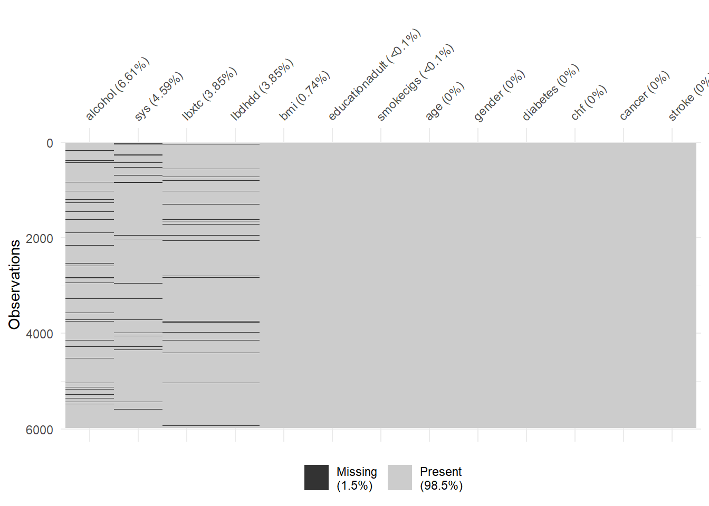
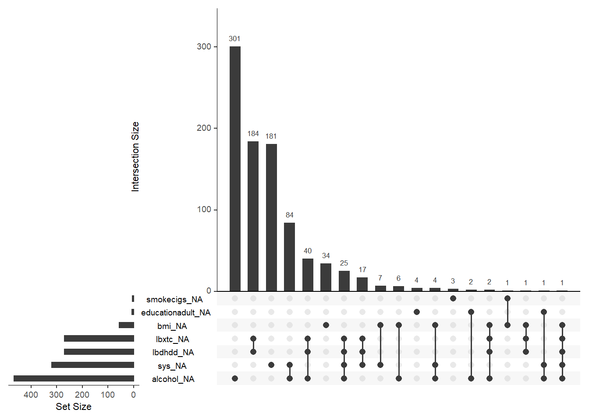
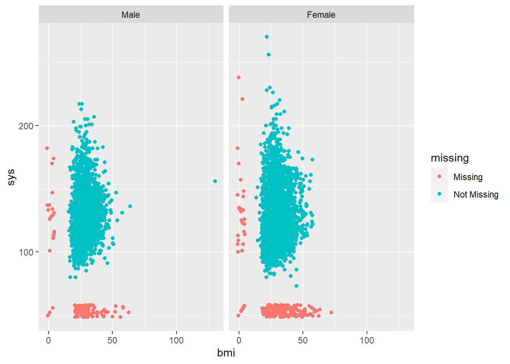
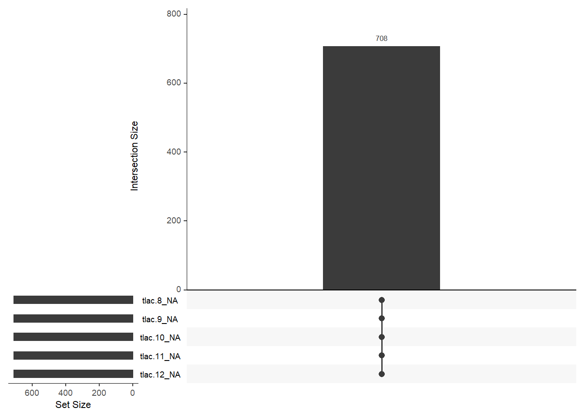

# Missing data


## Per variable missingness

Number and percentage of missing. 


```{=html}
<style>html {
  font-family: -apple-system, BlinkMacSystemFont, 'Segoe UI', Roboto, Oxygen, Ubuntu, Cantarell, 'Helvetica Neue', 'Fira Sans', 'Droid Sans', Arial, sans-serif;
}

#ovnsqsmykv .gt_table {
  display: table;
  border-collapse: collapse;
  margin-left: auto;
  margin-right: auto;
  color: #333333;
  font-size: 16px;
  font-weight: normal;
  font-style: normal;
  background-color: #FFFFFF;
  width: auto;
  border-top-style: solid;
  border-top-width: 2px;
  border-top-color: #A8A8A8;
  border-right-style: none;
  border-right-width: 2px;
  border-right-color: #D3D3D3;
  border-bottom-style: solid;
  border-bottom-width: 2px;
  border-bottom-color: #A8A8A8;
  border-left-style: none;
  border-left-width: 2px;
  border-left-color: #D3D3D3;
}

#ovnsqsmykv .gt_heading {
  background-color: #FFFFFF;
  text-align: center;
  border-bottom-color: #FFFFFF;
  border-left-style: none;
  border-left-width: 1px;
  border-left-color: #D3D3D3;
  border-right-style: none;
  border-right-width: 1px;
  border-right-color: #D3D3D3;
}

#ovnsqsmykv .gt_title {
  color: #333333;
  font-size: 125%;
  font-weight: initial;
  padding-top: 4px;
  padding-bottom: 4px;
  border-bottom-color: #FFFFFF;
  border-bottom-width: 0;
}

#ovnsqsmykv .gt_subtitle {
  color: #333333;
  font-size: 85%;
  font-weight: initial;
  padding-top: 0;
  padding-bottom: 4px;
  border-top-color: #FFFFFF;
  border-top-width: 0;
}

#ovnsqsmykv .gt_bottom_border {
  border-bottom-style: solid;
  border-bottom-width: 2px;
  border-bottom-color: #D3D3D3;
}

#ovnsqsmykv .gt_col_headings {
  border-top-style: solid;
  border-top-width: 2px;
  border-top-color: #D3D3D3;
  border-bottom-style: solid;
  border-bottom-width: 2px;
  border-bottom-color: #D3D3D3;
  border-left-style: none;
  border-left-width: 1px;
  border-left-color: #D3D3D3;
  border-right-style: none;
  border-right-width: 1px;
  border-right-color: #D3D3D3;
}

#ovnsqsmykv .gt_col_heading {
  color: #333333;
  background-color: #FFFFFF;
  font-size: 100%;
  font-weight: normal;
  text-transform: inherit;
  border-left-style: none;
  border-left-width: 1px;
  border-left-color: #D3D3D3;
  border-right-style: none;
  border-right-width: 1px;
  border-right-color: #D3D3D3;
  vertical-align: bottom;
  padding-top: 5px;
  padding-bottom: 6px;
  padding-left: 5px;
  padding-right: 5px;
  overflow-x: hidden;
}

#ovnsqsmykv .gt_column_spanner_outer {
  color: #333333;
  background-color: #FFFFFF;
  font-size: 100%;
  font-weight: normal;
  text-transform: inherit;
  padding-top: 0;
  padding-bottom: 0;
  padding-left: 4px;
  padding-right: 4px;
}

#ovnsqsmykv .gt_column_spanner_outer:first-child {
  padding-left: 0;
}

#ovnsqsmykv .gt_column_spanner_outer:last-child {
  padding-right: 0;
}

#ovnsqsmykv .gt_column_spanner {
  border-bottom-style: solid;
  border-bottom-width: 2px;
  border-bottom-color: #D3D3D3;
  vertical-align: bottom;
  padding-top: 5px;
  padding-bottom: 6px;
  overflow-x: hidden;
  display: inline-block;
  width: 100%;
}

#ovnsqsmykv .gt_group_heading {
  padding: 8px;
  color: #333333;
  background-color: #FFFFFF;
  font-size: 100%;
  font-weight: initial;
  text-transform: inherit;
  border-top-style: solid;
  border-top-width: 2px;
  border-top-color: #D3D3D3;
  border-bottom-style: solid;
  border-bottom-width: 2px;
  border-bottom-color: #D3D3D3;
  border-left-style: none;
  border-left-width: 1px;
  border-left-color: #D3D3D3;
  border-right-style: none;
  border-right-width: 1px;
  border-right-color: #D3D3D3;
  vertical-align: middle;
}

#ovnsqsmykv .gt_empty_group_heading {
  padding: 0.5px;
  color: #333333;
  background-color: #FFFFFF;
  font-size: 100%;
  font-weight: initial;
  border-top-style: solid;
  border-top-width: 2px;
  border-top-color: #D3D3D3;
  border-bottom-style: solid;
  border-bottom-width: 2px;
  border-bottom-color: #D3D3D3;
  vertical-align: middle;
}

#ovnsqsmykv .gt_from_md > :first-child {
  margin-top: 0;
}

#ovnsqsmykv .gt_from_md > :last-child {
  margin-bottom: 0;
}

#ovnsqsmykv .gt_row {
  padding-top: 8px;
  padding-bottom: 8px;
  padding-left: 5px;
  padding-right: 5px;
  margin: 10px;
  border-top-style: solid;
  border-top-width: 1px;
  border-top-color: #D3D3D3;
  border-left-style: none;
  border-left-width: 1px;
  border-left-color: #D3D3D3;
  border-right-style: none;
  border-right-width: 1px;
  border-right-color: #D3D3D3;
  vertical-align: middle;
  overflow-x: hidden;
}

#ovnsqsmykv .gt_stub {
  color: #333333;
  background-color: #FFFFFF;
  font-size: 100%;
  font-weight: initial;
  text-transform: inherit;
  border-right-style: solid;
  border-right-width: 2px;
  border-right-color: #D3D3D3;
  padding-left: 12px;
}

#ovnsqsmykv .gt_summary_row {
  color: #333333;
  background-color: #FFFFFF;
  text-transform: inherit;
  padding-top: 8px;
  padding-bottom: 8px;
  padding-left: 5px;
  padding-right: 5px;
}

#ovnsqsmykv .gt_first_summary_row {
  padding-top: 8px;
  padding-bottom: 8px;
  padding-left: 5px;
  padding-right: 5px;
  border-top-style: solid;
  border-top-width: 2px;
  border-top-color: #D3D3D3;
}

#ovnsqsmykv .gt_grand_summary_row {
  color: #333333;
  background-color: #FFFFFF;
  text-transform: inherit;
  padding-top: 8px;
  padding-bottom: 8px;
  padding-left: 5px;
  padding-right: 5px;
}

#ovnsqsmykv .gt_first_grand_summary_row {
  padding-top: 8px;
  padding-bottom: 8px;
  padding-left: 5px;
  padding-right: 5px;
  border-top-style: double;
  border-top-width: 6px;
  border-top-color: #D3D3D3;
}

#ovnsqsmykv .gt_striped {
  background-color: rgba(128, 128, 128, 0.05);
}

#ovnsqsmykv .gt_table_body {
  border-top-style: solid;
  border-top-width: 2px;
  border-top-color: #D3D3D3;
  border-bottom-style: solid;
  border-bottom-width: 2px;
  border-bottom-color: #D3D3D3;
}

#ovnsqsmykv .gt_footnotes {
  color: #333333;
  background-color: #FFFFFF;
  border-bottom-style: none;
  border-bottom-width: 2px;
  border-bottom-color: #D3D3D3;
  border-left-style: none;
  border-left-width: 2px;
  border-left-color: #D3D3D3;
  border-right-style: none;
  border-right-width: 2px;
  border-right-color: #D3D3D3;
}

#ovnsqsmykv .gt_footnote {
  margin: 0px;
  font-size: 90%;
  padding: 4px;
}

#ovnsqsmykv .gt_sourcenotes {
  color: #333333;
  background-color: #FFFFFF;
  border-bottom-style: none;
  border-bottom-width: 2px;
  border-bottom-color: #D3D3D3;
  border-left-style: none;
  border-left-width: 2px;
  border-left-color: #D3D3D3;
  border-right-style: none;
  border-right-width: 2px;
  border-right-color: #D3D3D3;
}

#ovnsqsmykv .gt_sourcenote {
  font-size: 90%;
  padding: 4px;
}

#ovnsqsmykv .gt_left {
  text-align: left;
}

#ovnsqsmykv .gt_center {
  text-align: center;
}

#ovnsqsmykv .gt_right {
  text-align: right;
  font-variant-numeric: tabular-nums;
}

#ovnsqsmykv .gt_font_normal {
  font-weight: normal;
}

#ovnsqsmykv .gt_font_bold {
  font-weight: bold;
}

#ovnsqsmykv .gt_font_italic {
  font-style: italic;
}

#ovnsqsmykv .gt_super {
  font-size: 65%;
}

#ovnsqsmykv .gt_footnote_marks {
  font-style: italic;
  font-size: 65%;
}
</style>
<div id="ovnsqsmykv" style="overflow-x:auto;overflow-y:auto;width:auto;height:auto;"><table class="gt_table">
  
  <thead class="gt_col_headings">
    <tr>
      <th class="gt_col_heading gt_columns_bottom_border gt_left" rowspan="1" colspan="1"><strong>Variable</strong></th>
      <th class="gt_col_heading gt_columns_bottom_border gt_center" rowspan="1" colspan="1"><strong>Missing (count)</strong></th>
      <th class="gt_col_heading gt_columns_bottom_border gt_right" rowspan="1" colspan="1"><strong>Missing (%)</strong></th>
    </tr>
  </thead>
  <tbody class="gt_table_body">
    <tr>
      <td class="gt_row gt_left">alcohol</td>
      <td class="gt_row gt_center">395</td>
      <td class="gt_row gt_right">6.61</td>
    </tr>
    <tr>
      <td class="gt_row gt_left">sys</td>
      <td class="gt_row gt_center">274</td>
      <td class="gt_row gt_right">4.59</td>
    </tr>
    <tr>
      <td class="gt_row gt_left">lbxtc</td>
      <td class="gt_row gt_center">230</td>
      <td class="gt_row gt_right">3.85</td>
    </tr>
    <tr>
      <td class="gt_row gt_left">lbdhdd</td>
      <td class="gt_row gt_center">230</td>
      <td class="gt_row gt_right">3.85</td>
    </tr>
    <tr>
      <td class="gt_row gt_left">bmi</td>
      <td class="gt_row gt_center">44</td>
      <td class="gt_row gt_right">0.74</td>
    </tr>
    <tr>
      <td class="gt_row gt_left">educationadult</td>
      <td class="gt_row gt_center">4</td>
      <td class="gt_row gt_right">0.07</td>
    </tr>
    <tr>
      <td class="gt_row gt_left">smokecigs</td>
      <td class="gt_row gt_center">2</td>
      <td class="gt_row gt_right">0.03</td>
    </tr>
    <tr>
      <td class="gt_row gt_left">age</td>
      <td class="gt_row gt_center">0</td>
      <td class="gt_row gt_right">0.00</td>
    </tr>
    <tr>
      <td class="gt_row gt_left">gender</td>
      <td class="gt_row gt_center">0</td>
      <td class="gt_row gt_right">0.00</td>
    </tr>
    <tr>
      <td class="gt_row gt_left">diabetes</td>
      <td class="gt_row gt_center">0</td>
      <td class="gt_row gt_right">0.00</td>
    </tr>
    <tr>
      <td class="gt_row gt_left">chf</td>
      <td class="gt_row gt_center">0</td>
      <td class="gt_row gt_right">0.00</td>
    </tr>
    <tr>
      <td class="gt_row gt_left">cancer</td>
      <td class="gt_row gt_center">0</td>
      <td class="gt_row gt_right">0.00</td>
    </tr>
    <tr>
      <td class="gt_row gt_left">stroke</td>
      <td class="gt_row gt_center">0</td>
      <td class="gt_row gt_right">0.00</td>
    </tr>
    <tr>
      <td class="gt_row gt_left">tac</td>
      <td class="gt_row gt_center">0</td>
      <td class="gt_row gt_right">0.00</td>
    </tr>
    <tr>
      <td class="gt_row gt_left">tlac</td>
      <td class="gt_row gt_center">0</td>
      <td class="gt_row gt_right">0.00</td>
    </tr>
    <tr>
      <td class="gt_row gt_left">mvpa</td>
      <td class="gt_row gt_center">0</td>
      <td class="gt_row gt_right">0.00</td>
    </tr>
    <tr>
      <td class="gt_row gt_left">wt</td>
      <td class="gt_row gt_center">0</td>
      <td class="gt_row gt_right">0.00</td>
    </tr>
  </tbody>
  
  
</table></div>
```


Investigate for groups of variables:


```{=html}
<style>html {
  font-family: -apple-system, BlinkMacSystemFont, 'Segoe UI', Roboto, Oxygen, Ubuntu, Cantarell, 'Helvetica Neue', 'Fira Sans', 'Droid Sans', Arial, sans-serif;
}

#nesspqcayz .gt_table {
  display: table;
  border-collapse: collapse;
  margin-left: auto;
  margin-right: auto;
  color: #333333;
  font-size: 16px;
  font-weight: normal;
  font-style: normal;
  background-color: #FFFFFF;
  width: auto;
  border-top-style: solid;
  border-top-width: 2px;
  border-top-color: #A8A8A8;
  border-right-style: none;
  border-right-width: 2px;
  border-right-color: #D3D3D3;
  border-bottom-style: solid;
  border-bottom-width: 2px;
  border-bottom-color: #A8A8A8;
  border-left-style: none;
  border-left-width: 2px;
  border-left-color: #D3D3D3;
}

#nesspqcayz .gt_heading {
  background-color: #FFFFFF;
  text-align: center;
  border-bottom-color: #FFFFFF;
  border-left-style: none;
  border-left-width: 1px;
  border-left-color: #D3D3D3;
  border-right-style: none;
  border-right-width: 1px;
  border-right-color: #D3D3D3;
}

#nesspqcayz .gt_title {
  color: #333333;
  font-size: 125%;
  font-weight: initial;
  padding-top: 4px;
  padding-bottom: 4px;
  border-bottom-color: #FFFFFF;
  border-bottom-width: 0;
}

#nesspqcayz .gt_subtitle {
  color: #333333;
  font-size: 85%;
  font-weight: initial;
  padding-top: 0;
  padding-bottom: 4px;
  border-top-color: #FFFFFF;
  border-top-width: 0;
}

#nesspqcayz .gt_bottom_border {
  border-bottom-style: solid;
  border-bottom-width: 2px;
  border-bottom-color: #D3D3D3;
}

#nesspqcayz .gt_col_headings {
  border-top-style: solid;
  border-top-width: 2px;
  border-top-color: #D3D3D3;
  border-bottom-style: solid;
  border-bottom-width: 2px;
  border-bottom-color: #D3D3D3;
  border-left-style: none;
  border-left-width: 1px;
  border-left-color: #D3D3D3;
  border-right-style: none;
  border-right-width: 1px;
  border-right-color: #D3D3D3;
}

#nesspqcayz .gt_col_heading {
  color: #333333;
  background-color: #FFFFFF;
  font-size: 100%;
  font-weight: normal;
  text-transform: inherit;
  border-left-style: none;
  border-left-width: 1px;
  border-left-color: #D3D3D3;
  border-right-style: none;
  border-right-width: 1px;
  border-right-color: #D3D3D3;
  vertical-align: bottom;
  padding-top: 5px;
  padding-bottom: 6px;
  padding-left: 5px;
  padding-right: 5px;
  overflow-x: hidden;
}

#nesspqcayz .gt_column_spanner_outer {
  color: #333333;
  background-color: #FFFFFF;
  font-size: 100%;
  font-weight: normal;
  text-transform: inherit;
  padding-top: 0;
  padding-bottom: 0;
  padding-left: 4px;
  padding-right: 4px;
}

#nesspqcayz .gt_column_spanner_outer:first-child {
  padding-left: 0;
}

#nesspqcayz .gt_column_spanner_outer:last-child {
  padding-right: 0;
}

#nesspqcayz .gt_column_spanner {
  border-bottom-style: solid;
  border-bottom-width: 2px;
  border-bottom-color: #D3D3D3;
  vertical-align: bottom;
  padding-top: 5px;
  padding-bottom: 6px;
  overflow-x: hidden;
  display: inline-block;
  width: 100%;
}

#nesspqcayz .gt_group_heading {
  padding: 8px;
  color: #333333;
  background-color: #FFFFFF;
  font-size: 100%;
  font-weight: initial;
  text-transform: inherit;
  border-top-style: solid;
  border-top-width: 2px;
  border-top-color: #D3D3D3;
  border-bottom-style: solid;
  border-bottom-width: 2px;
  border-bottom-color: #D3D3D3;
  border-left-style: none;
  border-left-width: 1px;
  border-left-color: #D3D3D3;
  border-right-style: none;
  border-right-width: 1px;
  border-right-color: #D3D3D3;
  vertical-align: middle;
}

#nesspqcayz .gt_empty_group_heading {
  padding: 0.5px;
  color: #333333;
  background-color: #FFFFFF;
  font-size: 100%;
  font-weight: initial;
  border-top-style: solid;
  border-top-width: 2px;
  border-top-color: #D3D3D3;
  border-bottom-style: solid;
  border-bottom-width: 2px;
  border-bottom-color: #D3D3D3;
  vertical-align: middle;
}

#nesspqcayz .gt_from_md > :first-child {
  margin-top: 0;
}

#nesspqcayz .gt_from_md > :last-child {
  margin-bottom: 0;
}

#nesspqcayz .gt_row {
  padding-top: 8px;
  padding-bottom: 8px;
  padding-left: 5px;
  padding-right: 5px;
  margin: 10px;
  border-top-style: solid;
  border-top-width: 1px;
  border-top-color: #D3D3D3;
  border-left-style: none;
  border-left-width: 1px;
  border-left-color: #D3D3D3;
  border-right-style: none;
  border-right-width: 1px;
  border-right-color: #D3D3D3;
  vertical-align: middle;
  overflow-x: hidden;
}

#nesspqcayz .gt_stub {
  color: #333333;
  background-color: #FFFFFF;
  font-size: 100%;
  font-weight: initial;
  text-transform: inherit;
  border-right-style: solid;
  border-right-width: 2px;
  border-right-color: #D3D3D3;
  padding-left: 12px;
}

#nesspqcayz .gt_summary_row {
  color: #333333;
  background-color: #FFFFFF;
  text-transform: inherit;
  padding-top: 8px;
  padding-bottom: 8px;
  padding-left: 5px;
  padding-right: 5px;
}

#nesspqcayz .gt_first_summary_row {
  padding-top: 8px;
  padding-bottom: 8px;
  padding-left: 5px;
  padding-right: 5px;
  border-top-style: solid;
  border-top-width: 2px;
  border-top-color: #D3D3D3;
}

#nesspqcayz .gt_grand_summary_row {
  color: #333333;
  background-color: #FFFFFF;
  text-transform: inherit;
  padding-top: 8px;
  padding-bottom: 8px;
  padding-left: 5px;
  padding-right: 5px;
}

#nesspqcayz .gt_first_grand_summary_row {
  padding-top: 8px;
  padding-bottom: 8px;
  padding-left: 5px;
  padding-right: 5px;
  border-top-style: double;
  border-top-width: 6px;
  border-top-color: #D3D3D3;
}

#nesspqcayz .gt_striped {
  background-color: rgba(128, 128, 128, 0.05);
}

#nesspqcayz .gt_table_body {
  border-top-style: solid;
  border-top-width: 2px;
  border-top-color: #D3D3D3;
  border-bottom-style: solid;
  border-bottom-width: 2px;
  border-bottom-color: #D3D3D3;
}

#nesspqcayz .gt_footnotes {
  color: #333333;
  background-color: #FFFFFF;
  border-bottom-style: none;
  border-bottom-width: 2px;
  border-bottom-color: #D3D3D3;
  border-left-style: none;
  border-left-width: 2px;
  border-left-color: #D3D3D3;
  border-right-style: none;
  border-right-width: 2px;
  border-right-color: #D3D3D3;
}

#nesspqcayz .gt_footnote {
  margin: 0px;
  font-size: 90%;
  padding: 4px;
}

#nesspqcayz .gt_sourcenotes {
  color: #333333;
  background-color: #FFFFFF;
  border-bottom-style: none;
  border-bottom-width: 2px;
  border-bottom-color: #D3D3D3;
  border-left-style: none;
  border-left-width: 2px;
  border-left-color: #D3D3D3;
  border-right-style: none;
  border-right-width: 2px;
  border-right-color: #D3D3D3;
}

#nesspqcayz .gt_sourcenote {
  font-size: 90%;
  padding: 4px;
}

#nesspqcayz .gt_left {
  text-align: left;
}

#nesspqcayz .gt_center {
  text-align: center;
}

#nesspqcayz .gt_right {
  text-align: right;
  font-variant-numeric: tabular-nums;
}

#nesspqcayz .gt_font_normal {
  font-weight: normal;
}

#nesspqcayz .gt_font_bold {
  font-weight: bold;
}

#nesspqcayz .gt_font_italic {
  font-style: italic;
}

#nesspqcayz .gt_super {
  font-size: 65%;
}

#nesspqcayz .gt_footnote_marks {
  font-style: italic;
  font-size: 65%;
}
</style>
<div id="nesspqcayz" style="overflow-x:auto;overflow-y:auto;width:auto;height:auto;"><table class="gt_table">
  
  <thead class="gt_col_headings">
    <tr>
      <th class="gt_col_heading gt_columns_bottom_border gt_left" rowspan="1" colspan="1"><strong>Variable</strong></th>
      <th class="gt_col_heading gt_columns_bottom_border gt_center" rowspan="1" colspan="1"><strong>Missing (count)</strong></th>
      <th class="gt_col_heading gt_columns_bottom_border gt_right" rowspan="1" colspan="1"><strong>Missing (%)</strong></th>
    </tr>
  </thead>
  <tbody class="gt_table_body">
    <tr>
      <td class="gt_row gt_left">any_variable_missing</td>
      <td class="gt_row gt_center">768</td>
      <td class="gt_row gt_right">12.86</td>
    </tr>
    <tr>
      <td class="gt_row gt_left">any_lab_missing</td>
      <td class="gt_row gt_center">470</td>
      <td class="gt_row gt_right">7.87</td>
    </tr>
    <tr>
      <td class="gt_row gt_left">any_lifestyle_missing</td>
      <td class="gt_row gt_center">431</td>
      <td class="gt_row gt_right">7.22</td>
    </tr>
    <tr>
      <td class="gt_row gt_left">any_demographics_missing</td>
      <td class="gt_row gt_center">4</td>
      <td class="gt_row gt_right">0.07</td>
    </tr>
    <tr>
      <td class="gt_row gt_left">any_vip_missing</td>
      <td class="gt_row gt_center">0</td>
      <td class="gt_row gt_right">0.00</td>
    </tr>
    <tr>
      <td class="gt_row gt_left">any_health_missing</td>
      <td class="gt_row gt_center">0</td>
      <td class="gt_row gt_right">0.00</td>
    </tr>
    <tr>
      <td class="gt_row gt_left">any_physact_missing</td>
      <td class="gt_row gt_center">0</td>
      <td class="gt_row gt_right">0.00</td>
    </tr>
  </tbody>
  
  
</table></div>
```

Overall, 13% are missing when all variables are included in a model. There is no missingness in the VIPs and 7% in life style variables such as smoking and alcohol consumption.


## Variable summaries for complete vs incomplete cases


Table: (\#tab:unnamed-chunk-5)Participant characteristics by missing status

|                                               | complete (N=5204)  | incomplete (N=768) |   Total (N=5972)   | p value|
|:----------------------------------------------|:------------------:|:------------------:|:------------------:|-------:|
|**age**                                        |                    |                    |                    |   0.005|
|&nbsp;&nbsp;&nbsp;Median                       |       54.167       |       50.417       |       53.750       |        |
|&nbsp;&nbsp;&nbsp;Q1, Q3                       |   41.917, 67.417   |   40.167, 66.167   |   41.646, 67.250   |        |
|&nbsp;&nbsp;&nbsp;Range                        |  30.000 - 84.917   |  30.000 - 84.917   |  30.000 - 84.917   |        |
|**gender**                                     |                    |                    |                    | < 0.001|
|&nbsp;&nbsp;&nbsp;Male                         |    2601 (50.0%)    |    334 (43.5%)     |    2935 (49.1%)    |        |
|&nbsp;&nbsp;&nbsp;Female                       |    2603 (50.0%)    |    434 (56.5%)     |    3037 (50.9%)    |        |
|**education level**                            |                    |                    |                    | < 0.001|
|&nbsp;&nbsp;&nbsp;N-Miss                       |         0          |         4          |         4          |        |
|&nbsp;&nbsp;&nbsp;Less than high school        |    1431 (27.5%)    |    252 (33.0%)     |    1683 (28.2%)    |        |
|&nbsp;&nbsp;&nbsp;High school                  |    1251 (24.0%)    |    197 (25.8%)     |    1448 (24.3%)    |        |
|&nbsp;&nbsp;&nbsp;More than high school        |    2522 (48.5%)    |    315 (41.2%)     |    2837 (47.5%)    |        |
|**diabetes**                                   |                    |                    |                    |   0.092|
|&nbsp;&nbsp;&nbsp;No                           |    4558 (87.6%)    |    656 (85.4%)     |    5214 (87.3%)    |        |
|&nbsp;&nbsp;&nbsp;Yes                          |    646 (12.4%)     |    112 (14.6%)     |    758 (12.7%)     |        |
|**congestive heart failure**                   |                    |                    |                    |   0.071|
|&nbsp;&nbsp;&nbsp;No                           |    5010 (96.3%)    |    729 (94.9%)     |    5739 (96.1%)    |        |
|&nbsp;&nbsp;&nbsp;Yes                          |     194 (3.7%)     |     39 (5.1%)      |     233 (3.9%)     |        |
|**cancer**                                     |                    |                    |                    |   0.458|
|&nbsp;&nbsp;&nbsp;No                           |    4664 (89.6%)    |    695 (90.5%)     |    5359 (89.7%)    |        |
|&nbsp;&nbsp;&nbsp;Yes                          |    540 (10.4%)     |     73 (9.5%)      |    613 (10.3%)     |        |
|**stroke**                                     |                    |                    |                    |   0.206|
|&nbsp;&nbsp;&nbsp;No                           |    5003 (96.1%)    |    731 (95.2%)     |    5734 (96.0%)    |        |
|&nbsp;&nbsp;&nbsp;Yes                          |     201 (3.9%)     |     37 (4.8%)      |     238 (4.0%)     |        |
|**body mass index**                            |                    |                    |                    |   0.003|
|&nbsp;&nbsp;&nbsp;Median                       |       28.060       |       28.290       |       28.080       |        |
|&nbsp;&nbsp;&nbsp;Q1, Q3                       |   24.740, 32.180   |   24.432, 32.928   |   24.730, 32.230   |        |
|&nbsp;&nbsp;&nbsp;Range                        |  13.360 - 130.210  |  14.650 - 63.420   |  13.360 - 130.210  |        |
|**smoking status**                             |                    |                    |                    |   0.006|
|&nbsp;&nbsp;&nbsp;N-Miss                       |         0          |         2          |         2          |        |
|&nbsp;&nbsp;&nbsp;Never                        |    2514 (48.3%)    |    397 (51.8%)     |    2911 (48.8%)    |        |
|&nbsp;&nbsp;&nbsp;Former                       |    1571 (30.2%)    |    188 (24.5%)     |    1759 (29.5%)    |        |
|&nbsp;&nbsp;&nbsp;Current                      |    1119 (21.5%)    |    181 (23.6%)     |    1300 (21.8%)    |        |
|**alcohol consumption**                        |                    |                    |                    |   0.153|
|&nbsp;&nbsp;&nbsp;Median                       |       1.000        |       2.000        |       1.000        |        |
|&nbsp;&nbsp;&nbsp;Q1, Q3                       |    1.000, 2.000    |    1.000, 2.000    |    1.000, 2.000    |        |
|&nbsp;&nbsp;&nbsp;Range                        |   1.000 - 3.000    |   1.000 - 3.000    |   1.000 - 3.000    |        |
|**total log activity count (log(1+activity))** |                    |                    |                    | < 0.001|
|&nbsp;&nbsp;&nbsp;Median                       |      2925.685      |      2796.018      |      2910.926      |        |
|&nbsp;&nbsp;&nbsp;Q1, Q3                       | 2401.400, 3440.724 | 2239.750, 3380.564 | 2384.757, 3430.648 |        |
|&nbsp;&nbsp;&nbsp;Range                        | 313.083 - 6122.678 | 466.036 - 5102.369 | 313.083 - 6122.678 |        |
|**total accelerometer wear time**              |                    |                    |                    |   0.017|
|&nbsp;&nbsp;&nbsp;Median                       |      854.310       |      832.100       |      852.071       |        |
|&nbsp;&nbsp;&nbsp;Q1, Q3                       |  785.000, 923.808  |  762.458, 909.571  |  782.851, 922.036  |        |
|&nbsp;&nbsp;&nbsp;Range                        | 602.000 - 1440.000 | 600.000 - 1440.000 | 600.000 - 1440.000 |        |


## Missingness patterns over variables


Missing values for each participant in the NHANES dataset is shown in the following figure, where the black lines correspond to observations with missing values.




There are **7** independent variables with missing values in the dataset.



Physiological variables (blood pressure, cholesterol) have the highest proportion of missingness. There does not seem to be a pattern of missingness across variables, other than the cholesterol (toal, HDL) variables.


In addition, we can explore missing data mechanisms and relationships between BMI and systolic blood pressure, included in the same scatterplot:




Missing values are seen across the same range of values for the other variable. There is an extreme value in BMI for males that is likely an entry error.


## (In)complete cases

This section presents patients with a least one missing value. First we list out patients with at least one missing value in a filterable table. 


```{=html}
<div id="htmlwidget-7eb3066f5b8724e5776c" style="width:100%;height:auto;" class="datatables html-widget"></div>
<script type="application/json" data-for="htmlwidget-7eb3066f5b8724e5776c">{"x":{"filter":"none","data":[["1","2","3","4","5","6","7","8","9","10","11","12","13","14","15","16","17","18","19","20","21","22","23","24","25","26","27","28","29","30","31","32","33","34","35","36","37","38","39","40","41","42","43","44","45","46","47","48","49","50","51","52","53","54","55","56","57","58","59","60","61","62","63","64","65","66","67","68","69","70","71","72","73","74","75","76","77","78","79","80","81","82","83","84","85","86","87","88","89","90","91","92","93","94","95","96","97","98","99","100","101","102","103","104","105","106","107","108","109","110","111","112","113","114","115","116","117","118","119","120","121","122","123","124","125","126","127","128","129","130","131","132","133","134","135","136","137","138","139","140","141","142","143","144","145","146","147","148","149","150","151","152","153","154","155","156","157","158","159","160","161","162","163","164","165","166","167","168","169","170","171","172","173","174","175","176","177","178","179","180","181","182","183","184","185","186","187","188","189","190","191","192","193","194","195","196","197","198","199","200","201","202","203","204","205","206","207","208","209","210","211","212","213","214","215","216","217","218","219","220","221","222","223","224","225","226","227","228","229","230","231","232","233","234","235","236","237","238","239","240","241","242","243","244","245","246","247","248","249","250","251","252","253","254","255","256","257","258","259","260","261","262","263","264","265","266","267","268","269","270","271","272","273","274","275","276","277","278","279","280","281","282","283","284","285","286","287","288","289","290","291","292","293","294","295","296","297","298","299","300","301","302","303","304","305","306","307","308","309","310","311","312","313","314","315","316","317","318","319","320","321","322","323","324","325","326","327","328","329","330","331","332","333","334","335","336","337","338","339","340","341","342","343","344","345","346","347","348","349","350","351","352","353","354","355","356","357","358","359","360","361","362","363","364","365","366","367","368","369","370","371","372","373","374","375","376","377","378","379","380","381","382","383","384","385","386","387","388","389","390","391","392","393","394","395","396","397","398","399","400","401","402","403","404","405","406","407","408","409","410","411","412","413","414","415","416","417","418","419","420","421","422","423","424","425","426","427","428","429","430","431","432","433","434","435","436","437","438","439","440","441","442","443","444","445","446","447","448","449","450","451","452","453","454","455","456","457","458","459","460","461","462","463","464","465","466","467","468","469","470","471","472","473","474","475","476","477","478","479","480","481","482","483","484","485","486","487","488","489","490","491","492","493","494","495","496","497","498","499","500","501","502","503","504","505","506","507","508","509","510","511","512","513","514","515","516","517","518","519","520","521","522","523","524","525","526","527","528","529","530","531","532","533","534","535","536","537","538","539","540","541","542","543","544","545","546","547","548","549","550","551","552","553","554","555","556","557","558","559","560","561","562","563","564","565","566","567","568","569","570","571","572","573","574","575","576","577","578","579","580","581","582","583","584","585","586","587","588","589","590","591","592","593","594","595","596","597","598","599","600","601","602","603","604","605","606","607","608","609","610","611","612","613","614","615","616","617","618","619","620","621","622","623","624","625","626","627","628","629","630","631","632","633","634","635","636","637","638","639","640","641","642","643","644","645","646","647","648","649","650","651","652","653","654","655","656","657","658","659","660","661","662","663","664","665","666","667","668","669","670","671","672","673","674","675","676","677","678","679","680","681","682","683","684","685","686","687","688","689","690","691","692","693","694","695","696","697","698","699","700","701","702","703","704","705","706","707","708","709","710","711","712","713","714","715","716","717","718","719","720","721","722","723","724","725","726","727","728","729","730","731","732","733","734","735","736","737","738","739","740","741","742","743","744","745","746","747","748","749","750","751","752","753","754","755","756","757","758","759","760","761","762","763","764","765","766","767","768"],[63.8333333333333,37.0833333333333,31.75,76.0833333333333,70.1666666666667,31.5,76.1666666666667,63.5833333333333,49,75.5833333333333,44.3333333333333,40.1666666666667,46.6666666666667,51.5,46.5,50.5,43.5833333333333,79.3333333333333,42.75,49.9166666666667,59.8333333333333,43.75,52.1666666666667,83.5,58.9166666666667,40.5,75.0833333333333,33.4166666666667,75.9166666666667,81.5,48.8333333333333,43.5833333333333,54.3333333333333,70.3333333333333,45.3333333333333,80,74.1666666666667,63.5,40.1666666666667,83.9166666666667,33.8333333333333,78.8333333333333,65.0833333333333,75.1666666666667,66.25,38.9166666666667,58.0833333333333,52.5833333333333,68.25,70.5,51.6666666666667,77.1666666666667,59.5,50.5,84.4166666666667,49.1666666666667,83.9166666666667,48.8333333333333,47.3333333333333,82.6666666666667,46.5833333333333,76.3333333333333,50.75,80.8333333333333,84.0833333333333,33.3333333333333,72.6666666666667,45.6666666666667,44,40.6666666666667,75.9166666666667,42.8333333333333,44,38.6666666666667,84.0833333333333,42.3333333333333,35.8333333333333,31.8333333333333,66.4166666666667,65.5,55.25,40.8333333333333,51.25,37.9166666666667,83,34.1666666666667,79.0833333333333,36.0833333333333,80.0833333333333,65.0833333333333,44,41,33.9166666666667,54.5,31.5,35.75,66.3333333333333,56.5833333333333,31.75,52.9166666666667,36.1666666666667,51.5833333333333,66,48.5,42.6666666666667,36.8333333333333,48.9166666666667,30.6666666666667,45.5,31.75,39.1666666666667,48.75,38.0833333333333,83.5,65.5833333333333,44.9166666666667,52.6666666666667,30.25,42.8333333333333,31.4166666666667,49.0833333333333,32.6666666666667,63,56.5833333333333,51.0833333333333,35.6666666666667,48.4166666666667,33.4166666666667,80.6666666666667,83.4166666666667,39.4166666666667,50.0833333333333,31.1666666666667,48,43.6666666666667,50.25,30.0833333333333,61.0833333333333,39.5833333333333,32.75,58.5833333333333,79.25,65.3333333333333,36.1666666666667,32.25,54.0833333333333,65.5833333333333,39.25,61.75,72.3333333333333,30.4166666666667,47.5,58.5,39.9166666666667,60.5833333333333,44.6666666666667,36.0833333333333,31,64.6666666666667,60.3333333333333,70.8333333333333,40.5,31.1666666666667,78.25,67.25,31.1666666666667,50.75,30.8333333333333,66.5,46.75,78.1666666666667,77.6666666666667,81.4166666666667,49.5833333333333,58.6666666666667,60.5833333333333,52.9166666666667,70.6666666666667,32.25,61,32.0833333333333,45.25,51.6666666666667,33.6666666666667,46.25,33.0833333333333,84.1666666666667,65.9166666666667,31,69.1666666666667,56.3333333333333,75.1666666666667,80.8333333333333,36.5833333333333,38.5833333333333,54.0833333333333,50.75,37.4166666666667,79.1666666666667,69.5833333333333,54.1666666666667,31.75,72.4166666666667,46.4166666666667,84.8333333333333,47.25,62.6666666666667,78.0833333333333,68.5833333333333,62.5833333333333,62,69.5833333333333,49,37.6666666666667,59.75,31.9166666666667,38,51.6666666666667,71.4166666666667,34.9166666666667,44.3333333333333,56,40.1666666666667,34.5833333333333,59.75,43.5,53.6666666666667,59.0833333333333,61.9166666666667,78.5833333333333,57.0833333333333,68.1666666666667,41.5,60.25,69.25,47.8333333333333,68.6666666666667,71,31.5,30.6666666666667,30.3333333333333,81.8333333333333,82.75,39.5833333333333,46.5833333333333,41.75,61.1666666666667,47.6666666666667,62.8333333333333,48.8333333333333,35,69.3333333333333,41.8333333333333,44.5833333333333,80.3333333333333,76.5,70.5833333333333,53.5833333333333,73.8333333333333,51.4166666666667,31.25,83.0833333333333,41.8333333333333,61.8333333333333,31.1666666666667,40.5,37.25,80.8333333333333,66.5833333333333,84.5833333333333,48.9166666666667,74.5,58.4166666666667,33,36,81.6666666666667,77.75,33.75,82.5833333333333,62.5833333333333,58.4166666666667,36.3333333333333,82.4166666666667,42.5,73.1666666666667,65.0833333333333,51.4166666666667,33.5,66.5,37.8333333333333,40.5833333333333,60.0833333333333,78.4166666666667,39.75,43.3333333333333,53.5833333333333,61.5,30.5,38.25,32.9166666666667,42.5,49.4166666666667,52.75,52.0833333333333,71.0833333333333,33.5833333333333,62.3333333333333,77.75,39,74.5833333333333,35.25,81.5,35.0833333333333,79.4166666666667,49.6666666666667,71,30.6666666666667,73.4166666666667,41.3333333333333,34.9166666666667,71.0833333333333,54.75,43.5833333333333,64.5,49.3333333333333,54.75,33.5833333333333,32.5833333333333,72.6666666666667,54.0833333333333,54.1666666666667,55,50,40.25,35.8333333333333,36,50.4166666666667,57.25,40.6666666666667,45.25,38,46.9166666666667,57.5833333333333,55.1666666666667,63.8333333333333,48.5833333333333,70.6666666666667,40.3333333333333,47.0833333333333,84.25,45.1666666666667,69.9166666666667,42.8333333333333,81.4166666666667,66.4166666666667,32.3333333333333,33,35.0833333333333,53.5,45.9166666666667,45.5,56.5,30.5833333333333,39.25,41.75,33.3333333333333,40.9166666666667,40.0833333333333,40.4166666666667,63.0833333333333,57,32,32.4166666666667,77.5,41.9166666666667,83.5833333333333,77.0833333333333,38.75,55.5,44.75,52.8333333333333,32.8333333333333,75.5833333333333,31.8333333333333,48.6666666666667,68.6666666666667,49.3333333333333,55,53.4166666666667,35.9166666666667,80,71.75,65.4166666666667,82.9166666666667,82.25,51.1666666666667,45.6666666666667,67.5,83.0833333333333,78.25,49.4166666666667,44.9166666666667,80.3333333333333,41.75,48.6666666666667,78.5833333333333,76.9166666666667,39.9166666666667,48.5,82.0833333333333,43.3333333333333,51.3333333333333,56,65.75,44.1666666666667,60.5833333333333,34.6666666666667,34.75,59.5,43.3333333333333,35.0833333333333,47.6666666666667,48.8333333333333,45.5,41.9166666666667,35.8333333333333,40,46.75,32.25,54.75,44.75,43.5833333333333,56.5,41.0833333333333,71.3333333333333,34,53,30,48.0833333333333,79,71.4166666666667,31.25,45.4166666666667,37.6666666666667,52.3333333333333,60.25,44.5833333333333,55.75,48.4166666666667,55.9166666666667,65.1666666666667,48.9166666666667,59,32.75,54.6666666666667,58.5833333333333,42.75,39.9166666666667,68.5,64.0833333333333,53.3333333333333,72.4166666666667,44.1666666666667,55.5,34.5833333333333,64.75,84.9166666666667,40.8333333333333,63.4166666666667,82.9166666666667,65.5,75.75,47.0833333333333,81.4166666666667,53.3333333333333,82.9166666666667,62.5833333333333,81.0833333333333,51.5,73.6666666666667,45.75,31.9166666666667,39.1666666666667,53.1666666666667,43,53.25,37.5833333333333,56.1666666666667,51.75,46.75,54.3333333333333,54.75,56.5,50.8333333333333,71.75,48.9166666666667,82.1666666666667,44.3333333333333,59.75,49.5,44.9166666666667,63.25,76.9166666666667,47.0833333333333,52.3333333333333,81,68.5833333333333,84.5833333333333,63.5833333333333,69.4166666666667,57.8333333333333,67,46.5,38.8333333333333,60.4166666666667,64.75,51.8333333333333,76.9166666666667,37.4166666666667,83.0833333333333,32.1666666666667,63.8333333333333,41.4166666666667,55.1666666666667,56.75,36.9166666666667,56.6666666666667,36.8333333333333,54.0833333333333,44,80.4166666666667,38.6666666666667,80.0833333333333,43.75,30.75,44.0833333333333,63.9166666666667,32.6666666666667,67.6666666666667,53.9166666666667,40.5,81.8333333333333,65.0833333333333,56.5,61.1666666666667,44.5833333333333,30.4166666666667,55.25,30,84.4166666666667,63,32.25,60.9166666666667,69.5,41.5833333333333,42.3333333333333,66.1666666666667,67.75,34.5,39.1666666666667,32.1666666666667,41.75,31.8333333333333,41.8333333333333,70.1666666666667,37.75,84.5833333333333,61.75,42.1666666666667,51.25,39,40.5833333333333,50.25,40.5833333333333,40.0833333333333,75.25,30.3333333333333,32.5833333333333,39.4166666666667,41.25,69.5,56.4166666666667,41.8333333333333,65.6666666666667,36.1666666666667,75.3333333333333,84.4166666666667,47.4166666666667,46.3333333333333,70.0833333333333,41.75,44.0833333333333,31.6666666666667,56.6666666666667,54.25,79,44.8333333333333,82.5833333333333,80.75,47.1666666666667,32.0833333333333,69.5833333333333,41.5,50.4166666666667,64,37.0833333333333,77.4166666666667,77.4166666666667,35.1666666666667,40.25,72.9166666666667,82.0833333333333,41,41.75,62.8333333333333,44.5833333333333,71,64.1666666666667,45.25,33.3333333333333,31.6666666666667,61.1666666666667,64,37.6666666666667,53.6666666666667,60.0833333333333,73.75,77.6666666666667,35.1666666666667,32,47.6666666666667,36.9166666666667,38.9166666666667,41.1666666666667,66.25,34.3333333333333,53,78.1666666666667,44.1666666666667,75,62.1666666666667,49.8333333333333,75.8333333333333,39.0833333333333,56.75,40.4166666666667,78.6666666666667,45.5,80.5833333333333,40.9166666666667,38.1666666666667,39.4166666666667,81,42.4166666666667,34.9166666666667,48.75,40.5,53.5833333333333,31.1666666666667,45.75,47.5833333333333,82.25,80.5,66.1666666666667,45.8333333333333,30.5,32.4166666666667,44.8333333333333,44.0833333333333,66.4166666666667,64.0833333333333,78.75,32.9166666666667,70.4166666666667,75,65,74.4166666666667,54.5,52.75,69.25,32.3333333333333,78,31.5833333333333,36.6666666666667,62.1666666666667,77.6666666666667,54.8333333333333,57.25,33.6666666666667,66.6666666666667,68.4166666666667,68.8333333333333,73.1666666666667,49.5833333333333,37,31.25,37.6666666666667,44.1666666666667,41.75,53.6666666666667,41.25,40.6666666666667,63.75,75.3333333333333,53.5,41.4166666666667,30.9166666666667,34.5833333333333,48.8333333333333,61,38.25,55.1666666666667,41.75,32.75,73.5833333333333,39.3333333333333,38.6666666666667,43.1666666666667,46.8333333333333,41.25,30.8333333333333,36.4166666666667,37.5833333333333,59.25,40.25,57,36.6666666666667,33.8333333333333,31.5833333333333,64.5,35.5,40.5833333333333,61.6666666666667,32.9166666666667,74.8333333333333,30.6666666666667,69.1666666666667,49.5833333333333,36.9166666666667,44.4166666666667,38.4166666666667,34.0833333333333,74.3333333333333,84.5,82.3333333333333,56.9166666666667,30.4166666666667,44.5,37.25,72.3333333333333,48.1666666666667,35.4166666666667,61,49.75,58.25,43.8333333333333,36.6666666666667,71.6666666666667,59,72.5,78.5,46.9166666666667,48.0833333333333,43.25,37.5833333333333,34.5833333333333,34,47.8333333333333],["Male","Female","Male","Female","Male","Female","Female","Female","Male","Female","Male","Female","Female","Male","Female","Male","Female","Male","Female","Female","Male","Male","Female","Female","Male","Male","Male","Male","Female","Male","Male","Male","Male","Male","Female","Female","Male","Male","Female","Male","Female","Male","Female","Female","Male","Female","Male","Female","Female","Female","Female","Female","Female","Male","Female","Female","Female","Female","Male","Male","Male","Male","Female","Male","Female","Female","Female","Female","Male","Female","Male","Female","Female","Male","Female","Male","Female","Female","Male","Female","Female","Male","Female","Female","Female","Female","Female","Female","Female","Female","Female","Female","Female","Female","Male","Female","Male","Female","Male","Female","Male","Male","Female","Female","Male","Female","Male","Male","Female","Male","Male","Male","Female","Male","Male","Male","Female","Male","Female","Female","Female","Female","Female","Female","Male","Male","Female","Female","Female","Female","Male","Female","Female","Male","Female","Female","Female","Female","Female","Male","Male","Female","Female","Female","Female","Female","Male","Female","Male","Male","Female","Female","Female","Female","Male","Male","Female","Female","Female","Female","Female","Female","Male","Male","Female","Male","Female","Male","Female","Male","Male","Female","Male","Male","Male","Female","Male","Male","Male","Female","Female","Male","Male","Male","Male","Female","Male","Female","Female","Male","Male","Male","Male","Male","Female","Female","Male","Male","Female","Male","Female","Male","Male","Female","Male","Female","Male","Male","Female","Male","Female","Female","Male","Female","Female","Male","Female","Female","Female","Male","Female","Female","Male","Female","Female","Male","Male","Male","Male","Female","Male","Male","Female","Female","Male","Female","Male","Female","Male","Male","Female","Female","Male","Male","Female","Male","Female","Female","Female","Female","Male","Male","Female","Female","Male","Female","Male","Female","Male","Male","Male","Male","Female","Female","Male","Female","Female","Female","Female","Female","Female","Male","Female","Male","Female","Female","Female","Female","Female","Male","Female","Female","Female","Female","Female","Female","Female","Female","Female","Female","Female","Female","Male","Female","Female","Male","Male","Male","Female","Female","Female","Female","Male","Female","Female","Male","Female","Female","Female","Male","Female","Female","Male","Male","Female","Male","Female","Male","Female","Female","Male","Male","Male","Male","Female","Female","Male","Male","Female","Female","Female","Female","Female","Male","Female","Male","Male","Female","Male","Female","Female","Female","Female","Female","Female","Male","Male","Female","Male","Female","Female","Female","Male","Female","Male","Female","Male","Male","Female","Female","Male","Male","Male","Male","Female","Female","Male","Female","Male","Male","Female","Female","Female","Female","Female","Female","Female","Male","Male","Female","Female","Female","Male","Female","Female","Male","Male","Male","Male","Female","Female","Female","Female","Male","Male","Female","Male","Female","Male","Male","Female","Male","Female","Female","Male","Female","Female","Male","Female","Male","Female","Male","Female","Male","Female","Female","Male","Female","Female","Male","Female","Male","Female","Female","Female","Female","Female","Female","Female","Female","Male","Female","Male","Male","Male","Female","Female","Male","Male","Female","Female","Female","Female","Male","Female","Female","Female","Male","Male","Male","Male","Male","Male","Male","Male","Female","Female","Male","Female","Female","Male","Female","Male","Male","Female","Female","Male","Female","Female","Female","Male","Male","Female","Female","Male","Male","Female","Male","Female","Female","Male","Female","Male","Female","Male","Female","Male","Male","Male","Female","Male","Male","Female","Female","Male","Female","Male","Female","Female","Female","Male","Male","Female","Female","Female","Male","Female","Male","Female","Female","Male","Female","Male","Female","Female","Female","Female","Male","Female","Male","Male","Male","Male","Female","Female","Female","Female","Female","Female","Male","Female","Male","Female","Male","Female","Male","Male","Female","Female","Male","Male","Female","Female","Male","Male","Female","Female","Male","Male","Female","Male","Female","Female","Female","Female","Female","Female","Male","Male","Male","Female","Female","Male","Male","Male","Female","Female","Male","Male","Female","Male","Female","Male","Male","Male","Female","Male","Male","Male","Male","Female","Female","Male","Male","Male","Male","Female","Female","Female","Male","Female","Male","Male","Female","Male","Male","Male","Female","Male","Female","Male","Female","Female","Female","Female","Female","Male","Female","Female","Female","Female","Female","Female","Male","Female","Female","Female","Female","Male","Female","Female","Female","Male","Female","Female","Male","Male","Male","Female","Female","Male","Female","Male","Female","Male","Male","Female","Male","Female","Female","Female","Male","Male","Female","Female","Male","Female","Female","Female","Female","Female","Female","Male","Male","Female","Male","Female","Female","Male","Female","Male","Male","Male","Female","Male","Female","Male","Female","Female","Male","Male","Male","Male","Female","Female","Male","Male","Male","Female","Female","Female","Male","Male","Female","Male","Female","Female","Male","Female","Male","Male","Male","Female","Female","Male","Female","Male","Male","Female","Male","Female","Female","Female","Female","Male","Female","Male","Female","Female","Male","Male","Female","Female","Female","Male","Female","Female","Female","Female","Male","Male","Male","Female","Female","Female","Female","Female","Female","Female","Male","Female","Male","Female","Male","Male","Female","Female","Male","Male","Female","Male","Female","Female","Male","Male","Female","Male","Female","Male","Male","Male","Female","Female","Male","Female","Female","Male","Female","Male","Male","Female","Male","Female","Female","Female","Male","Female","Female"],["High school","More than high school","High school","High school","Less than high school","More than high school","Less than high school","High school","More than high school","Less than high school","More than high school","More than high school","More than high school","More than high school","High school","Less than high school","High school","Less than high school","Less than high school","High school","More than high school","Less than high school","More than high school","High school","More than high school","More than high school","Less than high school","High school","Less than high school","More than high school","More than high school","High school","More than high school","More than high school","More than high school","More than high school","Less than high school","More than high school","High school","Less than high school","More than high school","Less than high school","More than high school","Less than high school","More than high school","High school","Less than high school","Less than high school","More than high school","High school","High school","More than high school","High school","More than high school","High school","High school","High school","High school","More than high school","Less than high school","High school","Less than high school","More than high school","High school","More than high school","More than high school","More than high school","High school","High school","Less than high school","More than high school","High school","More than high school","High school","Less than high school","More than high school","More than high school","More than high school","Less than high school","Less than high school","More than high school","More than high school","High school","More than high school","More than high school","More than high school","High school","More than high school","High school","More than high school","More than high school","High school","More than high school","More than high school","Less than high school","More than high school","More than high school","More than high school","More than high school","More than high school","Less than high school","More than high school","Less than high school","Less than high school","Less than high school","More than high school","Less than high school","Less than high school","More than high school","High school","Less than high school","Less than high school","Less than high school","Less than high school","High school","More than high school","Less than high school","High school","Less than high school","More than high school","High school","More than high school","More than high school","More than high school","More than high school","More than high school","Less than high school","More than high school","Less than high school","High school","More than high school","Less than high school","More than high school","Less than high school","High school","Less than high school","High school","More than high school","More than high school","More than high school","Less than high school","Less than high school","Less than high school","More than high school","More than high school","High school","More than high school","More than high school","More than high school","Less than high school","High school","High school","Less than high school","Less than high school","Less than high school","Less than high school","More than high school","More than high school","More than high school","High school","More than high school","More than high school","More than high school","Less than high school","Less than high school","More than high school","High school","High school","High school","High school","High school","Less than high school","High school","Less than high school","High school","More than high school","More than high school","High school","More than high school","Less than high school","More than high school","More than high school","Less than high school","Less than high school","More than high school","More than high school",null,"Less than high school","High school","More than high school","More than high school","Less than high school","More than high school","High school","More than high school","More than high school","More than high school","More than high school","High school","More than high school","More than high school","Less than high school","Less than high school","High school","More than high school","More than high school","Less than high school","More than high school","More than high school","High school","Less than high school","Less than high school","Less than high school","More than high school","More than high school","Less than high school","More than high school","More than high school","Less than high school","High school","Less than high school","More than high school","More than high school","More than high school","More than high school","More than high school","More than high school","Less than high school","Less than high school","Less than high school","More than high school","Less than high school","High school","More than high school","More than high school","Less than high school","More than high school","Less than high school","High school","High school","Less than high school","High school","More than high school","Less than high school","More than high school","More than high school","Less than high school","Less than high school","High school","High school","High school","Less than high school","Less than high school","More than high school","Less than high school","Less than high school","High school","High school","More than high school","Less than high school","Less than high school","More than high school","More than high school","Less than high school","More than high school","High school","Less than high school","High school","More than high school","High school","More than high school","High school","High school","Less than high school","More than high school",null,"Less than high school","High school","Less than high school","Less than high school","Less than high school","More than high school","High school","High school","Less than high school","More than high school","Less than high school","High school","Less than high school","More than high school","High school","More than high school","Less than high school","More than high school","More than high school","Less than high school","Less than high school","More than high school","More than high school","High school","Less than high school","High school","High school","Less than high school","Less than high school","More than high school","Less than high school","Less than high school","Less than high school","Less than high school","Less than high school","Less than high school","More than high school","More than high school","More than high school","More than high school","More than high school","Less than high school","High school","High school","Less than high school","Less than high school","Less than high school","Less than high school","High school","Less than high school","Less than high school","More than high school","High school","More than high school","Less than high school","More than high school","High school","More than high school","More than high school","More than high school","High school","More than high school","High school","High school","High school","High school","More than high school","High school","High school","High school","High school","More than high school","High school","Less than high school","High school","Less than high school","High school","More than high school","More than high school","More than high school","Less than high school","Less than high school","High school","High school","More than high school","High school","More than high school","Less than high school","Less than high school","More than high school","High school","More than high school","More than high school","More than high school","High school","Less than high school","More than high school","Less than high school","Less than high school","High school","High school","High school","High school","Less than high school","High school","More than high school","Less than high school","High school","More than high school","Less than high school","Less than high school",null,"High school","High school","High school","High school","Less than high school","More than high school","Less than high school","High school","Less than high school","High school","Less than high school","High school","Less than high school","More than high school","More than high school","Less than high school","High school","Less than high school","More than high school","More than high school","More than high school","More than high school","Less than high school","More than high school","Less than high school","Less than high school","Less than high school","More than high school","High school","More than high school","More than high school","More than high school","More than high school","Less than high school","More than high school","More than high school","More than high school","More than high school","More than high school","More than high school","More than high school","Less than high school","More than high school","More than high school","High school","Less than high school","High school","Less than high school","More than high school","Less than high school","High school","High school","High school","Less than high school","Less than high school","High school","More than high school","More than high school","High school","High school","More than high school","High school","Less than high school","High school","High school","High school","High school","More than high school","High school","Less than high school","High school","High school","High school","More than high school","More than high school","More than high school","Less than high school","Less than high school","Less than high school","Less than high school","Less than high school","High school","Less than high school","Less than high school","More than high school","Less than high school","Less than high school","High school","High school","More than high school","More than high school","Less than high school","High school","More than high school","High school","High school","More than high school","More than high school","Less than high school","More than high school","High school","High school","More than high school","High school","High school","More than high school","Less than high school","More than high school","Less than high school","High school","Less than high school","More than high school","More than high school","More than high school","Less than high school","More than high school","More than high school","Less than high school","More than high school","More than high school","Less than high school","High school","More than high school","More than high school","More than high school","More than high school","High school","More than high school","Less than high school","Less than high school","High school","Less than high school","More than high school","Less than high school","More than high school","More than high school","Less than high school","More than high school","More than high school","More than high school","Less than high school","High school","Less than high school","High school","Less than high school","High school","High school","More than high school","More than high school","Less than high school","More than high school","More than high school","High school","Less than high school","Less than high school","Less than high school","Less than high school","More than high school","High school","Less than high school","More than high school","Less than high school","More than high school","High school","Less than high school","High school","More than high school","More than high school","More than high school","More than high school","More than high school","Less than high school","More than high school","High school","High school","More than high school","High school","Less than high school","Less than high school","Less than high school","More than high school","More than high school","High school","More than high school","More than high school","Less than high school","More than high school","High school","Less than high school","Less than high school","High school","Less than high school","High school","More than high school","Less than high school","Less than high school","More than high school","More than high school","Less than high school","More than high school","More than high school","Less than high school","More than high school","More than high school","High school","High school","High school","More than high school","More than high school","More than high school","Less than high school","Less than high school","Less than high school","High school","More than high school","High school","Less than high school","High school","More than high school","High school","Less than high school","High school","High school","More than high school","More than high school","More than high school","More than high school","More than high school","Less than high school","More than high school","High school","More than high school","Less than high school","High school","High school","More than high school","More than high school","Less than high school","Less than high school","More than high school","High school","Less than high school","More than high school","Less than high school","More than high school","Less than high school","More than high school","Less than high school","More than high school","Less than high school","High school","More than high school","More than high school","More than high school","High school","High school","More than high school","More than high school","High school","High school","More than high school","More than high school","Less than high school","More than high school","Less than high school","More than high school","High school","High school","More than high school","More than high school","More than high school","More than high school","More than high school","Less than high school","Less than high school","Less than high school","Less than high school","High school","Less than high school","More than high school","More than high school","More than high school","More than high school","More than high school","High school","Less than high school","Less than high school","More than high school","Less than high school","More than high school","Less than high school","Less than high school","More than high school","More than high school","More than high school","More than high school","More than high school","Less than high school","High school","More than high school","Less than high school","More than high school","Less than high school","Less than high school","More than high school","Less than high school","More than high school","Less than high school","More than high school","Less than high school","More than high school","High school","High school","High school","Less than high school","High school","High school","Less than high school","High school","Less than high school","More than high school","Less than high school","Less than high school","Less than high school","Less than high school","More than high school","Less than high school","Less than high school","More than high school","More than high school","More than high school","Less than high school","Less than high school","Less than high school","Less than high school","More than high school","More than high school","Less than high school","High school","High school","More than high school","High school","High school","More than high school","More than high school","High school",null,"More than high school","Less than high school","More than high school","Less than high school","Less than high school","More than high school","Less than high school","Less than high school","More than high school","Less than high school","Less than high school","Less than high school","High school","High school","High school","More than high school","More than high school","Less than high school","High school","More than high school","More than high school","More than high school","Less than high school","Less than high school","Less than high school","More than high school","Less than high school","Less than high school","More than high school","More than high school","Less than high school","Less than high school","More than high school"],["Current","Never","Never","Former","Current","Former","Former","Current","Never","Never","Former","Never","Former","Former","Former","Never","Never","Current","Never","Current","Never","Current","Current","Never","Former","Current","Current","Never","Former","Former","Current","Never","Never","Former","Never","Former","Current","Never","Never","Former","Former","Never","Former","Never","Never","Never","Current","Never","Never","Never","Current","Never","Never","Never","Never","Current","Never","Never","Current","Never","Current","Former","Never","Former","Never","Never","Never","Current","Former","Never","Former","Current","Never","Former","Former","Never","Former","Never","Former","Never","Never","Never","Never","Never","Never","Former","Never","Never","Never","Never","Former","Never","Never","Never","Never","Never","Current","Never","Current","Former","Current","Never","Current","Current","Current","Never","Never","Never","Current","Former","Former","Current","Never","Never","Never","Former","Never","Current","Never","Current","Current","Former","Former","Former","Former","Never","Never","Never","Never","Never","Current","Never","Never","Former","Former","Former","Never","Current","Never","Never","Current","Never","Never","Current","Never","Never","Former","Current","Former","Never","Never","Former","Current","Never","Former","Former","Former","Current","Never","Current","Never","Never","Current","Former","Current","Current","Current","Never","Never","Never","Former","Former","Never","Current","Never","Current","Never","Former","Never","Current","Former","Never","Current","Never","Never","Current","Former","Never","Never","Former","Never","Former","Former","Never","Former","Never","Former","Former","Never","Current","Former","Current","Current","Current","Former","Never","Former","Former","Never","Never","Never","Current","Current","Never","Never","Current","Never","Former","Former","Current","Current","Current","Never","Never","Former","Current","Former","Former","Current","Former","Current","Never","Current","Never","Former","Current","Former","Former","Current","Never","Never","Former","Never","Former","Never","Current","Never","Never","Former","Former","Never","Current","Never","Never","Former","Never","Former","Never","Former","Never","Never","Former","Never","Current","Never","Current","Current","Never","Former","Never","Never","Former","Never","Never","Never","Never","Never","Current","Current","Never",null,"Never","Never","Current","Never","Never","Former","Current","Never","Never","Never","Former","Former","Never","Never","Never","Former","Never","Never","Never","Never","Former","Never","Current","Former","Never","Never","Former","Never","Current","Never","Never","Never","Never","Current","Current","Never","Former","Never","Never","Never","Former","Current","Former","Current","Never","Current","Never","Never","Current","Never","Former","Current","Never","Current","Never","Never","Never","Current","Never","Former","Current","Never","Current","Never","Current","Former","Never","Never","Never","Current","Former","Current","Current","Former","Current","Never","Never","Current","Former","Never","Never","Never","Never","Never","Never","Never","Never","Former","Former","Never","Current","Current","Never","Current","Former","Never","Former","Never","Current","Never","Never","Current","Never","Current","Former","Never","Current","Current","Current","Never","Former","Never","Never",null,"Former","Current","Former","Former","Never","Never","Never","Never","Never","Former","Never","Never","Current","Never","Never","Current","Current","Never","Current","Never","Former","Current","Never","Former","Former","Never","Former","Never","Never","Never","Never","Never","Never","Former","Former","Never","Never","Current","Never","Former","Never","Current","Never","Current","Former","Never","Never","Never","Never","Never","Never","Never","Former","Current","Never","Current","Current","Never","Never","Former","Former","Former","Never","Never","Current","Current","Former","Never","Current","Never","Current","Former","Current","Current","Never","Never","Never","Never","Never","Current","Never","Never","Never","Never","Never","Never","Never","Former","Never","Never","Never","Never","Never","Never","Current","Current","Former","Never","Never","Former","Current","Never","Current","Never","Former","Never","Former","Never","Former","Former","Never","Never","Former","Former","Never","Former","Never","Never","Never","Former","Never","Never","Former","Never","Former","Never","Never","Never","Current","Never","Never","Former","Current","Never","Current","Current","Current","Never","Current","Former","Never","Former","Never","Former","Former","Current","Never","Current","Current","Former","Never","Never","Former","Never","Never","Never","Never","Never","Current","Never","Never","Current","Former","Never","Current","Never","Never","Never","Never","Current","Never","Never","Former","Current","Never","Current","Never","Current","Never","Never","Never","Never","Former","Never","Never","Never","Never","Never","Never","Current","Former","Current","Former","Never","Current","Never","Never","Never","Never","Former","Current","Never","Former","Former","Never","Never","Former","Never","Never","Never","Current","Former","Former","Never","Current","Never","Never","Never","Never","Current","Never","Former","Current","Current","Never","Never","Former","Never","Never","Current","Current","Never","Former","Never","Current","Former","Never","Current","Never","Never","Current","Former","Former","Current","Never","Never","Never","Former","Current","Never","Never","Former","Current","Never","Former","Never","Never","Former","Former","Current","Never","Never","Never","Never","Never","Former","Never","Current","Former","Current","Never","Current","Never","Current","Never","Never","Former","Former","Never","Current","Former","Former","Former","Never","Current","Never","Never","Current","Former","Current","Never","Never","Former","Never","Former","Former","Former","Former","Never","Never","Never","Current","Former","Never","Current","Never","Former","Never","Never","Current","Never","Never","Never","Never","Current","Current","Current","Current","Never","Current","Former","Never","Never","Never","Former","Current","Current","Former","Former","Former","Never","Never","Never","Never","Former","Former","Former","Former","Current","Current","Never","Never","Current","Never","Never","Never","Never","Never","Never","Never","Never","Current","Current","Never","Never","Never","Never","Never","Never","Never","Current","Never","Never","Current","Former","Former","Former","Former","Former","Never","Never","Never","Never"],["Missing alcohol","Missing alcohol","Moderate Drinker","Moderate Drinker","Non-Drinker","Non-Drinker","Missing alcohol","Non-Drinker","Moderate Drinker","Non-Drinker","Missing alcohol","Missing alcohol","Missing alcohol","Missing alcohol","Non-Drinker","Missing alcohol","Missing alcohol","Moderate Drinker","Non-Drinker","Moderate Drinker","Missing alcohol","Missing alcohol","Missing alcohol","Missing alcohol","Non-Drinker","Missing alcohol","Moderate Drinker","Non-Drinker","Missing alcohol","Missing alcohol","Moderate Drinker","Missing alcohol","Moderate Drinker","Moderate Drinker","Moderate Drinker","Non-Drinker","Moderate Drinker","Moderate Drinker","Missing alcohol","Missing alcohol","Moderate Drinker","Missing alcohol","Moderate Drinker","Missing alcohol","Missing alcohol","Non-Drinker","Missing alcohol","Non-Drinker","Moderate Drinker","Missing alcohol","Non-Drinker","Moderate Drinker","Missing alcohol","Missing alcohol","Non-Drinker","Heavy Drinker","Missing alcohol","Missing alcohol","Moderate Drinker","Non-Drinker","Missing alcohol","Non-Drinker","Moderate Drinker","Moderate Drinker","Moderate Drinker","Missing alcohol","Missing alcohol","Missing alcohol","Moderate Drinker","Moderate Drinker","Moderate Drinker","Moderate Drinker","Moderate Drinker","Missing alcohol","Non-Drinker","Missing alcohol","Moderate Drinker","Moderate Drinker","Non-Drinker","Moderate Drinker","Heavy Drinker","Missing alcohol","Missing alcohol","Missing alcohol","Non-Drinker","Missing alcohol","Non-Drinker","Moderate Drinker","Non-Drinker","Missing alcohol","Moderate Drinker","Non-Drinker","Missing alcohol","Moderate Drinker","Missing alcohol","Non-Drinker","Moderate Drinker","Non-Drinker","Missing alcohol","Moderate Drinker","Missing alcohol","Missing alcohol","Moderate Drinker","Missing alcohol","Missing alcohol","Moderate Drinker","Moderate Drinker","Missing alcohol","Moderate Drinker","Heavy Drinker","Missing alcohol","Non-Drinker","Moderate Drinker","Missing alcohol","Missing alcohol","Missing alcohol","Non-Drinker","Moderate Drinker","Missing alcohol","Non-Drinker","Moderate Drinker","Moderate Drinker","Moderate Drinker","Moderate Drinker","Missing alcohol","Moderate Drinker","Missing alcohol","Missing alcohol","Non-Drinker","Moderate Drinker","Missing alcohol","Non-Drinker","Missing alcohol","Missing alcohol","Moderate Drinker","Missing alcohol","Missing alcohol","Non-Drinker","Moderate Drinker","Missing alcohol","Missing alcohol","Missing alcohol","Missing alcohol","Moderate Drinker","Non-Drinker","Non-Drinker","Non-Drinker","Missing alcohol","Missing alcohol","Missing alcohol","Moderate Drinker","Missing alcohol","Missing alcohol","Missing alcohol","Non-Drinker","Missing alcohol","Missing alcohol","Moderate Drinker","Non-Drinker","Non-Drinker","Moderate Drinker","Moderate Drinker","Missing alcohol","Missing alcohol","Non-Drinker","Moderate Drinker","Non-Drinker","Missing alcohol","Missing alcohol","Moderate Drinker","Missing alcohol","Non-Drinker","Non-Drinker","Missing alcohol","Moderate Drinker","Non-Drinker","Missing alcohol","Non-Drinker","Missing alcohol","Moderate Drinker","Non-Drinker","Missing alcohol","Moderate Drinker","Moderate Drinker","Missing alcohol","Moderate Drinker","Moderate Drinker","Missing alcohol","Missing alcohol","Non-Drinker","Missing alcohol","Non-Drinker","Missing alcohol","Moderate Drinker","Missing alcohol","Moderate Drinker","Missing alcohol","Missing alcohol","Moderate Drinker","Missing alcohol","Non-Drinker","Missing alcohol","Moderate Drinker","Missing alcohol","Moderate Drinker","Missing alcohol","Moderate Drinker","Non-Drinker","Non-Drinker","Non-Drinker","Non-Drinker","Non-Drinker","Missing alcohol","Moderate Drinker","Missing alcohol","Missing alcohol","Missing alcohol","Non-Drinker","Moderate Drinker","Moderate Drinker","Missing alcohol","Missing alcohol","Moderate Drinker","Missing alcohol","Moderate Drinker","Moderate Drinker","Non-Drinker","Missing alcohol","Missing alcohol","Non-Drinker","Moderate Drinker","Missing alcohol","Moderate Drinker","Non-Drinker","Missing alcohol","Missing alcohol","Non-Drinker","Non-Drinker","Missing alcohol","Missing alcohol","Missing alcohol","Non-Drinker","Non-Drinker","Missing alcohol","Missing alcohol","Missing alcohol","Moderate Drinker","Non-Drinker","Moderate Drinker","Missing alcohol","Missing alcohol","Missing alcohol","Missing alcohol","Non-Drinker","Non-Drinker","Non-Drinker","Moderate Drinker","Missing alcohol","Non-Drinker","Moderate Drinker","Moderate Drinker","Non-Drinker","Missing alcohol","Missing alcohol","Missing alcohol","Missing alcohol","Heavy Drinker","Non-Drinker","Non-Drinker","Moderate Drinker","Non-Drinker","Non-Drinker","Missing alcohol","Missing alcohol","Non-Drinker","Moderate Drinker","Non-Drinker","Missing alcohol","Missing alcohol","Missing alcohol","Non-Drinker","Non-Drinker","Missing alcohol","Non-Drinker","Non-Drinker","Missing alcohol","Non-Drinker","Missing alcohol","Non-Drinker","Missing alcohol","Moderate Drinker","Moderate Drinker","Missing alcohol","Missing alcohol","Non-Drinker","Missing alcohol","Non-Drinker","Missing alcohol","Moderate Drinker","Missing alcohol","Missing alcohol","Non-Drinker","Moderate Drinker","Non-Drinker","Missing alcohol","Missing alcohol","Missing alcohol","Non-Drinker","Missing alcohol","Heavy Drinker","Missing alcohol","Non-Drinker","Missing alcohol","Non-Drinker","Non-Drinker","Missing alcohol","Missing alcohol","Non-Drinker","Missing alcohol","Missing alcohol","Missing alcohol","Non-Drinker","Missing alcohol","Moderate Drinker","Missing alcohol","Missing alcohol","Missing alcohol","Non-Drinker","Missing alcohol","Heavy Drinker","Missing alcohol","Non-Drinker","Moderate Drinker","Missing alcohol","Missing alcohol","Moderate Drinker","Missing alcohol","Missing alcohol","Non-Drinker","Moderate Drinker","Missing alcohol","Missing alcohol","Moderate Drinker","Moderate Drinker","Missing alcohol","Moderate Drinker","Moderate Drinker","Missing alcohol","Missing alcohol","Non-Drinker","Missing alcohol","Missing alcohol","Missing alcohol","Missing alcohol","Non-Drinker","Missing alcohol","Missing alcohol","Non-Drinker","Missing alcohol","Missing alcohol","Moderate Drinker","Missing alcohol","Moderate Drinker","Moderate Drinker","Missing alcohol","Missing alcohol","Moderate Drinker","Missing alcohol","Moderate Drinker","Missing alcohol","Non-Drinker","Missing alcohol","Missing alcohol","Non-Drinker","Missing alcohol","Missing alcohol","Heavy Drinker","Missing alcohol","Non-Drinker","Missing alcohol","Non-Drinker","Missing alcohol","Moderate Drinker","Missing alcohol","Missing alcohol","Missing alcohol","Missing alcohol","Missing alcohol","Missing alcohol","Non-Drinker","Missing alcohol","Moderate Drinker","Moderate Drinker","Non-Drinker","Non-Drinker","Missing alcohol","Moderate Drinker","Moderate Drinker","Missing alcohol","Non-Drinker","Missing alcohol","Missing alcohol","Non-Drinker","Missing alcohol","Missing alcohol","Missing alcohol","Moderate Drinker","Missing alcohol","Missing alcohol","Moderate Drinker","Non-Drinker","Missing alcohol","Missing alcohol","Missing alcohol","Heavy Drinker","Non-Drinker","Missing alcohol","Missing alcohol","Moderate Drinker","Moderate Drinker","Missing alcohol","Missing alcohol","Non-Drinker","Moderate Drinker","Moderate Drinker","Missing alcohol","Moderate Drinker","Non-Drinker","Missing alcohol","Non-Drinker","Missing alcohol","Missing alcohol","Moderate Drinker","Moderate Drinker","Non-Drinker","Moderate Drinker","Missing alcohol","Missing alcohol","Moderate Drinker","Non-Drinker","Non-Drinker","Missing alcohol","Missing alcohol","Non-Drinker","Missing alcohol","Missing alcohol","Missing alcohol","Moderate Drinker","Missing alcohol","Missing alcohol","Missing alcohol","Non-Drinker","Non-Drinker","Moderate Drinker","Non-Drinker","Missing alcohol","Moderate Drinker","Missing alcohol","Non-Drinker","Missing alcohol","Moderate Drinker","Missing alcohol","Moderate Drinker","Non-Drinker","Missing alcohol","Non-Drinker","Missing alcohol","Moderate Drinker","Missing alcohol","Moderate Drinker","Moderate Drinker","Missing alcohol","Missing alcohol","Missing alcohol","Non-Drinker","Non-Drinker","Missing alcohol","Missing alcohol","Missing alcohol","Missing alcohol","Missing alcohol","Non-Drinker","Missing alcohol","Non-Drinker","Non-Drinker","Missing alcohol","Missing alcohol","Moderate Drinker","Missing alcohol","Missing alcohol","Moderate Drinker","Missing alcohol","Missing alcohol","Missing alcohol","Moderate Drinker","Missing alcohol","Missing alcohol","Moderate Drinker","Missing alcohol","Missing alcohol","Moderate Drinker","Missing alcohol","Missing alcohol","Heavy Drinker","Missing alcohol","Non-Drinker","Missing alcohol","Moderate Drinker","Missing alcohol","Moderate Drinker","Missing alcohol","Moderate Drinker","Missing alcohol","Missing alcohol","Missing alcohol","Missing alcohol","Non-Drinker","Non-Drinker","Missing alcohol","Non-Drinker","Moderate Drinker","Missing alcohol","Non-Drinker","Moderate Drinker","Missing alcohol","Missing alcohol","Moderate Drinker","Missing alcohol","Missing alcohol","Moderate Drinker","Missing alcohol","Heavy Drinker","Missing alcohol","Missing alcohol","Moderate Drinker","Missing alcohol","Missing alcohol","Non-Drinker","Missing alcohol","Missing alcohol","Moderate Drinker","Non-Drinker","Missing alcohol","Missing alcohol","Moderate Drinker","Moderate Drinker","Moderate Drinker","Moderate Drinker","Missing alcohol","Missing alcohol","Missing alcohol","Moderate Drinker","Non-Drinker","Missing alcohol","Moderate Drinker","Non-Drinker","Missing alcohol","Missing alcohol","Missing alcohol","Missing alcohol","Missing alcohol","Missing alcohol","Missing alcohol","Moderate Drinker","Missing alcohol","Moderate Drinker","Non-Drinker","Missing alcohol","Missing alcohol","Non-Drinker","Non-Drinker","Missing alcohol","Missing alcohol","Missing alcohol","Moderate Drinker","Missing alcohol","Moderate Drinker","Moderate Drinker","Moderate Drinker","Missing alcohol","Missing alcohol","Non-Drinker","Missing alcohol","Heavy Drinker","Missing alcohol","Moderate Drinker","Missing alcohol","Moderate Drinker","Moderate Drinker","Missing alcohol","Missing alcohol","Moderate Drinker","Missing alcohol","Missing alcohol","Non-Drinker","Missing alcohol","Missing alcohol","Moderate Drinker","Non-Drinker","Missing alcohol","Missing alcohol","Moderate Drinker","Moderate Drinker","Non-Drinker","Missing alcohol","Missing alcohol","Missing alcohol","Missing alcohol","Non-Drinker","Heavy Drinker","Non-Drinker","Non-Drinker","Moderate Drinker","Missing alcohol","Moderate Drinker","Moderate Drinker","Moderate Drinker","Non-Drinker","Missing alcohol","Missing alcohol","Missing alcohol","Heavy Drinker","Missing alcohol","Non-Drinker","Missing alcohol","Missing alcohol","Missing alcohol","Missing alcohol","Missing alcohol","Missing alcohol","Missing alcohol","Missing alcohol","Missing alcohol","Missing alcohol","Missing alcohol","Moderate Drinker","Missing alcohol","Non-Drinker","Missing alcohol","Non-Drinker","Non-Drinker","Missing alcohol","Missing alcohol","Missing alcohol","Moderate Drinker","Missing alcohol","Non-Drinker","Heavy Drinker","Non-Drinker","Non-Drinker","Missing alcohol","Missing alcohol","Missing alcohol","Missing alcohol","Missing alcohol","Missing alcohol","Non-Drinker","Missing alcohol","Missing alcohol","Moderate Drinker","Moderate Drinker","Missing alcohol","Missing alcohol","Non-Drinker","Missing alcohol","Missing alcohol","Heavy Drinker","Missing alcohol","Missing alcohol","Missing alcohol","Moderate Drinker","Heavy Drinker","Missing alcohol","Missing alcohol","Missing alcohol","Moderate Drinker","Moderate Drinker","Moderate Drinker","Missing alcohol","Missing alcohol","Missing alcohol","Non-Drinker","Missing alcohol","Missing alcohol","Missing alcohol","Missing alcohol","Missing alcohol","Moderate Drinker","Non-Drinker","Missing alcohol","Non-Drinker","Non-Drinker","Missing alcohol","Missing alcohol","Non-Drinker","Missing alcohol","Missing alcohol","Missing alcohol","Missing alcohol","Non-Drinker","Moderate Drinker","Missing alcohol","Moderate Drinker","Moderate Drinker","Missing alcohol","Missing alcohol","Missing alcohol","Missing alcohol","Missing alcohol","Heavy Drinker","Heavy Drinker","Missing alcohol","Non-Drinker","Missing alcohol","Moderate Drinker","Missing alcohol","Moderate Drinker","Moderate Drinker","Missing alcohol","Non-Drinker","Missing alcohol","Moderate Drinker","Missing alcohol","Non-Drinker","Missing alcohol","Non-Drinker","Non-Drinker","Missing alcohol","Non-Drinker","Moderate Drinker","Missing alcohol","Missing alcohol","Non-Drinker","Non-Drinker","Non-Drinker","Non-Drinker","Non-Drinker","Missing alcohol","Non-Drinker","Moderate Drinker","Non-Drinker","Missing alcohol","Non-Drinker","Missing alcohol","Moderate Drinker","Missing alcohol","Missing alcohol","Missing alcohol","Missing alcohol","Missing alcohol","Missing alcohol","Moderate Drinker","Missing alcohol","Missing alcohol","Missing alcohol","Missing alcohol","Missing alcohol","Non-Drinker","Missing alcohol","Missing alcohol","Non-Drinker","Moderate Drinker","Moderate Drinker","Moderate Drinker","Missing alcohol","Missing alcohol","Missing alcohol","Non-Drinker"],[null,null,1,1,2,2,null,2,1,2,null,null,null,null,2,null,null,1,2,1,null,null,null,null,2,null,1,2,null,null,1,null,1,1,1,2,1,1,null,null,1,null,1,null,null,2,null,2,1,null,2,1,null,null,2,3,null,null,1,2,null,2,1,1,1,null,null,null,1,1,1,1,1,null,2,null,1,1,2,1,3,null,null,null,2,null,2,1,2,null,1,2,null,1,null,2,1,2,null,1,null,null,1,null,null,1,1,null,1,3,null,2,1,null,null,null,2,1,null,2,1,1,1,1,null,1,null,null,2,1,null,2,null,null,1,null,null,2,1,null,null,null,null,1,2,2,2,null,null,null,1,null,null,null,2,null,null,1,2,2,1,1,null,null,2,1,2,null,null,1,null,2,2,null,1,2,null,2,null,1,2,null,1,1,null,1,1,null,null,2,null,2,null,1,null,1,null,null,1,null,2,null,1,null,1,null,1,2,2,2,2,2,null,1,null,null,null,2,1,1,null,null,1,null,1,1,2,null,null,2,1,null,1,2,null,null,2,2,null,null,null,2,2,null,null,null,1,2,1,null,null,null,null,2,2,2,1,null,2,1,1,2,null,null,null,null,3,2,2,1,2,2,null,null,2,1,2,null,null,null,2,2,null,2,2,null,2,null,2,null,1,1,null,null,2,null,2,null,1,null,null,2,1,2,null,null,null,2,null,3,null,2,null,2,2,null,null,2,null,null,null,2,null,1,null,null,null,2,null,3,null,2,1,null,null,1,null,null,2,1,null,null,1,1,null,1,1,null,null,2,null,null,null,null,2,null,null,2,null,null,1,null,1,1,null,null,1,null,1,null,2,null,null,2,null,null,3,null,2,null,2,null,1,null,null,null,null,null,null,2,null,1,1,2,2,null,1,1,null,2,null,null,2,null,null,null,1,null,null,1,2,null,null,null,3,2,null,null,1,1,null,null,2,1,1,null,1,2,null,2,null,null,1,1,2,1,null,null,1,2,2,null,null,2,null,null,null,1,null,null,null,2,2,1,2,null,1,null,2,null,1,null,1,2,null,2,null,1,null,1,1,null,null,null,2,2,null,null,null,null,null,2,null,2,2,null,null,1,null,null,1,null,null,null,1,null,null,1,null,null,1,null,null,3,null,2,null,1,null,1,null,1,null,null,null,null,2,2,null,2,1,null,2,1,null,null,1,null,null,1,null,3,null,null,1,null,null,2,null,null,1,2,null,null,1,1,1,1,null,null,null,1,2,null,1,2,null,null,null,null,null,null,null,1,null,1,2,null,null,2,2,null,null,null,1,null,1,1,1,null,null,2,null,3,null,1,null,1,1,null,null,1,null,null,2,null,null,1,2,null,null,1,1,2,null,null,null,null,2,3,2,2,1,null,1,1,1,2,null,null,null,3,null,2,null,null,null,null,null,null,null,null,null,null,null,1,null,2,null,2,2,null,null,null,1,null,2,3,2,2,null,null,null,null,null,null,2,null,null,1,1,null,null,2,null,null,3,null,null,null,1,3,null,null,null,1,1,1,null,null,null,2,null,null,null,null,null,1,2,null,2,2,null,null,2,null,null,null,null,2,1,null,1,1,null,null,null,null,null,3,3,null,2,null,1,null,1,1,null,2,null,1,null,2,null,2,2,null,2,1,null,null,2,2,2,2,2,null,2,1,2,null,2,null,1,null,null,null,null,null,null,1,null,null,null,null,null,2,null,null,2,1,1,1,null,null,null,2],[19.6,20.23,62.77,26.22,23.36,32.57,29.94,null,27.06,27.45,35.9,33.17,31.18,32.03,62.5,27.1,24.07,26.49,60.58,37.88,29.67,35.87,33.64,30.14,30.53,27.97,25.89,46.25,26.49,20.9,27.02,25.17,30.52,28.15,32.18,26.7,22.35,28.41,28.24,21.97,39.46,22.96,null,null,22.79,26.28,23.96,53.45,27.25,24.25,28.9,26.85,40.43,30.34,33.1,31.49,23.6,29.31,33.45,23.74,29.52,25.68,57.2,23.85,30.08,21.93,24.1,25.54,34.14,38.17,27.7,null,54.1,34.91,26.46,28.24,22.05,48.23,23.71,null,23.05,26.31,23.42,26.54,18.94,40.85,28.12,33.24,null,34.47,22.66,20.05,null,45.71,24.9,19.81,25.86,40.62,23.03,26.78,26.75,28.83,21.23,22.55,25.2,30.46,null,26.87,51.54,22.56,34.48,21.75,26.13,24.69,24.27,24.71,35.61,30.28,27.24,21.35,34.24,30.72,36.75,null,28.63,27.6,35.81,23.28,null,24.3,26.65,43.13,30.93,28.53,21.87,38.56,28.95,29.27,null,31.97,30.37,28.07,25.39,28,31.44,32.16,30.69,37.33,30.76,23.09,46.16,22.75,38.34,28.77,29.99,24.29,37.7,30.62,34.47,28.31,30.37,51.67,23.77,26.03,22.03,30.04,42.6,29.64,26.46,43.07,28.12,36.23,29.31,29.36,33.48,33.86,25,26.23,28.5,29.98,31.52,34.12,32.98,56.11,27.65,63.42,26.83,21.67,19.9,21.35,30.13,26.22,25.34,37.9,28.69,21.65,30.49,24.88,null,25.26,null,22.77,18.62,25.2,23.6,28.19,37.98,22.99,29.14,44.54,46.67,40.77,33.04,19.51,24.1,29.69,21.95,50.75,48.07,20.3,28.43,23.55,52.49,23.21,38.73,23,24.45,36.55,21.52,null,24.76,24.84,40.54,25.91,24.22,18.76,20.95,42.84,25.65,27.83,37.95,28.8,24.59,32.01,35.52,32.43,44.82,26.48,25.23,38.62,34.12,25.07,21.92,17.6,27.59,null,25.97,43.94,29.4,30.65,25.85,28.45,null,22.13,23.36,32.65,28.58,null,42.07,26.87,29.96,30.25,29.8,29.4,40.33,20.85,44.7,null,30.07,33.84,null,35.67,20.73,26.98,31.44,29.09,null,26.52,39.44,25.71,38.18,30.56,29.22,31.3,43.56,22.79,null,31.07,41.04,22.85,21.56,40.81,26.4,42.1,29.96,32.81,26.55,21.44,26.08,20.24,28.27,null,25.95,26.06,36.24,26.89,20.78,27.85,31.25,23.76,32.69,27.32,18.27,null,27.6,30.46,21.01,22.04,30.68,25.99,24.95,55.96,24.65,27.28,39.23,24.22,25.53,27.26,null,46.6,28.32,18.23,23.9,21.69,21.93,33.04,29.67,22.36,30.23,33.14,31.53,31.65,24.33,26.01,26.28,25.06,17.12,28.77,24.75,24.7,null,22.29,20.65,21.03,24.38,26.61,27.58,null,null,36.83,23.26,32.89,19.65,22.96,26.19,24.22,22.92,26.91,25.62,31.6,24.48,22.6,26.38,29.73,25.87,22.81,23.83,22.07,36.89,31.21,25.86,36.5,null,null,21.19,24.13,22.9,28.76,23.1,24.99,33.88,25.27,23.16,38.24,25.27,35.7,23.99,26.16,30.87,30.32,null,25.11,41.16,25.57,27.64,36.03,27.44,19.99,38.43,25.48,25.02,28.21,33.85,30.11,42.88,24.83,21.65,26.72,32.51,45.95,null,31.41,null,25.71,23.77,21.8,30.61,27.37,28.5,33.39,30.21,35.28,33.06,30.32,38.27,22.34,27.32,24.98,21.53,27.75,29.89,32.6,26.69,22.73,36.27,29.82,33.39,23.66,35.79,22.34,20.41,22.85,21.3,19.66,23.61,28.97,31.72,44.93,30.54,26.29,null,20.6,31.68,26.11,49.8,21.18,32.04,21.44,29.47,28.71,27.84,40.57,25.2,23.45,58.33,31.01,27.02,30.68,35.08,26.72,19.76,32.68,29.35,45.28,27,22.82,31.58,25.12,23.27,21.92,26.9,26.23,22.37,21.29,42.82,30.6,37.27,30.43,34.33,null,33.08,43.3,25.99,27.2,37.72,31.56,46.64,null,20.35,30.66,22.57,null,29.16,33.98,33.41,36.94,20.14,26.81,31.76,33.64,null,43.74,31.3,29.97,20.89,27.8,null,26.85,37.74,34.5,43.37,28.43,17.23,21.51,19.7,23.49,21.52,25.19,32.78,35.54,22.46,27.88,28.82,37.79,34.34,28.63,27.44,18.8,32.95,29.71,39.91,28.83,33.75,34.71,36.01,52.41,18.83,25.75,24.7,49.03,30.12,24.79,30.59,36.79,41.13,24.63,26.27,29.75,null,34.85,33.91,23.74,30.37,31.54,27.08,32.73,21.63,27.32,18.26,18.81,23.57,30.6,24.61,26.35,29.37,23.04,23.14,32.95,24.51,26.12,20.93,46.82,35.71,24.48,36.48,58.95,28.8,46.1,27.89,14.65,35,null,29.24,28.68,31.64,45.93,30.36,48.33,27.26,31.37,38.07,25.55,26.43,36.55,24.19,28.82,32.92,41.81,32.23,50.03,27.11,29.23,23.84,33.25,29.14,25.41,37.37,26.86,25.19,null,25.53,38.06,26.93,20.3,51.23,28.82,32.38,21.81,23.49,51.3,20.84,30.24,21.62,29.99,31.6,26.39,39.19,30.19,23.5,24.31,null,24.21,21.53,21.51,27.85,39.98,22.77,39.46,40.36,28.87,42.8,28.86,26.99,21.32,17.4,25.17,28.66,38.09,32.62,18.9,23.32,24.23,29.63,22.06,27.62,19.02,22.25,30.41,28.29,28.61,28.72,33.11,25.59,28.71,34.36,25.24,23.08,22.99,29.04,28.66,null,30.74,28.29,30.45,31.31,35.87,35.96,31.89,19.68,20.78,38.69,26.6,35.83,19.39,35.16,31.16,38.18,29.65,23.32,27.51,37.99,24.85,28.9,28.45,32.52,59.12,23.88,26.94,44.55,35.06,24.94,24.75,23.55,29.14,18.42,34.6,30.07,29,58.13,32.4,30.94,26.75,26.43,32.74,null,25.32,26.95,22.93,32.66,29.52,31.99,33.92,32.08,52,19.31,18.55,30.9,26.15,25.81,27.41,28.95,24.74,33.6,22.49,25.32,23.23,33.39,43.72],["No","No","Yes","No","No","No","No","No","No","No","No","No","No","No","No","No","No","No","Yes","No","No","Yes","No","No","No","No","No","No","No","No","No","Yes","No","No","No","Yes","No","No","No","No","Yes","No","No","No","No","No","No","No","No","No","Yes","Yes","Yes","No","No","No","Yes","No","No","No","No","No","Yes","No","No","No","No","No","No","No","No","No","No","No","No","No","No","No","Yes","No","No","No","No","No","No","No","Yes","No","No","No","No","No","No","No","No","No","No","No","No","No","No","Yes","No","No","No","No","No","No","No","No","Yes","No","No","Yes","No","No","No","No","No","No","Yes","No","Yes","No","No","No","No","No","No","No","No","No","No","No","No","No","No","No","No","No","No","No","Yes","No","No","No","No","No","No","No","No","No","No","No","Yes","No","No","No","No","Yes","Yes","No","No","No","No","No","No","No","No","No","No","No","No","No","Yes","Yes","No","Yes","No","No","No","No","No","No","No","No","No","No","No","No","No","No","No","No","No","No","No","No","No","No","No","No","No","No","No","No","Yes","Yes","No","Yes","No","Yes","Yes","No","No","No","No","No","No","No","No","No","No","No","No","No","No","Yes","No","Yes","No","No","Yes","No","No","No","No","No","No","No","No","No","No","No","No","No","Yes","No","Yes","Yes","No","No","No","No","No","No","No","Yes","No","No","No","No","No","Yes","No","No","No","No","Yes","No","No","No","No","No","Yes","No","No","No","No","Yes","No","No","No","No","No","No","No","No","Yes","No","No","No","No","No","No","No","No","No","No","No","No","No","No","Yes","Yes","No","Yes","No","No","No","No","No","No","No","Yes","No","No","No","No","No","No","No","No","No","No","No","No","No","No","No","No","Yes","No","No","Yes","No","No","No","No","No","No","No","No","No","No","No","No","No","No","Yes","No","Yes","No","No","No","No","No","No","No","No","Yes","No","No","No","No","No","No","No","Yes","Yes","No","No","No","Yes","No","No","No","No","Yes","No","No","No","No","No","No","No","No","No","No","No","No","Yes","Yes","No","No","No","No","No","No","No","No","No","No","No","No","No","No","No","No","No","No","No","No","No","No","No","No","No","Yes","No","No","No","No","No","No","No","No","No","No","Yes","No","No","No","No","Yes","No","No","No","No","No","No","No","No","Yes","No","No","No","Yes","No","No","No","No","Yes","No","No","No","No","No","Yes","No","No","No","No","Yes","No","Yes","No","No","No","Yes","No","No","No","No","Yes","Yes","No","No","Yes","Yes","No","No","No","Yes","No","Yes","No","No","Yes","No","No","No","No","No","No","No","No","No","Yes","No","No","No","No","No","Yes","Yes","No","No","Yes","No","No","No","No","No","No","No","No","Yes","No","No","No","Yes","No","No","No","No","No","No","Yes","No","Yes","Yes","No","No","No","No","No","No","No","No","No","No","No","No","Yes","No","No","No","No","Yes","No","No","No","No","No","No","Yes","No","No","No","No","No","No","No","No","No","No","No","No","No","No","No","No","No","No","No","No","No","No","No","No","No","No","Yes","No","No","No","No","No","No","No","No","No","No","No","No","No","Yes","No","No","No","No","No","No","No","Yes","No","Yes","No","No","No","No","No","No","No","No","No","Yes","No","No","No","No","No","No","No","Yes","No","No","No","No","No","No","No","No","No","No","No","No","Yes","Yes","Yes","No","No","No","Yes","No","No","Yes","Yes","Yes","No","No","No","Yes","No","No","No","No","No","No","No","Yes","No","No","No","No","No","No","No","Yes","No","No","No","No","No","No","No","No","No","No","No","No","No","No","No","No","No","No","No","No","Yes","Yes","No","No","No","No","No","No","No","No","No","No","No","No","No","No","No","No","No","No","No","Yes","No","No","Yes","No","No","No","No","No","No","No","No","No","No","No","No","No","No","Yes","No","No","No","No","No","No","Yes","No","Yes","No","No","No","No","No","No","No","No","No","No","Yes","No","No","Yes","No","No","No","No","No","No","No","No","No","No","No","No","No","No","Yes"],["No","No","No","No","No","No","No","No","No","Yes","No","No","No","No","No","No","No","No","No","No","No","No","No","No","No","No","No","No","No","No","No","No","No","No","No","No","No","No","No","No","No","No","No","No","No","No","No","No","No","No","No","No","No","No","No","No","No","No","No","No","No","Yes","No","No","No","No","No","No","No","No","No","No","No","No","No","No","No","No","No","No","No","No","No","No","No","No","No","No","Yes","No","No","No","No","No","No","No","Yes","No","No","No","No","No","No","No","No","No","No","No","No","No","Yes","No","No","No","No","No","No","No","No","No","No","No","Yes","No","No","No","No","No","No","No","No","No","No","No","No","No","No","No","No","No","No","No","No","No","No","No","No","No","No","No","No","No","No","No","No","No","No","No","No","No","No","No","No","No","No","No","No","No","No","No","No","No","Yes","No","No","No","No","No","No","No","No","No","No","No","No","No","No","No","No","No","No","No","No","No","No","No","No","No","No","No","No","No","No","No","No","No","No","No","No","No","No","No","No","No","No","No","No","No","No","No","No","No","No","No","No","No","No","No","No","No","No","Yes","No","No","No","No","No","No","No","No","No","No","Yes","No","No","No","No","No","Yes","No","No","No","Yes","No","No","No","No","No","No","No","No","No","No","No","No","No","No","No","Yes","No","No","No","No","No","No","No","No","No","No","No","No","No","No","No","No","No","No","No","No","No","No","No","No","No","No","No","No","No","No","No","No","No","No","Yes","No","No","No","No","No","No","No","No","No","No","No","No","No","No","No","No","No","No","No","No","No","No","No","No","No","No","No","Yes","No","No","No","No","No","No","No","No","No","No","No","No","No","No","No","No","No","No","No","Yes","No","No","No","No","No","No","No","No","No","No","No","No","No","No","No","No","No","No","No","No","No","No","No","No","No","No","No","No","No","No","Yes","No","No","No","No","No","No","No","No","No","No","No","No","No","No","No","Yes","No","No","No","No","No","No","No","No","No","No","No","No","No","No","No","No","No","No","No","Yes","No","No","No","No","No","No","No","No","No","No","No","No","No","No","No","No","No","No","No","Yes","No","No","No","No","No","No","No","No","No","No","No","No","No","No","No","No","No","No","No","No","No","No","No","No","Yes","No","Yes","No","No","No","No","No","No","No","No","No","No","No","No","Yes","No","No","No","No","No","No","No","No","No","No","No","No","No","No","No","No","No","No","No","No","No","No","No","No","No","No","Yes","Yes","No","No","No","No","No","No","No","No","No","No","Yes","No","No","No","No","No","No","No","No","No","No","No","No","No","No","No","No","No","No","No","No","Yes","No","No","Yes","No","No","No","No","No","No","No","No","No","No","No","No","No","No","No","No","No","No","No","No","No","No","No","No","No","No","No","No","No","No","No","No","No","No","No","No","No","No","No","No","No","Yes","No","No","Yes","No","No","No","No","No","No","No","No","No","No","No","No","No","No","No","No","No","No","No","No","No","No","No","No","No","No","No","No","No","No","Yes","No","No","No","No","No","No","No","No","No","No","No","No","No","No","No","No","No","No","No","No","No","Yes","No","No","Yes","No","Yes","No","No","No","Yes","No","No","No","No","No","No","No","Yes","No","No","No","No","No","No","Yes","No","No","No","No","No","No","No","No","No","No","No","No","No","No","No","No","No","No","No","No","No","No","No","No","No","No","No","No","No","No","No","No","No","No","No","No","No","No","No","No","No","No","No","No","No","No","No","No","Yes","No","No","No","No","No","No","No","No","No","No","No","No","No","No","No","No","No","No","No","No","No","No","No","No","No","No","No","No","No","No","Yes","No","No","No","No","No","No","No","No","No","Yes","No","No","No","No","No","No","No","No","No","No","No","No","No","No"],["No","No","No","No","No","No","No","No","No","No","No","No","No","No","No","No","No","No","No","No","No","No","No","Yes","No","No","Yes","No","No","Yes","No","No","No","No","No","No","No","No","No","Yes","No","No","No","No","No","No","No","No","No","No","No","No","No","No","No","No","No","No","No","No","No","No","No","No","No","No","No","No","No","No","Yes","No","No","No","No","No","No","No","No","No","No","No","No","No","No","No","Yes","No","No","Yes","No","No","No","No","No","No","No","No","No","No","No","No","Yes","No","No","No","No","No","No","No","No","No","Yes","No","No","No","No","No","No","No","No","No","No","No","No","No","No","No","No","No","No","No","No","No","No","No","No","No","No","No","No","No","No","No","No","No","No","No","No","No","No","No","No","No","No","No","No","No","No","No","No","No","No","No","No","No","No","No","No","No","No","No","Yes","No","No","No","No","No","No","No","No","No","No","No","No","No","No","No","No","Yes","No","No","Yes","No","No","No","No","No","No","No","No","No","No","No","Yes","No","No","Yes","No","No","No","No","No","No","Yes","No","No","No","No","Yes","No","No","No","No","No","No","No","No","No","No","No","Yes","No","No","No","No","Yes","No","No","No","No","Yes","Yes","No","No","No","Yes","No","No","No","No","Yes","No","No","Yes","Yes","No","No","Yes","No","No","No","No","No","No","No","No","No","Yes","No","No","Yes","No","No","No","No","No","No","No","No","No","No","No","No","Yes","Yes","Yes","No","No","No","Yes","No","No","No","No","No","No","No","No","No","No","No","No","Yes","No","No","No","No","No","No","Yes","No","No","No","No","No","No","No","No","No","No","No","No","No","Yes","No","No","No","No","No","No","No","No","No","No","No","No","No","No","No","No","No","No","No","No","No","No","No","No","No","Yes","No","No","No","No","No","No","No","Yes","No","No","No","No","No","No","No","No","No","No","No","No","No","No","Yes","No","No","No","No","No","No","No","No","No","No","No","No","No","No","No","No","No","No","No","No","No","Yes","No","No","No","No","No","No","No","No","No","No","No","No","No","Yes","No","No","No","No","Yes","No","No","No","No","No","No","No","No","No","No","No","No","No","No","Yes","No","No","No","No","No","No","Yes","No","No","No","No","No","No","No","No","No","No","No","No","No","Yes","No","No","No","No","No","No","No","Yes","No","No","No","No","No","No","No","No","No","No","No","No","No","No","No","No","No","No","No","No","No","No","No","No","No","No","No","No","No","No","No","No","No","No","No","No","No","Yes","No","No","No","No","Yes","No","Yes","No","Yes","Yes","Yes","No","No","No","No","No","No","No","No","No","No","No","No","No","No","No","No","No","No","No","No","No","No","No","No","No","No","No","No","No","No","No","No","No","No","Yes","No","Yes","No","No","No","No","No","No","No","No","No","No","No","Yes","No","No","No","No","No","No","No","No","No","No","No","No","No","No","No","No","No","No","Yes","No","No","No","No","No","No","No","No","No","No","No","No","Yes","No","No","No","No","No","No","No","No","No","Yes","No","No","Yes","No","No","Yes","No","Yes","No","No","No","Yes","No","No","No","No","No","No","No","No","No","No","No","No","No","No","Yes","No","No","No","No","No","No","No","No","No","No","No","Yes","No","No","Yes","No","No","No","No","No","No","No","Yes","No","No","No","No","No","No","No","No","No","No","Yes","No","No","No","Yes","No","No","No","No","No","No","No","Yes","No","No","No","No","Yes","No","No","No","No","No","No","No","No","No","No","No","No","No","No","No","No","No","No","No","No","No","No","Yes","No","No","No","Yes","No","No","No","No","No","No","No","No","No","No","Yes","No","No","No","No","No","No","No","No","No","No","No","No","No","No","No","No","No","No","No","No","No","No","No","No","No","No","No","Yes","No","No","No","No","No","No","Yes","No","No","No","No","No","No","No","No","No","No","No","No","No","No","No","No","No","No"],["No","No","No","No","No","No","No","No","No","No","No","No","No","No","No","No","No","No","No","No","No","No","No","No","No","No","No","No","No","No","No","No","No","No","No","No","No","No","No","No","No","No","No","No","No","No","No","Yes","No","No","No","No","No","No","No","No","No","No","No","No","No","Yes","No","No","No","No","No","No","No","No","No","No","No","No","No","No","No","No","No","No","No","No","No","No","No","No","No","No","No","No","No","No","No","No","No","No","No","No","No","No","No","No","No","No","No","No","No","No","No","No","No","No","No","No","No","No","No","No","No","No","No","No","No","No","No","No","No","No","No","No","No","No","No","No","No","No","No","No","No","No","No","No","Yes","No","No","No","No","No","No","Yes","No","No","No","No","No","No","No","No","No","No","No","No","No","No","No","No","No","No","No","No","No","No","No","No","No","No","No","No","No","No","No","No","No","No","No","No","No","No","No","No","No","No","No","No","No","No","No","No","No","No","No","No","No","No","No","No","No","Yes","No","No","Yes","No","No","No","No","No","No","No","No","No","No","No","No","No","No","No","No","No","No","No","No","No","No","No","No","No","Yes","No","No","No","No","No","No","No","No","No","No","No","No","No","No","Yes","No","No","No","No","Yes","No","No","No","No","No","No","No","No","No","No","Yes","No","No","No","No","No","No","No","No","No","No","No","No","No","No","No","No","No","No","No","No","No","No","No","No","No","No","No","No","No","No","No","No","No","No","No","No","No","No","No","No","No","No","No","No","No","No","No","No","No","No","No","No","Yes","No","No","Yes","No","Yes","No","No","No","No","No","No","No","No","No","No","No","No","No","No","No","No","No","No","No","No","No","No","No","No","No","No","No","No","No","No","No","No","No","No","No","No","No","No","No","No","No","No","No","No","No","Yes","No","Yes","No","No","No","No","Yes","No","No","No","No","No","No","No","No","No","No","No","No","No","No","No","No","No","No","No","Yes","No","No","No","No","No","No","No","No","No","No","No","No","No","Yes","No","Yes","No","No","No","No","No","No","No","No","No","No","No","No","No","No","Yes","No","No","No","No","No","No","No","No","Yes","No","No","No","No","No","No","No","No","No","No","No","No","No","No","No","No","No","No","No","No","No","No","No","No","No","No","Yes","No","No","No","No","No","No","No","No","No","No","No","No","Yes","Yes","No","No","No","No","No","No","No","No","No","No","No","No","No","No","No","No","No","No","No","No","No","No","No","No","No","Yes","No","No","No","No","No","No","No","No","No","No","No","No","No","No","No","No","No","No","No","No","No","No","No","No","No","No","Yes","No","No","No","No","No","No","No","No","No","No","No","No","No","No","No","No","Yes","No","No","No","No","No","No","No","No","No","No","No","No","No","No","Yes","No","No","No","No","No","No","No","No","No","No","No","No","No","No","No","No","No","No","Yes","No","No","Yes","No","No","No","No","No","No","No","No","No","No","Yes","No","No","No","No","No","No","No","No","No","No","No","Yes","No","No","No","No","Yes","No","No","Yes","No","No","No","No","No","No","No","No","No","No","No","No","No","No","No","No","No","No","No","No","No","Yes","Yes","No","No","No","No","No","No","No","No","No","No","No","No","No","No","No","No","No","No","No","No","No","No","No","No","No","No","No","No","No","No","No","No","No","No","No","No","No","No","No","No","No","No","No","No","No","No","No","No","No","No","No","No","No","No","No","No","No","No","No","No","No","No","Yes","No","No","No","No","No","No","No","No","No","No","No","No","No","No","No","No","No","No","No","No","No","No","No","No","No","No","No","No","No","No","No","No","No","No","No","No","No","No","No","No","No","No","No","No","No","No","No","No","No","No","No","No","No","No","No","No","No","No","No","No","No","No","No","No"],[123,101,null,null,130,106,125,135,null,null,130,null,null,123,null,121,126,null,null,152,133,125,138,173,null,106,137,null,226,null,131,123,null,null,133,183,136,null,89,167,null,null,134,126,110,137,null,122,151,121,134,null,166,145,148,133,null,132,142,195,117,null,null,null,null,null,null,133,119,null,null,132,null,122,null,142,null,null,137,114,115,129,132,134,161,124,null,125,null,125,null,null,null,null,109,null,null,null,115,120,129,null,200,144,97,null,182,93,null,121,113,125,101,146,142,132,152,null,null,114,140,null,131,125,null,null,null,99,182,null,null,139,103,147,null,149,113,119,100,125,131,169,139,101,117,144,null,125,null,164,null,106,153,113,161,102,102,null,161,null,null,null,111,112,null,null,null,125,170,null,131,null,110,172,130,127,null,null,123,152,115,112,null,null,109,null,93,108,101,102,90,null,null,null,119,null,118,137,238,175,123,136,160,127,122,89,null,null,null,null,132,null,137,null,97,127,null,null,null,125,131,null,null,116,null,null,null,173,123,221,111,145,107,156,139,140,131,null,112,134,107,157,127,113,123,127,null,131,193,118,125,122,122,126,null,170,141,null,133,174,null,null,106,null,109,130,137,null,null,null,null,null,133,null,114,141,null,null,119,121,116,null,null,null,null,null,101,116,146,99,111,null,142,96,null,132,126,131,127,125,103,null,124,null,114,132,null,null,118,145,null,133,103,null,null,110,111,null,114,null,null,null,105,147,157,110,127,null,150,null,155,null,null,null,116,null,113,148,101,null,143,137,null,null,135,null,null,101,117,null,131,127,null,null,null,106,80,114,125,126,137,null,null,null,112,111,111,null,129,135,null,115,97,146,125,230,136,118,null,null,null,104,null,120,null,127,105,117,142,120,153,null,145,131,126,125,163,null,127,138,113,118,null,117,133,173,167,109,111,98,null,170,141,102,115,115,129,99,null,null,133,123,null,129,null,124,null,null,113,null,113,150,170,null,136,92,108,118,175,null,107,103,118,null,133,null,null,null,136,null,116,null,null,124,131,138,119,149,115,165,131,123,null,96,107,null,157,null,163,119,134,123,99,178,null,null,null,144,89,182,137,null,119,111,null,122,null,111,170,127,171,121,122,118,125,126,187,129,107,null,135,98,null,null,131,108,null,null,156,134,151,null,null,105,141,null,null,131,112,null,119,128,null,138,115,110,116,null,128,135,113,null,null,105,101,135,174,113,null,null,null,170,111,97,168,null,110,113,117,136,null,99,161,135,96,127,145,183,103,143,null,103,117,null,113,null,177,null,136,null,131,111,113,122,null,null,null,121,116,null,null,117,105,null,null,105,118,null,null,158,121,139,null,null,null,118,115,null,147,115,113,null,121,null,null,null,111,159,null,151,154,157,124,127,107,null,null,154,137,null,120,119,null,113,102,null,94,143,133,115,139,null,null,null,147,120,null,125,93,148,112,null,94,112,null,123,135,138,null,null,111,113,null,126,98,null,162,null,112,119,null,123,122,147,145,139,122,115,134,125,null,114,null,118,145,105,149,133,126,115,118,null,null,93,null,null,null,103,98,null,null,105,null,null,133,null,101,123,109,119,123,105,141,null,null,null,null,130,null,null,135,147,null,112,null,null,null,145,117,113,127,108,null,143,null,null,116,null,null,137,102,120,109,null,121,null,184,null,null,null,null,105,null,119,115,115,null,137,113,134,154,null,185,null,105,null,143,null,115,137,null,113,141,111,110,127,119,143],[191,213,177,null,null,null,null,235,401,254,187,160,225,231,230,231,265,251,null,null,182,325,252,223,242,225,null,175,207,196,null,285,185,280,null,null,null,169,222,174,146,193,245,225,200,null,184,null,null,230,null,182,163,null,null,null,172,183,null,null,239,146,190,224,220,291,291,154,null,176,191,249,184,248,203,246,167,155,null,192,null,180,219,218,null,224,180,null,271,167,186,176,393,132,null,204,181,214,223,null,250,241,null,157,null,251,125,198,168,null,201,null,null,165,228,204,null,187,166,null,null,242,null,245,241,184,null,187,172,141,227,null,null,143,189,null,175,null,199,263,209,null,null,null,null,null,208,265,278,null,201,225,219,217,null,null,243,179,null,206,null,196,192,239,null,277,212,136,217,null,158,207,null,133,null,null,null,218,146,null,null,243,202,296,174,169,150,159,156,null,195,174,234,202,271,160,232,197,214,262,224,116,null,270,null,188,178,163,235,129,null,290,240,null,240,179,225,178,250,null,234,324,268,177,259,230,196,null,212,142,null,null,null,null,258,null,null,224,169,200,214,null,null,244,231,null,270,null,null,159,160,147,214,null,203,195,null,null,null,null,194,147,168,233,169,146,null,248,195,200,249,null,251,null,null,250,147,212,182,190,218,245,232,167,229,180,167,213,null,243,null,308,131,239,172,181,235,166,null,197,172,211,null,127,164,null,230,204,150,null,226,175,154,199,164,180,177,236,211,98,151,166,198,272,196,114,166,192,228,222,293,165,197,216,152,155,161,204,196,210,176,191,247,138,209,175,155,148,136,216,269,null,137,217,221,162,144,null,183,171,145,260,176,278,169,251,null,152,180,131,248,182,182,null,256,279,null,200,202,224,213,239,201,313,244,240,197,205,315,null,218,193,240,154,181,227,null,245,203,null,263,225,181,null,212,250,null,210,209,null,152,227,322,208,null,null,152,165,149,256,138,241,125,null,207,160,190,197,196,254,206,189,187,218,null,null,null,244,null,157,null,212,214,197,null,254,209,null,179,null,166,165,null,null,null,326,null,197,null,214,null,271,null,null,211,316,175,161,214,null,204,222,179,null,216,222,null,197,188,null,205,182,300,null,137,null,165,null,256,227,null,257,241,257,null,287,191,null,319,221,null,null,213,136,null,null,null,202,220,172,298,188,237,154,205,174,174,140,176,156,null,195,200,null,203,168,null,178,252,null,null,269,237,null,null,186,null,null,183,null,267,null,null,197,null,181,null,null,237,157,206,null,null,null,null,null,160,null,239,250,225,144,167,198,129,126,null,208,179,229,null,205,233,236,227,null,188,null,237,270,199,null,234,227,151,null,204,205,196,210,262,null,null,298,null,165,157,243,null,231,176,165,null,211,null,213,141,154,169,null,null,278,null,279,null,161,216,null,218,306,null,null,247,null,219,179,237,181,158,195,221,187,null,228,235,null,172,null,null,null,null,202,106,null,206,201,null,null,168,170,136,241,null,160,194,207,null,null,208,null,174,232,156,null,224,94,null,161,null,151,191,null,173,200,172,null,null,null,153,null,253,216,206,185,187,null,212,null,null,142,null,null,229,175,null,null,211,166,198,null,301,152,null,179,265,152,null,199,167,188,null,267,190,211,221,203,191,null,193,null,200,null,null,null,145,220,null,null,null,null,null,177,null,229,290,243,null,191,209,178,226,214,206,null,162,207,201,194,221,182,199,null,294,null,175,251,null,225,162,144,230,null,null,null,152,202,215,null],[92,68,39,null,null,null,null,62,44,69,62,34,61,42,69,42,56,94,null,null,51,26,44,78,49,30,null,34,53,81,null,46,26,70,null,null,null,44,68,44,41,43,62,60,50,null,63,null,null,56,null,65,57,null,null,null,63,64,null,null,31,31,65,78,54,95,57,44,null,79,44,33,45,22,55,51,50,68,null,50,null,44,71,69,null,27,52,null,57,52,51,57,98,54,null,95,55,47,71,null,34,42,null,47,null,92,57,43,59,null,30,null,null,55,60,45,null,26,50,null,null,75,null,80,57,50,null,64,74,51,51,null,null,47,49,null,35,null,46,31,32,null,null,null,null,null,49,37,37,null,45,78,53,63,null,null,52,31,null,56,null,50,48,56,null,40,36,42,63,null,34,67,null,45,null,null,null,31,48,null,null,41,49,22,44,52,49,58,97,null,45,67,48,44,84,55,43,42,74,114,52,61,null,54,null,65,38,57,60,34,null,54,37,null,68,48,113,39,55,null,42,54,42,90,54,57,53,null,57,30,null,null,null,null,65,null,null,49,66,42,56,null,null,58,58,null,51,null,null,51,55,106,35,null,52,63,null,null,null,null,58,60,55,91,32,53,null,49,56,44,78,null,80,null,null,97,55,45,63,48,60,66,62,44,42,40,40,43,null,118,null,52,47,51,37,55,43,37,null,63,51,57,null,35,57,null,51,44,65,null,24,56,50,51,37,47,76,42,61,70,41,32,44,71,69,57,54,54,59,53,63,65,85,44,35,50,78,46,41,45,54,46,61,67,42,53,48,76,39,103,37,null,32,75,54,41,43,null,71,55,36,71,56,65,70,81,null,49,58,28,82,49,57,null,49,73,null,45,48,62,49,61,43,75,55,45,50,50,40,null,46,70,42,33,52,56,null,56,29,null,54,58,85,null,64,83,null,40,46,null,51,46,58,40,null,null,62,66,34,44,33,40,60,null,63,46,72,31,66,40,42,59,34,50,null,null,null,51,null,58,null,73,46,53,null,118,57,null,93,null,48,34,null,null,null,53,null,79,null,106,null,95,null,null,67,95,40,48,48,null,60,54,48,null,52,66,null,72,65,null,38,60,40,null,42,null,36,null,50,61,null,59,87,45,null,59,53,null,73,98,null,null,75,60,null,null,null,55,58,60,67,45,63,62,52,76,56,39,57,41,null,69,42,null,27,46,null,54,76,null,null,54,73,null,null,46,null,null,65,null,40,null,null,96,null,46,null,null,45,62,27,null,null,null,null,null,53,null,50,45,89,41,56,50,40,49,null,55,41,62,null,70,28,28,41,null,56,null,75,47,43,null,33,65,47,null,48,102,75,69,57,null,null,102,null,50,39,47,null,78,58,39,null,47,null,46,43,56,54,null,null,82,null,75,null,38,44,null,36,72,null,null,53,null,86,62,52,48,55,29,66,76,null,48,34,null,54,null,null,null,null,69,37,null,61,51,null,null,63,44,56,57,null,56,44,44,null,null,66,null,30,36,50,null,36,40,null,41,null,57,40,null,67,58,62,null,null,null,48,null,56,43,45,66,42,null,70,null,null,31,null,null,57,52,null,null,41,103,87,null,61,47,null,51,30,59,null,59,92,91,null,41,32,97,47,39,44,null,42,null,35,null,null,null,51,75,null,null,null,null,null,45,null,40,38,104,null,40,42,49,27,53,42,null,33,42,41,107,52,37,56,null,40,null,73,88,null,57,62,51,60,null,null,null,64,67,40,null],[130778.285714286,245485.5,116176.5,212586.333333333,277366.285714286,238637,57001,245699.166666667,231266.2,171299.571428571,196488.666666667,390864.428571429,239569.571428571,297783.666666667,106742.666666667,433035,322896.2,59654.6666666667,118008,105732.5,279002.666666667,141721.8,180726,129096.857142857,132103.166666667,245610.166666667,183665.714285714,234365.8,162607.142857143,49545.5,417089.6,197409.8,239856,188295,228772.2,57798.5,344542.75,140493.142857143,358699.8,132301.142857143,397547.857142857,92662.6666666667,364913.571428571,40517,326463.857142857,188922.166666667,99151,97662.6666666667,254786.333333333,265971.285714286,304828.666666667,108312.5,372422.5,738348.5,80965,373565.333333333,295401.428571429,127396,484927.666666667,283972.2,263125.714285714,115627.142857143,141652.8,40702.3333333333,59856.1428571429,473481.6,124016.285714286,404345.333333333,300444.333333333,140196.666666667,132266,394220,220888.428571429,422308.428571429,113136,302570.5,258764.666666667,216365.333333333,121342.285714286,143227,278815,384212.428571429,195845.333333333,239513.8,137443.571428571,137074,97798.4285714286,180471.6,37586.4285714286,199194,218506,212899.571428571,21122,296752.5,404766.333333333,176338.2,316401.833333333,242277.75,188185,208563.5,740955.5,373992,73749.3333333333,163652.833333333,559649.333333333,164814.2,130038.142857143,461530,255887.6,259127.285714286,162555.8,286302,179056.75,42243.8333333333,388787.166666667,447193.428571429,256952.2,320895,297610.571428571,281448.666666667,392329,314058,63028.6,97720.5714285714,389355,491146.142857143,199200.333333333,284406.6,49574.75,176733.857142857,334922.5,216891.285714286,244125,263784.571428571,232497.5,109278.2,338816.571428571,200620.5,211881.833333333,198184.75,255013.5,196277.8,56186,316102.2,135633.666666667,151883.833333333,60385.75,334591.2,212148,250905,277885.8,279845,157339.428571429,258386.2,706451.142857143,665929.285714286,238042.285714286,136743.333333333,246581.166666667,179572.25,179903.166666667,184725.8,169639.75,391505,369504.428571429,178919,354878.75,179036.333333333,299727.571428571,329155.2,167223.333333333,76130.6666666667,100999.142857143,206412.75,264398.714285714,246776.833333333,251731.428571429,152072.666666667,345504.166666667,172729.4,305343,229833.833333333,304800.5,163645.25,206767.833333333,244362,197410.571428571,288310.142857143,163754.857142857,129895,375973.6,41636.8571428571,149324.714285714,316934.6,291998.428571429,344736.571428571,226182,386587.428571429,66525.4285714286,157261.6,185035.142857143,480152.4,54687.3333333333,208058.25,41702.2857142857,117839.6,96297.6666666667,236674.285714286,155248.285714286,127789.666666667,95405.5,100137,196809.857142857,231294,388296.166666667,250463.666666667,238945.75,167591.333333333,198250.2,196240.666666667,285070.833333333,300309.75,262851.666666667,128316.5,240174.714285714,466008.8,235299.666666667,251326.666666667,279061.285714286,108598.571428571,274316.142857143,214287.142857143,114048.6,250945.285714286,315115.428571429,286970.5,218049.714285714,138531,530757.2,203183.5,36994,33481.6,169298.857142857,439379,562381.75,296247,110437.2,399677.142857143,39376,177554.285714286,480096.666666667,50099.5714285714,188928,152485.666666667,40390.5,168665.428571429,161307.142857143,160967.714285714,42262.8333333333,258713.666666667,533170,86604.1428571429,164153.666666667,162805.166666667,126766.6,486698,208401.333333333,61134.5,67998.75,66283.8333333333,191727.142857143,86281.2857142857,227217.8,158228.5,185423,190523,39110.7142857143,221497,69198.2857142857,139612.333333333,145826.2,145876.714285714,55258.8,200225.666666667,104008.857142857,203842,219025.5,268662.6,60677.25,130901.333333333,410469.4,193991.571428571,144979.428571429,220475,197382.75,321653.5,162886.285714286,219291.4,143583,108871,319782.571428571,112728.2,293249.5,66247.4,86568.3333333333,319517.666666667,184144.666666667,66033.5,394871,27646.3333333333,124981,37935.25,626122.833333333,228284.142857143,248543.571428571,79318.5,210115.75,171288.333333333,197918.333333333,462325.4,106278.25,130579,327788.5,280095.285714286,335065,376821,242459.833333333,408018.5,189868.428571429,30484.3333333333,239481.666666667,69186.8,193263.5,321698,144585,256587,463369.285714286,233202.833333333,246854,191845,332363,293182.714285714,324864.666666667,208591.833333333,291592.714285714,420594,292261.666666667,365607.333333333,194459.5,139555,271554.75,74708.7142857143,142099,108437.5,259498,285371.285714286,185777.333333333,284538.428571429,144935.5,425090.666666667,300779.5,319457,236595,681637.75,363542.75,292328.333333333,229439.666666667,241436.428571429,332209.4,179280.857142857,280807.285714286,158857.5,437575,43844.7142857143,232954.285714286,70263.5,77701.2857142857,228588,132368,268181.5,217726.857142857,226097.833333333,64652.75,168422.285714286,292644.666666667,353115.714285714,511310.285714286,173889,386319.5,76116,61062.5,155441.666666667,232747.666666667,72710.6,107819.5,197316.333333333,364782.6,294171.714285714,120634.666666667,407267.428571429,177789.333333333,293181.166666667,147149.428571429,291529,470531.8,166034.428571429,205987.166666667,208865.4,214383,118913.833333333,288292.833333333,302271,149659.8,397332,273835,240575.6,340807.333333333,153521.25,121548.166666667,221067.25,253904.6,346758,235405.857142857,243660,144005,357229.571428571,238722.833333333,221207.142857143,234641.714285714,95299.5,244836.333333333,175529.666666667,192258,414366,282504.666666667,244749.571428571,161834.5,631109.571428571,108427.5,183482.285714286,163035.833333333,195534,214846.166666667,241164.666666667,284139.428571429,179636.142857143,309395.142857143,43495.8,377278.6,180159.666666667,205134.571428571,210796.714285714,274407,424722.5,128183,250330.857142857,386865,720625.714285714,65159.6,220426.285714286,205893.6,159626,178111.666666667,61624.5,215800,111426,192323,146431.2,359652.5,147799.714285714,46804.4285714286,195541.142857143,325719.5,163982.75,32987,101664,263431.285714286,31283.4285714286,280303.2,66258,269949,207128.333333333,247915.2,267448.428571429,148627.666666667,203419.428571429,558902.857142857,403557.666666667,232791.4,190995,165920.333333333,268750.666666667,286881.142857143,225600.857142857,155139.142857143,272923.75,74957.7142857143,346777.5,282867.857142857,208844,177861.666666667,107504.8,90395.5,440642,230330,25591.3333333333,197838.142857143,80803.8571428571,218499,32494.7142857143,252219.2,131631.142857143,462614.571428571,344071.714285714,188808.428571429,95780.4,262750,17616.5,349984.285714286,168072.833333333,115291,17652,348050.5,166127.6,131413.166666667,308824.8,260579.428571429,275218,66417,291650.666666667,95415.8333333333,283714.333333333,28448.1428571429,197578,178492.5,762899.5,263494.2,214161.833333333,136805.285714286,295145,159915.428571429,124811,91572.6666666667,288674.166666667,169769.833333333,233667.4,224632.4,149866.571428571,128415.5,78262.3333333333,216091.571428571,113333,196766.166666667,97618.2857142857,257992,209262.142857143,127608,64236.5714285714,456020.714285714,393939,107178,311224.285714286,754329.428571429,151259.833333333,37471.25,179791.142857143,173410.571428571,178837.833333333,602933.428571429,123006.142857143,407440.333333333,221938.857142857,198774,338574,160546,112982.6,520386,249842,197569.666666667,159744.666666667,160914.666666667,113376,267144.5,109945,403475.5,68437.75,24149,301001.285714286,421769.285714286,68204,174489.166666667,421779.166666667,412196.75,289720.833333333,70318.8333333333,113170.5,239587.333333333,106531.333333333,39214.8333333333,327401,513559.5,49016.8,167746,230750.571428571,72168,96202.75,108275.428571429,114293.666666667,119919,79878.6666666667,63070.8,43711,518622.428571429,502804,79122.7142857143,254450.333333333,193655,48354,250949.8,283462,145699.2,178934.333333333,212283,53985,129910.6,449798.5,182517,101658.5,149154.5,141789.333333333,165097.714285714,262220.333333333,333518.666666667,413882,176928.571428571,355423.833333333,229153.285714286,214972.6,202692.8,37855.8571428571,242518.714285714,297963.571428571,26731.4,387589.8,81792.6,333773,77331,191932,32821,411007.4,222070.2,158286.666666667,37688,281482,114108.142857143,286756.857142857,414634,170997.333333333,212711.2,219962.666666667,60957.75,75630.2857142857,312803.142857143,91749.1428571429,138843,255445.714285714,326153.4,213075,231608,407191.857142857,205283.166666667,92997.3333333333,452666.428571429,265636.6,97990,158493.428571429,72872.1428571429,97842.75,472157.25,194018,153279.166666667,154833.666666667,305772.25,163157,160903.5,203048.571428571,334147.571428571,451471.5,400417.2,118812.428571429,183261.333333333,160114.285714286,111011.714285714,209307,304229.666666667,96014,519253,473174,178626.857142857,118945.833333333,144439.4,221037,258771.166666667,181377.428571429,167143,403551.833333333,400496.25,88668,510661,183362,312964,244618.8,141922.666666667,201023.166666667,102144.285714286,253645.8,240867.166666667,146404.75,181868.5,370768.166666667,371019.8,150892.5,301399.428571429,159198.333333333,184470,148183.75,387398.428571429,347394,102573,144697.4,197579.714285714,527048,266246.166666667,571186.5,124268,136662.714285714,178280.833333333,189106.75,138865,394704.2,244468.333333333,243579.666666667,197020,246714,78979,265179.2,159589.666666667,226700.833333333,286910,262265.666666667,338357.857142857,224432,62733.75,150661,298722.833333333,304915.333333333,300112.428571429,190203.333333333,358543.142857143,79757,174800,319006,516260.2,443537,204460.285714286,521080,216983.25,123880.5],[2749.08633221947,2902.609480988,1934.52557916242,3081.25622726504,3493.10098946786,3203.59736155802,1596.9097395268,3290.1884741535,3442.00702216768,3215.32733368529,3060.19800916483,3913.56338450042,2810.80221330143,3347.24499407434,1668.0894811639,3963.42428221019,3164.45875158469,1582.95740083791,1739.63195952262,2046.13880596357,2877.26162358602,2440.68058474504,3302.46080224394,2448.30646357495,2338.95956457967,3460.7566721926,3061.42033822567,3525.28614262243,2601.41865725721,1988.11292896495,2938.53630950165,2947.06008717594,2803.71552959533,2069.68517305257,3050.25864675091,1439.36254768135,3106.37469235387,1994.79462507375,4205.06403589204,2302.12676849831,3564.37651150256,1599.50984628616,3707.0308737805,1770.06686081195,2790.12149629125,2367.73242337867,2387.44543693469,2077.71086348072,3249.31289813567,3682.00602969588,2681.18366812757,2474.0541606049,3892.53837113221,5040.33723349562,2001.87545053635,3516.79108623255,3853.8512395956,2080.30454857059,4637.89597952906,2891.5199432971,3429.98373866479,2374.78425770751,2290.08415285384,1468.8016115053,1691.96081550137,4501.37077946343,1795.26992102353,4287.98944801047,2756.62277944889,2629.64945724399,2527.97481169946,3947.1007605313,2888.47069972878,3608.27263688392,2355.78659098769,3610.27187957509,3535.2641146286,2731.6840809675,2637.57288854231,2666.38031523764,3216.23320353199,4516.19066366538,3036.4643472025,3021.56383641296,2419.99038008589,2218.19980202718,2026.73093202136,2300.53369541143,968.627339055863,2997.18547242567,2731.05438896464,3139.42233403985,590.963381644816,4587.06640932741,3528.88951461462,2654.91698709877,3778.16593154628,3639.94035685801,2585.03430531487,2525.65108651232,5074.52695834209,2979.2563795467,1710.06913179052,2249.8916270792,4584.32425706958,2448.71638808438,1870.59334151155,4083.79481586227,3733.58484062267,2623.16545081113,2371.90413252309,3334.49410341599,2138.86275156903,1385.38891980005,4168.55160536565,4114.69225840276,3129.32516985316,3119.98256716778,4085.08741922196,3060.05936172958,3819.59947925261,2308.13425944427,1854.0340064792,2309.86636225736,3864.28076320889,3105.0938063202,3186.72339381728,2994.25058389271,1393.13289969248,3368.53677738714,3090.37607747048,3361.36356787041,2724.5615519051,3595.07471779886,2814.70026990637,2022.56009160308,4177.45004593428,3242.52666491432,2759.83622600175,2473.06443449904,2436.93450171285,3035.72619690739,1730.0198780748,3676.9268583377,2147.75618915926,2524.52147307256,1098.31530249344,3736.89613688822,3783.65047928173,1793.69730035116,3613.36639380842,3200.58122581273,2746.78102569981,3587.36856650081,4133.70297050242,3893.36947318126,3141.54867317829,2161.98264437638,3371.35047182813,2603.66603763072,2991.71403786921,2961.30979091892,2012.12876474755,4184.74743360286,4243.75949777784,2516.71241566085,3827.82145163312,2716.89271262646,3992.05219966381,4085.53245349632,2290.12532743055,2038.58244260427,2130.38557903677,2230.83620133344,3390.7073620384,3503.88346552863,2845.39254745128,2373.44575802591,2366.67453472092,2950.42458092621,2441.43411260746,2912.14566946012,3213.2728364432,2704.42744617458,1908.53590718398,3815.07299893403,3801.64976658758,2681.2984021905,2315.71823414836,2100.96492187655,3694.02672789338,1763.34754368957,1977.85837641285,2672.52547854265,3712.50140005462,3031.98262668817,2124.52250286224,3199.75469882132,2086.63867287273,1782.7352179065,2995.67020292277,3854.20999755507,1515.69321497769,3092.36473335191,1435.71995694365,2366.8080136952,1803.16443072796,2513.68692153189,2973.84827468231,1816.85727717364,1635.74006186633,2131.82052956745,3117.64232677062,2864.81537138406,3605.28261606266,2346.37776770742,2838.75341735968,2869.74512367098,3547.70971111323,2624.26215227504,3430.86417559294,3983.68389430186,3099.05543464811,1912.7190898084,3488.04376590355,4016.6367581578,2519.28206562469,3104.9558743037,3253.57790879173,2443.43106256934,3072.51141159538,3473.56382951764,2240.00606291272,3533.03195398546,3493.47320115744,3708.26389184986,3035.04681894082,2198.91841882988,3931.34452825163,2690.85820865216,629.750369634475,881.887063457267,2242.22760516717,3323.41891531453,4648.13775109165,2724.36016375128,2404.79548985662,3286.63166258715,1304.0497108788,3043.39132255588,4113.34258485387,1547.27155571138,2499.19682987534,2201.10311847407,1447.25930841406,2658.83350978666,2683.86491659007,3214.37190099622,1163.13572683147,3402.9521401839,3727.5844838892,2617.50017705955,2733.11362189253,2754.53624691024,1640.30634680469,3997.81289739714,2387.97822958226,1833.61420594816,1926.47021214437,1646.35686575212,2932.90650727319,1451.85656081419,2769.30722470025,1834.02123028961,2923.20862891926,2053.67163008227,1212.97028669764,3064.49761849101,1678.90971830544,1909.56428507376,2286.58340870356,2562.58785476887,1048.81286851728,2912.97469709899,2196.24376462556,2517.46290697505,3434.38127123784,3547.16282746943,2024.16182592742,2122.4443047379,4326.23520029298,2468.73742469035,2793.73371274099,3246.02811288893,3406.41180494773,3094.97768263552,2040.8067434855,2214.62185226242,1795.97719166433,2142.07468899526,3243.35907259358,1910.26059067992,2964.39434841588,1590.82471470772,1936.31553137687,3607.02406378391,3082.59198901136,2046.59225307328,3463.51296338821,1137.00383033544,2500.24163907783,1091.66540754001,4671.98938040323,3086.72725209051,3127.83800264574,1366.54448754846,2636.76293639866,1976.48789210411,2777.00987290023,3429.98540864151,2012.87422611911,1983.54639911407,3252.76708840782,3413.74016224587,3304.15027314764,3254.70029171313,2593.62264654203,3478.79993882765,2574.13949943561,1178.25774029851,3342.79745768031,2191.50482414726,2680.60411820147,3897.79943769464,1582.10633845176,3275.49678323633,4393.83730363441,3320.06175222635,2899.30175076465,3089.48729872517,3907.40028511545,4000.59802700736,3785.36206234004,3049.56932696214,2696.93813851685,4046.85657355272,2513.46510900732,4292.98413976028,2794.31865043962,2543.93709757576,3031.49452235639,2444.65223820347,2772.99515231832,2448.60627072909,3196.02832865286,2952.04364298041,2406.10553920785,4417.48614512665,2437.68584500565,3684.04955813804,3342.72155963088,3431.80604319142,2643.23949733042,4329.13428378662,2812.96481067996,3007.46325302737,2436.24462000141,2934.36699133709,3813.1359150213,2550.71571715467,3677.41639632269,2917.72158575016,4020.12517526821,1875.37139309915,3380.36270809662,1668.10663933268,2238.35573285862,3421.28030378302,2409.51996369755,2871.23290258512,3428.7783267848,2638.2610140403,1507.31636207548,3075.73936567985,2956.69693562395,2724.39328693044,4442.19100219742,2996.00365761337,3757.03690205361,1458.87594753746,1495.80850955982,3429.59259390943,2907.71099214331,1518.50097647399,2065.05222090082,2176.33493541549,3078.73288361687,3176.24758543142,2054.54918584867,2946.08469952812,3337.65362714592,3826.21495866852,2360.53805624649,4638.3416573443,3394.34619686868,2573.10138671413,2848.96574683698,2467.69432087994,2933.81817098914,2242.81325301889,2745.51894853854,3196.27251215762,2474.26121029702,4375.66285803745,3045.64073247033,2826.39247223485,3724.81362574848,2755.96594467662,1674.00194534736,2725.66869669448,3606.76223307667,3172.2308184781,2891.13444699468,3158.13283683278,2416.85855997496,3993.59428337061,2850.41111091191,3131.38088516059,3010.06013215556,2119.83499751855,2861.58677474508,2671.67792220594,2680.13791118515,4032.59036084869,2734.90730552349,3541.96880001823,2456.05594794599,3625.21614784809,1954.07528883738,3481.38876534738,3115.74294733562,2338.2687338592,3395.6897257173,2781.22056176945,3760.66985580266,2684.67266476035,3860.82545011445,1267.46421195135,3552.47473688891,2559.58251711191,2579.22018131878,2752.93878067437,3263.94262513647,3878.43325265562,2811.64311035423,3143.2857071632,3780.92412614501,3848.5661763191,1575.99230024013,2519.00613492414,2779.67551289967,2607.19192043405,2238.98053733701,1794.01391720409,2673.20936974826,1996.95977232459,3463.87294035758,2603.55499711008,3630.23007731895,2641.76058428127,1519.5836586363,2679.55597504772,3722.18593161062,2721.71378674383,1108.17757068667,2364.36140533762,2876.05340036977,1203.74137894099,3576.93575769215,1809.02923854466,2721.41385339631,3130.57713613236,2561.02709151183,3481.90376651771,2887.01829653709,3194.0937443793,3646.58451954902,2896.46587816076,2201.43185843199,2579.42071888131,2554.95689826432,2859.59011422531,3201.06152001069,3307.96865984352,2109.6386578118,3196.56199896685,1529.55502722331,4619.53063670652,3439.38571057397,2819.43411468023,2751.88758332136,1675.65488067831,1814.9905928688,4088.28647367404,2878.10994230526,709.300465614258,2624.70375432814,2050.82154343997,2697.02551143787,1254.64509726252,2716.74604265787,2734.81907842699,2899.40203159118,3475.65098148385,3217.36162937617,2364.88247569873,2821.98588331928,525.522494019539,3161.51072033734,2288.01046594221,1669.35098938366,466.036201819478,4129.18703791296,2926.99723908374,2721.46324038016,3411.24547581567,2520.84790242802,2996.9355766722,1923.52186270459,3107.59930360396,2227.30104229817,3388.36063570441,1327.03514680286,2242.07589640629,2430.21260083729,4302.81399309224,3242.50614612289,2816.95688138836,3092.55707851359,3397.54355185158,3007.59089324954,2964.19319435086,1712.48457203138,3552.2934648632,2110.15513687184,3281.96196421961,2904.28504759789,2188.36436206681,2075.97503127704,1717.4038989136,3155.55738327589,1843.01295574461,3503.42953845412,2348.47657015303,2556.22678738389,2946.97901042682,2158.41484566427,2112.19885226818,3736.49285633605,3543.91659398229,1740.0874588287,3431.70225613852,5102.36911593427,2436.57948230817,1020.23018596966,3276.18922320774,3013.8556996201,2638.79750854423,3653.50744241547,2018.79618147634,3809.37808477619,3082.60305798232,2692.1866876364,3464.75004599281,2340.13645983141,2866.33528438927,3927.11819229438,2384.04241124866,3105.23267299815,2797.71712332128,2544.85647007076,2567.02048324752,2895.18925795785,2187.52962764999,3289.34953178568,2131.92500993242,832.0906433648,3941.8629166821,2488.72939579309,1269.3520379296,2702.80429480177,3899.9000999127,4111.83065376865,3494.47917843849,1639.66480314627,2283.37925783044,2901.90240067015,2097.69521676258,1344.21490724001,2687.1811748847,3686.10065071235,1480.041603552,2835.95482403266,3412.61119354335,1988.3562304103,1739.5576302239,2217.34471961822,2508.58475502503,2610.05373806076,2095.25233886132,1200.16055036926,1219.31268137476,3446.38542921951,3719.7488479924,1985.96301763888,3161.4706662213,3100.12535893711,1397.83272483679,2682.80893818064,2690.0319659777,2585.30689454751,2236.54508570444,2525.20020130469,1210.15799925039,2032.25491642677,3861.49623668625,2665.64288809378,2102.3279770192,2413.2763738732,1746.30135766501,2450.99226369127,2903.74495627867,3614.15376075184,3524.52153744355,2647.1605932395,2934.25102587669,3084.76753908778,2412.85533204122,3075.04418617658,1486.41872716448,3191.17143974458,2982.1207825424,779.556934732887,3289.14681670771,1796.40537851915,3290.11385154861,2096.11895010588,3059.82733079672,1013.43285818576,2380.97154461477,2801.01293604149,2234.82722620267,983.217033944165,3407.69568659196,2144.43802802186,3414.88686947486,4061.27994127285,2702.82051467267,2275.45949754021,2548.6350877108,2235.8298250105,1815.66434656533,2723.67610589429,1860.41927701469,1731.68999003865,3865.00532440067,2905.32347867373,3103.53504628271,2420.39397053332,4004.41800592269,3290.68335760775,1776.53834977359,4086.25401692183,2875.38040347914,2235.78126701237,2032.10690018009,1692.53903185035,1888.28312489681,3856.98013966733,3034.88239661456,2715.17778376178,2486.17313982669,3143.00165416778,1828.75153842747,2343.93377357253,2551.53314981801,4035.95036024394,4727.39924643314,3716.14496477912,2212.28497740531,2298.14081533586,2554.25529440393,2154.9222094405,2759.49143204879,3252.31343685982,2291.63558428147,4226.78045498858,3605.83685586337,3414.77664185473,2425.34774264231,2506.7156834796,3564.17716327052,2919.67303578847,2776.43056468275,2087.59057570433,3609.82695154573,3725.94925210477,1433.21032834217,4175.89451962671,2783.92317484443,4120.50951084818,3381.1688723336,2408.04469431666,2385.14067564641,2524.8221839751,3983.05062831976,3233.22113088532,2842.63703339532,3124.52856539648,3830.15984667427,3905.1901953665,1491.48657170361,3807.01406223263,2293.41447862239,2981.1576528533,1686.15815375081,3946.6201871461,4298.81436458503,1390.74332076489,2236.06508229271,3060.88996326274,2742.71908653016,3412.69341410809,4042.47451750201,2165.94624461321,2187.7862582321,2870.55509617007,2391.90048868894,2274.36082596199,3153.47056767627,2872.95632708249,2872.16616694354,3138.48949040365,2009.10876319712,1645.84144528601,3467.49255425976,2953.30564834004,3029.23195512727,4349.05607401678,2995.17760554564,3154.00990624644,2681.65924598138,1787.63565061534,2401.04417527237,3169.58286415848,4186.77488155482,2597.13486347742,2727.55930332873,3610.87135775071,1645.39592980031,2678.33186744354,3385.27354022754,4364.65169954719,3625.58613591729,3668.14936011623,4099.25327666597,2518.90295522549,2046.16455627294],[1053,802.666666666667,740.25,831.833333333333,920.571428571429,917,720,819.333333333333,813.8,879.571428571429,887.666666666667,847.714285714286,811,891.833333333333,741,858.428571428571,746.8,926.833333333333,619,734,871.333333333333,754.2,821.25,849.285714285714,791.166666666667,959.5,903.428571428571,865,819,969.5,790.2,917.8,774.333333333333,878.142857142857,777.8,698.5,787.5,998,1014.6,727.857142857143,973.142857142857,758,897.571428571429,1358.4,794.428571428571,687.166666666667,1229,755,862.666666666667,778.714285714286,823.666666666667,857.666666666667,827.5,1012,1298.42857142857,857,946,685,900.333333333333,853.6,1260.14285714286,924.571428571429,944.4,765.166666666667,787,894.8,875.285714285714,840,674,794.333333333333,888.428571428571,907.2,864.571428571429,864,737.75,819.75,783.833333333333,685.666666666667,1358.42857142857,786.857142857143,917.4,1015.28571428571,858.166666666667,755,865.285714285714,627,856.857142857143,747,749.857142857143,881.5,723.6,870.285714285714,749,1042.5,833.666666666667,817.8,984.666666666667,847,669,1031,946.5,921.666666666667,760.833333333333,744,814.833333333333,805.6,865.285714285714,839.6,1042.8,815.857142857143,767.2,975.8,736,850.5,1299.5,1152.85714285714,737.8,818.5,982.428571428571,697.666666666667,907,783,802.8,1279.28571428571,1010.33333333333,717.285714285714,905,688.2,685,900.428571428571,822.75,819.285714285714,607,896.857142857143,912.666666666667,744.4,989,809.5,832,727.5,735.333333333333,786.2,650,788.4,747.333333333333,707.666666666667,747.25,1047,1416,786.5,827.4,853,913.857142857143,874,815.857142857143,879.571428571429,819.857142857143,762.333333333333,839.666666666667,823,1007.5,832.2,721.75,1124.14285714286,921.571428571429,744.25,1246.75,855.166666666667,878.571428571429,1122.6,814.333333333333,796.833333333333,924.285714285714,735.5,1370,906.333333333333,928.857142857143,984.166666666667,727.333333333333,1154.4,891,824.166666666667,712.166666666667,877,832.5,1061.5,1029.28571428571,889.142857142857,716.142857142857,899.571428571429,884.4,913,824.571428571429,754.6,1024,907.428571428571,741.75,910.142857142857,926.428571428571,941.6,801.142857142857,817.4,1042.66666666667,709.5,799.571428571429,761,813.666666666667,818.142857142857,869.285714285714,807.833333333333,652.75,800,1304.71428571429,835,895.166666666667,705.666666666667,773.25,979,848.6,756.333333333333,855.5,897.5,648.666666666667,710.5,843,946.2,774,1043,784,873.857142857143,886.285714285714,1326.42857142857,777.2,870.571428571429,1059.42857142857,1044.25,928.285714285714,749.75,1044.2,806.5,836,750.8,842.571428571429,737.833333333333,863.5,652,1066.2,1299.85714285714,877.25,1293.57142857143,891.166666666667,861.714285714286,871.666666666667,641,711.666666666667,779.285714285714,983.714285714286,1136.85714285714,703.666666666667,858.333333333333,753.571428571429,1249.14285714286,812.166666666667,810.833333333333,741.2,881.75,683.666666666667,1003.16666666667,709.5,706,809.285714285714,755.428571428571,825.6,706.5,856.333333333333,721.8,688.428571428571,868,844.285714285714,642.666666666667,750,833.428571428571,691.2,920.333333333333,832.428571428571,765.571428571429,722,836.2,1013.25,818.166666666667,897.2,854.714285714286,794.142857142857,783.75,906.25,667,797.571428571429,742.6,1104,731,882.142857142857,821,634.5,889.8,687.666666666667,918.166666666667,903.5,934.5,762.75,1181.66666666667,781.333333333333,897.25,932.666666666667,929,962.714285714286,859.333333333333,784.5,721.5,849.833333333333,696.8,730.5,864,846.166666666667,788.571428571429,747.833333333333,785.333333333333,952,883.5,885.285714285714,775.333333333333,720,1019.6,842,924.5,816,898.333333333333,1420.42857142857,976.166666666667,751.6,901.571428571429,1019,1193.14285714286,903.333333333333,758.666666666667,778,956.166666666667,809.833333333333,957,754.5,728.5,992.25,820.428571428571,988,811.5,797.714285714286,851.285714285714,649.666666666667,1316,801.333333333333,794,910,768,730,890.25,752.5,846.833333333333,794.833333333333,834.142857142857,812.4,898.142857142857,1291.57142857143,1109.16666666667,907,1318.57142857143,917.571428571429,650.5,812.285714285714,893.5,740,699.166666666667,947.142857142857,783.166666666667,683.5,782.142857142857,800,918.571428571429,850.857142857143,1041.2,834.833333333333,625.5,805.5,966.666666666667,793.333333333333,782,601.5,677.666666666667,908.4,946.714285714286,751.666666666667,1015.85714285714,1005,958.166666666667,989,1195,933.2,840,882,826.2,743.8,885.5,813.833333333333,809.571428571429,680.8,1298,730,697.6,761.333333333333,772.5,738.5,805.75,840.4,855.166666666667,896.428571428571,736,727,974.714285714286,713.333333333333,941.428571428571,858.285714285714,701,959.166666666667,731.166666666667,938.5,845.666666666667,753.5,953.428571428571,818.333333333333,783.714285714286,1113.75,801.428571428571,842,877.5,809.5,785.666666666667,986.571428571429,770.714285714286,1207,871.2,785.6,840.5,1035.14285714286,1114.85714285714,788.5,856.5,764.714285714286,957.428571428571,826.333333333333,843.571428571429,662.4,736.142857142857,871.2,775,795.666666666667,762.5,804.142857142857,858.666666666667,924.166666666667,785,823.5,793.285714285714,868,918.857142857143,959.666666666667,791.25,849.5,858.857142857143,766.142857142857,819.714285714286,1261.4,749.333333333333,820,834.833333333333,660.4,909.428571428571,842.833333333333,882.571428571429,798.285714285714,814,751.8,650,977.5,771,876.714285714286,875.714285714286,730.142857142857,731.25,726.571428571429,1073,877.571428571429,889.857142857143,798.333333333333,860.8,664.5,913.333333333333,735.75,688,805.428571428571,825.285714285714,660,813.428571428571,1002.8,808,857,894.714285714286,938.857142857143,775.4,762.25,651,729.428571428571,804,877.285714285714,681,975.25,957.6,818.333333333333,831.6,869.857142857143,732,681,765.666666666667,817,689.333333333333,1329.85714285714,667,893.25,982,769.4,818.833333333333,1401.14285714286,843,951.714285714286,806.428571428571,858,1284.83333333333,805.666666666667,830.4,808,857.142857142857,743.75,772.5,899.571428571429,670.666666666667,955.5,962.714285714286,781.25,861.285714285714,694.333333333333,990.714285714286,861.571428571429,848.25,735,867,927,847.5,726.75,921.142857142857,771.142857142857,891.166666666667,1093.85714285714,819,788,897.285714285714,705.5,769.4,924,900.2,805,751,913.833333333333,901.833333333333,840.5,726.5,1066.16666666667,715.333333333333,762.5,918.25,948,943.571428571429,987.428571428571,626,839.166666666667,865.5,1426.25,778,900.833333333333,1063.5,849.833333333333,683.666666666667,750,722.75,811.666666666667,1018.4,827,888.142857142857,853.428571428571,732,936.714285714286,841.166666666667,655,776,718.4,791.666666666667,963.428571428571,891.5,741.714285714286,729.166666666667,824.5,600,771.4,701.75,785,664.666666666667,682,715,706.8,765,905,638.5,651.5,694.333333333333,882,716.333333333333,880.666666666667,801.5,1059,784.5,998.428571428571,956,794.8,823.285714285714,952.285714285714,900.571428571429,691.8,651,793.8,930.333333333333,760,962.285714285714,809,815.8,777.6,798,812.428571428571,922,782.714285714286,872.571428571429,846.428571428571,954.833333333333,834.8,817.333333333333,812.75,1124.28571428571,1135.42857142857,769.857142857143,728,1357.57142857143,644.4,817.571428571429,740.5,1106.14285714286,867.5,749.666666666667,919.142857142857,905.6,671,957.428571428571,915.428571428571,890.25,1307.25,693.5,831.333333333333,774.833333333333,813.75,618,690.5,761.571428571429,938.142857142857,1037.16666666667,901.6,870.571428571429,807,804.714285714286,1140,783,919.666666666667,638,1088.14285714286,827.714285714286,873.428571428571,789.333333333333,835.2,971.333333333333,853.833333333333,946.142857142857,779,882.666666666667,728.75,680,891.8,824.428571428571,888,826.6,692.666666666667,751.333333333333,1323.57142857143,818.4,902.166666666667,832.5,880,880.5,877.4,705,896,785,789.5,622.75,933.857142857143,1375.25,603,813.2,844.714285714286,725.4,859.5,773,858.857142857143,902.142857142857,942,729,608,687,830.666666666667,717.666666666667,830.714285714286,642,773.2,992.8,960.333333333333,692.166666666667,1440,958.166666666667,1286.14285714286,779,654.5,627,940.333333333333,1100.33333333333,840.142857142857,862.5,920.571428571429,647.666666666667,863.571428571429,948.5,861.2,723.5,1389.57142857143,843.5,762.5,780.75],[161.745022351133,0,0,0,0,5.66933717468637,0,0,0,18.3481419224666,0,47.6929213536097,0,0,4.01800547914384,0,0,15.2255311155265,5.70044357339069,0,11.9194667609396,0,72.8499701116651,0,8.0098943570453,6.49063235802196,0,0,0,0,0,0,0,0,233.509735919864,0,0,0,62.1399801707229,0,26.7486078853671,0,3.40343160557494,55.8378631684489,0,0,140.093503351004,1.59304116437051,20.1017908626381,0,0,6.21805633578757,0,231.158375841755,159.326126126899,0,4.30714066373258,0,55.5641477110718,6.39591316002327,35.867573649012,0,196.921243478452,0,0,0,0,29.3332760713963,0,0,0,0,0,0,0,0,0,0,197.139707845907,0,69.2819521500494,7.39630206494108,0,0,0,256.270916008784,6.12735361999913,0,0,335.888073853347,0,0,124.485701454564,0,0,0,1.00023581299353,147.998134711998,0,282.232780112532,674.16773750316,0,1.392053091371,0,0,0,17.3704669775063,90.0390422148091,32.6116502865961,21.6881621572476,0,149.90440963009,0,5.57796653566376,474.121341113922,462.859462329376,0,0,375.785031023609,387.124831863312,73.9846472106547,17.1405501757767,52.3832040543138,135.190750079265,0.88958967995022,0,80.2420638858177,0,0,0,144.086192426678,0,0,293.982304456815,0,33.6475511698566,71.2311441756791,0,30.7518132846794,262.877443238916,0,0,0,0,0,0,10.555541312837,5.32964603665617,47.2200507065801,0,0,365.042677989961,23.4741878000274,0,0,0,13.1743465227259,0,36.5514084838933,0,58.7353080116736,32.9796578491486,7.48150688127749,45.750554355732,38.8642168976722,0,150.26408502624,0,131.259454752076,68.5029761858022,0,0,9.06270051133802,29.2016120708836,79.8714734082195,0,4.87891143519635,7.02186120781571,0,227.095630574208,0,0.990028542120072,0,0,0,0,94.3156894327881,3.58927721778149,0,0,115.18083079109,0,0,0,151.861912057799,0,13.0853458967002,0,59.3530949833473,1.06846685039296,0,48.2247604617232,55.3053360225362,0,0,0,0,9.08399053760841,0.911929519269144,0,0,15.9125549539923,214.691076728364,0,0,0,0,0,13.3356452583679,48.7979795056187,0,0,0,0,0,223.602917446072,0,340.35713272021,0,21.7759101656826,0,30.8333810298937,31.6213646610677,0,0,110.437790594249,0,0,15.2495384526598,182.678753692647,0,1.81283157235962,4.69990181942641,48.7395138982627,0,0,42.5068085304778,28.4259800531573,48.2486810462243,101.967929021402,0,19.4808920565069,0,0,7.05154636778537,0,125.277287144767,269.33752185054,0,0,0,169.100951550108,0,29.8491625188353,17.4326217199738,9.26575041584654,0,24.8689033898195,6.80739532237324,0,0,0,0,0,118.02913729836,0,0,0,57.6038011752301,0,86.4458654456098,5.77012214115506,0,0,0,0,0,0,6.33511461572793,48.0999909049314,0,4.84481292213832,0,0,0,8.11536187982782,0,0,185.928951725633,0,0,7.93145754342224,0,4.93028938232483,0,0,5.19675212930899,3.87603534091009,0,13.8876856357216,0,17.924274976574,61.3841751203381,0,57.2441780782934,0,0,0,0.183102048111352,0,0,6.00024280866781,0,0,1.10200683913885,61.9094084269252,278.628242867978,0,72.4956878004197,0,0,100.934765058901,43.2639977194076,0,30.5461827616837,3.00641572204214,79.9136321087885,132.072242460835,259.943620199329,2.31900380333515,0,349.490133697953,87.4784352239564,0,0,26.8549661827651,0,2.05020092281543,0,0,200.748031131126,0,114.261826471405,0,0,5.18578319078048,0,124.310110094375,4.58227342371712,0,5.67239212542685,530.914791575847,0,0,0,0,0,0.725914909283495,43.3151782569204,38.2741669932411,30.5533455064334,207.662397295776,0,66.3596989430657,0,0,0,0,0,0,37.7783016617307,0,0,0,0.979622630296606,2.51345347370715,112.952373420325,195.841010077916,0,0,0,186.781820119384,0,0,0,0,107.189434467088,0,1.92292333762236,35.436004348805,7.39231315599354,0,7.86516407389911,27.089447323719,0,0,0,270.84094884176,0,0,5.71365980841323,16.1060904797514,0,100.532136544933,0,0,161.24890201901,0,0,0,13.0829247136959,36.2841640097447,9.80576052974226,0,0,32.8306783374212,0,0,0,0,0,0,1.18700998027152,0,10.5031557102697,291.595451671814,0,36.7164966434725,145.533036570251,0,0,10.0153981573621,345.018480176869,0,10.4330354116065,0,120.680787226626,0,0,2.31311844730839,61.0846930799067,104.932523186847,0,0,2.69284931253558,0,0,0,0,0,7.27193595755106,0,0,0,0.687454907910345,0,0,0.527811465923052,0,0.690897415278783,40.0437921744716,12.6017655215845,0,0,9.34566494307674,0,23.0668959931593,0,73.4680059167312,0,0,0,0,0,18.2165847815232,17.906421261349,0,0,0,0,17.784857260318,0,1.69888726504214,0,0,54.7393614743664,21.5327653887072,159.381721410425,0,7.86405294383344,15.9513535350193,8.66160902260487,0,0,0,0,0,9.75118005105512,0,0,6.08708698108835,0,0,51.5038211548145,114.054535978236,8.78043362932409,38.0665886269484,126.811473678883,0,0,25.8377171052021,0,149.303607373583,0,5.51150935443062,21.9129953304027,0,0,0,0,0,0,30.3055907842399,0,10.5177796009975,42.537428307134,1.14601995659471,0,92.491145354729,0,0,0,0,306.139445231404,0,0,2.65901780810497,0,0,0,0,56.3614412042226,0,12.3251114390923,0,276.669576777788,43.4061996812979,53.8614276334699,289.781277058303,0,0,64.7641201275728,0,5.72772151141292,0,4.15941799557882,0,0,454.695905442671,0,0,0,0,0,17.9389176777826,4.6713709833798,597.380830889682,0,132.081849702255,0,3.58096305349421,3.05684108991612,285.344962567181,0,0,17.4403055340256,94.1400322791021,115.591285814759,2.64218483509279,0,0,0,195.450763224002,0,9.63417523293274,148.403824606657,1.671024594212,0,0,222.556092953353,0,96.0247828250494,245.013846820544,2.89851983454731,126.131984986458,0,4.80507037615173,7.02377661115234,0,0,0,0,0,0,0,0,0,0,8.20072034509642,0,0,0,0,0,9.36767467782815,0,51.4847615771969,0,0,0,48.1150441153195,0,49.8625270952308,0,89.9020637914924,0,186.021885726986,45.1348231462837,0,31.2014316210377,7.59193186348462,0,0,0,84.1419393919544,4.95171107360721,0,139.590828756486,23.7310036901375,25.5889990685888,4.77944568591661,0,0,0,53.8780489033455,127.539806857394,0,38.6027507124017,1.50523578266923,0,0,23.2026251643502,27.4104777414638,0,33.0837504239601,190.838894554913,6.43000044459775,0,0,112.982421400699,30.4929649807274,0,0,0,50.6618567056175,99.6054605991768,6.36755623109179,174.721179617737,63.4666347517615,0,0,0,0,0,0,1.9422437749403,0,199.350707521805,0,0,0,0,63.8662606379259,0,2.93593942186348,0,18.9690533064137,9.60857532795921,0,0,0,0,1.42504017424374,20.946932706265,0,0,0,0,27.7209991530288,9.31245793810487,0,21.5878812419256,0,0,197.229527706633,0,1.0106308681146,0,0,0,0,14.9308246003442,116.275668849312,0,0,0,63.2730759948914,362.214839290576,0,0,4.92328970916724,0,0,0,0,5.33973393233217,0,0,5.56068163101553,0,0,0,0,0,0,15.5535432798922,276.87922745044,0,209.062583027895,6.11080234661893,125.963314996292,13.2783561970804,0,0,32.4806820926131,191.823313537492,0,0,16.5276895678319,0,0,165.34544109486,0,0,167.950115505814,0,0,299.964501962914],[128.091725154516,0,0,0,0,18.6456010446918,0,0,0,0,0,0,0,0,0,0,0,36.7232580376286,0,0,0,0,0,0,5.6149280770086,33.9790343622598,3.71313814129212,0,0,0,0,0,0,0,5.09742613534856,0,0,1.94784416013082,52.8723780666334,0,0,0,0,108.914592779124,0,0,145.527904890027,0,0,0,0,0,0,0,28.8739616731362,0,5.16182777489931,0,0,0,49.5069958515056,0,81.0337707162998,1.06363600290102,0,0,0,13.8730165228635,0,0,0,0,0,0,0,0,0,0,87.9870257956031,0,8.35991782148122,0,0,0,0,0,3.91608576653023,0,0,144.37884915616,0,0,17.3666319855219,0,0,0,189.477021665285,68.8883865325001,0,69.0993335748299,775.428713501039,0,0,0,0,0,29.2402739577412,0,3.04288578005391,0,0,34.3196986779148,0,14.3196920268505,358.133332664244,388.283329965221,0,0,4.06563495888952,380.814091899291,57.2779492841109,11.9514384271246,50.4656040538838,96.8590533676023,20.2121477727787,0,1.24626737386626,0,0,0,43.2300852866969,0,0,279.58350832373,0,29.1707633554937,3.55860722069641,0,0,218.389400122423,0,0,0,0,0,0,0,6.11253357509635,50.0541788819246,0,0,427.961259300017,0,0,0,0,0,0,0,0,7.68595468953728,0,7.31126533262411,48.9604399511039,44.5539385062051,0,28.5273635176565,0,0,0,0,0,0,56.5952550000919,78.3506893440291,0,0,8.12260575646446,0,112.092594085033,0,0,0,0,0,0,53.3919368266443,0,0,0,0,2.62567982063311,0,0,42.1097737122429,0,0,0,22.7876859873686,7.37079897035037,0,0,12.0355535441065,0,0,0,0,5.00122374951938,0,0,0,0,78.0847214774817,0,0,0,0,2.25192297399475,0,0,0,0,0,0,0,137.395308934104,0,91.2319372837307,0,5.05182969366744,0,42.157917060246,0,0,6.33210673968011,25.2597688447947,0,0,15.4765828737269,75.0531308130665,0,9.81159796428023,0,1.2813328610655,14.8765985005008,0,32.6038916789641,36.84456479607,41.9206387770336,93.5008557653329,0,0,0,0,0,0,3.63291793460044,313.306576668974,0,0,0,108.160913650522,0,9.02840124430141,0,0,0,29.119488429912,0,0,0,0,0,0,0,0,0,0,0,0,6.07833787446226,0,0,0,0,0,0,0,52.5096434946685,0,48.2311365091967,0,0,0,0,0,0,0,265.848106811074,0,0,17.4927991375192,0,4.8077316179618,0,0,6.31501404237402,25.3587178509603,0,32.0041996260468,0,40.5273238242233,0,0,4.64584268715648,0,0,2.4203111026549,0,0,0,0,0,0,0,0,196.630932779434,0,0,0,0,44.9667584494023,5.91858559759655,0,30.3951056013523,0,57.0552509093352,0,0,0,0,173.499356646972,0,0,0,0,37.155327209771,0,0,0,92.9642287650655,0.717697217263754,68.7125548858282,0,0,3.30652093163529,0,237.764392200558,6.99115160079125,0,2.83590150781495,537.888713635931,0,0,0,0,0,82.2044450270018,16.3781471694595,0,44.4974905006853,57.4376778860308,0,62.534895691367,0,0,0,0,0,0,0,0,0,0,0,0,207.560137749598,64.1151258626654,0,0,0,49.6890470174559,0,0,0,0,14.4366601404423,0,0,0,88.8722108088465,68.1880803099554,0,31.4000744366181,0,0,0,289.533049221113,0,0,11.2097926568709,0.835205539293961,0,105.002414254203,0,0,129.086119721174,0,0,0,0,0,0,0,0,7.51130360187791,0,0,0,0,0,0,3.21582212356306,0,0,273.645508518722,0,0.0990210257942779,125.334165916261,0.972877492873591,0,2.9085555799816,147.670304605065,0,0,0,38.4056571857566,46.2934955665584,0,0,41.35780252508,111.333692472478,0,0,0,0,0,0,0,0,0,0,0,0,0,0,0,0,0,0,6.68571781968685,18.1744798176474,0,0,11.7463557813216,0,0,0,43.617391290398,0,0,0,0,0,0.870059304179721,0,6.13153504232336,0,0,0,34.703371469399,94.2555200166063,2.35839599165615,0,0,22.2101702317298,0,33.0080433707596,0,0,0,0,0,0,0,0,0,0,0,0,5.82708946573229,0,0,8.01527853133519,0,0,68.2110777965817,82.4368381963733,0,0,0,0,86.8147878255698,0,0,0,0,0,0,0,0,0,45.2057534332654,0,18.8075145364674,1.17930147732973,2.45884966888678,0,170.119353540074,0,10.0229651837112,0,0,217.741252032413,0,0,0,0,0,0,0,0,105.544536716372,4.19784578569276,0,71.221640610122,0,7.24122116145488,124.764249216678,0,0,26.1497173639448,0,28.9046712153575,0,0,0,1.01746553873583,410.133669279694,0,0,0,0,0,0,0,451.559874194679,0,55.3047614032232,0,10.695364668572,0,40.2673785975442,7.33143013277837,0,0,75.9398454275736,4.54495206852762,6.21616385425683,0,0,0,44.3426870327567,0,8.47380274622503,28.8825222031846,0,0,0,0,0,46.513065166739,86.6020088253133,0,4.00693877908836,0,13.0666913473027,0,0,0,0,0,0,0,0,0,0,0,0,0,0,0,0,0,0,0,0,0,0,0,0,0,0,0,20.9525104317851,0,17.7847744604449,0,2.24084480505887,0.886076502455418,0,0,0,33.5203014489044,0,0,0,33.0388306322068,0,1.22449856190288,0,0,0,0,35.1080644885156,1.04588407953421,0,16.4495607913383,0,0,0,37.2826425110542,46.0091065889677,0,0,161.018368087331,0,0,0,4.21835492851976,8.83903026085177,0,0.856280203900939,0,0,4.6107473163895,3.79441333429118,102.794512063923,35.653440911424,0,0,0,0,0,0,0,0,210.542104844015,0,0,0,0,51.8375313469269,0,7.76079025776181,0,25.0900857652228,2.69169200968166,0,0,0,2.24240623075839,0,7.44703845960527,0,1.08701546636169,0,0,0,11.1519834732221,0,0,0,0,159.587754434269,0,0,0,0,0,0,0,64.3722766708078,0,0,0,3.54900575197489,129.710233930042,0,0,0,0,0,0,0,2.24551381568981,0,0,0,0,0,0,0,0,0,0,268.304490623061,0,318.581619804916,11.4519686940185,79.0337508399,0,0,0,0,264.388843925499,13.6619675835671,0,0,0,0,0,0,0,34.5449170123813,0,0,307.309885050023],[145.091848033413,0,0,110.128579219663,0,0,0,0,463.10070078686,0,8.11694446837734,0,0,154.498856117095,0,144.937973480291,0,47.7536723897067,0,0,0,1.30205166810463,0,0,0,43.2771542371889,1.96895096187046,57.5844485831854,0,0,0,0,0,5.6732827933404,18.2413754432018,0,0,9.62336208426341,44.8143106564634,0,0,0,0.81047475245307,62.2387610190274,2.11333486832088,0,76.2444660807813,0,0,0,0,2.14445804765719,77.3977187278115,0,29.7323358082026,0,0,0,10.8669767592043,0,124.511510168287,5.10850555681725,11.3974945223964,0,0,0,0,514.967177755327,0,0,0,103.930360031823,47.9602526867298,58.1844410792992,3.46085729522384,0,0,0,149.101072938485,2.82665698761706,11.0117974145906,0,2.39141717846321,1.35507321818728,0,0,0,0,0,101.697058316442,0,0,62.3390725561951,392.101432298149,0,0,543.741082321566,96.6029581529262,0,35.5206493048043,704.576681859489,32.6648474818047,5.56531712773196,7.85032905098606,108.357186861534,54.443788986863,9.5403932255275,0,18.5980035849967,0,25.9596007038284,181.352169924434,0,5.58140910633449,421.10776875434,168.589576895474,0,0,0,394.308694323829,0,0,0,99.11937943871,41.8568062890903,0,1.00946400220477,0,9.89776032635075,0,2.13129034026635,0.701807840819436,0,0,0,0,24.7926769391254,0,0,168.233264706774,0,0,0,0,0,0,5.33454736853739,68.2334581215754,68.4675379204847,1.37936322411618,27.7206379815332,390.295987423288,21.1356629875787,136.469618558505,0,0,0,4.58454859749582,0,0,0,38.4829315296838,19.9611910901649,43.8595962015852,0,0,54.5339060842503,190.175840195759,0,326.653777901421,0,0,0,142.526076928613,64.6400029111577,34.1710593616182,146.228377299022,45.4177574186519,0,66.0606556366395,0,0,0,1.52952429951034,0,3.05462379138218,26.358351093088,0,0,0,0,38.8967151749308,0,187.838956252782,0,188.454537058051,0,0,19.842075647001,6.01713963171866,0,0,48.2672128751326,0,0,0,0,2.10002668229558,0,0,0,0,61.4260241178333,0,0,0,0,219.501851233706,0,0,19.6002277322334,0,0,0,107.48354185784,4.19929768988906,0,14.8115562346932,0,5.30301050311442,0,151.147308796641,0,0,281.976452105168,86.8681034707688,36.5934584934405,0,14.0254798647114,8.98979188168624,0,46.4923926140047,0,0,0,0,125.602734887411,93.8505159158359,85.2976098794422,200.598909470787,118.480210840136,0,0,0,0,0,3.22520565097969,23.8231345935793,0,134.840649548601,0,240.042716315296,0,0,0,0,0,75.4273707447577,0,0,0,0,0,0,0,0,0,0,0,0,0,0,0,150.007178954102,0,0,0,0,63.1642718284382,1.18781513481647,151.990402929816,0,141.200682843743,0,0,0,6.49301173062665,0,127.989704305158,0,0,9.52368931880605,50.3799685367634,9.50977726640043,0,0,6.08360872280233,35.347630799143,2.9712015531179,55.6856585142848,0,14.6411260552158,3.18873591342917,261.589857078104,7.97469223015815,0,1.51006367781935,0,0,0,0,0,0,8.70812005096344,0,0,24.9064016497792,0,0,0,0,16.1259017550021,16.5012494298716,0,26.8340400347076,22.9949896618802,195.916121494059,1.72414443841533,0,74.7927011234456,0,71.5275493696075,0,0,0,0,84.5050994061251,0,0,0,23.8086792242072,0,127.344879398911,0,0,5.12323318689334,0,263.9527483738,6.63130309739107,0,0,446.803968131415,0,477.66813563805,0,0,0,33.9179727212283,0,0,178.97326013255,45.7252878195626,0,160.293131398997,0,0,0,0,0,0,43.4381994208407,0,0,0,0,0,674.522197783964,64.7547904935376,314.124636823295,0,0,0,0,0,0,0,5.53772169875006,0.761816970466481,0,0,65.8235235635573,73.1698140635784,2.52351454800049,34.6900435187809,242.782409037608,0,0,324.933445534519,0,0,0,0,0,244.836199451211,0,0,356.217724617172,0,0,0,3.87113949848255,0,12.3412306322944,0,0,4.59627036122062,0,21.6430893996061,71.6172738020984,0,120.464569647202,0,8.64522974404122,52.031177319757,0,255.785644880315,0,28.6488048779075,197.901648502744,0,0,0,31.558765094822,0,5.9818429556893,12.3200858974456,61.2556095079622,86.9037220033339,0,0,52.8839635856558,66.7643030003946,64.012319622757,0,0,0,0,0,0,30.5471563689324,0,0,0,0,0,20.5642106440639,12.8146002325288,2.40106038901354,6.11019483306248,0,8.13820849686808,12.6609697293802,366.533580127113,0,28.1961131627445,0,0,0,175.578985795971,18.4713026201089,434.890913468298,0,0,208.164519650346,0,0,43.8112824633999,0,0,0,42.9015808617763,49.332574428807,0,0.964776845513969,0,0,0.842450552519534,36.4459568634702,0,0,0,6.59433579916713,1.24071115756498,0,5.47529687773362,0,0,1.03950805753124,0,0,24.985167149144,0,16.7331297693432,0,0,0,2.97532127629386,64.5167506105324,0,0,0,0,50.4159509756561,158.422219087275,0,0,0,0,0,123.678175624872,0,0,79.7482049831856,0,18.1439589315154,0,0,15.7231067018589,122.781411400104,0,257.099074446956,0,16.5316247195054,405.806587344291,0,1.23517345402115,0,0,0,0.964482896894451,130.742009302419,0,548.504610839213,37.0703515450547,77.7372392932864,0,0,33.3364857704235,0,47.7501497247035,0,61.3457251822849,33.7621160808338,26.0085414568267,0,0,0,102.575695657415,275.076253556095,0,367.236060642639,0,0,163.323169384237,0,0,453.150209513984,0,87.3730133556471,0,265.025835793279,0,31.898751543938,0,32.4954622824197,16.4086685816225,71.858778408019,0,41.3158675341883,0,0,191.838198197994,54.870786835066,1.05789820160934,52.4162023119979,22.4281902901011,0,0,0,0,0,57.0129464933717,43.1107334162133,0,5.33102543501505,0,56.8784518229643,11.0477261352782,0,0,0,1.20363930421474,256.191166964826,5.69153098779396,0,0,0,0,0,0,0,0,25.4373318729562,0,1.20565570404614,205.41105636497,0,0,0,0,0,0,0,5.36070512922349,6.08285428081142,0,0,0,17.9833391033275,0,46.0298895575398,99.5296865037912,0,660.659339844706,0,6.83189965442149,0,24.9686234549629,0,0,0,0,0,0,5.02071791784185,82.3783490633768,183.719530055965,14.961519645541,0,0,149.138057804094,110.789085395083,40.6193418322057,0,0,124.800246837539,0.995346748484115,0,0.822412322188449,23.3172127941232,30.9872651967806,16.8355266184303,368.785008351779,0,0,0,8.44348563212835,29.0707648142609,95.2541516214287,0,0,0,0,0,0,0,147.189449320862,319.132220162225,405.946817816768,0,119.54195915378,0,51.2705980902785,0,206.085858676812,0,56.5593071129947,38.8170531827222,0,20.3866964439932,26.7393885014844,46.0051999324586,0,20.0538258968896,0,0,0,0,2.64513159209846,25.9216796313159,0,0,0,0,194.722533056024,0,0,3.36050518687378,4.82926356459128,222.225425579808,28.8860401484722,0,0,7.76312452568992,0,0,2.99094360402343,96.4173385592354,0,121.702024088336,0,0,21.5947522927227,123.244932283846,1.01778260892763,3.7371239445219,261.067024503677,0,0,0,0,0,3.52618031237677,0,0,16.5953626608066,70.8331816182332,0,336.438235499529,87.1465863361104,78.2521319214833,0,0,0,0,188.456092566348,11.4092521350663,0,0,0,1.91684824625259,0,134.974262784512,0,69.8450736296532,0,6.9101946269064,247.446635971243],[74.3472583388406,0,45.5133368652929,527.734978313781,233.339532186631,7.02204055737344,0,130.703318054741,465.593231330441,0,201.68823334404,25.8175719102259,143.820014442436,425.976993063718,0,528.010904447361,18.2146772172134,112.890665037849,0,47.510139440455,118.785756541388,52.4959970363651,13.5067792512754,228.70234600449,0.939725778222291,137.007586637335,214.018798590608,311.972325805295,75.2269303882956,221.925041853874,15.3966805809564,219.358800031252,253.551416017302,214.827098337628,97.2371014014258,0,300.465566306919,239.607150654843,124.167277358241,16.5326530855498,184.355161466147,101.901921962777,273.699422246666,66.4471251190924,353.525798689392,28.7956640942733,149.208321649739,0,18.6674924656513,236.89423504094,212.627016906203,70.527594659193,328.211024742048,330.363562552987,128.337814666543,61.4809656552269,88.6392744960359,0,348.119454303729,553.347860796481,379.780573969156,171.238156218341,13.1708789115732,167.318798126061,98.9789211130421,278.306569923935,16.0018793342707,706.279589845225,278.686387700577,83.6346727351513,9.69622400353802,461.691526641195,211.510741963194,322.289009908721,110.494809741333,242.313998895563,86.1437422218696,114.87635312151,266.524392962159,86.2196297141649,71.9338716273694,282.28785816682,282.814709381383,174.044230104433,97.4563084392531,0,132.261663108291,221.057782066448,86.4525631202398,2.31058657744176,69.5035273290861,152.495344026231,18.696510858604,484.812549006749,0,210.206705347189,308.399982366005,10.9966965878695,0,38.5211416939752,669.540772381438,205.171575946591,0,269.9370928427,614.981802114954,344.147633067541,128.195427722528,0,269.303417282943,0.989230342292651,128.671425030416,230.621267696625,167.630019349449,9.46257031537013,465.839699183643,149.26665024325,33.4312422764785,18.9176482838178,53.3625668156737,362.647268245525,494.497062782183,2.07944154167984,0,157.569600365736,284.886043283154,195.3806543492,69.2453062227869,0,106.46032198418,312.36451317174,91.7719922692156,36.104916427216,13.2411059525554,0,263.75347912586,19.0734352331839,7.90610593434173,19.6652260119025,34.6253904065941,49.6643420510411,105.177966884697,169.170292446555,0,37.1865188362446,177.493834475444,1.27956673841913,8.59571783898513,370.492070819093,154.882403663463,315.119585467769,541.336376479012,0,291.453902521211,212.736123932392,416.012890991544,334.2938494658,173.251511273904,12.6007653492297,0,41.5893897877449,69.4785349912418,269.936051428362,4.08173824967352,307.31270118116,199.023816025633,29.2482745617326,188.357349869885,394.924285778895,66.9920538894334,551.666540630817,65.3369361992772,0,22.9758760243392,203.597060798647,230.621702245653,320.83720518861,310.202781521592,153.469454004844,15.9573586442882,145.639027899218,301.95044407988,3.56464200121745,220.683099547131,168.864246686579,112.041849813132,409.789600283085,95.1511416511947,182.232233317647,1.93091323979321,109.900608809797,152.102996963722,221.575432560797,103.286863027413,304.273958430528,195.951361272375,315.365905866996,0,385.43226204192,113.441766494506,88.2210162231067,220.835107355082,156.225049311409,112.702667450077,352.643253928163,42.2242554082303,71.7344554007285,0,41.7362911200422,71.8965515012442,237.505026331214,1.74501898514044,52.6042553794992,70.0415652249233,93.0256959971282,104.472773398381,0,0,358.279121266316,96.473795433142,2.54267704231011,354.982564218559,297.761433217887,0,69.9367415862643,371.254603818168,120.891323672946,18.0504468598144,251.839666228447,120.813373759191,67.6561372534542,132.881188601211,123.006828405696,43.8614162998132,137.002188852453,465.770945843126,342.235973738712,359.027206198349,128.042010634619,75.9419883833562,11.7641480261534,0,92.8010228951801,157.671457085991,7.16769615335394,0,300.773542837226,207.594072960348,335.468578340465,114.092996349322,166.395877531945,474.362250528526,70.9111012258738,296.874404528699,0,0,30.8505252407051,33.8976256303834,5.46828064281566,18.9209094368736,463.832937471945,321.881591557184,293.931582348016,195.485124254154,0,60.7215506961344,4.91780029997374,1.8829914127204,206.194682479193,34.0695049362882,100.048047931352,262.271878234301,32.7421653893303,74.7881639717634,0,161.516753064142,162.465864284857,3.25367207728676,0,0,0,0,42.7414451657082,0,222.067515320708,71.1864637319688,25.3267157153495,0,168.677790202116,57.1791079727958,108.168175128517,408.432672351346,69.4943562894953,422.112734384564,126.752284867143,311.938324493399,0,344.733297171439,17.9154322338712,33.428996420204,380.732421596317,205.741756985513,21.2660690341416,295.084786916782,103.936495569078,0,200.036766732724,60.8682788576626,317.985429152766,48.228464447193,56.9446631538096,319.48731560741,29.3095705793238,310.126425125337,399.934826355606,106.69115268484,0,189.34354742548,49.6758436728207,115.544538739495,68.0319299890582,118.417709744982,125.82688256243,94.007317805644,365.482275138997,0,0,101.815930045732,228.952874585481,17.27553513844,0,102.123436383331,96.5912611197438,0,0,11.1380283584285,217.033968332523,503.03926412648,224.980172970374,0,154.26919236517,412.312033897205,25.065622379822,38.4372968421457,46.6529784142852,289.804499350717,475.28209324478,312.810948918422,291.427815416696,0,94.6178657879765,19.6659275369285,1.96783273979389,98.0015541677123,0,97.2123386099283,63.6976974788694,7.70066387823089,366.792508382242,2.55984246524152,163.824966082055,225.476961182198,505.806258541623,438.660970394803,832.993304172294,9.91098089312686,89.1355544541535,124.231460466151,191.010335914479,0,22.4328534147808,424.49264508818,57.7766842697669,361.832789744031,196.15301407938,347.894866614294,5.63895587054277,101.299299605895,554.156042685977,18.749698429942,20.4855039651018,230.188885492097,72.1169014858249,18.4423360997488,87.8310435349592,9.42437903713518,193.902231569168,682.404869712868,101.561719283906,536.921448759723,0,36.8857168928074,36.5429750533727,118.466188222059,10.2587977682809,0,1.94101529849434,41.5737143025452,302.344207411387,28.8647018645593,152.295525152617,261.724577842078,198.496705776045,250.099599084826,112.665067807726,405.423414337919,122.528725673939,142.182991316485,352.675667805135,0,302.535440666453,95.829541208875,54.1525152143887,109.005924258353,314.477798953598,0,1.31640502777857,456.850015836575,45.5122444436439,145.855626951332,28.8710854749323,373.021444806257,59.3350066751441,347.301289019178,153.448194265981,132.64544242381,20.4821911748137,0,322.952072359791,251.526566607411,0,201.211508326159,16.0009026334955,338.140163749612,586.317708580949,13.7355908435815,327.673718008532,71.016711701734,314.925750379945,155.855587598659,156.301627253023,44.5824439108713,8.32851407482146,0,119.837528547839,383.862525744061,77.1216190364165,456.626673034209,28.3583537136305,145.048531073812,69.1596167081587,81.2506789332385,182.124106451185,509.974336497623,412.760120571874,14.2305434128373,147.259799683839,159.940324793265,159.851510890042,0,200.115652707674,88.5241305828354,148.39448590226,64.9433502503729,0,54.6929436569955,175.597478067693,259.247442101519,113.718591800657,627.947691376134,76.6055903613874,24.2964237532472,284.831013807866,378.59717329594,12.8741211527741,40.1068606819457,168.978360364486,2.34938181834404,78.6984679864472,158.664316671634,65.9596030022815,540.301756736371,283.058088938729,33.4940606745962,565.15249899918,0,214.548337113795,488.210263336639,1.70198182463353,26.3433240375202,0,188.371676942093,2.04009913965032,0.930673241553219,290.875769073001,29.7442965164595,0,0,52.7217978297128,257.534851628108,269.094611460647,2.24486388665765,182.546194915663,0,129.720695957249,237.461728530306,48.9471629565603,31.5326236442715,124.091761289031,0,29.1676057931483,330.952798740368,0.2299197017763,259.044974955049,109.207531634143,116.169445028591,22.9136747764522,0,117.721984892131,0,0,0,69.636036841191,152.039199831794,429.077970792218,27.3006838287272,87.1629656652852,164.942370392828,0,0,410.212586680855,31.5333782101221,482.085574324269,81.0203161187733,242.147126554131,48.1967103564629,351.83952116091,56.9441620175073,363.027500050469,129.606620118744,152.374816799579,454.596202839004,129.582845738351,87.6350149210545,289.791083695427,80.0708845843181,10.4369746015012,94.4436424658889,73.0776169794493,0,40.9637387145811,453.200825117566,2.62031878829213,532.426796614742,177.774088806342,405.693012651144,0,2.54558403747859,189.157448071926,0,331.752965868361,150.476048885912,198.923030517865,496.251878704885,126.028526960095,43.8730297487107,258.864667454572,36.6301855531931,245.832503526837,134.227228279448,207.599422024221,621.237666194141,250.778485523481,94.8536151104138,432.014027409118,67.2939973363342,111.555737201872,347.310005235287,0,223.292371629117,252.606103541326,258.705650054377,228.549118865543,28.4660599591192,38.2547973465359,299.047264396567,165.504827897658,0,105.290143836718,258.57431016917,58.550749989747,83.5774407936379,403.741598297186,211.295855809905,50.9817332994645,81.5238460812927,9.93271599562756,20.198531476183,0,78.408760442534,1.47152600786254,226.596184384065,173.098767308253,4.79048173546551,21.7658837918617,0,107.815613113058,278.679910819736,197.678561275207,0,89.5340486597604,19.036470246251,1.91629520286643,201.591043419088,140.753290061262,0,190.279612525318,0,0,6.37431433029754,30.3830769199741,0,404.24779703884,225.917254172815,0,59.2750282558888,647.559751137189,16.3693343157768,176.380279508581,8.50864790369838,84.0002037515638,100.822791712266,97.3091248139764,125.148854208821,259.36429231796,240.339048119606,69.8753599092903,0,189.65855260923,219.422781258364,0,262.486564541964,356.400326244757,0,646.264072406974,0,303.044506462539,0,8.22761156412948,25.6997675318211,54.0670815435911,40.3851713733789,2.31501702124194,0,307.086135340469,0,121.400249975355,550.41817599901,58.9412417507175,10.7560516721674,143.756652860413,85.2500072184277,203.079094810073,176.243627767359,38.3503667450538,2.69367428636461,238.553055528312,266.502746797924,109.296666174844,297.850323600748,224.240390876214,117.050822000145,178.519486696945,474.568557162986,369.94322258897,0,25.1270048709743,81.0045084604616,51.83809761277,184.432831034893,160.440084299115,35.9756989210098,23.2808303931696,143.347846328429,291.344865701537,264.599134921372,56.807330072848,656.528299615188,476.756010991977,474.675534885094,67.2863060102191,381.552188536316,171.818416330464,70.4381278082474,0,429.074518992383,0,477.076996663982,54.1341623752028,177.994139226192,103.065627731283,390.671037609682,416.745770357163,9.85599926146203,34.6225582157172,65.2038263649974,120.080952906986,0,0,76.2677977430385,300.846270159219,224.118509938959,0,0,283.709850052311,239.010952360862,98.868961806994,33.4169711772805,212.435668401966,458.910478293623,593.536809412265,360.207612079451,189.734270728783,163.896532939361,110.710385378394,326.819750374235,68.3023570371783,8.27026510086448,124.689221834637,5.04985600724954,237.075969538434,19.6342541760404,317.260046159927,266.64086332225,447.974574236328,16.783034514917,19.4582614621838,210.72560677641,1.61261760553604,331.75681161492,20.456608005574,215.850577695027,24.4128457794564,355.915675870638,0,38.4698558414689,190.332976731916,74.6192755006704,169.332008921145,175.909627898716,198.806865274181,191.644024274754,201.486462465361,1.81618254448247,0,65.629472785733,155.180803044251,221.809119228659,210.874241303164,121.249154235737,0,415.989755973853,108.407740223227,642.363142470473,177.574319565409,229.304743975512,174.318079602576,287.596993917098,162.435674496639],[152.739935918406,259.200195828661,130.480840323427,453.195740625488,619.462851953995,155.057025782709,269.232401709735,509.545526763992,491.899671818397,203.071364459381,362.786658796732,366.736917958125,383.883699398798,475.914868605937,102.546364229403,493.934421497665,602.505943121424,229.987718794151,0,242.696162795884,314.332303202552,219.198552614776,152.066496250238,381.200918513726,22.2632051819686,324.286929702328,450.440397311168,383.195854095843,373.069535969246,336.458424711566,366.147847229515,276.321690243463,302.703581843442,433.821683756973,28.95032730806,3.31468162671872,465.623568035535,267.595489729247,358.873339455635,330.54697617071,345.552019231278,234.679669342777,605.758582124455,142.180818099502,519.634118883631,273.594678574967,183.109304989463,119.960500757304,164.670716589092,573.447615814506,230.076336762153,229.501970566666,600.255296844287,695.368360466581,242.022916861397,385.800030795868,504.906916380021,275.549970235948,645.005224707233,453.813081088647,359.549016248944,323.710162961485,64.1126951924625,157.963332801076,230.258003552877,503.163307910403,251.512122476511,710.930509834056,395.358978290972,374.897658385415,319.813997198619,706.445145135766,260.383735025847,648.989406162098,287.363061114297,546.463578325972,267.509699973015,487.027654676915,354.128668969894,283.625582531741,186.64262464968,547.756863650299,368.470773422857,411.188223586018,264.188833813495,0,295.857515303736,263.984013994597,138.169306453165,0,312.14364191295,487.967465853882,50.5829947979351,492.952773400442,191.497854149809,335.837296347538,347.392956744995,309.234648162772,0,160.185983475806,211.127776397762,334.91895915811,57.0182950299357,427.996935395336,624.704172799428,240.491056542754,325.3988695649,2.8884118995239,300.640567973112,132.125938426144,311.700852398194,349.80917327583,299.854026542491,247.446586586493,408.667705660007,91.6858861788636,133.032351869102,310.730229008056,165.069676866292,59.612012491107,683.997663343655,458.501472360131,234.218695770774,185.413906761449,604.082541974068,370.462546609568,491.276338994669,84.4193331417256,160.35133126121,528.74887842554,15.1105868496035,331.635746242518,577.286187567069,0,309.47737096038,177.669598081236,314.581022441514,290.410630574278,264.370847465886,145.675659483125,438.959106611607,476.765526536028,0,206.929242832301,333.920797782379,253.141536924578,62.2098821621018,522.139596194099,540.261193867521,583.660397999017,507.319519719835,0,430.26688965439,329.40915828144,776.619996282677,656.551034512371,255.881482679749,323.388380158567,349.913321599802,431.713889841998,311.082081650463,325.061686442428,0,485.025854143455,496.798725132954,155.888693229189,361.906885326586,449.39909497349,452.246350428152,449.656735312167,401.328988710572,232.5532447547,258.192556824072,198.776892597483,548.935150769008,489.333447161823,278.252922600568,384.553228439063,299.551282037557,243.774936479701,314.088205732564,163.955549792774,582.847024580402,457.232393621737,256.401480451193,449.661524083797,286.187070832332,446.393780113423,99.8681646067216,283.765231289497,475.041198430794,221.717265219057,327.064836664324,327.890086457603,311.127488376348,395.445012491449,0,330.70766798744,195.759681073216,192.683785082594,420.212420664671,559.262021306623,205.353990645066,553.70385538988,205.800396428901,370.199366101903,72.3927352945748,167.098964828327,364.694972528793,325.536799478932,136.452215983401,159.451722219208,174.166836105472,368.169874197412,540.419124115799,40.7109781198349,281.801944018069,273.387596683117,153.830869974973,94.7480420238899,622.964666097172,610.525091532005,192.097072714233,302.857377240331,357.199006418546,324.52874090895,175.786127325559,542.782447552136,539.066345339981,189.963471406001,236.711510725561,433.408680414322,235.874095879217,377.197196180439,560.683350191297,546.314690053065,539.850829532834,413.403269612891,440.884407465523,74.8934543219741,0,113.390542572108,247.112817067441,244.453043395987,258.053513413127,543.402795435834,305.860507980137,428.891568271195,86.3616669085576,249.050593860078,551.287505170494,212.620714740358,372.094393688552,55.8984887876707,44.9283277292403,394.301603274915,284.497723668509,61.2367641339476,94.3525547921196,648.784752114486,643.997452372058,214.116105299214,296.232081846804,213.523850358044,189.368773887125,368.567458115828,178.660657048218,166.25341109071,242.064430401778,307.487853721188,274.136174548455,341.01702960354,386.545284604375,3.31534169282119,279.157111153929,633.663263427581,171.129217903243,367.707581826688,65.8076429482955,396.671545410623,10.0506570973865,141.772588477397,125.973085383211,402.24001056,307.789076278042,347.535039409361,83.2530313084276,453.57263171627,109.047185192584,176.930069104924,465.641761736168,337.899484628481,524.859688236862,347.092523580304,427.568785934664,27.0072517976923,305.37036115212,101.877093291806,103.28376871506,394.140473775558,499.945290466126,302.829666501027,560.683170303754,118.362101313251,0,323.150238559521,384.31324551205,348.601151553323,445.725450516947,157.557903784982,337.744127403992,58.3542170422801,421.285139793815,572.215399923494,323.943993123499,77.0867042747941,376.10805602828,338.228668013979,302.095153656113,257.068192066501,458.935004322421,251.744254357243,539.065156480563,631.662610145802,72.7919395750856,0,295.164644742026,496.303000233584,203.562522448541,43.960835551284,455.676952221579,201.947708695112,3.05898309334071,293.342073178169,183.049233935712,277.59314040379,518.622444992765,346.384581673498,0,326.240037978593,290.23942442252,246.151306037824,422.00646215451,415.958808792473,539.048839937239,712.099771034298,473.054013991009,563.195762096911,80.3604486254955,452.672795777399,14.9840956926507,201.672020740056,380.676641278128,313.219782724973,513.399699430783,228.604616835003,166.685019876119,440.663525234817,22.4345225215047,298.160605441673,539.640542766618,602.462797299377,585.766628590819,690.786726776233,382.316335901361,497.099488130184,418.12873012505,428.083734398813,76.7552121004223,279.015195273072,507.762764261688,14.9850762988767,549.660065674053,236.366093801321,381.290063416102,179.435107302131,269.764003080564,471.061534444324,237.915588187697,417.358969330131,256.893829611555,452.179602225554,183.460826849759,135.256394944265,211.80859659875,650.279595075301,399.585089561118,287.684109093542,635.413577735593,192.957918461633,250.799385276804,261.391147331873,381.733372998491,246.696178384738,245.486247023575,316.78974402242,203.908269266242,435.010494671539,198.819055405522,281.298875414691,330.426510316028,383.808133343762,500.248728057944,603.643604349568,439.172786978615,498.301037601628,448.566381756111,330.0741926496,77.6616129334596,318.980194031107,132.019357967912,173.568154048828,404.651176314729,609.454602911359,0,124.176586580806,563.23762851041,207.88443499678,314.750142507395,386.038343132525,517.528250954253,348.119690930572,303.794727726267,540.280858006006,437.430132011166,256.646533426321,268.62811267237,367.952782220372,362.127684617424,172.012491397986,264.905079935494,361.461895063039,364.786567637744,659.309679511434,360.948610341408,5.8002842584102,296.813691907496,626.902272352889,79.2515754303091,455.589349930805,333.242685896378,2.44140096129319,0,369.382423885797,450.455109339069,449.104371887553,534.868391262294,111.343492721273,522.435744946012,380.576618726595,228.573969932029,147.324095875446,377.930402970707,493.58337719102,180.691755905006,353.294039739932,152.907062485326,375.09829656089,149.230514088764,450.475303869805,410.78482615894,334.420905106682,92.3613923193763,0,410.837315496718,251.366442349004,535.396806549004,323.257819598737,688.654559542109,395.752776336703,49.3035142334086,366.153783547776,339.69127362698,187.0837781069,92.2067933984566,412.080977977858,8.82326631561228,149.781112459375,141.942533021253,69.5136654054208,182.789990003741,406.892369923679,230.101747405793,632.072633297135,240.492746035535,401.300741671794,655.860998895615,138.637378596408,85.9816292171572,85.4362519668126,288.833410040371,95.8622580855936,458.15529328109,402.579722303761,296.637393892469,92.6779233657427,0.865254859032661,297.377766544072,480.118643334453,310.871484945585,236.809513585245,119.240566840539,391.754265401194,466.409351444159,468.705458571443,100.763911069427,620.56295746278,200.816104059958,151.578218217225,156.687781462381,400.039052216563,145.019064085737,382.612954691823,338.137637512287,303.071397091488,267.420090572383,2.85520254401561,11.1556820575951,0,132.139905528123,149.155218179095,35.4016433600719,463.051534489035,293.675337122931,185.383373160359,363.832106268774,308.387583397532,23.7850162963939,53.5181796722876,514.498414052231,323.397825139087,616.313816953868,168.391023966518,570.926035677478,241.435795366261,538.085577863031,376.624591292772,369.630677164687,381.124089220893,504.626436548596,472.79645922124,511.095772788815,191.429466263158,152.68645177392,267.32112483599,520.556525908255,128.237755878826,292.579131441618,272.075898897754,279.377794430863,466.133299490117,192.360594217719,479.97945985011,308.613728421484,345.688681865613,40.3023883574528,307.445541289774,287.983608160114,39.4115920301799,542.702163896812,185.81520733779,270.124523358388,715.391845998621,161.984487039878,121.636565834429,408.899267816412,346.289190381085,359.789270522929,52.2889929418214,170.020952072866,673.400380556133,346.943941657992,470.311246652313,512.493433339639,277.611068271066,375.75727741618,146.350031849368,46.4365845685149,396.765868655047,455.071220031007,65.4363859528075,126.97198237956,29.2700445639741,269.2251884112,98.6112189427566,251.440220425226,33.9080919110821,390.274753554025,234.156082481547,183.796055187678,336.706162496266,600.979152502208,562.034091415905,206.398669639665,159.666754624065,49.5706133350248,348.688256864006,7.65383361959335,116.716700090064,0,553.28826948023,101.736666607243,2.17956658061946,436.173280042474,33.5453260387426,194.607949202024,384.618096688362,455.188748593931,125.343462940056,338.182661740588,144.600502114052,184.984192913785,239.16672151938,642.913965383269,112.230063922953,497.234763673094,95.152657808851,0,76.0007433588517,393.132929799131,166.51931450653,390.459122440445,503.108216549862,210.945805526561,157.988855834937,649.672956332334,327.702943903676,357.311730402095,292.077540714391,138.987317342541,277.196323547765,529.678022835345,404.134141357434,492.064105073609,445.570454207937,84.7992267484823,332.319668622135,285.542834700882,385.066547462256,190.507077042232,434.126498470031,330.236321827042,117.28298340613,641.460572168859,77.885862366335,365.30050784366,434.395478449266,67.3645636174422,163.499652582267,215.723858351182,27.9322527409513,113.79908039769,90.0617939688728,393.109855830369,105.080385428835,340.424746838892,565.749860390384,169.850734672611,269.188488619194,437.881951781894,232.194145314746,270.815410434108,471.633604021743,258.553589402906,69.8158015544717,294.993597145238,527.386928274168,391.934886890005,299.821728236843,461.383968733249,314.613579787008,317.974890844898,531.395211852496,462.075452060303,0,173.876412096105,212.465182008903,56.0497846665385,461.206553589853,428.738288403928,353.224004630698,294.327086598831,608.369204552716,345.573978395632,431.195391955512,438.042982088017,623.154227739852,601.063559587144,524.944640830911,273.253945892938,349.719171696096,472.224425378602,214.008713349814,249.980742804206,465.309924915387,329.581155514512,615.452123748159,414.261171942213,237.477793585753,343.808535362796,254.352573905726,404.990786242692,373.779289519823,369.285271935839,556.719304076734,597.455860042127,402.527867793591,0,193.222603805747,356.633998242259,542.67121755536,340.29041963188,0,379.77357749706,264.219784476549,673.227463915281,366.019181165684,396.691545528868,416.044757901048,604.521376422044,493.510416614583,406.594325023325,321.681804192715,244.831445525706,501.817580639779,297.081948800804,244.557619754549,439.585316151179,14.1317290655582,297.370944008576,263.827638774222,347.650618408439,519.965519872644,687.626698397849,286.233429134205,329.207194052368,273.467940120341,207.046621775609,423.17101064608,534.308478098893,297.742286477938,378.365939211946,474.285036938682,6.66949808985788,153.739451802007,367.574271383287,88.337400767873,582.749570101034,394.864644511132,480.855668874585,536.286694757647,234.266118839435,382.156966860349,97.8519080253508,361.841798965979,255.372543302552,288.580790691394,399.403829917985,548.000248547155,59.418285053556,501.6575046798,289.010788357427,723.13828497349,577.850928469854,446.478140558267,505.268587743358,430.194530560857,68.6239578601543],[249.818367611006,469.826543696723,138.10396385145,445.700826473206,531.186041371819,184.934796627689,218.815368769315,553.341216423754,543.055919286187,496.336971114224,480.983374876097,523.656252577268,479.908876686988,562.759459769652,200.302192903868,566.914344482192,569.99063055276,212.754976968786,0,349.894633007937,413.579516188708,492.269341872724,449.401390207729,356.705514671615,318.668483560653,444.336784504348,465.631733271377,425.620693220469,413.523511655061,329.326380163788,539.838699283608,440.920980363002,439.822453358903,469.917962845,70.988049151596,128.593374648545,546.662003156123,232.296931230521,541.907807739833,410.416773269038,431.825730456006,368.702166611891,571.635209049087,126.745991272012,394.626518217377,512.159568734899,288.414011379506,209.1006009647,409.932250294937,599.484857949763,401.132934326699,270.228419481269,709.92565337572,723.428698973956,258.829967525658,483.074352924923,651.009915921766,558.028077444502,624.614209580588,468.937102558478,405.049838782335,317.533364333678,121.343298135506,333.383264893746,357.149218071216,566.434039977261,293.935914525197,690.628188045867,538.695363934934,353.501212388177,438.99344284182,629.671871361515,491.100225215222,481.178089807365,436.776462279285,567.146143421378,429.836382930145,521.706243609587,249.60627623686,474.135068547743,287.771846824274,621.443904264781,426.228669294591,522.879145363695,406.111046157176,0,231.860475485143,338.157759747176,146.886078326354,81.7074321376435,470.393509818529,475.436268878041,22.0773412162826,569.504439839299,511.511362814162,280.374739339544,400.568925240726,537.515342504353,185.615216739263,260.215313999167,0,433.416783006388,189.163673181496,379.92080931357,724.199384016972,353.726860674176,315.071482731948,376.06967477314,361.554416764837,310.635980148755,387.075143392377,629.171585623541,407.058900052013,217.682157077,362.262982127629,217.86749898154,264.730570004388,525.108163968383,328.988548493612,31.7797862828665,645.865120947233,222.691032667126,189.964653630984,210.502760291187,618.816771868854,423.65093300418,365.421219517557,428.738873235673,252.133567860169,489.213526889248,203.318615878335,520.841356132358,558.600215529909,218.082351104854,390.60914867994,205.713029115055,474.490717003515,485.655480593057,413.437109482154,217.202980608628,340.287860515088,575.432180766628,0,592.817966082794,327.179127780322,408.320283800419,120.796045661844,381.128876020518,500.70956723292,374.938809996974,520.976256395245,0,400.581443970604,503.621885876097,729.031119649049,679.623618705753,387.586982096009,288.379326554659,480.740937903153,374.977492852887,339.607520111207,448.78427612413,118.647651297392,637.144316855183,681.349537165684,431.381417174439,515.372169355479,519.195107501193,516.484001236495,371.407302320017,401.70692800405,343.021555444062,230.809599772327,339.093834698837,458.612294691388,448.882942398987,386.843352329382,444.633630197613,485.931108744912,431.18109380371,330.163853429342,438.055671159712,607.108380771367,462.899617335745,250.24260981757,372.542024647908,489.364963929381,365.783115875361,391.242807355693,332.965356317237,591.622449851687,220.155148357709,401.23531566061,499.492833426407,346.051429002472,372.633156890703,213.846041725716,374.85398728561,232.076778601583,273.075790072356,499.376855168619,617.622484969389,209.165919065329,543.164641750869,270.956596541469,345.457562327416,223.604329067053,272.611731593856,434.445199369117,334.642050960562,381.45288621028,331.669112383876,405.042386002553,498.583950578088,562.926660637357,161.546820404783,477.79713813764,363.449554588305,407.751419962592,291.885089622241,476.904180866335,594.785602139657,539.797341671416,239.996960818987,484.500556181021,601.681881252622,294.140921599447,501.78143253934,517.172747657658,262.342508082752,420.327704311921,359.132512868927,361.251988891828,428.986647459683,515.318746574009,619.714974708202,569.030495053544,451.067535203506,593.54870887313,206.664338582116,127.913044484415,153.005190503654,336.642706081107,466.431959934249,560.444143954374,540.18647552576,389.982933002886,468.457612577344,151.303426399418,356.149308195975,634.498687153081,208.354781376037,404.807591126192,302.633091560447,193.863081877506,559.857345024985,439.800523156869,217.751420330366,255.634946959411,587.563273297856,623.453142415353,226.585881109302,375.202077757681,411.422592566455,204.553963303431,553.232946771843,318.562453171316,184.561434448696,280.294535649923,243.060890835869,442.704309518785,181.84354647629,476.360030419932,187.914229842973,373.989749886313,417.883521019384,263.144973215273,403.855419833388,213.002631364162,307.303559854239,197.213163687339,253.509271630175,220.805836756432,406.883083911648,395.987938661599,486.399712832116,457.751513483264,543.94779190699,214.241426421792,216.37627876506,537.691286963625,409.674098494612,452.043880565691,378.771005155522,423.694150537818,190.455060198894,301.118863953874,308.553936491578,0,322.849157232224,437.533383980991,191.265471249351,547.397566557663,201.583271624595,111.380247927261,548.153866568773,523.531648235445,190.836819321883,598.253068743572,84.8908856580138,396.465382943882,242.305490987061,625.352503080225,518.699987001496,472.15764729264,217.148163237237,420.522430377218,469.055559571256,446.102096080079,487.026965614789,366.059552131253,317.407546689597,363.478946353369,625.002668374058,305.441046756547,258.151732511124,167.240848516762,497.154883738904,471.860513059478,138.043941141825,504.266504134473,300.555702612844,213.49138856287,495.699415940389,484.50257332807,401.845149587948,494.129656070625,338.109068020879,76.3192232844262,447.512564534909,630.610630870736,452.81771033909,613.731660607271,415.883227200594,448.869319537817,681.792365571356,586.796151998164,508.349441971205,348.68482276312,346.755298444876,131.536023729151,448.703505732687,415.827687333875,419.857564694242,440.694079833148,459.005163907749,488.693527460169,497.781069837887,186.721405900028,573.078565747893,515.474725488142,264.309676987716,307.342644269367,665.804544624396,229.549703179223,393.961541968544,296.626591484759,400.92657848403,531.665654031985,396.937747880141,628.05892373949,158.822758135469,596.605657207953,207.046374733496,402.59383766759,297.843192921675,371.663605091867,458.084319405296,393.428441625638,613.575439988977,377.489766834051,417.471798112059,302.309908008432,470.587584100084,444.0645425962,356.822638695364,57.8234353116605,462.829572564078,637.783779089244,171.224273499141,276.473019604626,415.116981363527,616.64844382153,142.324085745387,473.133865186643,479.602982466729,317.475351750829,594.052029893779,275.437082263078,441.183224581713,290.644975539743,496.418310415843,321.484515966757,575.750134423231,338.329163604175,563.086976960105,428.268051574094,214.262356693831,544.897796893089,319.258234483172,238.212946679553,462.412423672522,467.178075733399,754.866984566821,82.6637206498772,463.008898161262,623.665853613511,388.138833740068,318.344311869446,339.397141674852,526.618390007446,396.484556651426,354.149864030361,532.724383768218,425.536024518983,563.499310438837,526.904870953016,433.426319558764,411.301623957128,199.681477948826,357.696187993681,377.320588225381,423.146040313253,634.397448197931,706.429524538117,95.9728101674513,378.442102704578,598.173288210877,122.924257288619,532.347321612,524.170851966312,271.582163067275,177.757773760468,381.548913951273,405.783445680467,388.09060873871,402.42336640751,250.317825344159,601.857395316633,386.816020921931,364.675975968578,189.787175447372,557.505723464157,448.377006430613,489.618220385,543.951997950735,407.87518837325,599.663051971652,264.720124546931,485.355218217144,423.318248716137,671.924243258875,134.722840637287,245.618729424041,443.899249036912,356.715935258475,493.986100684369,426.801255213544,606.088331427488,427.999402185517,136.690062586031,334.250798016227,494.368327413963,392.572341348118,136.684365717861,392.110276550521,281.550482933892,158.559445576873,426.381560627094,344.966214927545,335.317575199761,428.923972971094,456.40093574572,498.176767050816,312.656499624977,510.520979417514,661.266970224183,370.666042895149,242.408828865203,429.289896190922,325.734425523884,443.835185495864,578.065595395467,462.590667018667,322.91000603444,134.3284379862,158.034261549197,554.48586162999,492.637636023177,246.398674275438,271.625284598658,273.042976987803,275.254927941721,582.948960134064,430.696946596923,125.342409911512,437.229267729811,354.81491212237,428.629916755445,178.947833619885,276.679888771607,376.825119950682,357.042554182148,433.118135348943,474.004291167422,338.759038516844,373.663935022222,0,485.879550207733,445.515546614622,241.310438712499,68.240513327333,463.270347850922,357.314969528776,315.400790535733,380.328280861364,327.428991515763,374.377277854208,446.667473832692,589.460732564148,368.809551153642,616.357168023168,135.558178091017,567.671921928837,193.298986400743,536.334228094843,480.429372950574,439.209473667574,369.745076486511,494.283583729716,388.23437607682,460.860802019203,317.285835874727,233.41275085228,397.429980946919,541.156567590826,166.659095577237,369.444795436282,301.665732205664,299.049039645781,467.821831568211,114.127608504898,566.689563106987,346.351562642226,347.792966705038,232.435614113533,359.844528586597,268.803120227548,251.844308450054,599.849564655803,191.793911429831,357.280536411875,622.948835304225,377.561076439485,114.314665790884,374.625804907879,549.314099426046,386.240203651844,191.419677761372,302.460330670846,504.358011660827,393.897754830567,356.59345171141,574.53106907898,201.732173509325,464.252245056496,31.0932956466789,290.786274919709,450.193992309188,452.21158942582,277.170844969031,175.273831548045,164.144923463729,380.309597955038,382.589887292593,315.784277586617,0,443.133516064451,305.640770368459,157.160226378006,350.970970962232,562.724254987372,456.375921137142,625.566819921861,191.794188423154,254.090474894296,480.112503767016,204.539865820585,213.426314597049,301.630816500082,510.188591571151,205.190763932683,120.400924183193,564.750063032917,245.357891073121,303.956066934828,275.699457240245,398.875416634349,500.305728294641,271.828480316502,234.177201497983,200.04032593029,338.993394319577,621.891867084295,359.38406640679,567.648065885465,523.203108775217,0,230.698075151075,418.808768910853,359.532916991407,533.345073914493,603.432647302933,221.096849191472,321.016472149202,621.352994132885,465.814752068431,386.369026537389,455.17379415488,329.222135486346,316.857659236435,503.481364822746,353.16250920421,668.873037365075,415.13194128924,370.636977778885,488.169719462321,358.201647156715,550.351793395641,194.516810313921,367.278020483094,393.933929258863,163.874363338083,582.329023607381,188.174481278259,431.419504183489,272.78275125476,325.455060035922,137.154265728496,331.316039568921,155.967468514195,405.3172048833,123.433067296686,445.707391212213,156.574218257359,365.815232100586,646.120956324314,412.940844043901,262.767507416852,438.428449071174,324.58473550979,203.781534975721,433.003463757654,377.192024709201,254.371304831012,306.221833471127,559.425481193152,376.370706263397,257.766145908524,462.645645284073,435.615850919115,410.036141537897,587.171591531941,425.830491457578,0,188.521005837988,272.862787420147,149.292527911137,505.395511226604,472.011689236646,451.411734150394,334.390981368047,608.36762693272,338.236060025187,495.358282269089,439.241772652251,487.674294413345,562.437759329627,499.715898327999,340.757344498564,495.285739017107,390.094656588893,381.095286555673,527.026031289901,540.637538192722,415.629651496778,610.946123411545,607.030480982353,444.118108788895,362.886687969413,303.983468949816,419.980081770279,463.468949214492,448.173220481125,173.932297944522,480.697797590454,558.765310969125,227.446294430828,453.955825833067,433.9465622227,535.187656775275,601.257134378904,274.717726753407,441.506771610437,245.804815288013,590.466638110549,382.971715464058,484.704850299587,435.64116099253,640.435281928609,582.484823166378,311.266258036489,353.368971482882,481.915034048131,524.51870614126,355.142126314596,553.95163672219,359.216742017687,369.769160463183,346.178056599748,448.817283883666,470.565123038946,522.807678897338,714.521015729798,283.21468705696,247.844965366557,429.927114323769,495.836744453084,371.688096685063,631.89839357639,340.624992506051,503.976312778609,440.620715138259,13.6103898648218,238.283858955413,447.327275463408,234.107293959764,527.776568199282,457.488743305458,424.462948405683,354.320424028736,243.884887985536,330.785640061957,436.596473343806,357.43367295213,245.788520286615,336.660893983737,383.098219357916,520.460987650813,344.51259471682,304.744832877349,327.302434538047,749.129410882354,694.742826403429,315.894491548395,505.196444574125,386.630229390612,4.59039365216288],[352.764442107184,373.710911919912,295.184701518011,440.061775859424,577.921274959886,404.801208215978,133.525818069541,509.291867585642,493.770962931461,442.813148381108,496.358035384522,532.935183126698,427.3435622336,523.243499576969,241.419062260454,561.430072262977,574.293798948517,254.381460954268,234.806720284748,431.708610826387,468.596019265346,438.169019308581,543.090447022495,364.322879603622,345.316772862009,516.292854293939,419.957773105443,484.354768164861,434.537079801046,234.197360013896,546.627223458171,453.711183915885,378.893297015229,282.020296137253,305.379673286367,445.521976498238,474.300458801924,305.720623236777,614.741185226784,376.907424827505,474.185895136007,226.849830612854,573.079471843603,105.137581832891,397.171991375903,502.353549996909,405.66656485972,261.746595947427,543.511600184859,637.48006042889,416.401859811147,389.844211303763,598.4793554875,709.856073200658,255.467633398576,693.643322723978,570.52115619886,401.976987148344,600.300038669747,463.344728646537,374.929150858674,305.912108210075,181.481840276651,188.584184449663,259.640350280393,554.658579405374,304.53848223861,657.714666952765,597.002381587064,434.358082026097,403.026292032942,582.772008703041,432.40381394036,656.675103778258,420.078159778603,498.260460629649,546.372696704081,496.924915722831,290.656431666491,414.044909364113,380.651661011279,595.36328433785,474.599257210659,482.879800135484,398.434725958168,97.0062752489594,404.460576902451,267.710557487372,155.938264510949,281.82873444739,461.947901882323,433.955967143149,9.62905070683437,543.136971904752,431.100276397504,398.258211362674,475.560718221431,456.301120242873,531.923197331576,359.197119777552,0,380.470457147184,240.098753545996,370.593392342702,672.938045950092,423.898664522585,286.488754145747,566.117264455337,413.007588731438,420.68605371257,344.854407301096,496.498914250147,396.39599125806,175.288767586706,355.454273083109,265.702313005273,415.963819342576,554.15018009784,393.730342704784,199.63628034564,564.797075841089,318.213087796569,245.50826056493,252.52857658983,559.131654776784,474.606938290945,386.693700573541,549.87104137327,184.88572506079,462.137408951313,280.188793814102,461.023864033166,624.190889655998,433.381167492779,338.068234488067,258.493910105631,595.923097901563,599.805577103587,439.883192472658,89.692733036784,382.652856465083,427.934724748349,277.239623536866,598.343686002533,385.562495858915,451.550229048888,192.318244519721,429.104458690805,582.280230106689,176.600717920953,530.868710089911,8.31233950499996,478.04348435183,482.884018024449,558.983404203682,714.382040654025,424.59789072146,386.377269052607,445.270630780014,423.781469113086,389.756027260429,439.509680953804,277.308869311585,552.016351545738,587.406506981673,470.241701142416,627.241633728378,473.17732864552,418.948157250472,233.519599257987,396.709064450866,427.986348082786,318.351724514301,278.642613789482,434.761752278799,473.736408248103,390.551639000028,307.66069766158,460.152697897336,464.876887119678,382.549220329482,403.374373197737,624.746302507369,377.469773772926,252.608554431704,414.036720710959,534.39827899871,304.841629744961,307.8181462805,283.027888000179,446.999388345669,233.903760894198,275.340242532433,541.392172436491,453.248918649172,346.16816901941,339.145489797914,339.005842900395,311.936979405613,253.214623884871,479.815301745686,559.651102013029,181.368529026221,490.913978510757,233.084096789647,318.716442539952,315.925571924059,395.954876031733,353.563007120528,224.202137795363,370.678207973434,359.070676147015,427.833037938946,403.22223090717,533.782992786184,150.746968458862,428.091300748998,370.379013899951,505.137552157955,351.450317938908,482.598397696193,587.078094528666,592.997174172594,313.397067033898,555.521951375528,487.178285366479,256.505276699803,453.887075266245,452.672861708498,418.104760467927,446.397647177632,360.967929640068,268.444183738209,482.800928648791,451.697318800124,551.630645847468,379.532824543433,301.275582413634,601.683174273096,395.707893466037,18.3774924519572,162.614500292165,357.045404440115,570.806092575847,649.610607221063,362.113970597688,302.769992255952,399.514050244161,111.57582995885,408.819612661493,510.927543092143,241.935773064442,282.250878805819,324.607338057789,306.700211103706,488.069546211921,373.879236235477,433.529383894105,111.177731383013,497.358597667929,599.87731772728,215.548779044421,362.497453852087,439.333181446192,264.057378071632,691.9566103781,360.063272441071,139.521317462248,461.78392461418,317.302278987159,462.34874957942,263.624608725161,409.193271288091,194.577936004395,459.010721605275,200.790276196554,225.625546755162,470.841962770729,283.217117327435,409.319848862216,397.165459784652,447.774256853273,143.929635943101,364.821757526496,318.538912274056,425.173211168638,613.684102558118,444.051722788662,286.310353129827,240.545730041293,623.037040194006,304.157783748772,450.990222570703,501.617469448523,426.772588524749,528.676653541402,261.101279309085,356.450619767795,104.282836592535,350.902900977175,438.670381339929,440.714058979406,480.179485375304,110.748626339725,391.591497454051,460.254266313057,515.854596256693,215.613194107379,596.641052396283,125.082687686268,277.03638584684,73.5038169199212,621.132178618815,393.804296692033,400.828152732204,328.439129125952,476.093355395249,278.135843589428,490.207639804058,624.033767418437,268.414906841516,404.333798711335,374.920507899353,535.593819910482,502.837805102381,469.593203366344,181.9604421784,555.008913693555,324.748614495914,182.792659309109,578.379647195495,327.706649882898,456.349620821638,570.155875037541,411.857757659751,507.173600262244,508.280947528471,375.841456540189,281.357056830942,433.647381941941,601.430317589368,424.077706218798,500.578676913625,424.584934155991,439.281227244032,688.111963976947,360.820812459265,433.76728303295,511.013209595479,600.379171297459,471.286078512582,411.284642803942,347.385467873222,384.874239621808,473.556988516453,372.827298716663,389.100803376248,515.103245929287,442.660465742662,574.382714937774,490.147139533953,0,0,617.482964236341,340.304891672718,390.342021397089,321.1817396891,473.600561292879,642.811727716745,401.686812710723,542.681757501696,423.24958091083,412.474041083124,219.520057276477,526.745833195476,340.429482742187,384.146002885489,523.093737284451,456.884618589653,555.64647793705,440.863234620763,330.723644357484,208.334486168171,524.256204236833,537.119814963977,227.90891951132,63.5336322142807,353.488119070841,547.980627425071,23.9317356093663,201.899888591714,417.930985495697,445.767683114607,164.277724937374,405.161282684325,384.690793103523,392.408987038597,464.976889991613,401.244068177226,346.612821347172,342.598420991794,439.032053961409,271.813721710588,578.734194569896,420.18853578812,310.647953068815,434.84010513671,35.259668762457,557.892388534481,236.583748242897,395.303483432162,448.141995802945,441.871539939564,581.497839311652,477.464257356835,499.183210438185,648.234092522929,497.560717491044,244.064413987032,355.808001792594,522.702316512847,483.803913852587,464.647274307706,470.946598804194,415.69976499383,589.480274977625,520.574817267381,430.460405400599,408.114956993853,355.628793155226,381.091451403417,435.239793850144,450.158038680084,655.265830207946,497.66728376904,215.082213186495,339.709610037324,548.333117094851,114.970676585051,516.420154575458,487.717076481709,260.790201753327,315.335359929833,421.826484918823,456.117967404472,396.230527925858,321.684246291144,144.420556799509,620.016383142872,330.898085147401,308.103654578561,263.669321871958,581.961777093309,583.183074011602,450.629346629985,541.424026588871,461.42521995767,509.640416467283,258.816946024407,446.735755899177,453.907406274431,628.131133568173,387.699898935222,333.053255877062,451.680232537007,185.067869229044,441.926688525408,378.487474192189,641.140009608444,488.441806703297,236.917067090595,347.880120169571,522.137215206826,434.412522501455,237.475342453203,356.809409125728,433.668400050493,165.619554513999,591.798801179139,327.560232639118,192.478745116682,439.113393666212,488.122392401236,459.015018166514,366.599109665957,459.717807413429,628.332419855117,474.630313873712,406.573303665588,569.948205908402,505.155792415262,593.162432972433,442.454327728304,418.718016720809,396.593474572,428.862530820196,271.856758508474,549.874848674488,490.719871288509,285.481694092608,406.094384170387,287.442957637896,230.084830999549,500.254095727237,349.00641479953,125.206128256921,394.976066593797,327.491834903253,509.342521122436,183.28957442535,370.408180367423,447.962312425624,448.240767352725,467.468928580141,494.524267376682,327.721718646882,638.353423389372,0,734.956757812412,396.733819888141,236.657680973964,64.7131755586292,506.230140711472,318.000011199071,333.311685448273,513.168484113328,453.872519023064,514.622721778206,407.742202967513,568.257182296398,377.764128774416,590.575667865674,133.949738516052,280.670306493857,434.963765552912,449.621317061559,499.650391326655,375.479639953679,317.7201535343,231.23903783669,367.963225240992,417.63645973714,298.272578277453,432.17619516527,385.02940418543,462.011089955699,357.53350894642,332.033626505844,308.030323204101,243.656290030453,477.386136031866,155.97676948178,383.106305669626,339.632707880192,393.533200981935,315.621421518179,403.308894087086,259.328163430349,406.169639991293,590.267788732108,235.923971543839,410.989257766601,731.873764510711,251.5010092373,88.5908527094746,438.483931691496,490.808750569712,330.089760648569,277.122746885721,269.843813607561,601.566800800778,401.134701613372,533.358199302577,511.387395369759,310.554747508161,344.038768638807,100.025711793874,510.077356887951,448.648464748692,409.280004479198,443.211492057634,441.063191691418,310.475669171419,378.284742362094,482.092309552345,317.527405681278,44.3695505906656,527.074669172203,344.077474020684,191.59410081974,457.246681534096,606.873683633712,474.484374225144,657.433154472729,168.235589609843,347.972650228734,421.505310467523,327.560181763234,239.836477474251,458.4071506736,574.004605181716,154.576951098652,253.716775900313,507.962786178085,242.149988132404,368.577732341628,356.850185810704,350.503797329223,498.696076173429,364.241061623018,148.111664148492,241.084216254163,342.993077318445,480.845357111147,362.417053671606,537.559690085271,559.90711088872,0,490.26007712858,380.523259451115,354.871242891047,374.981493038194,438.757244075729,242.501995836961,355.51958450494,511.687763428645,261.418648089108,383.353961372874,414.256716895515,322.857783119151,248.888821026246,546.39843184041,401.382171615108,597.659657819215,465.652036993974,434.846761342617,429.243090003282,447.75325359825,542.887898425847,216.115309777213,453.990980450105,413.551061724124,69.659256304773,632.641495319721,278.439346163238,499.303564244356,284.898706076722,385.107312609239,127.199890676507,341.130804888303,379.307132513927,412.426699350421,163.870732945132,481.553146491484,233.673135195576,309.972770780135,550.181941828963,435.27477513469,285.997044883224,446.413025612353,356.975904679136,261.702661494994,402.338799271845,350.280712634028,310.930824065566,436.336923954897,493.037756871586,510.782176219941,434.243174825921,409.748140559903,502.133103612818,241.540007096346,604.298797567985,466.833751221377,85.4291610425319,125.766394759786,187.352097840913,308.100593906152,500.357622926564,255.564608630058,398.767163575541,389.15590699913,558.911907352494,290.324380166768,446.434737761095,380.42337547032,509.261598225723,613.155733858761,579.248524010949,303.051138425928,306.676681991168,445.005276557336,243.649039797244,468.619518199522,508.123105838575,463.167302493483,630.765397058652,663.818202277047,464.672232130877,373.547067172445,348.711478516123,414.494908327979,433.458063217231,415.418178411029,138.433075776455,536.341204693658,614.200097066737,510.094233790563,600.331596081397,428.766632544418,601.990941632763,629.879292827471,498.021758659794,415.916874871294,316.45963879157,630.60316870018,480.058427023993,447.909804170453,334.201671765638,657.383087078955,546.040224221867,281.933340424545,458.15102804729,510.746927717673,316.34059021456,355.833376774078,590.697130307827,459.718299724107,358.197078116729,336.725154955865,507.14722754247,385.478104451971,515.182178061719,589.893402874465,402.78255850675,294.613163273759,465.29313339956,424.073982060608,0,576.920918015722,363.015304456591,489.489339741348,392.649368992428,148.99762011009,247.145415731977,312.615567248294,340.351638557294,573.263657227086,368.873097943542,437.329232631995,272.857404087171,308.942946338492,313.057613269142,485.495440730145,309.955222442982,420.632280116592,428.078876434653,335.804930955387,584.220900427118,371.696347605903,317.016387286282,540.83008675187,783.752214055835,653.221073103568,397.362465012921,644.903716538104,367.770000392378,2.70442402955149],[277.362114506529,313.821916811757,409.015762625219,423.627643845213,457.264803681294,445.327576973624,207.651478521138,457.430391418602,456.241304777761,442.702692215815,469.656015040197,544.905947063187,378.994700567816,453.410114812344,329.01480628796,581.882292733678,567.849734629263,231.15405528157,429.75824040011,324.814610591593,337.803866573087,435.60095959247,516.375257600516,286.347390878973,390.509423460318,442.279436783405,406.54947697915,514.709418267083,410.547356088571,239.244312468102,456.143279219034,484.169546164474,398.748315866852,302.541012327799,443.318218346287,395.423395610593,481.051411021558,227.761939635442,684.089637546472,496.242750158809,565.591208698999,216.495871028262,533.100433929951,143.939979530737,531.628858758481,391.226592689837,439.568836462322,310.664486663439,475.581278587531,604.191052053407,203.10378215962,361.058426603887,357.828336881475,697.98232454737,169.181493682423,561.912865880724,527.454580189834,213.90667207367,687.742931198602,252.725324647054,402.718811113378,343.403644097666,180.976736925725,213.689936427302,269.909772141488,576.550117678485,290.32084715612,407.49905521603,592.890582307274,369.777668946053,386.111334065317,373.573985907151,414.52176549939,529.547501523128,330.750531837708,594.240014409346,530.36092899721,571.095155802293,239.541094591674,469.634157620219,535.566781400209,609.055214159335,406.069860925292,574.286796331896,301.349627826798,490.144047861215,312.26296863934,406.715421774865,135.331079122265,412.539305637426,423.750524176155,415.957466578452,21.9723219435105,576.271061840008,497.68367066216,452.913327301702,615.652921581732,521.521464126215,494.090880673445,160.071416797429,0,493.479448339406,276.564854887049,257.374680655689,747.026380064912,363.129122231789,280.636478595082,566.765925600945,444.137626353054,462.847592622524,371.861097559827,458.01412437287,423.740714849985,189.876300285358,288.077009297216,329.611371112975,575.894697118755,253.325655980101,587.342943138134,207.301161036153,498.877468656913,395.371534847075,311.277220285939,248.878998492008,595.836534127609,575.342119795596,457.717343666818,579.954011778311,252.24636431498,397.478714980902,517.982016517203,472.307419979789,635.807822111186,470.263736815409,279.465888390158,288.867998530921,491.411797667745,542.664529849271,330.579418418949,245.974057839811,398.815911998635,429.40486209544,247.936362680881,502.580339459913,398.746696320832,395.104421656382,190.584373718457,360.21102836333,564.74439495519,118.009749198448,461.968148538782,245.620710785053,305.841055880848,557.650762646191,745.983591809802,708.868061632059,475.21216981516,360.646461521171,480.957912679082,364.920876502367,399.210346808123,361.623965890978,312.169004955902,624.114598004436,674.999264177058,429.157757473149,610.457220165365,333.088050082797,382.233088700056,238.520909689142,306.034950949964,298.429326702581,310.181508407054,318.069669565713,364.115142115968,485.913774246636,418.425194481299,287.345048639202,335.257922722659,267.298128520063,351.529706821702,448.31682760908,520.338243452272,304.286055686254,207.471908359067,324.209504941814,506.675964836991,439.35966132965,430.68867858255,323.037324669026,440.576088339263,231.435609444557,262.101389975588,287.967023488193,419.22532781482,395.589685173623,338.452701463156,391.717753995463,317.441821256526,201.350876809879,509.752769257161,623.077256405069,102.885469400844,502.352432852214,216.036579154927,382.214602236172,235.799397636158,427.537381641145,346.756539110519,228.390375144934,245.846176000764,336.597256427827,426.133640755959,200.293379175377,512.456498271894,441.727360315679,499.694255143224,352.113697333704,581.676392705853,320.575724047744,452.93519430169,463.93725119003,567.619134762401,332.186666102317,493.160258417744,472.903556941562,235.023769095361,188.797668430948,474.747887124982,360.898619099143,396.743000074578,429.614647428396,203.575252923601,468.279809633741,463.24011483662,493.083189616737,465.502124999423,211.939468896024,643.008885286961,439.599983555465,87.539638032269,166.689086397169,264.667928863953,635.812884393551,699.931031588799,575.543537331952,221.380966436413,584.41987173995,164.99021856181,288.062218924951,632.997137108764,196.766989244011,244.28901431627,440.828208764736,272.08569698565,370.658825799688,310.917726677462,386.340291307497,144.428398655171,501.638548503098,597.783209473941,219.419432435141,410.917988579017,386.500641342798,235.05178391104,612.761465161482,415.936893722084,190.23571728762,328.174412807711,279.230560636331,404.931190931305,185.054257236151,341.793948180243,275.400468341053,305.428644153878,314.899978037823,179.507654222277,514.787392578614,255.126531126779,350.642955223297,462.281971704821,468.280033359333,148.40405657525,370.95821615635,224.687208400913,431.198439394016,509.684967234438,409.763417718443,333.62624252918,291.025956169043,509.939410453493,339.13375632977,447.132000066721,540.143080371812,485.467166584803,513.634296596992,296.770863766994,402.872835254781,319.719945455985,405.988280826859,439.822142034298,256.191376443336,484.455989914832,247.546529267818,287.846367091525,651.561936338913,483.62740462133,264.817285532109,596.453160865667,126.251343265533,340.336998223823,139.529228698161,572.678572517492,382.422227462687,389.357502487854,228.147474970443,499.802639295854,316.935069068461,424.390457326434,615.831530305651,328.847174942977,297.650222196828,425.51002824425,471.598220140632,530.436869027903,492.633539279465,190.176695754622,561.129134929584,427.504938112526,208.341768272998,560.333956978918,233.153997804104,479.441222625536,547.558531369124,302.385980630369,541.748371294837,621.422275340207,367.503994446903,433.673463318181,408.46844554263,488.889105458071,426.328780522749,460.871565094148,508.109645139842,387.129661694201,631.926403915118,265.808685781654,601.443385347652,554.261370188673,481.485330168178,534.668759291922,382.883782778627,390.654435456792,389.157649618545,500.583724201588,326.490956782656,277.416118378155,544.652209753826,454.103550645716,589.518653709546,490.934063619975,0,285.802316364006,402.018970393118,577.913509251105,508.813577646638,358.329177874527,327.110456198422,516.560404398148,210.482637261701,487.799360601472,417.338314861589,545.808563425877,164.76864778809,493.711114355092,421.064331983202,366.951511431101,486.396572584641,358.645047910431,512.385310361168,497.928061088022,317.551386540657,301.087039075165,393.454574203681,460.657554191779,392.003720771149,177.241376798673,301.672986966402,435.833044446546,179.048410689764,135.607784842672,473.868148136958,340.317616452811,251.712147803733,386.08167707764,290.006202242283,453.176883330458,489.696684992869,287.800746233443,521.281750657897,359.505669972676,440.102718594896,268.550562156333,579.524576611416,438.556179646122,294.224387236483,506.440204554887,56.4358531196638,460.698663723795,338.439730956217,395.780797629817,495.982987977617,497.456082768813,395.583283338087,637.242110213084,525.06936195665,501.76749833648,410.075642621737,197.453812794662,390.81949565874,408.726033124753,375.821378841765,484.772770755626,611.503857672091,427.354357206405,541.730513535975,508.41399456861,422.256160898935,359.613732034026,378.349883340157,369.308274737508,398.05425722424,447.524623413767,645.470413650506,322.717982564405,299.29320469973,327.841460857336,572.259886676826,251.173203690962,543.975573830363,485.902214467499,256.602526559435,441.028751073296,358.257473015774,345.904261325744,394.723562557563,424.467485080796,218.123045764221,577.564222065873,462.043928304002,229.701735147724,305.799606908486,502.007747891112,585.380018899577,381.682824909967,447.589882532328,610.815380523051,556.788798837854,319.671475437465,362.539700172764,475.602851989506,366.970458156829,336.535741419461,222.492516870658,396.064063822762,343.861202252685,471.544504901541,463.087898164068,422.476369586463,381.855979521011,198.926098020213,388.201240590461,554.387443378362,485.35092356717,34.6443671777117,268.676605903181,509.863638140737,147.903513906088,411.786087320209,323.873047142384,608.808438604764,406.052090533819,507.61875638897,335.348650789252,459.566817956519,411.611731819256,630.334344263223,453.134689830489,464.577487162969,467.823583654488,459.860310017096,445.835727684675,492.09847380357,422.800779952806,299.746566703707,573.164465241648,228.07943683366,555.801053439079,474.927714431284,376.589252027854,414.964537865594,176.378207393437,277.988664878409,582.978102828714,477.134995837013,118.544461323928,347.565365505615,400.564184651183,613.164415509177,192.618717478712,336.925470992418,446.064027199856,347.961402606387,569.231688794459,424.928808800805,269.707817397403,665.280870964639,0,430.624928260406,376.601511299029,164.434022027818,54.3833734756614,522.016786738805,429.097431703973,446.696493590305,488.883111472379,435.669849593611,365.763817096407,102.528381105768,430.16987641772,409.059384517252,615.023286492019,172.259980948742,211.879270964161,356.122326983649,551.142554014029,506.849147354085,420.501353434067,316.547401311762,403.900572002633,418.550759105803,442.176366511381,209.837092126293,308.037751708628,226.597837622591,537.701389696792,355.497621409056,318.187351506111,263.475034833449,264.281815347403,443.434443478932,270.069389072505,319.967709069159,232.754006418353,349.357497875197,463.63460133745,490.923859453614,274.489336426216,487.020535086648,508.638149870607,215.245523605227,492.401457839484,711.874409248554,364.00534294921,72.1264464787173,429.898085861098,419.269065633258,393.282612914592,309.782642124265,277.106672823026,627.226246748714,406.916558372867,468.238761450823,608.915480420079,208.309624148356,332.030660237717,130.72731050186,355.724125717753,389.59666754615,421.425254177394,351.605174870793,481.75607122173,385.337034958905,391.009802939896,596.295673452975,306.53488362976,220.633670738767,509.872553991323,432.006904484716,418.042656958931,435.943655521059,483.660896679091,560.823684694034,532.170792531608,155.789001057096,320.031060459375,418.020709729554,426.755604982006,258.888442139405,480.522069255118,610.329375682032,140.453075971769,367.474811391549,484.324086482053,333.962314848299,292.742408698987,229.777716950754,346.798936382936,405.915452843201,347.615886499128,266.357157368485,163.398696842634,497.652197612233,486.702221780274,293.92245479721,588.358720459126,478.550728245486,490.034103512709,480.063947018099,379.74380528789,424.497025055556,214.990826557888,243.462278937811,33.5177271589782,327.784912705604,575.000067276091,369.602865304806,487.14421121234,410.081296931776,295.140960211422,269.65088772356,575.660260941954,498.160143357092,517.195527852229,415.370311576918,364.191144373894,376.37851898663,355.773731697969,431.448609808742,141.097198366057,478.704567448274,362.391549299513,152.056629174359,80.1832809477752,211.659793431282,389.993812331595,552.865285010318,433.673876070364,120.760574186538,275.276415323073,482.771703570515,416.15514645719,130.331646361087,526.841343256961,294.302183654218,373.574287459827,490.371769020835,383.725044097759,271.867946990288,344.311712757862,307.738882177991,315.084502984825,416.351561318796,221.853214066305,266.790590906917,398.795485259296,530.863002945773,464.658145239941,453.325261806328,439.385497057465,544.414563219385,169.554444181945,533.993730585774,393.666928245046,448.51370598954,207.785292598128,298.68190390425,187.774404720189,441.486342898873,551.175332799059,416.095970062302,268.71666836081,500.169803113677,267.379953833649,201.892538723828,447.432013651545,596.761890054076,546.409536174411,437.942003423631,280.500514281214,391.882934112567,389.603409552906,256.335824060158,276.862156940901,386.064544283291,334.557164855839,657.703440668409,631.746707828523,495.06026807748,154.076325521661,357.397144831952,500.2345191697,382.403239196318,373.454320506961,210.637359681163,521.372267847614,694.336970845232,374.783924149992,571.944429298156,440.297356066614,639.673144398502,592.44499022372,430.747124734035,328.102700958112,252.017019513235,580.153256039645,411.910011565756,484.739772325705,414.530767272274,371.036125092887,483.128721106939,156.855355512348,357.591636341872,407.278945053166,347.296108518374,309.762762828033,581.487872852365,404.18231875967,310.670506655959,293.48017054723,433.984034200788,371.214191047866,471.044943875465,588.76950456728,320.540192490987,271.211766461342,357.076299253925,328.742814529585,513.449901782181,493.587856518338,413.209829438026,517.93595466919,439.31358157198,435.935851647311,294.668883341948,466.028064316956,272.038580184932,482.877372139591,414.794626691386,397.408122848925,445.139844206976,482.439706336362,262.771053844256,440.774760992961,299.55844813047,396.125774901465,333.469813854024,346.330054797024,525.318774713038,259.995180669515,346.005865527716,541.513453038453,543.579676655507,628.424987759947,422.297007060628,595.958408313766,361.005470427448,3.0964727680265],[302.490822208875,450.718937552477,311.903922599078,426.775000097095,419.900695871342,424.459666716142,146.916759042985,524.077898666458,324.478750245475,447.941359405879,321.628011526676,499.512503093264,437.383038819642,340.027548836653,356.454724907262,516.358811546576,540.130004641203,200.017122819653,347.516783530006,334.496893974628,393.718325751853,380.22561675433,542.803204008448,330.163217780213,390.083002802598,517.254284747169,398.237170287923,542.18080019027,369.557498045113,183.926252109803,509.64355171652,414.291364419413,455.669376067128,170.553600966395,451.380994435644,212.819034279305,404.638826577355,242.727177957155,582.598787819459,325.408237676439,400.083688423571,126.325224788593,484.598641207037,210.336090649262,360.215054921037,356.18636829803,330.30897907886,433.140797463914,552.160691724654,485.84340718671,546.796838689501,408.123320658899,410.70439546343,550.087592967359,236.306605106499,516.038095544779,586.303897692155,208.406295850502,690.473272923192,306.130443892927,493.329527236426,329.736524905761,361.682805160594,176.017478521646,218.417366112944,655.390549861032,209.141476579593,267.3130175562,265.129275262108,411.719785974061,403.837520362755,498.911190566517,368.389538591614,420.784950498222,407.797768439122,522.244809796947,546.435695368189,298.39538251923,237.437756665598,476.841516381427,442.784571188225,574.922366032049,498.675569309714,509.469562943715,380.079383055701,587.932175192832,322.993694040563,367.492611091462,165.085803388787,487.804647926351,462.142283478892,444.442658366029,69.8225774777018,552.785572473451,553.939352922375,490.95194912444,486.685176702888,506.599486834689,492.706485762622,418.024600063498,159.028914721001,422.055593312948,374.430901134663,295.200993486773,679.931352559884,330.263237013715,250.42375049029,616.965734706366,499.651042284081,488.360701272852,372.394884222842,305.154806703573,286.454435620135,192.227538239581,133.055436225259,411.439847329866,478.279421006308,414.666321896631,538.422803108771,127.125818833151,445.671595283205,530.249545964045,264.816961170768,292.703245354929,512.671005792884,666.776680380925,453.225466955066,598.855236391744,300.133347143627,399.666547462847,571.605544372488,477.553114508187,315.435331088383,526.586125900166,538.539618079919,271.305991948401,589.456191470277,518.182508442929,409.727842953473,411.793520017416,467.198987914247,398.859993479258,331.163922464292,575.266536683668,287.256230025896,463.672921825393,222.326066594234,439.556471938017,412.940392681405,115.652164525249,524.356126511188,569.50536048116,218.079780765193,518.990417495048,511.203240171467,389.143224826556,494.488972302888,418.294098684181,475.999447247978,322.763854569666,443.036097839813,282.149130306636,323.796981703874,552.75179250383,618.603488796648,356.878238814063,570.535423024376,178.494755056191,548.338245340735,264.434942306474,215.025794032375,297.762082540341,290.530932178258,411.776457712545,401.768234337613,441.507390553587,346.678060804554,322.471487194355,408.08744857255,197.733561444795,435.184958445781,438.863488904416,391.329596531635,447.725948536266,248.487415140966,465.821413494918,369.089281382935,424.324278667661,426.181296293858,308.239269024719,534.378134945197,200.163485782155,279.392918557949,344.66794345068,428.469741372864,362.13669970386,276.125349560213,465.690453097463,301.960384078338,215.804916716182,452.955993023742,437.187166087159,200.484032644622,495.19464716344,228.075778392583,418.328108865391,259.979624824611,395.137997401942,421.905402375497,177.289228783808,249.653990058211,294.647370961871,312.243589693783,428.041518254759,523.763876256323,332.442238503784,400.40007304284,424.981310741312,553.9760283971,427.578623797203,436.530867735378,515.55448504794,639.763904779701,389.987600108013,556.156887638073,424.645509882796,592.204671330175,177.185214833222,508.623351018008,308.469318788876,375.659573554972,462.286689035407,301.38355188389,525.809760586305,441.071698072163,358.578995517905,300.026938083454,189.740401545338,487.172898954158,418.128899393791,169.321868560795,93.9807953939507,171.934339423136,556.215826168542,677.689632877756,125.854578702972,261.485501407612,423.485243260441,220.510664323804,290.563737860679,614.063431703197,240.553826562742,349.377321064424,407.608668028489,240.046767444464,387.99248790471,336.830260267534,383.639005790187,165.777066073894,434.800404632482,606.430229770875,218.60440142922,451.622376251543,459.678075918036,228.2484540808,599.884655928997,344.914934307228,223.498299327456,242.645783881221,219.420483133158,448.676710713105,166.21721768203,375.922430557803,379.05006045367,362.322452789326,239.296340661329,191.143346714563,534.350113730745,240.899524063268,199.680337651465,441.487710971801,400.540407300558,210.468481016116,463.897050106077,354.681711160505,355.388678624042,620.572440295121,571.135792063517,316.728287415581,287.362393382139,546.134055386781,376.987696063988,253.747771143469,520.893238246646,516.054597204717,516.648961618501,261.19926574425,407.393124630311,213.979595683483,217.292913334396,410.522497314244,324.453982994313,383.422999031377,238.050587412661,340.560159499012,481.323189973974,435.363214573142,342.238649155281,516.599102739077,116.563091148032,456.746399030546,168.760260732253,668.467977027206,352.973844835965,353.058776383982,153.720441962619,465.578451127078,294.332212029528,388.322171120432,630.807155107051,299.012488120819,203.209588386398,447.727798253969,444.005305369451,659.367812292635,460.499288427661,360.036712807678,371.112231149482,192.125554860527,196.093177206464,593.920397316015,202.32569739148,495.921519720806,492.532508535841,25.4953237119701,543.681232515043,420.664197369085,447.078864159182,461.234220652107,369.244935456061,718.327573327109,468.023145653025,508.014003584357,475.72104546099,312.538373378717,392.9098730855,214.986778464932,507.457367091835,275.757566180887,277.397026955317,414.897194266836,328.311766631173,416.209815554635,426.197887691508,533.759679016504,511.992154354756,377.613265734849,448.087039571031,420.454049582212,606.811452407732,507.421368299426,0,341.352896642407,451.780854006695,447.684851480503,382.268015656203,324.601032241611,497.317794961043,553.086180231543,436.552392111931,387.700536503768,363.358560513127,373.911954395721,163.019689240349,324.538619438274,216.370314342023,408.875228334586,357.385590230508,348.23525657891,445.280169899955,472.958348043524,440.961942283183,263.091189288705,467.349353377781,476.358915993615,346.446042683957,310.569725477021,364.908907450969,432.877863677693,319.4396352794,225.590681828681,492.388709496405,501.285764872553,197.204800770433,347.201430403128,350.490459076837,480.874111015877,398.611044248211,367.782426224722,573.867952423585,413.745108036152,431.173238352167,319.274868199343,591.230761895642,535.664977731485,298.683735496794,414.543307714742,62.1242029433229,427.942118067035,327.973295748016,382.81587839869,479.901473130007,362.987208974207,267.050216342126,611.415368848144,490.284092792973,200.436883180305,333.813111760594,265.726656993921,324.047126418015,471.784818807834,509.147056351445,427.141864989584,515.692412536405,398.851502700531,515.880977517063,392.339319589768,407.464240808821,433.935754629087,509.521126928651,290.364086481254,446.341537381322,235.411541408991,262.208875735497,367.851180334788,555.589085407803,380.114714928989,537.764279534556,243.188717086397,545.738469617568,498.019489228424,303.151770752404,505.199167112851,353.737722174619,436.807891103608,392.299549736274,463.276755700928,168.843406795049,517.408520843807,354.279937629447,352.129323211176,432.184783670019,423.591837465243,585.263186056401,478.714818143532,392.987333767691,583.056301629538,591.924863117404,298.46659161109,343.160549031341,401.757832323404,292.119249497812,287.086987991513,205.843406038649,390.236383824077,275.83497425254,487.948253549084,377.650334580691,349.865570364547,372.11220967435,216.476579822456,401.974907467351,503.749638435892,516.046687159683,195.207891308577,320.496086942163,382.227753666912,180.214215437669,415.623905056756,278.580976954584,426.826434266689,476.956002395222,422.557945909516,345.972260979515,405.908699697698,451.359476297055,295.91256898355,561.105256740567,380.147166835303,360.338843890938,353.07256365129,390.885665747857,526.06014420779,490.229064229391,388.799281847223,643.344563140537,244.556423070537,603.044016048028,467.695810445415,440.769670054655,476.745869794746,173.695131575546,320.622689194351,573.030665457393,554.44347546579,123.465325453785,377.331398318585,332.162536356469,605.768928074986,149.507406968859,298.531088044004,447.300218041282,427.299128903351,516.029334900561,457.235203093898,424.748454878686,599.213081141414,6.18644354304819,355.520532621117,359.189610367612,228.440149567794,112.488587922839,531.305292808656,497.478292937495,464.394545084546,520.624627422196,410.45860805449,538.166234181616,366.793905442654,247.090058286949,370.885977542927,426.126088453124,159.579995515824,358.266488214202,357.712143421121,560.390056016953,591.524607725525,404.295128538201,344.720408506853,594.34878431935,314.168930449387,448.713999133506,226.606576199461,304.765213368349,245.40605955718,440.08454022564,487.106765523315,372.531977470094,327.242946685932,262.293583871882,352.00224819476,306.685623743402,253.363927162783,315.744810490217,477.094146966459,431.405794200686,479.681890550484,275.754929728295,487.080633553495,477.191829035303,326.251402434458,503.860186339248,801.039991206186,362.714527145422,118.666123369488,423.022492579247,498.307851770314,359.972561563019,345.092817216824,369.031165806264,313.629767903654,406.541571502887,346.246246279276,376.134088654714,370.069449291098,397.774608641733,280.807599708353,358.563934981839,361.938247737568,335.880875184398,182.762462210635,442.784059201404,438.780799788159,282.837764923694,627.969035507911,298.934572746526,94.1196520210463,519.041088576701,333.267035920274,245.510412859382,321.885453219265,430.362607301119,533.724065934474,434.168885361146,244.715644035404,354.979515175332,507.041830988485,358.472398050375,240.75815285899,370.954789478555,570.869344676087,197.703074163339,464.167471822616,490.211721713134,223.362183662019,276.772551345149,322.823172440253,381.125595369332,457.282580928118,386.027400298541,209.369512756293,174.747245676041,604.735062860226,622.630876848558,339.609622363751,517.415957142168,532.984249092425,471.477239791639,413.437638388648,412.080669433379,400.503562759824,185.108669702399,425.596738326081,219.884426063165,362.513831226732,632.077319174467,230.550074537798,311.768767985924,514.221622404325,313.44591040244,313.18066348203,569.525170023097,530.347554620902,491.621535962278,195.281649742573,524.519466779618,337.116520668539,276.218694566385,377.538732544616,193.139387053882,441.411872715684,392.227091105635,71.2022455089156,4.14816530353266,303.050590563045,484.142794799982,224.566834898683,467.768580263463,151.037370259913,344.156934456,418.947589428762,246.433090363653,156.563925992081,413.45057383395,392.862252378338,522.332831169916,480.10411376853,351.582179572353,322.688864831408,237.827023820446,385.982535940638,177.63362184301,361.853825647547,228.0618093648,300.447119657775,456.896746481995,318.451044411444,383.429944337766,473.98957153381,475.180850500851,484.911481263941,210.183535778843,270.003171607031,430.271760432635,532.006264018339,230.608981841152,226.161432572855,227.167486325775,644.11751939846,537.849191070048,369.680496421202,326.505690667594,481.914407040628,295.892300304701,282.389342477214,422.910610140222,461.67237192978,511.697267018077,391.864877647629,395.32816752206,175.462819693599,276.975342609371,385.544125208777,462.758590853327,369.351417987173,448.429901110159,377.634960470159,575.620522219172,458.595581434548,374.445915496518,419.196422120652,512.803664525211,391.374351197886,377.315592955204,319.220877453557,493.620880604672,568.098717397145,156.129683399815,615.306554158711,408.090331839233,563.586207362086,527.019626526109,473.784138322297,338.979103620678,289.726367197755,583.649395143757,394.136973839958,495.223635858794,323.84305569745,349.557583954748,434.363395625758,116.827216049402,436.972849356613,196.048709280185,477.684139567288,230.650893591874,508.912039313386,455.393753550852,182.024608678037,345.489128337993,398.481378368814,607.752396448926,530.264375943261,513.588437534691,299.210477399066,315.160938365865,395.760432992897,366.671590414931,461.624596329164,509.629099071042,489.650120225856,445.283761921031,441.238371310112,476.072629503411,298.903633516097,427.076327137389,331.181985373375,478.138782611767,470.078310503596,377.393726154789,286.160027271012,458.644335613563,271.192025952531,433.107957686711,414.258019937977,345.25794413523,465.172918113997,386.907197420715,499.133965366196,259.325640747774,338.559237480058,345.124206242088,453.766524223845,455.830055049339,403.676433339184,695.928404988253,453.376529597799,173.720577865323],[310.02264415294,476.47876060742,186.351837393448,211.933637941669,312.22889156523,546.384523529854,472.41926632175,455.696410995352,162.587555105951,447.889085404371,296.272957183624,561.507537453114,384.163798865394,277.391115694587,176.956644689443,364.259314388477,226.815188718992,154.265980408032,332.710714883235,284.943662282226,485.533150861069,233.031444161792,509.135183466116,296.181912962787,382.127033507456,412.485108695729,459.966677900368,440.597755461543,288.266654875927,143.616335145786,316.379788521642,354.700747722724,336.888375847894,124.598744465703,530.14857069035,98.7816749018616,292.91986190203,216.119040468235,528.232379996612,261.3054985064,398.838717008744,152.191597095236,406.769247844445,280.670633042957,190.173778182672,258.546203120193,171.05459392877,351.65470114216,410.107191200579,409.915785314015,422.371697425711,340.530229712458,506.191296512336,713.492772682725,171.118977954042,505.488131035836,455.85332654368,324.976656492903,465.946750727895,339.405265332779,431.975049135771,311.847964870158,355.614738820455,124.585001348725,147.950914358562,626.717155999173,215.795043981132,164.171333210672,53.6297966667771,377.406546379961,281.592419283263,260.487801096816,349.633640063699,378.716375554546,273.658658514883,380.643747534602,501.347730939533,146.758200075594,271.719005532779,342.185467785239,453.116681122761,597.541091556875,336.004911738903,310.156222227896,342.432310663278,497.106552424517,190.393160503134,270.486106430886,122.020533760874,487.248112176908,329.812003213537,346.255829209081,0,541.214564970461,491.277467975347,232.72738312598,316.585921413128,527.919632053764,480.858117904126,347.253980605176,507.544601391317,304.459458431627,254.333782040652,164.162243108898,382.360739722345,275.69002227528,140.279387851058,702.410102548522,509.368049632798,381.757555734606,245.698749994436,196.746684977429,126.442747552557,180.477642124861,179.355334435296,582.896913119954,503.260941466462,559.793760704888,576.324199616284,17.917872818149,194.993064466156,345.952219384061,236.512523617476,274.051549606311,357.81762370302,389.411989959801,306.404394252619,454.123658444196,127.024481741179,434.051648382264,347.642560407785,549.08213727482,0,432.10673320222,410.341384557842,357.538190752776,551.395543053884,482.253677797893,474.228575984277,320.390328231566,275.29524640233,364.058240707759,311.709243731686,602.750356062575,182.724982823972,407.84304272319,83.0032737957249,594.360362994176,436.563274688487,73.2875721902386,417.333038348692,427.953144959447,188.551893239682,457.040987952335,289.558195266843,243.336478800519,439.76074796917,242.583225117903,425.488486474554,322.236575568576,367.93980721592,262.757440186686,436.662692870429,476.616403053916,486.736325811128,214.225752619595,383.715438681498,146.107448221552,561.94908353792,556.817898564829,242.89139482678,225.333538315282,313.853948733966,160.902826696295,377.584140496124,465.901827288767,320.23554325217,224.860796367419,261.096136135454,190.528622587647,166.339726272085,413.392311073537,152.816666603732,358.670012711798,367.658690003946,571.738838316678,518.647056391428,293.966403586476,342.480757629387,274.243619963558,450.33687843473,192.310686053891,182.623919696621,169.487105818106,473.295227598723,343.132212692777,374.10649570701,532.927758411264,183.353591383863,209.281849670157,308.373342217993,233.540598823515,185.918728386927,153.003683860354,149.254565569598,203.661540415774,315.145295559295,301.121511931958,373.79539911093,247.800457020626,217.916687130721,270.050128199649,320.713757798456,429.24247552636,396.705071023727,536.351380546811,394.123482196202,336.122692508529,505.03106271553,480.195680657563,417.097327321882,483.274286507971,504.212917605886,179.345590931399,319.354211894244,472.107103860482,638.497089662828,251.748339119509,432.188892814984,299.491966474444,460.089148862558,458.561102421139,357.702361268106,558.961276137274,206.836251686745,347.108714925815,209.464257163603,305.837257247843,473.018686751619,442.167728867104,73.2291277681143,33.2521792437595,274.964848180281,440.783986640032,658.832826688884,276.485263319848,232.653741401993,268.919336884324,158.372102701558,362.671665151875,389.770693323048,230.661385975899,312.853406951496,497.98592241857,215.352665438908,340.838749391525,292.292516838463,415.868885052499,238.786699625843,108.191696417789,325.208587827312,212.344351858688,403.039283334025,402.951175895256,287.205928687873,493.370164130485,267.507705818832,281.158313054661,251.429816876277,152.984090558833,464.775397726735,196.488512205802,382.764243500032,244.170161711012,388.539052704278,74.3874794642367,119.921902124674,496.756209260186,210.892004009749,243.606272520679,352.776389062241,399.464790025742,142.142195068267,318.118080665809,219.781997757046,311.031932247379,622.702479741187,495.061903753837,287.908505693792,304.355312767248,510.136750834147,371.358212545389,101.646732929233,476.323922090401,447.916831396677,648.584682882429,215.392772872185,358.917323982015,316.188218467662,28.6903837596881,428.958598152877,245.964813326945,162.790381779407,248.015816482013,404.698824740024,417.457550250154,371.396670408914,166.828171078577,456.439986088948,198.209194275588,308.047869088061,164.681206250596,660.665401129955,190.92741075949,329.247294335662,138.044197417672,152.244771319181,172.327368825587,401.839573421672,478.786189501392,127.734664303632,133.26513189348,557.502623174746,297.049431181692,502.929330882075,560.479441681914,309.817597244884,436.588022546935,322.835939479499,225.441156388484,528.989381026104,194.835243758727,386.230025264077,485.523497196811,17.0985998511461,434.423126375919,492.494428007353,471.62700546137,491.396788961994,421.146689313846,511.486091989407,477.063219486222,457.729472401027,494.867734701116,219.162565737363,228.389911162315,127.362857121126,613.775999674356,501.12603457226,188.215414623673,435.759553510515,323.72575912142,391.929730878225,307.42691307942,402.76810052273,510.30239584458,366.730111050788,451.710169338331,412.026812252765,447.549748791498,293.675289859178,0,342.012773509538,183.637938087047,426.814237126555,305.293192217658,444.973834172622,355.586569970294,694.311563120096,382.475483417961,273.797444603415,395.590744339779,619.386007719165,166.205831001444,392.179601851425,153.158538040675,237.452391346691,378.357198508604,297.851962747167,230.186877065882,481.433880079345,406.678089602328,182.5906507151,463.580683443925,449.009113158857,296.997917534725,400.434029682626,333.48777933609,202.254515832305,361.588771254053,173.114362331816,337.94512762297,309.024657771495,253.29178009367,207.987718525513,352.813739205208,345.948633518943,310.701182872692,301.2323669586,296.498565733696,495.263992001001,528.605031403961,168.361005020188,598.186869570608,400.091153466926,253.92386975597,283.916647302499,130.978767407604,478.704901778795,286.993655912831,523.535437170315,546.709386771541,133.573224030794,576.930322704621,516.204971831617,469.87312022378,78.0972608336079,487.78617537053,139.28879704086,513.457404919215,375.478345771228,540.001491484345,236.154050485011,333.536531779884,170.66964239254,523.384061566744,446.169588938296,352.221895928023,425.961558951915,313.70061674452,440.783305341058,461.47711116308,237.504952105162,258.110598918331,340.482313058949,461.008005537387,417.06907087145,301.576216094539,218.34867325297,501.122516272057,340.416571164453,439.543301394179,487.508978220708,582.936368976272,558.295895329863,399.60512080323,414.726165453051,151.353409599194,364.459144905068,269.202066645243,343.897315740939,357.606980203463,220.725840230122,476.889083203922,430.437686545702,365.796368965346,694.030735707058,536.619182673249,221.697967917573,185.043388930863,222.290318638936,165.231444943415,379.197320041824,310.863012836484,309.887784604263,272.737419570452,445.558667922097,330.927049683867,265.511035260642,294.574708992462,264.617130401774,296.300852686952,515.637887794364,410.592173960154,112.660160210467,289.040497634787,508.556628478178,117.953825499351,435.26818346963,182.042365299823,0,470.927373672027,363.120225163868,357.807769583009,396.494690627312,298.442192433939,212.752219005915,585.834278746716,351.936669437125,374.461280751571,231.579692491455,365.732037479285,452.515462900677,474.203028197644,273.73339590886,555.012787900723,230.968469932331,579.675320417744,475.709071869111,477.01242414723,422.586652294535,107.500873589485,242.488672261144,552.307359835508,326.835648833853,67.0310666421238,252.689305756283,237.922518231091,300.844463343016,167.660412905964,308.928951729787,374.061007796156,335.735000804655,478.319716600481,314.257541310695,334.157532781842,296.234477093259,33.8185372017642,523.177021247476,234.146074862454,344.777583873828,61.1728713337521,557.736876026792,329.322098637349,418.691271886867,537.950014903265,254.581311124726,687.239369797532,280.199972923277,132.180473491115,321.735829330326,41.8790335922823,172.565922270158,4.76217393479776,454.669903082526,443.458344589375,448.646985425001,329.219075463114,315.203670955676,595.887419548404,271.785452340707,341.376120306911,210.032984576481,325.31273011794,320.844021637393,386.217004352409,532.009560330493,267.770269492519,256.275529547953,186.96286250974,256.956193613577,282.653231329331,130.59673620647,280.149920300271,159.330041045216,436.834515200292,50.6115183581999,244.080276381403,549.629172376921,340.927845948545,434.581393591645,554.346530962455,638.102584233472,363.314212565025,175.647842696668,499.931949245471,467.295302377027,284.781789904518,388.170312901489,275.414458729604,100.723150269301,390.366775139939,330.604134761868,219.964009339535,432.202895685187,347.904680233901,305.881295451107,265.61814127766,325.644540516775,259.528245857105,249.42099265003,444.437894460782,422.703407900428,383.554808826577,532.961918086611,167.741343207149,40.2768037323087,489.583690996437,346.271502007118,14.6978357361147,283.03902879458,288.754225040872,412.38025948427,385.564131621875,258.518553343864,358.410205166857,368.024004795407,297.480096187152,133.733433428098,478.164109444125,437.852080306186,126.569002452236,445.25238096778,501.141747393111,299.44714727065,89.6167863556224,212.6132233436,285.87478674257,577.526125141672,229.480157875751,102.846150720631,147.057296315271,469.497081171027,503.312577533712,329.01516192992,236.768833588929,361.833731691828,151.02960269868,408.947762363531,490.327886274132,460.618692160383,133.412103012182,59.4884900664995,145.336824875804,281.039300838962,18.7343288396682,355.191479697449,0,318.956754868612,144.49700839641,412.153421963115,79.4203357076141,380.667468798052,345.945556245355,108.71568258361,514.662131364708,375.730543730022,235.923863141057,414.061049398994,216.099608942124,345.736246556778,381.460114049773,71.9242064288741,1.35369864232973,300.816046979668,382.680749092682,160.562697554115,440.471261610496,162.150899856033,574.024369229032,508.056708035326,382.273056137862,124.812624723426,500.411804998617,375.565850610839,446.8177262189,408.763252633344,395.833339961144,410.0911546407,305.64661732221,299.641964259387,88.7523511465484,204.086198027907,253.342396082899,289.730820979017,447.392817863775,124.265803656302,465.853784068099,167.435898823639,501.381006249395,352.29056974413,198.512402081898,412.404934251686,192.611462928142,433.507141361656,342.85714000315,210.590623102808,231.526005319029,417.55448014877,397.952725032344,392.99151381259,436.02094877851,183.088868928794,0,160.066624854457,272.127477210834,438.828666078939,318.354131249405,342.822406753816,278.398107399422,78.0193211352295,249.067575881845,202.445324378372,461.405830463713,244.77980267926,300.270408810694,284.031754667645,326.585922575204,500.124647929296,373.724631384279,214.074703265638,518.357717418711,434.003654918588,377.151243359546,253.203713007825,442.578336886825,600.717845104691,119.128159323294,596.388641189626,203.584622181978,516.095839483712,244.378592487692,369.398373341741,183.104355540863,139.425329829127,516.763632660221,507.709136037978,188.239614590855,429.172110756157,322.575788018118,489.745028161109,13.344981328374,561.788237627252,205.091238506155,274.469986428441,69.3846884042409,555.696231448939,501.84836193511,20.6544096336199,212.831698267306,433.178068071821,159.449099725073,451.261555557651,242.882571047689,287.451896716595,333.589433488024,308.529383301412,362.548285071837,160.411459219453,280.836031048673,605.817701670056,464.478737079708,397.624382942082,480.508606132129,216.497729169353,408.279466560796,342.376932703554,190.993761738679,387.821653759261,313.395646249187,301.023215327554,452.794489015601,187.512637047714,437.181112304679,500.195133215221,513.393974739763,365.608355082203,369.65024563072,418.824195607012,197.866059441967,304.250981196484,368.306077132686,315.345635525089,358.439047540922,408.664540780734,678.072417335601,224.255516224854,241.15485241388],[312.24852207441,399.003896794764,281.44527783744,42.0980448894985,278.669427833157,501.351839923306,148.348647092339,142.02336954651,41.2789258851462,436.223705891519,349.506966673308,549.648774632165,167.984637336087,108.523727079139,157.186561566556,180.096236319465,63.1143268063754,47.9923861756173,369.826487000037,30.0740930444611,256.694029664657,185.721228634665,356.565414217491,198.437273471433,277.608384003367,347.911985877813,223.477885837989,316.076418149859,214.604687140565,185.737002949787,149.333602191255,271.871988870401,210.428357100247,64.9738764356074,545.929548235199,90.4176651646527,140.712996552424,165.097491362967,373.118320964916,84.7664548038553,419.150533082166,172.363564843765,237.257594975556,253.287792098368,18.9935685253754,44.8697978695634,54.9476563183995,298.235871660951,347.464911931776,134.749015907645,242.865619387819,264.53224362454,303.545293097601,214.68441461835,143.678160487051,284.577928086981,325.287478413813,97.4598893247208,315.280184343593,41.3426698228322,302.568357950929,224.668186811373,396.171339378109,82.5039310259549,109.656269870843,601.531064645328,136.401668381911,95.0486512845999,35.2300136991782,209.384619355514,205.533657528471,278.841044280414,241.924754498395,111.907758572279,84.1836947051814,246.146483265868,374.730876174158,94.9001754395447,168.090940117271,116.867326305371,435.485094033197,479.287536585303,200.067491107277,32.9357849030129,184.271015624025,289.739835290876,123.538013762997,135.450826749759,16.7874015449918,360.023802047133,180.524479151999,344.109001781577,0,338.162167083062,636.408313822565,189.489612614702,93.1009894755304,334.08279521049,399.840406903843,248.074857106502,698.037923845039,207.026587809188,217.316526777555,76.8551508825444,29.825192979458,62.9260027696709,49.9555114417295,641.983207992228,406.901237238513,283.18341383077,183.687971920068,168.867256109484,16.9063722355002,138.03686482692,256.266044784418,518.399390627269,535.692961923893,394.623950031938,548.424547085918,401.096961909056,159.63783143741,0,174.014524742626,234.654715393705,234.853336742258,8.50557792162483,379.360429964786,296.853944612366,0,311.633544145522,463.601374846809,479.570380874439,0,565.506190604868,233.637749373974,265.594749032177,569.050975963953,257.244675807619,271.308672013018,220.464741742061,28.5465649211624,194.100376127376,291.824896111007,471.109553463474,53.7397797360715,141.380318625448,147.751149540534,476.381830950187,196.887848233778,35.0489398283933,81.4875797442246,438.923437313907,250.276388712532,321.413449979476,106.310532127355,123.381601928033,370.154959364827,125.128569340564,376.066139605553,301.560897970133,368.599907416575,254.156264037194,334.677835176379,313.388276308073,303.533145816035,267.656270233009,162.664782389842,15.2308548358527,524.472633670793,617.104755249621,220.179188457884,147.492462349492,185.412627559058,38.1732409830598,246.804752375805,301.581675740453,207.327408078651,152.052030680989,93.513057169157,296.193576632186,159.627997496628,393.300228304919,98.5921630772299,106.931055807765,211.190474607983,436.350034341969,492.808331418364,152.535686920254,307.23760032514,125.191189008701,267.971502567543,157.674263230663,141.088813742396,5.29896779629094,534.587289423956,248.950133049416,354.934587148424,333.198396175683,199.603675083631,163.202376880016,103.414393514989,315.888093508195,146.68608285355,0,67.1115426562269,219.784910352798,244.672728586319,363.755202278666,387.559484995695,41.4912016581965,31.9948795243801,200.073079754466,303.004859388144,429.507599066084,317.313193994531,415.002075081226,343.606916699571,138.110496509135,483.495867430513,437.038133869599,152.571555007959,383.362610225154,60.7968202821978,85.0110859871908,227.212737370315,352.581111808842,294.302977264919,179.134707147671,188.215542888797,306.639747080603,452.093407343084,353.542811581544,307.922955426268,449.391498582804,80.5149131635631,177.888360930015,176.018684872744,179.191086757221,379.265677092705,235.824695148086,58.6024251092938,2.26545166358504,213.014890797821,332.145808971523,665.353803859962,0,195.159202391319,163.926190386956,74.7230861360209,288.969613554403,181.827550796238,88.584471919301,217.3014302524,171.541400856367,158.617725103236,80.9242230016437,295.321768465285,393.267149025909,134.057419905144,11.76892073196,7.94321388800145,246.845216204235,238.117236017217,240.804432792515,148.748706161776,454.01891680034,336.54938560841,218.665025926662,79.2004076546186,26.8226599482325,173.06209602109,84.8692234958848,156.377131519907,458.213732104094,294.939164981673,10.2849069905072,59.2439736851605,179.849445779543,182.448008199799,2.33976555123835,291.085041209406,333.469197965905,57.0895777748984,198.735562297651,219.63851787147,130.794732547164,377.43880589431,336.623723811808,162.089688172604,205.639528646354,392.514691762052,197.786576402245,0,317.046248807156,327.230804034112,549.666486056577,48.6270277849264,208.59907935891,125.327067487534,41.4781574930479,372.059689873804,75.8025816507868,0,224.839328491108,252.013938353846,387.004975439635,239.169400965962,109.847845451626,202.201476037408,100.657331697869,64.3771609332798,118.520477195616,603.016017154621,14.1594019816324,356.188966494248,160.38594826541,42.9341442967685,48.9841265627552,171.678158834659,188.392062461379,45.4527257115132,195.05186672211,404.354785449261,34.6377119337891,419.361650185011,542.655974034959,310.464149251365,176.084887662336,276.805646476192,124.708866746365,19.1071824243973,198.634344175486,403.013648629754,506.616413366546,52.7752340583377,264.97445282591,303.364211389626,428.575357034094,457.725829848799,409.289306105941,228.612264594028,428.931513035735,419.995316437888,226.443183200668,16.3977122527754,151.888160894776,50.1644336568574,541.402000485695,440.926270067693,99.536323414092,379.661577000944,264.958881804255,21.9905590195831,182.657671416712,223.393316149085,429.860399528768,328.979947124548,367.931508985102,388.136605126113,281.849735318066,177.288778347299,0,334.694383028264,6.96084585244642,296.139999904647,386.473593246383,146.946220294074,137.748239858922,561.034739965132,231.959245518007,120.58515413184,426.295633554164,560.446096018285,200.909903847205,338.512078258692,39.3027749038377,98.2036910824244,164.128022604489,249.554377173315,76.3141540368573,417.869457630077,200.577649433212,47.9999258703947,444.044229482811,341.509687781222,163.376746787702,648.409260056618,283.449557699421,13.8474082641443,187.357161544005,157.87173634712,362.316052016925,112.15430383235,192.157464408399,0,0,365.38159593905,162.668582128829,168.215669258805,150.21043420261,473.155314172968,472.908467395896,140.477141108311,520.121689888979,170.935633183793,231.704700920392,122.767493551814,139.931639447965,302.657332601305,112.048952978197,436.680900283152,398.554398942469,57.5379782771567,425.431059658836,517.477039304895,253.480797053413,0,279.316186347897,48.5181832027112,315.302385692666,293.428839820894,342.751967766094,145.561410069642,0,1.57283295709836,490.357045434552,187.380406922466,309.466851657245,268.776196644904,190.940608003185,370.972650044588,175.781836665234,138.019747780866,272.785083792315,76.8677040089415,412.505335452278,232.314400553143,45.7629206697583,137.61907497086,210.428992134469,276.571684519189,440.058752205939,560.12942946435,193.693646299047,501.267379735956,144.955791145841,304.795363604195,61.5069036444222,110.322528737645,219.690666078278,254.122644700487,314.626399271431,26.2326399014358,288.245102560771,277.293400586793,259.049189371506,507.787757438744,462.730150811607,62.3774314528262,15.033409726434,169.882989981614,0,243.21721257511,276.300552678,192.932766122006,115.214240700632,282.098664417205,118.8867466716,22.4363153200566,114.33087892186,188.165576178839,158.465209321414,30.0038555892651,264.136381381563,78.2703182794126,154.61010043034,482.595532611573,100.336728590312,406.976749568938,108.519581356033,0,218.653844031577,58.1882366002127,80.1936480019445,411.612741271908,363.710151042703,22.0796990172033,265.731850730694,195.386220843938,292.12265651818,64.3963039369385,336.388777333262,179.046564428445,319.160530439391,81.9071150955063,510.648282283466,227.700971124415,610.163511099781,250.06060073269,359.205421799925,346.044736293813,205.917646285423,75.555831034865,483.305230115524,28.3499767926645,0,133.995480673668,56.1673191555519,87.6970484155867,128.874723781431,299.427421910215,282.228237626021,244.78220574805,308.643773602378,279.134442132084,189.929547669419,131.822561293925,28.9114427279159,517.438309994901,208.687423460795,116.487541326356,0,475.146039187359,106.104917135497,315.925341810788,429.013614036843,148.785488399632,492.981139667836,266.071746760398,59.888989129154,24.1149676304026,0,114.002579392804,5.75257263882563,256.503095757786,533.597021867499,255.411031644547,99.8709264147115,317.930251679424,420.882901066615,52.3734483449223,190.589021792858,130.658301598669,251.207291737218,126.440782377186,236.231013372123,499.309053153504,161.241221236485,235.044009292302,112.376254792666,69.2518432741973,172.728869959411,153.727470393187,223.737118750217,0,419.283370811589,20.6468296197416,135.079217126545,598.665328534932,78.1365676064571,0,416.06507320676,348.82314704285,274.050380624628,246.368809929321,389.632344950162,205.123132802667,146.647172016029,415.162208165223,147.319365741947,0,380.280823565386,91.9810323677194,58.9842741407083,320.83664063636,292.790897457737,380.168981025824,400.2916022221,157.364647648292,157.078295382151,310.520741313415,209.151037476297,378.5286065344,56.7214947521788,237.286762271503,180.722218429391,96.2028303034228,473.923822952691,176.537411261987,0,365.711134779932,265.594879957586,429.692366788999,448.070489424355,276.924761579875,220.759996312295,243.303843963133,374.074663758643,62.4466262096209,328.363803226061,198.468273723715,95.3737345622662,384.761936896964,308.275062513232,235.475257777719,34.9717107512528,74.4190367868252,68.6225147211572,34.4832522214729,68.342641848032,48.7052229957584,93.1745599984842,424.246801693459,176.029772850297,182.24201864027,26.2050228619321,266.711933911261,119.224246616536,347.87342444838,185.031569901221,343.721644926527,0,0,136.874370597448,116.026477779032,0,383.465607221966,0,0,100.34207060248,304.299327559102,2.27224529353166,482.737437711641,119.34970005911,104.942137750238,431.089074804697,329.061000101076,123.936680560895,134.04258997373,189.112696440627,251.117130451691,210.333301827948,47.4749352746178,6.58686701752196,217.045166917279,345.50953362297,166.047196862019,428.51013620633,94.2107190196532,121.903012369403,512.744587868453,242.706363712678,126.952968451256,283.203463180018,289.962497399301,412.890280110531,185.850341251508,257.055134809589,341.321021806446,122.754217300809,94.3235921062865,105.346184214719,108.707049852106,132.785164009498,160.693212083309,462.667008238325,77.9653673303035,383.590288341554,35.139453475314,490.881978119769,313.927885174912,33.3819149363889,289.536947127182,109.946694886965,345.222654045167,342.782233953987,167.802293787533,168.693627383866,390.009604718951,231.150477143357,247.994794544713,314.600023097257,56.9389928059799,0,61.997720609967,90.0601904696675,78.3488032305232,250.857661280657,58.9842610823285,157.767878836655,0,154.314453864769,153.771607298329,299.174194810736,92.1899956145882,0,288.292740031028,230.818639218919,491.498401466119,262.826970597568,139.628626871813,269.377288583604,295.571664256334,232.350696570601,363.788072444642,391.717875775459,223.227221676526,24.7085377219568,492.25419674771,102.133954813625,483.09396490546,307.472302583913,249.320088250931,14.0474414956568,82.4188857747138,288.615911919628,424.968694496711,127.498217933301,228.813721899078,67.3959666316487,372.531337037834,0,589.130312922192,129.028668587286,212.210790969357,0,473.124513410326,535.482076570361,107.480225613345,45.2119359492172,353.503272690196,83.3495072490166,113.931546285043,133.973380830063,216.166693040455,294.032010426577,168.708161498083,205.367832777747,0,78.7887969378386,144.978002773879,48.223275762251,164.098309018736,213.936577874603,142.698646868822,483.306775927383,311.301930777063,24.1002341886852,422.424052699304,201.530081562085,261.925495329794,285.921943189946,38.3435310349109,60.615131434213,512.598834213698,569.545921187223,114.567467890498,192.593994708181,274.576624500965,152.581821564774,148.190454175746,390.803497866125,18.6025479760899,79.5028980248273,376.758863505259,280.048920562116,1.16349008753938,258.361026609172],[282.363629762218,159.848317776285,136.525936149052,0,63.1274700445065,509.943745011968,0,8.07847469845254,0,280.000864890528,73.2008118712549,261.149775332761,7.31988495066668,25.4988105182462,100.191118839813,25.5999110515116,1.54444694894192,39.8105728551236,19.3125698510951,0,76.2991887764227,2.666373101232,146.666660107966,6.24500968808939,197.818710989025,235.154879993067,17.4583358384851,48.9936606840219,22.085403293387,113.681819548348,39.0256373009506,31.7137854453259,27.0103564783314,0.757614986865582,320.077626397571,64.4907449514329,0,86.2975745541728,237.508630890272,0,318.044950114273,0,16.9183642016719,214.329632200527,22.0384738690627,0,3.30129394609467,91.6142677164562,307.114974293953,0,5.80758265872026,131.345229610776,0,173.915057643878,178.999457245918,24.7753935842387,134.405725320801,0,193.98278860421,6.07755335134279,70.1973337003724,41.6256397421602,326.177311335617,23.6920479082274,0,138.619394062436,77.6224863501809,30.2309657154679,0,14.9692110535626,79.369924382734,50.7758268070654,70.6422322443263,0,1.22258728205544,12.8126432957687,252.526361320403,0,125.640515219592,0,333.626404288879,201.136242847125,41.1416876333609,2.36899759862055,45.6671285479915,0,3.05942488917867,29.4786160688626,1.95630882823729,301.758870149429,20.8365180011725,38.8023322034034,193.991178647666,96.1248765110375,215.471215870695,64.1577625349971,0,122.279691737565,0,147.25391000105,675.073836741845,165.592668913453,94.1849749740727,0,0,0,37.9925448074896,520.555451671394,474.768354710242,120.890822563364,0,134.034012174055,14.3795441088427,9.41142508890847,466.210678036563,528.090018613698,189.039164845199,88.666657196122,513.571125409998,490.694581681503,0,5.98393628068719,94.8723585875094,122.39382651663,33.2267071984401,0.956366008360156,194.881398407548,1.43448491542497,0,33.2419949777609,409.707024461296,32.5428245571007,0,375.582599898021,50.807396250231,115.484874278344,483.652166161984,46.6443587337827,90.9233635200642,122.705963420492,0,0,270.145829550072,89.9426589141993,1.13224435543,2.22915172984796,54.8404599804676,83.8458031846691,228.639406343288,0,0,326.966308054897,139.076335815914,67.152143754872,0,43.7895626561438,107.4396104324,0,300.362187054101,20.1215914242588,236.582451874228,245.868706169869,170.030027878254,97.8065494986513,111.890532467152,162.034310413258,174.24519446356,17.0999473352092,389.129130857677,407.247016078041,40.9120817987822,66.0038844150271,191.014104512058,53.4806604917959,104.642027064637,42.0177353400422,35.7683566488175,35.8371604579109,7.12752279700717,307.949866143329,0,208.332548874605,14.8113593720657,18.818817716003,2.43292455842094,367.868714321515,335.261699793724,68.2723354172887,8.26986983472007,60.5944347938379,219.817259223687,42.8894971509829,5.72407655552042,4.21643098557032,356.57293077385,64.1071147418855,214.826491563106,46.2205769260805,129.081138877736,171.443577114875,0.934019974823953,303.531464668958,55.5196930632737,1.3882398962304,23.1761460020655,36.7110254550636,135.644747835891,132.547723734799,218.319789050721,0,0,111.744373140047,324.260831538706,14.7286476816812,113.44242557846,267.849946276438,13.2383073731362,31.1678659329144,247.001077077206,169.449883769965,14.6791946155383,47.4050399125549,1.7710686596806,0,16.2000109320689,394.921720393057,14.7707857867818,111.398696947545,20.0769064796338,197.733783553677,151.608230943861,268.904020835358,128.368891940717,104.602647903973,20.0313031449405,49.1426836021314,0,18.4218065188087,192.068499979987,199.385390904029,94.7667732276298,5.77147234505111,214.473311407899,19.5807703221124,463.345592987189,0,87.1951369231025,54.428150117253,46.6527898367572,236.641000556957,5.127575138246,37.4016195462078,19.3483891414882,0,8.61328636356711,5.34020393656681,184.292124919737,310.803487705796,0,14.1723597977583,1.00973885719829,252.799845815391,0,161.444732827812,4.91718628490944,209.837129394239,163.899936052378,94.1102423064285,0,0,0,0,165.562720658104,91.3793001395887,180.275841282089,0,0,96.3494927111209,169.912458090723,0,41.9988118658429,69.265741849624,0,15.2462416001487,83.9519384899574,4.61444503698827,149.29393072298,124.328053507792,135.02199946043,242.753054693571,132.485991172346,57.4006472654606,0,37.3883403214233,39.7685562367875,112.188928063207,0,52.042407251352,0,0,10.1053324458015,16.8246245008666,0,78.4941599407803,148.224496311152,138.081273607154,50.8721546856723,25.2413237293188,0,69.2691858892884,0,23.6084142787836,124.692254921996,0,326.499804115205,63.5724282943327,12.6254774557357,6.39288966763955,36.6469818691737,80.007616177254,0,49.0568647859808,46.199924746666,0,309.881812486864,408.77770398474,176.78004870337,156.465990287784,264.924547564079,58.875335681979,0,273.726793443556,177.413876736577,506.371123070222,6.0282785202307,61.0223362541983,198.934874297616,186.164865020608,437.651547668873,42.5570405592985,25.4928429670106,457.621983619559,276.51917308111,41.3477698961825,44.705939383986,57.6010644848676,0,230.114883720166,82.1889284460101,2.87787110679346,311.514373694461,80.4263486342535,0,25.2145618818775,10.6604023726447,35.6474222220597,3.18608232874102,158.737617425395,90.3838626475036,148.873115701802,94.1543969008484,543.619837019513,7.60688453121963,0,102.330301270722,54.0762683105175,1.22583365351754,6.134387600691,177.217108030852,150.899182573113,50.5137137514743,349.478869865189,0,32.19405529796,172.896693299671,14.863941226401,0,28.6172860347335,48.2549724547929,0,171.936362302793,0,0,89.3792983555055,25.7647086721194,94.1420208280502,707.154874428672,182.209979714001,0,23.3280412000963,37.5659338435823,395.621600254864,82.3129610574154,60.5779965619719,0,0,350.821521148051,17.4246522500322,23.2301461250982,147.399545665335,208.501010745078,294.31240505101,109.839236320298,385.305192948112,3.2019430939169,0,67.4405639296395,260.644528452971,83.3633564571848,0,128.417153302783,119.90788057825,0,0,203.173264265879,0,5.97164655730571,105.878597904326,0,71.9277119309385,100.519729058983,80.4815919149755,105.464204449266,0,7.0988607706013,447.195122998165,0,63.5370669284346,17.0847839177108,0,64.789660834717,0,32.3981742478001,6.6935449340201,37.7039603539942,348.017538229293,12.7341843839452,14.054094286672,161.974671944303,18.491882628761,125.119929700782,342.84614935318,384.48271627904,0,205.760501772122,30.2214270314551,317.614949359974,0,93.3622658571918,84.6024585035456,261.438423915403,276.785792315289,0,4.75228372983828,105.651664522874,91.9330685629583,203.086155237109,56.2499049891174,1.01124916106966,0,126.33497227632,0,313.215793166843,199.842443479197,22.2911757396119,0,33.3512114748245,67.8089553497913,0,89.3963341694018,149.32348805871,58.0608343714918,17.0795367419144,18.6448575660163,131.633337571893,1.55909040855456,243.351420360873,104.674514970871,295.829237774399,89.5422491973622,0,0,1.42279122191321,0,274.600347571476,64.9759059084662,1.89221846185565,45.024084922393,48.0772283671857,0,42.562913654438,42.2598358412799,67.6777017670925,25.8463050625334,19.5671272411348,181.573476522243,145.118235404435,587.550739378975,49.9815108212225,46.1468289324523,158.820387296704,134.634380630746,0,217.332012174195,0,0,28.8212886433285,5.99968456247887,0,67.8910408267914,57.9538462895158,215.129171599852,79.9499125776468,195.975134824312,239.981697396267,180.744166829496,5.3093441706143,53.9633411112968,113.913620193292,134.99657392143,162.250637617103,0,171.856474093311,8.5039909391555,208.847545680127,68.3692757418317,16.721180926372,0,0,32.1628150605201,0,0,34.4478627822817,0,39.8406208468487,294.628642639578,22.8209867607461,0,214.567496404522,0,0,22.1618063226944,24.1950974745794,325.216711836058,61.0150411248352,146.331685062344,280.829026505052,1.49837199841177,112.165556609881,27.4780366733373,38.6285532042482,289.429109443053,29.5224228254664,70.1253176738855,0,259.570087499726,0,83.083618150433,502.126120037543,26.6995686435936,0,75.4520970620373,2.30054360393055,94.7789851635289,39.005849411969,48.6712607058251,0.818121106798171,28.5684725997466,400.334987860849,0,0,105.74244577583,0,7.00309885603631,133.586945767741,195.559038521447,702.663046483684,156.544390673139,77.0282477461998,54.6355352428822,126.720562476696,13.9764553128197,379.971618909051,0,0,93.8862862131675,60.6413879528127,363.532439654266,8.02368885559424,0,67.7237667007004,65.3706033155547,176.355797186958,153.066603964177,31.9722841005249,167.917489162951,93.3363840246299,101.158572580994,0,45.1108173459451,4.50392570717039,85.7887729703958,418.483885492092,95.1080425619392,239.586172406781,70.4968114813472,7.11370599132244,5.84489522988992,10.501059518173,0,26.9566685213102,11.7062129370131,71.3188823412448,38.977388351795,7.14257590638384,0,281.781838523326,166.067532217225,220.95223564808,0,75.0424952562353,0,0,0,40.5171227496011,0,204.042421377577,0,0,17.8079683526542,159.827323325434,0,388.550952783347,27.0874196194985,139.219902471318,139.630882774496,212.941817326347,94.7112508635493,0,113.743131104929,102.697737205933,42.0574007009587,86.0823152971347,0,135.192151428085,76.9352682393062,0,305.650645975682,7.98871465439848,96.5595312547694,270.120876310064,13.4015678786311,67.190274205625,56.3319724478756,202.410673787687,310.694704820411,0,167.603389480626,99.2761808972574,71.6154371836382,0,18.1946315908502,35.4190500666987,0,43.1328912502554,346.490346977925,0,17.6184487471616,0,399.052539418433,155.406241447933,0,13.2397866790701,24.2006396581251,340.440483849517,290.566226303249,17.01274755497,201.254140555429,118.045446439745,0,49.0364076433318,99.175003563344,1.89299711234436,0,0,2.54515428736531,36.5307596356507,117.642554415038,0,115.941574538305,0,5.15173763973997,80.6597709087529,13.664366686488,0,0,184.258472084371,50.7037259243709,145.235469215566,56.5792849623589,51.9608389067133,58.9448207119643,134.33278483209,100.21168518397,6.45204895443723,24.8747597315709,64.075221251718,20.9194955257202,545.85674402413,63.2373257317466,14.0920287960653,116.838632431987,112.055484254455,0,144.199575546349,20.7022000235071,231.019389245786,1.83341909891442,78.5415772540858,1.4924025551896,114.292597204108,0,383.784743802335,0,0,0,360.109852884767,430.355862261575,22.7657465312118,0,197.39351584556,0,0,0,52.5454931443513,71.3461536428784,0,0,6.69826805411541,27.0443864037942,2.06751183906264,0,29.2178683083611,233.377589974901,15.4339700589225,332.802923549629,342.97371082378,0,392.718878372042,59.2859561674649,221.403579205122,0,0,9.42139075450579,315.631579421677,640.808869811785,18.1154084796269,102.896589237637,102.558817134842,0,0,308.629814982754,0,0,395.372568187478,19.5582970080732,0,276.756153593852],["incomplete","incomplete","incomplete","incomplete","incomplete","incomplete","incomplete","incomplete","incomplete","incomplete","incomplete","incomplete","incomplete","incomplete","incomplete","incomplete","incomplete","incomplete","incomplete","incomplete","incomplete","incomplete","incomplete","incomplete","incomplete","incomplete","incomplete","incomplete","incomplete","incomplete","incomplete","incomplete","incomplete","incomplete","incomplete","incomplete","incomplete","incomplete","incomplete","incomplete","incomplete","incomplete","incomplete","incomplete","incomplete","incomplete","incomplete","incomplete","incomplete","incomplete","incomplete","incomplete","incomplete","incomplete","incomplete","incomplete","incomplete","incomplete","incomplete","incomplete","incomplete","incomplete","incomplete","incomplete","incomplete","incomplete","incomplete","incomplete","incomplete","incomplete","incomplete","incomplete","incomplete","incomplete","incomplete","incomplete","incomplete","incomplete","incomplete","incomplete","incomplete","incomplete","incomplete","incomplete","incomplete","incomplete","incomplete","incomplete","incomplete","incomplete","incomplete","incomplete","incomplete","incomplete","incomplete","incomplete","incomplete","incomplete","incomplete","incomplete","incomplete","incomplete","incomplete","incomplete","incomplete","incomplete","incomplete","incomplete","incomplete","incomplete","incomplete","incomplete","incomplete","incomplete","incomplete","incomplete","incomplete","incomplete","incomplete","incomplete","incomplete","incomplete","incomplete","incomplete","incomplete","incomplete","incomplete","incomplete","incomplete","incomplete","incomplete","incomplete","incomplete","incomplete","incomplete","incomplete","incomplete","incomplete","incomplete","incomplete","incomplete","incomplete","incomplete","incomplete","incomplete","incomplete","incomplete","incomplete","incomplete","incomplete","incomplete","incomplete","incomplete","incomplete","incomplete","incomplete","incomplete","incomplete","incomplete","incomplete","incomplete","incomplete","incomplete","incomplete","incomplete","incomplete","incomplete","incomplete","incomplete","incomplete","incomplete","incomplete","incomplete","incomplete","incomplete","incomplete","incomplete","incomplete","incomplete","incomplete","incomplete","incomplete","incomplete","incomplete","incomplete","incomplete","incomplete","incomplete","incomplete","incomplete","incomplete","incomplete","incomplete","incomplete","incomplete","incomplete","incomplete","incomplete","incomplete","incomplete","incomplete","incomplete","incomplete","incomplete","incomplete","incomplete","incomplete","incomplete","incomplete","incomplete","incomplete","incomplete","incomplete","incomplete","incomplete","incomplete","incomplete","incomplete","incomplete","incomplete","incomplete","incomplete","incomplete","incomplete","incomplete","incomplete","incomplete","incomplete","incomplete","incomplete","incomplete","incomplete","incomplete","incomplete","incomplete","incomplete","incomplete","incomplete","incomplete","incomplete","incomplete","incomplete","incomplete","incomplete","incomplete","incomplete","incomplete","incomplete","incomplete","incomplete","incomplete","incomplete","incomplete","incomplete","incomplete","incomplete","incomplete","incomplete","incomplete","incomplete","incomplete","incomplete","incomplete","incomplete","incomplete","incomplete","incomplete","incomplete","incomplete","incomplete","incomplete","incomplete","incomplete","incomplete","incomplete","incomplete","incomplete","incomplete","incomplete","incomplete","incomplete","incomplete","incomplete","incomplete","incomplete","incomplete","incomplete","incomplete","incomplete","incomplete","incomplete","incomplete","incomplete","incomplete","incomplete","incomplete","incomplete","incomplete","incomplete","incomplete","incomplete","incomplete","incomplete","incomplete","incomplete","incomplete","incomplete","incomplete","incomplete","incomplete","incomplete","incomplete","incomplete","incomplete","incomplete","incomplete","incomplete","incomplete","incomplete","incomplete","incomplete","incomplete","incomplete","incomplete","incomplete","incomplete","incomplete","incomplete","incomplete","incomplete","incomplete","incomplete","incomplete","incomplete","incomplete","incomplete","incomplete","incomplete","incomplete","incomplete","incomplete","incomplete","incomplete","incomplete","incomplete","incomplete","incomplete","incomplete","incomplete","incomplete","incomplete","incomplete","incomplete","incomplete","incomplete","incomplete","incomplete","incomplete","incomplete","incomplete","incomplete","incomplete","incomplete","incomplete","incomplete","incomplete","incomplete","incomplete","incomplete","incomplete","incomplete","incomplete","incomplete","incomplete","incomplete","incomplete","incomplete","incomplete","incomplete","incomplete","incomplete","incomplete","incomplete","incomplete","incomplete","incomplete","incomplete","incomplete","incomplete","incomplete","incomplete","incomplete","incomplete","incomplete","incomplete","incomplete","incomplete","incomplete","incomplete","incomplete","incomplete","incomplete","incomplete","incomplete","incomplete","incomplete","incomplete","incomplete","incomplete","incomplete","incomplete","incomplete","incomplete","incomplete","incomplete","incomplete","incomplete","incomplete","incomplete","incomplete","incomplete","incomplete","incomplete","incomplete","incomplete","incomplete","incomplete","incomplete","incomplete","incomplete","incomplete","incomplete","incomplete","incomplete","incomplete","incomplete","incomplete","incomplete","incomplete","incomplete","incomplete","incomplete","incomplete","incomplete","incomplete","incomplete","incomplete","incomplete","incomplete","incomplete","incomplete","incomplete","incomplete","incomplete","incomplete","incomplete","incomplete","incomplete","incomplete","incomplete","incomplete","incomplete","incomplete","incomplete","incomplete","incomplete","incomplete","incomplete","incomplete","incomplete","incomplete","incomplete","incomplete","incomplete","incomplete","incomplete","incomplete","incomplete","incomplete","incomplete","incomplete","incomplete","incomplete","incomplete","incomplete","incomplete","incomplete","incomplete","incomplete","incomplete","incomplete","incomplete","incomplete","incomplete","incomplete","incomplete","incomplete","incomplete","incomplete","incomplete","incomplete","incomplete","incomplete","incomplete","incomplete","incomplete","incomplete","incomplete","incomplete","incomplete","incomplete","incomplete","incomplete","incomplete","incomplete","incomplete","incomplete","incomplete","incomplete","incomplete","incomplete","incomplete","incomplete","incomplete","incomplete","incomplete","incomplete","incomplete","incomplete","incomplete","incomplete","incomplete","incomplete","incomplete","incomplete","incomplete","incomplete","incomplete","incomplete","incomplete","incomplete","incomplete","incomplete","incomplete","incomplete","incomplete","incomplete","incomplete","incomplete","incomplete","incomplete","incomplete","incomplete","incomplete","incomplete","incomplete","incomplete","incomplete","incomplete","incomplete","incomplete","incomplete","incomplete","incomplete","incomplete","incomplete","incomplete","incomplete","incomplete","incomplete","incomplete","incomplete","incomplete","incomplete","incomplete","incomplete","incomplete","incomplete","incomplete","incomplete","incomplete","incomplete","incomplete","incomplete","incomplete","incomplete","incomplete","incomplete","incomplete","incomplete","incomplete","incomplete","incomplete","incomplete","incomplete","incomplete","incomplete","incomplete","incomplete","incomplete","incomplete","incomplete","incomplete","incomplete","incomplete","incomplete","incomplete","incomplete","incomplete","incomplete","incomplete","incomplete","incomplete","incomplete","incomplete","incomplete","incomplete","incomplete","incomplete","incomplete","incomplete","incomplete","incomplete","incomplete","incomplete","incomplete","incomplete","incomplete","incomplete","incomplete","incomplete","incomplete","incomplete","incomplete","incomplete","incomplete","incomplete","incomplete","incomplete","incomplete","incomplete","incomplete","incomplete","incomplete","incomplete","incomplete","incomplete","incomplete","incomplete","incomplete","incomplete","incomplete","incomplete","incomplete","incomplete","incomplete","incomplete","incomplete","incomplete","incomplete","incomplete","incomplete","incomplete","incomplete","incomplete","incomplete","incomplete","incomplete","incomplete","incomplete","incomplete","incomplete","incomplete","incomplete","incomplete","incomplete","incomplete","incomplete","incomplete","incomplete","incomplete","incomplete","incomplete","incomplete","incomplete","incomplete","incomplete","incomplete","incomplete","incomplete","incomplete","incomplete","incomplete","incomplete","incomplete","incomplete","incomplete","incomplete","incomplete","incomplete","incomplete","incomplete","incomplete","incomplete","incomplete","incomplete","incomplete","incomplete","incomplete","incomplete","incomplete","incomplete","incomplete","incomplete","incomplete","incomplete","incomplete","incomplete","incomplete","incomplete","incomplete","incomplete","incomplete","incomplete","incomplete","incomplete","incomplete","incomplete","incomplete","incomplete","incomplete","incomplete","incomplete","incomplete","incomplete","incomplete","incomplete","incomplete","incomplete","incomplete","incomplete","incomplete","incomplete","incomplete","incomplete","incomplete","incomplete","incomplete","incomplete","incomplete","incomplete","incomplete","incomplete","incomplete","incomplete","incomplete","incomplete","incomplete","incomplete","incomplete","incomplete","incomplete","incomplete","incomplete","incomplete","incomplete","incomplete","incomplete"]],"container":"<table class=\"display\">\n  <thead>\n    <tr>\n      <th> <\/th>\n      <th>age<\/th>\n      <th>gender<\/th>\n      <th>educationadult<\/th>\n      <th>smokecigs<\/th>\n      <th>drinkstatus<\/th>\n      <th>alcohol<\/th>\n      <th>bmi<\/th>\n      <th>diabetes<\/th>\n      <th>chf<\/th>\n      <th>cancer<\/th>\n      <th>stroke<\/th>\n      <th>sys<\/th>\n      <th>lbxtc<\/th>\n      <th>lbdhdd<\/th>\n      <th>tac<\/th>\n      <th>tlac<\/th>\n      <th>wt<\/th>\n      <th>tlac.1<\/th>\n      <th>tlac.2<\/th>\n      <th>tlac.3<\/th>\n      <th>tlac.4<\/th>\n      <th>tlac.5<\/th>\n      <th>tlac.6<\/th>\n      <th>tlac.7<\/th>\n      <th>tlac.8<\/th>\n      <th>tlac.9<\/th>\n      <th>tlac.10<\/th>\n      <th>tlac.11<\/th>\n      <th>tlac.12<\/th>\n      <th>miss<\/th>\n    <\/tr>\n  <\/thead>\n<\/table>","options":{"columnDefs":[{"className":"dt-right","targets":[1,6,7,12,13,14,15,16,17,18,19,20,21,22,23,24,25,26,27,28,29]},{"orderable":false,"targets":0}],"order":[],"autoWidth":false,"orderClasses":false}},"evals":[],"jsHooks":[]}</script>
```

Then we report the pattern of missing for this set of patients.




## Section session info


```
## R version 4.0.2 (2020-06-22)
## Platform: x86_64-w64-mingw32/x64 (64-bit)
## Running under: Windows 10 x64 (build 18363)
## 
## Matrix products: default
## 
## locale:
## [1] LC_COLLATE=English_United States.1252 
## [2] LC_CTYPE=English_United States.1252   
## [3] LC_MONETARY=English_United States.1252
## [4] LC_NUMERIC=C                          
## [5] LC_TIME=English_United States.1252    
## 
## attached base packages:
## [1] grid      stats     graphics  grDevices utils     datasets  methods  
## [8] base     
## 
## other attached packages:
##  [1] VIM_6.1.0        colorspace_2.0-0 arsenal_3.6.1    DT_0.17         
##  [5] kableExtra_1.3.1 gt_0.2.2         naniar_0.6.0     Hmisc_4.5-0     
##  [9] Formula_1.2-4    survival_3.1-12  lattice_0.20-41  forcats_0.5.1   
## [13] stringr_1.4.0    dplyr_1.0.5      purrr_0.3.4      readr_1.4.0     
## [17] tidyr_1.1.3      tibble_3.1.0     ggplot2_3.3.3    tidyverse_1.3.0 
## [21] here_1.0.1      
## 
## loaded via a namespace (and not attached):
##  [1] ellipsis_0.3.1      class_7.3-17        rio_0.5.16         
##  [4] visdat_0.5.3        rprojroot_2.0.2     htmlTable_2.1.0    
##  [7] base64enc_0.1-3     fs_1.5.0            rstudioapi_0.13    
## [10] farver_2.1.0        fansi_0.4.2         lubridate_1.7.9.2  
## [13] ranger_0.12.1       xml2_1.3.2          splines_4.0.2      
## [16] robustbase_0.93-7   knitr_1.31          jsonlite_1.7.2     
## [19] broom_0.7.4         cluster_2.1.0       dbplyr_2.1.0       
## [22] png_0.1-7           compiler_4.0.2      httr_1.4.2         
## [25] backports_1.2.1     assertthat_0.2.1    Matrix_1.3-2       
## [28] cli_2.3.1           htmltools_0.5.1.1   tools_4.0.2        
## [31] gtable_0.3.0        glue_1.4.2          Rcpp_1.0.6         
## [34] carData_3.0-4       cellranger_1.1.0    jquerylib_0.1.3    
## [37] vctrs_0.3.6         crosstalk_1.1.1     lmtest_0.9-38      
## [40] xfun_0.21           laeken_0.5.1        openxlsx_4.2.3     
## [43] rvest_0.3.6         lifecycle_1.0.0     DEoptimR_1.0-8     
## [46] MASS_7.3-53.1       zoo_1.8-8           scales_1.1.1       
## [49] hms_1.0.0           RColorBrewer_1.1-2  yaml_2.2.1         
## [52] curl_4.3            gridExtra_2.3       UpSetR_1.4.0       
## [55] sass_0.3.1          rpart_4.1-15        latticeExtra_0.6-29
## [58] stringi_1.5.3       highr_0.8           e1071_1.7-4        
## [61] checkmate_2.0.0     boot_1.3-25         zip_2.1.1          
## [64] commonmark_1.7      rlang_0.4.10        pkgconfig_2.0.3    
## [67] evaluate_0.14       labeling_0.4.2      htmlwidgets_1.5.3  
## [70] tidyselect_1.1.0    plyr_1.8.6          magrittr_2.0.1     
## [73] bookdown_0.21       R6_2.5.0            generics_0.1.0     
## [76] DBI_1.1.1           pillar_1.5.1        haven_2.3.1        
## [79] foreign_0.8-80      withr_2.4.1         abind_1.4-5        
## [82] sp_1.4-5            nnet_7.3-14         modelr_0.1.8       
## [85] crayon_1.4.1        car_3.0-10          utf8_1.1.4         
## [88] rmarkdown_2.7       jpeg_0.1-8.1        readxl_1.3.1       
## [91] data.table_1.14.0   vcd_1.4-8           reprex_1.0.0       
## [94] digest_0.6.27       webshot_0.5.2       munsell_0.5.0      
## [97] viridisLite_0.3.0   bslib_0.2.4
```
