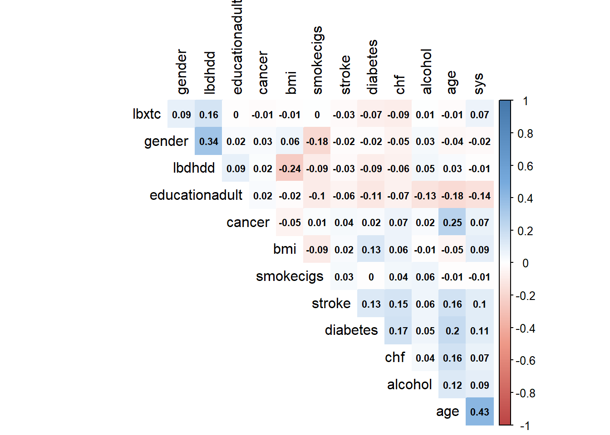
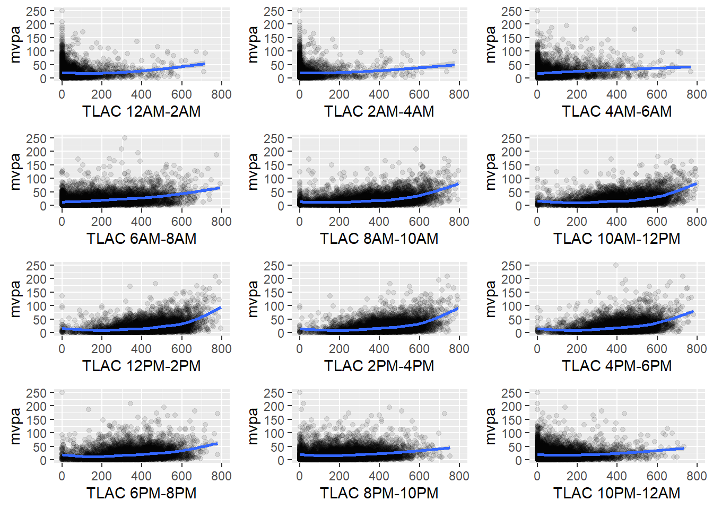

# Multivariate distributions


This section reports a series of multivariate summaries of the NHANES dataset.


## Overview

### Variable correlation




Correlations of the physical activity variables (outcome)

 
### Variable clustering

*Variable clustering is used for assessing collinearity, redundancy, and for separating variables into clusters that can be scored as a single variable, thus resulting in data reduction.*


```
## Hmisc::varclus(x = ~age + gender + bmi + sys + lbxtc + lbdhdd + 
##     smokecigs + drinkstatus + mortstat + diabetes + chf + cancer + 
##     stroke, data = a_nhanes)
## 
## 
## Similarity matrix (Spearman rho^2)
## 
##                             age genderFemale  bmi  sys lbxtc lbdhdd
## age                        1.00         0.00 0.00 0.19  0.00   0.00
## genderFemale               0.00         1.00 0.00 0.00  0.01   0.13
## bmi                        0.00         0.00 1.00 0.02  0.00   0.08
## sys                        0.19         0.00 0.02 1.00  0.00   0.00
## lbxtc                      0.00         0.01 0.00 0.00  1.00   0.02
## lbdhdd                     0.00         0.13 0.08 0.00  0.02   1.00
## smokecigsFormer            0.07         0.02 0.00 0.01  0.00   0.00
## smokecigsCurrent           0.02         0.01 0.01 0.00  0.00   0.01
## drinkstatusNon-Drinker     0.05         0.01 0.01 0.01  0.00   0.01
## drinkstatusHeavy Drinker   0.00         0.01 0.01 0.00  0.00   0.01
## drinkstatusMissing alcohol 0.01         0.00 0.00 0.00  0.00   0.00
## mortstat                   0.17         0.01 0.00 0.04  0.01   0.00
## diabetesYes                0.04         0.00 0.02 0.01  0.01   0.01
## chfYes                     0.03         0.00 0.00 0.00  0.01   0.00
## cancerYes                  0.06         0.00 0.00 0.00  0.00   0.00
## strokeYes                  0.03         0.00 0.00 0.01  0.00   0.00
##                            smokecigsFormer smokecigsCurrent
## age                                   0.07             0.02
## genderFemale                          0.02             0.01
## bmi                                   0.00             0.01
## sys                                   0.01             0.00
## lbxtc                                 0.00             0.00
## lbdhdd                                0.00             0.01
## smokecigsFormer                       1.00             0.12
## smokecigsCurrent                      0.12             1.00
## drinkstatusNon-Drinker                0.00             0.02
## drinkstatusHeavy Drinker              0.00             0.03
## drinkstatusMissing alcohol            0.00             0.00
## mortstat                              0.02             0.00
## diabetesYes                           0.00             0.00
## chfYes                                0.01             0.00
## cancerYes                             0.01             0.00
## strokeYes                             0.00             0.00
##                            drinkstatusNon-Drinker drinkstatusHeavy Drinker
## age                                          0.05                     0.00
## genderFemale                                 0.01                     0.01
## bmi                                          0.01                     0.01
## sys                                          0.01                     0.00
## lbxtc                                        0.00                     0.00
## lbdhdd                                       0.01                     0.01
## smokecigsFormer                              0.00                     0.00
## smokecigsCurrent                             0.02                     0.03
## drinkstatusNon-Drinker                       1.00                     0.04
## drinkstatusHeavy Drinker                     0.04                     1.00
## drinkstatusMissing alcohol                   0.04                     0.01
## mortstat                                     0.02                     0.00
## diabetesYes                                  0.02                     0.00
## chfYes                                       0.01                     0.00
## cancerYes                                    0.00                     0.00
## strokeYes                                    0.01                     0.00
##                            drinkstatusMissing alcohol mortstat diabetesYes
## age                                              0.01     0.17        0.04
## genderFemale                                     0.00     0.01        0.00
## bmi                                              0.00     0.00        0.02
## sys                                              0.00     0.04        0.01
## lbxtc                                            0.00     0.01        0.01
## lbdhdd                                           0.00     0.00        0.01
## smokecigsFormer                                  0.00     0.02        0.00
## smokecigsCurrent                                 0.00     0.00        0.00
## drinkstatusNon-Drinker                           0.04     0.02        0.02
## drinkstatusHeavy Drinker                         0.01     0.00        0.00
## drinkstatusMissing alcohol                       1.00     0.00        0.00
## mortstat                                         0.00     1.00        0.03
## diabetesYes                                      0.00     0.03        1.00
## chfYes                                           0.00     0.04        0.03
## cancerYes                                        0.00     0.03        0.00
## strokeYes                                        0.00     0.03        0.02
##                            chfYes cancerYes strokeYes
## age                          0.03      0.06      0.03
## genderFemale                 0.00      0.00      0.00
## bmi                          0.00      0.00      0.00
## sys                          0.00      0.00      0.01
## lbxtc                        0.01      0.00      0.00
## lbdhdd                       0.00      0.00      0.00
## smokecigsFormer              0.01      0.01      0.00
## smokecigsCurrent             0.00      0.00      0.00
## drinkstatusNon-Drinker       0.01      0.00      0.01
## drinkstatusHeavy Drinker     0.00      0.00      0.00
## drinkstatusMissing alcohol   0.00      0.00      0.00
## mortstat                     0.04      0.03      0.03
## diabetesYes                  0.03      0.00      0.02
## chfYes                       1.00      0.00      0.02
## cancerYes                    0.00      1.00      0.00
## strokeYes                    0.02      0.00      1.00
## 
## No. of observations used for each pair:
## 
##                             age genderFemale  bmi  sys lbxtc lbdhdd
## age                        6680         6680 6624 6360  6410   6410
## genderFemale               6680         6680 6624 6360  6410   6410
## bmi                        6624         6624 6624 6316  6358   6358
## sys                        6360         6360 6316 6360  6133   6133
## lbxtc                      6410         6410 6358 6133  6410   6410
## lbdhdd                     6410         6410 6358 6133  6410   6410
## smokecigsFormer            6676         6676 6621 6356  6406   6406
## smokecigsCurrent           6676         6676 6621 6356  6406   6406
## drinkstatusNon-Drinker     6680         6680 6624 6360  6410   6410
## drinkstatusHeavy Drinker   6680         6680 6624 6360  6410   6410
## drinkstatusMissing alcohol 6680         6680 6624 6360  6410   6410
## mortstat                   6671         6671 6615 6351  6401   6401
## diabetesYes                6680         6680 6624 6360  6410   6410
## chfYes                     6680         6680 6624 6360  6410   6410
## cancerYes                  6680         6680 6624 6360  6410   6410
## strokeYes                  6680         6680 6624 6360  6410   6410
##                            smokecigsFormer smokecigsCurrent
## age                                   6676             6676
## genderFemale                          6676             6676
## bmi                                   6621             6621
## sys                                   6356             6356
## lbxtc                                 6406             6406
## lbdhdd                                6406             6406
## smokecigsFormer                       6676             6676
## smokecigsCurrent                      6676             6676
## drinkstatusNon-Drinker                6676             6676
## drinkstatusHeavy Drinker              6676             6676
## drinkstatusMissing alcohol            6676             6676
## mortstat                              6667             6667
## diabetesYes                           6676             6676
## chfYes                                6676             6676
## cancerYes                             6676             6676
## strokeYes                             6676             6676
##                            drinkstatusNon-Drinker drinkstatusHeavy Drinker
## age                                          6680                     6680
## genderFemale                                 6680                     6680
## bmi                                          6624                     6624
## sys                                          6360                     6360
## lbxtc                                        6410                     6410
## lbdhdd                                       6410                     6410
## smokecigsFormer                              6676                     6676
## smokecigsCurrent                             6676                     6676
## drinkstatusNon-Drinker                       6680                     6680
## drinkstatusHeavy Drinker                     6680                     6680
## drinkstatusMissing alcohol                   6680                     6680
## mortstat                                     6671                     6671
## diabetesYes                                  6680                     6680
## chfYes                                       6680                     6680
## cancerYes                                    6680                     6680
## strokeYes                                    6680                     6680
##                            drinkstatusMissing alcohol mortstat diabetesYes
## age                                              6680     6671        6680
## genderFemale                                     6680     6671        6680
## bmi                                              6624     6615        6624
## sys                                              6360     6351        6360
## lbxtc                                            6410     6401        6410
## lbdhdd                                           6410     6401        6410
## smokecigsFormer                                  6676     6667        6676
## smokecigsCurrent                                 6676     6667        6676
## drinkstatusNon-Drinker                           6680     6671        6680
## drinkstatusHeavy Drinker                         6680     6671        6680
## drinkstatusMissing alcohol                       6680     6671        6680
## mortstat                                         6671     6671        6671
## diabetesYes                                      6680     6671        6680
## chfYes                                           6680     6671        6680
## cancerYes                                        6680     6671        6680
## strokeYes                                        6680     6671        6680
##                            chfYes cancerYes strokeYes
## age                          6680      6680      6680
## genderFemale                 6680      6680      6680
## bmi                          6624      6624      6624
## sys                          6360      6360      6360
## lbxtc                        6410      6410      6410
## lbdhdd                       6410      6410      6410
## smokecigsFormer              6676      6676      6676
## smokecigsCurrent             6676      6676      6676
## drinkstatusNon-Drinker       6680      6680      6680
## drinkstatusHeavy Drinker     6680      6680      6680
## drinkstatusMissing alcohol   6680      6680      6680
## mortstat                     6671      6671      6671
## diabetesYes                  6680      6680      6680
## chfYes                       6680      6680      6680
## cancerYes                    6680      6680      6680
## strokeYes                    6680      6680      6680
## 
## hclust results (method=complete)
## 
## 
## Call:
## hclust(d = as.dist(1 - x), method = method)
## 
## Cluster method   : complete 
## Number of objects: 16
```

Plot associations. 


### Variable redundancy 

Redundancy analysis of predictor variables. 


```
## 
## Redundancy Analysis
## 
## Hmisc::redun(formula = ~age + gender + bmi + sys + lbxtc + lbdhdd + 
##     smokecigs + drinkstatus + mortstat + diabetes + chf + cancer + 
##     stroke, data = a_nhanes)
## 
## n: 6080 	p: 13 	nk: 3 
## 
## Number of NAs:	 600 
## Frequencies of Missing Values Due to Each Variable
##         age      gender         bmi         sys       lbxtc      lbdhdd 
##           0           0          56         320         270         270 
##   smokecigs drinkstatus    mortstat    diabetes         chf      cancer 
##           4           0           9           0           0           0 
##      stroke 
##           0 
## 
## 
## Transformation of target variables forced to be linear
## 
## R-squared cutoff: 0.9 	Type: ordinary 
## 
## R^2 with which each variable can be predicted from all other variables:
## 
##         age      gender         bmi         sys       lbxtc      lbdhdd 
##       0.417       0.222       0.156       0.207       0.057       0.274 
##   smokecigs drinkstatus    mortstat    diabetes         chf      cancer 
##       0.116       0.142       0.282       0.110       0.091       0.080 
##      stroke 
##       0.062 
## 
## No redundant variables
```


##  Summary reports by age and gender

### Distribution of age by gender

<div class="figure" style="text-align: center">

```{=html}
<div id="htmlwidget-6e37e37c063e33f65ea1" style="width:768px;height:250px;" class="plotly html-widget"></div>
<script type="application/json" data-for="htmlwidget-6e37e37c063e33f65ea1">{"x":{"visdat":{"45a44adf2e9a":["function () ","plotlyVisDat"],"45a419f83882":["function () ","data"],"45a446be616c":["function () ","data"],"45a45259262e":["function () ","data"],"45a449294452":["function () ","data"],"45a44c1a2fcc":["function () ","data"],"45a461ac377b":["function () ","data"],"45a43432568f":["function () ","data"]},"cur_data":"45a43432568f","attrs":{"45a419f83882":{"alpha_stroke":1,"sizes":[10,100],"spans":[1,20],"x":{},"y":{},"xend":{},"yend":{},"type":"scatter","mode":"lines","text":{},"hoverinfo":"text","color":["black"],"name":"Histogram","legendgroup":"Histogram","showlegend":true,"inherit":true},"45a446be616c":{"alpha_stroke":1,"sizes":[10,100],"spans":[1,20],"x":{},"y":{},"type":"scatter","mode":"markers","color":["black"],"text":{},"hoverinfo":"text","size":[5],"name":"Mean","legendgroup":"Mean","showlegend":true,"inherit":true},"45a45259262e":{"alpha_stroke":1,"sizes":[10,100],"spans":[1,20],"x":{},"y":{},"xend":{},"yend":{},"type":"scatter","mode":"lines","text":{},"hoverinfo":"text","name":"Median","legendgroup":"Median","showlegend":true,"color":["black"],"line":{"width":3},"inherit":true},"45a449294452":{"alpha_stroke":1,"sizes":[10,100],"spans":[1,20],"x":{},"y":{},"xend":{},"yend":{},"type":"scatter","mode":"lines","text":{},"hoverinfo":"text","name":"Quartiles","legendgroup":"Quartiles","showlegend":true,"color":["blue"],"line":{"width":2},"inherit":true},"45a44c1a2fcc":{"alpha_stroke":1,"sizes":[10,100],"spans":[1,20],"x":{},"y":{},"xend":{},"yend":{},"type":"scatter","mode":"lines","text":{},"hoverinfo":"text","name":"0.05, 0.95<br>Quantiles","legendgroup":"0.05, 0.95<br>Quantiles","showlegend":true,"color":["red"],"line":{"width":2},"inherit":true},"45a44c1a2fcc.1":{"alpha_stroke":1,"sizes":[10,100],"spans":[1,20],"x":{},"y":{},"xend":{},"yend":{},"type":"scatter","mode":"lines","hoverinfo":"none","showlegend":false,"alpha":0.3,"color":["red"],"legendgroup":"0.05, 0.95<br>Quantiles","name":"ignored","inherit":true},"45a44c1a2fcc.2":{"alpha_stroke":1,"sizes":[10,100],"spans":[1,20],"x":{},"y":{},"xend":{},"yend":{},"type":"scatter","mode":"lines","hoverinfo":"none","showlegend":false,"alpha":0.3,"color":["blue"],"legendgroup":"Quartiles","name":"ignored","inherit":true},"45a44c1a2fcc.3":{"alpha_stroke":1,"sizes":[10,100],"spans":[1,20],"x":{},"y":{},"xend":{},"yend":{},"type":"scatter","mode":"lines","hoverinfo":"none","showlegend":false,"alpha":0.3,"color":["red"],"legendgroup":"0.05, 0.95<br>Quantiles","name":"ignored","inherit":true},"45a461ac377b":{"alpha_stroke":1,"sizes":[10,100],"spans":[1,20],"x":{},"y":{},"xend":{},"yend":{},"type":"scatter","mode":"lines","text":{},"hoverinfo":"text","color":["light gray"],"name":"Gini <span style=\"text-decoration: overline\">|Δ|<\/span>","legendgroup":"Gini <span style=\"text-decoration: overline\">|Δ|<\/span>","visible":"legendonly","showlegend":true,"inherit":true},"45a43432568f":{"alpha_stroke":1,"sizes":[10,100],"spans":[1,20],"x":{},"y":{},"xend":{},"yend":{},"type":"scatter","mode":"lines","text":{},"hoverinfo":"text","color":["light blue"],"name":"SD","legendgroup":"SD","visible":"legendonly","showlegend":true,"inherit":true}},"layout":{"height":250,"margin":{"b":40,"l":70,"t":25,"r":10},"xaxis":{"domain":[0,1],"automargin":true,"title":"age <span style='font-family:Verdana;font-size:75%;'>years<\/span>","zeroline":false},"yaxis":{"domain":[0,1],"automargin":true,"title":"","tickvals":[-1,-2],"ticktext":["Male","Female"]},"hovermode":"closest","showlegend":true},"source":"A","config":{"showSendToCloud":false},"data":[{"x":[30,30,null,30.2,30.2,null,30.4,30.4,null,30.6,30.6,null,30.8,30.8,null,31,31,null,31.2,31.2,null,31.4,31.4,null,31.6,31.6,null,31.8,31.8,null,32,32,null,32.2,32.2,null,32.4,32.4,null,32.6,32.6,null,32.8,32.8,null,33,33,null,33.2,33.2,null,33.4,33.4,null,33.6,33.6,null,33.8,33.8,null,34,34,null,34.2,34.2,null,34.4,34.4,null,34.6,34.6,null,34.8,34.8,null,35,35,null,35.2,35.2,null,35.4,35.4,null,35.6,35.6,null,35.8,35.8,null,36,36,null,36.2,36.2,null,36.4,36.4,null,36.6,36.6,null,36.8,36.8,null,37,37,null,37.2,37.2,null,37.4,37.4,null,37.6,37.6,null,37.8,37.8,null,38,38,null,38.2,38.2,null,38.4,38.4,null,38.6,38.6,null,38.8,38.8,null,39,39,null,39.2,39.2,null,39.4,39.4,null,39.6,39.6,null,39.8,39.8,null,40,40,null,40.2,40.2,null,40.4,40.4,null,40.6,40.6,null,40.8,40.8,null,41,41,null,41.2,41.2,null,41.4,41.4,null,41.6,41.6,null,41.8,41.8,null,42,42,null,42.2,42.2,null,42.4,42.4,null,42.6,42.6,null,42.8,42.8,null,43,43,null,43.2,43.2,null,43.3999999999999,43.3999999999999,null,43.6,43.6,null,43.8,43.8,null,44,44,null,44.1999999999999,44.1999999999999,null,44.3999999999999,44.3999999999999,null,44.6,44.6,null,44.7999999999999,44.7999999999999,null,44.9999999999999,44.9999999999999,null,45.1999999999999,45.1999999999999,null,45.3999999999999,45.3999999999999,null,45.5999999999999,45.5999999999999,null,45.7999999999999,45.7999999999999,null,45.9999999999999,45.9999999999999,null,46.1999999999999,46.1999999999999,null,46.3999999999999,46.3999999999999,null,46.5999999999999,46.5999999999999,null,46.7999999999999,46.7999999999999,null,46.9999999999999,46.9999999999999,null,47.1999999999999,47.1999999999999,null,47.3999999999999,47.3999999999999,null,47.5999999999999,47.5999999999999,null,47.7999999999999,47.7999999999999,null,47.9999999999999,47.9999999999999,null,48.1999999999999,48.1999999999999,null,48.3999999999999,48.3999999999999,null,48.5999999999999,48.5999999999999,null,48.7999999999999,48.7999999999999,null,48.9999999999999,48.9999999999999,null,49.1999999999999,49.1999999999999,null,49.3999999999999,49.3999999999999,null,49.5999999999999,49.5999999999999,null,49.7999999999999,49.7999999999999,null,49.9999999999999,49.9999999999999,null,50.1999999999999,50.1999999999999,null,50.3999999999999,50.3999999999999,null,50.5999999999999,50.5999999999999,null,50.7999999999999,50.7999999999999,null,50.9999999999999,50.9999999999999,null,51.1999999999999,51.1999999999999,null,51.3999999999999,51.3999999999999,null,51.5999999999999,51.5999999999999,null,51.7999999999999,51.7999999999999,null,51.9999999999999,51.9999999999999,null,52.1999999999999,52.1999999999999,null,52.3999999999999,52.3999999999999,null,52.5999999999999,52.5999999999999,null,52.7999999999999,52.7999999999999,null,52.9999999999999,52.9999999999999,null,53.1999999999999,53.1999999999999,null,53.3999999999999,53.3999999999999,null,53.5999999999999,53.5999999999999,null,53.7999999999999,53.7999999999999,null,53.9999999999999,53.9999999999999,null,54.1999999999999,54.1999999999999,null,54.3999999999999,54.3999999999999,null,54.5999999999999,54.5999999999999,null,54.7999999999999,54.7999999999999,null,54.9999999999999,54.9999999999999,null,55.1999999999999,55.1999999999999,null,55.3999999999999,55.3999999999999,null,55.5999999999999,55.5999999999999,null,55.7999999999999,55.7999999999999,null,55.9999999999999,55.9999999999999,null,56.1999999999999,56.1999999999999,null,56.3999999999999,56.3999999999999,null,56.5999999999999,56.5999999999999,null,56.7999999999999,56.7999999999999,null,56.9999999999999,56.9999999999999,null,57.1999999999999,57.1999999999999,null,57.3999999999999,57.3999999999999,null,57.5999999999999,57.5999999999999,null,57.7999999999999,57.7999999999999,null,57.9999999999999,57.9999999999999,null,58.1999999999999,58.1999999999999,null,58.3999999999999,58.3999999999999,null,58.5999999999999,58.5999999999999,null,58.7999999999999,58.7999999999999,null,58.9999999999999,58.9999999999999,null,59.1999999999999,59.1999999999999,null,59.3999999999999,59.3999999999999,null,59.5999999999999,59.5999999999999,null,59.7999999999999,59.7999999999999,null,59.9999999999999,59.9999999999999,null,60.1999999999999,60.1999999999999,null,60.3999999999999,60.3999999999999,null,60.5999999999999,60.5999999999999,null,60.7999999999999,60.7999999999999,null,60.9999999999999,60.9999999999999,null,61.1999999999999,61.1999999999999,null,61.3999999999999,61.3999999999999,null,61.5999999999999,61.5999999999999,null,61.7999999999999,61.7999999999999,null,61.9999999999999,61.9999999999999,null,62.1999999999999,62.1999999999999,null,62.3999999999999,62.3999999999999,null,62.5999999999999,62.5999999999999,null,62.7999999999999,62.7999999999999,null,62.9999999999999,62.9999999999999,null,63.1999999999999,63.1999999999999,null,63.3999999999999,63.3999999999999,null,63.5999999999999,63.5999999999999,null,63.7999999999999,63.7999999999999,null,63.9999999999999,63.9999999999999,null,64.1999999999999,64.1999999999999,null,64.3999999999999,64.3999999999999,null,64.5999999999999,64.5999999999999,null,64.7999999999999,64.7999999999999,null,64.9999999999999,64.9999999999999,null,65.1999999999999,65.1999999999999,null,65.3999999999999,65.3999999999999,null,65.5999999999999,65.5999999999999,null,65.7999999999999,65.7999999999999,null,65.9999999999999,65.9999999999999,null,66.1999999999999,66.1999999999999,null,66.3999999999999,66.3999999999999,null,66.5999999999999,66.5999999999999,null,66.7999999999999,66.7999999999999,null,66.9999999999999,66.9999999999999,null,67.1999999999999,67.1999999999999,null,67.3999999999999,67.3999999999999,null,67.5999999999999,67.5999999999999,null,67.7999999999999,67.7999999999999,null,67.9999999999999,67.9999999999999,null,68.1999999999999,68.1999999999999,null,68.3999999999999,68.3999999999999,null,68.5999999999999,68.5999999999999,null,68.7999999999999,68.7999999999999,null,68.9999999999999,68.9999999999999,null,69.1999999999999,69.1999999999999,null,69.3999999999999,69.3999999999999,null,69.5999999999999,69.5999999999999,null,69.7999999999999,69.7999999999999,null,69.9999999999999,69.9999999999999,null,70.1999999999999,70.1999999999999,null,70.3999999999999,70.3999999999999,null,70.5999999999999,70.5999999999999,null,70.7999999999999,70.7999999999999,null,70.9999999999999,70.9999999999999,null,71.1999999999998,71.1999999999998,null,71.3999999999998,71.3999999999998,null,71.5999999999999,71.5999999999999,null,71.7999999999999,71.7999999999999,null,71.9999999999999,71.9999999999999,null,72.1999999999998,72.1999999999998,null,72.3999999999998,72.3999999999998,null,72.5999999999999,72.5999999999999,null,72.7999999999998,72.7999999999998,null,72.9999999999998,72.9999999999998,null,73.1999999999998,73.1999999999998,null,73.3999999999998,73.3999999999998,null,73.5999999999999,73.5999999999999,null,73.7999999999998,73.7999999999998,null,73.9999999999998,73.9999999999998,null,74.1999999999998,74.1999999999998,null,74.3999999999998,74.3999999999998,null,74.5999999999998,74.5999999999998,null,74.7999999999998,74.7999999999998,null,74.9999999999998,74.9999999999998,null,75.1999999999998,75.1999999999998,null,75.3999999999998,75.3999999999998,null,75.5999999999998,75.5999999999998,null,75.7999999999998,75.7999999999998,null,75.9999999999998,75.9999999999998,null,76.1999999999998,76.1999999999998,null,76.3999999999998,76.3999999999998,null,76.5999999999998,76.5999999999998,null,76.7999999999998,76.7999999999998,null,76.9999999999998,76.9999999999998,null,77.1999999999998,77.1999999999998,null,77.3999999999998,77.3999999999998,null,77.5999999999998,77.5999999999998,null,77.7999999999998,77.7999999999998,null,77.9999999999998,77.9999999999998,null,78.1999999999998,78.1999999999998,null,78.3999999999998,78.3999999999998,null,78.5999999999998,78.5999999999998,null,78.7999999999998,78.7999999999998,null,78.9999999999998,78.9999999999998,null,79.1999999999998,79.1999999999998,null,79.3999999999998,79.3999999999998,null,79.5999999999998,79.5999999999998,null,79.7999999999998,79.7999999999998,null,79.9999999999998,79.9999999999998,null,80.1999999999998,80.1999999999998,null,80.3999999999998,80.3999999999998,null,80.5999999999998,80.5999999999998,null,80.7999999999998,80.7999999999998,null,80.9999999999998,80.9999999999998,null,81.1999999999998,81.1999999999998,null,81.3999999999998,81.3999999999998,null,81.5999999999998,81.5999999999998,null,81.7999999999998,81.7999999999998,null,81.9999999999998,81.9999999999998,null,82.1999999999998,82.1999999999998,null,82.3999999999998,82.3999999999998,null,82.5999999999998,82.5999999999998,null,82.7999999999998,82.7999999999998,null,82.9999999999998,82.9999999999998,null,83.1999999999998,83.1999999999998,null,83.3999999999998,83.3999999999998,null,83.5999999999998,83.5999999999998,null,83.7999999999998,83.7999999999998,null,83.9999999999998,83.9999999999998,null,84.1999999999998,84.1999999999998,null,84.3999999999998,84.3999999999998,null,84.5999999999998,84.5999999999998,null,84.7999999999998,84.7999999999998,null,84.9999999999998,84.9999999999998,null,30,30,null,30.2,30.2,null,30.4,30.4,null,30.6,30.6,null,30.8,30.8,null,31,31,null,31.2,31.2,null,31.4,31.4,null,31.6,31.6,null,31.8,31.8,null,32,32,null,32.2,32.2,null,32.4,32.4,null,32.6,32.6,null,32.8,32.8,null,33,33,null,33.2,33.2,null,33.4,33.4,null,33.6,33.6,null,33.8,33.8,null,34,34,null,34.2,34.2,null,34.4,34.4,null,34.6,34.6,null,34.8,34.8,null,35,35,null,35.2,35.2,null,35.4,35.4,null,35.6,35.6,null,35.8,35.8,null,36,36,null,36.2,36.2,null,36.4,36.4,null,36.6,36.6,null,36.8,36.8,null,37,37,null,37.2,37.2,null,37.4,37.4,null,37.6,37.6,null,37.8,37.8,null,38,38,null,38.2,38.2,null,38.4,38.4,null,38.6,38.6,null,38.8,38.8,null,39,39,null,39.2,39.2,null,39.4,39.4,null,39.6,39.6,null,39.8,39.8,null,40,40,null,40.2,40.2,null,40.4,40.4,null,40.6,40.6,null,40.8,40.8,null,41,41,null,41.2,41.2,null,41.4,41.4,null,41.6,41.6,null,41.8,41.8,null,42,42,null,42.2,42.2,null,42.4,42.4,null,42.6,42.6,null,42.8,42.8,null,43,43,null,43.2,43.2,null,43.3999999999999,43.3999999999999,null,43.6,43.6,null,43.8,43.8,null,44,44,null,44.1999999999999,44.1999999999999,null,44.3999999999999,44.3999999999999,null,44.6,44.6,null,44.7999999999999,44.7999999999999,null,44.9999999999999,44.9999999999999,null,45.1999999999999,45.1999999999999,null,45.3999999999999,45.3999999999999,null,45.5999999999999,45.5999999999999,null,45.7999999999999,45.7999999999999,null,45.9999999999999,45.9999999999999,null,46.1999999999999,46.1999999999999,null,46.3999999999999,46.3999999999999,null,46.5999999999999,46.5999999999999,null,46.7999999999999,46.7999999999999,null,46.9999999999999,46.9999999999999,null,47.1999999999999,47.1999999999999,null,47.3999999999999,47.3999999999999,null,47.5999999999999,47.5999999999999,null,47.7999999999999,47.7999999999999,null,47.9999999999999,47.9999999999999,null,48.1999999999999,48.1999999999999,null,48.3999999999999,48.3999999999999,null,48.5999999999999,48.5999999999999,null,48.7999999999999,48.7999999999999,null,48.9999999999999,48.9999999999999,null,49.1999999999999,49.1999999999999,null,49.3999999999999,49.3999999999999,null,49.5999999999999,49.5999999999999,null,49.7999999999999,49.7999999999999,null,49.9999999999999,49.9999999999999,null,50.1999999999999,50.1999999999999,null,50.3999999999999,50.3999999999999,null,50.5999999999999,50.5999999999999,null,50.7999999999999,50.7999999999999,null,50.9999999999999,50.9999999999999,null,51.1999999999999,51.1999999999999,null,51.3999999999999,51.3999999999999,null,51.5999999999999,51.5999999999999,null,51.7999999999999,51.7999999999999,null,51.9999999999999,51.9999999999999,null,52.1999999999999,52.1999999999999,null,52.3999999999999,52.3999999999999,null,52.5999999999999,52.5999999999999,null,52.7999999999999,52.7999999999999,null,52.9999999999999,52.9999999999999,null,53.1999999999999,53.1999999999999,null,53.3999999999999,53.3999999999999,null,53.5999999999999,53.5999999999999,null,53.7999999999999,53.7999999999999,null,53.9999999999999,53.9999999999999,null,54.1999999999999,54.1999999999999,null,54.3999999999999,54.3999999999999,null,54.5999999999999,54.5999999999999,null,54.7999999999999,54.7999999999999,null,54.9999999999999,54.9999999999999,null,55.1999999999999,55.1999999999999,null,55.3999999999999,55.3999999999999,null,55.5999999999999,55.5999999999999,null,55.7999999999999,55.7999999999999,null,55.9999999999999,55.9999999999999,null,56.1999999999999,56.1999999999999,null,56.3999999999999,56.3999999999999,null,56.5999999999999,56.5999999999999,null,56.7999999999999,56.7999999999999,null,56.9999999999999,56.9999999999999,null,57.1999999999999,57.1999999999999,null,57.3999999999999,57.3999999999999,null,57.5999999999999,57.5999999999999,null,57.7999999999999,57.7999999999999,null,57.9999999999999,57.9999999999999,null,58.1999999999999,58.1999999999999,null,58.3999999999999,58.3999999999999,null,58.5999999999999,58.5999999999999,null,58.7999999999999,58.7999999999999,null,58.9999999999999,58.9999999999999,null,59.1999999999999,59.1999999999999,null,59.3999999999999,59.3999999999999,null,59.5999999999999,59.5999999999999,null,59.7999999999999,59.7999999999999,null,59.9999999999999,59.9999999999999,null,60.1999999999999,60.1999999999999,null,60.3999999999999,60.3999999999999,null,60.5999999999999,60.5999999999999,null,60.7999999999999,60.7999999999999,null,60.9999999999999,60.9999999999999,null,61.1999999999999,61.1999999999999,null,61.3999999999999,61.3999999999999,null,61.5999999999999,61.5999999999999,null,61.7999999999999,61.7999999999999,null,61.9999999999999,61.9999999999999,null,62.1999999999999,62.1999999999999,null,62.3999999999999,62.3999999999999,null,62.5999999999999,62.5999999999999,null,62.7999999999999,62.7999999999999,null,62.9999999999999,62.9999999999999,null,63.1999999999999,63.1999999999999,null,63.3999999999999,63.3999999999999,null,63.5999999999999,63.5999999999999,null,63.7999999999999,63.7999999999999,null,63.9999999999999,63.9999999999999,null,64.1999999999999,64.1999999999999,null,64.3999999999999,64.3999999999999,null,64.5999999999999,64.5999999999999,null,64.7999999999999,64.7999999999999,null,64.9999999999999,64.9999999999999,null,65.1999999999999,65.1999999999999,null,65.3999999999999,65.3999999999999,null,65.5999999999999,65.5999999999999,null,65.7999999999999,65.7999999999999,null,65.9999999999999,65.9999999999999,null,66.1999999999999,66.1999999999999,null,66.3999999999999,66.3999999999999,null,66.5999999999999,66.5999999999999,null,66.7999999999999,66.7999999999999,null,66.9999999999999,66.9999999999999,null,67.1999999999999,67.1999999999999,null,67.3999999999999,67.3999999999999,null,67.5999999999999,67.5999999999999,null,67.7999999999999,67.7999999999999,null,67.9999999999999,67.9999999999999,null,68.1999999999999,68.1999999999999,null,68.3999999999999,68.3999999999999,null,68.5999999999999,68.5999999999999,null,68.7999999999999,68.7999999999999,null,68.9999999999999,68.9999999999999,null,69.1999999999999,69.1999999999999,null,69.3999999999999,69.3999999999999,null,69.5999999999999,69.5999999999999,null,69.7999999999999,69.7999999999999,null,69.9999999999999,69.9999999999999,null,70.1999999999999,70.1999999999999,null,70.3999999999999,70.3999999999999,null,70.5999999999999,70.5999999999999,null,70.7999999999999,70.7999999999999,null,70.9999999999999,70.9999999999999,null,71.1999999999998,71.1999999999998,null,71.3999999999998,71.3999999999998,null,71.5999999999999,71.5999999999999,null,71.7999999999999,71.7999999999999,null,71.9999999999999,71.9999999999999,null,72.1999999999998,72.1999999999998,null,72.3999999999998,72.3999999999998,null,72.5999999999999,72.5999999999999,null,72.7999999999998,72.7999999999998,null,72.9999999999998,72.9999999999998,null,73.1999999999998,73.1999999999998,null,73.3999999999998,73.3999999999998,null,73.5999999999999,73.5999999999999,null,73.7999999999998,73.7999999999998,null,73.9999999999998,73.9999999999998,null,74.1999999999998,74.1999999999998,null,74.3999999999998,74.3999999999998,null,74.5999999999998,74.5999999999998,null,74.7999999999998,74.7999999999998,null,74.9999999999998,74.9999999999998,null,75.1999999999998,75.1999999999998,null,75.3999999999998,75.3999999999998,null,75.5999999999998,75.5999999999998,null,75.7999999999998,75.7999999999998,null,75.9999999999998,75.9999999999998,null,76.1999999999998,76.1999999999998,null,76.3999999999998,76.3999999999998,null,76.5999999999998,76.5999999999998,null,76.7999999999998,76.7999999999998,null,76.9999999999998,76.9999999999998,null,77.1999999999998,77.1999999999998,null,77.3999999999998,77.3999999999998,null,77.5999999999998,77.5999999999998,null,77.7999999999998,77.7999999999998,null,77.9999999999998,77.9999999999998,null,78.1999999999998,78.1999999999998,null,78.3999999999998,78.3999999999998,null,78.5999999999998,78.5999999999998,null,78.7999999999998,78.7999999999998,null,78.9999999999998,78.9999999999998,null,79.1999999999998,79.1999999999998,null,79.3999999999998,79.3999999999998,null,79.5999999999998,79.5999999999998,null,79.7999999999998,79.7999999999998,null,79.9999999999998,79.9999999999998,null,80.1999999999998,80.1999999999998,null,80.3999999999998,80.3999999999998,null,80.5999999999998,80.5999999999998,null,80.7999999999998,80.7999999999998,null,80.9999999999998,80.9999999999998,null,81.1999999999998,81.1999999999998,null,81.3999999999998,81.3999999999998,null,81.5999999999998,81.5999999999998,null,81.7999999999998,81.7999999999998,null,81.9999999999998,81.9999999999998,null,82.1999999999998,82.1999999999998,null,82.3999999999998,82.3999999999998,null,82.5999999999998,82.5999999999998,null,82.7999999999998,82.7999999999998,null,82.9999999999998,82.9999999999998,null,83.1999999999998,83.1999999999998,null,83.3999999999998,83.3999999999998,null,83.5999999999998,83.5999999999998,null,83.7999999999998,83.7999999999998,null,83.9999999999998,83.9999999999998,null,84.1999999999998,84.1999999999998,null,84.3999999999998,84.3999999999998,null,84.5999999999998,84.5999999999998,null,84.7999999999998,84.7999999999998,null,84.9999999999998,84.9999999999998],"y":[-1,-0.764180863602272,null,-1,-0.836740597878496,null,-1,-0.81860066430944,null,-1,-0.709761062895103,null,-1,-0.836740597878496,null,-1,-0.564641594342655,null,-1,-0.836740597878496,null,-1,-0.746040930033216,null,-1,-0.637201328618879,null,-1,-0.709761062895103,null,-1,-0.727900996464159,null,-1,-0.800460730740384,null,-1,-0.782320797171328,null,-1,-0.655341262187935,null,-1,-0.691621129326047,null,-1,-0.782320797171328,null,-1,-0.854880531447552,null,-1,-0.800460730740384,null,-1,-0.637201328618879,null,-1,-0.854880531447552,null,-1,-0.746040930033216,null,-1,-0.782320797171328,null,-1,-0.891160398585664,null,-1,-0.619061395049823,null,-1,-0.854880531447552,null,-1,-0.564641594342655,null,-1,-0.836740597878496,null,-1,-0.836740597878496,null,-1,-0.655341262187935,null,-1,-0.746040930033216,null,-1,-0.709761062895103,null,-1,-0.836740597878496,null,-1,-0.81860066430944,null,-1,-0.637201328618879,null,-1,-0.81860066430944,null,-1,-0.655341262187935,null,-1,-0.90930033215472,null,-1,-0.81860066430944,null,-1,-0.637201328618879,null,-1,-0.891160398585664,null,-1,-0.764180863602272,null,-1,-0.709761062895103,null,-1,-0.836740597878496,null,-1,-0.709761062895103,null,-1,-0.836740597878496,null,-1,-0.764180863602272,null,-1,-0.764180863602272,null,-1,-0.709761062895103,null,-1,-0.782320797171328,null,-1,-0.782320797171328,null,-1,-0.619061395049823,null,-1,-0.764180863602272,null,-1,-0.764180863602272,null,-1,-0.673481195756991,null,-1,-0.655341262187935,null,-1,-0.637201328618879,null,-1,-0.746040930033216,null,-1,-0.782320797171328,null,-1,-0.709761062895103,null,-1,-0.637201328618879,null,-1,-0.709761062895103,null,-1,-0.81860066430944,null,-1,-0.727900996464159,null,-1,-0.709761062895103,null,-1,-0.800460730740384,null,-1,-0.691621129326047,null,-1,-0.854880531447552,null,-1,-0.800460730740384,null,-1,-0.546501660773599,null,-1,-0.854880531447552,null,-1,-0.673481195756991,null,-1,-0.81860066430944,null,-1,-0.873020465016608,null,-1,-0.600921461480767,null,-1,-0.727900996464159,null,-1,-0.655341262187935,null,-1,-0.764180863602272,null,-1,-0.854880531447552,null,-1,-0.564641594342655,null,-1,-0.782320797171328,null,-1,-0.764180863602272,null,-1,-0.637201328618879,null,-1,-0.90930033215472,null,-1,-0.401382192221151,null,-1,-0.81860066430944,null,-1,-0.81860066430944,null,-1,-0.90930033215472,null,-1,-0.836740597878496,null,-1,-0.727900996464159,null,-1,-0.691621129326047,null,-1,-0.782320797171328,null,-1,-0.782320797171328,null,-1,-0.655341262187935,null,-1,-0.709761062895103,null,-1,-0.727900996464159,null,-1,-0.691621129326047,null,-1,-0.836740597878496,null,-1,-0.854880531447552,null,-1,-0.709761062895103,null,-1,-0.746040930033216,null,-1,-0.691621129326047,null,-1,-0.746040930033216,null,-1,-0.782320797171328,null,-1,-0.764180863602272,null,-1,-0.800460730740384,null,-1,-0.600921461480767,null,-1,-0.81860066430944,null,-1,-0.782320797171328,null,-1,-0.619061395049823,null,-1,-0.836740597878496,null,-1,-0.691621129326047,null,-1,-0.891160398585664,null,-1,-0.81860066430944,null,-1,-0.709761062895103,null,-1,-0.873020465016608,null,-1,-0.81860066430944,null,-1,-0.764180863602272,null,-1,-0.746040930033216,null,-1,-0.709761062895103,null,-1,-0.764180863602272,null,-1,-0.746040930033216,null,-1,-0.727900996464159,null,-1,-0.727900996464159,null,-1,-0.782320797171328,null,-1,-0.764180863602272,null,-1,-0.655341262187935,null,-1,-0.836740597878496,null,-1,-0.891160398585664,null,-1,-0.836740597878496,null,-1,-0.854880531447552,null,-1,-0.746040930033216,null,-1,-0.891160398585664,null,-1,-0.727900996464159,null,-1,-0.764180863602272,null,-1,-0.963720132861888,null,-1,-0.90930033215472,null,-1,-0.746040930033216,null,-1,-0.854880531447552,null,-1,-0.854880531447552,null,-1,-0.873020465016608,null,-1,-0.854880531447552,null,-1,-0.90930033215472,null,-1,-0.90930033215472,null,-1,-0.800460730740384,null,-1,-0.891160398585664,null,-1,-0.800460730740384,null,-1,-0.81860066430944,null,-1,-0.927440265723776,null,-1,-0.727900996464159,null,-1,-0.90930033215472,null,-1,-0.81860066430944,null,-1,-0.637201328618879,null,-1,-0.836740597878496,null,-1,-0.673481195756991,null,-1,-0.81860066430944,null,-1,-0.764180863602272,null,-1,-0.691621129326047,null,-1,-0.782320797171328,null,-1,-0.546501660773599,null,-1,-0.764180863602272,null,-1,-0.764180863602272,null,-1,-0.709761062895103,null,-1,-0.81860066430944,null,-1,-0.637201328618879,null,-1,-0.927440265723776,null,-1,-0.691621129326047,null,-1,-0.891160398585664,null,-1,-0.691621129326047,null,-1,-0.691621129326047,null,-1,-0.81860066430944,null,-1,-0.782320797171328,null,-1,-0.854880531447552,null,-1,-0.836740597878496,null,-1,-0.782320797171328,null,-1,-0.764180863602272,null,-1,-0.782320797171328,null,-1,-0.782320797171328,null,-1,-0.764180863602272,null,-1,-0.655341262187935,null,-1,-0.691621129326047,null,-1,-0.655341262187935,null,-1,-0.691621129326047,null,-1,-0.673481195756991,null,-1,-0.800460730740384,null,-1,-0.764180863602272,null,-1,-0.782320797171328,null,-1,-0.81860066430944,null,-1,-0.945580199292832,null,-1,-0.854880531447552,null,-1,-0.836740597878496,null,-1,-0.854880531447552,null,-1,-0.81860066430944,null,-1,-0.782320797171328,null,-1,-0.764180863602272,null,-1,-0.81860066430944,null,-1,-0.709761062895103,null,-1,-0.81860066430944,null,-1,-0.800460730740384,null,-1,-0.727900996464159,null,-1,-0.873020465016608,null,-1,-0.709761062895103,null,-1,-0.800460730740384,null,-1,-0.764180863602272,null,-1,-0.746040930033216,null,-1,-0.764180863602272,null,-1,-0.582781527911711,null,-1,-0.90930033215472,null,-1,-0.854880531447552,null,-1,-0.600921461480767,null,-1,-0.81860066430944,null,-1,-0.782320797171328,null,-1,-0.782320797171328,null,-1,-0.854880531447552,null,-1,-0.800460730740384,null,-1,-0.81860066430944,null,-1,-0.81860066430944,null,-1,-0.891160398585664,null,-1,-0.800460730740384,null,-1,-0.800460730740384,null,-1,-0.746040930033216,null,-1,-0.727900996464159,null,-1,-0.854880531447552,null,-1,-0.836740597878496,null,-1,-0.782320797171328,null,-1,-0.891160398585664,null,-1,-0.691621129326047,null,-1,-0.81860066430944,null,-1,-0.891160398585664,null,-1,-0.836740597878496,null,-1,-0.854880531447552,null,-1,-0.727900996464159,null,-1,-0.891160398585664,null,-1,-0.782320797171328,null,-1,-0.836740597878496,null,-1,-0.891160398585664,null,-1,-0.873020465016608,null,-1,-0.854880531447552,null,-1,-0.891160398585664,null,-1,-0.800460730740384,null,-1,-0.945580199292832,null,-1,-0.673481195756991,null,-1,-0.764180863602272,null,-1,-0.81860066430944,null,-1,-0.81860066430944,null,-1,-0.81860066430944,null,-1,-0.800460730740384,null,-1,-0.945580199292832,null,-1,-0.854880531447552,null,-1,-0.891160398585664,null,-1,-0.927440265723776,null,-1,-0.854880531447552,null,-1,-0.854880531447552,null,-1,-0.81860066430944,null,-1,-0.873020465016608,null,-1,-0.836740597878496,null,-1,-0.691621129326047,null,-1,-0.873020465016608,null,-1,-0.873020465016608,null,-1,-0.854880531447552,null,-1,-0.873020465016608,null,-1,-0.81860066430944,null,-1,-0.836740597878496,null,-1,-0.891160398585664,null,-1,-0.836740597878496,null,-1,-0.800460730740384,null,-1,-0.800460730740384,null,-1,-0.981860066430944,null,-1,-0.800460730740384,null,-1,-0.90930033215472,null,-1,-0.927440265723776,null,-1,-0.945580199292832,null,-1,-0.891160398585664,null,-1,-0.90930033215472,null,-1,-0.81860066430944,null,-1,-0.891160398585664,null,-1,-0.945580199292832,null,-2,-1.73529411764706,null,-2,-1.75294117647059,null,-2,-1.64705882352941,null,-2,-1.61176470588235,null,-2,-1.78823529411765,null,-2,-1.7,null,-2,-1.68235294117647,null,-2,-1.80588235294118,null,-2,-1.71764705882353,null,-2,-1.71764705882353,null,-2,-1.4,null,-2,-1.73529411764706,null,-2,-1.80588235294118,null,-2,-1.68235294117647,null,-2,-1.84117647058824,null,-2,-1.73529411764706,null,-2,-1.7,null,-2,-1.71764705882353,null,-2,-1.66470588235294,null,-2,-1.71764705882353,null,-2,-1.62941176470588,null,-2,-1.82352941176471,null,-2,-1.77058823529412,null,-2,-1.55882352941176,null,-2,-1.7,null,-2,-1.61176470588235,null,-2,-1.71764705882353,null,-2,-1.75294117647059,null,-2,-1.77058823529412,null,-2,-1.7,null,-2,-1.50588235294118,null,-2,-1.75294117647059,null,-2,-1.82352941176471,null,-2,-1.73529411764706,null,-2,-1.68235294117647,null,-2,-1.71764705882353,null,-2,-1.77058823529412,null,-2,-1.85882352941176,null,-2,-1.75294117647059,null,-2,-1.77058823529412,null,-2,-1.7,null,-2,-1.73529411764706,null,-2,-1.85882352941176,null,-2,-1.61176470588235,null,-2,-1.84117647058824,null,-2,-1.75294117647059,null,-2,-1.84117647058824,null,-2,-1.84117647058824,null,-2,-1.77058823529412,null,-2,-1.87647058823529,null,-2,-1.59411764705882,null,-2,-1.75294117647059,null,-2,-1.71764705882353,null,-2,-1.64705882352941,null,-2,-1.78823529411765,null,-2,-1.68235294117647,null,-2,-1.84117647058824,null,-2,-1.61176470588235,null,-2,-1.66470588235294,null,-2,-1.71764705882353,null,-2,-1.66470588235294,null,-2,-1.80588235294118,null,-2,-1.77058823529412,null,-2,-1.66470588235294,null,-2,-1.77058823529412,null,-2,-1.77058823529412,null,-2,-1.77058823529412,null,-2,-1.73529411764706,null,-2,-1.7,null,-2,-1.68235294117647,null,-2,-1.68235294117647,null,-2,-1.75294117647059,null,-2,-1.82352941176471,null,-2,-1.75294117647059,null,-2,-1.87647058823529,null,-2,-1.71764705882353,null,-2,-1.73529411764706,null,-2,-1.7,null,-2,-1.66470588235294,null,-2,-1.78823529411765,null,-2,-1.64705882352941,null,-2,-1.80588235294118,null,-2,-1.84117647058824,null,-2,-1.64705882352941,null,-2,-1.62941176470588,null,-2,-1.64705882352941,null,-2,-1.75294117647059,null,-2,-1.78823529411765,null,-2,-1.77058823529412,null,-2,-1.77058823529412,null,-2,-1.71764705882353,null,-2,-1.78823529411765,null,-2,-1.85882352941176,null,-2,-1.80588235294118,null,-2,-1.78823529411765,null,-2,-1.75294117647059,null,-2,-1.80588235294118,null,-2,-1.7,null,-2,-1.75294117647059,null,-2,-1.80588235294118,null,-2,-1.75294117647059,null,-2,-1.87647058823529,null,-2,-1.77058823529412,null,-2,-1.64705882352941,null,-2,-1.87647058823529,null,-2,-1.78823529411765,null,-2,-1.75294117647059,null,-2,-1.75294117647059,null,-2,-1.64705882352941,null,-2,-1.73529411764706,null,-2,-1.75294117647059,null,-2,-1.73529411764706,null,-2,-1.68235294117647,null,-2,-1.73529411764706,null,-2,-1.84117647058824,null,-2,-1.7,null,-2,-1.71764705882353,null,-2,-1.87647058823529,null,-2,-1.84117647058824,null,-2,-1.78823529411765,null,-2,-1.71764705882353,null,-2,-1.7,null,-2,-1.87647058823529,null,-2,-1.75294117647059,null,-2,-1.85882352941176,null,-2,-1.78823529411765,null,-2,-1.80588235294118,null,-2,-1.84117647058824,null,-2,-1.77058823529412,null,-2,-1.89411764705882,null,-2,-1.77058823529412,null,-2,-1.85882352941176,null,-2,-1.84117647058824,null,-2,-1.73529411764706,null,-2,-1.89411764705882,null,-2,-1.68235294117647,null,-2,-1.87647058823529,null,-2,-1.85882352941176,null,-2,-1.87647058823529,null,-2,-1.89411764705882,null,-2,-1.82352941176471,null,-2,-1.89411764705882,null,-2,-1.84117647058824,null,-2,-1.82352941176471,null,-2,-1.85882352941176,null,-2,-1.80588235294118,null,-2,-1.80588235294118,null,-2,-1.87647058823529,null,-2,-1.77058823529412,null,-2,-1.84117647058824,null,-2,-1.75294117647059,null,-2,-1.73529411764706,null,-2,-1.75294117647059,null,-2,-1.61176470588235,null,-2,-1.77058823529412,null,-2,-1.4,null,-2,-1.68235294117647,null,-2,-1.80588235294118,null,-2,-1.7,null,-2,-1.82352941176471,null,-2,-1.80588235294118,null,-2,-1.94705882352941,null,-2,-1.73529411764706,null,-2,-1.64705882352941,null,-2,-1.80588235294118,null,-2,-1.68235294117647,null,-2,-1.80588235294118,null,-2,-1.82352941176471,null,-2,-1.71764705882353,null,-2,-1.77058823529412,null,-2,-1.62941176470588,null,-2,-1.80588235294118,null,-2,-1.87647058823529,null,-2,-1.62941176470588,null,-2,-1.89411764705882,null,-2,-1.57647058823529,null,-2,-1.80588235294118,null,-2,-1.78823529411765,null,-2,-1.78823529411765,null,-2,-1.78823529411765,null,-2,-1.73529411764706,null,-2,-1.80588235294118,null,-2,-1.78823529411765,null,-2,-1.78823529411765,null,-2,-1.85882352941176,null,-2,-1.78823529411765,null,-2,-1.84117647058824,null,-2,-1.82352941176471,null,-2,-1.64705882352941,null,-2,-1.82352941176471,null,-2,-1.84117647058824,null,-2,-1.91176470588235,null,-2,-1.91176470588235,null,-2,-1.75294117647059,null,-2,-1.87647058823529,null,-2,-1.64705882352941,null,-2,-1.80588235294118,null,-2,-1.78823529411765,null,-2,-1.7,null,-2,-1.85882352941176,null,-2,-1.85882352941176,null,-2,-1.82352941176471,null,-2,-1.71764705882353,null,-2,-1.80588235294118,null,-2,-1.84117647058824,null,-2,-1.75294117647059,null,-2,-1.82352941176471,null,-2,-1.85882352941176,null,-2,-1.85882352941176,null,-2,-1.91176470588235,null,-2,-1.80588235294118,null,-2,-1.85882352941176,null,-2,-1.84117647058824,null,-2,-1.75294117647059,null,-2,-1.89411764705882,null,-2,-1.77058823529412,null,-2,-1.84117647058824,null,-2,-1.80588235294118,null,-2,-1.75294117647059,null,-2,-1.82352941176471,null,-2,-1.85882352941176,null,-2,-1.87647058823529,null,-2,-1.78823529411765,null,-2,-1.73529411764706,null,-2,-1.98235294117647,null,-2,-1.87647058823529,null,-2,-1.85882352941176,null,-2,-1.78823529411765,null,-2,-1.78823529411765,null,-2,-1.91176470588235,null,-2,-1.82352941176471,null,-2,-1.85882352941176,null,-2,-1.85882352941176,null,-2,-1.75294117647059,null,-2,-1.96470588235294,null,-2,-1.84117647058824,null,-2,-1.92941176470588,null,-2,-1.85882352941176,null,-2,-1.78823529411765,null,-2,-1.87647058823529,null,-2,-1.87647058823529,null,-2,-1.92941176470588,null,-2,-1.96470588235294,null,-2,-1.78823529411765,null,-2,-1.92941176470588,null,-2,-1.89411764705882,null,-2,-1.92941176470588,null,-2,-1.94705882352941,null,-2,-1.84117647058824,null,-2,-1.87647058823529,null,-2,-1.78823529411765,null,-2,-1.91176470588235,null,-2,-1.87647058823529,null,-2,-1.78823529411765,null,-2,-1.91176470588235,null,-2,-1.82352941176471,null,-2,-1.92941176470588,null,-2,-1.89411764705882,null,-2,-1.59411764705882,null,-2,-1.77058823529412,null,-2,-1.84117647058824,null,-2,-1.96470588235294,null,-2,-1.92941176470588,null,-2,-1.80588235294118,null,-2,-1.89411764705882,null,-2,-1.77058823529412,null,-2,-1.89411764705882,null,-2,-1.89411764705882,null,-2,-1.84117647058824,null,-2,-1.87647058823529,null,-2,-1.77058823529412,null,-2,-1.89411764705882,null,-2,-1.82352941176471,null,-2,-1.91176470588235,null,-2,-1.92941176470588,null,-2,-1.94705882352941],"type":"scatter","mode":"lines","text":["30<br>0.004<br>n=13","30<br>0.004<br>n=13",null,"30.2<br>0.003<br>n=9","30.2<br>0.003<br>n=9",null,"30.4<br>0.003<br>n=10","30.4<br>0.003<br>n=10",null,"30.6<br>0.005<br>n=16","30.6<br>0.005<br>n=16",null,"30.8<br>0.003<br>n=9","30.8<br>0.003<br>n=9",null,"31<br>0.007<br>n=24","31<br>0.007<br>n=24",null,"31.2<br>0.003<br>n=9","31.2<br>0.003<br>n=9",null,"31.4<br>0.004<br>n=14","31.4<br>0.004<br>n=14",null,"31.6<br>0.006<br>n=20","31.6<br>0.006<br>n=20",null,"31.8<br>0.005<br>n=16","31.8<br>0.005<br>n=16",null,"32<br>0.005<br>n=15","32<br>0.005<br>n=15",null,"32.2<br>0.003<br>n=11","32.2<br>0.003<br>n=11",null,"32.4<br>0.004<br>n=12","32.4<br>0.004<br>n=12",null,"32.6<br>0.006<br>n=19","32.6<br>0.006<br>n=19",null,"32.8<br>0.005<br>n=17","32.8<br>0.005<br>n=17",null,"33<br>0.004<br>n=12","33<br>0.004<br>n=12",null,"33.2<br>0.002<br>n=8","33.2<br>0.002<br>n=8",null,"33.4<br>0.003<br>n=11","33.4<br>0.003<br>n=11",null,"33.6<br>0.006<br>n=20","33.6<br>0.006<br>n=20",null,"33.8<br>0.002<br>n=8","33.8<br>0.002<br>n=8",null,"34<br>0.004<br>n=14","34<br>0.004<br>n=14",null,"34.2<br>0.004<br>n=12","34.2<br>0.004<br>n=12",null,"34.4<br>0.002<br>n=6","34.4<br>0.002<br>n=6",null,"34.6<br>0.006<br>n=21","34.6<br>0.006<br>n=21",null,"34.8<br>0.002<br>n=8","34.8<br>0.002<br>n=8",null,"35<br>0.007<br>n=24","35<br>0.007<br>n=24",null,"35.2<br>0.003<br>n=9","35.2<br>0.003<br>n=9",null,"35.4<br>0.003<br>n=9","35.4<br>0.003<br>n=9",null,"35.6<br>0.006<br>n=19","35.6<br>0.006<br>n=19",null,"35.8<br>0.004<br>n=14","35.8<br>0.004<br>n=14",null,"36<br>0.005<br>n=16","36<br>0.005<br>n=16",null,"36.2<br>0.003<br>n=9","36.2<br>0.003<br>n=9",null,"36.4<br>0.003<br>n=10","36.4<br>0.003<br>n=10",null,"36.6<br>0.006<br>n=20","36.6<br>0.006<br>n=20",null,"36.8<br>0.003<br>n=10","36.8<br>0.003<br>n=10",null,"37<br>0.006<br>n=19","37<br>0.006<br>n=19",null,"37.2<br>0.002<br>n=5","37.2<br>0.002<br>n=5",null,"37.4<br>0.003<br>n=10","37.4<br>0.003<br>n=10",null,"37.6<br>0.006<br>n=20","37.6<br>0.006<br>n=20",null,"37.8<br>0.002<br>n=6","37.8<br>0.002<br>n=6",null,"38<br>0.004<br>n=13","38<br>0.004<br>n=13",null,"38.2<br>0.005<br>n=16","38.2<br>0.005<br>n=16",null,"38.4<br>0.003<br>n=9","38.4<br>0.003<br>n=9",null,"38.6<br>0.005<br>n=16","38.6<br>0.005<br>n=16",null,"38.8<br>0.003<br>n=9","38.8<br>0.003<br>n=9",null,"39<br>0.004<br>n=13","39<br>0.004<br>n=13",null,"39.2<br>0.004<br>n=13","39.2<br>0.004<br>n=13",null,"39.4<br>0.005<br>n=16","39.4<br>0.005<br>n=16",null,"39.6<br>0.004<br>n=12","39.6<br>0.004<br>n=12",null,"39.8<br>0.004<br>n=12","39.8<br>0.004<br>n=12",null,"40<br>0.006<br>n=21","40<br>0.006<br>n=21",null,"40.2<br>0.004<br>n=13","40.2<br>0.004<br>n=13",null,"40.4<br>0.004<br>n=13","40.4<br>0.004<br>n=13",null,"40.6<br>0.005<br>n=18","40.6<br>0.005<br>n=18",null,"40.8<br>0.006<br>n=19","40.8<br>0.006<br>n=19",null,"41<br>0.006<br>n=20","41<br>0.006<br>n=20",null,"41.2<br>0.004<br>n=14","41.2<br>0.004<br>n=14",null,"41.4<br>0.004<br>n=12","41.4<br>0.004<br>n=12",null,"41.6<br>0.005<br>n=16","41.6<br>0.005<br>n=16",null,"41.8<br>0.006<br>n=20","41.8<br>0.006<br>n=20",null,"42<br>0.005<br>n=16","42<br>0.005<br>n=16",null,"42.2<br>0.003<br>n=10","42.2<br>0.003<br>n=10",null,"42.4<br>0.005<br>n=15","42.4<br>0.005<br>n=15",null,"42.6<br>0.005<br>n=16","42.6<br>0.005<br>n=16",null,"42.8<br>0.003<br>n=11","42.8<br>0.003<br>n=11",null,"43<br>0.005<br>n=17","43<br>0.005<br>n=17",null,"43.2<br>0.002<br>n=8","43.2<br>0.002<br>n=8",null,"43.4<br>0.003<br>n=11","43.4<br>0.003<br>n=11",null,"43.6<br>0.008<br>n=25","43.6<br>0.008<br>n=25",null,"43.8<br>0.002<br>n=8","43.8<br>0.002<br>n=8",null,"44<br>0.005<br>n=18","44<br>0.005<br>n=18",null,"44.2<br>0.003<br>n=10","44.2<br>0.003<br>n=10",null,"44.4<br>0.002<br>n=7","44.4<br>0.002<br>n=7",null,"44.6<br>0.007<br>n=22","44.6<br>0.007<br>n=22",null,"44.8<br>0.005<br>n=15","44.8<br>0.005<br>n=15",null,"45<br>0.006<br>n=19","45<br>0.006<br>n=19",null,"45.2<br>0.004<br>n=13","45.2<br>0.004<br>n=13",null,"45.4<br>0.002<br>n=8","45.4<br>0.002<br>n=8",null,"45.6<br>0.007<br>n=24","45.6<br>0.007<br>n=24",null,"45.8<br>0.004<br>n=12","45.8<br>0.004<br>n=12",null,"46<br>0.004<br>n=13","46<br>0.004<br>n=13",null,"46.2<br>0.006<br>n=20","46.2<br>0.006<br>n=20",null,"46.4<br>0.002<br>n=5","46.4<br>0.002<br>n=5",null,"46.6<br>0.01<br>n=33","46.6<br>0.01<br>n=33",null,"46.8<br>0.003<br>n=10","46.8<br>0.003<br>n=10",null,"47<br>0.003<br>n=10","47<br>0.003<br>n=10",null,"47.2<br>0.002<br>n=5","47.2<br>0.002<br>n=5",null,"47.4<br>0.003<br>n=9","47.4<br>0.003<br>n=9",null,"47.6<br>0.005<br>n=15","47.6<br>0.005<br>n=15",null,"47.8<br>0.005<br>n=17","47.8<br>0.005<br>n=17",null,"48<br>0.004<br>n=12","48<br>0.004<br>n=12",null,"48.2<br>0.004<br>n=12","48.2<br>0.004<br>n=12",null,"48.4<br>0.006<br>n=19","48.4<br>0.006<br>n=19",null,"48.6<br>0.005<br>n=16","48.6<br>0.005<br>n=16",null,"48.8<br>0.005<br>n=15","48.8<br>0.005<br>n=15",null,"49<br>0.005<br>n=17","49<br>0.005<br>n=17",null,"49.2<br>0.003<br>n=9","49.2<br>0.003<br>n=9",null,"49.4<br>0.002<br>n=8","49.4<br>0.002<br>n=8",null,"49.6<br>0.005<br>n=16","49.6<br>0.005<br>n=16",null,"49.8<br>0.004<br>n=14","49.8<br>0.004<br>n=14",null,"50<br>0.005<br>n=17","50<br>0.005<br>n=17",null,"50.2<br>0.004<br>n=14","50.2<br>0.004<br>n=14",null,"50.4<br>0.004<br>n=12","50.4<br>0.004<br>n=12",null,"50.6<br>0.004<br>n=13","50.6<br>0.004<br>n=13",null,"50.8<br>0.003<br>n=11","50.8<br>0.003<br>n=11",null,"51<br>0.007<br>n=22","51<br>0.007<br>n=22",null,"51.2<br>0.003<br>n=10","51.2<br>0.003<br>n=10",null,"51.4<br>0.004<br>n=12","51.4<br>0.004<br>n=12",null,"51.6<br>0.006<br>n=21","51.6<br>0.006<br>n=21",null,"51.8<br>0.003<br>n=9","51.8<br>0.003<br>n=9",null,"52<br>0.005<br>n=17","52<br>0.005<br>n=17",null,"52.2<br>0.002<br>n=6","52.2<br>0.002<br>n=6",null,"52.4<br>0.003<br>n=10","52.4<br>0.003<br>n=10",null,"52.6<br>0.005<br>n=16","52.6<br>0.005<br>n=16",null,"52.8<br>0.002<br>n=7","52.8<br>0.002<br>n=7",null,"53<br>0.003<br>n=10","53<br>0.003<br>n=10",null,"53.2<br>0.004<br>n=13","53.2<br>0.004<br>n=13",null,"53.4<br>0.004<br>n=14","53.4<br>0.004<br>n=14",null,"53.6<br>0.005<br>n=16","53.6<br>0.005<br>n=16",null,"53.8<br>0.004<br>n=13","53.8<br>0.004<br>n=13",null,"54<br>0.004<br>n=14","54<br>0.004<br>n=14",null,"54.2<br>0.005<br>n=15","54.2<br>0.005<br>n=15",null,"54.4<br>0.005<br>n=15","54.4<br>0.005<br>n=15",null,"54.6<br>0.004<br>n=12","54.6<br>0.004<br>n=12",null,"54.8<br>0.004<br>n=13","54.8<br>0.004<br>n=13",null,"55<br>0.006<br>n=19","55<br>0.006<br>n=19",null,"55.2<br>0.003<br>n=9","55.2<br>0.003<br>n=9",null,"55.4<br>0.002<br>n=6","55.4<br>0.002<br>n=6",null,"55.6<br>0.003<br>n=9","55.6<br>0.003<br>n=9",null,"55.8<br>0.002<br>n=8","55.8<br>0.002<br>n=8",null,"56<br>0.004<br>n=14","56<br>0.004<br>n=14",null,"56.2<br>0.002<br>n=6","56.2<br>0.002<br>n=6",null,"56.4<br>0.005<br>n=15","56.4<br>0.005<br>n=15",null,"56.6<br>0.004<br>n=13","56.6<br>0.004<br>n=13",null,"56.8<br>0.001<br>n=2","56.8<br>0.001<br>n=2",null,"57<br>0.002<br>n=5","57<br>0.002<br>n=5",null,"57.2<br>0.004<br>n=14","57.2<br>0.004<br>n=14",null,"57.4<br>0.002<br>n=8","57.4<br>0.002<br>n=8",null,"57.6<br>0.002<br>n=8","57.6<br>0.002<br>n=8",null,"57.8<br>0.002<br>n=7","57.8<br>0.002<br>n=7",null,"58<br>0.002<br>n=8","58<br>0.002<br>n=8",null,"58.2<br>0.002<br>n=5","58.2<br>0.002<br>n=5",null,"58.4<br>0.002<br>n=5","58.4<br>0.002<br>n=5",null,"58.6<br>0.003<br>n=11","58.6<br>0.003<br>n=11",null,"58.8<br>0.002<br>n=6","58.8<br>0.002<br>n=6",null,"59<br>0.003<br>n=11","59<br>0.003<br>n=11",null,"59.2<br>0.003<br>n=10","59.2<br>0.003<br>n=10",null,"59.4<br>0.001<br>n=4","59.4<br>0.001<br>n=4",null,"59.6<br>0.005<br>n=15","59.6<br>0.005<br>n=15",null,"59.8<br>0.002<br>n=5","59.8<br>0.002<br>n=5",null,"60<br>0.003<br>n=10","60<br>0.003<br>n=10",null,"60.2<br>0.006<br>n=20","60.2<br>0.006<br>n=20",null,"60.4<br>0.003<br>n=9","60.4<br>0.003<br>n=9",null,"60.6<br>0.005<br>n=18","60.6<br>0.005<br>n=18",null,"60.8<br>0.003<br>n=10","60.8<br>0.003<br>n=10",null,"61<br>0.004<br>n=13","61<br>0.004<br>n=13",null,"61.2<br>0.005<br>n=17","61.2<br>0.005<br>n=17",null,"61.4<br>0.004<br>n=12","61.4<br>0.004<br>n=12",null,"61.6<br>0.008<br>n=25","61.6<br>0.008<br>n=25",null,"61.8<br>0.004<br>n=13","61.8<br>0.004<br>n=13",null,"62<br>0.004<br>n=13","62<br>0.004<br>n=13",null,"62.2<br>0.005<br>n=16","62.2<br>0.005<br>n=16",null,"62.4<br>0.003<br>n=10","62.4<br>0.003<br>n=10",null,"62.6<br>0.006<br>n=20","62.6<br>0.006<br>n=20",null,"62.8<br>0.001<br>n=4","62.8<br>0.001<br>n=4",null,"63<br>0.005<br>n=17","63<br>0.005<br>n=17",null,"63.2<br>0.002<br>n=6","63.2<br>0.002<br>n=6",null,"63.4<br>0.005<br>n=17","63.4<br>0.005<br>n=17",null,"63.6<br>0.005<br>n=17","63.6<br>0.005<br>n=17",null,"63.8<br>0.003<br>n=10","63.8<br>0.003<br>n=10",null,"64<br>0.004<br>n=12","64<br>0.004<br>n=12",null,"64.2<br>0.002<br>n=8","64.2<br>0.002<br>n=8",null,"64.4<br>0.003<br>n=9","64.4<br>0.003<br>n=9",null,"64.6<br>0.004<br>n=12","64.6<br>0.004<br>n=12",null,"64.8<br>0.004<br>n=13","64.8<br>0.004<br>n=13",null,"65<br>0.004<br>n=12","65<br>0.004<br>n=12",null,"65.2<br>0.004<br>n=12","65.2<br>0.004<br>n=12",null,"65.4<br>0.004<br>n=13","65.4<br>0.004<br>n=13",null,"65.6<br>0.006<br>n=19","65.6<br>0.006<br>n=19",null,"65.8<br>0.005<br>n=17","65.8<br>0.005<br>n=17",null,"66<br>0.006<br>n=19","66<br>0.006<br>n=19",null,"66.2<br>0.005<br>n=17","66.2<br>0.005<br>n=17",null,"66.4<br>0.005<br>n=18","66.4<br>0.005<br>n=18",null,"66.6<br>0.003<br>n=11","66.6<br>0.003<br>n=11",null,"66.8<br>0.004<br>n=13","66.8<br>0.004<br>n=13",null,"67<br>0.004<br>n=12","67<br>0.004<br>n=12",null,"67.2<br>0.003<br>n=10","67.2<br>0.003<br>n=10",null,"67.4<br>0.001<br>n=3","67.4<br>0.001<br>n=3",null,"67.6<br>0.002<br>n=8","67.6<br>0.002<br>n=8",null,"67.8<br>0.003<br>n=9","67.8<br>0.003<br>n=9",null,"68<br>0.002<br>n=8","68<br>0.002<br>n=8",null,"68.2<br>0.003<br>n=10","68.2<br>0.003<br>n=10",null,"68.4<br>0.004<br>n=12","68.4<br>0.004<br>n=12",null,"68.6<br>0.004<br>n=13","68.6<br>0.004<br>n=13",null,"68.8<br>0.003<br>n=10","68.8<br>0.003<br>n=10",null,"69<br>0.005<br>n=16","69<br>0.005<br>n=16",null,"69.2<br>0.003<br>n=10","69.2<br>0.003<br>n=10",null,"69.4<br>0.003<br>n=11","69.4<br>0.003<br>n=11",null,"69.6<br>0.005<br>n=15","69.6<br>0.005<br>n=15",null,"69.8<br>0.002<br>n=7","69.8<br>0.002<br>n=7",null,"70<br>0.005<br>n=16","70<br>0.005<br>n=16",null,"70.2<br>0.003<br>n=11","70.2<br>0.003<br>n=11",null,"70.4<br>0.004<br>n=13","70.4<br>0.004<br>n=13",null,"70.6<br>0.004<br>n=14","70.6<br>0.004<br>n=14",null,"70.8<br>0.004<br>n=13","70.8<br>0.004<br>n=13",null,"71<br>0.007<br>n=23","71<br>0.007<br>n=23",null,"71.2<br>0.002<br>n=5","71.2<br>0.002<br>n=5",null,"71.4<br>0.002<br>n=8","71.4<br>0.002<br>n=8",null,"71.6<br>0.007<br>n=22","71.6<br>0.007<br>n=22",null,"71.8<br>0.003<br>n=10","71.8<br>0.003<br>n=10",null,"72<br>0.004<br>n=12","72<br>0.004<br>n=12",null,"72.2<br>0.004<br>n=12","72.2<br>0.004<br>n=12",null,"72.4<br>0.002<br>n=8","72.4<br>0.002<br>n=8",null,"72.6<br>0.003<br>n=11","72.6<br>0.003<br>n=11",null,"72.8<br>0.003<br>n=10","72.8<br>0.003<br>n=10",null,"73<br>0.003<br>n=10","73<br>0.003<br>n=10",null,"73.2<br>0.002<br>n=6","73.2<br>0.002<br>n=6",null,"73.4<br>0.003<br>n=11","73.4<br>0.003<br>n=11",null,"73.6<br>0.003<br>n=11","73.6<br>0.003<br>n=11",null,"73.8<br>0.004<br>n=14","73.8<br>0.004<br>n=14",null,"74<br>0.005<br>n=15","74<br>0.005<br>n=15",null,"74.2<br>0.002<br>n=8","74.2<br>0.002<br>n=8",null,"74.4<br>0.003<br>n=9","74.4<br>0.003<br>n=9",null,"74.6<br>0.004<br>n=12","74.6<br>0.004<br>n=12",null,"74.8<br>0.002<br>n=6","74.8<br>0.002<br>n=6",null,"75<br>0.005<br>n=17","75<br>0.005<br>n=17",null,"75.2<br>0.003<br>n=10","75.2<br>0.003<br>n=10",null,"75.4<br>0.002<br>n=6","75.4<br>0.002<br>n=6",null,"75.6<br>0.003<br>n=9","75.6<br>0.003<br>n=9",null,"75.8<br>0.002<br>n=8","75.8<br>0.002<br>n=8",null,"76<br>0.005<br>n=15","76<br>0.005<br>n=15",null,"76.2<br>0.002<br>n=6","76.2<br>0.002<br>n=6",null,"76.4<br>0.004<br>n=12","76.4<br>0.004<br>n=12",null,"76.6<br>0.003<br>n=9","76.6<br>0.003<br>n=9",null,"76.8<br>0.002<br>n=6","76.8<br>0.002<br>n=6",null,"77<br>0.002<br>n=7","77<br>0.002<br>n=7",null,"77.2<br>0.002<br>n=8","77.2<br>0.002<br>n=8",null,"77.4<br>0.002<br>n=6","77.4<br>0.002<br>n=6",null,"77.6<br>0.003<br>n=11","77.6<br>0.003<br>n=11",null,"77.8<br>0.001<br>n=3","77.8<br>0.001<br>n=3",null,"78<br>0.005<br>n=18","78<br>0.005<br>n=18",null,"78.2<br>0.004<br>n=13","78.2<br>0.004<br>n=13",null,"78.4<br>0.003<br>n=10","78.4<br>0.003<br>n=10",null,"78.6<br>0.003<br>n=10","78.6<br>0.003<br>n=10",null,"78.8<br>0.003<br>n=10","78.8<br>0.003<br>n=10",null,"79<br>0.003<br>n=11","79<br>0.003<br>n=11",null,"79.2<br>0.001<br>n=3","79.2<br>0.001<br>n=3",null,"79.4<br>0.002<br>n=8","79.4<br>0.002<br>n=8",null,"79.6<br>0.002<br>n=6","79.6<br>0.002<br>n=6",null,"79.8<br>0.001<br>n=4","79.8<br>0.001<br>n=4",null,"80<br>0.002<br>n=8","80<br>0.002<br>n=8",null,"80.2<br>0.002<br>n=8","80.2<br>0.002<br>n=8",null,"80.4<br>0.003<br>n=10","80.4<br>0.003<br>n=10",null,"80.6<br>0.002<br>n=7","80.6<br>0.002<br>n=7",null,"80.8<br>0.003<br>n=9","80.8<br>0.003<br>n=9",null,"81<br>0.005<br>n=17","81<br>0.005<br>n=17",null,"81.2<br>0.002<br>n=7","81.2<br>0.002<br>n=7",null,"81.4<br>0.002<br>n=7","81.4<br>0.002<br>n=7",null,"81.6<br>0.002<br>n=8","81.6<br>0.002<br>n=8",null,"81.8<br>0.002<br>n=7","81.8<br>0.002<br>n=7",null,"82<br>0.003<br>n=10","82<br>0.003<br>n=10",null,"82.2<br>0.003<br>n=9","82.2<br>0.003<br>n=9",null,"82.4<br>0.002<br>n=6","82.4<br>0.002<br>n=6",null,"82.6<br>0.003<br>n=9","82.6<br>0.003<br>n=9",null,"82.8<br>0.003<br>n=11","82.8<br>0.003<br>n=11",null,"83<br>0.003<br>n=11","83<br>0.003<br>n=11",null,"83.2<br>0<br>n=1","83.2<br>0<br>n=1",null,"83.4<br>0.003<br>n=11","83.4<br>0.003<br>n=11",null,"83.6<br>0.002<br>n=5","83.6<br>0.002<br>n=5",null,"83.8<br>0.001<br>n=4","83.8<br>0.001<br>n=4",null,"84<br>0.001<br>n=3","84<br>0.001<br>n=3",null,"84.2<br>0.002<br>n=6","84.2<br>0.002<br>n=6",null,"84.4<br>0.002<br>n=5","84.4<br>0.002<br>n=5",null,"84.6<br>0.003<br>n=10","84.6<br>0.003<br>n=10",null,"84.8<br>0.002<br>n=6","84.8<br>0.002<br>n=6",null,"85<br>0.001<br>n=3","85<br>0.001<br>n=3",null,"30<br>0.004<br>n=15","30<br>0.004<br>n=15",null,"30.2<br>0.004<br>n=14","30.2<br>0.004<br>n=14",null,"30.4<br>0.006<br>n=20","30.4<br>0.006<br>n=20",null,"30.6<br>0.006<br>n=22","30.6<br>0.006<br>n=22",null,"30.8<br>0.004<br>n=12","30.8<br>0.004<br>n=12",null,"31<br>0.005<br>n=17","31<br>0.005<br>n=17",null,"31.2<br>0.005<br>n=18","31.2<br>0.005<br>n=18",null,"31.4<br>0.003<br>n=11","31.4<br>0.003<br>n=11",null,"31.6<br>0.005<br>n=16","31.6<br>0.005<br>n=16",null,"31.8<br>0.005<br>n=16","31.8<br>0.005<br>n=16",null,"32<br>0.01<br>n=34","32<br>0.01<br>n=34",null,"32.2<br>0.004<br>n=15","32.2<br>0.004<br>n=15",null,"32.4<br>0.003<br>n=11","32.4<br>0.003<br>n=11",null,"32.6<br>0.005<br>n=18","32.6<br>0.005<br>n=18",null,"32.8<br>0.003<br>n=9","32.8<br>0.003<br>n=9",null,"33<br>0.004<br>n=15","33<br>0.004<br>n=15",null,"33.2<br>0.005<br>n=17","33.2<br>0.005<br>n=17",null,"33.4<br>0.005<br>n=16","33.4<br>0.005<br>n=16",null,"33.6<br>0.006<br>n=19","33.6<br>0.006<br>n=19",null,"33.8<br>0.005<br>n=16","33.8<br>0.005<br>n=16",null,"34<br>0.006<br>n=21","34<br>0.006<br>n=21",null,"34.2<br>0.003<br>n=10","34.2<br>0.003<br>n=10",null,"34.4<br>0.004<br>n=13","34.4<br>0.004<br>n=13",null,"34.6<br>0.007<br>n=25","34.6<br>0.007<br>n=25",null,"34.8<br>0.005<br>n=17","34.8<br>0.005<br>n=17",null,"35<br>0.006<br>n=22","35<br>0.006<br>n=22",null,"35.2<br>0.005<br>n=16","35.2<br>0.005<br>n=16",null,"35.4<br>0.004<br>n=14","35.4<br>0.004<br>n=14",null,"35.6<br>0.004<br>n=13","35.6<br>0.004<br>n=13",null,"35.8<br>0.005<br>n=17","35.8<br>0.005<br>n=17",null,"36<br>0.008<br>n=28","36<br>0.008<br>n=28",null,"36.2<br>0.004<br>n=14","36.2<br>0.004<br>n=14",null,"36.4<br>0.003<br>n=10","36.4<br>0.003<br>n=10",null,"36.6<br>0.004<br>n=15","36.6<br>0.004<br>n=15",null,"36.8<br>0.005<br>n=18","36.8<br>0.005<br>n=18",null,"37<br>0.005<br>n=16","37<br>0.005<br>n=16",null,"37.2<br>0.004<br>n=13","37.2<br>0.004<br>n=13",null,"37.4<br>0.002<br>n=8","37.4<br>0.002<br>n=8",null,"37.6<br>0.004<br>n=14","37.6<br>0.004<br>n=14",null,"37.8<br>0.004<br>n=13","37.8<br>0.004<br>n=13",null,"38<br>0.005<br>n=17","38<br>0.005<br>n=17",null,"38.2<br>0.004<br>n=15","38.2<br>0.004<br>n=15",null,"38.4<br>0.002<br>n=8","38.4<br>0.002<br>n=8",null,"38.6<br>0.006<br>n=22","38.6<br>0.006<br>n=22",null,"38.8<br>0.003<br>n=9","38.8<br>0.003<br>n=9",null,"39<br>0.004<br>n=14","39<br>0.004<br>n=14",null,"39.2<br>0.003<br>n=9","39.2<br>0.003<br>n=9",null,"39.4<br>0.003<br>n=9","39.4<br>0.003<br>n=9",null,"39.6<br>0.004<br>n=13","39.6<br>0.004<br>n=13",null,"39.8<br>0.002<br>n=7","39.8<br>0.002<br>n=7",null,"40<br>0.007<br>n=23","40<br>0.007<br>n=23",null,"40.2<br>0.004<br>n=14","40.2<br>0.004<br>n=14",null,"40.4<br>0.005<br>n=16","40.4<br>0.005<br>n=16",null,"40.6<br>0.006<br>n=20","40.6<br>0.006<br>n=20",null,"40.8<br>0.004<br>n=12","40.8<br>0.004<br>n=12",null,"41<br>0.005<br>n=18","41<br>0.005<br>n=18",null,"41.2<br>0.003<br>n=9","41.2<br>0.003<br>n=9",null,"41.4<br>0.006<br>n=22","41.4<br>0.006<br>n=22",null,"41.6<br>0.006<br>n=19","41.6<br>0.006<br>n=19",null,"41.8<br>0.005<br>n=16","41.8<br>0.005<br>n=16",null,"42<br>0.006<br>n=19","42<br>0.006<br>n=19",null,"42.2<br>0.003<br>n=11","42.2<br>0.003<br>n=11",null,"42.4<br>0.004<br>n=13","42.4<br>0.004<br>n=13",null,"42.6<br>0.006<br>n=19","42.6<br>0.006<br>n=19",null,"42.8<br>0.004<br>n=13","42.8<br>0.004<br>n=13",null,"43<br>0.004<br>n=13","43<br>0.004<br>n=13",null,"43.2<br>0.004<br>n=13","43.2<br>0.004<br>n=13",null,"43.4<br>0.004<br>n=15","43.4<br>0.004<br>n=15",null,"43.6<br>0.005<br>n=17","43.6<br>0.005<br>n=17",null,"43.8<br>0.005<br>n=18","43.8<br>0.005<br>n=18",null,"44<br>0.005<br>n=18","44<br>0.005<br>n=18",null,"44.2<br>0.004<br>n=14","44.2<br>0.004<br>n=14",null,"44.4<br>0.003<br>n=10","44.4<br>0.003<br>n=10",null,"44.6<br>0.004<br>n=14","44.6<br>0.004<br>n=14",null,"44.8<br>0.002<br>n=7","44.8<br>0.002<br>n=7",null,"45<br>0.005<br>n=16","45<br>0.005<br>n=16",null,"45.2<br>0.004<br>n=15","45.2<br>0.004<br>n=15",null,"45.4<br>0.005<br>n=17","45.4<br>0.005<br>n=17",null,"45.6<br>0.006<br>n=19","45.6<br>0.006<br>n=19",null,"45.8<br>0.004<br>n=12","45.8<br>0.004<br>n=12",null,"46<br>0.006<br>n=20","46<br>0.006<br>n=20",null,"46.2<br>0.003<br>n=11","46.2<br>0.003<br>n=11",null,"46.4<br>0.003<br>n=9","46.4<br>0.003<br>n=9",null,"46.6<br>0.006<br>n=20","46.6<br>0.006<br>n=20",null,"46.8<br>0.006<br>n=21","46.8<br>0.006<br>n=21",null,"47<br>0.006<br>n=20","47<br>0.006<br>n=20",null,"47.2<br>0.004<br>n=14","47.2<br>0.004<br>n=14",null,"47.4<br>0.004<br>n=12","47.4<br>0.004<br>n=12",null,"47.6<br>0.004<br>n=13","47.6<br>0.004<br>n=13",null,"47.8<br>0.004<br>n=13","47.8<br>0.004<br>n=13",null,"48<br>0.005<br>n=16","48<br>0.005<br>n=16",null,"48.2<br>0.004<br>n=12","48.2<br>0.004<br>n=12",null,"48.4<br>0.002<br>n=8","48.4<br>0.002<br>n=8",null,"48.6<br>0.003<br>n=11","48.6<br>0.003<br>n=11",null,"48.8<br>0.004<br>n=12","48.8<br>0.004<br>n=12",null,"49<br>0.004<br>n=14","49<br>0.004<br>n=14",null,"49.2<br>0.003<br>n=11","49.2<br>0.003<br>n=11",null,"49.4<br>0.005<br>n=17","49.4<br>0.005<br>n=17",null,"49.6<br>0.004<br>n=14","49.6<br>0.004<br>n=14",null,"49.8<br>0.003<br>n=11","49.8<br>0.003<br>n=11",null,"50<br>0.004<br>n=14","50<br>0.004<br>n=14",null,"50.2<br>0.002<br>n=7","50.2<br>0.002<br>n=7",null,"50.4<br>0.004<br>n=13","50.4<br>0.004<br>n=13",null,"50.6<br>0.006<br>n=20","50.6<br>0.006<br>n=20",null,"50.8<br>0.002<br>n=7","50.8<br>0.002<br>n=7",null,"51<br>0.004<br>n=12","51<br>0.004<br>n=12",null,"51.2<br>0.004<br>n=14","51.2<br>0.004<br>n=14",null,"51.4<br>0.004<br>n=14","51.4<br>0.004<br>n=14",null,"51.6<br>0.006<br>n=20","51.6<br>0.006<br>n=20",null,"51.8<br>0.004<br>n=15","51.8<br>0.004<br>n=15",null,"52<br>0.004<br>n=14","52<br>0.004<br>n=14",null,"52.2<br>0.004<br>n=15","52.2<br>0.004<br>n=15",null,"52.4<br>0.005<br>n=18","52.4<br>0.005<br>n=18",null,"52.6<br>0.004<br>n=15","52.6<br>0.004<br>n=15",null,"52.8<br>0.003<br>n=9","52.8<br>0.003<br>n=9",null,"53<br>0.005<br>n=17","53<br>0.005<br>n=17",null,"53.2<br>0.005<br>n=16","53.2<br>0.005<br>n=16",null,"53.4<br>0.002<br>n=7","53.4<br>0.002<br>n=7",null,"53.6<br>0.003<br>n=9","53.6<br>0.003<br>n=9",null,"53.8<br>0.004<br>n=12","53.8<br>0.004<br>n=12",null,"54<br>0.005<br>n=16","54<br>0.005<br>n=16",null,"54.2<br>0.005<br>n=17","54.2<br>0.005<br>n=17",null,"54.4<br>0.002<br>n=7","54.4<br>0.002<br>n=7",null,"54.6<br>0.004<br>n=14","54.6<br>0.004<br>n=14",null,"54.8<br>0.002<br>n=8","54.8<br>0.002<br>n=8",null,"55<br>0.004<br>n=12","55<br>0.004<br>n=12",null,"55.2<br>0.003<br>n=11","55.2<br>0.003<br>n=11",null,"55.4<br>0.003<br>n=9","55.4<br>0.003<br>n=9",null,"55.6<br>0.004<br>n=13","55.6<br>0.004<br>n=13",null,"55.8<br>0.002<br>n=6","55.8<br>0.002<br>n=6",null,"56<br>0.004<br>n=13","56<br>0.004<br>n=13",null,"56.2<br>0.002<br>n=8","56.2<br>0.002<br>n=8",null,"56.4<br>0.003<br>n=9","56.4<br>0.003<br>n=9",null,"56.6<br>0.004<br>n=15","56.6<br>0.004<br>n=15",null,"56.8<br>0.002<br>n=6","56.8<br>0.002<br>n=6",null,"57<br>0.005<br>n=18","57<br>0.005<br>n=18",null,"57.2<br>0.002<br>n=7","57.2<br>0.002<br>n=7",null,"57.4<br>0.002<br>n=8","57.4<br>0.002<br>n=8",null,"57.6<br>0.002<br>n=7","57.6<br>0.002<br>n=7",null,"57.8<br>0.002<br>n=6","57.8<br>0.002<br>n=6",null,"58<br>0.003<br>n=10","58<br>0.003<br>n=10",null,"58.2<br>0.002<br>n=6","58.2<br>0.002<br>n=6",null,"58.4<br>0.003<br>n=9","58.4<br>0.003<br>n=9",null,"58.6<br>0.003<br>n=10","58.6<br>0.003<br>n=10",null,"58.8<br>0.002<br>n=8","58.8<br>0.002<br>n=8",null,"59<br>0.003<br>n=11","59<br>0.003<br>n=11",null,"59.2<br>0.003<br>n=11","59.2<br>0.003<br>n=11",null,"59.4<br>0.002<br>n=7","59.4<br>0.002<br>n=7",null,"59.6<br>0.004<br>n=13","59.6<br>0.004<br>n=13",null,"59.8<br>0.003<br>n=9","59.8<br>0.003<br>n=9",null,"60<br>0.004<br>n=14","60<br>0.004<br>n=14",null,"60.2<br>0.004<br>n=15","60.2<br>0.004<br>n=15",null,"60.4<br>0.004<br>n=14","60.4<br>0.004<br>n=14",null,"60.6<br>0.006<br>n=22","60.6<br>0.006<br>n=22",null,"60.8<br>0.004<br>n=13","60.8<br>0.004<br>n=13",null,"61<br>0.01<br>n=34","61<br>0.01<br>n=34",null,"61.2<br>0.005<br>n=18","61.2<br>0.005<br>n=18",null,"61.4<br>0.003<br>n=11","61.4<br>0.003<br>n=11",null,"61.6<br>0.005<br>n=17","61.6<br>0.005<br>n=17",null,"61.8<br>0.003<br>n=10","61.8<br>0.003<br>n=10",null,"62<br>0.003<br>n=11","62<br>0.003<br>n=11",null,"62.2<br>0.001<br>n=3","62.2<br>0.001<br>n=3",null,"62.4<br>0.004<br>n=15","62.4<br>0.004<br>n=15",null,"62.6<br>0.006<br>n=20","62.6<br>0.006<br>n=20",null,"62.8<br>0.003<br>n=11","62.8<br>0.003<br>n=11",null,"63<br>0.005<br>n=18","63<br>0.005<br>n=18",null,"63.2<br>0.003<br>n=11","63.2<br>0.003<br>n=11",null,"63.4<br>0.003<br>n=10","63.4<br>0.003<br>n=10",null,"63.6<br>0.005<br>n=16","63.6<br>0.005<br>n=16",null,"63.8<br>0.004<br>n=13","63.8<br>0.004<br>n=13",null,"64<br>0.006<br>n=21","64<br>0.006<br>n=21",null,"64.2<br>0.003<br>n=11","64.2<br>0.003<br>n=11",null,"64.4<br>0.002<br>n=7","64.4<br>0.002<br>n=7",null,"64.6<br>0.006<br>n=21","64.6<br>0.006<br>n=21",null,"64.8<br>0.002<br>n=6","64.8<br>0.002<br>n=6",null,"65<br>0.007<br>n=24","65<br>0.007<br>n=24",null,"65.2<br>0.003<br>n=11","65.2<br>0.003<br>n=11",null,"65.4<br>0.004<br>n=12","65.4<br>0.004<br>n=12",null,"65.6<br>0.004<br>n=12","65.6<br>0.004<br>n=12",null,"65.8<br>0.004<br>n=12","65.8<br>0.004<br>n=12",null,"66<br>0.004<br>n=15","66<br>0.004<br>n=15",null,"66.2<br>0.003<br>n=11","66.2<br>0.003<br>n=11",null,"66.4<br>0.004<br>n=12","66.4<br>0.004<br>n=12",null,"66.6<br>0.004<br>n=12","66.6<br>0.004<br>n=12",null,"66.8<br>0.002<br>n=8","66.8<br>0.002<br>n=8",null,"67<br>0.004<br>n=12","67<br>0.004<br>n=12",null,"67.2<br>0.003<br>n=9","67.2<br>0.003<br>n=9",null,"67.4<br>0.003<br>n=10","67.4<br>0.003<br>n=10",null,"67.6<br>0.006<br>n=20","67.6<br>0.006<br>n=20",null,"67.8<br>0.003<br>n=10","67.8<br>0.003<br>n=10",null,"68<br>0.003<br>n=9","68<br>0.003<br>n=9",null,"68.2<br>0.001<br>n=5","68.2<br>0.001<br>n=5",null,"68.4<br>0.001<br>n=5","68.4<br>0.001<br>n=5",null,"68.6<br>0.004<br>n=14","68.6<br>0.004<br>n=14",null,"68.8<br>0.002<br>n=7","68.8<br>0.002<br>n=7",null,"69<br>0.006<br>n=20","69<br>0.006<br>n=20",null,"69.2<br>0.003<br>n=11","69.2<br>0.003<br>n=11",null,"69.4<br>0.004<br>n=12","69.4<br>0.004<br>n=12",null,"69.6<br>0.005<br>n=17","69.6<br>0.005<br>n=17",null,"69.8<br>0.002<br>n=8","69.8<br>0.002<br>n=8",null,"70<br>0.002<br>n=8","70<br>0.002<br>n=8",null,"70.2<br>0.003<br>n=10","70.2<br>0.003<br>n=10",null,"70.4<br>0.005<br>n=16","70.4<br>0.005<br>n=16",null,"70.6<br>0.003<br>n=11","70.6<br>0.003<br>n=11",null,"70.8<br>0.003<br>n=9","70.8<br>0.003<br>n=9",null,"71<br>0.004<br>n=14","71<br>0.004<br>n=14",null,"71.2<br>0.003<br>n=10","71.2<br>0.003<br>n=10",null,"71.4<br>0.002<br>n=8","71.4<br>0.002<br>n=8",null,"71.6<br>0.002<br>n=8","71.6<br>0.002<br>n=8",null,"71.8<br>0.001<br>n=5","71.8<br>0.001<br>n=5",null,"72<br>0.003<br>n=11","72<br>0.003<br>n=11",null,"72.2<br>0.002<br>n=8","72.2<br>0.002<br>n=8",null,"72.4<br>0.003<br>n=9","72.4<br>0.003<br>n=9",null,"72.6<br>0.004<br>n=14","72.6<br>0.004<br>n=14",null,"72.8<br>0.002<br>n=6","72.8<br>0.002<br>n=6",null,"73<br>0.004<br>n=13","73<br>0.004<br>n=13",null,"73.2<br>0.003<br>n=9","73.2<br>0.003<br>n=9",null,"73.4<br>0.003<br>n=11","73.4<br>0.003<br>n=11",null,"73.6<br>0.004<br>n=14","73.6<br>0.004<br>n=14",null,"73.8<br>0.003<br>n=10","73.8<br>0.003<br>n=10",null,"74<br>0.002<br>n=8","74<br>0.002<br>n=8",null,"74.2<br>0.002<br>n=7","74.2<br>0.002<br>n=7",null,"74.4<br>0.004<br>n=12","74.4<br>0.004<br>n=12",null,"74.6<br>0.004<br>n=15","74.6<br>0.004<br>n=15",null,"74.8<br>0<br>n=1","74.8<br>0<br>n=1",null,"75<br>0.002<br>n=7","75<br>0.002<br>n=7",null,"75.2<br>0.002<br>n=8","75.2<br>0.002<br>n=8",null,"75.4<br>0.004<br>n=12","75.4<br>0.004<br>n=12",null,"75.6<br>0.004<br>n=12","75.6<br>0.004<br>n=12",null,"75.8<br>0.001<br>n=5","75.8<br>0.001<br>n=5",null,"76<br>0.003<br>n=10","76<br>0.003<br>n=10",null,"76.2<br>0.002<br>n=8","76.2<br>0.002<br>n=8",null,"76.4<br>0.002<br>n=8","76.4<br>0.002<br>n=8",null,"76.6<br>0.004<br>n=14","76.6<br>0.004<br>n=14",null,"76.8<br>0.001<br>n=2","76.8<br>0.001<br>n=2",null,"77<br>0.003<br>n=9","77<br>0.003<br>n=9",null,"77.2<br>0.001<br>n=4","77.2<br>0.001<br>n=4",null,"77.4<br>0.002<br>n=8","77.4<br>0.002<br>n=8",null,"77.6<br>0.004<br>n=12","77.6<br>0.004<br>n=12",null,"77.8<br>0.002<br>n=7","77.8<br>0.002<br>n=7",null,"78<br>0.002<br>n=7","78<br>0.002<br>n=7",null,"78.2<br>0.001<br>n=4","78.2<br>0.001<br>n=4",null,"78.4<br>0.001<br>n=2","78.4<br>0.001<br>n=2",null,"78.6<br>0.004<br>n=12","78.6<br>0.004<br>n=12",null,"78.8<br>0.001<br>n=4","78.8<br>0.001<br>n=4",null,"79<br>0.002<br>n=6","79<br>0.002<br>n=6",null,"79.2<br>0.001<br>n=4","79.2<br>0.001<br>n=4",null,"79.4<br>0.001<br>n=3","79.4<br>0.001<br>n=3",null,"79.6<br>0.003<br>n=9","79.6<br>0.003<br>n=9",null,"79.8<br>0.002<br>n=7","79.8<br>0.002<br>n=7",null,"80<br>0.004<br>n=12","80<br>0.004<br>n=12",null,"80.2<br>0.001<br>n=5","80.2<br>0.001<br>n=5",null,"80.4<br>0.002<br>n=7","80.4<br>0.002<br>n=7",null,"80.6<br>0.004<br>n=12","80.6<br>0.004<br>n=12",null,"80.8<br>0.001<br>n=5","80.8<br>0.001<br>n=5",null,"81<br>0.003<br>n=10","81<br>0.003<br>n=10",null,"81.2<br>0.001<br>n=4","81.2<br>0.001<br>n=4",null,"81.4<br>0.002<br>n=6","81.4<br>0.002<br>n=6",null,"81.6<br>0.007<br>n=23","81.6<br>0.007<br>n=23",null,"81.8<br>0.004<br>n=13","81.8<br>0.004<br>n=13",null,"82<br>0.003<br>n=9","82<br>0.003<br>n=9",null,"82.2<br>0.001<br>n=2","82.2<br>0.001<br>n=2",null,"82.4<br>0.001<br>n=4","82.4<br>0.001<br>n=4",null,"82.6<br>0.003<br>n=11","82.6<br>0.003<br>n=11",null,"82.8<br>0.002<br>n=6","82.8<br>0.002<br>n=6",null,"83<br>0.004<br>n=13","83<br>0.004<br>n=13",null,"83.2<br>0.002<br>n=6","83.2<br>0.002<br>n=6",null,"83.4<br>0.002<br>n=6","83.4<br>0.002<br>n=6",null,"83.6<br>0.003<br>n=9","83.6<br>0.003<br>n=9",null,"83.8<br>0.002<br>n=7","83.8<br>0.002<br>n=7",null,"84<br>0.004<br>n=13","84<br>0.004<br>n=13",null,"84.2<br>0.002<br>n=6","84.2<br>0.002<br>n=6",null,"84.4<br>0.003<br>n=10","84.4<br>0.003<br>n=10",null,"84.6<br>0.001<br>n=5","84.6<br>0.001<br>n=5",null,"84.8<br>0.001<br>n=4","84.8<br>0.001<br>n=4",null,"85<br>0.001<br>n=3","85<br>0.001<br>n=3"],"hoverinfo":["text","text",null,"text","text",null,"text","text",null,"text","text",null,"text","text",null,"text","text",null,"text","text",null,"text","text",null,"text","text",null,"text","text",null,"text","text",null,"text","text",null,"text","text",null,"text","text",null,"text","text",null,"text","text",null,"text","text",null,"text","text",null,"text","text",null,"text","text",null,"text","text",null,"text","text",null,"text","text",null,"text","text",null,"text","text",null,"text","text",null,"text","text",null,"text","text",null,"text","text",null,"text","text",null,"text","text",null,"text","text",null,"text","text",null,"text","text",null,"text","text",null,"text","text",null,"text","text",null,"text","text",null,"text","text",null,"text","text",null,"text","text",null,"text","text",null,"text","text",null,"text","text",null,"text","text",null,"text","text",null,"text","text",null,"text","text",null,"text","text",null,"text","text",null,"text","text",null,"text","text",null,"text","text",null,"text","text",null,"text","text",null,"text","text",null,"text","text",null,"text","text",null,"text","text",null,"text","text",null,"text","text",null,"text","text",null,"text","text",null,"text","text",null,"text","text",null,"text","text",null,"text","text",null,"text","text",null,"text","text",null,"text","text",null,"text","text",null,"text","text",null,"text","text",null,"text","text",null,"text","text",null,"text","text",null,"text","text",null,"text","text",null,"text","text",null,"text","text",null,"text","text",null,"text","text",null,"text","text",null,"text","text",null,"text","text",null,"text","text",null,"text","text",null,"text","text",null,"text","text",null,"text","text",null,"text","text",null,"text","text",null,"text","text",null,"text","text",null,"text","text",null,"text","text",null,"text","text",null,"text","text",null,"text","text",null,"text","text",null,"text","text",null,"text","text",null,"text","text",null,"text","text",null,"text","text",null,"text","text",null,"text","text",null,"text","text",null,"text","text",null,"text","text",null,"text","text",null,"text","text",null,"text","text",null,"text","text",null,"text","text",null,"text","text",null,"text","text",null,"text","text",null,"text","text",null,"text","text",null,"text","text",null,"text","text",null,"text","text",null,"text","text",null,"text","text",null,"text","text",null,"text","text",null,"text","text",null,"text","text",null,"text","text",null,"text","text",null,"text","text",null,"text","text",null,"text","text",null,"text","text",null,"text","text",null,"text","text",null,"text","text",null,"text","text",null,"text","text",null,"text","text",null,"text","text",null,"text","text",null,"text","text",null,"text","text",null,"text","text",null,"text","text",null,"text","text",null,"text","text",null,"text","text",null,"text","text",null,"text","text",null,"text","text",null,"text","text",null,"text","text",null,"text","text",null,"text","text",null,"text","text",null,"text","text",null,"text","text",null,"text","text",null,"text","text",null,"text","text",null,"text","text",null,"text","text",null,"text","text",null,"text","text",null,"text","text",null,"text","text",null,"text","text",null,"text","text",null,"text","text",null,"text","text",null,"text","text",null,"text","text",null,"text","text",null,"text","text",null,"text","text",null,"text","text",null,"text","text",null,"text","text",null,"text","text",null,"text","text",null,"text","text",null,"text","text",null,"text","text",null,"text","text",null,"text","text",null,"text","text",null,"text","text",null,"text","text",null,"text","text",null,"text","text",null,"text","text",null,"text","text",null,"text","text",null,"text","text",null,"text","text",null,"text","text",null,"text","text",null,"text","text",null,"text","text",null,"text","text",null,"text","text",null,"text","text",null,"text","text",null,"text","text",null,"text","text",null,"text","text",null,"text","text",null,"text","text",null,"text","text",null,"text","text",null,"text","text",null,"text","text",null,"text","text",null,"text","text",null,"text","text",null,"text","text",null,"text","text",null,"text","text",null,"text","text",null,"text","text",null,"text","text",null,"text","text",null,"text","text",null,"text","text",null,"text","text",null,"text","text",null,"text","text",null,"text","text",null,"text","text",null,"text","text",null,"text","text",null,"text","text",null,"text","text",null,"text","text",null,"text","text",null,"text","text",null,"text","text",null,"text","text",null,"text","text",null,"text","text",null,"text","text",null,"text","text",null,"text","text",null,"text","text",null,"text","text",null,"text","text",null,"text","text",null,"text","text",null,"text","text",null,"text","text",null,"text","text",null,"text","text",null,"text","text",null,"text","text",null,"text","text",null,"text","text",null,"text","text",null,"text","text",null,"text","text",null,"text","text",null,"text","text",null,"text","text",null,"text","text",null,"text","text",null,"text","text",null,"text","text",null,"text","text",null,"text","text",null,"text","text",null,"text","text",null,"text","text",null,"text","text",null,"text","text",null,"text","text",null,"text","text",null,"text","text",null,"text","text",null,"text","text",null,"text","text",null,"text","text",null,"text","text",null,"text","text",null,"text","text",null,"text","text",null,"text","text",null,"text","text",null,"text","text",null,"text","text",null,"text","text",null,"text","text",null,"text","text",null,"text","text",null,"text","text",null,"text","text",null,"text","text",null,"text","text",null,"text","text",null,"text","text",null,"text","text",null,"text","text",null,"text","text",null,"text","text",null,"text","text",null,"text","text",null,"text","text",null,"text","text",null,"text","text",null,"text","text",null,"text","text",null,"text","text",null,"text","text",null,"text","text",null,"text","text",null,"text","text",null,"text","text",null,"text","text",null,"text","text",null,"text","text",null,"text","text",null,"text","text",null,"text","text",null,"text","text",null,"text","text",null,"text","text",null,"text","text",null,"text","text",null,"text","text",null,"text","text",null,"text","text",null,"text","text",null,"text","text",null,"text","text",null,"text","text",null,"text","text",null,"text","text",null,"text","text",null,"text","text",null,"text","text",null,"text","text",null,"text","text",null,"text","text",null,"text","text",null,"text","text",null,"text","text",null,"text","text",null,"text","text",null,"text","text",null,"text","text",null,"text","text",null,"text","text",null,"text","text",null,"text","text",null,"text","text",null,"text","text",null,"text","text",null,"text","text",null,"text","text",null,"text","text",null,"text","text",null,"text","text",null,"text","text",null,"text","text",null,"text","text",null,"text","text",null,"text","text",null,"text","text",null,"text","text",null,"text","text",null,"text","text",null,"text","text",null,"text","text",null,"text","text",null,"text","text",null,"text","text",null,"text","text",null,"text","text",null,"text","text",null,"text","text",null,"text","text",null,"text","text",null,"text","text",null,"text","text",null,"text","text",null,"text","text",null,"text","text",null,"text","text",null,"text","text",null,"text","text",null,"text","text",null,"text","text",null,"text","text",null,"text","text",null,"text","text",null,"text","text",null,"text","text",null,"text","text",null,"text","text",null,"text","text",null,"text","text",null,"text","text",null,"text","text",null,"text","text",null,"text","text",null,"text","text",null,"text","text",null,"text","text",null,"text","text",null,"text","text",null,"text","text",null,"text","text",null,"text","text",null,"text","text",null,"text","text",null,"text","text",null,"text","text",null,"text","text",null,"text","text",null,"text","text",null,"text","text",null,"text","text",null,"text","text",null,"text","text",null,"text","text",null,"text","text",null,"text","text",null,"text","text",null,"text","text",null,"text","text",null,"text","text",null,"text","text",null,"text","text",null,"text","text",null,"text","text",null,"text","text",null,"text","text",null,"text","text",null,"text","text",null,"text","text",null,"text","text",null,"text","text",null,"text","text",null,"text","text",null,"text","text",null,"text","text",null,"text","text",null,"text","text",null,"text","text",null,"text","text",null,"text","text",null,"text","text",null,"text","text",null,"text","text",null,"text","text",null,"text","text",null,"text","text",null,"text","text",null,"text","text",null,"text","text",null,"text","text",null,"text","text",null,"text","text",null,"text","text",null,"text","text",null,"text","text",null,"text","text",null,"text","text",null,"text","text",null,"text","text",null,"text","text",null,"text","text",null,"text","text",null,"text","text",null,"text","text",null,"text","text",null,"text","text",null,"text","text",null,"text","text",null,"text","text",null,"text","text",null,"text","text",null,"text","text",null,"text","text",null,"text","text",null,"text","text",null,"text","text",null,"text","text",null,"text","text",null,"text","text",null,"text","text",null,"text","text",null,"text","text",null,"text","text",null,"text","text",null,"text","text",null,"text","text",null,"text","text",null,"text","text",null,"text","text",null,"text","text",null,"text","text",null,"text","text",null,"text","text",null,"text","text",null,"text","text",null,"text","text",null,"text","text",null,"text","text",null,"text","text",null,"text","text",null,"text","text",null,"text","text",null,"text","text",null,"text","text",null,"text","text",null,"text","text",null,"text","text",null,"text","text",null,"text","text",null,"text","text",null,"text","text",null,"text","text",null,"text","text",null,"text","text",null,"text","text",null,"text","text",null,"text","text",null,"text","text",null,"text","text",null,"text","text",null,"text","text",null,"text","text",null,"text","text",null,"text","text",null,"text","text",null,"text","text",null,"text","text",null,"text","text",null,"text","text",null,"text","text",null,"text","text",null,"text","text",null,"text","text",null,"text","text",null,"text","text",null,"text","text",null,"text","text",null,"text","text",null,"text","text",null,"text","text"],"name":"Histogram","legendgroup":"Histogram","showlegend":true,"marker":{"color":"rgba(0,0,0,1)","line":{"color":"rgba(0,0,0,1)"}},"textfont":{"color":"rgba(0,0,0,1)"},"error_y":{"color":"rgba(0,0,0,1)"},"error_x":{"color":"rgba(0,0,0,1)"},"line":{"color":"rgba(0,0,0,1)"},"xaxis":"x","yaxis":"y","frame":null},{"x":[55.0937563246306,54.019615081709],"y":[-1.225,-2.225],"type":"scatter","mode":"markers","text":["Mean:55.094<br>n=3294<br>0 missing","Mean:54.02<br>n=3386<br>0 missing"],"hoverinfo":["text","text"],"name":"Mean","legendgroup":"Mean","showlegend":true,"marker":{"color":"rgba(0,0,0,1)","size":[5,5],"sizemode":"area","line":{"color":"rgba(0,0,0,1)"}},"textfont":{"color":"rgba(0,0,0,1)","size":5},"error_y":{"color":"rgba(0,0,0,1)","width":5},"error_x":{"color":"rgba(0,0,0,1)","width":5},"line":{"color":"rgba(0,0,0,1)","width":5},"xaxis":"x","yaxis":"y","frame":null},{"x":[53.7916666666667,53.7916666666667,null,52.4166666666667,52.4166666666667],"y":[-1.4,-1.05,null,-2.4,-2.05],"type":"scatter","mode":"lines","text":["Q<sub>0.5<\/sub>:53.792","Q<sub>0.5<\/sub>:53.792",null,"Q<sub>0.5<\/sub>:52.417","Q<sub>0.5<\/sub>:52.417"],"hoverinfo":["text","text",null,"text","text"],"name":"Median","legendgroup":"Median","showlegend":true,"line":{"color":"rgba(0,0,0,1)","width":3},"marker":{"color":"rgba(0,0,0,1)","line":{"color":"rgba(0,0,0,1)"}},"textfont":{"color":"rgba(0,0,0,1)"},"error_y":{"color":"rgba(0,0,0,1)"},"error_x":{"color":"rgba(0,0,0,1)"},"xaxis":"x","yaxis":"y","frame":null},{"x":[41.8333333333333,41.8333333333333,null,67.9791666666667,67.9791666666667,null,40.75,40.75,null,66.25,66.25],"y":[-1.365,-1.085,null,-1.365,-1.085,null,-2.365,-2.085,null,-2.365,-2.085],"type":"scatter","mode":"lines","text":["Q<sub>0.25<\/sub>:41.833","Q<sub>0.25<\/sub>:41.833",null,"Q<sub>0.75<\/sub>:67.979","Q<sub>0.75<\/sub>:67.979",null,"Q<sub>0.25<\/sub>:40.75","Q<sub>0.25<\/sub>:40.75",null,"Q<sub>0.75<\/sub>:66.25","Q<sub>0.75<\/sub>:66.25"],"hoverinfo":["text","text",null,"text","text",null,"text","text",null,"text","text"],"name":"Quartiles","legendgroup":"Quartiles","showlegend":true,"line":{"color":"rgba(0,0,255,1)","width":2},"marker":{"color":"rgba(0,0,255,1)","line":{"color":"rgba(0,0,255,1)"}},"textfont":{"color":"rgba(0,0,255,1)"},"error_y":{"color":"rgba(0,0,255,1)"},"error_x":{"color":"rgba(0,0,255,1)"},"xaxis":"x","yaxis":"y","frame":null},{"x":[32.25,32.25,null,80.6958333333333,80.6958333333333,null,31.9166666666667,31.9166666666667,null,80.8958333333333,80.8958333333333],"y":[-1.337,-1.113,null,-1.337,-1.113,null,-2.337,-2.113,null,-2.337,-2.113],"type":"scatter","mode":"lines","text":["Q<sub>0.05<\/sub>:32.25","Q<sub>0.05<\/sub>:32.25",null,"Q<sub>0.95<\/sub>:80.696","Q<sub>0.95<\/sub>:80.696",null,"Q<sub>0.05<\/sub>:31.917","Q<sub>0.05<\/sub>:31.917",null,"Q<sub>0.95<\/sub>:80.896","Q<sub>0.95<\/sub>:80.896"],"hoverinfo":["text","text",null,"text","text",null,"text","text",null,"text","text"],"name":"0.05, 0.95<br>Quantiles","legendgroup":"0.05, 0.95<br>Quantiles","showlegend":true,"line":{"color":"rgba(255,0,0,1)","width":2},"marker":{"color":"rgba(255,0,0,1)","line":{"color":"rgba(255,0,0,1)"}},"textfont":{"color":"rgba(255,0,0,1)"},"error_y":{"color":"rgba(255,0,0,1)"},"error_x":{"color":"rgba(255,0,0,1)"},"xaxis":"x","yaxis":"y","frame":null},{"x":[32.25,41.8333333333333,null,31.9166666666667,40.75],"y":[-1.225,-1.225,null,-2.225,-2.225],"type":"scatter","mode":"lines","hoverinfo":["none","none",null,"none","none"],"showlegend":false,"legendgroup":"0.05, 0.95<br>Quantiles","name":"ignored","marker":{"color":"rgba(255,0,0,0.3)","line":{"color":"rgba(255,0,0,1)"}},"textfont":{"color":"rgba(255,0,0,0.3)"},"error_y":{"color":"rgba(255,0,0,0.3)"},"error_x":{"color":"rgba(255,0,0,0.3)"},"line":{"color":"rgba(255,0,0,0.3)"},"xaxis":"x","yaxis":"y","frame":null},{"x":[41.8333333333333,67.9791666666667,null,40.75,66.25],"y":[-1.225,-1.225,null,-2.225,-2.225],"type":"scatter","mode":"lines","hoverinfo":["none","none",null,"none","none"],"showlegend":false,"legendgroup":"Quartiles","name":"ignored","marker":{"color":"rgba(0,0,255,0.3)","line":{"color":"rgba(0,0,255,1)"}},"textfont":{"color":"rgba(0,0,255,0.3)"},"error_y":{"color":"rgba(0,0,255,0.3)"},"error_x":{"color":"rgba(0,0,255,0.3)"},"line":{"color":"rgba(0,0,255,0.3)"},"xaxis":"x","yaxis":"y","frame":null},{"x":[67.9791666666667,80.6958333333333,null,66.25,80.8958333333333],"y":[-1.225,-1.225,null,-2.225,-2.225],"type":"scatter","mode":"lines","hoverinfo":["none","none",null,"none","none"],"showlegend":false,"legendgroup":"0.05, 0.95<br>Quantiles","name":"ignored","marker":{"color":"rgba(255,0,0,0.3)","line":{"color":"rgba(255,0,0,1)"}},"textfont":{"color":"rgba(255,0,0,0.3)"},"error_y":{"color":"rgba(255,0,0,0.3)"},"error_x":{"color":"rgba(255,0,0,0.3)"},"line":{"color":"rgba(255,0,0,0.3)"},"xaxis":"x","yaxis":"y","frame":null},{"x":[30,47.662256073228,null,30,47.7172388957572],"y":[-1.19,-1.19,null,-2.19,-2.19],"type":"scatter","mode":"lines","text":["Gini mean difference:17.662","Gini mean difference:17.662",null,"Gini mean difference:17.717","Gini mean difference:17.717"],"hoverinfo":["text","text",null,"text","text"],"name":"Gini <span style=\"text-decoration: overline\">|Δ|<\/span>","legendgroup":"Gini <span style=\"text-decoration: overline\">|Δ|<\/span>","visible":"legendonly","showlegend":true,"marker":{"color":"rgba(211,211,211,1)","line":{"color":"rgba(211,211,211,1)"}},"textfont":{"color":"rgba(211,211,211,1)"},"error_y":{"color":"rgba(211,211,211,1)"},"error_x":{"color":"rgba(211,211,211,1)"},"line":{"color":"rgba(211,211,211,1)"},"xaxis":"x","yaxis":"y","frame":null},{"x":[30,45.321719883512,null,30,45.4006223085325],"y":[-1.23,-1.23,null,-2.23,-2.23],"type":"scatter","mode":"lines","text":["SD:15.322","SD:15.322",null,"SD:15.401","SD:15.401"],"hoverinfo":["text","text",null,"text","text"],"name":"SD","legendgroup":"SD","visible":"legendonly","showlegend":true,"marker":{"color":"rgba(173,216,230,1)","line":{"color":"rgba(173,216,230,1)"}},"textfont":{"color":"rgba(173,216,230,1)"},"error_y":{"color":"rgba(173,216,230,1)"},"error_x":{"color":"rgba(173,216,230,1)"},"line":{"color":"rgba(173,216,230,1)"},"xaxis":"x","yaxis":"y","frame":null}],"highlight":{"on":"plotly_click","persistent":false,"dynamic":false,"selectize":false,"opacityDim":0.2,"selected":{"opacity":1},"debounce":0},"shinyEvents":["plotly_hover","plotly_click","plotly_selected","plotly_relayout","plotly_brushed","plotly_brushing","plotly_clickannotation","plotly_doubleclick","plotly_deselect","plotly_afterplot","plotly_sunburstclick"],"base_url":"https://plot.ly"},"evals":[],"jsHooks":[]}</script>
```

<p class="caption">Distribution of age by gender</p>
</div>


## Summary report by age group and gender

### Summary report by gender


```{=html}
<table class='gmisc_table' style='border-collapse: collapse; margin-top: 1em; margin-bottom: 1em;' >
<thead>
<tr><td colspan='4' style='text-align: left;'>
Baseline characteristics by gender.  </td></tr>
<tr><th style='border-bottom: 1px solid grey; font-weight: 900; border-top: 2px solid grey; width:20ex; text-align: center;'></th>
<th style='font-weight: 900; border-bottom: 1px solid grey; border-top: 2px solid grey; text-align: center;'>N<br></th>
<th style='font-weight: 900; border-bottom: 1px solid grey; border-top: 2px solid grey; text-align: center;'>Male<br><i>N=3294</i></th>
<th style='font-weight: 900; border-bottom: 1px solid grey; border-top: 2px solid grey; text-align: center;'>Female<br><i>N=3386</i></th>
</tr>
</thead>
<tbody>
<tr>
<td style='width:20ex; text-align: left;'><div style='float: left; text-align: left;'>age</div><div style='float: right; text-align: right; font-family: Verdana; font-size:75%;'>years</div></td>
<td style='padding: 0 7px 0 7px; text-align: right;'>6680</td>
<td style='padding: 0 7px 0 7px; text-align: center;'>41.8 53.8 68.0<br>55.1 ± 15.3</td>
<td style='padding: 0 7px 0 7px; text-align: center;'>40.8 52.4 66.2<br>54.0 ± 15.4</td>
</tr>
<tr>
<td style='width:20ex; text-align: left;'><div style='float: left; text-align: left;'>body mass index</div><div style='float: right; text-align: right; font-family: Verdana; font-size:75%;'>kg/m2</div></td>
<td style='padding: 0 7px 0 7px; text-align: right;'>6624</td>
<td style='padding: 0 7px 0 7px; text-align: center;'>24.99 27.94 31.26<br>28.58 ±  5.64</td>
<td style='padding: 0 7px 0 7px; text-align: center;'>24.40 28.31 33.37<br>29.55 ±  7.10</td>
</tr>
<tr>
<td style='width:20ex; text-align: left;'>education level : Less than high school</td>
<td style='padding: 0 7px 0 7px; text-align: right;'>6673</td>
<td style='padding: 0 7px 0 7px; text-align: center;'>0.30 <span style="font-size: 80%;"><span style="font-size: 82%;"><sup> 974</sup>/<sub>3289</sub></span></span></td>
<td style='padding: 0 7px 0 7px; text-align: center;'>0.27 <span style="font-size: 80%;"><span style="font-size: 82%;"><sup> 925</sup>/<sub>3384</sub></span></span></td>
</tr>
<tr>
<td style='width:20ex; text-align: left;'>  High school</td>
<td style='padding: 0 7px 0 7px; text-align: right;'></td>
<td style='padding: 0 7px 0 7px; text-align: center;'>0.24 <span style="font-size: 80%;"><span style="font-size: 82%;"><sup> 798</sup>/<sub>3289</sub></span></span></td>
<td style='padding: 0 7px 0 7px; text-align: center;'>0.25 <span style="font-size: 80%;"><span style="font-size: 82%;"><sup> 836</sup>/<sub>3384</sub></span></span></td>
</tr>
<tr>
<td style='width:20ex; text-align: left;'>  More than high school</td>
<td style='padding: 0 7px 0 7px; text-align: right;'></td>
<td style='padding: 0 7px 0 7px; text-align: center;'>0.46 <span style="font-size: 80%;"><span style="font-size: 82%;"><sup>1517</sup>/<sub>3289</sub></span></span></td>
<td style='padding: 0 7px 0 7px; text-align: center;'>0.48 <span style="font-size: 80%;"><span style="font-size: 82%;"><sup>1623</sup>/<sub>3384</sub></span></span></td>
</tr>
<tr>
<td style='width:20ex; text-align: left;'><div style='float: left; text-align: left;'>Systolic blood pressure</div><div style='float: right; text-align: right; font-family: Verdana; font-size:75%;'>mg/dl</div></td>
<td style='padding: 0 7px 0 7px; text-align: right;'>6360</td>
<td style='padding: 0 7px 0 7px; text-align: center;'>115.0 125.0 137.0<br>127.7 ±  18.2</td>
<td style='padding: 0 7px 0 7px; text-align: center;'>111.0 123.0 139.0<br>126.8 ±  22.4</td>
</tr>
<tr>
<td style='width:20ex; text-align: left;'><div style='float: left; text-align: left;'>Total cholesterol</div><div style='float: right; text-align: right; font-family: Verdana; font-size:75%;'>mg/dL</div></td>
<td style='padding: 0 7px 0 7px; text-align: right;'>6410</td>
<td style='padding: 0 7px 0 7px; text-align: center;'>172.0 198.0 225.0<br>200.6 ±  42.8</td>
<td style='padding: 0 7px 0 7px; text-align: center;'>178.0 204.0 231.0<br>207.1 ±  42.6</td>
</tr>
<tr>
<td style='width:20ex; text-align: left;'><div style='float: left; text-align: left;'>HDL cholesterol</div><div style='float: right; text-align: right; font-family: Verdana; font-size:75%;'>mg/dL</div></td>
<td style='padding: 0 7px 0 7px; text-align: right;'>6410</td>
<td style='padding: 0 7px 0 7px; text-align: center;'>40.0 46.0 56.0<br>49.0 ± 13.9</td>
<td style='padding: 0 7px 0 7px; text-align: center;'>48.0 58.0 70.0<br>60.1 ± 17.2</td>
</tr>
<tr>
<td style='width:20ex; text-align: left;'>smoking status : Never</td>
<td style='padding: 0 7px 0 7px; text-align: right;'>6676</td>
<td style='padding: 0 7px 0 7px; text-align: center;'>0.38 <span style="font-size: 80%;"><span style="font-size: 82%;"><sup>1266</sup>/<sub>3292</sub></span></span></td>
<td style='padding: 0 7px 0 7px; text-align: center;'>0.59 <span style="font-size: 80%;"><span style="font-size: 82%;"><sup>1987</sup>/<sub>3384</sub></span></span></td>
</tr>
<tr>
<td style='width:20ex; text-align: left;'>  Former</td>
<td style='padding: 0 7px 0 7px; text-align: right;'></td>
<td style='padding: 0 7px 0 7px; text-align: center;'>0.35 <span style="font-size: 80%;"><span style="font-size: 82%;"><sup>1167</sup>/<sub>3292</sub></span></span></td>
<td style='padding: 0 7px 0 7px; text-align: center;'>0.23 <span style="font-size: 80%;"><span style="font-size: 82%;"><sup> 777</sup>/<sub>3384</sub></span></span></td>
</tr>
<tr>
<td style='width:20ex; text-align: left;'>  Current</td>
<td style='padding: 0 7px 0 7px; text-align: right;'></td>
<td style='padding: 0 7px 0 7px; text-align: center;'>0.26 <span style="font-size: 80%;"><span style="font-size: 82%;"><sup> 859</sup>/<sub>3292</sub></span></span></td>
<td style='padding: 0 7px 0 7px; text-align: center;'>0.18 <span style="font-size: 80%;"><span style="font-size: 82%;"><sup> 620</sup>/<sub>3384</sub></span></span></td>
</tr>
<tr>
<td style='width:20ex; text-align: left;'>alcohol consumption : Moderate Drinker</td>
<td style='padding: 0 7px 0 7px; text-align: right;'>6680</td>
<td style='padding: 0 7px 0 7px; text-align: center;'>0.56 <span style="font-size: 80%;"><span style="font-size: 82%;"><sup>1846</sup>/<sub>3294</sub></span></span></td>
<td style='padding: 0 7px 0 7px; text-align: center;'>0.47 <span style="font-size: 80%;"><span style="font-size: 82%;"><sup>1603</sup>/<sub>3386</sub></span></span></td>
</tr>
<tr>
<td style='width:20ex; text-align: left;'>  Non-Drinker</td>
<td style='padding: 0 7px 0 7px; text-align: right;'></td>
<td style='padding: 0 7px 0 7px; text-align: center;'>0.29 <span style="font-size: 80%;"><span style="font-size: 82%;"><sup> 964</sup>/<sub>3294</sub></span></span></td>
<td style='padding: 0 7px 0 7px; text-align: center;'>0.41 <span style="font-size: 80%;"><span style="font-size: 82%;"><sup>1372</sup>/<sub>3386</sub></span></span></td>
</tr>
<tr>
<td style='width:20ex; text-align: left;'>  Heavy Drinker</td>
<td style='padding: 0 7px 0 7px; text-align: right;'></td>
<td style='padding: 0 7px 0 7px; text-align: center;'>0.08 <span style="font-size: 80%;"><span style="font-size: 82%;"><sup> 276</sup>/<sub>3294</sub></span></span></td>
<td style='padding: 0 7px 0 7px; text-align: center;'>0.05 <span style="font-size: 80%;"><span style="font-size: 82%;"><sup> 153</sup>/<sub>3386</sub></span></span></td>
</tr>
<tr>
<td style='width:20ex; text-align: left;'>  Missing alcohol</td>
<td style='padding: 0 7px 0 7px; text-align: right;'></td>
<td style='padding: 0 7px 0 7px; text-align: center;'>0.06 <span style="font-size: 80%;"><span style="font-size: 82%;"><sup> 208</sup>/<sub>3294</sub></span></span></td>
<td style='padding: 0 7px 0 7px; text-align: center;'>0.08 <span style="font-size: 80%;"><span style="font-size: 82%;"><sup> 258</sup>/<sub>3386</sub></span></span></td>
</tr>
<tr>
<td style='width:20ex; text-align: left;'>Final mortality status</td>
<td style='padding: 0 7px 0 7px; text-align: right;'>6671</td>
<td style='padding: 0 7px 0 7px; text-align: center;'>0.21 <span style="font-size: 80%;"><span style="font-size: 82%;"><sup> 692</sup>/<sub>3291</sub></span></span></td>
<td style='padding: 0 7px 0 7px; text-align: center;'>0.14 <span style="font-size: 80%;"><span style="font-size: 82%;"><sup> 489</sup>/<sub>3380</sub></span></span></td>
</tr>
<tr>
<td style='width:20ex; text-align: left;'>diabetes : Yes</td>
<td style='padding: 0 7px 0 7px; text-align: right;'>6680</td>
<td style='padding: 0 7px 0 7px; text-align: center;'>0.13 <span style="font-size: 80%;"><span style="font-size: 82%;"><sup> 425</sup>/<sub>3294</sub></span></span></td>
<td style='padding: 0 7px 0 7px; text-align: center;'>0.13 <span style="font-size: 80%;"><span style="font-size: 82%;"><sup> 427</sup>/<sub>3386</sub></span></span></td>
</tr>
<tr>
<td style='width:20ex; text-align: left;'>congestive heart failure : Yes</td>
<td style='padding: 0 7px 0 7px; text-align: right;'>6680</td>
<td style='padding: 0 7px 0 7px; text-align: center;'>0.05 <span style="font-size: 80%;"><span style="font-size: 82%;"><sup> 160</sup>/<sub>3294</sub></span></span></td>
<td style='padding: 0 7px 0 7px; text-align: center;'>0.03 <span style="font-size: 80%;"><span style="font-size: 82%;"><sup> 104</sup>/<sub>3386</sub></span></span></td>
</tr>
<tr>
<td style='width:20ex; text-align: left;'>cancer : Yes</td>
<td style='padding: 0 7px 0 7px; text-align: right;'>6680</td>
<td style='padding: 0 7px 0 7px; text-align: center;'>0.09 <span style="font-size: 80%;"><span style="font-size: 82%;"><sup> 306</sup>/<sub>3294</sub></span></span></td>
<td style='padding: 0 7px 0 7px; text-align: center;'>0.11 <span style="font-size: 80%;"><span style="font-size: 82%;"><sup> 366</sup>/<sub>3386</sub></span></span></td>
</tr>
<tr>
<td style='width:20ex; border-bottom: 2px solid grey; text-align: left;'>stroke : Yes</td>
<td style='padding: 0 7px 0 7px; border-bottom: 2px solid grey; text-align: right;'>6680</td>
<td style='padding: 0 7px 0 7px; border-bottom: 2px solid grey; text-align: center;'>0.04 <span style="font-size: 80%;"><span style="font-size: 82%;"><sup> 136</sup>/<sub>3294</sub></span></span></td>
<td style='padding: 0 7px 0 7px; border-bottom: 2px solid grey; text-align: center;'>0.04 <span style="font-size: 80%;"><span style="font-size: 82%;"><sup> 138</sup>/<sub>3386</sub></span></span></td>
</tr>
</tbody>
<tfoot><tr><td colspan='4'>
<span style="font-size: 80%;"><i>a</i></span> <i>b</i> <span style="font-size: 80%;"><i>c</i></span> represent the lower quartile <i>a</i>, the median <i>b</i>, and the upper quartile <i>c</i> for continuous variables. <i>x ± s</i> represents <span style="text-decoration: overline">X</span> ± 1 SD.   <i>N</i> is the number of non-missing values.</td></tr></tfoot>
</table>
```


### Summary report by age group for men


```{=html}
<table class='gmisc_table' style='border-collapse: collapse; margin-top: 1em; margin-bottom: 1em;' >
<thead>
<tr><td colspan='6' style='text-align: left;'>
Baseline characteristics by gae group for men.  </td></tr>
<tr><th style='border-bottom: 1px solid grey; font-weight: 900; border-top: 2px solid grey; width:20ex; text-align: center;'></th>
<th style='font-weight: 900; border-bottom: 1px solid grey; border-top: 2px solid grey; text-align: center;'>N<br></th>
<th style='font-weight: 900; border-bottom: 1px solid grey; border-top: 2px solid grey; text-align: center;'>30-44<br><i>N=1048</i></th>
<th style='font-weight: 900; border-bottom: 1px solid grey; border-top: 2px solid grey; text-align: center;'>45-59<br><i>N=900</i></th>
<th style='font-weight: 900; border-bottom: 1px solid grey; border-top: 2px solid grey; text-align: center;'>60-74<br><i>N=931</i></th>
<th style='font-weight: 900; border-bottom: 1px solid grey; border-top: 2px solid grey; text-align: center;'>75+<br><i>N=415</i></th>
</tr>
</thead>
<tbody>
<tr>
<td style='width:20ex; text-align: left;'><div style='float: left; text-align: left;'>body mass index</div><div style='float: right; text-align: right; font-family: Verdana; font-size:75%;'>kg/m2</div></td>
<td style='padding: 0 7px 0 7px; text-align: right;'>3272</td>
<td style='padding: 0 7px 0 7px; text-align: center;'>24.86 27.93 31.32<br>28.80 ±  6.60</td>
<td style='padding: 0 7px 0 7px; text-align: center;'>25.35 28.05 31.38<br>28.78 ±  5.41</td>
<td style='padding: 0 7px 0 7px; text-align: center;'>25.41 28.23 31.81<br>28.78 ±  5.10</td>
<td style='padding: 0 7px 0 7px; text-align: center;'>24.21 26.81 29.72<br>27.18 ±  4.35</td>
</tr>
<tr>
<td style='width:20ex; text-align: left;'>education level : Less than high school</td>
<td style='padding: 0 7px 0 7px; text-align: right;'>3289</td>
<td style='padding: 0 7px 0 7px; text-align: center;'>0.25 <span style="font-size: 80%;"><span style="font-size: 82%;"><sup>259</sup>/<sub>1048</sub></span></span></td>
<td style='padding: 0 7px 0 7px; text-align: center;'>0.22 <span style="font-size: 80%;"><span style="font-size: 82%;"><sup>195</sup>/<sub> 898</sub></span></span></td>
<td style='padding: 0 7px 0 7px; text-align: center;'>0.38 <span style="font-size: 80%;"><span style="font-size: 82%;"><sup>349</sup>/<sub> 930</sub></span></span></td>
<td style='padding: 0 7px 0 7px; text-align: center;'>0.41 <span style="font-size: 80%;"><span style="font-size: 82%;"><sup>171</sup>/<sub> 413</sub></span></span></td>
</tr>
<tr>
<td style='width:20ex; text-align: left;'>  High school</td>
<td style='padding: 0 7px 0 7px; text-align: right;'></td>
<td style='padding: 0 7px 0 7px; text-align: center;'>0.25 <span style="font-size: 80%;"><span style="font-size: 82%;"><sup>264</sup>/<sub>1048</sub></span></span></td>
<td style='padding: 0 7px 0 7px; text-align: center;'>0.26 <span style="font-size: 80%;"><span style="font-size: 82%;"><sup>233</sup>/<sub> 898</sub></span></span></td>
<td style='padding: 0 7px 0 7px; text-align: center;'>0.23 <span style="font-size: 80%;"><span style="font-size: 82%;"><sup>212</sup>/<sub> 930</sub></span></span></td>
<td style='padding: 0 7px 0 7px; text-align: center;'>0.22 <span style="font-size: 80%;"><span style="font-size: 82%;"><sup> 89</sup>/<sub> 413</sub></span></span></td>
</tr>
<tr>
<td style='width:20ex; text-align: left;'>  More than high school</td>
<td style='padding: 0 7px 0 7px; text-align: right;'></td>
<td style='padding: 0 7px 0 7px; text-align: center;'>0.50 <span style="font-size: 80%;"><span style="font-size: 82%;"><sup>525</sup>/<sub>1048</sub></span></span></td>
<td style='padding: 0 7px 0 7px; text-align: center;'>0.52 <span style="font-size: 80%;"><span style="font-size: 82%;"><sup>470</sup>/<sub> 898</sub></span></span></td>
<td style='padding: 0 7px 0 7px; text-align: center;'>0.40 <span style="font-size: 80%;"><span style="font-size: 82%;"><sup>369</sup>/<sub> 930</sub></span></span></td>
<td style='padding: 0 7px 0 7px; text-align: center;'>0.37 <span style="font-size: 80%;"><span style="font-size: 82%;"><sup>153</sup>/<sub> 413</sub></span></span></td>
</tr>
<tr>
<td style='width:20ex; text-align: left;'><div style='float: left; text-align: left;'>Systolic blood pressure</div><div style='float: right; text-align: right; font-family: Verdana; font-size:75%;'>mg/dl</div></td>
<td style='padding: 0 7px 0 7px; text-align: right;'>3164</td>
<td style='padding: 0 7px 0 7px; text-align: center;'>112.0 119.0 129.0<br>121.0 ±  12.4</td>
<td style='padding: 0 7px 0 7px; text-align: center;'>115.0 123.0 134.5<br>126.2 ±  17.1</td>
<td style='padding: 0 7px 0 7px; text-align: center;'>120.0 131.0 145.0<br>133.3 ±  19.9</td>
<td style='padding: 0 7px 0 7px; text-align: center;'>120.0 133.0 147.0<br>134.9 ±  21.9</td>
</tr>
<tr>
<td style='width:20ex; text-align: left;'><div style='float: left; text-align: left;'>Total cholesterol</div><div style='float: right; text-align: right; font-family: Verdana; font-size:75%;'>mg/dL</div></td>
<td style='padding: 0 7px 0 7px; text-align: right;'>3180</td>
<td style='padding: 0 7px 0 7px; text-align: center;'>177.0 200.0 229.0<br>204.0 ±  42.1</td>
<td style='padding: 0 7px 0 7px; text-align: center;'>178.0 204.0 231.0<br>206.7 ±  42.8</td>
<td style='padding: 0 7px 0 7px; text-align: center;'>168.0 193.0 222.0<br>197.0 ±  44.1</td>
<td style='padding: 0 7px 0 7px; text-align: center;'>158.5 185.0 212.5<br>187.2 ±  37.6</td>
</tr>
<tr>
<td style='width:20ex; text-align: left;'><div style='float: left; text-align: left;'>HDL cholesterol</div><div style='float: right; text-align: right; font-family: Verdana; font-size:75%;'>mg/dL</div></td>
<td style='padding: 0 7px 0 7px; text-align: right;'>3180</td>
<td style='padding: 0 7px 0 7px; text-align: center;'>39.0 45.0 54.0<br>47.8 ± 14.1</td>
<td style='padding: 0 7px 0 7px; text-align: center;'>40.0 47.0 57.0<br>49.2 ± 14.1</td>
<td style='padding: 0 7px 0 7px; text-align: center;'>40.0 46.0 56.0<br>49.1 ± 13.4</td>
<td style='padding: 0 7px 0 7px; text-align: center;'>41.0 47.0 58.0<br>50.7 ± 14.2</td>
</tr>
<tr>
<td style='width:20ex; text-align: left;'>smoking status : Never</td>
<td style='padding: 0 7px 0 7px; text-align: right;'>3292</td>
<td style='padding: 0 7px 0 7px; text-align: center;'>0.49 <span style="font-size: 80%;"><span style="font-size: 82%;"><sup>518</sup>/<sub>1048</sub></span></span></td>
<td style='padding: 0 7px 0 7px; text-align: center;'>0.39 <span style="font-size: 80%;"><span style="font-size: 82%;"><sup>351</sup>/<sub> 900</sub></span></span></td>
<td style='padding: 0 7px 0 7px; text-align: center;'>0.28 <span style="font-size: 80%;"><span style="font-size: 82%;"><sup>262</sup>/<sub> 930</sub></span></span></td>
<td style='padding: 0 7px 0 7px; text-align: center;'>0.33 <span style="font-size: 80%;"><span style="font-size: 82%;"><sup>135</sup>/<sub> 414</sub></span></span></td>
</tr>
<tr>
<td style='width:20ex; text-align: left;'>  Former</td>
<td style='padding: 0 7px 0 7px; text-align: right;'></td>
<td style='padding: 0 7px 0 7px; text-align: center;'>0.19 <span style="font-size: 80%;"><span style="font-size: 82%;"><sup>196</sup>/<sub>1048</sub></span></span></td>
<td style='padding: 0 7px 0 7px; text-align: center;'>0.28 <span style="font-size: 80%;"><span style="font-size: 82%;"><sup>253</sup>/<sub> 900</sub></span></span></td>
<td style='padding: 0 7px 0 7px; text-align: center;'>0.51 <span style="font-size: 80%;"><span style="font-size: 82%;"><sup>472</sup>/<sub> 930</sub></span></span></td>
<td style='padding: 0 7px 0 7px; text-align: center;'>0.59 <span style="font-size: 80%;"><span style="font-size: 82%;"><sup>246</sup>/<sub> 414</sub></span></span></td>
</tr>
<tr>
<td style='width:20ex; text-align: left;'>  Current</td>
<td style='padding: 0 7px 0 7px; text-align: right;'></td>
<td style='padding: 0 7px 0 7px; text-align: center;'>0.32 <span style="font-size: 80%;"><span style="font-size: 82%;"><sup>334</sup>/<sub>1048</sub></span></span></td>
<td style='padding: 0 7px 0 7px; text-align: center;'>0.33 <span style="font-size: 80%;"><span style="font-size: 82%;"><sup>296</sup>/<sub> 900</sub></span></span></td>
<td style='padding: 0 7px 0 7px; text-align: center;'>0.21 <span style="font-size: 80%;"><span style="font-size: 82%;"><sup>196</sup>/<sub> 930</sub></span></span></td>
<td style='padding: 0 7px 0 7px; text-align: center;'>0.08 <span style="font-size: 80%;"><span style="font-size: 82%;"><sup> 33</sup>/<sub> 414</sub></span></span></td>
</tr>
<tr>
<td style='width:20ex; text-align: left;'>alcohol consumption : Moderate Drinker</td>
<td style='padding: 0 7px 0 7px; text-align: right;'>3294</td>
<td style='padding: 0 7px 0 7px; text-align: center;'>0.62 <span style="font-size: 80%;"><span style="font-size: 82%;"><sup>649</sup>/<sub>1048</sub></span></span></td>
<td style='padding: 0 7px 0 7px; text-align: center;'>0.59 <span style="font-size: 80%;"><span style="font-size: 82%;"><sup>533</sup>/<sub> 900</sub></span></span></td>
<td style='padding: 0 7px 0 7px; text-align: center;'>0.51 <span style="font-size: 80%;"><span style="font-size: 82%;"><sup>477</sup>/<sub> 931</sub></span></span></td>
<td style='padding: 0 7px 0 7px; text-align: center;'>0.45 <span style="font-size: 80%;"><span style="font-size: 82%;"><sup>187</sup>/<sub> 415</sub></span></span></td>
</tr>
<tr>
<td style='width:20ex; text-align: left;'>  Non-Drinker</td>
<td style='padding: 0 7px 0 7px; text-align: right;'></td>
<td style='padding: 0 7px 0 7px; text-align: center;'>0.19 <span style="font-size: 80%;"><span style="font-size: 82%;"><sup>201</sup>/<sub>1048</sub></span></span></td>
<td style='padding: 0 7px 0 7px; text-align: center;'>0.25 <span style="font-size: 80%;"><span style="font-size: 82%;"><sup>226</sup>/<sub> 900</sub></span></span></td>
<td style='padding: 0 7px 0 7px; text-align: center;'>0.37 <span style="font-size: 80%;"><span style="font-size: 82%;"><sup>345</sup>/<sub> 931</sub></span></span></td>
<td style='padding: 0 7px 0 7px; text-align: center;'>0.46 <span style="font-size: 80%;"><span style="font-size: 82%;"><sup>192</sup>/<sub> 415</sub></span></span></td>
</tr>
<tr>
<td style='width:20ex; text-align: left;'>  Heavy Drinker</td>
<td style='padding: 0 7px 0 7px; text-align: right;'></td>
<td style='padding: 0 7px 0 7px; text-align: center;'>0.10 <span style="font-size: 80%;"><span style="font-size: 82%;"><sup>104</sup>/<sub>1048</sub></span></span></td>
<td style='padding: 0 7px 0 7px; text-align: center;'>0.10 <span style="font-size: 80%;"><span style="font-size: 82%;"><sup> 87</sup>/<sub> 900</sub></span></span></td>
<td style='padding: 0 7px 0 7px; text-align: center;'>0.08 <span style="font-size: 80%;"><span style="font-size: 82%;"><sup> 71</sup>/<sub> 931</sub></span></span></td>
<td style='padding: 0 7px 0 7px; text-align: center;'>0.03 <span style="font-size: 80%;"><span style="font-size: 82%;"><sup> 14</sup>/<sub> 415</sub></span></span></td>
</tr>
<tr>
<td style='width:20ex; text-align: left;'>  Missing alcohol</td>
<td style='padding: 0 7px 0 7px; text-align: right;'></td>
<td style='padding: 0 7px 0 7px; text-align: center;'>0.09 <span style="font-size: 80%;"><span style="font-size: 82%;"><sup> 94</sup>/<sub>1048</sub></span></span></td>
<td style='padding: 0 7px 0 7px; text-align: center;'>0.06 <span style="font-size: 80%;"><span style="font-size: 82%;"><sup> 54</sup>/<sub> 900</sub></span></span></td>
<td style='padding: 0 7px 0 7px; text-align: center;'>0.04 <span style="font-size: 80%;"><span style="font-size: 82%;"><sup> 38</sup>/<sub> 931</sub></span></span></td>
<td style='padding: 0 7px 0 7px; text-align: center;'>0.05 <span style="font-size: 80%;"><span style="font-size: 82%;"><sup> 22</sup>/<sub> 415</sub></span></span></td>
</tr>
<tr>
<td style='width:20ex; text-align: left;'>diabetes : Yes</td>
<td style='padding: 0 7px 0 7px; text-align: right;'>3294</td>
<td style='padding: 0 7px 0 7px; text-align: center;'>0.05 <span style="font-size: 80%;"><span style="font-size: 82%;"><sup> 49</sup>/<sub>1048</sub></span></span></td>
<td style='padding: 0 7px 0 7px; text-align: center;'>0.10 <span style="font-size: 80%;"><span style="font-size: 82%;"><sup> 90</sup>/<sub> 900</sub></span></span></td>
<td style='padding: 0 7px 0 7px; text-align: center;'>0.23 <span style="font-size: 80%;"><span style="font-size: 82%;"><sup>218</sup>/<sub> 931</sub></span></span></td>
<td style='padding: 0 7px 0 7px; text-align: center;'>0.16 <span style="font-size: 80%;"><span style="font-size: 82%;"><sup> 68</sup>/<sub> 415</sub></span></span></td>
</tr>
<tr>
<td style='width:20ex; text-align: left;'>congestive heart failure : Yes</td>
<td style='padding: 0 7px 0 7px; text-align: right;'>3294</td>
<td style='padding: 0 7px 0 7px; text-align: center;'>0.01 <span style="font-size: 80%;"><span style="font-size: 82%;"><sup>   6</sup>/<sub>1048</sub></span></span></td>
<td style='padding: 0 7px 0 7px; text-align: center;'>0.03 <span style="font-size: 80%;"><span style="font-size: 82%;"><sup>  28</sup>/<sub> 900</sub></span></span></td>
<td style='padding: 0 7px 0 7px; text-align: center;'>0.09 <span style="font-size: 80%;"><span style="font-size: 82%;"><sup>  80</sup>/<sub> 931</sub></span></span></td>
<td style='padding: 0 7px 0 7px; text-align: center;'>0.11 <span style="font-size: 80%;"><span style="font-size: 82%;"><sup>  46</sup>/<sub> 415</sub></span></span></td>
</tr>
<tr>
<td style='width:20ex; text-align: left;'>cancer : Yes</td>
<td style='padding: 0 7px 0 7px; text-align: right;'>3294</td>
<td style='padding: 0 7px 0 7px; text-align: center;'>0.02 <span style="font-size: 80%;"><span style="font-size: 82%;"><sup>  17</sup>/<sub>1048</sub></span></span></td>
<td style='padding: 0 7px 0 7px; text-align: center;'>0.04 <span style="font-size: 80%;"><span style="font-size: 82%;"><sup>  39</sup>/<sub> 900</sub></span></span></td>
<td style='padding: 0 7px 0 7px; text-align: center;'>0.15 <span style="font-size: 80%;"><span style="font-size: 82%;"><sup> 137</sup>/<sub> 931</sub></span></span></td>
<td style='padding: 0 7px 0 7px; text-align: center;'>0.27 <span style="font-size: 80%;"><span style="font-size: 82%;"><sup> 113</sup>/<sub> 415</sub></span></span></td>
</tr>
<tr>
<td style='width:20ex; border-bottom: 2px solid grey; text-align: left;'>stroke : Yes</td>
<td style='padding: 0 7px 0 7px; border-bottom: 2px solid grey; text-align: right;'>3294</td>
<td style='padding: 0 7px 0 7px; border-bottom: 2px solid grey; text-align: center;'>0.00 <span style="font-size: 80%;"><span style="font-size: 82%;"><sup>   4</sup>/<sub>1048</sub></span></span></td>
<td style='padding: 0 7px 0 7px; border-bottom: 2px solid grey; text-align: center;'>0.02 <span style="font-size: 80%;"><span style="font-size: 82%;"><sup>  15</sup>/<sub> 900</sub></span></span></td>
<td style='padding: 0 7px 0 7px; border-bottom: 2px solid grey; text-align: center;'>0.07 <span style="font-size: 80%;"><span style="font-size: 82%;"><sup>  69</sup>/<sub> 931</sub></span></span></td>
<td style='padding: 0 7px 0 7px; border-bottom: 2px solid grey; text-align: center;'>0.12 <span style="font-size: 80%;"><span style="font-size: 82%;"><sup>  48</sup>/<sub> 415</sub></span></span></td>
</tr>
</tbody>
<tfoot><tr><td colspan='6'>
<span style="font-size: 80%;"><i>a</i></span> <i>b</i> <span style="font-size: 80%;"><i>c</i></span> represent the lower quartile <i>a</i>, the median <i>b</i>, and the upper quartile <i>c</i> for continuous variables. <i>x ± s</i> represents <span style="text-decoration: overline">X</span> ± 1 SD.   <i>N</i> is the number of non-missing values.</td></tr></tfoot>
</table>
```


### Summary report by age group  for women


```{=html}
<table class='gmisc_table' style='border-collapse: collapse; margin-top: 1em; margin-bottom: 1em;' >
<thead>
<tr><td colspan='6' style='text-align: left;'>
Baseline characteristics by gae group for men.  </td></tr>
<tr><th style='border-bottom: 1px solid grey; font-weight: 900; border-top: 2px solid grey; width:20ex; text-align: center;'></th>
<th style='font-weight: 900; border-bottom: 1px solid grey; border-top: 2px solid grey; text-align: center;'>N<br></th>
<th style='font-weight: 900; border-bottom: 1px solid grey; border-top: 2px solid grey; text-align: center;'>30-44<br><i>N=1164</i></th>
<th style='font-weight: 900; border-bottom: 1px solid grey; border-top: 2px solid grey; text-align: center;'>45-59<br><i>N=924</i></th>
<th style='font-weight: 900; border-bottom: 1px solid grey; border-top: 2px solid grey; text-align: center;'>60-74<br><i>N=905</i></th>
<th style='font-weight: 900; border-bottom: 1px solid grey; border-top: 2px solid grey; text-align: center;'>75+<br><i>N=393</i></th>
</tr>
</thead>
<tbody>
<tr>
<td style='width:20ex; text-align: left;'><div style='float: left; text-align: left;'>body mass index</div><div style='float: right; text-align: right; font-family: Verdana; font-size:75%;'>kg/m2</div></td>
<td style='padding: 0 7px 0 7px; text-align: right;'>3352</td>
<td style='padding: 0 7px 0 7px; text-align: center;'>23.99 28.00 33.37<br>29.34 ±  7.26</td>
<td style='padding: 0 7px 0 7px; text-align: center;'>24.66 29.18 35.06<br>30.45 ±  7.67</td>
<td style='padding: 0 7px 0 7px; text-align: center;'>24.92 28.82 33.36<br>29.86 ±  6.74</td>
<td style='padding: 0 7px 0 7px; text-align: center;'>23.59 26.82 30.14<br>27.25 ±  5.31</td>
</tr>
<tr>
<td style='width:20ex; text-align: left;'>education level : Less than high school</td>
<td style='padding: 0 7px 0 7px; text-align: right;'>3384</td>
<td style='padding: 0 7px 0 7px; text-align: center;'>0.22 <span style="font-size: 80%;"><span style="font-size: 82%;"><sup>258</sup>/<sub>1163</sub></span></span></td>
<td style='padding: 0 7px 0 7px; text-align: center;'>0.20 <span style="font-size: 80%;"><span style="font-size: 82%;"><sup>186</sup>/<sub> 924</sub></span></span></td>
<td style='padding: 0 7px 0 7px; text-align: center;'>0.36 <span style="font-size: 80%;"><span style="font-size: 82%;"><sup>323</sup>/<sub> 905</sub></span></span></td>
<td style='padding: 0 7px 0 7px; text-align: center;'>0.40 <span style="font-size: 80%;"><span style="font-size: 82%;"><sup>158</sup>/<sub> 392</sub></span></span></td>
</tr>
<tr>
<td style='width:20ex; text-align: left;'>  High school</td>
<td style='padding: 0 7px 0 7px; text-align: right;'></td>
<td style='padding: 0 7px 0 7px; text-align: center;'>0.20 <span style="font-size: 80%;"><span style="font-size: 82%;"><sup>237</sup>/<sub>1163</sub></span></span></td>
<td style='padding: 0 7px 0 7px; text-align: center;'>0.24 <span style="font-size: 80%;"><span style="font-size: 82%;"><sup>226</sup>/<sub> 924</sub></span></span></td>
<td style='padding: 0 7px 0 7px; text-align: center;'>0.28 <span style="font-size: 80%;"><span style="font-size: 82%;"><sup>250</sup>/<sub> 905</sub></span></span></td>
<td style='padding: 0 7px 0 7px; text-align: center;'>0.31 <span style="font-size: 80%;"><span style="font-size: 82%;"><sup>123</sup>/<sub> 392</sub></span></span></td>
</tr>
<tr>
<td style='width:20ex; text-align: left;'>  More than high school</td>
<td style='padding: 0 7px 0 7px; text-align: right;'></td>
<td style='padding: 0 7px 0 7px; text-align: center;'>0.57 <span style="font-size: 80%;"><span style="font-size: 82%;"><sup>668</sup>/<sub>1163</sub></span></span></td>
<td style='padding: 0 7px 0 7px; text-align: center;'>0.55 <span style="font-size: 80%;"><span style="font-size: 82%;"><sup>512</sup>/<sub> 924</sub></span></span></td>
<td style='padding: 0 7px 0 7px; text-align: center;'>0.37 <span style="font-size: 80%;"><span style="font-size: 82%;"><sup>332</sup>/<sub> 905</sub></span></span></td>
<td style='padding: 0 7px 0 7px; text-align: center;'>0.28 <span style="font-size: 80%;"><span style="font-size: 82%;"><sup>111</sup>/<sub> 392</sub></span></span></td>
</tr>
<tr>
<td style='width:20ex; text-align: left;'><div style='float: left; text-align: left;'>Systolic blood pressure</div><div style='float: right; text-align: right; font-family: Verdana; font-size:75%;'>mg/dl</div></td>
<td style='padding: 0 7px 0 7px; text-align: right;'>3196</td>
<td style='padding: 0 7px 0 7px; text-align: center;'>104.0 112.0 120.0<br>113.2 ±  13.4</td>
<td style='padding: 0 7px 0 7px; text-align: center;'>113.0 123.0 135.0<br>125.6 ±  19.5</td>
<td style='padding: 0 7px 0 7px; text-align: center;'>121.0 135.0 150.2<br>137.2 ±  22.1</td>
<td style='padding: 0 7px 0 7px; text-align: center;'>131.0 143.0 159.0<br>145.9 ±  24.9</td>
</tr>
<tr>
<td style='width:20ex; text-align: left;'><div style='float: left; text-align: left;'>Total cholesterol</div><div style='float: right; text-align: right; font-family: Verdana; font-size:75%;'>mg/dL</div></td>
<td style='padding: 0 7px 0 7px; text-align: right;'>3230</td>
<td style='padding: 0 7px 0 7px; text-align: center;'>170.0 195.0 223.0<br>199.0 ±  42.5</td>
<td style='padding: 0 7px 0 7px; text-align: center;'>182.0 208.0 232.0<br>209.6 ±  41.7</td>
<td style='padding: 0 7px 0 7px; text-align: center;'>187.0 212.0 239.0<br>215.0 ±  42.2</td>
<td style='padding: 0 7px 0 7px; text-align: center;'>176.0 204.0 234.0<br>207.1 ±  41.8</td>
</tr>
<tr>
<td style='width:20ex; text-align: left;'><div style='float: left; text-align: left;'>HDL cholesterol</div><div style='float: right; text-align: right; font-family: Verdana; font-size:75%;'>mg/dL</div></td>
<td style='padding: 0 7px 0 7px; text-align: right;'>3230</td>
<td style='padding: 0 7px 0 7px; text-align: center;'>47.0 57.0 69.0<br>59.5 ± 17.3</td>
<td style='padding: 0 7px 0 7px; text-align: center;'>47.0 57.0 70.0<br>60.1 ± 17.5</td>
<td style='padding: 0 7px 0 7px; text-align: center;'>49.0 57.5 69.0<br>60.1 ± 16.7</td>
<td style='padding: 0 7px 0 7px; text-align: center;'>49.0 60.0 73.0<br>62.0 ± 17.2</td>
</tr>
<tr>
<td style='width:20ex; text-align: left;'>smoking status : Never</td>
<td style='padding: 0 7px 0 7px; text-align: right;'>3384</td>
<td style='padding: 0 7px 0 7px; text-align: center;'>0.64 <span style="font-size: 80%;"><span style="font-size: 82%;"><sup>745</sup>/<sub>1164</sub></span></span></td>
<td style='padding: 0 7px 0 7px; text-align: center;'>0.54 <span style="font-size: 80%;"><span style="font-size: 82%;"><sup>499</sup>/<sub> 923</sub></span></span></td>
<td style='padding: 0 7px 0 7px; text-align: center;'>0.56 <span style="font-size: 80%;"><span style="font-size: 82%;"><sup>504</sup>/<sub> 904</sub></span></span></td>
<td style='padding: 0 7px 0 7px; text-align: center;'>0.61 <span style="font-size: 80%;"><span style="font-size: 82%;"><sup>239</sup>/<sub> 393</sub></span></span></td>
</tr>
<tr>
<td style='width:20ex; text-align: left;'>  Former</td>
<td style='padding: 0 7px 0 7px; text-align: right;'></td>
<td style='padding: 0 7px 0 7px; text-align: center;'>0.14 <span style="font-size: 80%;"><span style="font-size: 82%;"><sup>159</sup>/<sub>1164</sub></span></span></td>
<td style='padding: 0 7px 0 7px; text-align: center;'>0.23 <span style="font-size: 80%;"><span style="font-size: 82%;"><sup>216</sup>/<sub> 923</sub></span></span></td>
<td style='padding: 0 7px 0 7px; text-align: center;'>0.30 <span style="font-size: 80%;"><span style="font-size: 82%;"><sup>273</sup>/<sub> 904</sub></span></span></td>
<td style='padding: 0 7px 0 7px; text-align: center;'>0.33 <span style="font-size: 80%;"><span style="font-size: 82%;"><sup>129</sup>/<sub> 393</sub></span></span></td>
</tr>
<tr>
<td style='width:20ex; text-align: left;'>  Current</td>
<td style='padding: 0 7px 0 7px; text-align: right;'></td>
<td style='padding: 0 7px 0 7px; text-align: center;'>0.22 <span style="font-size: 80%;"><span style="font-size: 82%;"><sup>260</sup>/<sub>1164</sub></span></span></td>
<td style='padding: 0 7px 0 7px; text-align: center;'>0.23 <span style="font-size: 80%;"><span style="font-size: 82%;"><sup>208</sup>/<sub> 923</sub></span></span></td>
<td style='padding: 0 7px 0 7px; text-align: center;'>0.14 <span style="font-size: 80%;"><span style="font-size: 82%;"><sup>127</sup>/<sub> 904</sub></span></span></td>
<td style='padding: 0 7px 0 7px; text-align: center;'>0.06 <span style="font-size: 80%;"><span style="font-size: 82%;"><sup> 25</sup>/<sub> 393</sub></span></span></td>
</tr>
<tr>
<td style='width:20ex; text-align: left;'>alcohol consumption : Moderate Drinker</td>
<td style='padding: 0 7px 0 7px; text-align: right;'>3386</td>
<td style='padding: 0 7px 0 7px; text-align: center;'>0.57 <span style="font-size: 80%;"><span style="font-size: 82%;"><sup>661</sup>/<sub>1164</sub></span></span></td>
<td style='padding: 0 7px 0 7px; text-align: center;'>0.51 <span style="font-size: 80%;"><span style="font-size: 82%;"><sup>471</sup>/<sub> 924</sub></span></span></td>
<td style='padding: 0 7px 0 7px; text-align: center;'>0.39 <span style="font-size: 80%;"><span style="font-size: 82%;"><sup>352</sup>/<sub> 905</sub></span></span></td>
<td style='padding: 0 7px 0 7px; text-align: center;'>0.30 <span style="font-size: 80%;"><span style="font-size: 82%;"><sup>119</sup>/<sub> 393</sub></span></span></td>
</tr>
<tr>
<td style='width:20ex; text-align: left;'>  Non-Drinker</td>
<td style='padding: 0 7px 0 7px; text-align: right;'></td>
<td style='padding: 0 7px 0 7px; text-align: center;'>0.29 <span style="font-size: 80%;"><span style="font-size: 82%;"><sup>339</sup>/<sub>1164</sub></span></span></td>
<td style='padding: 0 7px 0 7px; text-align: center;'>0.34 <span style="font-size: 80%;"><span style="font-size: 82%;"><sup>316</sup>/<sub> 924</sub></span></span></td>
<td style='padding: 0 7px 0 7px; text-align: center;'>0.53 <span style="font-size: 80%;"><span style="font-size: 82%;"><sup>484</sup>/<sub> 905</sub></span></span></td>
<td style='padding: 0 7px 0 7px; text-align: center;'>0.59 <span style="font-size: 80%;"><span style="font-size: 82%;"><sup>233</sup>/<sub> 393</sub></span></span></td>
</tr>
<tr>
<td style='width:20ex; text-align: left;'>  Heavy Drinker</td>
<td style='padding: 0 7px 0 7px; text-align: right;'></td>
<td style='padding: 0 7px 0 7px; text-align: center;'>0.04 <span style="font-size: 80%;"><span style="font-size: 82%;"><sup> 46</sup>/<sub>1164</sub></span></span></td>
<td style='padding: 0 7px 0 7px; text-align: center;'>0.07 <span style="font-size: 80%;"><span style="font-size: 82%;"><sup> 64</sup>/<sub> 924</sub></span></span></td>
<td style='padding: 0 7px 0 7px; text-align: center;'>0.03 <span style="font-size: 80%;"><span style="font-size: 82%;"><sup> 31</sup>/<sub> 905</sub></span></span></td>
<td style='padding: 0 7px 0 7px; text-align: center;'>0.03 <span style="font-size: 80%;"><span style="font-size: 82%;"><sup> 12</sup>/<sub> 393</sub></span></span></td>
</tr>
<tr>
<td style='width:20ex; text-align: left;'>  Missing alcohol</td>
<td style='padding: 0 7px 0 7px; text-align: right;'></td>
<td style='padding: 0 7px 0 7px; text-align: center;'>0.10 <span style="font-size: 80%;"><span style="font-size: 82%;"><sup>118</sup>/<sub>1164</sub></span></span></td>
<td style='padding: 0 7px 0 7px; text-align: center;'>0.08 <span style="font-size: 80%;"><span style="font-size: 82%;"><sup> 73</sup>/<sub> 924</sub></span></span></td>
<td style='padding: 0 7px 0 7px; text-align: center;'>0.04 <span style="font-size: 80%;"><span style="font-size: 82%;"><sup> 38</sup>/<sub> 905</sub></span></span></td>
<td style='padding: 0 7px 0 7px; text-align: center;'>0.07 <span style="font-size: 80%;"><span style="font-size: 82%;"><sup> 29</sup>/<sub> 393</sub></span></span></td>
</tr>
<tr>
<td style='width:20ex; text-align: left;'>diabetes : Yes</td>
<td style='padding: 0 7px 0 7px; text-align: right;'>3386</td>
<td style='padding: 0 7px 0 7px; text-align: center;'>0.03 <span style="font-size: 80%;"><span style="font-size: 82%;"><sup>  40</sup>/<sub>1164</sub></span></span></td>
<td style='padding: 0 7px 0 7px; text-align: center;'>0.13 <span style="font-size: 80%;"><span style="font-size: 82%;"><sup> 121</sup>/<sub> 924</sub></span></span></td>
<td style='padding: 0 7px 0 7px; text-align: center;'>0.22 <span style="font-size: 80%;"><span style="font-size: 82%;"><sup> 195</sup>/<sub> 905</sub></span></span></td>
<td style='padding: 0 7px 0 7px; text-align: center;'>0.18 <span style="font-size: 80%;"><span style="font-size: 82%;"><sup>  71</sup>/<sub> 393</sub></span></span></td>
</tr>
<tr>
<td style='width:20ex; text-align: left;'>congestive heart failure : Yes</td>
<td style='padding: 0 7px 0 7px; text-align: right;'>3386</td>
<td style='padding: 0 7px 0 7px; text-align: center;'>0.01 <span style="font-size: 80%;"><span style="font-size: 82%;"><sup>   8</sup>/<sub>1164</sub></span></span></td>
<td style='padding: 0 7px 0 7px; text-align: center;'>0.02 <span style="font-size: 80%;"><span style="font-size: 82%;"><sup>  19</sup>/<sub> 924</sub></span></span></td>
<td style='padding: 0 7px 0 7px; text-align: center;'>0.05 <span style="font-size: 80%;"><span style="font-size: 82%;"><sup>  42</sup>/<sub> 905</sub></span></span></td>
<td style='padding: 0 7px 0 7px; text-align: center;'>0.09 <span style="font-size: 80%;"><span style="font-size: 82%;"><sup>  35</sup>/<sub> 393</sub></span></span></td>
</tr>
<tr>
<td style='width:20ex; text-align: left;'>cancer : Yes</td>
<td style='padding: 0 7px 0 7px; text-align: right;'>3386</td>
<td style='padding: 0 7px 0 7px; text-align: center;'>0.04 <span style="font-size: 80%;"><span style="font-size: 82%;"><sup>  46</sup>/<sub>1164</sub></span></span></td>
<td style='padding: 0 7px 0 7px; text-align: center;'>0.10 <span style="font-size: 80%;"><span style="font-size: 82%;"><sup>  92</sup>/<sub> 924</sub></span></span></td>
<td style='padding: 0 7px 0 7px; text-align: center;'>0.14 <span style="font-size: 80%;"><span style="font-size: 82%;"><sup> 130</sup>/<sub> 905</sub></span></span></td>
<td style='padding: 0 7px 0 7px; text-align: center;'>0.25 <span style="font-size: 80%;"><span style="font-size: 82%;"><sup>  98</sup>/<sub> 393</sub></span></span></td>
</tr>
<tr>
<td style='width:20ex; border-bottom: 2px solid grey; text-align: left;'>stroke : Yes</td>
<td style='padding: 0 7px 0 7px; border-bottom: 2px solid grey; text-align: right;'>3386</td>
<td style='padding: 0 7px 0 7px; border-bottom: 2px solid grey; text-align: center;'>0.01 <span style="font-size: 80%;"><span style="font-size: 82%;"><sup>  15</sup>/<sub>1164</sub></span></span></td>
<td style='padding: 0 7px 0 7px; border-bottom: 2px solid grey; text-align: center;'>0.04 <span style="font-size: 80%;"><span style="font-size: 82%;"><sup>  33</sup>/<sub> 924</sub></span></span></td>
<td style='padding: 0 7px 0 7px; border-bottom: 2px solid grey; text-align: center;'>0.06 <span style="font-size: 80%;"><span style="font-size: 82%;"><sup>  51</sup>/<sub> 905</sub></span></span></td>
<td style='padding: 0 7px 0 7px; border-bottom: 2px solid grey; text-align: center;'>0.10 <span style="font-size: 80%;"><span style="font-size: 82%;"><sup>  39</sup>/<sub> 393</sub></span></span></td>
</tr>
</tbody>
<tfoot><tr><td colspan='6'>
<span style="font-size: 80%;"><i>a</i></span> <i>b</i> <span style="font-size: 80%;"><i>c</i></span> represent the lower quartile <i>a</i>, the median <i>b</i>, and the upper quartile <i>c</i> for continuous variables. <i>x ± s</i> represents <span style="text-decoration: overline">X</span> ± 1 SD.   <i>N</i> is the number of non-missing values.</td></tr></tfoot>
</table>
```


## Continuous variables by age and gender

### Distribution of systolic blood pressure


### Distribution of cholesterol


### Distribution of BMI


### Distribution of wear time




## Physical activity data

### Distribution of MVPA 


### Distribution of MVPA and Total log activity count by time of day


## Section session info


```
## R version 4.0.2 (2020-06-22)
## Platform: x86_64-w64-mingw32/x64 (64-bit)
## Running under: Windows 10 x64 (build 18363)
## 
## Matrix products: default
## 
## locale:
## [1] LC_COLLATE=English_United States.1252 
## [2] LC_CTYPE=English_United States.1252   
## [3] LC_MONETARY=English_United States.1252
## [4] LC_NUMERIC=C                          
## [5] LC_TIME=English_United States.1252    
## 
## attached base packages:
## [1] stats     graphics  grDevices utils     datasets  methods   base     
## 
## other attached packages:
##  [1] gridExtra_2.3   naniar_0.6.0    corrplot_0.84   gtsummary_1.3.6
##  [5] Hmisc_4.5-0     Formula_1.2-4   survival_3.1-12 lattice_0.20-41
##  [9] plotly_4.9.3    forcats_0.5.1   stringr_1.4.0   dplyr_1.0.4    
## [13] purrr_0.3.4     readr_1.4.0     tidyr_1.1.2     tibble_3.0.6   
## [17] ggplot2_3.3.3   tidyverse_1.3.0 here_1.0.1     
## 
## loaded via a namespace (and not attached):
##  [1] nlme_3.1-148        fs_1.5.0            usethis_2.0.1      
##  [4] lubridate_1.7.9.2   RColorBrewer_1.1-2  httr_1.4.2         
##  [7] rprojroot_2.0.2     tools_4.0.2         backports_1.2.1    
## [10] R6_2.5.0            rpart_4.1-15        mgcv_1.8-31        
## [13] DBI_1.1.1           lazyeval_0.2.2      colorspace_2.0-0   
## [16] nnet_7.3-14         withr_2.4.1         tidyselect_1.1.0   
## [19] compiler_4.0.2      cli_2.3.0           rvest_0.3.6        
## [22] gt_0.2.2            htmlTable_2.1.0     xml2_1.3.2         
## [25] labeling_0.4.2      bookdown_0.21       scales_1.1.1       
## [28] checkmate_2.0.0     digest_0.6.27       foreign_0.8-80     
## [31] rmarkdown_2.6       base64enc_0.1-3     jpeg_0.1-8.1       
## [34] pkgconfig_2.0.3     htmltools_0.5.1.1   dbplyr_2.1.0       
## [37] highr_0.8           htmlwidgets_1.5.3   rlang_0.4.10       
## [40] readxl_1.3.1        rstudioapi_0.13     farver_2.0.3       
## [43] generics_0.1.0      jsonlite_1.7.2      crosstalk_1.1.1    
## [46] magrittr_2.0.1      Matrix_1.2-18       Rcpp_1.0.6         
## [49] munsell_0.5.0       lifecycle_0.2.0     visdat_0.5.3       
## [52] stringi_1.5.3       yaml_2.2.1          grid_4.0.2         
## [55] crayon_1.4.1        haven_2.3.1         splines_4.0.2      
## [58] hms_1.0.0           knitr_1.31          pillar_1.4.7       
## [61] reprex_1.0.0        glue_1.4.2          evaluate_0.14      
## [64] latticeExtra_0.6-29 data.table_1.13.6   broom.helpers_1.1.0
## [67] modelr_0.1.8        png_0.1-7           vctrs_0.3.6        
## [70] rmdformats_1.0.1    cellranger_1.1.0    gtable_0.3.0       
## [73] assertthat_0.2.1    xfun_0.20           broom_0.7.4        
## [76] viridisLite_0.3.0   cluster_2.1.0       ellipsis_0.3.1
```
