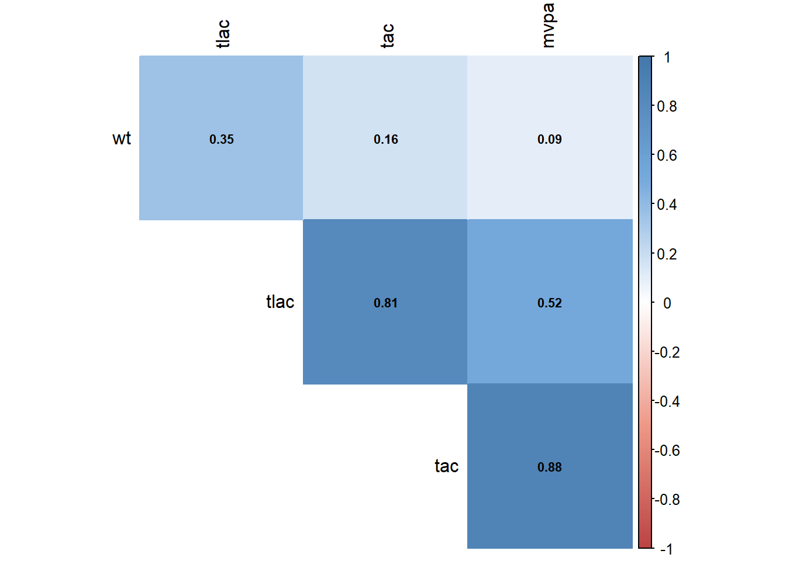
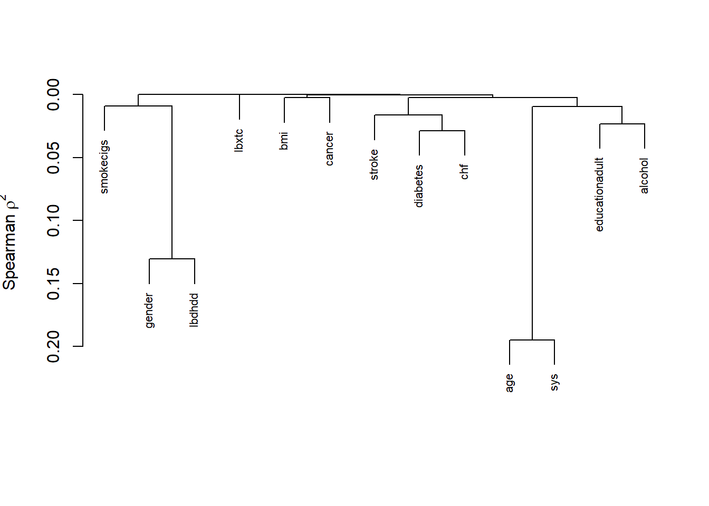
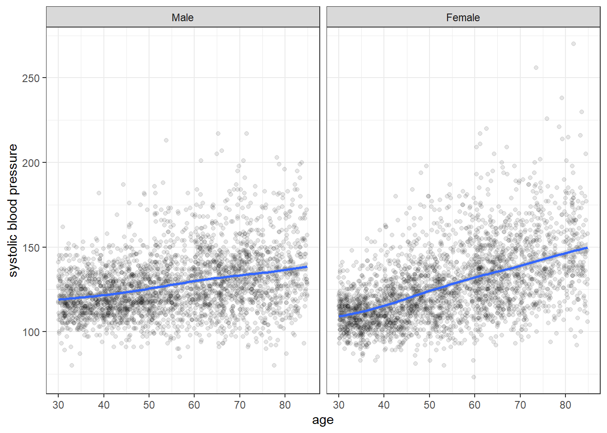
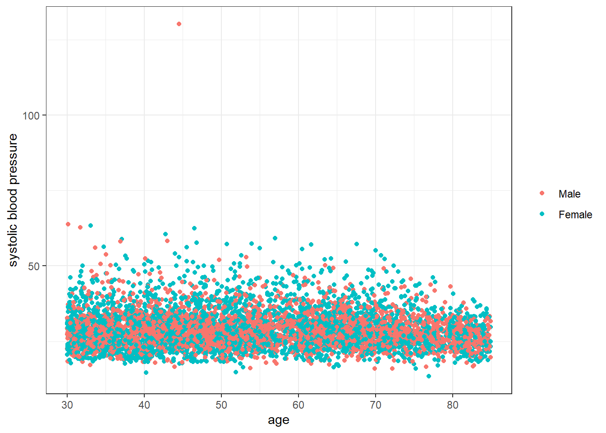
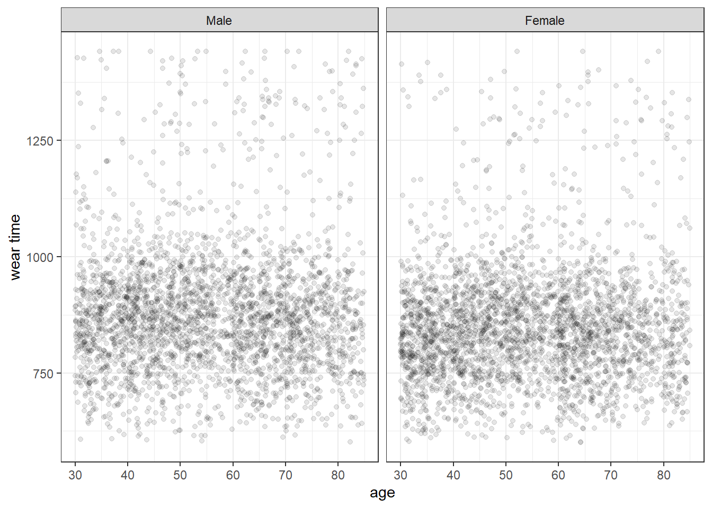
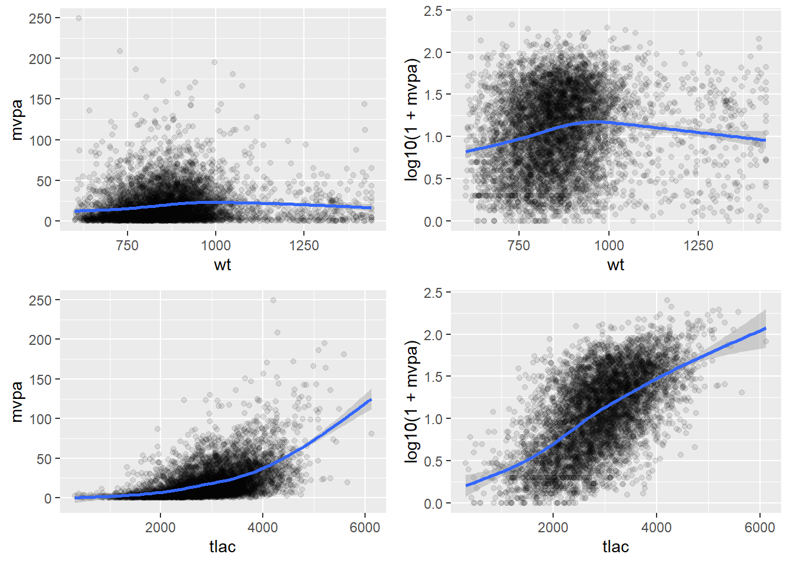

# Multivariate distributions


This section reports a series of multivariate summaries of the NHANES dataset.


## Overview

### Variable correlation


Below we further examine the association between age and systolic blood pressure stratified by pivotal variables.


Next, we depict differences in the  correlation coefficients (Spearman vs Pearson) in a heat map:


Correlations of the physical activity variables (outcome)

 
### Variable clustering

Variable clustering is used for assessing collinearity, redundancy, and for separating variables into clusters that can be scored as a single variable, thus resulting in data reduction.





### Variable redundancy 

Redundancy analysis of predictor variables. 


```
## 
## Redundancy Analysis
## 
## Hmisc::redun(formula = ~age + gender + bmi + sys + lbxtc + lbdhdd + 
##     smokecigs + diabetes + chf + cancer + stroke, data = a_nhanes)
## 
## n: 5467 	p: 11 	nk: 3 
## 
## Number of NAs:	 505 
## Frequencies of Missing Values Due to Each Variable
##       age    gender       bmi       sys     lbxtc    lbdhdd smokecigs  diabetes 
##         0         0        44       274       230       230         2         0 
##       chf    cancer    stroke 
##         0         0         0 
## 
## 
## Transformation of target variables forced to be linear
## 
## R-squared cutoff: 0.9 	Type: ordinary 
## 
## R^2 with which each variable can be predicted from all other variables:
## 
##       age    gender       bmi       sys     lbxtc    lbdhdd smokecigs  diabetes 
##     0.330     0.202     0.153     0.209     0.061     0.247     0.099     0.102 
##       chf    cancer    stroke 
##     0.080     0.079     0.057 
## 
## No redundant variables
```


##  Summary reports by pivotal covariates age and gender

### Distribution of age by gender

<div class="figure" style="text-align: center">

```{=html}
<div id="htmlwidget-6862c69190ae7276fce6" style="width:672px;height:250px;" class="plotly html-widget"></div>
<script type="application/json" data-for="htmlwidget-6862c69190ae7276fce6">{"x":{"visdat":{"1f404fad66ce":["function () ","plotlyVisDat"],"1f40417b598a":["function () ","data"],"1f40a9e403e":["function () ","data"],"1f40273c5835":["function () ","data"],"1f4054d518f4":["function () ","data"],"1f403e3125c4":["function () ","data"],"1f40fba4869":["function () ","data"],"1f407fab268d":["function () ","data"]},"cur_data":"1f407fab268d","attrs":{"1f40417b598a":{"alpha_stroke":1,"sizes":[10,100],"spans":[1,20],"x":{},"y":{},"xend":{},"yend":{},"type":"scatter","mode":"lines","text":{},"hoverinfo":"text","color":["black"],"name":"Histogram","legendgroup":"Histogram","showlegend":true,"inherit":true},"1f40a9e403e":{"alpha_stroke":1,"sizes":[10,100],"spans":[1,20],"x":{},"y":{},"type":"scatter","mode":"markers","color":["black"],"text":{},"hoverinfo":"text","size":[5],"name":"Mean","legendgroup":"Mean","showlegend":true,"inherit":true},"1f40273c5835":{"alpha_stroke":1,"sizes":[10,100],"spans":[1,20],"x":{},"y":{},"xend":{},"yend":{},"type":"scatter","mode":"lines","text":{},"hoverinfo":"text","name":"Median","legendgroup":"Median","showlegend":true,"color":["black"],"line":{"width":3},"inherit":true},"1f4054d518f4":{"alpha_stroke":1,"sizes":[10,100],"spans":[1,20],"x":{},"y":{},"xend":{},"yend":{},"type":"scatter","mode":"lines","text":{},"hoverinfo":"text","name":"Quartiles","legendgroup":"Quartiles","showlegend":true,"color":["blue"],"line":{"width":2},"inherit":true},"1f403e3125c4":{"alpha_stroke":1,"sizes":[10,100],"spans":[1,20],"x":{},"y":{},"xend":{},"yend":{},"type":"scatter","mode":"lines","text":{},"hoverinfo":"text","name":"0.05, 0.95<br>Quantiles","legendgroup":"0.05, 0.95<br>Quantiles","showlegend":true,"color":["red"],"line":{"width":2},"inherit":true},"1f403e3125c4.1":{"alpha_stroke":1,"sizes":[10,100],"spans":[1,20],"x":{},"y":{},"xend":{},"yend":{},"type":"scatter","mode":"lines","hoverinfo":"none","showlegend":false,"alpha":0.3,"color":["red"],"legendgroup":"0.05, 0.95<br>Quantiles","name":"ignored","inherit":true},"1f403e3125c4.2":{"alpha_stroke":1,"sizes":[10,100],"spans":[1,20],"x":{},"y":{},"xend":{},"yend":{},"type":"scatter","mode":"lines","hoverinfo":"none","showlegend":false,"alpha":0.3,"color":["blue"],"legendgroup":"Quartiles","name":"ignored","inherit":true},"1f403e3125c4.3":{"alpha_stroke":1,"sizes":[10,100],"spans":[1,20],"x":{},"y":{},"xend":{},"yend":{},"type":"scatter","mode":"lines","hoverinfo":"none","showlegend":false,"alpha":0.3,"color":["red"],"legendgroup":"0.05, 0.95<br>Quantiles","name":"ignored","inherit":true},"1f40fba4869":{"alpha_stroke":1,"sizes":[10,100],"spans":[1,20],"x":{},"y":{},"xend":{},"yend":{},"type":"scatter","mode":"lines","text":{},"hoverinfo":"text","color":["light gray"],"name":"Gini <span style=\"text-decoration: overline\">|Δ|<\/span>","legendgroup":"Gini <span style=\"text-decoration: overline\">|Δ|<\/span>","visible":"legendonly","showlegend":true,"inherit":true},"1f407fab268d":{"alpha_stroke":1,"sizes":[10,100],"spans":[1,20],"x":{},"y":{},"xend":{},"yend":{},"type":"scatter","mode":"lines","text":{},"hoverinfo":"text","color":["light blue"],"name":"SD","legendgroup":"SD","visible":"legendonly","showlegend":true,"inherit":true}},"layout":{"height":250,"margin":{"b":40,"l":70,"t":25,"r":10},"xaxis":{"domain":[0,1],"automargin":true,"title":"age <span style='font-family:Verdana;font-size:75%;'>years<\/span>","zeroline":false},"yaxis":{"domain":[0,1],"automargin":true,"title":"","tickvals":[-1,-2],"ticktext":["Male","Female"]},"hovermode":"closest","showlegend":true},"source":"A","config":{"modeBarButtonsToAdd":["hoverclosest","hovercompare"],"showSendToCloud":false},"data":[{"x":[30,30,null,30.2,30.2,null,30.4,30.4,null,30.6,30.6,null,30.8,30.8,null,31,31,null,31.2,31.2,null,31.4,31.4,null,31.6,31.6,null,31.8,31.8,null,32,32,null,32.2,32.2,null,32.4,32.4,null,32.6,32.6,null,32.8,32.8,null,33,33,null,33.2,33.2,null,33.4,33.4,null,33.6,33.6,null,33.8,33.8,null,34,34,null,34.2,34.2,null,34.4,34.4,null,34.6,34.6,null,34.8,34.8,null,35,35,null,35.2,35.2,null,35.4,35.4,null,35.6,35.6,null,35.8,35.8,null,36,36,null,36.2,36.2,null,36.4,36.4,null,36.6,36.6,null,36.8,36.8,null,37,37,null,37.2,37.2,null,37.4,37.4,null,37.6,37.6,null,37.8,37.8,null,38,38,null,38.2,38.2,null,38.4,38.4,null,38.6,38.6,null,38.8,38.8,null,39,39,null,39.2,39.2,null,39.4,39.4,null,39.6,39.6,null,39.8,39.8,null,40,40,null,40.2,40.2,null,40.4,40.4,null,40.6,40.6,null,40.8,40.8,null,41,41,null,41.2,41.2,null,41.4,41.4,null,41.6,41.6,null,41.8,41.8,null,42,42,null,42.2,42.2,null,42.4,42.4,null,42.6,42.6,null,42.8,42.8,null,43,43,null,43.2,43.2,null,43.3999999999999,43.3999999999999,null,43.6,43.6,null,43.8,43.8,null,44,44,null,44.1999999999999,44.1999999999999,null,44.3999999999999,44.3999999999999,null,44.6,44.6,null,44.7999999999999,44.7999999999999,null,44.9999999999999,44.9999999999999,null,45.1999999999999,45.1999999999999,null,45.3999999999999,45.3999999999999,null,45.5999999999999,45.5999999999999,null,45.7999999999999,45.7999999999999,null,45.9999999999999,45.9999999999999,null,46.1999999999999,46.1999999999999,null,46.3999999999999,46.3999999999999,null,46.5999999999999,46.5999999999999,null,46.7999999999999,46.7999999999999,null,46.9999999999999,46.9999999999999,null,47.1999999999999,47.1999999999999,null,47.3999999999999,47.3999999999999,null,47.5999999999999,47.5999999999999,null,47.7999999999999,47.7999999999999,null,47.9999999999999,47.9999999999999,null,48.1999999999999,48.1999999999999,null,48.3999999999999,48.3999999999999,null,48.5999999999999,48.5999999999999,null,48.7999999999999,48.7999999999999,null,48.9999999999999,48.9999999999999,null,49.1999999999999,49.1999999999999,null,49.3999999999999,49.3999999999999,null,49.5999999999999,49.5999999999999,null,49.7999999999999,49.7999999999999,null,49.9999999999999,49.9999999999999,null,50.1999999999999,50.1999999999999,null,50.3999999999999,50.3999999999999,null,50.5999999999999,50.5999999999999,null,50.7999999999999,50.7999999999999,null,50.9999999999999,50.9999999999999,null,51.1999999999999,51.1999999999999,null,51.3999999999999,51.3999999999999,null,51.5999999999999,51.5999999999999,null,51.7999999999999,51.7999999999999,null,51.9999999999999,51.9999999999999,null,52.1999999999999,52.1999999999999,null,52.3999999999999,52.3999999999999,null,52.5999999999999,52.5999999999999,null,52.7999999999999,52.7999999999999,null,52.9999999999999,52.9999999999999,null,53.1999999999999,53.1999999999999,null,53.3999999999999,53.3999999999999,null,53.5999999999999,53.5999999999999,null,53.7999999999999,53.7999999999999,null,53.9999999999999,53.9999999999999,null,54.1999999999999,54.1999999999999,null,54.3999999999999,54.3999999999999,null,54.5999999999999,54.5999999999999,null,54.7999999999999,54.7999999999999,null,54.9999999999999,54.9999999999999,null,55.1999999999999,55.1999999999999,null,55.3999999999999,55.3999999999999,null,55.5999999999999,55.5999999999999,null,55.7999999999999,55.7999999999999,null,55.9999999999999,55.9999999999999,null,56.1999999999999,56.1999999999999,null,56.3999999999999,56.3999999999999,null,56.5999999999999,56.5999999999999,null,56.7999999999999,56.7999999999999,null,56.9999999999999,56.9999999999999,null,57.1999999999999,57.1999999999999,null,57.3999999999999,57.3999999999999,null,57.5999999999999,57.5999999999999,null,57.7999999999999,57.7999999999999,null,57.9999999999999,57.9999999999999,null,58.1999999999999,58.1999999999999,null,58.3999999999999,58.3999999999999,null,58.5999999999999,58.5999999999999,null,58.7999999999999,58.7999999999999,null,58.9999999999999,58.9999999999999,null,59.1999999999999,59.1999999999999,null,59.3999999999999,59.3999999999999,null,59.5999999999999,59.5999999999999,null,59.7999999999999,59.7999999999999,null,59.9999999999999,59.9999999999999,null,60.1999999999999,60.1999999999999,null,60.3999999999999,60.3999999999999,null,60.5999999999999,60.5999999999999,null,60.7999999999999,60.7999999999999,null,60.9999999999999,60.9999999999999,null,61.1999999999999,61.1999999999999,null,61.3999999999999,61.3999999999999,null,61.5999999999999,61.5999999999999,null,61.7999999999999,61.7999999999999,null,61.9999999999999,61.9999999999999,null,62.1999999999999,62.1999999999999,null,62.3999999999999,62.3999999999999,null,62.5999999999999,62.5999999999999,null,62.7999999999999,62.7999999999999,null,62.9999999999999,62.9999999999999,null,63.1999999999999,63.1999999999999,null,63.3999999999999,63.3999999999999,null,63.5999999999999,63.5999999999999,null,63.7999999999999,63.7999999999999,null,63.9999999999999,63.9999999999999,null,64.1999999999999,64.1999999999999,null,64.3999999999999,64.3999999999999,null,64.5999999999999,64.5999999999999,null,64.7999999999999,64.7999999999999,null,64.9999999999999,64.9999999999999,null,65.1999999999999,65.1999999999999,null,65.3999999999999,65.3999999999999,null,65.5999999999999,65.5999999999999,null,65.7999999999999,65.7999999999999,null,65.9999999999999,65.9999999999999,null,66.1999999999999,66.1999999999999,null,66.3999999999999,66.3999999999999,null,66.5999999999999,66.5999999999999,null,66.7999999999999,66.7999999999999,null,66.9999999999999,66.9999999999999,null,67.1999999999999,67.1999999999999,null,67.3999999999999,67.3999999999999,null,67.5999999999999,67.5999999999999,null,67.7999999999999,67.7999999999999,null,67.9999999999999,67.9999999999999,null,68.1999999999999,68.1999999999999,null,68.3999999999999,68.3999999999999,null,68.5999999999999,68.5999999999999,null,68.7999999999999,68.7999999999999,null,68.9999999999999,68.9999999999999,null,69.1999999999999,69.1999999999999,null,69.3999999999999,69.3999999999999,null,69.5999999999999,69.5999999999999,null,69.7999999999999,69.7999999999999,null,69.9999999999999,69.9999999999999,null,70.1999999999999,70.1999999999999,null,70.3999999999999,70.3999999999999,null,70.5999999999999,70.5999999999999,null,70.7999999999999,70.7999999999999,null,70.9999999999999,70.9999999999999,null,71.1999999999998,71.1999999999998,null,71.3999999999998,71.3999999999998,null,71.5999999999999,71.5999999999999,null,71.7999999999999,71.7999999999999,null,71.9999999999999,71.9999999999999,null,72.1999999999998,72.1999999999998,null,72.3999999999998,72.3999999999998,null,72.5999999999999,72.5999999999999,null,72.7999999999998,72.7999999999998,null,72.9999999999998,72.9999999999998,null,73.1999999999998,73.1999999999998,null,73.3999999999998,73.3999999999998,null,73.5999999999999,73.5999999999999,null,73.7999999999998,73.7999999999998,null,73.9999999999998,73.9999999999998,null,74.1999999999998,74.1999999999998,null,74.3999999999998,74.3999999999998,null,74.5999999999998,74.5999999999998,null,74.7999999999998,74.7999999999998,null,74.9999999999998,74.9999999999998,null,75.1999999999998,75.1999999999998,null,75.3999999999998,75.3999999999998,null,75.5999999999998,75.5999999999998,null,75.7999999999998,75.7999999999998,null,75.9999999999998,75.9999999999998,null,76.1999999999998,76.1999999999998,null,76.3999999999998,76.3999999999998,null,76.5999999999998,76.5999999999998,null,76.7999999999998,76.7999999999998,null,76.9999999999998,76.9999999999998,null,77.1999999999998,77.1999999999998,null,77.3999999999998,77.3999999999998,null,77.5999999999998,77.5999999999998,null,77.7999999999998,77.7999999999998,null,77.9999999999998,77.9999999999998,null,78.1999999999998,78.1999999999998,null,78.3999999999998,78.3999999999998,null,78.5999999999998,78.5999999999998,null,78.7999999999998,78.7999999999998,null,78.9999999999998,78.9999999999998,null,79.1999999999998,79.1999999999998,null,79.3999999999998,79.3999999999998,null,79.5999999999998,79.5999999999998,null,79.7999999999998,79.7999999999998,null,79.9999999999998,79.9999999999998,null,80.1999999999998,80.1999999999998,null,80.3999999999998,80.3999999999998,null,80.5999999999998,80.5999999999998,null,80.7999999999998,80.7999999999998,null,80.9999999999998,80.9999999999998,null,81.1999999999998,81.1999999999998,null,81.3999999999998,81.3999999999998,null,81.5999999999998,81.5999999999998,null,81.7999999999998,81.7999999999998,null,81.9999999999998,81.9999999999998,null,82.1999999999998,82.1999999999998,null,82.3999999999998,82.3999999999998,null,82.5999999999998,82.5999999999998,null,82.7999999999998,82.7999999999998,null,82.9999999999998,82.9999999999998,null,83.1999999999998,83.1999999999998,null,83.3999999999998,83.3999999999998,null,83.5999999999998,83.5999999999998,null,83.7999999999998,83.7999999999998,null,83.9999999999998,83.9999999999998,null,84.1999999999998,84.1999999999998,null,84.3999999999998,84.3999999999998,null,84.5999999999998,84.5999999999998,null,84.7999999999998,84.7999999999998,null,84.9999999999998,84.9999999999998,null,30,30,null,30.2,30.2,null,30.4,30.4,null,30.6,30.6,null,30.8,30.8,null,31,31,null,31.2,31.2,null,31.4,31.4,null,31.6,31.6,null,31.8,31.8,null,32,32,null,32.2,32.2,null,32.4,32.4,null,32.6,32.6,null,32.8,32.8,null,33,33,null,33.2,33.2,null,33.4,33.4,null,33.6,33.6,null,33.8,33.8,null,34,34,null,34.2,34.2,null,34.4,34.4,null,34.6,34.6,null,34.8,34.8,null,35,35,null,35.2,35.2,null,35.4,35.4,null,35.6,35.6,null,35.8,35.8,null,36,36,null,36.2,36.2,null,36.4,36.4,null,36.6,36.6,null,36.8,36.8,null,37,37,null,37.2,37.2,null,37.4,37.4,null,37.6,37.6,null,37.8,37.8,null,38,38,null,38.2,38.2,null,38.4,38.4,null,38.6,38.6,null,38.8,38.8,null,39,39,null,39.2,39.2,null,39.4,39.4,null,39.6,39.6,null,39.8,39.8,null,40,40,null,40.2,40.2,null,40.4,40.4,null,40.6,40.6,null,40.8,40.8,null,41,41,null,41.2,41.2,null,41.4,41.4,null,41.6,41.6,null,41.8,41.8,null,42,42,null,42.2,42.2,null,42.4,42.4,null,42.6,42.6,null,42.8,42.8,null,43,43,null,43.2,43.2,null,43.3999999999999,43.3999999999999,null,43.6,43.6,null,43.8,43.8,null,44,44,null,44.1999999999999,44.1999999999999,null,44.3999999999999,44.3999999999999,null,44.6,44.6,null,44.7999999999999,44.7999999999999,null,44.9999999999999,44.9999999999999,null,45.1999999999999,45.1999999999999,null,45.3999999999999,45.3999999999999,null,45.5999999999999,45.5999999999999,null,45.7999999999999,45.7999999999999,null,45.9999999999999,45.9999999999999,null,46.1999999999999,46.1999999999999,null,46.3999999999999,46.3999999999999,null,46.5999999999999,46.5999999999999,null,46.7999999999999,46.7999999999999,null,46.9999999999999,46.9999999999999,null,47.1999999999999,47.1999999999999,null,47.3999999999999,47.3999999999999,null,47.5999999999999,47.5999999999999,null,47.7999999999999,47.7999999999999,null,47.9999999999999,47.9999999999999,null,48.1999999999999,48.1999999999999,null,48.3999999999999,48.3999999999999,null,48.5999999999999,48.5999999999999,null,48.7999999999999,48.7999999999999,null,48.9999999999999,48.9999999999999,null,49.1999999999999,49.1999999999999,null,49.3999999999999,49.3999999999999,null,49.5999999999999,49.5999999999999,null,49.7999999999999,49.7999999999999,null,49.9999999999999,49.9999999999999,null,50.1999999999999,50.1999999999999,null,50.3999999999999,50.3999999999999,null,50.5999999999999,50.5999999999999,null,50.7999999999999,50.7999999999999,null,50.9999999999999,50.9999999999999,null,51.1999999999999,51.1999999999999,null,51.3999999999999,51.3999999999999,null,51.5999999999999,51.5999999999999,null,51.7999999999999,51.7999999999999,null,51.9999999999999,51.9999999999999,null,52.1999999999999,52.1999999999999,null,52.3999999999999,52.3999999999999,null,52.5999999999999,52.5999999999999,null,52.7999999999999,52.7999999999999,null,52.9999999999999,52.9999999999999,null,53.1999999999999,53.1999999999999,null,53.3999999999999,53.3999999999999,null,53.5999999999999,53.5999999999999,null,53.7999999999999,53.7999999999999,null,53.9999999999999,53.9999999999999,null,54.1999999999999,54.1999999999999,null,54.3999999999999,54.3999999999999,null,54.5999999999999,54.5999999999999,null,54.7999999999999,54.7999999999999,null,54.9999999999999,54.9999999999999,null,55.1999999999999,55.1999999999999,null,55.3999999999999,55.3999999999999,null,55.5999999999999,55.5999999999999,null,55.7999999999999,55.7999999999999,null,55.9999999999999,55.9999999999999,null,56.1999999999999,56.1999999999999,null,56.3999999999999,56.3999999999999,null,56.5999999999999,56.5999999999999,null,56.7999999999999,56.7999999999999,null,56.9999999999999,56.9999999999999,null,57.1999999999999,57.1999999999999,null,57.3999999999999,57.3999999999999,null,57.5999999999999,57.5999999999999,null,57.7999999999999,57.7999999999999,null,57.9999999999999,57.9999999999999,null,58.1999999999999,58.1999999999999,null,58.3999999999999,58.3999999999999,null,58.5999999999999,58.5999999999999,null,58.7999999999999,58.7999999999999,null,58.9999999999999,58.9999999999999,null,59.1999999999999,59.1999999999999,null,59.3999999999999,59.3999999999999,null,59.5999999999999,59.5999999999999,null,59.7999999999999,59.7999999999999,null,59.9999999999999,59.9999999999999,null,60.1999999999999,60.1999999999999,null,60.3999999999999,60.3999999999999,null,60.5999999999999,60.5999999999999,null,60.7999999999999,60.7999999999999,null,60.9999999999999,60.9999999999999,null,61.1999999999999,61.1999999999999,null,61.3999999999999,61.3999999999999,null,61.5999999999999,61.5999999999999,null,61.7999999999999,61.7999999999999,null,61.9999999999999,61.9999999999999,null,62.1999999999999,62.1999999999999,null,62.3999999999999,62.3999999999999,null,62.5999999999999,62.5999999999999,null,62.7999999999999,62.7999999999999,null,62.9999999999999,62.9999999999999,null,63.1999999999999,63.1999999999999,null,63.3999999999999,63.3999999999999,null,63.5999999999999,63.5999999999999,null,63.7999999999999,63.7999999999999,null,63.9999999999999,63.9999999999999,null,64.1999999999999,64.1999999999999,null,64.3999999999999,64.3999999999999,null,64.5999999999999,64.5999999999999,null,64.7999999999999,64.7999999999999,null,64.9999999999999,64.9999999999999,null,65.1999999999999,65.1999999999999,null,65.3999999999999,65.3999999999999,null,65.5999999999999,65.5999999999999,null,65.7999999999999,65.7999999999999,null,65.9999999999999,65.9999999999999,null,66.1999999999999,66.1999999999999,null,66.3999999999999,66.3999999999999,null,66.5999999999999,66.5999999999999,null,66.7999999999999,66.7999999999999,null,66.9999999999999,66.9999999999999,null,67.1999999999999,67.1999999999999,null,67.3999999999999,67.3999999999999,null,67.5999999999999,67.5999999999999,null,67.7999999999999,67.7999999999999,null,67.9999999999999,67.9999999999999,null,68.1999999999999,68.1999999999999,null,68.3999999999999,68.3999999999999,null,68.5999999999999,68.5999999999999,null,68.7999999999999,68.7999999999999,null,68.9999999999999,68.9999999999999,null,69.1999999999999,69.1999999999999,null,69.3999999999999,69.3999999999999,null,69.5999999999999,69.5999999999999,null,69.7999999999999,69.7999999999999,null,69.9999999999999,69.9999999999999,null,70.1999999999999,70.1999999999999,null,70.3999999999999,70.3999999999999,null,70.5999999999999,70.5999999999999,null,70.7999999999999,70.7999999999999,null,70.9999999999999,70.9999999999999,null,71.1999999999998,71.1999999999998,null,71.3999999999998,71.3999999999998,null,71.5999999999999,71.5999999999999,null,71.7999999999999,71.7999999999999,null,71.9999999999999,71.9999999999999,null,72.1999999999998,72.1999999999998,null,72.3999999999998,72.3999999999998,null,72.5999999999999,72.5999999999999,null,72.7999999999998,72.7999999999998,null,72.9999999999998,72.9999999999998,null,73.1999999999998,73.1999999999998,null,73.3999999999998,73.3999999999998,null,73.5999999999999,73.5999999999999,null,73.7999999999998,73.7999999999998,null,73.9999999999998,73.9999999999998,null,74.1999999999998,74.1999999999998,null,74.3999999999998,74.3999999999998,null,74.5999999999998,74.5999999999998,null,74.9999999999998,74.9999999999998,null,75.1999999999998,75.1999999999998,null,75.3999999999998,75.3999999999998,null,75.5999999999998,75.5999999999998,null,75.7999999999998,75.7999999999998,null,75.9999999999998,75.9999999999998,null,76.1999999999998,76.1999999999998,null,76.3999999999998,76.3999999999998,null,76.5999999999998,76.5999999999998,null,76.7999999999998,76.7999999999998,null,76.9999999999998,76.9999999999998,null,77.1999999999998,77.1999999999998,null,77.3999999999998,77.3999999999998,null,77.5999999999998,77.5999999999998,null,77.7999999999998,77.7999999999998,null,77.9999999999998,77.9999999999998,null,78.1999999999998,78.1999999999998,null,78.3999999999998,78.3999999999998,null,78.5999999999998,78.5999999999998,null,78.7999999999998,78.7999999999998,null,78.9999999999998,78.9999999999998,null,79.1999999999998,79.1999999999998,null,79.3999999999998,79.3999999999998,null,79.5999999999998,79.5999999999998,null,79.7999999999998,79.7999999999998,null,79.9999999999998,79.9999999999998,null,80.1999999999998,80.1999999999998,null,80.3999999999998,80.3999999999998,null,80.5999999999998,80.5999999999998,null,80.7999999999998,80.7999999999998,null,80.9999999999998,80.9999999999998,null,81.1999999999998,81.1999999999998,null,81.3999999999998,81.3999999999998,null,81.5999999999998,81.5999999999998,null,81.7999999999998,81.7999999999998,null,81.9999999999998,81.9999999999998,null,82.1999999999998,82.1999999999998,null,82.3999999999998,82.3999999999998,null,82.5999999999998,82.5999999999998,null,82.7999999999998,82.7999999999998,null,82.9999999999998,82.9999999999998,null,83.1999999999998,83.1999999999998,null,83.3999999999998,83.3999999999998,null,83.5999999999998,83.5999999999998,null,83.7999999999998,83.7999999999998,null,83.9999999999998,83.9999999999998,null,84.1999999999998,84.1999999999998,null,84.3999999999998,84.3999999999998,null,84.5999999999998,84.5999999999998,null,84.7999999999998,84.7999999999998,null,84.9999999999998,84.9999999999998],"y":[-1,-0.830676784884621,null,-1,-0.830676784884621,null,-1,-0.849490475452997,null,-1,-0.811863094316246,null,-1,-0.868304166021372,null,-1,-0.623726188632492,null,-1,-0.849490475452997,null,-1,-0.774235713179495,null,-1,-0.661353569769243,null,-1,-0.717794641474369,null,-1,-0.75542202261112,null,-1,-0.811863094316246,null,-1,-0.849490475452997,null,-1,-0.680167260337618,null,-1,-0.698980950905993,null,-1,-0.774235713179495,null,-1,-0.868304166021372,null,-1,-0.811863094316246,null,-1,-0.661353569769243,null,-1,-0.868304166021372,null,-1,-0.793049403747871,null,-1,-0.793049403747871,null,-1,-0.887117856589748,null,-1,-0.661353569769243,null,-1,-0.868304166021372,null,-1,-0.623726188632492,null,-1,-0.849490475452997,null,-1,-0.849490475452997,null,-1,-0.661353569769243,null,-1,-0.75542202261112,null,-1,-0.75542202261112,null,-1,-0.849490475452997,null,-1,-0.830676784884621,null,-1,-0.642539879200867,null,-1,-0.868304166021372,null,-1,-0.698980950905993,null,-1,-0.905931547158123,null,-1,-0.811863094316246,null,-1,-0.661353569769243,null,-1,-0.924745237726498,null,-1,-0.811863094316246,null,-1,-0.736608332042744,null,-1,-0.830676784884621,null,-1,-0.774235713179495,null,-1,-0.830676784884621,null,-1,-0.793049403747871,null,-1,-0.75542202261112,null,-1,-0.717794641474369,null,-1,-0.868304166021372,null,-1,-0.849490475452997,null,-1,-0.661353569769243,null,-1,-0.793049403747871,null,-1,-0.75542202261112,null,-1,-0.698980950905993,null,-1,-0.642539879200867,null,-1,-0.680167260337618,null,-1,-0.75542202261112,null,-1,-0.793049403747871,null,-1,-0.75542202261112,null,-1,-0.623726188632492,null,-1,-0.736608332042744,null,-1,-0.811863094316246,null,-1,-0.75542202261112,null,-1,-0.736608332042744,null,-1,-0.811863094316246,null,-1,-0.717794641474369,null,-1,-0.849490475452997,null,-1,-0.830676784884621,null,-1,-0.623726188632492,null,-1,-0.868304166021372,null,-1,-0.698980950905993,null,-1,-0.811863094316246,null,-1,-0.887117856589748,null,-1,-0.623726188632492,null,-1,-0.75542202261112,null,-1,-0.717794641474369,null,-1,-0.811863094316246,null,-1,-0.887117856589748,null,-1,-0.54847142635899,null,-1,-0.811863094316246,null,-1,-0.849490475452997,null,-1,-0.661353569769243,null,-1,-0.924745237726498,null,-1,-0.510844045222239,null,-1,-0.849490475452997,null,-1,-0.849490475452997,null,-1,-0.924745237726498,null,-1,-0.830676784884621,null,-1,-0.75542202261112,null,-1,-0.75542202261112,null,-1,-0.793049403747871,null,-1,-0.774235713179495,null,-1,-0.698980950905993,null,-1,-0.698980950905993,null,-1,-0.736608332042744,null,-1,-0.698980950905993,null,-1,-0.868304166021372,null,-1,-0.887117856589748,null,-1,-0.736608332042744,null,-1,-0.75542202261112,null,-1,-0.717794641474369,null,-1,-0.774235713179495,null,-1,-0.811863094316246,null,-1,-0.793049403747871,null,-1,-0.811863094316246,null,-1,-0.623726188632492,null,-1,-0.849490475452997,null,-1,-0.774235713179495,null,-1,-0.698980950905993,null,-1,-0.830676784884621,null,-1,-0.736608332042744,null,-1,-0.887117856589748,null,-1,-0.849490475452997,null,-1,-0.736608332042744,null,-1,-0.868304166021372,null,-1,-0.849490475452997,null,-1,-0.774235713179495,null,-1,-0.793049403747871,null,-1,-0.698980950905993,null,-1,-0.793049403747871,null,-1,-0.75542202261112,null,-1,-0.736608332042744,null,-1,-0.793049403747871,null,-1,-0.774235713179495,null,-1,-0.75542202261112,null,-1,-0.680167260337618,null,-1,-0.849490475452997,null,-1,-0.887117856589748,null,-1,-0.830676784884621,null,-1,-0.868304166021372,null,-1,-0.736608332042744,null,-1,-0.887117856589748,null,-1,-0.717794641474369,null,-1,-0.793049403747871,null,-1,-0.962372618863249,null,-1,-0.924745237726498,null,-1,-0.774235713179495,null,-1,-0.868304166021372,null,-1,-0.868304166021372,null,-1,-0.868304166021372,null,-1,-0.868304166021372,null,-1,-0.924745237726498,null,-1,-0.905931547158123,null,-1,-0.811863094316246,null,-1,-0.905931547158123,null,-1,-0.793049403747871,null,-1,-0.811863094316246,null,-1,-0.924745237726498,null,-1,-0.774235713179495,null,-1,-0.905931547158123,null,-1,-0.849490475452997,null,-1,-0.623726188632492,null,-1,-0.849490475452997,null,-1,-0.680167260337618,null,-1,-0.830676784884621,null,-1,-0.830676784884621,null,-1,-0.736608332042744,null,-1,-0.774235713179495,null,-1,-0.567285116927366,null,-1,-0.830676784884621,null,-1,-0.774235713179495,null,-1,-0.736608332042744,null,-1,-0.830676784884621,null,-1,-0.661353569769243,null,-1,-0.924745237726498,null,-1,-0.75542202261112,null,-1,-0.905931547158123,null,-1,-0.717794641474369,null,-1,-0.680167260337618,null,-1,-0.830676784884621,null,-1,-0.793049403747871,null,-1,-0.887117856589748,null,-1,-0.849490475452997,null,-1,-0.774235713179495,null,-1,-0.830676784884621,null,-1,-0.811863094316246,null,-1,-0.811863094316246,null,-1,-0.793049403747871,null,-1,-0.661353569769243,null,-1,-0.698980950905993,null,-1,-0.642539879200867,null,-1,-0.698980950905993,null,-1,-0.717794641474369,null,-1,-0.849490475452997,null,-1,-0.75542202261112,null,-1,-0.774235713179495,null,-1,-0.811863094316246,null,-1,-0.943558928294874,null,-1,-0.868304166021372,null,-1,-0.849490475452997,null,-1,-0.868304166021372,null,-1,-0.811863094316246,null,-1,-0.774235713179495,null,-1,-0.774235713179495,null,-1,-0.830676784884621,null,-1,-0.698980950905993,null,-1,-0.811863094316246,null,-1,-0.811863094316246,null,-1,-0.736608332042744,null,-1,-0.905931547158123,null,-1,-0.698980950905993,null,-1,-0.830676784884621,null,-1,-0.75542202261112,null,-1,-0.75542202261112,null,-1,-0.75542202261112,null,-1,-0.604912498064117,null,-1,-0.905931547158123,null,-1,-0.849490475452997,null,-1,-0.604912498064117,null,-1,-0.830676784884621,null,-1,-0.811863094316246,null,-1,-0.811863094316246,null,-1,-0.868304166021372,null,-1,-0.793049403747871,null,-1,-0.830676784884621,null,-1,-0.830676784884621,null,-1,-0.905931547158123,null,-1,-0.811863094316246,null,-1,-0.811863094316246,null,-1,-0.75542202261112,null,-1,-0.75542202261112,null,-1,-0.849490475452997,null,-1,-0.849490475452997,null,-1,-0.774235713179495,null,-1,-0.887117856589748,null,-1,-0.698980950905993,null,-1,-0.830676784884621,null,-1,-0.887117856589748,null,-1,-0.830676784884621,null,-1,-0.887117856589748,null,-1,-0.774235713179495,null,-1,-0.905931547158123,null,-1,-0.793049403747871,null,-1,-0.849490475452997,null,-1,-0.887117856589748,null,-1,-0.905931547158123,null,-1,-0.849490475452997,null,-1,-0.905931547158123,null,-1,-0.830676784884621,null,-1,-0.943558928294874,null,-1,-0.661353569769243,null,-1,-0.75542202261112,null,-1,-0.849490475452997,null,-1,-0.868304166021372,null,-1,-0.811863094316246,null,-1,-0.793049403747871,null,-1,-0.943558928294874,null,-1,-0.868304166021372,null,-1,-0.887117856589748,null,-1,-0.924745237726498,null,-1,-0.849490475452997,null,-1,-0.849490475452997,null,-1,-0.830676784884621,null,-1,-0.887117856589748,null,-1,-0.849490475452997,null,-1,-0.736608332042744,null,-1,-0.887117856589748,null,-1,-0.868304166021372,null,-1,-0.868304166021372,null,-1,-0.887117856589748,null,-1,-0.811863094316246,null,-1,-0.830676784884621,null,-1,-0.887117856589748,null,-1,-0.849490475452997,null,-1,-0.830676784884621,null,-1,-0.830676784884621,null,-1,-0.981186309431625,null,-1,-0.793049403747871,null,-1,-0.905931547158123,null,-1,-0.924745237726498,null,-1,-0.943558928294874,null,-1,-0.887117856589748,null,-1,-0.905931547158123,null,-1,-0.811863094316246,null,-1,-0.887117856589748,null,-1,-0.962372618863249,null,-2,-1.78181818181818,null,-2,-1.8,null,-2,-1.67272727272727,null,-2,-1.67272727272727,null,-2,-1.8,null,-2,-1.74545454545455,null,-2,-1.67272727272727,null,-2,-1.83636363636364,null,-2,-1.70909090909091,null,-2,-1.8,null,-2,-1.47272727272727,null,-2,-1.74545454545455,null,-2,-1.85454545454545,null,-2,-1.70909090909091,null,-2,-1.85454545454545,null,-2,-1.8,null,-2,-1.78181818181818,null,-2,-1.78181818181818,null,-2,-1.69090909090909,null,-2,-1.72727272727273,null,-2,-1.65454545454545,null,-2,-1.83636363636364,null,-2,-1.78181818181818,null,-2,-1.61818181818182,null,-2,-1.74545454545455,null,-2,-1.65454545454545,null,-2,-1.74545454545455,null,-2,-1.74545454545455,null,-2,-1.76363636363636,null,-2,-1.72727272727273,null,-2,-1.54545454545455,null,-2,-1.76363636363636,null,-2,-1.83636363636364,null,-2,-1.76363636363636,null,-2,-1.76363636363636,null,-2,-1.78181818181818,null,-2,-1.8,null,-2,-1.90909090909091,null,-2,-1.76363636363636,null,-2,-1.8,null,-2,-1.70909090909091,null,-2,-1.76363636363636,null,-2,-1.85454545454545,null,-2,-1.69090909090909,null,-2,-1.85454545454545,null,-2,-1.76363636363636,null,-2,-1.83636363636364,null,-2,-1.85454545454545,null,-2,-1.8,null,-2,-1.90909090909091,null,-2,-1.65454545454545,null,-2,-1.76363636363636,null,-2,-1.70909090909091,null,-2,-1.65454545454545,null,-2,-1.8,null,-2,-1.72727272727273,null,-2,-1.85454545454545,null,-2,-1.67272727272727,null,-2,-1.72727272727273,null,-2,-1.70909090909091,null,-2,-1.67272727272727,null,-2,-1.83636363636364,null,-2,-1.8,null,-2,-1.69090909090909,null,-2,-1.8,null,-2,-1.81818181818182,null,-2,-1.81818181818182,null,-2,-1.8,null,-2,-1.76363636363636,null,-2,-1.69090909090909,null,-2,-1.69090909090909,null,-2,-1.76363636363636,null,-2,-1.85454545454545,null,-2,-1.76363636363636,null,-2,-1.89090909090909,null,-2,-1.76363636363636,null,-2,-1.76363636363636,null,-2,-1.70909090909091,null,-2,-1.67272727272727,null,-2,-1.83636363636364,null,-2,-1.67272727272727,null,-2,-1.8,null,-2,-1.83636363636364,null,-2,-1.67272727272727,null,-2,-1.63636363636364,null,-2,-1.69090909090909,null,-2,-1.76363636363636,null,-2,-1.8,null,-2,-1.78181818181818,null,-2,-1.8,null,-2,-1.70909090909091,null,-2,-1.8,null,-2,-1.89090909090909,null,-2,-1.81818181818182,null,-2,-1.81818181818182,null,-2,-1.76363636363636,null,-2,-1.8,null,-2,-1.78181818181818,null,-2,-1.78181818181818,null,-2,-1.8,null,-2,-1.74545454545455,null,-2,-1.87272727272727,null,-2,-1.8,null,-2,-1.67272727272727,null,-2,-1.87272727272727,null,-2,-1.8,null,-2,-1.74545454545455,null,-2,-1.8,null,-2,-1.69090909090909,null,-2,-1.74545454545455,null,-2,-1.8,null,-2,-1.74545454545455,null,-2,-1.67272727272727,null,-2,-1.72727272727273,null,-2,-1.83636363636364,null,-2,-1.72727272727273,null,-2,-1.70909090909091,null,-2,-1.89090909090909,null,-2,-1.83636363636364,null,-2,-1.78181818181818,null,-2,-1.70909090909091,null,-2,-1.70909090909091,null,-2,-1.89090909090909,null,-2,-1.76363636363636,null,-2,-1.89090909090909,null,-2,-1.81818181818182,null,-2,-1.81818181818182,null,-2,-1.85454545454545,null,-2,-1.78181818181818,null,-2,-1.90909090909091,null,-2,-1.81818181818182,null,-2,-1.87272727272727,null,-2,-1.85454545454545,null,-2,-1.76363636363636,null,-2,-1.89090909090909,null,-2,-1.70909090909091,null,-2,-1.87272727272727,null,-2,-1.87272727272727,null,-2,-1.89090909090909,null,-2,-1.90909090909091,null,-2,-1.81818181818182,null,-2,-1.89090909090909,null,-2,-1.83636363636364,null,-2,-1.83636363636364,null,-2,-1.89090909090909,null,-2,-1.8,null,-2,-1.85454545454545,null,-2,-1.87272727272727,null,-2,-1.8,null,-2,-1.83636363636364,null,-2,-1.74545454545455,null,-2,-1.72727272727273,null,-2,-1.76363636363636,null,-2,-1.6,null,-2,-1.8,null,-2,-1.4,null,-2,-1.67272727272727,null,-2,-1.8,null,-2,-1.69090909090909,null,-2,-1.81818181818182,null,-2,-1.81818181818182,null,-2,-1.94545454545455,null,-2,-1.78181818181818,null,-2,-1.65454545454545,null,-2,-1.8,null,-2,-1.69090909090909,null,-2,-1.81818181818182,null,-2,-1.83636363636364,null,-2,-1.70909090909091,null,-2,-1.78181818181818,null,-2,-1.63636363636364,null,-2,-1.8,null,-2,-1.87272727272727,null,-2,-1.63636363636364,null,-2,-1.89090909090909,null,-2,-1.63636363636364,null,-2,-1.8,null,-2,-1.81818181818182,null,-2,-1.78181818181818,null,-2,-1.78181818181818,null,-2,-1.72727272727273,null,-2,-1.8,null,-2,-1.78181818181818,null,-2,-1.8,null,-2,-1.85454545454545,null,-2,-1.8,null,-2,-1.83636363636364,null,-2,-1.83636363636364,null,-2,-1.63636363636364,null,-2,-1.81818181818182,null,-2,-1.83636363636364,null,-2,-1.90909090909091,null,-2,-1.90909090909091,null,-2,-1.8,null,-2,-1.89090909090909,null,-2,-1.67272727272727,null,-2,-1.83636363636364,null,-2,-1.8,null,-2,-1.74545454545455,null,-2,-1.87272727272727,null,-2,-1.87272727272727,null,-2,-1.83636363636364,null,-2,-1.72727272727273,null,-2,-1.83636363636364,null,-2,-1.83636363636364,null,-2,-1.76363636363636,null,-2,-1.81818181818182,null,-2,-1.87272727272727,null,-2,-1.87272727272727,null,-2,-1.92727272727273,null,-2,-1.8,null,-2,-1.85454545454545,null,-2,-1.83636363636364,null,-2,-1.78181818181818,null,-2,-1.89090909090909,null,-2,-1.8,null,-2,-1.85454545454545,null,-2,-1.83636363636364,null,-2,-1.74545454545455,null,-2,-1.81818181818182,null,-2,-1.85454545454545,null,-2,-1.92727272727273,null,-2,-1.8,null,-2,-1.78181818181818,null,-2,-1.87272727272727,null,-2,-1.85454545454545,null,-2,-1.8,null,-2,-1.8,null,-2,-1.90909090909091,null,-2,-1.85454545454545,null,-2,-1.89090909090909,null,-2,-1.85454545454545,null,-2,-1.74545454545455,null,-2,-1.96363636363636,null,-2,-1.85454545454545,null,-2,-1.94545454545455,null,-2,-1.89090909090909,null,-2,-1.8,null,-2,-1.89090909090909,null,-2,-1.89090909090909,null,-2,-1.96363636363636,null,-2,-1.96363636363636,null,-2,-1.81818181818182,null,-2,-1.92727272727273,null,-2,-1.90909090909091,null,-2,-1.92727272727273,null,-2,-1.96363636363636,null,-2,-1.85454545454545,null,-2,-1.90909090909091,null,-2,-1.8,null,-2,-1.90909090909091,null,-2,-1.87272727272727,null,-2,-1.8,null,-2,-1.90909090909091,null,-2,-1.83636363636364,null,-2,-1.92727272727273,null,-2,-1.89090909090909,null,-2,-1.58181818181818,null,-2,-1.81818181818182,null,-2,-1.83636363636364,null,-2,-1.96363636363636,null,-2,-1.92727272727273,null,-2,-1.81818181818182,null,-2,-1.92727272727273,null,-2,-1.81818181818182,null,-2,-1.89090909090909,null,-2,-1.90909090909091,null,-2,-1.83636363636364,null,-2,-1.90909090909091,null,-2,-1.81818181818182,null,-2,-1.90909090909091,null,-2,-1.85454545454545,null,-2,-1.90909090909091,null,-2,-1.94545454545455,null,-2,-1.94545454545455],"type":"scatter","mode":"lines","text":["30<br>0.003<br>n=9","30<br>0.003<br>n=9",null,"30.2<br>0.003<br>n=9","30.2<br>0.003<br>n=9",null,"30.4<br>0.003<br>n=8","30.4<br>0.003<br>n=8",null,"30.6<br>0.003<br>n=10","30.6<br>0.003<br>n=10",null,"30.8<br>0.002<br>n=7","30.8<br>0.002<br>n=7",null,"31<br>0.007<br>n=20","31<br>0.007<br>n=20",null,"31.2<br>0.003<br>n=8","31.2<br>0.003<br>n=8",null,"31.4<br>0.004<br>n=12","31.4<br>0.004<br>n=12",null,"31.6<br>0.006<br>n=18","31.6<br>0.006<br>n=18",null,"31.8<br>0.005<br>n=15","31.8<br>0.005<br>n=15",null,"32<br>0.004<br>n=13","32<br>0.004<br>n=13",null,"32.2<br>0.003<br>n=10","32.2<br>0.003<br>n=10",null,"32.4<br>0.003<br>n=8","32.4<br>0.003<br>n=8",null,"32.6<br>0.006<br>n=17","32.6<br>0.006<br>n=17",null,"32.8<br>0.005<br>n=16","32.8<br>0.005<br>n=16",null,"33<br>0.004<br>n=12","33<br>0.004<br>n=12",null,"33.2<br>0.002<br>n=7","33.2<br>0.002<br>n=7",null,"33.4<br>0.003<br>n=10","33.4<br>0.003<br>n=10",null,"33.6<br>0.006<br>n=18","33.6<br>0.006<br>n=18",null,"33.8<br>0.002<br>n=7","33.8<br>0.002<br>n=7",null,"34<br>0.004<br>n=11","34<br>0.004<br>n=11",null,"34.2<br>0.004<br>n=11","34.2<br>0.004<br>n=11",null,"34.4<br>0.002<br>n=6","34.4<br>0.002<br>n=6",null,"34.6<br>0.006<br>n=18","34.6<br>0.006<br>n=18",null,"34.8<br>0.002<br>n=7","34.8<br>0.002<br>n=7",null,"35<br>0.007<br>n=20","35<br>0.007<br>n=20",null,"35.2<br>0.003<br>n=8","35.2<br>0.003<br>n=8",null,"35.4<br>0.003<br>n=8","35.4<br>0.003<br>n=8",null,"35.6<br>0.006<br>n=18","35.6<br>0.006<br>n=18",null,"35.8<br>0.004<br>n=13","35.8<br>0.004<br>n=13",null,"36<br>0.004<br>n=13","36<br>0.004<br>n=13",null,"36.2<br>0.003<br>n=8","36.2<br>0.003<br>n=8",null,"36.4<br>0.003<br>n=9","36.4<br>0.003<br>n=9",null,"36.6<br>0.006<br>n=19","36.6<br>0.006<br>n=19",null,"36.8<br>0.002<br>n=7","36.8<br>0.002<br>n=7",null,"37<br>0.005<br>n=16","37<br>0.005<br>n=16",null,"37.2<br>0.002<br>n=5","37.2<br>0.002<br>n=5",null,"37.4<br>0.003<br>n=10","37.4<br>0.003<br>n=10",null,"37.6<br>0.006<br>n=18","37.6<br>0.006<br>n=18",null,"37.8<br>0.001<br>n=4","37.8<br>0.001<br>n=4",null,"38<br>0.003<br>n=10","38<br>0.003<br>n=10",null,"38.2<br>0.005<br>n=14","38.2<br>0.005<br>n=14",null,"38.4<br>0.003<br>n=9","38.4<br>0.003<br>n=9",null,"38.6<br>0.004<br>n=12","38.6<br>0.004<br>n=12",null,"38.8<br>0.003<br>n=9","38.8<br>0.003<br>n=9",null,"39<br>0.004<br>n=11","39<br>0.004<br>n=11",null,"39.2<br>0.004<br>n=13","39.2<br>0.004<br>n=13",null,"39.4<br>0.005<br>n=15","39.4<br>0.005<br>n=15",null,"39.6<br>0.002<br>n=7","39.6<br>0.002<br>n=7",null,"39.8<br>0.003<br>n=8","39.8<br>0.003<br>n=8",null,"40<br>0.006<br>n=18","40<br>0.006<br>n=18",null,"40.2<br>0.004<br>n=11","40.2<br>0.004<br>n=11",null,"40.4<br>0.004<br>n=13","40.4<br>0.004<br>n=13",null,"40.6<br>0.005<br>n=16","40.6<br>0.005<br>n=16",null,"40.8<br>0.006<br>n=19","40.8<br>0.006<br>n=19",null,"41<br>0.006<br>n=17","41<br>0.006<br>n=17",null,"41.2<br>0.004<br>n=13","41.2<br>0.004<br>n=13",null,"41.4<br>0.004<br>n=11","41.4<br>0.004<br>n=11",null,"41.6<br>0.004<br>n=13","41.6<br>0.004<br>n=13",null,"41.8<br>0.007<br>n=20","41.8<br>0.007<br>n=20",null,"42<br>0.005<br>n=14","42<br>0.005<br>n=14",null,"42.2<br>0.003<br>n=10","42.2<br>0.003<br>n=10",null,"42.4<br>0.004<br>n=13","42.4<br>0.004<br>n=13",null,"42.6<br>0.005<br>n=14","42.6<br>0.005<br>n=14",null,"42.8<br>0.003<br>n=10","42.8<br>0.003<br>n=10",null,"43<br>0.005<br>n=15","43<br>0.005<br>n=15",null,"43.2<br>0.003<br>n=8","43.2<br>0.003<br>n=8",null,"43.4<br>0.003<br>n=9","43.4<br>0.003<br>n=9",null,"43.6<br>0.007<br>n=20","43.6<br>0.007<br>n=20",null,"43.8<br>0.002<br>n=7","43.8<br>0.002<br>n=7",null,"44<br>0.005<br>n=16","44<br>0.005<br>n=16",null,"44.2<br>0.003<br>n=10","44.2<br>0.003<br>n=10",null,"44.4<br>0.002<br>n=6","44.4<br>0.002<br>n=6",null,"44.6<br>0.007<br>n=20","44.6<br>0.007<br>n=20",null,"44.8<br>0.004<br>n=13","44.8<br>0.004<br>n=13",null,"45<br>0.005<br>n=15","45<br>0.005<br>n=15",null,"45.2<br>0.003<br>n=10","45.2<br>0.003<br>n=10",null,"45.4<br>0.002<br>n=6","45.4<br>0.002<br>n=6",null,"45.6<br>0.008<br>n=24","45.6<br>0.008<br>n=24",null,"45.8<br>0.003<br>n=10","45.8<br>0.003<br>n=10",null,"46<br>0.003<br>n=8","46<br>0.003<br>n=8",null,"46.2<br>0.006<br>n=18","46.2<br>0.006<br>n=18",null,"46.4<br>0.001<br>n=4","46.4<br>0.001<br>n=4",null,"46.6<br>0.009<br>n=26","46.6<br>0.009<br>n=26",null,"46.8<br>0.003<br>n=8","46.8<br>0.003<br>n=8",null,"47<br>0.003<br>n=8","47<br>0.003<br>n=8",null,"47.2<br>0.001<br>n=4","47.2<br>0.001<br>n=4",null,"47.4<br>0.003<br>n=9","47.4<br>0.003<br>n=9",null,"47.6<br>0.004<br>n=13","47.6<br>0.004<br>n=13",null,"47.8<br>0.004<br>n=13","47.8<br>0.004<br>n=13",null,"48<br>0.004<br>n=11","48<br>0.004<br>n=11",null,"48.2<br>0.004<br>n=12","48.2<br>0.004<br>n=12",null,"48.4<br>0.005<br>n=16","48.4<br>0.005<br>n=16",null,"48.6<br>0.005<br>n=16","48.6<br>0.005<br>n=16",null,"48.8<br>0.005<br>n=14","48.8<br>0.005<br>n=14",null,"49<br>0.005<br>n=16","49<br>0.005<br>n=16",null,"49.2<br>0.002<br>n=7","49.2<br>0.002<br>n=7",null,"49.4<br>0.002<br>n=6","49.4<br>0.002<br>n=6",null,"49.6<br>0.005<br>n=14","49.6<br>0.005<br>n=14",null,"49.8<br>0.004<br>n=13","49.8<br>0.004<br>n=13",null,"50<br>0.005<br>n=15","50<br>0.005<br>n=15",null,"50.2<br>0.004<br>n=12","50.2<br>0.004<br>n=12",null,"50.4<br>0.003<br>n=10","50.4<br>0.003<br>n=10",null,"50.6<br>0.004<br>n=11","50.6<br>0.004<br>n=11",null,"50.8<br>0.003<br>n=10","50.8<br>0.003<br>n=10",null,"51<br>0.007<br>n=20","51<br>0.007<br>n=20",null,"51.2<br>0.003<br>n=8","51.2<br>0.003<br>n=8",null,"51.4<br>0.004<br>n=12","51.4<br>0.004<br>n=12",null,"51.6<br>0.005<br>n=16","51.6<br>0.005<br>n=16",null,"51.8<br>0.003<br>n=9","51.8<br>0.003<br>n=9",null,"52<br>0.005<br>n=14","52<br>0.005<br>n=14",null,"52.2<br>0.002<br>n=6","52.2<br>0.002<br>n=6",null,"52.4<br>0.003<br>n=8","52.4<br>0.003<br>n=8",null,"52.6<br>0.005<br>n=14","52.6<br>0.005<br>n=14",null,"52.8<br>0.002<br>n=7","52.8<br>0.002<br>n=7",null,"53<br>0.003<br>n=8","53<br>0.003<br>n=8",null,"53.2<br>0.004<br>n=12","53.2<br>0.004<br>n=12",null,"53.4<br>0.004<br>n=11","53.4<br>0.004<br>n=11",null,"53.6<br>0.005<br>n=16","53.6<br>0.005<br>n=16",null,"53.8<br>0.004<br>n=11","53.8<br>0.004<br>n=11",null,"54<br>0.004<br>n=13","54<br>0.004<br>n=13",null,"54.2<br>0.005<br>n=14","54.2<br>0.005<br>n=14",null,"54.4<br>0.004<br>n=11","54.4<br>0.004<br>n=11",null,"54.6<br>0.004<br>n=12","54.6<br>0.004<br>n=12",null,"54.8<br>0.004<br>n=13","54.8<br>0.004<br>n=13",null,"55<br>0.006<br>n=17","55<br>0.006<br>n=17",null,"55.2<br>0.003<br>n=8","55.2<br>0.003<br>n=8",null,"55.4<br>0.002<br>n=6","55.4<br>0.002<br>n=6",null,"55.6<br>0.003<br>n=9","55.6<br>0.003<br>n=9",null,"55.8<br>0.002<br>n=7","55.8<br>0.002<br>n=7",null,"56<br>0.005<br>n=14","56<br>0.005<br>n=14",null,"56.2<br>0.002<br>n=6","56.2<br>0.002<br>n=6",null,"56.4<br>0.005<br>n=15","56.4<br>0.005<br>n=15",null,"56.6<br>0.004<br>n=11","56.6<br>0.004<br>n=11",null,"56.8<br>0.001<br>n=2","56.8<br>0.001<br>n=2",null,"57<br>0.001<br>n=4","57<br>0.001<br>n=4",null,"57.2<br>0.004<br>n=12","57.2<br>0.004<br>n=12",null,"57.4<br>0.002<br>n=7","57.4<br>0.002<br>n=7",null,"57.6<br>0.002<br>n=7","57.6<br>0.002<br>n=7",null,"57.8<br>0.002<br>n=7","57.8<br>0.002<br>n=7",null,"58<br>0.002<br>n=7","58<br>0.002<br>n=7",null,"58.2<br>0.001<br>n=4","58.2<br>0.001<br>n=4",null,"58.4<br>0.002<br>n=5","58.4<br>0.002<br>n=5",null,"58.6<br>0.003<br>n=10","58.6<br>0.003<br>n=10",null,"58.8<br>0.002<br>n=5","58.8<br>0.002<br>n=5",null,"59<br>0.004<br>n=11","59<br>0.004<br>n=11",null,"59.2<br>0.003<br>n=10","59.2<br>0.003<br>n=10",null,"59.4<br>0.001<br>n=4","59.4<br>0.001<br>n=4",null,"59.6<br>0.004<br>n=12","59.6<br>0.004<br>n=12",null,"59.8<br>0.002<br>n=5","59.8<br>0.002<br>n=5",null,"60<br>0.003<br>n=8","60<br>0.003<br>n=8",null,"60.2<br>0.007<br>n=20","60.2<br>0.007<br>n=20",null,"60.4<br>0.003<br>n=8","60.4<br>0.003<br>n=8",null,"60.6<br>0.006<br>n=17","60.6<br>0.006<br>n=17",null,"60.8<br>0.003<br>n=9","60.8<br>0.003<br>n=9",null,"61<br>0.003<br>n=9","61<br>0.003<br>n=9",null,"61.2<br>0.005<br>n=14","61.2<br>0.005<br>n=14",null,"61.4<br>0.004<br>n=12","61.4<br>0.004<br>n=12",null,"61.6<br>0.008<br>n=23","61.6<br>0.008<br>n=23",null,"61.8<br>0.003<br>n=9","61.8<br>0.003<br>n=9",null,"62<br>0.004<br>n=12","62<br>0.004<br>n=12",null,"62.2<br>0.005<br>n=14","62.2<br>0.005<br>n=14",null,"62.4<br>0.003<br>n=9","62.4<br>0.003<br>n=9",null,"62.6<br>0.006<br>n=18","62.6<br>0.006<br>n=18",null,"62.8<br>0.001<br>n=4","62.8<br>0.001<br>n=4",null,"63<br>0.004<br>n=13","63<br>0.004<br>n=13",null,"63.2<br>0.002<br>n=5","63.2<br>0.002<br>n=5",null,"63.4<br>0.005<br>n=15","63.4<br>0.005<br>n=15",null,"63.6<br>0.006<br>n=17","63.6<br>0.006<br>n=17",null,"63.8<br>0.003<br>n=9","63.8<br>0.003<br>n=9",null,"64<br>0.004<br>n=11","64<br>0.004<br>n=11",null,"64.2<br>0.002<br>n=6","64.2<br>0.002<br>n=6",null,"64.4<br>0.003<br>n=8","64.4<br>0.003<br>n=8",null,"64.6<br>0.004<br>n=12","64.6<br>0.004<br>n=12",null,"64.8<br>0.003<br>n=9","64.8<br>0.003<br>n=9",null,"65<br>0.003<br>n=10","65<br>0.003<br>n=10",null,"65.2<br>0.003<br>n=10","65.2<br>0.003<br>n=10",null,"65.4<br>0.004<br>n=11","65.4<br>0.004<br>n=11",null,"65.6<br>0.006<br>n=18","65.6<br>0.006<br>n=18",null,"65.8<br>0.005<br>n=16","65.8<br>0.005<br>n=16",null,"66<br>0.006<br>n=19","66<br>0.006<br>n=19",null,"66.2<br>0.005<br>n=16","66.2<br>0.005<br>n=16",null,"66.4<br>0.005<br>n=15","66.4<br>0.005<br>n=15",null,"66.6<br>0.003<br>n=8","66.6<br>0.003<br>n=8",null,"66.8<br>0.004<br>n=13","66.8<br>0.004<br>n=13",null,"67<br>0.004<br>n=12","67<br>0.004<br>n=12",null,"67.2<br>0.003<br>n=10","67.2<br>0.003<br>n=10",null,"67.4<br>0.001<br>n=3","67.4<br>0.001<br>n=3",null,"67.6<br>0.002<br>n=7","67.6<br>0.002<br>n=7",null,"67.8<br>0.003<br>n=8","67.8<br>0.003<br>n=8",null,"68<br>0.002<br>n=7","68<br>0.002<br>n=7",null,"68.2<br>0.003<br>n=10","68.2<br>0.003<br>n=10",null,"68.4<br>0.004<br>n=12","68.4<br>0.004<br>n=12",null,"68.6<br>0.004<br>n=12","68.6<br>0.004<br>n=12",null,"68.8<br>0.003<br>n=9","68.8<br>0.003<br>n=9",null,"69<br>0.005<br>n=16","69<br>0.005<br>n=16",null,"69.2<br>0.003<br>n=10","69.2<br>0.003<br>n=10",null,"69.4<br>0.003<br>n=10","69.4<br>0.003<br>n=10",null,"69.6<br>0.005<br>n=14","69.6<br>0.005<br>n=14",null,"69.8<br>0.002<br>n=5","69.8<br>0.002<br>n=5",null,"70<br>0.005<br>n=16","70<br>0.005<br>n=16",null,"70.2<br>0.003<br>n=9","70.2<br>0.003<br>n=9",null,"70.4<br>0.004<br>n=13","70.4<br>0.004<br>n=13",null,"70.6<br>0.004<br>n=13","70.6<br>0.004<br>n=13",null,"70.8<br>0.004<br>n=13","70.8<br>0.004<br>n=13",null,"71<br>0.007<br>n=21","71<br>0.007<br>n=21",null,"71.2<br>0.002<br>n=5","71.2<br>0.002<br>n=5",null,"71.4<br>0.003<br>n=8","71.4<br>0.003<br>n=8",null,"71.6<br>0.007<br>n=21","71.6<br>0.007<br>n=21",null,"71.8<br>0.003<br>n=9","71.8<br>0.003<br>n=9",null,"72<br>0.003<br>n=10","72<br>0.003<br>n=10",null,"72.2<br>0.003<br>n=10","72.2<br>0.003<br>n=10",null,"72.4<br>0.002<br>n=7","72.4<br>0.002<br>n=7",null,"72.6<br>0.004<br>n=11","72.6<br>0.004<br>n=11",null,"72.8<br>0.003<br>n=9","72.8<br>0.003<br>n=9",null,"73<br>0.003<br>n=9","73<br>0.003<br>n=9",null,"73.2<br>0.002<br>n=5","73.2<br>0.002<br>n=5",null,"73.4<br>0.003<br>n=10","73.4<br>0.003<br>n=10",null,"73.6<br>0.003<br>n=10","73.6<br>0.003<br>n=10",null,"73.8<br>0.004<br>n=13","73.8<br>0.004<br>n=13",null,"74<br>0.004<br>n=13","74<br>0.004<br>n=13",null,"74.2<br>0.003<br>n=8","74.2<br>0.003<br>n=8",null,"74.4<br>0.003<br>n=8","74.4<br>0.003<br>n=8",null,"74.6<br>0.004<br>n=12","74.6<br>0.004<br>n=12",null,"74.8<br>0.002<br>n=6","74.8<br>0.002<br>n=6",null,"75<br>0.005<br>n=16","75<br>0.005<br>n=16",null,"75.2<br>0.003<br>n=9","75.2<br>0.003<br>n=9",null,"75.4<br>0.002<br>n=6","75.4<br>0.002<br>n=6",null,"75.6<br>0.003<br>n=9","75.6<br>0.003<br>n=9",null,"75.8<br>0.002<br>n=6","75.8<br>0.002<br>n=6",null,"76<br>0.004<br>n=12","76<br>0.004<br>n=12",null,"76.2<br>0.002<br>n=5","76.2<br>0.002<br>n=5",null,"76.4<br>0.004<br>n=11","76.4<br>0.004<br>n=11",null,"76.6<br>0.003<br>n=8","76.6<br>0.003<br>n=8",null,"76.8<br>0.002<br>n=6","76.8<br>0.002<br>n=6",null,"77<br>0.002<br>n=5","77<br>0.002<br>n=5",null,"77.2<br>0.003<br>n=8","77.2<br>0.003<br>n=8",null,"77.4<br>0.002<br>n=5","77.4<br>0.002<br>n=5",null,"77.6<br>0.003<br>n=9","77.6<br>0.003<br>n=9",null,"77.8<br>0.001<br>n=3","77.8<br>0.001<br>n=3",null,"78<br>0.006<br>n=18","78<br>0.006<br>n=18",null,"78.2<br>0.004<br>n=13","78.2<br>0.004<br>n=13",null,"78.4<br>0.003<br>n=8","78.4<br>0.003<br>n=8",null,"78.6<br>0.002<br>n=7","78.6<br>0.002<br>n=7",null,"78.8<br>0.003<br>n=10","78.8<br>0.003<br>n=10",null,"79<br>0.004<br>n=11","79<br>0.004<br>n=11",null,"79.2<br>0.001<br>n=3","79.2<br>0.001<br>n=3",null,"79.4<br>0.002<br>n=7","79.4<br>0.002<br>n=7",null,"79.6<br>0.002<br>n=6","79.6<br>0.002<br>n=6",null,"79.8<br>0.001<br>n=4","79.8<br>0.001<br>n=4",null,"80<br>0.003<br>n=8","80<br>0.003<br>n=8",null,"80.2<br>0.003<br>n=8","80.2<br>0.003<br>n=8",null,"80.4<br>0.003<br>n=9","80.4<br>0.003<br>n=9",null,"80.6<br>0.002<br>n=6","80.6<br>0.002<br>n=6",null,"80.8<br>0.003<br>n=8","80.8<br>0.003<br>n=8",null,"81<br>0.005<br>n=14","81<br>0.005<br>n=14",null,"81.2<br>0.002<br>n=6","81.2<br>0.002<br>n=6",null,"81.4<br>0.002<br>n=7","81.4<br>0.002<br>n=7",null,"81.6<br>0.002<br>n=7","81.6<br>0.002<br>n=7",null,"81.8<br>0.002<br>n=6","81.8<br>0.002<br>n=6",null,"82<br>0.003<br>n=10","82<br>0.003<br>n=10",null,"82.2<br>0.003<br>n=9","82.2<br>0.003<br>n=9",null,"82.4<br>0.002<br>n=6","82.4<br>0.002<br>n=6",null,"82.6<br>0.003<br>n=8","82.6<br>0.003<br>n=8",null,"82.8<br>0.003<br>n=9","82.8<br>0.003<br>n=9",null,"83<br>0.003<br>n=9","83<br>0.003<br>n=9",null,"83.2<br>0<br>n=1","83.2<br>0<br>n=1",null,"83.4<br>0.004<br>n=11","83.4<br>0.004<br>n=11",null,"83.6<br>0.002<br>n=5","83.6<br>0.002<br>n=5",null,"83.8<br>0.001<br>n=4","83.8<br>0.001<br>n=4",null,"84<br>0.001<br>n=3","84<br>0.001<br>n=3",null,"84.2<br>0.002<br>n=6","84.2<br>0.002<br>n=6",null,"84.4<br>0.002<br>n=5","84.4<br>0.002<br>n=5",null,"84.6<br>0.003<br>n=10","84.6<br>0.003<br>n=10",null,"84.8<br>0.002<br>n=6","84.8<br>0.002<br>n=6",null,"85<br>0.001<br>n=2","85<br>0.001<br>n=2",null,"30<br>0.004<br>n=12","30<br>0.004<br>n=12",null,"30.2<br>0.004<br>n=11","30.2<br>0.004<br>n=11",null,"30.4<br>0.006<br>n=18","30.4<br>0.006<br>n=18",null,"30.6<br>0.006<br>n=18","30.6<br>0.006<br>n=18",null,"30.8<br>0.004<br>n=11","30.8<br>0.004<br>n=11",null,"31<br>0.005<br>n=14","31<br>0.005<br>n=14",null,"31.2<br>0.006<br>n=18","31.2<br>0.006<br>n=18",null,"31.4<br>0.003<br>n=9","31.4<br>0.003<br>n=9",null,"31.6<br>0.005<br>n=16","31.6<br>0.005<br>n=16",null,"31.8<br>0.004<br>n=11","31.8<br>0.004<br>n=11",null,"32<br>0.01<br>n=29","32<br>0.01<br>n=29",null,"32.2<br>0.005<br>n=14","32.2<br>0.005<br>n=14",null,"32.4<br>0.003<br>n=8","32.4<br>0.003<br>n=8",null,"32.6<br>0.005<br>n=16","32.6<br>0.005<br>n=16",null,"32.8<br>0.003<br>n=8","32.8<br>0.003<br>n=8",null,"33<br>0.004<br>n=11","33<br>0.004<br>n=11",null,"33.2<br>0.004<br>n=12","33.2<br>0.004<br>n=12",null,"33.4<br>0.004<br>n=12","33.4<br>0.004<br>n=12",null,"33.6<br>0.006<br>n=17","33.6<br>0.006<br>n=17",null,"33.8<br>0.005<br>n=15","33.8<br>0.005<br>n=15",null,"34<br>0.006<br>n=19","34<br>0.006<br>n=19",null,"34.2<br>0.003<br>n=9","34.2<br>0.003<br>n=9",null,"34.4<br>0.004<br>n=12","34.4<br>0.004<br>n=12",null,"34.6<br>0.007<br>n=21","34.6<br>0.007<br>n=21",null,"34.8<br>0.005<br>n=14","34.8<br>0.005<br>n=14",null,"35<br>0.006<br>n=19","35<br>0.006<br>n=19",null,"35.2<br>0.005<br>n=14","35.2<br>0.005<br>n=14",null,"35.4<br>0.005<br>n=14","35.4<br>0.005<br>n=14",null,"35.6<br>0.004<br>n=13","35.6<br>0.004<br>n=13",null,"35.8<br>0.005<br>n=15","35.8<br>0.005<br>n=15",null,"36<br>0.008<br>n=25","36<br>0.008<br>n=25",null,"36.2<br>0.004<br>n=13","36.2<br>0.004<br>n=13",null,"36.4<br>0.003<br>n=9","36.4<br>0.003<br>n=9",null,"36.6<br>0.004<br>n=13","36.6<br>0.004<br>n=13",null,"36.8<br>0.004<br>n=13","36.8<br>0.004<br>n=13",null,"37<br>0.004<br>n=12","37<br>0.004<br>n=12",null,"37.2<br>0.004<br>n=11","37.2<br>0.004<br>n=11",null,"37.4<br>0.002<br>n=5","37.4<br>0.002<br>n=5",null,"37.6<br>0.004<br>n=13","37.6<br>0.004<br>n=13",null,"37.8<br>0.004<br>n=11","37.8<br>0.004<br>n=11",null,"38<br>0.005<br>n=16","38<br>0.005<br>n=16",null,"38.2<br>0.004<br>n=13","38.2<br>0.004<br>n=13",null,"38.4<br>0.003<br>n=8","38.4<br>0.003<br>n=8",null,"38.6<br>0.006<br>n=17","38.6<br>0.006<br>n=17",null,"38.8<br>0.003<br>n=8","38.8<br>0.003<br>n=8",null,"39<br>0.004<br>n=13","39<br>0.004<br>n=13",null,"39.2<br>0.003<br>n=9","39.2<br>0.003<br>n=9",null,"39.4<br>0.003<br>n=8","39.4<br>0.003<br>n=8",null,"39.6<br>0.004<br>n=11","39.6<br>0.004<br>n=11",null,"39.8<br>0.002<br>n=5","39.8<br>0.002<br>n=5",null,"40<br>0.006<br>n=19","40<br>0.006<br>n=19",null,"40.2<br>0.004<br>n=13","40.2<br>0.004<br>n=13",null,"40.4<br>0.005<br>n=16","40.4<br>0.005<br>n=16",null,"40.6<br>0.006<br>n=19","40.6<br>0.006<br>n=19",null,"40.8<br>0.004<br>n=11","40.8<br>0.004<br>n=11",null,"41<br>0.005<br>n=15","41<br>0.005<br>n=15",null,"41.2<br>0.003<br>n=8","41.2<br>0.003<br>n=8",null,"41.4<br>0.006<br>n=18","41.4<br>0.006<br>n=18",null,"41.6<br>0.005<br>n=15","41.6<br>0.005<br>n=15",null,"41.8<br>0.005<br>n=16","41.8<br>0.005<br>n=16",null,"42<br>0.006<br>n=18","42<br>0.006<br>n=18",null,"42.2<br>0.003<br>n=9","42.2<br>0.003<br>n=9",null,"42.4<br>0.004<br>n=11","42.4<br>0.004<br>n=11",null,"42.6<br>0.006<br>n=17","42.6<br>0.006<br>n=17",null,"42.8<br>0.004<br>n=11","42.8<br>0.004<br>n=11",null,"43<br>0.003<br>n=10","43<br>0.003<br>n=10",null,"43.2<br>0.003<br>n=10","43.2<br>0.003<br>n=10",null,"43.4<br>0.004<br>n=11","43.4<br>0.004<br>n=11",null,"43.6<br>0.004<br>n=13","43.6<br>0.004<br>n=13",null,"43.8<br>0.006<br>n=17","43.8<br>0.006<br>n=17",null,"44<br>0.006<br>n=17","44<br>0.006<br>n=17",null,"44.2<br>0.004<br>n=13","44.2<br>0.004<br>n=13",null,"44.4<br>0.003<br>n=8","44.4<br>0.003<br>n=8",null,"44.6<br>0.004<br>n=13","44.6<br>0.004<br>n=13",null,"44.8<br>0.002<br>n=6","44.8<br>0.002<br>n=6",null,"45<br>0.004<br>n=13","45<br>0.004<br>n=13",null,"45.2<br>0.004<br>n=13","45.2<br>0.004<br>n=13",null,"45.4<br>0.005<br>n=16","45.4<br>0.005<br>n=16",null,"45.6<br>0.006<br>n=18","45.6<br>0.006<br>n=18",null,"45.8<br>0.003<br>n=9","45.8<br>0.003<br>n=9",null,"46<br>0.006<br>n=18","46<br>0.006<br>n=18",null,"46.2<br>0.004<br>n=11","46.2<br>0.004<br>n=11",null,"46.4<br>0.003<br>n=9","46.4<br>0.003<br>n=9",null,"46.6<br>0.006<br>n=18","46.6<br>0.006<br>n=18",null,"46.8<br>0.007<br>n=20","46.8<br>0.007<br>n=20",null,"47<br>0.006<br>n=17","47<br>0.006<br>n=17",null,"47.2<br>0.004<br>n=13","47.2<br>0.004<br>n=13",null,"47.4<br>0.004<br>n=11","47.4<br>0.004<br>n=11",null,"47.6<br>0.004<br>n=12","47.6<br>0.004<br>n=12",null,"47.8<br>0.004<br>n=11","47.8<br>0.004<br>n=11",null,"48<br>0.005<br>n=16","48<br>0.005<br>n=16",null,"48.2<br>0.004<br>n=11","48.2<br>0.004<br>n=11",null,"48.4<br>0.002<br>n=6","48.4<br>0.002<br>n=6",null,"48.6<br>0.003<br>n=10","48.6<br>0.003<br>n=10",null,"48.8<br>0.003<br>n=10","48.8<br>0.003<br>n=10",null,"49<br>0.004<br>n=13","49<br>0.004<br>n=13",null,"49.2<br>0.004<br>n=11","49.2<br>0.004<br>n=11",null,"49.4<br>0.004<br>n=12","49.4<br>0.004<br>n=12",null,"49.6<br>0.004<br>n=12","49.6<br>0.004<br>n=12",null,"49.8<br>0.004<br>n=11","49.8<br>0.004<br>n=11",null,"50<br>0.005<br>n=14","50<br>0.005<br>n=14",null,"50.2<br>0.002<br>n=7","50.2<br>0.002<br>n=7",null,"50.4<br>0.004<br>n=11","50.4<br>0.004<br>n=11",null,"50.6<br>0.006<br>n=18","50.6<br>0.006<br>n=18",null,"50.8<br>0.002<br>n=7","50.8<br>0.002<br>n=7",null,"51<br>0.004<br>n=11","51<br>0.004<br>n=11",null,"51.2<br>0.005<br>n=14","51.2<br>0.005<br>n=14",null,"51.4<br>0.004<br>n=11","51.4<br>0.004<br>n=11",null,"51.6<br>0.006<br>n=17","51.6<br>0.006<br>n=17",null,"51.8<br>0.005<br>n=14","51.8<br>0.005<br>n=14",null,"52<br>0.004<br>n=11","52<br>0.004<br>n=11",null,"52.2<br>0.005<br>n=14","52.2<br>0.005<br>n=14",null,"52.4<br>0.006<br>n=18","52.4<br>0.006<br>n=18",null,"52.6<br>0.005<br>n=15","52.6<br>0.005<br>n=15",null,"52.8<br>0.003<br>n=9","52.8<br>0.003<br>n=9",null,"53<br>0.005<br>n=15","53<br>0.005<br>n=15",null,"53.2<br>0.005<br>n=16","53.2<br>0.005<br>n=16",null,"53.4<br>0.002<br>n=6","53.4<br>0.002<br>n=6",null,"53.6<br>0.003<br>n=9","53.6<br>0.003<br>n=9",null,"53.8<br>0.004<br>n=12","53.8<br>0.004<br>n=12",null,"54<br>0.005<br>n=16","54<br>0.005<br>n=16",null,"54.2<br>0.005<br>n=16","54.2<br>0.005<br>n=16",null,"54.4<br>0.002<br>n=6","54.4<br>0.002<br>n=6",null,"54.6<br>0.004<br>n=13","54.6<br>0.004<br>n=13",null,"54.8<br>0.002<br>n=6","54.8<br>0.002<br>n=6",null,"55<br>0.003<br>n=10","55<br>0.003<br>n=10",null,"55.2<br>0.003<br>n=10","55.2<br>0.003<br>n=10",null,"55.4<br>0.003<br>n=8","55.4<br>0.003<br>n=8",null,"55.6<br>0.004<br>n=12","55.6<br>0.004<br>n=12",null,"55.8<br>0.002<br>n=5","55.8<br>0.002<br>n=5",null,"56<br>0.003<br>n=10","56<br>0.003<br>n=10",null,"56.2<br>0.002<br>n=7","56.2<br>0.002<br>n=7",null,"56.4<br>0.003<br>n=8","56.4<br>0.003<br>n=8",null,"56.6<br>0.004<br>n=13","56.6<br>0.004<br>n=13",null,"56.8<br>0.002<br>n=6","56.8<br>0.002<br>n=6",null,"57<br>0.005<br>n=16","57<br>0.005<br>n=16",null,"57.2<br>0.002<br>n=7","57.2<br>0.002<br>n=7",null,"57.4<br>0.002<br>n=7","57.4<br>0.002<br>n=7",null,"57.6<br>0.002<br>n=6","57.6<br>0.002<br>n=6",null,"57.8<br>0.002<br>n=5","57.8<br>0.002<br>n=5",null,"58<br>0.003<br>n=10","58<br>0.003<br>n=10",null,"58.2<br>0.002<br>n=6","58.2<br>0.002<br>n=6",null,"58.4<br>0.003<br>n=9","58.4<br>0.003<br>n=9",null,"58.6<br>0.003<br>n=9","58.6<br>0.003<br>n=9",null,"58.8<br>0.002<br>n=6","58.8<br>0.002<br>n=6",null,"59<br>0.004<br>n=11","59<br>0.004<br>n=11",null,"59.2<br>0.003<br>n=8","59.2<br>0.003<br>n=8",null,"59.4<br>0.002<br>n=7","59.4<br>0.002<br>n=7",null,"59.6<br>0.004<br>n=11","59.6<br>0.004<br>n=11",null,"59.8<br>0.003<br>n=9","59.8<br>0.003<br>n=9",null,"60<br>0.005<br>n=14","60<br>0.005<br>n=14",null,"60.2<br>0.005<br>n=15","60.2<br>0.005<br>n=15",null,"60.4<br>0.004<br>n=13","60.4<br>0.004<br>n=13",null,"60.6<br>0.007<br>n=22","60.6<br>0.007<br>n=22",null,"60.8<br>0.004<br>n=11","60.8<br>0.004<br>n=11",null,"61<br>0.011<br>n=33","61<br>0.011<br>n=33",null,"61.2<br>0.006<br>n=18","61.2<br>0.006<br>n=18",null,"61.4<br>0.004<br>n=11","61.4<br>0.004<br>n=11",null,"61.6<br>0.006<br>n=17","61.6<br>0.006<br>n=17",null,"61.8<br>0.003<br>n=10","61.8<br>0.003<br>n=10",null,"62<br>0.003<br>n=10","62<br>0.003<br>n=10",null,"62.2<br>0.001<br>n=3","62.2<br>0.001<br>n=3",null,"62.4<br>0.004<br>n=12","62.4<br>0.004<br>n=12",null,"62.6<br>0.006<br>n=19","62.6<br>0.006<br>n=19",null,"62.8<br>0.004<br>n=11","62.8<br>0.004<br>n=11",null,"63<br>0.006<br>n=17","63<br>0.006<br>n=17",null,"63.2<br>0.003<br>n=10","63.2<br>0.003<br>n=10",null,"63.4<br>0.003<br>n=9","63.4<br>0.003<br>n=9",null,"63.6<br>0.005<br>n=16","63.6<br>0.005<br>n=16",null,"63.8<br>0.004<br>n=12","63.8<br>0.004<br>n=12",null,"64<br>0.007<br>n=20","64<br>0.007<br>n=20",null,"64.2<br>0.004<br>n=11","64.2<br>0.004<br>n=11",null,"64.4<br>0.002<br>n=7","64.4<br>0.002<br>n=7",null,"64.6<br>0.007<br>n=20","64.6<br>0.007<br>n=20",null,"64.8<br>0.002<br>n=6","64.8<br>0.002<br>n=6",null,"65<br>0.007<br>n=20","65<br>0.007<br>n=20",null,"65.2<br>0.004<br>n=11","65.2<br>0.004<br>n=11",null,"65.4<br>0.003<br>n=10","65.4<br>0.003<br>n=10",null,"65.6<br>0.004<br>n=12","65.6<br>0.004<br>n=12",null,"65.8<br>0.004<br>n=12","65.8<br>0.004<br>n=12",null,"66<br>0.005<br>n=15","66<br>0.005<br>n=15",null,"66.2<br>0.004<br>n=11","66.2<br>0.004<br>n=11",null,"66.4<br>0.004<br>n=12","66.4<br>0.004<br>n=12",null,"66.6<br>0.004<br>n=11","66.6<br>0.004<br>n=11",null,"66.8<br>0.003<br>n=8","66.8<br>0.003<br>n=8",null,"67<br>0.004<br>n=11","67<br>0.004<br>n=11",null,"67.2<br>0.003<br>n=9","67.2<br>0.003<br>n=9",null,"67.4<br>0.003<br>n=9","67.4<br>0.003<br>n=9",null,"67.6<br>0.007<br>n=20","67.6<br>0.007<br>n=20",null,"67.8<br>0.003<br>n=10","67.8<br>0.003<br>n=10",null,"68<br>0.003<br>n=9","68<br>0.003<br>n=9",null,"68.2<br>0.002<br>n=5","68.2<br>0.002<br>n=5",null,"68.4<br>0.002<br>n=5","68.4<br>0.002<br>n=5",null,"68.6<br>0.004<br>n=11","68.6<br>0.004<br>n=11",null,"68.8<br>0.002<br>n=6","68.8<br>0.002<br>n=6",null,"69<br>0.006<br>n=18","69<br>0.006<br>n=18",null,"69.2<br>0.003<br>n=9","69.2<br>0.003<br>n=9",null,"69.4<br>0.004<br>n=11","69.4<br>0.004<br>n=11",null,"69.6<br>0.005<br>n=14","69.6<br>0.005<br>n=14",null,"69.8<br>0.002<br>n=7","69.8<br>0.002<br>n=7",null,"70<br>0.002<br>n=7","70<br>0.002<br>n=7",null,"70.2<br>0.003<br>n=9","70.2<br>0.003<br>n=9",null,"70.4<br>0.005<br>n=15","70.4<br>0.005<br>n=15",null,"70.6<br>0.003<br>n=9","70.6<br>0.003<br>n=9",null,"70.8<br>0.003<br>n=9","70.8<br>0.003<br>n=9",null,"71<br>0.004<br>n=13","71<br>0.004<br>n=13",null,"71.2<br>0.003<br>n=10","71.2<br>0.003<br>n=10",null,"71.4<br>0.002<br>n=7","71.4<br>0.002<br>n=7",null,"71.6<br>0.002<br>n=7","71.6<br>0.002<br>n=7",null,"71.8<br>0.001<br>n=4","71.8<br>0.001<br>n=4",null,"72<br>0.004<br>n=11","72<br>0.004<br>n=11",null,"72.2<br>0.003<br>n=8","72.2<br>0.003<br>n=8",null,"72.4<br>0.003<br>n=9","72.4<br>0.003<br>n=9",null,"72.6<br>0.004<br>n=12","72.6<br>0.004<br>n=12",null,"72.8<br>0.002<br>n=6","72.8<br>0.002<br>n=6",null,"73<br>0.004<br>n=11","73<br>0.004<br>n=11",null,"73.2<br>0.003<br>n=8","73.2<br>0.003<br>n=8",null,"73.4<br>0.003<br>n=9","73.4<br>0.003<br>n=9",null,"73.6<br>0.005<br>n=14","73.6<br>0.005<br>n=14",null,"73.8<br>0.003<br>n=10","73.8<br>0.003<br>n=10",null,"74<br>0.003<br>n=8","74<br>0.003<br>n=8",null,"74.2<br>0.001<br>n=4","74.2<br>0.001<br>n=4",null,"74.4<br>0.004<br>n=11","74.4<br>0.004<br>n=11",null,"74.6<br>0.004<br>n=12","74.6<br>0.004<br>n=12",null,"75<br>0.002<br>n=7","75<br>0.002<br>n=7",null,"75.2<br>0.003<br>n=8","75.2<br>0.003<br>n=8",null,"75.4<br>0.004<br>n=11","75.4<br>0.004<br>n=11",null,"75.6<br>0.004<br>n=11","75.6<br>0.004<br>n=11",null,"75.8<br>0.002<br>n=5","75.8<br>0.002<br>n=5",null,"76<br>0.003<br>n=8","76<br>0.003<br>n=8",null,"76.2<br>0.002<br>n=6","76.2<br>0.002<br>n=6",null,"76.4<br>0.003<br>n=8","76.4<br>0.003<br>n=8",null,"76.6<br>0.005<br>n=14","76.6<br>0.005<br>n=14",null,"76.8<br>0.001<br>n=2","76.8<br>0.001<br>n=2",null,"77<br>0.003<br>n=8","77<br>0.003<br>n=8",null,"77.2<br>0.001<br>n=3","77.2<br>0.001<br>n=3",null,"77.4<br>0.002<br>n=6","77.4<br>0.002<br>n=6",null,"77.6<br>0.004<br>n=11","77.6<br>0.004<br>n=11",null,"77.8<br>0.002<br>n=6","77.8<br>0.002<br>n=6",null,"78<br>0.002<br>n=6","78<br>0.002<br>n=6",null,"78.2<br>0.001<br>n=2","78.2<br>0.001<br>n=2",null,"78.4<br>0.001<br>n=2","78.4<br>0.001<br>n=2",null,"78.6<br>0.003<br>n=10","78.6<br>0.003<br>n=10",null,"78.8<br>0.001<br>n=4","78.8<br>0.001<br>n=4",null,"79<br>0.002<br>n=5","79<br>0.002<br>n=5",null,"79.2<br>0.001<br>n=4","79.2<br>0.001<br>n=4",null,"79.4<br>0.001<br>n=2","79.4<br>0.001<br>n=2",null,"79.6<br>0.003<br>n=8","79.6<br>0.003<br>n=8",null,"79.8<br>0.002<br>n=5","79.8<br>0.002<br>n=5",null,"80<br>0.004<br>n=11","80<br>0.004<br>n=11",null,"80.2<br>0.002<br>n=5","80.2<br>0.002<br>n=5",null,"80.4<br>0.002<br>n=7","80.4<br>0.002<br>n=7",null,"80.6<br>0.004<br>n=11","80.6<br>0.004<br>n=11",null,"80.8<br>0.002<br>n=5","80.8<br>0.002<br>n=5",null,"81<br>0.003<br>n=9","81<br>0.003<br>n=9",null,"81.2<br>0.001<br>n=4","81.2<br>0.001<br>n=4",null,"81.4<br>0.002<br>n=6","81.4<br>0.002<br>n=6",null,"81.6<br>0.008<br>n=23","81.6<br>0.008<br>n=23",null,"81.8<br>0.003<br>n=10","81.8<br>0.003<br>n=10",null,"82<br>0.003<br>n=9","82<br>0.003<br>n=9",null,"82.2<br>0.001<br>n=2","82.2<br>0.001<br>n=2",null,"82.4<br>0.001<br>n=4","82.4<br>0.001<br>n=4",null,"82.6<br>0.003<br>n=10","82.6<br>0.003<br>n=10",null,"82.8<br>0.001<br>n=4","82.8<br>0.001<br>n=4",null,"83<br>0.003<br>n=10","83<br>0.003<br>n=10",null,"83.2<br>0.002<br>n=6","83.2<br>0.002<br>n=6",null,"83.4<br>0.002<br>n=5","83.4<br>0.002<br>n=5",null,"83.6<br>0.003<br>n=9","83.6<br>0.003<br>n=9",null,"83.8<br>0.002<br>n=5","83.8<br>0.002<br>n=5",null,"84<br>0.003<br>n=10","84<br>0.003<br>n=10",null,"84.2<br>0.002<br>n=5","84.2<br>0.002<br>n=5",null,"84.4<br>0.003<br>n=8","84.4<br>0.003<br>n=8",null,"84.6<br>0.002<br>n=5","84.6<br>0.002<br>n=5",null,"84.8<br>0.001<br>n=3","84.8<br>0.001<br>n=3",null,"85<br>0.001<br>n=3","85<br>0.001<br>n=3"],"hoverinfo":["text","text",null,"text","text",null,"text","text",null,"text","text",null,"text","text",null,"text","text",null,"text","text",null,"text","text",null,"text","text",null,"text","text",null,"text","text",null,"text","text",null,"text","text",null,"text","text",null,"text","text",null,"text","text",null,"text","text",null,"text","text",null,"text","text",null,"text","text",null,"text","text",null,"text","text",null,"text","text",null,"text","text",null,"text","text",null,"text","text",null,"text","text",null,"text","text",null,"text","text",null,"text","text",null,"text","text",null,"text","text",null,"text","text",null,"text","text",null,"text","text",null,"text","text",null,"text","text",null,"text","text",null,"text","text",null,"text","text",null,"text","text",null,"text","text",null,"text","text",null,"text","text",null,"text","text",null,"text","text",null,"text","text",null,"text","text",null,"text","text",null,"text","text",null,"text","text",null,"text","text",null,"text","text",null,"text","text",null,"text","text",null,"text","text",null,"text","text",null,"text","text",null,"text","text",null,"text","text",null,"text","text",null,"text","text",null,"text","text",null,"text","text",null,"text","text",null,"text","text",null,"text","text",null,"text","text",null,"text","text",null,"text","text",null,"text","text",null,"text","text",null,"text","text",null,"text","text",null,"text","text",null,"text","text",null,"text","text",null,"text","text",null,"text","text",null,"text","text",null,"text","text",null,"text","text",null,"text","text",null,"text","text",null,"text","text",null,"text","text",null,"text","text",null,"text","text",null,"text","text",null,"text","text",null,"text","text",null,"text","text",null,"text","text",null,"text","text",null,"text","text",null,"text","text",null,"text","text",null,"text","text",null,"text","text",null,"text","text",null,"text","text",null,"text","text",null,"text","text",null,"text","text",null,"text","text",null,"text","text",null,"text","text",null,"text","text",null,"text","text",null,"text","text",null,"text","text",null,"text","text",null,"text","text",null,"text","text",null,"text","text",null,"text","text",null,"text","text",null,"text","text",null,"text","text",null,"text","text",null,"text","text",null,"text","text",null,"text","text",null,"text","text",null,"text","text",null,"text","text",null,"text","text",null,"text","text",null,"text","text",null,"text","text",null,"text","text",null,"text","text",null,"text","text",null,"text","text",null,"text","text",null,"text","text",null,"text","text",null,"text","text",null,"text","text",null,"text","text",null,"text","text",null,"text","text",null,"text","text",null,"text","text",null,"text","text",null,"text","text",null,"text","text",null,"text","text",null,"text","text",null,"text","text",null,"text","text",null,"text","text",null,"text","text",null,"text","text",null,"text","text",null,"text","text",null,"text","text",null,"text","text",null,"text","text",null,"text","text",null,"text","text",null,"text","text",null,"text","text",null,"text","text",null,"text","text",null,"text","text",null,"text","text",null,"text","text",null,"text","text",null,"text","text",null,"text","text",null,"text","text",null,"text","text",null,"text","text",null,"text","text",null,"text","text",null,"text","text",null,"text","text",null,"text","text",null,"text","text",null,"text","text",null,"text","text",null,"text","text",null,"text","text",null,"text","text",null,"text","text",null,"text","text",null,"text","text",null,"text","text",null,"text","text",null,"text","text",null,"text","text",null,"text","text",null,"text","text",null,"text","text",null,"text","text",null,"text","text",null,"text","text",null,"text","text",null,"text","text",null,"text","text",null,"text","text",null,"text","text",null,"text","text",null,"text","text",null,"text","text",null,"text","text",null,"text","text",null,"text","text",null,"text","text",null,"text","text",null,"text","text",null,"text","text",null,"text","text",null,"text","text",null,"text","text",null,"text","text",null,"text","text",null,"text","text",null,"text","text",null,"text","text",null,"text","text",null,"text","text",null,"text","text",null,"text","text",null,"text","text",null,"text","text",null,"text","text",null,"text","text",null,"text","text",null,"text","text",null,"text","text",null,"text","text",null,"text","text",null,"text","text",null,"text","text",null,"text","text",null,"text","text",null,"text","text",null,"text","text",null,"text","text",null,"text","text",null,"text","text",null,"text","text",null,"text","text",null,"text","text",null,"text","text",null,"text","text",null,"text","text",null,"text","text",null,"text","text",null,"text","text",null,"text","text",null,"text","text",null,"text","text",null,"text","text",null,"text","text",null,"text","text",null,"text","text",null,"text","text",null,"text","text",null,"text","text",null,"text","text",null,"text","text",null,"text","text",null,"text","text",null,"text","text",null,"text","text",null,"text","text",null,"text","text",null,"text","text",null,"text","text",null,"text","text",null,"text","text",null,"text","text",null,"text","text",null,"text","text",null,"text","text",null,"text","text",null,"text","text",null,"text","text",null,"text","text",null,"text","text",null,"text","text",null,"text","text",null,"text","text",null,"text","text",null,"text","text",null,"text","text",null,"text","text",null,"text","text",null,"text","text",null,"text","text",null,"text","text",null,"text","text",null,"text","text",null,"text","text",null,"text","text",null,"text","text",null,"text","text",null,"text","text",null,"text","text",null,"text","text",null,"text","text",null,"text","text",null,"text","text",null,"text","text",null,"text","text",null,"text","text",null,"text","text",null,"text","text",null,"text","text",null,"text","text",null,"text","text",null,"text","text",null,"text","text",null,"text","text",null,"text","text",null,"text","text",null,"text","text",null,"text","text",null,"text","text",null,"text","text",null,"text","text",null,"text","text",null,"text","text",null,"text","text",null,"text","text",null,"text","text",null,"text","text",null,"text","text",null,"text","text",null,"text","text",null,"text","text",null,"text","text",null,"text","text",null,"text","text",null,"text","text",null,"text","text",null,"text","text",null,"text","text",null,"text","text",null,"text","text",null,"text","text",null,"text","text",null,"text","text",null,"text","text",null,"text","text",null,"text","text",null,"text","text",null,"text","text",null,"text","text",null,"text","text",null,"text","text",null,"text","text",null,"text","text",null,"text","text",null,"text","text",null,"text","text",null,"text","text",null,"text","text",null,"text","text",null,"text","text",null,"text","text",null,"text","text",null,"text","text",null,"text","text",null,"text","text",null,"text","text",null,"text","text",null,"text","text",null,"text","text",null,"text","text",null,"text","text",null,"text","text",null,"text","text",null,"text","text",null,"text","text",null,"text","text",null,"text","text",null,"text","text",null,"text","text",null,"text","text",null,"text","text",null,"text","text",null,"text","text",null,"text","text",null,"text","text",null,"text","text",null,"text","text",null,"text","text",null,"text","text",null,"text","text",null,"text","text",null,"text","text",null,"text","text",null,"text","text",null,"text","text",null,"text","text",null,"text","text",null,"text","text",null,"text","text",null,"text","text",null,"text","text",null,"text","text",null,"text","text",null,"text","text",null,"text","text",null,"text","text",null,"text","text",null,"text","text",null,"text","text",null,"text","text",null,"text","text",null,"text","text",null,"text","text",null,"text","text",null,"text","text",null,"text","text",null,"text","text",null,"text","text",null,"text","text",null,"text","text",null,"text","text",null,"text","text",null,"text","text",null,"text","text",null,"text","text",null,"text","text",null,"text","text",null,"text","text",null,"text","text",null,"text","text",null,"text","text",null,"text","text",null,"text","text",null,"text","text",null,"text","text",null,"text","text",null,"text","text",null,"text","text",null,"text","text",null,"text","text",null,"text","text",null,"text","text",null,"text","text",null,"text","text",null,"text","text",null,"text","text",null,"text","text",null,"text","text",null,"text","text",null,"text","text",null,"text","text",null,"text","text",null,"text","text",null,"text","text",null,"text","text",null,"text","text",null,"text","text",null,"text","text",null,"text","text",null,"text","text",null,"text","text",null,"text","text",null,"text","text",null,"text","text",null,"text","text",null,"text","text",null,"text","text",null,"text","text",null,"text","text",null,"text","text",null,"text","text",null,"text","text",null,"text","text",null,"text","text",null,"text","text",null,"text","text",null,"text","text",null,"text","text",null,"text","text",null,"text","text",null,"text","text",null,"text","text",null,"text","text",null,"text","text",null,"text","text",null,"text","text",null,"text","text",null,"text","text",null,"text","text",null,"text","text",null,"text","text",null,"text","text",null,"text","text",null,"text","text",null,"text","text",null,"text","text",null,"text","text",null,"text","text",null,"text","text",null,"text","text",null,"text","text",null,"text","text",null,"text","text",null,"text","text",null,"text","text",null,"text","text",null,"text","text",null,"text","text",null,"text","text",null,"text","text",null,"text","text",null,"text","text",null,"text","text",null,"text","text",null,"text","text",null,"text","text",null,"text","text",null,"text","text",null,"text","text",null,"text","text",null,"text","text",null,"text","text",null,"text","text",null,"text","text",null,"text","text",null,"text","text",null,"text","text",null,"text","text",null,"text","text",null,"text","text",null,"text","text",null,"text","text",null,"text","text",null,"text","text",null,"text","text",null,"text","text",null,"text","text",null,"text","text",null,"text","text",null,"text","text",null,"text","text",null,"text","text",null,"text","text",null,"text","text",null,"text","text",null,"text","text",null,"text","text",null,"text","text"],"name":"Histogram","legendgroup":"Histogram","showlegend":true,"marker":{"color":"rgba(0,0,0,1)","line":{"color":"rgba(0,0,0,1)"}},"textfont":{"color":"rgba(0,0,0,1)"},"error_y":{"color":"rgba(0,0,0,1)"},"error_x":{"color":"rgba(0,0,0,1)"},"line":{"color":"rgba(0,0,0,1)"},"xaxis":"x","yaxis":"y","frame":null},{"x":[55.4498864281658,54.3018055098233],"y":[-1.225,-2.225],"type":"scatter","mode":"markers","text":["Mean:55.45<br>n=2935<br>0 missing","Mean:54.302<br>n=3037<br>0 missing"],"hoverinfo":["text","text"],"name":"Mean","legendgroup":"Mean","showlegend":true,"marker":{"color":"rgba(0,0,0,1)","size":[5,5],"sizemode":"area","line":{"color":"rgba(0,0,0,1)"}},"textfont":{"color":"rgba(0,0,0,1)","size":5},"error_y":{"color":"rgba(0,0,0,1)","width":5},"error_x":{"color":"rgba(0,0,0,1)","width":5},"line":{"color":"rgba(0,0,0,1)","width":5},"xaxis":"x","yaxis":"y","frame":null},{"x":[54.3333333333333,54.3333333333333,null,53,53],"y":[-1.4,-1.05,null,-2.4,-2.05],"type":"scatter","mode":"lines","text":["Q<sub>0.5<\/sub>:54.333","Q<sub>0.5<\/sub>:54.333",null,"Q<sub>0.5<\/sub>:53","Q<sub>0.5<\/sub>:53"],"hoverinfo":["text","text",null,"text","text"],"name":"Median","legendgroup":"Median","showlegend":true,"line":{"color":"rgba(0,0,0,1)","width":3},"marker":{"color":"rgba(0,0,0,1)","line":{"color":"rgba(0,0,0,1)"}},"textfont":{"color":"rgba(0,0,0,1)"},"error_y":{"color":"rgba(0,0,0,1)"},"error_x":{"color":"rgba(0,0,0,1)"},"xaxis":"x","yaxis":"y","frame":null},{"x":[42.0833333333333,42.0833333333333,null,68.4166666666667,68.4166666666667,null,41.25,41.25,null,66.25,66.25],"y":[-1.365,-1.085,null,-1.365,-1.085,null,-2.365,-2.085,null,-2.365,-2.085],"type":"scatter","mode":"lines","text":["Q<sub>0.25<\/sub>:42.083","Q<sub>0.25<\/sub>:42.083",null,"Q<sub>0.75<\/sub>:68.417","Q<sub>0.75<\/sub>:68.417",null,"Q<sub>0.25<\/sub>:41.25","Q<sub>0.25<\/sub>:41.25",null,"Q<sub>0.75<\/sub>:66.25","Q<sub>0.75<\/sub>:66.25"],"hoverinfo":["text","text",null,"text","text",null,"text","text",null,"text","text"],"name":"Quartiles","legendgroup":"Quartiles","showlegend":true,"line":{"color":"rgba(0,0,255,1)","width":2},"marker":{"color":"rgba(0,0,255,1)","line":{"color":"rgba(0,0,255,1)"}},"textfont":{"color":"rgba(0,0,255,1)"},"error_y":{"color":"rgba(0,0,255,1)"},"error_x":{"color":"rgba(0,0,255,1)"},"xaxis":"x","yaxis":"y","frame":null},{"x":[32.475,32.475,null,80.8333333333333,80.8333333333333,null,32,32,null,80.8333333333333,80.8333333333333],"y":[-1.337,-1.113,null,-1.337,-1.113,null,-2.337,-2.113,null,-2.337,-2.113],"type":"scatter","mode":"lines","text":["Q<sub>0.05<\/sub>:32.475","Q<sub>0.05<\/sub>:32.475",null,"Q<sub>0.95<\/sub>:80.833","Q<sub>0.95<\/sub>:80.833",null,"Q<sub>0.05<\/sub>:32","Q<sub>0.05<\/sub>:32",null,"Q<sub>0.95<\/sub>:80.833","Q<sub>0.95<\/sub>:80.833"],"hoverinfo":["text","text",null,"text","text",null,"text","text",null,"text","text"],"name":"0.05, 0.95<br>Quantiles","legendgroup":"0.05, 0.95<br>Quantiles","showlegend":true,"line":{"color":"rgba(255,0,0,1)","width":2},"marker":{"color":"rgba(255,0,0,1)","line":{"color":"rgba(255,0,0,1)"}},"textfont":{"color":"rgba(255,0,0,1)"},"error_y":{"color":"rgba(255,0,0,1)"},"error_x":{"color":"rgba(255,0,0,1)"},"xaxis":"x","yaxis":"y","frame":null},{"x":[32.475,42.0833333333333,null,32,41.25],"y":[-1.225,-1.225,null,-2.225,-2.225],"type":"scatter","mode":"lines","hoverinfo":["none","none",null,"none","none"],"showlegend":false,"legendgroup":"0.05, 0.95<br>Quantiles","name":"ignored","marker":{"color":"rgba(255,0,0,0.3)","line":{"color":"rgba(255,0,0,1)"}},"textfont":{"color":"rgba(255,0,0,0.3)"},"error_y":{"color":"rgba(255,0,0,0.3)"},"error_x":{"color":"rgba(255,0,0,0.3)"},"line":{"color":"rgba(255,0,0,0.3)"},"xaxis":"x","yaxis":"y","frame":null},{"x":[42.0833333333333,68.4166666666667,null,41.25,66.25],"y":[-1.225,-1.225,null,-2.225,-2.225],"type":"scatter","mode":"lines","hoverinfo":["none","none",null,"none","none"],"showlegend":false,"legendgroup":"Quartiles","name":"ignored","marker":{"color":"rgba(0,0,255,0.3)","line":{"color":"rgba(0,0,255,1)"}},"textfont":{"color":"rgba(0,0,255,0.3)"},"error_y":{"color":"rgba(0,0,255,0.3)"},"error_x":{"color":"rgba(0,0,255,0.3)"},"line":{"color":"rgba(0,0,255,0.3)"},"xaxis":"x","yaxis":"y","frame":null},{"x":[68.4166666666667,80.8333333333333,null,66.25,80.8333333333333],"y":[-1.225,-1.225,null,-2.225,-2.225],"type":"scatter","mode":"lines","hoverinfo":["none","none",null,"none","none"],"showlegend":false,"legendgroup":"0.05, 0.95<br>Quantiles","name":"ignored","marker":{"color":"rgba(255,0,0,0.3)","line":{"color":"rgba(255,0,0,1)"}},"textfont":{"color":"rgba(255,0,0,0.3)"},"error_y":{"color":"rgba(255,0,0,0.3)"},"error_x":{"color":"rgba(255,0,0,0.3)"},"line":{"color":"rgba(255,0,0,0.3)"},"xaxis":"x","yaxis":"y","frame":null},{"x":[30,47.6934832837666,null,30,47.5705605105471],"y":[-1.19,-1.19,null,-2.19,-2.19],"type":"scatter","mode":"lines","text":["Gini mean difference:17.693","Gini mean difference:17.693",null,"Gini mean difference:17.571","Gini mean difference:17.571"],"hoverinfo":["text","text",null,"text","text"],"name":"Gini <span style=\"text-decoration: overline\">|Δ|<\/span>","legendgroup":"Gini <span style=\"text-decoration: overline\">|Δ|<\/span>","visible":"legendonly","showlegend":true,"marker":{"color":"rgba(211,211,211,1)","line":{"color":"rgba(211,211,211,1)"}},"textfont":{"color":"rgba(211,211,211,1)"},"error_y":{"color":"rgba(211,211,211,1)"},"error_x":{"color":"rgba(211,211,211,1)"},"line":{"color":"rgba(211,211,211,1)"},"xaxis":"x","yaxis":"y","frame":null},{"x":[30,45.3406779465035,null,30,45.2612880848765],"y":[-1.23,-1.23,null,-2.23,-2.23],"type":"scatter","mode":"lines","text":["SD:15.341","SD:15.341",null,"SD:15.261","SD:15.261"],"hoverinfo":["text","text",null,"text","text"],"name":"SD","legendgroup":"SD","visible":"legendonly","showlegend":true,"marker":{"color":"rgba(173,216,230,1)","line":{"color":"rgba(173,216,230,1)"}},"textfont":{"color":"rgba(173,216,230,1)"},"error_y":{"color":"rgba(173,216,230,1)"},"error_x":{"color":"rgba(173,216,230,1)"},"line":{"color":"rgba(173,216,230,1)"},"xaxis":"x","yaxis":"y","frame":null}],"highlight":{"on":"plotly_click","persistent":false,"dynamic":false,"selectize":false,"opacityDim":0.2,"selected":{"opacity":1},"debounce":0},"shinyEvents":["plotly_hover","plotly_click","plotly_selected","plotly_relayout","plotly_brushed","plotly_brushing","plotly_clickannotation","plotly_doubleclick","plotly_deselect","plotly_afterplot","plotly_sunburstclick"],"base_url":"https://plot.ly"},"evals":[],"jsHooks":[]}</script>
```

<p class="caption">(\#fig:unnamed-chunk-7)Distribution of age by gender</p>
</div>


## Summary report by age group and gender

### Summary report by gender


```{=html}
<table class='gmisc_table' style='border-collapse: collapse; margin-top: 1em; margin-bottom: 1em;' >
<thead>
<tr><td colspan='4' style='text-align: left;'>
Baseline characteristics by gender.  </td></tr>
<tr><th style='border-bottom: 1px solid grey; font-weight: 900; border-top: 2px solid grey; width:20ex; text-align: center;'></th>
<th style='font-weight: 900; border-bottom: 1px solid grey; border-top: 2px solid grey; text-align: center;'>N<br></th>
<th style='font-weight: 900; border-bottom: 1px solid grey; border-top: 2px solid grey; text-align: center;'>Male<br><i>N=2935</i></th>
<th style='font-weight: 900; border-bottom: 1px solid grey; border-top: 2px solid grey; text-align: center;'>Female<br><i>N=3037</i></th>
</tr>
</thead>
<tbody>
<tr>
<td style='width:20ex; text-align: left;'><div style='float: left; text-align: left;'>age</div><div style='float: right; text-align: right; font-family: Verdana; font-size:75%;'>years</div></td>
<td style='padding: 0 7px 0 7px; text-align: right;'>5972</td>
<td style='padding: 0 7px 0 7px; text-align: center;'>42.1 54.3 68.4<br>55.4 ± 15.3</td>
<td style='padding: 0 7px 0 7px; text-align: center;'>41.2 53.0 66.2<br>54.3 ± 15.3</td>
</tr>
<tr>
<td style='width:20ex; text-align: left;'><div style='float: left; text-align: left;'>body mass index</div><div style='float: right; text-align: right; font-family: Verdana; font-size:75%;'>kg/m2</div></td>
<td style='padding: 0 7px 0 7px; text-align: right;'>5928</td>
<td style='padding: 0 7px 0 7px; text-align: center;'>24.99 27.85 31.24<br>28.59 ±  5.69</td>
<td style='padding: 0 7px 0 7px; text-align: center;'>24.44 28.32 33.33<br>29.52 ±  7.03</td>
</tr>
<tr>
<td style='width:20ex; text-align: left;'>education level : Less than high school</td>
<td style='padding: 0 7px 0 7px; text-align: right;'>5968</td>
<td style='padding: 0 7px 0 7px; text-align: center;'>0.29 <span style="font-size: 80%;"><span style="font-size: 82%;"><sup> 856</sup>/<sub>2932</sub></span></span></td>
<td style='padding: 0 7px 0 7px; text-align: center;'>0.27 <span style="font-size: 80%;"><span style="font-size: 82%;"><sup> 827</sup>/<sub>3036</sub></span></span></td>
</tr>
<tr>
<td style='width:20ex; text-align: left;'>  High school</td>
<td style='padding: 0 7px 0 7px; text-align: right;'></td>
<td style='padding: 0 7px 0 7px; text-align: center;'>0.24 <span style="font-size: 80%;"><span style="font-size: 82%;"><sup> 710</sup>/<sub>2932</sub></span></span></td>
<td style='padding: 0 7px 0 7px; text-align: center;'>0.24 <span style="font-size: 80%;"><span style="font-size: 82%;"><sup> 738</sup>/<sub>3036</sub></span></span></td>
</tr>
<tr>
<td style='width:20ex; text-align: left;'>  More than high school</td>
<td style='padding: 0 7px 0 7px; text-align: right;'></td>
<td style='padding: 0 7px 0 7px; text-align: center;'>0.47 <span style="font-size: 80%;"><span style="font-size: 82%;"><sup>1366</sup>/<sub>2932</sub></span></span></td>
<td style='padding: 0 7px 0 7px; text-align: center;'>0.48 <span style="font-size: 80%;"><span style="font-size: 82%;"><sup>1471</sup>/<sub>3036</sub></span></span></td>
</tr>
<tr>
<td style='width:20ex; text-align: left;'><div style='float: left; text-align: left;'>Systolic blood pressure</div><div style='float: right; text-align: right; font-family: Verdana; font-size:75%;'>mg/dl</div></td>
<td style='padding: 0 7px 0 7px; text-align: right;'>5698</td>
<td style='padding: 0 7px 0 7px; text-align: center;'>115.0 125.0 137.0<br>127.7 ±  18.3</td>
<td style='padding: 0 7px 0 7px; text-align: center;'>111.0 123.0 139.0<br>127.1 ±  22.4</td>
</tr>
<tr>
<td style='width:20ex; text-align: left;'><div style='float: left; text-align: left;'>Total cholesterol</div><div style='float: right; text-align: right; font-family: Verdana; font-size:75%;'>mg/dl</div></td>
<td style='padding: 0 7px 0 7px; text-align: right;'>5742</td>
<td style='padding: 0 7px 0 7px; text-align: center;'>172.0 198.0 224.0<br>200.4 ±  41.6</td>
<td style='padding: 0 7px 0 7px; text-align: center;'>178.0 205.0 231.0<br>207.6 ±  42.7</td>
</tr>
<tr>
<td style='width:20ex; text-align: left;'><div style='float: left; text-align: left;'>HDL cholesterol</div><div style='float: right; text-align: right; font-family: Verdana; font-size:75%;'>mg/dl</div></td>
<td style='padding: 0 7px 0 7px; text-align: right;'>5742</td>
<td style='padding: 0 7px 0 7px; text-align: center;'>40.0 46.0 56.0<br>49.0 ± 13.8</td>
<td style='padding: 0 7px 0 7px; text-align: center;'>48.0 58.0 70.0<br>60.1 ± 17.1</td>
</tr>
<tr>
<td style='width:20ex; text-align: left;'>smoking status : Never</td>
<td style='padding: 0 7px 0 7px; text-align: right;'>5970</td>
<td style='padding: 0 7px 0 7px; text-align: center;'>0.38 <span style="font-size: 80%;"><span style="font-size: 82%;"><sup>1119</sup>/<sub>2934</sub></span></span></td>
<td style='padding: 0 7px 0 7px; text-align: center;'>0.59 <span style="font-size: 80%;"><span style="font-size: 82%;"><sup>1792</sup>/<sub>3036</sub></span></span></td>
</tr>
<tr>
<td style='width:20ex; text-align: left;'>  Former</td>
<td style='padding: 0 7px 0 7px; text-align: right;'></td>
<td style='padding: 0 7px 0 7px; text-align: center;'>0.36 <span style="font-size: 80%;"><span style="font-size: 82%;"><sup>1061</sup>/<sub>2934</sub></span></span></td>
<td style='padding: 0 7px 0 7px; text-align: center;'>0.23 <span style="font-size: 80%;"><span style="font-size: 82%;"><sup> 698</sup>/<sub>3036</sub></span></span></td>
</tr>
<tr>
<td style='width:20ex; text-align: left;'>  Current</td>
<td style='padding: 0 7px 0 7px; text-align: right;'></td>
<td style='padding: 0 7px 0 7px; text-align: center;'>0.26 <span style="font-size: 80%;"><span style="font-size: 82%;"><sup> 754</sup>/<sub>2934</sub></span></span></td>
<td style='padding: 0 7px 0 7px; text-align: center;'>0.18 <span style="font-size: 80%;"><span style="font-size: 82%;"><sup> 546</sup>/<sub>3036</sub></span></span></td>
</tr>
<tr>
<td style='width:20ex; text-align: left;'>alcohol consumption : 1</td>
<td style='padding: 0 7px 0 7px; text-align: right;'>5577</td>
<td style='padding: 0 7px 0 7px; text-align: center;'>0.60 <span style="font-size: 80%;"><span style="font-size: 82%;"><sup>1645</sup>/<sub>2755</sub></span></span></td>
<td style='padding: 0 7px 0 7px; text-align: center;'>0.51 <span style="font-size: 80%;"><span style="font-size: 82%;"><sup>1445</sup>/<sub>2822</sub></span></span></td>
</tr>
<tr>
<td style='width:20ex; text-align: left;'>  2</td>
<td style='padding: 0 7px 0 7px; text-align: right;'></td>
<td style='padding: 0 7px 0 7px; text-align: center;'>0.31 <span style="font-size: 80%;"><span style="font-size: 82%;"><sup> 860</sup>/<sub>2755</sub></span></span></td>
<td style='padding: 0 7px 0 7px; text-align: center;'>0.44 <span style="font-size: 80%;"><span style="font-size: 82%;"><sup>1238</sup>/<sub>2822</sub></span></span></td>
</tr>
<tr>
<td style='width:20ex; text-align: left;'>  3</td>
<td style='padding: 0 7px 0 7px; text-align: right;'></td>
<td style='padding: 0 7px 0 7px; text-align: center;'>0.09 <span style="font-size: 80%;"><span style="font-size: 82%;"><sup> 250</sup>/<sub>2755</sub></span></span></td>
<td style='padding: 0 7px 0 7px; text-align: center;'>0.05 <span style="font-size: 80%;"><span style="font-size: 82%;"><sup> 139</sup>/<sub>2822</sub></span></span></td>
</tr>
<tr>
<td style='width:20ex; text-align: left;'>diabetes : Yes</td>
<td style='padding: 0 7px 0 7px; text-align: right;'>5972</td>
<td style='padding: 0 7px 0 7px; text-align: center;'>0.13 <span style="font-size: 80%;"><span style="font-size: 82%;"><sup> 383</sup>/<sub>2935</sub></span></span></td>
<td style='padding: 0 7px 0 7px; text-align: center;'>0.12 <span style="font-size: 80%;"><span style="font-size: 82%;"><sup> 375</sup>/<sub>3037</sub></span></span></td>
</tr>
<tr>
<td style='width:20ex; text-align: left;'>congestive heart failure : Yes</td>
<td style='padding: 0 7px 0 7px; text-align: right;'>5972</td>
<td style='padding: 0 7px 0 7px; text-align: center;'>0.05 <span style="font-size: 80%;"><span style="font-size: 82%;"><sup> 138</sup>/<sub>2935</sub></span></span></td>
<td style='padding: 0 7px 0 7px; text-align: center;'>0.03 <span style="font-size: 80%;"><span style="font-size: 82%;"><sup>  95</sup>/<sub>3037</sub></span></span></td>
</tr>
<tr>
<td style='width:20ex; text-align: left;'>cancer : Yes</td>
<td style='padding: 0 7px 0 7px; text-align: right;'>5972</td>
<td style='padding: 0 7px 0 7px; text-align: center;'>0.10 <span style="font-size: 80%;"><span style="font-size: 82%;"><sup> 280</sup>/<sub>2935</sub></span></span></td>
<td style='padding: 0 7px 0 7px; text-align: center;'>0.11 <span style="font-size: 80%;"><span style="font-size: 82%;"><sup> 333</sup>/<sub>3037</sub></span></span></td>
</tr>
<tr>
<td style='width:20ex; border-bottom: 2px solid grey; text-align: left;'>stroke : Yes</td>
<td style='padding: 0 7px 0 7px; border-bottom: 2px solid grey; text-align: right;'>5972</td>
<td style='padding: 0 7px 0 7px; border-bottom: 2px solid grey; text-align: center;'>0.04 <span style="font-size: 80%;"><span style="font-size: 82%;"><sup> 122</sup>/<sub>2935</sub></span></span></td>
<td style='padding: 0 7px 0 7px; border-bottom: 2px solid grey; text-align: center;'>0.04 <span style="font-size: 80%;"><span style="font-size: 82%;"><sup> 116</sup>/<sub>3037</sub></span></span></td>
</tr>
</tbody>
<tfoot><tr><td colspan='4'>
<span style="font-size: 80%;"><i>a</i></span> <i>b</i> <span style="font-size: 80%;"><i>c</i></span> represent the lower quartile <i>a</i>, the median <i>b</i>, and the upper quartile <i>c</i> for continuous variables. <i>x ± s</i> represents <span style="text-decoration: overline">X</span> ± 1 SD.   <i>N</i> is the number of non-missing values.</td></tr></tfoot>
</table>
```


### Summary report by age group for men


```{=html}
<table class='gmisc_table' style='border-collapse: collapse; margin-top: 1em; margin-bottom: 1em;' >
<thead>
<tr><td colspan='6' style='text-align: left;'>
Baseline characteristics by age group for men.  </td></tr>
<tr><th style='border-bottom: 1px solid grey; font-weight: 900; border-top: 2px solid grey; width:20ex; text-align: center;'></th>
<th style='font-weight: 900; border-bottom: 1px solid grey; border-top: 2px solid grey; text-align: center;'>N<br></th>
<th style='font-weight: 900; border-bottom: 1px solid grey; border-top: 2px solid grey; text-align: center;'>30-44<br><i>N=916</i></th>
<th style='font-weight: 900; border-bottom: 1px solid grey; border-top: 2px solid grey; text-align: center;'>45-59<br><i>N=794</i></th>
<th style='font-weight: 900; border-bottom: 1px solid grey; border-top: 2px solid grey; text-align: center;'>60-74<br><i>N=845</i></th>
<th style='font-weight: 900; border-bottom: 1px solid grey; border-top: 2px solid grey; text-align: center;'>75+<br><i>N=380</i></th>
</tr>
</thead>
<tbody>
<tr>
<td style='width:20ex; text-align: left;'><div style='float: left; text-align: left;'>body mass index</div><div style='float: right; text-align: right; font-family: Verdana; font-size:75%;'>kg/m2</div></td>
<td style='padding: 0 7px 0 7px; text-align: right;'>2919</td>
<td style='padding: 0 7px 0 7px; text-align: center;'>24.90 27.91 31.49<br>28.96 ±  6.82</td>
<td style='padding: 0 7px 0 7px; text-align: center;'>25.18 27.96 31.31<br>28.65 ±  5.28</td>
<td style='padding: 0 7px 0 7px; text-align: center;'>25.49 28.16 31.79<br>28.80 ±  5.11</td>
<td style='padding: 0 7px 0 7px; text-align: center;'>24.20 26.65 29.72<br>27.14 ±  4.33</td>
</tr>
<tr>
<td style='width:20ex; text-align: left;'>education level : Less than high school</td>
<td style='padding: 0 7px 0 7px; text-align: right;'>2932</td>
<td style='padding: 0 7px 0 7px; text-align: center;'>0.24 <span style="font-size: 80%;"><span style="font-size: 82%;"><sup>220</sup>/<sub>916</sub></span></span></td>
<td style='padding: 0 7px 0 7px; text-align: center;'>0.21 <span style="font-size: 80%;"><span style="font-size: 82%;"><sup>168</sup>/<sub>793</sub></span></span></td>
<td style='padding: 0 7px 0 7px; text-align: center;'>0.37 <span style="font-size: 80%;"><span style="font-size: 82%;"><sup>311</sup>/<sub>844</sub></span></span></td>
<td style='padding: 0 7px 0 7px; text-align: center;'>0.41 <span style="font-size: 80%;"><span style="font-size: 82%;"><sup>157</sup>/<sub>379</sub></span></span></td>
</tr>
<tr>
<td style='width:20ex; text-align: left;'>  High school</td>
<td style='padding: 0 7px 0 7px; text-align: right;'></td>
<td style='padding: 0 7px 0 7px; text-align: center;'>0.26 <span style="font-size: 80%;"><span style="font-size: 82%;"><sup>236</sup>/<sub>916</sub></span></span></td>
<td style='padding: 0 7px 0 7px; text-align: center;'>0.25 <span style="font-size: 80%;"><span style="font-size: 82%;"><sup>201</sup>/<sub>793</sub></span></span></td>
<td style='padding: 0 7px 0 7px; text-align: center;'>0.23 <span style="font-size: 80%;"><span style="font-size: 82%;"><sup>194</sup>/<sub>844</sub></span></span></td>
<td style='padding: 0 7px 0 7px; text-align: center;'>0.21 <span style="font-size: 80%;"><span style="font-size: 82%;"><sup> 79</sup>/<sub>379</sub></span></span></td>
</tr>
<tr>
<td style='width:20ex; text-align: left;'>  More than high school</td>
<td style='padding: 0 7px 0 7px; text-align: right;'></td>
<td style='padding: 0 7px 0 7px; text-align: center;'>0.50 <span style="font-size: 80%;"><span style="font-size: 82%;"><sup>460</sup>/<sub>916</sub></span></span></td>
<td style='padding: 0 7px 0 7px; text-align: center;'>0.53 <span style="font-size: 80%;"><span style="font-size: 82%;"><sup>424</sup>/<sub>793</sub></span></span></td>
<td style='padding: 0 7px 0 7px; text-align: center;'>0.40 <span style="font-size: 80%;"><span style="font-size: 82%;"><sup>339</sup>/<sub>844</sub></span></span></td>
<td style='padding: 0 7px 0 7px; text-align: center;'>0.38 <span style="font-size: 80%;"><span style="font-size: 82%;"><sup>143</sup>/<sub>379</sub></span></span></td>
</tr>
<tr>
<td style='width:20ex; text-align: left;'><div style='float: left; text-align: left;'>Systolic blood pressure</div><div style='float: right; text-align: right; font-family: Verdana; font-size:75%;'>mg/dl</div></td>
<td style='padding: 0 7px 0 7px; text-align: right;'>2824</td>
<td style='padding: 0 7px 0 7px; text-align: center;'>112.0 119.0 129.0<br>120.9 ±  12.5</td>
<td style='padding: 0 7px 0 7px; text-align: center;'>115.0 123.0 134.0<br>126.0 ±  17.1</td>
<td style='padding: 0 7px 0 7px; text-align: center;'>120.0 131.0 145.0<br>133.3 ±  19.8</td>
<td style='padding: 0 7px 0 7px; text-align: center;'>120.0 133.0 147.0<br>135.5 ±  22.2</td>
</tr>
<tr>
<td style='width:20ex; text-align: left;'><div style='float: left; text-align: left;'>Total cholesterol</div><div style='float: right; text-align: right; font-family: Verdana; font-size:75%;'>mg/dl</div></td>
<td style='padding: 0 7px 0 7px; text-align: right;'>2838</td>
<td style='padding: 0 7px 0 7px; text-align: center;'>177.0 199.0 229.8<br>204.2 ±  42.6</td>
<td style='padding: 0 7px 0 7px; text-align: center;'>178.0 204.0 230.0<br>206.3 ±  41.1</td>
<td style='padding: 0 7px 0 7px; text-align: center;'>169.0 194.0 222.0<br>196.9 ±  41.0</td>
<td style='padding: 0 7px 0 7px; text-align: center;'>159.0 185.0 211.8<br>187.2 ±  37.6</td>
</tr>
<tr>
<td style='width:20ex; text-align: left;'><div style='float: left; text-align: left;'>HDL cholesterol</div><div style='float: right; text-align: right; font-family: Verdana; font-size:75%;'>mg/dl</div></td>
<td style='padding: 0 7px 0 7px; text-align: right;'>2838</td>
<td style='padding: 0 7px 0 7px; text-align: center;'>39.0 45.0 54.0<br>47.7 ± 13.6</td>
<td style='padding: 0 7px 0 7px; text-align: center;'>40.0 47.0 57.0<br>49.5 ± 14.1</td>
<td style='padding: 0 7px 0 7px; text-align: center;'>40.0 46.0 57.0<br>49.2 ± 13.5</td>
<td style='padding: 0 7px 0 7px; text-align: center;'>41.0 47.0 57.0<br>50.7 ± 14.3</td>
</tr>
<tr>
<td style='width:20ex; text-align: left;'>smoking status : Never</td>
<td style='padding: 0 7px 0 7px; text-align: right;'>2934</td>
<td style='padding: 0 7px 0 7px; text-align: center;'>0.50 <span style="font-size: 80%;"><span style="font-size: 82%;"><sup>454</sup>/<sub>916</sub></span></span></td>
<td style='padding: 0 7px 0 7px; text-align: center;'>0.39 <span style="font-size: 80%;"><span style="font-size: 82%;"><sup>308</sup>/<sub>794</sub></span></span></td>
<td style='padding: 0 7px 0 7px; text-align: center;'>0.28 <span style="font-size: 80%;"><span style="font-size: 82%;"><sup>234</sup>/<sub>845</sub></span></span></td>
<td style='padding: 0 7px 0 7px; text-align: center;'>0.32 <span style="font-size: 80%;"><span style="font-size: 82%;"><sup>123</sup>/<sub>379</sub></span></span></td>
</tr>
<tr>
<td style='width:20ex; text-align: left;'>  Former</td>
<td style='padding: 0 7px 0 7px; text-align: right;'></td>
<td style='padding: 0 7px 0 7px; text-align: center;'>0.19 <span style="font-size: 80%;"><span style="font-size: 82%;"><sup>177</sup>/<sub>916</sub></span></span></td>
<td style='padding: 0 7px 0 7px; text-align: center;'>0.28 <span style="font-size: 80%;"><span style="font-size: 82%;"><sup>224</sup>/<sub>794</sub></span></span></td>
<td style='padding: 0 7px 0 7px; text-align: center;'>0.52 <span style="font-size: 80%;"><span style="font-size: 82%;"><sup>436</sup>/<sub>845</sub></span></span></td>
<td style='padding: 0 7px 0 7px; text-align: center;'>0.59 <span style="font-size: 80%;"><span style="font-size: 82%;"><sup>224</sup>/<sub>379</sub></span></span></td>
</tr>
<tr>
<td style='width:20ex; text-align: left;'>  Current</td>
<td style='padding: 0 7px 0 7px; text-align: right;'></td>
<td style='padding: 0 7px 0 7px; text-align: center;'>0.31 <span style="font-size: 80%;"><span style="font-size: 82%;"><sup>285</sup>/<sub>916</sub></span></span></td>
<td style='padding: 0 7px 0 7px; text-align: center;'>0.33 <span style="font-size: 80%;"><span style="font-size: 82%;"><sup>262</sup>/<sub>794</sub></span></span></td>
<td style='padding: 0 7px 0 7px; text-align: center;'>0.21 <span style="font-size: 80%;"><span style="font-size: 82%;"><sup>175</sup>/<sub>845</sub></span></span></td>
<td style='padding: 0 7px 0 7px; text-align: center;'>0.08 <span style="font-size: 80%;"><span style="font-size: 82%;"><sup> 32</sup>/<sub>379</sub></span></span></td>
</tr>
<tr>
<td style='width:20ex; text-align: left;'>alcohol consumption : 1</td>
<td style='padding: 0 7px 0 7px; text-align: right;'>2755</td>
<td style='padding: 0 7px 0 7px; text-align: center;'>0.68 <span style="font-size: 80%;"><span style="font-size: 82%;"><sup>567</sup>/<sub>839</sub></span></span></td>
<td style='padding: 0 7px 0 7px; text-align: center;'>0.64 <span style="font-size: 80%;"><span style="font-size: 82%;"><sup>474</sup>/<sub>746</sub></span></span></td>
<td style='padding: 0 7px 0 7px; text-align: center;'>0.53 <span style="font-size: 80%;"><span style="font-size: 82%;"><sup>429</sup>/<sub>811</sub></span></span></td>
<td style='padding: 0 7px 0 7px; text-align: center;'>0.49 <span style="font-size: 80%;"><span style="font-size: 82%;"><sup>175</sup>/<sub>359</sub></span></span></td>
</tr>
<tr>
<td style='width:20ex; text-align: left;'>  2</td>
<td style='padding: 0 7px 0 7px; text-align: right;'></td>
<td style='padding: 0 7px 0 7px; text-align: center;'>0.21 <span style="font-size: 80%;"><span style="font-size: 82%;"><sup>178</sup>/<sub>839</sub></span></span></td>
<td style='padding: 0 7px 0 7px; text-align: center;'>0.26 <span style="font-size: 80%;"><span style="font-size: 82%;"><sup>196</sup>/<sub>746</sub></span></span></td>
<td style='padding: 0 7px 0 7px; text-align: center;'>0.39 <span style="font-size: 80%;"><span style="font-size: 82%;"><sup>316</sup>/<sub>811</sub></span></span></td>
<td style='padding: 0 7px 0 7px; text-align: center;'>0.47 <span style="font-size: 80%;"><span style="font-size: 82%;"><sup>170</sup>/<sub>359</sub></span></span></td>
</tr>
<tr>
<td style='width:20ex; text-align: left;'>  3</td>
<td style='padding: 0 7px 0 7px; text-align: right;'></td>
<td style='padding: 0 7px 0 7px; text-align: center;'>0.11 <span style="font-size: 80%;"><span style="font-size: 82%;"><sup> 94</sup>/<sub>839</sub></span></span></td>
<td style='padding: 0 7px 0 7px; text-align: center;'>0.10 <span style="font-size: 80%;"><span style="font-size: 82%;"><sup> 76</sup>/<sub>746</sub></span></span></td>
<td style='padding: 0 7px 0 7px; text-align: center;'>0.08 <span style="font-size: 80%;"><span style="font-size: 82%;"><sup> 66</sup>/<sub>811</sub></span></span></td>
<td style='padding: 0 7px 0 7px; text-align: center;'>0.04 <span style="font-size: 80%;"><span style="font-size: 82%;"><sup> 14</sup>/<sub>359</sub></span></span></td>
</tr>
<tr>
<td style='width:20ex; text-align: left;'>diabetes : Yes</td>
<td style='padding: 0 7px 0 7px; text-align: right;'>2935</td>
<td style='padding: 0 7px 0 7px; text-align: center;'>0.05 <span style="font-size: 80%;"><span style="font-size: 82%;"><sup> 46</sup>/<sub>916</sub></span></span></td>
<td style='padding: 0 7px 0 7px; text-align: center;'>0.10 <span style="font-size: 80%;"><span style="font-size: 82%;"><sup> 80</sup>/<sub>794</sub></span></span></td>
<td style='padding: 0 7px 0 7px; text-align: center;'>0.23 <span style="font-size: 80%;"><span style="font-size: 82%;"><sup>194</sup>/<sub>845</sub></span></span></td>
<td style='padding: 0 7px 0 7px; text-align: center;'>0.17 <span style="font-size: 80%;"><span style="font-size: 82%;"><sup> 63</sup>/<sub>380</sub></span></span></td>
</tr>
<tr>
<td style='width:20ex; text-align: left;'>congestive heart failure : Yes</td>
<td style='padding: 0 7px 0 7px; text-align: right;'>2935</td>
<td style='padding: 0 7px 0 7px; text-align: center;'>0.01 <span style="font-size: 80%;"><span style="font-size: 82%;"><sup>  5</sup>/<sub>916</sub></span></span></td>
<td style='padding: 0 7px 0 7px; text-align: center;'>0.03 <span style="font-size: 80%;"><span style="font-size: 82%;"><sup> 23</sup>/<sub>794</sub></span></span></td>
<td style='padding: 0 7px 0 7px; text-align: center;'>0.08 <span style="font-size: 80%;"><span style="font-size: 82%;"><sup> 69</sup>/<sub>845</sub></span></span></td>
<td style='padding: 0 7px 0 7px; text-align: center;'>0.11 <span style="font-size: 80%;"><span style="font-size: 82%;"><sup> 41</sup>/<sub>380</sub></span></span></td>
</tr>
<tr>
<td style='width:20ex; text-align: left;'>cancer : Yes</td>
<td style='padding: 0 7px 0 7px; text-align: right;'>2935</td>
<td style='padding: 0 7px 0 7px; text-align: center;'>0.02 <span style="font-size: 80%;"><span style="font-size: 82%;"><sup> 15</sup>/<sub>916</sub></span></span></td>
<td style='padding: 0 7px 0 7px; text-align: center;'>0.04 <span style="font-size: 80%;"><span style="font-size: 82%;"><sup> 35</sup>/<sub>794</sub></span></span></td>
<td style='padding: 0 7px 0 7px; text-align: center;'>0.15 <span style="font-size: 80%;"><span style="font-size: 82%;"><sup>127</sup>/<sub>845</sub></span></span></td>
<td style='padding: 0 7px 0 7px; text-align: center;'>0.27 <span style="font-size: 80%;"><span style="font-size: 82%;"><sup>103</sup>/<sub>380</sub></span></span></td>
</tr>
<tr>
<td style='width:20ex; border-bottom: 2px solid grey; text-align: left;'>stroke : Yes</td>
<td style='padding: 0 7px 0 7px; border-bottom: 2px solid grey; text-align: right;'>2935</td>
<td style='padding: 0 7px 0 7px; border-bottom: 2px solid grey; text-align: center;'>0.00 <span style="font-size: 80%;"><span style="font-size: 82%;"><sup>  4</sup>/<sub>916</sub></span></span></td>
<td style='padding: 0 7px 0 7px; border-bottom: 2px solid grey; text-align: center;'>0.02 <span style="font-size: 80%;"><span style="font-size: 82%;"><sup> 14</sup>/<sub>794</sub></span></span></td>
<td style='padding: 0 7px 0 7px; border-bottom: 2px solid grey; text-align: center;'>0.07 <span style="font-size: 80%;"><span style="font-size: 82%;"><sup> 59</sup>/<sub>845</sub></span></span></td>
<td style='padding: 0 7px 0 7px; border-bottom: 2px solid grey; text-align: center;'>0.12 <span style="font-size: 80%;"><span style="font-size: 82%;"><sup> 45</sup>/<sub>380</sub></span></span></td>
</tr>
</tbody>
<tfoot><tr><td colspan='6'>
<span style="font-size: 80%;"><i>a</i></span> <i>b</i> <span style="font-size: 80%;"><i>c</i></span> represent the lower quartile <i>a</i>, the median <i>b</i>, and the upper quartile <i>c</i> for continuous variables. <i>x ± s</i> represents <span style="text-decoration: overline">X</span> ± 1 SD.   <i>N</i> is the number of non-missing values.</td></tr></tfoot>
</table>
```


### Summary report by age group  for women


```{=html}
<table class='gmisc_table' style='border-collapse: collapse; margin-top: 1em; margin-bottom: 1em;' >
<thead>
<tr><td colspan='6' style='text-align: left;'>
Baseline characteristics by age group for women.  </td></tr>
<tr><th style='border-bottom: 1px solid grey; font-weight: 900; border-top: 2px solid grey; width:20ex; text-align: center;'></th>
<th style='font-weight: 900; border-bottom: 1px solid grey; border-top: 2px solid grey; text-align: center;'>N<br></th>
<th style='font-weight: 900; border-bottom: 1px solid grey; border-top: 2px solid grey; text-align: center;'>30-44<br><i>N=1006</i></th>
<th style='font-weight: 900; border-bottom: 1px solid grey; border-top: 2px solid grey; text-align: center;'>45-59<br><i>N=838</i></th>
<th style='font-weight: 900; border-bottom: 1px solid grey; border-top: 2px solid grey; text-align: center;'>60-74<br><i>N=844</i></th>
<th style='font-weight: 900; border-bottom: 1px solid grey; border-top: 2px solid grey; text-align: center;'>75+<br><i>N=349</i></th>
</tr>
</thead>
<tbody>
<tr>
<td style='width:20ex; text-align: left;'><div style='float: left; text-align: left;'>body mass index</div><div style='float: right; text-align: right; font-family: Verdana; font-size:75%;'>kg/m2</div></td>
<td style='padding: 0 7px 0 7px; text-align: right;'>3009</td>
<td style='padding: 0 7px 0 7px; text-align: center;'>24.06 28.11 33.33<br>29.29 ±  7.10</td>
<td style='padding: 0 7px 0 7px; text-align: center;'>24.66 29.09 34.90<br>30.40 ±  7.58</td>
<td style='padding: 0 7px 0 7px; text-align: center;'>24.92 28.76 33.36<br>29.81 ±  6.77</td>
<td style='padding: 0 7px 0 7px; text-align: center;'>23.59 26.97 30.39<br>27.33 ±  5.36</td>
</tr>
<tr>
<td style='width:20ex; text-align: left;'>education level : Less than high school</td>
<td style='padding: 0 7px 0 7px; text-align: right;'>3036</td>
<td style='padding: 0 7px 0 7px; text-align: center;'>0.21 <span style="font-size: 80%;"><span style="font-size: 82%;"><sup>215</sup>/<sub>1006</sub></span></span></td>
<td style='padding: 0 7px 0 7px; text-align: center;'>0.20 <span style="font-size: 80%;"><span style="font-size: 82%;"><sup>170</sup>/<sub> 838</sub></span></span></td>
<td style='padding: 0 7px 0 7px; text-align: center;'>0.35 <span style="font-size: 80%;"><span style="font-size: 82%;"><sup>297</sup>/<sub> 844</sub></span></span></td>
<td style='padding: 0 7px 0 7px; text-align: center;'>0.42 <span style="font-size: 80%;"><span style="font-size: 82%;"><sup>145</sup>/<sub> 348</sub></span></span></td>
</tr>
<tr>
<td style='width:20ex; text-align: left;'>  High school</td>
<td style='padding: 0 7px 0 7px; text-align: right;'></td>
<td style='padding: 0 7px 0 7px; text-align: center;'>0.20 <span style="font-size: 80%;"><span style="font-size: 82%;"><sup>200</sup>/<sub>1006</sub></span></span></td>
<td style='padding: 0 7px 0 7px; text-align: center;'>0.24 <span style="font-size: 80%;"><span style="font-size: 82%;"><sup>204</sup>/<sub> 838</sub></span></span></td>
<td style='padding: 0 7px 0 7px; text-align: center;'>0.27 <span style="font-size: 80%;"><span style="font-size: 82%;"><sup>230</sup>/<sub> 844</sub></span></span></td>
<td style='padding: 0 7px 0 7px; text-align: center;'>0.30 <span style="font-size: 80%;"><span style="font-size: 82%;"><sup>104</sup>/<sub> 348</sub></span></span></td>
</tr>
<tr>
<td style='width:20ex; text-align: left;'>  More than high school</td>
<td style='padding: 0 7px 0 7px; text-align: right;'></td>
<td style='padding: 0 7px 0 7px; text-align: center;'>0.59 <span style="font-size: 80%;"><span style="font-size: 82%;"><sup>591</sup>/<sub>1006</sub></span></span></td>
<td style='padding: 0 7px 0 7px; text-align: center;'>0.55 <span style="font-size: 80%;"><span style="font-size: 82%;"><sup>464</sup>/<sub> 838</sub></span></span></td>
<td style='padding: 0 7px 0 7px; text-align: center;'>0.38 <span style="font-size: 80%;"><span style="font-size: 82%;"><sup>317</sup>/<sub> 844</sub></span></span></td>
<td style='padding: 0 7px 0 7px; text-align: center;'>0.28 <span style="font-size: 80%;"><span style="font-size: 82%;"><sup> 99</sup>/<sub> 348</sub></span></span></td>
</tr>
<tr>
<td style='width:20ex; text-align: left;'><div style='float: left; text-align: left;'>Systolic blood pressure</div><div style='float: right; text-align: right; font-family: Verdana; font-size:75%;'>mg/dl</div></td>
<td style='padding: 0 7px 0 7px; text-align: right;'>2874</td>
<td style='padding: 0 7px 0 7px; text-align: center;'>104.0 111.0 120.0<br>113.1 ±  13.2</td>
<td style='padding: 0 7px 0 7px; text-align: center;'>113.0 124.0 136.0<br>125.9 ±  19.4</td>
<td style='padding: 0 7px 0 7px; text-align: center;'>121.0 134.0 150.0<br>137.0 ±  22.2</td>
<td style='padding: 0 7px 0 7px; text-align: center;'>131.2 142.5 158.8<br>146.0 ±  24.7</td>
</tr>
<tr>
<td style='width:20ex; text-align: left;'><div style='float: left; text-align: left;'>Total cholesterol</div><div style='float: right; text-align: right; font-family: Verdana; font-size:75%;'>mg/dl</div></td>
<td style='padding: 0 7px 0 7px; text-align: right;'>2904</td>
<td style='padding: 0 7px 0 7px; text-align: center;'>171.0 196.0 223.8<br>199.8 ±  42.8</td>
<td style='padding: 0 7px 0 7px; text-align: center;'>181.0 207.0 231.5<br>209.6 ±  41.9</td>
<td style='padding: 0 7px 0 7px; text-align: center;'>186.0 212.0 239.0<br>214.9 ±  42.7</td>
<td style='padding: 0 7px 0 7px; text-align: center;'>179.0 204.0 232.0<br>207.6 ±  41.0</td>
</tr>
<tr>
<td style='width:20ex; text-align: left;'><div style='float: left; text-align: left;'>HDL cholesterol</div><div style='float: right; text-align: right; font-family: Verdana; font-size:75%;'>mg/dl</div></td>
<td style='padding: 0 7px 0 7px; text-align: right;'>2904</td>
<td style='padding: 0 7px 0 7px; text-align: center;'>47.0 57.0 69.0<br>59.6 ± 17.2</td>
<td style='padding: 0 7px 0 7px; text-align: center;'>47.0 58.0 70.0<br>60.3 ± 17.4</td>
<td style='padding: 0 7px 0 7px; text-align: center;'>49.0 58.0 69.0<br>59.8 ± 16.4</td>
<td style='padding: 0 7px 0 7px; text-align: center;'>49.0 60.0 73.8<br>62.1 ± 17.4</td>
</tr>
<tr>
<td style='width:20ex; text-align: left;'>smoking status : Never</td>
<td style='padding: 0 7px 0 7px; text-align: right;'>3036</td>
<td style='padding: 0 7px 0 7px; text-align: center;'>0.65 <span style="font-size: 80%;"><span style="font-size: 82%;"><sup>655</sup>/<sub>1006</sub></span></span></td>
<td style='padding: 0 7px 0 7px; text-align: center;'>0.55 <span style="font-size: 80%;"><span style="font-size: 82%;"><sup>459</sup>/<sub> 837</sub></span></span></td>
<td style='padding: 0 7px 0 7px; text-align: center;'>0.55 <span style="font-size: 80%;"><span style="font-size: 82%;"><sup>466</sup>/<sub> 844</sub></span></span></td>
<td style='padding: 0 7px 0 7px; text-align: center;'>0.61 <span style="font-size: 80%;"><span style="font-size: 82%;"><sup>212</sup>/<sub> 349</sub></span></span></td>
</tr>
<tr>
<td style='width:20ex; text-align: left;'>  Former</td>
<td style='padding: 0 7px 0 7px; text-align: right;'></td>
<td style='padding: 0 7px 0 7px; text-align: center;'>0.14 <span style="font-size: 80%;"><span style="font-size: 82%;"><sup>137</sup>/<sub>1006</sub></span></span></td>
<td style='padding: 0 7px 0 7px; text-align: center;'>0.23 <span style="font-size: 80%;"><span style="font-size: 82%;"><sup>191</sup>/<sub> 837</sub></span></span></td>
<td style='padding: 0 7px 0 7px; text-align: center;'>0.30 <span style="font-size: 80%;"><span style="font-size: 82%;"><sup>255</sup>/<sub> 844</sub></span></span></td>
<td style='padding: 0 7px 0 7px; text-align: center;'>0.33 <span style="font-size: 80%;"><span style="font-size: 82%;"><sup>115</sup>/<sub> 349</sub></span></span></td>
</tr>
<tr>
<td style='width:20ex; text-align: left;'>  Current</td>
<td style='padding: 0 7px 0 7px; text-align: right;'></td>
<td style='padding: 0 7px 0 7px; text-align: center;'>0.21 <span style="font-size: 80%;"><span style="font-size: 82%;"><sup>214</sup>/<sub>1006</sub></span></span></td>
<td style='padding: 0 7px 0 7px; text-align: center;'>0.22 <span style="font-size: 80%;"><span style="font-size: 82%;"><sup>187</sup>/<sub> 837</sub></span></span></td>
<td style='padding: 0 7px 0 7px; text-align: center;'>0.15 <span style="font-size: 80%;"><span style="font-size: 82%;"><sup>123</sup>/<sub> 844</sub></span></span></td>
<td style='padding: 0 7px 0 7px; text-align: center;'>0.06 <span style="font-size: 80%;"><span style="font-size: 82%;"><sup> 22</sup>/<sub> 349</sub></span></span></td>
</tr>
<tr>
<td style='width:20ex; text-align: left;'>alcohol consumption : 1</td>
<td style='padding: 0 7px 0 7px; text-align: right;'>2822</td>
<td style='padding: 0 7px 0 7px; text-align: center;'>0.63 <span style="font-size: 80%;"><span style="font-size: 82%;"><sup>568</sup>/<sub>908</sub></span></span></td>
<td style='padding: 0 7px 0 7px; text-align: center;'>0.56 <span style="font-size: 80%;"><span style="font-size: 82%;"><sup>433</sup>/<sub>776</sub></span></span></td>
<td style='padding: 0 7px 0 7px; text-align: center;'>0.41 <span style="font-size: 80%;"><span style="font-size: 82%;"><sup>332</sup>/<sub>811</sub></span></span></td>
<td style='padding: 0 7px 0 7px; text-align: center;'>0.34 <span style="font-size: 80%;"><span style="font-size: 82%;"><sup>112</sup>/<sub>327</sub></span></span></td>
</tr>
<tr>
<td style='width:20ex; text-align: left;'>  2</td>
<td style='padding: 0 7px 0 7px; text-align: right;'></td>
<td style='padding: 0 7px 0 7px; text-align: center;'>0.33 <span style="font-size: 80%;"><span style="font-size: 82%;"><sup>299</sup>/<sub>908</sub></span></span></td>
<td style='padding: 0 7px 0 7px; text-align: center;'>0.36 <span style="font-size: 80%;"><span style="font-size: 82%;"><sup>283</sup>/<sub>776</sub></span></span></td>
<td style='padding: 0 7px 0 7px; text-align: center;'>0.55 <span style="font-size: 80%;"><span style="font-size: 82%;"><sup>450</sup>/<sub>811</sub></span></span></td>
<td style='padding: 0 7px 0 7px; text-align: center;'>0.63 <span style="font-size: 80%;"><span style="font-size: 82%;"><sup>206</sup>/<sub>327</sub></span></span></td>
</tr>
<tr>
<td style='width:20ex; text-align: left;'>  3</td>
<td style='padding: 0 7px 0 7px; text-align: right;'></td>
<td style='padding: 0 7px 0 7px; text-align: center;'>0.05 <span style="font-size: 80%;"><span style="font-size: 82%;"><sup> 41</sup>/<sub>908</sub></span></span></td>
<td style='padding: 0 7px 0 7px; text-align: center;'>0.08 <span style="font-size: 80%;"><span style="font-size: 82%;"><sup> 60</sup>/<sub>776</sub></span></span></td>
<td style='padding: 0 7px 0 7px; text-align: center;'>0.04 <span style="font-size: 80%;"><span style="font-size: 82%;"><sup> 29</sup>/<sub>811</sub></span></span></td>
<td style='padding: 0 7px 0 7px; text-align: center;'>0.03 <span style="font-size: 80%;"><span style="font-size: 82%;"><sup>  9</sup>/<sub>327</sub></span></span></td>
</tr>
<tr>
<td style='width:20ex; text-align: left;'>diabetes : Yes</td>
<td style='padding: 0 7px 0 7px; text-align: right;'>3037</td>
<td style='padding: 0 7px 0 7px; text-align: center;'>0.03 <span style="font-size: 80%;"><span style="font-size: 82%;"><sup> 30</sup>/<sub>1006</sub></span></span></td>
<td style='padding: 0 7px 0 7px; text-align: center;'>0.12 <span style="font-size: 80%;"><span style="font-size: 82%;"><sup>104</sup>/<sub> 838</sub></span></span></td>
<td style='padding: 0 7px 0 7px; text-align: center;'>0.21 <span style="font-size: 80%;"><span style="font-size: 82%;"><sup>178</sup>/<sub> 844</sub></span></span></td>
<td style='padding: 0 7px 0 7px; text-align: center;'>0.18 <span style="font-size: 80%;"><span style="font-size: 82%;"><sup> 63</sup>/<sub> 349</sub></span></span></td>
</tr>
<tr>
<td style='width:20ex; text-align: left;'>congestive heart failure : Yes</td>
<td style='padding: 0 7px 0 7px; text-align: right;'>3037</td>
<td style='padding: 0 7px 0 7px; text-align: center;'>0.01 <span style="font-size: 80%;"><span style="font-size: 82%;"><sup>  8</sup>/<sub>1006</sub></span></span></td>
<td style='padding: 0 7px 0 7px; text-align: center;'>0.02 <span style="font-size: 80%;"><span style="font-size: 82%;"><sup> 16</sup>/<sub> 838</sub></span></span></td>
<td style='padding: 0 7px 0 7px; text-align: center;'>0.05 <span style="font-size: 80%;"><span style="font-size: 82%;"><sup> 40</sup>/<sub> 844</sub></span></span></td>
<td style='padding: 0 7px 0 7px; text-align: center;'>0.09 <span style="font-size: 80%;"><span style="font-size: 82%;"><sup> 31</sup>/<sub> 349</sub></span></span></td>
</tr>
<tr>
<td style='width:20ex; text-align: left;'>cancer : Yes</td>
<td style='padding: 0 7px 0 7px; text-align: right;'>3037</td>
<td style='padding: 0 7px 0 7px; text-align: center;'>0.04 <span style="font-size: 80%;"><span style="font-size: 82%;"><sup> 36</sup>/<sub>1006</sub></span></span></td>
<td style='padding: 0 7px 0 7px; text-align: center;'>0.10 <span style="font-size: 80%;"><span style="font-size: 82%;"><sup> 84</sup>/<sub> 838</sub></span></span></td>
<td style='padding: 0 7px 0 7px; text-align: center;'>0.14 <span style="font-size: 80%;"><span style="font-size: 82%;"><sup>121</sup>/<sub> 844</sub></span></span></td>
<td style='padding: 0 7px 0 7px; text-align: center;'>0.26 <span style="font-size: 80%;"><span style="font-size: 82%;"><sup> 92</sup>/<sub> 349</sub></span></span></td>
</tr>
<tr>
<td style='width:20ex; border-bottom: 2px solid grey; text-align: left;'>stroke : Yes</td>
<td style='padding: 0 7px 0 7px; border-bottom: 2px solid grey; text-align: right;'>3037</td>
<td style='padding: 0 7px 0 7px; border-bottom: 2px solid grey; text-align: center;'>0.01 <span style="font-size: 80%;"><span style="font-size: 82%;"><sup> 12</sup>/<sub>1006</sub></span></span></td>
<td style='padding: 0 7px 0 7px; border-bottom: 2px solid grey; text-align: center;'>0.03 <span style="font-size: 80%;"><span style="font-size: 82%;"><sup> 24</sup>/<sub> 838</sub></span></span></td>
<td style='padding: 0 7px 0 7px; border-bottom: 2px solid grey; text-align: center;'>0.06 <span style="font-size: 80%;"><span style="font-size: 82%;"><sup> 47</sup>/<sub> 844</sub></span></span></td>
<td style='padding: 0 7px 0 7px; border-bottom: 2px solid grey; text-align: center;'>0.09 <span style="font-size: 80%;"><span style="font-size: 82%;"><sup> 33</sup>/<sub> 349</sub></span></span></td>
</tr>
</tbody>
<tfoot><tr><td colspan='6'>
<span style="font-size: 80%;"><i>a</i></span> <i>b</i> <span style="font-size: 80%;"><i>c</i></span> represent the lower quartile <i>a</i>, the median <i>b</i>, and the upper quartile <i>c</i> for continuous variables. <i>x ± s</i> represents <span style="text-decoration: overline">X</span> ± 1 SD.   <i>N</i> is the number of non-missing values.</td></tr></tfoot>
</table>
```


## Continuous variables by age and gender

### Distribution of systolic blood pressure




### Distribution of BMI



As already noted in the univariate distributions there is a participant with an unusual high value (130.2). It is possible that this is an entry error (bmi=30.2).


### Distribution of wear time




## Physical activity data (outcome)

### Distribution of MVPA 




### Distribution of MVPA and Total log activity count by time of day


## Section session info


```
## R version 4.1.3 (2022-03-10)
## Platform: x86_64-w64-mingw32/x64 (64-bit)
## Running under: Windows 10 x64 (build 17763)
## 
## Matrix products: default
## 
## locale:
## [1] LC_COLLATE=English_Austria.1252  LC_CTYPE=English_Austria.1252   
## [3] LC_MONETARY=English_Austria.1252 LC_NUMERIC=C                    
## [5] LC_TIME=English_Austria.1252    
## 
## attached base packages:
## [1] stats     graphics  grDevices utils     datasets  methods   base     
## 
## other attached packages:
##  [1] gridExtra_2.3    naniar_0.6.1     ggcorrplot_0.1.3 corrplot_0.92   
##  [5] gtsummary_1.5.2  Hmisc_4.6-0      Formula_1.2-4    survival_3.2-13 
##  [9] lattice_0.20-45  plotly_4.10.0    forcats_0.5.1    stringr_1.4.0   
## [13] dplyr_1.0.8      purrr_0.3.4      readr_2.1.2      tidyr_1.2.0     
## [17] tibble_3.1.6     ggplot2_3.3.5    tidyverse_1.3.1  here_1.0.1      
## 
## loaded via a namespace (and not attached):
##  [1] nlme_3.1-155        fs_1.5.2            lubridate_1.8.0    
##  [4] RColorBrewer_1.1-2  httr_1.4.2          rprojroot_2.0.2    
##  [7] tools_4.1.3         backports_1.4.1     bslib_0.3.1        
## [10] utf8_1.2.2          R6_2.5.1            rpart_4.1.16       
## [13] mgcv_1.8-39         DBI_1.1.2           lazyeval_0.2.2     
## [16] colorspace_2.0-3    nnet_7.3-17         withr_2.5.0        
## [19] tidyselect_1.1.2    compiler_4.1.3      cli_3.2.0          
## [22] rvest_1.0.2         gt_0.4.0            htmlTable_2.4.0    
## [25] xml2_1.3.3          labeling_0.4.2      bookdown_0.25      
## [28] sass_0.4.1          checkmate_2.0.0     scales_1.1.1       
## [31] digest_0.6.29       foreign_0.8-82      rmarkdown_2.13     
## [34] base64enc_0.1-3     jpeg_0.1-9          pkgconfig_2.0.3    
## [37] htmltools_0.5.2     highr_0.9           dbplyr_2.1.1       
## [40] fastmap_1.1.0       htmlwidgets_1.5.4   rlang_1.0.2        
## [43] readxl_1.3.1        rstudioapi_0.13     farver_2.1.0       
## [46] jquerylib_0.1.4     generics_0.1.2      jsonlite_1.8.0     
## [49] crosstalk_1.2.0     magrittr_2.0.2      Matrix_1.4-0       
## [52] Rcpp_1.0.8.3        munsell_0.5.0       fansi_1.0.3        
## [55] visdat_0.5.3        lifecycle_1.0.1     stringi_1.7.6      
## [58] yaml_2.3.5          plyr_1.8.7          grid_4.1.3         
## [61] crayon_1.5.1        haven_2.4.3         splines_4.1.3      
## [64] hms_1.1.1           knitr_1.38          pillar_1.7.0       
## [67] reshape2_1.4.4      reprex_2.0.1        glue_1.6.2         
## [70] evaluate_0.15       latticeExtra_0.6-29 broom.helpers_1.6.0
## [73] data.table_1.14.2   modelr_0.1.8        vctrs_0.3.8        
## [76] png_0.1-7           tzdb_0.2.0          cellranger_1.1.0   
## [79] gtable_0.3.0        assertthat_0.2.1    xfun_0.30          
## [82] broom_0.7.12        viridisLite_0.4.0   cluster_2.1.2      
## [85] ellipsis_0.3.2
```
