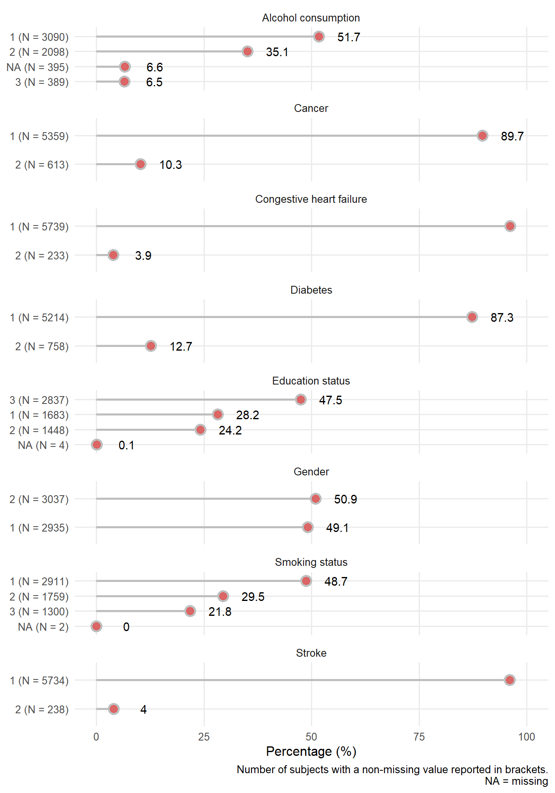
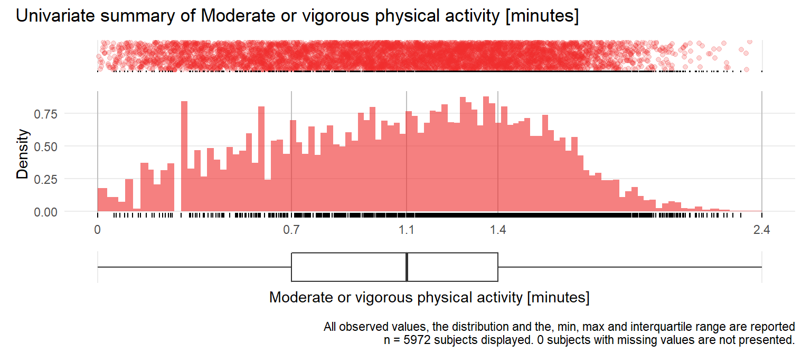
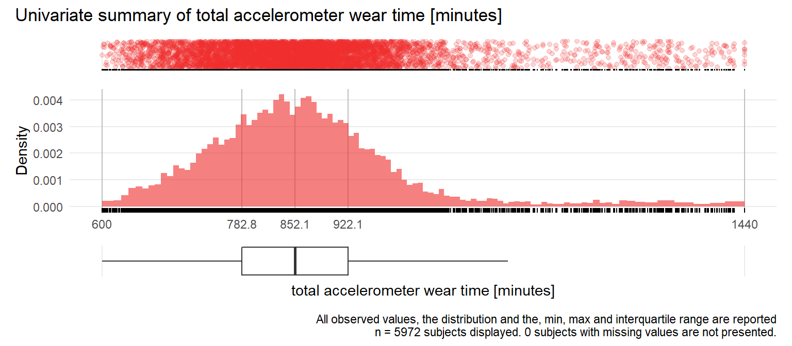

# Univariate distribution checks

This section reports a series of univariate summary checks of the NHANES dataset.


```
## Rows: 6,680
## Columns: 33
## $ seqn            <labelled> 21009, 21010, 21012, 21015, 21017, 21018, 2101...
## $ age             <labelled> 56.00000, 52.83333, 63.83333, 83.91667, 37.083...
## $ gender          <fct> Male, Female, Male, Male, Female, Female, Female, F...
## $ permth.exm      <labelled> 135, 149, 127, 24, 151, 154, 153, 154, 141, 14...
## $ mortstat        <labelled> 0, 0, 1, 1, 0, 0, 0, 0, 0, 0, 0, 0, 0, 0, 1, 0...
## $ educationadult  <fct> High school, More than high school, High school, Mo...
## $ smokecigs       <fct> Never, Current, Current, Former, Current, Never, Fo...
## $ drinkstatus     <fct> Non-Drinker, Heavy Drinker, Missing alcohol, Non-Dr...
## $ bmi             <labelled> 31.26, 25.49, 19.60, 28.32, 19.34, 16.57, 38.0...
## $ diabetes        <fct> No, No, No, No, No, No, No, No, No, No, No, No, Yes...
## $ chf             <fct> No, No, No, No, No, No, Yes, No, No, No, No, No, No...
## $ cancer          <fct> No, No, No, Yes, No, No, No, No, No, No, Yes, No, N...
## $ stroke          <fct> No, No, No, No, No, No, No, No, No, No, No, No, No,...
## $ sys             <labelled> 120, 133, 123, 154, 103, 137, 115, 131, 121, 1...
## $ lbxtc           <labelled> 254, 174, 191, 141, 184, NA, 173, 230, 261, 21...
## $ lbdhdd          <labelled> 37, 119, 92, 34, 77, NA, 45, 51, 29, 68, 53, 4...
## $ mobilityproblem <fct> No Difficulty, No Difficulty, Any Difficulty, Any D...
## $ tac             <labelled> 409352.71, 286407.71, 130778.29, 102562.86, 41...
## $ tlac            <labelled> 3522.427, 3334.503, 2749.086, 2103.580, 3689.4...
## $ mvpa            <labelled> 48.285714, 9.428571, 4.714286, 3.000000, 58.83...
## $ wt              <labelled> 900.2857, 783.4286, 1053.0000, 813.1429, 833.8...
## $ tlac.1          <labelled> 0.0000000, 0.0000000, 161.7450224, 5.6786074, ...
## $ tlac.2          <labelled> 0.000000, 0.000000, 128.091725, 7.244960, 0.00...
## $ tlac.3          <labelled> 66.563485, 0.000000, 145.091848, 8.942295, 0.0...
## $ tlac.4          <labelled> 476.33325, 0.00000, 74.34726, 18.38650, 459.83...
## $ tlac.5          <labelled> 612.21257, 358.95003, 152.73994, 106.23999, 57...
## $ tlac.6          <labelled> 586.1977, 449.0983, 249.8184, 286.1406, 571.73...
## $ tlac.7          <labelled> 462.8831, 514.9402, 352.7644, 393.9136, 637.96...
## $ tlac.8          <labelled> 587.5167, 550.7981, 277.3621, 321.9635, 634.96...
## $ tlac.9          <labelled> 315.9585, 487.6278, 302.4908, 327.1102, 254.62...
## $ tlac.10         <labelled> 251.4170, 527.7868, 310.0226, 313.5571, 338.45...
## $ tlac.11         <labelled> 159.78640, 401.07109, 312.24852, 254.92505, 19...
## $ tlac.12         <labelled> 3.558282, 44.230766, 282.363630, 59.477670, 26...
```

## Data set overview

Using the [Hmisc](https://cran.r-project.org/web/packages/Hmisc/) describe function, we provide an overview of the data set. The descriptive report also provides histograms of continuous variables. For ease of scanning the information, we group the report by measurement type. 

### Demographic and lifestyle variables


```{=html}
<meta http-equiv="Content-Type" content="text/html; charset=utf-8" /> 
<script type="text/javascript">
<!--
    function expand_collapse(id) {
       var e = document.getElementById(id);
       var f = document.getElementById(id+"_earrows");
       if(e.style.display == 'none'){
          e.style.display = 'block';
          f.innerHTML = '&#9650';
       }
       else {
          e.style.display = 'none';
          f.innerHTML = '&#9660';
       }
    }
//-->
</script>
<style>
.earrows {color:silver;font-size:11px;}

fcap {
 font-family: Verdana;
 font-size: 12px;
 color: MidnightBlue
 }

smg {
 font-family: Verdana;
 font-size: 10px;
 color: &#808080;
}

hr.thinhr { margin-top: 0.15em; margin-bottom: 0.15em; }

span.xscript {
position: relative;
}
span.xscript sub {
position: absolute;
left: 0.1em;
bottom: -1ex;
}
</style>
 <font color="MidnightBlue"><div align=center><span style="font-weight:bold">Demographic and lifestyle variables <br><br> 6  Variables   5972  Observations</span></div></font> <hr class="thinhr"> <span style="font-weight:bold">age</span> <span style='font-family:Verdana;font-size:75%;'>years</span><div style='float: right; text-align: right;'></div> <style>
 .hmisctable810577 {
 border: none;
 font-size: 80%;
 }
 .hmisctable810577 td {
 text-align: center;
 padding: 0 1ex 0 1ex;
 }
 .hmisctable810577 th {
 color: MidnightBlue;
 text-align: center;
 padding: 0 1ex 0 1ex;
 font-weight: normal;
 }
 </style>
 <table class="hmisctable810577">
 <tr><th>n</th><th>missing</th><th>distinct</th><th>Info</th><th>Mean</th><th>Gmd</th><th>.05</th><th>.10</th><th>.25</th><th>.50</th><th>.75</th><th>.90</th><th>.95</th></tr>
 <tr><td>5972</td><td>0</td><td>660</td><td>1</td><td>54.87</td><td>17.64</td><td>32.17</td><td>34.58</td><td>41.65</td><td>53.75</td><td>67.25</td><td>76.50</td><td>80.83</td></tr>
 </table>
 <span style="font-size: 85%;"><font color="MidnightBlue">lowest</font> : 30.00000 30.08333 30.16667 30.25000 30.33333 ,  <font color="MidnightBlue">highest</font>: 84.58333 84.66667 84.75000 84.83333 84.91667</span> <hr class="thinhr"> <span style="font-weight:bold">gender</span> <style>
 .hmisctable509703 {
 border: none;
 font-size: 80%;
 }
 .hmisctable509703 td {
 text-align: center;
 padding: 0 1ex 0 1ex;
 }
 .hmisctable509703 th {
 color: MidnightBlue;
 text-align: center;
 padding: 0 1ex 0 1ex;
 font-weight: normal;
 }
 </style>
 <table class="hmisctable509703">
 <tr><th>n</th><th>missing</th><th>distinct</th></tr>
 <tr><td>5972</td><td>0</td><td>2</td></tr>
 </table>
 <pre style="font-size:85%;">
 Value        Male Female
 Frequency    2935   3037
 Proportion  0.491  0.509
 </pre>
 <hr class="thinhr"> <span style="font-weight:bold">educationadult</span>: education level<div style='float: right; text-align: right;'></div> <style>
 .hmisctable649958 {
 border: none;
 font-size: 80%;
 }
 .hmisctable649958 td {
 text-align: center;
 padding: 0 1ex 0 1ex;
 }
 .hmisctable649958 th {
 color: MidnightBlue;
 text-align: center;
 padding: 0 1ex 0 1ex;
 font-weight: normal;
 }
 </style>
 <table class="hmisctable649958">
 <tr><th>n</th><th>missing</th><th>distinct</th></tr>
 <tr><td>5968</td><td>4</td><td>3</td></tr>
 </table>
 <pre style="font-size:85%;">
 Value      Less than high school           High school More than high school
 Frequency                   1683                  1448                  2837
 Proportion                 0.282                 0.243                 0.475
 </pre>
 <hr class="thinhr"> <span style="font-weight:bold">bmi</span>: body mass index <span style='font-family:Verdana;font-size:75%;'>kg/m2</span><div style='float: right; text-align: right;'></div> <style>
 .hmisctable101025 {
 border: none;
 font-size: 80%;
 }
 .hmisctable101025 td {
 text-align: center;
 padding: 0 1ex 0 1ex;
 }
 .hmisctable101025 th {
 color: MidnightBlue;
 text-align: center;
 padding: 0 1ex 0 1ex;
 font-weight: normal;
 }
 </style>
 <table class="hmisctable101025">
 <tr><th>n</th><th>missing</th><th>distinct</th><th>Info</th><th>Mean</th><th>Gmd</th><th>.05</th><th>.10</th><th>.25</th><th>.50</th><th>.75</th><th>.90</th><th>.95</th></tr>
 <tr><td>5928</td><td>44</td><td>2161</td><td>1</td><td>29.07</td><td>6.804</td><td>20.78</td><td>22.12</td><td>24.73</td><td>28.08</td><td>32.23</td><td>37.07</td><td>40.80</td></tr>
 </table>
 <span style="font-size: 85%;"><font color="MidnightBlue">lowest</font> :  13.36  14.65  14.70  15.91  15.92 ,  <font color="MidnightBlue">highest</font>:  62.50  62.77  63.42  63.87 130.21</span> <hr class="thinhr"> <span style="font-weight:bold">smokecigs</span>: smoking status<div style='float: right; text-align: right;'></div> <style>
 .hmisctable895658 {
 border: none;
 font-size: 80%;
 }
 .hmisctable895658 td {
 text-align: center;
 padding: 0 1ex 0 1ex;
 }
 .hmisctable895658 th {
 color: MidnightBlue;
 text-align: center;
 padding: 0 1ex 0 1ex;
 font-weight: normal;
 }
 </style>
 <table class="hmisctable895658">
 <tr><th>n</th><th>missing</th><th>distinct</th></tr>
 <tr><td>5970</td><td>2</td><td>3</td></tr>
 </table>
 <pre style="font-size:85%;">
 Value        Never  Former Current
 Frequency     2911    1759    1300
 Proportion   0.488   0.295   0.218
 </pre>
 <hr class="thinhr"> <span style="font-weight:bold">drinkstatus</span>: alcohol consumption<div style='float: right; text-align: right;'></div> <style>
 .hmisctable375593 {
 border: none;
 font-size: 80%;
 }
 .hmisctable375593 td {
 text-align: center;
 padding: 0 1ex 0 1ex;
 }
 .hmisctable375593 th {
 color: MidnightBlue;
 text-align: center;
 padding: 0 1ex 0 1ex;
 font-weight: normal;
 }
 </style>
 <table class="hmisctable375593">
 <tr><th>n</th><th>missing</th><th>distinct</th></tr>
 <tr><td>5972</td><td>0</td><td>4</td></tr>
 </table>
 <pre style="font-size:85%;">
 Value      Moderate Drinker      Non-Drinker    Heavy Drinker  Missing alcohol
 Frequency              3090             2098              389              395
 Proportion            0.517            0.351            0.065            0.066
 </pre>
 <hr class="thinhr">
```


### Physiological measurements


```{=html}
<meta http-equiv="Content-Type" content="text/html; charset=utf-8" /> 
<script type="text/javascript">
<!--
    function expand_collapse(id) {
       var e = document.getElementById(id);
       var f = document.getElementById(id+"_earrows");
       if(e.style.display == 'none'){
          e.style.display = 'block';
          f.innerHTML = '&#9650';
       }
       else {
          e.style.display = 'none';
          f.innerHTML = '&#9660';
       }
    }
//-->
</script>
<style>
.earrows {color:silver;font-size:11px;}

fcap {
 font-family: Verdana;
 font-size: 12px;
 color: MidnightBlue
 }

smg {
 font-family: Verdana;
 font-size: 10px;
 color: &#808080;
}

hr.thinhr { margin-top: 0.15em; margin-bottom: 0.15em; }

span.xscript {
position: relative;
}
span.xscript sub {
position: absolute;
left: 0.1em;
bottom: -1ex;
}
</style>
 <font color="MidnightBlue"><div align=center><span style="font-weight:bold">Physiological measurements <br><br> 3  Variables   5972  Observations</span></div></font> <hr class="thinhr"> <span style="font-weight:bold">sys</span>: Systolic blood pressure <span style='font-family:Verdana;font-size:75%;'>mg/dl</span><div style='float: right; text-align: right;'></div> <style>
 .hmisctable143591 {
 border: none;
 font-size: 80%;
 }
 .hmisctable143591 td {
 text-align: center;
 padding: 0 1ex 0 1ex;
 }
 .hmisctable143591 th {
 color: MidnightBlue;
 text-align: center;
 padding: 0 1ex 0 1ex;
 font-weight: normal;
 }
 </style>
 <table class="hmisctable143591">
 <tr><th>n</th><th>missing</th><th>distinct</th><th>Info</th><th>Mean</th><th>Gmd</th><th>.05</th><th>.10</th><th>.25</th><th>.50</th><th>.75</th><th>.90</th><th>.95</th></tr>
 <tr><td>5698</td><td>274</td><td>137</td><td>1</td><td>127.4</td><td>22.26</td><td>100.0</td><td>105.0</td><td>113.0</td><td>124.0</td><td>138.0</td><td>154.0</td><td>166.1</td></tr>
 </table>
 <span style="font-size: 85%;"><font color="MidnightBlue">lowest</font> :  73  80  81  83  85 ,  <font color="MidnightBlue">highest</font>: 226 230 238 256 270</span> <hr class="thinhr"> <span style="font-weight:bold">lbxtc</span>: Total cholesterol <span style='font-family:Verdana;font-size:75%;'>mg/dL</span><div style='float: right; text-align: right;'></div> <style>
 .hmisctable118052 {
 border: none;
 font-size: 80%;
 }
 .hmisctable118052 td {
 text-align: center;
 padding: 0 1ex 0 1ex;
 }
 .hmisctable118052 th {
 color: MidnightBlue;
 text-align: center;
 padding: 0 1ex 0 1ex;
 font-weight: normal;
 }
 </style>
 <table class="hmisctable118052">
 <tr><th>n</th><th>missing</th><th>distinct</th><th>Info</th><th>Mean</th><th>Gmd</th><th>.05</th><th>.10</th><th>.25</th><th>.50</th><th>.75</th><th>.90</th><th>.95</th></tr>
 <tr><td>5742</td><td>230</td><td>264</td><td>1</td><td>204.1</td><td>46.4</td><td>143</td><td>155</td><td>175</td><td>201</td><td>228</td><td>258</td><td>277</td></tr>
 </table>
 <span style="font-size: 85%;"><font color="MidnightBlue">lowest</font> :  82  83  85  92  94 ,  <font color="MidnightBlue">highest</font>: 431 440 458 539 650</span> <hr class="thinhr"> <span style="font-weight:bold">lbdhdd</span>: HDL cholesterol <span style='font-family:Verdana;font-size:75%;'>mg/dL</span><div style='float: right; text-align: right;'></div> <style>
 .hmisctable913163 {
 border: none;
 font-size: 80%;
 }
 .hmisctable913163 td {
 text-align: center;
 padding: 0 1ex 0 1ex;
 }
 .hmisctable913163 th {
 color: MidnightBlue;
 text-align: center;
 padding: 0 1ex 0 1ex;
 font-weight: normal;
 }
 </style>
 <table class="hmisctable913163">
 <tr><th>n</th><th>missing</th><th>distinct</th><th>Info</th><th>Mean</th><th>Gmd</th><th>.05</th><th>.10</th><th>.25</th><th>.50</th><th>.75</th><th>.90</th><th>.95</th></tr>
 <tr><td>5742</td><td>230</td><td>109</td><td>1</td><td>54.64</td><td>17.91</td><td>33</td><td>37</td><td>43</td><td>52</td><td>64</td><td>76</td><td>85</td></tr>
 </table>
 <span style="font-size: 85%;"><font color="MidnightBlue">lowest</font> :  17  22  23  24  25 ,  <font color="MidnightBlue">highest</font>: 146 151 152 154 188</span> <hr class="thinhr">
```


### Comorbidities


```{=html}
<meta http-equiv="Content-Type" content="text/html; charset=utf-8" /> 
<script type="text/javascript">
<!--
    function expand_collapse(id) {
       var e = document.getElementById(id);
       var f = document.getElementById(id+"_earrows");
       if(e.style.display == 'none'){
          e.style.display = 'block';
          f.innerHTML = '&#9650';
       }
       else {
          e.style.display = 'none';
          f.innerHTML = '&#9660';
       }
    }
//-->
</script>
<style>
.earrows {color:silver;font-size:11px;}

fcap {
 font-family: Verdana;
 font-size: 12px;
 color: MidnightBlue
 }

smg {
 font-family: Verdana;
 font-size: 10px;
 color: &#808080;
}

hr.thinhr { margin-top: 0.15em; margin-bottom: 0.15em; }

span.xscript {
position: relative;
}
span.xscript sub {
position: absolute;
left: 0.1em;
bottom: -1ex;
}
</style>
 <font color="MidnightBlue"><div align=center><span style="font-weight:bold">Comorbidities <br><br> 5  Variables   5972  Observations</span></div></font> <hr class="thinhr"> <span style="font-weight:bold">mortstat</span>: Final mortality status <style>
 .hmisctable452406 {
 border: none;
 font-size: 80%;
 }
 .hmisctable452406 td {
 text-align: center;
 padding: 0 1ex 0 1ex;
 }
 .hmisctable452406 th {
 color: MidnightBlue;
 text-align: center;
 padding: 0 1ex 0 1ex;
 font-weight: normal;
 }
 </style>
 <table class="hmisctable452406">
 <tr><th>n</th><th>missing</th><th>distinct</th><th>Info</th><th>Sum</th><th>Mean</th><th>Gmd</th></tr>
 <tr><td>5964</td><td>8</td><td>2</td><td>0.441</td><td>1068</td><td>0.1791</td><td>0.2941</td></tr>
 </table>
 <hr class="thinhr"> <span style="font-weight:bold">diabetes</span> <style>
 .hmisctable550083 {
 border: none;
 font-size: 80%;
 }
 .hmisctable550083 td {
 text-align: center;
 padding: 0 1ex 0 1ex;
 }
 .hmisctable550083 th {
 color: MidnightBlue;
 text-align: center;
 padding: 0 1ex 0 1ex;
 font-weight: normal;
 }
 </style>
 <table class="hmisctable550083">
 <tr><th>n</th><th>missing</th><th>distinct</th></tr>
 <tr><td>5972</td><td>0</td><td>2</td></tr>
 </table>
 <pre style="font-size:85%;">
 Value         No   Yes
 Frequency   5214   758
 Proportion 0.873 0.127
 </pre>
 <hr class="thinhr"> <span style="font-weight:bold">chf</span>: congestive heart failure <style>
 .hmisctable458138 {
 border: none;
 font-size: 80%;
 }
 .hmisctable458138 td {
 text-align: center;
 padding: 0 1ex 0 1ex;
 }
 .hmisctable458138 th {
 color: MidnightBlue;
 text-align: center;
 padding: 0 1ex 0 1ex;
 font-weight: normal;
 }
 </style>
 <table class="hmisctable458138">
 <tr><th>n</th><th>missing</th><th>distinct</th></tr>
 <tr><td>5972</td><td>0</td><td>2</td></tr>
 </table>
 <pre style="font-size:85%;">
 Value         No   Yes
 Frequency   5739   233
 Proportion 0.961 0.039
 </pre>
 <hr class="thinhr"> <span style="font-weight:bold">cancer</span> <style>
 .hmisctable738518 {
 border: none;
 font-size: 80%;
 }
 .hmisctable738518 td {
 text-align: center;
 padding: 0 1ex 0 1ex;
 }
 .hmisctable738518 th {
 color: MidnightBlue;
 text-align: center;
 padding: 0 1ex 0 1ex;
 font-weight: normal;
 }
 </style>
 <table class="hmisctable738518">
 <tr><th>n</th><th>missing</th><th>distinct</th></tr>
 <tr><td>5972</td><td>0</td><td>2</td></tr>
 </table>
 <pre style="font-size:85%;">
 Value         No   Yes
 Frequency   5359   613
 Proportion 0.897 0.103
 </pre>
 <hr class="thinhr"> <span style="font-weight:bold">stroke</span> <style>
 .hmisctable262734 {
 border: none;
 font-size: 80%;
 }
 .hmisctable262734 td {
 text-align: center;
 padding: 0 1ex 0 1ex;
 }
 .hmisctable262734 th {
 color: MidnightBlue;
 text-align: center;
 padding: 0 1ex 0 1ex;
 font-weight: normal;
 }
 </style>
 <table class="hmisctable262734">
 <tr><th>n</th><th>missing</th><th>distinct</th></tr>
 <tr><td>5972</td><td>0</td><td>2</td></tr>
 </table>
 <pre style="font-size:85%;">
 Value        No  Yes
 Frequency  5734  238
 Proportion 0.96 0.04
 </pre>
 <hr class="thinhr">
```

### Physical activity variables


```{=html}
<meta http-equiv="Content-Type" content="text/html; charset=utf-8" /> 
<script type="text/javascript">
<!--
    function expand_collapse(id) {
       var e = document.getElementById(id);
       var f = document.getElementById(id+"_earrows");
       if(e.style.display == 'none'){
          e.style.display = 'block';
          f.innerHTML = '&#9650';
       }
       else {
          e.style.display = 'none';
          f.innerHTML = '&#9660';
       }
    }
//-->
</script>
<style>
.earrows {color:silver;font-size:11px;}

fcap {
 font-family: Verdana;
 font-size: 12px;
 color: MidnightBlue
 }

smg {
 font-family: Verdana;
 font-size: 10px;
 color: &#808080;
}

hr.thinhr { margin-top: 0.15em; margin-bottom: 0.15em; }

span.xscript {
position: relative;
}
span.xscript sub {
position: absolute;
left: 0.1em;
bottom: -1ex;
}
</style>
 <font color="MidnightBlue"><div align=center><span style="font-weight:bold">Physical activity <br><br> 17  Variables   5972  Observations</span></div></font> <hr class="thinhr"> <span style="font-weight:bold">mobilityproblem</span>: difficulties with mobility <style>
 .hmisctable387134 {
 border: none;
 font-size: 80%;
 }
 .hmisctable387134 td {
 text-align: center;
 padding: 0 1ex 0 1ex;
 }
 .hmisctable387134 th {
 color: MidnightBlue;
 text-align: center;
 padding: 0 1ex 0 1ex;
 font-weight: normal;
 }
 </style>
 <table class="hmisctable387134">
 <tr><th>n</th><th>missing</th><th>distinct</th></tr>
 <tr><td>5972</td><td>0</td><td>2</td></tr>
 </table>
 <pre style="font-size:85%;">
 Value       No Difficulty Any Difficulty
 Frequency            4595           1377
 Proportion          0.769          0.231
 </pre>
 <hr class="thinhr"> <span style="font-weight:bold">tac</span>: total activity counts per day<div style='float: right; text-align: right;'></div> <style>
 .hmisctable813780 {
 border: none;
 font-size: 70%;
 }
 .hmisctable813780 td {
 text-align: center;
 padding: 0 1ex 0 1ex;
 }
 .hmisctable813780 th {
 color: MidnightBlue;
 text-align: center;
 padding: 0 1ex 0 1ex;
 font-weight: normal;
 }
 </style>
 <table class="hmisctable813780">
 <tr><th>n</th><th>missing</th><th>distinct</th><th>Info</th><th>Mean</th><th>Gmd</th><th>.05</th><th>.10</th><th>.25</th><th>.50</th><th>.75</th><th>.90</th><th>.95</th></tr>
 <tr><td>5972</td><td>0</td><td>5965</td><td>1</td><td>244811</td><td>143738</td><td> 69233</td><td> 94872</td><td>150571</td><td>223572</td><td>314224</td><td>417410</td><td>486450</td></tr>
 </table>
 <style>
 .hmisctable786654 {
 border: none;
 font-size: 85%;
 }
 .hmisctable786654 td {
 text-align: right;
 padding: 0 1ex 0 1ex;
 }
 .hmisctable786654 th {
 color: Black;
 text-align: center;
 padding: 0 1ex 0 1ex;
 font-weight: bold;
 }
 </style>
 <table class="hmisctable786654">
 <tr><td><font color="MidnightBlue">lowest</font> :</td><td>   8263.000</td><td>   8931.833</td><td>  12123.000</td><td>  14642.000</td><td>  15656.000</td></tr>
 <tr><td><font color="MidnightBlue">highest</font>:</td><td> 981517.167</td><td> 986261.000</td><td> 986593.800</td><td>1097823.500</td><td>1122542.600</td></tr>
 </table>
 <hr class="thinhr"> <span style="font-weight:bold">tlac</span>: total log activity count (log(1+activity))<div style='float: right; text-align: right;'></div> <style>
 .hmisctable651024 {
 border: none;
 font-size: 80%;
 }
 .hmisctable651024 td {
 text-align: center;
 padding: 0 1ex 0 1ex;
 }
 .hmisctable651024 th {
 color: MidnightBlue;
 text-align: center;
 padding: 0 1ex 0 1ex;
 font-weight: normal;
 }
 </style>
 <table class="hmisctable651024">
 <tr><th>n</th><th>missing</th><th>distinct</th><th>Info</th><th>Mean</th><th>Gmd</th><th>.05</th><th>.10</th><th>.25</th><th>.50</th><th>.75</th><th>.90</th><th>.95</th></tr>
 <tr><td>5972</td><td>0</td><td>5969</td><td>1</td><td>2900</td><td>873.5</td><td>1613</td><td>1900</td><td>2385</td><td>2911</td><td>3431</td><td>3877</td><td>4164</td></tr>
 </table>
 <style>
 .hmisctable912451 {
 border: none;
 font-size: 85%;
 }
 .hmisctable912451 td {
 text-align: right;
 padding: 0 1ex 0 1ex;
 }
 .hmisctable912451 th {
 color: Black;
 text-align: center;
 padding: 0 1ex 0 1ex;
 font-weight: bold;
 }
 </style>
 <table class="hmisctable912451">
 <tr><td><font color="MidnightBlue">lowest</font> :</td><td> 313.0835</td><td> 364.4561</td><td> 400.8157</td><td> 429.9288</td><td> 466.0362</td></tr>
 <tr><td><font color="MidnightBlue">highest</font>:</td><td>5436.1548</td><td>5492.5395</td><td>5588.3401</td><td>5655.4680</td><td>6122.6779</td></tr>
 </table>
 <hr class="thinhr"> <span style="font-weight:bold">mvpa</span>: Moderate or vigorous physical activity <span style='font-family:Verdana;font-size:75%;'>minutes</span><div style='float: right; text-align: right;'></div> <style>
 .hmisctable255373 {
 border: none;
 font-size: 70%;
 }
 .hmisctable255373 td {
 text-align: center;
 padding: 0 1ex 0 1ex;
 }
 .hmisctable255373 th {
 color: MidnightBlue;
 text-align: center;
 padding: 0 1ex 0 1ex;
 font-weight: normal;
 }
 </style>
 <table class="hmisctable255373">
 <tr><th>n</th><th>missing</th><th>distinct</th><th>Info</th><th>Mean</th><th>Gmd</th><th>.05</th><th>.10</th><th>.25</th><th>.50</th><th>.75</th><th>.90</th><th>.95</th></tr>
 <tr><td>5972</td><td>0</td><td>1163</td><td>1</td><td>19.19</td><td>20.9</td><td> 0.800</td><td> 1.429</td><td> 4.000</td><td>12.000</td><td>26.762</td><td>46.000</td><td>59.921</td></tr>
 </table>
 <style>
 .hmisctable322193 {
 border: none;
 font-size: 85%;
 }
 .hmisctable322193 td {
 text-align: right;
 padding: 0 1ex 0 1ex;
 }
 .hmisctable322193 th {
 color: Black;
 text-align: center;
 padding: 0 1ex 0 1ex;
 font-weight: bold;
 }
 </style>
 <table class="hmisctable322193">
 <tr><td><font color="MidnightBlue">lowest</font> :</td><td>  0.0000000</td><td>  0.1428571</td><td>  0.1666667</td><td>  0.2000000</td><td>  0.2500000</td></tr>
 <tr><td><font color="MidnightBlue">highest</font>:</td><td>180.8333333</td><td>186.2000000</td><td>194.8000000</td><td>208.5000000</td><td>249.0000000</td></tr>
 </table>
 <hr class="thinhr"> <span style="font-weight:bold">wt</span>: total accelerometer wear time <span style='font-family:Verdana;font-size:75%;'>minutes</span><div style='float: right; text-align: right;'></div> <style>
 .hmisctable328876 {
 border: none;
 font-size: 70%;
 }
 .hmisctable328876 td {
 text-align: center;
 padding: 0 1ex 0 1ex;
 }
 .hmisctable328876 th {
 color: MidnightBlue;
 text-align: center;
 padding: 0 1ex 0 1ex;
 font-weight: normal;
 }
 </style>
 <table class="hmisctable328876">
 <tr><th>n</th><th>missing</th><th>distinct</th><th>Info</th><th>Mean</th><th>Gmd</th><th>.05</th><th>.10</th><th>.25</th><th>.50</th><th>.75</th><th>.90</th><th>.95</th></tr>
 <tr><td>5972</td><td>0</td><td>3613</td><td>1</td><td>866.1</td><td>139.8</td><td> 684.3</td><td> 721.0</td><td> 782.9</td><td> 852.1</td><td> 922.0</td><td>1000.6</td><td>1111.5</td></tr>
 </table>
 <span style="font-size: 85%;"><font color="MidnightBlue">lowest</font> :  600.000  601.500  602.000  603.000  604.000 ,  <font color="MidnightBlue">highest</font>: 1425.286 1426.250 1426.286 1426.857 1440.000</span> <hr class="thinhr"> <span style="font-weight:bold">tlac.1</span>: total log actvity count 12:00AM-2:00AM<div style='float: right; text-align: right;'></div> <style>
 .hmisctable856564 {
 border: none;
 font-size: 70%;
 }
 .hmisctable856564 td {
 text-align: center;
 padding: 0 1ex 0 1ex;
 }
 .hmisctable856564 th {
 color: MidnightBlue;
 text-align: center;
 padding: 0 1ex 0 1ex;
 font-weight: normal;
 }
 </style>
 <table class="hmisctable856564">
 <tr><th>n</th><th>missing</th><th>distinct</th><th>Info</th><th>Mean</th><th>Gmd</th><th>.05</th><th>.10</th><th>.25</th><th>.50</th><th>.75</th><th>.90</th><th>.95</th></tr>
 <tr><td>5972</td><td>0</td><td>2656</td><td>0.829</td><td>30.92</td><td>51.83</td><td>  0.00</td><td>  0.00</td><td>  0.00</td><td>  0.00</td><td> 24.38</td><td> 94.43</td><td>169.25</td></tr>
 </table>
 <style>
 .hmisctable766611 {
 border: none;
 font-size: 85%;
 }
 .hmisctable766611 td {
 text-align: right;
 padding: 0 1ex 0 1ex;
 }
 .hmisctable766611 th {
 color: Black;
 text-align: center;
 padding: 0 1ex 0 1ex;
 font-weight: bold;
 }
 </style>
 <table class="hmisctable766611">
 <tr><td><font color="MidnightBlue">lowest</font> :</td><td>  0.0000000</td><td>  0.1569446</td><td>  0.1831020</td><td>  0.2299197</td><td>  0.2559656</td></tr>
 <tr><td><font color="MidnightBlue">highest</font>:</td><td>597.3808309</td><td>620.0469233</td><td>674.1677375</td><td>709.3300116</td><td>719.0239316</td></tr>
 </table>
 <hr class="thinhr"> <span style="font-weight:bold">tlac.2</span>: total log actvity count 2:00AM-4:00AM<div style='float: right; text-align: right;'></div> <style>
 .hmisctable554388 {
 border: none;
 font-size: 70%;
 }
 .hmisctable554388 td {
 text-align: center;
 padding: 0 1ex 0 1ex;
 }
 .hmisctable554388 th {
 color: MidnightBlue;
 text-align: center;
 padding: 0 1ex 0 1ex;
 font-weight: normal;
 }
 </style>
 <table class="hmisctable554388">
 <tr><th>n</th><th>missing</th><th>distinct</th><th>Info</th><th>Mean</th><th>Gmd</th><th>.05</th><th>.10</th><th>.25</th><th>.50</th><th>.75</th><th>.90</th><th>.95</th></tr>
 <tr><td>5972</td><td>0</td><td>1770</td><td>0.653</td><td>19.09</td><td>34.47</td><td>  0.00</td><td>  0.00</td><td>  0.00</td><td>  0.00</td><td>  2.91</td><td> 51.83</td><td>110.64</td></tr>
 </table>
 <style>
 .hmisctable715603 {
 border: none;
 font-size: 85%;
 }
 .hmisctable715603 td {
 text-align: right;
 padding: 0 1ex 0 1ex;
 }
 .hmisctable715603 th {
 color: Black;
 text-align: center;
 padding: 0 1ex 0 1ex;
 font-weight: bold;
 }
 </style>
 <table class="hmisctable715603">
 <tr><td><font color="MidnightBlue">lowest</font> :</td><td>  0.00000000</td><td>  0.09902103</td><td>  0.11552453</td><td>  0.15694461</td><td>  0.23104906</td></tr>
 <tr><td><font color="MidnightBlue">highest</font>:</td><td>586.34967162</td><td>611.00545824</td><td>617.44773130</td><td>737.25383394</td><td>775.42871350</td></tr>
 </table>
 <hr class="thinhr"> <span style="font-weight:bold">tlac.3</span>: total log actvity count 4:00AM-6:00AM<div style='float: right; text-align: right;'></div> <style>
 .hmisctable910480 {
 border: none;
 font-size: 70%;
 }
 .hmisctable910480 td {
 text-align: center;
 padding: 0 1ex 0 1ex;
 }
 .hmisctable910480 th {
 color: MidnightBlue;
 text-align: center;
 padding: 0 1ex 0 1ex;
 font-weight: normal;
 }
 </style>
 <table class="hmisctable910480">
 <tr><th>n</th><th>missing</th><th>distinct</th><th>Info</th><th>Mean</th><th>Gmd</th><th>.05</th><th>.10</th><th>.25</th><th>.50</th><th>.75</th><th>.90</th><th>.95</th></tr>
 <tr><td>5972</td><td>0</td><td>2834</td><td>0.855</td><td>43.29</td><td>70.78</td><td>  0.00</td><td>  0.00</td><td>  0.00</td><td>  0.00</td><td> 38.74</td><td>147.59</td><td>248.43</td></tr>
 </table>
 <style>
 .hmisctable233539 {
 border: none;
 font-size: 85%;
 }
 .hmisctable233539 td {
 text-align: right;
 padding: 0 1ex 0 1ex;
 }
 .hmisctable233539 th {
 color: Black;
 text-align: center;
 padding: 0 1ex 0 1ex;
 font-weight: bold;
 }
 </style>
 <table class="hmisctable233539">
 <tr><td><font color="MidnightBlue">lowest</font> :</td><td>  0.0000000</td><td>  0.1155245</td><td>  0.1386294</td><td>  0.2299197</td><td>  0.2682397</td></tr>
 <tr><td><font color="MidnightBlue">highest</font>:</td><td>679.1484297</td><td>697.1093552</td><td>704.5766819</td><td>719.3198459</td><td>769.6014301</td></tr>
 </table>
 <hr class="thinhr"> <span style="font-weight:bold">tlac.4</span>: total log actvity count 6:00AM-8:00AM<div style='float: right; text-align: right;'></div> <style>
 .hmisctable791901 {
 border: none;
 font-size: 70%;
 }
 .hmisctable791901 td {
 text-align: center;
 padding: 0 1ex 0 1ex;
 }
 .hmisctable791901 th {
 color: MidnightBlue;
 text-align: center;
 padding: 0 1ex 0 1ex;
 font-weight: normal;
 }
 </style>
 <table class="hmisctable791901">
 <tr><th>n</th><th>missing</th><th>distinct</th><th>Info</th><th>Mean</th><th>Gmd</th><th>.05</th><th>.10</th><th>.25</th><th>.50</th><th>.75</th><th>.90</th><th>.95</th></tr>
 <tr><td>5972</td><td>0</td><td>5285</td><td>0.998</td><td>177</td><td>178.6</td><td>  0.00</td><td>  0.00</td><td> 36.94</td><td>137.34</td><td>282.09</td><td>416.35</td><td>496.25</td></tr>
 </table>
 <style>
 .hmisctable979272 {
 border: none;
 font-size: 85%;
 }
 .hmisctable979272 td {
 text-align: right;
 padding: 0 1ex 0 1ex;
 }
 .hmisctable979272 th {
 color: Black;
 text-align: center;
 padding: 0 1ex 0 1ex;
 font-weight: bold;
 }
 </style>
 <table class="hmisctable979272">
 <tr><td><font color="MidnightBlue">lowest</font> :</td><td>  0.0000000</td><td>  0.2299197</td><td>  0.3465736</td><td>  0.6148132</td><td>  0.6839274</td></tr>
 <tr><td><font color="MidnightBlue">highest</font>:</td><td>774.8811640</td><td>792.6938042</td><td>822.1482092</td><td>832.9933042</td><td>857.9018816</td></tr>
 </table>
 <hr class="thinhr"> <span style="font-weight:bold">tlac.5</span>: total log actvity count 8:00AM-10:00AM<div style='float: right; text-align: right;'></div> <style>
 .hmisctable935232 {
 border: none;
 font-size: 70%;
 }
 .hmisctable935232 td {
 text-align: center;
 padding: 0 1ex 0 1ex;
 }
 .hmisctable935232 th {
 color: MidnightBlue;
 text-align: center;
 padding: 0 1ex 0 1ex;
 font-weight: normal;
 }
 </style>
 <table class="hmisctable935232">
 <tr><th>n</th><th>missing</th><th>distinct</th><th>Info</th><th>Mean</th><th>Gmd</th><th>.05</th><th>.10</th><th>.25</th><th>.50</th><th>.75</th><th>.90</th><th>.95</th></tr>
 <tr><td>5972</td><td>0</td><td>5834</td><td>1</td><td>339.3</td><td>191.7</td><td> 39.52</td><td>102.56</td><td>221.28</td><td>346.74</td><td>460.18</td><td>552.17</td><td>610.19</td></tr>
 </table>
 <style>
 .hmisctable814137 {
 border: none;
 font-size: 85%;
 }
 .hmisctable814137 td {
 text-align: right;
 padding: 0 1ex 0 1ex;
 }
 .hmisctable814137 th {
 color: Black;
 text-align: center;
 padding: 0 1ex 0 1ex;
 font-weight: bold;
 }
 </style>
 <table class="hmisctable814137">
 <tr><td><font color="MidnightBlue">lowest</font> :</td><td>  0.0000000</td><td>  0.2310491</td><td>  0.7250248</td><td>  0.8652549</td><td>  1.0357837</td></tr>
 <tr><td><font color="MidnightBlue">highest</font>:</td><td>812.0225306</td><td>812.8675420</td><td>813.2942210</td><td>824.5800445</td><td>888.1759271</td></tr>
 </table>
 <hr class="thinhr"> <span style="font-weight:bold">tlac.6</span>: total log actvity count 10:00AM-12:00PM<div style='float: right; text-align: right;'></div> <style>
 .hmisctable182873 {
 border: none;
 font-size: 80%;
 }
 .hmisctable182873 td {
 text-align: center;
 padding: 0 1ex 0 1ex;
 }
 .hmisctable182873 th {
 color: MidnightBlue;
 text-align: center;
 padding: 0 1ex 0 1ex;
 font-weight: normal;
 }
 </style>
 <table class="hmisctable182873">
 <tr><th>n</th><th>missing</th><th>distinct</th><th>Info</th><th>Mean</th><th>Gmd</th><th>.05</th><th>.10</th><th>.25</th><th>.50</th><th>.75</th><th>.90</th><th>.95</th></tr>
 <tr><td>5972</td><td>0</td><td>5931</td><td>1</td><td>407.7</td><td>163.6</td><td>150.4</td><td>218.6</td><td>316.2</td><td>415.0</td><td>506.7</td><td>589.9</td><td>634.9</td></tr>
 </table>
 <style>
 .hmisctable612434 {
 border: none;
 font-size: 85%;
 }
 .hmisctable612434 td {
 text-align: right;
 padding: 0 1ex 0 1ex;
 }
 .hmisctable612434 th {
 color: Black;
 text-align: center;
 padding: 0 1ex 0 1ex;
 font-weight: bold;
 }
 </style>
 <table class="hmisctable612434">
 <tr><td><font color="MidnightBlue">lowest</font> :</td><td>  0.0000000</td><td>  0.6986213</td><td>  2.6001909</td><td>  4.5903937</td><td>  5.7234361</td></tr>
 <tr><td><font color="MidnightBlue">highest</font>:</td><td>807.7712473</td><td>808.7247458</td><td>811.5701740</td><td>884.1169241</td><td>892.0314653</td></tr>
 </table>
 <hr class="thinhr"> <span style="font-weight:bold">tlac.7</span>: total log actvity count 12:00PM-2:00PM<div style='float: right; text-align: right;'></div> <style>
 .hmisctable928849 {
 border: none;
 font-size: 80%;
 }
 .hmisctable928849 td {
 text-align: center;
 padding: 0 1ex 0 1ex;
 }
 .hmisctable928849 th {
 color: MidnightBlue;
 text-align: center;
 padding: 0 1ex 0 1ex;
 font-weight: normal;
 }
 </style>
 <table class="hmisctable928849">
 <tr><th>n</th><th>missing</th><th>distinct</th><th>Info</th><th>Mean</th><th>Gmd</th><th>.05</th><th>.10</th><th>.25</th><th>.50</th><th>.75</th><th>.90</th><th>.95</th></tr>
 <tr><td>5972</td><td>0</td><td>5947</td><td>1</td><td>418</td><td>146.9</td><td>192.1</td><td>250.4</td><td>337.6</td><td>423.5</td><td>507.2</td><td>581.3</td><td>623.7</td></tr>
 </table>
 <style>
 .hmisctable987003 {
 border: none;
 font-size: 85%;
 }
 .hmisctable987003 td {
 text-align: right;
 padding: 0 1ex 0 1ex;
 }
 .hmisctable987003 th {
 color: Black;
 text-align: center;
 padding: 0 1ex 0 1ex;
 font-weight: bold;
 }
 </style>
 <table class="hmisctable987003">
 <tr><td><font color="MidnightBlue">lowest</font> :</td><td>  0.000000</td><td>  1.734669</td><td>  2.704424</td><td>  5.605670</td><td>  6.387910</td></tr>
 <tr><td><font color="MidnightBlue">highest</font>:</td><td>788.370472</td><td>796.082067</td><td>813.380498</td><td>821.733575</td><td>885.445891</td></tr>
 </table>
 <hr class="thinhr"> <span style="font-weight:bold">tlac.8</span>: total log actvity count 2:00PM-4:00PM<div style='float: right; text-align: right;'></div> <style>
 .hmisctable536744 {
 border: none;
 font-size: 80%;
 }
 .hmisctable536744 td {
 text-align: center;
 padding: 0 1ex 0 1ex;
 }
 .hmisctable536744 th {
 color: MidnightBlue;
 text-align: center;
 padding: 0 1ex 0 1ex;
 font-weight: normal;
 }
 </style>
 <table class="hmisctable536744">
 <tr><th>n</th><th>missing</th><th>distinct</th><th>Info</th><th>Mean</th><th>Gmd</th><th>.05</th><th>.10</th><th>.25</th><th>.50</th><th>.75</th><th>.90</th><th>.95</th></tr>
 <tr><td>5972</td><td>0</td><td>5954</td><td>1</td><td>411.7</td><td>147.8</td><td>192.1</td><td>243.1</td><td>323.6</td><td>414.3</td><td>501.7</td><td>577.5</td><td>619.9</td></tr>
 </table>
 <style>
 .hmisctable629738 {
 border: none;
 font-size: 85%;
 }
 .hmisctable629738 td {
 text-align: right;
 padding: 0 1ex 0 1ex;
 }
 .hmisctable629738 th {
 color: Black;
 text-align: center;
 padding: 0 1ex 0 1ex;
 font-weight: bold;
 }
 </style>
 <table class="hmisctable629738">
 <tr><td><font color="MidnightBlue">lowest</font> :</td><td>  0.000000</td><td>  1.974752</td><td>  3.096473</td><td>  4.094345</td><td>  5.772020</td></tr>
 <tr><td><font color="MidnightBlue">highest</font>:</td><td>792.683985</td><td>837.042353</td><td>846.553847</td><td>877.212734</td><td>904.872351</td></tr>
 </table>
 <hr class="thinhr"> <span style="font-weight:bold">tlac.9</span>: total log actvity count 4:00PM-6:00PM<div style='float: right; text-align: right;'></div> <style>
 .hmisctable243479 {
 border: none;
 font-size: 80%;
 }
 .hmisctable243479 td {
 text-align: center;
 padding: 0 1ex 0 1ex;
 }
 .hmisctable243479 th {
 color: MidnightBlue;
 text-align: center;
 padding: 0 1ex 0 1ex;
 font-weight: normal;
 }
 </style>
 <table class="hmisctable243479">
 <tr><th>n</th><th>missing</th><th>distinct</th><th>Info</th><th>Mean</th><th>Gmd</th><th>.05</th><th>.10</th><th>.25</th><th>.50</th><th>.75</th><th>.90</th><th>.95</th></tr>
 <tr><td>5972</td><td>0</td><td>5955</td><td>1</td><td>397</td><td>140.3</td><td>185.4</td><td>234.8</td><td>316.4</td><td>401.8</td><td>483.5</td><td>553.6</td><td>591.4</td></tr>
 </table>
 <style>
 .hmisctable861495 {
 border: none;
 font-size: 85%;
 }
 .hmisctable861495 td {
 text-align: right;
 padding: 0 1ex 0 1ex;
 }
 .hmisctable861495 th {
 color: Black;
 text-align: center;
 padding: 0 1ex 0 1ex;
 font-weight: bold;
 }
 </style>
 <table class="hmisctable861495">
 <tr><td><font color="MidnightBlue">lowest</font> :</td><td>  0.000000</td><td>  2.957040</td><td>  3.401197</td><td>  4.148165</td><td>  5.084134</td></tr>
 <tr><td><font color="MidnightBlue">highest</font>:</td><td>771.497952</td><td>783.128869</td><td>801.039991</td><td>809.429425</td><td>822.294800</td></tr>
 </table>
 <hr class="thinhr"> <span style="font-weight:bold">tlac.10</span>: total log actvity count 6:00PM-8:00PM<div style='float: right; text-align: right;'></div> <style>
 .hmisctable622300 {
 border: none;
 font-size: 80%;
 }
 .hmisctable622300 td {
 text-align: center;
 padding: 0 1ex 0 1ex;
 }
 .hmisctable622300 th {
 color: MidnightBlue;
 text-align: center;
 padding: 0 1ex 0 1ex;
 font-weight: normal;
 }
 </style>
 <table class="hmisctable622300">
 <tr><th>n</th><th>missing</th><th>distinct</th><th>Info</th><th>Mean</th><th>Gmd</th><th>.05</th><th>.10</th><th>.25</th><th>.50</th><th>.75</th><th>.90</th><th>.95</th></tr>
 <tr><td>5972</td><td>0</td><td>5932</td><td>1</td><td>337.6</td><td>151.3</td><td>114.1</td><td>165.5</td><td>246.6</td><td>339.5</td><td>433.1</td><td>504.4</td><td>548.9</td></tr>
 </table>
 <style>
 .hmisctable350200 {
 border: none;
 font-size: 85%;
 }
 .hmisctable350200 td {
 text-align: right;
 padding: 0 1ex 0 1ex;
 }
 .hmisctable350200 th {
 color: Black;
 text-align: center;
 padding: 0 1ex 0 1ex;
 font-weight: bold;
 }
 </style>
 <table class="hmisctable350200">
 <tr><td><font color="MidnightBlue">lowest</font> :</td><td>  0.000000</td><td>  1.311822</td><td>  1.353699</td><td>  1.753975</td><td>  3.459493</td></tr>
 <tr><td><font color="MidnightBlue">highest</font>:</td><td>778.168243</td><td>778.774433</td><td>802.020060</td><td>851.421446</td><td>860.123328</td></tr>
 </table>
 <hr class="thinhr"> <span style="font-weight:bold">tlac.11</span>: total log actvity count 8:00PM-10:00PM<div style='float: right; text-align: right;'></div> <style>
 .hmisctable102080 {
 border: none;
 font-size: 70%;
 }
 .hmisctable102080 td {
 text-align: center;
 padding: 0 1ex 0 1ex;
 }
 .hmisctable102080 th {
 color: MidnightBlue;
 text-align: center;
 padding: 0 1ex 0 1ex;
 font-weight: normal;
 }
 </style>
 <table class="hmisctable102080">
 <tr><th>n</th><th>missing</th><th>distinct</th><th>Info</th><th>Mean</th><th>Gmd</th><th>.05</th><th>.10</th><th>.25</th><th>.50</th><th>.75</th><th>.90</th><th>.95</th></tr>
 <tr><td>5972</td><td>0</td><td>5786</td><td>1</td><td>223.2</td><td>158.2</td><td> 10.22</td><td> 42.32</td><td>116.77</td><td>212.72</td><td>315.90</td><td>411.75</td><td>471.84</td></tr>
 </table>
 <style>
 .hmisctable311877 {
 border: none;
 font-size: 85%;
 }
 .hmisctable311877 td {
 text-align: right;
 padding: 0 1ex 0 1ex;
 }
 .hmisctable311877 th {
 color: Black;
 text-align: center;
 padding: 0 1ex 0 1ex;
 font-weight: bold;
 }
 </style>
 <table class="hmisctable311877">
 <tr><td><font color="MidnightBlue">lowest</font> :</td><td>  0.0000000</td><td>  0.6229449</td><td>  0.6708919</td><td>  1.0233141</td><td>  1.0525597</td></tr>
 <tr><td><font color="MidnightBlue">highest</font>:</td><td>724.9040071</td><td>753.8848070</td><td>821.4989318</td><td>826.3463412</td><td>839.8942777</td></tr>
 </table>
 <hr class="thinhr"> <span style="font-weight:bold">tlac.12</span>: total log actvity count 10:00PM-12:00AM<div style='float: right; text-align: right;'></div> <pre style="font-size:80%;">
        n  missing distinct     Info     Mean      Gmd      .05      .10      .25 
     5972        0     4943    0.995    95.37    114.3    0.000    0.000    6.693 
      .50      .75      .90      .95 
   55.438  141.863  251.308  328.945 
 </pre>
 <style>
 .hmisctable682656 {
 border: none;
 font-size: 85%;
 }
 .hmisctable682656 td {
 text-align: right;
 padding: 0 1ex 0 1ex;
 }
 .hmisctable682656 th {
 color: Black;
 text-align: center;
 padding: 0 1ex 0 1ex;
 font-weight: bold;
 }
 </style>
 <table class="hmisctable682656">
 <tr><td><font color="MidnightBlue">lowest</font> :</td><td>  0.00000000</td><td>  0.09902103</td><td>  0.17328680</td><td>  0.27798716</td><td>  0.41291025</td></tr>
 <tr><td><font color="MidnightBlue">highest</font>:</td><td>683.58618305</td><td>698.46723961</td><td>702.66304648</td><td>707.15487443</td><td>733.61717206</td></tr>
 </table>
 <hr class="thinhr">
```


## Categorical variables

We now provide a closer visual examination of the categorical predictors. 




## Continuous variables 

A closer visual examination of continuous predictors and the outcome variable. 


There is evidence of influential points in some of the distributions. This is explored further with targeted summaries. A more detailed univariate summaries for the variables of interest are also provided below. 


### Outcome= Time of moderate or vigrous physical activity and related variables


```
## Warning: Removed 15 rows containing missing values (geom_point).
```

```
## Warning: Removed 2 rows containing missing values (geom_bar).
```

<div class="figure">

<p class="caption">Distribution of time of moderate/vigorous activity [minutes]</p>
</div>

After transforming MVPA with $\log_{10}(x+1)$: 


```
## Warning: Removed 17 rows containing missing values (geom_point).
```

```
## Warning: Removed 2 rows containing missing values (geom_bar).
```

<div class="figure">

<p class="caption">Distribution of log(1+MVPA) </p>
</div>


```
## Warning: Removed 10 rows containing missing values (geom_point).
```

```
## Warning: Removed 2 rows containing missing values (geom_bar).
```

<div class="figure">

<p class="caption">Distribution of wear time [minutes]</p>
</div>


```
## Warning: Removed 2 rows containing missing values (geom_bar).
```

<div class="figure">

<p class="caption">Distribution of log total activity count</p>
</div>


### Age


```
## Warning: Removed 5 rows containing missing values (geom_point).
```

```
## Warning: Removed 2 rows containing missing values (geom_bar).
```

<div class="figure">

<p class="caption">Distribution of age</p>
</div>


### Blood pressure

<div class="figure">

<p class="caption">Distribution of SBP</p>
</div>


### Body mass index


<div class="figure">

<p class="caption">Distribution of respiratory rate</p>
</div>

There is a participant with an unusal high value (130.2). It is possible that this is an entry error (bmi=30.2).


### Total cholesterol


<div class="figure">

<p class="caption">Distribution of total cholesterol</p>
</div>


<div class="figure">

<p class="caption">Distribution of HDL</p>
</div>


## Section session info


```
## R version 4.0.2 (2020-06-22)
## Platform: x86_64-w64-mingw32/x64 (64-bit)
## Running under: Windows 10 x64 (build 18363)
## 
## Matrix products: default
## 
## locale:
## [1] LC_COLLATE=English_United States.1252 
## [2] LC_CTYPE=English_United States.1252   
## [3] LC_MONETARY=English_United States.1252
## [4] LC_NUMERIC=C                          
## [5] LC_TIME=English_United States.1252    
## 
## attached base packages:
## [1] stats     graphics  grDevices utils     datasets  methods   base     
## 
## other attached packages:
##  [1] Hmisc_4.5-0     Formula_1.2-4   survival_3.1-12 lattice_0.20-41
##  [5] forcats_0.5.1   stringr_1.4.0   dplyr_1.0.4     purrr_0.3.4    
##  [9] readr_1.4.0     tidyr_1.1.2     tibble_3.0.6    ggplot2_3.3.3  
## [13] tidyverse_1.3.0 here_1.0.1     
## 
## loaded via a namespace (and not attached):
##  [1] httr_1.4.2          jsonlite_1.7.2      splines_4.0.2      
##  [4] modelr_0.1.8        assertthat_0.2.1    highr_0.8          
##  [7] latticeExtra_0.6-29 cellranger_1.1.0    yaml_2.2.1         
## [10] pillar_1.4.7        backports_1.2.1     glue_1.4.2         
## [13] digest_0.6.27       RColorBrewer_1.1-2  checkmate_2.0.0    
## [16] rvest_0.3.6         colorspace_2.0-0    htmltools_0.5.1.1  
## [19] Matrix_1.2-18       pkgconfig_2.0.3     broom_0.7.4        
## [22] haven_2.3.1         bookdown_0.21       patchwork_1.1.1    
## [25] scales_1.1.1        jpeg_0.1-8.1        htmlTable_2.1.0    
## [28] generics_0.1.0      farver_2.0.3        ellipsis_0.3.1     
## [31] withr_2.4.1         nnet_7.3-14         cli_2.3.0          
## [34] magrittr_2.0.1      crayon_1.4.1        readxl_1.3.1       
## [37] evaluate_0.14       fs_1.5.0            fansi_0.4.2        
## [40] xml2_1.3.2          foreign_0.8-80      tools_4.0.2        
## [43] data.table_1.13.6   hms_1.0.0           lifecycle_0.2.0    
## [46] munsell_0.5.0       reprex_1.0.0        cluster_2.1.0      
## [49] compiler_4.0.2      rlang_0.4.10        grid_4.0.2         
## [52] rstudioapi_0.13     htmlwidgets_1.5.3   base64enc_0.1-3    
## [55] labeling_0.4.2      rmarkdown_2.6       gtable_0.3.0       
## [58] DBI_1.1.1           R6_2.5.0            gridExtra_2.3      
## [61] lubridate_1.7.9.2   knitr_1.31          utf8_1.1.4         
## [64] rprojroot_2.0.2     stringi_1.5.3       rmdformats_1.0.1   
## [67] Rcpp_1.0.6          vctrs_0.3.6         rpart_4.1-15       
## [70] png_0.1-7           dbplyr_2.1.0        tidyselect_1.1.0   
## [73] xfun_0.20
```
