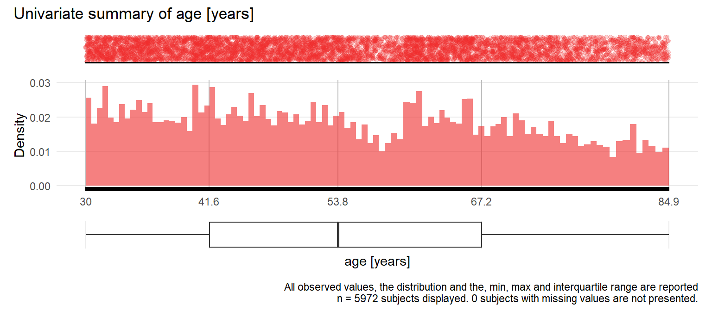
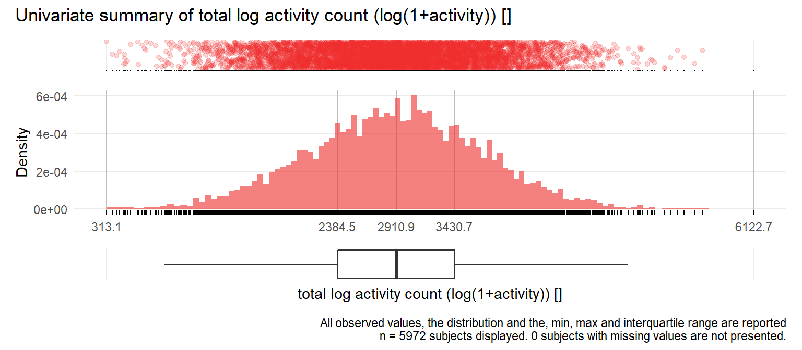

# Univariate distribution checks


This section reports a series of univariate summary checks of the NHANES dataset.


## Data set overview

Using the [Hmisc](https://cran.r-project.org/web/packages/Hmisc/) describe function, we provide an overview of the data set. The descriptive report also provides histograms of continuous variables. For ease of scanning the information, we group the report by measurement type. 

### Demographic and lifestyle variables


```{=html}
<meta http-equiv="Content-Type" content="text/html; charset=utf-8" /> 
<script type="text/javascript">
<!--
    function expand_collapse(id) {
       var e = document.getElementById(id);
       var f = document.getElementById(id+"_earrows");
       if(e.style.display == 'none'){
          e.style.display = 'block';
          f.innerHTML = '&#9650';
       }
       else {
          e.style.display = 'none';
          f.innerHTML = '&#9660';
       }
    }
//-->
</script>
<style>
.earrows {color:silver;font-size:11px;}

fcap {
 font-family: Verdana;
 font-size: 12px;
 color: MidnightBlue
 }

smg {
 font-family: Verdana;
 font-size: 10px;
 color: &#808080;
}

hr.thinhr { margin-top: 0.15em; margin-bottom: 0.15em; }

span.xscript {
position: relative;
}
span.xscript sub {
position: absolute;
left: 0.1em;
bottom: -1ex;
}
</style>
 <font color="MidnightBlue"><div align=center><span style="font-weight:bold">Demographic and lifestyle variables <br><br> 6  Variables   6680  Observations</span></div></font> <hr class="thinhr"> <span style="font-weight:bold">age</span> <span style='font-family:Verdana;font-size:75%;'>years</span><div style='float: right; text-align: right;'></div> <style>
 .hmisctable502708 {
 border: none;
 font-size: 80%;
 }
 .hmisctable502708 td {
 text-align: center;
 padding: 0 1ex 0 1ex;
 }
 .hmisctable502708 th {
 color: MidnightBlue;
 text-align: center;
 padding: 0 1ex 0 1ex;
 font-weight: normal;
 }
 </style>
 <table class="hmisctable502708">
 <tr><th>n</th><th>missing</th><th>distinct</th><th>Info</th><th>Mean</th><th>Gmd</th><th>.05</th><th>.10</th><th>.25</th><th>.50</th><th>.75</th><th>.90</th><th>.95</th></tr>
 <tr><td>6680</td><td>0</td><td>660</td><td>1</td><td>54.55</td><td>17.7</td><td>32.08</td><td>34.33</td><td>41.33</td><td>53.17</td><td>67.00</td><td>76.42</td><td>80.83</td></tr>
 </table>
 <span style="font-size: 85%;"><font color="MidnightBlue">lowest</font> : 30.00000 30.08333 30.16667 30.25000 30.33333 ,  <font color="MidnightBlue">highest</font>: 84.58333 84.66667 84.75000 84.83333 84.91667</span> <hr class="thinhr"> <span style="font-weight:bold">gender</span> <style>
 .hmisctable151976 {
 border: none;
 font-size: 80%;
 }
 .hmisctable151976 td {
 text-align: center;
 padding: 0 1ex 0 1ex;
 }
 .hmisctable151976 th {
 color: MidnightBlue;
 text-align: center;
 padding: 0 1ex 0 1ex;
 font-weight: normal;
 }
 </style>
 <table class="hmisctable151976">
 <tr><th>n</th><th>missing</th><th>distinct</th></tr>
 <tr><td>6680</td><td>0</td><td>2</td></tr>
 </table>
 <pre style="font-size:85%;">
 Value        Male Female
 Frequency    3294   3386
 Proportion  0.493  0.507
 </pre>
 <hr class="thinhr"> <span style="font-weight:bold">educationadult</span>: education level<div style='float: right; text-align: right;'></div> <style>
 .hmisctable784364 {
 border: none;
 font-size: 80%;
 }
 .hmisctable784364 td {
 text-align: center;
 padding: 0 1ex 0 1ex;
 }
 .hmisctable784364 th {
 color: MidnightBlue;
 text-align: center;
 padding: 0 1ex 0 1ex;
 font-weight: normal;
 }
 </style>
 <table class="hmisctable784364">
 <tr><th>n</th><th>missing</th><th>distinct</th></tr>
 <tr><td>6673</td><td>7</td><td>3</td></tr>
 </table>
 <pre style="font-size:85%;">
 Value      Less than high school           High school More than high school
 Frequency                   1899                  1634                  3140
 Proportion                 0.285                 0.245                 0.471
 </pre>
 <hr class="thinhr"> <span style="font-weight:bold">bmi</span>: body mass index <span style='font-family:Verdana;font-size:75%;'>kg/m2</span><div style='float: right; text-align: right;'></div> <style>
 .hmisctable577166 {
 border: none;
 font-size: 80%;
 }
 .hmisctable577166 td {
 text-align: center;
 padding: 0 1ex 0 1ex;
 }
 .hmisctable577166 th {
 color: MidnightBlue;
 text-align: center;
 padding: 0 1ex 0 1ex;
 font-weight: normal;
 }
 </style>
 <table class="hmisctable577166">
 <tr><th>n</th><th>missing</th><th>distinct</th><th>Info</th><th>Mean</th><th>Gmd</th><th>.05</th><th>.10</th><th>.25</th><th>.50</th><th>.75</th><th>.90</th><th>.95</th></tr>
 <tr><td>6624</td><td>56</td><td>2252</td><td>1</td><td>29.07</td><td>6.841</td><td>20.69</td><td>22.06</td><td>24.72</td><td>28.10</td><td>32.25</td><td>37.11</td><td>40.80</td></tr>
 </table>
 <span style="font-size: 85%;"><font color="MidnightBlue">lowest</font> :  13.36  14.65  14.70  15.91  15.92 ,  <font color="MidnightBlue">highest</font>:  62.77  63.42  63.87  72.28 130.21</span> <hr class="thinhr"> <span style="font-weight:bold">smokecigs</span>: smoking status<div style='float: right; text-align: right;'></div> <style>
 .hmisctable202508 {
 border: none;
 font-size: 80%;
 }
 .hmisctable202508 td {
 text-align: center;
 padding: 0 1ex 0 1ex;
 }
 .hmisctable202508 th {
 color: MidnightBlue;
 text-align: center;
 padding: 0 1ex 0 1ex;
 font-weight: normal;
 }
 </style>
 <table class="hmisctable202508">
 <tr><th>n</th><th>missing</th><th>distinct</th></tr>
 <tr><td>6676</td><td>4</td><td>3</td></tr>
 </table>
 <pre style="font-size:85%;">
 Value        Never  Former Current
 Frequency     3253    1944    1479
 Proportion   0.487   0.291   0.222
 </pre>
 <hr class="thinhr"> <span style="font-weight:bold">alcohol</span><div style='float: right; text-align: right;'></div> <style>
 .hmisctable724915 {
 border: none;
 font-size: 80%;
 }
 .hmisctable724915 td {
 text-align: center;
 padding: 0 1ex 0 1ex;
 }
 .hmisctable724915 th {
 color: MidnightBlue;
 text-align: center;
 padding: 0 1ex 0 1ex;
 font-weight: normal;
 }
 </style>
 <table class="hmisctable724915">
 <tr><th>n</th><th>missing</th><th>distinct</th><th>Info</th><th>Mean</th><th>Gmd</th></tr>
 <tr><td>6214</td><td>466</td><td>3</td><td>0.776</td><td>1.514</td><td>0.6226</td></tr>
 </table>
 <pre style="font-size:85%;">
 Value          1     2     3
 Frequency   3449  2336   429
 Proportion 0.555 0.376 0.069
 </pre>
 <hr class="thinhr">
```


### Physiological measurements


```{=html}
<meta http-equiv="Content-Type" content="text/html; charset=utf-8" /> 
<script type="text/javascript">
<!--
    function expand_collapse(id) {
       var e = document.getElementById(id);
       var f = document.getElementById(id+"_earrows");
       if(e.style.display == 'none'){
          e.style.display = 'block';
          f.innerHTML = '&#9650';
       }
       else {
          e.style.display = 'none';
          f.innerHTML = '&#9660';
       }
    }
//-->
</script>
<style>
.earrows {color:silver;font-size:11px;}

fcap {
 font-family: Verdana;
 font-size: 12px;
 color: MidnightBlue
 }

smg {
 font-family: Verdana;
 font-size: 10px;
 color: &#808080;
}

hr.thinhr { margin-top: 0.15em; margin-bottom: 0.15em; }

span.xscript {
position: relative;
}
span.xscript sub {
position: absolute;
left: 0.1em;
bottom: -1ex;
}
</style>
 <font color="MidnightBlue"><div align=center><span style="font-weight:bold">Lab measurements <br><br> 3  Variables   6680  Observations</span></div></font> <hr class="thinhr"> <span style="font-weight:bold">sys</span>: Systolic blood pressure <span style='font-family:Verdana;font-size:75%;'>mg/dl</span><div style='float: right; text-align: right;'></div> <style>
 .hmisctable433432 {
 border: none;
 font-size: 80%;
 }
 .hmisctable433432 td {
 text-align: center;
 padding: 0 1ex 0 1ex;
 }
 .hmisctable433432 th {
 color: MidnightBlue;
 text-align: center;
 padding: 0 1ex 0 1ex;
 font-weight: normal;
 }
 </style>
 <table class="hmisctable433432">
 <tr><th>n</th><th>missing</th><th>distinct</th><th>Info</th><th>Mean</th><th>Gmd</th><th>.05</th><th>.10</th><th>.25</th><th>.50</th><th>.75</th><th>.90</th><th>.95</th></tr>
 <tr><td>6360</td><td>320</td><td>139</td><td>1</td><td>127.3</td><td>22.17</td><td>100</td><td>105</td><td>113</td><td>124</td><td>138</td><td>154</td><td>166</td></tr>
 </table>
 <span style="font-size: 85%;"><font color="MidnightBlue">lowest</font> :  73  80  81  82  83 ,  <font color="MidnightBlue">highest</font>: 228 230 238 256 270</span> <hr class="thinhr"> <span style="font-weight:bold">lbxtc</span>: Total cholesterol <span style='font-family:Verdana;font-size:75%;'>mg/dL</span><div style='float: right; text-align: right;'></div> <style>
 .hmisctable500862 {
 border: none;
 font-size: 80%;
 }
 .hmisctable500862 td {
 text-align: center;
 padding: 0 1ex 0 1ex;
 }
 .hmisctable500862 th {
 color: MidnightBlue;
 text-align: center;
 padding: 0 1ex 0 1ex;
 font-weight: normal;
 }
 </style>
 <table class="hmisctable500862">
 <tr><th>n</th><th>missing</th><th>distinct</th><th>Info</th><th>Mean</th><th>Gmd</th><th>.05</th><th>.10</th><th>.25</th><th>.50</th><th>.75</th><th>.90</th><th>.95</th></tr>
 <tr><td>6410</td><td>270</td><td>268</td><td>1</td><td>203.9</td><td>46.64</td><td>142</td><td>154</td><td>175</td><td>201</td><td>229</td><td>258</td><td>277</td></tr>
 </table>
 <span style="font-size: 85%;"><font color="MidnightBlue">lowest</font> :  82  83  85  92  94 ,  <font color="MidnightBlue">highest</font>: 441 458 539 650 704</span> <hr class="thinhr"> <span style="font-weight:bold">lbdhdd</span>: HDL cholesterol <span style='font-family:Verdana;font-size:75%;'>mg/dL</span><div style='float: right; text-align: right;'></div> <style>
 .hmisctable621911 {
 border: none;
 font-size: 80%;
 }
 .hmisctable621911 td {
 text-align: center;
 padding: 0 1ex 0 1ex;
 }
 .hmisctable621911 th {
 color: MidnightBlue;
 text-align: center;
 padding: 0 1ex 0 1ex;
 font-weight: normal;
 }
 </style>
 <table class="hmisctable621911">
 <tr><th>n</th><th>missing</th><th>distinct</th><th>Info</th><th>Mean</th><th>Gmd</th><th>.05</th><th>.10</th><th>.25</th><th>.50</th><th>.75</th><th>.90</th><th>.95</th></tr>
 <tr><td>6410</td><td>270</td><td>113</td><td>1</td><td>54.56</td><td>17.99</td><td>33</td><td>37</td><td>42</td><td>52</td><td>63</td><td>76</td><td>85</td></tr>
 </table>
 <span style="font-size: 85%;"><font color="MidnightBlue">lowest</font> :  17  19  21  22  23 ,  <font color="MidnightBlue">highest</font>: 151 152 154 164 188</span> <hr class="thinhr">
```


### Comorbidities


```{=html}
<meta http-equiv="Content-Type" content="text/html; charset=utf-8" /> 
<script type="text/javascript">
<!--
    function expand_collapse(id) {
       var e = document.getElementById(id);
       var f = document.getElementById(id+"_earrows");
       if(e.style.display == 'none'){
          e.style.display = 'block';
          f.innerHTML = '&#9650';
       }
       else {
          e.style.display = 'none';
          f.innerHTML = '&#9660';
       }
    }
//-->
</script>
<style>
.earrows {color:silver;font-size:11px;}

fcap {
 font-family: Verdana;
 font-size: 12px;
 color: MidnightBlue
 }

smg {
 font-family: Verdana;
 font-size: 10px;
 color: &#808080;
}

hr.thinhr { margin-top: 0.15em; margin-bottom: 0.15em; }

span.xscript {
position: relative;
}
span.xscript sub {
position: absolute;
left: 0.1em;
bottom: -1ex;
}
</style>
 <font color="MidnightBlue"><div align=center><span style="font-weight:bold">Comorbidities <br><br> 4  Variables   6680  Observations</span></div></font> <hr class="thinhr"> <span style="font-weight:bold">diabetes</span> <style>
 .hmisctable108309 {
 border: none;
 font-size: 80%;
 }
 .hmisctable108309 td {
 text-align: center;
 padding: 0 1ex 0 1ex;
 }
 .hmisctable108309 th {
 color: MidnightBlue;
 text-align: center;
 padding: 0 1ex 0 1ex;
 font-weight: normal;
 }
 </style>
 <table class="hmisctable108309">
 <tr><th>n</th><th>missing</th><th>distinct</th></tr>
 <tr><td>6680</td><td>0</td><td>2</td></tr>
 </table>
 <pre style="font-size:85%;">
 Value         No   Yes
 Frequency   5828   852
 Proportion 0.872 0.128
 </pre>
 <hr class="thinhr"> <span style="font-weight:bold">chf</span>: congestive heart failure <style>
 .hmisctable592001 {
 border: none;
 font-size: 80%;
 }
 .hmisctable592001 td {
 text-align: center;
 padding: 0 1ex 0 1ex;
 }
 .hmisctable592001 th {
 color: MidnightBlue;
 text-align: center;
 padding: 0 1ex 0 1ex;
 font-weight: normal;
 }
 </style>
 <table class="hmisctable592001">
 <tr><th>n</th><th>missing</th><th>distinct</th></tr>
 <tr><td>6680</td><td>0</td><td>2</td></tr>
 </table>
 <pre style="font-size:85%;">
 Value        No  Yes
 Frequency  6416  264
 Proportion 0.96 0.04
 </pre>
 <hr class="thinhr"> <span style="font-weight:bold">cancer</span> <style>
 .hmisctable992960 {
 border: none;
 font-size: 80%;
 }
 .hmisctable992960 td {
 text-align: center;
 padding: 0 1ex 0 1ex;
 }
 .hmisctable992960 th {
 color: MidnightBlue;
 text-align: center;
 padding: 0 1ex 0 1ex;
 font-weight: normal;
 }
 </style>
 <table class="hmisctable992960">
 <tr><th>n</th><th>missing</th><th>distinct</th></tr>
 <tr><td>6680</td><td>0</td><td>2</td></tr>
 </table>
 <pre style="font-size:85%;">
 Value         No   Yes
 Frequency   6008   672
 Proportion 0.899 0.101
 </pre>
 <hr class="thinhr"> <span style="font-weight:bold">stroke</span> <style>
 .hmisctable856902 {
 border: none;
 font-size: 80%;
 }
 .hmisctable856902 td {
 text-align: center;
 padding: 0 1ex 0 1ex;
 }
 .hmisctable856902 th {
 color: MidnightBlue;
 text-align: center;
 padding: 0 1ex 0 1ex;
 font-weight: normal;
 }
 </style>
 <table class="hmisctable856902">
 <tr><th>n</th><th>missing</th><th>distinct</th></tr>
 <tr><td>6680</td><td>0</td><td>2</td></tr>
 </table>
 <pre style="font-size:85%;">
 Value         No   Yes
 Frequency   6406   274
 Proportion 0.959 0.041
 </pre>
 <hr class="thinhr">
```

### Physical activity variables


```{=html}
<meta http-equiv="Content-Type" content="text/html; charset=utf-8" /> 
<script type="text/javascript">
<!--
    function expand_collapse(id) {
       var e = document.getElementById(id);
       var f = document.getElementById(id+"_earrows");
       if(e.style.display == 'none'){
          e.style.display = 'block';
          f.innerHTML = '&#9650';
       }
       else {
          e.style.display = 'none';
          f.innerHTML = '&#9660';
       }
    }
//-->
</script>
<style>
.earrows {color:silver;font-size:11px;}

fcap {
 font-family: Verdana;
 font-size: 12px;
 color: MidnightBlue
 }

smg {
 font-family: Verdana;
 font-size: 10px;
 color: &#808080;
}

hr.thinhr { margin-top: 0.15em; margin-bottom: 0.15em; }

span.xscript {
position: relative;
}
span.xscript sub {
position: absolute;
left: 0.1em;
bottom: -1ex;
}
</style>
 <font color="MidnightBlue"><div align=center><span style="font-weight:bold">Physical activity <br><br> 16  Variables   6680  Observations</span></div></font> <hr class="thinhr"> <span style="font-weight:bold">tac</span>: total activity counts per day<div style='float: right; text-align: right;'></div> <style>
 .hmisctable463913 {
 border: none;
 font-size: 70%;
 }
 .hmisctable463913 td {
 text-align: center;
 padding: 0 1ex 0 1ex;
 }
 .hmisctable463913 th {
 color: MidnightBlue;
 text-align: center;
 padding: 0 1ex 0 1ex;
 font-weight: normal;
 }
 </style>
 <table class="hmisctable463913">
 <tr><th>n</th><th>missing</th><th>distinct</th><th>Info</th><th>Mean</th><th>Gmd</th><th>.05</th><th>.10</th><th>.25</th><th>.50</th><th>.75</th><th>.90</th><th>.95</th></tr>
 <tr><td>5972</td><td>708</td><td>5965</td><td>1</td><td>244811</td><td>143738</td><td> 69233</td><td> 94872</td><td>150571</td><td>223572</td><td>314224</td><td>417410</td><td>486450</td></tr>
 </table>
 <style>
 .hmisctable635038 {
 border: none;
 font-size: 85%;
 }
 .hmisctable635038 td {
 text-align: right;
 padding: 0 1ex 0 1ex;
 }
 .hmisctable635038 th {
 color: Black;
 text-align: center;
 padding: 0 1ex 0 1ex;
 font-weight: bold;
 }
 </style>
 <table class="hmisctable635038">
 <tr><td><font color="MidnightBlue">lowest</font> :</td><td>   8263.000</td><td>   8931.833</td><td>  12123.000</td><td>  14642.000</td><td>  15656.000</td></tr>
 <tr><td><font color="MidnightBlue">highest</font>:</td><td> 981517.167</td><td> 986261.000</td><td> 986593.800</td><td>1097823.500</td><td>1122542.600</td></tr>
 </table>
 <hr class="thinhr"> <span style="font-weight:bold">tlac</span>: total log activity count (log(1+activity))<div style='float: right; text-align: right;'></div> <style>
 .hmisctable464464 {
 border: none;
 font-size: 80%;
 }
 .hmisctable464464 td {
 text-align: center;
 padding: 0 1ex 0 1ex;
 }
 .hmisctable464464 th {
 color: MidnightBlue;
 text-align: center;
 padding: 0 1ex 0 1ex;
 font-weight: normal;
 }
 </style>
 <table class="hmisctable464464">
 <tr><th>n</th><th>missing</th><th>distinct</th><th>Info</th><th>Mean</th><th>Gmd</th><th>.05</th><th>.10</th><th>.25</th><th>.50</th><th>.75</th><th>.90</th><th>.95</th></tr>
 <tr><td>5972</td><td>708</td><td>5969</td><td>1</td><td>2900</td><td>873.5</td><td>1613</td><td>1900</td><td>2385</td><td>2911</td><td>3431</td><td>3877</td><td>4164</td></tr>
 </table>
 <style>
 .hmisctable148888 {
 border: none;
 font-size: 85%;
 }
 .hmisctable148888 td {
 text-align: right;
 padding: 0 1ex 0 1ex;
 }
 .hmisctable148888 th {
 color: Black;
 text-align: center;
 padding: 0 1ex 0 1ex;
 font-weight: bold;
 }
 </style>
 <table class="hmisctable148888">
 <tr><td><font color="MidnightBlue">lowest</font> :</td><td> 313.0835</td><td> 364.4561</td><td> 400.8157</td><td> 429.9288</td><td> 466.0362</td></tr>
 <tr><td><font color="MidnightBlue">highest</font>:</td><td>5436.1548</td><td>5492.5395</td><td>5588.3401</td><td>5655.4680</td><td>6122.6779</td></tr>
 </table>
 <hr class="thinhr"> <span style="font-weight:bold">mvpa</span>: Moderate or vigorous physical activity <span style='font-family:Verdana;font-size:75%;'>minutes</span><div style='float: right; text-align: right;'></div> <style>
 .hmisctable452835 {
 border: none;
 font-size: 70%;
 }
 .hmisctable452835 td {
 text-align: center;
 padding: 0 1ex 0 1ex;
 }
 .hmisctable452835 th {
 color: MidnightBlue;
 text-align: center;
 padding: 0 1ex 0 1ex;
 font-weight: normal;
 }
 </style>
 <table class="hmisctable452835">
 <tr><th>n</th><th>missing</th><th>distinct</th><th>Info</th><th>Mean</th><th>Gmd</th><th>.05</th><th>.10</th><th>.25</th><th>.50</th><th>.75</th><th>.90</th><th>.95</th></tr>
 <tr><td>5972</td><td>708</td><td>1163</td><td>1</td><td>19.19</td><td>20.9</td><td> 0.800</td><td> 1.429</td><td> 4.000</td><td>12.000</td><td>26.762</td><td>46.000</td><td>59.921</td></tr>
 </table>
 <style>
 .hmisctable605441 {
 border: none;
 font-size: 85%;
 }
 .hmisctable605441 td {
 text-align: right;
 padding: 0 1ex 0 1ex;
 }
 .hmisctable605441 th {
 color: Black;
 text-align: center;
 padding: 0 1ex 0 1ex;
 font-weight: bold;
 }
 </style>
 <table class="hmisctable605441">
 <tr><td><font color="MidnightBlue">lowest</font> :</td><td>  0.0000000</td><td>  0.1428571</td><td>  0.1666667</td><td>  0.2000000</td><td>  0.2500000</td></tr>
 <tr><td><font color="MidnightBlue">highest</font>:</td><td>180.8333333</td><td>186.2000000</td><td>194.8000000</td><td>208.5000000</td><td>249.0000000</td></tr>
 </table>
 <hr class="thinhr"> <span style="font-weight:bold">wt</span>: total accelerometer wear time <span style='font-family:Verdana;font-size:75%;'>minutes</span><div style='float: right; text-align: right;'></div> <style>
 .hmisctable739665 {
 border: none;
 font-size: 70%;
 }
 .hmisctable739665 td {
 text-align: center;
 padding: 0 1ex 0 1ex;
 }
 .hmisctable739665 th {
 color: MidnightBlue;
 text-align: center;
 padding: 0 1ex 0 1ex;
 font-weight: normal;
 }
 </style>
 <table class="hmisctable739665">
 <tr><th>n</th><th>missing</th><th>distinct</th><th>Info</th><th>Mean</th><th>Gmd</th><th>.05</th><th>.10</th><th>.25</th><th>.50</th><th>.75</th><th>.90</th><th>.95</th></tr>
 <tr><td>5972</td><td>708</td><td>3613</td><td>1</td><td>866.1</td><td>139.8</td><td> 684.3</td><td> 721.0</td><td> 782.9</td><td> 852.1</td><td> 922.0</td><td>1000.6</td><td>1111.5</td></tr>
 </table>
 <span style="font-size: 85%;"><font color="MidnightBlue">lowest</font> :  600.000  601.500  602.000  603.000  604.000 ,  <font color="MidnightBlue">highest</font>: 1425.286 1426.250 1426.286 1426.857 1440.000</span> <hr class="thinhr"> <span style="font-weight:bold">tlac.1</span>: total log actvity count 12:00AM-2:00AM<div style='float: right; text-align: right;'></div> <pre style="font-size:80%;">
        n  missing distinct     Info     Mean      Gmd      .05      .10      .25 
     5972      708     2656    0.829    30.92    51.83     0.00     0.00     0.00 
      .50      .75      .90      .95 
     0.00    24.38    94.43   169.25 
 </pre>
 <style>
 .hmisctable199753 {
 border: none;
 font-size: 85%;
 }
 .hmisctable199753 td {
 text-align: right;
 padding: 0 1ex 0 1ex;
 }
 .hmisctable199753 th {
 color: Black;
 text-align: center;
 padding: 0 1ex 0 1ex;
 font-weight: bold;
 }
 </style>
 <table class="hmisctable199753">
 <tr><td><font color="MidnightBlue">lowest</font> :</td><td>  0.0000000</td><td>  0.1569446</td><td>  0.1831020</td><td>  0.2299197</td><td>  0.2559656</td></tr>
 <tr><td><font color="MidnightBlue">highest</font>:</td><td>597.3808309</td><td>620.0469233</td><td>674.1677375</td><td>709.3300116</td><td>719.0239316</td></tr>
 </table>
 <hr class="thinhr"> <span style="font-weight:bold">tlac.2</span>: total log actvity count 2:00AM-4:00AM<div style='float: right; text-align: right;'></div> <pre style="font-size:80%;">
        n  missing distinct     Info     Mean      Gmd      .05      .10      .25 
     5972      708     1770    0.653    19.09    34.47     0.00     0.00     0.00 
      .50      .75      .90      .95 
     0.00     2.91    51.83   110.64 
 </pre>
 <style>
 .hmisctable551916 {
 border: none;
 font-size: 85%;
 }
 .hmisctable551916 td {
 text-align: right;
 padding: 0 1ex 0 1ex;
 }
 .hmisctable551916 th {
 color: Black;
 text-align: center;
 padding: 0 1ex 0 1ex;
 font-weight: bold;
 }
 </style>
 <table class="hmisctable551916">
 <tr><td><font color="MidnightBlue">lowest</font> :</td><td>  0.00000000</td><td>  0.09902103</td><td>  0.11552453</td><td>  0.15694461</td><td>  0.23104906</td></tr>
 <tr><td><font color="MidnightBlue">highest</font>:</td><td>586.34967162</td><td>611.00545824</td><td>617.44773130</td><td>737.25383394</td><td>775.42871350</td></tr>
 </table>
 <hr class="thinhr"> <span style="font-weight:bold">tlac.3</span>: total log actvity count 4:00AM-6:00AM<div style='float: right; text-align: right;'></div> <pre style="font-size:80%;">
        n  missing distinct     Info     Mean      Gmd      .05      .10      .25 
     5972      708     2834    0.855    43.29    70.78     0.00     0.00     0.00 
      .50      .75      .90      .95 
     0.00    38.74   147.59   248.43 
 </pre>
 <style>
 .hmisctable325083 {
 border: none;
 font-size: 85%;
 }
 .hmisctable325083 td {
 text-align: right;
 padding: 0 1ex 0 1ex;
 }
 .hmisctable325083 th {
 color: Black;
 text-align: center;
 padding: 0 1ex 0 1ex;
 font-weight: bold;
 }
 </style>
 <table class="hmisctable325083">
 <tr><td><font color="MidnightBlue">lowest</font> :</td><td>  0.0000000</td><td>  0.1155245</td><td>  0.1386294</td><td>  0.2299197</td><td>  0.2682397</td></tr>
 <tr><td><font color="MidnightBlue">highest</font>:</td><td>679.1484297</td><td>697.1093552</td><td>704.5766819</td><td>719.3198459</td><td>769.6014301</td></tr>
 </table>
 <hr class="thinhr"> <span style="font-weight:bold">tlac.4</span>: total log actvity count 6:00AM-8:00AM<div style='float: right; text-align: right;'></div> <style>
 .hmisctable659605 {
 border: none;
 font-size: 70%;
 }
 .hmisctable659605 td {
 text-align: center;
 padding: 0 1ex 0 1ex;
 }
 .hmisctable659605 th {
 color: MidnightBlue;
 text-align: center;
 padding: 0 1ex 0 1ex;
 font-weight: normal;
 }
 </style>
 <table class="hmisctable659605">
 <tr><th>n</th><th>missing</th><th>distinct</th><th>Info</th><th>Mean</th><th>Gmd</th><th>.05</th><th>.10</th><th>.25</th><th>.50</th><th>.75</th><th>.90</th><th>.95</th></tr>
 <tr><td>5972</td><td>708</td><td>5285</td><td>0.998</td><td>177</td><td>178.6</td><td>  0.00</td><td>  0.00</td><td> 36.94</td><td>137.34</td><td>282.09</td><td>416.35</td><td>496.25</td></tr>
 </table>
 <style>
 .hmisctable758624 {
 border: none;
 font-size: 85%;
 }
 .hmisctable758624 td {
 text-align: right;
 padding: 0 1ex 0 1ex;
 }
 .hmisctable758624 th {
 color: Black;
 text-align: center;
 padding: 0 1ex 0 1ex;
 font-weight: bold;
 }
 </style>
 <table class="hmisctable758624">
 <tr><td><font color="MidnightBlue">lowest</font> :</td><td>  0.0000000</td><td>  0.2299197</td><td>  0.3465736</td><td>  0.6148132</td><td>  0.6839274</td></tr>
 <tr><td><font color="MidnightBlue">highest</font>:</td><td>774.8811640</td><td>792.6938042</td><td>822.1482092</td><td>832.9933042</td><td>857.9018816</td></tr>
 </table>
 <hr class="thinhr"> <span style="font-weight:bold">tlac.5</span>: total log actvity count 8:00AM-10:00AM<div style='float: right; text-align: right;'></div> <style>
 .hmisctable983057 {
 border: none;
 font-size: 70%;
 }
 .hmisctable983057 td {
 text-align: center;
 padding: 0 1ex 0 1ex;
 }
 .hmisctable983057 th {
 color: MidnightBlue;
 text-align: center;
 padding: 0 1ex 0 1ex;
 font-weight: normal;
 }
 </style>
 <table class="hmisctable983057">
 <tr><th>n</th><th>missing</th><th>distinct</th><th>Info</th><th>Mean</th><th>Gmd</th><th>.05</th><th>.10</th><th>.25</th><th>.50</th><th>.75</th><th>.90</th><th>.95</th></tr>
 <tr><td>5972</td><td>708</td><td>5834</td><td>1</td><td>339.3</td><td>191.7</td><td> 39.52</td><td>102.56</td><td>221.28</td><td>346.74</td><td>460.18</td><td>552.17</td><td>610.19</td></tr>
 </table>
 <style>
 .hmisctable101416 {
 border: none;
 font-size: 85%;
 }
 .hmisctable101416 td {
 text-align: right;
 padding: 0 1ex 0 1ex;
 }
 .hmisctable101416 th {
 color: Black;
 text-align: center;
 padding: 0 1ex 0 1ex;
 font-weight: bold;
 }
 </style>
 <table class="hmisctable101416">
 <tr><td><font color="MidnightBlue">lowest</font> :</td><td>  0.0000000</td><td>  0.2310491</td><td>  0.7250248</td><td>  0.8652549</td><td>  1.0357837</td></tr>
 <tr><td><font color="MidnightBlue">highest</font>:</td><td>812.0225306</td><td>812.8675420</td><td>813.2942210</td><td>824.5800445</td><td>888.1759271</td></tr>
 </table>
 <hr class="thinhr"> <span style="font-weight:bold">tlac.6</span>: total log actvity count 10:00AM-12:00PM<div style='float: right; text-align: right;'></div> <style>
 .hmisctable280353 {
 border: none;
 font-size: 70%;
 }
 .hmisctable280353 td {
 text-align: center;
 padding: 0 1ex 0 1ex;
 }
 .hmisctable280353 th {
 color: MidnightBlue;
 text-align: center;
 padding: 0 1ex 0 1ex;
 font-weight: normal;
 }
 </style>
 <table class="hmisctable280353">
 <tr><th>n</th><th>missing</th><th>distinct</th><th>Info</th><th>Mean</th><th>Gmd</th><th>.05</th><th>.10</th><th>.25</th><th>.50</th><th>.75</th><th>.90</th><th>.95</th></tr>
 <tr><td>5972</td><td>708</td><td>5931</td><td>1</td><td>407.7</td><td>163.6</td><td>150.4</td><td>218.6</td><td>316.2</td><td>415.0</td><td>506.7</td><td>589.9</td><td>634.9</td></tr>
 </table>
 <style>
 .hmisctable144655 {
 border: none;
 font-size: 85%;
 }
 .hmisctable144655 td {
 text-align: right;
 padding: 0 1ex 0 1ex;
 }
 .hmisctable144655 th {
 color: Black;
 text-align: center;
 padding: 0 1ex 0 1ex;
 font-weight: bold;
 }
 </style>
 <table class="hmisctable144655">
 <tr><td><font color="MidnightBlue">lowest</font> :</td><td>  0.0000000</td><td>  0.6986213</td><td>  2.6001909</td><td>  4.5903937</td><td>  5.7234361</td></tr>
 <tr><td><font color="MidnightBlue">highest</font>:</td><td>807.7712473</td><td>808.7247458</td><td>811.5701740</td><td>884.1169241</td><td>892.0314653</td></tr>
 </table>
 <hr class="thinhr"> <span style="font-weight:bold">tlac.7</span>: total log actvity count 12:00PM-2:00PM<div style='float: right; text-align: right;'></div> <style>
 .hmisctable360249 {
 border: none;
 font-size: 80%;
 }
 .hmisctable360249 td {
 text-align: center;
 padding: 0 1ex 0 1ex;
 }
 .hmisctable360249 th {
 color: MidnightBlue;
 text-align: center;
 padding: 0 1ex 0 1ex;
 font-weight: normal;
 }
 </style>
 <table class="hmisctable360249">
 <tr><th>n</th><th>missing</th><th>distinct</th><th>Info</th><th>Mean</th><th>Gmd</th><th>.05</th><th>.10</th><th>.25</th><th>.50</th><th>.75</th><th>.90</th><th>.95</th></tr>
 <tr><td>5972</td><td>708</td><td>5947</td><td>1</td><td>418</td><td>146.9</td><td>192.1</td><td>250.4</td><td>337.6</td><td>423.5</td><td>507.2</td><td>581.3</td><td>623.7</td></tr>
 </table>
 <style>
 .hmisctable304233 {
 border: none;
 font-size: 85%;
 }
 .hmisctable304233 td {
 text-align: right;
 padding: 0 1ex 0 1ex;
 }
 .hmisctable304233 th {
 color: Black;
 text-align: center;
 padding: 0 1ex 0 1ex;
 font-weight: bold;
 }
 </style>
 <table class="hmisctable304233">
 <tr><td><font color="MidnightBlue">lowest</font> :</td><td>  0.000000</td><td>  1.734669</td><td>  2.704424</td><td>  5.605670</td><td>  6.387910</td></tr>
 <tr><td><font color="MidnightBlue">highest</font>:</td><td>788.370472</td><td>796.082067</td><td>813.380498</td><td>821.733575</td><td>885.445891</td></tr>
 </table>
 <hr class="thinhr"> <span style="font-weight:bold">tlac.8</span>: total log actvity count 2:00PM-4:00PM<div style='float: right; text-align: right;'></div> <style>
 .hmisctable771975 {
 border: none;
 font-size: 70%;
 }
 .hmisctable771975 td {
 text-align: center;
 padding: 0 1ex 0 1ex;
 }
 .hmisctable771975 th {
 color: MidnightBlue;
 text-align: center;
 padding: 0 1ex 0 1ex;
 font-weight: normal;
 }
 </style>
 <table class="hmisctable771975">
 <tr><th>n</th><th>missing</th><th>distinct</th><th>Info</th><th>Mean</th><th>Gmd</th><th>.05</th><th>.10</th><th>.25</th><th>.50</th><th>.75</th><th>.90</th><th>.95</th></tr>
 <tr><td>5972</td><td>708</td><td>5954</td><td>1</td><td>411.7</td><td>147.8</td><td>192.1</td><td>243.1</td><td>323.6</td><td>414.3</td><td>501.7</td><td>577.5</td><td>619.9</td></tr>
 </table>
 <style>
 .hmisctable382358 {
 border: none;
 font-size: 85%;
 }
 .hmisctable382358 td {
 text-align: right;
 padding: 0 1ex 0 1ex;
 }
 .hmisctable382358 th {
 color: Black;
 text-align: center;
 padding: 0 1ex 0 1ex;
 font-weight: bold;
 }
 </style>
 <table class="hmisctable382358">
 <tr><td><font color="MidnightBlue">lowest</font> :</td><td>  0.000000</td><td>  1.974752</td><td>  3.096473</td><td>  4.094345</td><td>  5.772020</td></tr>
 <tr><td><font color="MidnightBlue">highest</font>:</td><td>792.683985</td><td>837.042353</td><td>846.553847</td><td>877.212734</td><td>904.872351</td></tr>
 </table>
 <hr class="thinhr"> <span style="font-weight:bold">tlac.9</span>: total log actvity count 4:00PM-6:00PM<div style='float: right; text-align: right;'></div> <style>
 .hmisctable857203 {
 border: none;
 font-size: 80%;
 }
 .hmisctable857203 td {
 text-align: center;
 padding: 0 1ex 0 1ex;
 }
 .hmisctable857203 th {
 color: MidnightBlue;
 text-align: center;
 padding: 0 1ex 0 1ex;
 font-weight: normal;
 }
 </style>
 <table class="hmisctable857203">
 <tr><th>n</th><th>missing</th><th>distinct</th><th>Info</th><th>Mean</th><th>Gmd</th><th>.05</th><th>.10</th><th>.25</th><th>.50</th><th>.75</th><th>.90</th><th>.95</th></tr>
 <tr><td>5972</td><td>708</td><td>5955</td><td>1</td><td>397</td><td>140.3</td><td>185.4</td><td>234.8</td><td>316.4</td><td>401.8</td><td>483.5</td><td>553.6</td><td>591.4</td></tr>
 </table>
 <style>
 .hmisctable772651 {
 border: none;
 font-size: 85%;
 }
 .hmisctable772651 td {
 text-align: right;
 padding: 0 1ex 0 1ex;
 }
 .hmisctable772651 th {
 color: Black;
 text-align: center;
 padding: 0 1ex 0 1ex;
 font-weight: bold;
 }
 </style>
 <table class="hmisctable772651">
 <tr><td><font color="MidnightBlue">lowest</font> :</td><td>  0.000000</td><td>  2.957040</td><td>  3.401197</td><td>  4.148165</td><td>  5.084134</td></tr>
 <tr><td><font color="MidnightBlue">highest</font>:</td><td>771.497952</td><td>783.128869</td><td>801.039991</td><td>809.429425</td><td>822.294800</td></tr>
 </table>
 <hr class="thinhr"> <span style="font-weight:bold">tlac.10</span>: total log actvity count 6:00PM-8:00PM<div style='float: right; text-align: right;'></div> <style>
 .hmisctable665322 {
 border: none;
 font-size: 70%;
 }
 .hmisctable665322 td {
 text-align: center;
 padding: 0 1ex 0 1ex;
 }
 .hmisctable665322 th {
 color: MidnightBlue;
 text-align: center;
 padding: 0 1ex 0 1ex;
 font-weight: normal;
 }
 </style>
 <table class="hmisctable665322">
 <tr><th>n</th><th>missing</th><th>distinct</th><th>Info</th><th>Mean</th><th>Gmd</th><th>.05</th><th>.10</th><th>.25</th><th>.50</th><th>.75</th><th>.90</th><th>.95</th></tr>
 <tr><td>5972</td><td>708</td><td>5932</td><td>1</td><td>337.6</td><td>151.3</td><td>114.1</td><td>165.5</td><td>246.6</td><td>339.5</td><td>433.1</td><td>504.4</td><td>548.9</td></tr>
 </table>
 <style>
 .hmisctable974918 {
 border: none;
 font-size: 85%;
 }
 .hmisctable974918 td {
 text-align: right;
 padding: 0 1ex 0 1ex;
 }
 .hmisctable974918 th {
 color: Black;
 text-align: center;
 padding: 0 1ex 0 1ex;
 font-weight: bold;
 }
 </style>
 <table class="hmisctable974918">
 <tr><td><font color="MidnightBlue">lowest</font> :</td><td>  0.000000</td><td>  1.311822</td><td>  1.353699</td><td>  1.753975</td><td>  3.459493</td></tr>
 <tr><td><font color="MidnightBlue">highest</font>:</td><td>778.168243</td><td>778.774433</td><td>802.020060</td><td>851.421446</td><td>860.123328</td></tr>
 </table>
 <hr class="thinhr"> <span style="font-weight:bold">tlac.11</span>: total log actvity count 8:00PM-10:00PM<div style='float: right; text-align: right;'></div> <style>
 .hmisctable312363 {
 border: none;
 font-size: 70%;
 }
 .hmisctable312363 td {
 text-align: center;
 padding: 0 1ex 0 1ex;
 }
 .hmisctable312363 th {
 color: MidnightBlue;
 text-align: center;
 padding: 0 1ex 0 1ex;
 font-weight: normal;
 }
 </style>
 <table class="hmisctable312363">
 <tr><th>n</th><th>missing</th><th>distinct</th><th>Info</th><th>Mean</th><th>Gmd</th><th>.05</th><th>.10</th><th>.25</th><th>.50</th><th>.75</th><th>.90</th><th>.95</th></tr>
 <tr><td>5972</td><td>708</td><td>5786</td><td>1</td><td>223.2</td><td>158.2</td><td> 10.22</td><td> 42.32</td><td>116.77</td><td>212.72</td><td>315.90</td><td>411.75</td><td>471.84</td></tr>
 </table>
 <style>
 .hmisctable993920 {
 border: none;
 font-size: 85%;
 }
 .hmisctable993920 td {
 text-align: right;
 padding: 0 1ex 0 1ex;
 }
 .hmisctable993920 th {
 color: Black;
 text-align: center;
 padding: 0 1ex 0 1ex;
 font-weight: bold;
 }
 </style>
 <table class="hmisctable993920">
 <tr><td><font color="MidnightBlue">lowest</font> :</td><td>  0.0000000</td><td>  0.6229449</td><td>  0.6708919</td><td>  1.0233141</td><td>  1.0525597</td></tr>
 <tr><td><font color="MidnightBlue">highest</font>:</td><td>724.9040071</td><td>753.8848070</td><td>821.4989318</td><td>826.3463412</td><td>839.8942777</td></tr>
 </table>
 <hr class="thinhr"> <span style="font-weight:bold">tlac.12</span>: total log actvity count 10:00PM-12:00AM<div style='float: right; text-align: right;'></div> <pre style="font-size:80%;">
        n  missing distinct     Info     Mean      Gmd      .05      .10      .25 
     5972      708     4943    0.995    95.37    114.3    0.000    0.000    6.693 
      .50      .75      .90      .95 
   55.438  141.863  251.308  328.945 
 </pre>
 <style>
 .hmisctable914153 {
 border: none;
 font-size: 85%;
 }
 .hmisctable914153 td {
 text-align: right;
 padding: 0 1ex 0 1ex;
 }
 .hmisctable914153 th {
 color: Black;
 text-align: center;
 padding: 0 1ex 0 1ex;
 font-weight: bold;
 }
 </style>
 <table class="hmisctable914153">
 <tr><td><font color="MidnightBlue">lowest</font> :</td><td>  0.00000000</td><td>  0.09902103</td><td>  0.17328680</td><td>  0.27798716</td><td>  0.41291025</td></tr>
 <tr><td><font color="MidnightBlue">highest</font>:</td><td>683.58618305</td><td>698.46723961</td><td>702.66304648</td><td>707.15487443</td><td>733.61717206</td></tr>
 </table>
 <hr class="thinhr">
```


## Categorical variables

We now provide a closer visual examination of the categorical predictors. 


## Continuous variables 

A closer visual examination of continuous predictors and the outcome variable. 


There is evidence of influential points in some of the distributions. This is explored further with targeted summaries. A more detailed univariate summaries for the variables of interest are also provided below. 

### Age

<div class="figure" style="text-align: center">

<p class="caption">(\#fig:unnamed-chunk-3)Distribution of age</p>
</div>


### Blood pressure

<div class="figure" style="text-align: center">

<p class="caption">(\#fig:unnamed-chunk-4)Distribution of SBP</p>
</div>


### Body mass index


<div class="figure" style="text-align: center">

<p class="caption">(\#fig:unnamed-chunk-5)Distribution of respiratory rate</p>
</div>

There is a participant with an unusual high value (130.2). It is possible that this is an entry error (bmi=30.2).


### Outcome= Time of moderate or vigrous physical activity and related variables

<div class="figure" style="text-align: center">

<p class="caption">(\#fig:unnamed-chunk-6)Distribution of time of moderate/vigorous activity [minutes]</p>
</div>

After transforming MVPA with $\log_{10}(x+1)$: 

<div class="figure" style="text-align: center">

<p class="caption">(\#fig:unnamed-chunk-7)Distribution of log10 (1+MVPA)</p>
</div>


<div class="figure" style="text-align: center">

<p class="caption">(\#fig:unnamed-chunk-8)Distribution of wear time [minutes]</p>
</div>


<div class="figure" style="text-align: center">

<p class="caption">(\#fig:unnamed-chunk-9)Distribution of log total activity count</p>
</div>


## Section session info


```
## R version 4.0.2 (2020-06-22)
## Platform: x86_64-w64-mingw32/x64 (64-bit)
## Running under: Windows 10 x64 (build 18363)
## 
## Matrix products: default
## 
## locale:
## [1] LC_COLLATE=English_United States.1252 
## [2] LC_CTYPE=English_United States.1252   
## [3] LC_MONETARY=English_United States.1252
## [4] LC_NUMERIC=C                          
## [5] LC_TIME=English_United States.1252    
## 
## attached base packages:
## [1] stats     graphics  grDevices utils     datasets  methods   base     
## 
## other attached packages:
##  [1] Hmisc_4.5-0     Formula_1.2-4   survival_3.1-12 lattice_0.20-41
##  [5] forcats_0.5.1   stringr_1.4.0   dplyr_1.0.5     purrr_0.3.4    
##  [9] readr_1.4.0     tidyr_1.1.3     tibble_3.1.0    ggplot2_3.3.3  
## [13] tidyverse_1.3.0 here_1.0.1     
## 
## loaded via a namespace (and not attached):
##  [1] httr_1.4.2          sass_0.3.1          jsonlite_1.7.2     
##  [4] splines_4.0.2       modelr_0.1.8        bslib_0.2.4        
##  [7] assertthat_0.2.1    highr_0.8           latticeExtra_0.6-29
## [10] cellranger_1.1.0    yaml_2.2.1          pillar_1.5.1       
## [13] backports_1.2.1     glue_1.4.2          digest_0.6.27      
## [16] checkmate_2.0.0     RColorBrewer_1.1-2  rvest_0.3.6        
## [19] colorspace_2.0-0    htmltools_0.5.1.1   Matrix_1.3-2       
## [22] pkgconfig_2.0.3     broom_0.7.4         haven_2.3.1        
## [25] bookdown_0.21       patchwork_1.1.1     scales_1.1.1       
## [28] jpeg_0.1-8.1        htmlTable_2.1.0     farver_2.1.0       
## [31] generics_0.1.0      ellipsis_0.3.1      withr_2.4.1        
## [34] nnet_7.3-14         cli_2.3.1           magrittr_2.0.1     
## [37] crayon_1.4.1        readxl_1.3.1        evaluate_0.14      
## [40] fs_1.5.0            fansi_0.4.2         xml2_1.3.2         
## [43] foreign_0.8-80      data.table_1.14.0   tools_4.0.2        
## [46] hms_1.0.0           lifecycle_1.0.0     munsell_0.5.0      
## [49] reprex_1.0.0        cluster_2.1.0       compiler_4.0.2     
## [52] jquerylib_0.1.3     rlang_0.4.10        grid_4.0.2         
## [55] rstudioapi_0.13     htmlwidgets_1.5.3   labeling_0.4.2     
## [58] base64enc_0.1-3     rmarkdown_2.7       gtable_0.3.0       
## [61] DBI_1.1.1           R6_2.5.0            gridExtra_2.3      
## [64] lubridate_1.7.9.2   knitr_1.31          utf8_1.1.4         
## [67] rprojroot_2.0.2     stringi_1.5.3       Rcpp_1.0.6         
## [70] vctrs_0.3.6         rpart_4.1-15        png_0.1-7          
## [73] dbplyr_2.1.0        tidyselect_1.1.0    xfun_0.21
```
